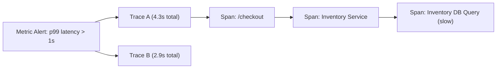
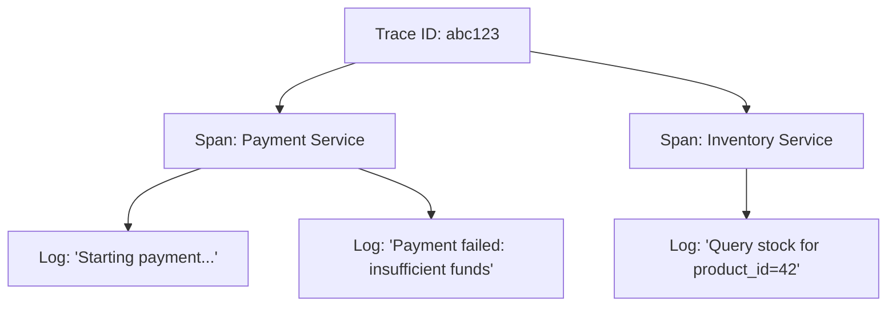
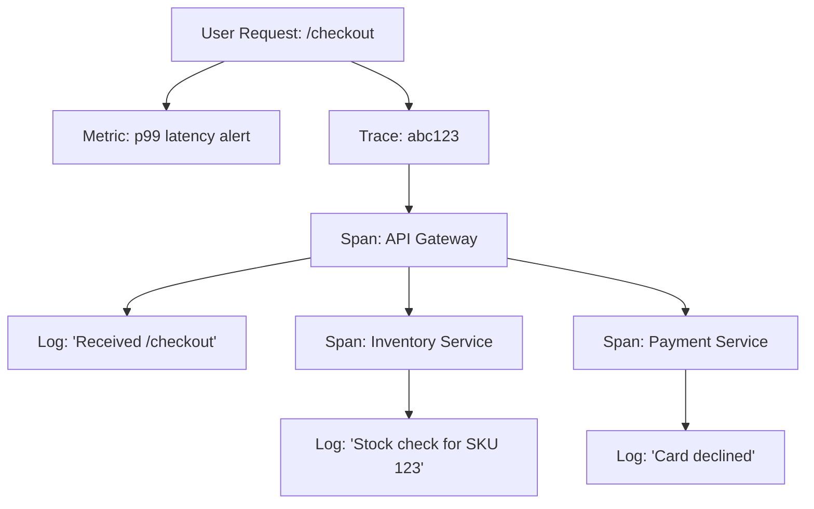

# 🔍 **How Tracing Complements Logs & Metrics**

> *“Metrics whisper, logs mumble, traces explain. And together? They sing observability harmony.” – Johan*

---

## 🧭 Introduction: Observability is a Team Sport

By now, you’ve explored the three pillars of observability:  
**Metrics, Logs, and now Traces**.

Each brings something essential to the table. But they don’t live in silos—at least not in any system worth trusting.

Think of them like three camera angles in a detective series:
- **Metrics**: The wide-angle time-lapse
- **Logs**: The close-up surveillance feed
- **Traces**: The re-enactment of the suspect’s path

Let’s break down how these perspectives work together—and why tracing doesn’t replace logs or metrics, but rather, completes them.

---

## 📊 Metrics: “What’s Happening at Scale?”

**Metrics** give you the **quantitative pulse** of your systems:
- p99 latency
- error rates
- request counts
- CPU utilization
- saturation levels

Metrics answer **“Is there a problem?”**

They’re aggregated, fast, and ideal for:
- Dashboards
- Alerts
- Trend analysis

---

### 🔍 But Metrics Don’t Tell You:  
- **Which request failed**
- **Where latency was introduced**
- **What the user experienced**

---

### 🧠 Example: Metric vs Trace

**Metric View** (Prometheus, Datadog):

```
http_request_duration_seconds_bucket{le="1",endpoint="/checkout"} 1340
http_request_duration_seconds_bucket{le="5",endpoint="/checkout"} 22
```

This tells you:
- Most requests to `/checkout` are fast
- Some (e.g., 22 of them) took longer than 1s

**But which 22? Why were they slow? Where did the time go?**  
That’s where tracing steps in.

---

> **Johan's Thought**  
> *“Metrics are the smoke alarm. Traces are the fire marshal’s report.”*

---

## 🪵 Logs: “What Happened, and When?”

**Logs** are:
- Point-in-time events
- Usually free-form (though structured logs are better)
- Ideal for forensic debugging

Logs tell you **“What just happened?”** or **“What failed?”**

---

### 📉 Their Weakness:
- Hard to correlate across services
- Context is often missing
- No built-in causality or structure

---

### 🔍 Example: Unlinked Logs

```json
{
  "timestamp": "2024-04-20T10:02:34Z",
  "level": "ERROR",
  "message": "Payment failed: insufficient funds"
}
```

What caused this error?  
Which request triggered it?  
Was it a retry? Part of a batch job?

Without a Trace ID, you’re in the dark.

---

## 🔗 Tracing: “Where Did the Time Go?”

Distributed tracing:
- Connects logs and metrics through context
- Adds **causality**, **timing**, and **flow**
- Tracks individual requests across service boundaries

It provides the **narrative**.

---

### 🔁 How Tracing Complements Metrics

| Metric | What It Tells You | What Trace Adds |
|--------|-------------------|-----------------|
| `p95 latency for /checkout is 3.2s` | A problem exists | Which requests were slow and where latency occurred |
| `error rate = 12%` | Something is failing | Which requests failed and what path they took |
| `5xx rate up` | Failures at service edge | Were those errors from DBs, timeouts, or downstream retries? |

---

### 📈 Mermaid Diagram – Metric to Trace Flow



---

### 🧠 Why This Matters for SREs

As an SRE, metrics help you **detect**, but traces help you **diagnose**:
- Correlate alerts to real causes
- Investigate service interactions
- Discover hidden delays or retries
- Feed postmortem timelines with request-level evidence

---

> **Johan’s Thought**  
> *“Imagine trying to solve a murder with just crime stats. That’s what debugging with only metrics feels like.”*

---

## 🔗 Tracing Complements Logs: Adding Context and Correlation

One of the most powerful integrations is:
- **Trace ID propagation into logs**
- **Log correlation inside spans**

This connects **unstructured log data** to the **structured causality of traces**.

---

### 🧾 Example: Logging with Trace Context

```json
{
  "timestamp": "2024-04-20T10:02:34Z",
  "trace_id": "abc123",
  "span_id": "def456",
  "level": "ERROR",
  "message": "Payment failed: insufficient funds"
}
```

Now:
- You can search logs **by trace ID**
- You can jump from trace UI **into the related logs**
- You can group logs **by operation** (span)

This allows:
- Easier incident root cause analysis
- Multi-service log stitching without guesswork
- Real-time correlation during on-call

---

### 📈 Mermaid Diagram – Trace → Logs Relationship



---

> **Johan’s Thought**  
> *“Trace IDs in logs are like breadcrumbs in a forest. Without them, you’re just wandering through stack traces hoping for a clue.”*

---

## 🧠 Putting It All Together: The Observability Trinity

### 🧱 Observability Pillars Recap

| Pillar | What It Does | Limitation |
|--------|---------------|------------|
| **Metrics** | Quantitative insight & alerting | No per-request context |
| **Logs** | Detailed event history | Lacks structure & flow |
| **Traces** | Request lifecycle & causality | High volume, slower to aggregate |

---

Together they answer:

| Question | Pillar |
|----------|--------|
| Is the system healthy? | **Metrics** |
| What exactly happened? | **Logs** |
| Why did it happen that way? | **Traces** |

---

### 📈 Mermaid Diagram – All Pillars Unified



---

## 🎯 SRE Use Cases – Why This Matters

### 1. **Smarter Alert Triage**
- Alert fires on `p99 latency`
- Jump to example traces (filtered by root span + duration)
- Find slow service (e.g., Inventory DB)
- Jump to related logs (Trace ID linked)

---

### 2. **Incident Investigations**
- Use trace to recreate request timeline
- Use span durations to pinpoint bottlenecks
- Use logs within spans to uncover misconfigurations or timeouts

---

### 3. **Postmortems**
- Extract trace diagrams for timeline evidence
- Measure time spent in impacted components
- Show actual impact on users via trace-linked errors

---

### 4. **SLO & Error Budget Policy**
- Use trace data for burn analysis:
  - “99% of `/checkout` should complete in under 500ms”
- View offending traces
- Prioritize remediation

---

> **Johan's Summary Thought**  
> *“Don’t just monitor your services—monitor your narratives. Metrics alert, logs explain, traces connect the dots.”*

---

## ✅ Summary

| Tool | Role | Tracing Adds |
|------|------|--------------|
| **Metrics** | Trend spotting, alerting | Request-level source of slowness |
| **Logs** | Event history | Context and correlation via Trace ID |
| **Traces** | Request journey | Bridges gaps, finds causes |

Together, they form a **complete observability practice**—especially critical for SREs managing **complex distributed environments**.
