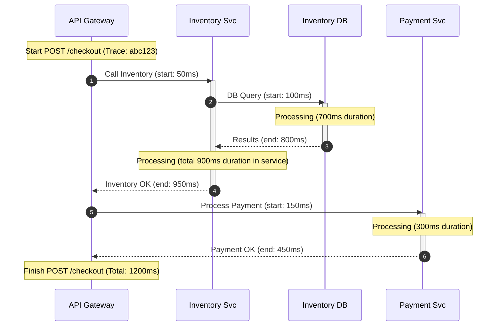
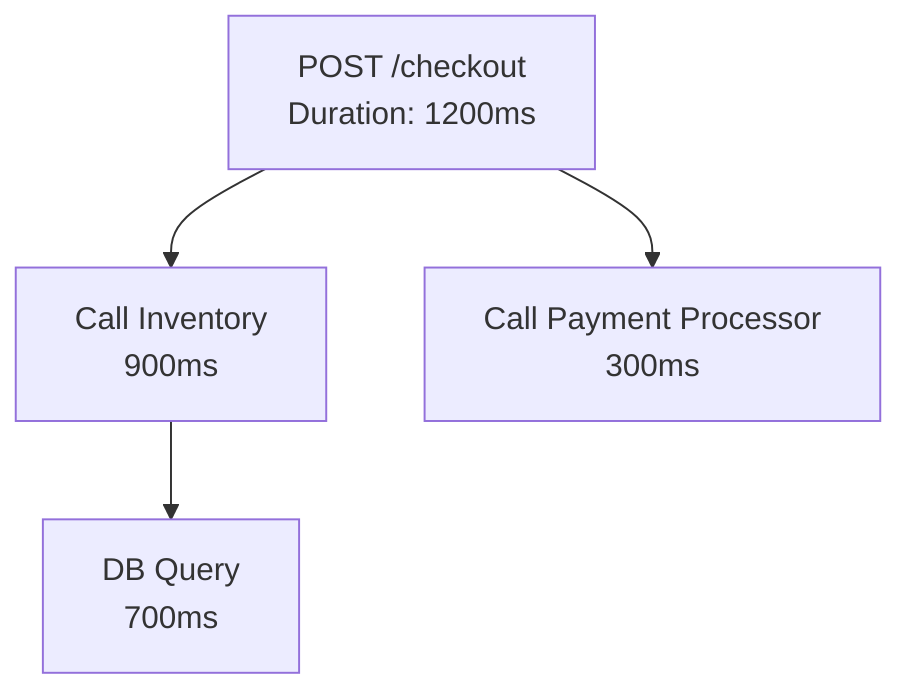
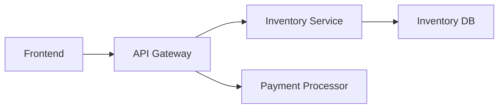

# 📊 **Visualizing Traces: Beyond the Waterfall**
*By Johan — your systems sleuth with a penchant for timelines and truth.*

---

> **Johan’s Thought**  
> *“If a request falls in production and no one visualizes its trace, does it make a ticket?”*

---

## 🧭 Introduction: Tracing Isn’t Just Data—It’s a Storyboard

You’ve learned what a trace is: a structured record of a request’s journey through your system. But data alone doesn’t help when you’re groggy at 3 a.m. and something’s paging you.

What you need is **a clear visual map**—a tool that turns spans and IDs into insight at a glance.

This section teaches how to read, interpret, and leverage trace visualizations as an SRE, even when time is tight and stakes are high.

---

## 🎬 The Problem with Gantt-Style Diagrams

Traditionally, trace UIs use **Gantt or Waterfall-style charts**, where:

- Each **row** is a span
- The **horizontal axis** shows duration over time
- **Indentation** represents parent-child relationships

But tools like Mermaid or markdown-rendered environments struggle to visualize very short durations in Gantt-style because:
- It’s not pixel-accurate
- Units like seconds or milliseconds are too granular

So, we’ll use alternative diagram styles better suited for our medium—and more effective for teaching.

---

## 🎯 Diagram Strategy: Visualize Causality, Flow, and Timing

Instead of raw Gantt charts, we’ll use:
- **Sequence diagrams** for time-ordered span flow
- **Flowcharts** for system architecture mapping
- **Tree graphs** for parent-child trace structure
- **Annotated span blocks** to show duration and order abstractly

Let’s walk through how each helps.

---

## 🔍 Understanding the Timeline View

### 🧠 The UI Basics

In most trace visualization tools (like Jaeger, Tempo, or Zipkin), you’ll see a **timeline view** like this:

- Root span on top
- Child spans nested below
- Horizontal bars indicating duration
- Vertical lines representing start time

The longer the bar, the more time that operation took.

### 🧾 Example JSON (Trace Summary)

```json
{
  "traceId": "abc123",
  "spans": [
    {
      "spanId": "s1",
      "name": "POST /checkout",
      "startTime": 1000,
      "duration": 1200,
      "service": "API Gateway"
    },
    {
      "spanId": "s2",
      "parentSpanId": "s1",
      "name": "Call Inventory",
      "startTime": 1050,
      "duration": 900,
      "service": "Inventory"
    },
    {
      "spanId": "s3",
      "parentSpanId": "s2",
      "name": "DB Query",
      "startTime": 1100,
      "duration": 700,
      "service": "Inventory DB"
    },
    {
      "spanId": "s4",
      "parentSpanId": "s1",
      "name": "Payment Processor",
      "startTime": 1150,
      "duration": 300,
      "service": "Payment"
    }
  ]
}
```

---

## 📈 Visual 1: Span Timeline with Sequence Diagram

This **sequence diagram** shows the order of service calls and helps illustrate **temporal overlap** and **causality**.


```asci
Trace: abc123 

| Start Time (ms) | Duration (ms) | Span / Service
-------------------------------------------------------------------------
  [    0          |     1200      | POST /checkout @ API Gateway        ]
  [    50         |      900      |  -> Call Inventory @ Inventory Svc  ] <-- Longest!
  [   100         |      700      |      -> DB Query @ Inventory DB     ]
  [   150         |      300      |  -> Payment Processor @ Payment Svc ]
```


🧠 **Read this like a trace waterfall:**
- Vertically: order of calls
- Horizontally: timeline from left to right
- Nesting: causality and async behavior

---

> **Johan’s Thought**  
> *“Sequence diagrams are the crime scene tapes of your observability. They show you who was where, when, and in what order.”*

---

## 🧱 Span Structure and Relationships

Understanding parent-child relationships is crucial for identifying performance bottlenecks or missing spans.

### 📈 Visual 2: Trace Tree with Flowchart



🧠 **Use this view to:**
- Visualize nesting
- Spot spans that **consume most of the total duration**
- Identify **parallel** vs. **sequential** operations

---

## 🔍 Interpreting Durations

Even if your trace UI shows spans visually, it’s easy to miss long sub-operations nested inside fast parents. Always ask:

- Which span consumed the **most time**?
- Was that time **expected**?
- Was it **waiting**, **retrying**, or **processing**?

---

> **Johan’s Thought**  
> *“Sometimes, your 200ms span hides 190ms of DB pain. Spans don’t lie, but they may withhold.”*

---

## 🗺️ Service Maps: The Bird’s Eye View

Many trace systems generate **service dependency maps** from trace data. These graphs show:

- Services as nodes
- Edges representing inter-service calls
- Labels showing latency or request volume

### 📈 Visual 3: Service Dependency Graph



This gives you:
- A self-updating **architecture diagram**
- Instant detection of **bottlenecks** and **missing links**
- Clarity on **upstream/downstream relationships**

🧠 Especially useful for:
- Onboarding new SREs
- Understanding blast radius
- Planning instrumentation coverage

---

## 🌐 OpenTelemetry: The Industry Standard

Let’s talk tooling.

**OpenTelemetry (OTel)** is the **vendor-neutral standard** for:
- Generating telemetry data (traces, metrics, logs)
- Exporting it to backends (e.g., Jaeger, Tempo, Honeycomb, Datadog)
- Unifying format and semantics

---

### 🔑 Why Standards Matter for SREs

- You can **instrument once**, export anywhere
- Avoid vendor lock-in
- Use **consistent data models** across teams and platforms
- It’s the foundation of a **composable observability pipeline**

---

### 🧾 OpenTelemetry Trace Example (Simplified JSON)

```json
{
  "traceId": "abc123",
  "spanId": "s1",
  "name": "POST /checkout",
  "startTime": "2024-04-20T10:00:00Z",
  "endTime": "2024-04-20T10:00:01.200Z",
  "attributes": {
    "service.name": "api-gateway",
    "http.method": "POST",
    "http.status_code": 200
  }
}
```

---

### 🔗 OTel + Visualization Flow

```mermaid
flowchart TD
    A[Application Code] --> B[OTel SDK]
    B --> C[Collector]
    C --> D[Trace Backend (e.g., Tempo)]
    D --> E[Trace UI]
```

---

> **Johan’s Thought**  
> *“OTel isn’t just a standard—it’s a survival guide for tracing in a polyglot, multi-cloud world.”*

---

## 🧠 What to Look For in a Trace UI

When viewing a trace, train your SRE eye to spot:

| Clue | Meaning |
|------|---------|
| Long child span | Latency likely hidden in that operation |
| Gaps between spans | Possible queuing or blocking |
| Many short spans | Fan-out patterns or retries |
| Missing spans | Bad instrumentation or context loss |
| Overlapping spans | Parallelism (or concurrency issues) |

---

## 🔎 SRE Use Cases

### 1. **Latency Root Cause**

> Trace shows 1200ms latency → DB query takes 950ms → Bottleneck found

### 2. **Service Ownership & Accountability**

> Service map shows unexpected dependencies → Start a conversation (or a war room)

### 3. **Instrumentation Gaps**

> Trace ends at API → No child spans → Add tracing to Inventory and Payments

### 4. **Load Testing Visual Feedback**

> Trace visualizations show timing under load → Detect asynchronous pressure points

### 5. **Error Triaging**

> Failed trace contains span-level error tags → Jump to relevant span, then linked logs

---

## ✅ Key Takeaways

| Concept | Why It Matters |
|--------|----------------|
| **Timeline View** | Lets you **spot bottlenecks** and **sequence** |
| **Span Relationships** | Show **causality** and **duration overlap** |
| **Service Maps** | Help understand **architecture and flow** |
| **OTel Standard** | Enables **portability** and **cross-team consistency** |
| **Visual Patterns** | Develop your SRE eye for **latency, failure, gaps** |

---

> **Johan’s Closing Thought**  
> *“You don’t debug services. You debug interactions. And trace visuals are how you finally *see* those interactions.”*
