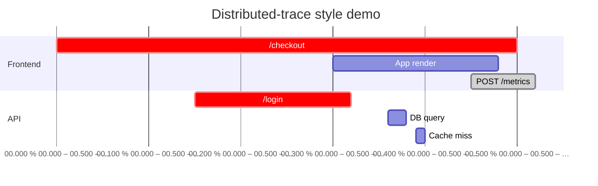

```mermaid
gantt
    title Distributed‑trace style demo
    dateFormat x
    axisFormat %S.%L         %% 00.000 – 00.500 – …
    tickInterval 100millisecond
    todayMarker off          %% keeps the red “today” line away
    section Frontend
    /checkout      :crit, 0, 500ms
    App render     : 300, 180ms
    POST /metrics  :done, 450, 70ms
    section API
    /login         :crit, 150, 170ms
    DB query       : 360, 20ms
    Cache miss     : 390, 10ms
```
