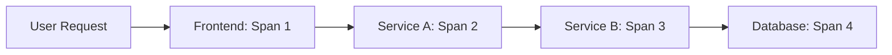
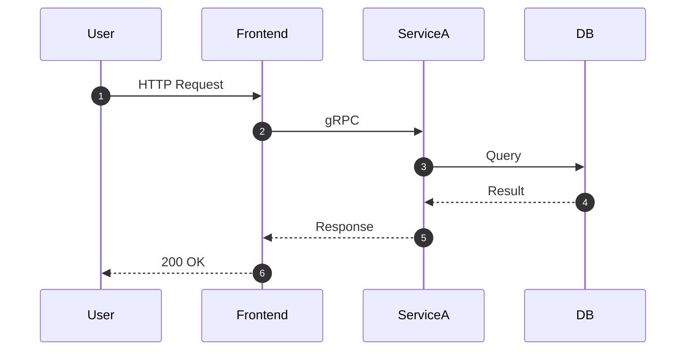
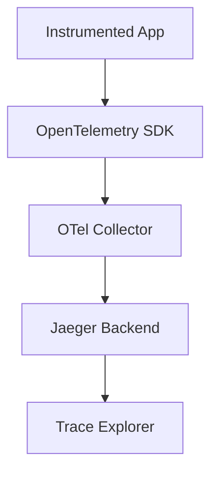

# 🧱 **Day 4: Distributed Tracing**

**Character:** Mina – Seoul  
**Style:** Methodical, calm, slightly eerie in how fast she finds root causes  
**Vibe:** “The trace will tell you everything, if you know how to listen.”

---

## 🎯 Learning Objectives

### 🔍 Beginner
- Understand what a trace is and what a span is  
- Learn how distributed tracing provides end-to-end visibility

### 🧩 Intermediate
- Implement basic tracing with OpenTelemetry concepts  
- Interpret trace waterfalls to diagnose performance bottlenecks

### 💡 SRE-Level
- Design scalable trace collection pipelines  
- Correlate trace data with logs and metrics to enable fast root cause analysis

---

## 💥 Incident Hook: “The Case of the Vanishing Millisecond”

> “Users were complaining: ‘the app feels slow’.  
> But logs? Clean. Metrics? Flat.  
> Until I pulled the trace. One service hop was adding 300ms randomly, only under load.  
> We found the exact downstream call and fixed the config.  
> Nobody had to guess.”

---

## 🧠 Core Concepts

### 🔹 What is Distributed Tracing?



- **Trace**: the entire journey  
- **Span**: each individual step  
- **Trace Context**: metadata that gets passed between services

---

### 🔹 Anatomy of a Trace



Trace ID ties all of this together.  
If one service doesn’t forward it → **broken trace**.

---

### 🔹 Tracing Pipeline Overview



No Jaeger required for this lesson—show a PNG trace waterfall or timeline.

---

## 🧪 Simulation Exercise

📦 You are given:
- A screenshot of a trace timeline (Jaeger-style)
- 5 spans:
    - Span 1: Frontend → Service A (50ms)
    - Span 2: Service A → Service B (800ms)
    - Span 3: Service B → Redis (12ms)
    - Span 4: Service A retry (600ms)
    - Span 5: Return path (total 1.6s)

📌 **Task:**
- Where’s the bottleneck?
- What’s being retried?
- Which service needs better instrumentation?

---

## 🛠 Tool Concepts (No Setup Required)

### Tracing via OpenTelemetry

#### Python (Conceptual):
```python
from opentelemetry import trace
from opentelemetry.sdk.trace import TracerProvider
from opentelemetry.instrumentation.flask import FlaskInstrumentor

# Setup
trace.set_tracer_provider(TracerProvider())
FlaskInstrumentor().instrument_app(app)

@app.route("/checkout")
def checkout():
    with trace.get_tracer(__name__).start_as_current_span("checkout-operation"):
        process_payment()
        return "ok"
```

- Adds trace ID + span ID  
- Sends data to OpenTelemetry collector

---

## 🕳️ Common Pitfalls

- Not forwarding headers (`traceparent`, `b3`) between services  
- Over-sampling → you miss rare but important traces  
- Not correlating traces with logs → hard to see *why* something’s slow  
- Missing instrumentation in key internal services

---

## 📜 Mina’s Commandments

1. “The trace is the autopsy report. Read it.”  
2. “If you drop the context, you drop the story.”  
3. “Latency hides in plain sight. The trace exposes it.”

---

## 🤝 Handoff to Tomorrow

> “You’ve seen the signals in isolation—metrics, logs, traces.  
> Tomorrow, Hector comes back to show you how to correlate them.  
> One incident. Three pillars. One story.”

---

## 📦 Artifacts for Day 4

- ✅ Mermaid diagrams:
    - Trace pipeline
    - Sequence diagram (trace spans)
    - Span-by-span visualization
- ✅ Python code example (OpenTelemetry SDK)
- ✅ PNG: Trace waterfall with simulated data
- ✅ Simulation scenario for bottleneck diagnosis
- ✅ Tiered objectives + pitfalls + commandments

