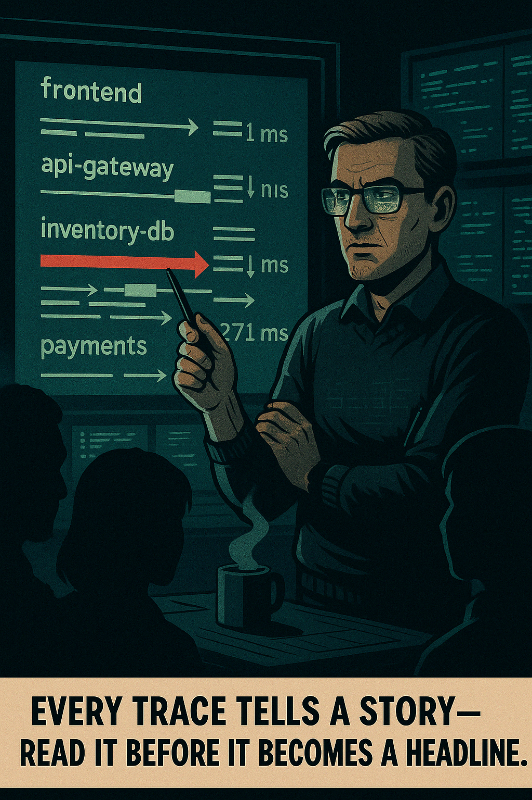

# 📘 **Day 4: Unraveling Requests with Distributed Tracing – Introduction**

---

## 🕵️ Scene 1: *The System That Whispers*

> **Panel Description (Comic Style):**  
A dimly lit control room. A wall of dashboards glows with p99s, error rates, and log streams. Johan stands to the side, arms crossed, one brow slightly raised. In the center, a glowing “unknown issue” alert pulses red, and yet all dashboards are green.

{width=500px}

---

> **🧠 Johan Thought Monologue:**  
> “Dashboards can lie. Well—mislead, at least. Aggregates are blunt tools. Logs tell you *what* happened. Metrics hint at *how often*. But they don’t always tell you *where it hurts*.”

---

For the last three days, you’ve been building your observability toolkit:

- **Metrics**: The heartbeat. Are things okay?
- **Logs**: The diary. What happened when?
- **But now… Traces**: The **detective story**. Who touched what, when, for how long, and why did it take so long?

---

### 📈 Mermaid Diagram – Observability Pillars

---

## ⏳ Scene 2: *The Request That Vanished*

> **Panel Description (Comic Style):**  
A zoomed-in noir-style trace waterfall graph. Dark background. One long red bar lags behind the others. Johan is pointing at it on a glowing wall, students silhouetted in front of him.

{width=450px}
---

A user reports that *checkouts are slow*. Metrics say CPU is fine. Logs don’t show any stack traces. But you feel it: the ghost in the system. You trace a request from the frontend to the backend. And there it is…

A 30-second wait in an **inventory microservice**, masked behind layers of fast API calls.

That’s the magic of distributed tracing. You don’t just see **what failed**, you see **where** it started… and **why** it spread.

---

### 📈 Mermaid Diagram – Anatomy of a Trace

---

> **🧠 Johan Thought Monologue:**  
> “Latency isn’t loud. It creeps. One slow dependency hidden inside five fast services—and suddenly, your whole system’s reputation tanks.”

---

## 🧠 Scene 3: *The Anatomy of a Trace*

> **Panel Description (Comic Style):**  
Zoomed-in cross section of a trace, each bar labeled: `frontend`, `api-gateway`, `inventory-db`, `payments`. Each bar has start and end times, nested spans.

{width=450px}

---

### ✨ Core Concepts

- **Trace** = The full journey of a request  
- **Span** = A single operation in that journey  
- **Parent/Child** = Relationship between spans  
- **Trace ID** = Connects all the spans together  
- **Duration** = How long each part of the journey takes

---

### 📈 Mermaid Diagram – Span Structure

---

> **🧠 Johan Thought Monologue:**  
> “You don’t always need 10,000 logs to find the bottleneck. You need one good trace. And enough structure to see where the slowness begins.”

---

## ⚙️ Scene 4: *Tracing vs Logs vs Metrics*

> **Panel Description (Comic Style):**  
A crime investigation board. On one side, stacked bar charts (metrics). In the middle, printed logs with timestamps. On the right, a big colorful trace waterfall. Johan is connecting strings across them.

{width=450px}
---

### 🧩 How Tracing Complements the Other Pillars

| Tool | Strength | Limitation |
|------|----------|------------|
| **Metrics** | Trends, alerts | No granularity or causality |
| **Logs** | Details, context | Hard to connect across services |
| **Traces** | Flow, causality, time | High cardinality, volume concerns |

> Tracing **connects the dots** between what you already know—and what’s still invisible.

---

> **🧠 Johan Thought Monologue:**  
> “Logs are like surveillance footage—every second caught. Metrics are statistics—averaged, charted. But traces… traces are the **eyewitness testimony**.”

---

## 🔍 Scene 5: *The Power of Visualization*

> **Panel Description (Comic Style):**  
An over-the-shoulder view of Johan looking at a service map auto-generated from trace data. Nodes, connections, latencies glowing in red/yellow. His face is lit by the screen.

{width=450px}

---

### Service Maps from Trace Data

Service dependency maps—drawn automatically from traces—reveal:

- Which services talk to which
- What the typical latency is between them
- What breaks when something else is slow

Tracing gives you a **real-time, self-updating architectural diagram**—drawn from actual usage.

---

### 📈 Mermaid Diagram – Service Map (Simplified)

---

> **🧠 Johan Thought Monologue:**  
> “Your architecture diagram from six months ago is nice. But this one is real. And it changes every time someone ships.”

---

## 🔚 Scene 6: *The Journey Begins*

> **Panel Description (Comic Style):**  
Final panel of the introduction. Johan steps forward, now facing the reader directly. His expression is calm but resolute, arms loosely crossed. Behind him, the background fades into a deep noir shadow, with one glowing trace line cutting through the darkness. The trace line forms a winding path, symbolizing the journey of a request through a system.

{width=500px}

In the next sections, we’ll dive deeper:

- How traces are generated (instrumentation)
- How spans propagate through systems
- How to analyze and optimize with traces
- And how tracing connects back to your SLOs

But for now?

Just remember this:

---

> **🧠 Johan Closing Monologue:**  
> “Every request leaves a trail. The real trick is learning how to follow it—before it becomes a page at 3 a.m.”

---

✅ **End of Introduction**
