# 1️⃣ Intro – The Firehose of Logs

> Johan overwhelmed by noisy dashboards

---

### Scene Description

A calm scene. Johan stands at the front of a small SRE onboarding session. A whiteboard behind him shows a simplified diagram of logs, metrics, traces, and audit flows. Three junior SREs sit at desks—one of them is Maya, now more confident. Sunlight filters in through a window. It’s a rare moment of peace.

---

<table>
  <tr>
    <td style="width: 50%; vertical-align: top; padding-right: 16px;">
      <strong>🎯 Learning Objective</strong> Understand that logging maturity includes knowledge transfer—how SREs mentor others using shared experiences and structured observability principles.  
      <strong>✅ Takeaway</strong> Building systems is half the battle. Sharing why they work (or fail) is how you scale reliability. Teaching observability transforms good engineers into resilient teams.
    </td>
    <td style="width: 50%;">
      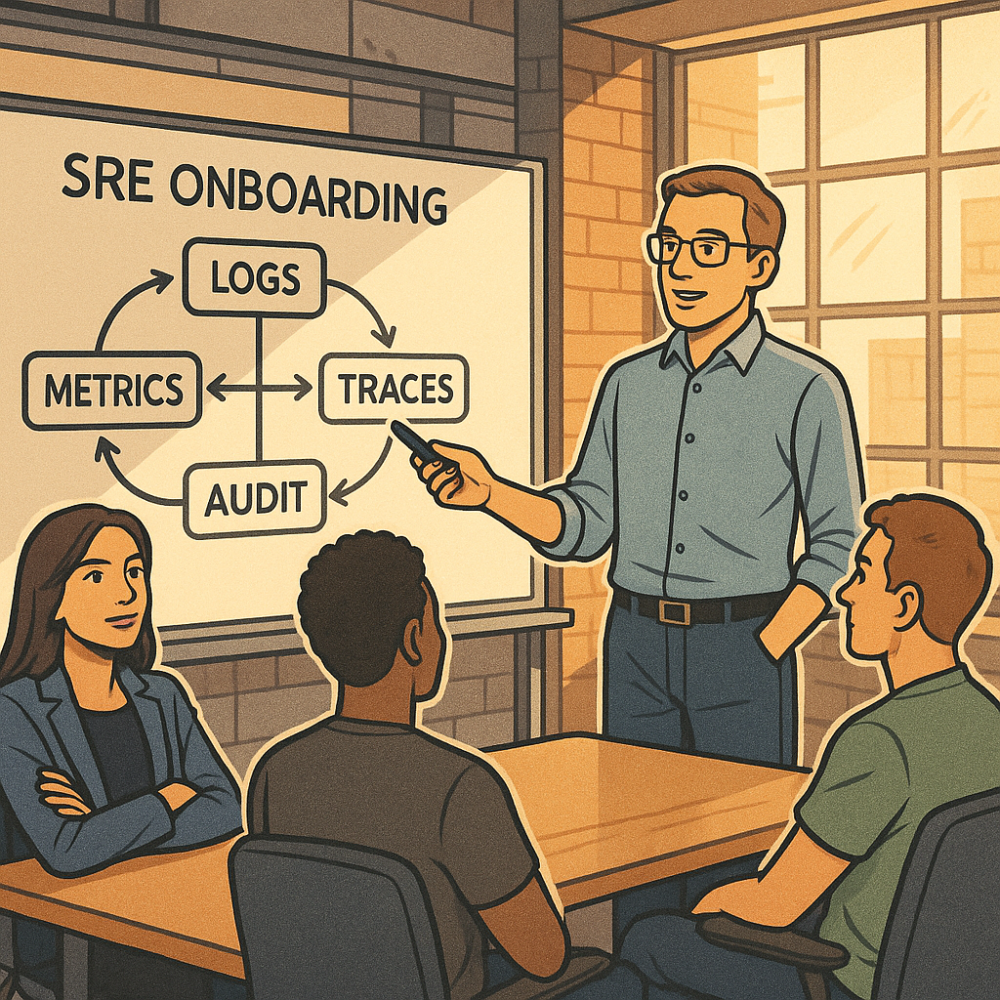
    </td>
  </tr>
</table>

---

### Thoughts (Character Internal Dialogue)

- **Johan:** "We logged our mistakes. Now we pass on the lessons."
- **Maya:** "It finally makes sense. And now I get to help others see it too."

---

### Monologue (Narrative or Insight)

> Great observability isn’t just tooling—it’s teaching. You don’t just build a better system. You grow better people who can run it, understand it, and improve it.

---

## Panel 2: From Chaos to Clarity

---

### Scene Description

A quiet montage-style panel. Four snapshots arranged in sequence: 1) the firehose of early logs, 2) Johan debugging with trace IDs, 3) Maya configuring a redaction rule, 4) the team passing an audit with clean logs. The journey is shown not with words, but moments.

---

<table>
  <tr>
    <td style="width: 50%; vertical-align: top; padding-right: 16px;">
      <strong>🎯 Learning Objective</strong> Recognize the stages of logging maturity through the lens of real-world growth—moving from raw volume and reactivity to structured, secure, and strategic observability.  
      <strong>✅ Takeaway</strong> Logging isn’t static—it evolves with the system and the team. From flood to focus, maturity is marked by structure, traceability, and responsible access.
    </td>
    <td style="width: 50%;">
      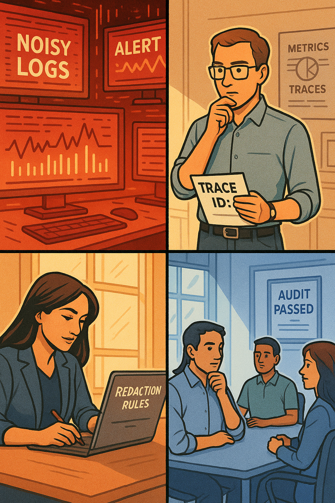
    </td>
  </tr>
</table>
---

### Thoughts (Character Internal Dialogue)

- **Johan:** "The system didn’t just evolve. We did."

---

### Monologue (Narrative or Insight)

> Good logging isn’t the end goal. It’s the path to insight, stability, and shared ownership. From chaos to clarity—that’s the arc of every great SRE story.

---

## Panel 3: The Next Shift Begins

---

### Scene Description

The SRE team room at dusk. Screens are calm. No alerts are firing. Johan is packing up for the day. Maya is explaining something to one of the new hires, who is now seated at the terminal. The torch has been passed.

---

<table>
  <tr>
    <td style="width: 50%; vertical-align: top; padding-right: 16px;">
      <strong>🎯 Learning Objective</strong> Reinforce how sustainable reliability is not just built on technology, but on mentorship, shared practices, and calm, human-centric operations.  
      <strong>✅ Takeaway</strong> Tools change, dashboards quiet, but reliability lives on through knowledge transfer. Good observability outlasts individuals because it’s built into the team’s habits.
    </td>
    <td style="width: 50%;">
      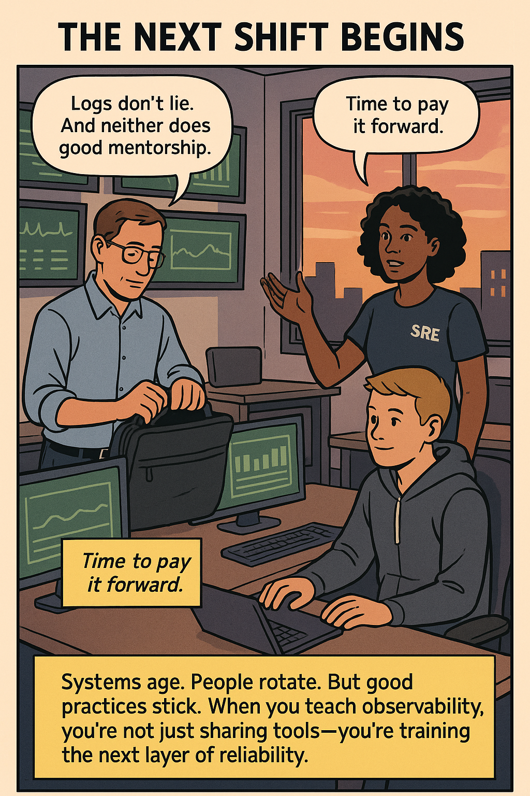
    </td>
  </tr>
</table>

---

### Thoughts (Character Internal Dialogue)

- **Johan:** "Logs don’t lie. And neither does good mentorship."
- **Maya:** "Time to pay it forward."

---

### Monologue (Narrative or Insight)

> Systems age. People rotate. But good practices stick. When you teach observability, you’re not just sharing tools—you’re training the next layer of reliability.

---

# Log Levels & Filtering

---

### Panel 4: The Debug Avalanche

---

### Scene Description

Johan is reviewing logs with a junior SRE named Maya. They’re standing next to a projected terminal wall full of `DEBUG` logs: memory allocations, loop counters, and verbose application state dumps. Maya looks puzzled. Johan, holding a coffee, squints at the flood of irrelevant output.

---

<table>
  <tr>
    <td style="width: 50%; vertical-align: top; padding-right: 16px;">
      <strong>🎯 Learning Objective</strong> Understand the risks of leaving verbose logging (especially DEBUG) active in production and how it impacts observability quality and operational cost.  
      <strong>✅ Takeaway</strong> Use log levels intentionally. DEBUG should be reserved for deep diagnostics in dev or controlled troubleshooting—not for steady-state production.
    </td>
    <td style="width: 50%;">
      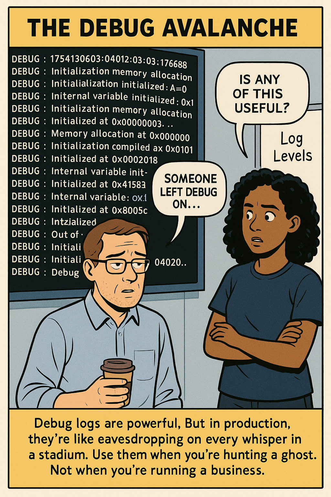
    </td>
  </tr>
</table>

---

### Thoughts (Character Internal Dialogue)

- **Johan:** "Someone left debug on… again."
- **Maya:** "Is any of this useful?"

---

### Monologue (Narrative or Insight)

> Debug logs are powerful. But in production, they’re like eavesdropping on every whisper in a stadium. Use them when you're hunting a ghost. Not when you're running a business.

---

### Panel 5: The Log Level Fix

---

### Scene Description

Johan is configuring a log agent (Fluent Bit or Logstash) on a terminal. He types in a filter rule to drop all DEBUG logs unless explicitly enabled. Maya watches, notebook in hand. The terminal now shows fewer logs—only INFO, WARN, and ERROR entries.

---

<table>
  <tr>
    <td style="width: 50%; vertical-align: top; padding-right: 16px;">
      <strong>🎯 Learning Objective</strong> Learn how to use logging agents (e.g., Fluent Bit, Logstash) to suppress noisy logs before they’re ingested or indexed, reducing cost and improving signal-to-noise ratio.  
      <strong>✅ Takeaway</strong> Logging agents are your first line of observability hygiene. Filter logs early to avoid paying to store and search the irrelevant.
    </td>
    <td style="width: 50%;">
      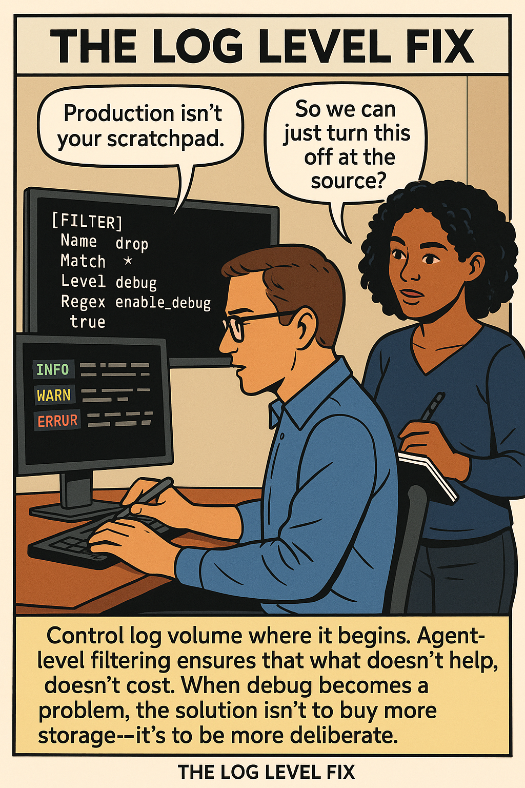
    </td>
  </tr>
</table>

---

### Thoughts (Character Internal Dialogue)

- **Johan:** "Production isn’t your scratchpad."
- **Maya:** "So we can just turn this off at the source?"

---

### Monologue (Narrative or Insight)

> Control log volume where it begins. Agent-level filtering ensures that what doesn’t help, doesn’t cost. When debug becomes a problem, the solution isn’t to buy more storage—it’s to be more deliberate.

---

### Panel 6: Levels of Awareness

---

### Scene Description

Split-panel: Left side shows a service emitting DEBUG and INFO logs, completely filling a log viewer. Right side shows the same service with WARN and ERROR logs only—fewer but more actionable entries. A caption compares the two.

---

<table>
  <tr>
    <td style="width: 50%; vertical-align: top; padding-right: 16px;">
      <strong>🎯 Learning Objective</strong> Visually compare unfiltered vs. well-scoped logging and grasp the value of logging severity levels for operational triage.  
      <strong>✅ Takeaway</strong> Properly leveled and filtered logs prioritize attention. In incident response, clarity beats completeness every time.
    </td>
    <td style="width: 50%;">
      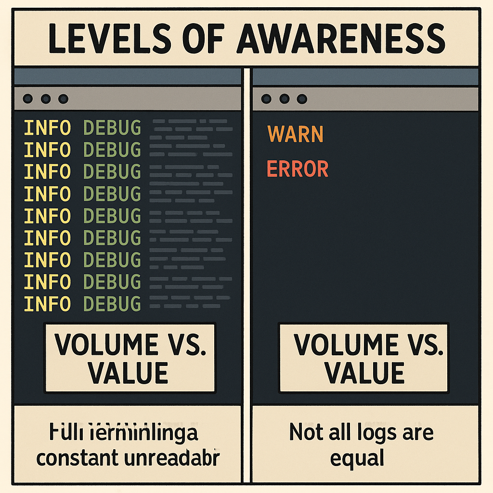
    </td>
  </tr>
</table>

---

### Thoughts (Character Internal Dialogue)

- **Johan:** "Now that’s something I’d alert on."

---

### Monologue (Narrative or Insight)

> Not all logs are equal. Structure and severity should work together to guide attention. Observability is knowing which whisper matters—and when to listen.

---

# Sampling & Storage Strategy

---

### Panel 7: The Cost Wall

---

### Scene Description

Johan and Maya are standing in front of a digital whiteboard. A bar chart shows log ingestion costs over time. The DEBUG and INFO sections are massive. Red alert banners say “Monthly Log Budget Exceeded.” Maya’s eyes widen in disbelief. Johan’s arms are crossed, expression calm but stern.

---

<table>
  <tr>
    <td style="width: 50%; vertical-align: top; padding-right: 16px;">
      <strong>🎯 Learning Objective</strong> Understand how unfiltered logs—especially low-value DEBUG and INFO logs—can lead to excessive operational costs across storage, indexing, and analysis pipelines.  
      <strong>✅ Takeaway</strong> Every log has a cost. If you don’t control what you collect, you’re not managing observability—you’re sponsoring chaos on a budget.
    </td>
    <td style="width: 50%;">
      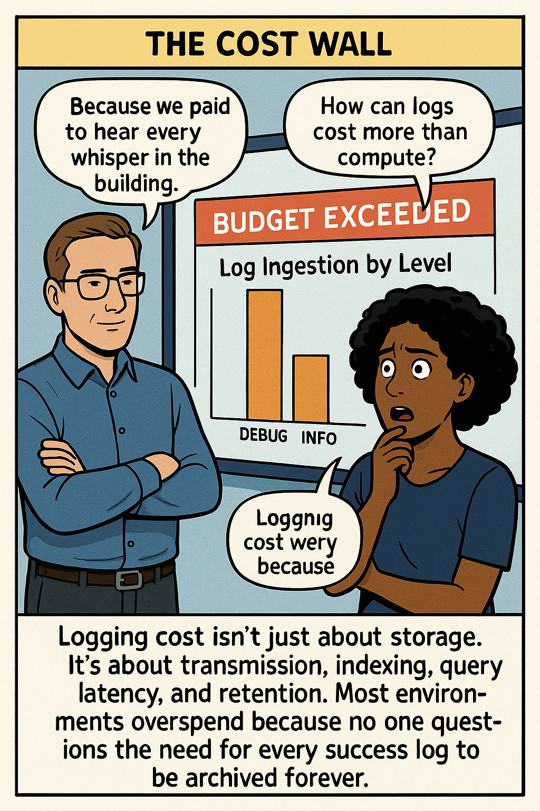
    </td>
  </tr>
</table>

---

### Thoughts (Character Internal Dialogue)

- **Maya:** "How can logs cost more than compute?"
- **Johan:** "Because we paid to hear every whisper in the building."

---

### Monologue (Narrative or Insight)

> Logging cost isn’t just about storage. It’s about transmission, indexing, query latency, and retention. Most environments overspend because no one questions the need for every success log to be archived forever.

---

### Panel 8: Sampling in Action

---

### Scene Description

Close-up of a terminal or config editor. Johan is typing a log sampling rule: keeping 100% of 5xx logs, but only 10% of 200 OKs. A sample log stream on the right shows only occasional 200s now, while every 500 is retained.

---

<table>
  <tr>
    <td style="width: 50%; vertical-align: top; padding-right: 16px;">
      <strong>🎯 Learning Objective</strong> Learn how to apply log sampling strategies that retain critical error logs while reducing high-volume, low-value logs like routine successes.  
      <strong>✅ Takeaway</strong> Sampling keeps insight and drops noise. You don’t need to log every successful request—but you should log every failure.
    </td>
    <td style="width: 50%;">
      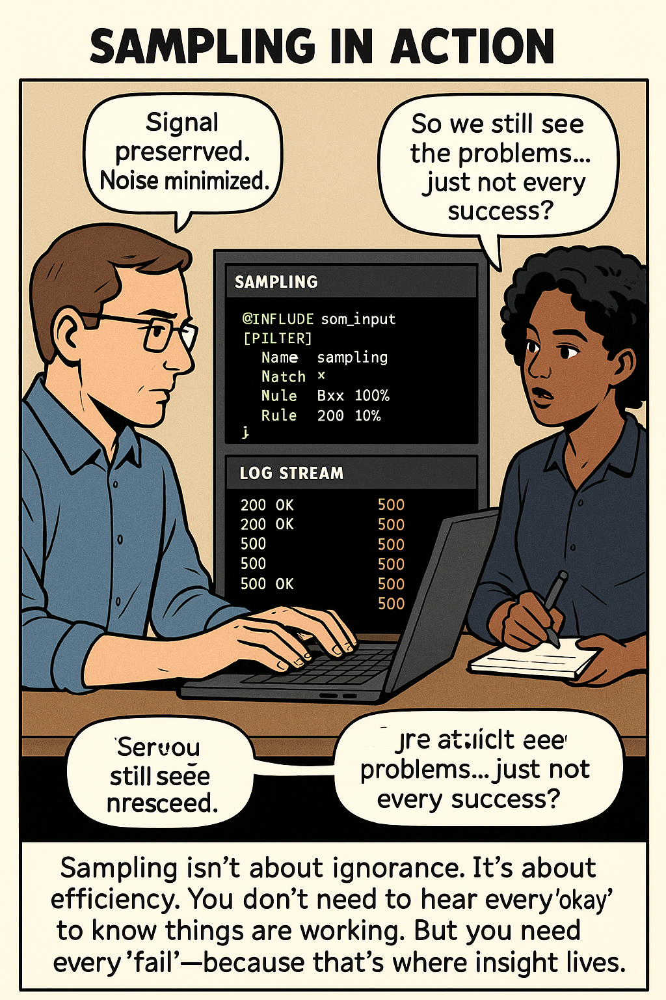
    </td>
  </tr>
</table>

---

### Thoughts (Character Internal Dialogue)

- **Johan:** "Signal preserved. Noise minimized."
- **Maya:** "So we still see the problems... just not every success?"

---

### Monologue (Narrative or Insight)

> Sampling isn’t about ignorance. It’s about efficiency. You don’t need to hear every ‘okay’ to know things are working. But you need every ‘fail’—because that’s where insight lives.

---

### Panel 9: Retention Tiers Visualized

---

### Scene Description

Side-view panel of a log data center. Logs flow through pipes labeled HOT → COLD → ARCHIVE. Each tier has Johan walking past with a clipboard, explaining to Maya which logs go where. The HOT tier glows with active alerts. The COLD tier is dimmer. The ARCHIVE is deep and dark.

---

<table>
  <tr>
    <td style="width: 50%; vertical-align: top; padding-right: 16px;">
      <strong>🎯 Learning Objective</strong> Grasp the purpose of hot, cold, and archived log tiers and how they align with different operational and compliance needs.  
      <strong>✅ Takeaway</strong> Store logs where they belong. Use hot tiers for high-value, short-term insights, and shift archival logs to cheaper storage. Observability and cost control go hand-in-hand.
    </td>
    <td style="width: 50%;">
      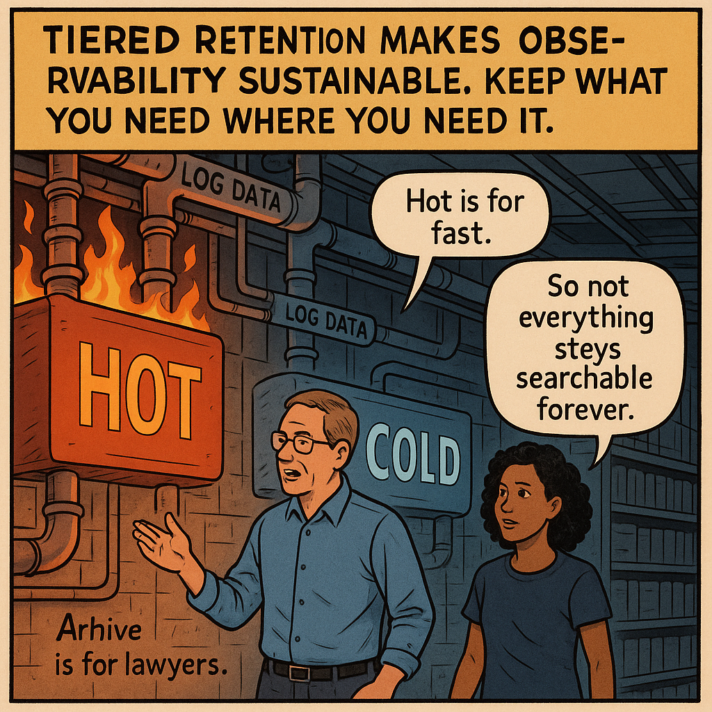
    </td>
  </tr>
</table>

---

### Thoughts (Character Internal Dialogue)

- **Johan:** "Hot is for fast. Cold is for cheap. Archive is for lawyers."
- **Maya:** "So not everything stays searchable forever."

---

### Monologue (Narrative or Insight)

> Tiered retention makes observability sustainable. Keep what you need where you need it. Logs should age gracefully—just like infrastructure.

---

# Trace ID & Correlation

---

### Panel 10: One Request, Many Logs

---

### Scene Description

Johan and Maya stand in front of a timeline-based log viewer. The screen is split: three different services (auth, checkout, payments) are emitting logs. Each service logs a line with the same `trace_id`. Johan is tracing the logs with his finger across the timeline, showing how the services connect.

---

<table>
  <tr>
    <td style="width: 50%; vertical-align: top; padding-right: 16px;">
      <strong>🎯 Learning Objective</strong> Understand how a shared trace_id connects logs across microservices, enabling unified visibility into a single request’s journey.  
      <strong>✅ Takeaway</strong> Without a trace_id, you're reading isolated sentences. With it, you're reading a full chapter. Correlation turns log lines into a narrative.
    </td>
    <td style="width: 50%;">
      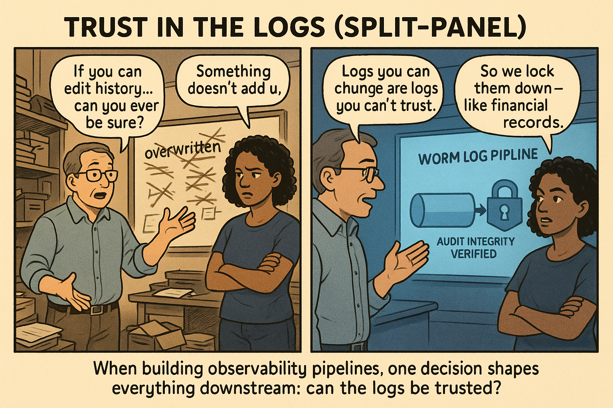
    </td>
  </tr>
</table>

---

### Thoughts (Character Internal Dialogue)

- **Johan:** "Every log tells part of the story. The trace_id tells you they’re in the same chapter."
- **Maya:** "So that’s how you tell the full journey of a request."

---

### Monologue (Narrative or Insight)

> Correlation turns isolated facts into a narrative. When each service adds trace_id, your logs become part of a timeline—not a stack of receipts.

---

### Panel 11: The Span Tree Revealed

---

### Scene Description

A span tree is shown on a large screen. Each node (span) represents a request: root span at the top, with branches for service calls and database queries. Johan explains how each span connects with a parent and how duration is tracked. Maya holds a tablet showing the same trace in a viewer like Jaeger or Tempo.

---

<table>
  <tr>
    <td style="width: 50%; vertical-align: top; padding-right: 16px;">
      <strong>🎯 Learning Objective</strong> Learn how spans represent time-scoped units of work within a trace and how visualizing them as a tree reveals where latency lives.  
      <strong>✅ Takeaway</strong> Spans show structure. A trace without spans is like a recipe without steps—you need both timing and causality to find performance issues.
    </td>
    <td style="width: 50%;">
      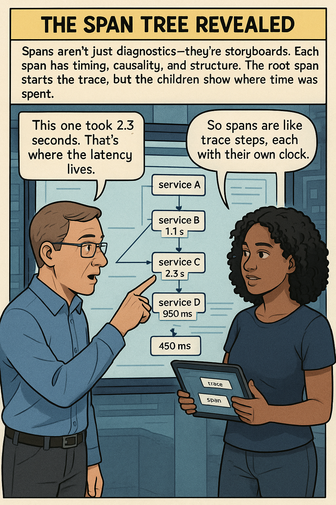
    </td>
  </tr>
</table>

---

### Thoughts (Character Internal Dialogue)

- **Johan:** "This one took 2.3 seconds. That’s where the latency lives."
- **Maya:** "So spans are like trace steps, each with their own clock."

---

### Monologue (Narrative or Insight)

> Spans aren’t just diagnostics—they’re storyboards. Each span has timing, causality, and structure. The root span starts the trace, but the children show where time was spent.

---

### Panel 12: Trace ID Saves the Day

---

### Scene Description

The scene transitions to a war room during an incident. Multiple engineers look at dashboards and logs. Johan calmly enters and pastes a `trace_id` into a tracing UI. The whole trace loads—spanning frontend to payment gateway. Everyone leans in as the root cause is revealed in a failing downstream span.

---

<table>
  <tr>
    <td style="width: 50%; vertical-align: top; padding-right: 16px;">
      <strong>🎯 Learning Objective</strong> See how tracing enables fast incident resolution by eliminating guesswork, surfacing root causes, and showing cross-service dependencies.  
      <strong>✅ Takeaway</strong> When logs and metrics fail to explain "why," tracing shows "how." In an incident, it’s your truth source from user to database.
    </td>
    <td style="width: 50%;">
      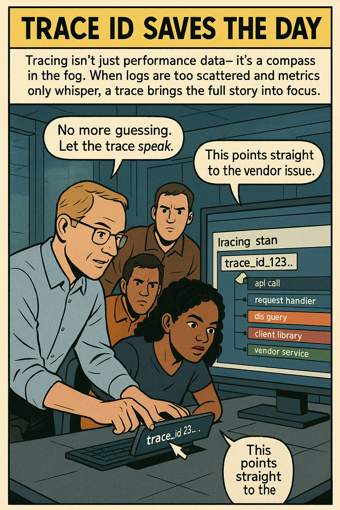
    </td>
  </tr>
</table>

---

### Thoughts (Character Internal Dialogue)

- **Johan:** "No more guessing. Let the trace speak."
- **Team Member:** "This points straight to the vendor issue."

---

### Monologue (Narrative or Insight)

> Tracing isn’t just performance data—it’s a compass in the fog. When logs are too scattered and metrics only whisper, a trace brings the full story into focus.

---

# From Metrics to Logs to Traces

---

### Panel 13: The Metric Spike

---

### Scene Description

A Grafana dashboard on a large monitor shows a sudden spike in the `p95 latency` for the `checkout` service. Johan and Maya are looking at it, both frowning. The panel is colored red with an alert banner: “Latency SLO breached.” Johan’s finger hovers over the spike.

---

<table>
  <tr>
    <td style="width: 50%; vertical-align: top; padding-right: 16px;">
      <strong>🎯 Learning Objective</strong> Understand how metrics serve as high-level indicators that signal something is wrong—but often lack the context needed to diagnose the root cause.  
      <strong>✅ Takeaway</strong> Metrics tell you something broke. But to know what broke and why, you need to go deeper—into logs and traces.
    </td>
    <td style="width: 50%;">
      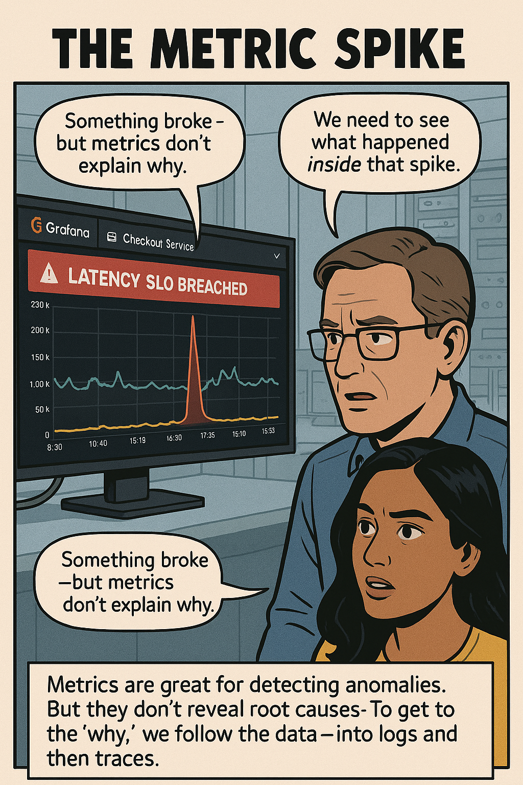
    </td>
  </tr>
</table>

---

### Thoughts (Character Internal Dialogue)

- **Johan:** "Something broke—but metrics don’t explain why."
- **Maya:** "We need to see what happened *inside* that spike."

---

### Monologue (Narrative or Insight)

> Metrics are great for detecting anomalies. But they don’t reveal root causes. To get to the ‘why,’ we follow the data—into logs and then traces.

---

### Panel 14: Log Timeline Dive

---

### Scene Description

Johan and Maya query logs around the spike window. The screen now shows structured logs for the `checkout` service—timestamped `ERROR` entries, warnings, and one key log that contains a `trace_id`. Johan points at it. Maya copies it.

---

<table>
  <tr>
    <td style="width: 50%; vertical-align: top; padding-right: 16px;">
      <strong>🎯 Learning Objective</strong> Learn how to correlate logs with a time range and extract a trace_id that can be used to pivot into a distributed trace view.  
      <strong>✅ Takeaway</strong> Logs give you the clues. If structured well, they hand you the key (trace_id) to follow the request upstream and downstream.
    </td>
    <td style="width: 50%;">
      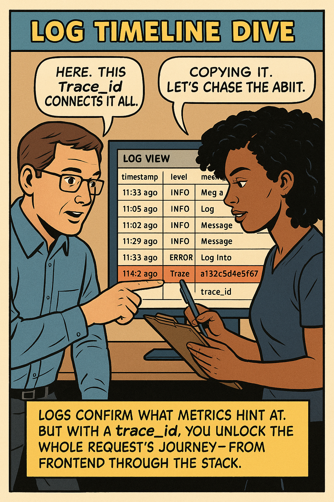
    </td>
  </tr>
</table>

---

### Thoughts (Character Internal Dialogue)

- **Johan:** "Here. This trace_id connects it all."
- **Maya:** "Copying it. Let’s chase the rabbit."

---

### Monologue (Narrative or Insight)

> Logs confirm what metrics hint at. But with a trace_id, you unlock the whole request’s journey—from frontend through the stack.

---

### Panel 15: Trace Brings It Home

---

### Scene Description

The trace is now loaded on a big screen. It shows a waterfall diagram: frontend → API → checkout → payments. One span (payment) is clearly delayed. Johan circles it with a laser pointer. Maya looks satisfied.

---

<table>
  <tr>
    <td style="width: 50%; vertical-align: top; padding-right: 16px;">
      <strong>🎯 Learning Objective</strong> See how a distributed trace pinpoints a latency bottleneck by showing the precise span or service where time was lost.  
      <strong>✅ Takeaway</strong> Traces reveal what metrics and logs only hint at: the precise span, service, and operation responsible for a degraded experience.
    </td>
    <td style="width: 50%;">
      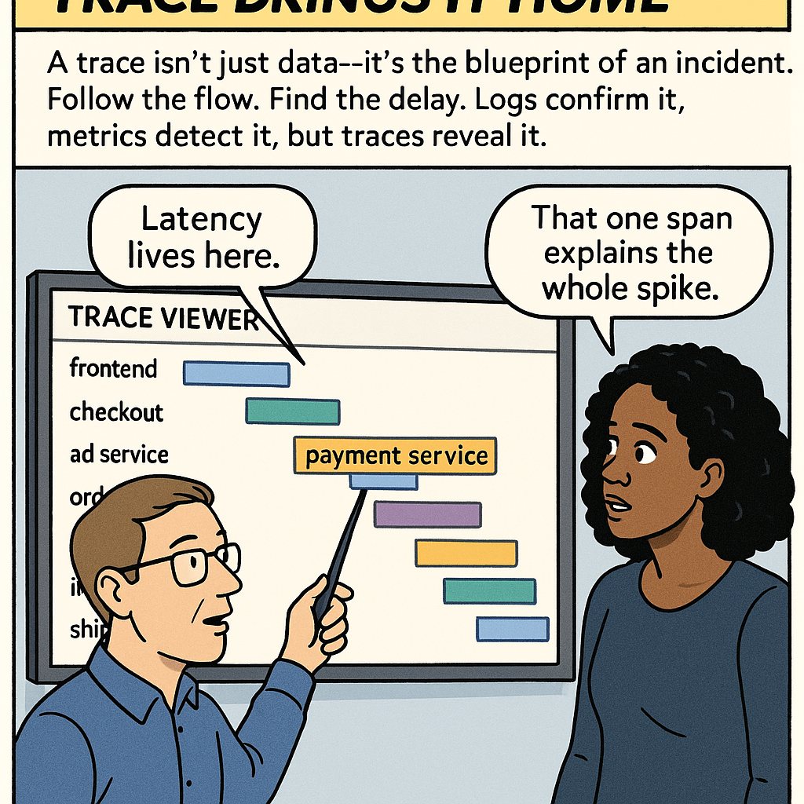
    </td>
  </tr>
</table>

---

### Thoughts (Character Internal Dialogue)

- **Johan:** "Latency lives here."
- **Maya:** "That one span explains the whole spike."

---

### Monologue (Narrative or Insight)

> A trace isn’t just data—it’s the blueprint of an incident. Follow the flow. Find the delay. Logs confirm it, metrics detect it, but traces reveal it.

---

# Security & Compliance

---

### Panel 16: The Log That Shouldn’t Exist

---

### Scene Description

Johan and Maya are reviewing a log stream during a peer review. Maya scrolls and suddenly freezes. A log line shows a full email and password combination in plaintext. Johan’s eyes narrow. The room seems to go cold for a second.

---

<table>
  <tr>
    <td style="width: 50%; vertical-align: top; padding-right: 16px;">
      <strong>🎯 Learning Objective</strong> Understand the risk of logging sensitive data such as passwords, tokens, or PII, and why logs must be treated as part of your security surface.  
      <strong>✅ Takeaway</strong> Logging is not exempt from security best practices. Every log line should be safe enough to share—and secure enough not to.
    </td>
    <td style="width: 50%;">
      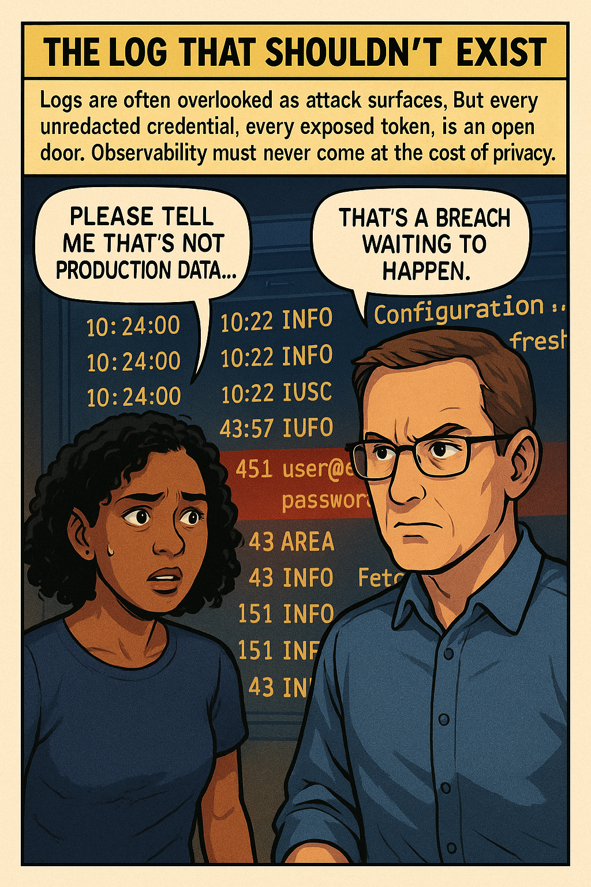
    </td>
  </tr>
</table>

---

### Thoughts (Character Internal Dialogue)

- **Maya:** "Please tell me that’s not production data…"
- **Johan:** "That’s a breach waiting to happen."

---

### Monologue (Narrative or Insight)

> Logs are often overlooked as attack surfaces. But every unredacted credential, every exposed token, is an open door. Observability must never come at the cost of privacy.

---

### Panel 17: Redaction in Practice

---

### Scene Description

A configuration screen shows a redaction rule being applied: masking passwords and API keys from logs. Johan types a Lua script or regex into a Fluent Bit filter config. Maya watches the log stream refresh, now showing `[REDACTED]` where the password was.

---

<table>
  <tr>
    <td style="width: 50%; vertical-align: top; padding-right: 16px;">
      <strong>🎯 Learning Objective</strong> Learn how to apply redaction rules in log shippers (e.g., Fluent Bit, Logstash) to prevent sensitive data from entering storage or being indexed.  
      <strong>✅ Takeaway</strong> Don’t patch logs after the fact—protect them at the edge. Redaction is security by design, not by regret.
    </td>
    <td style="width: 50%;">
      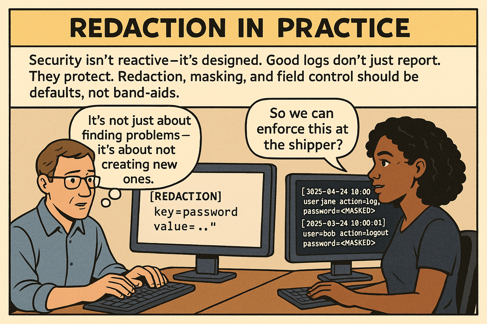
    </td>
  </tr>
</table>

---

### Thoughts (Character Internal Dialogue)

- **Johan:** "It’s not just about finding problems—it’s about not creating new ones."
- **Maya:** "So we can enforce this at the shipper?"

---

### Monologue (Narrative or Insight)

> Security isn’t reactive—it’s designed. Good logs don’t just report. They protect. Redaction, masking, and field control should be defaults, not band-aids.

---

### Panel 18: The Audit That Passed

---

### Scene Description

Several weeks later, Johan and Maya are sitting in a meeting room. An auditor or compliance officer is reviewing structured audit logs on a secure terminal. The logs are clear, anonymized, and timestamped. A green check appears on-screen. Maya smiles. Johan, for once, relaxes in his chair.

---

<table>
  <tr>
    <td style="width: 50%; vertical-align: top; padding-right: 16px;">
      <strong>🎯 Learning Objective</strong> Grasp the importance of structured, compliant, and privacy-conscious logging in passing audits and building trust with stakeholders.  
      <strong>✅ Takeaway</strong> Compliant logs are clean, clear, and intentional. They show what happened—without exposing who it happened to.
    </td>
    <td style="width: 50%;">
      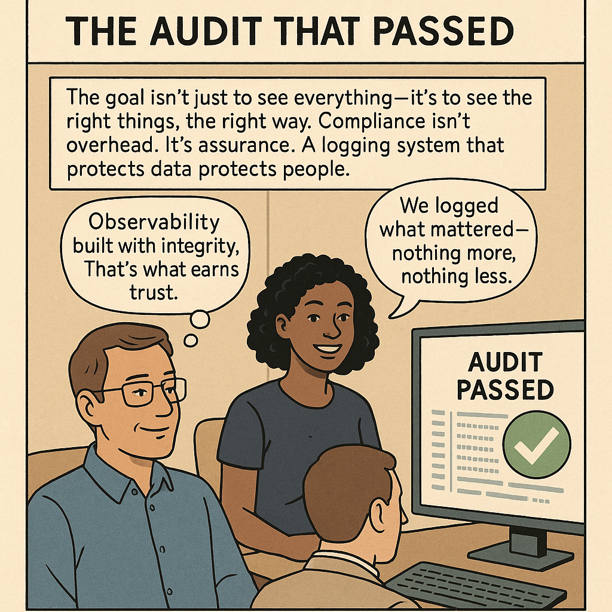
    </td>
  </tr>
</table>

---

### Thoughts (Character Internal Dialogue)

- **Johan:** "Observability built with integrity. That’s what earns trust."
- **Maya:** "We logged what mattered—nothing more, nothing less."

---

### Monologue (Narrative or Insight)

> The goal isn’t just to see everything—it’s to see the right things, the right way. Compliance isn’t overhead. It’s assurance. A logging system that protects data protects people.

---

# Audit Logging

---

### Panel 19: Who Changed What?

---

### Scene Description

Johan and Maya are investigating a permissions issue. Maya is standing at a terminal, reviewing logs that say “role updated,” “user added,” and “admin privileges granted.” Johan stands behind her, pointing to a timestamped audit log that includes `actor_id`, `action`, and `target_user`.

---

<table>
  <tr>
    <td style="width: 50%; vertical-align: top; padding-right: 16px;">
      <strong>🎯 Learning Objective</strong> Understand the purpose of audit logs in tracking changes to critical systems—capturing who did what, when, and where.  
      <strong>✅ Takeaway</strong> Audit logs turn questions into answers. They're your paper trail for operational accountability, not a search party after the fact.
    </td>
    <td style="width: 50%;">
      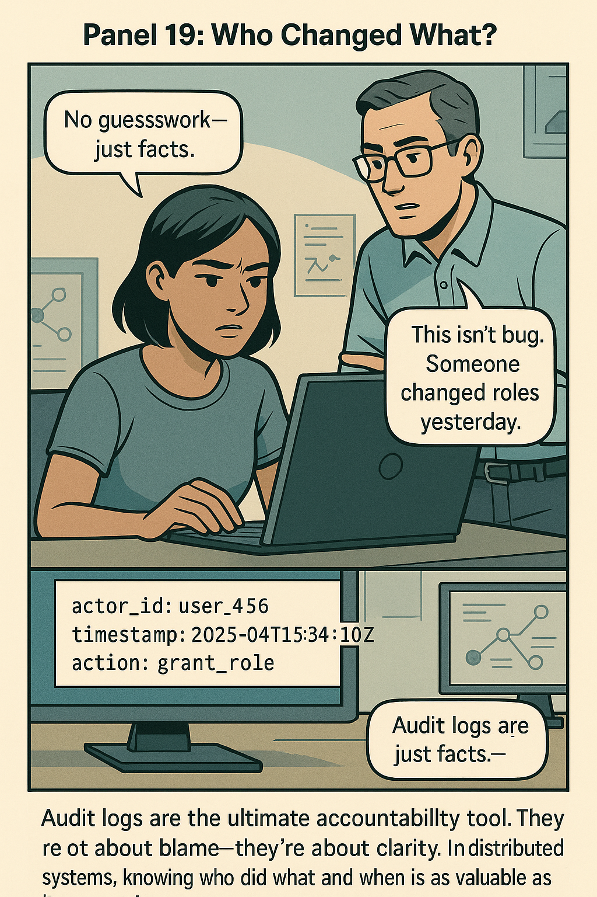
    </td>
  </tr>
</table>

---

### Thoughts (Character Internal Dialogue)

- **Johan:** "No guesswork—just facts."
- **Maya:** "This isn’t a bug. Someone changed the roles yesterday."

---

### Monologue (Narrative or Insight)

> Audit logs are the ultimate accountability tool. They’re not about blame—they’re about clarity. In distributed systems, knowing who did what and when is as valuable as knowing why.

---

### Panel 20: Immutable by Design

---

### Scene Description

The panel shows a log pipeline where audit logs go through a write-once route into a tamper-proof storage (e.g., WORM-enabled S3). A lock icon is shown over the final storage node. Johan is drawing this flow diagram on a whiteboard while Maya takes notes.

---

<table>
  <tr>
    <td style="width: 50%; vertical-align: top; padding-right: 16px;">
      <strong>🎯 Learning Objective</strong> Learn the value of tamper-proof logging (e.g., WORM storage) for preserving the integrity of critical audit events.  
      <strong>✅ Takeaway</strong> Logs that can be altered can't be trusted. Write-once, read-many logging is a cornerstone of regulatory and operational assurance.
    </td>
    <td style="width: 50%;">
      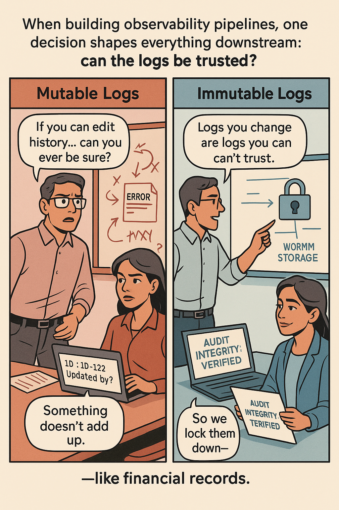
    </td>
  </tr>
</table>

---

### Thoughts (Character Internal Dialogue)

- **Johan:** "Logs you can change are logs you can’t trust."
- **Maya:** "So we lock them down—like financial records."

---

### Monologue (Narrative or Insight)

> Audit logs aren’t operational—they’re legal artifacts. You don’t redact them. You don’t rotate them away. You write them once, secure them forever, and query only when necessary.

---

### Panel 21: Trust Comes From Truth

---

### Scene Description

Later, Johan and Maya sit in a postmortem meeting. A projector shows audit log timelines as part of the incident report. Team members look calm and focused. There’s no blame—just clarity. One log shows exactly when a permission was granted and by whom.

---

<table>
  <tr>
    <td style="width: 50%; vertical-align: top; padding-right: 16px;">
      <strong>🎯 Learning Objective</strong> Reinforce how observability becomes institutional knowledge—passed from experienced SREs to the next generation through teaching and mentorship.  
      <strong>✅ Takeaway</strong> Tools fade, dashboards change—but teaching observability keeps teams strong. Teaching is the last and best step of mastery.
    </td>
    <td style="width: 50%;">
      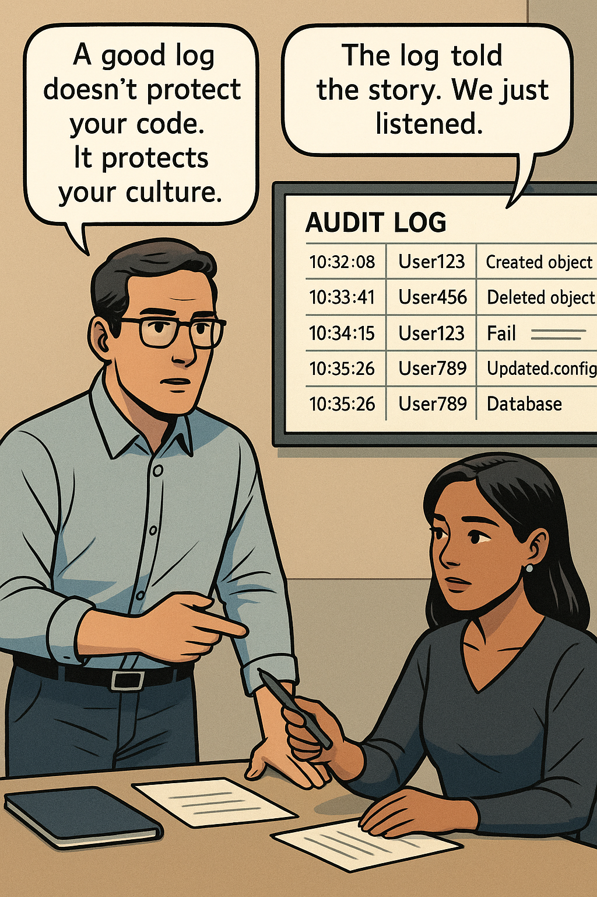
    </td>
  </tr>
</table>

---

### Monologue (Narrative or Insight)

> Audit logs don’t prevent incidents—but they prevent confusion. They make blame obsolete and timelines exact. In a high-stakes system, they’re the paper trail that keeps people honest, safe, and confident.

**🎯 Learning Objective:**  
Explore how audit logs contribute to a blame-aware culture—where clarity and timeline matter more than fault assignment.

**✅ Takeaway:**  
Observability isn’t just technical—it’s cultural. When your logs are honest, your team doesn’t need to guess—or blame.

---

# Recap & Reflection

---

### Panel 22: A New Beginning

---

### Scene Description

A calm scene. Johan stands at the front of a small SRE onboarding session. A whiteboard behind him shows a simplified diagram of logs, metrics, traces, and audit flows. Three junior SREs sit at desks—one of them is Maya, now more confident. Sunlight filters in through a window. It’s a rare moment of peace.

---

### Thoughts (Character Internal Dialogue)

- **Johan:** "We logged our mistakes. Now we pass on the lessons."
- **Maya:** "It finally makes sense. And now I get to help others see it too."

---

### Monologue (Narrative or Insight)

> Great observability isn’t just tooling—it’s teaching. You don’t just build a better system. You grow better people who can run it, understand it, and improve it.

---

### Panel 23: From Chaos to Clarity

---

### Scene Description

A quiet montage-style panel. Four snapshots arranged in sequence: 1) the firehose of early logs, 2) Johan debugging with trace IDs, 3) Maya configuring a redaction rule, 4) the team passing an audit with clean logs. The journey is shown not with words, but moments.

---

<table>
  <tr>
    <td style="width: 50%; vertical-align: top; padding-right: 16px;">
      <strong>🎯 Learning Objective</strong> Visually summarize the journey from disorganized, high-noise logging to structured, secure, and insightful observability practices.  
      <strong>✅ Takeaway</strong> Maturity is measurable: less noise, better decisions, and shared understanding. That’s how you turn logs into clarity—and chaos into confidence.
    </td>
    <td style="width: 50%;">
      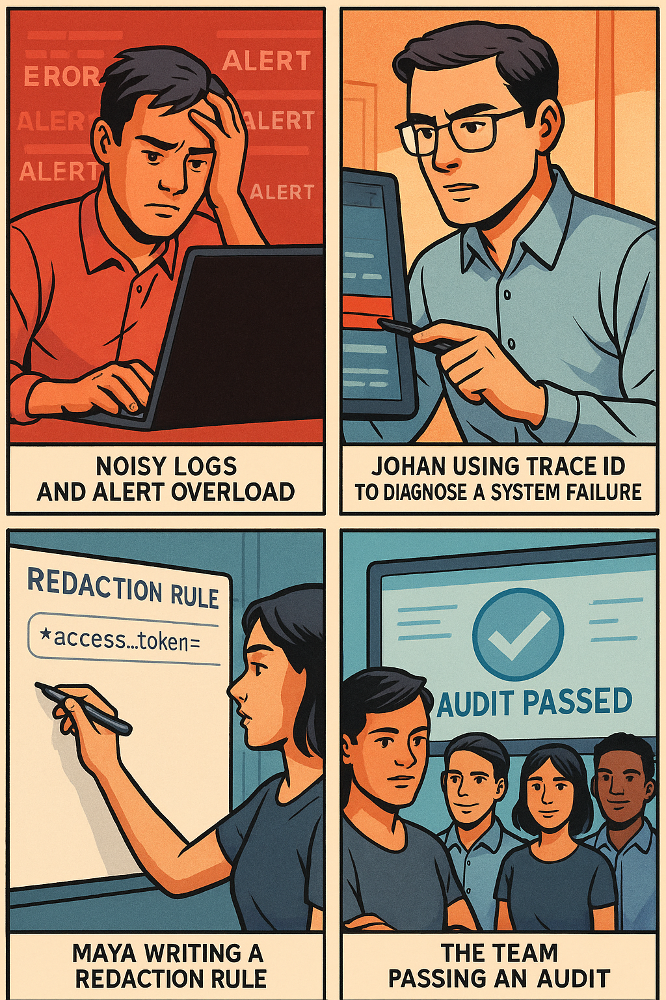
    </td>
  </tr>
</table>

---

### Thoughts (Character Internal Dialogue)

- **Johan:** "The system didn’t just evolve. We did."

---

### Monologue (Narrative or Insight)

> Good logging isn’t the end goal. It’s the path to insight, stability, and shared ownership. From chaos to clarity—that’s the arc of every great SRE story.

---

### Panel 24: The Next Shift Begins

---

### Scene Description

The SRE team room at dusk. Screens are calm. No alerts are firing. Johan is packing up for the day. Maya is explaining something to one of the new hires, who is now seated at the terminal. The torch has been passed.

---

<table>
  <tr>
    <td style="width: 50%; vertical-align: top; padding-right: 16px;">
      <strong>🎯 Learning Objective</strong> Understand that sustainable SRE practice is more than dashboards—it’s people passing on what works to keep reliability real.  
      <strong>✅ Takeaway</strong> The goal isn’t fewer incidents—it’s fewer surprises. Teaching others what to look for in logs builds a resilient future.
    </td>
    <td style="width: 50%;">
      
    </td>
  </tr>
</table>

---

### Thoughts (Character Internal Dialogue)

- **Johan:** "Logs don’t lie. And neither does good mentorship."
- **Maya:** "Time to pay it forward."

---

### Monologue (Narrative or Insight)

> Systems age. People rotate. But good practices stick. When you teach observability, you’re not just sharing tools—you’re training the next layer of reliability.

---