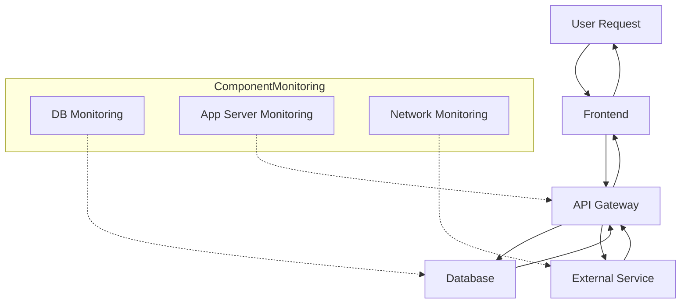
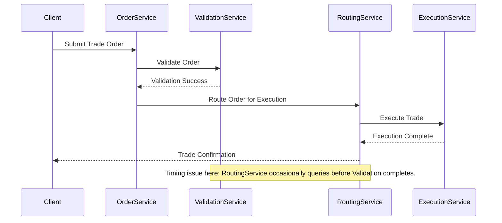
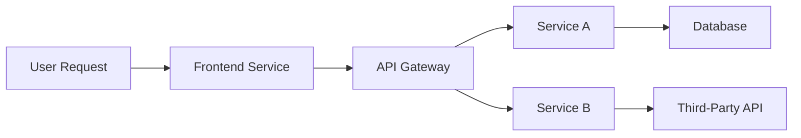
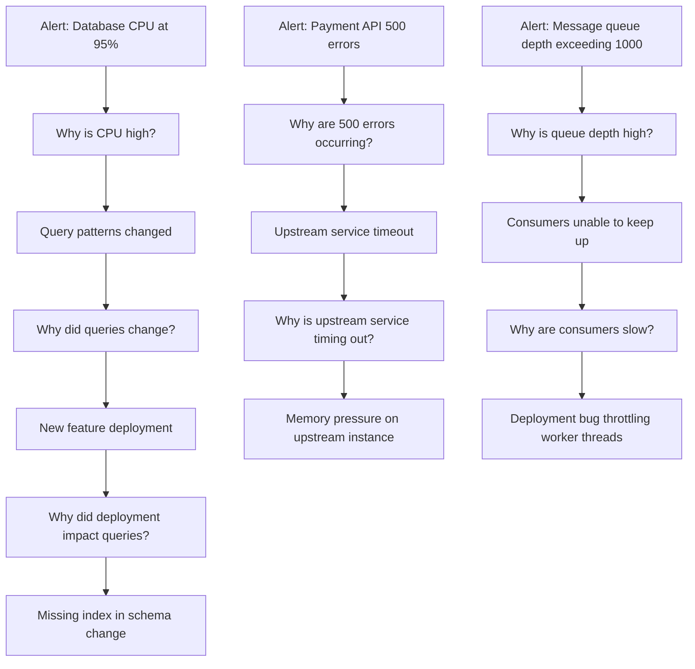
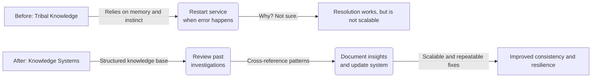
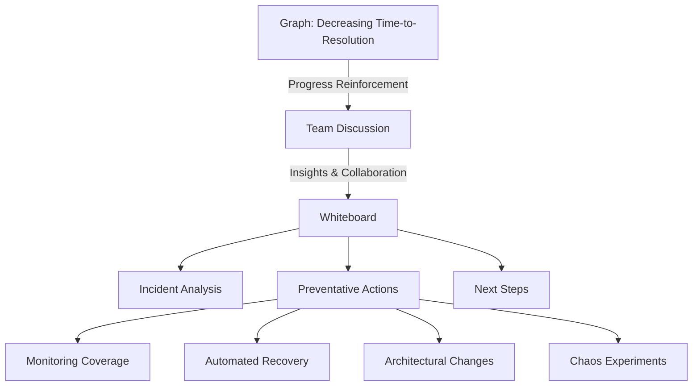

# Chapter 1: From Monitoring to Integration & Triage - The Mindset Shift

## Chapter Overview

Welcome to the SRE awakening, where your dashboards are liars, your heroics are overrated, and your instincts are probably making things worse. This chapter is a slap in the face to the old “monitor everything, trust nothing except green lights” mentality. It rips off the Band-Aid of traditional monitoring—exposing the ugly truth that a “green wall” doesn’t mean your customers aren’t hurling their phones across the room. We’ll drag you out of your cozy component silos, force you to connect the dots, and make you document your hard-won wisdom so the next rookie doesn’t reboot the bank by accident. If you’re just trying to lower your MTTR and move on, you’re missing the point: the real win is not having the incident in the first place. This is the Integration & Triage reality check. Leave your dashboards at the door.

______________________________________________________________________

## Learning Objectives

- **Recognize** the Green Wall Fallacy and why dashboards’ green lights are not gospel truth.
- **Prioritize** customer experience evidence over comforting infrastructure metrics.
- **Map** and **trace** end-to-end service pathways instead of playing whack-a-mole with components.
- **Correlate** signals across tools and teams to uncover the real source of the pain.
- **Adopt** an evidence-first, methodical approach to incident response—stop reacting, start investigating.
- **Ask** “why” until it hurts—root out causes, not just symptoms.
- **Document** and **share** knowledge so you’re not dependent on local folklore or missing engineers.
- **Shift** from celebrating fast fixes to actually preventing the same dumpster fire from reigniting.

______________________________________________________________________

## Key Takeaways

- Your dashboards are lying to you. “All green” is just as dangerous as “all red” if you’re blind to customer pain.
- Monitoring the CPU won’t save you when your payment validation silently dies. Validate customer journeys, not just hardware.
- Component teams blaming each other is a waste of everyone’s time. The real issues live in the spaces *between* your precious boxes.
- If you’re still jumping straight to “restart everything” on every alert, congratulations: you’re part of the problem.
- Incident response is not a talent show. Institutionalize evidence collection or prepare to repeat history—badly.
- Siloed logs and metrics are a recipe for wild goose chases. Correlate, or spend your weekends in war rooms.
- Fixing the “what” without understanding the “why” guarantees you’ll be back here again. Enjoy your Sisyphean existence.
- If your best solution is “call Jakob,” you’re one sick day away from disaster—and probably violating compliance in the process.
- Shaving a few minutes off your MTTR means nothing if you’re fighting the same fire every week. Prevention beats heroics, every time.
- Integration & Triage is not a tool—it’s a mindset. Get skeptical, get methodical, and stop trusting pretty dashboards over ugly truth.

______________________________________________________________________

## Panel 1: The Green Wall Fallacy

### Scene Description

A bleary-eyed engineer is jolted awake at 2:57 AM by his buzzing pager. He stumbles to his laptop, opens his dashboard, and sees a wall of green metrics:

```
+--------------------+--------------------+--------------------+
| CPU Usage: Green   | Memory Usage: Green| Disk Usage: Green  |
+--------------------+--------------------+--------------------+
| API Latency: Green | DB Health: Green   | Cache Status: Green|
+--------------------+--------------------+--------------------+
```

At the same time, frantic messages flood in about a failing payment service. Customers are unable to complete transactions, but every metric on the dashboard screams "All systems are normal." The engineer’s monitor displays the green wall of metrics alongside a growing number of incident reports. The conflict between what the monitoring says and what users experience becomes palpable, reflected in his visible confusion as he debates which source of truth to trust: the perfect dashboards or the broken customer experience.

### Teaching Narrative

The transition from monitoring to Integration & Triage begins with recognizing the limitations of traditional monitoring approaches. The "Green Wall Fallacy" represents a critical mindset shift: understanding that green dashboards don't guarantee working systems. Traditional monitoring focuses on system health metrics (CPU, memory, disk) that may appear normal while critical business functions fail. Integration & Triage demands we prioritize evidence of customer experience over dashboard colors. When alerts conflict with monitoring data, effective SREs investigate the discrepancy rather than dismissing either source. This fundamental shift—trusting evidence over dashboards—marks your first step from reactive monitoring to proactive Integration & Triage.

### Common Example of the Problem

At GlobalBank, the overnight batch processing team relied heavily on their monitoring dashboards to ensure payment file transfers completed successfully. During a critical month-end processing cycle, the dashboards showed all systems operating normally—CPU utilization at acceptable levels, memory usage well below thresholds, network bandwidth comfortably within limits. Yet customers began reporting that payments hadn't reached their destinations, causing missed deadlines and potential penalties. The operations team initially dismissed these reports, pointing to their "green" dashboards as evidence that systems were functioning properly. Only after escalating customer complaints did they investigate further, discovering that while the systems themselves were operationally normal, a file format validation service had silently failed, causing payment files to be rejected by partner banks without generating errors in their monitoring systems.

#### Key Takeaways from the Example

- **Green dashboards don't guarantee customer success**: Operational metrics might appear healthy even when critical business functions are failing.
- **Customer feedback is a critical signal**: Direct reports from users often highlight issues that monitoring systems cannot detect.
- **Don't dismiss discrepancies**: Conflicts between monitoring data and user reports warrant immediate investigation, not dismissal.
- **Look beyond system health metrics**: Focus on end-to-end workflows and their impact on customer outcomes, not just on individual system components.
- **Proactive triage requires a mindset shift**: Effective SREs prioritize evidence of user experience over dashboard status when diagnosing issues.

### SRE Best Practice: Evidence-Based Investigation

Effective Integration & Triage practitioners develop a healthy skepticism toward monitoring systems, recognizing them as tools rather than truth. When faced with conflicting signals between monitoring dashboards and reported issues, they follow an evidence collection protocol:

1. Always validate actual user journeys through direct testing: Use synthetic transactions or manual testing to verify critical functions, regardless of what dashboards show.
2. Implement black-box monitoring alongside traditional system metrics: Create monitoring that simulates customer transactions end-to-end, which would have immediately revealed the payment validation issue despite healthy system metrics.
3. Establish multi-dimensional observability: Complement system-level metrics with business outcome metrics that directly measure success rates for critical functions.
4. Create "customer truth" dashboards: Develop separate visualizations focused exclusively on customer experience metrics—success rates, error counts, and completion times for key journeys.
5. Implement correlation workflows: When alerts fire, automatically correlate system metrics with business outcomes to identify discrepancies between system health and functional success.

This evidence-based approach reveals the truth behind misleading green dashboards by focusing on what matters most: actual customer experience.

### Banking Impact

The business consequences of the Green Wall Fallacy in banking environments are particularly severe. When monitoring systems show green while critical banking functions fail, the impacts can be categorized as follows:

| **Impact Category** | **Description** | **Examples** |
| ------------------------------- | ---------------------------------------------------------------------------------------------------------------- | -------------------------------------------------------------------------------------------------- |
| **Financial Losses** | Direct monetary impacts resulting from failed transactions, missed opportunities, or penalties. | - Failed transactions (e.g., payment declines)<br>- Missed interest payments<br>- Regulatory fines |
| **Compliance Violations** | Breaches of legal or regulatory requirements despite monitoring systems indicating compliance. | - Undelivered mandatory notifications<br>- Incomplete regulatory reports |
| **Customer Trust Erosion** | Loss of client confidence due to misleading assurances from incorrect monitoring data. | - Reassuring customers of success when transactions fail<br>- Inability to resolve issues promptly |
| **Prolonged Incident Response** | Increased Mean Time to Resolution (MTTR) as investigations begin with incorrect assumptions about system health. | - Teams wasting time debugging functioning components<br>- Delayed identification of root causes |
| **Operational Risks** | Elevated risk of unintended consequences as teams act on misleading data. | - Making unnecessary changes<br>- Overlooking genuine failure points |

For regulated financial institutions, the Green Wall Fallacy is particularly dangerous. It creates scenarios where monitoring systems falsely indicate compliance, putting the organization at risk of significant regulatory breaches and associated penalties.

### Implementation Guidance

To overcome the Green Wall Fallacy in your banking environment:

1. **Implement customer journey synthetic monitoring**: Develop automated tests that regularly execute critical customer paths (payments, transfers, account access) and alert based on success/failure regardless of system metrics. Configure these tests to run at least every 5 minutes for critical functions. Below is an example configuration for a synthetic monitoring tool (e.g., a popular open-source tool like Checkly or custom scripts):

   ```yaml
   - name: Payment Journey Test
     schedule: "every 5 minutes"
     steps:
       - action: "visit"
         url: "https://banking.example.com/login"
       - action: "type"
         selector: "#username"
         value: "test_user"
       - action: "type"
         selector: "#password"
         value: "secure_password"
       - action: "click"
         selector: "#login-button"
       - action: "visit"
         url: "https://banking.example.com/payments"
       - action: "type"
         selector: "#recipient"
         value: "recipient_account"
       - action: "type"
         selector: "#amount"
         value: "100.00"
       - action: "click"
         selector: "#submit-payment"
       - action: "assert"
         selector: ".confirmation-message"
         contains: "Payment Successful"
   ```

2. **Create business outcome dashboards**: Develop separate dashboards that exclusively show success rates and error counts for key customer journeys, completely independent from system health metrics. Ensure these dashboards have prominence equal to or greater than infrastructure dashboards. For example, a Prometheus + Grafana setup could use the following PromQL to monitor success rates:

   ```promql
   sum(rate(successful_transactions_total[5m])) 
   / 
   sum(rate(total_transactions_attempted[5m])) * 100
   ```

   Visualize this data as a time-series graph or a percentage gauge in Grafana to track customer journey health.

3. **Establish evidence collection protocols**: Create runbooks that require responders to verify actual functionality through direct testing before making any assessment about incident validity. Include specific commands, endpoints, and expected results for quick verification. For example:

   - **Command**: `curl -X POST https://banking.example.com/api/transfer -d '{"from":"user1", "to":"user2", "amount":100}'`
   - **Expected Result**: `{"status":"success","transaction_id":"12345"}`

   Ensure runbooks are stored centrally and easily accessible during incidents.

4. **Implement "trust but verify" alerting protocols**: Configure your alerting system to automatically initiate synthetic transactions when system alerts fire, providing immediate verification of whether system issues affect actual functionality. For instance, a webhook trigger in an alerting tool like PagerDuty can invoke a synthetic monitoring API:

   ```json
   {
     "alert": "High CPU usage detected",
     "synthetic_check": {
       "endpoint": "https://banking.example.com/api/payment",
       "method": "POST",
       "payload": {
         "from": "test_account",
         "to": "test_recipient",
         "amount": 1
       },
       "expected_response": 200
     }
   }
   ```

5. **Conduct "dashboard skepticism" training**: Develop specific training modules that demonstrate how green dashboards have masked real issues in your environment. Use actual historical incidents to reinforce the lesson that dashboards are tools, not truth. Consider exercises such as:

   ```
   Incident Simulation:
   - Scenario: All dashboards are green, but customers report failed payments.
   - Task: Investigate using synthetic monitors and customer journey tests to identify the root cause.
   ```

## Panel 2: From Component Focus to Service Pathways

### Scene Description

A split-screen scenario illustrates two contrasting approaches to the same incident:

**Left Side**:\
A support engineer is shown frantically troubleshooting in isolation. Multiple separate monitoring screens display metrics for individual components, including databases, application servers, and network devices. The engineer appears overwhelmed, toggling between dashboards that lack a clear connection between the systems.

**Right Side**:\
An SRE takes a collaborative and holistic approach. A whiteboard outlines the complete transaction pathway, visually connecting components involved in the user request. The diagram includes labeled nodes (e.g., "Frontend," "API Gateway," "Database") and arrows indicating the flow of the request. Colleagues contribute by gathering evidence at key points along this pathway, identifying potential bottlenecks and failure points.

**Conceptual Diagram**:



This visual comparison highlights the inefficiency of component-focused monitoring versus the clarity of tracing a full-service pathway, emphasizing the importance of interconnected system awareness.

### Teaching Narrative

Traditional monitoring encourages a siloed, component-based worldview where each system is evaluated independently. Integration & Triage introduces a transformative perspective: service pathways that track how user requests flow through your entire technology stack. This mindset shift requires you to stop thinking about isolated components ("Is the database up?") and instead focus on service journeys ("Can a customer complete a funds transfer?"). By mapping and understanding these critical paths, you develop a holistic view of your systems that reveals interdependencies monitoring alone cannot show. This pathway perspective enables you to identify failure points that exist not within components but in the connections and interactions between them—often the true source of complex production issues.

### Common Example of the Problem

At Capital Trust Bank, the foreign exchange trading platform experienced intermittent delays that frustrated high-value clients. The operations team approached the problem by checking individual components: the database showed normal query times, application servers reported standard response times, message queues showed normal throughput, and network metrics indicated sufficient bandwidth. Each team responsible for a specific component confidently reported that their system was functioning correctly, yet trades were still experiencing unpredictable delays. The component-focused investigation continued for days, with each team defending their system's performance while customers grew increasingly frustrated.

The breakthrough came when a senior SRE mapped the complete trading journey—from order entry through validation, routing, execution, settlement, and confirmation. By analyzing the flow holistically, the SRE uncovered a subtle timing issue between the order validation and routing services. This race condition occasionally delayed the processing of trades, causing the observed intermittent delays. The root cause was invisible when viewing each system in isolation, but clear when the interactions between components were considered.

#### Transaction Flow with Timing Issue



This sequence diagram highlights the problematic interaction. The race condition occurred when the `RoutingService` attempted to process an order before the `ValidationService` completed its validation. This misalignment in timing was rare but critical, leading to the unpredictable trade delays that frustrated clients.

By shifting the focus from individual components to the complete service pathway, the team was able to identify and resolve the underlying issue, eliminating the delays and restoring customer satisfaction. This example underscores the importance of adopting a service pathway perspective for diagnosing complex system behaviors.

### SRE Best Practice: Evidence-Based Investigation

Effective service pathway investigation requires abandoning the component-isolation mindset in favor of transaction-focused analysis. Use the following checklist to guide your investigation and ensure a comprehensive, evidence-based approach:

| Best Practice | Description | Tools/Methods |
| --------------------------------------- | --------------------------------------------------------------------------------------------------------------------------------------------- | --------------------------------------------------------- |
| **Document Critical Service Pathways** | Implement distributed tracing to follow user requests across system boundaries, revealing the complete transaction journey. | Distributed tracing tools (e.g., OpenTelemetry) |
| **Create Service Dependency Maps** | Maintain up-to-date visualizations of service interactions, including timing, data transformations, and failure modes at each transfer point. | Dependency mapping tools (e.g., Service Maps) |
| **Develop Cross-Component Correlation** | Correlate logs, metrics, and events across system boundaries to identify inter-service issues. | Log aggregation and correlation tools (e.g., ELK, Splunk) |
| **Implement Synthetic Monitoring** | Create pathway-based tests that verify complete user journeys rather than individual component health. | Synthetic monitoring tools (e.g., Checkly, Synthetics) |
| **Establish Boundary Contract Testing** | Regularly verify that interfaces between components function as expected, especially after changes to either side. | Contract testing tools (e.g., Pact) |

This pathway-focused approach reveals issues invisible to component-level monitoring by exposing how systems interact rather than just how they perform individually. Below is an example flow to illustrate the focus on transaction pathways:



Use this mindset to trace the user journey end-to-end, identifying potential failure points in both components and their interactions.

### Banking Impact

The business consequences of a component-focused versus pathway-focused approach in banking environments are both critical and far-reaching. To better illustrate this, the key impacts are summarized below:

| **Impact Area** | **Consequence of Component Focus** | **Benefit of Pathway Focus** |
| ------------------------- | -------------------------------------------------------------------------------------------------------------------------- | ------------------------------------------------------------------------------------------------------------- |
| **Diagnosis Time** | Prolonged issue resolution due to "blame shifting" between teams managing isolated components | Faster root cause identification by tracing the end-to-end transaction flow |
| **Revenue Opportunities** | Missed opportunities when delays in trading or payment systems lead customers to seek faster alternatives from competitors | Improved system availability and reliability, minimizing delays and capturing more transactions |
| **Customer Retention** | Frustrated customers leaving after unresolved issues caused by traditional troubleshooting | Higher customer satisfaction through faster resolutions and proactive issue prevention |
| **Resource Allocation** | Wasted effort optimizing components that are not the true bottlenecks in the service pathway | Efficient use of resources by focusing on the actual failure points within the transaction flow |
| **Compliance Risk** | Increased risk when transaction flows spanning regulated systems are not monitored holistically | Reduced compliance exposure through comprehensive monitoring of transaction pathways across regulated systems |

For financial institutions handling time-sensitive, high-value transactions, adopting a pathway-focused monitoring approach is essential. It directly impacts revenue, reputation, and regulatory compliance by enabling quicker issue resolution, retaining customers, and ensuring critical transaction flows are both reliable and compliant.

### Implementation Guidance

To shift from component focus to service pathways in your banking environment, consider the following step-by-step approach, illustrated with a case study of implementing service pathways for a "Funds Transfer" feature:

1. **Create service journey maps**:

   - **Example**: Map the "Funds Transfer" journey, starting from the customer initiating a transfer via the mobile app, through the API gateway, to the core banking system, and finally to the payment processing service.
   - **Steps**:
     - Identify each step in the journey, including user actions and system responses.
     - Document all technical components involved (e.g., app front-end, API gateway, authentication service, transaction processing, database writes).
     - Highlight hand-offs between services and potential failure points, such as delays in API calls or database transaction locks.

   ```
   Customer -> Mobile App -> API Gateway -> Auth Service -> Core Banking System -> Payment Processor -> Success
   ```

2. **Implement distributed tracing**:

   - **Example**: Deploy a distributed tracing tool like Jaeger.
   - **Steps**:
     - Instrument each service in the "Funds Transfer" pathway with consistent trace identifiers.
     - Verify that each transaction can be tracked end-to-end, capturing latency, errors, and bottlenecks.
     - Test a transfer scenario to confirm all touchpoints are recorded in the trace.

3. **Develop pathway-oriented dashboards**:

   - **Example**: Create a dashboard to monitor the "Funds Transfer" pathway.
   - **Steps**:
     - Aggregate metrics for latency, error rates, and throughput across all services in the pathway.
     - Build visualizations that show the overall health of the journey, such as a waterfall chart of request timing or a color-coded status map of each service.
     - Include alerts for SLA breaches, such as transfers taking longer than 2 seconds.

4. **Establish cross-team investigation protocols**:

   - **Example**: Define a protocol for incidents affecting "Funds Transfer."
   - **Steps**:
     - Assemble a response team from app development, API operations, database administration, and payment processing teams.
     - Encourage shared ownership by reviewing the pathway map together during investigations.
     - Use the distributed trace and pathway dashboard to pinpoint the issue (e.g., a slow database write causing delays).

5. **Implement service-level objectives for complete journeys**:

   - **Example**: Set SLOs for the "Funds Transfer" journey.
   - **Steps**:
     - Define an SLO such as "99.9% of transfers complete within 2 seconds."
     - Monitor this metric using the distributed tracing and dashboards.
     - Prioritize engineering efforts to improve the pathway if the SLO is not met, such as optimizing database queries or scaling the payment processor.

By following this structured approach and leveraging the "Funds Transfer" case study, you can effectively transition to a service pathway mindset with clear, actionable steps that ensure holistic system reliability.

## Panel 3: Reactive to Proactive - The Evidence Collection Mindset

### Scene Description

Two timelines are displayed side by side, illustrating the stark contrast between reactive and proactive approaches to incident response.

#### Before Timeline

```
Alert received
   |
   v
Immediate action (e.g., restart service)
   |
   v
Temporary resolution
   |
   v
Alert recurs
   |
   v
Escalated chaos and stress
```

In the "Before" timeline, an engineer reacts to each new alert by immediately attempting solutions: restarting services, clearing queues, and deploying emergency fixes. This creates a chaotic, stress-filled environment where symptoms are treated rather than underlying causes.

#### After Timeline

```
Alert received
   |
   v
Evidence collection (logs, metrics, tests)
   |
   v
Structured investigation
   |
   v
Root cause identified
   |
   v
Targeted solution applied
   |
   v
Incident resolved, recurrence prevented
```

In the "After" timeline, the same engineer methodically collects evidence before acting: checking logs, gathering metrics, performing targeted tests, and documenting findings in a structured investigation template. This disciplined approach enables a carefully selected solution that addresses the root cause, preventing recurring incidents and fostering a calm, controlled response environment.

### Teaching Narrative

The reactive mindset of traditional monitoring creates a dangerous impulse: the urge to act immediately upon receiving an alert. Integration & Triage introduces a crucial perspective shift from reaction to investigation. Rather than jumping to fixes based on alert text or past experience, effective SREs first gather comprehensive evidence. This evidence-first approach may initially feel counterintuitive or even slow, especially when pressure mounts during an incident. However, this disciplined evidence collection significantly accelerates root cause identification and prevents the common trap of treating symptoms rather than causes. By restraining the impulse to immediately "fix" what appears broken, you create space for systematic investigation that reveals the true nature of complex problems and prevents recurring incidents.

### Common Example of the Problem

Meridian Financial's critical loan processing system began experiencing intermittent failures during peak hours. Below is a timeline of reactive actions taken by the on-call engineer and their cascading consequences:

```mermaid
gantt
    title Timeline of Reactive Actions and Consequences
    dateFormat  HH:mm
    axisFormat  %H:%M

    section Incident Timeline
    Alert Triggered: Database Connection Errors       :done, 00:00, 5min
    Restart Database Service                          :active, 00:05, 10min
    Issue Recurs                                     :crit, 00:15, 5min
    Increase Connection Pool Settings                :active, 00:20, 10min
    Restart Application Servers                      :active, 00:30, 10min
    Issue Recurs Again                               :crit, 00:40, 5min
    Adjust Memory Allocations                        :active, 00:45, 15min
    Scale Up Instances                               :active, 01:00, 15min
    Clear Caches                                     :active, 01:15, 10min
    Failover to Backup Systems                       :active, 01:25, 10min
    Issue Persists                                   :crit, 01:35, 10min
    Fix Freeze Initiated by Senior SRE               :done, 01:45, 10min
    Begin Methodical Evidence Collection             :done, 01:55, 30min
    Root Cause Identified: Subtle Connection Leak    :done, 02:25, 30min
```



The alert text mentioned database connection errors, prompting the on-call engineer to immediately restart the database service—a solution that had worked for similar symptoms in the past. Service was temporarily restored, but the issue returned within an hour. The engineer then increased database connection pool settings and restarted the application servers. Again, the issue temporarily resolved before returning. This pattern of reactive fixes continued for several hours: adjusting memory allocations, scaling up instances, clearing caches, and eventually failing over to backup systems—each providing temporary relief without addressing the root cause.

The constantly changing system state created by these interventions obscured the actual problem: a recently deployed code change had introduced a subtle connection leak that manifested only under specific load conditions. By repeatedly treating symptoms through restarts and configuration changes, the team extended the incident duration and actually destroyed evidence that would have led to faster resolution. Only when a senior SRE implemented a "fix freeze" and began methodical evidence collection did the true cause become apparent.

### SRE Best Practice: Evidence-Based Investigation

Effective evidence-first incident response follows a disciplined approach. Use the following checklist to guide your investigations and ensure a consistent, methodical process:

#### Evidence-Based Investigation Checklist

1. **Structured Evidence Collection Protocols**

   - Identify and define key data to gather before making any changes.
   - Include logs, metrics, configuration states, and recent changes.
   - Use standardized tools or templates for consistency.

2. **Paused Response Practices**

   - Enforce procedural guardrails to delay immediate intervention.
   - Ensure basic evidence is collected and reviewed collaboratively by the team.
   - Document initial observations to maintain focus.

3. **Evidence Preservation Techniques**

   - Capture the system state prior to any modifications.
   - Utilize snapshots or backups to preserve the "digital crime scene."
   - Avoid destructive actions that could compromise evidence.

4. **Hypothesis Testing Frameworks**

   - Formulate multiple, plausible root cause theories.
   - Design specific, targeted tests to validate or refute each hypothesis.
   - Document test results to refine understanding and guide next steps.

5. **Progressive Intervention Protocols**

   - Start with non-invasive actions like querying metrics or logs.
   - Gradually escalate to system changes only when evidence strongly supports intervention.
   - Prioritize reversible actions at each step.

______________________________________________________________________

This evidence-first approach may seem slower at first but ultimately accelerates resolution by avoiding the chaotic cycle of knee-jerk reactions. By adhering to this checklist, you can foster a structured investigation process that reveals root causes, prevents recurring incidents, and enhances system reliability.

### Banking Impact

The business consequences of adopting a reactive, rather than evidence-first, approach in banking environments can be severe. The table below links each consequence to its root cause and outlines potential mitigations to promote a proactive evidence-collection mindset.

| **Business Consequence** | **Root Cause** | **Potential Mitigation** |
| --------------------------------------------------------------- | ---------------------------------------------------------------------------------------- | ------------------------------------------------------------------------------------------------------------------------ |
| Extended service disruptions when symptom-treating masks issues | Reactive changes that treat symptoms instead of investigating the underlying cause | Implement structured investigation templates to guide evidence collection and ensure root cause analysis is prioritized. |
| Recurring incidents due to evidence destruction | Logs, metrics, and key data overwritten or lost during hasty, undocumented interventions | Enforce a freeze on destructive actions until logs and metrics have been reviewed and captured systematically. |
| Decreased customer confidence from recurring issues | Quick fixes lead to temporary resolution, but the same issues resurface repeatedly | Adopt a post-incident review process to identify patterns and address systemic problems. |
| Compliance violations from poor record-keeping | Chaotic, undocumented interventions fail to meet governance and audit requirements | Integrate incident documentation processes into workflows to maintain compliance and traceability. |
| Increased operational risk from uncoordinated changes | Simultaneous reactive fixes create unforeseen dependencies and cascading failures | Utilize change management practices, such as coordinated rollbacks and impact assessments, before implementing fixes. |

For financial institutions where system modifications require strict change control, reactive interventions not only extend incidents but often violate governance requirements designed to maintain system stability and security. Transitioning to an evidence-first mindset mitigates these risks by promoting a disciplined, methodical approach to problem-solving.

### Implementation Guidance

To shift from reactive to evidence-first response in your banking environment:

1. **Create evidence collection templates**: Develop structured forms or checklists that responders must complete before implementing any changes. Include the following key sections:

   - **System State**: Current system health, service status, and known anomalies.
   - **Error Messages**: Exact text and timestamps of any errors or alerts.
   - **Affected Components**: List of impacted services, dependencies, or users.
   - **Recent Changes**: Summary of recent deployments, configuration updates, or infrastructure changes.
   - **Verification Steps**: Initial diagnostic actions or tests performed and their outcomes.

   Example Template:

   ```text
   **Evidence Collection Template**
   - Incident ID: [Unique Identifier]
   - System State: [Describe health and anomalies]
   - Error Messages: [Copy/Paste exact message with timestamp]
   - Affected Components: [List impacted services or users]
   - Recent Changes: [Summarize deployments or config updates]
   - Verification Steps: [Detail tests or diagnostics performed]
   ```

2. **Implement "pause protocol" procedures**: Establish clear guidelines requiring a mandatory evidence collection period (typically 15-30 minutes) before any system changes during incidents, except in clearly defined emergency scenarios. This period creates a buffer for responders to gather data and avoid knee-jerk reactions.

3. **Deploy automated state capture tools**: Utilize tools that automatically preserve logs, metrics, configurations, and process states when alerts fire. This ensures immutable records of pre-intervention conditions are available. Examples include:

   - **Log Aggregators**: Centralize application logs for quick retrieval (e.g., ELK Stack, Splunk).
   - **Metric Dashboards**: Automatically capture and visualize key metrics (e.g., Prometheus, Grafana).
   - **Snapshot Tools**: Capture detailed system states, such as process lists and configurations, at the moment an alert triggers.

4. **Establish hypothesis boards**: Use physical whiteboards or digital tools like shared documents or Kanban boards to document and organize potential causes. Include columns for:

   - **Hypotheses**: Initial theories about the root cause.
   - **Supporting Evidence**: Data that validates the hypothesis.
   - **Contradicting Evidence**: Data that disproves or weakens the hypothesis.
   - **Next Steps**: Planned actions for testing or validation.

   Example Hypothesis Board:

   ```text
   | Hypothesis                     | Supporting Evidence        | Contradicting Evidence      | Next Steps                  |
   |--------------------------------|----------------------------|-----------------------------|-----------------------------|
   | Recent deployment caused issue | Metrics spike post-deploy  | No errors in deployment log | Rollback and retest         |
   | Disk full                      | Alert: 95% disk usage      | No I/O errors observed      | Verify disk space manually  |
   ```

5. **Develop intervention approval workflows**: Implement lightweight processes requiring peer review of evidence and proposed changes before implementation. Define escalation paths based on risk and scope:

   - **Low-Risk Changes**: Require single peer review.
   - **Moderate-Risk Changes**: Require team lead approval.
   - **High-Risk Changes**: Require senior engineer and/or stakeholder approval.

   Example Workflow:

   ```mermaid
   graph TD
   A[Responder Documents Evidence] --> B[Peer Review]
   B -->|Low Risk| C[Implement Change]
   B -->|Moderate Risk| D[Team Lead Approval]
   D --> C
   B -->|High Risk| E[Senior Engineer Approval]
   E --> C
   ```

By integrating these practices and tools, you ensure a consistent and structured approach to incident investigation, reducing errors and accelerating root cause identification.

## Panel 4: Correlation Over Isolation - Connecting the Signals

### Scene Description

An incident war room with two approaches contrasted:

- **Isolated Analysis:** On one side, engineers work in silos, each examining separate logging systems, monitoring tools, and dashboards. They focus narrowly on their respective data sources, struggling to piece together the bigger picture of the incident.

- **Correlated Analysis:** On the other side, a team collaborates at a shared digital workspace. They consolidate data from multiple systems onto a unified canvas, connecting signals across logs, metrics, and alerts. Together, they build a timeline that reveals patterns and relationships invisible in isolated views.

Here’s a conceptual representation of the two approaches:

```
+------------------------+      +------------------------+
|  Isolated Analysis     |      |  Correlated Analysis   |
|                        |      |                        |
|  Logging System A      |      |  Unified Workspace     |
|  ┌───────────────┐     |      |  ┌─────────────────┐   |
|  │ Log A Details │     |      |  │ Combined Data   │   |
|  └───────────────┘     |      |  │ Connections     │   |
|                        |      |  │ Timeline View   │   |
|  Monitoring Tool B     |      |  └─────────────────┘   |
|  ┌───────────────┐     |      |                        |
|  │ Metric B Data │     |      |  Patterns Revealed     |
|  └───────────────┘     |      |  Team Collaboration    |
|                        |      |                        |
+------------------------+      +------------------------+
```

This contrast highlights the transformative power of correlation: by working together and blending diverse data sources, the team uncovers hidden insights and accelerates their understanding of the incident.

### Teaching Narrative

Traditional monitoring encourages isolated analysis: examining each alert, log, or metric in separation. Integration & Triage introduces a fundamental shift toward correlation - the practice of connecting signals across disparate systems to reveal the complete story of an incident. This mindset change requires deliberately breaking the boundaries between monitoring tools, log systems, and alerting platforms to create a unified narrative. When you begin seeing signals as interconnected parts of a system conversation rather than isolated notifications, subtle patterns emerge that would remain invisible in siloed analysis. Developing this correlation mindset transforms how you approach complex incidents, enabling you to identify causal relationships between seemingly unrelated events and significantly reducing mean time to diagnosis.

### Common Example of the Problem

Investment Bank International experienced a complex incident during market hours that generated multiple apparently unrelated alerts: increased latency in market data feeds, elevated error rates in the trading API, database connection warnings, and authentication timeouts for clients. Each specialized team investigated their own alerts in isolation: the market data team examined feed configurations, the API team reviewed recent deployments, database administrators checked query performance, and the authentication team investigated session management. Four separate investigations proceeded in parallel with no coordination or information sharing.

The timeline of events unfolded as follows:

```mermaid
gantt
    title Incident Timeline
    dateFormat HH:mm
    axisFormat %H:%M
    section Alerts
    Increased Market Data Latency     :done, 09:00, 1h
    Elevated API Error Rates          :done, 09:15, 1h
    Database Connection Warnings      :done, 09:30, 1h
    Authentication Timeouts           :done, 09:45, 1h
    section Team Investigations
    Market Data Team Analysis         :active, 09:10, 2h
    API Team Deployment Review        :active, 09:20, 2h
    Database Query Performance Check  :active, 09:35, 2h
    Authentication Session Debugging  :active, 09:50, 2h
    section Correlation Effort
    Unified Timeline Creation         :crit, 11:15, 30m
    Root Cause Identified             :crit, 11:45, 15m
```



As the timeline shows, hours passed without resolution as each team determined their particular issue wasn't severe enough to explain the overall system degradation. Only when a senior SRE created a unified timeline combining all these events did the actual problem become clear: a network configuration change had subtly affected DNS resolution times, causing cascading timeouts across multiple systems.

This correlation revealed that all the seemingly separate symptoms stemmed from a single root cause that was invisible when examining each alert in isolation. The delay in connecting the signals across teams and systems significantly extended the mean time to diagnosis, highlighting the critical need for correlation over isolation in incident response workflows.

### SRE Best Practice: Evidence-Based Investigation

Effective signal correlation requires breaking down the boundaries between monitoring silos. Use the following checklist to guide your team toward evidence-based investigation practices:

#### Checklist: Evidence-Based Investigation for Signal Correlation

- **[ ] Implement Unified Observability Platforms**\
  Deploy technologies that consolidate logs, metrics, traces, and events into integrated views. This provides a holistic perspective and reveals cross-system patterns.

- **[ ] Establish Correlation Identifiers**\
  Create and propagate unique identifiers that track transactions across system boundaries. This allows related events from different monitoring systems to be connected.

- **[ ] Develop Temporal Analysis Techniques**\
  Use timeline-based visualization tools to arrange events chronologically across systems. This makes cause-effect relationships between events more apparent.

- **[ ] Train Teams in Multi-Signal Pattern Recognition**\
  Enable engineers to recognize "signal clusters" that commonly occur together during specific incident types. This skill helps uncover systemic issues faster.

- **[ ] Build and Maintain Cross-Domain Knowledge Graphs**\
  Develop relationship maps that document dependencies and interactions between system components. These graphs highlight how issues in one area may manifest in others.

#### Why It Matters

This correlation-focused approach transforms incident response by exposing systemic issues that isolated analysis would miss. By connecting signals across boundaries, you can identify cascading failures and reduce mean time to diagnosis (MTTD). Empower your team to think beyond silos and see the complete picture.

### Banking Impact

The business consequences of isolated rather than correlated analysis in banking environments can have far-reaching effects. The table below summarizes key impacts and their corresponding outcomes:

| **Consequence** | **Impact** |
| ------------------------- | -------------------------------------------------------------------------------------------------------- |
| Extended diagnosis times | Prolonged customer impact as teams investigate downstream effects instead of identifying root causes. |
| Ineffective remediation | Partial fixes only address symptoms in one system, allowing the root cause to persist and affect others. |
| Recurring incidents | Fundamental issues remain undiscovered due to siloed investigation, leading to repeated failures. |
| Missed opportunity costs | Degradation in trading or payment systems results in lost revenue opportunities competitors can avoid. |
| Increased regulatory risk | Compliance issues that span multiple systems go unnoticed, heightening the chance of penalties. |

For financial institutions with complex, interconnected systems, failing to correlate signals across boundaries directly affects incident resolution times, system stability, customer experience, and regulatory compliance. Developing a correlation mindset ensures that these challenges are addressed holistically, minimizing both technical and business risks.

### Implementation Guidance

To shift from isolated to correlated analysis in your banking environment:

1. **Implement a centralized observability platform**: Deploy a unified system that ingests data from all monitoring sources—logs, metrics, traces, and events—enabling cross-source correlation. Ensure consistent timestamp normalization across all data sources.\
   Example configuration for setting up OpenTelemetry Collector as a centralized data pipeline:

   ```yaml
   receivers:
     otlp:
       protocols:
         grpc:
         http:

   processors:
     batch:
     memory_limiter:
       limit_mib: 512
       spike_limit_mib: 128
       check_interval: 5s
     resource:
       attributes:
         - key: service.name
           value: my-service
           action: upsert

   exporters:
     logging:
       logLevel: debug
     otlp:
       endpoint: "otel-collector:4317"

   service:
     pipelines:
       traces:
         receivers: [otlp]
         processors: [batch, memory_limiter, resource]
         exporters: [logging, otlp]
       metrics:
         receivers: [otlp]
         processors: [batch, memory_limiter]
         exporters: [logging, otlp]
   ```

2. **Establish correlation ID propagation**: Implement a standard for propagating unique identifiers through all systems and services, enabling tracing of related events across system boundaries. Update application code to maintain these identifiers through all processing steps.\
   Example implementation in Python using OpenTelemetry for correlation ID propagation:

   ```python
   from opentelemetry import trace
   from opentelemetry.propagate import inject

   tracer = trace.get_tracer("my-service")

   # Start a new span and propagate the correlation ID
   with tracer.start_as_current_span("process_request") as span:
       headers = {}
       inject(headers)  # Injects trace context into headers

       # Example of passing headers to another service
       response = requests.post("http://other-service/endpoint", headers=headers)
       print(response.text)
   ```

3. **Create visualization tools for multi-signal analysis**: Develop timeline-based interfaces that display events from multiple sources chronologically, with features for filtering, grouping, and highlighting potential correlations between seemingly unrelated signals.\
   Example of a timeline representation using text-based grouping:

   ```
   [2023-10-15T10:01:23Z] [TraceID: 123abc] Service A - Request Initiated
   [2023-10-15T10:01:24Z] [TraceID: 123abc] Service B - Request Received
   [2023-10-15T10:01:25Z] [TraceID: 123abc] Service C - Database Query Executed
   [2023-10-15T10:01:26Z] [TraceID: 123abc] Service A - Response Sent
   ```

4. **Form cross-functional incident response teams**: Establish protocols that bring together representatives from all potentially affected systems at the beginning of significant incidents rather than allowing parallel isolated investigations. Use shared tools and dashboards to facilitate collaboration and ensure all participants are working from a unified set of data.

5. **Develop correlation playbooks**: Create guides that document known cause-effect relationships between different systems, helping teams recognize common patterns where issues in one component manifest as seemingly unrelated symptoms in others. Include concrete examples of correlated signals, such as:

   - High CPU utilization in Service A correlating with increased latency in Service B.
   - Database slow queries aligning with service timeout errors.
   - Unusual network spikes coinciding with failed API requests.

## Panel 5: From "What" to "Why" - The Investigative Mindset

### Scene Description

An engineer stands before two whiteboards.

The first whiteboard is labeled **"MONITORING"** and lists alerts in their raw form:

- **Database CPU at 95%**
- **Payment API 500 errors**
- **Message queue depth exceeding 1000**

The second whiteboard, labeled **"INTEGRATION & TRIAGE,"** visualizes the investigative process with a branching series of "Why?" questions for each alert. The branches represent layers of inquiry leading to root causes. For example:



The engineer is actively adding another "why" branch to the second whiteboard, visibly engaged in deeper thinking. This scene embodies the transition from simply acknowledging alerts to systematically investigating their causes, facilitating a shift from surface-level monitoring to in-depth triage and integration.

### Teaching Narrative

Monitoring focuses primarily on the "what" of system behavior: what is happening, what threshold was breached, what component is affected. Integration & Triage introduces a critical shift toward asking "why" repeatedly until root causes emerge. This investigative mindset transforms alerts from simple notifications into starting points for deeper inquiry. Each "why" question peels back another layer of causality, eventually revealing fundamental issues that may span multiple systems, teams, or decisions. Developing this habit of persistent questioning prevents superficial fixes and addresses underlying problems. The transition from simply acknowledging alerts to systematically investigating their causes represents perhaps the most profound mindset shift in your journey from monitoring to Integration & Triage, creating lasting system stability rather than temporary symptom relief.

### Common Example of the Problem

Pacific Trust Bank's mobile banking platform experienced increasing error rates during peak hours. Traditional monitoring identified the immediate technical symptoms: the API gateway was returning HTTP 429 (Too Many Requests) responses, indicating rate limiting was being triggered. The operations team responded to this "what" by increasing the rate limits, which temporarily resolved the errors but led to downstream database connection exhaustion. After adjusting database connection pools, the system stabilized briefly before developing cache saturation issues. This cycle continued—each symptom treated as it appeared, without investigating why the system suddenly required more resources across all components.

When a senior SRE finally applied the investigative mindset, she began asking deeper questions. Below is a table summarizing the cascading issues and their root causes, illustrating the critical shift from "what" to "why":

| **Alert (What)** | **Immediate Fix** | **Next Issue (Symptom)** | **Investigative "Why"** | **Root Cause** |
| ------------------------------------- | ------------------------------ | -------------------------------------- | ----------------------------------------------------------------------------------------------------- | ------------------------------------------------------------- |
| API Gateway returning HTTP 429 errors | Increased rate limits | Database connection exhaustion | Why did traffic patterns change? | User behaviors shifted after a recent app update. |
| Database connection exhaustion | Increased connection pool size | Cache saturation | Why did the update change behaviors? | New feature caused frequent polling of account balances. |
| Cache saturation | Increased cache size | Increased resource strain across stack | Why was frequent polling implemented instead of a more efficient solution (e.g., push notifications)? | Development team was unaware of push notification capability. |

This root cause analysis revealed that a simple architectural knowledge gap had created cascading resource constraints across the entire platform—an insight impossible to gain by simply responding to the "what" of increasing resource consumption. By systematically asking "why" at each step, the senior SRE identified the underlying issue and prevented further cycles of superficial fixes.

### SRE Best Practice: Evidence-Based Investigation

Effective investigative problem-solving follows structured causality analysis. Use the following checklist to guide your evidence-based investigations:

| Best Practice | Description | Example |
| ----------------------------------- | -------------------------------------------------------------------------------------------- | -------------------------------------------------------------------------------------------- |
| **1. Implement the "Five Whys"** | Ask "why" at least five times to uncover deeper causes beyond surface symptoms. | Alert: "Database CPU at 95%." Why? "Query patterns changed." Why? "New feature deployment." |
| **2. Develop Cause-Effect Mapping** | Use visual tools to document causal chains, connecting surface issues to underlying factors. | Create a flowchart showing how "Schema change" led to "Query inefficiencies." |
| **3. Cross-Domain Investigation** | Build frameworks for exploring technical, organizational, and process-related boundaries. | Involve DBAs, developers, and SREs to investigate schema updates affecting performance. |
| **4. Root Cause Categorization** | Develop taxonomies of common root causes to identify patterns across incidents. | Categorize root causes as "Configuration Errors," "Process Gaps," or "Tooling Deficiencies." |
| **5. Counterfactual Analysis** | Ask "What would have prevented this?" to identify overlooked root causes. | Example: "If schema changes were performance-tested pre-deployment, this could be avoided." |

This structured approach ensures teams avoid the common trap of addressing symptoms rather than their causes. By following these best practices, you enable more effective, lasting solutions and reduce the likelihood of recurrence.

### Banking Impact

The business consequences of "what"-focused rather than "why"-focused approaches in banking environments include:

1. Recurring incidents when underlying causes remain unaddressed, creating the impression of systemic unreliability.
2. Increasing technical debt when quick fixes accumulate to address symptoms without resolving fundamental issues.
3. Escalating operational costs as resources are continually added to compensate for inefficiencies rather than addressing their causes.
4. Opportunity costs when teams repeatedly respond to the same underlying issues in different manifestations.
5. Regulatory exposure when the root causes of compliance-related issues remain unidentified and unresolved.

#### Case Study: Payment Processing Outage

A major financial institution experienced recurring outages in its payment processing system during peak hours. Initial monitoring identified high CPU usage on the database, leading to temporary fixes like adding more compute resources. However, the issue persisted, and operational costs escalated as new hardware was repeatedly provisioned.

Through an investigative "why"-driven approach, the root cause was eventually traced to inefficient query patterns introduced by a recent feature deployment. Further analysis revealed a missing database index that caused exponential query execution times under high load. Once the index was added, CPU usage stabilized, preventing future outages and reducing operational costs.

This illustrates how shifting from "what" (high CPU usage) to "why" (inefficient queries due to a missing index) not only resolved the immediate problem but also improved system reliability and performance.

For financial institutions where system stability directly impacts customer trust and regulatory standing, the inability to identify and address root causes rather than symptoms creates compounding business risks over time. By adopting an investigative mindset, banks can mitigate these risks, maintain compliance, and build trust with their customers.

### Implementation Guidance

To shift from "what" to "why" in your banking environment, follow this step-by-step process to foster an investigative mindset and integrate it into your workflows:

1. **Step 1: Establish "Five Whys" Documentation Standards**

   - **Action**: Introduce a requirement for incident postmortems to include at least five levels of causal factors. This ensures teams dig past immediate symptoms to uncover underlying issues.
   - **Template Example**:
     ```
     Incident Summary:
     - Alert: [e.g., Database CPU at 95%]
     - Symptom: [e.g., Slow query performance]

     Causal Analysis:
     1. Why is the CPU high? [e.g., Query patterns changed.]
     2. Why did query patterns change? [e.g., A new feature deployment altered usage.]
     3. Why did the deployment affect query patterns? [e.g., Missing index in the schema.]
     4. Why was the schema missing an index? [e.g., Oversight in the review process.]
     5. Why was there an oversight? [e.g., Lack of checklist for schema changes.]

     Root Cause: [e.g., Missing operational checklists for schema deployments.]
     ```

2. **Step 2: Utilize Cause Mapping Tools**

   - **Action**: Train teams to use cause mapping techniques like Ishikawa (fishbone) diagrams or fault tree analyses. Encourage visual representation of causal chains to make systemic connections clear.
   - **Example Workflow**:
     ```
     Alert: Payment API 500 errors
     |-- Why? [Service timeout]
         |-- Why? [Database connection pool exhausted]
             |-- Why? [Query patterns changed]
                 |-- Why? [Recent feature deployment]
                     |-- Why? [Insufficient load testing before release]
     ```

3. **Step 3: Categorize and Track Root Causes**

   - **Action**: Develop a shared taxonomy of root cause categories such as "Process Failures," "Communication Gaps," or "Technical Debt." Track these across incidents.
   - **Example Taxonomy**:
     ```
     Root Cause Categories:
     - Process Failures
     - Knowledge Gaps
     - Communication Issues
     - Tools/Automation Gaps
     - Technical Debt
     ```
   - **Tracking Example**:
     ```
     Incident ID | Root Cause Category      | Frequency
     ------------------------------------------------
     INC-123     | Process Failures        | 6
     INC-124     | Technical Debt          | 3
     INC-125     | Communication Issues    | 4
     ```

4. **Step 4: Use Structured Questioning Frameworks**

   - **Action**: Provide investigators with structured question sets to guide their analysis. Train teams to go beyond technical symptoms and explore organizational, process, and knowledge-related causes.
   - **Sample Framework**:
     ```
     Structured Questions:
     - Technical: What changed? Which systems are directly impacted?
     - Process: Were all required reviews/checks completed? Were any steps skipped?
     - Organizational: Were responsibilities clearly defined? Were communication channels effective?
     - Knowledge: Were all team members adequately trained? Were relevant runbooks available?
     ```

5. **Step 5: Document Preventative Measures**

   - **Action**: Require incident reviews to explicitly document preventative measures that address the root cause and could mitigate entire classes of similar issues.
   - **Template Example**:
     ```
     Preventative Measures:
     - Immediate Fix: [e.g., Add missing index to schema.]
     - Long-Term Prevention: [e.g., Implement schema change checklist and enforce load testing.]
     ```

6. **Step 6: Create a Feedback Loop**

   - **Action**: Regularly review root cause trends and preventative measures with teams to identify recurring patterns and systemic improvement opportunities.
   - **Example Process**:
     ```
     Monthly Review Agenda:
     - Review top root cause categories.
     - Discuss recurring patterns and gaps in preventative measures.
     - Update processes, tools, or training as needed.
     ```

By implementing this process and using the outlined templates and tools, teams can consistently transition from reactive monitoring to proactive, root cause-driven analysis, fostering lasting system reliability.

## Panel 6: Memory Over Instinct - Documentation and Knowledge Systems

### Scene Description

Split scene illustrating incident response "before" and "after" the adoption of knowledge systems:

#### Before (Tribal Knowledge)

- **Scene**: A veteran engineer and a newcomer are huddled over a console during an outage.
- **Dialogue**: Veteran says, "We always restart this service when that error happens - not sure why, but it works."
- **Key Traits**:
  - Reliance on personal experience and instinct.
  - No documentation to explain the rationale behind actions.
  - High dependency on specific individuals for resolution.

#### After (Systematic Knowledge Management)

- **Scene**: A collaborative team pulls up a structured knowledge base during an incident.
- **Action**:
  - Cross-referencing past investigations with similar error patterns.
  - Reviewing detailed documentation of previous root causes.
  - Adding new findings and updates to the knowledge system in real-time.
- **Key Traits**:
  - Actions supported by documented evidence and shared learning.
  - Fixes are reproducible and scalable.
  - Reduced dependency on individual expertise, fostering team resilience.

#### Visual Representation

A split-scene diagram could represent this transformation:



### Teaching Narrative

Traditional monitoring environments often rely heavily on tribal knowledge, personal experience, and "emergency responder instinct" to resolve incidents. Integration & Triage introduces a systematic shift toward documented, shared, and continuously improved knowledge systems. This mindset change moves incident response from an art dependent on specific individuals to a science accessible to your entire team. Building the discipline to thoroughly document investigations—not just their outcomes but the evidence path, hypotheses tested, and reasoning applied—transforms each incident into a learning opportunity that strengthens your entire organization. Knowledge systems capture the "why" behind resolution actions, ensuring that fixes are reproducible, scalable, and continuously improved. This transformation from instinct-driven to knowledge-driven response reduces key person dependencies and significantly improves consistency in incident management.

### Common Example of the Problem

Regional Finance Corporation's trading platform periodically exhibited a specific error pattern during market open. When this occurred, the standard response was to call Jakob, a senior engineer with 15 years of experience at the company. Jakob would execute a series of undocumented commands, adjust configurations in a specific way, and restart services in a precise sequence—actions he had refined through years of experience but never documented or shared.

The following timeline illustrates the sequence of events during a critical market opening when Jakob was unavailable:

```mermaid
gantt
    title Incident Timeline: Jakob's Absence
    dateFormat HH:mm
    section Normal Operations
    08:00: Market opens          :done, a1, 08:00, 5min
    section Incident Detected
    08:05: Error pattern appears :crit, a2, 08:05, 5min
    section On-Call Team's Response
    08:10: Team attempts fix based on memory :active, a3, 08:10, 15min
    08:25: Misstep in command sequence       :crit, a4, 08:25, 10min
    section Escalation and Impact
    08:35: Outage extends due to errors      :crit, a5, 08:35, 30min
    09:05: Jakob contacted and resolves issue:done, a6, 09:05, 10min
```

The on-call team attempted to replicate Jakob's approach from memory, but without understanding the reasoning behind his specific sequence, they made subtle mistakes. This misstep extended the outage and delayed resolution. Despite having managed this issue dozens of times, the organization lacked structured knowledge about the root cause of the problem, the purpose of Jakob's interventions, or potential preventative measures.

The risks of relying on tribal knowledge were starkly highlighted:

- **Key Person Dependency**: Jakob's absence left the team unprepared, as no documentation existed to guide them.
- **Lack of Reproducibility**: Without understanding the "why" behind Jakob's actions, the team could not accurately replicate the fix.
- **Missed Improvement Opportunities**: The organization had no pathway to systematically prevent or mitigate the issue in the future.

This example underscores the necessity of transitioning from instinct-driven resolutions to a knowledge-driven approach, ensuring that critical resolution processes are documented, shared, and continuously improved.

### SRE Best Practice: Evidence-Based Investigation

Effective knowledge management transforms individual expertise into organizational capability:

1. Implement structured incident documentation: Create templates that capture not just actions taken but evidence gathered, hypotheses considered, and reasoning behind interventions.
2. Develop searchable knowledge repositories: Build systems that make past incidents and their resolutions discoverable through various dimensions—error patterns, affected components, or underlying causes.
3. Establish solution validation protocols: Create processes to verify that documented solutions actually address root causes rather than just temporarily alleviating symptoms.
4. Implement knowledge extraction exercises: Conduct regular sessions to convert tribal knowledge from experienced staff into documented, searchable resources.
5. Create knowledge evolution mechanisms: Develop processes for continuously refining and improving documentation based on new insights and changing systems.

This knowledge-based approach prevents critical information from remaining locked in individual minds, ensuring consistent response capabilities regardless of which team members are available and enabling continuous improvement of resolution approaches.

### Banking Impact

The business consequences of relying on tribal knowledge versus adopting systematic knowledge management in banking environments are critical. Below is a summary of key risks and their corresponding impacts:

| **Risk** | **Impact** |
| ------------------------------------------------- | ----------------------------------------------------------------------------------------------------- |
| **Extended outages** | Prolonged downtime occurs when key individuals with specialized knowledge are unavailable. |
| **Inconsistent resolution approaches** | Variability in incident handling leads to unpredictable outcomes and potential recurrence. |
| **Inability to perform effective skill transfer** | Persistent key person risks hinder team scalability and resilience. |
| **Limited systemic improvement** | Opportunities for learning and process refinement are lost when resolution knowledge is undocumented. |
| **Compliance issues** | Regulators may penalize the organization for failing to demonstrate consistent, documented processes. |

For financial institutions, where incidents can have significant regulatory and financial implications, the inability to consistently apply best practices due to knowledge silos creates substantial business risk. Shifting to a systematic knowledge management approach mitigates these risks by fostering reproducibility, consistency, and compliance in incident management.

### Implementation Guidance

To shift from tribal knowledge to systematic knowledge management in your banking environment:

1. **Create comprehensive incident documentation templates**: Develop standardized forms that capture the complete incident story—initial symptoms, evidence collected, hypotheses considered, actions taken (successful and unsuccessful), root causes identified, and lessons learned. Make completion of these templates mandatory for all significant incidents.

2. **Implement a searchable knowledge platform**: Deploy a system specifically designed for incident knowledge management, with powerful search capabilities across various dimensions (error types, affected systems, root causes) and features for linking related incidents.

3. **Establish knowledge extraction processes**: Conduct regular sessions with experienced team members explicitly focused on documenting their tacit knowledge. Use techniques like cognitive interviewing to elicit the mental models and decision processes behind their actions.

4. **Develop solution validation requirements**: Implement processes requiring documented solutions to include validation criteria—specific evidence that confirms the solution actually addressed the root cause rather than temporarily masking symptoms.

5. **Create knowledge evolution workflows**: Establish regular reviews of incident documentation to identify patterns, refine solutions, and update knowledge based on system changes. Implement version control for solution documentation to track how resolution approaches evolve over time.

## Panel 7: From Time to Restore to Time to Prevent - The Preventative Mindset

### Scene Description

The meeting room is designed to foster collaborative, forward-thinking discussions. On one wall, a large graph prominently displays the trend of decreasing time-to-resolution for similar incidents over time, visually reinforcing the team's progress in addressing past challenges. The central whiteboard acts as the focal point of the discussion. It is divided into distinct sections:

- **Incident Analysis**: Notes detailing key findings from the current incident.
- **Preventative Actions**:
  - Improved monitoring coverage for earlier detection.
  - Automated recovery procedures to reduce manual intervention.
  - Architectural changes aimed at eliminating the failure mode entirely.
  - Scheduled chaos experiments to validate and stress-test the implemented solutions.
- **Next Steps**: A clear, prioritized list of follow-up actions.

The team is gathered around the whiteboard, engaged in active discussion, with each member contributing insights. The atmosphere reflects a shift in mindset: the focus is no longer on simply restoring service quickly but on achieving a deeper understanding of the incident and identifying systemic improvements. The questions driving the discussion are evolving from "How quickly did we fix it?" to "What have we changed to prevent it from happening again?"

Below is a conceptual depiction of the meeting room setup:



This collaborative and systematic approach underscores the team's commitment to transitioning from reactive firefighting to proactive prevention, embodying the preventative mindset.

### Teaching Narrative

Monitoring-focused operations celebrate quick restoration of service—the faster an incident is resolved, the more successful the response is considered. Integration & Triage introduces a profound mindset shift toward prevention rather than just rapid recovery. This preventative perspective values thorough understanding over quick fixes and measures success not by time-to-restore but by time-to-prevent-recurrence. While immediate service restoration remains important, this mindset elevates root cause elimination and systemic improvement to equal or greater priority. The questions change from "How quickly did we fix it?" to "How completely did we understand it?" and "What have we changed to prevent it from happening again?" This shift represents the ultimate maturation in your journey from monitoring to Integration & Triage—moving from reactive firefighting toward proactive system improvement that progressively eliminates entire classes of incidents.

### Common Example of the Problem

First National Bank's card processing system experienced occasional transaction timeouts that affected customer purchases. The operations team became highly efficient at resolving these incidents—detecting anomalies quickly, identifying the specific services experiencing delays, and executing a well-practiced restart procedure that restored normal operation within minutes. Management praised the team for their impressive mean-time-to-restore (MTTR) metrics, which had improved from 45 minutes to under 10 minutes over the past year.

However, the actual frequency of incidents remained unchanged, with the same underlying issue recurring approximately twice monthly. Despite becoming experts at rapid resolution, the team never allocated resources to deeply understand and address the root cause—a fundamental design flaw in how the system handled certain transaction types. The organization celebrated their efficiency at firefighting while overlooking the fact that they were fighting the same fire repeatedly, with cumulative impact on customer experience and team resources far exceeding what a preventative solution would require.

#### Incident Timeline

```mermaid
gantt
    title Incident Recurrence vs MTTR Improvements
    dateFormat  YYYY-MM-DD
    section Incident Frequency
    Incident Occurs :crit, a1, 2023-01-05, 1d
    Incident Occurs :crit, a2, 2023-01-20, 1d
    Incident Occurs :crit, a3, 2023-02-05, 1d
    Incident Occurs :crit, a4, 2023-02-20, 1d
    Incident Occurs :crit, a5, 2023-03-05, 1d
    section MTTR Improvements
    Initial MTTR: 45 minutes :active, b1, 2023-01-01, 1d
    MTTR Reduced: 30 minutes :b2, 2023-02-01, 1d
    MTTR Reduced: 15 minutes :b3, 2023-03-01, 1d
    MTTR Reduced: 10 minutes :b4, 2023-04-01, 1d
```

This timeline illustrates the recurring nature of the incidents, which continued to occur twice monthly, even as the MTTR steadily improved. While the team's efficiency in resolving the incidents was commendable, the lack of focus on root cause analysis allowed the fundamental issue to persist. A preventative mindset could have shifted the focus from reactive resolution to systemic improvement, eliminating the recurring incidents altogether and reducing the long-term impact on customers and operations.

### SRE Best Practice: Evidence-Based Investigation

Effective preventative engineering embraces true root cause elimination by following these best practices:

1. **Implement "Permanent Fix" Requirements**

   - Establish a process where every incident generates specific, actionable tasks aimed at preventing recurrence, not just resolving the immediate issue.

2. **Create Prevention-Focused Metrics**

   - Develop measurements that track recurrence patterns and time-between-failures, shifting focus away from just time-to-restore.

3. **Allocate Post-Resolution Investigation Time**

   - Dedicate engineering resources to thoroughly analyze resolved incidents, ensuring a deep understanding of root causes even after service restoration.

4. **Develop Failure Mode Elimination Programs**

   - Establish workstreams specifically aimed at systematically addressing and eliminating common failure patterns across systems.

5. **Establish Verification Testing**

   - Validate that preventative measures are effective by implementing processes like chaos engineering or similar approaches to test failure mode elimination.

______________________________________________________________________

#### Checklist for Evidence-Based Investigation

- [ ] Does the incident response process include actionable tasks aimed at recurrence prevention?
- [ ] Are metrics in place to measure recurrence patterns and time-between-failures?
- [ ] Has dedicated time been allocated for post-resolution root cause analysis?
- [ ] Are there ongoing programs to identify and eliminate common failure modes?
- [ ] Have preventative measures been validated through testing (e.g., chaos engineering)?

By following this checklist, teams can ensure their preventative engineering practices are thorough and effective. This prevention-oriented approach reduces incident frequency by addressing root causes rather than just optimizing response, ultimately creating more stable systems with fewer disruptions.

### Banking Impact

The business consequences of restoration-focused versus prevention-focused approaches in banking environments can be more clearly understood by comparing their impacts across several key dimensions:

| **Dimension** | **Restoration-Focused Approach** | **Prevention-Focused Approach** |
| ------------------------- | ------------------------------------------------------------------------------------------------------- | ---------------------------------------------------------------------------------------------------------------- |
| **Customer Impact** | Repeated issues cause cumulative frustration, even if resolved quickly. | Proactively eliminates recurring issues, building trust through consistent stability. |
| **Operational Costs** | Increased costs due to repeated firefighting and addressing symptoms rather than root causes. | Reduced costs by investing in systemic fixes and eliminating recurring failure modes. |
| **Competitive Advantage** | Resources are consumed by incident response, delaying innovation and feature delivery. | Frees up resources for strategic initiatives, accelerating feature development and market differentiation. |
| **Regulatory Concerns** | Recurring incidents raise red flags, suggesting systemic weaknesses and risking compliance violations. | Demonstrates a focus on systemic resilience, reducing the likelihood of regulatory scrutiny. |
| **Employee Well-being** | Teams experience burnout and attrition due to constant firefighting and lack of long-term improvements. | Improves team morale by addressing root causes, reducing incident load, and fostering a sense of accomplishment. |

For financial institutions where system stability directly impacts customer trust and market perception, the inability to progress from efficient resolution to effective prevention creates cumulative business damage despite impressive response metrics. Adopting a preventative mindset not only mitigates these impacts but also positions the organization for sustained growth and resilience.

### Implementation Guidance

To shift from restoration-focused to prevention-focused operations in your banking environment, follow this step-by-step workflow:

#### Step-by-Step Workflow Diagram

```mermaid
graph TD
    A[Start: Incident Occurs] --> B[Conduct Post-Incident Review]
    B --> C[Identify Root Cause(s)]
    C --> D[Define Prevention-Oriented Metrics]
    D --> E[Establish Root Cause Elimination Requirements]
    E --> F[Allocate "Fix Forward" Resources]
    F --> G[Conduct Systemic Pattern Analysis]
    G --> H[Implement Prevention Verification Testing]
    H --> I[Monitor and Iterate]
    I --> J[Incident Prevention Achieved]
```

#### Detailed Steps

1. **Create prevention-oriented metrics**:\
   Implement measurements that track unique incident causes, recurrence patterns, and mean-time-between-failures rather than just traditional response metrics. Ensure these metrics are prominently displayed on dashboards and included in executive reporting.

2. **Establish root cause elimination requirements**:\
   Require all significant incidents to result in specific preventative actions designed to eliminate underlying causes. Track these preventative initiatives separately from standard operational or development tasks.

3. **Implement "fix forward" funding models**:\
   Dedicate engineering resources specifically to prevention work derived from incident reviews. Protect this capacity from being repurposed for feature development or other priorities to ensure steady progress on prevention goals.

4. **Develop systemic pattern analysis**:\
   Conduct regular reviews to identify common patterns or systemic weaknesses across incidents. Launch dedicated initiatives to address these foundational issues, aiming to eliminate entire classes of failure modes.

5. **Establish prevention verification testing**:\
   Use chaos engineering or similar methods to validate that preventative actions effectively address the targeted failure modes. Design tests based on past incidents to ensure similar conditions no longer result in failures.

6. **Monitor and iterate**:\
   Continuously monitor the effectiveness of preventative measures and refine processes as necessary. Reassess metrics, root causes, and prevention strategies regularly to adapt to evolving system dynamics.

This structured workflow ensures a clear path from incident response to systemic prevention, helping to transform your operational focus from reactive restoration to proactive improvement.
