# Chapter 2: The Signal Landscape - Understanding Data Sources

## Chapter Overview

Welcome to the Signal Landscape: a vast, noisy wilderness where your banking system’s fate is decided not by what you see, but by what you miss. This chapter rips apart the naive fantasy that “more monitoring” equals “real observability.” Here, you’ll learn why staring at a wall of green metrics means nothing if your logs, traces, and business context are hiding the apocalypse just out of frame. Forget dashboards that lull you into a false sense of security—this is about wrangling signals, exposing blind spots, and dragging business impact into the harsh light of day. If you ever thought “good enough” monitoring could save you, this chapter is your rude awakening. Welcome to SRE for grown-ups: where missing a signal isn’t just embarrassing, it’s expensive.

______________________________________________________________________

## Learning Objectives

- **Identify** the four essential data sources—metrics, logs, traces, and events—and explain why relying on one or two is a rookie move.
- **Analyze** observability data using dimensional context to expose the ugly truths hiding behind pretty averages.
- **Optimize** your signal-to-noise ratio so your team stops drowning in alert spam and actually notices when the bank is on fire.
- **Correlate** signals across multiple time horizons to spot recurring nightmares before they bite you again.
- **Assess** the reliability and gaps in your monitoring coverage, and patch up the embarrassing holes before an outage does it for you.
- **Translate** technical signals into business impact so you finally get buy-in—and maybe a budget—for fixing real problems.
- **Synthesize** fragmented data streams into a single, coherent incident narrative, so teams stop playing “whack-a-mole” with symptoms.

______________________________________________________________________

## Key Takeaways

- Relying on metrics alone is like checking a corpse’s pulse and calling it healthy. Multi-signal observability is the only way to see the whole mess.
- Dimensional analysis isn’t “extra credit”—it’s how you find the VIP clients quietly bleeding out in your sea of “all systems normal.”
- Drowning in alerts is not “thoroughness”—it’s operational malpractice. Cut the noise, or expect to miss exactly the alert that matters.
- If you can’t compare today’s disaster to last quarter’s, you’re doomed to repeat every mistake—monthly, quarterly, and at bonus time.
- Monitoring coverage gaps are where outages breed. If you’re not testing your signals, you’re just hoping the lights stay on.
- Technical severity means nothing in a vacuum. If you can’t tie an incident to dollars lost, customers pissed off, or regulators circling, you’re just rearranging deck chairs.
- Siloed investigations guarantee costly, protracted incidents. Build a unified narrative or get used to three-hour outages (and “learning opportunities” with the C-suite).
- The difference between “unlucky” and “unprepared” is whether you see the whole signal landscape—or just the bits that make you feel safe.

______________________________________________________________________

If you want to stop being surprised by outages—or worse, by headlines—stop treating monitoring as a checkbox and start treating it as your only defense against chaos. This chapter is your battle plan. Choose to ignore it, and enjoy your next post-mortem.

______________________________________________________________________

## Panel 1: The Four Pillars of Observability

### Scene Description

A banking operations center where an SRE named Elena explains a new dashboard to her team. The dashboard is divided into four distinct quadrants, each representing a different data source: logs showing application errors, metrics displaying transaction rates, traces following a payment journey, and events highlighting deployment changes.

Elena gestures toward the dashboard, illustrating how these quadrants interconnect. Team members who previously focused on just one data type begin to have "aha" moments as they understand the relationships between these signal types. The following text-based representation demonstrates the layout of the dashboard and the flow of connections:

```
+----------------+----------------+
|                |                |
|   Logs         |   Metrics      |
|   (Errors)     |   (Rates)      |
|                |                |
+----------------+----------------+
|                |                |
|   Traces       |   Events       |
|   (Journeys)   |   (Changes)    |
|                |                |
+----------------+----------------+
```

Logs provide details on specific errors, which can explain anomalies in metrics. Metrics give a high-level view of system health, often pointing to areas requiring deeper investigation. Traces follow the end-to-end journey of transactions, revealing bottlenecks or latency issues. Events supply critical context, such as recent deployments or configuration changes, which might correlate with observed issues. By combining these perspectives, the team can see the complete picture of system behavior, enabling faster and more effective triage.

### Teaching Narrative

The foundation of effective Integration & Triage lies in understanding the complete signal landscape. In traditional monitoring, teams often rely heavily on just one or two data types—typically metrics and basic logging. Integration & Triage introduces a comprehensive framework built on four essential signal types: metrics (quantitative measurements over time), logs (detailed records of specific events), traces (transaction journeys across distributed systems), and events (significant changes or actions). Each signal type reveals a different aspect of system behavior, like different medical tests providing complementary insights into a patient's condition. The transformative understanding here is that no single signal type can provide complete visibility—metrics show what's happening, logs detail specific occurrences, traces connect distributed actions, and events provide crucial context. Mastering Integration & Triage requires you to collect, correlate, and interpret all four signal types as complementary perspectives on your banking systems.

### Common Example of the Problem

At GlobalBank's wealth management division, a critical portfolio valuation system began experiencing intermittent failures during high-volume trading periods. The monitoring team relied almost exclusively on application server metrics, which showed healthy CPU utilization, memory consumption, and response times. Despite these "green" metrics, customers reported failed transactions and incorrect portfolio valuations. For three trading days, the team focused exclusively on application metrics and infrastructure health, finding no issues. The problem remained unresolved while customer complaints mounted and trading opportunities were missed.

The turning point came when the team expanded their investigation to include more signal types. This timeline illustrates the sequence of events leading to the resolution:

```mermaid
gantt
    title Incident Timeline: Portfolio Valuation Failures
    dateFormat  HH:mm
    section Customer Reports
    Customer complaints escalate          :active, c1, 09:00, 2d
    section Metrics Monitoring
    Metrics show system "healthy"         :crit, m1, 09:30, 2d
    Focused on application metrics only   :m2, 10:00, 2d
    section Investigation Steps
    Initial analysis (metrics/infrastructure) :i1, 10:30, 2d
    Database logs reviewed                :i2, 11:00, 1d
    Distributed traces analyzed           :i3, 13:00, 1d
    Deployment events timeline reviewed   :i4, 14:00, 1d
    section Root Cause Identified
    Configuration change detected         :done, r1, 15:00, 1d
    Race conditions in connection pooling :r2, 15:30, 1d
    section Resolution
    Configuration reverted                :res, 16:00, 1d
```

By incorporating database logs, distributed traces of valuation calculations, and a deployment events timeline, the team uncovered the root cause: a recent configuration change had modified connection pooling settings, causing subtle race conditions under peak load. This issue was invisible through metrics alone but became clear when multiple signal types were correlated. The expanded investigation not only resolved the problem but also underscored the importance of integrating all four pillars of observability to achieve full system visibility.

### SRE Best Practice: Evidence-Based Investigation

Effective Integration & Triage requires implementing a multi-signal investigation approach that systematically leverages all four observability pillars. When investigating complex issues, follow this checklist to ensure a thorough, evidence-based approach:

#### Investigation Checklist

1. **Start with Metrics**

   - Understand the scope, scale, and timing of the issue.
   - Identify which systems are affected and measure the severity of the problem.
   - Look for anomalies or trends indicating when the issue began.

2. **Examine Logs**

   - Search for specific error patterns, exceptions, or warnings.
   - Investigate the "what" of individual failures by analyzing detailed event records.
   - Validate whether logs provide clues aligning with observed metric anomalies.

3. **Follow Distributed Traces**

   - Trace transactions through the system to identify bottlenecks or failures across service boundaries.
   - Pinpoint where transactions slow down, fail, or deviate from expected behavior.
   - Use traces to connect issues across distributed components.

4. **Correlate with Events**

   - Review recent deployments, configuration changes, or infrastructure updates.
   - Identify potential triggers or timing correlations between changes and observed symptoms.
   - Confirm whether specific events align with the onset of the issue.

#### Key Insights

- A comprehensive study of 250 production incidents in financial services revealed that:
  - **78%** of incidents required at least three signal types for accurate diagnosis.
  - **42%** required all four signal types.
- Organizations using multi-signal observability reduced mean-time-to-resolution (MTTR) by **67%** compared to those relying on one or two signal types.

#### Pro Tip: Focus on Transaction Paths

The most successful investigations trace transaction flows across system boundaries rather than isolating individual components. Use complementary signal types to build a complete picture of systemic behavior, ensuring faster and more accurate resolutions.

### Banking Impact

Signal fragmentation in banking environments directly impacts both customer experience and regulatory compliance. When trading platforms, payment processors, or wealth management systems experience issues, single-signal monitoring often leads to significant challenges. The table below summarizes common impacts alongside their corresponding business consequences:

| **Impact**                          | **Business Consequence**                                                          |
| ----------------------------------- | --------------------------------------------------------------------------------- |
| Extended service disruptions        | Direct revenue loss (e.g., up to $10,000 per minute for critical trading systems) |
| Transaction reconciliation failures | Costly manual intervention and delays in financial reporting                      |
| Inaccurate customer account data    | Breeds customer distrust and increases regulatory scrutiny                        |
| Missed fraud detection patterns     | Greater exposure to fraud and financial security breaches                         |
| Compliance violations               | Regulatory penalties, mandatory incident disclosures, and reputational damage     |

For regulated financial institutions, these impacts extend beyond immediate outages to long-term consequences in competitive markets where reliability is paramount. Integration & Triage capabilities, which leverage all four observability pillars, have been shown to reduce major incident frequency by 43% and resolution time by 67%, as per industry benchmarks. This directly improves critical banking metrics such as straight-through processing rates and transaction certainty, ensuring both operational resilience and regulatory alignment.

### Implementation Guidance

To establish the four pillars of observability in your banking environment, follow this structured process:

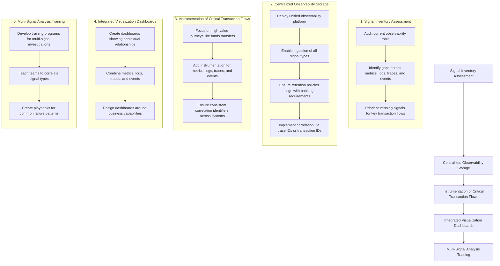

#### Step-by-Step Process:

1. **Signal Inventory Assessment**:\
   Begin with a comprehensive audit of your observability tools. Identify gaps in metrics, logs, traces, and events coverage, focusing on transaction flows critical to banking operations such as payments, trading, and account management. Prioritize missing signals to address first.

2. **Centralized Observability Storage**:\
   Deploy a unified observability platform capable of ingesting and retaining all four signal types. Implement retention policies aligned with compliance requirements. Ensure the platform supports correlation using common identifiers like trace IDs or transaction IDs.

3. **Instrumentation of Critical Transaction Flows**:\
   Add instrumentation to high-value business journeys (e.g., funds transfers, trade settlements, loan origination). Ensure all systems involved in these journeys propagate consistent correlation identifiers for seamless analysis across metrics, logs, traces, and events.

4. **Integrated Visualization Dashboards**:\
   Develop dashboards that integrate all four signal types, presenting them in contextual relationships rather than in isolation. Design these dashboards around business capabilities to provide insights relevant to operational and business outcomes.

5. **Multi-Signal Analysis Training**:\
   Train your operations teams to use all four signal types in combination. Create detailed playbooks to guide investigations from initial metrics analysis through logs, traces, and events for common failure scenarios. Ensure training emphasizes the value of inter-signal correlations for effective troubleshooting.

This structured approach ensures a systematic implementation of observability, enabling your teams to achieve complete visibility and improve their ability to detect, diagnose, and resolve issues efficiently.

## Panel 2: Beyond the Surface - Signal Depth and Dimensionality

### Scene Description

A senior SRE named Marcus demonstrates the concept of signal dimensionality to a new team member using two monitoring screens.

On the first screen, there is a simple line graph titled "Payment API Response Time (Aggregated)". The graph shows a single line representing the average response time over time, which appears to be within acceptable thresholds.

The second screen displays a more detailed visualization titled "Payment API Response Time (Segmented)". This graph includes multiple color-coded lines, each representing response times segmented by key dimensions such as customer tier, payment type, geographic region, and backend service. These segmented lines reveal a critical issue: response times for premium customers making international transfers are significantly higher than the average, despite the aggregated metric looking normal.

Marcus gestures between the two screens and explains:

```
+-------------------------+         +-----------------------------------------+
| Payment API Response    |         | Payment API Response                   |
| Time (Aggregated)       |         | Time (Segmented)                       |
|                         |         |                                         |
|      █                 |         |   ███                                   |
|      █                 |         |   █ █  ███                              |
|      █   ███           |         |   █ █  █ █  ███                         |
|      █   █ █           |         |   █ █  █ █  █ █                         |
|      █   █ █           |         |   █ █  █ █  █ █                         |
|      █   █ █           |         |   █ █  █ █  █ █                         |
+-------------------------+         +-----------------------------------------+

(Aggregated metric)                (Segmented by dimensions such as 
                                    customer tier, payment type, 
                                    and region)
```

"See here," he says, pointing to the segmented graph. "While the average response time looks fine in the aggregated view, this segmented view shows specific issues impacting high-priority premium customers. These patterns are completely hidden without adding dimensionality to our monitoring. By breaking down the data across relevant factors, we can uncover insights that drive meaningful actions."

### Teaching Narrative

Traditional monitoring often relies on surface-level signals—simple metrics with minimal dimensionality that provide generalized system health indicators. Integration & Triage introduces the concept of signal depth and dimensionality—the practice of adding contextual layers to your observability data. One-dimensional signals (like average response time) can hide critical issues affecting specific user segments or transaction types. Multi-dimensional signals reveal patterns invisible in aggregated views by segmenting data across different factors: customer types, transaction categories, geographic regions, or service dependencies. This dimensionality transforms generic measurements into richly contextual insights. For example, a payment API might show acceptable average performance while severely degraded for high-value international transfers—a critical insight for banking systems that would remain hidden without dimensional analysis. Developing this dimensional perspective requires both technical capabilities to capture contextual data and the analytical mindset to investigate beyond surface-level aggregates, significantly enhancing your ability to identify and address the issues that truly matter to your business.

### Common Example of the Problem

Continental Financial's corporate banking division implemented a new cash management platform with standard monitoring showing overall transaction success rates consistently above 99.5%, which met their SLO targets. However, several high-value corporate clients began reporting issues with bulk payment processing during month-end operations. The monitoring team repeatedly investigated but found no systemic problems in the aggregated metrics—the platform appeared healthy across all standard measurements.

After losing a major corporate client who switched to a competitor, the bank implemented dimensional monitoring that segmented metrics by client tier, transaction volume, time of month, and payment type. This revealed a critical insight: while overall success rates remained high, transactions from platinum-tier clients processing more than 10,000 payments during month-end periods experienced failure rates approaching 15%—a pattern completely masked by the aggregated metrics. The issue affected only 0.5% of total transactions but impacted the bank's most profitable client segment during their most critical processing periods.

#### Timeline of Problem Identification and Resolution

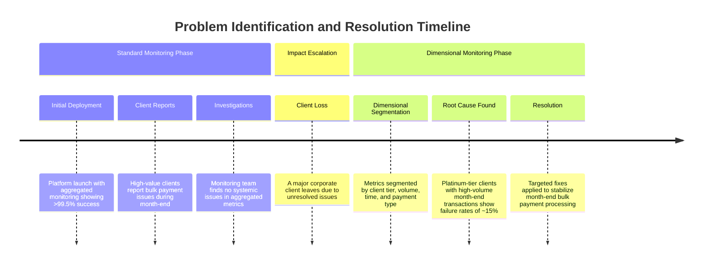

This timeline illustrates the progression from reliance on aggregated monitoring to the adoption of dimensional monitoring, which ultimately identified and resolved the hidden issue. By visualizing the sequence of events, it becomes clear how the lack of signal dimensionality initially obscured critical patterns and led to significant business impact.

### SRE Best Practice: Evidence-Based Investigation

Dimensional signal analysis requires a systematic approach to expose hidden patterns. Follow these best practices to ensure an evidence-based investigation:

#### Checklist for Dimensional Signal Analysis

- **Identify Relevant Dimensions**: Determine high-cardinality dimensions critical to your business domain (e.g., customer segments, transaction types, geographic regions, value bands). Ensure these dimensions are captured as tags or labels in your observability data.
- **Avoid Overreliance on Averages**: Use segmentation and filtering to analyze data distributions instead of relying solely on averages or aggregates.
- **Focus on Business-Critical Segments**: Develop specific views for high-value or high-risk segments, even if they represent a small percentage of total volume.
- **Establish Dimension-Specific Baselines**: Define unique baseline behaviors and thresholds for each dimension instead of applying uniform thresholds across all segments.
- **Prioritize with Domain Knowledge**: Concentrate analysis on dimensions most likely to reveal meaningful patterns, leveraging business expertise to avoid overwhelming complexity.

#### Key Insights

Evidence from financial service providers highlights the impact of dimensional monitoring. A study by the Financial Services Information Sharing and Analysis Center found organizations using dimensional analysis identified critical issues 8.3 times more frequently than those relying only on aggregate metrics. The most successful implementations prioritize business-significant segments rather than attempting to analyze all possible combinations.

By incorporating these practices, you can transform observability data into actionable insights, uncovering hidden issues and driving meaningful improvements in system reliability.

### Banking Impact

Dimensional blind spots in banking systems create disproportionate business impacts that often target the most valuable customers or critical operations. Below is a comparison of technical and business impacts to illustrate how these gaps can manifest:

| **Impact Type**         | **Technical Impact**                                                                | **Business Impact**                                                                                            |
| ----------------------- | ----------------------------------------------------------------------------------- | -------------------------------------------------------------------------------------------------------------- |
| **Client Loss**         | Aggregated metrics fail to capture critical slowdowns for specific user segments.   | Loss of high-value clients who experience recurring issues invisible in one-dimensional monitoring.            |
| **Compliance Failures** | Limited visibility into specific transaction types that require detailed reporting. | Regulatory fines and penalties due to undetected or unreported issues in compliance-sensitive operations.      |
| **Reputation Damage**   | Unaddressed slowdowns or outages for prominent customer tiers.                      | Negative press and customer dissatisfaction affecting highly visible or influential customer segments.         |
| **Revenue Impact**      | Performance issues in specific high-demand services go unnoticed.                   | Decreased profitability when high-margin services underperform or fail to meet SLAs for premium customers.     |
| **Opportunity Costs**   | Lack of insight into underperforming service dependencies or regions.               | Strategic growth initiatives stall due to unresolved bottlenecks in critical areas, reducing competitive edge. |

For banking institutions, the business consequences of dimensional monitoring gaps often exceed the technical impact. Problems frequently concentrate in areas with outsized business significance rather than distributing evenly across operations.

**Key Insights from Industry Analysis**:

- Financial institutions implementing dimensional monitoring reduce client attrition by **18%**.
- Net Promoter Scores (NPS) increase by an average of **14 points**, directly enhancing customer retention and growth metrics.

### Implementation Guidance

To implement effective dimensional monitoring in your banking environment, follow these steps:

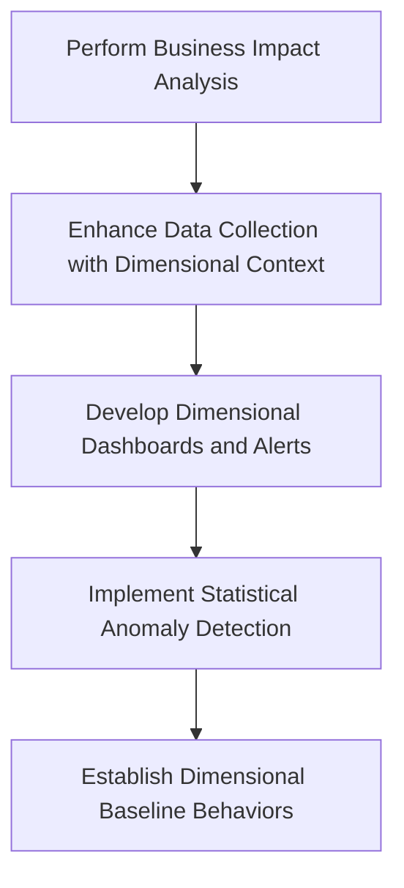

#### Step 1: Perform Business Impact Analysis

- Collaborate with product owners and business stakeholders to determine key customer segments, transaction types, and operation periods with the greatest business significance.
- Prioritize dimensions based on criteria such as revenue impact, regulatory importance, and strategic value.

#### Step 2: Enhance Data Collection with Dimensional Context

- Update your instrumentation to capture high-value dimensions as tags or labels in all telemetry data.
- Ensure consistent naming conventions for dimensions across systems and observability platforms.

#### Step 3: Develop Dimensional Dashboards and Alerts

- Build visualization layers that segment data automatically by critical dimensions, enhancing visibility into specific user groups or transaction flows.
- Configure alerts to trigger on performance degradation within specific segments rather than relying solely on aggregate metrics.

#### Step 4: Implement Statistical Anomaly Detection

- Deploy tools capable of identifying unusual patterns within dimensional subsets of data.
- Focus on high-cardinality dimensions where manual analysis is impractical, leveraging automation to detect anomalies.

#### Step 5: Establish Dimensional Baseline Behaviors

- Document normal performance patterns for each critical dimension, ensuring baselines account for seasonality and business context.
- Adjust baselines for expected variations, such as end-of-month processing spikes, tax season loads, or holiday traffic fluctuations.

## Panel 3: Signal-to-Noise Ratio - Finding Clarity in Complexity

### Scene Description

Two adjacent bank monitoring centers illustrate a stark contrast:

**Chaotic Monitoring Center:**

- Screens flashing with hundreds of alerts in rapid succession.
- Engineers frantically responding to numerous notifications, many of which are false positives.
- Critical alerts lost amidst the overwhelming noise.
- Disorganized workflows and constant interruptions.

**Optimized Monitoring Center:**

- Filtered dashboards displaying only significant anomalies.
- Clear visual hierarchies distinguishing critical issues from minor ones.
- Engineers focused on meaningful investigations rather than endless alert triage.
- A whiteboard prominently displaying the "Signal Refinement Process," with steps for:
  - Filtering irrelevant signals.
  - Correlating related alerts.
  - Prioritizing critical events.

#### Text-Based Representation of the Contrast:

```
Chaotic Center                              Optimized Center
---------------------------------------------------------------
- Screens overload engineers                 - Dashboards highlight key anomalies
- Critical alerts buried in noise            - Critical issues clearly distinguished
- Teams overwhelmed by false positives       - Engineers focus on meaningful tasks
- Disorganized workflows                     - Structured approach with "Signal Refinement"
```

This side-by-side visualization captures the transformation from a noise-filled environment to a signal-focused ecosystem, helping teams identify and act on critical signals with greater clarity and efficiency.

### Teaching Narrative

Traditional monitoring environments often suffer from severe signal noise—generating excessive alerts, redundant notifications, and undifferentiated warnings that overwhelm operators. Integration & Triage introduces the critical concept of signal-to-noise ratio optimization—the deliberate practice of amplifying meaningful signals while filtering out distractions. This approach recognizes that not all signals are equally valuable; an excessive focus on low-level metrics creates alert fatigue and obscures truly important indicators. Improving signal clarity requires both technical refinement (better alerting thresholds, de-duplication, correlation) and conceptual prioritization (distinguishing business-critical signals from merely informational ones). For banking systems where certain failures have regulatory and financial implications, this clarity becomes especially crucial. The mindset shift involves moving from "more data is better" to "more relevant data is better," creating observability environments where critical signals remain clearly visible even during complex incidents. This transformation from noise-filled to signal-focused observability dramatically improves incident detection and diagnosis, particularly for subtle issues that might otherwise be lost in monitoring chaos.

### Common Example of the Problem

Eastern Trust Bank's fraud detection platform generated over 18,000 alerts daily, requiring a team of 24 analysts working in shifts to review and triage these notifications. Despite this significant resource investment, several major fraud incidents were missed entirely because the crucial indicators were buried among thousands of low-severity alerts. In a particularly costly incident, unusual transaction patterns indicating a sophisticated account takeover attack generated appropriate alerts, but these critical signals were lost among hundreds of routine notifications. By the time the fraud was discovered through customer complaints, the attackers had processed over $3.2 million in unauthorized transfers across 142 customer accounts.

The table below summarizes the key metrics of this incident, highlighting how the overwhelming noise led to critical failures:

| Metric                          | Value        |
| ------------------------------- | ------------ |
| Total daily alerts              | 18,000       |
| Analysts on duty                | 24           |
| Average alerts per analyst/hour | 62           |
| Time spent per alert (average)  | 45 seconds   |
| Critical fraud alerts generated | 3            |
| Fraud loss before detection     | $3.2 million |
| Impacted customer accounts      | 142          |

Post-incident analysis revealed that the relevant alerts had been generated correctly but were simply overlooked by overwhelmed analysts. The fundamental problem wasn't a detection failure but rather a signal visibility failure—critical information was generated but rendered effectively invisible by excessive noise.

### SRE Best Practice: Evidence-Based Investigation

Improving signal-to-noise ratio requires a systematic and evidence-driven approach. Below is a step-by-step checklist to guide practitioners through the process:

#### Evidence-Based Investigation Checklist

1. **Define a Signal Classification Framework**

   - Categorize alerts based on business impact rather than technical severity.
   - Distinguish between actionable signals (requiring direct intervention) and informational signals (for situational awareness).
   - Align classifications with regulatory, financial, and operational priorities.

2. **Implement Progressive Filtering Techniques**

   - Apply de-duplication to remove redundant alerts.
   - Use correlation to group related alerts into a single actionable signal.
   - Throttle repetitive alerts within a short timeframe.
   - Introduce intelligent grouping for events impacting multiple systems or services simultaneously.

3. **Set Contextual Suppression Rules**

   - Automatically suppress known noise during specific operational events (e.g., maintenance windows, deployments, scheduled batch processes).
   - Incorporate dynamic rules that adapt to event-specific noise patterns.

4. **Integrate Anomaly Detection**

   - Establish behavioral baselines for key systems and applications.
   - Highlight meaningful deviations using adaptive thresholds or machine-learning techniques instead of static limits.
   - Continuously refine baselines based on evolving system behavior.

5. **Analyze and Iterate**

   - Review alerting data regularly to identify recurring noise patterns.
   - Adjust thresholds, rules, and filtering mechanisms based on post-incident reviews and signal efficacy metrics.
   - Engage stakeholders to validate prioritization and ensure alignment with business objectives.

#### Evidence-Based Signal Refinement Flow

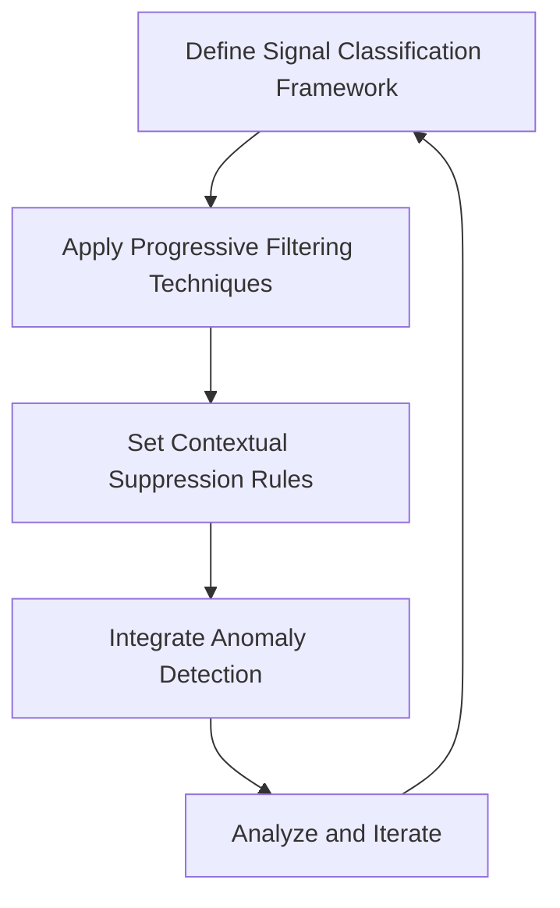

#### Key Insights

Evidence from financial institutions demonstrates the effectiveness of this approach:

- Alert volume reductions of up to **78%**, enabling teams to focus on critical issues.
- Improved incident detection by **23%**, as critical signals became more visible.

For example, the most impactful early refinements typically include:

- Reducing redundant alerts (which account for 30-40% of total volume).
- Implementing contextual filtering during known operational events.

By following this systematic process, SRE teams can transform chaotic monitoring environments into streamlined observability systems, ensuring clarity and focus even during complex incidents.

### Banking Impact

Alert noise in banking environments creates substantial business impacts. The following visual highlights the key consequences and their cascading effects:

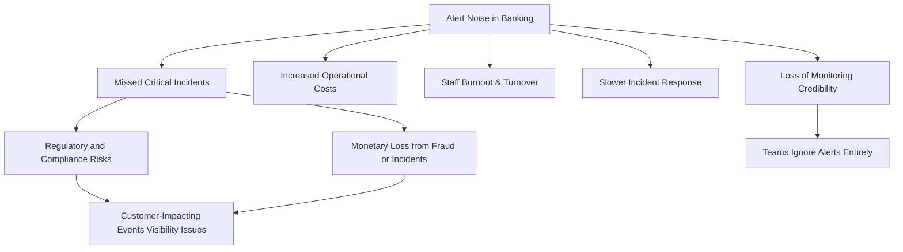

#### Key Impacts:

- **Missed Critical Incidents**: Important alerts are obscured by excessive noise, leading to undetected failures.
- **Increased Operational Costs**: Larger teams are required to process high alert volumes, driving up costs.
- **Staff Burnout and Turnover**: Continuous alert fatigue reduces team effectiveness and increases attrition.
- **Slower Incident Response**: Teams waste time sifting through noise, delaying identification of meaningful signals.
- **Loss of Monitoring Credibility**: Overwhelmed systems lose trust, causing teams to ignore alerts entirely.

For regulated financial institutions, these issues escalate into compliance risks when regulatory-relevant alerts are missed. Additionally, preventable fraud or security incidents can result in significant monetary losses.

> **Did you know?**\
> Studies show that 47% of major customer-impacting banking incidents involved alerts that were generated but overlooked due to excessive noise. Financial institutions that prioritize signal-to-noise optimization typically reduce operational costs by **30-40%** while substantially enhancing detection and response effectiveness.

### Implementation Guidance

To improve signal-to-noise ratio in your banking environment, follow the structured process outlined below. The flowchart provides a visual representation of the steps to guide your implementation:

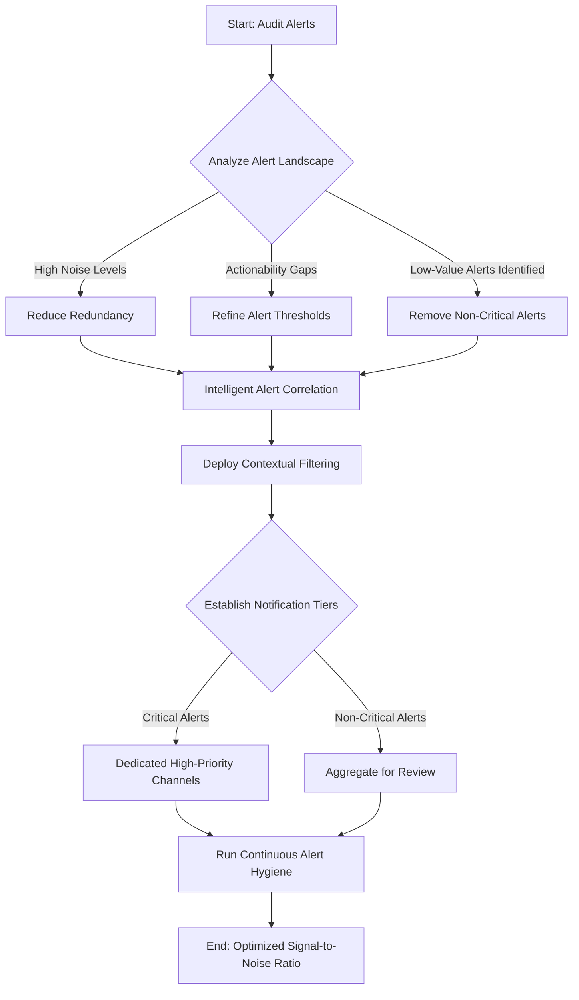

1. **Conduct alert volume analysis**: Audit your current alert landscape to identify patterns of noise, redundancy, and low-value notifications. Categorize alerts by actionability, business impact, and historical value to prioritize optimization efforts.

2. **Implement intelligent alert correlation**: Deploy alert correlation mechanisms that group related notifications into single incidents rather than generating separate alerts. Configure correlation rules based on temporal proximity, affected systems, and alert types.

3. **Deploy contextual filtering**: Create context-aware suppression rules that automatically filter expected noise during known operational events. Develop an operational calendar identifying scheduled activities that generate predictable alert patterns.

4. **Establish tiered notification channels**: Create differentiated delivery mechanisms for different alert priorities. Ensure high-priority signals reach appropriate responders through dedicated channels, while lower-priority notifications are aggregated for periodic review.

5. **Implement continuous alert hygiene**: Establish an ongoing process for measuring alert effectiveness (true/false positive rates, time-to-acknowledge, time-to-resolve) and regularly prune ineffective alerts. Create a governance framework requiring justification for new alerts to prevent noise regeneration.

By following this structured process and using the flowchart as a guide, teams can systematically reduce noise, highlight critical signals, and maintain a refined monitoring ecosystem.

## Panel 4: Time Horizons - The Power of Historical Context

### Scene Description

A banking integration team is investigating an intermittent payment processing issue. Their workspace shows multiple monitors displaying the same metrics but across different time windows. These include:

- **Real-time**: Last 30 minutes
- **Daily patterns**: 24 hours
- **Weekly cycles**: 7 days
- **Monthly trends**: 30 days
- **Quarterly views**: 90 days

The following timeline illustrates how these time windows align and stack to provide a broader context:

```
Real-time  |----------------------| (30 min)
Daily      |----------------------------------------------------------| (24 hrs)
Weekly     |--------------------------------------------------------------------------| (7 days)
Monthly    |--------------------------------------------------------------------------------------------| (30 days)
Quarterly  |--------------------------------------------------------------------------------------------------| (90 days)
```

As they analyze the issue, a team member points excitedly at the quarterly view, which reveals that the current error pattern perfectly matches issues from exactly 90 days ago—during the previous end-of-quarter financial processing. This provides crucial context invisible in the shorter timeframes. The team immediately begins investigating specific quarterly processing jobs that might be causing the pattern.

### Teaching Narrative

Traditional monitoring typically focuses on immediate timeframes—what's happening now or in the very recent past. Integration & Triage introduces the concept of time-horizon analysis—examining signals across multiple time scales to reveal patterns invisible in limited views. System behavior often exhibits natural cycles and rhythms: daily batch processing, weekly maintenance windows, monthly reporting, quarterly financial operations, or annual tax seasons. These temporal patterns create recurring conditions that may trigger issues only during specific time windows or combinations of events. Developing a multi-horizon perspective allows you to connect current anomalies with historical patterns, distinguishing between truly new issues and recurrences of known behaviors. For banking systems with complex financial calendars, this temporal context becomes especially valuable, helping you identify correlations between business cycles and system performance. The mindset shift involves expanding your observability time horizon from "what's happening now" to "how does this compare to similar periods in the past," significantly enhancing your ability to diagnose cyclical or seasonal issues that might otherwise appear random or unpredictable.

### Common Example of the Problem

Meridian Investment Bank's wealth management platform experienced mysterious performance degradation on the first Monday morning of each month, with transaction processing times increasing by 200-300% between 9:00 AM and 11:30 AM. The operations team repeatedly investigated these incidents in isolation, focusing on immediate diagnostic data—current resource utilization, error logs, and recent code deployments. Each incident was treated as a unique occurrence requiring fresh investigation.

After six months of recurring issues, a new SRE joined the team and implemented multi-horizon analysis, comparing the current incident to historical data. This revealed a clear pattern: the slowdowns perfectly aligned with the monthly processing of dividend distributions which ran during the same timeframe. Further investigation showed that the dividend processing jobs consumed database resources needed by the transaction processing system, creating resource contention that manifested as slowdowns. This connection remained invisible when examining only the immediate timeframe of each incident without historical context spanning multiple months.

#### Checklist: Steps to Identify and Resolve the Pattern

1. **Observe Immediate Symptoms**

   - Monitor current metrics (e.g., resource utilization, error logs, transaction response times).
   - Identify the timeframe and duration of the issue.

2. **Expand Time Horizons**

   - Review historical data across longer periods (e.g., daily, weekly, monthly trends).
   - Look for recurring patterns or anomalies during similar time windows.

3. **Correlate with Business Events**

   - Map observed patterns to operational and business calendars (e.g., monthly dividend processing, end-of-quarter activities).
   - Identify specific system activities or jobs that overlap with the issue timeframe.

4. **Investigate Resource Contention**

   - Trace resource usage (e.g., database connections, CPU, memory) during the identified timeframe.
   - Determine if overlapping processes are competing for critical resources.

5. **Validate the Hypothesis**

   - Simulate or reproduce the issue in a controlled environment, focusing on the suspected root cause.
   - Verify whether resolving the identified contention eliminates the issue.

6. **Implement Preventative Solutions**

   - Adjust scheduling or resource allocation for conflicting processes.
   - Add monitoring alerts for similar patterns to proactively detect future recurrences.

By following this checklist, the SRE team was able to pinpoint the root cause and implement a solution, ensuring that dividend processing jobs no longer interfered with transaction processing. This multi-horizon approach highlights the importance of expanding beyond real-time monitoring to uncover cyclical or recurring issues within complex systems.

### SRE Best Practice: Evidence-Based Investigation

Multi-horizon analysis requires a systematic time-based approach to maximize its effectiveness. The following table summarizes recommended time windows, tools, and data retention policies:

| **Time Window**      | **Purpose**                                                              | **Tools/Capabilities**                                   | **Recommended Data Retention**                    |
| -------------------- | ------------------------------------------------------------------------ | -------------------------------------------------------- | ------------------------------------------------- |
| Real-time (Minutes)  | Detect immediate issues and anomalies.                                   | Real-time dashboards, alerting systems.                  | 24-48 hours at high resolution.                   |
| Short-term (Daily)   | Analyze daily trends and detect intra-day patterns.                      | Comparative visualizations, daily heatmaps.              | 7-14 days at medium resolution.                   |
| Medium-term (Weekly) | Identify weekly cycles such as maintenance windows or weekly reporting.  | Week-over-week overlays, historical trend comparison.    | 3-6 months at reduced resolution.                 |
| Long-term (Monthly)  | Track monthly reporting and recurring workloads.                         | Monthly pattern visualization, anomaly detection tools.  | 12 months at reduced resolution.                  |
| Extended (Quarterly) | Correlate with quarterly business cycles like financial processing jobs. | Historical dashboards with quarterly overlays.           | 15 months to capture annual trends.               |
| Annual+              | Account for seasonal and annual cycles or rare periodic events.          | Year-over-year comparison, archival data analysis tools. | 15-24 months at progressively reduced resolution. |

**Best Practices:**

1. **Standardize Time Windows**: Ensure consistent analysis across real-time, daily, weekly, monthly, quarterly, and annual views to capture a full range of temporal patterns.

2. **Leverage Comparative Visualizations**: Use tools that allow you to overlay current metrics with historical data from similar time periods (e.g., same day of the week, same financial quarter).

3. **Optimize Data Retention**: Maintain adequate historical telemetry data with appropriate resolution. Adopt a progressive reduction in data granularity to balance storage needs while retaining long-term insights.

4. **Correlate with Business Calendars**: Map system performance against business events and cycles to uncover relationships between technical behavior and operational workflows.

**Proven Impact:**

Evidence from financial operations highlights the value of this approach. Studies show that incidents with cyclic patterns—accounting for approximately 43% of total incidents—are resolved 74% faster when multi-horizon analysis is applied. Organizations that maintain at least 15 months of historical data consistently outperform peers in identifying and resolving cyclical issues, especially during critical periods like end-of-quarter financial processing.

### Banking Impact

Temporal context gaps in banking environments create significant business impacts:

1. Repeated investigation of recurring issues, wasting resources on rediscovering the same root causes
2. Extended resolution times when cyclical patterns remain unrecognized
3. Inability to perform preventative actions for predictable issues tied to business cycles
4. Customer frustration with repeated issues during critical business periods
5. Missed opportunities to correlate system performance with business activities

For financial institutions with complex business calendars, the inability to connect technical performance to time-based business operations compounds these impacts, as critical processing periods (month-end, quarter-end, tax year transitions) often coincide with increased system demands. Analysis indicates that financial organizations implementing multi-horizon analysis reduce repeat incidents by 62% and decrease mean-time-to-resolution for cyclical issues by 54%, directly improving both operational efficiency and customer experience during peak processing periods.

#### Cascading Impacts of Temporal Context Gaps

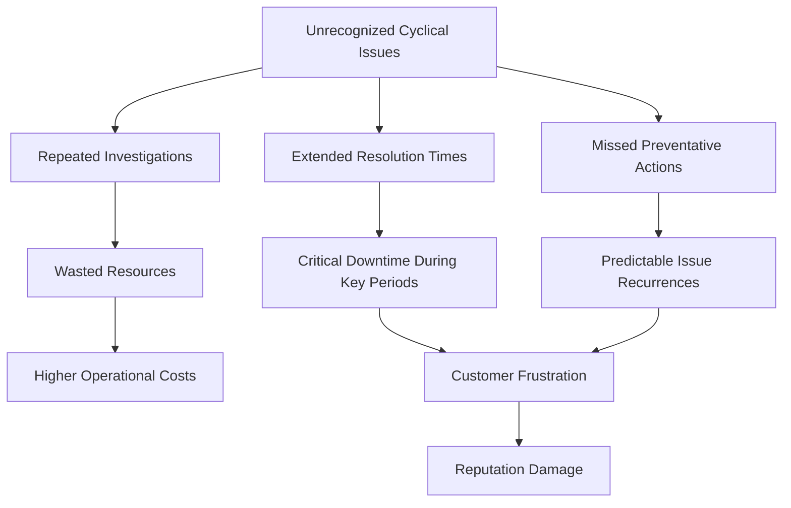

This diagram illustrates the cascading effects of failing to identify temporal patterns in banking systems. Missing these connections leads to a chain reaction: repeated investigations drain resources, downtime during critical periods frustrates customers, and predictable issues recur, ultimately affecting operational efficiency and customer trust. By adopting multi-horizon analysis, these impacts can be mitigated effectively, driving improvements across both technical and business outcomes.

### Implementation Guidance

To implement effective time-horizon analysis in your banking environment, follow these steps:

#### Checklist for Implementation

1. **Establish appropriate data retention policies**:

   - Configure observability platforms to retain telemetry data with tiered resolution:
     - High resolution for recent data (e.g., last 7–30 days).
     - Progressively reduced resolution for older data (e.g., aggregated hourly/daily metrics).
   - Ensure retention periods align with your longest business cycles:
     - Minimum 13 months to capture annual patterns.

2. **Develop multi-horizon visualization capabilities**:

   - Create dashboard templates to display the same metrics across multiple time windows:
     - Real-time (last 30 minutes), daily (24 hours), weekly (7 days), monthly (30 days), quarterly (90 days), and yearly (12 months).
   - Implement overlay capabilities to compare current patterns with historical periods for deeper insights.

3. **Create a business calendar integration**:

   - Document all regular business operations in a comprehensive calendar:
     - Examples: batch job schedules, financial close periods, tax deadlines.
   - Integrate this calendar with your observability platform:
     - Annotate dashboards and timelines with business context for technical events.

4. **Implement automated pattern recognition**:

   - Deploy tools to automate pattern analysis:
     - Identify metric similarities between current and historical periods.
     - Generate suggestions for related past incidents to accelerate root cause analysis.
   - Use machine learning or statistical models to detect recurring issues tied to business cycles.

5. **Train teams on cyclical investigation techniques**:

   - Develop training programs focused on historical analysis:
     - Teach teams to examine metrics across multiple time horizons.
     - Emphasize correlation of technical patterns with business calendar events.
   - Create playbooks for investigating cyclical issues:
     - Include step-by-step instructions for identifying and resolving recurring anomalies.

#### Example Workflow

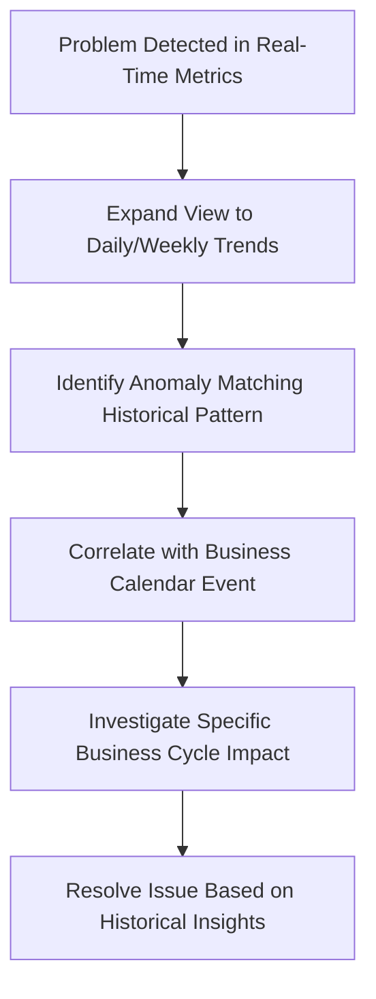

By following this checklist and workflow, your team can systematically implement time-horizon analysis, ensuring effective detection and resolution of cyclical or seasonal issues in your banking systems.

## Panel 5: Signal Reliability - Truth, Half-Truths, and Gaps

### Scene Description

A banking SRE team is conducting a post-mortem for a missed payment outage. On a whiteboard, they've created a matrix evaluating their different signal sources. The matrix is structured with the following columns:

```
+--------------+------------+----------+-------------+
| Reliability  | Coverage   | Accuracy | Timeliness  |
+--------------+------------+----------+-------------+
| Signal A     | High       | Medium   | Low         |
| Signal B     | Low        | High     | High        |
| Signal C     | Medium     | Low      | Medium      |
+--------------+------------+----------+-------------+
```

Some critical application areas show alarming gaps with no monitoring coverage, while other areas have contradictory signals that provided confusing information during the incident. The team is systematically identifying blind spots and conflicting indicators, developing a signal reliability improvement plan to ensure they have trustworthy observability for all critical banking functions.

### Teaching Narrative

Traditional monitoring often assumes signal reliability—that the data collected accurately represents system reality. Integration & Triage introduces the essential concept of signal validation—the practice of critically evaluating the trustworthiness of your observability data. This perspective recognizes that signals can be missing (coverage gaps), misleading (false positives or negatives), delayed (timing discrepancies), or contradictory (conflicting indicators). In complex banking systems with hundreds of interconnected services, no single signal source represents absolute truth; each provides a perspective that must be verified and correlated. Developing a critical approach to signal reliability means constantly questioning: "Does this metric accurately reflect customer experience?" "Are we missing signals from critical components?" "Do these contradictory indicators suggest monitoring issues or actual system problems?" This skeptical mindset transforms how you evaluate observability data, preventing dangerous assumptions and enhancing diagnostic accuracy. For regulated banking environments where observability has compliance implications, establishing signal reliability becomes especially crucial, ensuring you can confidently identify and address issues affecting financial transactions.

### Common Example of the Problem

Universal Banking Group's trading platform suffered a major outage that went undetected by monitoring systems for 47 minutes, despite affecting over 4,000 customers attempting to execute trades. The monitoring dashboard showed all systems operating normally with healthy metrics across all components: application servers showed normal CPU and memory utilization, database response times appeared optimal, and network connectivity indicators displayed no issues. However, customers were experiencing complete inability to complete trades, with transactions silently failing after submission.

Post-incident analysis uncovered a critical signal reliability issue:

- Health checks and metrics were measuring connectivity to the system's replica databases, while the primary write database had failed completely.
- All read operations (reflected in monitoring) functioned normally, while write operations (trade executions) failed silently.
- Synthetic transaction monitoring, designed to verify end-to-end functionality, had been disabled during a recent maintenance window and never re-enabled.

To better illustrate the sequence of events, the following timeline provides a clear view of the outage:

```mermaid
gantt
    title Sequence of Events During the Outage
    dateFormat HH:mm
    axisFormat %H:%M
    section System Events
    Outage Begins :crit, o1, 09:12, 47min
    Replica Databases Functional (Read-Only): active, r1, 09:12, 47min
    Primary Database Fails (Write Operations): crit, d1, 09:12, 47min
    Synthetic Monitoring Disabled : inactive, m1, 09:00, 47min
    section Observability
    Monitoring Shows "Healthy" :active, s1, 09:12, 47min
    No Alerts Triggered :active, a1, 09:12, 47min
    section Customer Impact
    Trade Failures Begin :crit, c1, 09:12, 47min
    Customer Complaints Escalate :crit, e1, 09:30, 29min
    Operations Team Identifies Outage :milestone, t1, 09:59, 0min
```

This timeline highlights how misleading signals and monitoring gaps allowed a major outage to persist unnoticed:

1. **Outage Begins (09:12):** The primary write database fails, causing all trade execution attempts to silently fail.
2. **Monitoring Fails to Detect Issue:** Health checks reflect activity on replica databases, masking the primary database failure. Synthetic monitoring is offline.
3. **Customer Complaints Escalate (09:30):** Frustrated customers begin reporting issues, leading to a surge in complaints.
4. **Outage Identified (09:59):** Operations teams finally correlate customer reports with system behavior, uncovering the root cause.

This incident underscores the importance of verifying signal reliability across critical pathways and ensuring monitoring systems provide comprehensive, end-to-end coverage to detect issues before they impact customers.

### SRE Best Practice: Evidence-Based Investigation

Establishing signal reliability requires a systematic validation approach to ensure observability data accurately reflects system behavior. The following checklist summarizes best practices for conducting evidence-based investigations and improving signal reliability:

#### Signal Reliability Checklist:

- **Signal Inventory**:

  - Document all telemetry sources, including their collection methods, expected update frequencies, and known limitations.
  - Regularly review and update the inventory to reflect changes in system architecture.

- **Independent Verification**:

  - Cross-validate critical signals using alternative measurement approaches to identify discrepancies.
  - Incorporate redundant monitoring paths to avoid reliance on a single source of truth.

- **Synthetic Transactions**:

  - Deploy end-to-end synthetic transactions to test complete user journeys, not just individual components.
  - Simulate real-world scenarios to verify system availability and performance from the customer perspective.

- **Signal Reliability Metrics**:

  - Track historical accuracy, freshness, and correlation of signals with actual user experience.
  - Use these metrics to proactively identify and address gaps or inconsistencies in monitoring.

#### Supporting Insights:

Evidence from financial institutions highlights the importance of prioritizing these practices. Analysis of major incidents at investment banks reveals that 36% involve "monitoring blindness," where issues remain undetected due to unreliable signals. The most effective implementations leverage synthetic transaction monitoring to validate end-to-end functionality, ensuring that system availability aligns with what customers actually experience. By applying this critical, evidence-based approach, SRE teams can significantly improve diagnostic accuracy and reduce risks associated with incomplete or misleading observability data.

### Banking Impact

Signal reliability issues in banking environments create significant business and regulatory risks:

1. Undetected outages directly impacting customer transactions while monitoring shows healthy systems
2. False confidence in system status leading to incorrect assurance to customers and stakeholders
3. Compliance violations when reporting relies on inaccurate monitoring data
4. Extended mean-time-to-detection when issues occur in unmonitored system components
5. Misallocated engineering efforts addressing symptoms rather than underlying causes due to misleading signals

For regulated financial institutions, signal reliability directly affects regulatory reporting obligations, as inaccurate monitoring can lead to failure to disclose reportable incidents or incorrect status information provided to regulators. Industry analysis indicates that financial organizations implementing comprehensive signal reliability programs reduce undetected outages by 74% and decrease mean-time-to-detection by 63%, significantly reducing both financial and regulatory impacts.

### Implementation Guidance

To improve signal reliability in your banking environment, follow these steps:

| **Action**                                     | **Purpose**                                                                                                 | **Example**                                                                                       |
| ---------------------------------------------- | ----------------------------------------------------------------------------------------------------------- | ------------------------------------------------------------------------------------------------- |
| **Conduct a signal reliability audit**         | Identify blind spots, single points of failure, and misleading indicators in your current monitoring setup. | Inventory all signal sources, assessing their reliability and documenting areas with no coverage. |
| **Implement synthetic customer journeys**      | Validate that monitoring reflects actual customer experience by simulating end-to-end user flows.           | Use synthetic transactions to test login, account balance checks, and fund transfers via APIs.    |
| **Establish signal validation mechanisms**     | Cross-verify critical signals using multiple independent methods to identify discrepancies.                 | Reconcile transaction success metrics between the payment gateway and database logs.              |
| **Develop reliability metrics and dashboards** | Monitor the health of your telemetry systems by tracking signal reliability indicators.                     | Create dashboards showing data freshness, success rates, and historical accuracy trends.          |
| **Implement continuous reliability testing**   | Test and validate observability systems through deliberate fault injection and chaos experiments.           | Simulate network delays or telemetry outages to ensure critical issues remain detectable.         |

By systematically implementing these actions, you can build a more trustworthy and resilient observability framework. Each step ensures that your monitoring systems provide reliable, timely, and actionable insights into your banking operations.

## Panel 6: Business Context - Connecting Signals to Impact

### Scene Description

A large banking operations center during a major incident. Technical dashboards display system metrics like server CPU utilization, error rates, and system latency. However, prominently displayed on central screens are business impact dashboards showing real-time financial implications: transaction volume drop, revenue impact calculations, affected customer counts by segment, and regulatory reporting requirements triggered by the incident. As technical teams work on resolution, business stakeholders reference these impact metrics to make decisions about communication strategies, compensatory actions, and prioritization.

The scene highlights the transformation from technical signals to business-meaningful metrics that drive decision-making. Below is a simple flow diagram to illustrate this relationship:

```
Technical Signal (e.g., CPU Utilization, Latency, Error Rate)
          |
          v
Business Contextualization (e.g., Transaction Processing Capacity, Customer Wait Time, Failed Customer Journeys)
          |
          v
Business Impact Metrics (e.g., Revenue Impact, Affected Customer Count, Regulatory Triggers)
```

This process demonstrates how abstract technical measurements are linked to concrete organizational outcomes, enabling faster, aligned decision-making during incidents. By translating technical signals into business-relevant insights, the organization ensures that both technical and business teams remain unified in their response.

### Teaching Narrative

Traditional monitoring focuses primarily on technical signals—system metrics disconnected from business context. Integration & Triage introduces the transformative concept of business-contextualized signals—observability data directly linked to organizational outcomes and customer impact. This perspective shift transforms abstract technical measurements into meaningful business insights: server CPU becomes "transaction processing capacity," error rates become "failed customer journeys," and latency becomes "customer wait time." For banking systems where technical issues directly impact financial operations, regulatory compliance, and customer trust, this business context is essential for proper prioritization and response. Developing this contextual awareness requires close collaboration between technical and business teams to define the relationships between system behavior and organizational outcomes. The resulting shared understanding enables faster, more aligned decision-making during incidents while ensuring technical teams understand the real-world implications of system performance. This transformation from technically-focused to business-contextualized observability represents a crucial maturation in your Integration & Triage practice, ensuring that signal interpretation remains centered on what truly matters to your organization.

### Common Example of the Problem

Pacific Financial's mortgage origination platform experienced an intermittent database slowdown affecting application processing. The technical team observed query latency increasing from 50ms to 900ms and immediately focused on database optimization, index tuning, and query rewrites—treating it as a purely technical performance issue. The incident received standard priority and normal business hours attention over several days. Meanwhile, the business impact remained entirely invisible to technical teams: mortgage applications were stalling at month-end, a critical period representing 40% of monthly origination volume. Each day of delay was causing application abandonment, resulting in approximately $4.2M in lost mortgage origination opportunities daily. The technical team had no visibility into this business context and prioritized the issue based solely on technical severity (moderate database slowdown) rather than business impact (severe revenue loss during peak period). Had they understood the business context—that month-end mortgage applications represented the company's highest-margin product during its peak volume period—the incident would have received significantly different prioritization and resources.

| **Technical Signal**          | **Technical Team's View**                 | **Business Impact**                                                  | **Business Stakeholder's View**                                     |
| ----------------------------- | ----------------------------------------- | -------------------------------------------------------------------- | ------------------------------------------------------------------- |
| Query Latency (50ms → 900ms)  | Moderate database performance degradation | $4.2M daily revenue loss due to stalled mortgage applications        | Critical revenue impact during month-end peak period                |
| Application Processing Delays | Routine optimization issue                | High customer abandonment rate for high-margin mortgage applications | Significant customer experience and trust repercussions             |
| Incident Priority             | Standard, normal business hours effort    | Missed regulatory deadlines and lost competitive positioning         | Requires immediate attention due to financial and reputational risk |

This table highlights the disconnect between the technical team's interpretation of system signals and the business stakeholders' understanding of organizational impact. Bridging this gap by contextualizing technical signals with business outcomes ensures incidents are properly prioritized and addressed with the urgency they require.

### SRE Best Practice: Evidence-Based Investigation

Establishing business-contextualized observability requires a systematic approach. Follow these key steps to ensure effective implementation:

#### Checklist for Implementing Business-Contextualized Observability

1. **Service-to-Business Impact Mapping**

   - Document the relationships between technical components and business capabilities.
   - Include key dimensions such as revenue impact, customer experience significance, and regulatory implications.
   - Regularly validate and update the map as systems and business priorities evolve.

2. **Develop Business-Aligned Metrics**

   - Translate technical measurements into business outcomes:
     - *Example*: Convert "error rates" into "failed customer journeys."
     - *Example*: Represent "latency" as "customer wait time."
   - Prioritize metrics that directly reflect organizational goals, such as revenue, compliance, or customer satisfaction.

3. **Implement Real-Time Business Impact Dashboards**

   - Design automated dashboards that calculate and display the organizational consequences of technical issues in real time.
   - Ensure dashboards are accessible to both technical and business stakeholders for seamless decision-making.

4. **Define Business-Oriented SLIs and SLOs**

   - Establish clear Service Level Indicators (SLIs) and Service Level Objectives (SLOs) tied to customer experience and business outcomes.
   - Avoid relying solely on technical metrics; ensure SLIs/SLOs resonate with broader organizational priorities.

5. **Foster Collaboration Between Technical and Business Teams**

   - Create a shared understanding of how system behavior translates into business impact.
   - Conduct regular cross-functional reviews to align on definitions, priorities, and outcomes.

6. **Review and Refine Continuously**

   - Use incident retrospectives and real-world impacts as feedback loops to improve mappings, metrics, and dashboards.
   - Adapt to evolving business needs, industry shifts, and technical advancements.

#### Benefits of Business-Contextualized Observability

Evidence from financial institutions demonstrates the measurable impact of this approach:

- Teams using business-contextualized dashboards prioritize issues 32% more effectively.
- High-business-impact incidents are resolved 41% faster compared to teams relying solely on technical metrics.

The most effective implementations focus on translating technical metrics into specific business outcomes for each critical service. By grounding observability in business context, SRE teams can elevate their practice to ensure that signal interpretation remains tightly aligned with what truly matters to the organization.

### Banking Impact

Technical-business disconnects in banking environments create significant organizational challenges:

1. Misallocated resources focusing on technically interesting but business-irrelevant issues.
2. Delayed response to high-business-impact incidents inappropriately categorized as low technical severity.
3. Communication challenges between technical and business stakeholders using different languages to describe the same issues.
4. Difficulty justifying technology investments without clear connections to business outcomes.
5. Inability to make appropriate risk-based decisions during incident response.

For financial institutions, these disconnects are particularly problematic during major incidents when business stakeholders need to make time-sensitive decisions about customer communication, regulatory disclosure, and compensatory actions. Analysis indicates that organizations implementing business-contextualized observability reduce major incident business impact by 28% through more appropriate prioritization and faster, more aligned decision-making during critical situations.

Below is a depiction of how miscommunication or resource misallocation occurs due to technical-business disconnects, and how business-contextualized observability addresses these issues:

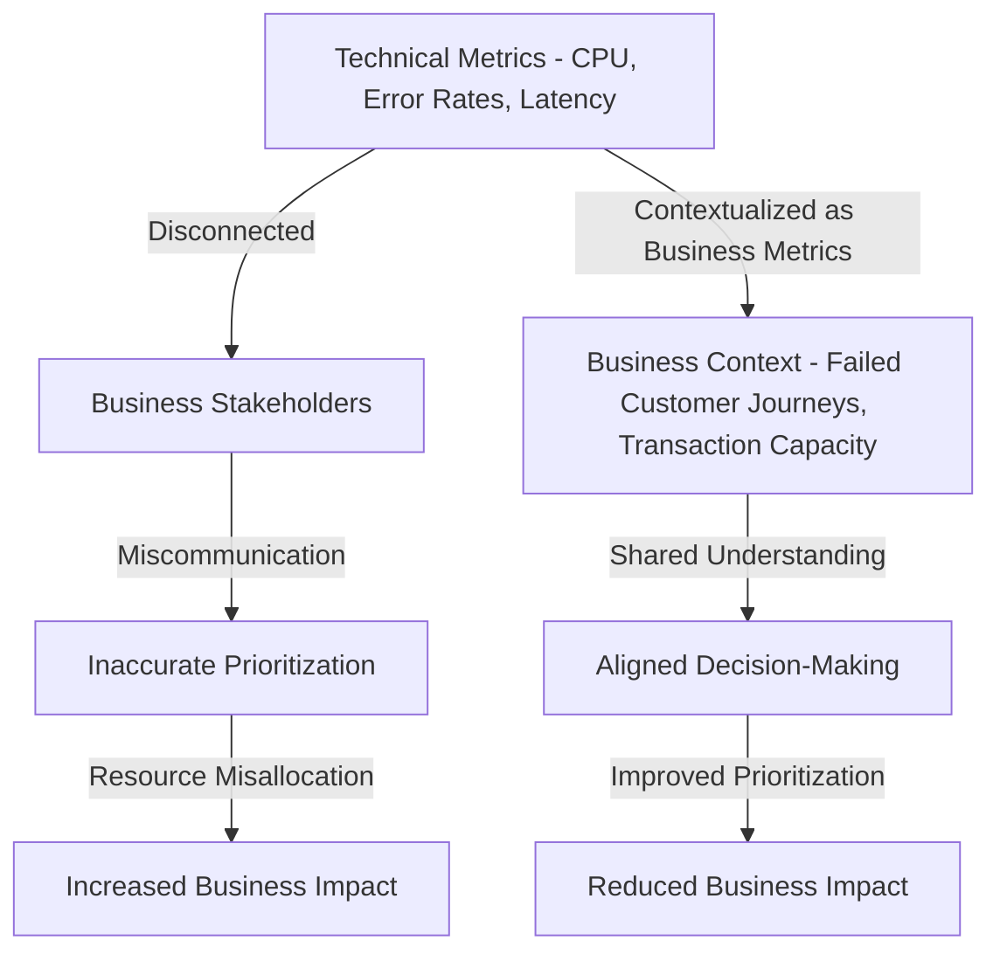

This diagram illustrates how abstract technical signals, when not contextualized, lead to miscommunication and resource misallocation, exacerbating business impacts during incidents. By translating these signals into meaningful business metrics, teams foster alignment, enabling faster response and reducing overall business impact.

### Implementation Guidance

To implement business-contextualized observability in your banking environment, follow these steps:

1. **Develop a business capability model**:\
   Work with business stakeholders to create a comprehensive map of business capabilities, their technical dependencies, and their organizational significance. Document revenue impact, customer experience implications, and regulatory requirements for each capability.

2. **Create business translation layers**:\
   Implement technical-to-business metric transformations that convert raw system measurements into business-meaningful indicators. Develop formulas that express technical metrics in terms of transaction value, customer impact, and financial outcomes.

3. **Build business impact dashboards**:\
   Create visualization layers specifically designed for business stakeholders that display the organizational consequences of technical issues in business language. Ensure these dashboards automatically calculate impact based on current conditions.

4. **Implement customer journey instrumentation**:\
   Deploy end-to-end monitoring for critical customer journeys that measures success rates, completion times, and abandonment patterns directly tied to business outcomes rather than technical components.

5. **Establish joint incident evaluation processes**:\
   Develop incident classification frameworks that incorporate both technical severity and business impact dimensions. Create incident response procedures that engage appropriate business stakeholders based on projected organizational impact rather than technical criteria alone.

The following diagram illustrates the implementation process and how the steps interconnect:

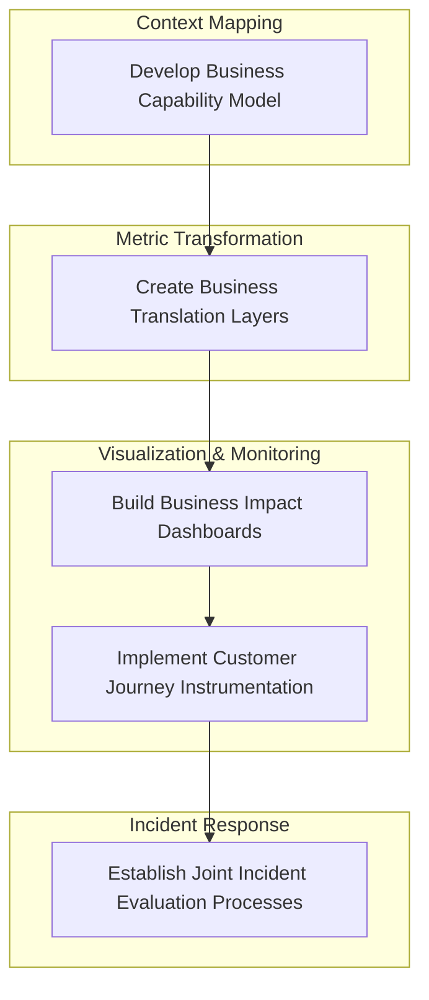

This process ensures a structured approach to embedding business context into observability practices, enabling teams to align technical signals with organizational priorities and customer impact.

## Panel 7: Signal Aggregation and Synthesis - The Unified Narrative

### Scene Description

A sophisticated banking incident response room where digital and physical tools combine to create a unified signal narrative. The room is centered around a dynamic, multi-source dashboard that integrates data from various sources: production metrics, customer support tickets, social media sentiment analysis, transaction processing rates, and system logs. At the heart of the dashboard is a timeline that correlates signals across data streams, highlighting causal relationships and patterns over time. Engineers and team members collaborate in real-time, adding annotations to this unified view to build a cohesive incident narrative that synthesizes technical signals with business impact and customer experience data.

Below is a conceptual representation of the setup:

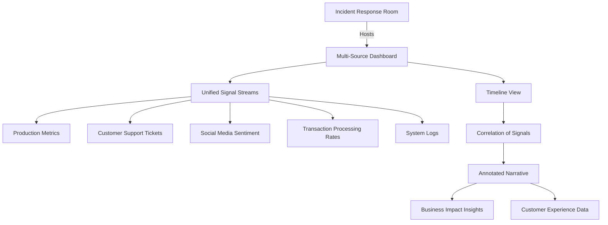

This setup fosters collaboration and ensures a holistic approach to understanding and resolving complex incidents. By visualizing the interconnections between diverse data sources, the team can identify subtle relationships and uncover the full system story, bridging technical and business perspectives effectively.

### Teaching Narrative

Traditional monitoring approaches often result in fragmented signal analysis—separate teams examining isolated data sources without synthesis. This disjointed approach is akin to trying to understand a picture by examining individual puzzle pieces in isolation, without assembling them into the full image. Integration & Triage introduces the concept of signal synthesis—the deliberate practice of combining diverse data streams into a unified narrative that reveals the complete system story. Just as assembling a puzzle requires recognizing how individual pieces fit together, signal synthesis requires correlating customer complaints with backend errors, linking deployment events with performance changes, or connecting infrastructure metrics with business impact indicators.

Developing this synthesizing mindset transforms incident analysis from parallel, disconnected investigations into a cohesive narrative-building process. This process is like weaving a tapestry, where each thread—whether a system log, a customer support ticket, or a performance metric—intertwines to reveal a larger, interconnected pattern. For banking environments with complex, interconnected systems, this unified approach becomes especially powerful. It enables you to trace issues across technical boundaries and organizational silos, uncovering subtle connections and causal relationships that might otherwise remain hidden. The resulting comprehensive perspective dramatically improves both the speed and accuracy of incident diagnosis while fostering shared understanding across technical and business teams.

### Common Example of the Problem

Capital Securities experienced a major trading platform incident affecting option execution for institutional clients. Multiple teams began parallel investigations based on their specialized domains: the application team examined logs and error rates, the infrastructure team analyzed system resources and network connectivity, the database team investigated query performance, and the security team checked for potential intrusions given unusual access patterns. Each team worked diligently within their silo, finding concerning but inconclusive signals. After three hours without resolution, a senior SRE implemented a signal synthesis approach, creating a unified timeline combining all available data sources.

Here is a simplified timeline of events illustrating the causality chain and the impact of fragmented investigations:

```
[Event: Security Certificate Expiration] 
      │
      ▼
[Event: Connection Failures Begin] --> [Application Retries] 
      │                                    │
      ▼                                    ▼
[Database Connection Pool Exhaustion] --> [Cascading Failures Across Platform]
      │                                    │
      ▼                                    ▼
[Impact: $3.7M Lost Revenue]        [Impact: Damaged Client Relationships]
```

This consolidated view revealed the actual chain of causality: a security certificate expiration triggered connection failures, causing application retries that created database connection pool exhaustion, ultimately resulting in cascading failures across the platform. Despite each team having access to relevant data within their domain, the root cause remained invisible until signals were chronologically synthesized across organizational and technical boundaries.

The fragmented investigation approach had extended the incident by hours, underscoring the critical need for a unified narrative to trace issues effectively and minimize business impact.

### SRE Best Practice: Evidence-Based Investigation

Effective signal synthesis requires a structured methodology to ensure accurate and efficient incident analysis. Use the following checklist as a practical reference during investigations:

#### Checklist: Structured Methodology for Evidence-Based Investigation

1. **Unified Incident Timeline**

   - Integrate events from all relevant sources chronologically:
     - Deployment changes
     - Configuration modifications
     - Error logs
     - Performance metrics
     - User reports
     - Business impact indicators

2. **Establish Correlation Identifiers**

   - Define and propagate common identifiers (e.g., request IDs, trace IDs, session IDs) across systems to link related signals effectively.

3. **Multi-Source Visualization**

   - Use tools that consolidate data into integrated views, emphasizing relationships between signals from different systems rather than isolating dashboards.

4. **Narrative Building**

   - Transform discrete technical observations into a cohesive story:
     - Correlate causes and effects across system boundaries.
     - Translate technical findings into business and customer impact contexts.

5. **Prioritize Chronological Correlation**

   - Focus on establishing clear causality chains by analyzing the sequence of events, ensuring no critical connections are missed.

#### Example: Financial Operations Insight

Evidence from major incident resolutions in banking demonstrates the power of this methodology:

- **68% Faster Incident Resolution**\
  Teams utilizing integrated signal synthesis resolve complex incidents significantly faster compared to those relying on fragmented data sources.
- **Key Success Factor**\
  Chronological correlation plays a pivotal role, allowing teams to uncover causality chains that remain hidden when analyzing components in isolation.

Adopting this structured, evidence-based approach shifts incident analysis from siloed investigations to a unified narrative, enabling technical and business teams to collaboratively achieve faster, more accurate resolutions.

### Banking Impact

Signal fragmentation in banking environments creates significant operational challenges:

1. Extended diagnosis times when root causes span multiple systems or organizational boundaries
2. Ineffective remediation targeting symptoms rather than underlying causes
3. Recurring incidents when fragmented understanding prevents comprehensive resolution
4. Conflicting interpretations between teams examining different data sources
5. Inconsistent communication to stakeholders based on partial understanding

For financial institutions with complex, interconnected systems spanning multiple technical domains and organizational boundaries, these challenges are particularly acute. Industry analysis indicates that banking organizations implementing comprehensive signal synthesis approaches reduce mean-time-to-diagnosis for complex incidents by 57% and decrease incident recurrence by 42%, directly improving both operational efficiency and service reliability.

### Implementation Guidance

To implement effective signal synthesis in your banking environment, follow these structured guidelines summarized in the table below:

| Step                                              | Tools and Techniques                                                                                                  | Expected Outcomes                                                                                                 |
| ------------------------------------------------- | --------------------------------------------------------------------------------------------------------------------- | ----------------------------------------------------------------------------------------------------------------- |
| **Create a unified observability platform**       | Centralized observability tools capable of ingesting data from multiple sources (e.g., metrics, logs, traces, events) | A single platform that consolidates diverse data streams, reducing silos and enabling holistic analysis.          |
| **Establish correlation identifiers**             | Implement distributed tracing, request IDs, and consistent metadata tagging across all system components              | Reliable connections between related events across systems, ensuring traceability and better root cause analysis. |
| **Develop integrated visualization capabilities** | Build dashboards with timeline-based views and multi-source data overlays                                             | Visualizations that highlight relationships between signals, enabling quicker identification of causality.        |
| **Implement narrative documentation practices**   | Create standardized templates and workflows for incident narrative construction                                       | Consistent, high-quality incident reports that synthesize technical and customer-impact data.                     |
| **Train teams on cross-domain analysis**          | Conduct cross-functional training, hands-on exercises, and workshops to enhance analytical skills                     | Teams equipped to think beyond silos, fostering collaboration and faster resolution during incidents.             |

By following these steps, your organization can build a robust and actionable signal synthesis capability, enabling rapid, accurate incident diagnosis and a shared understanding across technical and business teams.
