# Chapter 3: Alert Classification and Initial Response

## Chapter Overview

Welcome to the seven-layer dip of incident response mediocrity: “Alert Classification and Initial Response.” If you thought SRE was just about flipping off pagers and diving into logs, buckle up. This chapter rips apart the fairy tale of binary alerts and exposes the ugly, business-killing consequences of wishful thinking, knee-jerk fixes, and communication disasters. We’ll drag you through the minefields of alert fatigue, misallocated resources, and regulatory facepalms—then show you how the pros (and the merely exhausted) triage, classify, and contain chaos before it destroys your bank’s reputation, balance sheet, or both. Forget best intentions; this is about surviving the blast radius and keeping the C-suite and regulators off your back. Welcome to the grown-up table.

______________________________________________________________________

## Learning Objectives

- **Distinguish** alert severities using business impact, not just technical noise.
- **Design** and **implement** a severity-driven notification and response workflow that actually matches incident priority.
- **Apply** structured first response protocols to avoid heroics and root-cause whack-a-mole.
- **Categorize** failures with a taxonomy that exposes repeat offenders, not just one-off symptoms.
- **Verify** customer impact before wasting precious time and nerves on technical ghosts.
- **Utilize** decision matrices to replace gut feelings with consistent, defendable response strategies.
- **Execute** containment-first actions to limit damage before blowing your SLA—and your career.
- **Coordinate** stakeholder communications with the discipline of a PR-crisis pro, not a panicked sysadmin.

______________________________________________________________________

## Key Takeaways

- Not all alerts are emergencies—but treating them like one will turn your team into sleep-deprived zombies and your bank into a punchline.
- If your “critical” means “maybe” and your “informational” means “nobody cares,” you’re already losing money and credibility.
- Waking up the entire incident response team at 3 AM for 2% of check deposits is not “preparedness”—it’s operational malpractice.
- First response is not about being the fastest hero—it’s about not making things worse before you know what’s actually broken.
- Taxonomy isn’t for academic navel-gazing; it’s how you spot and fix the root cause that’s mugging you every quarter.
- Customer impact verification is the difference between real incidents and expensive LARPing in your war room.
- If your response plan depends on who’s on call, you’re not running a team—you’re running a game of Russian Roulette with your business.
- Containment is your “break glass in case of emergency.” If you’re not limiting the blast radius first, you’re just adding fuel to the fire.
- Communication isn’t extra credit. Screw it up, and you’ll have angry customers, irate execs, and auditors demanding why you didn’t follow the script.
- Every minute wasted on over-escalation, false positives, or panicked updates is a minute your competitors thank you for. Don’t be their business continuity plan.

In short: Classify ruthlessly, respond deliberately, contain mercilessly, and communicate like your job depends on it—because it does.

______________________________________________________________________

## Panel 1: Beyond Binary - The Alert Severity Spectrum

### Scene Description

A banking operations center where a newly implemented alert classification system is in action. The central display showcases a real-time dashboard with alerts sorted into five distinct severity categories: Critical, High, Medium, Low, and Informational. Each category is visually differentiated by color-coding—red for Critical, orange for High, yellow for Medium, blue for Low, and gray for Informational. Priya, a senior SRE, stands near the display, explaining the system to newer team members.

Below is a simplified text representation of the central display:

```
+----------------------+----------------------+---------------------+
|      Critical        |        High          |       Medium        |
|   (Immediate Action) | (Significant Impact) |  (Limited Impact)   |
|----------------------+----------------------+---------------------|
| - Payment Processor  | - API Latency Spike | - Disk Usage Alert  |
|   Failure Detected   | - Fraud Detection   | - Service Queue     |
|                      |   Degradation       |   Increase          |
+----------------------+----------------------+---------------------+
|        Low           |     Informational   |                     |
| (Future Concerns)    | (No Immediate Action)                      |
|----------------------+-------------------------------------------+
| - Deprecated API     | - Security Patch    |                     |
|   Usage Detected     |   Available         |                     |
+----------------------+-------------------------------------------+
```

Priya highlights how different severity levels trigger distinct response protocols. For example, Critical alerts send immediate pager notifications to the on-call team, while Informational alerts quietly populate a dashboard for later review. Team members' devices reflect this differentiation, with flashing notifications or vibrations for high-priority alerts and subtle updates for lower-priority ones. This system ensures that attention is prioritized where it is needed most, reducing both alert fatigue and misaligned responses.

### Teaching Narrative

Traditional monitoring approaches often employ a binary alert philosophy: alerts are either firing (requiring attention) or not (requiring no action). Integration & Triage introduces a more nuanced classification system—the alert severity spectrum—that recognizes not all issues demand the same urgency or response. This graduated approach categorizes alerts based on business impact, customer experience effects, and system health implications, typically using a tiered system: Critical (immediate business impact), High (significant degradation), Medium (limited impact), Low (potential future concerns), and Informational (context without action required). This classification transforms alert response from a uniform process to a differentiated approach that matches response urgency to business priority. For banking systems where certain functions (payment processing, fraud detection) are more critical than others, this prioritization ensures resources focus on the most consequential issues first. Developing this classification mindset requires defining clear, objective criteria for each severity level, ensuring consistent assessment across teams and reducing both alert fatigue and misaligned priorities. This more sophisticated approach represents a crucial evolution from binary alerting to context-aware notification systems that reflect the complex reality of modern banking environments.

### Common Example of the Problem

#### Incident Summary Table

| **Time** | **Event** | **Affected System** | **Severity Assigned** | **Actual Impact** | **Response Triggered** |
| ------------- | -------------------------------------------------------------------------- | ---------------------------- | --------------------- | ------------------------------------------------------------------- | ------------------------------------------------------------------------------------------------------- |
| 3:15 AM | Intermittent image processing errors affecting 2% of mobile check deposits | Mobile Check Deposit Feature | Critical | Minor issue affecting a small subset of users | Full incident response: Pager alerts, war room protocol, leadership involvement, customer communication |
| 4:00 AM | Resolution of investigation: Issue isolated to non-critical subset | Mobile Check Deposit Feature | Critical | Determined to require only minimal engineering effort | Operations team stands down; unnecessary disruption caused |
| Following Day | Payment processing delays for thousands of transactions | Core Transaction Processing | Critical | Major issue with regulatory and high-value transaction implications | Same response as minor issue: Pager alerts, no prioritization or escalation beyond default |

#### Timeline of Events

```mermaid
gantt
    title Incident Timeline at FirstGlobal Bank
    dateFormat HH:mm
    axisFormat %H:%M
    section Mobile Check Deposit Incident
    Urgent pager alert triggered           :done, a1, 03:15, 15m
    Full response team mobilized           :active, a2, after a1, 30m
    Issue investigation begins             :active, a3, after a2, 30m
    Issue determined as low-impact         :done, a4, after a3, 15m
    section Payment Processing Incident
    Delays detected                        :done, b1, 10:00, 15m
    Same severity alert triggered          :done, b2, after b1, 15m
    Response team mobilized ineffectively  :active, b3, after b2, 30m
```



#### Key Takeaways

- **Over-alerting Consequences**: Assigning identical severity levels to all alerts led to disproportionate responses, such as mobilizing full teams for minor issues like the mobile check deposit error, causing unnecessary disruption and resource exhaustion.
- **Underprioritization Risks**: Critical issues, such as payment processing delays, were not given the urgency they required due to the lack of differentiation in alerts, risking significant business and regulatory impact.
- **Need for Severity Differentiation**: A nuanced severity classification system would have prevented escalation of the minor issue and prioritized the major issue, ensuring resources were allocated effectively and avoiding operational inefficiencies.

### SRE Best Practice: Evidence-Based Investigation

Effective alert classification requires a systematic, evidence-based approach. Use the checklist below to guide your team in implementing best practices:

#### Step-by-Step Checklist for Evidence-Based Investigation

1. **Define Severity Framework**

   - [ ] Identify objective criteria for classification:
     - Customer impact scope (e.g., number of users affected).
     - Business function criticality (e.g., payment processing vs. logging).
     - Revenue implications (e.g., financial loss thresholds).
     - Regulatory requirements (e.g., compliance breaches).
     - Recovery complexity (e.g., time and resources needed to resolve).
   - [ ] Document these criteria for consistent application across teams.

2. **Develop Response Protocols**

   - [ ] Create tailored response actions for each severity level:
     - Critical: Engage on-call engineers and escalate to management immediately.
     - High: Notify relevant teams with a 30-minute response SLA.
     - Medium: Assign to standard incident handling workflow.
     - Low: Monitor and review during operational hours.
     - Informational: Log for periodic analysis.
   - [ ] Ensure protocols align with business priorities and urgency.

3. **Configure Notification Mechanisms**

   - [ ] Set up differentiated channels and methods for alerts:
     - Critical: Pager notifications with high-priority tones.
     - High: Push notifications with medium-priority tones.
     - Medium: Email or chat alerts for team awareness.
     - Low/Informational: Dashboard population without interruption.
   - [ ] Test notifications to confirm appropriate cognitive associations.

4. **Monitor and Iterate**

   - [ ] Track severity accuracy metrics:
     - Over-classification (false urgency rates).
     - Under-classification (missed urgency rates).
   - [ ] Conduct regular post-incident reviews to refine criteria and protocols.
   - [ ] Use feedback loops to improve classification and reduce alert fatigue.

#### Example Flow of Severity Classification and Response


#### Results from Implementation

Evidence from financial institutions demonstrates the effectiveness of this approach:

- Reduced critical incident response time by **37%**.
- Decreased unnecessary escalations by **62%**.

The most successful implementations prioritize business impact over technical severity, ensuring that even minor technical issues in critical systems are appropriately escalated, while major problems in non-core services are deprioritized. This method ensures alignment with operational priorities and resources, reducing noise and enhancing focus.

### Banking Impact

Binary or ineffective alert classification in banking environments creates significant business consequences:

1. Resource misallocation during critical incidents when teams are occupied with lower-impact issues.
2. Response fatigue leading to decreased urgency for genuinely critical situations.
3. Unnecessary costs from excessive emergency response for minor issues.
4. Delayed resolution of high-impact problems due to insufficient initial response.
5. Reputational damage when critical customer-facing issues receive inadequate prioritization.

For regulated financial institutions, these impacts extend to potential compliance violations when reportable incidents aren't appropriately prioritized and escalated.

#### Case Study: Payment Processing Outage

Consider a scenario where a binary alert system flags multiple issues simultaneously during peak transaction hours. A "database query latency" alert, which is informational in nature, receives the same priority as a "payment gateway failure" alert. Teams, overwhelmed by the lack of prioritization, spend valuable time diagnosing the database issue first. Meanwhile, the payment gateway outage disrupts thousands of transactions, leading to customer complaints, lost revenue, and potential regulatory scrutiny.

By contrast, with a severity spectrum in place:

- **Critical alerts** (e.g., payment gateway failure) trigger immediate pager notifications, engaging the incident response team within seconds.
- **Informational alerts** (e.g., database latency) are logged for review during non-peak hours, avoiding unnecessary distractions.

#### Real-World Impact

Industry analysis indicates that banks implementing sophisticated alert classification reduce critical incident impact by 42% while simultaneously decreasing operational costs through more appropriate resource allocation. For example, one major financial institution reported a 30% reduction in mean time to resolution (MTTR) for high-severity incidents after switching to a spectrum-based alerting model, alongside a notable improvement in customer satisfaction scores.

This structured approach ensures that operational focus aligns with business priorities, creating both customer experience and efficiency benefits.

### Implementation Guidance

To implement effective alert classification in your banking environment, follow these structured steps:

#### Step-by-Step Table

| Step | Description | Example |
| ------------------------------------------ | ----------------------------------------------------------------------------------------------------------------- | ----------------------------------------------------------------------------------------------- |
| **1. Conduct Business Impact Analysis** | Collaborate with stakeholders to assess criticality based on revenue, customer experience, regulatory needs, etc. | Payment processing = Critical; Fraud detection = High; Marketing emails = Informational |
| **2. Develop Severity Framework** | Create a multi-tiered system with clear, objective criteria for each level. | Critical: "Errors > 1% of transactions"; Low: "Non-functional UI cosmetic issue" |
| **3. Configure Notification Workflows** | Assign notification channels by severity, ensuring methods match urgency. | Critical: Pager/SMS; Medium: Email; Informational: Dashboard only |
| **4. Establish Response Playbooks** | Define tiered response plans, roles, and SLAs for each severity level. | Critical: 24/7 response; Medium: Next business day; Informational: Review during backlog triage |
| **5. Continuously Improve Classification** | Use metrics to track accuracy and refine criteria based on real-world impact. | Review incidents quarterly, adjust thresholds for under-/over-escalation |

#### Flowchart Representation


By following these steps, teams can ensure that alert classification is both comprehensive and aligned with business priorities.

## Panel 2: First Response Protocol - The Critical First Minutes

### Scene Description

A financial trading platform incident unfolds as a team follows a structured first response protocol. A large digital timer prominently displays "First Response: 00:03:27" since the critical alert fired. A designated first responder follows a step-by-step checklist projected on a screen, with the steps clearly outlined below:

```
First Response Protocol
-----------------------
1. Acknowledge Alert
   ↓
2. Verify Customer Impact
   ↓
3. Assess Scope
   ↓
4. Implement Containment Measures
   ↓
5. Decide Escalation Path
```

Others in the room are clearly waiting on specific verification steps before beginning their predefined roles. The first responder just completed a direct test of a trading function and is updating the incident status board with impact details rather than immediately diving into diagnostic or repair work. The structured checklist ensures a disciplined, systematic approach, preventing premature action and focusing efforts on accurate impact assessment in the critical first minutes.

### Teaching Narrative

Traditional monitoring environments often lack structured initial response procedures, leading to inconsistent, personality-dependent reactions to alerts. Integration & Triage introduces the concept of the First Response Protocol—a systematic, predefined approach to the critical first minutes of an incident. This protocol transforms chaotic early reactions into a disciplined process with clear steps: alert acknowledgment, impact verification, scope assessment, initial containment, and escalation decision-making. The defined sequence prevents common pitfalls: jumping to conclusions, beginning repair before understanding impact, or neglecting to establish whether real user impact exists. For banking systems where incidents may have regulatory reporting requirements, this structured approach ensures proper documentation begins immediately while focusing initial energy on impact assessment rather than premature troubleshooting. Developing this protocol mindset requires resisting the natural urge to immediately "fix" issues before fully understanding them—a discipline that ultimately saves time by preventing misdirected efforts. This transformation from reactive to protocol-driven first response significantly improves incident management consistency and effectiveness, particularly during high-stress situations when clear procedures are most valuable.

### Common Example of the Problem

At Capital Markets Bank, a critical trading platform alert triggered at 9:32 AM, just after market open. The following table compares two incidents, highlighting the outcomes of an unstructured response versus a structured First Response Protocol:

| Incident Aspect | Unstructured Response (Week 1 Incident) | Structured Response (Week 2 Incident) |
| -------------------------- | ------------------------------------------------------------------------------------------------------------------ | ---------------------------------------------------------------------------------------------------------------------- |
| **Alert Trigger Time** | 9:32 AM | 9:45 AM |
| **Initial Action** | Engineer began immediate diagnostic work based on alert description without verifying customer impact. | First responder acknowledged the alert, verified customer impact, and assessed the scope before taking further action. |
| **Containment Measures** | Database failover initiated at 9:38 AM based on assumptions, creating a 7-minute outage for all trading customers. | No unnecessary containment measures were taken as the issue was identified as a monitoring system error. |
| **Communication Timeline** | No communication sent to stakeholders until 9:52 AM (20 minutes of uncertainty). | Stakeholders were notified of initial findings and status by 9:50 AM, with no customer-facing issues to report. |
| **Customer Impact** | 7-minute outage caused by hasty failover despite no actual customer-facing issue. | No customer impact due to the structured approach avoiding unnecessary disruptive actions. |
| **Regulatory Impact** | Delayed communication and lack of initial documentation created compliance risks. | Proper documentation of actions and findings began immediately, meeting regulatory expectations. |
| **Incident Outcome** | False alarm caused unnecessary disruption, delayed communication, and regulatory exposure. | Incident was resolved smoothly without customer impact or unnecessary downtime. |

The lack of a structured first response protocol during the Week 1 incident led to hasty actions, unnecessary disruptions, and poor communication. By contrast, the structured approach during the Week 2 incident focused on verifying impact, assessing scope, and maintaining clear communication, ultimately avoiding customer-facing issues and regulatory risks. These examples illustrate how a disciplined First Response Protocol transforms incident management outcomes, even in high-stress scenarios.

### SRE Best Practice: Evidence-Based Investigation

Effective first response requires a systematic, evidence-based protocol that prioritizes assessment and clear communication over reactive troubleshooting. Follow this checklist to implement best practices:

#### Evidence-Based Investigation Checklist:

1. **Acknowledge and Document**: Confirm receipt of the alert and log initial details on the incident status board.
2. **Verify Impact**: Use standardized procedures to test customer-facing functionality (e.g., synthetic transactions) and confirm the scope of the issue.
3. **Assess Scope**: Determine the breadth of the incident, including affected services, user segments, and potential regulatory or business implications.
4. **Focus on Containment**: Implement immediate containment measures to prevent further degradation without initiating full diagnostic or repair actions.
5. **Communicate Early**: Use pre-defined templates to notify stakeholders and ensure parallel communication alongside technical assessment.
6. **Decide Escalation Path**: Based on verified impact and scope, determine whether the situation warrants escalation and involve additional responders as needed.

#### Supporting Evidence:

Case studies from financial institutions highlight the benefits of structured first response protocols:

- **74% reduction** in unnecessary remediation actions by prioritizing verified impact over technical assumptions.
- **68% faster time-to-first-communication**, ensuring stakeholders are informed early and accurately.

This approach ensures that the initial response aligns with actual customer experience rather than being driven solely by raw system alerts. By emphasizing objective impact verification and disciplined escalation, SRE teams can reduce misdirected efforts, improve consistency, and maintain focus during high-pressure incidents.

### Banking Impact

Unstructured initial response in banking environments creates significant business consequences, as illustrated below:

```
Unstructured Response Workflow
+----------------------------+
| Alert Fired                |
+----------------------------+
           |
           v
+----------------------------+
| Immediate Reaction         |  
| (No Verification)          |
+----------------------------+
           |
           v
+----------------------------+
| Premature Actions          |
| (E.g., unnecessary fixes,  |
| misdirected efforts)       |
+----------------------------+
           |
           v
+----------------------------+
| Negative Outcomes          |
| - Customer impact created  |
| - Delayed communications   |
| - Misallocated resources   |
| - Inconsistent handling    |
| - Compliance risks         |
+----------------------------+
```

In contrast, a structured approach ensures key steps are followed systematically. The negative outcomes of unstructured responses include:

1. Unnecessary remediation actions that create customer impact where none previously existed
2. Delayed stakeholder communications creating uncertainty for customers and internal teams
3. Misallocated resources when response efforts focus on technical indicators rather than business impact
4. Inconsistent handling of similar incidents leading to unpredictable outcomes
5. Compliance risks when reportable incidents lack proper initial documentation and notification

For regulated financial institutions, these impacts extend beyond operational inefficiency to include potential regulatory consequences when incident reporting obligations aren't consistently met. Analysis indicates that banks implementing structured first response protocols reduce customer-impacting incidents by 32% while simultaneously improving communication timeliness by 57%, creating both compliance and customer experience benefits.

### Implementation Guidance

To implement effective first response protocols in your banking environment:

1. **Develop standardized first response checklists**: Create detailed, step-by-step protocols for the first 15 minutes of incident response, with explicit sequence and timing guidelines. Design separate checklists for different banking systems (trading platforms, payment processors, digital banking) reflecting their unique characteristics and verification requirements.

2. **Establish the first responder role**: Define a specific "first responder" function with clear responsibilities focused on assessment rather than remediation. Create explicit handoff procedures for transitioning from initial assessment to specialized resolution teams once scope and impact are understood.

3. **Implement impact verification tools**: Deploy synthetic transaction capabilities, customer journey test scripts, and real-time business metric dashboards that enable objective verification of actual customer impact within the first minutes of an incident. Create specific verification procedures for each critical banking service.

4. **Create tiered communication templates**: Develop standardized initial notification templates for different incident types and severity levels. Establish automated distribution mechanisms that can be triggered early in the response process with minimal customization required.

5. **Train teams on protocol discipline**: Develop simulation exercises that build the discipline to follow structured protocols during high-stress situations. Create "first response drills" that practice the critical first 15 minutes of different incident types, with specific focus on resisting the urge to immediately begin remediation before assessment is complete.

## Panel 3: The Taxonomy of Failure - Root Cause Categories

### Scene Description

An incident review meeting is underway, with the banking SRE team gathered around a large whiteboard displaying a comprehensive taxonomy of failure categories. The taxonomy is organized into six major categories: Infrastructure, Application, Data, Network, Security, and External Dependency. Each major category contains specific subcategories, forming a structured classification system.

Team members are actively placing recent alert descriptions onto the whiteboard under the appropriate categories. Patterns begin to emerge, with most critical incidents clustering under "Data Consistency" (a subcategory of Data) and "External API Dependencies" (a subcategory of External Dependency). The team leader highlights these clusters by circling them, prompting a focused discussion on systemic improvements. Meanwhile, another team member updates a dashboard in real-time, displaying the distribution of alerts across the taxonomy over time. The dashboard reveals how alert patterns have shifted following recent architectural changes.

Below is a visual representation of the taxonomy and clustering process:


This visual aids the team in understanding how recurring issues are categorized into failure classes, enabling a shift from reactive troubleshooting to systemic reliability improvements.

### Teaching Narrative

Traditional monitoring approaches often treat each alert as a unique occurrence without categorization into broader patterns. Integration & Triage introduces the concept of failure taxonomy—a structured classification system that organizes incidents by underlying cause categories rather than surface symptoms. This taxonomic approach transforms seemingly unrelated alerts into recognizable patterns that reveal systemic weaknesses: infrastructure limitations, application design flaws, data quality issues, network constraints, security vulnerabilities, or external dependency risks. For banking systems with complex interdependencies, this categorization enables you to identify recurring problem classes that might otherwise appear as unrelated individual incidents. Developing this taxonomic perspective requires looking beyond immediate technical details to identify fundamental cause categories—shifting from treating symptoms to addressing underlying patterns. The resulting classification creates powerful insights into system reliability trends, enabling targeted improvements that address entire failure classes rather than individual occurrences. This transformation from incident-by-incident troubleshooting to pattern-based reliability engineering represents a significant maturation in your Integration & Triage practice, focusing improvement efforts on the most impactful systemic weaknesses.

### Common Example of the Problem

First National Investment Bank's wealth management platform experienced numerous seemingly unrelated incidents over a six-month period: intermittent login failures, occasional transaction timeouts, periodic reporting delays, and sporadic notification delivery problems. Each incident was investigated and resolved independently, with separate teams addressing the specific symptoms through tactical fixes—adjusting timeout settings, optimizing queries, increasing resource allocations, and implementing error handling improvements. These reactive approaches successfully resolved each individual incident but required substantial engineering effort across multiple teams. Despite these interventions, similar issues continued to occur in different system components.

When a new SRE leader implemented a failure taxonomy analysis, a clear pattern emerged: 78% of the incidents, despite manifesting as different symptoms, shared a common root cause category—connection pool exhaustion when interacting with an underlying customer profile database. This taxonomic analysis revealed that dozens of separate teams had independently implemented similar database access patterns without coordination, collectively overwhelming connection resources during peak periods.

The following diagram illustrates how the problem unfolded and how teams interacted with the database:


Rather than continuing to treat individual symptoms, the bank implemented a centralized connection management service that fundamentally addressed the shared underlying cause. This solution included standardized database access patterns, connection pooling limits, and proactive load monitoring. As a result, related incidents were reduced by 94%, while overall performance and reliability improved across all affected systems.

### SRE Best Practice: Evidence-Based Investigation

Effective failure taxonomy implementation requires a systematic, evidence-based approach. The following checklist outlines actionable steps for implementing and maintaining a structured failure taxonomy:

#### Checklist for Evidence-Based Taxonomy Implementation:

1. **Design a Comprehensive Framework**

   - Develop a hierarchical classification system covering key technical domains (e.g., infrastructure, application, data, network).
   - Ensure the framework incorporates both technical and operational dimensions to capture the full scope of failure scenarios.

2. **Standardize Categorization Practices**

   - Establish clear methodologies for root cause identification, ensuring consistent application across incidents.
   - Train the team to look beyond surface symptoms and focus on identifying fundamental failure patterns.

3. **Enable Trend Analysis**

   - Implement tools or dashboards that track incident distribution across taxonomy categories over time.
   - Regularly analyze these trends to identify evolving reliability patterns and uncover systemic weaknesses.

4. **Iterate Through Feedback Loops**

   - Create mechanisms to refine taxonomy categories based on new incident data and post-incident reviews.
   - Ensure the taxonomy evolves alongside changes in technology, architecture, and operational practices.

5. **Integrate Taxonomy Insights into Reliability Programs**

   - Use taxonomy-driven insights to prioritize systemic improvements targeting high-impact failure classes.
   - Document and share lessons learned to promote organizational knowledge and prevent recurrence.

#### Benefits of Evidence-Based Taxonomy

Evidence from financial institutions demonstrates the transformative impact of structured failure taxonomies:

- A **340% increase** in the identification of systemic issues by categorizing incidents effectively.
- A **67% reduction** in repeated incident patterns through targeted improvements addressing root causes.

The most successful implementations emphasize identifying common underlying causes rather than superficial symptom similarities. This approach shifts the focus from reactive incident resolution to proactive reliability engineering, enabling fundamental improvements that address entire failure classes.

### Banking Impact

Symptom-focused incident response in banking environments creates significant business consequences:

1. Engineering resource inefficiency when multiple teams repeatedly address different symptoms of the same underlying problem
2. Extended mean-time-between-failures when fundamental issues remain unaddressed despite symptom-level fixes
3. Unpredictable reliability due to unrecognized systemic weaknesses that manifest in varied ways
4. Increased operational costs from redundant remediation efforts
5. Customer experience inconsistency when similar issues affect different banking services in unpredictable patterns

For financial institutions with complex, interconnected systems, these impacts compound as underlying weaknesses affect multiple services in different ways, creating a whack-a-mole pattern of recurring issues despite substantial resolution efforts. Analysis indicates that banks implementing comprehensive failure taxonomies reduce total incident volume by 42% while decreasing resolution costs by 36% through more efficient targeting of root cause patterns.

### Implementation Guidance

To implement effective failure taxonomy in your banking environment, follow these phases. The table below summarizes the key steps, tools, and expected outcomes for each phase:

| **Phase** | **Key Steps** | **Tools/Artifacts** | **Expected Outcomes** |
| --------------------------------------------------------- | --------------------------------------------------------------------------------------------------------------------------------------------------------------------------------------------------------------------------------------------------------------------------------------------------------------------------------------------------------------------------------- | ------------------------------------------------------------------------------------------------------------------------------------------- | --------------------------------------------------------------------------------------------------------------- |
| **1. Develop a banking-specific taxonomy framework** | - Design a tailored classification system with categories like Infrastructure, Application, Data, Network, Security, and External Dependency. <br>- Add subcategories based on banking-specific failure patterns (e.g., "Data Consistency Failures," "External API Downtime"). <br>- Include technical (e.g., failure modes) and operational dimensions (e.g., timing, triggers). | - Whiteboard sessions <br>- Taxonomy templates <br>- Historical incident data for analysis | - A comprehensive taxonomy framework that reflects common banking system failure modes and operational nuances. |
| **2. Implement consistent categorization processes** | - Define explicit steps for incident categorization, distinguishing proximate causes from root causes. <br>- Provide team-specific guidelines with banking-specific examples. <br>- Train SREs and stakeholders on taxonomy usage. | - Categorization playbooks <br>- Training materials <br>- Incident categorization tools (e.g., ticketing systems with taxonomy integration) | - Team-wide consistency in incident categorization, ensuring accurate and actionable taxonomy usage. |
| **3. Create taxonomy visualization and analytics** | - Build dashboards to visualize incident distribution across taxonomy categories. <br>- Incorporate time-series analysis to identify trends and correlations with system or business changes. | - Analytics platforms (e.g., Grafana, Tableau) <br>- Data pipelines for incident metrics <br>- Time-series tools | - Clear visibility into failure patterns, frequency trends, and correlations, enabling data-driven discussions. |
| **4. Establish cross-category pattern detection** | - Implement analytical methods to detect hidden relationships between seemingly unrelated categories. <br>- Regularly review findings in cross-team forums to explore systemic issues. | - Statistical analysis tools <br>- Pattern detection scripts <br>- Regular review meeting schedules | - Identification of hidden systemic weaknesses spanning multiple taxonomy categories. |
| **5. Develop taxonomy-driven improvement prioritization** | - Use taxonomy data to prioritize engineering efforts on systemic issues rather than isolated incidents. <br>- Track the impact of improvements through metrics and incident clustering analysis. | - Prioritization frameworks (e.g., RICE scoring, cost-benefit models) <br>- Post-implementation tracking dashboards | - Focused engineering efforts on high-impact systemic weaknesses, reducing incident recurrence. |

By progressing through these phases, your team will transform from reactive, incident-by-incident troubleshooting to a proactive, pattern-focused reliability engineering approach. This structured implementation enables targeted improvements that strengthen the overall system reliability in your banking environment.

## Panel 4: Impact Verification - Testing the Customer Experience

### Scene Description

A payments platform incident room where two distinct approaches to alert handling are visible. The room is divided into two clear areas, each representing a different response philosophy:

- **Area 1: Metric-Focused Team**

  - Engineers are deeply immersed in system metrics, logs, and internal diagnostics.
  - The focus is entirely on technical indicators without immediate consideration of customer-facing impact.
  - Actions are driven by assumptions based on system behavior.

- **Area 2: Impact Verification Team**

  - This team follows a structured impact verification process:
    1. One person tests actual banking transactions using a test account.
    2. Another monitors customer support tickets in real-time for emerging patterns.
    3. A third examines transaction success rates segmented by region and customer type.
    4. A fourth runs synthetic user journeys to simulate real-world interactions.
  - A whiteboard prominently displays an "Impact Assessment" framework, outlining their methodical approach to confirming and quantifying real customer impact before committing significant diagnostic resources.

Below is a simplified text diagram to illustrate the distinction between the two teams:

```
+----------------------------+---------------------------+
|      Metric-Focused Team   |   Impact Verification Team|
+----------------------------+---------------------------+
| - Reviews internal metrics | - Tests banking journeys |
| - Analyzes system logs     | - Reviews support tickets|
| - Focus on technical data  | - Analyzes success rates |
| - Assumes customer impact  | - Runs synthetic tests   |
|                            | - Uses "Impact Assessment"|
+----------------------------+---------------------------+
```

This clear contrast highlights the difference between reactive, metrics-driven responses and proactive, evidence-based impact verification. The scene underscores the importance of prioritizing customer experience over purely technical indicators.

### Teaching Narrative

Traditional monitoring responses often focus immediately on internal system metrics without verifying actual customer impact. Integration & Triage introduces the critical concept of impact verification—deliberately testing whether alerts correspond to real user-facing problems before committing to full incident response. This approach recognizes that not all technical anomalies affect customer experience, and some critical customer issues may not trigger technical alerts. Impact verification transforms alert response from assumption-based to evidence-based decision making through multiple verification methods: direct testing of customer journeys, synthetic transaction execution, customer support ticket correlation, and segmented success rate analysis. For banking systems where certain functions have regulatory and financial implications, this verification ensures appropriate prioritization based on actual business impact rather than technical indicators alone. Developing this verification mindset requires resisting the natural urge to immediately begin diagnosis and repair before confirming real impact exists—a discipline that prevents unnecessary incident escalation while ensuring truly important issues receive proper attention. This transformation from reactive to verification-focused response significantly improves resource allocation and ensures effort concentrates on issues that genuinely matter to customers and the business.

### Common Example of the Problem

Below is a comparison of two incidents at Metropolitan Bank, illustrating how the lack of impact verification led to misallocated resources and delayed responses. This table breaks down the sequence of events and outcomes for each case:

| Time | Incident 1: API Response Time Degradation | Incident 2: Mobile Check Deposit Failure |
| ------------------ | ----------------------------------------------------------------------------------------------------------------------------------------------------- | --------------------------------------------------------------------------------------------------------------------------------- |
| **Trigger** | 2:15 PM: Monitoring alert for API response time > 500ms | iOS users report failed mobile check deposits (no monitoring alert) |
| **Initial Action** | On-call team initiates full incident response, focusing on backend systems. | No immediate action due to lack of alert—issue only noticed later through customer complaints. |
| **Response Steps** | 1. Database specialists optimize queries. <br> 2. Extra application server capacity allocated. <br> 3. Detailed code review of authentication module. | 1. Customer support escalates issue after several complaints. <br> 2. Engineering team investigates iOS-specific client behavior. |
| **Time Spent** | 90 minutes of intensive investigation. | Delay of several hours before investigation begins. |
| **Outcome** | - No customer-facing impact identified.<br>- Alert tied to overly aggressive threshold unrelated to user experience. | - Genuine customer impact confirmed.<br>- Root cause: client-side rendering issue on iOS preventing transaction completion. |
| **Impact** | Misallocated resources toward non-issue. | Delayed recognition and resolution of critical customer problem. |

______________________________________________________________________

This comparison highlights the importance of impact verification. In Incident 1, resources were wasted on a technical anomaly that did not affect customers because no verification process was in place. In Incident 2, the absence of alerts for a genuine customer issue led to delayed response and prolonged customer frustration. By adopting a structured impact verification process, teams can prioritize response efforts based on real customer impact, avoiding unnecessary escalations and ensuring critical issues are addressed promptly.

### SRE Best Practice: Evidence-Based Investigation

Effective impact verification requires a systematic, evidence-based approach. To ensure consistency and ease of application, teams can follow this practical checklist for implementing best practices:

#### Evidence-Based Investigation Checklist

- **[ ] Multi-Dimensional Verification**\
  Combine multiple verification methods:

  - Direct customer journey testing
  - Synthetic transaction execution
  - Customer support ticket correlation
  - Segmented business metrics analysis

- **[ ] Clear Impact Assessment Guidelines**\
  Define specific verification methods tailored to:

  - Various banking services
  - Different alert types
  - Regulatory and business-critical functions

- **[ ] Customer Impact Evaluation Framework**\
  Quantify verified issues based on:

  - Scope (number of customers affected)
  - Severity (functional or financial impact)
  - Business significance (regulatory, reputational, or other critical factors)

- **[ ] Dedicated Verification Capabilities**\
  Maintain tools and processes for customer experience verification as a distinct activity, separate from technical diagnostics, to ensure objective assessment.

#### Why It Matters

Evidence from financial institutions highlights the impact of structured verification:

- **72% reduction** in false-positive responses
- **47% faster** response to genuine customer-impacting issues

The most successful teams maintain customer journey testing capabilities that directly simulate real user experiences across all critical banking functions. By focusing on evidence-based practices, teams prioritize issues that truly matter to customers and the business, transforming alert responses from assumption-driven to data-driven decision-making.

### Banking Impact

Failed impact verification in banking environments creates significant business consequences:

- **Wasted Resources**: Engineering teams expend valuable time and effort responding to technical anomalies that don't affect customer experience.
- **Delayed Customer Issue Response**: Genuine customer issues that don't manifest in monitored technical metrics are not addressed promptly.
- **Misaligned Prioritization**: Responses are driven by technical severity rather than the actual business impact, leading to inefficiencies.
- **Unnecessary Disruptions**: Remediation activities are triggered for non-impacting issues, causing avoidable operational interruptions.
- **Credibility Loss**: Repeated responses to "false alarms" erode trust in technical teams and monitoring systems.

For regulated financial institutions, these consequences escalate further:

- **Compliance Risks**: Customer-affecting incidents may go unreported when technical monitoring fails to detect them, leading to potential regulatory violations.

#### Impact Verification Benefits

Analysis shows that banks implementing comprehensive impact verification achieve:

- 68% reduction in unnecessary incident responses.
- 42% improvement in detecting genuine customer-impacting issues.

These results demonstrate both efficiency gains and enhanced service quality, highlighting the critical importance of transitioning from assumption-based to evidence-based incident response.

### Implementation Guidance

To implement effective impact verification in your banking environment, follow this structured process:


#### Step-by-Step Process

1. **Develop comprehensive verification playbooks**

   - Create detailed procedures for verifying actual customer impact across critical banking services.
   - Include specific test transactions, business metrics to examine, and customer feedback channels to monitor.
   - Tailor approaches to different banking functions (e.g., payments, trading, lending, account services).

2. **Implement synthetic customer journey testing**

   - Deploy automated systems to execute realistic user transactions continuously from external perspectives.
   - Ensure coverage of all critical banking functions, with on-demand triggers during incident verification.
   - Use these synthetic journeys to provide objective evidence of customer experience.

3. **Create real-time customer feedback integration**

   - Build dashboards consolidating customer experience indicators from support tickets, call center volumes, app reviews, social media mentions, and direct feedback.
   - Configure alerts that trigger based on unusual patterns in customer signals, regardless of technical metrics.

4. **Establish segmented business metrics monitoring**

   - Develop analytics that track transaction success rates, completion times, and abandonment patterns.
   - Segment these metrics by customer group, region, product type, and channel.
   - Create visual tools to immediately identify specific customer subgroups affected by issues.

5. **Train teams on verification discipline**

   - Build training programs that emphasize verifying impact before diving into diagnosis and resolution.
   - Use simulation exercises to practice distinguishing between technical anomalies and genuine customer impact.
   - Reinforce reliance on objective evidence rather than assumptions based on technical alerts.

## Panel 5: The Decision Matrix - Choosing the Right Response Path

### Scene Description

A banking operations center where a team responds to a new alert using a structured decision matrix displayed on a central screen. The matrix is a 2x2 grid defined by two axes: "Customer Impact" (ranging from None to Severe) on the vertical axis and "System Health Risk" (ranging from Low to Critical) on the horizontal axis. Each quadrant within the matrix corresponds to a predefined response protocol tailored to the severity of the incident.

Below is a text-based representation of the decision matrix:

```
                 Customer Impact
                       ↑
                       |
  Severe Impact         |        Severe Impact
  Low Risk              |        High Risk
  (Low Priority)        |        (Immediate Escalation)
                       |
  ----------------------+--------------------> System Health Risk
                       |
  Minimal Impact        |        Minimal Impact
  Low Risk              |        High Risk
  (Monitor)             |        (Targeted Action)
                       |
```

In this scenario, the team evaluates the incident using evidence collected for both dimensions. After collaborative analysis, the incident is placed in the "Moderate Impact / High Risk" quadrant (upper-right). This classification automatically triggers a predefined response protocol from a playbook, which includes clearly defined roles, initial steps, and escalation procedures.

The facilitator ensures that all team members understand the placement rationale and response protocol. Team members then leverage the matrix to articulate their evidence-based decision to business stakeholders, providing transparency and consistency in the response process.

### Teaching Narrative

Traditional monitoring responses often follow intuitive, experience-based decision processes that vary between individuals and teams. Integration & Triage introduces the concept of the response decision matrix—a structured framework that transforms subjective judgment into consistent, evidence-based response selection. This approach uses clearly defined assessment dimensions (typically customer impact severity and system health risk) to place each incident into appropriate response categories with predefined protocols. For banking systems where incident response may have compliance implications, this structured approach ensures consistent, defensible decision-making while eliminating personality-dependent variation in response levels. Developing this matrix mindset requires defining objective criteria for each assessment dimension and creating clear decision boundaries that guide appropriate response selection. The resulting systematized approach significantly improves response consistency while providing transparent justification for resource allocation decisions. This transformation from intuition-driven to framework-driven decision making represents a critical evolution in your Integration & Triage practice, ensuring that response efforts consistently match actual business needs rather than varying based on individual judgment or team dynamics.

### Common Example of the Problem

Continental Bank's trading division experienced significant inconsistency in incident response approaches based on which team members were on call. When an options pricing calculation issue affected a subset of institutional clients, the response varied dramatically depending on who received the alert. Below is a comparison of two responses to identical incidents handled by senior engineers Michael and Sophia:

| **Key Factor** | **Michael's Response** | **Sophia's Response** |
| -------------------- | -------------------------------------------------------------------------------------------------------------- | ------------------------------------------------------------------------- |
| **Customer Impact** | Affected 3% of transactions with minimal revenue impact. | Affected 3% of transactions with minimal revenue impact. |
| **System Risk** | Initially presented as a potential systemic issue. | Initially presented as a potential systemic issue. |
| **Response Actions** | Escalated to full incident response, including notifying executives. Mobilized an entire weekend support team. | Treated as a routine problem, resolved through standard support channels. |
| **Outcome** | Over-allocated resources for a low-impact issue. | Risk of under-resourcing a potentially systemic issue. |

While neither approach was necessarily incorrect, the lack of consistent decision criteria created unpredictable response patterns, confused stakeholders, and inefficient resource allocation.

For example, in Michael's case, an entire weekend support team was mobilized for an issue that ultimately had minimal revenue impact. In contrast, Sophia's handling of a similar incident left a potentially systemic risk under-resourced because it initially presented with limited customer impact. This subjective, experience-based decision process led to both over-response and under-response depending on individual judgment, frustrating business stakeholders who struggled with the unpredictability of the response process.

### SRE Best Practice: Evidence-Based Investigation

Effective response decision-making requires a systematic, framework-based approach. Use the following checklist to guide the implementation of a structured decision matrix:

#### Checklist: Implementing a Structured Decision Matrix

1. **Define Matrix Dimensions**

   - Identify key axes for assessment, such as "Customer Impact" (None to Severe) and "System Health Risk" (Low to Critical).
   - Ensure these dimensions align with business priorities and operational goals.

2. **Establish Objective Criteria for Each Dimension**

   - Develop clear, measurable criteria for evaluating incidents against each dimension.
   - Include specific, contextual examples tailored to banking services, such as transaction delays, fraud risk, or compliance violations.

3. **Develop Predefined Response Protocols**

   - Create response playbooks for each matrix quadrant.
   - Specify roles, responsibilities, and initial remediation steps for incidents in each category.

4. **Create Evidence Collection Guidelines**

   - Document exactly what information needs to be gathered to assess incidents accurately (e.g., logs, metrics, customer reports).
   - Include tools and techniques for evidence collection, emphasizing speed and accuracy.

5. **Validate and Iterate**

   - Test the matrix against historical incidents to ensure accuracy and practicality.
   - Refine criteria and protocols based on team feedback and real-world performance.

#### Example Application

Evidence from financial institutions demonstrates the effectiveness of this approach. For instance:

- A leading investment bank reported a **64% improvement in response appropriateness** and a **72% reduction in escalation inconsistency** after implementing structured decision matrices.
- Success was driven by tailoring objective criteria to banking-specific factors, such as transaction materiality, financial risk exposure, and regulatory reporting requirements.

By following this checklist, teams can transition from intuition-based to framework-driven decision-making, ensuring consistent, defensible, and efficient incident responses.

### Banking Impact

Inconsistent incident response decision-making in banking environments creates significant business consequences:

1. **Resource inefficiency from over-response to low-impact issues**

   - Example: Mobilizing an entire on-call team for a minor, non-customer-facing service delay, leading to unnecessary labor costs and team fatigue.

2. **Increased risk from under-response to potentially significant problems**

   - Example: Dismissing an intermittent payment processing error as a low-priority issue, which later escalates into a major outage during peak transaction periods.

3. **Stakeholder confusion due to unpredictable escalation patterns**

   - Example: A high-severity customer-impacting incident is escalated inconsistently across teams, causing delays in providing unified updates to executives and regulators.

4. **Compliance vulnerability when regulatory reporting decisions lack consistent frameworks**

   - Example: Failing to classify and report a system failure as a notifiable incident under regulatory guidelines, exposing the institution to fines and reputational damage during audits.

5. **Delayed resolution when initial response allocation doesn't match actual incident needs**

   - Example: Assigning a single engineer to investigate an issue impacting multiple core banking systems, delaying root cause identification and resolution.

For regulated financial institutions, these impacts extend beyond operational inefficiency to include potential regulatory concerns when incident classification and reporting lack consistent, defensible methodologies. Analysis indicates that banks implementing structured decision frameworks reduce inappropriate escalations by 58% while simultaneously improving critical incident response time by 34%, creating both efficiency and risk management benefits.

### Implementation Guidance

To implement effective decision frameworks in your banking environment:

1. **Develop a banking-specific decision matrix**: Create a structured assessment framework with axes specifically relevant to financial services—typically customer impact (transaction value affected, client significance, visibility) and system health risk (potential for escalation, recovery complexity, systemic implications). Define specific quadrants with clear boundaries and response protocols for each.

2. **Establish objective assessment criteria**: Define precise, measurable criteria for evaluating positions along each matrix dimension. Create banking-specific rubrics for different services (e.g., for trading platforms: % of trades affected, notional value impacted, client tier affected; for payment systems: transaction success rate drop, processing delay duration, financial risk exposure).

3. **Create quadrant-specific response playbooks**: Develop detailed response protocols for each matrix quadrant, defining specific resources engaged, communication requirements, escalation paths, and resolution approaches appropriate to different combinations of impact and risk.

4. **Implement decision documentation systems**: Deploy tools that capture the specific evidence, criteria application, and rationale for each response decision. Create structured templates that guide teams through the assessment process while creating defensible documentation for post-incident review and regulatory purposes.

5. **Train teams on framework application**: Develop simulation exercises that build proficiency in applying the decision matrix to various banking incident scenarios. Create case studies based on historical incidents to demonstrate how consistent framework application leads to appropriate response selection regardless of which individuals are involved.

Below is a visualization of the general implementation process for the decision matrix framework:


This flowchart outlines the sequential steps for implementing the decision matrix framework, starting from defining the matrix axes and criteria to operationalizing and validating its application in real-world scenarios. Teams should revisit and refine each step iteratively based on lessons learned during simulations and actual incidents to ensure the framework remains effective and relevant.

## Panel 6: Containing the Blast Radius - First Actions That Protect

### Scene Description

A financial services incident room during the early stages of a major service disruption. The team is gathered around a large diagram of their banking system architecture, systematically implementing containment measures to limit the impact of the issue. Instead of immediately fixing the root cause, they focus on isolating affected components and stabilizing critical services.

Below is a simplified text-based representation of their containment actions:

```
+------------------+       +-------------------+       +--------------------+
|  External Users  | --->  |   API Gateway     | --->  |  Transaction Flow  |
+------------------+       +-------------------+       +--------------------+
                                |                           |
                                v                           v
                        [Circuit Breaker]           [Fallback Mechanism]
                                |                           |
                                v                           v
                          +------------+            +-----------------+
                          |  Service A |            |  Payment System |
                          +------------+            +-----------------+
                                |                           |
                                v                           v
                         [Traffic Steering]       [Disable Non-Essentials]
                                |                           |
                                v                           v
                        +----------------+           +-----------------+
                        |  Healthy Alt.  |           |  Core Services  |
                        +----------------+           +-----------------+
```

**Key Containment Actions:**

- **Circuit Breakers:** Enable circuit breakers on problematic API endpoints to halt cascading failures.
- **Traffic Steering:** Divert traffic from degraded services to healthy alternatives to ensure continuity for users.
- **Fallback Mechanisms:** Activate fallback systems for critical transaction flows, ensuring essential operations remain available.
- **Feature Disabling:** Temporarily disable non-essential features to reduce system load and prioritize stability.

A "Blast Radius Containment" checklist is prominently displayed, guiding these actions to ensure the impact is contained while preserving core functionality. Only after completing these measures does the team transition to root cause investigation, ensuring immediate damage is minimized and critical services are protected.

### Teaching Narrative

Traditional monitoring responses often focus immediately on identifying and fixing root causes—a time-consuming process during which damage may continue to spread. Integration & Triage introduces the containment concept—implementing protective measures to limit incident impact before full diagnosis and resolution. This approach recognizes that in complex banking systems, preventing problem propagation often takes priority over immediate root cause resolution, especially for critical services. Containment transforms incident response from a linear process (detect → diagnose → fix) to a parallel approach where harm limitation begins immediately while diagnosis proceeds. For financial systems where downtime carries significant costs and regulatory implications, this containment-first mindset can dramatically reduce business impact through circuit breaking, traffic steering, graceful degradation, and feature toggling. Developing this containment perspective requires both technical mechanisms (pre-built isolation capabilities) and procedural discipline (containment-before-resolution protocols). The resulting approach significantly improves incident outcomes by limiting damage extent while investigation occurs. This transformation from fix-focused to containment-focused initial response represents a crucial evolution in your Integration & Triage practice, particularly for complex, interconnected banking environments where problem isolation provides immediate business protection.

### Common Example of the Problem

International Financial Group experienced a severe incident when their mortgage origination platform began generating inconsistent customer data during application processing. The operations team immediately focused on diagnosing the root cause—investigating database queries, application code, and recent deployments. While this diagnostic work proceeded over several hours, the system continued processing mortgage applications with compromised data integrity, affecting hundreds of additional customers. Eventually, engineers determined that a recent code deployment had introduced a validation error in the address verification module. However, by the time the specific cause was identified and fixed nearly four hours later, the issue had affected over 870 mortgage applications, requiring extensive manual review and correction at significant operational cost. More importantly, the expanded scope triggered regulatory reporting requirements and potential compliance issues that could have been avoided with prompt containment.

In a subsequent, similar incident, the team applied containment measures immediately upon detection—temporarily disabling the affected address verification module and routing applications to a manual review queue while diagnostic work proceeded in parallel. This containment-first approach limited the impact to only 34 applications despite taking the same amount of time to identify and resolve the root cause, demonstrating how effective containment dramatically reduced business impact without accelerating technical resolution.

#### Comparison of Incident Outcomes

| Aspect | Root Cause-First Approach | Containment-First Approach |
| -------------------------------------- | ---------------------------------------------------- | --------------------------------------------------- |
| **Number of Affected Applications** | 870 applications | 34 applications |
| **Time to Identify and Resolve Issue** | ~4 hours | ~4 hours |
| **Operational Costs** | High: Extensive manual review required for 870 cases | Low: Minimal manual review for 34 cases |
| **Regulatory Impact** | Triggered regulatory reporting and compliance issues | No regulatory reporting required |
| **Customer Trust Impact** | Significant: Hundreds of customers affected | Minimal: Limited to a small, manageable subset |
| **Team Focus During Incident** | Fully focused on root cause diagnosis | Balanced: Containment and diagnosis run in parallel |

This comparison highlights the critical benefits of adopting a containment-first mindset. By limiting the blast radius early, the team effectively minimized customer impact, operational costs, and regulatory risk, even though the overall time to resolution remained the same. This demonstrates that containment-first practices not only reduce the scope of damage but also protect the organization during the diagnostic phase.

### SRE Best Practice: Evidence-Based Investigation

Effective incident containment requires a systematic, rapid-response approach. To ensure consistent application of containment-first protocols, use the following checklist:

#### Containment-First Protocol Checklist

1. **Assess the Incident Scope**

   - Rapidly identify affected systems, components, and services.
   - Use monitoring tools and alerts to establish the initial blast radius.

2. **Establish Isolation Boundaries**

   - Reference pre-built component isolation maps to determine logical containment points.
   - Confirm boundaries with team members to ensure accuracy and avoid over-isolation.

3. **Activate Containment Mechanisms**

   - Enable circuit breakers, fallback paths, and traffic diversion rules as needed.
   - Use feature toggles to temporarily disable non-critical functionality to reduce system load.

4. **Preserve Core Functionality**

   - Prioritize maintaining critical banking operations such as transaction processing.
   - Implement graceful degradation strategies to allow partial functionality where possible.

5. **Evaluate Containment Trade-offs**

   - Use decision frameworks to balance the impact of degraded functionality against the risk of further propagation.
   - Document the rationale for containment actions to inform post-incident reviews.

6. **Monitor and Adapt**

   - Continuously monitor the system's behavior following containment actions.
   - Be prepared to adjust boundaries or mechanisms if the situation evolves.

#### Evidence of Effectiveness

Analysis of major incidents at financial institutions highlights the benefits of this approach:

- **67% reduction in average impact scope** due to rapid containment actions.
- **41% decrease in regulatory reportable incidents** by prioritizing harm limitation.
- Successful implementations emphasize preserving critical transaction capabilities through graceful degradation, ensuring banking functions can continue with reduced capacity rather than full outages.

Adopting this checklist-driven, containment-first mindset transforms incident response into a proactive strategy focused on minimizing business impact while enabling systematic investigation and resolution.

### Banking Impact

Delayed containment in banking environments creates significant business and regulatory consequences. The table below summarizes the key impacts of delayed containment alongside the benefits of adopting a containment-first approach:

| **Aspect** | **Impact of Delayed Containment** | **Benefit of Containment-First Approach** |
| ----------------------- | ------------------------------------------------------------------------------------ | ---------------------------------------------------------------------------------- |
| **Impact Scope** | Issues propagate, affecting more customers and transactions | Limits issue spread, containing the number of affected systems and users |
| **Regulatory Risk** | Incident magnitude may cross reporting thresholds, triggering mandatory disclosures | Reduces likelihood of crossing thresholds, avoiding unnecessary regulatory actions |
| **Remediation Costs** | Larger volumes of transactions require correction, increasing operational expenses | Minimizes transaction corrections, reducing direct and indirect costs |
| **Recovery Timeframes** | Delayed containment leads to prolonged recovery efforts and extended system downtime | Speeds up recovery by stabilizing core functions early |
| **Reputational Damage** | Preventable expansion affects more customers, eroding trust | Builds customer confidence by demonstrating proactive incident management |

For regulated financial institutions, these impacts extend beyond immediate operational challenges to include potential compliance violations and avoidable regulatory disclosures. Analysis indicates that banks implementing containment-first approaches reduce average incident costs by 58% while decreasing regulatory-reportable incidents by 47%, creating both financial and compliance benefits.

### Implementation Guidance

To implement effective containment capabilities in your banking environment:

1. **Develop service-specific containment playbooks**:\
   Create detailed containment procedures for each critical banking service, identifying specific isolation points, fallback mechanisms, and degradation options. Design containment strategies tailored to different failure modes (e.g., data quality issues, capacity limitations, dependency failures).

2. **Implement technical containment mechanisms**:\
   Deploy circuit breakers that can automatically isolate problematic components, traffic routing capabilities that enable rapid redirection from impaired services, and feature toggles that allow selective functionality disablement. Ensure these mechanisms can be activated quickly during incidents without creating additional risks.

3. **Create dependency and blast radius maps**:\
   Develop comprehensive visualizations showing how failures can propagate across banking systems. Identify critical containment boundaries where isolation actions can effectively limit impact spread, and document the specific mechanisms available at each boundary.

4. **Establish containment decision frameworks**:\
   Create structured guidelines for making containment trade-off decisions, including criteria for evaluating when functionality reduction is preferable to continued risk exposure. Develop specific examples relevant to different banking services.

5. **Train teams on containment-first discipline**:\
   Develop simulation exercises that build the discipline to implement containment before pursuing complete diagnosis. Create realistic scenarios requiring teams to make rapid containment decisions with limited information, reinforcing the priority of impact limitation over immediate root cause resolution.

#### Containment Action Flow


The flowchart above illustrates the sequence of containment actions. Teams should first identify affected components and determine if predefined isolation points can be activated. If not, alternative containment measures such as traffic redirection or fallback activation should be employed. Non-essential features may be disabled to reduce system load, and all actions should be documented to streamline the transition to root cause analysis.

By combining detailed playbooks, robust technical mechanisms, comprehensive dependency mapping, structured decision frameworks, and regular team training, your organization can build a containment-first incident response approach that effectively limits the blast radius of disruptions.

## Panel 7: Communication Protocols - Keeping Stakeholders Informed

### Scene Description

A major banking incident is underway with the incident response team working in a dedicated room. Adjacent to their technical workspace is a clearly defined communications station where a designated communications coordinator manages stakeholder updates. The communication station is organized into several key components, each tailored to a specific audience and purpose:

```
+--------------------------------------------------------+
| COMMUNICATION STATION                                  |
+--------------------------------------------------------+
| 1. Status Page (Customers)                             |
|    - Regularly updated public-facing information       |
|    - Focused on incident impact, resolution progress   |
|                                                        |
| 2. Internal Dashboard (Employees)                      |
|    - Detailed technical updates for internal teams     |
|    - Incident metrics and resolution timelines         |
|                                                        |
| 3. Regulatory Reporting Template (Regulators)          |
|    - Structured reports for compliance requirements    |
|    - Includes incident details and remediation steps   |
|                                                        |
| 4. Executive Messaging System (Executives)             |
|    - High-level summaries for decision-makers          |
|    - Context, risk assessment, and strategic updates   |
+--------------------------------------------------------+
```

The communications coordinator adheres to a structured protocol, ensuring updates are disseminated with predefined frequencies, templated information requirements, and severity-appropriate communication channels. A communication timeline is prominently displayed, reflecting consistent, scheduled updates rather than sporadic information releases. Each message is audience-specific, ensuring clarity and relevance while preventing miscommunication.

### Teaching Narrative

Traditional monitoring environments often treat communication as an afterthought—sporadic updates based on technical progress rather than stakeholder needs. Integration & Triage introduces the concept of structured communication protocols—systematic approaches to information sharing that run parallel to technical response. This perspective recognizes that in banking environments, effective communication is not secondary to technical resolution but an equally important response component with its own disciplines and best practices. Communication protocols transform incident updates from reactive, technical-focused reports to proactive, audience-appropriate information sharing through defined channels, frequencies, and templates. For financial services where incidents may affect customers, employees, executives, and regulators—each with different information needs and timing requirements—these structured approaches ensure appropriate transparency while preventing miscommunication. Developing this communication discipline requires designating specific communication roles, creating audience-specific templates, establishing update cadences, and maintaining consistent messaging across channels. The resulting approach significantly improves stakeholder experience during incidents while reducing the communication burden on technical teams. This transformation from ad-hoc to protocol-driven communication represents an essential maturation in your Integration & Triage practice, ensuring information flow matches the same level of discipline as technical response.

### Common Example of the Problem

Northeast Banking Corporation experienced a major online banking outage affecting customer access to accounts and transaction capabilities. The technical team worked diligently on resolution but managed communication sporadically and inconsistently. Customer service representatives received no formal updates for over 90 minutes, forcing them to provide vague or speculative responses to increasingly frustrated customers. The bank's social media accounts posted conflicting information—one stating a "brief maintenance period" while another acknowledged an "ongoing technical issue." Executive leadership received detailed technical updates that failed to translate the business impact, while regulatory affairs remained uninformed about potential reporting requirements until nearly three hours into the incident. When the issue was finally resolved, no coordinated announcement strategy existed, leading to confusion about service restoration status. Customer satisfaction metrics showed a 27-point drop following the incident, with feedback specifically citing poor communication rather than the technical issue itself as the primary frustration. Post-incident analysis revealed that despite reasonably effective technical handling, the communication failures significantly amplified business impact and reputational damage. The root problem wasn't technical communication capability but rather the lack of structured protocols defining who should communicate what information to which stakeholders at what times through which channels.

#### Common Communication Failures Checklist

- **Inconsistent Updates**: No unified messaging across customer service, social media, and executive updates, leading to confusion and misinformation.
- **Delayed Internal Coordination**: Customer service teams received no updates for over 90 minutes, leaving them unprepared to manage customer inquiries effectively.
- **Conflicting External Messaging**: Social media platforms provided contradictory information about the incident (e.g., "maintenance" vs. "technical issue").
- **Executive Disconnect**: Leadership received overly technical updates without clear articulation of business impacts or decision-making implications.
- **Regulatory Oversight Gaps**: Regulatory affairs were not informed of reporting requirements until nearly three hours into the incident.
- **Unplanned Service Restoration Communication**: No coordinated announcement strategy was in place to clarify when services were restored, resulting in lingering confusion.
- **Reputational Damage Amplification**: Communication failures, rather than the technical outage itself, were the primary driver of customer dissatisfaction.

This checklist can help organizations identify potential gaps in their own communication processes during incident response and serves as a starting point for implementing structured communication protocols.

### SRE Best Practice: Evidence-Based Investigation

Effective incident communication requires a systematic, stakeholder-focused approach:

1. **Dedicated Communication Roles**: Implement a dedicated communication function within incident response, with clearly defined roles separate from technical resolution responsibilities.

2. **Stakeholder-Specific Templates**: Establish communication templates tailored to different audience needs:

   - **Customers**: Service status and expected restoration timelines.
   - **Executives**: Business impact, resource needs, and strategic decisions.
   - **Regulators**: Compliance-related updates and key incident facts.

3. **Defined Communication Frequencies**: Set explicit communication cadences and triggers to ensure consistent, predictable information flow aligned with stakeholder expectations rather than technical milestones.

4. **Multi-Channel Coordination**: Maintain message consistency across communication platforms while adapting format and detail level appropriately for each channel.

#### Comparison: Ad-hoc Communication vs. Structured Protocols

| Aspect | Ad-hoc Communication | Structured Protocols |
| ----------------------- | ----------------------------------------------- | -------------------------------------------------- |
| **Update Frequency** | Sporadic, based on technical progress | Scheduled, aligned with predefined cadences |
| **Stakeholder Focus** | Generic, technical details dominate | Audience-specific, tailored messaging |
| **Transparency** | Reactive, often insufficient or delayed | Proactive, ensures predictable updates |
| **Message Consistency** | Risk of conflicting information across channels | Coordinated, consistent messaging across platforms |
| **Outcomes** | Higher stakeholder frustration and confusion | Improved satisfaction and trust |

Evidence from financial institutions demonstrates the effectiveness of this approach. Analysis of customer satisfaction data following major banking incidents shows that implementing structured communication protocols improves post-incident satisfaction scores by 34%, even when technical resolution time remains unchanged. The most successful implementations emphasize proactive, scheduled updates with consistent messaging across channels, recognizing that predictability and transparency often matter more to stakeholders than technical detail.

### Banking Impact

Ineffective incident communication in banking environments creates significant business consequences:

1. Amplified reputational damage when poor communication compounds technical issues
2. Increased call center volumes and support costs when customers lack proactive information
3. Regulatory compliance risks when reporting obligations aren't systematically addressed
4. Resource diversion when technical teams face constant interruptions for status updates
5. Extended recovery periods when business units lack clear guidance on service status

For regulated financial institutions, these impacts extend beyond customer experience concerns to include potential regulatory consequences when communication failures affect mandatory disclosure requirements. Analysis indicates that banks implementing structured communication protocols reduce incident-related customer churn by 42% while decreasing regulatory compliance issues by 53%, creating both retention and regulatory benefits.

#### Communication Breakdown Flow and Business Impact


This flowchart illustrates how a lack of structured communication protocols can lead to cascading effects, ultimately resulting in reputational, operational, and regulatory consequences. By adopting disciplined communication practices, banks can mitigate these risks, ensuring transparency and trust while reducing the overall business impact of incidents.

### Implementation Guidance

To implement effective communication protocols in your banking environment:

1. **Develop a stakeholder communication matrix**: Create a comprehensive mapping of all incident stakeholders including customers (segmented by type), employees (frontline, operations, leadership), partners (payment processors, service providers), and regulators. Document specific communication needs, preferred channels, and information requirements for each group.

2. **Create audience-specific templates and playbooks**: Develop standardized communication templates for different incident types and stakeholder groups. Design specific formats for customer notifications, employee updates, executive briefings, and regulatory disclosures, with appropriate detail levels and terminology for each audience.

3. **Establish communication roles and responsibilities**: Define dedicated communication functions within your incident response framework, including coordinator positions responsible for message development, approval workflows, distribution management, and feedback collection. Ensure these roles have clear handoff procedures and backup coverage.

4. **Implement multi-channel coordination mechanisms**: Deploy tools that enable consistent messaging across different communication platforms including status pages, mobile app notifications, email updates, social media, customer service knowledge bases, and internal dashboards. Create processes that ensure changes propagate appropriately across all active channels.

5. **Define explicit communication frequencies and triggers**: Establish clear communication cadences for different incident severity levels, with specific timing requirements for initial notifications, status updates, and resolution announcements. Create explicit triggers for special communications such as missed resolution estimates, scope changes, or regulatory thresholds.
