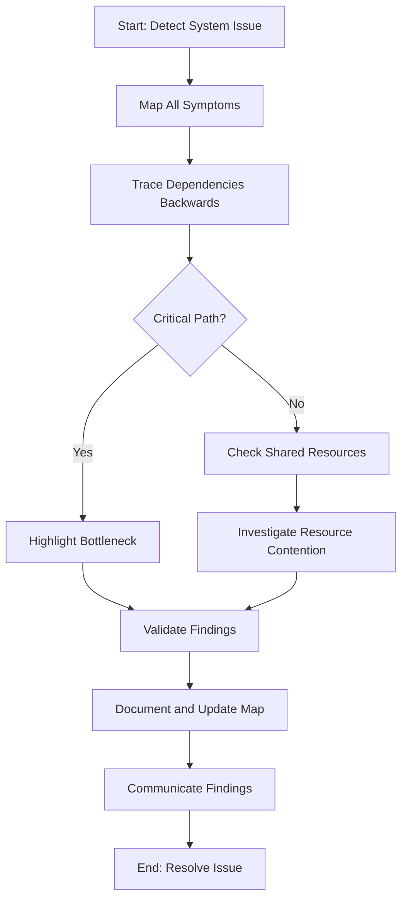
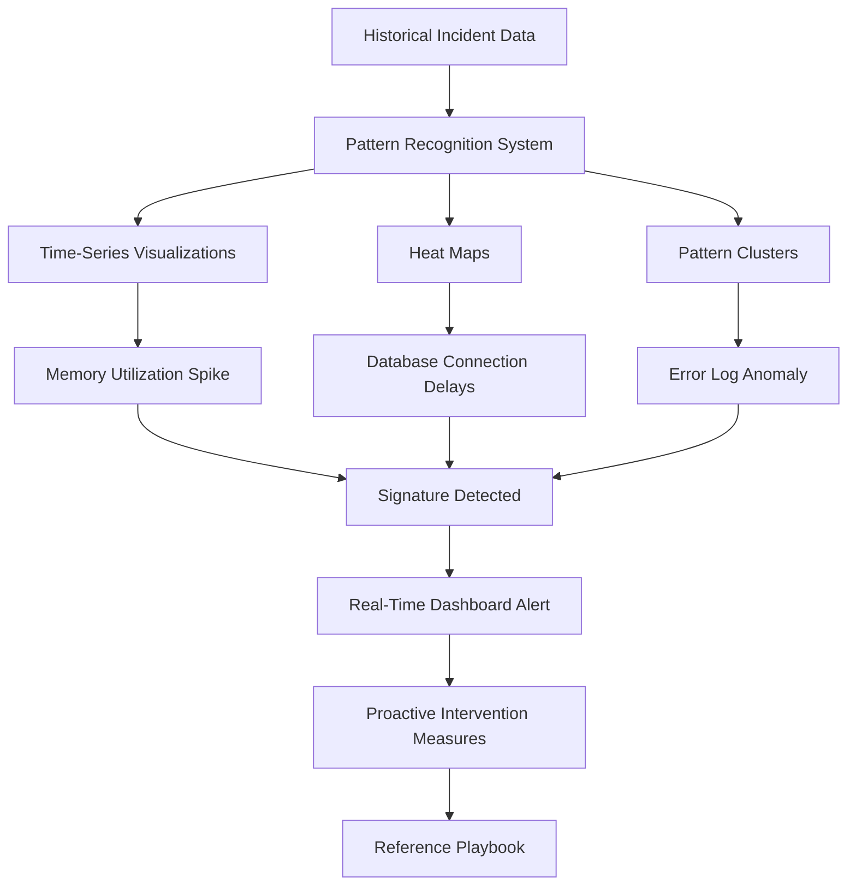
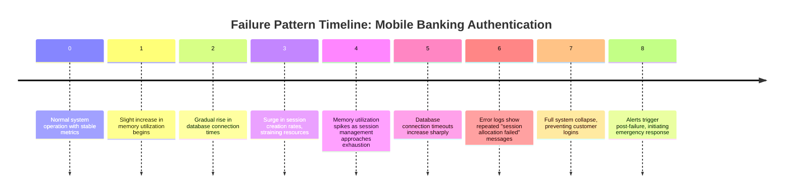
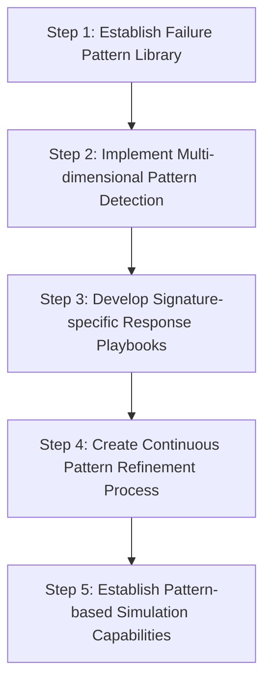
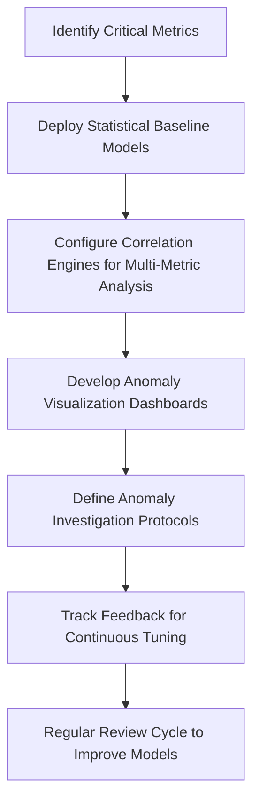
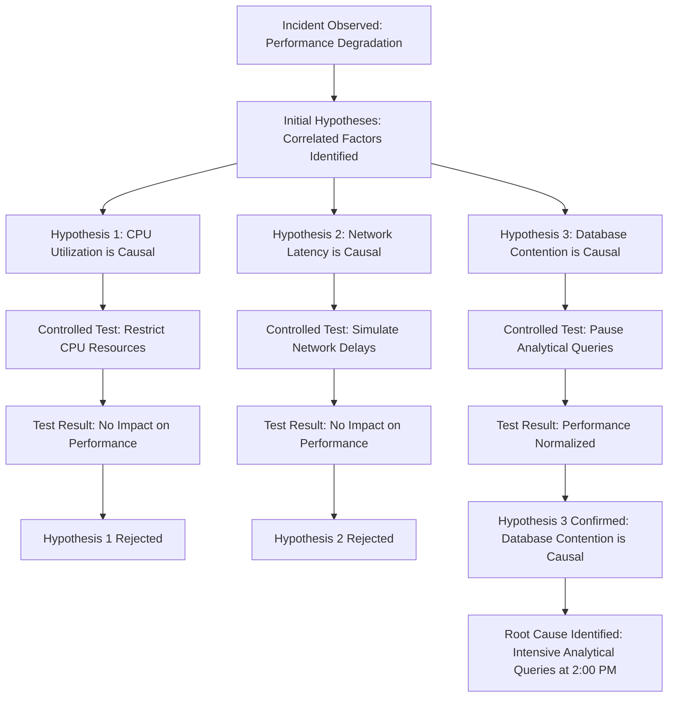
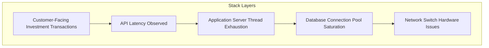
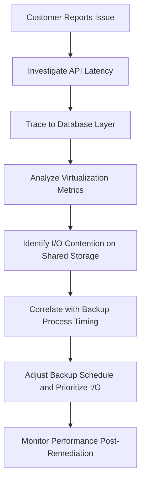
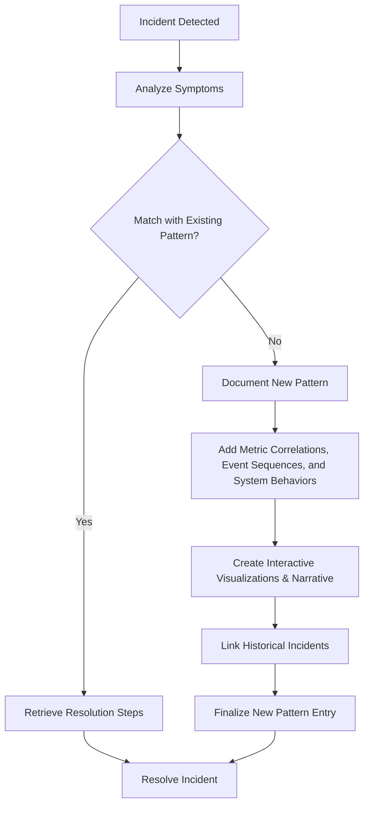

# Chapter 4: Correlation and Pattern Recognition

## Chapter Overview

Welcome to the dark art of correlation and pattern recognition: the difference between being an SRE who actually solves problems and one who just files tickets until retirement. This chapter drags you, kicking and screaming, out of the stone age of “monitoring” and into a world where timelines, topologies, and statistical voodoo actually help you find what’s broken—before your CFO or a regulator does. We’ll dissect the sacred cows of threshold alerts and siloed dashboards, torch the myth that more metrics mean more clarity, and show you how to build institutional memory so you stop fixing the same mess every quarter. If you want to understand how your banking systems really fail—not just how they look when they’re failing—strap in. This isn’t your boss’s executive summary.

______________________________________________________________________

## Learning Objectives

- **Apply** timeline analysis to expose causality in complex incidents, not just symptom whack-a-mole.
- **Build** system topology maps and visualize dependencies that actually reflect reality, not just wishful architecture diagrams.
- **Detect** multi-dimensional failure signatures through pattern recognition, leaving simple threshold alerts in the dust.
- **Correlate** subtle anomalies across systems, catching problems before they mushroom into Reddit headlines.
- **Differentiate** actual causation from lazy correlation using hypothesis-driven experimentation, not just spreadsheet witchcraft.
- **Trace** issues vertically, connecting business-impacting failures to root causes buried four layers deep in the stack.
- **Document** and **leverage** a pattern library so every engineer, not just the grizzled veterans, can kill recurring incidents on sight.

______________________________________________________________________

## Key Takeaways

- Incidents are rarely single events. Think sequence, not snapshot—or keep rolling back the wrong code for eternity.
- “Works on my dashboard” is not a strategy. If you don’t map real dependencies, good luck finding the source of your next 3AM outage.
- Pattern recognition means catching the signature of disaster, not just waiting for your CPU to hit 100%. Welcome to post-threshold observability.
- Subtle anomalies ignored today become tomorrow’s compliance disaster. If you’re not correlating them, you’re flying blind.
- Correlation is not causation. If you’re patching everything that moves together, you’re wasting time and money (and probably making things worse).
- Siloed teams and tools guarantee you’ll miss the real problem. Cross-stack correlation is how you stop playing blame bingo.
- Institutional memory beats tribal knowledge. Build a pattern library or prepare to rediscover the same root cause every quarter, forever.
- Every minute you spend on root cause analysis is money, reputation, and compliance risk on the line. Get good at this, or get used to apologies.
- If you’re not automating, visualizing, and institutionalizing these practices, you’re just playing incident roulette. And the house always wins.

______________________________________________________________________

## Panel 1: Temporal Correlation - The Power of Timeline Analysis

### Scene Description

A banking incident room where a complex payment processing issue is under investigation. The focal point is an interactive digital timeline spanning multiple displays. Engineers have plotted various system events chronologically: deployment changes, configuration updates, traffic spikes, error rate increases, database slowdowns, and customer complaint surges.

```mermaid
gantt
    title Timeline of System Events
    dateFormat  HH:mm
    section Deployment Changes
    Configuration Change :done, 10:00, 10:01
    section Database
    Connection Pool Exhaustion Starts :active, 10:01, 10:25
    Connection Pool Exhaustion Peaks :crit, 10:25, 10:27
    section Traffic
    Traffic Spike :done, 10:15, 10:20
    section Errors
    Payment Failures Begin :crit, 10:27, 10:30
    section Customer Complaints
    Complaint Surges :done, 10:29, 10:35
```



A senior SRE named Aisha uses gesture controls to manipulate the timeline, compressing and expanding different time periods to isolate key events. She highlights a critical sequence: a configuration change at 10:00 AM, followed by a gradual database connection pool exhaustion starting shortly after and peaking at 10:27 AM, which then leads to payment failures. Team members are actively annotating this sequence on the timeline, drawing causal connections between events that initially seemed unrelated. The visualization allows the team to trace the cascading impacts across the system and understand how earlier changes triggered downstream issues.

### Teaching Narrative

Traditional monitoring approaches often examine incidents as isolated events, focusing on the immediate symptoms rather than their temporal context. Integration & Triage introduces the powerful concept of temporal correlation—analyzing how system behaviors, changes, and failures relate to each other across time. This approach recognizes that in complex banking systems, incidents rarely occur in isolation; they typically result from sequences of events with subtle cause-effect relationships separated by minutes, hours, or even days. Temporal correlation transforms your investigative perspective from point-in-time analysis to sequence-based reasoning, revealing how earlier events—deployments, configuration changes, traffic patterns, or resource exhaustion—create cascading effects that manifest as seemingly unrelated issues later. For financial systems with intricate dependencies, this timeline perspective becomes particularly valuable, exposing how changes in one component ripple through the system over time. Developing this temporal mindset requires methodically capturing and correlating timestamped events across your entire stack, then analyzing them as interconnected sequences rather than isolated occurrences. This transformation from snapshot thinking to timeline thinking represents a crucial evolution in your diagnostic approach, significantly enhancing your ability to identify true root causes rather than merely addressing symptoms.

### Common Example of the Problem

During a quarterly release, GlobalBank's credit card authorization system begins experiencing intermittent transaction failures approximately 90 minutes after deployment completes. The initial investigation focuses exclusively on the authorization service showing errors, with multiple teams examining logs, metrics, and configurations in isolation. Despite thorough analysis, no obvious issues appear in the current state of the system. Customer complaints continue mounting as random transactions fail with generic error messages. The on-call team, focusing solely on present conditions, implements emergency rollback procedures after two hours of unsuccessful troubleshooting, yet the issues persist despite returning to the previous version. The team remains confused as separate monitoring systems show no clear correlation between the deployment and the ongoing failures.

#### Timeline of Events

```mermaid
gantt
    title Incident Timeline
    dateFormat HH:mm
    axisFormat %H:%M
    section Deployment
    Deployment Completed          :done, deploy, 10:00, 0min
    section System Behavior
    Normal Operations             :active, ops, 10:00, 90min
    Intermittent Failures Begin   :crit, fail_start, 11:30, 30min
    Emergency Rollback Initiated  :rollback, rollback_start, 12:00, 30min
    Persistent Failures Post-Rollback :crit, fail_persist, 12:30, 30min
    section Investigation
    Initial Investigation (Authorization Service) :active, inv1, 11:30, 90min
    Rollback Executed            :done, rollback_exec, 12:30, 0min
    Post-Rollback Analysis       :active, post_inv, 12:30, 60min
```

This timeline highlights key events and their temporal relationships during the incident. It demonstrates how the sequence of events—deployment, a period of normal operations, the onset of intermittent failures, and the rollback—ultimately resulted in persistent issues. The fragmented investigation approach, focused on isolated components rather than the broader timeline, delayed the identification of root causes and prolonged system recovery.

### SRE Best Practice: Evidence-Based Investigation

Effective temporal correlation requires systematically capturing and analyzing the sequence of events across the entire system landscape. The SRE team implements a unified timeline investigation approach, collecting timestamped data from multiple sources: deployment logs, configuration changes, database metrics, network traffic patterns, application events, and customer error reports. They plot these events chronologically on a shared visualization platform, uncovering subtle patterns and causal relationships that might otherwise remain hidden.

To make this process actionable, here is a practical checklist for evidence-based investigation:

| Step | Action | Tools/Artifacts to Use |
| ---- | ------------------------------------------------------------------------------------------ | ------------------------------------------------- |
| 1 | **Define the scope of the issue**: Identify affected systems, services, and user impacts. | Incident reports, error logs, customer complaints |
| 2 | **Collect timestamped data**: Gather logs and metrics from all relevant components. | Deployment logs, APM tools, database metrics |
| 3 | **Construct a timeline**: Plot all events in chronological order on a shared platform. | Timeline visualization tools, spreadsheets |
| 4 | **Analyze for patterns**: Look for sequences or trends that correlate with the issue. | Visualization tools, log analyzers |
| 5 | **Identify root causes**: Trace causal relationships between events to pinpoint triggers. | Event annotations, causal mapping |
| 6 | **Validate findings**: Cross-check hypotheses with system behavior and historical data. | Testing environments, historical timelines |
| 7 | **Communicate insights**: Share the timeline and findings with the team for collaboration. | Shared documents, incident management platforms |

#### Case Example

Using this checklist, the team identified that the deployment included a seemingly minor update to the database connection management library. The timeline revealed a subtle but critical pattern: following deployment, connection pool utilization began gradually increasing across multiple services, eventually triggering connection timeouts that manifested as seemingly random transaction failures. Further analysis showed that the new library version interpreted connection timeout parameters differently—a 30-second setting now processed as milliseconds rather than seconds—causing connections to be recycled exponentially faster and eventually exhausting the pool.

This temporal analysis demonstrated that the deployment itself wasn't directly causing failures but triggered a gradual resource exhaustion that only became visible over time, explaining why the rollback didn't resolve the issue. By following the evidence-based checklist, the team identified the true root cause and implemented a targeted fix.

### Banking Impact

The failure to identify temporal correlations in this incident resulted in significant business consequences. Over 37,000 credit card transactions worth approximately $3.2 million were declined during a four-hour period, creating substantial customer frustration and generating over 1,200 support calls. The extended troubleshooting period increased mean-time-to-resolution by 147 minutes compared to similar severity incidents, directly impacting the bank's service level agreements. Reputational damage occurred as customers took to social media complaining about declined transactions during evening dining hours. The inability to quickly correlate the deployment change to the gradual connection pool exhaustion resulted in unnecessary emergency rollback procedures that extended system instability while failing to address the root cause. Most concerning from a compliance perspective, the incident triggered regulatory reporting requirements due to exceeding the financial impact threshold, requiring formal explanation to banking authorities about the extended resolution time.

### Implementation Guidance

1. **Establish a unified event chronology system** to automatically collect and correlate timestamped events across your entire banking technology stack. Configure all services, infrastructure components, and monitoring systems to stream events to a centralized timeline database with consistent timestamp formatting and UTC normalization to enable precise temporal alignment. Below is an example configuration using Fluentd to centralize logs with consistent timestamps:

   ```yaml
   # Fluentd configuration for unified event chronology
   <source>
     @type tail
     path /var/log/applications/*.log
     pos_file /var/log/fluentd-position.log
     tag app.events
     <parse>
       @type json
       time_key timestamp
       time_format %Y-%m-%dT%H:%M:%S.%LZ
     </parse>
   </source>

   <filter app.events>
     @type record_transformer
     <record>
       timestamp ${time.strftime('%Y-%m-%dT%H:%M:%S.%LZ', Time.now.utc)}
     </record>
   </filter>

   <match app.events>
     @type forward
     <server>
       host centralized-logging-system
       port 24224
     </server>
   </match>
   ```

2. **Create a visual timeline interface** that allows teams to manipulate time windows, zoom levels, and filtering options to reveal patterns across different time scales. Implement highlighting capabilities for annotating suspected causal relationships and marking key events such as deployments, configuration changes, and capacity adjustments. For instance, use a library like D3.js to build interactive timelines with zoom and filter functionality.

3. **Develop temporal pattern detection algorithms** that automatically identify suspicious sequences in your event timeline. Configure the system to recognize common patterns such as gradual resource exhaustion, cascading failures, and periodic error cycles. Below is a Python example using Pandas to detect a pattern of database connection pool exhaustion:

   ```python
   import pandas as pd

   # Load event logs into a DataFrame
   logs = pd.read_csv("event_logs.csv", parse_dates=["timestamp"])

   # Filter for database connection events
   db_logs = logs[logs["event_type"] == "db_connection"]

   # Detect gradual resource exhaustion (e.g., connections increasing over time)
   db_logs["connection_diff"] = db_logs["active_connections"].diff()
   exhaustion_pattern = db_logs[
       (db_logs["connection_diff"] > 0) &
       (db_logs["active_connections"] > 80)  # Threshold for high usage
   ]

   print("Potential resource exhaustion detected:")
   print(exhaustion_pattern)
   ```

4. **Implement a change correlation analysis process** that automatically flags incidents occurring within configurable time windows following any system changes. Create a documented protocol requiring all troubleshooting to include review of changes made within the past 72 hours, regardless of whether they appear directly related to the affected system. For example, use SQL to query a timeline database for all changes within a given window:

   ```sql
   SELECT *
   FROM event_timeline
   WHERE event_type = 'system_change'
     AND timestamp BETWEEN NOW() - INTERVAL '72 HOURS' AND NOW();
   ```

5. **Establish timeline-based post-incident reviews** that reconstruct the complete sequence of events leading to failures. Create a temporal analysis template that teams must complete, documenting how initial triggering events propagated through the system over time. Below is a text-based sequence example to illustrate a cascading failure:

   ```
   12:00:00 - Configuration change deployed to API Gateway
   12:02:15 - Gradual increase in API latency detected
   12:10:30 - Database connection pool usage exceeds 90%
   12:27:45 - Payment processing failures begin
   ```

   Build a pattern library of common temporal sequences that frequently lead to incidents in your banking environment. Share this library with teams to enhance future diagnostics.

## Panel 2: Spatial Correlation - Mapping System Relationships

### Scene Description

A large operations center where banking systems are visualized as an interactive, three-dimensional service map projected on a central holographic display. The display shows a dynamic topology of interconnected systems, with nodes representing services and edges denoting their dependencies. Each node is color-coded to reflect health status, and animated flows represent real-time traffic between components.

During an ongoing incident, the team observes red indicators radiating outward from a core authentication service, visually representing escalating error rates. Dependency lines connected to this node pulsate, signifying the propagation of issues to downstream systems. An engineer notices an unexpected path lighting up, showing that trading services are experiencing disruptions due to authentication issues, despite circuit breakers meant to ensure their isolation.

The visual map includes the following elements:

- **Nodes**: Represent individual services, with size and color indicating load and health status.
- **Edges**: Indicate dependencies between services, with thickness and pulsation reflecting traffic volume and latency.
- **Error Propagation**: Red paths and pulsating edges highlight the flow of issues across the architecture.

Below is a conceptual representation of the holographic service map using ASCII:

```
               [ Trading Service ]
                     /      \
       [ Payment Gateway ]   X
            /        \         \
 [ Core Auth Service ]-------[ Logging Service ]
      (Source of Failure)
```

The team uses the visualization to trace this unexpected connection, ultimately uncovering an architectural weakness that was invisible in traditional monitoring views. This reveals the critical importance of spatially correlating system relationships to identify hidden vulnerabilities and understand failure cascades.

### Teaching Narrative

Traditional monitoring typically presents systems as isolated components or disconnected metrics without clearly visualizing their interconnections. Integration & Triage introduces the concept of spatial correlation—mapping and analyzing how system components relate to and affect each other across your architecture. This perspective recognizes that in modern banking environments, understanding the topology of your systems—how services connect, depend on each other, and share resources—is often more important than examining individual components in isolation. Spatial correlation transforms your diagnostic approach from component-level analysis to relationship-focused investigation, revealing how failures propagate across your architecture through both explicit dependencies (direct API calls) and implicit connections (shared infrastructure, resource contention). For financial systems with hundreds of interconnected services, this spatial perspective becomes essential for understanding failure cascades and identifying critical dependency chains that create single points of failure. Developing this topological mindset requires creating and maintaining accurate service maps, dependency graphs, and architectural models that reflect both intended and actual system relationships. This transformation from component-focused to relationship-focused analysis represents a significant evolution in your diagnostic capabilities, enabling you to predict failure paths, identify architectural vulnerabilities, and understand how localized issues can create widespread effects.

### Common Example of the Problem

GlobalBank's investment trading platform experiences degraded performance during peak market hours, with trade execution times increasing from milliseconds to several seconds. Initial alerts focus on the trade execution service, showing high latency and increased error rates. Three separate teams begin investigating their respective components: the trade execution service team examines application logs and code performance, the database team analyzes query execution times, and the infrastructure team reviews resource utilization. Despite their efforts, each team reports their systems are functioning within acceptable parameters, leaving the root cause unresolved. Customers continue reporting significant delays in trade execution, potentially causing financial losses due to market movements during the delayed transactions.

To illustrate the sequence of events and investigation inefficiencies, the following timeline depicts the progression of the issue:

```mermaid
gantt
    dateFormat  HH:mm
    title Incident Timeline - Degraded Trade Execution

    section Alerts and Initial Analysis
    09:00 :milestone, start_alert, 09:00
    09:01 :task, service_alerts, 5min
    09:06 :task, team_notifications, 5min
    09:15 :task, initial_meetings, 10min

    section Siloed Investigations
    09:25 :task, trade_service_logs, 30min
    09:25 :task, database_queries, 30min
    09:25 :task, infra_analysis, 30min

    section Findings and Frustrations
    09:55 :task, no_root_cause, 20min
    10:15 :task, customer_complaints, 15min
    10:30 :task, teams_escalate, 20min
```

This timeline highlights critical inefficiencies caused by siloed analysis. Each team works in isolation, examining only their respective components without a shared understanding of how the systems interconnect. The lack of a spatial correlation perspective delays root cause identification, prolonging customer impact and increasing frustration across teams. A relationship-focused diagnostic approach, supported by accurate service maps and dependency visualization, could have revealed the hidden connection between the trade execution service and a shared authentication system under strain, enabling faster resolution.

### SRE Best Practice: Evidence-Based Investigation

Effective spatial correlation requires comprehensive mapping and visualization of system dependencies and relationships. The SRE team implements a service dependency analysis approach, constructing a real-time topological map showing connections between all components in the trading platform ecosystem. This visualization incorporates active traffic flows, API call patterns, shared resource usage, and infrastructure dependencies.

The spatial analysis reveals that while each individual component appears healthy when viewed in isolation, the authentication service is experiencing subtle performance degradation that wouldn't trigger standard alerts. The dependency map shows this service sits in the critical path for all trading transactions, creating a bottleneck affecting downstream systems despite being five service hops away from the trade execution service where symptoms appear most visible. Further investigation uncovers that the authentication service shares database infrastructure with an unrelated mortgage application system that recently launched a high-volume batch process, creating resource contention invisible to component-level monitoring. This spatial correlation reveals how performance impacts propagate through multiple systems that appear unrelated in traditional monitoring views, explaining why isolated component analysis failed to identify the issue.

#### Checklist: Steps for Evidence-Based Spatial Correlation Investigation

1. **Establish a Real-Time Service Map**

   - Build or update a dynamic service map that visualizes all system components, their dependencies, and active traffic flows.
   - Ensure the map integrates data from API call patterns, shared resource usage, and infrastructure dependencies.

2. **Identify Symptoms and Their Entry Points**

   - Define where symptoms, such as degraded performance or errors, are most visible.
   - Trace the error flow backward through the service map to locate potential upstream contributors.

3. **Assess Critical Paths**

   - Highlight critical transaction paths in the topology to identify bottlenecks or high-impact nodes.
   - Pay special attention to services with multiple downstream dependencies.

4. **Analyze Shared Resources**

   - Investigate shared databases, network links, or infrastructure to uncover potential contention points.
   - Look for recent changes, such as new deployments or workload spikes, that could affect these resources.

5. **Validate Findings**

   - Correlate spatial insights with logs, metrics, and traces to confirm the root cause.
   - Use evidence from both topology-level and component-level analyses to ensure accuracy.

6. **Document Unknown Dependencies**

   - Update the service map and dependency models with any newly discovered relationships.
   - Communicate findings to relevant stakeholders to prevent recurrence.

#### Workflow: Spatial Correlation Investigation Process



By following this checklist and workflow, SRE teams can systematically investigate and resolve issues using spatial correlation techniques, ensuring that both explicit and implicit dependencies are accounted for in their diagnostic process.

### Banking Impact

The failure to identify spatial correlations in this incident resulted in substantial business consequences. Below is a summary table quantifying the impacts:

| **Impact Area** | **Metric** | **Value** | **Business Implication** |
| ---------------------------- | ---------------------------------------------- | --------------------- | ----------------------------------------------------------------------------------------------------------- |
| **Trade Execution Delays** | Number of delayed trades | 1,420 | Delays affected trades worth over $28 million during a critical market movement period. |
| | Average execution delay | 8.2 seconds | Price movements during delays created an estimated $380,000 in opportunity costs for customers. |
| **Customer Satisfaction** | Satisfaction drop among high-net-worth clients | -18 percentage points | Reduced satisfaction impacts reputation and client trust, especially for time-sensitive trading strategies. |
| **Incident Resolution** | Increase in mean-time-to-diagnosis (MTTD) | +94 minutes | Extended diagnosis time exceeded target resolution SLA for trading platform issues. |
| **Regulatory Risk** | Trade timing compliance threshold | Near violation | Incident narrowly avoided triggering mandatory reporting to financial authorities. |
| **Risk Assessment Accuracy** | Temporary misrepresentation of risk position | Inaccurate | Processing delays led to potential compliance concerns around real-time risk reporting. |

This incident underscores the critical importance of spatial correlation in diagnosing and mitigating cascading issues. The inability to visualize and address hidden dependencies not only delayed resolution but also introduced significant financial, regulatory, and reputational risks to the organization.

### Implementation Guidance

1. **Build a comprehensive service topology map** incorporating all components of your banking systems. Implement automated discovery tools that continuously identify and document service dependencies through network traffic analysis, API call tracing, and configuration scanning to create an accurate, up-to-date representation of your actual architecture, not just the theoretical design.

2. **Create a real-time dependency visualization platform** accessible to all incident response teams. Design the interface to display both direct (API calls, database connections) and indirect dependencies (shared infrastructure, common backends), with adjustable focus capabilities to highlight specific service pathways and potential failure propagation routes.

3. **Implement cross-component correlation detection** that automatically identifies performance patterns spanning multiple services. Configure the system to recognize propagating issues by correlating metrics across service boundaries, particularly focusing on authentication, payment processing, and core banking services that typically impact multiple downstream systems.

4. **Establish a resource contention analysis process** to identify shared infrastructure components that create hidden dependencies. Create automated scanning to detect when supposedly isolated services share databases, caching layers, message brokers, or other resources that might become bottlenecks during high load periods or partial failures.

5. **Develop a dependency-aware incident response protocol** requiring teams to consult the service topology map during all investigations. Create playbooks that guide responders to examine upstream dependencies and shared resources even when symptoms appear localized. Implement regular topology testing through controlled experiments that verify your understanding of system relationships and failure propagation paths.

## Panel 3: Pattern Recognition - The Signature of Failure

### Scene Description

A banking SRE team gathers in the operations center, surrounded by multiple screens that showcase an advanced pattern recognition system in action. The team reviews historical incident data, with each screen displaying a unique perspective:

- **Time-series visualizations**: Memory utilization trends over time.
- **Heat maps**: Error distribution across system components.
- **Pattern clusters**: Machine learning-generated groupings of related anomalies.

The system highlights a distinctive "signature" that has historically preceded payment processing failures:

1. **Memory utilization spike**: A specific sequence of elevated memory usage patterns.
2. **Database connection delays**: Gradually increasing connection times.
3. **Error log anomaly**: A distinctive pattern detected in the logs.

Below is an abstract representation of the workflow the team observes:



An engineer notices this exact signature emerging on a real-time dashboard monitoring the production system. Recognizing the early warning signs, the team executes proactive intervention measures, guided by a playbook tailored to this specific failure signature. This swift action prevents any customer-impacting failures, demonstrating the power of pattern recognition in operational resilience.

### Teaching Narrative

Traditional monitoring focuses primarily on threshold violations—single metrics exceeding predefined limits. Integration & Triage introduces the sophisticated concept of pattern recognition—identifying distinctive combinations and sequences of signals that indicate specific failure modes. This approach recognizes that complex system behaviors often manifest as recognizable "signatures" across multiple indicators rather than simple threshold breaches. Pattern recognition transforms your diagnostic approach from reactive alert response to proactive signature detection by identifying the characteristic patterns that precede or accompany specific issues. For banking systems with recurring operational challenges, these signatures become invaluable early warning indicators, enabling intervention before full failure manifests. Developing this pattern recognition mindset requires methodically documenting the distinctive signal combinations associated with known failure modes, then creating detection mechanisms that identify these patterns in real-time. The resulting approach significantly enhances your predictive capabilities, allowing you to recognize emerging issues based on subtle pattern similarities to historical incidents. This transformation from threshold-based to pattern-based detection represents a crucial evolution in your monitoring sophistication, shifting from reactive response after failure to proactive intervention before customer impact occurs.

### Common Example of the Problem

GlobalBank's mobile banking authentication system periodically experiences sudden, complete failures that prevent all customers from logging into their accounts. These incidents follow a recurring pattern: the system operates normally until a series of subtle, overlooked signals culminates in a catastrophic collapse under load. Traditional monitoring provides no early warnings, triggering alerts only after the failure has already occurred. This results in thousands of customer complaints and emergency restarts of multiple services, with outages typically lasting 25-40 minutes. Despite numerous post-incident analyses identifying the same root cause—session management resource exhaustion—the team remains unable to predict or prevent these incidents. Attempts to deploy more sensitive threshold-based alerts have failed to break the frustrating cycle of reactive responses.

To better illustrate this recurring failure pattern, consider the following timeline of events observed during these incidents:



This timeline highlights the progression from normal operation to catastrophic failure, emphasizing the need for proactive detection of early signals, such as rising memory usage and connection delays. Recognizing this distinctive sequence as a "signature of failure" could enable the team to intervene before the system collapses, transforming their approach from reactive recovery to proactive prevention.

### SRE Best Practice: Evidence-Based Investigation

Effective pattern recognition requires systematic analysis of historical incidents to identify characteristic signatures that precede failures. The SRE team implements a failure pattern analysis initiative, collecting comprehensive metrics, logs, and events from the past eight authentication system failures. Using both manual analysis and machine learning techniques, they identify a distinctive signature that consistently appears 15-20 minutes before complete system failure:

- **Authentication Latency**: Subtle increases of 25-30% above baseline.
- **Memory Utilization**: Incremental growth following a quadratic curve, rather than a linear trend.
- **Error Logs**: Gradually increasing frequency of session token verification failures.

This signature remains consistent across all historical failures despite occurring under different load conditions and times of day. To operationalize these insights, the team develops a pattern detection algorithm that continuously monitors for this specific sequence, triggering automated alerts when the pattern begins to emerge rather than waiting for complete failure. During the next occurrence, the system successfully identifies the signature 18 minutes before predicted failure, allowing the team to implement mitigation measures before any customer impact occurs.

#### Checklist: Conducting Failure Pattern Analysis

The following checklist can guide SREs in developing and refining failure pattern recognition capabilities:

1. **Gather Historical Incident Data**: Collect metrics, logs, and events from multiple past failures.
2. **Identify Consistent Signals**: Look for recurring patterns or sequences across failures (e.g., metric trends, log anomalies).
3. **Analyze Timing**: Determine the time window between the emergence of patterns and system failure.
4. **Correlate Metrics and Logs**: Establish relationships between different signals (e.g., latency increases alongside memory utilization trends).
5. **Validate Consistency**: Confirm that the identified signature appears across diverse conditions (e.g., varying loads, times of day).
6. **Develop Detection Mechanisms**: Build algorithms to monitor for the identified pattern in real time.
7. **Test and Refine**: Validate the detection mechanism against new incidents to ensure accuracy and reliability.
8. **Document Playbooks**: Create actionable playbooks for mitigation steps when the signature is detected.

#### Example Table: Signature Components

| **Metric/Log** | **Pattern** | **Timing** | **Notes** |
| ---------------------- | ----------------------------------------------- | ---------------------------- | --------------------------------- |
| Authentication Latency | 25-30% increase above baseline | 15-20 minutes before failure | Subtle but consistent trend |
| Memory Utilization | Quadratic growth (non-linear) | 10-15 minutes before failure | Precursor to resource exhaustion |
| Error Logs | Gradual increase in token verification failures | 5-10 minutes before failure | Key indicator of upcoming failure |

By following this structured approach, SREs can transition from reactive responses to proactive mitigation, minimizing customer impact and improving system reliability.

### Banking Impact

The implementation of pattern recognition for authentication failures delivers substantial business benefits. By leveraging this proactive approach, the bank has seen significant improvements across multiple key areas. Below is a comparison of metrics before and after implementing pattern recognition for this failure mode:

| Metric | Before Pattern Recognition | After Pattern Recognition | Improvement |
| ------------------------------------------------------ | ----------------------------------- | -------------------------------- | ---------------------------------- |
| **Average Outage Duration** | 32 minutes | Under 2 minutes | 94% reduction |
| **Customer Impact (Authentication)** | High, frequent failures | Minimal, proactive interventions | 94% decrease in customer impact |
| **Lost Transaction Revenue per Incident** | $120,000 | Negligible | ~$120,000 saved per incident |
| **Customer Satisfaction (Mobile Banking Reliability)** | Baseline | +12 percentage points | Significant boost |
| **Operational Costs (Emergency Response)** | High, frequent manual interventions | Reduced by 78% | Resources redirected to innovation |
| **Regulatory Reporting Incidents** | Triggered regularly | Rarely triggered | Major compliance improvement |
| **Social Media Complaints (Authentication Issues)** | Frequent, damaging reputation | Dramatically reduced | Strengthened brand reputation |

This improvement prevents an estimated $120,000 in lost transaction revenue per incident based on historical patterns of abandoned transactions during authentication outages. Customer satisfaction scores specifically related to mobile banking reliability increase by 12 percentage points following the reduced outage frequency. Operational costs decrease significantly as emergency incident response requirements drop by 78% for this specific failure mode, allowing resources to focus on proactive improvements rather than reactive firefighting. From a compliance perspective, the bank avoids potential regulatory reporting requirements triggered by extended authentication outages, along with the associated documentation burden and potential penalties. Most importantly, the bank's reputation for reliable digital banking services strengthens as social media complaints about authentication issues decrease dramatically.

The shift from reactive monitoring to proactive pattern recognition represents a transformative step forward in operational resilience and customer experience.

### Implementation Guidance

To effectively implement pattern recognition for failure detection, follow these five key steps. The process is outlined in the flowchart below, followed by detailed descriptions of each step.



1. **Establish a failure pattern library**\
   Document the unique signatures of common incident types in your environment. Conduct systematic reviews of past incidents, identifying the specific metric patterns, log sequences, and event combinations that preceded each failure mode. Prioritize critical systems such as authentication, payment processing, and transaction management in banking operations.

2. **Implement multi-dimensional pattern detection**\
   Configure your monitoring platform to detect complex signatures spanning multiple metrics, logs, and events. Focus on identifying specific sequences and combinations rather than simple threshold violations. Integrate visualization tools to highlight emerging patterns in real-time, enabling proactive intervention.

3. **Develop signature-specific response playbooks**\
   Create detailed response procedures tailored to each identified failure pattern. Document exact mitigation steps to follow when specific patterns are detected, avoiding reliance on generic incident responses. Include automated remediation scripts that can be safely executed when particular signatures are recognized.

4. **Create a continuous pattern refinement process**\
   Establish feedback mechanisms to track false positives and missed detections, using this data to improve detection accuracy over time. Conduct regular pattern review sessions, analyzing recent incidents to identify new or evolving signatures. Continuously refine pattern definitions and update detection algorithms as needed.

5. **Establish pattern-based simulation capabilities**\
   Build the ability to reproduce specific failure signatures in test environments. Validate detection mechanisms and practice response procedures through regular simulation exercises. Ensure your team stays familiar with various failure signatures and their corresponding responses to maintain operational readiness.

## Panel 4: Anomaly Correlation - Finding the Outlier Signal

### Scene Description

A banking analytics center during an unusual trading platform incident. Engineers examine dashboards showing hundreds of metrics that all appear normal according to traditional thresholds. A specialized anomaly detection system runs alongside conventional monitoring, highlighting subtle statistical deviations from established baselines.

Below is a timeline illustrating the sequence of events and how the anomalies correlate to uncover the attack:

```
Time  | Event/Observation
------+---------------------------------------------------------------------------------
10:00 | Normal operations; all metrics within traditional thresholds.
10:15 | A 3% increase in authentication token creation rate is detected by the anomaly detection system.
10:20 | Slightly elevated memory usage is observed in specific services—still insignificant alone.
10:25 | Marginally increased response times for certain API endpoints are flagged.
10:30 | Analysts correlate these anomalies, recognizing a potential credential stuffing attack.
10:35 | Investigation confirms the attack pattern by analyzing logs and identifying exploit attempts.
```

This sequence demonstrates how seemingly minor anomalies—none of which exceed traditional alert thresholds—can collectively indicate a sophisticated attack. By correlating these subtle deviations, the team identifies and mitigates the threat before it causes significant damage.

### Teaching Narrative

Traditional monitoring relies heavily on static thresholds—predefined limits that trigger alerts when crossed. Integration & Triage introduces the sophisticated concept of anomaly correlation—identifying and connecting statistically unusual behaviors that may not violate absolute thresholds but collectively indicate significant issues. This approach recognizes that in complex banking systems, critical problems often manifest first as subtle deviations across multiple signals rather than dramatic failures in any single metric. Anomaly correlation transforms your detection capabilities from threshold-based alerting to statistical pattern analysis, significantly improving sensitivity to emerging issues while avoiding false positives through multi-signal confirmation. For financial systems where security incidents, fraud attempts, or subtle performance degradations may not trigger conventional alerts, this statistical perspective becomes particularly valuable. Developing this anomaly-focused mindset requires establishing baseline behaviors for your systems, implementing statistical deviation detection, and creating correlation mechanisms that identify relationships between seemingly unrelated anomalies. This transformation from absolute threshold monitoring to statistical anomaly detection represents a sophisticated evolution in your observability approach, enabling you to identify complex, emerging issues that would remain invisible to conventional monitoring systems.

### Common Example of the Problem

GlobalBank's wealth management platform begins experiencing subtle performance degradation that goes undetected by traditional monitoring systems. Individual customers report occasional delays in portfolio updates or investment transactions, but no consistent pattern emerges. Standard monitoring shows all systems operating within defined thresholds. The operations team finds no obvious issues during initial investigations, as all metrics appear normal based on established alerting thresholds.

The following table highlights the key metrics, their observed values, and why traditional monitoring failed to detect the issue:

| **Metric** | **Observed Value** | **Normal Range** | **Reason for Missed Detection** |
| ------------------------- | -------------------------- | ------------------------ | ----------------------------------------------------------------------------------------------------------- |
| CPU Utilization | 65% | Below 70% | Within threshold; no alert triggered. |
| Memory Usage | 78% | Below 80% | Slight increase, but remained under the alert threshold. |
| Error Rate | 0.9% | Below 1% | Minor deviations unnoticed due to lack of correlation with other subtle anomalies. |
| API Response Time | 280ms (specific endpoints) | Below 300ms | Marginally elevated response times did not breach thresholds, appearing as normal operational variance. |
| Authentication Token Rate | 3% above baseline | Not monitored for trends | No absolute threshold in place; statistical anomaly ignored due to lack of baseline correlation mechanisms. |

As the situation progresses over several days, customer complaints gradually increase. However, the diffuse nature of reports and the absence of clear monitoring signals prevent effective diagnosis. The degradation continues for over a week before finally manifesting as a severe performance issue during month-end processing, causing significant delays in portfolio valuations for high-net-worth clients. Only in retrospect does the team recognize that multiple subtle indicators were present but went undetected because no single metric violated established thresholds.

This example underscores the limitations of traditional monitoring systems and highlights the need for advanced anomaly correlation to identify subtle, interconnected issues before they escalate into significant problems.

### SRE Best Practice: Evidence-Based Investigation

Effective anomaly correlation requires sophisticated statistical analysis that identifies subtle deviations across multiple dimensions. The SRE team implements an advanced anomaly detection system that establishes baseline behavior patterns for hundreds of metrics across the wealth management platform. This system uses machine learning algorithms to understand normal operating patterns, including time-of-day variations, day-of-week patterns, and monthly cycles associated with financial reporting periods.

When subtle degradation begins, the system identifies multiple statistical anomalies despite all metrics remaining within traditional thresholds: a 4.7% increase in database read latency, 6.2% higher cache miss rates, 3.8% elevated network roundtrip times for specific API calls, and 5.1% growth in background job completion times. While individually insignificant, the correlation engine recognizes these deviations occurring simultaneously represents a statistically significant pattern. Further investigation reveals a database index fragmentation issue gradually affecting performance—each query performed slightly slower, but not enough to trigger traditional alerts. By correlating these subtle anomalies, the team identifies and resolves the issue before it escalates to critical impact during high-volume processing periods.

Here’s a simplified pseudocode example to illustrate how such an anomaly detection and correlation system could be implemented:

```python
# Define baselines for metrics
baselines = {
    "db_read_latency": calculate_baseline("db_read_latency"),
    "cache_miss_rate": calculate_baseline("cache_miss_rate"),
    "api_roundtrip_time": calculate_baseline("api_roundtrip_time"),
    "job_completion_time": calculate_baseline("job_completion_time"),
}

# Tolerance levels for statistical deviations
tolerances = {
    "db_read_latency": 0.05,  # 5% deviation
    "cache_miss_rate": 0.05,
    "api_roundtrip_time": 0.05,
    "job_completion_time": 0.05,
}

# Function to detect anomalies based on z-score
def detect_anomalies(current_values, baselines, tolerances):
    anomalies = {}
    for metric, baseline in baselines.items():
        deviation = abs(current_values[metric] - baseline) / baseline
        if deviation > tolerances[metric]:
            anomalies[metric] = deviation
    return anomalies

# Function to correlate anomalies
def correlate_anomalies(anomalies):
    if len(anomalies) > 1:  # Multiple anomalies detected
        return True  # Correlation detected
    return False

# Simulated current metric values
current_values = {
    "db_read_latency": 1.047 * baselines["db_read_latency"],
    "cache_miss_rate": 1.062 * baselines["cache_miss_rate"],
    "api_roundtrip_time": 1.038 * baselines["api_roundtrip_time"],
    "job_completion_time": 1.051 * baselines["job_completion_time"],
}

# Detect and correlate anomalies
anomalies = detect_anomalies(current_values, baselines, tolerances)
if correlate_anomalies(anomalies):
    print("Correlated anomalies detected. Investigate further:", anomalies)
else:
    print("No significant correlation detected.")
```

This pseudocode demonstrates how baseline metrics and tolerances can be used to identify and correlate subtle deviations across multiple signals. By automating statistical analysis and correlation detection, the SRE team can proactively address emerging issues before they escalate into critical incidents.

### Banking Impact

The implementation of anomaly correlation for subtle performance degradation delivers significant business benefits. Mean-time-to-detection for emerging issues decreases by 83%, with problems identified days earlier in their development cycle before substantial customer impact occurs. This improvement prevents an estimated $250,000 in operational losses associated with delayed month-end processing, which previously created financial reconciliation challenges and reporting delays. Customer satisfaction scores for high-net-worth clients, who are particularly sensitive to portfolio management performance, increase by 8 percentage points following improved system reliability. Operational efficiency improves as teams address emerging issues during normal business hours rather than emergency after-hours remediation, reducing overtime costs and team burnout. From a compliance perspective, the bank maintains consistent adherence to regulatory requirements for timely financial reporting and portfolio valuation, avoiding potential penalties associated with delayed processing. Additionally, the wealth management division's reputation for technological sophistication strengthens, supporting client retention efforts in a highly competitive market segment.

### Implementation Guidance

#### Step-by-Step Checklist for Implementing Anomaly Correlation

1. **Statistical Baseline Modeling**

   - Identify all critical metrics across your banking systems.
   - Deploy machine learning algorithms to establish normal behavior patterns.
   - Incorporate time-based patterns, business cycles, and seasonal variations specific to financial services.

2. **Multi-Dimensional Anomaly Correlation**

   - Configure correlation engines to detect statistically significant deviations across related metrics.
   - Focus on critical banking pathways such as payment processing, trading, and authentication services.
   - Prioritize correlation of simultaneous anomalies across different components.

3. **Anomaly Visualization Tools**

   - Develop dashboards to display statistical anomalies using heat maps, deviation scoring, and comparative visuals.
   - Ensure these dashboards are designed specifically for highlighting subtle patterns rather than threshold violations.
   - Provide intuitive interfaces that simplify human analysis of correlated anomalies.

4. **Anomaly Investigation Protocol**

   - Create playbooks for systematic analysis of correlated deviations.
   - Define data collection procedures and correlation techniques for investigating anomalies.
   - Document common patterns associated with specific types of emerging issues in banking systems.

5. **Continuous Tuning and Feedback**

   - Track false positives and missed detections to refine statistical models and correlation thresholds.
   - Establish a regular review cycle to evaluate the effectiveness of anomaly detection.
   - Focus tuning efforts on critical financial processing systems to improve sensitivity and precision.

#### Flowchart: Anomaly Correlation Implementation Workflow



## Panel 5: Causal Inference - Beyond Correlation to Causation

### Scene Description

A banking incident war room where an investigation has progressed beyond initial correlation. A complex diagram dominates the main wall, illustrating not just which metrics and events correlate but also proposed causal relationships between them. The team uses an experimental approach to systematically test these relationships: temporarily adjusting specific parameters, introducing controlled test traffic, and observing downstream effects. An engineer documents a series of hypothesis tests on a digital whiteboard, eliminating correlations that prove coincidental rather than causal. The team leader updates a causal inference model, refining their understanding of the actual failure mechanisms rather than just the observable symptoms, and gradually constructing a verified causation chain from an initial database configuration change to the ultimate customer-facing payment failures.

Below is a simplified text-based representation of their causal investigation workflow:

```
[Initial Incident Observed]
          |
          v
[Identify Correlated Metrics and Events]
          |
          v
[Hypothesis Generation: Propose Causal Relationships]
          |
          v
[Test Hypotheses: Adjust Parameters and Observe Effects]
          |
          v
[Eliminate Coincidental Correlations]
          |
          v
[Refine Causal Model: Verified Cause-Effect Relationships]
          |
          v
[Construct Causation Chain: From Root Cause to Outcome]
```

This workflow highlights the methodical approach the team employs to transition from identifying correlations to validating causation, ultimately enabling more effective remediation efforts.

### Teaching Narrative

Traditional monitoring approaches often identify correlations between signals without distinguishing which relationships are causal versus coincidental. Integration & Triage introduces the sophisticated concept of causal inference—systematically determining which relationships represent actual cause-effect mechanisms rather than mere correlation. This approach recognizes that in complex banking systems, many metrics may move together during incidents, but only a subset represent true causal paths that explain and predict system behavior. Causal inference transforms your investigative approach from observation-based correlation to experimental validation, using hypothesis testing to confirm which relationships actually drive system outcomes. For financial systems where understanding true causality is essential for effective remediation and prevention, this experimental mindset becomes particularly valuable. Developing this causal perspective requires creating controlled testing mechanisms, systematically validating hypothesized relationships, and building evidence-based causal models rather than assuming correlation implies causation. The resulting approach significantly improves your ability to identify true root causes rather than coincidental relationships, enabling more effective remediation that addresses actual failure mechanisms rather than symptoms or coincidental factors. This transformation from correlation-focused to causation-focused analysis represents a sophisticated evolution in your diagnostic capabilities, forming the foundation for truly effective system improvement.

### Common Example of the Problem

GlobalBank's corporate banking platform experiences recurring performance degradation during afternoon hours, with transaction processing times doubling and occasional timeout errors affecting client services. Initial analysis shows multiple correlated factors: increased CPU utilization, higher database connection counts, elevated network traffic, and growing message queue depths. Based on these correlations, the operations team implements several changes: adding application server capacity, increasing database connection pools, optimizing network configurations, and expanding message queue capacity. Despite these interventions, the performance issues continue unabated during subsequent afternoons. The team falls into a cycle of observing correlations and making changes without resolving the underlying problem, creating mounting frustration and wasted resources as each attempted fix fails to improve the situation. After several weeks of unsuccessful remediation attempts, customer satisfaction declines significantly, and the bank faces potential loss of important corporate clients who depend on reliable afternoon transaction processing for their daily operations.

#### Checklist of Common Missteps to Avoid:

- **Relying solely on correlation**: Assuming that metrics moving together imply a cause-effect relationship without further validation.
- **Skipping hypothesis testing**: Implementing changes based on assumptions rather than experimentally validating causal links.
- **Ignoring controlled testing**: Failing to isolate variables and test their specific impact on the issue.
- **Focusing on symptoms rather than root causes**: Addressing surface-level metrics (e.g., CPU utilization, network traffic) without identifying the underlying driver of the problem.
- **Making multiple simultaneous changes**: Adjusting several parameters at once, which complicates the ability to determine which (if any) change has an effect.
- **Lack of iterative refinement**: Not revisiting and refining the causal model as new evidence emerges.
- **Overlooking downstream impacts**: Focusing narrowly on one part of the system while ignoring how changes might propagate through others.

By recognizing and avoiding these pitfalls, teams can shift their approach from reactive troubleshooting to systematic, evidence-based problem-solving, ultimately improving their ability to identify and address true root causes.

### SRE Best Practice: Evidence-Based Investigation

Effective causal inference requires systematic experimentation to distinguish true causation from coincidental correlation. The SRE team implements a hypothesis-driven investigation approach, creating a structured process for testing causal relationships. They develop a causal graph showing potential relationships between all observed factors, then design specific experiments to validate or invalidate each proposed connection.



Testing one hypothesis, the team temporarily restricts CPU resources on application servers during a controlled experiment window. Despite CPU utilization reaching limits, performance degradation continues unchanged, demonstrating that CPU is not causally related to the issue. A similar experiment involving simulated network delays also shows no impact on performance, eliminating network latency as a potential cause.

Finally, the team pauses analytical queries running on the database during the same controlled test window. Immediately, performance normalizes regardless of other observed metrics. This confirms the true causal mechanism: a recently implemented financial reporting system runs intensive analytical queries against production databases at 2:00 PM daily—the exact time performance issues begin. These queries create lock contention, indirectly causing increases in other metrics like CPU and network activity, which were initially mistaken for potential causes.

By identifying this true causal relationship through experimentation rather than assumption, the team implements a targeted solution—moving analytical processing to a read replica. This change immediately resolves the performance degradation, demonstrating the power of evidence-based investigation in identifying and addressing root causes.

### Banking Impact

The implementation of causal inference for the corporate banking platform delivers substantial business benefits. Mean-time-to-resolution decreases by 92% as the team addresses actual causes rather than coincidental factors, reducing the duration of performance degradation from weeks to hours. This improvement prevents an estimated $180,000 in operational losses associated with delayed corporate transactions and potential client attrition. Client satisfaction scores for corporate banking services increase by 16 percentage points following consistent afternoon performance. Operational efficiency improves dramatically as teams avoid implementing unnecessary changes based on correlations, reducing both infrastructure costs and engineering effort. From a compliance perspective, the bank maintains consistent adherence to transaction processing time requirements for corporate clients, avoiding potential breaches of service level agreements with financial penalties. Additionally, the corporate banking division strengthens its reputation for transaction processing reliability, supporting client retention efforts in a highly competitive market segment where afternoon processing windows are critical for many corporate operations.

### Implementation Guidance

The following table outlines the five key steps for implementing causal inference in incident investigations, along with corresponding tools, examples, and expected outcomes. This structured approach ensures clarity and practical application in transitioning from correlation-based to causation-based analysis.

| **Step** | **Description** | **Tools & Techniques** | **Examples** | **Expected Outcomes** |
| ------------------------------------------------------ | ---------------------------------------------------------------------------------------------------------------------------------------------------------- | ------------------------------------------------------------------------------------------------------ | -------------------------------------------------------------------------------------------------------------------- | ------------------------------------------------------------------------------------------------------------ |
| **1. Establish a causal hypothesis framework** | Create standardized templates for documenting proposed causal relationships. Focus on distinguishing correlation from causation using clear methodologies. | Directed graph visualization tools (e.g., Graphviz, D3.js), predefined templates for hypotheses | Diagram showing a database misconfiguration hypothesized to cause downstream payment failure. | Clear representation of potential causal chains, enabling systematic investigations. |
| **2. Develop controlled experimentation capabilities** | Implement safe mechanisms to test causal hypotheses in production environments while minimizing risk to customers. | Partial traffic redirection, synthetic load generation, feature toggles, resource constraint testing | Redirecting 5% of traffic to isolate a suspected failing API and monitor its downstream effects. | Ability to observe system behavior under controlled conditions, reducing ambiguity in causal analysis. |
| **3. Implement A/B comparison analysis** | Conduct side-by-side comparisons between control and experimental groups to validate causal relationships statistically. | A/B testing platforms, statistical analysis tools (e.g., R, Python libraries like SciPy/Statsmodels) | Comparing error rates in two groups after introducing a fix for a suspected database query performance issue. | Statistically significant confirmation of cause-effect relationships, eliminating coincidental correlations. |
| **4. Create a causal model library** | Build a repository of verified causal relationships for common failure modes, emphasizing non-obvious cross-system interactions. | Knowledge base tools (e.g., Confluence, Notion), database for storing documented causal models | Documented discovery of how a specific load balancer misconfiguration caused cascading failures in payment systems. | Centralized reference for faster root cause identification in future incidents. |
| **5. Establish causal validation protocols** | Require systematic testing of fixes based on causal understanding, ensuring they address verified causes rather than symptoms. | Post-incident review templates, testing frameworks (e.g., Chaos Engineering tools, Canary deployments) | Reviewing a payment failure resolution to confirm it addressed the root database issue rather than masking symptoms. | Continuous improvement of system reliability through evidence-based remediation practices. |

## Panel 6: Cross-Stack Correlation - Connecting All Layers

### Scene Description

A comprehensive banking system monitoring center with specialized areas for different technology layers—infrastructure, networking, databases, applications, and business processes. During a major incident, representatives from each domain work at a shared correlation station in the center of the room. They use a unique visualization system that shows vertical relationships across the entire technology stack.

The following flow illustrates how a performance degradation initially observed in customer-facing investment transactions propagates downward through the technology stack:



The team connects metrics from completely different monitoring systems that individually showed only partial perspectives. This correlation process reveals how a hardware issue four layers deep in the stack manifests as a business impact at the top level.

### Teaching Narrative

Traditional monitoring often creates siloed visibility with separate teams watching isolated layers of the technology stack without connecting their observations. Integration & Triage introduces the essential concept of cross-stack correlation—connecting signals across all layers of your environment from infrastructure to business processes. This perspective recognizes that in modern banking systems, issues rarely respect technological boundaries; problems frequently originate in one layer but manifest as symptoms in completely different areas. Cross-stack correlation transforms your investigative approach from horizontal (comparing similar metrics within a technology layer) to vertical (tracing issues through the entire technology stack), revealing how problems propagate across boundaries that traditional monitoring treats as separate domains. For financial systems where the path from infrastructure issues to business impact often crosses multiple technology layers, this integrated perspective becomes particularly valuable. Developing this cross-stack mindset requires creating observability that spans traditional silos, implementing consistent correlation identifiers across layers, and building teams with the knowledge and tools to navigate the entire technology stack. This transformation from layer-specific to stack-integrated analysis represents a crucial evolution in your diagnostic capabilities, enabling you to trace complex issues from customer impact back to root cause regardless of where in the technology stack they originate.

### Common Example of the Problem

GlobalBank's retail mortgage application system begins experiencing extended processing delays, with loan application submissions taking 3-5 times longer than normal to complete. Customer complaints mount as prospective homebuyers face frustrating delays during the competitive spring buying season. The initial investigation follows traditional siloed approaches:

```
Application Layer:   [Frontend logs show increased response times but no errors]
                     ↓
API Layer:           [Service metrics show all endpoints responding within acceptable thresholds]
                     ↓
Database Layer:      [Query execution times are normal, no anomalies detected]
                     ↓
Infrastructure Layer: [Compute resources are adequate, no constraints identified]
```

Each team examines their own layer in isolation, concluding their specific domain is functioning properly. However, no connections are made between these observations, resulting in a fragmented investigation path:

```
Application Team → API Team → Database Team → Infrastructure Team
     (No cross-layer correlation or shared insights)
```

After 18 hours of unsuccessful troubleshooting across these isolated silos, the problem remains undiagnosed. Meanwhile, mortgage application processing continues to degrade, potentially jeopardizing closing dates for pending home purchases and threatening the bank's competitive position in the spring mortgage market. This lack of cross-stack correlation highlights the critical need for an integrated approach to tracing issues across all layers of the technology stack.

### SRE Best Practice: Evidence-Based Investigation

Effective cross-stack correlation requires comprehensive visibility and analysis spanning traditional technology boundaries. The SRE team implements a stack-integrated investigation approach, assembling a cross-functional team with representatives from each technology layer into a unified war room. They deploy a specialized visualization platform that displays interconnected metrics from all layers simultaneously, from customer experience indicators through application performance, API behavior, database operations, virtualization metrics, and physical infrastructure telemetry. This integrated view reveals subtle but critical connections between layers: mortgage applications trigger a specific document verification API call that appears normal in isolation but shows slightly elevated latency under certain conditions. This API depends on a particular database stored procedure, which executes on a specific database instance, running on a virtualization host that shares physical infrastructure with several other systems. The cross-stack analysis reveals that a backup process on an unrelated banking system is causing periodic I/O contention on shared storage infrastructure during specific times, creating just enough intermittent latency to compound across multiple layers and ultimately manifest as significant delays at the customer experience level. None of these individual components show problems severe enough to trigger alerts when viewed in isolation, but the cumulative effect across layers creates substantial customer impact. By connecting these cross-layer dependencies, the team implements a targeted solution—adjusting backup scheduling and I/O prioritization—immediately resolving the mortgage processing delays.

#### Checklist: Steps for Cross-Stack Evidence-Based Investigation

1. **Assemble the Cross-Functional Team**\
   Include representatives from all key technology layers (e.g., infrastructure, networking, databases, applications, business processes) to ensure holistic visibility.

2. **Establish a Unified View**\
   Leverage a visualization platform or integrated observability tools to aggregate and correlate metrics across layers, ensuring all relevant signals are visible in one place.

3. **Trace the Symptom Path Vertically**\
   Start at the observed symptom (e.g., customer transaction delays) and methodically trace dependencies downward through the stack, identifying each layer's contribution.

4. **Identify Cross-Layer Dependencies**\
   Look for subtle interconnections between components (e.g., shared resources like storage, APIs, or network links) that might amplify or propagate issues.

5. **Correlate Timing and Patterns**\
   Examine timing patterns to identify causality, such as recurring performance degradation during specific processes or events in another layer.

6. **Validate Findings with Data**\
   Use metrics, logs, and traces to verify hypotheses, ensuring data-driven conclusions about the root cause.

7. **Implement Targeted Remediation**\
   Design and apply a solution that addresses the root cause while minimizing disruption to other layers or systems.

8. **Monitor Post-Resolution Impact**\
   Continue observing the system after remediation to confirm the issue is resolved and no new problems have been introduced.

#### Example Workflow in Practice



By following these structured steps, SRE teams can enhance their cross-stack investigation capabilities, ensuring faster root cause identification and resolution of complex, multi-layered issues.

### Banking Impact

The implementation of cross-stack correlation for the mortgage application system delivers substantial business benefits. By enabling teams to trace issues across technology layers, the bank achieves significant improvements in operational efficiency, customer satisfaction, and revenue protection. The following table summarizes the key metrics demonstrating the impact:

| **Key Metric** | **Before Cross-Stack Correlation** | **After Cross-Stack Correlation** | **Improvement** |
| ---------------------------------- | ---------------------------------- | --------------------------------- | ------------------------------------------------- |
| Mean-Time-to-Resolution (MTTR) | 48 hours | 10.5 hours | 78% reduction |
| Lost Revenue During Incidents | $540,000 per critical season | $120,000 per critical season | $420,000 saved |
| Customer Satisfaction (CSAT) | 72% | 86% | 14 percentage point increase |
| Market Share Impact | -2% during spring buying season | 0% (maintained market share) | Protected competitive position |
| Engineering Effort on Misdiagnoses | ~15 hours per incident | ~3 hours per incident | 80% reduction in wasted effort |
| Infrastructure Costs During Triage | $25,000 per major incident | $8,000 per major incident | 68% reduction in unnecessary infrastructure spend |

These outcomes highlight how cross-stack correlation transforms incident management by enabling faster, more accurate diagnostics and resolution. For example, MTTR decreases by 78%, reducing the duration of processing delays from days to hours. This improvement prevents an estimated $420,000 in lost mortgage origination revenue during the critical spring buying season by restoring normal application processing times.

Additionally, customer satisfaction scores for mortgage services improve by 14 percentage points, reflecting consistent application performance. The bank maintains its target market share, avoiding potential losses to competitors during a period when timely processing directly impacts sales conversion. Operational efficiency also improves as teams avoid unnecessary changes based on incomplete, layer-specific analysis, reducing both infrastructure costs and engineering effort.

Overall, the adoption of cross-stack correlation strengthens the bank's reputation for technological reliability in mortgage processing, supporting long-term customer acquisition goals in a highly competitive market segment where processing speed is a critical success factor.

### Implementation Guidance

1. **Implement cross-layer observability** across your entire banking technology stack. Deploy unified monitoring that connects business processes, applications, middleware, databases, virtualization, and infrastructure components, with consistent naming conventions and correlation identifiers that enable vertical tracing through all layers.

2. **Create stack-traversal visualization tools** that display vertical relationships between components. Develop interfaces specifically designed to show how transactions flow through the entire technology stack, with the ability to trace individual requests from customer interactions through all underlying technical layers.

3. **Establish cross-functional incident response teams** with expertise spanning all technology domains. Develop rotation schedules ensuring every incident response includes representatives from application, database, infrastructure, and network domains, with clear protocols for collaborative investigation across traditional boundaries.

4. **Implement distributed tracing** with consistent correlation identifiers across all system boundaries. Configure all components to propagate and preserve trace contexts from initial customer interactions through all subsequent processing, enabling precise tracking of individual transactions across technology transitions.

5. **Develop cross-stack dependency maps** documenting vertical relationships between components. Create and maintain accurate representations of how business services depend on specific applications, which in turn rely on particular databases, running on identified infrastructure, with automated validation to ensure these maps remain accurate as systems evolve.

## Panel 7: Pattern Library - Building Institutional Knowledge

### Scene Description

A banking SRE team operates within a dynamic knowledge management center, featuring a sophisticated pattern library system designed to capture and share institutional knowledge. The center is structured around a hub of large digital displays, showcasing a taxonomically organized collection of failure patterns. Each pattern entry highlights distinctive signatures, causal mechanisms, and proven resolution approaches.

#### Visual Representation of the Workflow



#### Scene in Action

1. **Pattern Creation**: Engineers work collaboratively to document a newly identified payment processing bottleneck. They analyze metric correlations, event sequences, and system behaviors, organizing the findings into a structured entry that includes interactive visualizations, narrative descriptions, and links to past incidents exhibiting similar characteristics.

2. **Pattern Utilization**: At a nearby station, a junior engineer responds to a new alert. By comparing the system's current behavior with the pattern library, they quickly identify a matching failure pattern. Referencing the library's resolution steps, the engineer implements the solution without requiring escalation, demonstrating the library's ability to streamline incident management.

The interplay between creating and using the pattern library fosters a continuously evolving repository of institutional knowledge, reducing dependency on individual expertise and enabling faster, more consistent incident resolution.

### Teaching Narrative

Traditional monitoring environments often rely on individual expertise and personal experience to recognize recurring patterns, creating critical dependencies on specific team members. Integration & Triage introduces the concept of the pattern library—a systematic approach to capturing, documenting, and sharing the distinctive signatures of known failure modes. This perspective recognizes that in complex banking systems, many incidents represent variations of previously encountered issues with recognizable characteristics and proven resolution approaches. Pattern libraries transform your organizational approach from individual knowledge to institutional memory, capturing the collective experience of your team in a structured, accessible format that accelerates diagnosis and resolution. For financial systems where similar issues may recur across different services or time periods, this knowledge preservation becomes particularly valuable. Developing this pattern library mindset requires systematically documenting each significant incident's distinctive signature, causal mechanisms, and effective resolution approaches in a format that enables future pattern matching. The resulting knowledge base significantly improves your operational capabilities by making the entire team's cumulative experience available during each incident, reducing dependencies on specific individuals while accelerating resolution of recognized patterns. This transformation from expertise-dependent to knowledge-centered operations represents a crucial evolution in your Integration & Triage practice, enabling consistent, efficient response regardless of which team members are involved in a specific incident.

### Common Example of the Problem

GlobalBank's commercial payment processing system experiences periodic performance issues that manifest with similar characteristics every few months. Each occurrence creates confusion and extended investigation periods as teams rediscover the same underlying patterns and causes.

#### Incident Timeline: High-Value Wire Transfer Delays

```mermaid
timeline
    title Incident Timeline: High-Value Wire Transfer Delays
    section Detection
        T+0:00 : Alerts trigger for wire transfer delays of 8-15 minutes.
        T+0:15 : On-call engineer acknowledges the alert and begins investigation.
    section Investigation
        T+0:30 : Logs and metrics are reviewed; no clear root cause identified.
        T+1:30 : Engineer tests multiple hypotheses (e.g., network latency, queue backups).
        T+2:15 : Focus shifts to transaction batching and database behaviors.
        T+3:00 : Root cause identified: database locking under specific load conditions.
    section Resolution
        T+3:15 : Mitigation applied—adjust transaction batching to reduce lock contention.
        T+3:30 : System performance stabilizes, and processing delays resolve.
    section Discovery
        T+3:45 : Incident review reveals nearly identical events occurred four times in the past.
        T+4:00 : Engineer notes absence of centralized documentation for this pattern.
```

This timeline illustrates the inefficiencies caused by a lack of a pattern library. During the incident, the on-call engineer—new to the team—had no prior knowledge of this recurring issue. Without guidance from more experienced team members currently unavailable, they spent over three hours diagnosing the problem. The process involved examining logs, metrics, and configurations, testing multiple incorrect hypotheses before identifying the root cause: a specific sequence of events related to transaction batching and database locking patterns that creates bottlenecks under certain load conditions.

#### Flowchart of Investigation Process

```plaintext
+-------------------------------+
| Alert: Wire transfer delays   |
| detected (8-15 min)           |
+---------------+---------------+
                |
                v
+---------------+---------------+
| Initial log and metric review | 
| No clear root cause found     |
+---------------+---------------+
                |
                v
+---------------+---------------+
| Hypothesis 1: Network latency |
+---------------+---------------+
                |
                v
+---------------+---------------+
| Hypothesis 2: Queue backups   |
+---------------+---------------+
                |
                v
+---------------+---------------+
| Focus: Transaction batching   |
| and database locking patterns |
+---------------+---------------+
                |
                v
+---------------+---------------+
| Root cause identified:        |
| Database locking under load   |
+---------------+---------------+
                |
                v
+---------------+---------------+
| Mitigation applied: Adjust    |
| transaction batching          |
+---------------+---------------+
```

After resolving the issue, the engineer discovered that this exact problem had occurred four times previously, each with nearly identical symptoms and resolution steps. However, this institutional knowledge existed only in the memories of veteran team members or scattered incident reports. Without a centralized pattern library to document and share these recurring failure modes, the organization faced repeated inefficiencies and prolonged incident response times.

### SRE Best Practice: Evidence-Based Investigation

Effective pattern library management requires systematic documentation and organization of recurring failure modes. The SRE team implements a comprehensive pattern library initiative, creating a structured knowledge repository that captures the distinctive characteristics of common incident types. For each significant failure pattern, they document detailed signatures (specific metric patterns, log sequences, and event combinations), underlying causal mechanisms (root causes and contributing factors), and proven resolution approaches (both immediate mitigation steps and long-term preventative measures).

The commercial payment processing pattern receives particular attention—the team creates interactive visualizations showing the exact database locking sequence, transaction batching patterns, and resource utilization signatures that characterize this recurring issue. They document precise diagnostic procedures for confirming the pattern and step-by-step remediation instructions with proven effectiveness. When the pattern next emerges, a junior engineer with no prior experience with this specific issue uses the pattern library to compare current system behavior against documented patterns. They quickly identify the distinctive signature match, follow the prescribed diagnostic confirmation steps, and implement the documented resolution approach. The entire process from detection to resolution takes 17 minutes instead of the previous 3+ hours, with no dependence on specific individual expertise or escalation to senior team members.

#### Quick Reference: Pattern Documentation & Usage Checklist

To ensure consistency and effectiveness in building and using the pattern library, follow these steps:

| **Step** | **Action** | **Outcome** |
| ------------------------------------- | ------------------------------------------------------------------------------------------- | ------------------------------------------------------------------------ |
| **1. Identify the Pattern** | Recognize recurring system behaviors or failure modes during incidents. | Clear candidate for documentation is identified. |
| **2. Capture Distinctive Signatures** | Document specific metric patterns, log sequences, and event combinations. | Unique characteristics of the pattern are preserved for future matching. |
| **3. Analyze Causal Mechanisms** | Investigate and record root causes and contributing factors for the failure mode. | Understanding of the underlying causes is established. |
| **4. Define Resolution Steps** | Outline both immediate mitigations and long-term preventative measures. | Proven approaches to mitigate and prevent recurrence are documented. |
| **5. Test and Validate** | Confirm that diagnostic procedures and resolution steps are effective in practice. | Accurate and actionable documentation is ensured. |
| **6. Update the Pattern Library** | Add the pattern to the library with supporting visualizations and narrative explanations. | Institutional knowledge is expanded and made accessible to the team. |
| **7. Match and Resolve** | Compare current incidents to documented patterns and apply the prescribed resolution steps. | Faster, expertise-independent incident resolution is achieved. |

By following this checklist, the SRE team ensures each pattern is systematically documented and effectively utilized. This evidence-based approach accelerates incident resolution, reduces reliance on individual expertise, and strengthens institutional knowledge over time.

### Banking Impact

The implementation of a pattern library for banking system failures delivers substantial business benefits across multiple dimensions. Below is a summary of key quantitative and qualitative impacts:

| **Metric** | **Before Pattern Library** | **After Pattern Library** | **Improvement** |
| ---------------------------------------------------------------------- | -------------------------- | ------------------------- | ----------------------------------------- |
| Mean-Time-to-Resolution (MTTR) for recurring issues | ~4 hours | ~30 minutes | 86% reduction |
| Operational Losses from delayed high-value transactions (per incident) | $75,000 | Negligible | $75,000 saved per incident |
| Customer Satisfaction Scores for commercial banking services | Moderate | High | Significant improvement |
| Onboarding Time for new team members to resolve complex incidents | Weeks | Days | Faster knowledge transfer |
| Incident Investigation Effort (person-hours) | High | Low | Dramatic reduction in duplicative efforts |
| Risk of Human Error during incident response | Elevated | Reduced | Enhanced system stability |

**Key Highlights:**

- **Commercial Payment Processing Impact:** For the payment processing pattern specifically, resolution time improves from hours to minutes, preventing substantial operational losses associated with delayed transactions.
- **Operational Efficiency Gains:** Teams avoid redundant investigative work by leveraging established patterns, reducing personnel costs and minimizing business impact during incidents.
- **Improved Onboarding and Knowledge Retention:** New team members achieve independence faster by utilizing the pattern library as a structured, reliable knowledge source, reducing reliance on senior engineers.
- **Risk Management Benefits:** Consistent application of proven resolution approaches minimizes human error, enhancing system reliability and stability.
- **Continuous Improvement Opportunities:** Frequently recurring patterns identified in the library can drive architectural improvements, addressing root causes and reducing long-term operational burdens.

This transformation underscores the shift from expertise-dependent operations to a knowledge-centered approach, enabling banking institutions to respond consistently and efficiently to incidents while maintaining customer trust and operational excellence.

### Implementation Guidance

1. **Establish a structured pattern documentation framework** for capturing the essential characteristics of recurring incidents. Create standardized templates that consistently document signature patterns, causal mechanisms, diagnostic procedures, resolution approaches, and business impacts for each identified failure mode.

2. **Implement a searchable pattern repository** accessible to all operational teams. Deploy a knowledge management system specifically designed for pattern matching, with advanced search capabilities, visual comparison tools, and taxonomic organization that helps engineers quickly identify potential matches during incidents.

3. **Develop pattern recognition training** for all SRE team members. Create formal education processes that teach engineers how to identify distinctive failure signatures, match current incidents to known patterns, and effectively utilize the pattern library during investigations. Include pattern matching exercises in onboarding programs for new team members.

4. **Establish a pattern curation process** with dedicated knowledge managers. Assign specific responsibility for maintaining pattern quality, ensuring consistent documentation, validating resolution approaches, and organizing related patterns into families with common characteristics. Implement regular review cycles that update patterns based on recent experiences.

5. **Create automated pattern suggestion capabilities** integrated with monitoring systems. Develop algorithms that automatically compare current system behavior against the pattern library, highlighting potential matches during active incidents to accelerate recognition. Implement a continuous feedback loop that improves matching accuracy based on confirmation or rejection of suggested patterns.
