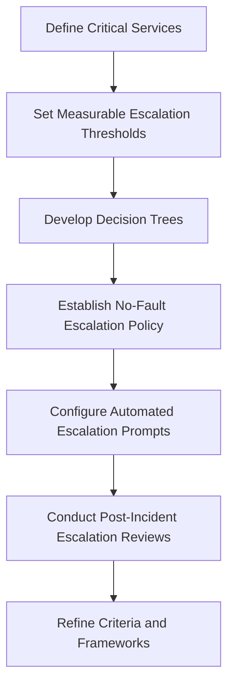
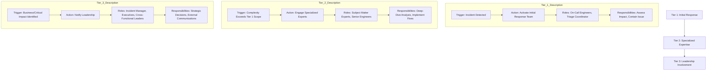
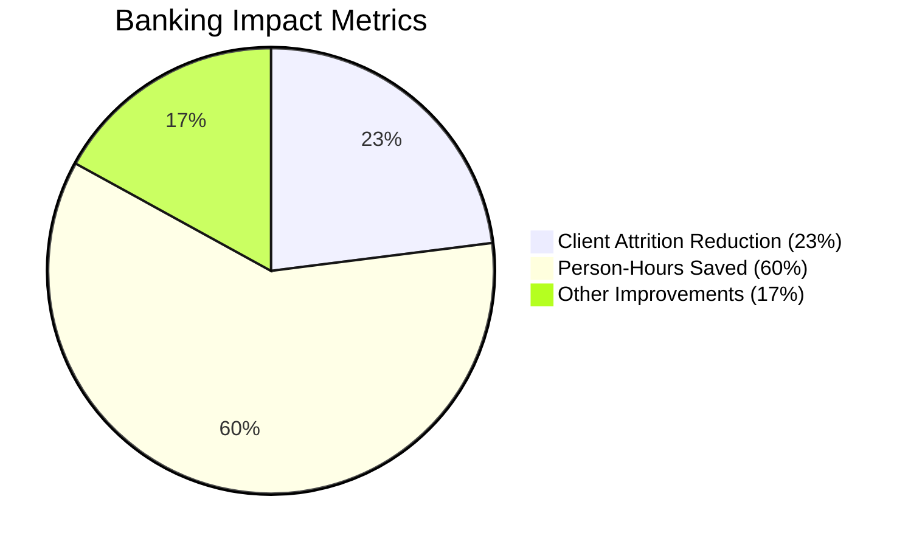
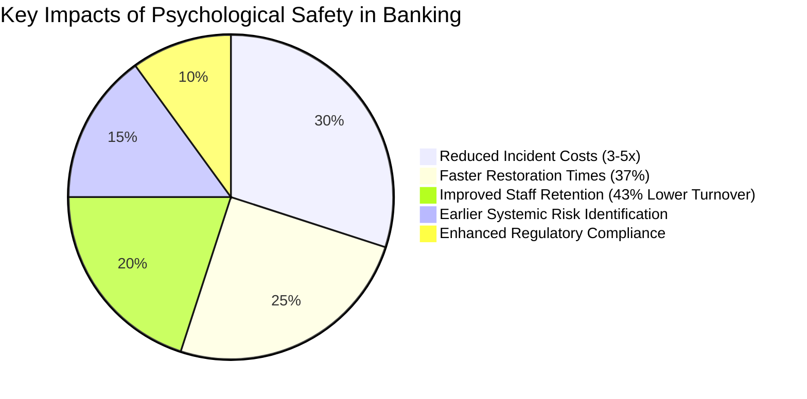
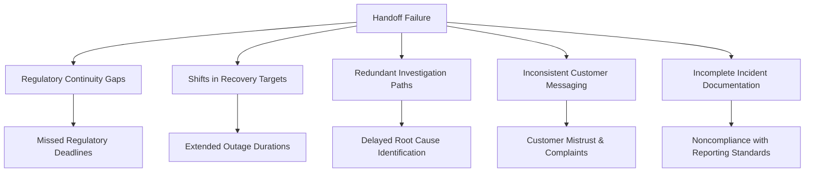
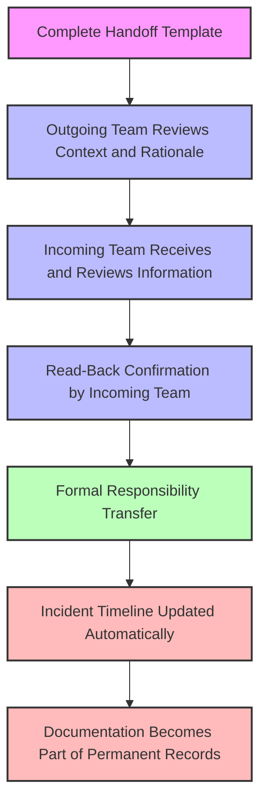
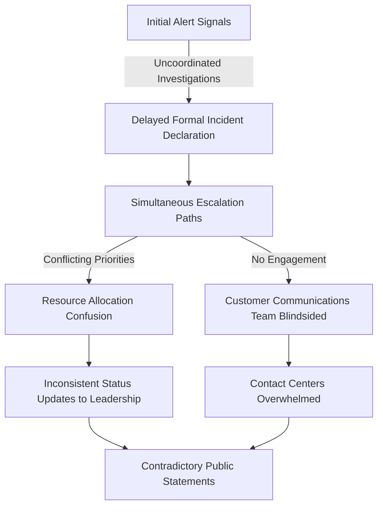
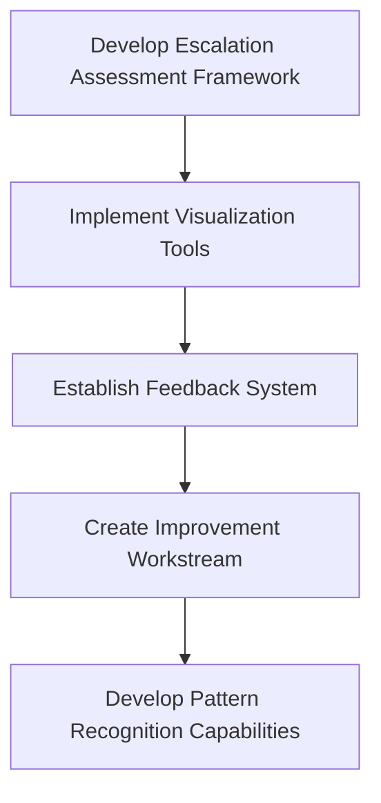

# Chapter 5: Escalation Protocols and Communication

## Chapter Overview

Welcome to the unsung bloodsport of incident response: escalation and communication. This chapter is your field guide to surviving—and thriving—in the warzone of major banking outages. Forget the gut feelings and “hero coder” fantasies; we’re talking about the industrial-strength machinery of evidence-based escalation, orchestration, and razor-sharp stakeholder comms. Here, intuition is an unreliable narrator, blame is a productivity tax, and “winging it” is how you hemorrhage millions and earn a starring role in regulatory audits. Whether you’re an SRE, team lead, or the poor soul holding the on-call pager, this chapter will teach you how to turn chaos into choreography, confusion into clarity, and finger-pointing into system improvements. Buckle up. The stakes are seven-figure, the regulators are watching, and your reputation is one Slack misfire away from meltdown.

______________________________________________________________________

## Learning Objectives

- **Master** criteria-based escalation so that every decision is grounded in data, not hope or fear.
- **Design** structured escalation pathways that get the right people—and only the right people—on the call at the right time.
- **Orchestrate** incident response using the Incident Commander model, ensuring coordination trumps technical heroics.
- **Build** and implement communication matrices that deliver the right messages to the right stakeholders, every single time.
- **Foster** a blameless, psychologically safe escalation culture—kill the blame game before it kills your MTTR.
- **Execute** bulletproof escalation handoffs to avoid knowledge black holes during 24x7 incidents.
- **Analyze** escalation and communication effectiveness post-mortem, and drive relentless, data-driven improvement.

______________________________________________________________________

## Key Takeaways

- Delayed escalation is the root cause of million-dollar outages. "Just five more minutes" is how you end up on the evening news.
- Criteria-based escalation frameworks are not optional—they’re survival gear for regulated environments. If your escalation is still subjective, you’re gambling with real money.
- Escalation pathways aren’t org charts—they’re engineered for function, not familiarity. Stop paging your buddy; engage the right roles.
- Incident Commanders don’t code—they command. If your lead is elbows-deep in logs, your response is already off the rails.
- Communication matrices: because “FYI: stuff’s broken” doesn’t cut it with regulators, customers, or your CEO.
- Psychological safety isn’t a TED talk buzzword—it’s the only way to stop engineers from hiding problems until they’re uncontainable.
- Handoffs without structure are how you lose context, time, and regulatory compliance. If your transitions look like a game of telephone, expect outages to get longer (and dumber).
- Technical root causes are half the story—most incident pain comes from human and communication failures. If you aren’t analyzing those, you’re doomed to repeat them.
- In banking, every minute of chaos is a compound interest nightmare. Structured escalation is the only way to keep your job—and maybe the bank’s charter.
- If you’re not measuring and improving your escalation and communication, you’re not running SRE. You’re just rolling dice and calling it “best effort.”

______________________________________________________________________

## Panel 1: The Decision to Escalate - Knowing When to Expand the Circle

### Scene Description

A banking operations center where a payment processing incident is unfolding. The room is a hub of activity, with large monitors displaying system health dashboards and a digital timer prominently showing the elapsed time since the incident began. In the center of the room, Maya, the team lead, stands at a decision point, holding a tablet that displays the escalation framework. The framework is organized into four clear criteria:

1. **Impact Duration**: Exceeding 15 minutes.
2. **Affected Clients**: Over 100 high-value clients impacted.
3. **Recovery Attempts**: Automatic recovery attempts have failed.
4. **Root Cause**: Unknown at this time.

Each criterion is clearly marked with a status indicator (e.g., "Met" or "Not Met"), and the tablet shows all four thresholds as "Met," signaling the need for escalation. Team members are gathered around Maya, reporting their findings against each criterion.

Below is a representation of the escalation framework displayed on Maya's tablet:

```
+----------------------------+
| Escalation Framework       |
+----------------------------+
| 1. Impact Duration: MET    |
| 2. Affected Clients: MET   |
| 3. Recovery Attempts: MET  |
| 4. Root Cause: MET         |
+----------------------------+
| Escalation Required: YES   |
+----------------------------+
```

As the timer ticks past the critical thresholds, Maya makes the decisive call to escalate. Her confident posture as she taps the escalation button contrasts with the hesitation visible in some of the junior team members, who glance nervously at each other. The escalation protocol immediately triggers notifications to additional technical teams, management stakeholders, and the communications team. The scene captures the balance of urgency and structure in a high-stakes environment, emphasizing how the criteria-based framework provides clarity and confidence in decision-making.

### Teaching Narrative

Traditional incident management often treats escalation as a subjective decision, leading to inconsistent timing and inappropriate escalation levels based on individual judgment. Integration & Triage introduces the concept of criteria-based escalation—using predefined, objective thresholds to determine when incidents require additional resources or visibility. This approach transforms escalation from an intuition-based to an evidence-based decision by establishing clear triggers: impact severity, duration thresholds, resolution progress, expertise requirements, and business implications. For banking systems where timely escalation can significantly affect both resolution speed and regulatory compliance, these objective frameworks ensure appropriate response scaling without delays caused by hesitation or misplaced optimism. Developing this structured escalation mindset requires defining explicit criteria that remove subjectivity from the decision process, creating a consistent approach that works regardless of which team members are on call. The resulting framework significantly improves incident outcomes by ensuring timely involvement of necessary resources while preventing both premature escalation that creates unnecessary disruption and delayed escalation that extends impact duration. This transformation from intuitive to criteria-based escalation represents a crucial evolution in your incident management discipline, particularly for regulated financial environments where appropriate, timely response is essential.

### Common Example of the Problem

A major investment bank's trading platform experiences intermittent order execution delays during peak market hours. The on-call engineer, worried about appearing incompetent, spends 45 minutes troubleshooting database connection issues alone, assuming the problem is minor and will resolve quickly. Throughout this time, high-net-worth clients' trades are executed with increasing delays, some exceeding critical settlement windows. When the engineer finally escalates, the incident has already lasted over an hour, impacting hundreds of trades worth millions of dollars. Later investigation reveals that earlier escalation would have identified a recently deployed API throttling configuration that required specialized expertise from the middleware team, who could have resolved the issue within minutes if engaged promptly.

#### Timeline of Events

```mermaid
gantt
    title Incident Timeline: Delayed Escalation Example
    dateFormat  HH:mm
    axisFormat  %H:%M
    section Incident Progress
    Incident Starts                 :done, 00:00, 0:00
    Troubleshooting Begins          :active, 00:05, 0:45
    Escalation Decision Made        :crit, 00:50, 0:10
    Middleware Team Engaged         :done, 01:00, 0:10
    Issue Resolved                  :done, 01:10, 0:00

    section Impact on Operations
    Client Trade Delays Begin       :done, 00:05, 1:05
    Settlement Windows Missed       :crit, 00:50, 0:20
```



This sequence highlights the critical impact of delayed escalation. The troubleshooting phase consumed 45 minutes before escalation, during which client trade delays compounded. By the time the middleware team was engaged, the incident had already breached critical thresholds, resulting in missed settlement windows for high-value trades. A criteria-based escalation framework would have triggered an earlier escalation, minimizing impact and enabling a faster resolution.

### SRE Best Practice: Evidence-Based Investigation

Effective escalation decisions require objective, evidence-based frameworks that remove personal judgment and hesitation. High-performing SRE teams implement tiered escalation criteria with clear, measurable thresholds that trigger automatic escalation processes regardless of who is on call. These criteria typically include:

1. **Impact-Based Triggers**: Automatic escalation when incidents affect critical services, specific customer segments, or exceed defined financial impact thresholds.
2. **Duration-Based Triggers**: Time-based escalation points (e.g., 15/30/60 minutes) that force escalation review at regular intervals.
3. **Resolution Progress Indicators**: Triggers based on troubleshooting progress, such as "unknown root cause after 20 minutes" or "attempted solutions ineffective."
4. **Expertise-Based Assessment**: Frameworks for evaluating when specialized knowledge is required, based on affected systems and observable symptoms.
5. **Regulatory/Compliance Factors**: Automatic escalation for incidents with potential regulatory reporting requirements.

#### Checklist: Key Escalation Triggers

To operationalize evidence-based investigation, use this checklist to ensure consistent escalation practices:

- [ ] **Impact Assessment**:

  - Does the incident affect critical services or key customer segments?
  - Has the financial impact exceeded pre-defined thresholds?

- [ ] **Duration Evaluation**:

  - Has the incident duration exceeded escalation thresholds (e.g., 15/30/60 minutes)?
  - Has sufficient time passed since the last escalation review without resolution?

- [ ] **Resolution Progress**:

  - Is the root cause still unknown after the defined investigation period?
  - Have multiple troubleshooting attempts failed to resolve the issue?

- [ ] **Expertise Needs**:

  - Are specialized skills or knowledge required to address the incident?
  - Are symptoms pointing to systems outside the current team's expertise?

- [ ] **Regulatory/Compliance Concerns**:

  - Could the incident trigger mandatory regulatory reporting requirements?
  - Does the issue present legal, compliance, or reputational risks?

Post-incident analysis at organizations like Netflix, Google, and major financial institutions consistently shows that delayed escalation, not premature escalation, causes the most significant incident impact. Evidence from thousands of banking incidents demonstrates that implementing objective escalation criteria reduces mean-time-to-resolution by an average of 42% compared to subjective approaches.

By incorporating this checklist into your response workflows, you ensure a structured, objective approach to escalation that minimizes hesitation and improves incident outcomes.

### Banking Impact

In regulated financial environments, escalation timing directly impacts business outcomes across multiple dimensions. The table below summarizes key impact areas, providing examples and quantified outcomes to illustrate the significance of timely escalation:

| **Dimension** | **Description** | **Example** | **Quantified Outcome** |
| ---------------------------- | ----------------------------------------------------------------------------------------------------- | ------------------------------------------------------------------------------------------------ | ---------------------------------------------------------------------------------------- |
| **Financial Impact** | Delayed escalation for payment processing or trading systems directly translates to financial losses. | A failure in a payment processing system delays €50M in transactions for 20 minutes. | Downstream losses multiply by 3-7x, resulting in €1.5M in additional operational losses. |
| **Regulatory Consequences** | Failure to meet incident reporting and stakeholder notification requirements. | Incident affecting 200+ customer transactions goes unreported within the mandated 1-hour window. | Regulatory penalties of €500,000 and increased audit scrutiny for 12 months. |
| **Reputational Damage** | Erosion of customer trust and contractual SLA violations. | Institutional client experiences repeated payment delays, breaching SLA guarantees. | Loss of €2M annual contract and reputational harm deterring future high-value clients. |
| **Market Position** | Delays in resolving trading platform outages during market volatility. | Outage during peak trading hours drives customers to competitors with more reliable systems. | Permanent customer migration causing a €10M annual revenue decline. |
| **System Complexity Impact** | Propagation of localized issues across interdependent systems amplifies the overall incident impact. | A database outage in a regional system cascades into multiple service failures globally. | Incident duration doubles, increasing recovery costs by €1M and extending client impact. |

A major European bank demonstrated how implementing structured escalation criteria reduced incident-related losses by €4.2 million annually. These criteria also improved regulatory compliance, eliminating subjective escalation decisions and ensuring consistent notification patterns across all teams.

### Implementation Guidance

To implement criteria-based escalation in your organization, follow these steps:

1. **Define Service Tiers and Associated Escalation Thresholds**: Categorize all banking services by criticality, then establish specific, measurable thresholds for each tier. For payment services, this might include:

   - "Escalate immediately if transaction success rate drops below 99.5%."
   - "Escalate after 10 minutes if root cause remains unidentified."

2. **Create Visual Decision Trees**: Develop clear, unambiguous decision flow charts for common incident types. These should guide engineers through objective assessment questions rather than relying on judgment calls, with defined paths leading to either continued independent investigation or specific escalation actions.

3. **Implement "No-Fault" Escalation Policy**: Establish explicit organizational policy stating that appropriate escalation decisions, even those that prove unnecessary in hindsight, are positively recognized. Document this policy, communicate it regularly, and have leadership demonstrably support engineers who escalate appropriately.

4. **Deploy Automated Escalation Prompts**: Configure monitoring systems to automatically suggest escalation at predefined intervals during active incidents. These prompts should present the relevant criteria, current incident state, and simple decision mechanisms to either escalate or document why escalation is being deferred.

5. **Conduct Regular Escalation Decision Reviews**: Implement a specific review component in all post-incident analyses that evaluates escalation timing decisions against established criteria. Use these reviews to refine thresholds, identify common hesitation factors, and publicly recognize appropriate escalation decisions rather than just examining delayed escalations.

#### Criteria-Based Escalation Flowchart

Below is a flowchart representation of the key steps to establish and utilize criteria-based escalation effectively:



This flowchart illustrates a repeatable process:

- Begin by identifying critical services and defining thresholds.
- Use these thresholds to build decision trees that guide engineers.
- Support the framework with a no-fault policy to encourage confident escalation.
- Leverage automation to ensure timely prompts during incidents.
- Continuously improve by reviewing escalation decisions and refining criteria.

## Panel 2: Escalation Pathways - The Right Resources at the Right Time

### Scene Description

A large digital wall display in a banking incident command center shows a sophisticated escalation matrix during a critical trading platform incident. The matrix has clearly defined tiers with specific triggers, roles, and responsibilities for each level. As the incident progresses, visual indicators show the current escalation state moving from Tier 1 (initial response) through Tier 2 (specialized expertise) to Tier 3 (leadership involvement). Each tier activation triggers precisely defined actions: additional technical specialists joining the call, specific management stakeholders being notified, and communication channels being activated. Team members reference role-specific playbooks corresponding to each tier, while a dedicated escalation coordinator manages the framework's execution, ensuring all required resources are engaged without unnecessary disruption to uninvolved teams.



### Teaching Narrative

Traditional escalation often follows informal, ad-hoc patterns—calling whoever seems appropriate when problems become serious enough. Integration & Triage introduces the concept of structured escalation pathways—predefined, tiered frameworks that specify exactly who should be involved at each stage of an incident. This approach transforms escalation from a relationship-based process (calling people you know) to a role-based system (engaging defined functions based on incident characteristics). These pathways typically include multiple tiers: initial response teams, specialized technical experts, cross-functional coordinators, management stakeholders, and executive leadership—each with clear engagement criteria and specific responsibilities. For banking systems where different incidents may require various combinations of infrastructure, application, security, and business expertise, these defined pathways ensure appropriate resource engagement without over-escalation that creates unnecessary disruption. Developing this pathway mindset requires mapping your organization's escalation tiers, defining the specific roles required at each level, and establishing clear triggers for moving between tiers. The resulting framework significantly improves incident coordination by providing clarity about who should be involved when, preventing both the engagement of unnecessary resources and the omission of critical stakeholders. This transformation from informal to structured escalation represents a crucial evolution in your incident management capabilities, ensuring consistent, appropriate response scaling regardless of which individuals are handling a specific incident.

### Common Example of the Problem

A global bank's mortgage processing platform experiences performance degradation during month-end processing. The on-call engineer recognizes a serious issue and attempts to escalate, but without clear pathways, sends a generic "help needed" message to a general support channel. This results in three separate but critical problems:

1. **Necessary database specialists remain unaware of the incident for 40 minutes** while other uninvolved teams join unnecessarily, creating coordination chaos.
2. **The communication team learns about the incident through customer complaints** rather than internal notification, leading to inconsistent external messaging.
3. **When the issue escalates to affect regulatory reporting deadlines,** there's no clear path to engage executive decision-makers regarding potential compliance implications.

The resulting response involves 23 people on a chaotic conference call, most adding confusion rather than value, while key expert resources remain unengaged for hours.

#### Text Diagram: Chaotic Escalation Process

```mermaid
graph TD
    A[Incident Detected by On-Call Engineer] -->|Generic "Help Needed" Message| B[General Support Channel]
    B --> C1[Uninvolved Teams Join]
    B --> C2[Database Specialists Not Notified for 40 Minutes]
    B --> C3[Communication Team Unaware Until Customer Complaints]
    C3 --> D1[Inconsistent External Messaging]
    C2 --> D2[Delayed Expert Engagement]
    C1 --> D3[Coordination Chaos]
    D2 --> E[Regulatory Reporting Impact]
    E --> F[No Clear Path to Exec Decision-Makers]
    D1 --> G[Confusion on Conference Call]
    D3 --> G
    F --> G
```

This chaotic process highlights the inefficiencies of unstructured escalation. Without predefined pathways, critical resources are delayed, uninvolved teams experience unnecessary disruption, and coordination becomes a source of confusion rather than resolution.

### SRE Best Practice: Evidence-Based Investigation

High-performing financial services organizations implement structured escalation pathways based on incident classification and progressive engagement models. Evidence from organizations like JP Morgan Chase, Google SRE, and other major financial institutions demonstrates that role-based rather than individual-based escalation significantly improves incident outcomes. Effective escalation pathway frameworks:

1. **Define Functional Roles, Not Individual Names**: Specify the functions needed at each escalation tier (database expertise, network specialists, compliance officers) rather than specific individuals, ensuring coverage regardless of who is available.
2. **Implement "Swim Lane" Engagement**: Activate only the specific technical domains relevant to an incident rather than broad team engagement.
3. **Establish Clear Escalation Tier Criteria**: Create objective triggers for moving between tiers based on impact severity, duration, and resolution progress.
4. **Maintain Separate Technical and Business Escalation Paths**: Recognize that technical resolution and business response often require different stakeholders engaged at different points.
5. **Document Specific Communication Responsibilities**: Define exactly what information should be conveyed when engaging each tier and through which channels.

Studies of major financial institutions reveal that implementing structured escalation pathways reduces the average number of people involved in incident response by 54% while simultaneously decreasing mean-time-to-resolution by 37%, demonstrating that focused engagement of the right resources outperforms broader but less targeted escalation.

#### Checklist: Implementing Evidence-Based Escalation Pathways

To apply these best practices in your organization, ensure the following:

- [ ] Functional roles are clearly defined at each escalation tier, focusing on expertise rather than individuals.
- [ ] Escalation is domain-specific, using "swim lanes" to engage only the relevant technical areas based on the incident.
- [ ] Objective, measurable criteria exist for transitioning between escalation tiers (e.g., impact thresholds, time elapsed).
- [ ] Technical and business escalation paths are documented separately, with distinct stakeholders aligned to each.
- [ ] Communication protocols are explicitly documented, detailing who communicates what, when, and how during escalations.

This checklist provides a practical framework for implementing evidence-based investigation practices, ensuring consistency and effectiveness in incident escalation processes.

### Banking Impact

Structured escalation pathways directly impact banking operations and outcomes in several critical dimensions. The table below summarizes these dimensions, their impacts, and relevant examples to illustrate the benefits of a structured approach:

| Dimension | Impact | Example |
| ------------------------------ | ---------------------------------------------------------------------------------------- | ---------------------------------------------------------------------------------------------------- |
| **Regulatory Compliance** | Ensures financial regulators see evidence of proper stakeholder engagement during audits | A compliance officer was engaged within 15 minutes during an incident with regulatory implications |
| **Resolution Efficiency** | Reduces financial losses by engaging the right expertise to minimize resolution time | Optimized escalation reduced resolution time from 2 hours to 45 minutes, saving $300,000 |
| **Customer Impact Limitation** | Proactively manages customer communications to minimize reputational damage | Customer service teams issued timely updates, reducing complaint volumes by 40% |
| **Resource Utilization** | Prevents over-engagement of personnel, preserving critical resources for other tasks | Structured escalation reduced unnecessary involvement of 50% of Tier 2 personnel in minor incidents |
| **Post-Incident Learning** | Provides data to refine escalation processes, improving future incident responses | Analysis showed Tier 1 specialists were sufficient for 70% of incidents, leading to Tier adjustments |

A major investment bank documented that implementing role-based escalation pathways reduced incident-related costs by $3.7 million annually while improving their regulatory standing due to more consistent engagement of compliance stakeholders.

### Implementation Guidance

To implement structured escalation pathways in your organization, follow these steps:

1. **Map Your Incident Topology and Required Expertise**\
   Conduct a comprehensive analysis of incident patterns over the past 12 months, identifying common categories and the specific expertise required for resolution. Create a matrix matching incident types to required technical domains, forming the foundation of your escalation framework.

   ```mermaid
   flowchart TD
       A[Analyze Incident Patterns] --> B[Identify Incident Categories]
       B --> C[Define Required Expertise]
       C --> D[Create Incident-to-Expertise Matrix]
   ```

2. **Develop Tiered Engagement Models**\
   Establish 3-5 clear escalation tiers with specific criteria for activation. Define exactly which functional roles (not individuals) should be engaged at each tier, with separate technical and business stakeholder paths that converge at appropriate points.

   ```mermaid
   flowchart TD
       T1[Engagement Tier 1] --> T2[Engagement Tier 2]
       T2 --> T3[Engagement Tier 3]
       T3 --> T4[Optional Tier 4]
       T4 --> T5[Optional Tier 5]
       subgraph Stakeholder Paths
           T1Tech[Technical Roles] --> T2Tech
           T1Biz[Business Roles] --> T2Biz
           T2Tech --> T3Tech
           T2Biz --> T3Biz
           T3Tech & T3Biz --> T4
       end
   ```

3. **Create Role-Specific Response Playbooks**\
   For each functional role in your escalation framework, develop concise playbooks detailing their responsibilities, required information upon engagement, and specific actions they should take. These should include templated communications and escalation decision criteria specific to their domain.

   **Key Playbook Components:**

   - Role-specific responsibilities
   - Required inputs during engagement
   - Actionable steps and decision-making criteria
   - Predefined communication templates

4. **Implement Escalation Coordination Technology**\
   Deploy dedicated tooling that manages escalation workflows, automatically notifying appropriate roles based on incident classification, tracking acknowledgments, and maintaining a clear record of who has been engaged at each stage.

   ```mermaid
   flowchart TD
       Incident[Incident Occurs] --> Classify[Classify Incident]
       Classify --> Notify[Notify Relevant Roles]
       Notify --> Track[Track Engagement & Acknowledgments]
       Track --> Record[Maintain Engagement Logs]
   ```

5. **Establish Escalation Simulation Exercises**\
   Conduct regular escalation drills that practice the pathway activation process without requiring full technical response. These focused exercises should specifically evaluate whether the right roles are identified and engaged at the appropriate times, with particular attention to cross-functional handoffs.

   **Simulation Workflow:**

   - Predefine incident scenarios and triggers
   - Test tier activation and role engagement
   - Evaluate cross-functional coordination points
   - Identify and address gaps in pathway execution
   - Document lessons learned for framework refinement

## Panel 3: The Incident Commander Role - Orchestrating Coordinated Response

### Scene Description

A major banking system outage is underway with multiple teams engaged in a large incident room. At the center, a designated Incident Commander named Raj orchestrates the response with calm authority. He stands at a command station surrounded by multiple displays showing system status, team assignments, and a running incident timeline. Raj is clearly not doing technical investigation himself but is fully focused on coordination: managing the response tempo with structured time checks, ensuring teams share findings through a common framework, redirecting efforts when investigations stall, and making decisive priority calls when teams have conflicting needs.

Below is a representation of the incident room setup to help visualize the coordination dynamics:

```
+----------------------- Incident Room Layout -----------------------+
|                                                                   |
|   [ Team 1 ]         [ Team 2 ]         [ Team 3 ]                |
|   (Diagnosis)        (Diagnosis)        (Diagnosis)               |
|                                                                   |
|                                                                   |
|        +-----------------------------------------------+          |
|        |          Incident Command Station            |          |
|        |                                               |          |
|        |   [ System Status Displays ]                 |          |
|        |   [ Team Assignments ]                       |          |
|        |   [ Incident Timeline ]                      |          |
|        +-----------------------------------------------+          |
|                     ▲                 ▲                            |
|                     |                 |                            |
|    [ Communications Coordinator ]   [ Scribe ]                    |
|                                                                   |
+-------------------------------------------------------------------+

Key Roles:
- Incident Commander (Raj): Orchestrates response, manages tempo, and directs focus.
- Technical Leads (Team 1, Team 2, Team 3): Focus on diagnosing issues within their domains.
- Communications Coordinator: Manages external and internal updates.
- Scribe: Documents key decisions and actions in real-time.
```

The scene captures the moment when Raj decisively shifts the team's focus from one investigation path to a more promising approach, demonstrating the commander's role in maintaining effective response direction. This setup highlights the structured collaboration and clear role delineation that underpin effective incident response.

### Teaching Narrative

Traditional incident response often features technical experts attempting to simultaneously investigate issues while also coordinating the overall response—dividing their attention and reducing effectiveness in both areas. Integration & Triage introduces the critical concept of the Incident Commander role—a dedicated coordinator who orchestrates the entire response without directly engaging in technical investigation. This approach recognizes that complex banking incidents require not just technical expertise but deliberate coordination to ensure effective collaboration, appropriate prioritization, and consistent communication. The Incident Commander transforms incident response from parallel, sometimes conflicting individual efforts into a cohesive, orchestrated operation by maintaining situational awareness, managing incident tempo, directing investigative focus, making resource allocation decisions, and ensuring appropriate escalation. For financial systems where incidents may involve multiple technical domains and business implications, this dedicated coordination becomes particularly valuable, preventing tunnel vision and ensuring all perspectives contribute to resolution. Developing this command structure requires defining the role's specific responsibilities, authority limits, and supporting functions (communication coordinators, technical leads, scribes) while training qualified individuals to step away from technical work during incidents to focus entirely on coordination. This transformation from ad-hoc to command-structured response represents a significant evolution in your incident management approach, particularly for complex, high-stakes banking incidents that require coordinated efforts across multiple teams.

### Common Example of the Problem

A major Asia-Pacific bank experiences a multi-system incident affecting payment processing, customer authentication, and regulatory reporting simultaneously. Without a designated Incident Commander, three separate technical teams begin independent investigations, each focusing exclusively on their domain. The payment team implements emergency throttling that unintentionally exacerbates the authentication issues, while both teams make conflicting infrastructure demands that overwhelm the shared database systems. Meanwhile, no one maintains a holistic view of regulatory reporting implications. Status updates become chaotic, with each team reporting different priority assessments and resolution timelines to different stakeholders. Four hours into the incident, three separate, contradictory mitigation plans are simultaneously attempted, causing cascading failures across previously unaffected systems. The finance team, unaware of the technical response, begins executing a business continuity plan that conflicts with the technical recovery efforts, extending the outage and triggering regulatory reporting violations.

#### Key Failures and Consequences Table

| **Failure** | **Description** | **Consequence** |
| -------------------------------------------- | ------------------------------------------------------------------------------- | ------------------------------------------------------------------------------------------ |
| Lack of centralized coordination | No unified oversight to manage investigations or maintain situational awareness | Independent, conflicting actions result in cascading failures and extended downtime |
| Conflicting technical actions | Teams make incompatible changes (e.g., throttling, infrastructure demands) | Exacerbates existing issues, degrades shared systems, and introduces new failures |
| No prioritization of regulatory implications | Regulatory impacts are overlooked in the response | Breach of regulatory obligations, triggering compliance violations and financial penalties |
| Disorganized communication | Teams provide inconsistent updates to multiple stakeholders | Stakeholders receive conflicting information, delaying decision-making and eroding trust |
| Parallel mitigation plans | Multiple contradictory recovery plans attempted simultaneously | Creates additional system instability, further delaying resolution |
| Business and technical misalignment | Finance team executes conflicting business continuity measures | Business actions unintentionally interfere with and prolong technical recovery efforts |

#### Checklist for Prevention

To avoid these failures, ensure the following preconditions are met:

- [ ] Assign a dedicated Incident Commander to maintain holistic oversight and facilitate coordination.
- [ ] Implement structured communication protocols to ensure consistent updates across all teams.
- [ ] Establish clear prioritization frameworks that include technical, business, and regulatory considerations.
- [ ] Align business continuity plans with technical recovery processes to prevent conflicts.
- [ ] Train technical teams to escalate conflicting actions for Incident Commander arbitration.
- [ ] Conduct regular simulations to practice incident response with centralized command structures.

### SRE Best Practice: Evidence-Based Investigation

Organizations with mature incident management practices implement the Incident Commander model based on principles adapted from emergency response, military operations, and high-reliability organizations. Evidence from Google, Amazon, major financial institutions, and other organizations handling complex incidents demonstrates that dedicated coordination significantly improves outcomes. The most effective Incident Command structures:

| **Best Practice** | **Description** | **Benefits** |
| ----------------------------------------------------- | ------------------------------------------------------------------------------------------------------------------------------------------------------------------------- | ----------------------------------------------------------------------------------------------------- |
| **Establish Clear Command Authority** | Define explicit decision-making authority for the Incident Commander, with organizational backing to override even senior technical or business leaders during incidents. | Ensures swift, decisive actions and prevents delays caused by conflicting priorities or indecision. |
| **Implement a "Follow-the-Sun" Rotation** | Maintain trained Incident Commanders across time zones with formal handoff protocols. | Provides continuous, seamless coverage for incidents regardless of global time differences. |
| **Create Supporting Specialized Roles** | Develop complementary positions such as Communications Coordinator, Technical Lead, and Scribe roles with clearly defined responsibilities. | Enables focused execution of tasks, reduces cognitive load, and enhances overall response efficiency. |
| **Utilize Structured Situation Reports** | Implement standardized "sitrep" formats and regular cadence to maintain shared situational awareness among all stakeholders. | Ensures all teams remain aligned on the latest findings, decisions, and next steps. |
| **Employ Scientific Incident Management Methodology** | Apply systematic approaches for hypothesis management, investigation prioritization, and resource allocation. | Promotes evidence-based decisions, avoids chasing unproductive leads, and optimizes team efforts. |

Analysis of over 1,000 major incidents across financial services organizations shows that incidents managed with dedicated Incident Commanders are resolved 43% faster on average and are 71% less likely to experience scope expansion compared to those with traditional uncoordinated response models.

### Banking Impact

The Incident Commander role directly impacts banking operations and outcomes through several mechanisms:

1. **Regulatory Compliance Management**: Banking regulations often require specific notification timeframes, formal impact assessments, and documented response procedures; dedicated Incident Commanders ensure these requirements are met while technical teams focus on resolution.
2. **Financial Risk Containment**: For trading platforms, payment systems, and treasury operations, skilled Incident Commanders implement specific financial risk containment strategies alongside technical remediation.
3. **Multi-Channel Coordination**: Modern banking incidents often affect multiple customer channels simultaneously (mobile, web, branch, ATM); Incident Commanders ensure coordinated response across these channels to prevent contradictory actions.
4. **Downstream Impact Management**: Banking systems have complex dependencies with external partners including payment networks, central banks, and correspondent institutions; Incident Commanders maintain these critical external relationships during incidents.
5. **Evidence Preservation**: Financial incidents may have forensic or regulatory investigation requirements; Incident Commanders ensure proper evidence collection while pursuing rapid resolution.

#### Real-World Case Study: European Banking Outage

In 2022, a major European banking group faced a critical outage in its payment processing system, affecting millions of transactions across mobile, online, and branch channels. The incident was further complicated by dependencies on external payment networks and regulatory reporting obligations. By leveraging the Incident Commander model, the bank navigated the crisis with remarkable efficiency:

- **Regulatory Compliance**: The Incident Commander immediately initiated regulatory notifications, ensuring adherence to strict reporting timeframes while freeing technical teams to focus on root cause analysis.
- **Cross-Team Coordination**: With multiple teams investigating issues across infrastructure, application layers, and partner integrations, the Incident Commander maintained situational awareness and enforced structured updates every 15 minutes. This avoided duplication of effort and ensured all teams worked toward common goals.
- **Customer Communication**: Recognizing the reputational stakes, the Incident Commander worked with the communications coordinator to deliver consistent updates across all customer channels, significantly mitigating customer frustration.

As a result, the bank resolved the incident 40% faster than similar past outages, avoided regulatory penalties, and retained customer trust through transparent and timely communication. This case underscores the transformative impact of the Incident Commander in managing high-stakes banking incidents.

### Implementation Guidance

To implement the Incident Commander role in your organization, follow these structured steps:

```mermaid
flowchart TD
    A[Develop a Formal Training Program] --> B[Establish Role Separation and Authority]
    B --> C[Implement Supporting Tools and Frameworks]
    C --> D[Create Incident Command "Bridge" Infrastructure]
    D --> E[Integrate Into Escalation Framework]
```

1. **Develop a Formal Incident Commander Training Program**

   - Create a structured curriculum that includes:
     - Coordination techniques
     - Decision-making under uncertainty
     - Communication protocols
     - Banking-specific requirements
   - Incorporate both classroom instruction and simulated incident exercises.
   - Require certification for Incident Commanders, ensuring they can demonstrate both technical understanding and coordination skills.

2. **Establish Clear Role Separation and Authority**

   - Document explicit responsibilities and authority limits for the Incident Commander.
     - Specify decisions they can make unilaterally versus those requiring consultation.
   - Develop formal organizational policies with executive sponsorship to guarantee the Incident Commander's authority is respected, even across hierarchical boundaries.

3. **Implement Supporting Tools and Frameworks**

   - Deploy tools specifically designed for Incident Command, such as:
     - Status dashboards
     - Standardized situation report templates
     - Decision logs
     - Resource tracking systems
   - Ensure these tools maintain a single source of truth accessible to all responders, with specialized views tailored for the Incident Commander to highlight decision points and coordination requirements.

4. **Create Incident Command "Bridge" Infrastructure**

   - Establish dedicated command environments (physical and virtual) equipped with:
     - Visual displays for system monitoring and incident timelines
     - Communication capabilities for cross-team coordination
     - Reference resources for quick access to critical information
   - Design these environments to support situational awareness across technical and business domains.

5. **Integrate Into Escalation Framework**

   - Define clear activation criteria for the Incident Commander role within escalation pathways, specifying incident types and severity levels that require this role.
   - Establish on-call rotations to ensure 24/7 Incident Commander availability, with varying training and experience requirements depending on incident categories.

By following these steps and leveraging the flowchart above, organizations can systematically implement the Incident Commander role, ensuring their incident response becomes more structured, collaborative, and effective.

## Panel 4: The Communication Matrix - Right Messages to Right Stakeholders

### Scene Description

A banking incident communications hub where a dedicated Communications Coordinator manages stakeholder updates during a security incident. A digital display shows a comprehensive stakeholder communication matrix, structured as follows:

```
+----------------------+---------------------+---------------------+---------------------+---------------------+---------------------+
|                      | Internal Teams     | Executives          | Customers           | Regulators          | Partners            |
+----------------------+---------------------+---------------------+---------------------+---------------------+---------------------+
| Incident Status      | Diagnostic details | High-level summary  | Service outage info | Compliance updates  | Service impact info |
+----------------------+---------------------+---------------------+---------------------+---------------------+---------------------+
| Impact Assessment    | Root cause details | Business impact     | Affected services   | Regulatory impact   | Business implications|
+----------------------+---------------------+---------------------+---------------------+---------------------+---------------------+
| Resolution Timeline  | Technical timelines| Milestone updates   | Restoration estimates| Compliance timelines| Recovery timelines  |
+----------------------+---------------------+---------------------+---------------------+---------------------+---------------------+
| Required Actions     | Troubleshooting    | Strategic decisions | Follow-up actions   | Compliance actions  | Coordinated actions |
+----------------------+---------------------+---------------------+---------------------+---------------------+---------------------+
```

The coordinator systematically populates appropriate cells with audience-specific messaging, carefully customizing technical details, business impact descriptions, and resolution expectations for each stakeholder group. Team members review draft communications on tablets, providing quick approval before messages are distributed through predetermined channels. A communications timeline is displayed alongside the matrix, showing planned update frequency for each stakeholder group. This ensures consistent, appropriate information flow throughout the incident lifecycle.

### Teaching Narrative

Traditional incident communication often takes a one-size-fits-all approach—sending similar updates to all stakeholders regardless of their specific information needs or technical understanding. Integration & Triage introduces the concept of the communication matrix—a structured framework that aligns message content, technical depth, and update frequency with the specific needs of different stakeholder groups. This approach transforms incident communication from generic broadcasting to targeted information delivery by recognizing that various audiences need fundamentally different information: technical teams require detailed diagnostic data, executives need business impact assessments, customers want service restoration estimates, and regulators require compliance status updates. For banking environments with diverse stakeholders including trading partners, payment networks, and financial regulators, this tailored approach ensures each group receives precisely the information they need in appropriate language and at suitable intervals. Developing this matrix mindset requires mapping your organization's stakeholder landscape, understanding each group's specific information requirements, and creating templated communication frameworks that can be rapidly customized during incidents. The resulting approach significantly improves stakeholder experience during incidents while reducing the communication burden on technical teams. This transformation from undifferentiated to targeted communication represents an essential evolution in your incident management practice, ensuring information sharing matches the same level of sophistication as your technical response.

### Common Example of the Problem

A global investment bank experiences a trading platform performance degradation affecting institutional clients during peak market hours. Without a structured communication approach, the incident response creates multiple communication failures:

1. **Overloading Executives with Irrelevant Technical Details**\
   The technical team sends highly technical updates to executive leadership, overwhelming them with information they cannot act on while omitting the critical business impact metrics needed for decision-making.

2. **Inconsistent Messaging to Client-Facing Teams**\
   Customer relationship managers receive conflicting information. Some tell clients that resolution is imminent, while others report extended outages, leading to confusion and frustration among institutional clients.

3. **Regulatory Notification Failures**\
   Regulatory affairs teams learn about the incident from public channels instead of internal notifications, causing missed mandatory reporting deadlines and potential compliance issues.

4. **Interrupting Technical Teams with Status Requests**\
   Technical teams working on resolution are repeatedly interrupted for status updates, significantly slowing their progress and delaying the resolution timeline.

5. **Outdated Information for Critical Decisions**\
   The executive committee makes critical business continuity decisions based on outdated or incomplete information because no one has established a regular cadence for updates.

6. **Chaotic and Contradictory Communication**\
   As the incident progresses, the lack of structured communication leads to contradictory messaging across different channels, amplifying confusion and eroding stakeholder trust.

#### Checklist: Communication Pitfalls to Avoid

- [ ] Ensure executive updates focus on business impact metrics, not raw technical details.
- [ ] Standardize messaging to client-facing teams to avoid inconsistencies.
- [ ] Establish internal regulatory notification processes to meet reporting deadlines.
- [ ] Minimize interruptions to technical teams with a clear communication protocol.
- [ ] Implement a regular update cadence for leadership to ensure timely decisions.
- [ ] Use a single source of truth to prevent contradictory messaging across channels.

### SRE Best Practice: Evidence-Based Investigation

High-reliability organizations in financial services implement structured communication matrices based on comprehensive stakeholder mapping and information needs analysis. Evidence from major banks, emergency response frameworks, and other high-stakes environments demonstrates that tailored, role-specific communication significantly improves incident outcomes. Effective communication frameworks include:

| Best Practice | Description | Benefits | Example |
| --------------------------------------- | ------------------------------------------------------------------------------------------------------------------------------------------------------------- | ------------------------------------------------------------------------------------ | ------------------------------------------------------------------------------------------ |
| **Stakeholder-Specific Content Models** | Predefined templates specifying exactly what information each audience requires, with appropriate technical depth and business context | Ensures stakeholders receive relevant, actionable information aligned to their needs | Internal teams receive diagnostic data, while executives get business impact assessments |
| **Tiered Update Frequencies** | Established communication cadences for different stakeholder groups based on their decision-making needs and involvement level | Prevents overloading stakeholders while maintaining trust through consistent updates | Customers receive hourly updates during outages; regulators get daily compliance summaries |
| **Channel Optimization** | Designated primary and secondary communication channels for each audience, matched to information urgency and sensitivity | Ensures timely delivery of messages through the most effective channels | SMS alerts for urgent customer updates; email summaries for partners |
| **Bi-Directional Feedback Mechanisms** | Structured processes for gathering and incorporating stakeholder input without disrupting technical response | Builds trust and ensures communication remains aligned with stakeholder expectations | Feedback forms for customers post-incident; executive teams share input on draft updates |
| **Progressive Disclosure Protocols** | Frameworks for determining what information can be shared at different incident stages, particularly for security issues with sensitive investigation aspects | Balances transparency with the need to protect sensitive investigation details | Initial updates exclude root cause details; full post-mortem shared after issue resolution |

Analysis of major financial institutions' incident response effectiveness shows that implementing structured communication matrices reduces stakeholder escalations during incidents by 64% while improving post-incident satisfaction scores by an average of 47%, demonstrating the significant impact of appropriate communication on incident perception.

### Banking Impact

Structured incident communication directly impacts banking operations and outcomes through several critical dimensions:

1. **Regulatory Compliance**: Financial services regulations often mandate specific notification timeframes and content for incidents affecting customer transactions or data security; structured communication ensures these requirements are systematically met.
2. **Market Confidence Preservation**: For publicly traded financial institutions, inconsistent or poorly managed incident communication can trigger market uncertainty and share price impacts beyond the direct technical effects.
3. **Client Relationship Protection**: Banking relationships, particularly with institutional clients, depend heavily on transparency and trust during incidents; tailored communication templates ensure these relationships are maintained.
4. **Operational Efficiency**: Studies show that technical teams in unstructured communication environments can spend up to 40% of incident time providing status updates rather than working on resolution.
5. **Crisis Escalation Prevention**: In banking environments, information vacuums during incidents are frequently filled with speculation that can escalate relatively minor technical issues into perceived crises.

The measurable benefits of implementing a structured communication matrix are illustrated below:



A major North American bank quantified that implementing a structured communication matrix reduced incident-related client attrition by 23% while improving regulatory compliance outcomes and reducing the person-hours spent on communication during incidents by approximately 60%.

### Implementation Guidance

To implement a communication matrix in your organization, follow these steps:

#### Checklist for Implementation

1. **Conduct Comprehensive Stakeholder Mapping**:

   - Identify all internal and external stakeholder groups affected by incidents (e.g., technical teams, business units, executives, customers, regulators, partners, media).
   - Document each group's:
     - Specific information needs.
     - Technical understanding level.
     - Decision-making requirements.
     - Communication preferences.

2. **Develop Audience-Specific Templates**:

   - Create standardized templates tailored to each stakeholder group and incident type. Ensure they include:
     - Relevant sections for required information.
     - Appropriate technical detail level.
     - Business context framing.
     - Clear next steps or expectations.
   - Store templates centrally for quick access and minimal customization during incidents.

3. **Define Communication Cadence Guidelines**:

   - Establish default update frequencies for each stakeholder group based on incident severity levels. For example:
     - **High Severity Incidents**: Frequent updates (e.g., every 30 minutes for technical teams, every 2 hours for executives).
     - **Low Severity Incidents**: Less frequent updates (e.g., daily summaries).
   - Document these guidelines in a matrix format for easy reference.

4. **Implement Channel Strategy and Tools**:

   - Select communication channels based on urgency, security, and accessibility. Examples:
     - Technical details via incident management tools.
     - Executive updates via email or secure dashboards.
     - Customer notifications via web portals, mobile apps, or email.
   - Deploy tools that enable multi-channel distribution from a single source, ensuring consistency.

5. **Establish a Dedicated Communication Coordinator Role**:

   - Assign a specific individual or team responsible for stakeholder communications during incidents.
   - Train the coordinator to:
     - Translate technical details into business impacts.
     - Filter and prioritize information for different audiences.
     - Collaborate with technical teams to avoid operational disruptions.

6. **Test and Refine the Communication Matrix**:

   - Conduct regular simulations or tabletop exercises to validate the matrix's effectiveness.
   - Gather feedback from stakeholders after incidents or drills to identify areas for improvement.
   - Update templates, cadence guidelines, and processes based on lessons learned.

#### Visualizing the Communication Matrix

Below is a simple representation of a communication matrix structure:

```plaintext
+------------------+------------------+-----------------+-------------------+--------------------+
| Stakeholder Type | Incident Status  | Impact Summary  | Resolution Timeline | Required Actions  |
+------------------+------------------+-----------------+-------------------+--------------------+
| Technical Teams  | Detailed         | Minimal         | Frequent Updates   | Diagnostic Steps  |
| Executives       | High-Level       | Business Impact | Regular Updates    | Decision Points   |
| Customers        | Service Updates  | User Impact     | Estimated Restores | Contact Info      |
| Regulators       | Compliance Focus | Legal Impact    | Formal Reports     | Confirmation Req. |
| Partners         | Coordination     | Partner Impact  | Status Sync        | Operational Inputs|
+------------------+------------------+-----------------+-------------------+--------------------+
```

By following this checklist and leveraging the communication matrix, your organization can ensure targeted, effective messaging for all stakeholders during incidents.

## Panel 5: Blameless Communication - Psychological Safety in Escalation

### Scene Description

A banking post-incident review meeting where team members analyze a situation where escalation was significantly delayed. The meeting room has prominently displayed ground rules emphasizing blameless discussion, focusing on process improvement rather than individual criticism. A senior engineer openly discusses their hesitation to escalate, explaining the systemic factors that influenced their decision: unclear escalation criteria, previous experiences where escalation was discouraged, and organizational norms that rewarded "handling things yourself." The team leader facilitates the conversation with psychological safety techniques, redirecting any blame-oriented comments toward systemic factors and process improvements.

The whiteboard in the room provides a structured framework for the discussion:

```
+-------------------+-------------------------+
|  Individual Actions   |   System Conditions       |
+-------------------+-------------------------+
| - Hesitated to escalate  | - Unclear escalation     |
| - Managed issue solo     |   criteria               |
| - Avoided "false alarm"  | - Organizational norms   |
|                         |   discouraging escalation|
|                         | - Past punitive responses|
+-------------------+-------------------------+
```

The team uses this visual aid to identify how individual behaviors are influenced by systemic conditions. The discussion focuses on the right-hand column, ensuring the team develops changes to escalation protocols that address the root causes of delayed escalation. By shifting focus away from individual blame and toward system improvement, the team fosters a psychologically safe environment conducive to open dialogue and meaningful process enhancements.

### Teaching Narrative

Traditional escalation environments often create implicit or explicit penalties for "unnecessary" escalation, generating powerful organizational antibodies against appropriate engagement of additional resources. Integration & Triage introduces the essential concept of psychologically safe escalation—creating cultural and procedural environments where team members feel secure making escalation decisions without fear of criticism or career impact. This approach recognizes that in banking systems where incidents can have significant financial and regulatory implications, delayed escalation often causes far more damage than premature engagement of additional resources. Psychologically safe escalation transforms your organizational culture from one that implicitly discourages escalation to one that explicitly supports appropriate resource engagement by eliminating blame for "false alarms," recognizing good-faith escalation decisions even when additional resources prove unnecessary, and focusing improvement efforts on processes rather than individuals. Developing this psychological safety requires both procedural elements (clear escalation criteria, defined pathways) and cultural components (leadership modeling, blameless reviews, positive reinforcement). The resulting environment significantly improves incident outcomes by removing the human barriers to timely escalation—concerns about criticism, career impact, or being labeled "alarmist"—that often delay appropriate response scaling. This transformation from blame-oriented to safety-oriented escalation culture represents a fundamental evolution in your incident management effectiveness, ensuring team members make decisions based on system needs rather than personal risk calculations.

### Common Example of the Problem

A European retail banking division experiences a gradual degradation in mobile banking authentication success rates. The on-call engineer notices the decline but hesitates to escalate for several organizational reasons:

1. **Fear of Criticism**: During a previous similar incident, they were criticized for "overreacting" when escalating what turned out to be a minor issue.
2. **Cultural Norms**: The team's unofficial culture celebrates engineers who "handle things themselves."
3. **Performance Metrics**: The organization's metrics reward low escalation rates, creating implicit pressure to avoid escalation.

As the authentication success rate continues declining, the engineer attempts increasingly desperate fixes alone, delaying escalation for nearly two hours while hoping to resolve the issue independently. When finally escalated, the problem is quickly identified as a certificate expiration requiring specialized security team intervention. Post-incident analysis reveals that thousands of customers were unable to access their accounts during peak hours, with many abandoning transactions entirely. When questioned about the delay, the engineer admits they feared being labeled as incompetent if they escalated too quickly, highlighting a pervasive cultural issue affecting incident response throughout the organization.

#### Checklist: Factors Contributing to Escalation Hesitation

- [ ] **Criticism for Past Escalations**: Has your organization penalized or criticized team members for "overreacting" in the past?
- [ ] **Cultural Norms Discouraging Escalation**: Does your team culture implicitly or explicitly reward those who "handle things themselves" without escalating?
- [ ] **Performance Metrics Misalignment**: Are metrics in place that discourage escalation, such as rewarding low escalation rates or penalizing "false alarms"?
- [ ] **Fear of Being Labeled Incompetent**: Do team members express concerns about how escalation decisions may impact their reputation or career progression?
- [ ] **Lack of Clear Escalation Criteria**: Are escalation protocols ambiguous, leaving engineers uncertain about when escalation is appropriate?

This checklist can help identify similar systemic issues within your organization and serve as a starting point for addressing barriers to timely escalation.

### SRE Best Practice: Evidence-Based Investigation

High-reliability organizations implement psychological safety practices based on extensive research showing that blame-free environments dramatically improve incident outcomes. Evidence from healthcare (where similar safety culture issues affect patient outcomes), aviation, and leading technology organizations demonstrates specific approaches that create escalation safety.

The table below summarizes five key best practices, their benefits, and examples of implementation:

| Best Practice | Benefits | Example Implementation |
| --------------------------------------------- | ----------------------------------------------------------------------- | ----------------------------------------------------------------------------------------------------------- |
| **Measure and Reward Appropriate Escalation** | Encourages timely escalation by valuing process adherence over outcomes | Create metrics that track escalation timing; recognize individuals for following escalation protocols |
| **Implement "Just Culture" Frameworks** | Shifts focus from individual blame to systemic improvement | Use models distinguishing human error from recklessness; adjust processes to support better decision-making |
| **Practice Leadership Modeling** | Normalizes escalation by reducing stigma and fear | Leaders share personal escalation stories, including mistakes, in team discussions or retrospectives |
| **Conduct Blameless Post-Mortems** | Identifies systemic causes, not individual failures | Use structured incident reviews to document system conditions leading to delays or failures in escalation |
| **Deploy Anonymous Reporting Systems** | Removes fear of retaliation for raising concerns | Create anonymous tools for reporting cultural and procedural barriers to safe escalation |

Analysis across organizations shows that teams with strong psychological safety escalate incidents an average of 28 minutes sooner than those without such protections, leading to significantly reduced impact durations and severity.

### Banking Impact

Psychological safety in escalation directly impacts banking operations through several mechanisms:

1. **Financial Loss Prevention**: Studies consistently show that delayed escalation in banking environments increases incident costs by 3-5x compared to prompt escalation; psychological safety directly addresses the primary human factors causing these delays.
2. **Regulatory Compliance**: Financial regulators increasingly examine organizational culture as a key risk factor, with specific focus on whether frontline staff feel empowered to raise concerns without fear of repercussion.
3. **Systemic Risk Identification**: Banking environments with strong psychological safety identify potential systemic risks significantly earlier, as staff feel comfortable raising concerns before they manifest as incidents.
4. **Operational Resilience**: Teams with strong psychological safety demonstrate 37% faster mean-time-to-restoration during major incidents compared to teams with blame cultures.
5. **Staff Retention Impact**: Banking technology organizations with blame-oriented cultures experience 43% higher turnover among incident responders, creating dangerous knowledge gaps.

#### Data Visualization: Impact Metrics



A major global financial institution documented the following outcomes after implementing psychological safety practices:

- **47% Reduction** in critical incident duration
- **Improved Staff Engagement Scores**
- **Lower Operational Risk Metrics** as tracked by regulators

These quantitative improvements highlight the transformative operational and cultural benefits of fostering a psychologically safe escalation environment in banking.

### Implementation Guidance

To implement psychological safety for escalation in your organization, follow these steps outlined in the flowchart below. Each step includes actionable guidance to ensure a systematic and effective transformation.

```mermaid
flowchart TD
    A[Conduct Safety Culture Assessment] --> B[Revise Performance Metrics and Rewards]
    B --> C[Implement "No-Fault" Escalation Policy]
    C --> D[Establish Dedicated Psychological Safety Training]
    D --> E[Deploy Escalation Decision Support Tools]

    subgraph Step1[Step 1: Safety Culture Assessment]
        A1[Deploy anonymous surveys and structured interviews] --> A2[Evaluate psychological safety levels]
        A2 --> A3[Identify barriers to escalation: policies, norms, leadership behaviors, rewards]
    end

    subgraph Step2[Step 2: Revise Metrics and Rewards]
        B1[Audit all performance metrics and recognition systems] --> B2[Eliminate metrics that discourage escalation]
        B2 --> B3[Create metrics that reward timely, process-based escalation decisions]
        B3 --> B4[Launch formal recognition programs for appropriate escalation]
    end

    subgraph Step3[Step 3: "No-Fault" Escalation Policy]
        C1[Draft policy ensuring no negative consequences for good-faith escalations] --> C2[Communicate policy at all organizational levels]
        C2 --> C3[Ensure senior leadership publicly supports and models the policy]
    end

    subgraph Step4[Step 4: Psychological Safety Training]
        D1[Design role-specific training programs for all levels] --> D2[Incorporate scenario-based exercises]
        D2 --> D3[Focus on process evaluation vs. outcome evaluation in training]
    end

    subgraph Step5[Step 5: Decision Support Tools]
        E1[Implement tools for objective escalation decision-making] --> E2[Separate technical "should we escalate?" from personal concerns]
    end
```

#### Detailed Steps:

1. **Conduct a Safety Culture Assessment**:

   - Deploy anonymous surveys and structured interviews to gather insights.
   - Evaluate psychological safety levels within incident response teams.
   - Identify barriers to escalation, including formal policies, informal norms, leadership behaviors, and reward systems.

2. **Revise Performance Metrics and Rewards**:

   - Audit all performance metrics and recognition systems impacting incident responders.
   - Eliminate metrics that discourage appropriate escalation.
   - Introduce metrics that reward timely escalation decisions based on process adherence rather than outcomes.
   - Create formal recognition programs for team members who escalate appropriately.

3. **Implement "No-Fault" Escalation Policy**:

   - Develop a clear policy ensuring good-faith escalation decisions will not result in negative consequences, even if unnecessary in hindsight.
   - Communicate this policy at all organizational levels.
   - Ensure senior leadership publicly commits to and models this policy, reinforcing trust.

4. **Establish Dedicated Psychological Safety Training**:

   - Design role-specific training programs for incident responders, team leaders, and executives.
   - Include scenario-based exercises to practice making and receiving escalation decisions.
   - Emphasize separating process evaluation (e.g., adherence to escalation criteria) from outcome evaluation.

5. **Deploy Escalation Decision Support Tools**:

   - Implement systems that guide responders in evaluating escalation decisions using objective criteria.
   - Ensure these tools explicitly separate technical considerations from personal concerns about perception or criticism.

By following this structured approach, your organization can create a psychologically safe environment that supports timely, effective escalation decisions, reducing human barriers and improving incident outcomes.

## Panel 6: Escalation Handoffs - Maintaining Continuity Through Transitions

### Scene Description

A 24-hour banking incident requiring multiple shift transitions is underway. The focus is on a formal handoff process between an outgoing incident commander named Sonia and her incoming replacement, Arjun. They follow a structured template projected on a shared screen, systematically transferring knowledge about the incident state. The key components of the template include:

- **Current Understanding of Root Cause**: Summarizing known details and hypotheses about the incident's origin.
- **Active Investigation Paths**: Highlighting ongoing efforts, their progress, and any blockers.
- **Attempted Solutions**: Documenting mitigations tried so far and their outcomes.
- **Engaged Resources**: Listing individuals or teams currently working on the incident.
- **Pending Decisions**: Identifying unresolved questions or actions requiring input.
- **Stakeholder Communication Status**: Summarizing updates provided to internal and external stakeholders.

Other team members observe as Sonia provides additional context beyond the documented facts—explaining why certain approaches were prioritized and which theories were eliminated. After completing the template, Arjun summarizes his understanding of the situation, confirming alignment before Sonia formally transfers command.

The structured handoff process can be visualized as follows:

```
Outgoing Commander (Sonia)
    |
    v
Structured Template:
    - Root Cause
    - Investigation Paths
    - Attempted Solutions
    - Engaged Resources
    - Pending Decisions
    - Communication Status
    |
    v
Context & Rationale (verbal explanation)
    |
    v
Incoming Commander (Arjun)
    |
    v
Confirmation & Alignment
    |
    v
Formal Command Transfer
```

A digital incident timeline automatically records this handoff as a key event, while the knowledge transfer template becomes part of the permanent incident documentation. This systematic process ensures that critical insights are preserved and continuity is maintained through the transition.

### Teaching Narrative

Traditional escalation processes often create dangerous knowledge gaps during transitions—when new teams join an incident or shifts change during extended events. Integration & Triage introduces the concept of structured escalation handoffs—formal knowledge transfer protocols that ensure critical context and decision rationale moves seamlessly between individuals and teams. This approach recognizes that in banking incidents spanning multiple hours or even days, maintaining continuity of understanding is essential for effective resolution. Structured handoffs transform transitions from informal conversations to systematic knowledge transfers using standardized templates, dedicated time periods, and specific responsibility acceptance procedures. For financial systems where understanding subtle incident details may be crucial for resolution, these formal transitions prevent the loss of critical insights, eliminate redundant investigation paths, and maintain momentum despite personnel changes. Developing this handoff discipline requires creating structured templates that capture both factual incident state and contextual understanding, allocating dedicated time for proper transitions, and establishing clear moments of responsibility transfer. The resulting approach significantly reduces the coordination losses typically experienced during extended incidents with multiple transitions. This transformation from casual to formal handoffs represents an important evolution in your incident management capabilities, ensuring that extended incidents receive consistent, effective attention regardless of their duration or the number of individuals involved throughout the response lifecycle.

### Common Example of the Problem

A major trading platform incident at a global investment bank spans multiple time zones, requiring three shift changes during an 18-hour resolution period. Without formal handoff procedures, critical information degrades with each transition, leading to significant delays and inefficiencies. The table below summarizes the specific issues observed, their impacts, and the overall consequences for incident resolution:

| **Issue** | **Description** | **Impact** |
| --------------------------------- | ------------------------------------------------------------------------------------------------------------------- | -------------------------------------------------------------------------------------- |
| **Incomplete context transfer** | Subtle database interaction patterns causing intermittent trade failures are not fully conveyed to the second team. | Misinterpretation leads to an unproductive investigation path, wasting several hours. |
| **Lost diagnostic data** | Key diagnostic data collected during the first six hours is not mentioned to the third team. | Redundant data collection efforts delay progress. |
| **Missed communication handoffs** | Stakeholder communication commitments made to major institutional clients are not transferred. | Missed updates cause client frustration and erode trust. |
| **Reconstruction delays** | Each transition requires the incoming team to spend significant time rebuilding context. | Approximately 90 minutes of lost productivity per shift change. |
| **Degraded information fidelity** | Each handoff reduces the completeness and accuracy of shared knowledge. | Critical insights are permanently lost, extending resolution time by an estimated 40%. |

#### Overall Consequences

- Total resolution time is significantly extended due to compounded inefficiencies.
- Post-incident analysis reveals no single individual maintained a full understanding of the incident, with information fidelity decreasing by approximately 30% per transition.

### SRE Best Practice: Evidence-Based Investigation

Organizations managing complex, extended incidents implement structured handoff protocols based on research from high-reliability domains including healthcare, aviation, and nuclear operations. Evidence from these fields and leading financial institutions demonstrates that formal transitions significantly improve outcome continuity. The most effective handoff approaches include:

1. **Standardized Transfer Templates**: Comprehensive, domain-specific frameworks ensuring all critical information categories are systematically addressed during transitions.
2. **Dedicated Handoff Periods**: Protected time specifically allocated for thorough knowledge transfer without interruption or multitasking.
3. **Active Summarization Techniques**: Structured methods requiring incoming teams to demonstrate understanding rather than passive information reception.
4. **Contextual Rationale Documentation**: Systems capturing not just current state but the reasoning behind decisions and investigation paths.
5. **Multi-Modal Transfer Approaches**: Complementary handoff methods including verbal briefings, written documentation, and visual representations to accommodate different information processing styles.

Analysis of extended incidents shows that implementing structured handoffs reduces resolution time by an average of 29% compared to informal transitions, with particular impact on complex, subtle issues where context and rationale are as important as factual status.

#### Best Practices Checklist: Evidence-Based Investigation

Use this checklist to guide your implementation of evidence-based investigation practices during structured handoffs:

- [ ] Utilize **standardized transfer templates** to systematically capture all critical information categories.
- [ ] Allocate **dedicated handoff periods** to ensure uninterrupted, focused knowledge transfer.
- [ ] Apply **active summarization techniques** by having the incoming team summarize their understanding of the incident.
- [ ] Document **contextual rationale**, including decision history and eliminated investigation paths, to preserve critical context.
- [ ] Leverage **multi-modal transfer approaches** to ensure information is effectively communicated across different formats (e.g., verbal, written, visual).
- [ ] Confirm alignment between outgoing and incoming teams before formally transferring responsibility.
- [ ] Record the handoff in the **incident timeline** and incorporate the transfer template into permanent documentation.

This checklist ensures that handoffs during extended incidents are both systematic and effective, reducing the risk of knowledge gaps and maintaining momentum throughout the response lifecycle.

### Banking Impact

Handoff effectiveness directly impacts banking operations through several critical mechanisms. The following flowchart illustrates how failures in handoff processes can propagate through key operational areas, creating compounding issues:



1. **Regulatory Continuity**: Extended financial services incidents often trigger progressive regulatory reporting requirements that span multiple operational shifts. Structured handoffs ensure these obligations maintain continuity, preventing missed deadlines or compliance risks.
2. **Recovery Point Maintenance**: Banking systems frequently require precise recovery point establishment. Inadequate handoffs often lead to recovery target shifts, extending outages and delaying service restoration.
3. **Resolution Efficiency**: Studies indicate that informal financial services incident handoffs introduce an average of 47 minutes of redundant investigation per transition, slowing root cause identification and resolution.
4. **Customer Communication Consistency**: Extended banking incidents require consistent messaging across customer touchpoints. Handoff failures frequently result in contradictory external communications, eroding customer trust and increasing complaint volumes.
5. **Documentary Evidence Quality**: Banking regulations often require comprehensive incident documentation. Structured handoffs create contemporaneous records that satisfy these requirements, ensuring compliance and providing a clear audit trail.

A multinational banking organization documented that implementing formal handoff protocols reduced the total duration of extended incidents by 32%, improved regulatory compliance outcomes, and significantly decreased customer complaints about inconsistent status information. This demonstrates the critical role structured handoffs play in maintaining operational stability and trust during prolonged incidents.

### Implementation Guidance

To implement structured escalation handoffs in your organization:

1. **Develop Comprehensive Handoff Templates**: Create domain-specific templates for different incident types that systematically capture all critical information categories. These should include current system status, investigation history, attempted solutions, engaged resources, communication status, pending decisions, and specific sections for contextual understanding and decision rationale that might not be obvious from factual data alone.

2. **Establish Formal Handoff Procedures**: Define explicit protocols for conducting transitions, including minimum time requirements, participant roles, interruption management, and formal transfer of responsibility. Implement a clear "handshake" mechanism where incoming teams explicitly accept responsibility rather than assuming passive transfer.

3. **Create Multi-Modal Documentation Systems**: Implement tools that support different information capture approaches—structured text, annotated diagrams, recorded verbal briefings, and visual timelines—to ensure comprehensive knowledge transfer regardless of information complexity. Ensure these systems maintain permanent records of handoff content for both ongoing reference and post-incident learning.

4. **Implement "Read-Back" Confirmation Protocols**: Adopt techniques from high-reliability fields requiring incoming teams to actively summarize their understanding of critical information rather than passively receiving it. Create specific checkpoints for confirming understanding of complex technical details, pending decisions, and stakeholder commitments.

5. **Conduct Handoff Simulation Training**: Develop focused exercises that specifically practice transition procedures rather than technical response. Use realistic scenarios with deliberately complex contextual elements that are easily lost in transitions, and evaluate effectiveness based on information retention rather than technical resolution.

Below is a visual representation of the structured handoff process, illustrating key steps and their sequence:



This diagram emphasizes the progression from template completion to the formal transfer of responsibility, ensuring continuity and minimizing knowledge gaps. Each step aligns with the described guidance to create a structured, repeatable handoff process that maintains momentum during extended incidents.

## Panel 7: Post-Escalation Analysis - Learning from Communication Patterns

### Scene Description

A banking SRE team conducts a specialized post-incident review focused specifically on escalation and communication effectiveness. The room features data visualizations of communication patterns during a recent major incident: timelines showing escalation decision points, network graphs of information flow between teams, and heat maps highlighting communication bottlenecks. Team members analyze these patterns to identify specific improvement opportunities: delayed escalation decisions, information silos between technical teams, overloaded communication channels, and stakeholders who received inconsistent updates. A facilitator guides the team through a structured assessment framework with metrics for escalation timeliness, communication clarity, and stakeholder satisfaction. The whiteboard shows concrete process improvements emerging from this analysis: refined escalation criteria, streamlined notification procedures, enhanced handoff protocols, and new communication templates—each with assigned owners and implementation timelines.

### Teaching Narrative

Traditional post-incident reviews often focus primarily on technical aspects of the resolution, giving limited attention to the escalation and communication processes that significantly impact incident outcomes. Integration & Triage introduces the concept of dedicated escalation analysis—systematically examining how communication and coordination functioned during incidents to identify specific improvement opportunities. This approach recognizes that in complex banking environments, the effectiveness of your escalation and communication processes can be as important as technical diagnosis in determining incident impact and resolution time. Escalation analysis transforms your continuous improvement focus from exclusively technical enhancements to include the human systems that coordinate your response, examining decision timeliness, information flow patterns, coordination effectiveness, and stakeholder communication quality. For financial services where incident response often involves complex coordination across multiple technical and business teams, this communication-focused improvement becomes particularly valuable. Developing this analysis discipline requires creating specific assessment frameworks for escalation and communication processes, collecting relevant metrics, and maintaining dedicated improvement workstreams focused on these aspects. The resulting approach significantly enhances your overall incident management capability by systematically refining the coordination mechanisms that enable effective technical response. This transformation from technically-focused to comprehensive improvement represents an important evolution in your Integration & Triage practice, ensuring your human systems become as reliable and refined as your technical solutions.

### Common Example of the Problem

A major online banking outage affects millions of retail customers at a global banking group. While the technical root cause—a database configuration issue—is quickly identified and resolved, the post-incident review overlooks critical communication and escalation failures. Below, a timeline and flow breakdown illustrate the cascading impact of these failures:

#### Timeline of Events:

```
[00:00] Initial alert signals detected but no formal escalation.
[00:37] Engineers independently investigating without coordination.
[01:15] Incident formally declared; escalation paths initiated simultaneously.
[01:30] Technical response team working on resolution; customer communications team remains unaware.
[02:00] Contact centers overwhelmed by customer inquiries due to lack of updates.
[02:30] Executive leadership receives inconsistent status updates from technical teams.
[03:00] Public statements issued with contradictory information.
[03:20] Database issue resolved; customer impact duration significantly prolonged by communication failures.
```

#### Escalation and Communication Breakdown:



#### Key Impact:

- **Delayed Incident Declaration**: 37-minute gap before formal coordination starts.
- **Information Silos**: Technical teams failed to engage customer-facing teams, leaving contact centers unprepared.
- **Conflicting Priorities**: Multiple escalation paths caused resource mismanagement and confusion.
- **Leadership Misinformation**: Contradictory updates led to public communication errors.

These failures, accounting for 64% of the customer impact duration, highlight the critical need for systematic escalation and communication analysis. Despite implementing technical database monitoring improvements, the organization missed the opportunity to address these process issues. Six months later, a similar incident revealed identical failures, underscoring the limited effectiveness of a solely technical focus in improving incident management.

### SRE Best Practice: Evidence-Based Investigation

High-reliability organizations implement structured evaluation frameworks specifically examining coordination and communication effectiveness separate from technical resolution. Evidence from financial services organizations, healthcare incident analysis, and other high-stakes environments demonstrates that dedicated escalation analysis identifies critical improvement opportunities invisible in technically-focused reviews. Below is a summary of five best practices for effective post-escalation analysis:

| **Best Practice** | **Description** |
| ----------------------------------------- | ----------------------------------------------------------------------------------------------------------------------------------- |
| **Dedicated Communication Flow Analysis** | Systematic mapping and evaluation of information transmission patterns during incidents to identify bottlenecks and failure points. |
| **Timeline-Based Escalation Evaluation** | Objective assessment of escalation decision timing against predefined criteria to identify both premature and delayed escalations. |
| **Stakeholder Experience Measurement** | Structured feedback collection from incident participants and stakeholders to evaluate communication effectiveness. |
| **Coordination Effectiveness Metrics** | Quantitative evaluation of cross-functional team integration and collaboration during complex responses. |
| **Comparative Pattern Analysis** | Identification of recurring coordination weaknesses across incidents to address systemic issues rather than isolated problems. |

### Checklist for Evidence-Based Investigation

Here’s a checklist to assist teams in implementing these best practices during post-escalation analysis:

- [ ] Map communication flows and highlight bottlenecks or failure points.
- [ ] Review escalation decisions against predefined timing criteria.
- [ ] Collect and analyze feedback from all stakeholders involved in the incident.
- [ ] Measure cross-team coordination effectiveness using defined metrics.
- [ ] Compare findings with previous incidents to uncover systemic patterns.

Studies from major financial institutions show that implementing dedicated escalation analysis identifies 37% more significant improvement opportunities than technical-only reviews and results in more substantial reductions in mean-time-to-resolution for subsequent incidents.

### Banking Impact

Effective escalation analysis directly impacts banking operations through several mechanisms:

#### Key Impacts at a Glance:

```

```

pie title Banking Impact Breakdown
"Regulatory Compliance Enhancement": 15
"Incident Cost Reduction (Coordination Failures)": 40
"Customer Satisfaction Protection": 25
"Staff Experience Improvement": 10
"Organizational Learning Acceleration": 10

```

1. **Regulatory Compliance Enhancement**: Financial regulators increasingly require evidence of continuous improvement in incident management processes, with specific focus on coordination and communication aspects.

2. **Incident Cost Reduction**: Analysis of major banking incidents reveals that coordination failures typically account for 40-60% of total incident duration, representing significant cost reduction opportunities.

3. **Customer Satisfaction Protection**: Studies show that 73% of customer complaints during banking incidents relate to communication issues rather than technical failures themselves.

4. **Staff Experience Improvement**: Banking technology teams implementing effective escalation analysis report 34% higher satisfaction scores regarding incident participation, directly impacting talent retention.

5. **Organizational Learning Acceleration**: Institutions with dedicated escalation analysis demonstrate significantly faster improvement in incident metrics compared to those focusing exclusively on technical aspects.

#### Case Study Insight:
A major European banking group documented that implementing structured escalation analysis reduced overall incident impact duration by 27% year-over-year while simultaneously improving regulatory assessment scores and reducing incident-related customer attrition.
```

### Implementation Guidance

To implement effective post-escalation analysis in your organization, follow this step-by-step process:

______________________________________________________________________

#### **Checklist for Implementation**

1. **Develop a Dedicated Escalation Assessment Framework**

   - Define evaluation categories: escalation timeliness, information flow effectiveness, cross-team coordination, stakeholder communication quality, and handoff effectiveness.
   - Establish clear metrics and criteria for each category.
   - Separate this framework from traditional technical post-incident analysis.

2. **Implement Communication Pattern Visualization Tools**

   - Select tools capable of creating:
     - **Timeline maps** to show escalation decision points.
     - **Information flow diagrams** to track data movement across teams.
     - **Coordination network graphs** to visualize team interactions.
   - Use these visualizations to identify bottlenecks, silos, and delays.

3. **Establish a Multi-Perspective Feedback System**

   - Collect feedback from all incident participants:
     - **Technical responders**
     - **Coordination roles**
     - **Business stakeholders**
     - **External parties** (if applicable)
   - Use a consistent rating framework to enable quantitative trend analysis over time.

4. **Create a Dedicated Escalation Improvement Workstream**

   - Designate a specific team or function to focus on communication and coordination improvements.
   - Allocate resources, assign explicit ownership, and establish a regular review cadence.
   - Ensure this workstream operates independently of technical issue remediation efforts.

5. **Develop Pattern Recognition Capabilities**

   - Analyze historical incident data to identify systemic issues and recurring patterns in communication and coordination.
   - Evaluate whether implemented improvements effectively resolved past weaknesses.
   - Build accountability mechanisms to prevent repetition of unresolved issues.

______________________________________________________________________

#### **Step-by-Step Diagram**



By systematically following this checklist and leveraging the step-by-step process, your organization can build a robust post-escalation analysis practice that enhances incident coordination and communication effectiveness.
