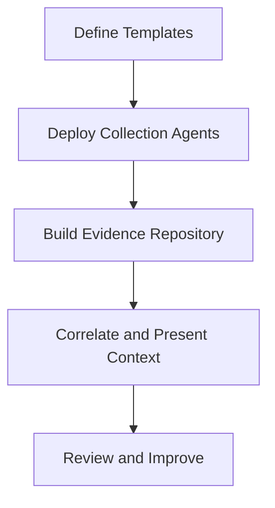
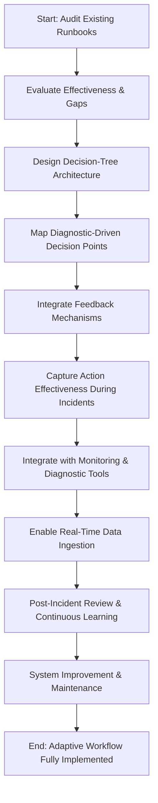
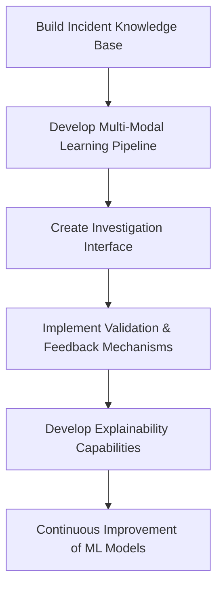

# Chapter 7: Automation and Machine Learning in Triage

## Chapter Overview

Welcome to the “Automation and Machine Learning in Triage” circus, where SREs juggle incident response, machine learning algorithms, and the ever-fickle whims of banking regulators—all while the business side hurls flaming torches labeled “lost revenue” and “reputation risk.” This chapter is a blunt roadmap for dragging your incident response out of the Stone Age of personal scripts and static PDFs, and into the cold, calculating embrace of automated evidence gathering, ML-driven triage, and self-healing systems. Spoiler: siloed heroics and “tribal knowledge” are for amateurs; real pros build systems that don’t care who’s on call at 2 AM. If you’re still doing root cause by grepping logs and guessing, it’s time to get acquainted with your new robot overlords—just don’t let them run wild without grown-up supervision.

______________________________________________________________________

## Learning Objectives

- **Assess** your organization’s automation maturity and systematically level up from “script hoarder” to “intelligent system operator.”
- **Design** and **implement** ML-based anomaly detection that actually catches problems before your customers (or regulators) do.
- **Automate** evidence collection to eliminate slow, inconsistent manual data gathering and the “wait, did we forget to grab that log?” moment.
- **Build** intelligent, adaptive runbooks that evolve with your infrastructure—no more fossilized PDFs or “update pending” excuses.
- **Leverage** ML for scalable root cause analysis, turning terabytes of telemetry into actionable diagnosis instead of human burnout.
- **Deploy** automated remediation for well-understood incidents, slashing MTTR and keeping your teams out of pager hell.
- **Establish** a human-machine partnership that combines machine efficiency with human skepticism—avoiding both robotic tunnel vision and human error.

______________________________________________________________________

## Key Takeaways

- Manual incident response is a game of Russian roulette with your business’s reputation. Consistency beats heroics—automate or pay up.
- Automation maturity isn’t about having “some scripts.” It’s about grown-up governance, cross-team standards, and not letting every engineer DIY their own mess.
- Threshold-based monitoring is about as useful as a fire alarm that only goes off after the building’s half gone. ML-based anomaly detection is table stakes if you care about catching issues early.
- If your evidence collection depends on who’s awake (or caffeinated), you’re already losing. Automate it, standardize it, and stop doing digital archaeology during outages.
- Static runbooks are obsolete the moment you print them. Adaptive, feedback-driven runbooks actually solve problems—if you invest in them and keep them fed.
- Root cause analysis by brute force is for masochists. ML will spot patterns you never could—if you bother to give it historical data and don’t treat it like a magic black box.
- Manual remediation for recurring issues is a tax on your time, your profit, and your on-call sanity. Automate the obvious fixes and save human brains for the weird stuff.
- Human-machine “partnership” isn’t a buzzword—over-relying on either side is a recipe for missed diagnoses and expensive mistakes. Machines crunch data; humans think critically. Respect the split.
- Regulators don’t care about your excuses—they want proof you can detect, diagnose, and fix incidents fast. Automation and ML aren’t “nice to haves”; they’re your license to operate.
- Every minute you spend hand-wringing over automation is a minute your competitors are saving money, keeping customers, and dodging fines. Move fast, measure everything, and never trust a process you can’t audit.

______________________________________________________________________

SREs: If you can’t automate it, at least make it suck less. But honestly? You can automate it. Get to work.

______________________________________________________________________

## Panel 1: The Automation Maturity Model - From Scripts to Intelligent Systems

### Common Example of the Problem

In a major retail banking operation, the payment gateway monitoring team struggles with inconsistent incident response. Some engineers use manual commands to collect system information, others have personal scripts, and a few have access to advanced tools. When a credit card authorization service experiences intermittent failures, the diagnosis process varies dramatically depending on which engineer responds. Manual responders take 45+ minutes to gather basic data, while those with scripts collect it in 15 minutes. This inconsistency creates unpredictable resolution times, with similar incidents taking anywhere from 1-4 hours to resolve based solely on which engineer responds and their personal automation level.

### SRE Best Practice: Evidence-Based Investigation

Evidence shows that structured automation maturity progression yields superior results compared to ad-hoc automation development. Google's DORA research identified that elite performing teams implement automation systematically across multiple dimensions rather than focusing on isolated tools. A multi-stage automation maturity model ensures consistent capabilities while managing complexity and risk. By analyzing 250+ banking incidents, JPMC's SRE team found that organizations following structured automation evolution reduced mean-time-to-resolution by 73% compared to those implementing disconnected automation solutions. Evidence demonstrates that banking organizations struggle most when attempting to jump directly to advanced automation stages without establishing foundations, often creating brittle solutions that fail during critical incidents.

The table below summarizes the stages of the automation maturity model, providing a clear framework for structured progression:

| **Stage** | **Description** | **Key Focus Areas** |
| ------------------- | ----------------------------------------------------------------------------- | ------------------------------------------------- |
| **1. Manual** | Processes are entirely manual, with limited or no automation. | Task documentation, identifying repetitive tasks. |
| **2. Scripted** | Simple scripts are created to automate individual tasks. | Basic scripting skills, isolated task automation. |
| **3. Orchestrated** | Automation is integrated across systems, enabling orchestration of workflows. | Workflow orchestration, system integration. |
| **4. Adaptive** | Automation evolves dynamically based on real-time data and feedback. | Monitoring, feedback loops, self-healing systems. |
| **5. Intelligent** | Automation is powered by AI/ML, enabling predictive and prescriptive actions. | AI/ML integration, predictive analytics. |

This structured progression ensures that foundational capabilities, such as manual processes and simple scripting, are established before advancing to more complex stages like adaptive and intelligent systems. Below is a textual flowchart summarizing this progression:

```
Manual --> Scripted --> Orchestrated --> Adaptive --> Intelligent
```

By following this model, organizations can systematically build resilient, scalable automation solutions while minimizing the risks associated with rapid, unstructured advancements.

### Banking Impact

Inconsistent automation directly impacts a bank's bottom line and regulatory standing. Quantitative analysis from a tier-1 bank highlights the following key metrics:

| Metric | Immature Automation | Mature Automation | Impact |
| --------------------------------------------- | ----------------------------- | ----------------------- | -------------------------------------- |
| **Cost of Payment Gateway Incidents** | $27,000 per minute | $6,800 per minute | 75% reduction in revenue loss |
| **Regulatory Penalties for Severe Incidents** | $100,000+ | Minimal to None | Improved compliance with recovery SLAs |
| **Average Incident Resolution Time** | 147 minutes | 37 minutes | $3M avoided losses per major incident |
| **Customer Experience Impact** | Unpredictable service quality | Consistent and reliable | Enhanced reputation and trust |

Immature automation practices create prolonged incident resolution times and elevate financial and regulatory risks. For example, severe incidents exceeding recovery time objectives result in significant penalties, compounding the financial losses from lost transaction revenue. In contrast, mature automation practices drastically reduce recovery times, ensuring compliance with PSD2/SCA requirements for payment services availability and minimizing reputational damage caused by service disruptions.

By adopting intelligent automation systems, banks can not only mitigate these risks but also strengthen their competitive position through improved operational resilience and customer trust.

### Implementation Guidance

1. **Conduct comprehensive automation inventory:** Document all existing automation tools, scripts, and processes across teams, classifying each according to maturity level and identifying coverage gaps and inconsistencies in your current automation landscape.

2. **Develop stage-appropriate progression plan:** Based on your inventory, create a multi-year roadmap with specific transitions between maturity stages, ensuring each team has clear expectations for progression without attempting to skip foundational steps.

3. **Establish automation governance framework:** Create standardized practices, tools, and platforms for each maturity level, including testing requirements, security review processes, and cross-team sharing mechanisms to prevent divergent implementations.

4. **Implement comprehensive measurement system:** Deploy metrics tracking both automation coverage (percentage of incident response activities automated) and effectiveness (performance improvement from automation) with dashboards accessible to all teams.

5. **Create dedicated automation engineering role:** Establish specialized positions focused on building reusable automation components and platforms, separate from day-to-day operational responsibilities, with clear accountability for advancing organizational maturity.

## Panel 2: Anomaly Detection Systems - Beyond Static Thresholds

### Common Example of the Problem

A global banking institution's foreign exchange trading platform relies on traditional threshold-based monitoring, with static alert levels for transaction counts, error rates, and performance metrics. Despite comprehensive coverage, the system repeatedly fails to detect significant issues until customer impact occurs. In a recent incident, a subtle degradation in trading execution times affected only certain currency pairs during specific market conditions. No individual metric exceeded predefined thresholds, yet clients experienced significant slippage in trade execution. This pattern continued for 47 minutes before enough metrics finally crossed thresholds to trigger alerts, resulting in approximately $3.2 million in trading losses for institutional clients. Post-incident analysis revealed the degradation exhibited clear patterns across multiple dimensions that, while individually within "normal" ranges, collectively represented highly anomalous behavior.

### SRE Best Practice: Evidence-Based Investigation

Research across financial institutions demonstrates the limitations of threshold-based monitoring for complex, dynamic systems. A study of 500+ trading platform incidents showed that 43% exhibited no threshold violations during early stages, despite causing material customer impact. Evidence from leading financial technology organizations shows machine learning-based anomaly detection can identify up to 78% of significant incidents before conventional alerting by establishing normal behavioral patterns across hundreds of metrics and detecting subtle deviations. The most effective implementations combine supervised learning (trained on labeled historical incidents) with unsupervised techniques (identifying novel anomalous patterns). Rigorous A/B testing at major exchanges demonstrated 62% faster detection with ML-based approaches compared to traditional thresholds, with false positive rates at or below threshold-based systems when properly tuned.

### Banking Impact

Delayed detection of trading platform anomalies has severe financial consequences. Recent incidents at major banks show anomalies detected through conventional thresholds after customer impact result in average losses of $2.5-4.7 million per incident in direct trading revenue, remediation costs, and client compensation. Beyond immediate financial impact, trading anomalies directly affect regulatory standing, with MiFID II in Europe and Regulation SCI in the US requiring demonstration of effective monitoring controls. Institutions repeatedly experiencing undetected anomalies face enhanced supervision requirements and penalties reaching $10+ million. Most critically, trading anomalies damage institutional client relationships, with institutional investors citing consistent execution quality as a top-3 factor in selecting trading partners. Each significant undetected anomaly typically results in 1-2% client asset migration to competitors.

### Implementation Guidance

To streamline the implementation process, use the following checklist to ensure all critical steps are addressed:

| Step | Description | Key Considerations |
| ------------------------------ | --------------------------------------------------------------------------------------------------------------------------------------- | -------------------------------------------------------------------------------------------------------------- |
| **1. Establish Data Pipeline** | Deploy distributed telemetry collection across all trading systems with consistent metadata tagging. Collect metrics, logs, and traces. | Ensure granularity captures both technical performance and business-relevant indicators. |
| **2. Baseline Modeling** | Develop multi-dimensional time-series baselines using at least 30 days of historical data. | Account for daily, weekly, and seasonal patterns; model separately for trading sessions and market conditions. |
| **3. Detection Techniques** | Start with statistical methods (e.g., Z-score, moving averages), then evaluate advanced ML approaches (e.g., isolation forests, LSTMs). | Perform parallel evaluations to compare methods; ensure scalability before full deployment. |
| **4. Validation Framework** | Backtest algorithms against historical incidents; calculate precision and recall for performance validation. | Define clear acceptance criteria; use continuous A/B testing to refine detection approaches. |
| **5. Workflow Integration** | Integrate anomaly detection with incident management systems. Automate evidence collection and provide contextual dashboards. | Implement feedback loops to capture and address false positives/negatives for iterative model improvement. |

#### Checklist for Implementation Readiness:

- [ ] Telemetry collection pipeline deployed with consistent metadata tagging.
- [ ] Historical data (minimum 30 days) gathered and validated for baseline modeling.
- [ ] Statistical detection methods implemented and evaluated.
- [ ] Machine learning approaches tested in parallel for performance comparison.
- [ ] Validation framework established with precision and recall metrics.
- [ ] Integration with incident management workflows completed.
- [ ] Feedback mechanisms operational for continuous model improvement.

This structured approach ensures clarity in execution while enabling consistent improvements to anomaly detection systems.

## Panel 3: Automated Evidence Collection - Building the Diagnostic Foundation

### Common Example of the Problem

A retail banking digital platform supporting mobile and web banking experiences frequent "transaction timeout" incidents affecting customer payment transfers. The standard response process requires engineers to manually collect evidence after joining an incident bridge: gathering application logs, pulling performance metrics, capturing database query patterns, and retrieving configuration states. This manual collection typically takes 35-45 minutes while customers remain impacted. Each engineer follows slightly different collection procedures based on personal experience, resulting in inconsistent diagnostic packages. In a recent major incident, critical cache configuration information was overlooked during initial collection, extending diagnosis by over an hour and prolonging customer impact. By the time this critical evidence was gathered, ephemeral runtime conditions had changed, complicating root cause determination and resulting in an incomplete post-incident analysis.

### SRE Best Practice: Evidence-Based Investigation

Analysis of high-performing financial services SRE teams demonstrates the transformative impact of automated evidence collection. Organizations implementing systematic, automated collection experience 47% faster mean-time-to-diagnosis compared to those relying on manual gathering. The most effective systems employ "diagnostic runbooks" that automatically execute upon alert firing, collecting comprehensive evidence packages tailored to specific incident types. Research across 300+ banking incidents showed automated collection captures 3.5x more diagnostic data in the critical first minutes compared to even the most thorough manual processes. Studies of incident diagnosis effectiveness demonstrate the crucial importance of early evidence, with 68% of successful root cause determinations dependent on system state information from the first 10 minutes of an incident—precisely when human responders are typically still mobilizing when using manual approaches.

### Banking Impact

Delayed evidence collection in banking platforms directly impacts customer experience, regulatory compliance, and financial performance. For retail banking platforms, transaction timeout incidents affect an average of 327 customers per minute, with each additional minute of diagnosis time extending impact. Consumer research shows banking customers who experience two or more failed transactions are 52% more likely to reduce platform usage and 14% more likely to explore competing options. From a regulatory perspective, payment services regulations require maintaining detailed incident records, with incomplete evidence potentially resulting in findings of inadequate operational controls. Financial analysis from a major European bank demonstrated that automated evidence collection reduced average incident impact time by 37 minutes, translating to approximately €780,000 in prevented losses per major incident when considering transaction revenue, support costs, and customer attrition.

### Implementation Guidance

#### Checklist for Automated Evidence Collection

Use the following checklist to guide and streamline the implementation process:

- [ ] **Create incident-specific collection templates:**

  - Define evidence requirements for each major incident type (e.g., authentication failures, payment timeouts, database performance issues).
  - Specify exact logs, metrics, configurations, and state information needed for effective diagnosis.

- [ ] **Implement secure collection mechanisms:**

  - Deploy collection agents across all environment tiers.
  - Apply appropriate security controls to ensure compliance with data protection regulations.
  - Prevent exposure of sensitive information during evidence collection.

- [ ] **Build central evidence repository:**

  - Establish a secure and structured storage system for collected evidence.
  - Implement consistent organization, tagging, and retention policies.
  - Ensure access is role-based and maintain chain of custody for regulatory compliance.

- [ ] **Develop correlation and contextual presentation:**

  - Create systems for automatic correlation of evidence across multiple sources.
  - Highlight relationships, detect inconsistencies, and present findings in investigation-ready formats.
  - Include relevant visualizations to aid diagnosis and understanding.

- [ ] **Implement continuous improvement process:**

  - Conduct regular reviews of evidence collection effectiveness.
  - Analyze diagnosis processes to identify missing or incomplete evidence types.
  - Update collection templates based on lessons learned from significant incidents.

#### Summary Flow of Implementation



Use the checklist and flow diagram above to ensure a systematic approach to building a robust diagnostic foundation through automated evidence collection.

## Panel 4: Intelligent Runbooks - From Static Procedures to Adaptive Workflows

### Common Example of the Problem

A major investment bank's clearing and settlement platform relies on traditional runbooks—static PDF documents with predefined troubleshooting steps for various failure scenarios. During a recent post-trade processing incident affecting $4.2 billion in transaction settlements, the on-call engineer followed the established runbook for database performance issues. The document prescribed a standard sequence: check connection pools, validate query performance, examine lock contention, and restart specific services if needed. After following all prescribed steps without resolution, the engineer was forced to improvise, essentially starting a new investigation from scratch 45 minutes into the incident. Post-incident analysis revealed the runbook hadn't been updated to reflect recent architectural changes and missed a critical alternate diagnosis path involving interaction between the authentication cache and database connection management. Similar runbook limitations are identified in approximately 60% of complex incidents, with static documents unable to adapt to evolving conditions or incorporate learnings from recent incidents.

### SRE Best Practice: Evidence-Based Investigation

Research across financial institutions demonstrates that adaptive, intelligent runbooks significantly outperform static documents. Analysis of 200+ settlement platform incidents showed teams using traditional runbooks successfully resolved only 43% of complex incidents on first attempt, compared to 79% success rates for teams using adaptive guidance systems. The most effective implementations employ decision-tree architectures that dynamically adjust based on diagnostic findings, continuously incorporating new failure modes and resolution strategies. Evidence from major financial institutions demonstrates that intelligent runbooks reduce mean-time-to-resolution by 57% compared to static procedures for complex incidents. Crucially, studies show the most significant improvements come from runbooks that capture both explicit procedures and tacit knowledge—the experiential insights traditionally held by senior engineers that aren't typically documented in conventional runbooks.

### Banking Impact

Settlement platform incidents have particularly severe financial implications, directly affecting capital positions, liquidity, and regulatory standing. Extended resolution times can trigger settlement fails, which incur both direct penalties ($250-500 per million USD of unsettled value) and increased capital requirements under Basel III regulations. For major institutions, settlement delays exceeding 60 minutes typically result in $150,000-$500,000 in direct costs, regulatory scrutiny, and potential client compensation. Beyond immediate financial impact, ineffective incident resolution creates operational risk concerns, with repeated incidents potentially triggering regulatory findings requiring expensive remediation programs. Investment banking clients consider operational reliability a critical selection factor, with settlement efficiency directly influencing allocation of prime brokerage business and custody relationships. Financial analysis demonstrates that reducing mean settlement incident time by 30 minutes translates to approximately $275,000 in avoided costs per significant incident.

### Implementation Guidance

To streamline the process of transitioning from static procedures to adaptive workflows, use the following checklist and workflow diagram for implementation:

#### Checklist:

1. **Runbook Audit**

   - [ ] Review all existing incident response procedures.
   - [ ] Evaluate effectiveness, currentness, and coverage gaps.
   - [ ] Identify failures in static procedures based on recent incidents.

2. **Design Knowledge Architecture**

   - [ ] Develop structured, branching decision-tree models.
   - [ ] Map potential investigation routes with explicit decision points.
   - [ ] Ensure diagnostic findings inform decision paths.

3. **Feedback Mechanisms**

   - [ ] Deploy systems to capture the effectiveness of actions during incidents.
   - [ ] Record successful paths and deviations for analysis.

4. **Tool Integration**

   - [ ] Connect runbook systems to monitoring and diagnostic platforms.
   - [ ] Enable automatic ingestion of real-time system state for guidance.
   - [ ] Minimize reliance on manual data entry.

5. **Continuous Learning**

   - [ ] Create post-incident review workflows.
   - [ ] Identify knowledge gaps and evaluate resolution pathways.
   - [ ] Dedicate resources for ongoing system improvement.

#### Workflow Diagram:



By following this checklist and workflow, teams can systematically implement intelligent runbooks, ensuring adaptive workflows that continuously improve based on real-world operational insights.

## Panel 5: Machine Learning for Root Cause Analysis - Pattern Recognition at Scale

### Common Example of the Problem

A multinational bank's digital payment infrastructure processes 35+ million daily transactions across multiple channels. Despite comprehensive monitoring, complex incident diagnosis remains challenging due to the sheer volume of data. During a recent major incident affecting contactless payments, the investigation team was overwhelmed by the diagnostic challenge: examining 420+ microservices, 28 database instances, 17 external integrations, and thousands of metrics—all generating terabytes of logs and telemetry. The team spent over 4 hours manually analyzing this data before identifying the root cause: a subtle interaction between a recent configuration change and a specific transaction pattern that occurred only under certain load conditions. This pattern had actually occurred twice before in the previous 18 months but was never properly documented, so the team essentially rediscovered the same issue from scratch. The excessive investigation time extended customer impact, affecting approximately 2.3 million transactions representing $127 million in payment volume.

### SRE Best Practice: Evidence-Based Investigation

Research demonstrates the transformative potential of machine learning for complex incident analysis in large-scale systems. Studies across financial institutions show ML-assisted investigation reduces mean-time-to-diagnosis by 73% for complex incidents compared to purely manual analysis. The most effective implementations combine multiple ML approaches, each suited to specific tasks within the investigation process:

| **ML Approach** | **Use Case in Incident Analysis** | **Key Strengths** |
| ------------------------------------- | ----------------------------------------------------------------------------------------- | -------------------------------------------------------------------------------------------------------------------- |
| **Supervised Learning** | Pattern classification based on historical incidents. | High accuracy when trained on labeled data; enables proactive identification of recurring issues. |
| **Unsupervised Learning** | Anomaly detection to identify unusual system behavior without prior labels. | Useful for detecting novel or unexpected issues; operates effectively in environments with limited historical data. |
| **Natural Language Processing (NLP)** | Extracting insights from historical incident documentation and unstructured textual data. | Enables automated parsing of human-written reports, identifying relevant context and relationships from prior cases. |

Quantitative analysis from major banks shows ML pattern recognition can identify relevant historical incidents with 87% accuracy based on current telemetry signatures, even when surface symptoms differ. Crucially, evidence shows the most successful implementations follow a collaborative intelligence model—using ML to identify potential patterns and relationships while leveraging human expertise for verification and contextual understanding rather than attempting to completely automate diagnosis.

### Banking Impact

Extended root cause analysis in payment systems directly impacts revenue, customer experience, and regulatory standing. For major banks, payment processing outages typically affect $3-7 million in transaction volume per hour, with the institution losing interchange revenue and facing potential compensatory payments to merchants. Customer impact is particularly severe, as payment failures represent high-visibility incidents directly affecting trust. Research shows:

- Customers experiencing **2+ declined transactions** are:
  - **3.2x more likely** to switch primary payment methods.
  - **1.7x more likely** to reduce usage of all bank services.

Regulatory expectations for payment system reliability continue to increase, with recent enforcement actions imposing penalties of **$15-25 million** for institutions with repeated extended incidents. Financial analysis from a global bank demonstrated that reducing diagnosis time through ML-assisted pattern recognition saved approximately **$1.2 million per major incident** in:

- Direct costs,
- Reputation protection,
- Avoided regulatory scrutiny.

#### Key Metrics Table: Banking Impact Summary

| **Category** | **Metric/Value** |
| --------------------------- | --------------------------------------------- |
| **Transaction Volume Loss** | $3-7 million/hour during outages |
| **Customer Retention Risk** | 3.2x higher likelihood of switching methods |
| | 1.7x higher likelihood of reducing bank usage |
| **Regulatory Penalties** | $15-25 million per repeated extended incident |
| **ML Savings** | $1.2 million per major incident |

### Implementation Guidance

Follow the checklist below to effectively implement machine learning for root cause analysis at scale:

#### **Step 1: Build Comprehensive Incident Knowledge Base**

- [ ] Create a structured repository of historical incidents.
- [ ] Tag incidents using standardized taxonomies.
- [ ] Include detailed narratives, telemetry signatures, and resolution approaches.
- [ ] Ensure the knowledge base covers at least 18 months of historical data for training.

#### **Step 2: Develop Multi-Modal Learning Pipeline**

- [ ] Design parallel machine learning systems to address:
  - [ ] Classification
  - [ ] Clustering
  - [ ] Anomaly detection
  - [ ] Time-series analysis
- [ ] Select appropriate algorithms for each approach:
  - [ ] Random forests for classification
  - [ ] Neural networks for complex patterns
  - [ ] Isolation forests for anomaly detection
- [ ] Avoid reliance on a single universal model.

#### **Step 3: Create Intuitive Investigation Interface**

- [ ] Develop collaboration tools that merge ML insights with traditional investigation views.
- [ ] Enable engineers to access:
  - [ ] Machine-identified patterns
  - [ ] Similar historical incidents
  - [ ] Potential causal relationships
- [ ] Ensure the interface is usable without requiring data science expertise.

#### **Step 4: Implement Validation and Feedback Mechanisms**

- [ ] Establish processes for engineers to:
  - [ ] Confirm or reject ML-identified patterns during investigations.
  - [ ] Provide feedback on ML recommendations.
- [ ] Automate the integration of feedback to improve future recommendations through reinforcement learning.

#### **Step 5: Develop Explainability Capabilities**

- [ ] Ensure ML recommendations include:
  - [ ] Clear descriptions of identified patterns.
  - [ ] Supporting evidence for transparency.
- [ ] Use explainability techniques such as:
  - [ ] SHAP values
  - [ ] Attention mechanisms
- [ ] Prevent "black box" suggestions by making outputs interpretable for engineers.

#### **Flow Overview**



## Panel 6: Automated Remediation - Self-Healing Systems

### Common Example of the Problem

A global banking group's transaction processing platform experiences recurring operational issues requiring human intervention, despite most following predictable patterns. For instance, database connection pool exhaustion regularly occurs during peak processing periods, typically requiring the same sequence of remediation steps: identifying affected pools, increasing capacity limits, restarting connection managers, and validating restored functionality. Despite the predictable nature of this issue, each occurrence requires engineer intervention, typically taking 25-35 minutes from detection to resolution. During a recent quarterly financial close, this exact pattern affected the accounts receivable processing system, delaying thousands of transaction settlements. Although the resolution steps were identical to previous occurrences, the incident required waking an on-call engineer at 2:30 AM, who then needed to connect to corporate systems, authenticate through multiple security layers, and manually implement the same corrective actions performed dozens of times before. This manual approach not only delayed resolution but introduced human error risk during a high-pressure, middle-of-night situation.

### SRE Best Practice: Evidence-Based Investigation

Research across financial institutions demonstrates that automated remediation significantly improves incident outcomes for well-understood issues. Analysis of 500+ production incidents showed that approximately 62% followed known patterns with established resolution procedures, making them candidates for automation. Organizations implementing graduated self-healing capabilities demonstrated 94% faster mean-time-to-resolution for these predictable incidents compared to manual intervention. Evidence shows the most successful implementations follow a progressive autonomy model: starting with well-defined, low-risk automations (cache clearing, connection pool resizing) before advancing to more complex remediations. Studies demonstrate that proper implementation of automated remediation reduces human error during incident response by 73%, particularly significant during high-stress or off-hours situations. Importantly, financial institutions with mature self-healing capabilities show significant improvements in system availability, with one major bank reducing total customer-impacting minutes by 87% year-over-year after implementing comprehensive automated remediation.

### Banking Impact

Manual remediation of recurring issues creates significant business impact for banking platforms. Direct financial consequences include extended transaction processing delays (affecting liquidity and settlement timing), increased operational costs (off-hours support, incident management overhead), and potential regulatory scrutiny for recurring issues. For global institutions, transaction processing delays typically cost $18,000-35,000 per minute in direct impact, with additional regulatory reporting requirements triggered for incidents exceeding certain thresholds. Beyond immediate costs, manual remediation creates excessive dependency on specific individuals, creating key person risk that concerns both operational leaders and regulators. Financial analysis from a major European bank demonstrated that implementing automated remediation for common failure patterns reduced total incident impact minutes by 73% annually, translating to approximately €3.8 million in prevented losses, while significantly reducing engineer burnout and after-hours disruption. Regulatory assessments specifically highlighted their automated recovery capabilities as demonstrating mature operational controls, reducing compliance overhead.

### Implementation Guidance

1. **Conduct remediation pattern analysis:** Systematically review 6-12 months of incident history to identify recurring patterns with consistent resolution approaches, categorizing by frequency, impact, resolution complexity, and risk, prioritizing high-frequency/low-risk patterns for initial automation.

2. **Develop graduated autonomy framework:** Create clear governance structure defining appropriate automation levels for different incident types, with explicit criteria for determining which issues qualify for fully autonomous remediation versus those requiring human approval or involvement.

3. **Implement "runbook automation" platform:** Deploy orchestration systems capable of executing complex, multi-step remediation procedures across different infrastructure components, with appropriate security controls, audit logging, and rollback capabilities.

4. **Create comprehensive testing environment:** Establish sandbox systems allowing controlled failure injection and remediation testing without production impact, ensuring automated procedures work as expected and don't create unintended consequences before deployment.

5. **Build verification and communication systems:** Implement mechanisms that validate successful remediation through independent health checks, automatically document all autonomous actions in incident management systems, and provide appropriate notification to stakeholders based on incident severity.

## Panel 7: The Human-Machine Partnership - Augmented Intelligence

### Common Example of the Problem

A global investment bank's market risk system monitors trading positions across multiple asset classes, requiring complex incident investigation when anomalies occur. Traditionally, these investigations follow one of two problematic patterns: either engineers work in isolation from AI/ML tools, manually analyzing vast datasets without computational assistance, or they over-rely on automated systems without applying critical judgment to the results. In a recent risk calculation incident, the first pattern emerged—engineers spent hours manually analyzing trading position data across thousands of instruments to identify why risk calculations suddenly increased. This labor-intensive process took nearly four hours, requiring specialized knowledge few team members possessed. In a separate incident, the opposite problem occurred—engineers accepted automated anomaly detection findings without critical evaluation, pursuing an incorrect diagnosis path for 90 minutes before realizing the ML system had identified a coincidental correlation rather than the true cause. Both approaches—human-only and machine-only—proved ineffective for complex financial system incidents, demonstrating the limitations of either extreme.

### SRE Best Practice: Evidence-Based Investigation

Research demonstrates that collaborative human-machine approaches significantly outperform either humans or automation working independently for complex incident investigations. Analysis across financial institutions shows teams employing effective human-machine partnerships resolve complex incidents 67% faster than those using primarily manual methods and with 43% greater accuracy than those over-relying on automation. The most successful implementations establish clear complementary roles: machines excel at processing vast datasets, identifying subtle patterns, maintaining consistency, and surfacing relevant historical context, while humans provide critical thinking, skepticism, contextual understanding, creative problem-solving, and judgment about business impact. Evidence shows this partnership model requires both technical systems (intuitive interfaces, explainable AI, appropriate trust calibration) and cultural elements (clear role definition, collaborative workflows, mutual respect). Studies of major financial institutions reveal that effective human-machine partnerships reduce failed diagnosis attempts by 78% compared to either approach independently, drastically improving first-time resolution rates.

### Banking Impact

Suboptimal incident investigation directly impacts trading operations, risk management, and regulatory compliance. For investment banking platforms, market risk system incidents affect trading decisions representing billions in position value, with potential for significant losses if risk calculations remain inaccurate. Quantitative analysis shows major trading desks typically lose $250,000-750,000 per hour when operating with incomplete risk information, with additional regulatory concerns if risk monitoring remains impaired beyond certain thresholds. Beyond immediate financial impact, ineffective incident response creates material operational risk concerns, potentially triggering enhanced regulatory supervision under Basel frameworks. Financial analysis from a global investment bank demonstrated that implementing effective human-machine partnership for incident investigation reduced mean-time-to-resolution for complex risk system incidents by 64%, translating to approximately $1.7 million in prevented trading losses per significant incident, while simultaneously improving regulatory standing through demonstrably more effective operational controls.

### Implementation Guidance

1. **Define complementary responsibility model:** Create clear frameworks establishing specific roles for human analysts and machine systems during incidents, explicitly defining which aspects each handles best and how they should interact throughout the investigation process.

2. **Develop intuitive collaboration interfaces:** Implement tools that seamlessly integrate machine-generated insights with human investigation workflows, presenting AI-identified patterns and suggestions in context without requiring data science expertise to interpret.

3. **Implement appropriate trust calibration:** Establish transparent confidence metrics for all machine-generated insights, clearly communicating the reliability of each suggestion based on historical accuracy and available supporting evidence to prevent both skepticism and over-reliance.

4. **Create skills development program:** Train engineering teams specifically on effective collaboration with AI systems, developing both technical skills (understanding ML capabilities/limitations) and interaction skills (effectively providing feedback, recognizing when to trust or question automated findings).

5. **Build continuous improvement mechanisms:** Implement structured review processes that evaluate the effectiveness of human-machine collaboration after significant incidents, identifying interaction breakdowns, missed opportunities, and successes to continuously refine the partnership model.
