# Chapter 8: Measuring and Improving Triage Effectiveness

## Chapter Overview

Welcome to the brutal reality of measuring and improving triage effectiveness, where vanity metrics go to die and illusions of progress are exposed like a gaping security hole. This chapter rips off the Band-Aid on your dashboards, revealing why “green” KPIs can still spell disaster—and how your SRE team might accidentally be the department of false confidence. We’ll drag you up the metrics food chain: from counting error rates (yawn), to tying MTTR to actual business outcomes (read: money, customers, compliance). Then, we’ll dissect the Four Golden Signals of triage, show you why your postmortems are probably junk, and force you to stare into the abyss of predictive metrics—because nobody wants to be blindsided by the next "surprise" outage. We'll benchmark your performance so you can't hide behind navel-gazing, and then introduce the Improvement Flywheel: the only spinning you should be doing is continuous, systematic advancement. Finally, we’ll slap a maturity model on your operation so you can finally see which fancy dashboards are built on a swamp. If you've ever wondered why your incident metrics look great while reality burns, buckle up. This is your wake-up call.

______________________________________________________________________

## Learning Objectives

- **Map** your entire measurement ecosystem, linking technical, operational, and business metrics so you can prove causality (and not just correlation) to skeptical execs.
- **Dissect** triage effectiveness using the Four Golden Signals, so you stop hiding behind a single MTTR number.
- **Conduct** structured, blame-resistant post-incident analysis that captures actual learning (not just a to-do list nobody follows).
- **Distinguish** between leading and lagging indicators, and use predictive metrics to get ahead of failures instead of being their victim.
- **Benchmark** your triage performance against real industry data, not just your own past mediocrity.
- **Institutionalize** the Improvement Flywheel to build self-sustaining, compounding operational capability.
- **Assess** your organization against a multidimensional maturity model—because excellence isn’t just about shiny tools.

______________________________________________________________________

## Key Takeaways

- “All green” dashboards mean nothing if your customers are rage-tweeting and regulators are circling—metrics must connect to business outcomes, or you’re just playing metrics bingo.
- Cutting alert volume is useless if it just means you’re missing incidents that cost millions—congratulations, you’ve automated your own irrelevance.
- MTTR is a vanity metric unless you break down detection, diagnosis, resolution, and prevention—otherwise, you’re just measuring how fast you patch leaks in a sinking ship.
- Post-incident reviews that focus on “what broke” and assign blame guarantee the same failures will boomerang back—probably on a Friday at 5pm.
- If you only look at lagging indicators, you’re driving by staring in the rearview mirror; leading indicators are your only shot at swerving before the crash.
- Benchmarking only against your own history is how you become the Blockbuster of banking tech—if you’re “improving” but still trailing the industry, you’re marching proudly in last place.
- Project-based improvement is an organizational sugar rush—enjoy the high, but don’t be surprised when you crash and burn nine months later. Continuous improvement or bust.
- Maturity models reveal the ugly truth: world-class automation is worthless if your knowledge management is stuck in the Stone Age. Balanced capability or systemic failure—pick one.
- In banking, every missed connection between metrics and outcomes is a direct risk to revenue, compliance, and reputation. The market won’t care about your “improved” MTTR when they see headline-making outages.
- If you can’t prove your improvements with data—and trace them to actual business impact—expect to be replaced by consultants, auditors, or that one engineer who actually knows what’s going on.

Welcome to the grown-up table of SRE. Bring data, bring humility, and leave your vanity metrics at the door.

______________________________________________________________________

## Panel 1: The Measurement Hierarchy - From Technical Metrics to Business Outcomes

### Scene Description

A banking executive briefing where the SRE team presents a sophisticated metrics dashboard with clearly defined measurement levels. The visualization features a pyramid structure that illustrates the measurement hierarchy:

```mermaid
graph TD
    A[Technical Metrics] --> B[Operational Metrics]
    B --> C[Business Outcomes]
    subgraph Technical Metrics
        D[Error Rates]
        E[Latency]
        F[Alert Volumes]
    end
    subgraph Operational Metrics
        G[Mean-Time-to-Detect (MTTD)]
        H[Mean-Time-to-Resolve (MTTR)]
        I[Escalation Accuracy]
    end
    subgraph Business Outcomes
        J[Customer Impact]
        K[Financial Consequences]
        L[Regulatory Compliance]
    end
```

SRE Director Leila explains how each metric level connects to the others, showing how improvements in technical and operational metrics ultimately drive positive business outcomes. For example, she highlights a specific incident where reduced mean-time-to-detection directly prevented potential regulatory penalties.

The executive team engages with the dashboard, particularly focused on how triage improvements have reduced financial losses from incidents by 42% over the previous quarter. Detailed drill-downs allow them to trace these improvements to specific operational changes in the Integration & Triage process. The pyramid structure provides a clear, intuitive view of how technical metrics feed into operational metrics, which then influence key business outcomes, ensuring alignment across all levels of measurement.

### Teaching Narrative

Traditional triage effectiveness measurement often focuses narrowly on technical metrics—alert volumes, resolution times, and system availability—without connecting these indicators to broader operational and business outcomes. Integration & Triage introduces the concept of the measurement hierarchy—a comprehensive framework that transforms evaluation from isolated technical indicators to interconnected metrics spanning technical, operational, and business domains. This approach recognizes that effective measurement requires multiple perspectives: technical metrics tracking system behavior (error rates, resource utilization, alert volumes), operational metrics evaluating process effectiveness (mean-time-to-detect, mean-time-to-resolve, escalation accuracy), and business metrics capturing ultimate outcomes (customer impact, financial consequences, regulatory compliance). For banking environments where technical performance directly affects financial results and regulatory standing, this hierarchical approach ensures visibility into how triage improvements ultimately deliver business value. Developing this multi-level measurement mindset requires defining clear relationships between metric levels, establishing causality from technical improvements to business outcomes, and creating visualization tools that allow stakeholders at all levels to understand these connections. This transformation from disconnected technical measurements to an integrated metrics hierarchy represents a significant evolution in your evaluation approach, ensuring triage effectiveness is measured not just by technical standards but by meaningful business impact.

### Common Example of the Problem

At GlobalBank, the monitoring team proudly reported a 30% reduction in alert volume and 15% faster resolution times over six months. Yet in the same period, customer complaints about transaction failures increased by 22%, and the bank incurred $1.2 million in regulatory penalties for unreported availability issues. When executives questioned this disconnect, it became clear that the SRE team had focused exclusively on technical metrics—alert noise reduction and time-to-resolution—without connecting these measurements to actual customer experience or compliance outcomes. Their dashboard showed all green indicators despite deteriorating business outcomes, creating a dangerous illusion of improvement.

The root problem can be illustrated as follows:

```
Technical Metrics
(Alert Volume ↓, Resolution Time ↓)
     |
     v
Disconnected View
(No linkage to customer or business outcomes)
     |
     v
Business Outcomes
(Customer Complaints ↑, Regulatory Penalties ↑)
```

This disconnect highlights the absence of a coherent measurement hierarchy that integrates technical, operational, and business metrics. Without this integration, leadership lacked visibility into how technical efforts were (or were not) translating into customer satisfaction and regulatory compliance. The result was a false sense of success at the technical level while business outcomes deteriorated.

### SRE Best Practice: Evidence-Based Investigation

Effective measurement hierarchies must be validated through rigorous evidence-based correlation analysis between metrics at different levels. SRE teams should implement a comprehensive approach that ensures the hierarchy reflects actual causal relationships, creating a trustworthy framework for decision-making.

#### Checklist: Steps for Evidence-Based Investigation

1. **Construct Historical Correlations**

   - Build correlation matrices that quantify statistical relationships between technical, operational, and business metrics.
   - Identify patterns where specific technical improvements align with measurable business outcomes.

2. **Trace Impact Pathways**

   - Map how specific technical metrics (e.g., API error rates) flow through operational metrics (e.g., MTTR) to influence business outcomes (e.g., transaction success rates).
   - Visualize these pathways to highlight key dependencies.

3. **Perform Controlled Testing**

   - Conduct A/B testing to evaluate metric relationships by implementing technical improvements in controlled environments.
   - Measure the actual business impact over time to validate assumptions.

4. **Identify Leading Indicators**

   - Use regression analysis to determine which lower-level metrics serve as reliable predictors for changes in higher-level outcomes.
   - Prioritize these indicators for proactive monitoring.

5. **Validate Continuously**

   - Apply statistical process control to monitor the stability of established metric relationships.
   - Detect and investigate when correlations weaken or break down.

#### Representation: Evidence-Based Metric Relationships

```mermaid
graph TD
    A[Technical Metrics<br>(Error rates, Latency, Alert volumes)] --> B[Operational Metrics<br>(MTTD, MTTR, Escalation accuracy)]
    B --> C[Business Outcomes<br>(Customer impact, Financial results, Regulatory compliance)]
    style A fill:#f9f,stroke:#333,stroke-width:2px
    style B fill:#bbf,stroke:#333,stroke-width:2px
    style C fill:#bfb,stroke:#333,stroke-width:2px
```

By following this checklist and leveraging tools like correlation matrices, impact pathway mapping, and regression analysis, SRE teams can ensure their measurement hierarchy remains both evidence-based and actionable.

### Banking Impact

In financial institutions, disconnected metrics directly threaten regulatory compliance, customer trust, and profitability. When measurement hierarchies fail to connect technical performance to business outcomes, banks experience significant consequences. The table below summarizes common impacts, their causes, and downstream consequences to illustrate the critical need for integrated metrics.

| **Impact** | **Cause** | **Consequence** |
| -------------------- | ----------------------------------------------------------------------------------------- | ----------------------------------------------------------------------------------------------- |
| Regulatory Penalties | Unreported service disruptions that technical metrics failed to recognize as significant | Fines, increased regulatory scrutiny, and potential licensing risks |
| Customer Attrition | Unaddressed experience issues that didn't register on technical dashboards | Loss of customer trust, decline in account retention, and reduced market competitiveness |
| Revenue Loss | Transaction failures that appeared normal in system health metrics | Direct financial losses, reduced transaction volumes, and impaired business operations |
| Misallocated Capital | Investments in technical improvements that don't meaningfully impact business performance | Inefficient resource allocation, missed opportunities for impactful innovations, and lower ROI |
| Governance Issues | Inconsistent reporting on operational health | Erosion of board and shareholder confidence, reputational damage, and weakened market valuation |

For global banks with complex payment, trading, and lending platforms, these disconnections can result in millions in direct losses and even greater impacts on reputation and market standing. By adopting a measurement hierarchy that ties technical and operational metrics to business outcomes, financial institutions can mitigate these risks and ensure resilience across all dimensions of their operations.

### Implementation Guidance

To implement an effective measurement hierarchy in your banking environment, follow these steps:

1. **Map Your Full Metric Ecosystem**\
   Catalog all existing metrics across technical, operational, and business domains. Create a visual map to identify current relationships and gaps. Ensure input from both technical teams and business stakeholders for a comprehensive view.

2. **Establish Causal Pathways**\
   Define and document clear causal relationships between metrics at different levels. Use historical data to validate how specific technical measurements influence operational metrics and drive business outcomes.

3. **Create Unified Visualization Tools**\
   Develop dashboards that integrate metrics across all levels. Include drill-down capabilities to trace business issues back to technical causes and link technical improvements to business impacts.

4. **Implement Cross-Functional Reviews**\
   Set up regular review sessions with technical teams and business stakeholders. These reviews will align technical focus areas with business priorities and help refine the metric ecosystem.

5. **Develop Metric Governance Processes**\
   Establish formal governance to define metric ownership, calculation methodologies, review frequencies, and change management procedures, ensuring consistency across the hierarchy.

#### Step-by-Step Flow Diagram

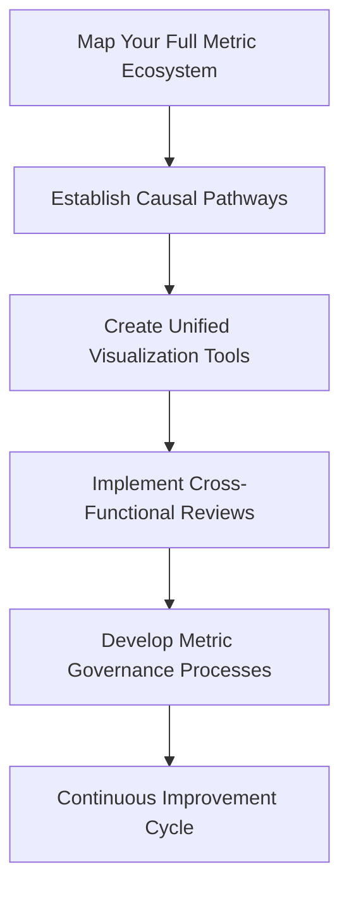

#### Process Summary

- **Step 1: Map Your Full Metric Ecosystem**\
  Begin by cataloging and visually mapping all metrics to understand the current state. Engage stakeholders from all relevant domains.

- **Step 2: Establish Causal Pathways**\
  Define how metrics at the technical level connect to operational and business outcomes. Validate these pathways to ensure they reflect real-world impacts.

- **Step 3: Create Unified Visualization Tools**\
  Build dashboards that provide a comprehensive view of the measurement hierarchy, enabling seamless exploration and understanding.

- **Step 4: Implement Cross-Functional Reviews**\
  Use structured reviews to ensure alignment, refine metrics, and maintain focus on business priorities.

- **Step 5: Develop Metric Governance Processes**\
  Create governance structures to safeguard metric integrity, ensuring the hierarchy remains accurate, relevant, and actionable.

By following this structured process and visualizing it as an interconnected flow, your organization can effectively implement a measurement hierarchy, bridging technical performance and business outcomes.

## Panel 2: The Four Golden Signals of Triage

### Scene Description

A banking operations center features a monitoring wall prominently displaying the "Four Golden Signals of Triage" dashboard. The dashboard is divided into four distinct panels, each representing one of the key dimensions: Detection Effectiveness, Diagnostic Efficiency, Resolution Velocity, and Prevention Impact. Each panel includes a set of metrics visualized through trend lines, heatmaps, and summary statistics, accompanied by alerts for anomalies.

Below is a text-based representation of the dashboard layout:

```
+-------------------------------------------------------------+
|                  Four Golden Signals Dashboard              |
+-------------------+-------------------+---------------------+
| Detection         | Diagnostic        | Resolution          |
| Effectiveness     | Efficiency        | Velocity            |
|                   |                   |                     |
| - Metric 1: ⚠️    | - Metric 1: ✅    | - Metric 1: 🕒      |
| - Metric 2: 🟢    | - Metric 2: 🟡    | - Metric 2: 🔴      |
| ...               | ...               | ...                 |
+-------------------+-------------------+---------------------+
|                        Prevention Impact                   |
|                                                            |
| - Metric 1: 🟡                                            |
| - Metric 2: 🟢                                            |
| ...                                                      |
+-------------------------------------------------------------+
```

During the daily standup, team members gather to review this dashboard. They celebrate improvements, such as a marked increase in Diagnostic Efficiency, while also identifying concerning trends, such as declining Detection Effectiveness in a specific application domain. For example, recent incidents show a pattern of delayed anomaly detection in payment processing systems. The team leader initiates a focused improvement initiative, assigning targeted actions to address these issues by analyzing detection patterns and adjusting alerting thresholds.

This visual and structured approach ensures clear communication of triage performance, enabling the team to prioritize actions effectively and maintain balanced improvements across all dimensions.

### Teaching Narrative

Traditional incident management often measures process effectiveness through a single lens—typically focusing on aggregate resolution time without distinguishing between the distinct phases of the triage process. Integration & Triage introduces the Four Golden Signals framework—a comprehensive measurement approach that transforms evaluation by separately assessing the critical components of effective triage. This approach recognizes that overall triage effectiveness results from distinct capabilities that should be measured independently: Detection Effectiveness (identifying issues quickly and accurately), Diagnostic Efficiency (determining root causes correctly and rapidly), Resolution Velocity (implementing appropriate fixes promptly), and Prevention Impact (preventing recurrence of similar issues). For banking systems where improvements in each dimension deliver different benefits—from reduced customer impact to enhanced regulatory compliance—this differentiated approach ensures balanced focus across all aspects of the triage process. Developing this multi-dimensional measurement requires defining specific metrics for each signal, establishing appropriate evaluation frameworks for different incident types, and creating visualization tools that highlight relative performance across dimensions. This transformation from one-dimensional to multi-faceted measurement represents a significant evolution in your evaluation approach, enabling targeted improvements in specific aspects of your triage process rather than generic efforts that may not address your most significant limitations.

### Common Example of the Problem

Capital Financial's incident management team prided itself on maintaining an impressive average Mean-Time-To-Resolution (MTTR) of just 45 minutes for their trading platform incidents—well below industry averages. However, this single aggregate metric masked critical weaknesses in their triage process:

| **Issue** | **Description** | **Impact** |
| ---------------------------- | -------------------------------------------------------------------------------------- | ---------------------------------------------------------------------------------------------------------- |
| **Detection Delays** | Automated monitoring missed subtle service degradations until traders reported issues. | Early warning signs were overlooked, leading to a major outage with a 90-minute detection delay. |
| **Recurring Incidents** | Fixes were implemented quickly, but the same types of incidents recurred frequently. | Root causes were not properly addressed, increasing operational risk and eroding team efficiency. |
| **Unstructured Diagnostics** | Investigations lacked structure, consuming hours to identify root causes. | Diagnostic inefficiency prolonged outages, with one incident taking over two hours to diagnose. |
| **False Sense of Maturity** | Leadership focused solely on aggregate MTTR while ignoring process weaknesses. | Blind spots in detection and diagnostics undermined the team's ability to handle novel issues effectively. |

For example, during a major trading outage, the initial detection took over 90 minutes despite clear early warning signs, and diagnosis consumed another two hours. The singular focus on aggregate MTTR had created dangerous blind spots in their detection capabilities and diagnostic approaches, giving leadership a false sense of incident management maturity. This highlights the need for a multi-dimensional approach like the Four Golden Signals to uncover and address these hidden weaknesses.

### SRE Best Practice: Evidence-Based Investigation

Implementing the Four Golden Signals requires defining specific, measurable components for each signal and validating their effectiveness through evidence-based analysis. Use the following checklist to ensure a structured, actionable approach for each signal:

#### Checklist: Key Actions for Each Signal

1. **Detection Effectiveness**

   - [ ] Measure timing: Track how quickly issues are identified after symptoms emerge.
   - [ ] Measure accuracy: Analyze false positives and false negatives.
   - [ ] Track detection sources: Differentiate between monitoring system detections and customer-reported issues.
   - [ ] Measure symptom-to-detection gap: Assess the time between earliest symptoms and formal detection.
   - [ ] Conduct detection post-mortems: Review incidents to uncover missed early indicators and refine detection methods.

2. **Diagnostic Efficiency**

   - [ ] Track time-to-diagnosis: Measure how quickly root causes are identified.
   - [ ] Validate diagnostic accuracy: Ensure correctness of root cause identification.
   - [ ] Implement diagnostic journey documentation: Record investigation paths, including wrong turns.
   - [ ] Review diagnostic sessions: Analyze recordings to identify common investigation pitfalls.
   - [ ] Develop training based on pitfalls: Use findings to improve diagnostic skills across the team.

3. **Resolution Velocity**

   - [ ] Track implementation time: Measure how quickly resolutions are deployed.
   - [ ] Validate resolution appropriateness: Test resolutions to ensure they address root causes effectively.
   - [ ] Differentiate fixes: Categorize responses as temporary fixes or permanent solutions.
   - [ ] Track recurrence rates: Monitor whether issues reappear after resolution.
   - [ ] Assess resolution approach effectiveness: Use outcome-based metrics to evaluate efficiency and reliability.

4. **Prevention Impact**

   - [ ] Implement incident classification: Categorize recurring issues to identify patterns.
   - [ ] Measure preventative measure effectiveness: Compare expected versus actual recurrence rates.
   - [ ] Conduct counterfactual testing: Validate whether preventative actions would have avoided past incidents.
   - [ ] Develop preventive playbooks: Document successful strategies to mitigate recurring issues.
   - [ ] Monitor long-term trends: Track reduction in incident frequency over time to gauge prevention success.

This evidence-based approach ensures that each signal provides meaningful, actionable insights rather than vanity metrics, enabling better prioritization and targeted improvements across the triage process.

### Banking Impact

Implementing the Four Golden Signals methodology delivers specific business benefits for banking environments:

1. **Regulatory Compliance Enhancement**: Improved detection effectiveness reduces reportable incidents and minimizes non-compliance penalties, particularly for time-sensitive reporting requirements.

2. **Customer Experience Protection**: Faster detection and diagnosis minimize the customer impact window, reducing transaction failures, support calls, and trust erosion.

3. **Cost Efficiency**: Balanced improvement across all signals optimizes resource allocation, preventing overinvestment in resolution speed while neglecting prevention.

4. **Risk Reduction**: Enhanced prevention capabilities systematically eliminate entire incident classes over time, reducing operational risk exposure.

5. **Competitive Advantage**: The ability to resolve issues before customers notice them creates service reliability differentiation in a marketplace where financial platform stability directly influences customer retention.

#### Case Study: High-Velocity Payments System

A leading regional bank operating a high-velocity payments platform implemented the Four Golden Signals framework to improve its triage process. Prior to adoption, the bank faced recurring issues with delayed transaction processing during peak traffic periods, resulting in customer complaints and regulatory scrutiny.

By focusing on **Detection Effectiveness**, the team introduced real-time anomaly detection metrics that reduced the average time to identify processing delays by 35%. Concurrently, efforts to enhance **Diagnostic Efficiency** through automated root cause analysis tools cut mean time to diagnosis by 40%. These improvements enabled faster resolution of issues, reducing the average customer impact window from 45 minutes to 15 minutes.

The bank also prioritized **Prevention Impact**, analyzing patterns from past incidents to implement proactive fixes, such as rate-limiting mechanisms during traffic spikes. Over six months, these measures reduced the frequency of payment delays by 60%.

The cumulative effect of these improvements not only minimized financial losses from delayed transactions but also strengthened the bank’s regulatory compliance posture. As a result, the bank reported a 20% reduction in operational risk metrics and a measurable increase in customer satisfaction scores.

For banks operating high-velocity payment or trading systems, improvement in each signal directly translates to reduced financial losses, enhanced reputation, and improved market position.

### Implementation Guidance

To implement the Four Golden Signals framework in your banking environment, follow this step-by-step process:

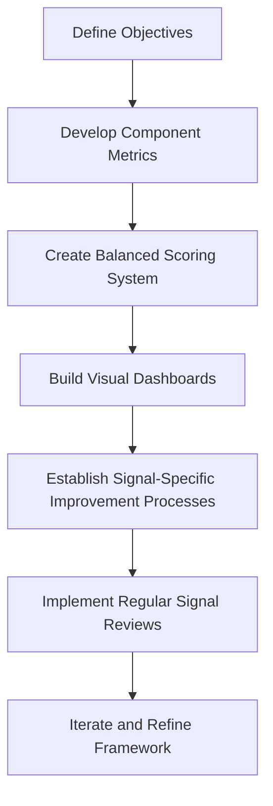

1. **Define Objectives**: Begin by aligning on the goals for implementing the Four Golden Signals framework. Identify key business drivers (e.g., reducing customer impact or achieving regulatory compliance) and clarify how improvements in each signal will support these objectives.

2. **Develop Component Metrics**: Define 3-5 specific, measurable metrics for each signal. These metrics should collectively provide comprehensive coverage of the signal's dimension. For example:

   - *Detection Effectiveness*: Time-to-detection, detection source distribution, and false positive/negative rates.
   - *Diagnostic Efficiency*: Average time for root cause analysis, accuracy of initial diagnosis, and tooling utilization rates.

3. **Create Balanced Scoring System**: Design a weighted scoring system that aggregates the component metrics for each signal into a single health indicator. Ensure the weights reflect the relative importance of each component in your specific environment while allowing visibility into individual metrics for deeper analysis.

4. **Build Visual Dashboards**: Create integrated dashboards that display all four signals simultaneously. Include:

   - Drill-down capabilities for individual metrics and component trends.
   - Comparative visualizations against established targets.
   - Historical trend analysis to track progress over time.

5. **Establish Signal-Specific Improvement Processes**: Set up dedicated improvement workstreams for each signal. Assign specialized teams, tools, and workflows tailored to the unique challenges of each signal. For instance:

   - Detection Effectiveness: Focus on enhancing alerting mechanisms and reducing noise.
   - Resolution Velocity: Streamline fix implementation processes with automation and standardized playbooks.

6. **Implement Regular Signal Reviews**: Schedule consistent reviews (e.g., weekly or monthly) for each signal's performance. Tailor the review process to the signal's unique characteristics, involving key stakeholders and utilizing specialized analysis techniques.

7. **Iterate and Refine Framework**: Use insights from regular reviews and performance trends to refine metrics, scoring systems, and dashboards. Continuously evolve the framework to address emerging challenges and improve its alignment with business goals.

## Panel 3: Post-Incident Analysis - The Learning Loop

### Scene Description

A banking SRE team conducts a sophisticated post-incident review of a major trading platform outage. Unlike basic "what happened" discussions, this session follows a structured learning-focused methodology. The room features a dedicated facilitation area where a trained post-incident review specialist guides the process using a clear framework displayed on digital boards. The framework includes the following steps:

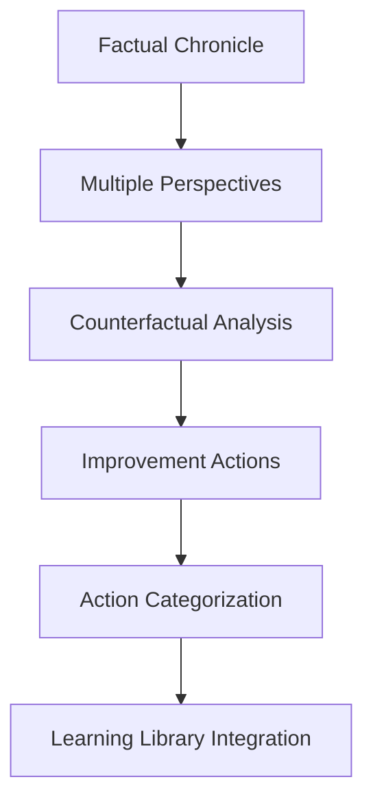

- **Factual Chronicle**: Establishing what happened without judgment.
- **Multiple Perspectives**: Capturing different viewpoints on the same events.
- **Counterfactual Analysis**: Exploring "what if" alternatives to identify critical decision points.
- **Improvement Actions**: Developing concrete changes to prevent recurrence.
- **Action Categorization**: Sorting actionable items into three tracks: Technical Improvements, Process Enhancements, and Knowledge Gaps—each with specific owners, timelines, and measurement criteria.
- **"Learning Library" Integration**: Automatically capturing insights into a searchable knowledge base, connecting them with previous incidents sharing similar patterns.

Throughout the process, the facilitator skillfully redirects blame-oriented comments toward systemic factors while encouraging the team to analyze both technical and organizational aspects of the incident. This structured approach ensures that the review not only addresses the immediate incident but also promotes long-term organizational learning and improvement.

### Teaching Narrative

Traditional post-incident reviews often focus narrowly on technical details—identifying what broke and how to fix it—without systematically extracting deeper insights or ensuring organizational learning. Integration & Triage introduces structured post-incident analysis—a comprehensive approach that transforms incident reviews from mechanical recounting to powerful learning opportunities. This methodology recognizes that each incident contains valuable insights not just about technical systems but about organizational processes, decision-making patterns, and knowledge gaps that, if properly captured, can drive significant improvements across the entire organization. Effective post-incident analysis follows a deliberate structure: establishing a factual chronicle without blame, capturing multiple perspectives on the same events, performing counterfactual analysis to identify critical decision points, extracting generalizable insights beyond the specific incident, and developing concrete improvement actions with clear ownership and follow-up mechanisms. For banking environments where similar incidents may recur in different forms, this learning-focused approach ensures each event contributes to systematic improvement rather than triggering isolated fixes. Developing this learning mindset requires creating psychological safety that encourages honest exploration, training skilled facilitators who can guide effective reviews, and implementing knowledge management systems that connect insights across incidents. This transformation from mechanical to learning-oriented reviews represents a significant evolution in your continuous improvement approach, turning incidents from unfortunate events to be forgotten into valuable catalysts for organizational enhancement.

### Common Example of the Problem

After a critical payment processing outage that affected over 50,000 customer transactions, MercantileBank conducted what they considered a thorough post-incident review. The session focused entirely on identifying the technical root cause (a database configuration issue) and implementing an immediate fix. The review was led by the same manager who had approved the configuration change, creating an uncomfortable dynamic where team members hesitated to speak freely. The session produced a single action item: updating the database configuration and adding a specific monitoring alert.

Six months later, a nearly identical outage occurred in a different payment system due to the same fundamental configuration pattern. When leadership investigated why the previous incident hadn't prevented this recurrence, they discovered that while the specific system had been fixed, the underlying lessons about configuration management practices hadn't been extracted, documented, or shared across teams. The bank had treated the incident as an isolated technical problem rather than an opportunity for organizational learning, failing to identify the systemic issues in their change management process that had allowed the same mistake to be repeated in a different context.

#### Checklist of Key Failures

- **Narrow Technical Focus:**

  - Only the immediate technical root cause (database configuration issue) was addressed.
  - Broader organizational and systemic factors were not analyzed.

- **Lack of Psychological Safety:**

  - The review was led by the manager who approved the configuration change, discouraging open and honest discussion.

- **Insufficient Action Items:**

  - The review generated a single action item that was narrowly scoped to the affected system.
  - No action plan was developed to address underlying patterns or systemic risks.

- **Failure to Generalize Lessons:**

  - Lessons from the incident were not extracted, documented, or shared across teams.
  - The organization missed the opportunity to identify and address weaknesses in their configuration management practices.

- **No Knowledge Sharing Mechanism:**

  - Insights from the incident were not integrated into a central knowledge base.
  - Teams lacked visibility into similar past incidents, leading to repeated failures.

#### Key Takeaway

This example highlights the importance of a structured, learning-focused post-incident review process. Organizations must move beyond treating incidents as isolated technical issues and instead use them as opportunities to uncover systemic improvements, foster psychological safety, and ensure insights are widely shared to prevent recurrence.

### SRE Best Practice: Evidence-Based Investigation

Effective post-incident analysis requires structured, evidence-based methods that extract maximum learning from each event. The table below summarizes the five key methods, their purposes, and example tools or techniques:

| **Method** | **Purpose** | **Example Tools/Techniques** |
| ----------------------------------- | ----------------------------------------------------------------------------------------------------------------------------- | ------------------------------------------------------------ |
| **Factual Timeline Construction** | Establish a validated, timestamp-accurate sequence of events by using diverse data sources. | Monitoring logs, communication records, system change audits |
| **Multi-Perspective Documentation** | Capture and analyze differing viewpoints from all roles involved to identify misalignments in communication or understanding. | Structured interviews, role-specific surveys |
| **Counterfactual Testing** | Explore "what if" scenarios to pinpoint critical decision points and alternative outcomes. | Decision trees, scenario simulations |
| **Pattern Matching Analysis** | Compare the incident with historical patterns to identify connections and recurring issues. | Algorithmic similarity detection, statistical modeling |
| **Action Effectiveness Validation** | Ensure improvement actions are impactful by testing hypotheses and defining success criteria. | Controlled experiments, KPI tracking |

This evidence-based approach transforms post-incident analysis from subjective discussion to rigorous investigation, significantly enhancing learning extraction.

### Banking Impact

Effective post-incident learning directly impacts critical business functions in banking environments:

1. **Reduced Operational Losses**: Systematic learning from incidents progressively eliminates entire failure classes, directly reducing operational losses that averaged $1.3 million per major outage for large financial institutions in 2024.

2. **Regulatory Compliance Enhancement**: Structured post-incident analysis provides comprehensive documentation that satisfies regulatory requirements, reducing both penalties and enhanced scrutiny.

3. **Cross-Team Knowledge Leverage**: Effective learning systems ensure insights gained from incidents in one domain transfer to other areas, multiplying the return on experience.

4. **Resource Optimization**: Addressing systemic issues rather than symptoms reduces the total remediation effort required over time, allowing more resources to focus on innovation rather than maintenance.

5. **Organizational Resilience Enhancement**: Systematic learning builds organizational knowledge and adaptation capabilities that extend beyond specific technical improvements, creating generalized resilience to novel challenges.

For global banks where incidents can affect millions of transactions across dozens of systems, effective learning translation delivers exponential returns by preventing recurring issues across the enterprise.

### Implementation Guidance

To implement effective post-incident learning in your banking environment, follow these structured steps:

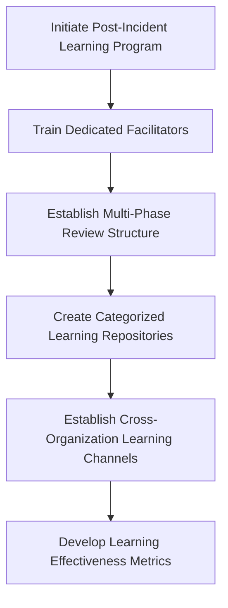

1. **Establish a Dedicated Facilitation Program**:\
   Train specialized incident review facilitators who do not directly manage the teams involved. Provide them with structured methodologies, facilitation tools, and psychological safety techniques. Clearly delineate roles between incident management and incident learning to maintain focus and neutrality.

2. **Implement a Multi-Phase Review Structure**:\
   Design a standardized review framework with distinct phases:

   - **Initial Factual Review (24-48 hours post-resolution)**: Focus on establishing an objective timeline and understanding without assigning blame.
   - **Deeper Analysis Session (3-5 days later)**: Perform counterfactual analysis, capture multiple perspectives, and identify systemic factors.
   - **Effectiveness Follow-up (30-60 days after actions implemented)**: Assess the impact of implemented changes and refine learnings for long-term application.\
     Provide templates and tools tailored to each phase to ensure consistency and thoroughness.

3. **Create Categorized Learning Repositories**:\
   Implement a knowledge management system that organizes incident learnings into reusable patterns. Categorize by attributes such as system type, failure mode, contributing factors, and effective interventions. Regularly maintain and curate this repository to ensure quality, relevance, and accessibility.

4. **Establish Cross-Organization Learning Channels**:\
   Develop formal mechanisms to share insights across teams and departments. Examples include:

   - Recurring learning reviews.
   - Pattern libraries to identify recurring themes.
   - Training programs incorporating recent incident findings.\
     These channels ensure that learnings drive organization-wide improvements beyond the originating team.

5. **Develop Learning Effectiveness Metrics**:\
   Create systems to measure how well incident insights lead to improvement. Key metrics may include:

   - Knowledge dissemination effectiveness (e.g., number of teams accessing new learnings).
   - Action implementation rates.
   - Recurrence reduction for similar incidents.\
     Use these metrics to refine your processes and demonstrate the value of a learning-focused approach.

## Panel 4: Leading and Lagging Indicators - Predictive Triage Metrics

### Scene Description

A banking risk management meeting where SRE leaders present a sophisticated metrics dashboard that contrasts leading and lagging indicators of triage effectiveness. Traditional lagging indicators are displayed on one section (incident counts, resolution times, customer impact), while a more innovative panel shows leading indicators designed to predict future performance: alert noise ratio trends, knowledge base query patterns, automation coverage metrics, and skill distribution heat maps across teams.

The presentation highlights how deteriorating leading indicators successfully predicted service degradation three weeks before customer impact occurred. Team leaders explain how they've shifted resource allocation based on these predictive signals, proactively addressing emerging weaknesses in specific application domains before they manifested as incidents.

Below is a simplified timeline visualization to illustrate this transition from reactive to preventative operations:

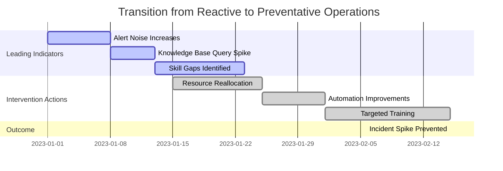

This timeline demonstrates how early detection of concerning trends (e.g., alert noise increases, knowledge base query spikes) enabled targeted interventions (e.g., resource reallocation, automation improvements, and training). These actions prevented a predicted incident spike that would otherwise align with historical patterns.

Through this approach, the team transitioned from reactive responses based on lagging indicators to proactive management driven by leading indicators, showcasing a significant evolution in operational effectiveness.

### Teaching Narrative

Traditional performance measurement often relies exclusively on lagging indicators—metrics that report historical performance after events have occurred. Integration & Triage introduces the critical concept of leading indicators—predictive metrics that transform measurement from backward-looking reporting to forward-looking insight. This approach recognizes that truly effective triage requires not just understanding past performance but anticipating future challenges before they manifest as incidents.

Leading indicators provide early warning signals of emerging issues, empowering teams to intervene preemptively. Below is a summary of key leading indicators, their potential implications, and suggested actions:

| **Leading Indicator** | **What It Predicts** | **Suggested Actions** |
| ----------------------------- | ----------------------------------------- | ----------------------------------------------------------------------------------------- |
| Alert Noise Ratio Trends | Declining detection effectiveness | Investigate and tune alert thresholds; reduce noise by refining signal-to-noise ratio. |
| Knowledge Base Query Patterns | Emerging confusion about specific systems | Update and expand documentation; ensure SMEs are available for knowledge sharing. |
| Skill Distribution Heat Maps | Resilience risks in specific domains | Provide targeted training; reallocate skilled resources to high-risk areas. |
| Automation Coverage Metrics | Growing technical debt | Expand automation efforts; address gaps in automated workflows to reduce manual overhead. |

For banking environments where proactive risk management is essential for both operational and regulatory reasons, these predictive capabilities enable intervention before degradation impacts customers or triggers compliance concerns.

Developing this predictive measurement approach involves four key steps:

1. **Identify Metrics with Predictive Power**: Select metrics that reliably indicate future issues.
2. **Establish Baselines and Thresholds**: Define normal patterns and identify acceptable variations.
3. **Visualize Trends**: Create dashboards that clearly highlight concerning patterns or deviations.
4. **Implement Preemptive Interventions**: Establish processes that are automatically triggered by indicator changes.

This transformation from reactive to predictive measurement represents a significant evolution in your operational approach, enabling truly proactive management rather than merely efficient reaction to incidents after they occur.

### Common Example of the Problem

TransactBank's quarterly performance review showcased outstanding results based on traditional lagging indicators: incident counts were down 18%, mean-time-to-resolution improved by 12%, and availability metrics exceeded 99.9%. Leadership celebrated these achievements, confident in their operational excellence. However, just three weeks later, a catastrophic payment processing outage affected millions of customers for over five hours.

In the aftermath, an investigation revealed that critical warning signs had been completely missed. Alert noise had increased 40% in the preceding months (indicating deteriorating detection quality), engineer turnover in the payments team had reached 25% (creating knowledge gaps), internal documentation searches for payment system error codes had spiked dramatically (showing growing confusion), and automation test coverage had declined by 15% due to rapid feature releases. While lagging indicators highlighted past success, the leading indicators—which could have predicted the failure—were ignored.

The table below illustrates the contrast between the lagging indicators used in the review and the overlooked leading indicators that signaled the impending outage:

| **Category** | **Lagging Indicators (Before)** | **Leading Indicators (Missed)** |
| ----------------------- | ------------------------------- | ----------------------------------------------------------------------------------- |
| **Incident Metrics** | Incident counts down 18% | 40% increase in alert noise, suggesting detection quality was deteriorating |
| **Team Dynamics** | No metrics reported | 25% turnover in payments team, leading to knowledge gaps |
| **Knowledge Signals** | Not measured | Significant spike in internal documentation searches for payment system error codes |
| **Automation Coverage** | Not included | Automation test coverage decreased by 15% due to rapid feature releases |
| **Customer Impact** | High availability (99.9%) | No direct customer impact yet, but predictive signals indicated growing risks |

This example underscores the fundamental flaw in relying solely on lagging indicators: they provide a backward-looking view of historical performance but fail to anticipate future challenges. By ignoring these leading indicators, TransactBank missed the opportunity to intervene before the outage occurred, demonstrating the urgent need for predictive measurement systems.

### SRE Best Practice: Evidence-Based Investigation

Developing effective leading indicators requires rigorous, evidence-based approaches to identify and validate truly predictive metrics. Use the following checklist and flowchart to guide the process toward actionable insights:

#### Checklist for Developing Leading Indicators

- [ ] **Historical Pattern Analysis**

  - Conduct retrospective analysis of past incidents.
  - Identify measurable factors with significant changes preceding failures.
  - Apply statistical methods to distinguish predictors from correlations.

- [ ] **Multivariate Correlation Testing**

  - Analyze correlations between potential indicators and performance metrics.
  - Calculate statistical significance and predictive power.
  - Validate through controlled experiments.

- [ ] **Predictive Model Development**

  - Build statistical models combining multiple indicators.
  - Leverage machine learning for hidden relationships and thresholds.
  - Simulate and test predictive performance.

- [ ] **Time-Lagged Impact Measurement**

  - Measure delays between indicator changes and observable impacts.
  - Define appropriate intervention windows and monitoring cadence.

- [ ] **Continuous Validation Frameworks**

  - Monitor true positive and false positive rates.
  - Continuously refine the indicator set based on effectiveness.
  - Adjust thresholds and models as systems evolve.

#### Flowchart: Evidence-Based Indicator Development Process

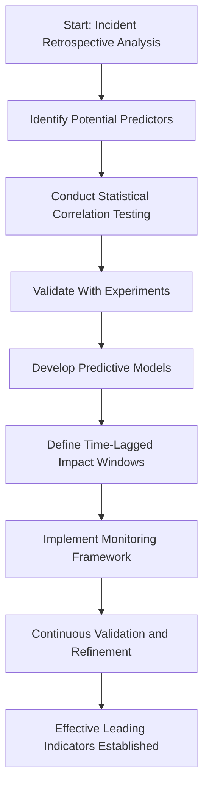

By following this structured process, SRE teams can ensure their leading indicators are robust, predictive, and actionable, enabling a shift from reactive to proactive triage operations.

### Banking Impact

Implementing predictive measurement through leading indicators delivers specific business benefits in banking environments:

1. **Preemptive Risk Mitigation**: Identifying emerging issues before they impact services allows intervention that prevents financial losses, with studies showing preemptive actions typically cost 15-25% of post-incident recovery.

2. **Enhanced Resource Allocation**: Predictive insights enable precisely targeted investment in the specific areas most likely to cause future issues, optimizing limited resource deployment.

3. **Regulatory Advantage**: Demonstrating proactive risk identification capabilities satisfies regulatory requirements for forward-looking risk management, reducing compliance burdens and potential penalties.

4. **Operational Stability Planning**: Leading indicators provide early warning of potential instability, allowing planned, controlled interventions rather than emergency responses.

5. **Technical Debt Management**: Predictive metrics highlight accumulating technical debt before it manifests as incidents, enabling systematic reduction rather than crisis management.

For global financial institutions processing billions in daily transactions, the ability to predict and prevent issues rather than merely respond to them translates directly to competitive advantage, market confidence, and financial performance.

### Implementation Guidance

To implement effective leading indicators in your banking environment, follow these structured steps:

1. **Conduct Initial Indicator Research**:

   - Analyze 12-24 months of historical incidents to identify potential predictive factors.
   - Focus on metrics that showed significant changes 2-8 weeks before major incidents.
   - Document hypothesized causal relationships and validate them through statistical analysis.

2. **Develop a Balanced Indicator Portfolio**:

   - Select diverse leading indicators across key domains:
     - **System Health**: Alert noise ratio, error rate patterns.
     - **Organizational Factors**: Knowledge base queries, training completion rates.
     - **Technical Quality**: Test coverage, deployment frequency.
     - **Team Health**: On-call fatigue, skill distribution.

3. **Establish Baseline Patterns and Thresholds**:

   - Use statistical methods to define normal operating ranges for each indicator.
   - Set graduated warning thresholds based on severity of deviation.
   - Map specific response protocols for each threshold level.

4. **Create Integrated Visualization Systems**:

   - Build dashboards to display leading and lagging indicators side-by-side.
   - Highlight concerning trends visually for immediate recognition.
   - Automate alerting for threshold breaches with graded urgency levels.

5. **Implement Tiered Response Protocols**:

   - Define structured response frameworks triggered by indicator warnings.
   - Specify actions for each warning level, from monitoring escalation to emergency interventions.
   - Assign clear ownership and escalation paths for every protocol.

#### Step-by-Step Flowchart

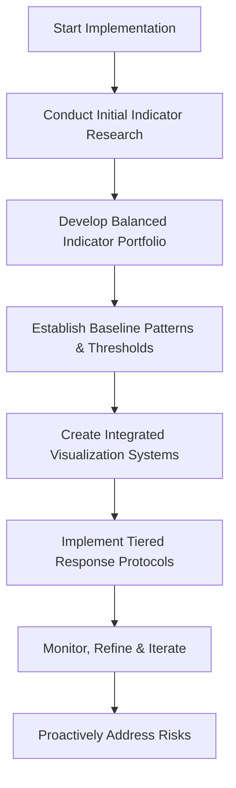

#### Summary of Steps and Flow

1. **Start Implementation**: Initiate the process by analyzing historical data.
2. **Research**: Identify predictive factors and validate their relationships to incidents.
3. **Portfolio Development**: Create a comprehensive set of indicators spanning multiple domains.
4. **Baseline and Thresholds**: Define patterns, thresholds, and corresponding actions.
5. **Visualization**: Build dashboards for real-time tracking and automated alerts.
6. **Response Protocols**: Establish tiered responses with clear ownership and escalation paths.
7. **Iterate**: Continuously monitor the system, refine indicators, and improve processes.
8. **Outcome**: Transition from reactive to proactive risk management, reducing service degradation and enhancing operational resilience.

## Panel 5: Comparative Benchmarking - From Internal Trends to Industry Standards

### Scene Description

```markdown
### Scene Description
A quarterly banking technology governance meeting where the SRE leadership presents a comprehensive benchmarking analysis of their Integration & Triage capabilities. The presentation features sophisticated visualizations comparing internal performance not just against historical baselines but against industry peers and cross-industry leaders. 

The benchmarking analysis evaluates multiple dimensions:

```

Incident Metrics: ┌────────────────────────┬────────────────────────────┐
│ Incident Frequency │ Relative to Transaction │
│ │ Volume │
├────────────────────────┼────────────────────────────┤
│ Mean-Time-To-Resolution└────────────────────────────┘

```

### Key subdiagram and H3 sub-section
```

### Teaching Narrative

Traditional performance evaluation often focuses exclusively on internal trends—comparing current metrics against historical performance without external context. Integration & Triage introduces comparative benchmarking—a broader approach that transforms evaluation from isolated self-assessment to contextual understanding of performance relative to industry peers and leaders.

To illustrate, consider the world of competitive athletics. An elite sprinter does not measure success solely by comparing their current race times to their personal bests. Instead, they also assess their performance relative to competitors in their field, understanding where they excel and where they lag. This external perspective provides critical insight into whether a slower time is due to personal shortcomings or universally challenging conditions, such as a headwind affecting all athletes. Similarly, comparative benchmarking enables organizations to distinguish between internal limitations and broader industry challenges, while identifying realistic improvement targets by observing what top-performing organizations achieve.

Effective benchmarking examines multiple dimensions: quantitative performance metrics (incident rates, resolution times, customer impact), process maturity indicators (automation levels, tool sophistication), methodological approaches (investigation techniques, knowledge management practices), and organizational capabilities (skill development, continuous improvement mechanisms). For banking institutions operating in competitive markets with consistent regulatory oversight, this comparative perspective provides crucial context for strategic improvement decisions and resource allocation.

Developing this benchmark-oriented mindset requires establishing appropriate comparison groups, identifying truly comparable metrics despite different environments, creating measurement frameworks that enable meaningful comparison, and developing the organizational maturity to honestly assess capabilities relative to peers. This transformation from introspective to comparative evaluation represents a significant evolution in your assessment approach, providing crucial context for improvement prioritization while establishing realistic targets based on demonstrated possibilities rather than theoretical ideals.

### Common Example of the Problem

InvestBank's technology leadership celebrated their significant progress in incident management, pointing to a 40% reduction in mean-time-to-resolution and 99.95% platform availability over the past year. These improvements had required substantial investment and organizational focus, and executives were confident they had achieved industry-leading operational excellence. However, when the bank participated in an industry benchmarking study, they were shocked to discover their performance ranked in the bottom quartile among peer financial institutions. While they had indeed improved against their own historical baseline, their competitors had made even more dramatic advancements. The study revealed that top-performing banks were achieving 99.99% availability with mean-time-to-resolution under 30 minutes for similar systems. More concerning, InvestBank's incident rate per transaction volume was nearly triple the industry average, indicating fundamental reliability issues despite their improvements in response speed. Without comparative context, the bank had misallocated resources to incremental improvements in metrics that remained well behind industry standards while failing to address the core reliability issues that were causing their excessive incident volume. Their isolated, internal-only measurement approach had created a dangerous illusion of excellence that was exposed immediately when placed in competitive context.

### SRE Best Practice: Evidence-Based Investigation

Effective benchmarking requires rigorous, methodical approaches to ensure meaningful, actionable comparisons. The following checklist summarizes five best practices to guide your evidence-based investigation:

#### Checklist: Five Best Practices for Evidence-Based Benchmarking

1. **Metric Normalization Techniques**

   - Develop standardized calculations to account for different scales, architectures, and business models.
   - Normalize metrics such as incident counts by transaction volume rather than absolute numbers.
   - Adjust availability measurements to align with varying service definitions.

2. **Multi-Source Validation**

   - Gather data from diverse sources: industry studies, peer collaborations, professional associations, and consultancies.
   - Validate findings by identifying consistent patterns across datasets.
   - Use statistical methods to pinpoint outliers and establish confidence intervals.

3. **Systematic Capability Assessment**

   - Apply structured frameworks that break down complex practices into measurable components.
   - Evaluate these components against defined maturity stages for objective comparisons.
   - Engage independent assessors to mitigate self-assessment bias.

4. **Contextual Analysis**

   - Analyze environmental factors such as regulatory regimes, technology stacks, and market segments.
   - Use statistical controls to isolate and account for these influences in benchmark results.
   - Interpret differences in performance within the context of these variables.

5. **Forward Indicator Analysis**

   - Assess trend trajectories among peers to identify emerging best practices.
   - Focus on innovation patterns to anticipate future capability requirements.
   - Use forward-looking metrics to align improvement targets with industry evolution.

By adhering to this checklist, organizations can ensure their benchmarking efforts produce genuinely insightful comparisons that drive actionable outcomes.

### Banking Impact

Effective comparative benchmarking delivers specific business benefits in banking environments. The table below maps key benefits to real-world examples and outcomes, providing practical insights into their impact:

| **Business Benefit** | **Examples** | **Outcomes** |
| --------------------------------------- | ---------------------------------------------------------------------------------------------- | ----------------------------------------------------------------------------------------------------- |
| **Competitive Positioning** | Identifying faster incident resolution times compared to peers. | Informs leadership that current triage processes provide a competitive edge, reducing customer churn. |
| | Detecting lagging knowledge management practices relative to industry leaders. | Drives targeted investment in knowledge-sharing platforms to close competitive gaps. |
| **Investment Optimization** | Avoiding overinvestment in automation for areas where coverage already exceeds industry norms. | Frees up budget for addressing critical gaps like predictive incident capabilities. |
| | Prioritizing triage enhancements in regions with higher regulatory incident rates. | Ensures focused spending where ROI is highest and regulatory risks are mitigated. |
| **Regulatory Preparation** | Benchmarking peer approaches to incident reporting under GDPR or similar frameworks. | Improves compliance readiness, reducing penalties and audit findings during regulatory reviews. |
| | Aligning internal processes with common practices in financial regulatory submissions. | Builds examiner confidence and streamlines regulatory approval processes. |
| **Technology Strategy Alignment** | Observing widespread adoption of AI-driven triage in top-performing banks. | Encourages timely adoption of innovative technologies to enhance operational efficiency. |
| | Identifying industry trends toward cloud-native triage platforms. | Guides migration strategies that future-proof the organization’s technology stack. |
| **Board and Shareholder Communication** | Presenting evidence of market-leading detection speed in quarterly governance reports. | Strengthens shareholder confidence in the organization's reliability strategy. |
| | Highlighting structured improvement roadmaps for underperforming areas. | Demonstrates accountability and commitment to continuous improvement, garnering stakeholder trust. |

For multinational financial institutions, performance benchmarking across different regulatory regimes and market segments provides critical insights for strategic technology investment decisions. By targeting improvement efforts based on robust comparative analysis, organizations can avoid misdirected expenditures and potentially save millions while achieving superior reliability outcomes.

### Implementation Guidance

To implement effective comparative benchmarking in your banking environment:

1. **Identify Appropriate Peer Groups**:\
   Establish multiple comparison cohorts:

   - Direct competitors (similar size/market).
   - Aspirational benchmarks (industry leaders).
   - Cross-industry comparisons (high-reliability organizations outside finance).
   - Regional peers (banks in similar regulatory environments).\
     Develop clear criteria for inclusion in each cohort to ensure meaningful comparisons.

2. **Develop Normalized Metric Definitions**:\
   Create standardized calculation methods for key performance indicators that account for organizational differences.

   - Document precise definitions, including measurement periods, exclusion criteria, and normalization factors.
   - Ensure these definitions are consistently applied to enable valid comparisons across all identified peer groups.

3. **Establish Multi-Channel Data Collection**:\
   Implement diverse data gathering mechanisms:

   - Participate in industry benchmark studies.
   - Establish peer exchange forums with appropriate confidentiality agreements.
   - Engage with financial technology consortiums.
   - Leverage consulting partnerships with cross-industry visibility.\
     This ensures access to reliable and comprehensive data for benchmarking.

4. **Create Comparative Visualization Tools**:\
   Develop specialized dashboards that display your performance in context:

   - Include percentile rankings, gap analyses, and trend comparisons.
   - Incorporate confidence indicators that reflect data quality and comparability.\
     These tools should provide actionable insights and highlight areas requiring attention.

5. **Implement a Benchmark-Driven Improvement Process**:\
   Establish a structured approach to convert benchmark insights into strategic initiatives:

   - Conduct gap analysis to identify performance disparities.
   - Prioritize improvements based on their impact and feasibility.
   - Set realistic targets informed by peer performance.
   - Continuously track progress against external benchmarks and refine strategies as needed.

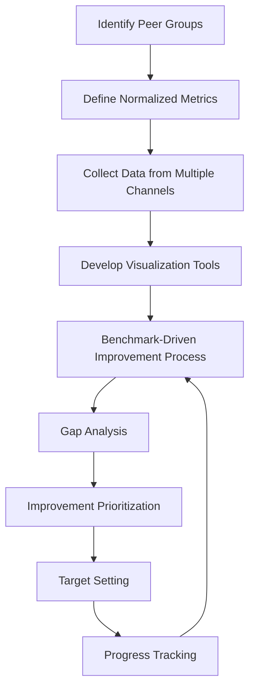

This flow emphasizes the iterative nature of benchmarking, where progress tracking feeds back into the improvement process for continuous refinement.

## Panel 6: The Improvement Flywheel - Systematic Capability Enhancement

### Scene Description

A banking technology transformation office where a dedicated triage improvement team manages a sophisticated capability enhancement system. The focal point is a visual representation of the "Improvement Flywheel"—a continuous cycle moving through four interconnected phases: Measure, Analyze, Implement, and Validate. This flywheel drives continuous improvement by building momentum as enhancements compound over time. Below is a visual representation of the flywheel:

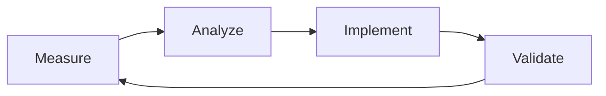

- **Measure**: Collect comprehensive metrics on current performance.
- **Analyze**: Identify specific capability gaps and improvement opportunities.
- **Implement**: Execute targeted enhancements to address identified gaps.
- **Validate**: Confirm improvements deliver expected outcomes.

Digital dashboards track multiple improvement initiatives at different flywheel stages, illustrating how completed cycles fuel subsequent enhancements. Team members showcase the flywheel's accelerating effect—early improvements pave the way for more sophisticated enhancements that would have been unattainable initially. A senior leader highlights how this approach has been institutionalized through dedicated improvement resources, robust governance structures, and integrated tooling that automatically feeds operational data into the measurement phase. This ensures the flywheel continues turning seamlessly, even amidst leadership changes or organizational restructuring.

### Teaching Narrative

Traditional improvement efforts often take the form of sporadic initiatives—reactive projects triggered by major incidents or leadership directives without systematic continuation. Integration & Triage introduces the Improvement Flywheel concept—a structured, ongoing approach that transforms enhancement from isolated projects to continuous evolution. This methodology recognizes that truly effective capability development requires consistent, sustained effort that builds momentum over time rather than disconnected initiatives that start from scratch with each new focus area. The Improvement Flywheel follows a deliberate, repeating cycle: measuring current performance comprehensively, analyzing results to identify specific improvement opportunities, implementing targeted enhancements to address priority gaps, and validating that changes deliver expected outcomes before beginning the next cycle. For banking environments with complex regulatory requirements and evolving threat landscapes, this systematic approach ensures continuous adaptation to changing conditions while steadily enhancing overall capabilities. Developing this flywheel mindset requires creating dedicated improvement resources, establishing governance mechanisms that span individual projects, implementing measurement systems that automatically feed the analysis phase, and cultivating organizational patience to allow the flywheel to build momentum. This transformation from project-based to continuous improvement represents a significant evolution in your enhancement approach, creating self-sustaining momentum that accelerates over time as each improvement enables more sophisticated subsequent enhancements.

### Common Example of the Problem

Following a series of costly trading platform outages, MetroFinancial's executive team mandated an extensive reliability improvement program with substantial investment. For six months, teams worked intensively to enhance monitoring, automation, and incident response capabilities. When the program officially concluded, leadership celebrated the substantial improvements achieved and redirected resources to other priorities.

However, just nine months later, a technology audit revealed that most of the gains had eroded. The timeline below illustrates the sequence of events leading to this regression:

```mermaid
sequenceDiagram
    participant ExecTeam as Executive Team
    participant Teams as Improvement Teams
    participant Systems as Systems & Processes

    ExecTeam->>Teams: Mandate reliability improvement program
    Teams->>Teams: Intensive work for 6 months
    Teams->>Systems: Enhance monitoring, automation, incident response
    ExecTeam->>Teams: Program concluded; resources redirected
    Systems->>Teams: New systems added without alerting updates
    Systems->>Teams: Automation scripts become outdated
    Systems->>Teams: Staff turnover depletes expertise
    Teams->>ExecTeam: Technology audit reveals eroded improvements
```

What appeared as a successful improvement project had actually been a temporary spike in capabilities without sustained enhancement mechanisms. Monitoring coverage decreased as new systems were added without corresponding alerting, automation scripts became outdated as environments evolved, and staff turnover depleted the incident response expertise developed during the initiative.

The fundamental problem was treating operational improvement as a finite project rather than an ongoing process—failing to establish the continuous measurement, analysis, implementation, and validation cycle necessary for lasting enhancement. Without the systematic, self-reinforcing momentum of an improvement flywheel, short-term gains quickly dissipated as systems evolved and organizational focus shifted elsewhere.

### SRE Best Practice: Evidence-Based Investigation

Establishing an effective improvement flywheel requires systematic, evidence-based approaches to ensure sustainable capability enhancement. The following checklist summarizes key practices for implementing evidence-based investigation within the flywheel:

#### Checklist: Evidence-Based Investigation Practices

- **Comprehensive Capability Mapping**:

  - [ ] Develop detailed capability models decomposing triage effectiveness into measurable components.
  - [ ] Use structured assessment frameworks to establish precise baseline measurements.
  - [ ] Ensure models are updated regularly to reflect evolving system and organizational needs.

- **Statistical Gap Analysis**:

  - [ ] Implement data-driven prioritization that quantifies improvement opportunities based on:
    - Capability gaps.
    - Business impact.
    - Implementation feasibility.
  - [ ] Apply analytical methods (e.g., Pareto analysis) to focus on high-impact areas.
  - [ ] Incorporate feedback loops for refining prioritization criteria over time.

- **Controlled Implementation Validation**:

  - [ ] Design initiatives with clear, testable hypotheses about expected outcomes.
  - [ ] Define measurement methodologies and success criteria for validating results.
  - [ ] Use experimental approaches (e.g., A/B testing, control groups) to establish causal links between interventions and outcomes.

- **Momentum Measurement**:

  - [ ] Establish metrics tracking flywheel acceleration, such as:
    - Capability development velocity.
    - Cross-initiative amplification effects.
  - [ ] Quantify how improvements enable subsequent, more sophisticated enhancements.
  - [ ] Regularly review metrics to identify opportunities for further acceleration.

- **Sustainability Verification**:

  - [ ] Monitor improvements longitudinally to distinguish between temporary and permanent gains.
  - [ ] Apply statistical process control methods to confirm stability of enhancements over time.
  - [ ] Test resilience of improvements against organizational and system changes.

By following this checklist, teams can ensure the improvement flywheel delivers genuine, sustained enhancement rather than temporary, unsustainable gains.

#### Process Flow: Evidence-Based Investigation

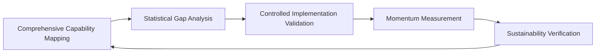

This evidence-based approach provides a repeatable framework for systematic capability enhancement, ensuring improvements compound over time and build self-sustaining momentum.

### Banking Impact

Implementing the improvement flywheel methodology delivers specific business benefits in banking environments:

1. **Sustained Competitive Advantage**: Continuous capability enhancement creates accumulating advantages over competitors using project-based approaches, with compounding benefits as each improvement enables more sophisticated subsequent advancements.

2. **Regulatory Resilience**: Systematic improvement mechanisms demonstrate mature management practices to regulators, reducing scrutiny while creating adaptability to evolving compliance requirements.

3. **Optimized Investment Efficiency**: The flywheel approach maximizes return on improvement investments by ensuring capabilities continue to enhance long after initial project funding, with each dollar delivering compound returns over time.

4. **Organizational Learning Acceleration**: Continuous cycles create accelerating knowledge acquisition that builds institutional expertise faster than linear approaches, developing deeper capabilities than competitors.

5. **Change Absorption Capacity**: Systematic enhancement develops the organizational "muscles" for continuous adaptation, creating resilience to technological changes, market shifts, and evolving threats.

For global financial institutions facing rapid technological change, regulatory evolution, and emerging security threats, this systematic approach creates the adaptive capacity essential for long-term viability.

### Implementation Guidance

To implement an effective improvement flywheel in your banking environment, follow these five steps, summarized in the table below:

| Step | Key Actions | Expected Outcomes |
| ----------------------------------------------------- | ---------------------------------------------------------------------------------------------------------------------------------------------------------------------------------------------------------------------------------------------------------- | ----------------------------------------------------------------------------------------------------- |
| **1. Establish Dedicated Enhancement Infrastructure** | - Form a permanent capability improvement team. <br> - Assign specific roles with protected resources. <br> - Secure executive sponsorship. <br> - Build expertise in improvement methodologies, measurement frameworks, and change management techniques. | - A well-resourced team with the authority and expertise to drive continuous improvement initiatives. |
| **2. Implement a Staged Cycle Cadence** | - Design overlapping improvement cycles with staggered phases. <br> - Define timelines, milestones, and transition gates for each phase (Measure, Analyze, Implement, Validate). | - Continuous momentum through parallel cycles, reducing downtime between phases. |
| **3. Create Automated Measurement Systems** | - Develop tools to continuously gather operational data from production, monitoring, and incident systems. <br> - Implement automated analysis to detect trends, anomalies, and opportunities. | - Real-time insights and reduced manual effort in identifying improvement opportunities. |
| **4. Establish Governance Mechanisms** | - Create oversight structures that ensure continuity across initiatives. <br> - Define review cadences and decision frameworks. <br> - Develop artifacts to maintain alignment despite organizational changes. | - Sustained progress and accountability, even through leadership or priority shifts. |
| **5. Design Compound Enhancement Strategies** | - Create multi-generational roadmaps sequencing foundational improvements to enable advanced capabilities. <br> - Develop dependency maps to plan for compounding benefits. | - Sophisticated capabilities unlocked through strategically sequenced enhancements. |

By following these steps, organizations can create a self-sustaining improvement system that builds momentum over time. Each completed cycle enables more advanced and impactful enhancements, resulting in continuous and compounding capability development.

## Panel 7: Integration & Triage Maturity Model - The Capability Evolution Path

### Scene Description

A banking technology strategy session where leadership evaluates their Integration & Triage capabilities against a comprehensive maturity model. A large interactive display shows a sophisticated framework with five maturity levels across multiple capability dimensions: Process Sophistication, Tool Integration, Automation Maturity, Knowledge Management, Team Structure, Skill Development, and Continuous Improvement.

The organization's current profile is mapped against this model, revealing uneven development across dimensions—advanced in areas such as automation and tools but lagging in knowledge management and continuous improvement. Historical tracking highlights progress over time, with notable acceleration in specific dimensions following targeted investments. The visualization also includes a radar chart, clearly illustrating the organization's maturity levels across all dimensions. This chart helps identify the most critical gaps, where some dimensions remain at a reactive or ad-hoc stage while others have achieved optimized states.

Below is a text-based representation of the radar chart for reference:

```
                                    Process Sophistication
                                              ●
                                              |
                                              |
    Knowledge Management ●--------------------|--------------------● Tool Integration
                                              |
                                              |
                                    Automation Maturity
                                              ●
```

The leadership team uses this comprehensive view to develop their strategic roadmap, focusing on areas requiring balanced investment to achieve maturity across all dimensions. Guided by the facilitator, they prioritize improvements addressing critical limitations based on both maturity gaps and business impact. This results in a multi-year evolution plan designed to systematically advance capabilities, ensuring no single dimension undermines overall operational effectiveness.

### Teaching Narrative

Traditional capability assessment often lacks structured frameworks—evaluating progress through subjective impressions or isolated metrics without comprehensive context. Integration & Triage introduces the maturity model concept—a multi-dimensional framework that transforms assessment from fragmented indicators to holistic capability evaluation. This approach recognizes that truly effective Integration & Triage requires balanced development across multiple dimensions: process sophistication, tool integration, automation maturity, knowledge management, team structure, skill development, and continuous improvement. For banking organizations navigating complex regulatory environments and high availability requirements, this comprehensive perspective ensures balanced capability development without critical weaknesses in specific dimensions undermining overall effectiveness.

To make this approach actionable, the table below summarizes the key dimensions of the maturity model, their evolutionary stages, and defining characteristics:

| **Dimension** | **Stage 1: Initial/Reactive** | **Stage 2: Managed/Defined** | **Stage 3: Quantitatively Managed** | **Stage 4: Optimizing** |
| -------------------------- | --------------------------------------- | --------------------------------------- | --------------------------------------- | ------------------------------------------------- |
| **Process Sophistication** | Ad-hoc, inconsistent processes | Documented, repeatable processes | Standardized, measured, and controlled | Continuously improved and adaptive |
| **Tool Integration** | Isolated tools, minimal integration | Basic integration across key systems | Seamless integration with shared data | Intelligent systems, end-to-end orchestration |
| **Automation Maturity** | Manual efforts, basic scripts | Automated workflows for common tasks | Advanced automation with monitoring | Intelligent, self-correcting automation |
| **Knowledge Management** | Individual knowledge, no centralization | Centralized repositories, basic sharing | Organizational knowledge with analytics | Predictive insights and dynamic knowledge systems |
| **Team Structure** | Siloed teams with minimal collaboration | Cross-functional collaboration emerging | Integrated teams aligned to workflows | Adaptive teams with shared accountability |
| **Skill Development** | Basic skills, minimal training | Role-specific training programs | Advanced skills with certifications | Continuous learning and upskilling |
| **Continuous Improvement** | Reactive problem-solving | Proactive improvement initiatives | Metrics-driven improvement strategies | Predictive and fully embedded CI culture |

Developing this maturity-oriented mindset requires creating comprehensive assessment frameworks, honestly evaluating current capabilities across all dimensions, identifying critical limitations that constrain overall effectiveness, and developing strategic roadmaps that ensure balanced progression. By utilizing the maturity model and referencing the dimensions and stages above, teams can systematically address gaps and prioritize investments for sustainable, effective operations.

This transformation from fragmented to holistic capability assessment represents the culmination of your Integration & Triage journey, providing both a clear evaluation of the current state and a structured path toward increasingly sophisticated, effective operations.

### Common Example of the Problem

InternationalBank's technology leadership was proud of their advanced monitoring capabilities—they had invested millions in state-of-the-art observability platforms with sophisticated dashboards, automated alerting, and extensive metric collection. Similarly, their automation systems featured impressive capabilities, including self-healing mechanisms and intelligent remediation. Yet despite these advanced technical components, the bank continued to experience lengthy incident resolution times and recurring issues across their payment processing systems.

A comprehensive assessment revealed the problem: while their tooling maturity was at level 4-5 (out of 5), their knowledge management capabilities remained at level 1-2, with critical information siloed in individual engineers' minds and minimal documentation of system behaviors or troubleshooting approaches. Similarly, their continuous improvement processes were rudimentary, with no systematic learning from incidents or structured capability enhancement. The fundamental issue was severely imbalanced maturity across different dimensions—world-class tooling undermined by primitive knowledge sharing and improvement mechanisms.

This uneven development created a capability ceiling where advanced technical components couldn't deliver their potential value because human and process elements remained basic. Without a comprehensive maturity model highlighting these imbalances, leadership continued investing in already-advanced dimensions while neglecting the fundamental limitations constraining overall effectiveness.

#### Cause-and-Effect Flowchart: Imbalanced Maturity in Action

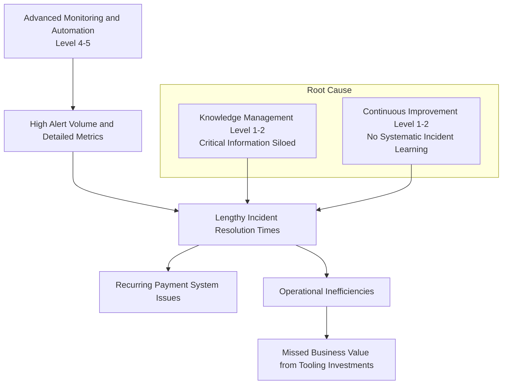

This flowchart illustrates the cascading effects of imbalanced maturity. Advanced monitoring and automation (level 4-5) generate high alert volumes and detailed metrics. However, poor knowledge management (level 1-2) and inadequate continuous improvement (level 1-2) result in prolonged incident resolution times and recurring system issues. These inefficiencies ultimately prevent the organization from unlocking the full value of its technical investments, creating a capability ceiling that hampers overall effectiveness.

### SRE Best Practice: Evidence-Based Investigation

Implementing effective maturity models requires rigorous, evidence-based approaches to ensure accurate assessment and appropriate development:

1. **Comprehensive Capability Decomposition**: Develop detailed breakdowns of each capability dimension into specific, observable characteristics that can be objectively assessed. Create explicit definitions of behaviors, artifacts, and outcomes that define each maturity level within dimensions.

2. **Multi-Source Assessment Methodology**: Implement triangulated evaluation approaches that combine multiple evidence sources: artifact analysis, process observation, outcome measurement, and capability demonstrations. Use diverse assessment methods to verify maturity levels rather than relying solely on self-reporting.

3. **Constraint Analysis**: Conduct systematic identification of capability bottlenecks using dependency mapping between dimensions. Analyze how limitations in specific dimensions constrain the effectiveness of more advanced capabilities, quantifying the impact of these constraints.

4. **Counterfactual Capability Testing**: Perform structured scenario analysis to determine how capability limitations would affect response to different incident types. Use simulation techniques to validate the real-world impact of maturity gaps in specific dimensions.

5. **Progression Validation**: Implement longitudinal measurement of maturity evolution, tracking not just current states but transition effectiveness between levels. Validate that theoretical maturity improvements translate to measurable performance enhancements through before-and-after comparisons.

This evidence-based approach ensures maturity assessments provide accurate diagnosis of capability states rather than subjective impressions or aspirational self-assessment.

### Banking Impact

Implementing comprehensive maturity models delivers specific business benefits in banking environments. Each benefit addresses critical needs unique to the financial sector, ensuring balanced and effective capability evolution:

- 🏦 **Optimized Investment Allocation**: Balanced capability development prevents wasteful over-investment in already-advanced dimensions while highlighting critical limitations that constrain overall effectiveness, ensuring maximum return on improvement resources.

- ⚖️ **Risk Reduction Through Balanced Capabilities**: Eliminating severe maturity imbalances prevents the operational risks created when advanced components are undermined by primitive elements, such as sophisticated automation without corresponding governance.

- 🎯 **Strategic Alignment Enhancement**: Maturity models create a common vocabulary and visual representation of capability states that align executive understanding with technical realities, improving strategic decision quality.

- 🤝 **Acquisition and Integration Facilitation**: Comprehensive capability assessment frameworks enable accurate evaluation of potential acquisition targets and more effective post-merger integration planning based on identified capability gaps.

- ✅ **Regulatory Demonstration**: Structured maturity models provide compelling evidence of systematic capability management for regulatory examinations, demonstrating deliberate evolution rather than reactive improvements.

For global financial institutions managing complex technology landscapes, this holistic approach prevents the performance limitations and risks created by uneven capability development across critical dimensions.

### Implementation Guidance

To implement an effective maturity model in your banking environment, follow these structured steps:

#### Step-by-Step Process Diagram

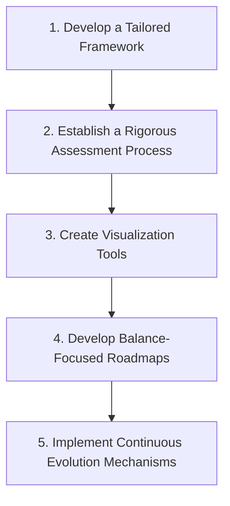

#### Detailed Steps

1. **Develop a Tailored Framework**

   - Customize industry standard maturity models to reflect your specific banking context, operational challenges, and regulatory requirements.
   - Define dimensions with detailed rubrics, providing specific, observable indicators for each maturity level to ensure clarity and consistency.

2. **Establish a Rigorous Assessment Process**

   - Implement structured evaluation methodologies, including artifact review, process observation, performance analysis, and capability demonstrations.
   - Train dedicated assessors in objective evaluation techniques and conduct calibration exercises to maintain consistent ratings across teams.

3. **Create Visualization Tools**

   - Develop specialized dashboards that map your maturity profile across all dimensions.
   - Highlight imbalances, historical progression, and target state comparisons. Include drill-down capabilities to connect high-level ratings to specific evidence and actionable improvement opportunities.

4. **Develop Balance-Focused Roadmaps**

   - Design strategic improvement plans to achieve consistent maturity across dimensions.
   - Prioritize addressing critical limitations while sequencing initiatives to maintain balanced progression. Ensure transition periods do not create operational vulnerabilities.

5. **Implement Continuous Evolution Mechanisms**

   - Establish regular reassessment cycles with formal gates for maturity level advancement.
   - Define clear criteria for progression, including required evidence, performance thresholds, and sustainability demonstrations to prevent regression.

This structured approach helps ensure that your maturity model implementation is not only comprehensive but also actionable, enabling systematic evolution of Integration & Triage capabilities.
