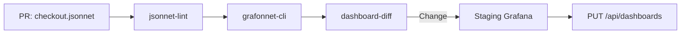
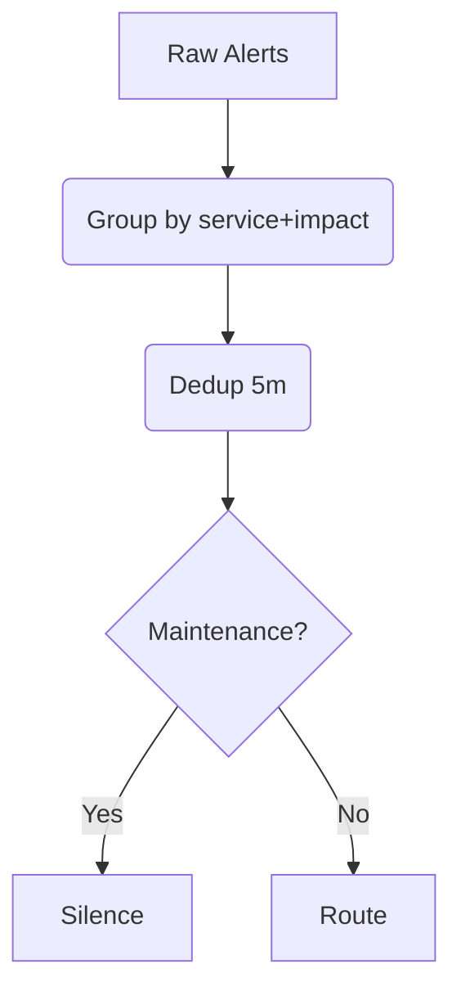

# Day 5 – Intermediate Tier  
*Instructor Persona – **Mei “The Panic Planner” Lin** (SRE Trainer)*

> **Module Goal:** Transform beginner habits into automated guardrails: dashboard‑as‑code, cross‑stack correlation, and smart alert routing.

---

##  Mindset Shift – “Templates Over Tabs”
Beginner habits kept you calm; now you will **template** those habits so CI/CD enforces them.

> *Mei:* “If a dashboard lives only in your browser cache, it’s already rotting.”

---

## 1.  Dashboard‑as‑Code Foundations

| 🎯 **Learning Objective** | ✅ **Takeaway** |
| ------------------------- | --------------------------------------------------------------- |
| Convert manual Grafana, Datadog, and Splunk views into version‑controlled dashboards deployed by CI pipelines. | Dashboards in Git can be linted, code‑reviewed, unit‑tested, and rolled back—just like application code. |

### 1.1  Why Automate Dashboards?
Pixels drift, data sources change, and compliance auditors love diffs. A template prevents silent breakage.

### 1.2  IaC Tool Matrix – *Where the Code Lives*
| Stack | IaC Tool | File/Path in Repo | Pros | Cons |
| ----- | -------- | ----------------- | ---- | ---- |
| **Grafana** | Jsonnet (grafonnet) | `dashboards/checkout/red.jsonnet` | DRY includes | Jsonnet learning curve |
| **Datadog** | Terraform | `infra/datadog/dashboard_checkout.tf` | Unified with infra | Verbose HCL |
| **Splunk** | Splunk Config Generator | `splunk_views/checkout.yaml` | Diff‑friendly YAML | XML output |
| **Elastic** | Kibana Saved Objects | `kibana/exports/checkout.ndjson` | Native export/import | Limited templating |
> *Where this logic executes:* GitHub Actions job **`render-dashboards.yml`** lints & pushes to Grafana API; Terraform applies run in **`terraform-cloud`** or your CI runner.

### 1.3  RED Template (Grafana Jsonnet)  RED Template (Grafana Jsonnet)
```jsonnet
local red(service) = {
  title: service + ' RED',
  rows: [{ panels: [
    panel('Rate',   'sum(rate(http_requests_total{service="'+service+'"}[5m]))'),
    panel('Errors', 'sum(rate(http_requests_total{service="'+service+'",code=~"5.."}[5m]))'),
    panel('Duration p95', 'histogram_quantile(0.95, sum(rate(http_request_duration_seconds_bucket{service="'+service+'"}[5m])) by (le))'),
  ] }],
};
```

### 1.4  End‑to‑End CI Pipeline & Example

*Checkout‑service PR* renders, diff shows changes, pipeline posts screenshot to **#dash‑updates** and deploys on merge.

---

## 2.  Cross‑Stack Correlation Dashboards

| 🎯 **Learning Objective** | ✅ **Takeaway** |
| ------------------------- | ------------------------------------------------ |
| Build one view that overlays Prometheus metrics, Datadog events, and Splunk logs via shared `trace_id`. | One tab per incident means fewer context switches and faster MTTR. |

### 2.1  Universal Join Keys
*Trace ID*, Commit SHA, or Kubernetes UID enables joins across tools.

### 2.2  Mixed Datasource Panel Example
```json
{
  "datasource": "Mixed",
  "targets": [
    { "expr": "rate(http_requests_total{trace_id='$trace'}[1m])", "datasource": "Prometheus" },
    { "query": "index=prod trace_id=$trace | stats count", "datasource": "Splunk" },
    { "query": "avg:system.cpu.user{trace_id:$trace}", "datasource": "Datadog" }
  ]
}
```

> *Mei:* “Great engineers attach trace‑IDs. Great SREs make dashboards speak trace‑ID fluently.”

---

## 3.  Alert Classification & Routing Logic

| 🎯 **Learning Objective** | ✅ **Takeaway** |
| ------------------------- | --------------------------------------------- |
| Implement grouping, deduplication, and escalation paths that cut alert noise by >50 %. | One grouped page beats thirty duplicate pings. |

### 3.1  Metadata Schema & Routing Matrix
| Label | Example | Needed For |
| ----- | ------- | ---------- |
| `service` | checkout | Routing key |
| `impact` | slo_breach | Business impact |
| `environment` | prod | Silence rules |
| `severity` | P1 | Escalation |

| Severity | Env | Impact        | Route             |
| -------- | --- | ------------- | ----------------- |
| P1       | prod| `slo_breach`  | `sre-primary`     |
| P2       | prod| `error_spike` | `team-$service`   |
| P3       | stag| any           | Slack only        |

### 3.2  Dedup Flow & Scenario Walkthrough

*Configuration lives in* **`alertmanager/route.yaml`** (Prometheus) or **PagerDuty Event Orchestrations**.

*Scenario:* 30 `billing_errors_total` alerts collapse into one page to **team‑billing**.* 30 `billing_errors_total` alerts collapse into one page to **team‑billing**.

---

## 4.  Automation Challenges & Mitigations
Even templates have sharp edges—address these early:
| Challenge | Why It Hurts | Mitigation |
|-----------|-------------|------------|
| **Secrets in CI/CD** | Grafana API keys & PD tokens leaked | Store in CI secret vault; scope tokens to read/write dashboards only |
| **Backwards‑Compatibility of Dashboards** | Jsonnet changes break old panels | Version dashboards under `v1/`, `v2/` folders; use feature flags in templates |
| **Trace ID Propagation** | Inconsistent headers across services | Enforce OTEL SDK in service template; add CI lint that rejects builds without tracing middleware |
| **Terraform State Drift** | Manual Datadog edits override TF | Make Datadog UI read‑only for dashboards; run nightly `terraform plan` in check mode |

> *Mei:* “Automation breaks once; secrets leaked break forever—protect them at the pipeline edge.”

---

## 5.  Thought‑Exercise Audit
Spend 15 min considering yesterday’s incident:
1. Which dashboard template was missing?  
2. Did an alert lack `owner` label?  
3. How would deduplication have reduced noise?  
4. Draft a chaos hypothesis to test the fix.

> *Mei:* “Think it through first; scripting is easier after clarity.”

---

## 6.  Recap Checklist
| ✔ | Did you… |
|---|----------|
|   | Commit and render a Grafana template via CI/CD? |
|   | Join Prom, Splunk, Datadog with `trace_id`? |
|   | Configure routing matrix labels? |
|   | Verify dedup collapsed duplicates? |
|   | Write a chaos hypothesis for next sprint? |

---

## 7.  Glossary – Intermediate Tier Terms
| Term | Definition |
|------|-----------|
| **Jsonnet** | Templating language for Grafana dashboards. |
| **HCL** | HashiCorp Configuration Language (Terraform). |
| **OTEL** | OpenTelemetry standard for traces, metrics, logs. |
| **k6** | Load‑testing tool for HTTP scenarios. |
| **Event Orchestration** | PagerDuty webhooks triggered by alert payloads. |
| **SLO** | Service‑Level Objective—reliability target. |

---

Advance to SRE Tier → Self‑Healing Automation & Chaos Drills.
