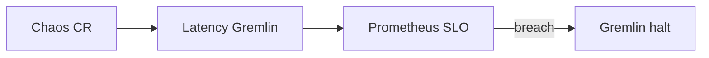

# Day 5 – SRE Tier  
*Instructor Persona – **Mei “The Panic Planner” Lin***

> **Module Goal:** Design systems that recover themselves—self‑healing automations, chaos drills, and capacity proof.

---

## 1.  Self‑Healing Alert Actions

| 🎯 **Learning Objective** | ✅ **Takeaway** |
|---------------------------|-----------------|
| Attach automated runbooks (webhooks, lambdas, scripts) that remediate common P2/P3 alerts within 60 seconds. | A resolved alert that never pages a human is the ultimate MTTR win. |

### 1.1  Where Self‑Healing Works Best
- **Stateless services** – restart or roll pods automatically.  
- **Cache thrash** – invalidate or warm caches on latency spike.  
- **Feature‑flag rollback** – toggle flag off if error rate > N.

### 1.2  Config Location & Secret Handling
| Tool / Layer | File & Repo Path | Secret Strategy |
|--------------|-----------------|-----------------|
| **PagerDuty Event Orchestration** | `pagerduty/orch_checkout.yaml` | PD token in CI vault; rotated monthly |
| **Alertmanager Webhook** | `alertmanager/selfheal.yaml` | Webhook URL fetched from Vault at runtime |
| **AWS Lambda Rollback** | `lambdas/rollback_toggle/index.js` | Flag API key stored in AWS Secrets Manager |
| **Kubernetes Job Restart** | `k8s/jobs/selfheal-restart.yaml` | ServiceAccount restricted to namespace |

> *Mei:* “Treat self‑healing scripts like prod code—store keys once, rotate often.”

### 1.3  PagerDuty Event Orchestration Example
```yaml
actions:
  - description: Auto‑rollback checkout flag
    condition: "payload.severity == 'error' && payload.custom_details.impact == 'slo_breach'"
    target: https://fn.toggle/api/v1/flags/checkout-multibuy/off
    type: webhook
```
*Effect:* Flag rolls off within 30 s; alert auto‑resolves.

### 1.4  Monitoring & Idempotency
| What to Monitor | Metric / Log | Alert When |
|-----------------|--------------|------------|
| **Self‑healing attempts** | `selfheal_attempt_total` counter | ≥ 3 attempts / 10 min |
| **Successful remediations** | `selfheal_success_total` counter | Success rate < 80 % |
| **Webhook latency** | `selfheal_latency_seconds` histogram | p95 > 2 s |

> *Mei:* “Automation that fails silently becomes *anti‑automation*.”

🔖 **Idempotency Rule**  — All remediation scripts must be safe to run twice. Implement Redis mutex `rollback:$env` or use Kubernetes `Jobs` with `--backoff-limit=0`.

---

## 2.  Chaos Engineering Drills & Tooling Paths

| 🎯 **Learning Objective** | ✅ **Takeaway** |
|---------------------------|-----------------|
| Design and execute chaos experiments that validate SLOs and self‑healing paths under failure. | Controlled chaos surfaces weak points before real incidents. |

### 2.1  Chaos Experiment Template
| Field | Example |
|------|---------|
| **Hypothesis** | Checkout latency < 1 s p95 if PaymentSvc slows 30 %. |
| **Blast Radius** | 5 % canary, us‑east only |
| **Steady State** | `checkout_latency_p95` |
| **Injection** | `tc qdisc` 300 ms latency |
| **Abort** | Latency > 1 s for 90 s |

*Manifest lives in* `chaos/experiments/latency_checkout.yaml`. A GitHub Actions job `chaos-test.yml` runs non‑prod chaos nightly.

### 2.2  Gremlin / Litmus Workflow & Safety Switch

*Safety switch:* Gremlin auto‑halts if `checkout_availability < 99 %` or on manual “Kill switch” Slack command `/gremlin halt checkout`.

### 2.3  Using SLOs as Steady State & Abort
- **Steady State Metric** → use production SLO (e.g., `latency_p95 < 1 s`).
- **Abort Condition** → breach ≥ 5 % of SLO budget in 90 s.

> *Mei:* “Chaos must respect business SLOs—break glass, not customers.”

---

## 3.  Capacity & Load Testing

| 🎯 **Learning Objective** | ✅ **Takeaway** |
|---------------------------|-----------------|
| Build repeatable load tests that prove autoscaling thresholds meet 6‑month traffic growth. | Capacity is measured, not guessed. |

### 3.1  Load‑Test Types
| Test | Goal |
|------|------|
| **Smoke** | Verify endpoint responds |
| **Spike** | Sudden 5× traffic burst |
| **Stress** | Increase load until failure to find max | 
| **Soak** | Sustained load 8–24 h for leaks |

### 3.2  k6 Script & CI Path
File: `loadtests/checkout_traffic.js`
```js
import http from 'k6/http';
export let options={stages:[{duration:'2m',target:1000},{duration:'8m',target:1000}]};
export default()=>{http.get('https://shop.example.com/checkout');};
```
CI job `capacity-trend.yml` runs monthly; fails build if p95 latency > SLO.

**Dashboard:** Grafana panel `capacity_trend_over_time` graphs max RPS vs CPU to catch drift.

---

| 🎯 **Learning Objective** | ✅ **Takeaway** |
|---------------------------|-----------------|
| Build repeatable load tests that prove autoscaling thresholds meet 6‑month traffic growth. | Capacity is measured, not guessed. |

### 3.1  k6 Script & CI Path
File: `loadtests/checkout_traffic.js`
```js
import http from 'k6/http';
export let options={stages:[{duration:'2m',target:1000},{duration:'8m',target:1000}]};
export default()=>{http.get('https://shop.example.com/checkout');};
```
CI job `capacity-trend.yml` runs monthly; fails build if p95 latency > SLO.

---

## 4.  Automation Challenges & Mitigations
| Challenge | Why It Hurts | SRE‑Level Mitigation |
|-----------|-------------|----------------------|
| **Secret Rotation** | Webhook keys expire or leak | Monthly GitHub Action `rotate‑pd‑key.yml`; tokens in Vault; roles least privilege |
| **Idempotent Rollbacks** | Duplicate triggers | Redis lock `rollback:$env` gates exec |
| **Chaos Blast Radius Drift** | YAML edited from 5 % ➜ 50 % | Chaos linter enforces `max_traffic:10%` |
| **Capacity Trend Blindness** | Autoscaler stale | k6 monthly trend graph in Grafana |

> *Mei:* “Your automation is only as safe as its guardrails.”

---
| Challenge | Why It Hurts | SRE‑Level Mitigation |
|-----------|-------------|----------------------|
| **Secret Rotation** | Webhook keys expire or leak | Monthly GitHub Action `rotate‑pd‑key.yml`; tokens in Vault |
| **Idempotent Rollbacks** | Duplicate triggers | Redis lock `rollback:$env` gates exec |
| **Chaos Blast Radius Drift** | YAML edited from 5 % ➜ 50 % | Chaos linter enforces `max_traffic:10%` |
| **Capacity Trend Blindness** | Autoscaler stale | k6 monthly trend graph in Grafana |

> *Mei:* “Your automation is only as safe as its guardrails.”

---

## 5.  Reflection & Checklist
| ✔ | Did you… |
|---|---------|
|   | Implement one self‑healing webhook and set **success/failure metrics**? |
|   | Draft a chaos experiment tied to a production SLO? |
|   | Configure at least one spike test in CI? |
|   | Rotate a secret via your vault pipeline with least privilege? |
|   | Feed results into your next **PIR** action‑item list? |

---


## 6.  Glossary – SRE Tier Terms
| Term | Definition |
|------|-----------|
| **Gremlin** | SaaS chaos‑engineering platform. |
| **Litmus** | CNCF chaos toolkit for Kubernetes. |
| **Vault** | HashiCorp secret‑management system. |
| **Event Orchestration** | Conditional automation in PagerDuty. |
| **k6** | Load‑testing tool scripted in JS. |
| **Redis Lock** | Key‑based mutex to avoid duplicate actions. |

---

Day 5 complete — from habits → templates → automated resilience.  
*Mei:* “If recovery is slower than your pipeline, automate faster.”

