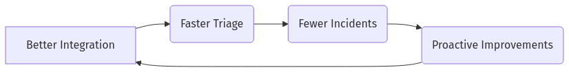

# Day 5 – Beginner Tier
*Instructor Persona – **Mei “The Panic Planner” Lin** (SRE Trainer)*

> **Module Goal:** Build foundational habits for integration awareness and manual triage so every new production‑support engineer can pinpoint *what changed* and *why it matters*—before the pager erupts.

---

## Your Role in the Reliability Chain

As a production‑support engineer you sit at the junction of **systems ↔ users ↔ business value**. Development teams ship features, users click “Buy,” and you ensure the request traverses every service—**without a plume of smoke**.

> *Mei:* “We’re the air‑traffic controllers. Our job isn’t to write planes—it’s to keep them landing safely, change after change.”

### New‑Habit Mindset
> **“I need to learn new habits.”**  
> - Check recent deploys **every shift**  
> - Run a **5‑question drill** on **every alert**  
> - Map integrations **before** hunting stack traces

---

## 1. What Is Integration in Production Support?
“Integration” = any connection among systems, tools, or teams that must work seamlessly in prod.

### 1.1 Key Integration Points You’ll Encounter

| Category            | Typical Examples                                         | Mei’s Reminder                                         |
|---------------------|---------------------------------------------------------|--------------------------------------------------------|
| **System‑to‑System**| Front‑end ↔ back‑end, service‑to‑service, app ↔ DB, 3rd‑party APIs | “If packets cross a boundary, that boundary can fail.” |
| **Tool Integration**| Monitoring, alerting, ticketing, knowledge base, comms  | “Your tools must talk *to* each other, not just *about* each other.” |
| **Team Integration**| Cross‑team comms, escalation paths, shift hand‑offs, stakeholder updates | “Great hand‑offs stop incidents from changing shifts.” |

### 1.2 Practical Reality – E‑Commerce Checkout Case
A single buyer can’t pay. Which integrations could break?
```text
UI  →  Auth  →  Catalog  →  Payment (3rd‑party)  →  Order  →  Inventory
```
Failure at *any* hop bubbles up as “Checkout is broken.” Your map of integrations is your map to root cause.

---

## 2. Tracking Deploys – The First Habit

| 🎯 **Learning Objective** | Spot any deploy/config push in the last 4 hours and tag it with service owner. |
|--------------------------|--------------------------------------------------------------------------------|
| ✅ **Takeaway**          | Most P1s trace back to a recent change—know it before you troubleshoot.         |

### 2.1 System & Tool Queries
| Stack            | One‑liner query                                      |
|------------------|------------------------------------------------------|
| **Grafana/Prom** | `sum by(version)(changes_last_4h)`                   |
| **Datadog**      | `events("tags:deploy status:success")`               |
| **Splunk**       | `index=deploy earliest=-4h | stats count by service,version` |
| **Git CLI**      | `git log --oneline --since="4 hours ago"`            |

### 🔖 New Habit to Adopt
Check deploy feeds at the start of *every* shift; annotate the latest version on your primary dashboards.

---

## 3. What Is Triage?
Triage = **identify → assess → prioritize → route → act** when something breaks.

### 3.1 The Core Triage Process
1. **Issue Identification** – Alert, user ticket, or teammate ping.
2. **Assessment** – Impact, severity, timing, recent changes, dashboards.
3. **Prioritization** – Map to P1…P4.
4. **Initial Response** – Follow runbook or notify stakeholders per priority.
5. **Routing** – Self‑fix, escalate to team, vendor, or dev.

### 3.2 Priority Matrix
| Priority | Definition                    | Immediate Action                |
|----------|-------------------------------|---------------------------------|
| **P1**   | Total outage / critical loss  | Page all‑hands, exec updates    |
| **P2**   | Major feature degraded        | Rapid response team, 30 min updates |
| **P3**   | Partial / minor issue         | Schedule investigation, ticket  |
| **P4**   | Cosmetic / low urgency        | Log and backlog                 |

> *Mei:* “Priority isn’t panic; it’s a contract on response time.”

### 3.3 The 5‑Question Drill (make it muscle memory)
```text
WHAT fired?  WHEN?  SCOPE?  RECENT CHANGE?  OWNER?
```

🔖 **Habit:** Fill this drill out before touching the keyboard.

#### 3.4 Example – Applying the Drill to a Payment Error Spike
| Question         | Answer for Scenario                                 |
|------------------|----------------------------------------------------|
| **WHAT fired?**  | `payment_errors_total` > 5 %                       |
| **WHEN?**        | Started 14:06 UTC, ongoing 6 min                   |
| **SCOPE?**       | 100 % of checkout attempts failing at payment step |
| **RECENT CHANGE?** | `payment‑service v2.4.0` deployed at 14:02 UTC   |
| **OWNER?**       | `team‑payments` (PagerDuty escalation)             |

> *Mei:* “Notice how four of five answers come straight from dashboards & deploy feed—habit makes data pop.”

---

## 4. Integrating the Triage Process with Tools

| Tool Layer      | Integration Goal         | Example                                         |
|-----------------|-------------------------|-------------------------------------------------|
| **Monitoring**  | Surface health, error, latency | Prometheus + Grafana panel w/ deploy annotation |
| **Alerting**    | Route urgency correctly | PagerDuty rules on `severity` label             |
| **Ticketing**   | Central incident record | Auto‑create Jira ticket from alert payload      |
| **Knowledge Base** | Reusable fix steps   | Link runbook in alert description               |
| **Communication** | Cohesive response     | Slack `/incident create` command                |

> *Mei:* “If your tools don’t handshake, your teams will hand‑wave.”

---

## 5. Integration‑Triage Feedback Loop





> *Mei:* “Every post‑incident note is an integration TODO in disguise.”

---

## 6. Essential Skills for Integration & Triage

| Skill                    | Why It Matters              | First Action                        |
|--------------------------|----------------------------|-------------------------------------|
| **Technical Breadth**    | Network → DB → Auth basics | Skim 1 RFC per week                 |
| **Systematic Investigation** | Method beats memory    | Use the *entry‑point → data‑flow* checklist |
| **Effective Communication**  | Clarity speeds help    | Practice “Alert summary” template   |
| **Prioritization & Time**    | Multiple fires, one inbox | Rank by user impact, not noise   |

---

## 7. Practical Integration & Triage Workflow
1. **Alert Received** – payment error spike.
2. **Initial Assessment** – dashboards, deploy log, user impact.
3. **Prioritization** – P1.
4. **Team Assembly** – page on‑call, open incident channel.
5. **Investigation** – logs, 3rd‑party status, end‑to‑end test.
6. **Resolution** – fix API config, validate.
7. **Documentation** – update ticket, K‑base, schedule review.

> *Mei:* “Workflow breeds calm; calm breeds reliability.”

---

## 8. Common Pitfalls (and Habit Fixes)
| Pitfall             | Habit Gap           | Fix                                 |
|---------------------|---------------------|-------------------------------------|
| **Siloed Thinking** | Ignore dependencies | Map upstream/downstream in runbook  |
| **Premature Escalation** | Skip 5‑Q drill | Ask owner only after filling drill  |
| **Alert Fatigue**   | Never prune alerts  | Weekly alert review meeting         |
| **Tribal Knowledge**| No doc              | Add one runbook step each incident  |
| **Reactive‑Only**   | No root cause follow‑up | Schedule post‑incident analysis |

---

## 9. Getting Started – Day 0 Checklist
1. **Map your systems** – high‑level diagram.
2. **Learn the monitoring** – what does “green” look like?
3. **Review past incidents** – look for common themes.
4. **Shadow seniors** – observe live triage.
5. **Start a personal runbook** – jot every command and log path.

> *Mei:* “Write it down today; thank yourself at 2 a.m. tomorrow.”

---

## 10. Glossary – Quick Reference
| Term         | Beginner‑Friendly Definition                                                      |
|--------------|----------------------------------------------------------------------------------|
| **P1, P2, P3, P4** | Incident priority levels (P1 = critical outage … P4 = cosmetic).           |
| **PagerDuty** | SaaS tool that pages on‑call engineers via phone/SMS/push.                      |
| **Prometheus**| Open‑source metrics database & alert engine.                                    |
| **Grafana**   | Dashboard UI for Prometheus and many other data sources.                        |
| **Datadog**   | SaaS observability platform for metrics, logs, traces.                          |
| **Splunk**    | Log aggregation & search platform for deep forensics.                           |

---

## 11. Conclusion – The Integration Mindset
*See beyond symptoms, anticipate cascades, communicate clearly, and build resilience.* By practicing these habits every shift, you transition from reactive firefighter to proactive guardian of reliability.

---

