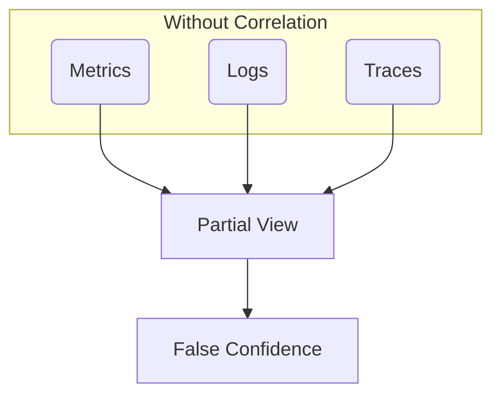
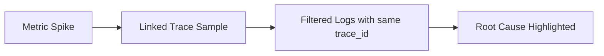

# 🧱 **Day 5: Signal Correlation & Dashboarding**

**Character:** Hector – Mexico City  
**Style:** Brutal. Practical. Thinks “data without insight” is a war crime.  
**Vibe:** “If your dashboard makes me guess what’s wrong, it’s art, not engineering.”

---

## 🎯 Learning Objectives

### 🔍 Beginner
- Recognize the 3 signal types (metrics, logs, traces) on a single dashboard  
- Understand the need for correlation IDs and common tags

### 🧩 Intermediate
- Build dashboards that show *cause*, not just *effect*  
- Use tags (e.g. `trace_id`, `request_id`) to link logs and traces with metrics

### 💡 SRE-Level
- Architect dashboards for rapid root cause analysis  
- Use dashboards to reduce time-to-detect (TTD) and time-to-recover (TTR)

---

## 💥 Incident Hook: “The Dashboard That Lied”

> “A service went down. Dashboard said CPU was green. Latency? Normal. But users were timing out.  
> Logs showed retries. Traces showed downstream failure.  
> Metrics said nothing—because they weren’t tagged.  
> We had signals, but no *story*. Took us 4 hours to root cause what could’ve been found in 6 minutes.”

---

## 🧠 Core Concepts

### 🔹 Signals Without Correlation Are Just Data

> You need shared context—`trace_id`, `request_id`, or `session_id`—to correlate.

---

### 🔹 Correlated Dashboard Flow

> One metric alert → one trace → a page of logs.  
> That’s **signal threading**, not dashboard gazing.

---

### 🔹 Anatomy of a Useful Dashboard

- 🔹 Top-Level: SLO View (latency, errors, availability)  
- 🔹 Mid-Level: Trace visualizer / log count spike  
- 🔹 Bottom-Level: Filterable log panel (e.g., request_id, user_id)

---

## 🧪 Simulation Exercise

**You receive:**
- Screenshot of a Prometheus dashboard (RED metrics)
- Link to a trace with 4 spans (Service A → Service B → DB)
- Snippet of logs (JSON format, includes `trace_id`, `status`, `message`)

📌 **Task:**
- Find what triggered the alert
- Trace it back to the log line with the error
- Identify which component is failing, and why

---

## 🛠 Tool Concepts (No Deployment Needed)

### Prometheus + Grafana + Jaeger + Fluentbit

- Grafana can embed:
  - Prometheus panels (query: `rate(errors_total[5m])`)
  - Logs from OpenSearch (filter: `trace_id: abc123`)
  - Traces from Jaeger

🧠 **Tag Everything Consistently:**
- `request_id`
- `trace_id`
- `user_id` (coarse-grained)

---

## 🧰 Metrics vs Logs vs Traces Quick Reference

| Signal | Good For | Not Good For |
|--------|----------|--------------|
| Metrics | Trends, SLOs | Root cause detail |
| Logs | Detail, audit | Aggregation, trends |
| Traces | Request mapping | System-wide monitoring |

---

## 🕳️ Common Pitfalls

- Having all three signals—but no way to correlate them  
- Dashboards with “pretty graphs” and no context  
- Logs stored without indexing important fields  
- Alerting on individual metrics without considering request flow

---

## 📜 Hector’s Commandments

1. “Every alert should land on a dashboard that explains itself.”  
2. “The first dashboard is for detection. The second is for diagnosis.”  
3. “Uncorrelated signals are just noise in matching colors.”

---

## 🤝 Handoff to Tomorrow

> “Felix is coming back. Now that you know *how* to correlate signals, he’s going to show you what it means to *define expectations*.  
> That’s right—SLOs. SLIs. And yes, error budgets.”

---

## 📦 Artifacts for Day 5

- ✅ Mermaid diagrams:
  - Signal merge flow
  - Alert-to-cause trace
- ✅ Screenshot references for dashboards
- ✅ Sample trace + logs with `trace_id`
- ✅ Simulation scenario (root cause analysis)
- ✅ Commandments, objectives, pitfalls

