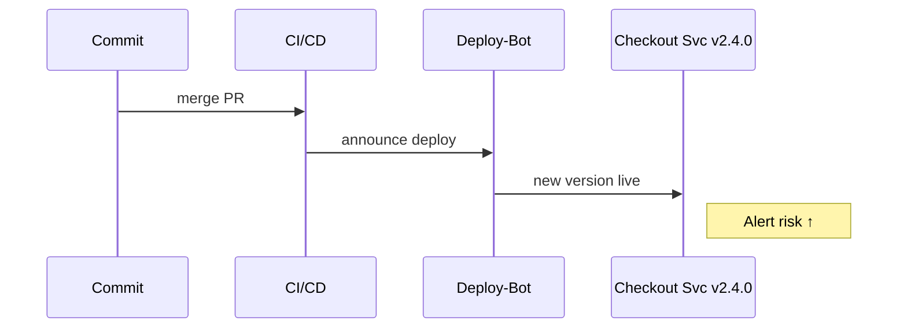
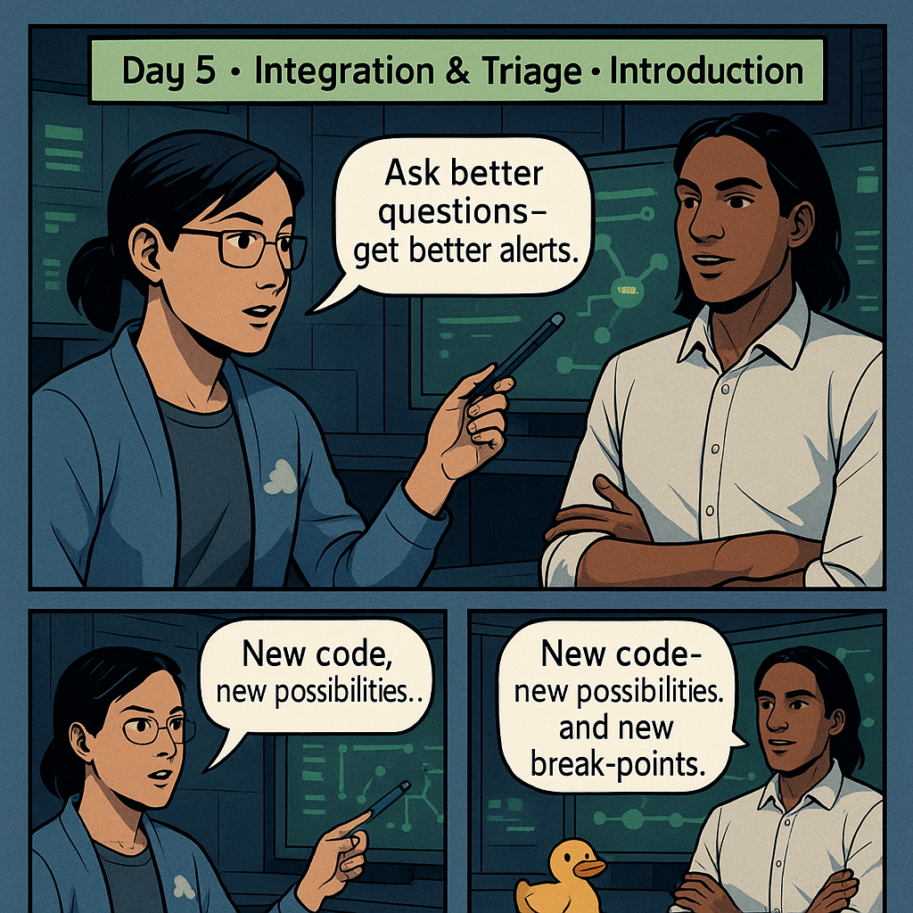
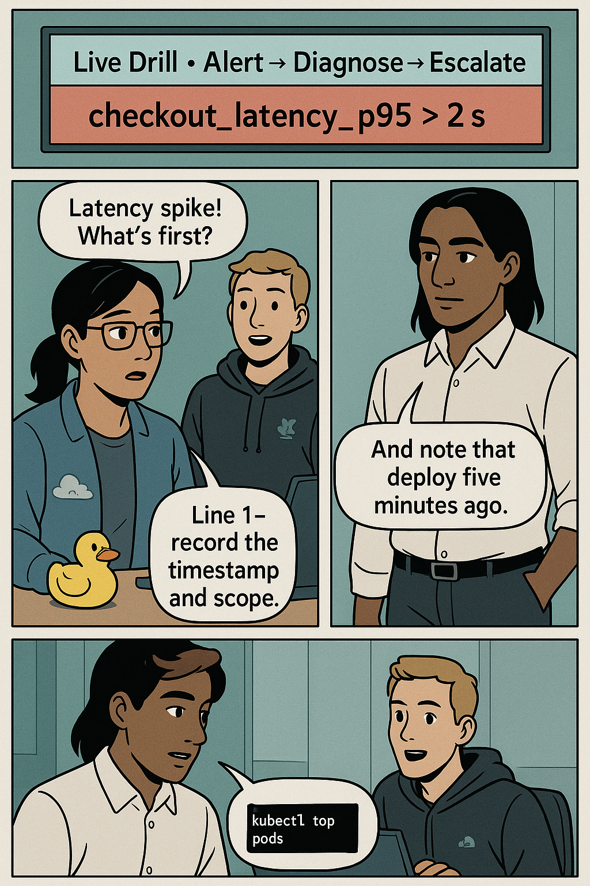
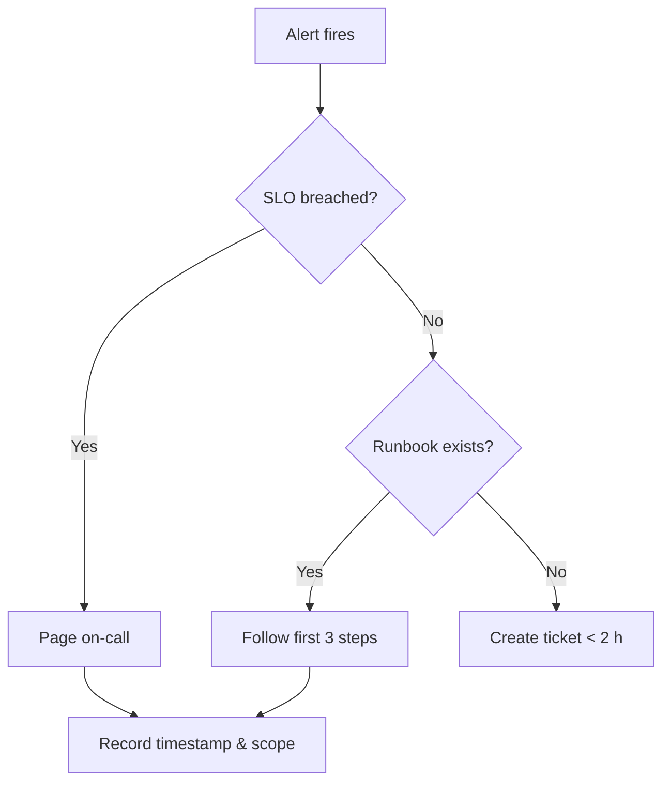
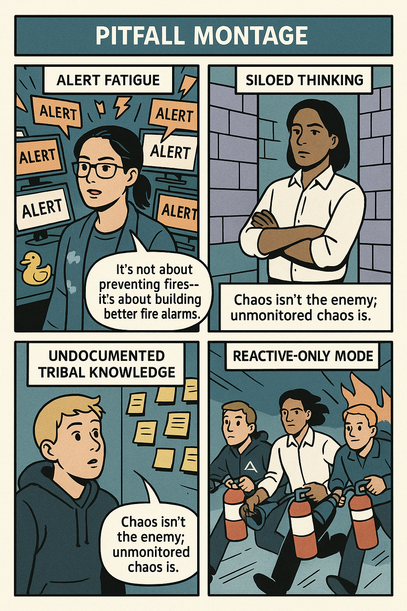
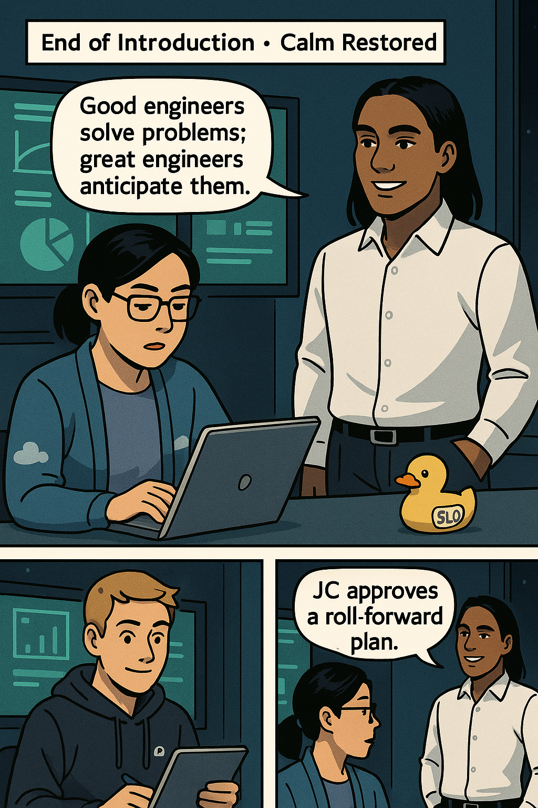

# Day 5 – Integration & Triage

>*Mentor – Mei "The Panic Planner" Lin*

**Understanding Your Role in the Reliability Chain**

As a professional, you stand at the critical intersection between systems and users. Your ability to effectively integrate various components and triage issues when they arise forms the foundation of reliable service delivery. This guide will help you develop the essential mindset and skills needed to excel in integration and triage tasks.

---

## What Counts as an *Integration* in SRE?

In production, "integration" is anything new that touches prod:

| Type             | Example                         | Risk cue             |
| ---------------- | ------------------------------- | -------------------- |
| **Deployment**   | `checkout-service v2.4.0` ships | Version drift → 500s |
| **Feature Flag** | `discount_multi_buy = ON`       | Latency jump         |
| **Config Push**  | DB timeout 1 s → 100 ms         | Connection churn     |
| **Tool Hook**    | Prometheus → PagerDuty          | Mis‑paged alerts     |
| **Infra Swap**   | S3 → GCS bucket                 | ACL mismatch         |

> *Mei:* "In SRE, we don't hope for the best—we monitor for the worst."

---

### 🔍 Diagram 1 – Change Pipeline to Prod

*Shows **where** a change is born and **when** support first sees it.*

---

## Panel 1 – *Integration: The New Code Drop*

<table>
  <tr>
    <td style="width:50%; vertical-align:top; padding-right:16px;">
      <strong>🎯 Learning Objective</strong> 
      Spot fresh changes and record who owns them.  
      <strong>✅ Takeaway</strong> 
      Every incident autographs itself with a deploy timestamp.
    </td>
    <td style="width:50%;">
      
    </td>
  </tr>
</table>

> **Mei's Monologue:**  
> *Track the change before the change tracks you.*

---

## Panel 2 – *Triage Drill*

### Scene Description
*Alert banner turns **red**: `checkout_latency_p95 > 2 s`.  
Mei stays calm; JC opens the runbook; rookie Alex types `kubectl top pods`.*

<table>
  <tr>
    <td style="width:50%; vertical-align:top; padding-right:16px;">
      <strong>🎯 Learning Objective</strong> 
      Execute the first three runbook steps and decide when to escalate.  
      <strong>✅ Takeaway</strong> 
      Triage = symptom → scope → timestamp → owner.
    </td>
    <td style="width:50%;">
      
    </td>
  </tr>
</table>

> **Mei's Monologue:**  
> *Triage is choreography—repeat the steps until calm returns.*

---

### 🔍 Diagram 2 – First‑Response Decision Tree

*At a glance: fix, escalate, or file.*

---

## Panel 3 – *Pitfall Montage*

### Scene Description
*A 4‑grid comic panel. Clockwise from top‑left:  (1) **Alert Fatigue** – Mei buried under flashing alerts. (2) **Siloed Thinking** – JC in a walled‑off cubicle. (3) **Undocumented Tribal Knowledge** – Alex staring at sticky‑note tower. (4) **Reactive‑Only Mode** – all three sprinting with fire extinguishers.  
Central caption: "Chaos isn't the enemy; unmonitored chaos is."*

<table>
  <tr>
    <td style="width:50%; vertical-align:top; padding-right:16px;">
      <strong>🎯 Learning Objective</strong> 
      Recognize common support pitfalls that amplify incidents.  
      <strong>✅ Takeaway</strong> 
      Better fire alarms beat bigger fire drills.
    </td>
    <td style="width:50%;">
      
    </td>
  </tr>
</table>

> **Mei's Catch‑phrase:**  
> *"It's not about preventing fires—it's about building better fire alarms."*

---

## Panel 4 – *Integration Summary*

### Scene Description
*Night outside. Dashboards return to **green**.  
Mei closes her notebook; Murphy now sports a tiny **SLO** sticker.  
Alex files post‑drill notes; JC approves the roll‑forward plan.*

<table>
  <tr>
    <td style="width:50%; vertical-align:top; padding-right:16px;">
      <strong>🎯 Learning Objective</strong> 
      Link integration vigilance with disciplined triage to cut MTTR.  
      <strong>✅ Takeaway</strong> 
      Watch every change, follow the drill, and midnight pages shrink.
    </td>
    <td style="width:50%;">
      
    </td>
  </tr>
</table>

> **Mei's Monologue:**  
> *Reliability begins with curiosity about change and ends with calm, repeatable response.*

---

### Quick Reflection

Fill in before moving on:

| Prompt                           | Your note |
| -------------------------------- | --------- |
| **Change I tracked today**       |           |
| **Runbook step I executed**      |           |
| **Owner I paged (if any)**       |           |
| **One thing I'll automate next** |           |

---

*Next: Beginner section dives into dashboards, logs, and a deeper triage playbook.*

