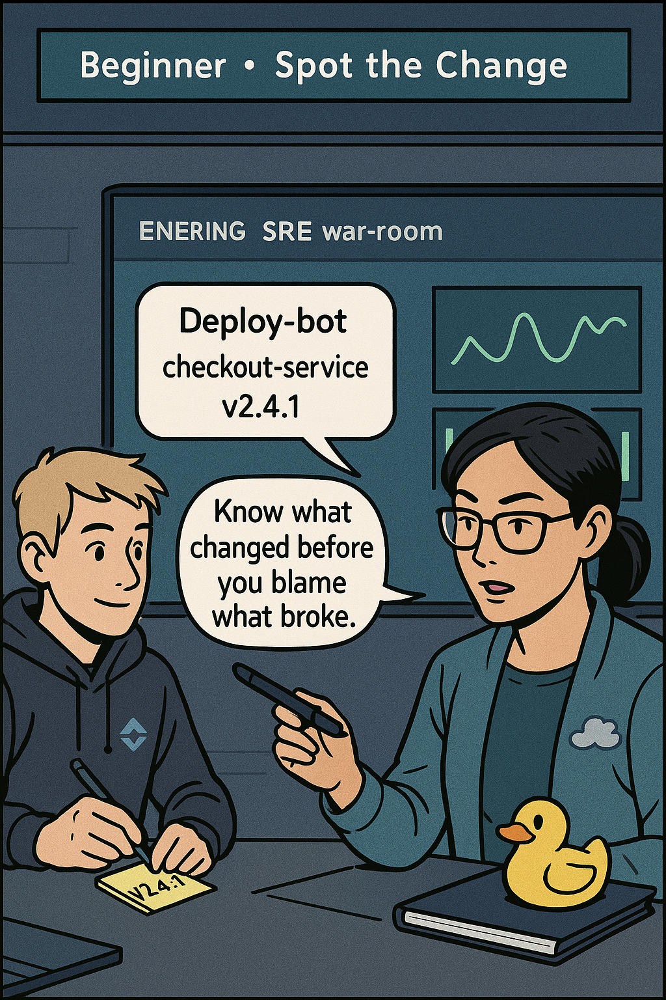
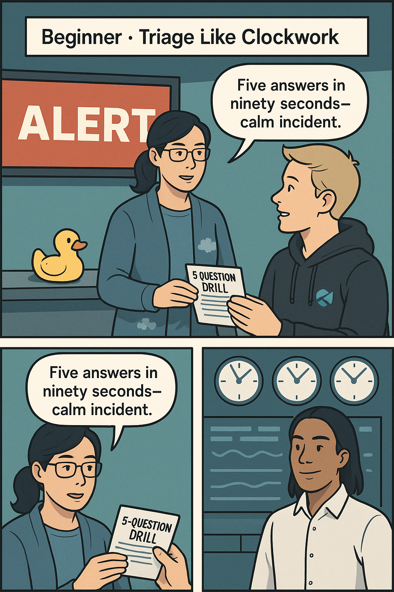
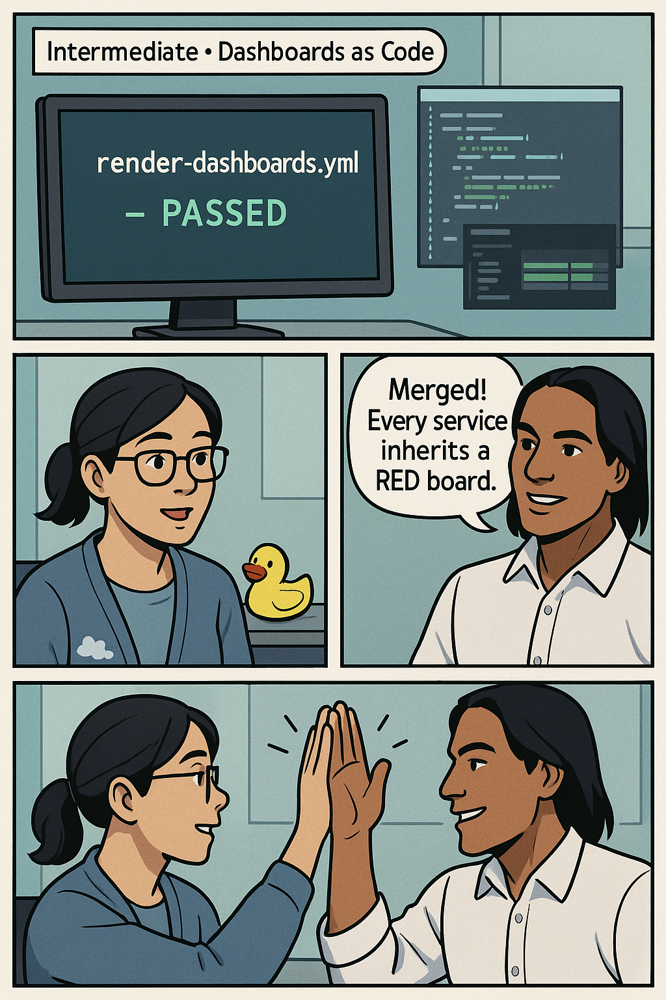
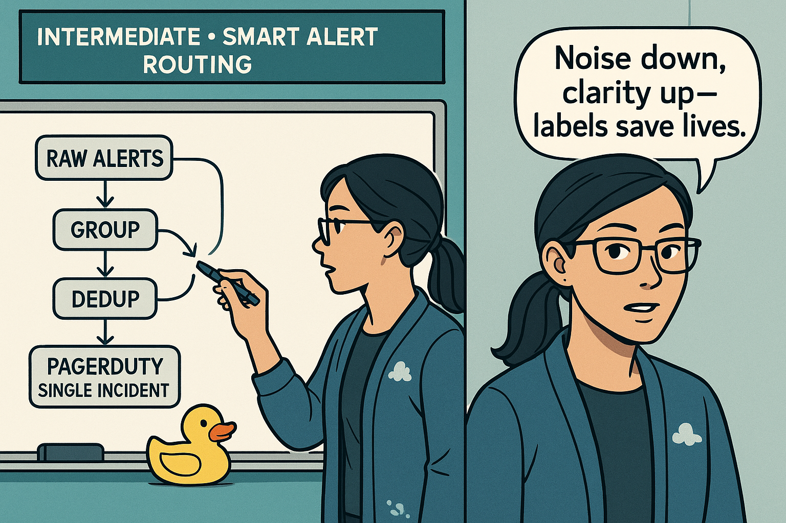
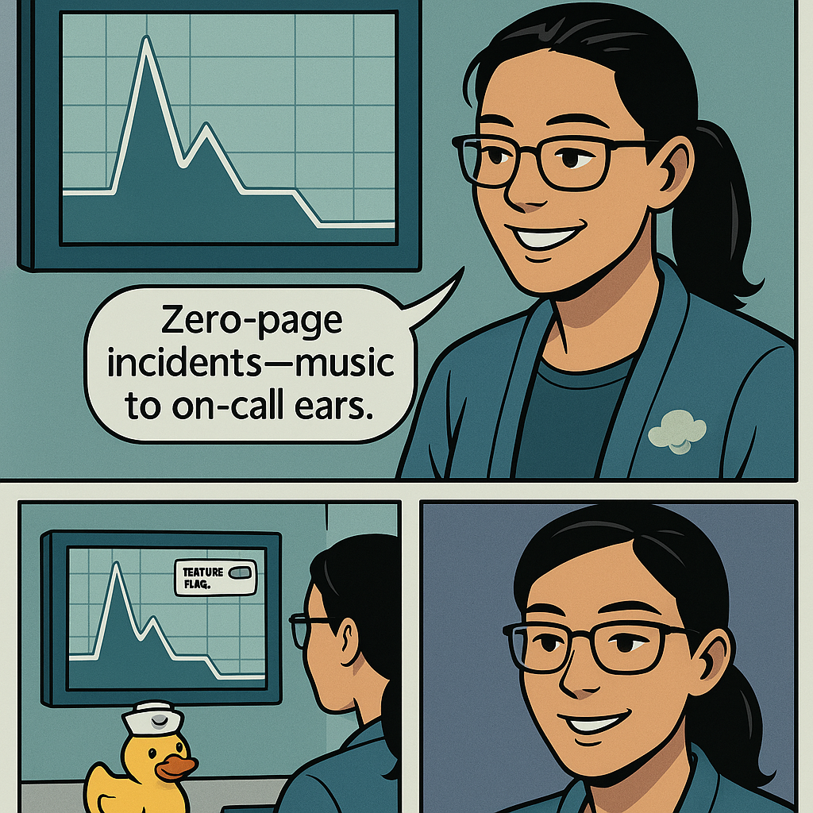
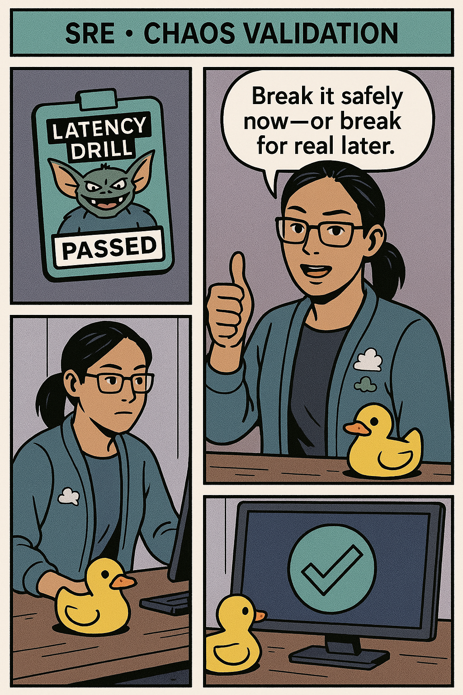
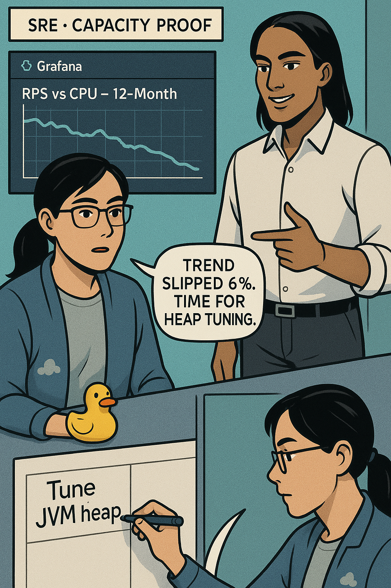
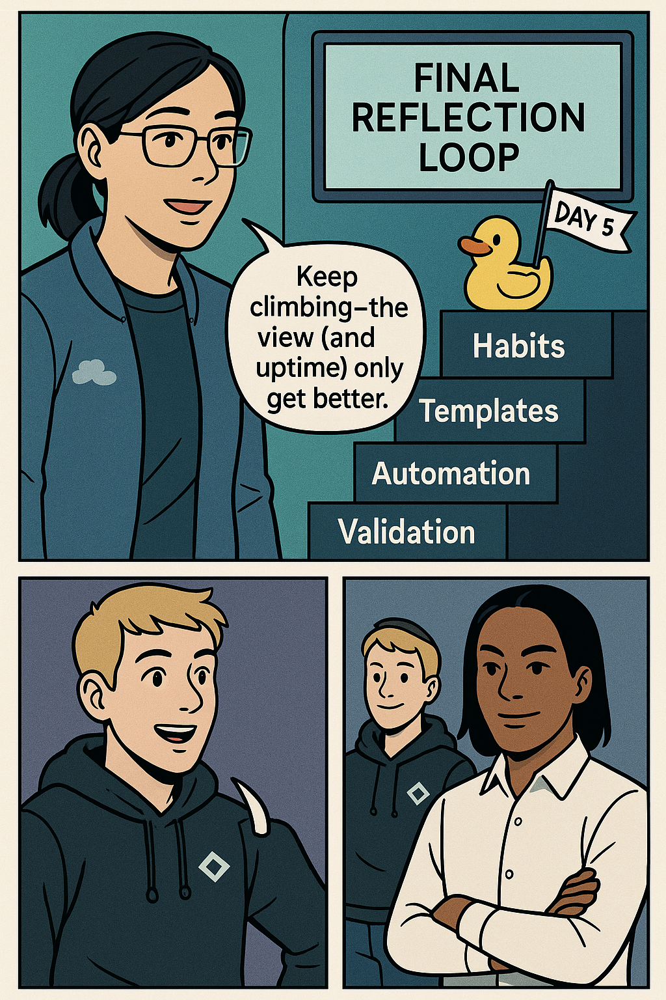

# Day 5 — Integration & Triage **Grand Summary**  
*Graphic‑Novel Edition • Mentor: **Mei “The Panic Planner” Lin***

---

## • Opening Voice‑over  
Before the first panel appears, Mei narrates in an off‑screen caption:

> *“Reliability is a staircase: first you crawl with habits, then you walk with templates, then you run with automation. Tonight, we look down from the top—so you can climb faster tomorrow.”*

---

## Panel 1 — Beginner • **Spot the Change** <!-- {{panel:1}} -->
<table>
  <tr>
    <td style="width:50%; vertical-align:top; padding-right:16px;">
      <strong>🎯 Learning Objective</strong><br>
      Master the habit of checking recent deployments, feature flags and config pushes <em>before</em> touching an alert.<br><br>
      <strong>✅ Takeaway</strong><br>
      More than 70 % of production incidents trace back to a fresh change. Track the breadcrumb, trace the break.
    </td>
    <td style="width:50%;">
      
    </td>
  </tr>
</table>

### Narrative
Alex (rookie SRE) bursts into the war‑room: “Error rate on checkout jumped!”  Mei raises a finger, tapping a deploy dashboard that lists _checkout‑service v2.4.1_ shipped three minutes earlier. “First habit,” she says. “Find the change; half the time, it <em>is</em> the cause.”  She copies the version number into a sticky note titled **Root‑Cause Suspects**.

### Practical Nugget — 60‑Second Deploy Audit
1. **Prometheus/Grafana** — Query `changes_last_4h{service="checkout"}`.  
2. **Datadog Events** — Filter `tags:deploy service:checkout`.  
3. **Splunk** — `index=deploy service=checkout earliest=-4h`.  
4. **Flag Service** — `flagctl list --service checkout`.

*If no change appears, your suspect list moves to dependencies; but 7 times in 10, this tiny audit saves twenty minutes of blind log‑grepping.*

---

## Panel 2 — Beginner • **Triage Like Clockwork** <!-- {{panel:2}} -->
<table>
  <tr>
    <td style="width:50%; vertical-align:top; padding-right:16px;">
      <strong>🎯 Learning Objective</strong><br>
      Apply the 5‑Question Drill in under 90 seconds to every new alert.<br><br>
      <strong>✅ Takeaway</strong><br>
      Symptom → Scope → Timestamp → Change → Owner. Nail those and panic fades.
    </td>
    <td style="width:50%;">
      
    </td>
  </tr>
</table>

### Narrative
Lat‑ency alarms flash red. Mei slides a laminated card to Alex:
```text
WHAT?  WHEN?  SCOPE?  RECENT CHANGE?  OWNER?
```
Together they fill it:
* **WHAT:** `checkout_latency_p95` breached 2 s.  
* **WHEN:** Started 21:06 UTC, now 4 m long.  
* **SCOPE:** 18 % of regional traffic.  
* **RECENT CHANGE:** v2.4.1 at 21:02.  
* **OWNER:** team‑checkout (PagerDuty).

Alex exhales—first wave of uncertainty gone.

### Practical Nugget — Triage Clipboard Template
Keep a clipboard (physical or Notion) with the drill, plus empty fields for **Incident #**, **Slack Channel**, **Ticket ID**. Filling them forces structure when adrenaline spikes.

---

## Panel 3 — Intermediate • **Dashboards as Code** <!-- {{panel:3}} -->
<table>
  <tr>
    <td style="width:50%; vertical-align:top; padding-right:16px;">
      <strong>🎯 Learning Objective</strong><br>
      Convert ad‑hoc Grafana boards into Jsonnet templates rendered by CI.<br><br>
      <strong>✅ Takeaway</strong><br>
      A dashboard committed to Git gets linted, diffed, and rolled back like any other deploy.
    </td>
    <td style="width:50%;">
      
    </td>
  </tr>
</table>

### Narrative
JC merges **PR #482** adding `dashboards/checkout/red.jsonnet`. CI job **`render-dashboards.yml`** runs `jsonnet-lint`, renders JSON, diffs against Grafana, and posts a screenshot to **#dash‑updates**. Alex sees that the new board already carries deploy annotations—no more midnight pixel‑drift.

### Practical Nugget — Minimal Jsonnet Pattern
```jsonnet
local svc = std.extVar('service');
local p(t,e) = {title:t,type:'graph',targets:[{expr:e}]};
{
  title: svc + ' RED',
  tags: ['red', svc],
  rows: [{ panels: [
    p('Rate','sum(rate(http_requests_total{service="'+svc+'"}[5m]))'),
    p('Errors','sum(rate(http_requests_total{service="'+svc+'",code=~"5.."}[5m]))'),
    p('Duration p95','histogram_quantile(0.95, sum(rate(http_request_duration_seconds_bucket{service="'+svc+'"}[5m])) by (le))')
  ]}]
}
```
Commit once; parametrize for every service.

---

## Panel 4 — Intermediate • **Smart Routing, Silent Noise** <!-- {{panel:4}} -->
<table>
  <tr>
    <td style="width:50%; vertical-align:top; padding-right:16px;">
      <strong>🎯 Learning Objective</strong><br>
      Group and deduplicate alerts, then route by severity & owner labels.<br><br>
      <strong>✅ Takeaway</strong><br>
      One grouped page beats thirty duplicate pings—engineers stay fresh, MTTR shrinks.
    </td>
    <td style="width:50%;">
      
    </td>
  </tr>
</table>

### Narrative
During a minor spike, Alertmanager receives 30 identical payloads. Routing rules group by `service+impact`, hold 30 s, dedup 5 min, and page **team‑billing** <em>once</em>. Slack thread shows just one noise‑free incident card.

### Practical Nugget — Routing Snippet
```yaml
route:
  group_by: [service, impact]
  group_wait: 30s
  group_interval: 5m
  receiver: pagerduty
```
Add silence windows via `--maintenance` label so deploy‑time flaps don’t page.

---

## Panel 5 — SRE • **Alerts That Fix Themselves** <!-- {{panel:5}} -->
<table>
  <tr>
    <td style="width:50%; vertical-align:top; padding-right:16px;">
      <strong>🎯 Learning Objective</strong><br>
      Attach webhooks or Lambdas that roll back feature flags or restart pods within 60 seconds of a P2/P3 alert.<br><br>
      <strong>✅ Takeaway</strong><br>
      Zero‑page incidents = true self‑healing success.
    </td>
    <td style="width:50%;">
      
    </td>
  </tr>
</table>

### Narrative
A `billing_errors_total` spike triggers PagerDuty Event Orchestration. Webhook `https://fn.toggle/api/v1/flags/billing-calc/off` fires, flag rolls back, error rate drops in 20 s. A metric `selfheal_success_total{service="billing"}` increments, and no human was paged.

### Practical Nugget — Self‑Healing Metrics
* `selfheal_attempt_total{service}`  
* `selfheal_success_total{service}`  
* Alert if `rate(success_total)/rate(attempt_total) < 0.8` over 10 m.

---

## Panel 6 — SRE • **Prove It with Chaos** <!-- {{panel:6}} -->
<table>
  <tr>
    <td style="width:50%; vertical-align:top; padding-right:16px;">
      <strong>🎯 Learning Objective</strong><br>
      Run latency‑injection experiments to validate SLOs and self‑healing under failure.<br><br>
      <strong>✅ Takeaway</strong><br>
      Controlled chaos beats surprise chaos.
    </td>
    <td style="width:50%;">
      
    </td>
  </tr>
</table>

### Narrative
Nightly non‑prod chaos job injects 300 ms latency to PaymentSvc for 5 % of canary users. If `checkout_latency_p95` breaches 1 s for over 90 s, the experiment auto‑halts. Dashboard lights green: **Chaos Passed**—self‑healing flag rollback handled the slowdown.

### Practical Nugget — Safety Switch Command
`/gremlin halt checkout` in Slack stops any running experiment; only `sre-primary` role can invoke it.

---

## Panel 7 — SRE • **Measure Capacity, Avoid Surprises** <!-- {{panel:7}} -->
<table>
  <tr>
    <td style="width:50%; vertical-align:top; padding-right:16px;">
      <strong>🎯 Learning Objective</strong><br>
      Run monthly spike & soak tests via k6 and graph capacity trends.<br><br>
      <strong>✅ Takeaway</strong><br>
      Autoscalers fail quietly—capacity graphs catch them early.
    </td>
    <td style="width:50%;">
      
    </td>
  </tr>
</table>

### Narrative
CI job **`capacity-trend.yml`** ramps to 1 000 RPS, sustains 8 minutes, and plots `rps_vs_cpu` in Grafana. Trendline shows capacity slipped 6 % this month: GC pauses longer. An action item enters next sprint—tune JVM heap.

### Practical Nugget — Load‑Test Types Quick Ref
* **Spike:** sudden 5× traffic—tests autoscaler speed.  
* **Stress:** grow until failure—find absolute max.  
* **Soak:** 12 h steady—exposes memory leaks.

---

## Panel 8 — **Reflection Loop & Call to Action** <!-- {{panel:8}} -->
<table>
  <tr>
    <td style="width:50%; vertical-align:top; padding-right:16px;">
      <strong>🎯 Learning Objective</strong><br>
      See the staircase: Habits → Templates → Automation → Validation.<br><br>
      <strong>✅ Takeaway</strong><br>
      “Track, template, test, and teach—continuous SRE growth.”<br><br>
      **Next Steps**  
      1. Pick one noisy alert ➜ add `service` & `owner` labels.  
      2. Convert one freestyle dashboard ➜ Jsonnet.  
      3. Draft a self‑healing webhook ➜ count success rates.  
      4. Define a chaos hypothesis tied to an SLO.
    </td>
    <td style="width:50%;">
      
    </td>
  </tr>
</table>

---

## Epilogue Caption  
> *Mei:* “Today you practiced watchfulness, codified vigilance, and automated calm. Keep climbing.”

---

*End of Day 5 Graphic‑Novel Summary*

