# Chapter 1: From Monitoring to Observability - The SRE Mindset Shift

## Chapter Overview

Welcome to the SRE mind-bender where your dashboards are lying, your “green” status is a false idol, and that warm, fuzzy feeling you get staring at CPU graphs is just Stockholm syndrome. This chapter is a full-throated takedown of old-school monitoring, where “all systems nominal” means absolutely nothing to the real-world user whose wire transfer just vanished into the digital void. We’ll torch the binary thinking that’s been holding your incident response hostage, and drag you—kicking and screaming—into the observability future. If you like your comfort zone, close this tab. If not, buckle up: we’re going to dismantle the Green Wall, rewire your brain for spectrum thinking, and teach you how to actually measure what matters. Spoiler: it’s not your server’s resting heart rate.

______________________________________________________________________

## Learning Objectives

- **Identify** the glaring limitations of traditional monitoring and recognize the Green Wall Fallacy before it bites you… again.
- **Differentiate** between system health myths and real customer impact using evidence, not wishful thinking.
- **Shift** from binary “up/down” delusions to spectrum-based, nuanced service health assessments.
- **Map** end-to-end customer journeys instead of navel-gazing at component dashboards.
- **Implement** black-box monitoring to focus on symptoms as experienced by actual users, not just the internals you wish you’d instrumented.
- **Design** proactive observability into systems from the start—because duct-taping metrics post-mortem is not a strategy.
- **Drive** operational decisions with hard data, not gut feelings or the loudest voice at the table.

______________________________________________________________________

## Key Takeaways

- Green dashboards are comfort blankets for the deluded. Users don’t care if your CPU is happy—they care if their money moves.
- If you trust internal metrics over customer complaints, you deserve the late-night incident bridges that follow.
- Binary “up/down” thinking is for mainframes and dinosaurs. Modern systems degrade, fail in weird ways, and laugh at your thresholds.
- Component health ≠ customer success. If you can’t trace a payment from login to settlement, you’re flying blind.
- Chasing root cause while users suffer is malpractice. Fix the symptom fast; the autopsy can wait.
- Observability bolted on after go-live is like retrofitting airbags post-crash. Design for visibility or prepare to eat regulatory fines.
- “Feels unstable” isn’t an argument. If you can’t prove it with SLOs and error budgets, you’re just stalling progress.
- Regulators, clients, and your own reputation don’t care about your excuses. They care about actual outcomes and documented proof.
- Your biggest risks live at the boundaries: between teams, between systems, and between what you measure and what actually happens.
- In SRE, comfort is the enemy. Question everything, especially your own dashboards.

______________________________________________________________________

## Panel 1: The Green Wall Fallacy - When All Dashboards Lie

### Scene Description

A tired banking system engineer is sitting in a dimly lit operations center at 2:57 AM, surrounded by multiple monitors displaying green status indicators across all systems. His phone is buzzing with alerts about customer complaints, while a confused look crosses his face as he mutters, "But everything looks green..."

Below is a conceptual layout of the scene:

```
+---------------------------------------------------+
|                    Operations Center              |
|                                                   |
|   [Monitor 1: Green][Monitor 2: Green][Monitor 3] |
|   [Green Indicators]     [Green Indicators]      |
|                                                   |
|   Engineer: "But everything looks green..."       |
|   Face: 😕 Confused                               |
|                                                   |
|   Phone Buzzing:                                  |
|   Alert: "Customer complaints rising!"            |
|                                                   |
|   Chat Screen:                                    |
|   "URGENT: Corporate customers reporting          |
|   payment failures, but all our monitors          |
|   show green!"                                    |
+---------------------------------------------------+
```

The dim lighting, the persistent green dashboards, and the buzzing alerts create a stark contrast, highlighting the engineer’s struggle to reconcile system metrics with the reality of user-facing failures.

### Teaching Narrative

The transition from traditional monitoring to SRE thinking begins with understanding the limitations of traditional dashboards. The Green Wall Fallacy occurs when your monitoring dashboards show all systems as healthy (green) while real users experience failures. This disconnect happens because traditional monitoring focuses on system-level metrics (CPU, memory, disk space) rather than customer experience metrics.

In the SRE mindset, we recognize that a system can have perfect uptime, optimal resource utilization, and still be completely failing for users. This fundamental realization—that monitoring internal system metrics is not sufficient to ensure service reliability—is the first step in the journey from production support to Site Reliability Engineering.

### Common Example of the Problem

During a critical end-of-month payment processing cycle for a major corporate banking platform, the operations team started receiving urgent calls from corporate clients unable to initiate wire transfers. The support tickets rapidly escalated to the CIO's office as high-value transactions failed to process, potentially impacting market liquidity positions.

Despite the growing urgency, when the on-call engineer examined the monitoring dashboards, everything appeared normal—all servers showed healthy CPU and memory utilization, network connectivity was stable, and database connections remained within normal parameters. Confident in the "all green" status, the team initially dismissed the issue as external or unrelated, leading to a delay in addressing the root cause.

Below is a timeline diagram illustrating the sequence of events and the delays caused by reliance on misleading dashboards:


Eventually, after 45 critical minutes, an engineer decided to directly test the payment API endpoint from outside the bank's network. This step immediately revealed that the authentication service was returning HTTP 500 errors to external requests while reporting successful health checks to internal monitoring systems. The internal health checks were testing a different path than the one used by customer traffic.

This example highlights the danger of relying solely on traditional system-level monitoring, which can create a false sense of security. By the time the root cause was identified, customer impact had escalated significantly, underlining the need for monitoring that reflects real user experiences.

### SRE Best Practice: Evidence-Based Investigation

The SRE approach to this scenario emphasizes evidence over indicators. By focusing on actionable steps, teams can ensure their investigative process is thorough and aligned with user experience.

#### Best Practices Checklist

- **1. Prioritize User Reports**\
  Treat user reports as the most reliable indicator of service health. Always assume that users are experiencing the actual outcomes of the service, while monitoring reflects only what has been instrumented.

- **2. Test From The Outside**\
  Use synthetic transactions to simulate real user journeys. External tests, like running payment API calls from outside the internal network, can detect issues that internal health checks might miss.

- **3. Validate Across Multiple Data Sources**\
  Combine insights from diverse data streams, such as application logs, network traffic, and external monitoring tools, to uncover gaps or discrepancies in your monitoring coverage.

- **4. Follow The Full Transaction Path**\
  Map and trace real transaction flows end-to-end. Focus on the customer-facing paths instead of relying solely on simplified internal checks that may not reflect actual user experiences.

- **5. Challenge Assumptions Regularly**\
  Reassess whether your monitoring systems adequately represent the customer experience. Look for blind spots and question the completeness of your instrumentation to uncover hidden risks.

#### Visual Aid: Evidence-Based Investigation Flow


By following this checklist, SREs can transition from reactive monitoring to a proactive, evidence-based approach that prioritizes user experience over system-level indicators.

### Banking Impact

The Green Wall Fallacy in banking environments can have severe consequences. The table below organizes these impacts for clarity:

| **Impact Category** | **Impact Description** | **Example Consequences** |
| --------------------------- | --------------------------------------------------------------------------------------------------------- | -------------------------------------------------------------------------------------------------------- |
| **Financial Losses** | Failed payment processing directly impacts revenue as transaction fees are lost. | Loss of transaction fees and potential penalty payments for missed settlement deadlines. |
| **Liquidity Risks** | High-value transfer failures create liquidity shortfalls, cascading through the financial system. | Systemic risks during peak processing periods, impacting corporate clients' ability to meet obligations. |
| **Regulatory Consequences** | Delayed outage detection breaches strict regulatory requirements for availability and incident reporting. | Increased regulatory scrutiny, fines for non-compliance, and reputational harm with regulators. |
| **Reputation Damage** | Service disruptions erode trust in corporate banking relationships, especially with high-value clients. | Client attrition, reduced customer confidence, and damage to long-term institutional relationships. |
| **Operational Overhead** | Increased time-to-detect incidents expands response effort and remediation scope. | Prolonged incident resolution, leadership involvement, and resource-intensive post-incident activities. |

### Implementation Guidance

To overcome the Green Wall Fallacy in your banking environment:

1. **Implement Black-Box Monitoring**: Establish synthetic transaction testing that executes complete user journeys from outside your network. For example, use tools like Selenium, Puppeteer, or dedicated synthetic monitoring services to simulate user interactions. Below is a sample Python script using Selenium to test a payment submission flow:

   ```python
   from selenium import webdriver
   from selenium.webdriver.common.by import By
   from selenium.webdriver.common.keys import Keys
   import time

   # Initialize Selenium WebDriver
   driver = webdriver.Chrome()

   try:
       # Navigate to the payment portal
       driver.get("https://example-payment-portal.com")

       # Simulate user filling out payment details
       driver.find_element(By.ID, "cardNumber").send_keys("4111111111111111")
       driver.find_element(By.ID, "expiryDate").send_keys("12/25")
       driver.find_element(By.ID, "cvv").send_keys("123")
       driver.find_element(By.ID, "submitPayment").click()

       # Wait for the response
       time.sleep(5)

       # Check for success message
       success_message = driver.find_element(By.ID, "paymentSuccess").text
       assert "Payment Successful" in success_message
       print("Synthetic transaction test passed.")

   except Exception as e:
       print(f"Synthetic transaction test failed: {e}")

   finally:
       # Clean up
       driver.quit()
   ```

2. **Create Customer-Centric SLIs**: Develop Service Level Indicators that directly measure what customers experience. For example, define an SLI for payment success rate as follows:

   ```yaml
   slo:
     name: "Payment Success Rate"
     description: "Percentage of successful payment submissions."
     target: 99.5
     sli:
       query: |
         sum(rate(successful_payment_requests_total[1m]))
         /
         sum(rate(total_payment_requests_total[1m]))
   ```

   This YAML snippet represents a Prometheus-based SLI configuration to calculate the percentage of successful payment requests.

3. **Establish Error Budget Policies**: Define clear thresholds for customer impact that trigger incident response. For example:

   - Error Budget Policy: "If the Payment Success Rate SLI drops below 98% for five consecutive minutes, declare an incident."
   - Use automation tools like Prometheus Alertmanager or PagerDuty to automatically notify on-call engineers when this condition is met.

4. **Deploy Real User Monitoring**: Implement client-side telemetry to capture real user experiences. For instance, integrate JavaScript-based monitoring libraries such as OpenTelemetry JS into your web application to collect metrics like page load times, error rates, and user interactions.

   Example snippet to capture user navigation latency:

   ```javascript
   import { WebTracerProvider } from '@opentelemetry/sdk-trace-web';
   import { ConsoleSpanExporter, SimpleSpanProcessor } from '@opentelemetry/sdk-trace-base';

   const provider = new WebTracerProvider();
   provider.addSpanProcessor(new SimpleSpanProcessor(new ConsoleSpanExporter()));
   provider.register();

   const tracer = provider.getTracer('payment-portal-tracer');

   const span = tracer.startSpan('user-navigation');
   // Simulate capturing latency
   setTimeout(() => {
       span.end();
       console.log('User navigation span ended.');
   }, 1500);
   ```

5. **Conduct Regular Observability Reviews**: Schedule quarterly assessments to evaluate monitoring blind spots. Use a checklist and ask questions like:

   - "Are we tracking the full user journey from login to payment confirmation?"
   - "Do our SLIs align with customer impact metrics?"
   - "What gaps exist in our synthetic transaction coverage?"

   To formalize the process, you can document these reviews as a sequence diagram using Mermaid:

   ```mermaid
   sequenceDiagram
       participant Team as SRE Team
       participant System as Monitoring System
       participant Customer as End User

       Team->>System: Evaluate existing SLIs
       Team->>System: Test synthetic transactions
       System-->>Team: Identify blind spots
       Team->>Customer: Validate against user feedback
       Team-->>System: Implement new observability
   ```

## Panel 2: Beyond Binary Thinking - The Spectrum of Service Health

### Scene Description

A conference room where senior engineer Sofia is leading a post-incident review. On a whiteboard, she's drawn a spectrum labeled "Service Health," illustrated as a horizontal line with multiple marked points between "Working" on the left and "Failing" on the right. Below the spectrum, simplistic labels such as "Up" and "Down" are crossed out.

Sofia has replaced these with a more detailed dashboard representation, which she sketches out alongside the spectrum. The dashboard includes metrics such as:

- **Error Rates**: A bar chart indicating spikes for certain transaction types.
- **Latency Percentiles**: A line graph showing gradual increases in response times.
- **Success Rates**: A breakdown by transaction type, highlighting domestic transfers performing well at 99.9% success versus international transfers failing at 70%.

The team members look intrigued but slightly puzzled, as Sofia points to the spectrum and explains how service health is better understood as a continuum, rather than a binary state. The whiteboard now shows:

```
Service Health Spectrum:
[ Working ]------|------|------|------|------[ Failing ]

Dashboard Highlights:
- Error Rates: Moderate spike in international transactions
- Latency Percentiles: Increased P95 latency observed
- Success Rates: Domestic = 99.9%, International = 70%
```

By building this visual, Sofia emphasizes the importance of recognizing nuanced signals before they escalate into complete failures.

### Teaching Narrative

Traditional monitoring teaches us to think in binary terms: the system is either up or down. This binary thinking leads to false confidence and delayed response when degradation occurs gradually. The SRE mindset replaces this with spectrum thinking—understanding that service health exists on a continuum.

A payment processing service isn't simply "working" or "broken"—it might be processing transactions at 99.9% success rate but with increased latency, or functioning perfectly for domestic transfers while failing for international ones. By recognizing these nuances, we can detect and address issues before they become complete failures. This shift from binary to probabilistic thinking is essential for effective SRE practice, particularly in financial systems where different transaction types have varying business impacts.

### Common Example of the Problem

A major retail banking platform experienced what appeared to be a routine Tuesday morning with normal overall transaction volumes. The standard monitoring dashboard showed green status indicators across all services—online banking, mobile app, and payment processing. When the head of digital banking checked the status during the morning leadership meeting, he confidently reported that all systems were functioning normally.

However, behind this binary "all systems operational" indicator, concerning patterns were developing. The mobile banking authentication service was experiencing gradually increasing latency, with the 95th percentile response time climbing from 200ms to 800ms over three hours. Additionally, credit card payment processing for a specific card type was showing a 5% error rate that didn't trigger alerts because it fell below the 10% threshold configured for "system down" notification.

The following timeline illustrates how the issue unfolded:


By midday, the situation had deteriorated significantly:

- Mobile login attempts dropped by 40% as users abandoned slow authentication attempts.
- Social media complaints about credit card payment failures began trending.
- The affected services were still showing "green" on the monitoring dashboard, as the binary status indicators failed to capture the gradual degradation.

What appeared to be a "fully operational" system in the morning had actually been degrading for hours, with significant customer impact occurring before any binary alert triggered. This example underscores the importance of moving beyond binary indicators and adopting a spectrum-based view of service health to detect and address issues as they emerge.

### SRE Best Practice: Evidence-Based Investigation

The SRE approach emphasizes nuanced health assessment through multi-dimensional observation. Use the following checklist to guide evidence-based investigation:

#### Checklist: Five Best Practices for Evidence-Based Investigation

1. **Establish Degradation Tiers**

   - Define multiple health states between "perfect" and "failed."
   - Set clear thresholds for each tier.
   - Outline response procedures corresponding to each tier.

2. **Implement Trend Analysis**

   - Monitor the rate of change in key metrics instead of focusing solely on current values.
   - Look for gradual increases in error rates or latency as early indicators of issues.

3. **Segment Performance Data**

   - Break monitoring into specific dimensions such as:
     - Transaction types (e.g., domestic vs. international payments).
     - User segments (e.g., premium vs. standard customers).
     - Channels (e.g., mobile app vs. web interface).
   - Identify localized degradations that might be hidden in overall averages.

4. **Calculate Health Scores**

   - Create composite scoring systems that combine multiple dimensions of service health:
     - Availability
     - Latency
     - Error rates
     - Throughput
   - Use these scores to gain a comprehensive view of system status.

5. **Conduct Regular Proactive Reviews**

   - Schedule and perform regular service health reviews.
   - Focus on trend data and historical patterns rather than waiting for threshold breaches.
   - Use these reviews to refine thresholds and improve the investigation process.

By following this checklist, teams can adopt a structured and proactive approach to investigating and addressing service health issues, ensuring issues are identified and mitigated early in their lifecycle.

### Banking Impact

Binary thinking about service health in banking environments creates several significant risks:

1. **Delayed Response to Degradation**: Gradual performance deterioration affects customer experience and transaction completion rates long before systems reach a binary "down" state, resulting in unnecessary revenue loss and customer frustration.

2. **Invisible Segment Impact**: Issues affecting specific customer segments (premium clients, particular regions, specific transaction types) may never trigger binary alerts if overall metrics remain within thresholds, creating prolonged negative experiences for valuable customer subsets.

3. **Misleading Executive Reporting**: Binary status indicators in executive dashboards create false confidence and prevent leadership from making informed decisions about service quality and customer impact.

4. **Inefficient Resource Allocation**: Without visibility into the spectrum of service health, teams cannot prioritize improvements based on actual customer impact, leading to misallocated engineering resources.

5. **Compliance and Reporting Gaps**: Regulatory requirements often mandate reporting service degradations, not just complete outages. Binary thinking may lead to under-reporting of notifiable incidents.

### Implementation Guidance

To implement spectrum thinking in your banking environment, follow these steps, with the corresponding outcomes outlined in the table below:

1. **Create Multi-Tiered Service Health Definitions**: Define at least 4-5 service health levels for each critical banking service (e.g., "Optimal," "Healthy," "Degraded," "Severely Impaired," "Failed") with specific metric thresholds for each tier.

2. **Implement Graduated Alerting**: Configure alerting with multiple thresholds that trigger different response types. For example, a 3% payment error rate might trigger investigation while a 10% error rate initiates a full incident response.

3. **Develop Composite Health Visualizations**: Build dashboards that display multiple health dimensions simultaneously, allowing operators to see the nuanced state of services across availability, latency, error rates, and throughput.

4. **Introduce Trend Indicators**: Add trend information to key metrics, highlighting the direction and rate of change to identify developing issues before they breach critical thresholds.

5. **Establish Segment-Specific Monitoring**: Implement targeted monitoring for high-value banking segments, such as premium clients, high-value transactions, or corporate banking functions, with more sensitive thresholds than general retail operations.

| **Implementation Step** | **Expected Outcome/Benefit** |
| ---------------------------------------------- | ------------------------------------------------------------------------------------------------------------------ |
| Create Multi-Tiered Service Health Definitions | Clear visibility into service states, enabling proactive decision-making based on nuanced health levels. |
| Implement Graduated Alerting | Reduced alert fatigue and prioritized responses, ensuring minor issues are investigated before they escalate. |
| Develop Composite Health Visualizations | Comprehensive understanding of service behavior across multiple dimensions, supporting faster root cause analysis. |
| Introduce Trend Indicators | Early detection of deteriorating conditions, allowing intervention before critical thresholds are breached. |
| Establish Segment-Specific Monitoring | Enhanced reliability for high-value transactions, reducing business risk and maintaining client trust. |

## Panel 3: From Component Focus to Customer Journeys

### Scene Description

Two side-by-side monitoring stations are positioned in a shared workspace.

**Left Station:** Junior engineer Alex sits in front of multiple screens displaying component-level dashboards:

- **Database connections:** Active connections, query latency, and error rates.
- **API response codes:** Success rates, 4xx/5xx counts, and average response times.
- **Server health:** CPU, memory usage, and uptime metrics.

Alex looks overwhelmed, focusing on isolated metrics without a clear connection to the overall user experience.

**Right Station:** SRE Jamila stands at a whiteboard illustrating a detailed customer journey map:

- **Journey Steps:** Login → Authentication → Fraud check → Funds verification → Transaction processing → Settlement → Notification.
- **Instrumentation Points:** Marked with symbols at each step to indicate where metrics and logs are collected.

Jamila consults a smaller dashboard showing aggregated metrics tied to these journey steps. The customer journey map highlights dependencies and potential failure points across the system.

**Backdrop:** A banking executive stands behind them, observing both setups. They point at Jamila's whiteboard and nod approvingly, signaling the importance of focusing on end-to-end customer experiences over isolated components.

### Teaching Narrative

Component-level monitoring creates operational silos and obscures the customer experience. When each team monitors only their components, no one sees the complete picture of how customers interact with the system.

The SRE approach shifts focus from components to customer journeys—the end-to-end paths users take through your system to accomplish their goals. For banking applications, this means tracing complete paths like "customer initiates payment → authentication → fraud check → funds verification → transaction processing → settlement → notification."

By instrumenting and observing these complete journeys, we gain insight into the actual user experience rather than just the health of individual components. This shift in perspective allows us to detect issues that occur at the boundaries between systems—often the most vulnerable points in complex financial architectures.

### Common Example of the Problem

A large investment bank had implemented comprehensive component-level monitoring across their trading platform architecture. Each team maintained detailed dashboards for their specific components: the database team monitored query performance and connection pools, the API team tracked request volumes and response codes, and the infrastructure team watched server health metrics.

During a major trading session, institutional clients began reporting that trade execution was inconsistently slow, with some orders taking minutes to confirm while others processed normally. The support team struggled to identify the source of the problem as each component dashboard showed healthy metrics within established thresholds.

Here is a timeline illustrating the sequence of events during the incident:

```mermaid
timeline
    title Trade Execution Incident Timeline
    00:00:00 Clients report inconsistent trade execution speeds.
    00:05:00 Database team confirms query performance is normal.
    00:10:00 API team verifies 200 status codes for all requests.
    00:20:00 Infrastructure team finds no server resource issues.
    00:50:00 Root cause identified: a message queue between the order validation service and execution engine is occasionally stalling due to a configuration issue.
    01:00:00 Issue resolved after updating the message queue configuration.
```

The root cause was located at a critical integration point—a message queue between the order validation service and execution engine—that occasionally stalled due to a configuration issue. This integration point wasn't clearly owned by any single team, so no one was monitoring the complete trade execution journey from submission to confirmation. As a result, nearly an hour was lost coordinating across siloed teams to identify and resolve the problem. This highlights the limitations of component-level monitoring in detecting and addressing issues that impact end-to-end customer journeys.

### SRE Best Practice: Evidence-Based Investigation

The SRE approach emphasizes customer journey instrumentation and cross-component visibility to uncover and resolve issues that impact the user experience. Follow these five best practices to implement evidence-based investigation effectively:

#### Checklist for Evidence-Based Investigation

1. **Map Critical User Journeys**

   - Identify all steps in key customer workflows, including the components, services, and integration points involved.
   - Document these workflows to ensure clarity and completeness for troubleshooting and optimization.

2. **Implement Distributed Tracing**

   - Deploy tracing systems that follow requests across multiple services.
   - Use these traces to visualize the complete transaction path, pinpoint performance bottlenecks, and detect failures at system boundaries.

3. **Establish Journey-Based SLIs**

   - Define Service Level Indicators (SLIs) that reflect the performance and success rate of complete customer journeys.
   - Align SLIs with critical business outcomes, focusing on metrics like transaction completion rates or end-to-end latency.

4. **Create Cross-Functional Visibility**

   - Design monitoring dashboards that provide insights across component boundaries.
   - Focus on integration points and handoffs between teams, where issues often arise.
   - Ensure all relevant teams can access shared views of the customer journey.

5. **Conduct Regular Walk-Throughs**

   - Periodically trace sample transactions through the entire system.
   - Verify that instrumentation captures all key steps, and test alerting mechanisms for failures at integration points.
   - Use these walk-throughs to proactively identify potential gaps in monitoring or opportunities for improvement.

By following this checklist, teams can adopt a structured approach to evidence-based investigation, gaining deeper insights into customer journeys and improving system reliability.

### Banking Impact

Component-focused monitoring in banking environments creates several significant business risks. The following table maps these risks to their corresponding impacts for clarity and structured understanding:

| **Business Risk** | **Impact** |
| ----------------------------------- | --------------------------------------------------------------------------------------------- |
| **Delayed Incident Response** | Prolonged outages and service disruptions due to slow root cause identification. |
| **Missed Integration Issues** | Significant customer impact caused by undetected problems at component boundaries. |
| **Fragmented Customer Experience** | Poor overall customer experience despite individual components meeting their SLOs. |
| **Ineffective Prioritization** | Misallocated resources and optimizations with minimal effect on end-to-end customer journeys. |
| **Regulatory and Compliance Risks** | Gaps in compliance reporting and increased scrutiny from financial regulators. |

By understanding these risks through the lens of customer journeys, banking institutions can prioritize efforts that directly enhance the user experience and ensure regulatory compliance. This shift from component-level to journey-level monitoring provides actionable insights into the most critical areas of their systems.

### Implementation Guidance

To implement customer journey monitoring in your banking environment:

1. **Identify and Document Critical Journeys**: Map the 5-7 most important customer journeys across your banking platform (e.g., account opening, payment initiation, loan application, trade execution) with all services and integration points clearly identified. Use a structured format like the following:

   ```
   Journey: Payment Initiation
   Steps:
   1. Customer logs in
   2. Customer initiates payment request
   3. Authentication service verifies identity
   4. Fraud detection service evaluates the transaction
   5. Payment processing service executes the transaction
   6. Notification service confirms completion
   ```

2. **Implement End-to-End Transaction IDs**: Assign a unique transaction ID to each customer interaction and ensure all components propagate and log this ID. Below is a code snippet for propagating transaction IDs in a microservices environment using HTTP headers:

   ```python
   # Middleware for propagating transaction ID
   from flask import Flask, request, g
   import uuid

   app = Flask(__name__)

   @app.before_request
   def assign_transaction_id():
       transaction_id = request.headers.get('X-Transaction-ID', str(uuid.uuid4()))
       g.transaction_id = transaction_id
       # Add transaction ID to logs for observability
       app.logger.info(f"Transaction ID: {transaction_id}")

   @app.after_request
   def propagate_transaction_id(response):
       response.headers['X-Transaction-ID'] = g.transaction_id
       return response

   @app.route('/process-payment', methods=['POST'])
   def process_payment():
       app.logger.info(f"Processing payment with Transaction ID: {g.transaction_id}")
       return {"status": "success", "transaction_id": g.transaction_id}
   ```

3. **Deploy Synthetic Customer Journeys**: Create automated tests that mimic real customer actions. For example, use a tool like Selenium or a REST client to simulate the "payment initiation" journey. Here’s an outline of a Python script using a REST client:

   ```python
   import requests

   def simulate_payment_journey():
       headers = {"X-Transaction-ID": "test-transaction-123"}
       # Step 1: Login
       login_response = requests.post("https://banking.example.com/login", json={"user": "test_user"}, headers=headers)
       if login_response.status_code != 200:
           raise Exception("Login failed")

       # Step 2: Initiate Payment
       payment_data = {"amount": 100, "currency": "USD"}
       payment_response = requests.post("https://banking.example.com/payment", json=payment_data, headers=headers)
       if payment_response.status_code == 200:
           print("Synthetic payment journey completed successfully")
       else:
           print("Synthetic payment journey failed")

   simulate_payment_journey()
   ```

4. **Build Journey-Focused Dashboards**: Develop monitoring views that visualize complete customer journeys. Use tools like Grafana to create dashboards that group logs and metrics by transaction IDs. For example:

   ```
   Dashboard Example:
   ---------------------------------------------------
   Payment Initiation Journey
   ---------------------------------------------------
   Step                     | Status   | Latency (ms)
   ---------------------------------------------------
   Customer Login           | Success  | 120
   Authentication           | Success  | 95
   Fraud Check              | Success  | 200
   Payment Processing       | Failure  | N/A
   Notification             | Skipped  | N/A
   ---------------------------------------------------
   ```

5. **Establish Cross-Team Ownership**: Create explicit responsibility for end-to-end journey reliability through service owners or dedicated journey teams. Assign roles such as "Journey Owner" who ensures SLAs are met for the complete customer journey and coordinates between teams when issues span multiple components.

## Panel 4: Symptoms Over Causes - The Power of Black Box Monitoring

### Scene Description

A war room during an ongoing incident. Engineers are gathered around multiple screens, their focus consumed by logs and traces displaying internal system errors. Heated debates erupt as they try to pinpoint the root cause. On another screen, positioned slightly to the side and overlooked by most, a simple graph shows a sharp rise in customer payment failures. SRE lead Raj, noticing the oversight, stands up dramatically and points towards the customer failure graph, exclaiming, "THIS is what matters! Fix the symptom first, then find the root cause!"

The room setup can be visualized as follows:


The scene encapsulates the tension between traditional "cause-first" troubleshooting and the SRE-driven "symptom-first" approach. The overlooked graph symbolizes the critical need to prioritize customer-facing issues during incident resolution.

### Teaching Narrative

When incidents occur, traditional support teams often dive immediately into internal system details—logs, traces, and component metrics—seeking the root cause. This "white box" approach can lead to extended outages as teams debate the underlying problem while customers continue to experience failures.

SRE thinking prioritizes "black box" monitoring—observing the system from the outside as customers do. This means focusing first on customer-facing symptoms (payment failures, increased latency, authentication rejections) rather than internal causes. By addressing the symptom first—even with temporary mitigations—we can restore service to customers while investigation continues.

This approach is particularly critical in banking systems where regulatory requirements and financial impacts demand rapid service restoration. The shift from "cause-first" to "symptom-first" troubleshooting represents a fundamental change in incident response methodology that distinguishes SRE practices from traditional support.

### Common Example of the Problem

During month-end processing for a corporate banking platform, the transaction reconciliation system began experiencing intermittent failures. The operations team immediately convened a technical bridge call with database, application, and network specialists to investigate root causes.

Below is a timeline of the events to illustrate the progression and impact:

```mermaid
gantt
    title Incident Timeline: Month-End Reconciliation Failure
    dateFormat HH:mm
    axisFormat %H:%M
    section Customer Impact
    Client Transactions Start Failing  :a1, 00:00, 2h
    Financial Close Process at Risk    :a2, 01:00, 1h
    section Technical Investigation
    Bridge Call Convened               :b1, 00:15, 2h
    Database Query Analysis            :b2, 00:30, 1h
    Application Thread Dump Review     :b3, 01:00, 1h
    Network Packet Capture Analysis    :b4, 01:30, 0.5h
    section SRE Intervention
    SRE Questions Customer Impact      :c1, 02:15, 0.1h
    Temporary API Retry Config Applied :c2, 02:30, 0.1h
    Service Restored for Customers     :c3, 02:31, 0.1h
    section Root Cause Resolution
    Deep Dive into Database Statistics :d1, 02:45, 1h
    Query Optimization Issue Identified:d2, 03:45, 1h
```



For over two hours, the teams analyzed detailed database query execution plans, application thread dumps, and network packet captures. Engineers debated whether the issue stemmed from a database performance regression, application connection handling, or network congestion. Meanwhile, treasury management teams at major corporate clients were unable to complete end-of-day reconciliation, putting their financial close process at risk.

A newly hired SRE joined the call and asked a fundamental question: "What's the actual customer impact, and can we implement a temporary workaround while we continue investigating?" This perspective shift led to the discovery that adding a simple retry mechanism to the reconciliation API would allow client transactions to complete successfully. This five-minute configuration change restored service functionality while the team continued diagnosing the underlying issue, which was eventually traced to a complex interaction between database statistics and a recent query optimization.

### SRE Best Practice: Evidence-Based Investigation

The SRE approach emphasizes rapid symptom mitigation before complete root cause analysis. Use the following checklist during incidents to ensure a structured, evidence-based response:

#### Checklist for Evidence-Based Incident Investigation

- **[ ] Prioritize Customer Impact Reduction**

  - Identify customer-facing symptoms (e.g., payment failures, increased latency).
  - Implement temporary workarounds or mitigations to restore service functionality from the customer perspective.

- **[ ] Establish Fast/Slow Investigation Tracks**

  - Assign a "fast track" team to focus solely on immediate symptom mitigation.
  - Assign a "slow track" team to perform a deeper root cause analysis in parallel.

- **[ ] Define and Monitor Clear Impact Metrics**

  - Use specific, measurable indicators (e.g., payment success rate, error rates, response times) to assess customer impact.
  - Continuously track metrics to confirm when service has been restored to acceptable levels.

- **[ ] Leverage Playbooks for Common Symptoms**

  - Consult predefined response playbooks for frequent customer-facing issues.
  - Adapt playbooks as needed, documenting new scenarios for future incidents.

- **[ ] Practice Controlled Failure Injection**

  - Regularly simulate incidents using failure injection techniques (e.g., chaos engineering).
  - Conduct post-simulation reviews to refine symptom-first response strategies and build team preparedness.

By following this checklist, SRE teams can systematically mitigate customer impact during incidents while maintaining focus on long-term stability through root cause investigation.

### Banking Impact

Cause-first troubleshooting in banking environments creates several significant risks. The table below summarizes these risks alongside potential mitigations provided by a symptom-first approach:

| **Risk** | **Description** | **Symptom-First Mitigation** |
| ------------------------------------- | -------------------------------------------------------------------------------------------------- | ----------------------------------------------------------------------------------------------------------------------------------- |
| **Extended Service Disruption** | Time spent on root cause investigation prolongs customer-facing outages. | Focus on resolving customer-facing symptoms first to restore functionality quickly, even if the root cause investigation continues. |
| **Increased Financial Losses** | Downtime in payment services, trading platforms, or treasury systems leads to direct revenue loss. | Rapidly mitigate customer-facing issues to resume revenue-generating operations while root cause analysis is ongoing. |
| **Regulatory Reporting Implications** | Significant outages often trigger mandatory reporting to financial regulators. | Symptom-first resolution can reduce outage duration, keeping incidents below regulatory reporting thresholds. |
| **Client Relationship Damage** | Disruptions may breach contractual SLAs, triggering penalties or exit clauses. | Prompt symptom resolution minimizes SLA breaches and demonstrates a commitment to reliability to maintain client trust. |
| **Market Reputation Risks** | Visible outages erode market confidence and damage institutional reputation. | Addressing symptoms first avoids prolonged outages, reducing public and market perception risks. |

By prioritizing symptom resolution, SRE teams can mitigate immediate customer and business impacts while creating space for detailed root cause analysis. This approach is critical in the banking sector, where downtime carries disproportionate operational, financial, and reputational consequences.

### Implementation Guidance

To implement symptom-first troubleshooting in your banking environment:

1. **Create Customer Impact Dashboards**: Develop highly visible monitoring that clearly shows customer-facing symptoms (failed transactions, increased latency, authentication failures) separate from internal system metrics. Ensure these dashboards are prominently displayed during incidents.

2. **Establish Mitigation Playbooks**: Document pre-approved temporary mitigations for common failure modes. Below is an example playbook for implementing a retry mechanism for transient payment failures:

   #### Example Playbook: Retry Mechanism for Payment Failures

   **Objective**: Mitigate customer impact from transient payment processing errors by implementing a retry mechanism.

   **Preconditions**:

   - The failure mode is identified as transient (e.g., due to a downstream timeout or temporary network issue).
   - Retrying will not worsen system load or customer experience.

   **Steps**:

   1. **Enable Retry Logic**:

      - Deploy a feature toggle to enable retry logic in the payment processing workflow.
      - Example pseudo-code for retry logic:
        ```python
        import time

        def process_payment(payment_request):
            max_retries = 3
            retry_delay = 2  # seconds
            for attempt in range(max_retries):
                try:
                    response = payment_gateway.process(payment_request)
                    if response.success:
                        return response
                except TemporaryError:
                    time.sleep(retry_delay)
            raise PermanentError("Payment processing failed after retries.")
        ```

   2. **Monitor Impact**:

      - Use customer impact dashboards to track payment success rates.
      - Confirm that retry logic is reducing failures without causing delays or excessive retries.

   3. **Disable Retry Logic**:

      - Once the underlying issue is resolved, disable the retry mechanism via the feature toggle.

   **Fallback**:

   - If retrying fails to mitigate the issue, escalate to the next playbook (e.g., traffic rerouting or service degradation).

3. **Define Service Restoration Criteria**: Create clear, measurable thresholds that define when service is considered "restored" from a customer perspective, such as payment success rates returning to 99.9%. These criteria help guide when to shift from emergency mitigation to root cause analysis.

4. **Implement Incident Response Roles**: Assign specific team members to a "customer advocate" role during incidents, with responsibility for continually assessing ongoing customer impact and the effectiveness of mitigations. For example:

   - One engineer monitors dashboards tracking customer-facing symptoms.
   - Another engineer validates the success of temporary mitigations.

5. **Practice Mitigation Exercises**: Conduct regular drills where teams practice implementing temporary mitigations for simulated service disruptions. For example:

   - Simulate a downstream service timeout and practice deploying the retry mechanism.
   - Run post-drill reviews to identify gaps in playbooks or monitoring.

   #### Example Flow of Mitigation Drill

   ```mermaid
   flowchart TD
       Start[Simulated Incident] --> Detect[Detect Customer Impact]
       Detect --> Identify[Identify Failure Mode]
       Identify --> Mitigate[Apply Mitigation from Playbook]
       Mitigate --> Monitor[Monitor Customer Symptoms]
       Monitor --> Review[Post-Mortem Review]
       Review --> End[Refine Playbooks]
   ```

## Panel 5: Proactive Observability vs. Reactive Monitoring

### Scene Description


On the left: a chaotic incident response with multiple engineers scrambling to add monitoring after a system has failed. This leads to a patchwork of monitoring solutions that become increasingly complex and less effective over time.

On the right: an SRE team in a calm planning session, methodically designing observability into a new payment service before deployment. They reference a "Lessons Learned" document from past incidents, ensuring their system is designed to answer critical questions proactively, resulting in a more observable and reliable system.

### Teaching Narrative

Traditional monitoring tends to be reactive—added after systems fail and gaps are identified. This results in a patchwork of monitoring tools that grow more complex and less useful over time. The SRE mindset flips this approach, embracing proactive observability as a design principle.

Observability must be designed into systems from the beginning, not added as an afterthought. This means determining in advance what questions you'll need to answer about your system's behavior and instrumenting accordingly. For banking systems, this includes understanding how you'll measure transaction success rates, detect fraud pattern anomalies, and quantify reconciliation accuracy—before these become critical during incidents.

By anticipating the questions future troubleshooters will need to answer, we build systems that are inherently more observable and therefore more maintainable and reliable. This shift from reactive monitoring to proactive observability design represents a core principle in the transition to SRE thinking.

### Common Example of the Problem

A regional bank launched a new mobile payment service after an accelerated six-month development cycle. Under pressure to meet a competitive release deadline, the project focused primarily on features, with monitoring considered a post-launch enhancement. The minimal monitoring implemented for launch tracked only basic system health: server uptime, database connectivity, and API availability.

#### Timeline of Events and Impact

| **Time** | **Event** | **Impact** |
| ---------------------- | ----------------------------------------------------------------------------------------------- | ------------------------------------------------------------------------------------------ |
| **T = Launch** | Mobile payment service went live with minimal monitoring. | Basic health metrics in place; critical flows lacked instrumentation. |
| **T + 3 weeks** | Reports of payments not reaching recipients began to surface. | Customers experienced failures, impacting trust and reputation. |
| **T + 3 weeks, Day 2** | Engineers began adding emergency instrumentation to production systems. | Time-consuming effort diverted resources from other priorities; still no clear root cause. |
| **T + 3 weeks, Day 5** | Root cause identified: timing condition in high-traffic message delivery to processing service. | Issue could have been detected earlier with better observability. |
| **T + 3 months** | Comprehensive audit revealed dozens of observability gaps across the payment flow. | Three-month remediation project delayed the next feature release. |

#### Key Breakdown

- **Root Cause:** A subtle timing condition during high-traffic periods caused some payments to be acknowledged by the message queue but not delivered to the processing service.
- **Why It Happened:** Observability was not designed into the system. There was no instrumentation to track message flows or detect anomalies during payment processing.
- **Consequences:**
  - Prolonged customer impact due to delayed problem identification and resolution.
  - Significant engineering effort required to patch observability gaps post-incident.
  - Three-month remediation effort delayed critical updates, affecting business timelines.

Had proactive observability been a design priority, engineers could have anticipated the need for transaction tracing and message flow instrumentation, enabling faster detection and resolution of the issue. This example underscores the high cost of reactive monitoring and the importance of designing systems with observability from the outset.

### SRE Best Practice: Evidence-Based Investigation

The SRE approach emphasizes designing comprehensive observability from the beginning:

1. **Conduct Observability Planning Workshops**:\
   Before implementation, gather stakeholders to identify the critical questions they'll need to answer about system behavior in production.

2. **Implement Consistent Instrumentation Standards**:\
   Establish and enforce consistent instrumentation approaches across all services, ensuring uniform observability regardless of which team built a component.

3. **Create "Observability as Code" Practices**:\
   Treat observability instrumentation as a first-class development requirement. Use version-controlled configuration files and automation to enforce telemetry standards. Below is a simplified example of an "Observability as Code" snippet using Prometheus and OpenTelemetry:

   ```yaml
   # Example: Prometheus scrape configuration for a payment service
   scrape_configs:
     - job_name: "payment_service"
       static_configs:
         - targets: ["localhost:9100"]
       metrics_path: "/metrics"
       labels:
         service: "payment_service"
         environment: "production"

   # Example: OpenTelemetry instrumentation in Python
   from opentelemetry import trace
   from opentelemetry.instrumentation.requests import RequestsInstrumentor
   from opentelemetry.sdk.trace import TracerProvider
   from opentelemetry.sdk.trace.export import BatchSpanProcessor, ConsoleSpanExporter

   trace.set_tracer_provider(TracerProvider())
   span_processor = BatchSpanProcessor(ConsoleSpanExporter())
   trace.get_tracer_provider().add_span_processor(span_processor)
   RequestsInstrumentor().instrument()
   ```

4. **Develop Failure Scenario Catalogs**:\
   Document potential failure modes, such as "database connection pool exhaustion" or "inconsistent transaction state." Ensure observability tooling can detect and diagnose each scenario. Use structured templates like the following to standardize documentation:

   ```
   Failure Scenario: Database Connection Pool Exhaustion
   - Symptoms: Increased latency, failed transactions
   - Metrics to Monitor: connection_pool_size, connection_errors_total
   - Alerts: Trigger if connection_pool_size > 90% for 5 minutes
   - Expected Logs: WARN logs with "Connection pool limit exceeded"
   ```

5. **Perform Observability Testing**:\
   Before releasing new services, verify that the implemented observability provides the insights needed. Simulate failures and confirm they can be properly detected and diagnosed. Use a structured checklist like this one:

   ```
   Observability Testing Checklist:
   [ ] Are key metrics (e.g., request latency, error rates) being collected and exported?
   [ ] Do logs include sufficient context (e.g., request ID, user ID)?
   [ ] Are alert thresholds correctly configured for critical metrics?
   [ ] Can simulated failures (e.g., service crash, high latency) be detected and diagnosed?
   ```

### Banking Impact

Reactive monitoring in banking environments creates several significant risks. The table below summarizes these risks and their potential consequences:

| **Risk** | **Description** | **Impact** |
| --------------------------------- | ------------------------------------------------------------------------------------------------- | -------------------------------------------------------------------------------------------------- |
| **Extended Incident Resolution** | Lack of proper observability makes diagnosing issues slower. | Prolonged service disruptions affect customer trust and satisfaction. |
| **Compliance Documentation Gaps** | Systems not designed for observability may fail to meet regulatory requirements for traceability. | Non-compliance with financial regulations can lead to fines, legal issues, or reputational damage. |
| **Fragile Emergency Changes** | Emergency monitoring changes during incidents can introduce new risks. | Risk of new security vulnerabilities or instability in production systems. |
| **Inconsistent Visibility** | Reactive monitoring leads to uneven visibility across services. | Difficult to diagnose cross-service issues, increasing downtime and operational complexity. |
| **Lost Business Intelligence** | Poor observability limits insights into customer behaviors and transaction patterns. | Missed opportunities for product improvements and strategic decision-making. |

By shifting to proactive observability, banking systems can mitigate these risks, ensuring compliance, stability, and valuable operational insights.

### Implementation Guidance

To implement proactive observability in your banking environment, follow the structured process below:

```mermaid
flowchart TD
    A[Step 1: Create Observability Requirements Template] --> B[Step 2: Establish "Three Pillars" Coverage]
    B --> C[Step 3: Implement Observability Review Gates]
    C --> D[Step 4: Build an Observability Testing Framework]
    D --> E[Step 5: Develop Observability Champions]
```

#### Step-by-Step Process:

1. **Create an Observability Requirements Template**\
   Develop a standardized checklist of required observability capabilities for any new banking service. This should include:

   - Transaction tracing
   - Error tracking
   - Performance metrics
   - Business insights

2. **Establish "Three Pillars" Coverage**\
   Ensure all services implement comprehensive instrumentation across the three pillars of observability:

   - **Logs**: Provide detailed event records for debugging.
   - **Metrics**: Offer numerical data to measure performance and health.
   - **Traces**: Enable end-to-end tracking of requests through the system.

3. **Implement Observability Review Gates**\
   Add specific review checkpoints to the development lifecycle. These gates require teams to:

   - Demonstrate adequate instrumentation.
   - Confirm that critical observability goals have been met before moving code to production.

4. **Build an Observability Testing Framework**\
   Create tools and processes to validate observability during development by:

   - Simulating various failure scenarios (e.g., latency spikes, service outages).
   - Verifying that issues can be detected, traced, and diagnosed using the existing instrumentation.

5. **Develop Observability Champions**\
   Identify and train team members to serve as observability specialists. Their responsibilities include:

   - Guiding teams in designing effective telemetry.
   - Advocating for observability priorities during planning and development.

By following this process, you can embed proactive observability into your systems, ensuring they are resilient, maintainable, and ready to handle future challenges.

## Panel 6: Data-Driven Decisions - Moving Beyond Intuition

### Scene Description

A technology leadership meeting is underway, with a heated debate about system stability. The CTO looks concerned as the Operations Manager argues, "The system feels unstable, we should delay the release." Meanwhile, the SRE confidently presents a dashboard, pointing to metrics on error budgets, SLO compliance, and experiment results, stating, "The data shows we're well within our reliability targets and the release meets our criteria."

To clarify the contrasting perspectives and decision-making process, consider the following flowchart:

```mermaid
graph TD
    A[System Stability Debate] --> B[Operations Manager: "System feels unstable"]
    A --> C[SRE: "Data shows we're within targets"]
    B --> D[Proposed Action: Delay the release]
    C --> E[Proposed Action: Proceed with the release]
    D --> F[Decision Point: CTO evaluates arguments]
    E --> F
    F --> G[Final Decision Based on Data-Driven Analysis]
```

This simple diagram illustrates the two opposing viewpoints and highlights how data-driven insights guide the decision-making process toward an objective outcome.

### Teaching Narrative

In traditional operations, crucial decisions about releases, capacity, and risk are often made based on intuition, anecdotes, or the loudest voice in the room. The SRE mindset demands that these decisions become data-driven, based on objective measurements rather than subjective impressions.

This shift requires establishing clear, measurable reliability targets (Service Level Objectives) and tracking performance against them over time. When we have data showing our current reliability level, how much error budget remains, and the historical impact of similar changes, we can make more informed decisions about operational risk.

For banking systems where stability is paramount, this approach provides a framework for balancing innovation with reliability. Rather than making conservative decisions based on fear, we can take calculated risks based on data—deploying new features when error budgets are healthy or restricting changes when reliability is threatened. This data-driven approach to operational decisions is the foundation upon which subsequent SRE practices are built.

### Common Example of the Problem

A major investment bank's trading platform team had been operating under increasingly conservative release practices following a high-profile outage six months earlier. The monthly release cycle had gradually extended to quarterly as additional manual verification steps were added and change approval processes became more stringent. The bar for implementing new features continued to rise, with senior operations staff frequently blocking deployments based on "gut feelings" about system stability.

During a critical planning meeting for a regulatory compliance release, the operations manager argued for postponing deployment despite an approaching legal deadline, stating: "The system just doesn't feel stable enough right now. We had three incidents last month, and I don't think we should take the risk." With no objective data to counter this impression, the leadership team was inclined to delay despite significant compliance implications.

A recently established SRE team presented a different perspective, showing a dashboard of reliability metrics they had been tracking: "Our data shows that our trading platform has maintained 99.96% availability over the past three months, well above our 99.9% target. The three incidents referenced were all minor and consumed only 12% of our monthly error budget. Our pre-production testing shows the compliance changes affect non-critical paths, and similar changes historically have had minimal reliability impact. The data indicates we can safely proceed."

#### Checklist: Steps Taken by the SRE Team to Counter Intuition-Based Decisions

1. **Gather and Present Reliability Metrics**

   - Demonstrated platform availability of 99.96%, exceeding the 99.9% target.
   - Highlighted that recent incidents consumed only 12% of the monthly error budget.

2. **Analyze Historical Data**

   - Showed that similar changes in the past had minimal impact on system reliability.

3. **Perform Pre-Production Testing**

   - Validated that the compliance changes impacted only non-critical paths.

4. **Communicate Clearly and Objectively**

   - Used data-driven language to address concerns and build confidence in the decision.

5. **Align Decisions with SLOs and Error Budgets**

   - Emphasized that the system was operating well within established reliability targets.

With this objective analysis and clear communication, the leadership team approved the deployment. The release proceeded without incident, meeting the regulatory deadline while maintaining platform stability.

### SRE Best Practice: Evidence-Based Investigation

The SRE approach emphasizes data-driven operational decision making. Below is a summary of key best practices, their purposes, and examples to provide clarity and a quick reference:

| **Best Practice** | **Purpose** | **Example** |
| --------------------------------------- | ---------------------------------------------------------------------------------------- | -------------------------------------------------------------------------------------------------------------------- |
| **Establish Clear Reliability Metrics** | Define objective, measurable indicators of service health from the customer perspective. | Setting an SLO for API latency at "99% of requests complete in under 300ms" to track service performance. |
| **Implement Error Budgets** | Quantify acceptable reliability impact, enabling data-driven risk management. | Allowing up to 1% of errors per month, ensuring decisions about releases balance innovation with reliability. |
| **Track Change Impact Patterns** | Build a data set of historical reliability impacts to inform future risk assessments. | Noting that database schema changes have historically caused higher error rates, prompting tighter controls on them. |
| **Conduct Controlled Experiments** | Gather empirical data about the impact of changes before full implementation. | Using a canary deployment to test a new feature on 10% of users before rolling it out to the entire user base. |
| **Develop Decision Frameworks** | Ensure consistent application of reliability data in operational decisions. | Creating a release checklist that incorporates SLO compliance and remaining error budget thresholds. |

### Banking Impact

Intuition-based decision-making in banking environments can be compared to driving in an unfamiliar city without a GPS. You might eventually reach your destination, but you're likely to take wrong turns, waste time, and increase the risk of accidents. In contrast, data-driven decision-making is like using a GPS: it provides clear directions, highlights potential obstacles, and helps you navigate efficiently toward your goal. This analogy underscores the risks of relying on intuition and the advantages of leveraging objective data.

Here are the key risks of intuition-based decision-making in banking:

1. **Innovation Paralysis**: Without objective data to counter conservative instincts, banking platforms tend toward excessive risk aversion, slowing innovation and potentially missing market opportunities or regulatory deadlines.

2. **Inconsistent Governance**: Decisions based on subjective assessments vary widely depending on which individuals are involved, creating unpredictable release processes and resource allocation.

3. **Misaligned Investments**: Without data on actual reliability drivers, organizations often invest in safeguards and processes that don't address the true sources of instability, wasting resources while leaving real risks unaddressed.

4. **Credibility Gaps**: Technology teams lose credibility with business stakeholders when they cannot quantitatively justify decisions that impact feature delivery or system availability.

5. **Regulatory Documentation Deficiencies**: Financial regulators increasingly expect documented, data-driven risk management processes for technology changes, creating compliance gaps when decisions lack objective supporting evidence.

By embracing a data-driven approach, akin to using a GPS, banking organizations can navigate operational challenges with greater confidence, precision, and accountability.

### Implementation Guidance

To implement data-driven reliability decision making in your banking environment, follow these steps:

#### Checklist for Implementation

1. **Define Service Level Objectives (SLOs):**

   - Identify critical banking services and their key reliability metrics.
   - Collaborate with stakeholders to agree on acceptable performance thresholds.
   - Document SLOs clearly and ensure they are regularly reviewed.

2. **Establish an Error Budget Framework:**

   - Define error budgets tied to your SLOs, representing the acceptable level of unreliability.
   - Set clear policies for how error budgets will influence change management decisions.
   - Build dashboards to track error budget consumption in real time.

3. **Develop Change Risk Assessment Models:**

   - Collect historical performance data related to previous changes.
   - Create models that assess the reliability risk of proposed changes based on data like service criticality, complexity, and past outcomes.
   - Use these models to inform decision-making during risk assessments.

4. **Implement Experiment-Driven Deployment Processes:**

   - Adopt progressive deployment strategies such as:
     - **Canary Testing**: Gradually expose changes to a small subset of users.
     - **Feature Flags**: Enable or disable features dynamically based on performance.
     - **Blue/Green Deployments**: Switch traffic between environments to minimize risk.
   - Use empirical data from these processes to validate the impact of changes before full rollout.

5. **Redesign Governance with Data-Backed Review Processes:**

   - Integrate reliability metrics, error budgets, and risk assessment outputs into release governance workflows.
   - Replace subjective opinions with quantitative evaluations during change approval discussions.
   - Regularly review and refine governance processes to align with evolving SRE practices.

#### Summary Workflow


By following this checklist and adopting a systematic, data-driven approach, teams can make informed operational decisions that balance innovation with reliability.
