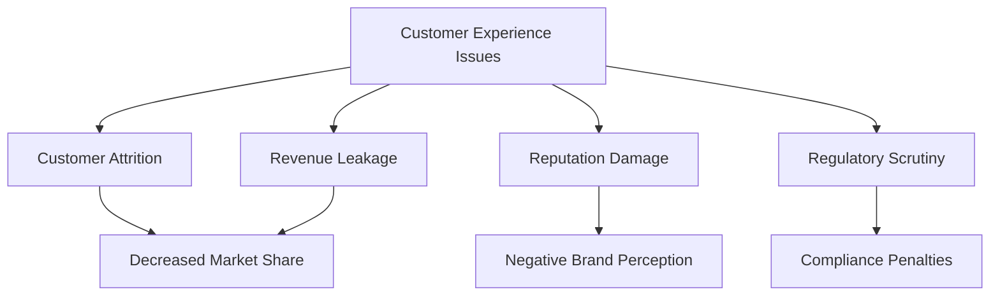
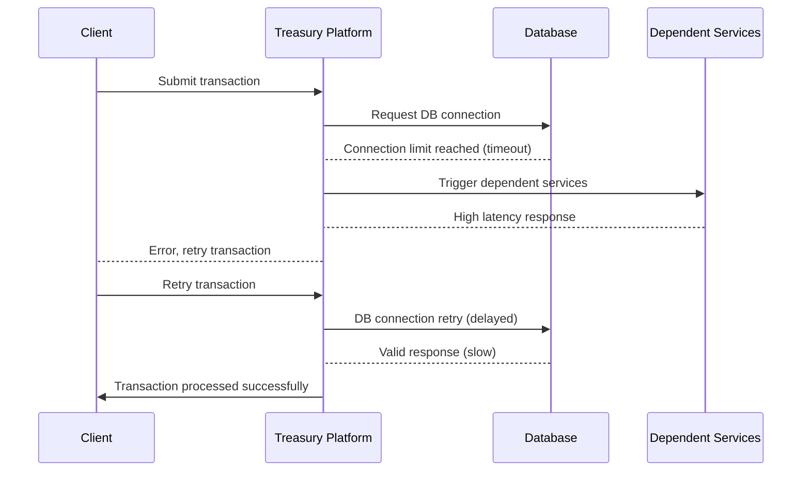
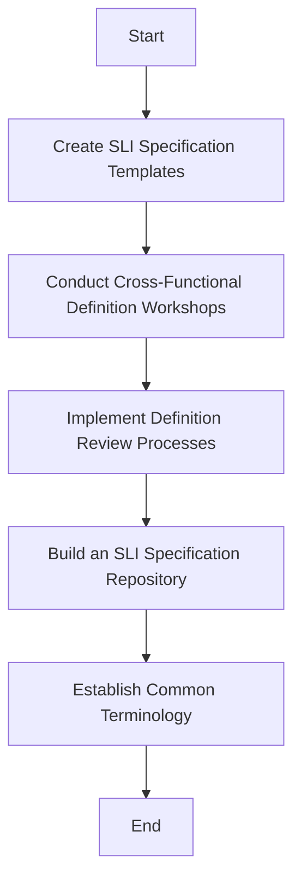
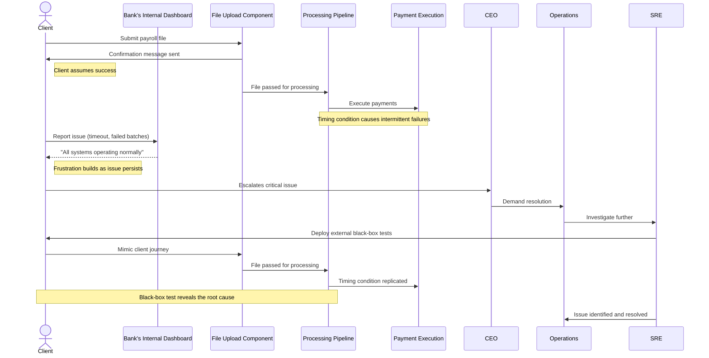
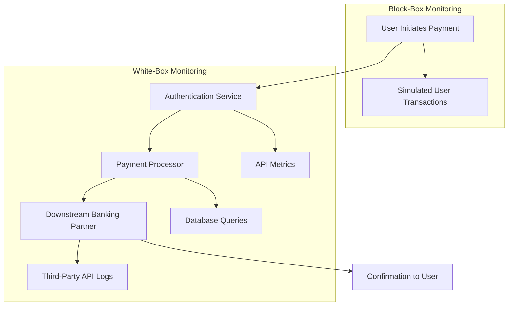
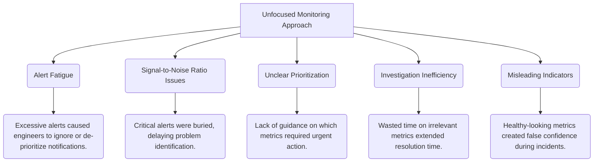
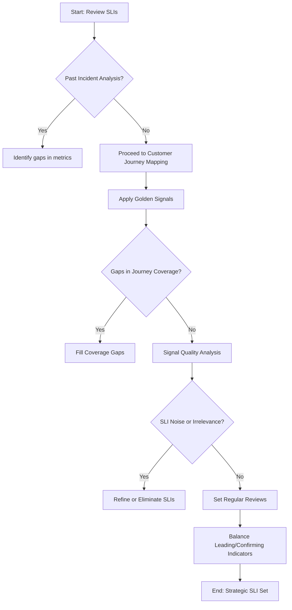

# Chapter 2: Understanding Service-Level Indicators (SLIs) - Measuring What Matters

## Chapter Overview

Welcome to the brutal reality of measuring what matters—where your “green” dashboards mean nothing if your customers are seeing red. This chapter is your crash course in Service-Level Indicators (SLIs): the difference between actually running a reliable, customer-focused banking platform and playing whack-a-mole with meaningless server metrics. Think of SLIs as the lie detector for your technical self-delusion. We’ll shred the old habits of watching CPU graphs while your customers rage-quit over failed payments. You’ll learn how to cut through the noise, pick metrics that actually matter, and stop embarrassing yourself (and your business) in front of the CIO. Spoiler: If your only metric is “it’s up,” you’re already losing money, customers, and regulatory goodwill. Let’s fix that.

______________________________________________________________________

## Learning Objectives

- **Identify** what constitutes a meaningful SLI from the user’s perspective (not your server’s feelings).
- **Map** customer journeys to technical metrics that don’t just look good—they prevent churn and lawsuits.
- **Distinguish** between request-based and windows-based SLIs, and **select** the right one for each banking service.
- **Specify** SLIs with ruthless clarity—so there’s no room for finger-pointing or “interpretation” during incidents.
- **Evaluate** SLIs using the CALM framework to weed out vanity metrics and focus on what’s actionable.
- **Implement** black-box and white-box monitoring so you catch failures before your customers do—or your regulator calls.
- **Prioritize** and **rationalize** SLIs, focusing on coverage, precision, and usefulness instead of metric hoarding.

______________________________________________________________________

## Key Takeaways

- “Healthy” infrastructure metrics mean squat if your customers can’t make a payment. Measure outcomes, not internal comfort food.
- Golden Signals are non-negotiable: availability, latency, throughput, and error rate. Ignore one, and you’ll be blindsided—guaranteed.
- Pick the wrong SLI methodology, and you’ll either miss disasters or drown in alert fatigue. There’s a reason “averages” are for cowards.
- Vague SLI specs fuel incident blame games. Specify everything: what, where, how, and why. Ambiguity only helps the finger-pointers.
- The CALM framework: if your SLI isn’t Customer-Aligned, Actionable, Leading, and Meaningful, it’s corporate art—expensive and useless.
- Black-box monitoring exposes what your users actually see. White-box reveals why it broke. If you only have one, you only have half a clue.
- Drowning in metrics? You’re not “observant,” you’re inefficient. Ruthlessly prune to what detects real incidents and drives action.
- Bad SLIs don’t just waste engineering time—they lose customers, revenue, and regulatory credibility. You might as well set your budget on fire.
- Every SLI you select is a contract with the business and your customers. Don’t write checks your metrics can’t cash.

______________________________________________________________________

## Panel 1: The User Perspective - Defining Service Through Customer Eyes

### Scene Description

```mermaid
graph TD
    A[Banking Customers] -->|Thought Bubbles| B("Will my payment arrive on time?<br>How fast will my transfer complete?<br>Can I access my account balance right now?<br>Will my trading order execute at the price I see?")
    A -->|Interacts With| C[ATMs and Mobile Banking Interfaces]
    C -->|User Requests| D[Banking Systems]

    subgraph IT Engineers
        E[Engineer 1: Monitoring CPU Usage]
        F[Engineer 2: Checking Server Logs]
        G[Engineer 3: Tracking Database Connections]
    end

    D -->|System Metrics| IT Engineers

    subgraph SRE Jamila
        H[Sketching a Bridge]
    end
    A -->|Customer Experience| H
    H -->|Bridging Gap| IT Engineers
```

A diverse group of banking customers stands in front of ATMs and mobile banking interfaces, expressing their concerns through thought bubbles: "Will my payment arrive on time?", "How fast will my transfer complete?", "Can I access my account balance right now?", "Will my trading order execute at the price I see?"

Behind them, IT engineers are absorbed in monitoring server metrics like CPU usage, database connections, and server logs, disconnected from the customers' functional concerns. Positioned between these two groups, SRE Jamila is sketching a bridge on a transparent board, symbolizing the connection between customer experiences and the technical metrics that reflect them.

### Teaching Narrative

Service-Level Indicators begin with a fundamental question: what does your service look like from the user's perspective? Unlike traditional infrastructure metrics, SLIs measure aspects of the service that directly impact customer experience.

Users of banking systems don't care about CPU utilization, memory consumption, or database connection counts. They care about functional outcomes: Can they complete transactions? How quickly do their payments process? Is their account information accurate and available when needed?

SLIs bridge the gap between what customers experience and what we can measure technically. By defining our service through the customer's eyes first, we ensure that our measurements reflect real user experiences rather than internal system states. This customer-centric measurement approach forms the foundation of modern reliability engineering and represents a significant shift from traditional infrastructure monitoring.

### Common Example of the Problem

A major retail bank recently completed a core banking platform migration, moving from a legacy mainframe to a modern cloud-based architecture. The technology team meticulously monitored the new platform's technical health: CPU utilization stayed under 40%, memory usage was optimal, database connections remained within established thresholds, and all internal health checks passed consistently.

Despite these positive technical indicators, the bank's customer satisfaction scores plummeted in the weeks following the migration. The contact center was overwhelmed with complaints about mobile banking timeouts, delayed payment processing, and inconsistent account balance updates.

During an executive review, the CIO presented green dashboards showing excellent system health, while the Head of Customer Experience presented red dashboards showing deteriorating customer satisfaction. This disconnect stemmed from a fundamental problem: the technology team was measuring what was easy and familiar (infrastructure metrics) rather than what actually mattered to customers (transaction success, feature availability, and processing times).

To illustrate this disconnect, the following table compares the technical metrics monitored by the technology team against the customer experience outcomes during this migration:

| **Category** | **Technical Metrics (Monitored)** | **Customer Experience Outcomes (Ignored)** |
| -------------------------- | ----------------------------------------- | ----------------------------------------------------- |
| **Transaction Processing** | Database connections within thresholds | Payments delayed or not processed on time |
| **Mobile Interface** | CPU utilization under 40%, memory optimal | Frequent timeouts and unresponsive mobile banking app |
| **Account Data Accuracy** | Internal health checks all passing | Inconsistent account balances displayed to customers |
| **Service Notifications** | System uptime at 99.99% | No alerts for delayed international wire transfers |

When a major corporate client threatened to leave after several critical international wire transfers were delayed without notification (despite all systems showing "green"), the bank finally recognized they were measuring the wrong things.

This example highlights the critical need to shift from focusing on infrastructure-centric metrics to user-centric SLIs that reflect actual customer experiences.

### SRE Best Practice: Evidence-Based Investigation

The SRE approach emphasizes understanding and measuring what matters to users. Here are five best practices to guide evidence-based investigation:

1. **Customer Journey Mapping**\
   Systematically document how customers interact with your banking services, identifying the critical touchpoints and expectations at each stage. For example, map the complete payment journey from initiation to confirmation, including all user interaction points.

2. **Voice-of-Customer Integration**\
   Collect and analyze customer feedback channels (support tickets, customer surveys, app store reviews) to identify what banking customers actually care about and what problems they're experiencing.

3. **Direct User Observation**\
   Conduct regular sessions observing real users interacting with banking services, noting their expectations, frustrations, and success criteria—which often differ significantly from technical assumptions.

4. **Correlation Analysis**\
   Analyze historical incidents to identify which technical metrics actually correlate with customer-reported problems. This helps distinguish truly customer-impacting issues from internal-only concerns.

5. **Cross-Functional Definition Workshops**\
   Bring together technical teams, product managers, and customer service representatives to collectively define what "working" means from a customer perspective for each critical banking function.

#### Quick Checklist for Evidence-Based Investigation

Use this checklist as a quick reference to apply the best practices in your environment:

- [ ] Have you mapped the full customer journey for critical banking services?
- [ ] Are you systematically collecting and analyzing customer feedback?
- [ ] Have you observed real users interacting with your services recently?
- [ ] Do you understand which technical metrics correlate with customer-reported issues?
- [ ] Have you aligned definitions of "working" across technical, product, and support teams?

### Banking Impact

Failing to measure banking services from the customer perspective creates several significant business impacts. The table below highlights key areas of impact, supported by data and examples:

| **Impact Area** | **Description** | **Data/Example** |
| -------------------------------------- | ---------------------------------------------------------------------------------------------------------------------------------------------- | --------------------------------------------------------------------------------------------------------- |
| **Customer Attrition Risk** | Poor digital experiences drive customers away, as user experience becomes a key differentiator in banking services. | 32% of customers will leave a bank after a single bad digital experience. |
| **Revenue Leakage** | Transaction failures or slow performance cause customers to abandon high-value activities, such as investments or loan applications. | Banks lose millions annually due to failed transactions or abandoned processes. |
| **Misdirected Engineering Investment** | Resources are spent on internal improvements that don't address customer pain points, leading to inefficiencies and missed opportunities. | A focus on server uptime instead of transaction success rates fails to prioritize user-critical outcomes. |
| **Reputation Damage** | Negative experiences are amplified through social media, damaging brand perception and trust. | 47% of customers share poor experiences online, influencing prospective customers. |
| **Regulatory Scrutiny** | Regulators increasingly expect banks to monitor and report on customer outcomes, exposing institutions to compliance risks if they fall short. | Financial penalties and reputational harm result from inadequate monitoring of customer-impacting issues. |

#### Key Relationships Between Customer Experience and Business Impact



By aligning service-level indicators with customer-focused outcomes, banks can mitigate these risks, improve user satisfaction, and achieve sustainable business success.

### Implementation Guidance

To implement customer-centric SLIs in your banking environment, follow these steps:

```mermaid
graph TD
    A[Conduct Customer Experience Workshops] --> B[Map Technical Metrics to Customer Journeys]
    B --> C[Implement Customer-Focused Dashboards]
    C --> D[Develop Synthetic Customer Transactions]
    D --> E[Establish Feedback Loops]

    subgraph Step1[Step 1: Conduct Customer Experience Workshops]
        A1[Organize cross-functional sessions]
        A2[Define "good service" for key banking functions]
        A3[Document user-focused definitions]
        A --> A1 --> A2 --> A3
    end

    subgraph Step2[Step 2: Map Technical Metrics to Customer Journeys]
        B1[Identify critical customer journeys]
        B2[Determine technical metrics influencing user outcomes]
        B3[Map measurable indicators to user experiences]
        B --> B1 --> B2 --> B3
    end

    subgraph Step3[Step 3: Implement Customer-Focused Dashboards]
        C1[Organize metrics by customer journey]
        C2[Make customer impact visible to technical teams]
        C3[Focus on user outcomes over system states]
        C --> C1 --> C2 --> C3
    end

    subgraph Step4[Step 4: Develop Synthetic Customer Transactions]
        D1[Automate common customer journeys]
        D2[Measure success rates and performance]
        D3[Simulate external user perspective]
        D --> D1 --> D2 --> D3
    end

    subgraph Step5[Step 5: Establish Feedback Loops]
        E1[Incorporate customer feedback regularly]
        E2[Analyze support tickets and surveys]
        E3[Refine SLIs based on evolving customer needs]
        E --> E1 --> E2 --> E3
    end
```

- **Step 1: Conduct Customer Experience Workshops**\
  Organize cross-functional sessions with customer service, product teams, and technology groups to define and document what "good service" means for each key banking function from the customer perspective.

- **Step 2: Map Technical Metrics to Customer Journeys**\
  For each critical customer journey (payments, account access, loan applications), identify the specific technical metrics that directly influence the customer experience, creating explicit mappings between user outcomes and measurable indicators.

- **Step 3: Implement Customer-Focused Dashboards**\
  Create new monitoring views that organize metrics by customer journey rather than by technical component. This ensures technical teams see the service as customers do and highlights the real customer impact.

- **Step 4: Develop Synthetic Customer Transactions**\
  Implement automated tests that regularly execute common customer journeys end-to-end. These tests measure success rates and performance from the external user perspective, simulating real customer interactions.

- **Step 5: Establish Feedback Loops**\
  Create processes to regularly incorporate customer feedback into SLI refinement. This includes systematic analysis of support tickets, customer surveys, and direct user research to continuously improve your understanding of what matters to customers.

## Panel 2: The Golden Signals - Four Fundamental Measurements

### Scene Description

The banking operations center buzzes with activity, centered around a newly installed dashboard titled "Payment Processing Golden Signals." The dashboard displays four prominent metrics:

```
+-----------------------------+
| Payment Processing Metrics  |
+-----------------------------+
| Availability:  99.97%       |
| Latency (P95): 230ms        |
| Throughput:     837 TPS     |
| Error Rate:     0.03%       |
+-----------------------------+
```

Senior SRE Raj stands near the dashboard, gesturing toward the metrics as he explains their significance to a group of production support engineers. Some engineers furiously take notes, while others exchange thoughtful glances as comprehension begins to dawn. The room is a mix of curiosity and focus, with Raj emphasizing how these metrics collectively provide a holistic view of service health. The interplay of visuals from the dashboard and Raj’s explanations creates a dynamic learning environment.

### Teaching Narrative

While services can be measured in countless ways, four key measurements—the Golden Signals—prove universally valuable across almost all services:

1. **Availability**: The proportion of time the service is accessible and usable. For banking, this might be measured as the percentage of successful API responses or the fraction of time customers can log in.

2. **Latency**: How long it takes to respond to requests. In financial services, this includes not just technical response time but also business process completion (like payment clearing time).

3. **Throughput**: The volume of transactions or requests the system can handle. For banking platforms, this might be measured as transactions per second during peak periods.

4. **Error Rate**: The percentage of requests that fail. In financial contexts, this includes both technical failures and business logic rejections (like failed fraud checks).

These Golden Signals provide a balanced view of service health. A system might be available but suffering from high latency, or processing transactions quickly but with a high error rate. By monitoring all four dimensions simultaneously, we develop a comprehensive understanding of the user experience.

For production support professionals transitioning to SRE, these Golden Signals provide a framework for evolving beyond the traditional "is it up or down?" approach to a multi-dimensional view of service quality.

### Common Example of the Problem

A large corporate banking division had traditionally monitored their treasury management platform using a binary "system status" indicator, which simply reported whether the core application servers were responding to basic health checks. This limited view created a dangerous blind spot during a critical market period.

On quarter-end, when transaction volumes typically triple, the bank's treasury platform remained "available" according to the monitoring systems. However, corporate clients began reporting serious issues with the service: some transactions took over 30 seconds to process, others received timeout errors, and the system periodically rejected valid transactions with cryptic error messages.

The support team was caught off-guard, as their primary dashboard showed the system as "UP" and "HEALTHY." When they finally investigated more deeply, they discovered a complex failure scenario that didn't affect basic availability:



This sequence illustrates the cascading nature of failures:

1. The database was reaching connection limits under high volume, causing intermittent transaction timeouts.
2. Increased latency was causing timeout cascades through dependent services.
3. The error handling system was failing silently, returning valid-looking responses with no data.
4. While the system continued processing some transactions, the error rate had climbed to 15%.

Because the team only monitored basic availability and not the other Golden Signals, they had no visibility into this degradation until customers began calling. Several major corporate clients missed critical payment deadlines, resulting in penalty fees and relationship damage.

### SRE Best Practice: Evidence-Based Investigation

The SRE approach emphasizes comprehensive measurement across all four Golden Signals to ensure a robust and actionable understanding of service health. Use the following checklist to guide your evidence-based investigation practices:

#### Evidence-Based Investigation Checklist

1. **Define Multi-Dimensional Health**

   - Clearly outline what "healthy" service means across Availability, Latency, Throughput, and Error Rate.
   - Set explicit, measurable thresholds for each signal, tailored to critical banking services.

2. **Implement Balanced Instrumentation**

   - Ensure all four Golden Signals are monitored with sufficient granularity.
   - Avoid over-prioritizing Availability; balance focus across all signals to capture a true service health picture.

3. **Correlate Signals During Incidents**

   - Investigate relationships between signals during service degradation.
   - Identify leading indicators (e.g., latency spikes preceding error rate increases) to catch issues early.

4. **Establish Signal Baselines**

   - Build detailed baselines for each signal, accounting for daily, weekly, and monthly patterns.
   - Use baselines to detect anomalies that simple threshold checks might miss.

5. **Conduct Signal Gap Analysis**

   - Periodically review monitoring coverage for critical banking services and customer journeys.
   - Highlight and address gaps where any Golden Signal is insufficiently measured.

6. **Iterate on Monitoring Strategy**

   - Regularly refine instrumentation based on incident postmortems and emerging business requirements.
   - Adapt thresholds and alerting as system behavior evolves.

7. **Document and Share Findings**

   - Maintain clear documentation of baselines, thresholds, and signal correlations for team reference.
   - Share insights with stakeholders to drive continuous improvement in service reliability.

By following this checklist, teams can ensure their investigation practices rely on comprehensive, data-driven insights, enabling faster and more accurate diagnosis of service issues.

### Banking Impact

Incomplete signal monitoring in banking environments creates several significant business risks:

1. **Silent Failures**: Without measuring all four dimensions, banks experience "silent failures" where services technically remain available but become unusable due to latency, errors, or capacity issues, extending the duration and impact of incidents.

2. **Customer Experience Blind Spots**: Focusing on limited metrics creates dangerous gaps in understanding the actual customer experience, particularly during peak processing periods when banking services face their greatest stress.

3. **Capacity Planning Failures**: Without comprehensive throughput measurement, banks cannot accurately predict when systems will reach breaking points during high-volume periods like tax deadlines, month-end closing, or market volatility events.

4. **Regulatory Reporting Gaps**: Financial regulators increasingly require detailed reporting on service quality across multiple dimensions, creating compliance risks when banks cannot provide comprehensive performance data.

5. **Misallocated Resources**: When problem detection focuses on limited signals, banks often invest in solving the wrong problems, addressing symptoms rather than underlying issues.

### Implementation Guidance

To implement Golden Signals monitoring in your banking environment, follow these structured steps:

| Step | Action | Expected Outcome |
| -------------------------------------- | ------------------------------------------------------------------------------------------------------------------------------------------------------------------------------------------------------------------------ | -------------------------------------------------------------------------------------------------------------- |
| **1. Map Critical Services** | Identify all customer-facing banking services (e.g., payment processing, account management, trading platforms). Document which Golden Signals are currently measured for each service, and highlight coverage gaps. | A clear inventory of services with a documented view of Golden Signal coverage and existing gaps. |
| **2. Instrument Missing Signals** | For services with incomplete coverage, implement the necessary instrumentation to capture all four Golden Signals. Use appropriate tools, libraries, or monitoring agents as required. | Comprehensive visibility into the Availability, Latency, Throughput, and Error Rate for all critical services. |
| **3. Standardize Signal Definitions** | Define consistent metrics for each signal across services. For example, agree on how to calculate availability, select relevant latency percentiles (e.g., P95 or P99), and specify what constitutes an error. | Uniform metric definitions, enabling consistent comparisons and meaningful aggregation of data. |
| **4. Create Combined Dashboards** | Design monitoring dashboards that display all four Golden Signals together for each critical service. Use intuitive visualizations (e.g., charts, gauges, or heatmaps) to enhance clarity. | Centralized dashboards that provide a holistic view of service health, making it easy to detect issues. |
| **5. Establish Multi-Signal Alerting** | Implement alert rules that consider combinations of Golden Signal degradations. For instance, monitor for scenarios like "available but slow" or "fast but error-prone." Set thresholds that align with business impact. | Proactive detection of complex failure modes, reducing mean time to detect (MTTD) and improving reliability. |

By following these steps, your organization can build a robust Golden Signals monitoring framework that ensures comprehensive service health visibility and rapid issue detection.

## Panel 3: Request-Based vs. Windows-Based SLIs

### Scene Description

A split-screen monitoring station is displayed, visually dividing the activities of two SREs. On the left side, Alex is configuring a request-based SLI for a funds transfer service, with a formula prominently shown:

```
Success Count / Total Count
```

This highlights the measurement of individual API transaction success rates. On the right side, Sofia is setting up a window-based SLI for a trading platform, with a description showing:

```
Percentage of 1-minute intervals where latency < threshold
```

This emphasizes performance measured across time intervals. Between them stands their manager, gesturing to both screens while addressing a group of newly transitioned SREs, explaining the strengths and use cases of each approach.

Below is a conceptual representation of the scene:

```
+-----------------------------+-----------------------------+
|                             |                             |
|     Request-Based SLI       |      Window-Based SLI       |
|                             |                             |
|  [ Alex's Screen ]          |  [ Sofia's Screen ]         |
|  -------------------        |  -------------------        |
|  Success Count /            |  Percentage of 1-min        |
|  Total Count                |  intervals where latency    |
|                             |  < threshold               |
|                             |                             |
+-----------------------------+-----------------------------+
|                             Manager                      |
|       (gesturing, explaining to SRE group)               |
+----------------------------------------------------------+
```

This setup provides a clear visual and textual distinction between the two types of SLIs, helping the audience understand their practical application in real-world scenarios.

### Teaching Narrative

SLIs fall into two major categories, each with distinct advantages and limitations:

**Request-Based SLIs** measure the success or quality of individual requests or transactions. For example, "the percentage of payment API requests that return successfully within 300ms." These SLIs provide precise measurements of exactly how many transactions met your criteria. They work well for API-based services or systems where discrete requests occur.

**Windows-Based SLIs** measure the percentage of time intervals (windows) during which a service met criteria. For example, "the percentage of 1-minute intervals during which 99% of transactions processed successfully." These SLIs are useful for continuous processes or when precise per-request tracking is impractical.

In banking environments, request-based SLIs work well for transaction processing, authentication, and API services. Windows-based SLIs are often better for market data feeds, batch processes, or monitoring the overall health of complex interconnected systems.

Understanding both types enables SREs to select the appropriate measurement approach for different banking services. This choice significantly impacts how you interpret and act on reliability data, especially when designing SLOs and error budgets later.

### Common Example of the Problem

A global investment bank's technology team implemented a new monitoring system for their trading platform and faced a challenge selecting the right SLI approach for different components of their architecture.

For their order execution service, they initially implemented a windows-based SLI that measured "the percentage of 5-minute intervals where the system processed orders correctly." While this approach seemed reasonable, it created serious visibility problems during the Asian market opening, when a brief but severe spike in rejected orders occurred for approximately 3 minutes. Because this issue affected only a single 5-minute window, the daily SLI showed 99.3% compliance (1 failed window out of 144 daily windows), significantly understating the actual customer impact. During those 3 minutes, nearly 40% of customer orders failed—representing millions in potential trading value. The windows-based approach masked the severity of the issue by averaging it across a 5-minute interval and treating it as a single window failure.

For their market data feed, however, the team initially used a request-based SLI, measuring "the percentage of market data updates delivered within 500ms." This approach generated excessive noise during minor network jitter events where a small percentage of updates experienced slight delays but no trader would notice the difference. The request-based approach flagged these as SLI violations despite having negligible real-world impact.

The team realized they needed to match their SLI methodology to the characteristics of each service and the way customers experienced it. The table below summarizes the outcomes for both approaches during the incident:

| **Service** | **SLI Type** | **What Went Wrong** | **Impact** |
| ----------------------- | ------------- | ----------------------------------------------------------------------------------------------------------- | ------------------------------------------------------------------------------------------ |
| Order Execution Service | Windows-Based | A 3-minute severe spike in rejected orders was averaged into a single 5-minute window failure. | Daily compliance appeared acceptable (99.3%), but millions in trading value were impacted. |
| Market Data Feed | Request-Based | Minor network jitter caused small delays in a few updates, triggering SLI violations that weren’t critical. | SLI flagged non-critical issues, creating excessive noise without real customer impact. |

This example highlights the importance of selecting the right SLI approach. Windows-based SLIs can mask brief but severe issues, while request-based SLIs may overemphasize minor, low-impact events. Aligning the methodology with the service's role and customer expectations is essential for meaningful reliability measurements.

### SRE Best Practice: Evidence-Based Investigation

The SRE approach emphasizes selecting appropriate SLI methodologies based on service characteristics. Use the following checklist to guide your investigation and ensure evidence-based decision-making:

#### Checklist for Evidence-Based SLI Selection:

- **1. Analyze Service Interaction Patterns**

  - Evaluate user interaction models: Are users performing discrete transactions (e.g., API calls) or relying on continuous service availability?
  - Identify the customer experience most critical to reliability measurement.

- **2. Consider Impact Concentration**

  - Assess how service degradation typically manifests:
    - Does it affect all users proportionally? (→ Request-Based SLIs)
    - Or does it completely impact a subset of users during specific time windows? (→ Window-Based SLIs)

- **3. Evaluate Detection Objectives**

  - Define your primary detection goal:
    - Is it to capture brief, severe disruptions? (→ Request-Based SLIs)
    - Or to monitor persistent, less severe degradation? (→ Window-Based SLIs)

- **4. Understand Aggregation Effects**

  - Review how each SLI methodology aggregates data:
    - Are failure patterns masked or amplified?
    - Test historical incident data to observe how effectively each approach exposes critical issues.

- **5. Balance Coverage and Clarity**

  - Validate the signal quality of your chosen SLI:
    - Does it provide actionable insights without excessive noise?
    - Confirm that it accurately reflects significant past incidents.

By following this checklist, SREs can ensure their chosen SLI methodology aligns with the unique characteristics and reliability objectives of their services, leading to more effective SLOs and better use of error budgets.

### Banking Impact

Selecting inappropriate SLI methodologies in banking environments creates several significant risks. Below are examples and case studies illustrating how these risks manifest in real-world scenarios:

1. **Misrepresented Incidents**:\
   A retail banking API for funds transfers uses a request-based SLI but fails to capture intermittent latency spikes. During a high-traffic event, only 2% of requests experience delays exceeding 1 second, but these delays occur in rapid succession, creating a burst of user complaints. The request-based SLI shows a 98% success rate, downplaying the severity of disruptions and delaying incident resolution.

2. **False Confidence**:\
   A trading platform adopts a window-based SLI to monitor latency, defining success as “99% of transactions processed within 500ms per 1-minute interval.” During a network issue, a 30-second outage within a 1-minute window is averaged out, leading the SLI to report success. The team assumes reliability is intact, yet traders suffer significant losses due to missed opportunities.

3. **Noisy Alerts**:\
   An authentication service uses a request-based SLI that triggers alerts for every dip below 99.9% success. During maintenance, transient failures cause frequent alert spikes, even though user impact is minimal. The constant noise overwhelms the on-call engineer, who begins ignoring alerts, missing a real issue later in the day that affects customers.

4. **Unsuitable Error Budgets**:\
   A payment gateway defines its error budget based on a request-based SLI. However, the service experiences occasional 10-minute outages, which the SLI does not adequately penalize due to the large volume of successful requests during normal operation. The team overestimates reliability, deploying risky changes that cause further disruptions.

5. **Misaligned Reporting**:\
   A bank reports SLA compliance to regulators using a window-based SLI for a loan processing system, focusing on "percentage of 5-minute windows where processing time is under 2 seconds." However, several high-value loans experience delays of over 30 seconds, unnoticed by the SLI. This creates compliance risks as regulators require accurate reflection of customer-impacting issues.

By understanding these examples, SREs can better appreciate the importance of aligning SLI methodologies with the specific needs and characteristics of banking systems, ensuring accurate monitoring, effective incident response, and customer trust.

### Implementation Guidance

To implement appropriate SLI methodologies in your banking environment, use the following steps and decision tree to guide your approach:

1. **Catalog Service Characteristics**: Create a comprehensive inventory of banking services, documenting their transaction patterns, customer interaction models, and typical failure modes to guide SLI methodology selection.

2. **Use the Decision Tree**: Follow the decision tree below to determine whether to use request-based SLIs, windows-based SLIs, or a hybrid approach for each service:

   ```mermaid
   graph TD
       A[Start: Define Service Characteristics] --> B{Does the service handle discrete, trackable requests?}
       B -->|Yes| C[Use Request-Based SLI]
       B -->|No| D{Is the service a continuous process or dependent on time-based patterns?}
       D -->|Yes| E[Use Windows-Based SLI]
       D -->|No| F[Consider Hybrid Approach]
       F --> G[Combine request-based SLIs for precision and windows-based SLIs for trends]
   ```

3. **Test Against Historical Incidents**: Validate your SLI methodology selections by back-testing them against significant historical incidents. Confirm that the chosen SLIs would have accurately represented the customer impact in these scenarios.

4. **Implement Hybrid Approaches Where Needed**: For complex services, use a combination of request-based SLIs for precise measurement and windows-based SLIs for trending and broader patterns. This ensures a more comprehensive understanding of system reliability.

5. **Document Methodology Choices**: Clearly record the rationale behind each SLI methodology choice, including the expected benefits and limitations. This documentation promotes understanding across teams and ensures consistent application during future refinements.

## Panel 4: The Anatomy of an SLI - Specification Requirements

### Scene Description

A whiteboard session shows SRE lead Sofia deconstructing a payment processing SLI into its components. On the board is written: "SLI: 99.5% of payment API requests return successfully within 500ms, measured at the load balancer." She's circling different parts of this statement and labeling them: "Service", "Metric Type", "Success Criteria", "Measurement Point." Junior engineers are taking photos of the whiteboard while asking questions, with sticky notes showing different variations of the SLI for different services.

Below is a labeled breakdown of the SLI from the whiteboard:

```
SLI: 99.5% of payment API requests return successfully within 500ms, measured at the load balancer.

Component Breakdown:
  - Service: Payment API
  - Metric Type: Latency
  - Success Criteria: 99.5% of requests complete within 500ms
  - Measurement Point: Load Balancer
```

This breakdown helps clarify how each element contributes to making the SLI actionable and unambiguous, connecting directly to the teaching narrative.

### Teaching Narrative

A well-defined SLI must contain several key elements to be actionable and unambiguous:

1. **Service Boundary**: Clearly identify which service is being measured. In complex banking systems with hundreds of microservices, precisely defining the boundary is crucial.

2. **Metric Type**: Specify whether you're measuring availability, latency, throughput, error rate, or another quality dimension.

3. **Success Criteria**: Define the threshold that distinguishes "good" from "bad" events. For example, responses under 500ms might be considered successful, while slower responses count as failures.

4. **Measurement Point**: Establish exactly where in the system you're collecting the data—at the client, load balancer, service, or another component.

5. **Data Aggregation Method**: Determine how individual measurements will be combined—for instance, as a ratio, average, or percentile.

Without these specifications, SLIs can be misinterpreted or lead to disagreements during incidents. For production support engineers transitioning to SRE, this precision represents a significant shift from general monitoring to specific, contractual measurements that can drive operational decisions.

### Common Example of the Problem

A major bank's digital payments team was investigating a series of customer complaints about failed transactions despite internal monitoring showing 99.8% availability. During a contentious incident review, different stakeholders presented conflicting data:

- The API team claimed 99.8% availability based on successful responses from their service endpoint.
- The mobile app team reported 92% successful payment completions from client telemetry.
- The database team showed 100% availability for the transaction database.
- The operations team's synthetic tests indicated a 95% success rate.

What began as a technical discussion escalated into interdepartmental finger-pointing, with each team defending their metrics while questioning others'. The CIO finally intervened, demanding clarity on why there was such disparity in the numbers.

Root cause analysis revealed multiple ambiguities in how each team defined their payment processing SLI. The following table summarizes the discrepancies:

| **Aspect** | **API Team** | **Mobile App Team** | **Database Team** | **Operations Team** |
| ---------------------- | -------------------------------- | ----------------------------------------- | ----------------------------------------------- | --------------------------------------------- |
| **Service Boundary** | Payment submission endpoint only | End-to-end flow measured at the client | Transaction database availability only | End-to-end flow from synthetic tests |
| **Success Criteria** | HTTP 202 (Accepted) as success | Payment completion reported by the client | Database availability (e.g., no downtime) | Synthetic test success (valid payment result) |
| **Measurement Point** | Server-side at the API endpoint | Client-side, including network issues | Database layer | Synthetic tests executed from external probes |
| **Timing Window** | Not specified | Business hours only | Not specified | 24/7 |
| **Aggregation Method** | Average success rate | Percent of successful payment completions | Uptime percentage (masking intermittent issues) | Percentile success rate |

The lack of a precisely specified, agreed-upon SLI definition had created an environment where no one could definitively state whether the payment service was actually meeting customer expectations.

### SRE Best Practice: Evidence-Based Investigation

The SRE approach emphasizes comprehensive, precise SLI specifications to ensure clarity and alignment across teams. Use the following checklist to guide your evidence-based investigation and specification process:

#### Checklist for Evidence-Based SLI Specification

1. **Document Complete SLI Definitions**

   - Specify all five key components: Service Boundary, Metric Type, Success Criteria, Measurement Point, and Data Aggregation Method.
   - Eliminate ambiguity by explicitly defining what is being measured and how.

2. **Validate SLI Alignment**

   - Cross-check measurement systems to ensure they produce consistent results when applying the same SLI definition.
   - Investigate and resolve any discrepancies in implementation.

3. **Test Boundary Conditions**

   - Identify and analyze edge cases to confirm that SLI definitions handle unusual events or patterns appropriately.
   - Ensure clear categorization for all possible scenarios.

4. **Establish Definition Governance**

   - Set up formal review and approval processes for SLI definitions.
   - Facilitate cross-team agreement to ensure uniform interpretation and adoption.

5. **Create Specification Documentation**

   - Maintain detailed and accessible documentation of all SLI specifications.
   - Include the rationale behind key decisions, such as measurement points and success criteria, to improve understanding and consistency.

#### Example Workflow

```plaintext
[Define SLI Components] --> [Align Measurement Systems] --> [Test Edge Cases] --> [Review & Approve] --> [Document & Share]
```

By following this checklist, you can ensure that your SLIs are actionable, unambiguous, and aligned across teams, enabling better operational decisions based on evidence rather than assumptions.

### Banking Impact

Ambiguous SLI specifications in banking environments create several significant risks:

1. **Incident Response Confusion**: Without clear SLI specifications, incident responders waste critical time debating what constitutes a problem rather than fixing it, extending the duration and impact of service disruptions.

2. **Misaligned Improvement Efforts**: Teams invest in solving the wrong problems when working from differently defined metrics, leading to wasted engineering resources and persistent customer issues.

3. **Accountability Gaps**: Unclear service boundaries and success criteria create accountability confusion, with critical reliability issues falling between organizational cracks.

4. **Impossible Performance Management**: Without precisely specified SLIs, organizations cannot effectively set performance targets or hold teams accountable for reliability outcomes.

5. **Customer Trust Erosion**: Disconnects between internal metrics and customer experience damage trust when banks claim high availability while customers experience ongoing issues.

### Implementation Guidance

To implement precise SLI specifications in your banking environment:

1. **Create SLI Specification Templates**: Develop standardized templates that require explicit documentation of all five key components for every SLI definition. These templates ensure consistency and serve as a starting point for all new SLIs.

2. **Conduct Cross-Functional Definition Workshops**: Bring together representatives from all teams involved in service delivery to collectively define and agree upon comprehensive SLI specifications. This fosters alignment and ensures that all perspectives are considered.

3. **Implement Definition Review Processes**: Establish formal review procedures for new or modified SLI definitions, ensuring technical accuracy, clarity, and stakeholder alignment before implementation. Reviews should involve both technical and business stakeholders.

4. **Build an SLI Specification Repository**: Create a centralized, version-controlled repository of all SLI definitions, accessible to all stakeholders and linked directly from monitoring dashboards. This repository acts as the single source of truth for all SLIs.

5. **Establish Common Terminology**: Develop and document precise definitions for key terms used in SLI specifications (like "availability," "success," or "latency"), ensuring consistent interpretation across teams. This minimizes misunderstandings during incidents.

Below is a flowchart illustrating the steps for implementing SLI specifications:



This flowchart outlines a sequential approach to implementing SLI specifications, ensuring that each step builds on the previous one to create a robust and actionable framework.

## Panel 5: Quality SLI Characteristics - The CALM Framework

### Scene Description

A retrospective meeting where a team is evaluating their SLIs after a major incident. On a whiteboard, a four-quadrant diagram labeled "CALM Framework" is displayed, divided into sections: "Customer-Aligned," "Actionable," "Leading," and "Meaningful." The team is placing sticky notes with existing SLIs into the quadrants based on how well they align with each criterion. For example:

```
+--------------------+--------------------+
| Customer-Aligned   | Actionable         |
| - Transaction      | - Database error   |
|   success rate     |   rate             |
| - Account access   | - API latency      |
|   availability     |   alerts           |
+--------------------+--------------------+
| Leading            | Meaningful         |
| - Latency trends   | - Revenue impact   |
| - Error rates      | - Regulatory       |
|   over time        |   compliance       |
+--------------------+--------------------+
```

Some SLIs are being moved to an "improve" column on the side of the board, reflecting the need for better alignment with the CALM criteria. Raj points to a problematic SLI that failed to detect a significant customer impact during the last outage, sparking a discussion about its shortcomings. As the team evaluates each metric, they add or remove checkmarks next to the corresponding criteria on the whiteboard, iteratively refining their understanding of what makes an SLI effective.

### Teaching Narrative

Not all SLIs are created equal. The CALM framework helps evaluate whether your SLIs will effectively represent your users' experience:

**Customer-Aligned**: The SLI should directly correlate with user experience. For banking systems, this means measuring outcomes users care about: transaction success, account access, fund availability, and information accuracy.

**Actionable**: When an SLI degrades, it should be clear which teams and systems to investigate. Vague SLIs that span multiple responsibility domains create confusion during incidents.

**Leading**: Effective SLIs provide early warnings before users are significantly affected. They should detect degradation trends that indicate potential future failures.

**Meaningful**: The SLI should measure something that matters to the business. In financial services, this often connects to regulatory requirements, financial risk, or direct revenue impact.

For banking professionals transitioning to SRE roles, the CALM framework offers a structured approach to evaluating existing metrics and designing new ones. Rather than monitoring everything possible, focus on metrics that fulfill these four criteria to create SLIs that drive meaningful reliability improvements.

### Common Example of the Problem

A major investment bank's trading technology team implemented extensive monitoring for their institutional equity trading platform, with over 200 metrics tracked across the system. Despite this comprehensive coverage, they experienced a severe incident where institutional clients couldn't execute trades for 45 minutes before any alerts triggered.

During the post-incident review, the team discovered fundamental problems with their SLI quality:

They had meticulously monitored infrastructure components (server CPU, memory, network throughput) and technical services (database query times, API response codes), but none of these metrics detected the actual customer problem—trades appeared to submit successfully but were never sent to the market.

The team applied the CALM framework to analyze their monitoring failure:

1. **Customer Alignment**: Their primary SLIs measured system health rather than customer outcomes. While servers and services appeared healthy, the critical customer activity—trade execution—was failing.

2. **Actionability**: When the issue was finally detected, their broadly-defined SLIs couldn't identify which component was responsible. The alert simply indicated "trading degradation" without pointing to specific services for investigation.

3. **Leading Indicators**: Their metrics were lagging rather than leading—only triggering after a significant number of trades had already failed. They lacked early warning indicators that could have detected the problem's precursors.

4. **Meaningfulness**: Their SLIs didn't connect to business impact. The trading platform's most critical function—executing trades that generate commission revenue—wasn't directly measured in their primary SLIs.

#### Checklist for Identifying SLI Failures Using CALM Framework

Use this checklist to identify and address common SLI pitfalls:

- [ ] **Customer-Aligned**: Does the SLI directly reflect the user experience?\
  _Example Failure: Monitored technical components instead of trade execution success._

- [ ] **Actionable**: Does the SLI provide a clear path to identify and resolve issues?\
  _Example Failure: Alerts lacked specificity, making it unclear which systems were at fault._

- [ ] **Leading**: Does the SLI provide early warnings before significant user impact?\
  _Example Failure: Metrics triggered only after a large number of trades failed._

- [ ] **Meaningful**: Does the SLI measure something that matters to the business?\
  _Example Failure: SLIs overlooked critical business functions, such as trade execution revenue._

The team realized they had been measuring what was easy to instrument rather than what actually mattered to clients and the business. By revising their SLIs with the CALM framework, they could better align their monitoring strategy with customer needs and business priorities.

### SRE Best Practice: Evidence-Based Investigation

The SRE approach emphasizes evaluating and improving SLI quality. Use the table below to align best practices with the CALM framework, ensuring a structured and actionable approach to improving SLIs.

| Best Practice | Customer-Aligned | Actionable | Leading | Meaningful |
| -------------------------------------------- | ------------------------------------------------ | -------------------------------------------------- | ---------------------------------------------------- | ------------------------------------------------------------------ |
| **Conduct CALM Assessment Workshops** | ✔ Systematically ties SLIs to user experience. | ✔ Identifies clear improvement actions for teams. | ✘ Focuses on existing SLIs, not trend detection. | ✔ Ensures SLIs are aligned with business priorities. |
| **Analyze Detection Failures** | ✔ Identifies gaps in user-impact detection. | ✔ Pinpoints actionable failure causes. | ✔ Highlights where early warnings are missing. | ✔ Connects failures to high-impact business outcomes. |
| **Map Customer Journeys to SLIs** | ✔ Directly links SLIs to specific user journeys. | ✔ Clarifies which actions affect which SLIs. | ✘ Primarily focuses on current coverage, not trends. | ✔ Ensures key business processes are measured. |
| **Identify Ownership Boundaries** | ✘ Does not directly align with user experience. | ✔ Defines clear accountability for response. | ✘ Does not inherently provide early warnings. | ✔ Improves reliability by ensuring ownership of critical metrics. |
| **Establish Leading Indicator Correlations** | ✔ Proactively connects metrics to user outcomes. | ✔ Makes it clear which teams act on early signals. | ✔ Develops SLIs that detect issues before impact. | ✔ Focuses on metrics that matter to business and customer success. |

Each best practice complements the CALM framework by addressing specific criteria. By systematically implementing these practices, teams can create SLIs that are robust, actionable, and aligned with both user needs and business goals.

### Banking Impact

Low-quality SLIs in banking environments create several significant risks. The following text diagram summarizes these risks and their implications:

```
+--------------------------+-------------------------------------------+
| Risk                    | Description                               |
+--------------------------+-------------------------------------------+
| Delayed Incident        | SLIs that don't align with customer       |
| Detection               | experience often miss real problems       |
|                         | until they become severe, extending       |
|                         | incident duration and increasing          |
|                         | customer impact.                          |
+--------------------------+-------------------------------------------+
| Inefficient Incident    | Non-actionable SLIs lead to longer        |
| Response                | troubleshooting times and broader         |
|                         | escalations, consuming more engineering   |
|                         | resources and extending service           |
|                         | disruptions.                              |
+--------------------------+-------------------------------------------+
| Missed Early Warnings   | Without leading indicators, banks lose    |
|                         | the opportunity to address emerging       |
|                         | issues before they affect customers,      |
|                         | moving from proactive to reactive         |
|                         | reliability management.                   |
+--------------------------+-------------------------------------------+
| Misaligned Business     | SLIs that don't measure meaningful        |
| Reporting               | business outcomes create disconnects      |
|                         | between technical reporting and business  |
|                         | impact, leading to inappropriate          |
|                         | prioritization decisions.                 |
+--------------------------+-------------------------------------------+
| Compliance and Audit    | Regulators increasingly expect banks to   |
| Gaps                    | demonstrate effective monitoring of       |
|                         | services that affect customers and        |
|                         | market integrity, creating compliance     |
|                         | risks when SLIs don't align with these    |
|                         | critical functions.                       |
+--------------------------+-------------------------------------------+
```

By addressing these risks through the CALM framework, banks can ensure their SLIs effectively support reliability, compliance, and business goals.

### Implementation Guidance

To implement the CALM framework in your banking environment, follow this step-by-step checklist:

#### Step 1: Inventory and Assess Current SLIs

- Create a catalog of all existing SLIs used across your systems.
- For each SLI, evaluate it against the four CALM criteria:
  - **Customer-Aligned**: Does it directly reflect user experience?
  - **Actionable**: Is it clear which teams or systems to investigate when it degrades?
  - **Leading**: Can it provide early warnings before users are affected?
  - **Meaningful**: Does it measure something critical to the business?
- Document gaps and areas for improvement.

#### Step 2: Map Critical Customer Journeys

- Identify key customer journeys (e.g., payments, trading, account access).
- For each journey, ensure there are SLIs that measure customer success directly, not just technical components.
- Mark any journeys lacking sufficient SLI coverage for follow-up.

#### Step 3: Assign Ownership

- For each SLI, assign clear ownership to a team responsible for its quality and associated service performance.
- Use tagging or documentation to make ownership explicit and accessible to all stakeholders.

#### Step 4: Develop Leading Indicators

- Review historical incident data to identify patterns or signals that preceded failures.
- Design SLIs that serve as early warning indicators based on these findings.
- Test and validate these leading SLIs to ensure they provide actionable insights.

#### Step 5: Align SLIs with Business Outcomes

- Connect each SLI to a specific business goal or metric, such as:
  - Revenue impact
  - Customer retention
  - Regulatory compliance
- Regularly review these connections with business stakeholders to confirm alignment with organizational priorities.

#### Step 6: Iterate and Improve

- Conduct regular retrospectives to evaluate SLI effectiveness.
- Use the CALM framework as a continuous improvement tool to refine metrics over time.
- Adjust SLIs as business goals and customer needs evolve.

By following this checklist, you can ensure your SLIs are well-designed, actionable, and aligned with both customer experience and business priorities.

## Panel 6: Implementation Approaches - Black-Box vs. White-Box Measurement

### Scene Description

A dual monitoring setup is configured for a banking payment gateway, with two distinct dashboards providing complementary perspectives:

1. **Black-Box Dashboard**: Displays synthetic transactions executed from outside the bank's network. These simulate customer interactions and measure success rates, response times, and overall user experience, including external factors like network latency or third-party dependencies.

2. **White-Box Dashboard**: Shows internal metrics such as API performance, database query timings, and component-level health. These provide detailed insights into the system's internal workings and help diagnose root causes of issues.

The two dashboards are monitoring the same system but from different vantage points. A discrepancy is observed: the black-box tests indicate performance degradation (e.g., payment failures or slow responses) that is not yet reflected in the white-box metrics.

Below is a simplified representation of the setup:

```
        +--------------------+        +--------------------+
        |  Black-Box View    |        |  White-Box View    |
        |--------------------|        |--------------------|
        | Synthetic Requests |        |  API Metrics       |
        | External Latency   |        |  DB Performance    |
        | Success Rates      |        |  Component Health  |
        +--------------------+        +--------------------+
                  |                             |
                  v                             v
         +---------------------------------------------+
         |            Banking Payment Gateway          |
         |  (Authentication, Payment Processing, etc.) |
         +---------------------------------------------+
```

Team members are actively debating this discrepancy, as the black-box perspective highlights user-facing issues that are not yet apparent in the internal, white-box measurements.

### Teaching Narrative

SLIs can be implemented using two complementary approaches, each with distinct advantages:

**Black-Box Measurement** observes the service from the outside, as users would experience it. This includes synthetic transactions, client-side instrumentation, and external probes. The advantage is that these measurements capture the actual user experience, including factors outside your immediate control like network latency or third-party dependencies.

**White-Box Measurement** collects data from inside the service itself, including server-side metrics, logs, and traces. These measurements provide more detailed diagnostics and can help pinpoint the causes of issues identified through black-box measurements.

Effective SRE practices combine both approaches. Black-box measurements ensure you're tracking what users actually experience, while white-box measurements help you understand why those experiences occur.

For banking systems, which typically involve complex transaction flows across multiple systems, this dual approach is particularly valuable. Black-box measurements might reveal that payments are failing from the customer perspective, while white-box metrics help determine whether the issue lies in the authentication service, payment processor, or downstream banking partner.

### Common Example of the Problem

A major commercial bank launched a new corporate treasury management platform, implementing extensive white-box monitoring across the internal architecture. Their dashboards tracked API response codes, database query performance, message queue depths, and dozens of other internal metrics.

During the first month of operation, the bank received increasing complaints from corporate clients about failed payment batches and timeout errors, despite internal monitoring showing all systems functioning normally. The operations team frequently responded to clients that "all systems are operating within normal parameters" based on their internal metrics, but the issue persisted.

The situation escalated when a major client contacted the bank's CEO after a critical payroll file failed to process, delaying salary payments to thousands of employees. The client's technical team insisted they had received confirmation messages for the file upload, yet the payments never executed.

The timeline of events highlights the blind spots in relying solely on white-box monitoring:



The breakthrough came when a newly hired SRE implemented external synthetic transactions that mimicked the exact client journey—uploading payment files, submitting for processing, and verifying execution. These black-box tests immediately revealed the problem: while the file upload component accepted and acknowledged files correctly (explaining the confirmation messages clients received), the internal processing pipeline had a timing condition that sometimes prevented execution under certain load patterns.

This issue was completely invisible to internal white-box monitoring because each component was working as designed in isolation, yet the end-to-end customer journey was failing intermittently. The internal metrics showed green dashboards while customers experienced significant failures.

By combining black-box and white-box monitoring, the bank was able to resolve the issue, restore client trust, and prevent similar failures in the future.

### SRE Best Practice: Evidence-Based Investigation

The SRE approach emphasizes balanced implementation of complementary measurement approaches. Use the following checklist to guide evidence-based investigations and ensure effective monitoring practices:

#### Checklist: Five Best Practices for Evidence-Based Investigation

- [ ] **Implement Dual Monitoring Perspectives**:

  - Establish both black-box and white-box measurement for all critical services.
  - Recognize that each approach provides distinct and valuable insights.

- [ ] **Prioritize Customer Journey Testing**:

  - Create synthetic transactions that simulate complete customer workflows from outside your network.
  - Validate end-to-end functionality instead of solely focusing on component health.

- [ ] **Correlate External and Internal Metrics**:

  - Develop systems to link external symptoms (e.g., degraded user experience) with internal indicators.
  - Build an understanding of which internal metrics predict customer experience issues.

- [ ] **Test Boundary Conditions**:

  - Use black-box testing to verify behavior under edge conditions, such as unusual request patterns or boundary values.
  - Complement standard white-box monitoring with these additional scenarios.

- [ ] **Validate Monitoring Assumptions**:

  - Regularly compare black-box and white-box measurements to identify discrepancies.
  - Investigate gaps that may indicate monitoring blind spots or incorrect assumptions.

By following this checklist, teams can ensure a systematic and comprehensive approach to identifying and resolving issues, leveraging the strengths of both black-box and white-box measurement.

### Banking Impact

Relying exclusively on one measurement approach in banking environments creates several significant risks. The table below summarizes these risks, helping to highlight why a dual monitoring strategy is essential.

| **Risk** | **Description** | **Key Example in Banking** |
| ---------------------------------- | --------------------------------------------------------------------------------------------------------------------------------------------------------------------------------------------------------- | ------------------------------------------------------------------------------------------------------------------------------------------------- |
| **Invisible Service Failures** | Over-reliance on white-box monitoring often results in "everything looks fine" scenarios, while customers experience significant problems, damaging credibility and trust. | A payment gateway's internal metrics show no errors, but black-box tests reveal failed transactions due to external dependency issues. |
| **Diagnostic Limitations** | Exclusive black-box monitoring detects customer-impacting issues but provides limited insight into causes, extending time-to-resolution during incidents. | Synthetic transactions show degraded response times, but without white-box visibility, the root cause in the database layer remains unclear. |
| **Integration Point Blindness** | Banking services with multiple integration points are particularly vulnerable to gaps in white-box monitoring, as issues often emerge at the boundaries between well-monitored components. | Payments are delayed due to an unmonitored bottleneck in the handoff between the authentication service and the payment processor. |
| **False Confidence** | Internal metrics often create false confidence in service health, leading to inappropriate dismissal of customer reports and delayed response to real issues. | Customers report payment failures, but the team dismisses them because internal dashboards show high API success rates. |
| **Incomplete Regulatory Evidence** | Financial regulators increasingly expect banks to demonstrate comprehensive monitoring across both customer experience and internal systems, creating compliance gaps when either perspective is missing. | A regulatory audit highlights the absence of black-box monitoring, questioning the bank’s ability to validate end-to-end transaction reliability. |

This comparison underscores the importance of combining black-box and white-box approaches in banking systems to ensure both operational effectiveness and regulatory compliance.

### Implementation Guidance

To implement complementary measurement approaches in your banking environment, consider the following step-by-step example centered around a critical customer journey: **processing a payment transaction**.

#### Step-by-Step Example: Dual Monitoring for Payment Processing

1. **Map the Payment Journey**:

   - Break down the end-to-end flow of a payment transaction:
     - **Step 1**: User initiates payment via the banking app or website.
     - **Step 2**: Payment request is sent to the authentication service.
     - **Step 3**: Transaction is forwarded to the payment processor.
     - **Step 4**: Processor communicates with downstream partners (e.g., clearinghouses or other banks).
     - **Step 5**: Confirmation is sent back to the user.
   - Document all external dependencies (e.g., third-party APIs) and internal components (e.g., authentication, database, transaction queue) involved in this journey.

2. **Set Up Black-Box Monitoring**:

   - Create synthetic transactions that simulate a user making a payment. These should:
     - Execute all steps of the payment journey as an external user would experience them.
     - Measure key metrics like success rates, response times, and error codes.
   - Schedule these tests to run at regular intervals and from diverse geographic locations to capture variations in customer experiences.

3. **Enable White-Box Monitoring**:

   - Instrument internal components involved in the payment flow:
     - Add API-level monitoring to the authentication service and payment processor.
     - Collect database query metrics, queue health, and downstream partner API responses.
   - Ensure logs, traces, and metrics are collected centrally for correlation.

4. **Combine and Correlate Metrics**:

   - Build a consolidated dashboard. For example:
     ```
     +-------------------------+--------------------------+
     | Black-Box Metric        | White-Box Metric         |
     +-------------------------+--------------------------+
     | Synthetic success rate  | API success rate         |
     | End-to-end latency      | Database query latency   |
     | External error rate     | Downstream API errors    |
     +-------------------------+--------------------------+
     ```
   - Use side-by-side comparisons to highlight discrepancies. For instance:
     - Synthetic tests show failures, while API success rates remain high, indicating potential third-party issues.

5. **Deploy Client-Side Instrumentation**:

   - Monitor real user interactions in the banking app or website:
     - Capture metrics like page load times, API response codes, and user errors.
     - Use this data to validate synthetic transaction assumptions and identify gaps.

6. **Establish External Probing**:

   - Run synthetic tests from multiple external networks:
     - Simulate poor connectivity or high latency scenarios.
     - Identify issues like ISP-specific routing problems or regional outages.

7. **Define Investigation Workflows**:

   - Create a structured process to address discrepancies:
     - **Step 1**: Triage the issue using black-box metrics to confirm user impact.
     - **Step 2**: Use white-box metrics to identify root causes (e.g., slow queries or third-party timeouts).
     - **Step 3**: Take corrective actions, such as retry logic for third-party failures or scaling internal services.

#### Visualizing the Flow

Here’s a high-level representation of the dual monitoring process for payment processing:



By following this example, you can ensure both user experience and internal system health are being comprehensively monitored, enabling faster detection and resolution of issues.

## Panel 7: SLI Selection Strategy - Coverage, Precision, and Usefulness

### Scene Description

The workshop takes place in a large conference room where bank engineers are gathered around a table covered with dozens of index cards. Each card represents a potential SLI, and the team is categorizing them into three groups: "Must Have," "Useful," and "Not Critical." SRE Jamila stands at the front of the room, holding a checklist with key evaluation questions such as:

- "Does this detect past incidents?"
- "How directly does this impact customers?"
- "Can we measure this accurately?"

On a whiteboard behind her, there is a matrix that organizes banking services and their alignment with the Golden Signals. The matrix is structured as follows:

```
+--------------------+------------+-------------+----------------+
| Banking Service    | Latency    | Traffic     | Errors         |
+--------------------+------------+-------------+----------------+
| Payments           | [X]        |             | [X]            |
| Trading            | [X]        | [X]         |                |
| Account Management |            |             | [X]            |
+--------------------+------------+-------------+----------------+
```

Highlighted cells in the matrix indicate priority focus areas for the team. The engineers frequently refer to the whiteboard as they identify gaps in coverage and refine their selections. The scene captures the collaborative effort to balance coverage, precision, and usefulness in SLI selection.

### Teaching Narrative

Most complex systems could have hundreds of potential SLIs, but attempting to track too many creates noise and confusion. An effective SLI selection strategy balances three key factors:

**Coverage**: Your SLIs should collectively monitor all critical user journeys and service functions. For banking systems, this means ensuring coverage across all major business capabilities—payments, account management, trading, etc.—and all significant customer segments.

**Precision**: Each SLI should accurately reflect the user experience it aims to measure. Imprecise SLIs lead to false alerts or missed incidents. In financial services, precision often requires careful consideration of what constitutes "success" from both technical and business perspectives.

**Usefulness**: SLIs should help you detect real issues, drive improvements, and make operational decisions. Historical incident analysis can identify which indicators would have provided early warnings for past failures.

Start by mapping critical user journeys in your banking systems, then apply the Golden Signals to each journey. Prioritize SLIs that would have detected previous incidents, align with business priorities, and provide clear signals during degradation.

For production support professionals moving to SRE, this strategic approach to metric selection represents a shift from reactive monitoring of everything possible to proactive, focused measurement of what truly matters for reliability.

### Common Example of the Problem

A major retail bank underwent a digital transformation initiative that included implementing a new monitoring platform. Excited by the capabilities of modern observability tools, the team instrumented virtually everything possible, resulting in over 500 metrics tracked across their digital banking platform.

Despite this comprehensive coverage—or perhaps because of it—the monitoring system proved ineffective during a critical incident. When the mobile banking application experienced intermittent failures during a holiday weekend, operations staff were overwhelmed by dozens of simultaneous alerts from various metrics. The flood of notifications created confusion about which alerts represented the actual problem versus downstream effects or unrelated noise.

The incident postmortem revealed several problems with their unfocused approach to monitoring:



#### Key Problems and Their Impacts

| **Problem** | **Description** | **Impact** |
| ------------------------------ | --------------------------------------------------------------------------- | --------------------------------------------------------------------------------- |
| **Alert Fatigue** | Excessive alerts caused engineers to ignore or de-prioritize notifications. | Delayed response to real issues, reducing overall system reliability. |
| **Signal-to-Noise Ratio** | Critical alerts were buried among less relevant metrics. | Slower recognition of customer-impacting incidents. |
| **Unclear Prioritization** | No clear guidance on which metrics required urgent action. | Confusion during incidents, leading to inefficiencies in escalation and response. |
| **Investigation Inefficiency** | Time wasted on irrelevant metrics extended resolution time. | Increased Mean Time to Resolution (MTTR) and customer dissatisfaction. |
| **Misleading Indicators** | Some metrics appeared "healthy" despite real customer impact. | False confidence and delays in addressing the root cause of incidents. |

After this experience, the bank realized they needed to drastically refine their approach, focusing on a smaller set of strategically selected SLIs rather than tracking everything possible.

### SRE Best Practice: Evidence-Based Investigation

The SRE approach emphasizes strategic selection and refinement of SLIs to ensure they are actionable, precise, and aligned with customer impact. Use the following checklist to guide evidence-based SLI investigation and improvement:

#### Evidence-Based SLI Investigation Checklist

1. **Conduct Incident Retrospective Analysis**

   - Review past significant incidents.
   - Identify which metrics could have provided the earliest and clearest indication of the problem.
   - Document gaps where no effective metric existed.

2. **Map Customer Journey Coverage**

   - Verify that all critical customer journeys are represented by SLIs.
   - Apply the four Golden Signals (Latency, Traffic, Errors, Saturation) to each journey.
   - Highlight and prioritize any gaps in coverage.

3. **Perform Signal Quality Analysis**

   - Evaluate potential SLIs for:
     - **Precision**: Does it accurately capture the intended user experience?
     - **Stability**: Is it resistant to random fluctuations or noise?
     - **Relevance**: Does it correlate with actual customer impact?
   - Eliminate or refine SLIs that generate excessive false positives or negatives.

4. **Establish Regular Reviews**

   - Schedule periodic SLI review sessions (e.g., quarterly or post-incident).
   - Assess whether existing SLIs remain effective and aligned with business priorities.
   - Adjust SLIs based on operational experience and new learnings.

5. **Balance Leading and Confirming Indicators**

   - Include a mix of:
     - **Leading Indicators**: Metrics that provide early warnings of potential issues.
     - **Confirming Indicators**: Metrics that definitively confirm customer impact.
   - Ensure this balance enables both proactive prevention and reactive resolution.

#### Summary Flowchart



By following this structured approach and checklist, you can ensure your SLIs are evidence-based, actionable, and directly aligned with customer reliability needs.

### Banking Impact

Poor SLI selection strategy in banking environments creates several significant risks:

1. **Delayed Incident Response**: Without strategically selected indicators, critical customer-impacting issues get lost in the noise, extending detection and response times during incidents.

2. **Wasted Engineering Resources**: Maintaining, troubleshooting, and responding to excessive non-critical metrics consumes valuable engineering resources that could be focused on actual customer experience improvements.

3. **Inconsistent Service Prioritization**: Lack of strategic SLI selection leads to inconsistent understanding of service health and priority across teams, creating coordination challenges during complex incidents.

4. **Misleading Executive Reporting**: Too many metrics without clear prioritization makes it difficult to provide meaningful executive-level visibility into service health, leading to either overly simplified or overwhelmingly complex reporting.

5. **Ineffective Improvement Targeting**: Without clear signals about what matters most, reliability improvement efforts often focus on the wrong areas, failing to address the issues that actually impact customers and business outcomes.

### Implementation Guidance

To implement strategic SLI selection in your banking environment, follow these structured steps:

```mermaid
flowchart TD
    A[Step 1: Conduct an SLI Rationalization Workshop] --> B[Step 2: Create a Service-Signal Matrix]
    B --> C[Step 3: Apply the "Rule of Three"]
    C --> D[Step 4: Develop a Tiered Indicator Framework]
    D --> E[Step 5: Document SLI Selection Rationale]
```

#### Step 1: Conduct an SLI Rationalization Workshop

- Gather SREs, service owners, and business stakeholders.
- Evaluate all existing metrics against the criteria of **Coverage**, **Precision**, and **Usefulness**.
- Ruthlessly eliminate indicators that don't provide clear value.

#### Step 2: Create a Service-Signal Matrix

- Map critical banking services (e.g., Payments, Trading, Account Management) against the **Golden Signals**: availability, latency, throughput, and error rate.
- Ensure that each service has appropriate metric coverage across these dimensions.

#### Step 3: Apply the "Rule of Three"

- For each critical customer journey, identify no more than **three key SLIs**.
- Prioritize SLIs that provide the clearest indication of service health from the customer perspective.

#### Step 4: Develop a Tiered Indicator Framework

- Establish a hierarchy of SLIs:
  - **Primary Indicators**: Drive alerts and incident response.
  - **Secondary Indicators**: Provide context and support during investigations.

#### Step 5: Document SLI Selection Rationale

- For each selected SLI:
  - Explicitly document why it was chosen.
  - Define what customer impact it represents.
  - Clarify how it should be interpreted to ensure consistent understanding across teams.
