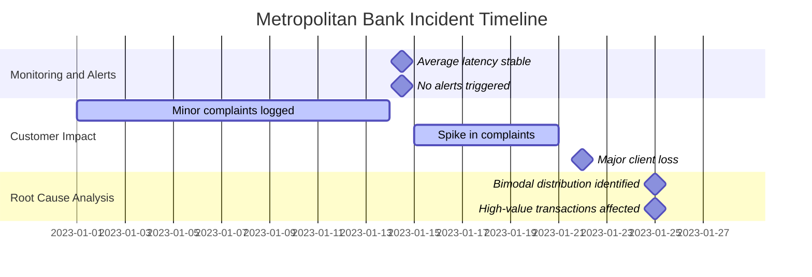
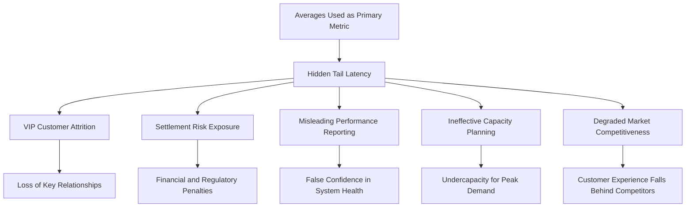
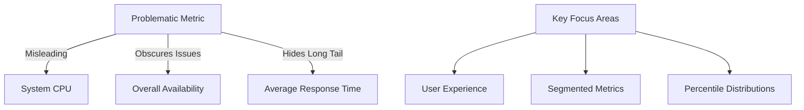
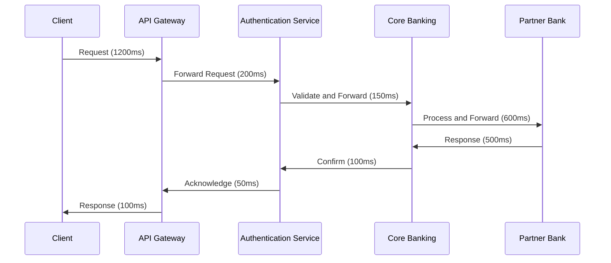
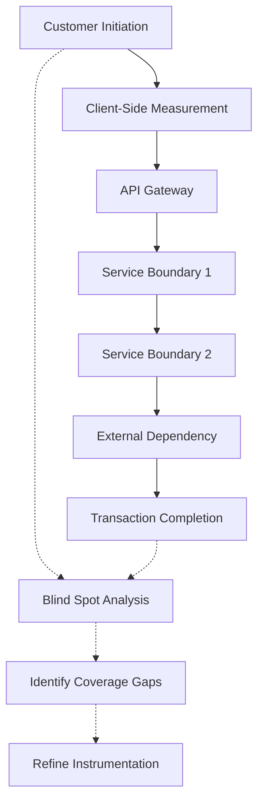
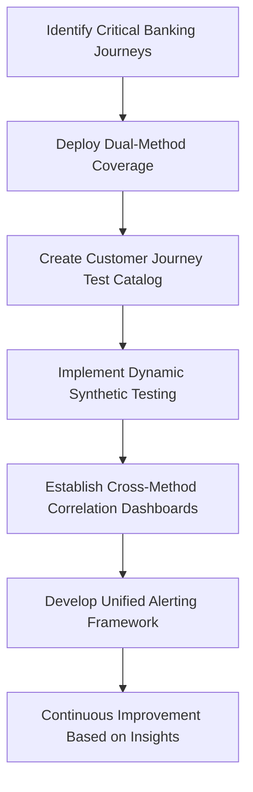
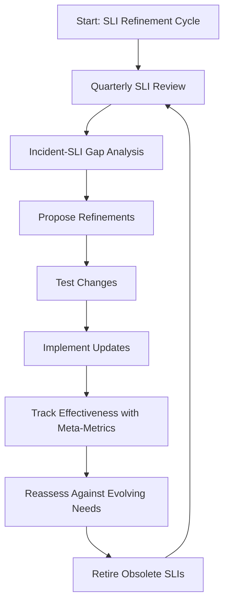

# Chapter 3: The Anatomy of Quality Metrics - Building Effective SLIs

## Chapter Overview

Welcome to the seven-layer burrito of SLI design—where most organizations drown in metrics and still manage to starve for real insight. This chapter peels back the layers of monitoring delusion: the dashboards that light up like Christmas trees while customers rage-tweet, the averages that hide your worst customers’ pain, the anti-patterns that lull your boss into a false sense of security, and the “improvements” that calcify into technical debt. If you’re still equating CPU graphs with service quality, congratulations: you’re part of the problem. We’re here to teach you how to slice through the noise, expose the real failures, and design SLIs that actually matter—because in banking, the cost of confusion isn’t just downtime; it’s headlines, lawsuits, and your job. Buckle up.

______________________________________________________________________

## Learning Objectives

- **Distinguish** signal from noise in metric selection, focusing on what actually impacts customers (not just what’s easy to measure).
- **Construct** a robust metrics hierarchy—from raw logs to business-centric SLIs—avoiding data swamp paralysis.
- **Apply** distribution metrics (percentiles, not just averages) to expose hidden performance disasters lurking in the “long tail.”
- **Detect and eliminate** common SLI anti-patterns before they torpedo your incident response and credibility.
- **Select** instrumentation points with surgical precision to capture real user experience, not just backend happy talk.
- **Integrate** synthetic and real user monitoring for a holistic, no-excuses view of service health.
- **Continuously refine** SLIs based on real incidents and changing business realities—because static metrics are just another form of technical debt.

______________________________________________________________________

## Key Takeaways

- “Monitor everything” is not a strategy; it’s a recipe for missing the only metric that matters when the bank’s on fire.
- Chasing system metrics during an outage? Enjoy your two-hour wild goose chase while customers flee and compliance calls.
- Averages lie. Your “healthy” mean response time won’t save you when VIP clients are stuck in 60-second transaction purgatory.
- Aggregate metrics are like blended smoothies—good luck finding the rotten banana that’s ruining the taste.
- If your SLIs can’t tell you exactly which customer journeys are failing, you’re not monitoring reliability; you’re hallucinating it.
- Overreliance on synthetic monitoring creates “perfect” dashboards and blind spots wide enough to drive a regulatory audit through.
- Instrumenting at the wrong boundary means you’ll swear everything is fine while Twitter explodes with complaints.
- SLIs are hypotheses, not holy writ. If you haven’t updated them since last quarter, you’re probably measuring the wrong universe.
- Every anti-pattern you ignore is a future root cause analysis waiting to happen—except next time, you’ll have to explain it to the CEO.
- In banking, poor metric selection doesn’t just cost money; it costs trust, compliance, and possibly your next performance review.

______________________________________________________________________

## Panel 1: Signal and Noise - The Art of Metric Selection

### Scene Description

A banking operations center during a major incident. The room is filled with tension as multiple dashboards display dozens of graphs and alerts, all flashing red. Two teams of engineers are clustered around separate screens, arguing over which metrics matter most. They point at system-level metrics like CPU usage and memory consumption, their voices rising as they struggle to make sense of the chaos.

In contrast, SRE lead Sofia stands calmly in the corner, focused on a single graph. This graph, clear and uncluttered, shows customer transaction success rate plummeting. She picks up a marker and draws a precise circle around this graph, then crosses out several others with firm strokes, signaling their irrelevance.

A junior engineer, observing quietly nearby, begins to connect the dots. The chaotic dashboards represent noise, distracting the teams, while Sofia’s selected graph cuts through to the signal—the metric that truly reflects the customer experience.

Here’s a representation of the scene:

```
+------------------------------------------------------+
|   Dashboard A: System Metrics                        |
|   [CPU: 85%] [Memory: 72%] [Network: 1Gbps]          |
|   [Disk Queue: 10ms] [Error Rate: 0.02%]             |
|   (Flashing alerts, engineers arguing)               |
+------------------------------------------------------+

+------------------------------------------------------+
|   Dashboard B: Application Metrics                   |
|   [Request Count: 1200/s] [Latency: 200ms]           |
|   [Queue Depth: 30] [Error Count: 12]                |
|   (More flashing alerts, engineers pointing)         |
+------------------------------------------------------+

                    --> Sofia's Graph <--
+------------------------------------------------------+
|   Customer Transaction Success Rate: 45% (Plummeting)|
|   (Sofia highlights this graph)                     |
|   (Junior engineer observes with dawning clarity)    |
+------------------------------------------------------+
```

The stark contrast between the noisy system/application metrics and Sofia’s focused customer-centric metric underscores the art of identifying the signal in a sea of noise.

### Teaching Narrative

Quality SLIs emerge from a sea of potential metrics through careful selection and refinement. In complex banking systems, every component generates hundreds of metrics—CPU usage, memory consumption, queue depths, network throughput, error counts, and countless others. The challenge isn't finding metrics to measure; it's identifying which few metrics truly matter.

Signal-to-noise ratio is a critical concept in SLI design. "Signal" refers to metrics that genuinely reflect customer experience and predict service health. "Noise" includes metrics that fluctuate without meaningful impact on users or that mislead during incidents. Distinguishing between them requires both technical understanding and business context.

For production support engineers transitioning to SRE, this represents a fundamental shift in thinking. Rather than monitoring everything possible "just in case," we must deliberately select the few metrics that provide the clearest signal about service health. This parsimony in metric selection improves both operational efficiency and incident response effectiveness.

### Common Example of the Problem

During a critical incident at First National Bank, the payment gateway began rejecting customer transactions. The operations center erupted with alerts—database connections spiking, memory utilization climbing on application servers, and network traffic patterns showing anomalies across multiple systems. The incident team focused intensely on these system metrics, with database specialists optimizing queries and system engineers adding capacity to application servers.

Two hours into the incident, customer complaints continued mounting. Despite improvements in system metrics, transactions were still failing. A senior SRE finally identified the actual issue: the payment processor's API key had expired, causing 100% of authentication attempts to fail. This critical customer-impacting issue was hidden behind dozens of symptomatic alerts that diverted attention from the core problem.

Below is a timeline illustrating how the incident unfolded, highlighting how noisy metrics initially misled the team and how the true root cause was discovered:

```mermaid
gantt
    title Incident Timeline: Signal vs Noise

    section Noisy Metrics
    Alerts Triggered        :done, 0, 0m
    Database Metrics Investigated :active, a1, 0m, 60m
    System Metrics Investigated   :active, a2, 60m, 60m

    section Customer Impact
    Transactions Failing    :crit, b1, 0m, 120m
    Customer Complaints Rising :crit, b2, 30m, 90m

    section Signal Emerges
    Root Cause Identified (Expired API Key) : milestone, c1, 120m
    Recovery Actions Initiated  :active, c2, 120m, 30m
```

This timeline underscores the importance of focusing on high-signal metrics that reflect customer experience. While system metrics can provide valuable context, they often represent symptoms rather than causes. In this case, an SLI such as "Transaction Success Rate" would have immediately highlighted the true customer impact, allowing the team to identify and resolve the root cause far more quickly.

### SRE Best Practice: Evidence-Based Investigation

Evidence-based metric selection follows a systematic approach. Use the following checklist to guide your process:

#### Checklist for Evidence-Based Metric Selection:

1. **Customer Journey Mapping**

   - [ ] Document critical user paths (e.g., account login, balance check, payment initiation).
   - [ ] Identify key outcomes that matter to users at each step.

2. **Failure Mode Analysis**

   - [ ] Review historical incidents for each critical path.
   - [ ] Determine what went wrong from the customer perspective (not just technical symptoms).
   - [ ] Identify recurring failure patterns or customer pain points.

3. **Signal Validation**

   - [ ] Test candidate metrics against historical incident data.
   - [ ] Confirm that metrics provide clear, consistent signals of customer impact.
   - [ ] Eliminate metrics that fail to correlate with known issues.

4. **Component Dependency Analysis**

   - [ ] Map relationships between services and components.
   - [ ] Identify upstream metrics that act as leading indicators for downstream customer experience.
   - [ ] Cross-verify dependencies to ensure accuracy.

5. **Controlled Experiments**

   - [ ] Plan and execute fault injection tests, if feasible.
   - [ ] Validate which metrics most clearly signal customer-impacting issues during controlled conditions.
   - [ ] Refine metric selection based on experimental results.

#### Metric Qualification Standards:

The most effective SRE teams maintain clear "metric qualification standards." Ensure potential SLIs meet the following criteria:

- [ ] **Direct Correlation**: The metric directly reflects customer experience.
- [ ] **Consistency**: The metric behaves predictably across different traffic patterns.
- [ ] **Stability**: The metric remains stable and noise-free during non-incident periods.

By following this systematic checklist, you can reduce noise and focus on metrics that provide meaningful, actionable signals for service health and customer experience.

### Banking Impact

Poor metric selection in banking environments leads to several serious business consequences. The table below summarizes these impacts alongside potential mitigation strategies to make this information more actionable:

| **Business Consequence** | **Description** | **Mitigation Strategy** |
| -------------------------------------- | ------------------------------------------------------------------------------------------------- | -------------------------------------------------------------------------------------------------------------- |
| **Extended Outage Duration** | Chasing symptomatic alerts rather than focusing on customer impact extends resolution times. | Prioritize customer-centric SLIs (e.g., transaction success rate) and de-emphasize noisy system-level metrics. |
| **Misallocated Engineering Resources** | Teams invest in optimizing metrics that don’t improve customer experience, wasting resources. | Regularly review and align metrics with customer impact and business objectives. |
| **False Confidence** | System metrics may indicate health while customers face critical failures, delaying intervention. | Use SLIs that directly reflect customer experience and validate them during post-incident reviews. |
| **Regulatory Reporting Failures** | Inaccurate health assessments lead to incorrect regulatory reports, triggering compliance risks. | Design metrics that align with regulatory requirements and ensure accurate reporting workflows. |
| **Loss of Customer Trust** | Extended incidents damage the bank's reputation as a reliable financial partner. | Focus on early detection of customer-impacting events and resolve them quickly using actionable SLIs. |

By understanding these consequences and applying mitigation strategies, SREs can select metrics that improve operational effectiveness while safeguarding business and customer outcomes.

### Implementation Guidance

To improve metric selection in your banking environment:

1. **Conduct a Metric Audit**: Review your current monitoring and classify metrics as either customer-impacting indicators or system-state indicators. Consider deprecating metrics that don't contribute meaningful signal.

2. **Implement Customer Journey Synthetic Monitoring**: Deploy automated tests that regularly execute critical customer paths (login, account overview, transfers, payments) to measure success rates and performance from the customer perspective.

3. **Create an Incident Metric Evaluation Process**: After each significant incident, formally evaluate which metrics provided the earliest and clearest signals of customer impact, and which generated noise or distraction.

4. **Develop a Metric Selection Framework**: Establish clear criteria that any proposed SLI must meet, including direct customer impact correlation, clear thresholds, and proven predictive value.

5. **Build a Customer Impact Dashboard**: Create a high-level dashboard showing only direct customer experience metrics, separate from system metrics, to maintain focus on what truly matters during incidents.

## Panel 2: Metrics Hierarchy - From Raw Data to SLIs

### Scene Description

A whiteboard session shows a pyramid diagram labeled "Metrics Hierarchy." At the bottom, engineer Alex points to "Raw Metrics" (server logs, API calls, database queries). The middle layer shows "Aggregated Metrics" (error rates, latency averages). At the top are "SLIs" (99th percentile payment processing time, funds availability success rate). Team members stand around the whiteboard as Raj explains the transformation process, with banking examples written next to each layer. A junior engineer is having an "aha" moment, connecting raw logs she's familiar with to the high-level SLIs.

Here’s a simple text-based representation of the pyramid hierarchy discussed:

```
Metrics Hierarchy:
  ┌──────────────────────────┐
  │ Service Level Indicators │
  │  (e.g., % of payments    │
  │   processed within SLA)  │
  └────────────▲─────────────┘
               │
  ┌────────────┴─────────────┐
  │   Aggregated Metrics      │
  │  (e.g., error rates,      │
  │   latency averages)       │
  └────────────▲─────────────┘
               │
  ┌────────────┴─────────────┐
  │       Raw Metrics         │
  │ (e.g., server logs, API   │
  │ calls, database queries)  │
  └──────────────────────────┘
```

This hierarchy illustrates how raw data forms the foundation, which is aggregated into statistical summaries and then contextualized into user-centric SLIs at the top.

### Teaching Narrative

Quality SLIs don't typically emerge directly from raw data—they're constructed through a hierarchical transformation process:

1. **Raw Metrics**: The base layer consists of individual data points and events—log entries, span traces, status codes, timestamp differences. These are numerous but lack context.

2. **Aggregated Metrics**: The middle layer combines raw data points using statistical methods like averaging, percentiles, rates, or counts over time intervals. This creates meaningful measurements like "average API latency" or "error rate per minute."

3. **Service Level Indicators**: The top layer applies business context, thresholds, and service boundaries to aggregated metrics, creating measurements that directly reflect user experience, like "percentage of payments processed within SLA."

Understanding this hierarchy helps SREs construct better indicators. For banking systems, raw metrics might include individual transaction logs and database query times. These are aggregated into service-level statistics and eventually transformed into user-centric SLIs like "percentage of trades executed within 100ms of submission."

This hierarchical approach ensures that SLIs maintain connection to underlying data while providing the high-level view needed for service management.

### Common Example of the Problem

Global Investment Bank's trading platform suffered from poorly constructed metrics that failed to provide actionable insights. Their monitoring collected thousands of raw metrics—individual HTTP status codes, specific API endpoint response times, server resource utilization. During a critical market volatility event, engineers struggled to translate this overwhelming raw data into a clear understanding of trading service health.

Operations teams could see individual transaction logs showing some failures, but couldn't determine if these represented a significant issue or normal statistical variance. Without properly aggregated metrics, they couldn't identify patterns or quantify impact. And without properly defined SLIs, they had no reference point to determine if current performance was acceptable or in a critical state.

The result was decision paralysis during a critical trading period, with teams unable to confidently determine if intervention was necessary. Only after the market closed could they retrospectively analyze the data to discover that clients had experienced significant trade execution delays, costing millions in missed opportunities.

______________________________________________________________________

#### Checklist: Common Issues in Metrics Hierarchy Missteps

Use this checklist to identify potential gaps in your own system's metrics hierarchy:

1. **Overwhelming Raw Metrics**:

   - Are you collecting too many raw metrics without clear aggregation strategies?
   - Do you rely heavily on low-level logs (e.g., individual transaction logs) for operational monitoring?

2. **Lack of Aggregated Metrics**:

   - Are raw data points transformed into meaningful metrics (e.g., percentiles, averages, rates) using statistical methods?
   - Are patterns in system behavior being captured, or are you left with isolated data points?

3. **Missing or Poorly Defined SLIs**:

   - Are your SLIs tied to real user experiences and business outcomes?
   - Have you established thresholds and boundaries that clearly indicate service health?

4. **Difficulty During Critical Events**:

   - Can your team quickly assess service health during incidents or high-pressure situations?
   - Are your metrics actionable enough to guide decisions in real time?

By addressing these common issues, you can ensure your metrics hierarchy—from raw data to SLIs—is robust, actionable, and aligned with both technical and business objectives.

### SRE Best Practice: Evidence-Based Investigation

Building an effective metrics hierarchy requires systematic refinement. The following table summarizes key best practices, their purposes, and examples to make these methodologies actionable:

| **Practice** | **Purpose** | **Example** |
| -------------------------------- | ---------------------------------------------------------------------------- | -------------------------------------------------------------------------------------------------------------------- |
| **Bottom-Up Validation** | Ensure transformation layers accurately reflect customer experience signals. | Trace a payment transaction from raw logs to its corresponding SLI for "99th percentile processing time." |
| **Top-Down Decomposition** | Provide traceability by mapping how SLIs are derived from underlying data. | Document how "percentage of trades executed within 100ms" is built from aggregated API and database query times. |
| **Failure Scenario Testing** | Verify visibility of failure modes across all hierarchy layers. | Simulate a database outage and confirm its impact is detectable in raw logs, aggregated metrics, and SLIs. |
| **Granularity Balance Analysis** | Optimize aggregation levels for clarity and diagnostic usefulness. | Compare error rates aggregated per service vs. per endpoint to decide which level best supports incident response. |
| **Cross-Validation** | Confirm consistency and correlation across hierarchy levels. | During postmortems, compare "error rate per minute" with "percentage of payments failing SLA" to validate alignment. |

When properly implemented, this hierarchy enables both high-level service health assessment and drill-down capability for root cause identification. During incidents, teams can start with SLIs to identify impact, then descend through the hierarchy to diagnose specific contributing factors.

### Banking Impact

Inadequate metrics hierarchies in banking environments create several significant business issues, much like how inefficiencies in a supply chain can disrupt operations and profitability. Consider the following analogy:

A supply chain starts with raw materials (comparable to raw metrics like transaction logs or database query times). These materials are processed and assembled into components (analogous to aggregated metrics like error rates or average latencies). Finally, the components are combined into finished products that customers value (akin to SLIs reflecting user experience, such as "percentage of payments processed within SLA"). Without proper organization and flow at each stage, the entire system struggles to deliver value.

When the metrics hierarchy in banking is inadequate, the following problems arise:

1. **Delayed Decision-Making**: Similar to a supply chain bottleneck delaying shipments, the lack of clear high-level indicators prevents stakeholders from quickly assessing service health, leading to slower decisions during incidents.

2. **Disproportionate Response**: Just as a supply chain manager might overstock certain materials while neglecting critical shortages, teams may overreact to minor technical issues or underestimate severe customer impacts without properly quantifying service performance.

3. **Compliance Documentation Gaps**: Regulatory reporting is akin to ensuring product traceability in a supply chain. Without structured and traceable metrics, providing evidence of service performance for compliance becomes challenging.

4. **Misaligned Business Communication**: Imagine trying to explain supply chain delays to customers without clear data on where disruptions occurred. Similarly, technical teams struggle to communicate service status to business stakeholders without well-contextualized high-level metrics.

5. **Investment Misallocation**: Just as a supply chain might waste resources optimizing non-critical links, misaligned metrics lead to technology investments targeting areas that don’t significantly affect the customer experience.

A robust metrics hierarchy ensures that raw data is systematically transformed into meaningful insights, enabling banking systems to operate as smoothly and efficiently as a well-optimized supply chain.

### Implementation Guidance

To improve your metrics hierarchy:

1. **Map Your Complete Metrics Flow**: Document how data moves from source systems through aggregation to final SLIs, identifying gaps or inconsistencies in the transformation process. Use tools like data flow diagrams or dependency maps to visualize the pipeline.

2. **Implement a Formal Metrics Classification System**: Tag and categorize metrics by their hierarchy level (raw, aggregated, SLI) and type (availability, latency, throughput, correctness) in your observability platform. For example, in Prometheus, you can use labels to distinguish between metric types:

   ```yaml
   # Example Prometheus metrics classification
   raw_metric_total_requests{type="raw", category="throughput"}
   aggregated_metric_error_rate{type="aggregated", category="availability"}
   sli_payment_success_rate{type="sli", category="correctness"}
   ```

3. **Create Multi-Level Dashboards**: Build visualization layers that allow seamless navigation from high-level SLIs down to contributing aggregated metrics and ultimately to raw data samples. Use tools like Grafana to link panels for drill-down capabilities.

   ```yaml
   # Example Grafana dashboard JSON snippet for layered navigation
   {
     "panels": [
       {
         "title": "SLI: Payment Success Rate",
         "type": "gauge",
         "targets": [{ "expr": "sli_payment_success_rate" }]
       },
       {
         "title": "Aggregated Metric: Error Rate",
         "type": "graph",
         "targets": [{ "expr": "aggregated_metric_error_rate" }]
       },
       {
         "title": "Raw Metric: Total Requests",
         "type": "table",
         "targets": [{ "expr": "raw_metric_total_requests" }]
       }
     ]
   }
   ```

4. **Establish Aggregation Standards**: Define consistent aggregation methods (percentiles, rates, averages) and time windows across similar metrics to enable meaningful comparison. For example, use PromQL queries to enforce a standard:

   ```promql
   # Aggregated error rate over a 5-minute window
   sum(rate(http_requests_total{status="5xx"}[5m])) / sum(rate(http_requests_total[5m]))
   ```

5. **Develop a Metrics Data Dictionary**: Create clear documentation of how each SLI is constructed from underlying metrics, including calculation formulas, data sources, and business context. Here’s an example for an SLI:

   ```
   SLI Name: Payment Success Rate
   Description: Percentage of payment transactions processed successfully within SLA
   Formula: (successful_payments / total_payments) * 100
   Data Sources: payment_transaction_logs, API success metrics
   Business Context: Reflects user satisfaction with payment processing reliability
   ```

## Panel 3: Percentiles vs. Averages - Understanding Distribution Metrics

### Scene Description

The dashboard comparison vividly contrasts two metrics for payment processing times in a high-volume banking system. The left panel displays a smooth average response time graph, consistently showing 120ms. The right panel presents a more detailed percentile distribution graph with key markers: **P50 at 85ms**, **P90 at 150ms**, **P99 at 450ms**, and **P99.9 at 2300ms**.

Below is a text-based representation of the percentile distribution graph, annotated to highlight the dramatic P99.9 spike:

```
Response Time (ms)
|
|                                        *
|                                        |
|                                        |
|                          *             |
|                          |             |
|                          |             |
|           *              |             |
|           |              |             |
|           |              |             |
|  *        |              |             |
|  |        |              |             |
|  |        |              |             |
+------------------------------------------------
   P50       P90          P99         P99.9
   85ms     150ms         450ms       2300ms
```

In the scene, SRE Jamila points to a specific incident on the percentile graph where the **P99.9 latency spiked dramatically to 2300ms**. She explains how the average response time graph remained unaffected, masking the outlier impact. Team members, alarmed, realize their average-based alerts failed to detect this significant customer pain. Meanwhile, an engineer shares a customer complaint that corroborates the issue: "Transactions were extremely slow during this period." This moment underscores the critical importance of monitoring percentile metrics to capture the full spectrum of customer experiences.

### Teaching Narrative

Distribution metrics like percentiles provide critical insights that averages obscure, especially in systems with non-uniform performance patterns.

Consider a payment processing system where most transactions complete in 100ms, but 1% take over 1000ms. The average latency might be an acceptable 120ms, completely hiding the terrible experience of that 1% of customers. Percentiles reveal this hidden reality by showing the full distribution of experiences:

- **P50 (median)**: 50% of customers experience this performance or better
- **P90**: 90% of customers experience this performance or better
- **P99**: 99% of customers experience this performance or better
- **P99.9**: 99.9% of customers experience this performance or better

For critical banking services, the experience of the slowest 1% or 0.1% of transactions often matters tremendously—these might represent high-value clients or critical transaction types. Using percentiles in SLIs ensures visibility into these edge cases.

This is particularly important in financial systems where regulations might stipulate maximum response times or where delayed transactions could have significant business impact. By incorporating percentiles into your SLIs, you gain visibility into the full spectrum of customer experiences, not just the average case.

### Common Example of the Problem

Metropolitan Bank's corporate payments platform experienced growing customer complaints despite metrics showing acceptable performance. The monitoring dashboard prominently displayed average transaction processing time—consistently around 3.2 seconds—which met their internal target of under 5 seconds.

However, a detailed analysis revealed significant performance issues hidden by the reliance on averages. The breakdown below illustrates the true distribution of transaction times during a critical month:

| Time Period | Average Latency | P50 Latency | P90 Latency | P99 Latency | P99.9 Latency | Customer Complaints Logged |
| ----------------- | --------------- | ----------- | ----------- | ----------- | ------------- | -------------------------- |
| Week 1 (Baseline) | 3.2s | 2.1s | 4.8s | 15.0s | 45.0s | 3 |
| Week 2 | 3.3s | 2.2s | 5.0s | 20.0s | 60.0s | 12 |
| Week 3 (Incident) | 3.4s | 2.5s | 6.0s | 40.0s | 90.0s | 45 |
| Week 4 | 3.2s | 2.1s | 4.7s | 14.0s | 42.0s | 8 |

### Timeline of Events



The table and timeline clearly show that while average latency remained stable, percentile metrics such as P99 and P99.9 revealed significant performance degradation during Week 3. Customer complaints mirrored these spikes, culminating in the loss of a major corporate client on January 22.

This example underscores the importance of using percentile metrics to detect and address performance issues affecting critical transactions.

### SRE Best Practice: Evidence-Based Investigation

Distribution-aware metric analysis requires a systematic and evidence-based approach to uncover hidden performance issues. Use the following step-by-step guide to implement best practices effectively:

#### Step-by-Step Guide for Distribution Analysis

1. **Profile the Full Distribution**

   - Regularly analyze complete latency distributions instead of relying solely on summary statistics.
   - Look for multi-modal patterns, long tails, or shifts in distribution shape that may indicate emerging issues.

2. **Perform Segmented Percentile Analysis**

   - Calculate key percentiles (P50, P90, P99, P99.9) for various dimensions such as:
     - Customer segments (e.g., premium vs. standard users)
     - Transaction types (e.g., balance checks vs. fund transfers)
     - Value bands (e.g., low-value vs. high-value transactions)
   - Identify segments consistently experiencing higher latency.

3. **Conduct Comparative Time-Series Analysis**

   - Track changes in key percentiles over time to identify trends or degradation patterns.
   - Focus on divergence between percentiles (e.g., widening gap between P90 and P99) to detect potential bottlenecks.

4. **Validate Thresholds Against Customer Impact**

   - Correlate specific percentile thresholds with customer behavior, such as:
     - Increased support calls or complaints
     - Higher abandonment rates for transactions
     - Reduced usage patterns
   - Use these correlations to prioritize percentile levels most critical to user experience.

5. **Investigate Outlier Transactions**

   - Systematically capture and analyze transactions in the tail of the distribution (e.g., P99.9 and beyond).
   - Identify recurring patterns or failure modes, such as:
     - Specific service dependencies
     - Large payload sizes
     - Geographic or network-related latency

6. **Adopt Distribution-Based Alerting**

   - Implement alerts based on changes in distribution shape or percentile values rather than averages.
   - Use "distribution shifts" as an early warning system for potential customer pain.

#### Checklist for Evidence-Based Metric Investigation:

- [ ] Regularly analyze full latency distributions.
- [ ] Calculate and monitor percentiles (P50, P90, P99, P99.9) across key dimensions.
- [ ] Track percentile trends over time for degradation patterns.
- [ ] Correlate percentile thresholds with real-world customer impact.
- [ ] Capture and investigate outlier transactions systematically.
- [ ] Set up distribution-based alerting for faster detection of critical issues.

By following these steps and continuously refining your approach, you can ensure that your monitoring systems provide actionable insights into the full spectrum of customer experiences, enabling timely and effective responses to performance issues.

### Banking Impact

Relying on averages rather than distribution metrics creates several significant banking business impacts. The following cause-effect flowchart illustrates how this reliance cascades into critical issues:



#### Key Impacts

1. **VIP Customer Attrition**: High-value clients often experience disproportionate impact from tail latency, leading to loss of key relationships and significant revenue. For example, a VIP client experiencing repeated delays in high-stakes transactions may seek alternatives with more consistent performance.

2. **Settlement Risk Exposure**: Extreme processing delays that remain hidden in averages can cause settlement failures or missed cutoff times. This exposes the bank to financial penalties, increased regulatory scrutiny, and reputational damage.

3. **Misleading Performance Reporting**: Executive and regulatory reporting based solely on averages presents an inaccurately positive picture of service performance. This can lead to overconfidence in the system's health and missed opportunities to proactively address critical issues.

4. **Ineffective Capacity Planning**: Average-based planning ignores the resources needed to handle spikes in tail latency. As a result, systems repeatedly fall short during peak demand, leading to cascading operational failures.

5. **Degraded Market Competitiveness**: Competitors improving their systems for consistent performance gain a significant edge in customer experience. Banks relying on averages risk losing customers to competitors with more reliable and predictable services.

By understanding and addressing these impacts through percentile-based metrics, banks can mitigate risks, improve customer satisfaction, and maintain market competitiveness.

### Implementation Guidance

To implement distribution-aware metrics in your environment:

1. **Upgrade Your Metrics Collection**: Configure your monitoring systems to capture complete histogram data rather than pre-aggregated averages, enabling percentile calculation and distribution analysis. For example, if you're using Prometheus, ensure that your metrics include histogram buckets:

   ```yaml
   # Example Prometheus configuration for histogram metrics
   histograms:
     - name: transaction_latency_seconds
       buckets: [0.1, 0.5, 1, 5, 10] # Define latency buckets in seconds
   ```

2. **Implement Multi-Percentile SLIs**: Define SLIs that include multiple percentile thresholds (e.g., P50, P90, P99) with appropriate targets for each. For instance, in PromQL:

   ```promql
   # PromQL query to calculate P99 latency from histogram metrics
   histogram_quantile(0.99, sum(rate(transaction_latency_seconds_bucket[5m])) by (le))
   ```

3. **Create Tail Latency Dashboards**: Build visualizations that highlight the performance of the slowest transactions. In Grafana, use percentile queries to display P95/P99 on custom dashboards with drill-down capabilities to inspect tail events. Example panel configuration could include:

   ```
   Query: histogram_quantile(0.99, sum(rate(transaction_latency_seconds_bucket[5m])) by (le))
   Visualization: Time series
   ```

4. **Deploy Percentile-Based Alerting**: Configure alerts that trigger on significant changes to critical percentiles (especially P95 and above), not just on average value changes. For example, using an alerting rule in Prometheus:

   ```yaml
   # Example percentile-based alerting rule
   alert: HighP99Latency
   expr: histogram_quantile(0.99, sum(rate(transaction_latency_seconds_bucket[5m])) by (le)) > 1.0
   for: 2m
   labels:
     severity: critical
   annotations:
     summary: "P99 transaction latency is too high"
     description: "The P99 latency for transactions has exceeded 1s for the last 2 minutes."
   ```

5. **Establish Transaction Segmentation**: Implement tagging of transactions by type, value, and customer segment to enable distribution analysis across different business-relevant dimensions. For example, add labels like `transaction_type` or `customer_tier` to your metrics:

   ```yaml
   # Example metric with segmentation
   transaction_latency_seconds_bucket{transaction_type="payment", customer_tier="premium", le="1.0"}
   ```

## Panel 4: The Danger Zone - Avoiding Anti-Patterns in SLI Design

### Scene Description

A post-incident review meeting is underway, with the team analyzing a major service disruption that went undetected by monitoring. On the whiteboard at the front of the room, titled "SLI Anti-Patterns," several problematic metrics are listed, each marked with a red X:

- **System CPU**: A server was overloaded but the service remained functional.
- **Overall Availability**: The problem affected only mobile users.
- **Average Response Time**: Only certain transaction types were slow.

Below the list, a note reads: "Focus on user experience, not system stats."

Sofia stands near the whiteboard, pointing to specific areas on a series of dashboards projected onto the wall. Each dashboard highlights a failure in detecting the issue. She circles problematic sections with a red marker, emphasizing key points to the team:



Team members sit around the table, concerned as they analyze the dashboards. Sofia explains how these anti-patterns led to the disruption going undetected and outlines how the metrics need to be redesigned to provide a clear, actionable reflection of service health.

### Teaching Narrative

Even carefully selected metrics can become misleading when implemented poorly. Several common anti-patterns undermine SLI effectiveness:

1. **Resource vs. Service Confusion**: Monitoring system resources (CPU, memory, disk) rather than service outcomes. A system can be at 99% CPU but still serving customers perfectly—or at 30% CPU yet completely failing.

2. **Overaggregation**: Combining metrics across different user segments, transaction types, or service components. This obscures problems affecting specific subsets of users or functionality.

3. **Averages Without Distribution**: Using averages without percentiles hides the experience of users in the "long tail" of the distribution.

4. **Thresholds Without Context**: Setting arbitrary thresholds (like "5 seconds is bad") without connecting to actual user experience or business requirements.

5. **Measuring What's Easy, Not What Matters**: Selecting metrics based on what's convenient to collect rather than what accurately reflects service health.

In banking systems, these anti-patterns are particularly dangerous. For example, aggregating across all transaction types might hide critical failures in wire transfers while simpler transactions continue to function, or monitoring overall system availability might miss authentication failures affecting mobile customers.

Recognizing and avoiding these anti-patterns is essential when transitioning from traditional monitoring approaches to effective SRE practices.

### Common Example of the Problem

Commercial Trust Bank experienced a critical failure in their corporate banking platform that went undetected by their monitoring systems for nearly four hours. During a routine deployment, a configuration change introduced a subtle authentication issue that affected only customers attempting to authorize international wire transfers above $50,000.

Despite the significant business impact, none of their monitoring systems triggered alerts because:

1. Their overall API success rate SLI remained above 99.5% since international wires represented only about 0.3% of total API calls.

2. System resource metrics showed normal patterns with no unusual CPU, memory, or database load.

3. Their availability metric was based on simple health check endpoints that continued to respond successfully.

4. Their average response time metric showed minimal change since the affected transactions were failing quickly rather than slowly.

The issue was finally discovered only when a major corporate client called executive management directly after being unable to complete several urgent high-value transfers, resulting in missed deadlines and financial penalties.

#### Timeline of Events

```mermaid
gantt
    title Failure Detection Timeline
    dateFormat HH:mm
    axisFormat %H:%M
    section Deployment
    Configuration change introduced       :done, config_change, 10:00, 10m
    section Impact on Users
    International wire transfers failing :crit, fail_start, 10:10, 4h
    Major corporate client contacts execs:crit, client_alert, 14:10, 10m
    section Monitoring Gaps
    API success rate shows no anomaly    :active, api_sli, 10:10, 4h
    Resource metrics remain normal       :active, resource_metrics, 10:10, 4h
    Health checks continue passing       :active, health_checks, 10:10, 4h
    section Incident Response
    Teams alerted and issue identified   :active, issue_identified, 14:20, 30m
    Mitigation begins                    :active, mitigation, 14:50, 1h
```



This timeline illustrates how the failure unfolded and went undetected for hours due to monitoring anti-patterns. It highlights the critical delay between the onset of the issue, the absence of actionable alerts, and the eventual discovery triggered by a client escalation.

### SRE Best Practice: Evidence-Based Investigation

Identifying and avoiding SLI anti-patterns requires systematic evaluation. Use the following checklist to guide your SLI reviews and ensure metrics effectively capture service health:

#### Evidence-Based SLI Evaluation Checklist:

1. **Segmentation Analysis**

   - Test metrics against scenarios where issues affect only specific customer segments, transaction types, or system components.
   - ✅ Can the metric detect problems isolated to a subset of users or functionality?
   - ✅ Are metrics disaggregated to support granular troubleshooting?

2. **Failure Mode Simulation**

   - Regularly conduct "metric fire drills" to model realistic failure scenarios.
   - ✅ Are common failure modes simulated to confirm SLIs highlight the issue?
   - ✅ Are SLIs updated as new failure patterns are discovered?

3. **Customer Journey Correlation**

   - Validate that SLIs measure complete customer journeys rather than isolated technical components.
   - ✅ Does the SLI represent end-to-end user experience?
   - ✅ Are customer pain points reflected in monitoring coverage?

4. **Threshold Sensitivity Testing**

   - Analyze historical data to ensure thresholds detect issues without excessive false positives.
   - ✅ Are thresholds tied to user-impacting performance?
   - ✅ Would past incidents have triggered the SLI appropriately?

5. **Business Impact Mapping**

   - Clearly document how each SLI protects specific business outcomes.
   - ✅ Is there a direct connection between SLI degradation and customer or business impact?
   - ✅ Are SLIs prioritized based on critical business functions?

#### Process Tip:

Incorporate **anti-pattern detection reviews** as part of your regular SLI evaluation cadence. Use this checklist to systematically verify that metrics are aligned with user experience and business priorities, while avoiding known pitfalls.

### Banking Impact

SLI anti-patterns in banking environments create several severe business consequences:

1. **Invisible Service Failures**: Critical business functions can fail completely without triggering alerts, directly impacting revenue and creating regulatory exposure.

2. **Misallocated Incident Response**: Teams waste valuable time investigating incorrect root causes based on misleading signals from flawed metrics.

3. **False Sense of Security**: Management operates under the dangerous illusion that services are being effectively monitored when significant blind spots exist.

4. **Inability to Prioritize Improvements**: Without accurate insights into which service aspects truly impact customers, improvement efforts target the wrong areas.

5. **Erosion of Trust in Monitoring**: As teams experience monitoring failures, they begin to distrust the system entirely, eventually ignoring even valid alerts.

### Implementation Guidance

To avoid SLI anti-patterns in your environment, follow these structured steps. The table below maps each step to the specific anti-patterns it addresses, providing clarity on how each action mitigates common pitfalls:

| Implementation Step | Addresses These Anti-Patterns | Key Outcomes |
| ------------------------------------------------- | ---------------------------------------------------------------------------------------------------------- | ------------------------------------------------------------------------------------------------------------- |
| **Conduct an Anti-Pattern Audit** | Resource vs. Service Confusion, Overaggregation, Averages Without Distribution, Thresholds Without Context | Identifies existing SLIs that fail to capture service health accurately under partial failure scenarios. |
| **Implement Segmented SLIs** | Overaggregation, Averages Without Distribution | Ensures isolated issues (e.g., specific customer segments or transaction types) are not masked by aggregates. |
| **Create an SLI Design Review Process** | All Anti-Patterns | Establishes a formal framework to systematically test SLIs against anti-patterns before deployment. |
| **Deploy Canary-Based Validation** | Resource vs. Service Confusion, Measuring What's Easy, Not What Matters | Validates critical business flows independently of underlying technical metrics. |
| **Establish Business-Technical Translation Maps** | Thresholds Without Context, Measuring What's Easy, Not What Matters | Connects SLIs to real user experience and business outcomes for meaningful and actionable metrics. |

#### Additional Tips:

- **Use Percentiles Over Averages**: Replace averages with percentiles (e.g., 95th or 99th) in your SLIs to capture outlier user experiences.
- **Simulate Failure Scenarios**: Regularly test how your SLIs behave during specific failure modes to uncover potential blind spots.
- **Iterate and Refine**: Treat SLIs as living artifacts that evolve alongside your systems and business needs.

By following these steps and leveraging the table as a reference, your team can systematically avoid SLI anti-patterns and design metrics that effectively reflect service health.

## Panel 5: Instrumentation Points - Where to Measure Matters

### Scene Description

A large architectural diagram of a banking payment system spans a wall display. Different colored pins mark possible measurement points: client applications, API gateways, service boundaries, and backend systems. Team members are engaged in a lively debate about the best places to capture metrics. SRE Raj is demonstrating how the same transaction appears different depending on where it's measured, showing latency numbers that vary dramatically between the client view (1200ms) and the server view (150ms). A diagram in the corner illustrates a user transaction passing through multiple systems with cumulative latency at each hop.

Below is a simplified representation of the transaction flow and latency accumulation using a Mermaid diagram:



This flow highlights how latency builds up at each hop, contributing to the overall client-perceived latency. The team is analyzing how measurements taken at different points—such as the client, the API gateway, or individual services—can provide unique insights or mislead if interpreted in isolation.

### Teaching Narrative

Where you measure is often as important as what you measure. The same service can appear entirely different depending on the instrumentation point, and choosing incorrectly can lead to blind spots or false confidence.

Key instrumentation decision points include:

1. **Client-Side vs. Server-Side**: Client-side measurements capture the true user experience, including network latency and client rendering time. Server-side measurements provide cleaner data about your service's performance in isolation.

2. **Before vs. After Load Balancers**: Measuring before load balancers captures rejected requests and queuing delays. Measuring after only shows successfully routed traffic.

3. **Service Boundaries vs. End-to-End Flows**: Measuring at service boundaries helps isolate problems to specific components. Measuring end-to-end flows shows the complete user experience.

For banking systems with complex transaction flows—often spanning multiple internal services and external partners—choosing instrumentation points requires careful consideration. A funds transfer might pass through authentication services, core banking, payment networks, and partner banks. Measuring only within your systems misses critical parts of the customer journey.

The SRE approach often involves multiple complementary instrumentation points to create a complete picture of service health. This multi-point measurement strategy helps quickly isolate issues during incidents and provides a more accurate view of the true customer experience.

### Common Example of the Problem

Atlantic Financial's digital banking team faced recurring challenges diagnosing customer complaints about transaction delays. Their monitoring showed excellent performance for payment processing—consistently under 500ms as measured at their service endpoint—yet customers regularly reported multi-second delays or uncertain transaction statuses.

During a high-profile incident, corporate customers experienced 30+ second delays when initiating international transfers, despite internal metrics showing normal performance. After extensive investigation, the team discovered multiple instrumentation gaps:

1. They were measuring API response time at the server, which only captured the time to acknowledge the request—not the complete processing time.

2. Their measurement excluded the authentication flow that preceded the transaction, which was experiencing significant delays.

3. They had no visibility into the payment partner gateway that processed the actual transfers after their system handed off the request.

4. Mobile app performance issues added several seconds of client-side processing time that was completely invisible to server-side metrics.

The result was a dangerous disconnect between reported system performance and actual customer experience, leading to repeated incident response failures and declining customer satisfaction.

#### Text-Based Flow Diagram of the Transaction Path

Below is a simplified representation of the transaction flow, highlighting where instrumentation gaps occurred:

```
[Customer Device] --(1)--> [Authentication Service] --(2)--> [Internal API Gateway] --(3)--> [Payment Processing Service] --(4)--> [Partner Payment Gateway] --(5)--> [Transaction Complete]

Key:
1. Client-side latency (e.g., mobile app delay) - Unmeasured
2. Authentication delays - Unmeasured
3. API response time - Measured (500ms)
4. Partner gateway processing time - Unmeasured
5. End-to-end transaction time - Unmeasured (30+ seconds experienced by customers)
```

This flow diagram illustrates how critical parts of the transaction journey were either unmeasured or only partially captured. Without a comprehensive instrumentation strategy, the digital banking team was blind to the true customer experience and struggled to diagnose performance issues effectively.

### SRE Best Practice: Evidence-Based Investigation

Strategic instrumentation point selection requires systematic analysis to ensure comprehensive visibility into system behavior and customer experience. Use the following checklist to guide your approach:

#### Checklist for Evidence-Based Investigation

1. **Customer Journey Tracing**:

   - Map the end-to-end transaction flow from initiation to completion.
   - Identify all systems, services, and external dependencies involved.
   - Pinpoint potential instrumentation points along the transaction path.

2. **Blind Spot Analysis**:

   - Compare current instrumentation coverage against the mapped transaction path.
   - Identify gaps where issues could occur undetected.
   - Prioritize closing gaps that directly impact the user experience.

3. **Multi-Perspective Verification**:

   - Implement measurements at multiple levels:
     - **Client-side**: Captures user-perceived latency and errors.
     - **API Gateway**: Records traffic entering your system.
     - **Service and Dependency Levels**: Tracks internal and external component performance.
   - Correlate data across these points to validate findings.

4. **Boundary Latency Analysis**:

   - Measure handoff points between systems or services.
   - Focus on integration points where delays or errors may accumulate.
   - Use these measurements to localize issues during incidents.

5. **Component Contribution Mapping**:

   - Analyze how each system segment contributes to overall transaction latency.
   - Quantify the impact of each component on the customer journey.
   - Use this data to prioritize optimization and additional instrumentation.

6. **Periodic Instrumentation Coverage Reviews**:

   - Regularly review and update instrumentation coverage as systems evolve.
   - Ensure visibility into new services, dependencies, or transaction flows.
   - Incorporate findings into incident postmortems and reliability engineering plans.

#### Example Workflow for Incident Investigation



By following this checklist and workflow, SRE teams can systematically identify critical measurement points, ensure comprehensive visibility, and support evidence-based decision-making during incident investigations and performance optimization efforts.

### Banking Impact

Poor instrumentation point selection creates several critical business impacts in banking environments:

1. **Misleading Performance Reporting**: Executive dashboards show excellent service performance while customers experience significant delays, creating dangerous misalignment between perceived and actual service quality.

2. **Extended Mean-Time-To-Resolution**: Incident response teams waste critical time searching for issues in well-instrumented components while problems hide in uninstrumented areas.

3. **Ineffective Performance Investment**: Engineering resources target performance improvements in components that show poor metrics but may not be the actual customer experience bottlenecks.

4. **Integration Issue Blindness**: Problems at integration points between bank systems and financial partners go undetected, creating transaction failures that neither party identifies promptly.

5. **Regulatory Reporting Gaps**: Incomplete measurement leads to inaccurate reporting of service reliability to regulatory bodies, creating compliance risks.

### Implementation Guidance

To improve instrumentation point selection, follow these practices and consider the expected benefits outlined in the table below:

| Recommendation | Expected Benefit |
| -------------------------------------------- | ----------------------------------------------------------- |
| **Create a Measurement Point Map** | Improved visibility into all transaction stages. |
| **Implement Client-Side Measurement** | Accurate representation of end-user experience. |
| **Establish Service Boundary Metrics** | Faster isolation of cross-component issues. |
| **Deploy End-to-End Synthetic Transactions** | Comprehensive monitoring of full customer journeys. |
| **Create Multi-Level Latency Dashboards** | Quick bottleneck identification and performance comparison. |

#### Step-by-Step Guidance:

1. **Create a Measurement Point Map**:\
   Document all potential instrumentation points across your transaction flows, from client initiation through all processing stages to completion, including third-party integrations. This ensures no critical areas are overlooked.

2. **Implement Client-Side Measurement**:\
   Deploy real user monitoring in customer-facing applications to capture the actual end-user experience. Measure key metrics such as network latency, rendering time, and user interaction delays.

3. **Establish Service Boundary Metrics**:\
   Add instrumentation at every service boundary and integration point. This helps capture cross-component performance and identify issues at handoff points between services.

4. **Deploy End-to-End Synthetic Transactions**:\
   Use automated tests to simulate complete customer journeys regularly. These tests should measure performance across all components from an external perspective, ensuring the entire user experience is covered.

5. **Create Multi-Level Latency Dashboards**:\
   Build dashboards that consolidate latency metrics at various instrumentation points. Visualize client-side, server-side, and service boundary data simultaneously to facilitate quick comparisons and bottleneck detection.

By combining these practices with a clear understanding of your system's architecture, you can ensure robust and actionable monitoring that supports both operational efficiency and a superior customer experience.

## Panel 6: Synthetic vs. Real User Monitoring - The Complete Picture

### Scene Description

A split-screen operations dashboard labeled "Payment Gateway Monitoring" is displayed:

```
+-----------------------------------------------+
|               Payment Gateway Monitoring      |
|-----------------------------------------------|
| Synthetic Monitoring          | Real User Monitoring        |
|--------------------------------|----------------------------|
| - Probes testing the payment   | - Actual customer data      |
|   API every minute             | - Varying transaction       |
| - Predefined test cases        |   patterns                  |
| - Near-perfect reliability     | - Lower success rate (98.7%)|
|   (99.99%)                     |                            |
+-----------------------------------------------+
```

On the left side, "Synthetic Monitoring" shows consistent probes testing the payment API every minute with predefined test cases, achieving near-perfect reliability at 99.99%. On the right side, "Real User Monitoring" displays actual customer transaction data, revealing varying patterns and a slightly lower success rate of 98.7%.

An incident response team is investigating a discrepancy between the two monitoring methods. One engineer highlights a specific customer segment using a payment method that is not covered by synthetic tests. In response, Jamila adds a new synthetic test case to address this gap, demonstrating how the two approaches complement each other to provide a complete picture of service health.

### Teaching Narrative

Two complementary approaches to measurement are necessary for a complete view of service health:

**Synthetic Monitoring** uses predefined test transactions executed on a regular schedule to measure service health. These "canary" tests provide consistent, controlled measurements that can detect issues before they affect many users. In banking systems, synthetic monitoring often includes simulated logins, account inquiries, and test transactions that verify critical paths without moving actual money.

**Real User Monitoring (RUM)** captures data from actual customer interactions with the system. This provides authentic measurement of the true user experience across all usage patterns, devices, and transaction types. For financial services, RUM reveals how performance varies across different customer segments, transaction values, or product types.

Neither approach alone provides a complete picture:

- Synthetic monitoring offers consistency and early detection but can miss real-world edge cases and complexity.
- RUM provides comprehensive coverage of actual usage patterns but can be noisy and difficult to baseline.

Effective SLIs often combine both approaches—using synthetic monitoring for consistent trend analysis and alerting, while incorporating RUM to ensure you're measuring what users actually experience. This combined approach is particularly valuable in banking systems where transaction patterns can vary widely and where certain critical paths (like high-value transfers) might occur infrequently in normal operation.

### Common Example of the Problem

International Commerce Bank relied exclusively on synthetic monitoring for their corporate banking portal. Their test suite executed the same set of operations every five minutes: login, account balance retrieval, domestic wire transfer initiation, and report generation. According to these synthetic tests, service reliability consistently exceeded 99.9%, and the operations team confidently reported excellent platform health to leadership.

However, corporate clients were experiencing significant issues with several critical functions not covered by synthetic tests. These gaps in monitoring created a dangerous illusion of reliability, leaving customers struggling with critical functionality. The following table summarizes the synthetic test coverage and highlights the missed real-world issues:

| **Functionality** | **Synthetic Test Coverage** | **Real-World Issue Identified** |
| ------------------------------------------------- | --------------------------- | ---------------------------------------------------------- |
| Login | Covered | No significant issues identified |
| Account balance retrieval | Covered | No significant issues identified |
| Domestic wire transfer initiation | Covered | No significant issues identified |
| Multi-currency transfers | Not covered | Failed ~10% of the time due to an API validation error |
| Bulk payment uploads for payroll | Not covered | Timed out frequently when containing more than 200 entries |
| User permission management | Not covered | Periodically became unresponsive during peak hours |
| Mobile authentication for high-value transactions | Not covered | Success rate below 95% for certain device types |

These issues remained invisible until a major client threatened to leave, prompting a comprehensive review. This review revealed the significant gap between the synthetic test results and the actual customer experience. The narrow test coverage failed to account for real-world edge cases, resulting in a misleading view of platform health. By integrating Real User Monitoring, the bank could have identified these critical gaps earlier and improved the overall customer experience.

### SRE Best Practice: Evidence-Based Investigation

Implementing complementary monitoring approaches requires a systematic methodology. Use the following checklist to guide your investigation and ensure alignment between synthetic and real user monitoring:

#### Evidence-Based Investigation Checklist

- [ ] **Perform Coverage Gap Analysis**

  - Regularly compare synthetic test coverage against real user behavior patterns.
  - Identify high-impact user journeys or transaction types missing from synthetic monitoring.
  - Prioritize adding synthetic tests for critical gaps.

- [ ] **Conduct Synthetic-RUM Correlation Analysis**

  - Compare metrics from synthetic monitoring and real user data during both normal operation and incident periods.
  - Validate whether synthetic tests reliably predict real user experience, especially during outages or performance degradations.
  - Investigate discrepancies and adjust synthetic tests accordingly.

- [ ] **Discover and Address Edge Cases**

  - Analyze real user data to detect unusual but important transaction patterns or behaviors.
  - Expand synthetic test coverage to include these edge cases to improve reliability.

- [ ] **Develop Composite SLIs**

  - Create blended Service Level Indicators (SLIs) that integrate:
    - Synthetic monitoring for trend consistency and early detection.
    - Real user monitoring for comprehensive performance and experience insights.
  - Use these composite SLIs to measure service health more holistically.

- [ ] **Evolve Synthetic Test Suites**

  - Schedule regular reviews of your synthetic test suite.
  - Incorporate findings from recent user behavior trends and edge case discoveries.
  - Ensure your tests remain relevant as user behavior and system complexity evolve.

#### Bonus Practice: Monitoring Balance Scorecard

- Maintain a "monitoring balance scorecard" to evaluate your observability approach.
  - Assess whether your monitoring strategy appropriately combines synthetic and real user metrics.
  - Use the scorecard to track improvements and adjust priorities over time.

This checklist helps SRE teams systematically improve their monitoring strategy, ensuring both proactive and reactive insights into service health.

### Banking Impact

Understanding the balance between synthetic monitoring and real user monitoring is akin to using both a thermometer and a stethoscope in medical diagnostics—each tool serves a distinct but complementary purpose. Overreliance on one at the expense of the other can lead to critical blind spots with significant business implications for banking systems:

1. **Hidden Customer Pain**: Synthetic monitoring acts as a thermometer, consistently checking for general system health, but it lacks the nuanced listening of a stethoscope to detect specific customer issues. Without RUM, problems impacting niche customer segments or unique transaction types go unnoticed, leading to customer dissatisfaction and attrition.

2. **False Alarm Fatigue**: Synthetic tests can create "false fevers," triggering alarms for issues that may not affect real users. RUM acts as a stethoscope, providing the context needed to distinguish false positives from real problems, helping teams focus their resources where it matters most.

3. **Inconsistent Customer Experience**: Without the steady baseline provided by synthetic monitoring, service quality can vary unpredictably, much like measuring a pulse without a consistent rhythm. This inconsistency can allow critical issues in specific user journeys to slip through unnoticed.

4. **Inadequate Regulatory Evidence**: Regulatory compliance in banking often requires robust and consistent performance data. Synthetic monitoring offers the structured evidence needed for reliability metrics, while RUM adds the depth of real-world experience, ensuring compliance requirements are fully met.

5. **Misaligned Performance Investment**: Just as a stethoscope helps a doctor prioritize which symptoms to address, RUM ensures that engineering efforts focus on the most critical customer journeys. Without this insight, teams risk improving paths that may not align with actual customer priorities.

By leveraging both approaches in harmony, banks can achieve a complete diagnostic view of their systems, ensuring optimal service health, enhanced customer satisfaction, and regulatory compliance.

### Implementation Guidance

To implement complementary monitoring approaches:

1. **Deploy Dual-Method Coverage**: Implement both synthetic monitoring and real user monitoring for all critical banking journeys, ensuring each approach complements the other's strengths and weaknesses.

2. **Create Customer Journey Test Catalog**: Develop a comprehensive inventory of critical customer journeys that require monitoring, prioritized by business impact and regulatory importance.

3. **Implement Dynamic Synthetic Testing**: Evolve beyond fixed synthetic test scripts to include data-driven test generation that replicates actual user behavior patterns and edge cases.

4. **Establish Cross-Method Correlation Dashboards**: Build visualizations that display synthetic and real user metrics side-by-side for the same journeys, highlighting discrepancies for investigation.

5. **Develop Unified Alerting Framework**: Create alerting logic that intelligently combines signals from both synthetic and real user monitoring, triggering appropriate responses based on correlated evidence.



6. **Continuous Improvement**: Regularly review synthetic and real user monitoring data to identify gaps, refine test coverage, and evolve alerting frameworks to address emerging customer behaviors or system changes.

## Panel 7: SLI Refinement - The Continuous Improvement Cycle

### Scene Description

A quarterly SLI review meeting is underway, with the team evaluating the effectiveness of their metrics. The room is arranged to facilitate collaboration and analysis:

- **Wall 1**: A chart titled "SLI Refinement History" tracks the evolution of the payment processing SLI over six iterations. Each iteration is annotated with notes explaining why specific changes were made (e.g., "Iteration 3: Added latency percentile metric after customer complaints about delays").
- **Wall 2**: A "Missed Incident Analysis" board lists cases where SLIs failed to detect customer impact, along with brief descriptions and root cause summaries (e.g., "Incident 42: API error went undetected due to lack of coverage for edge cases").

Sofia is at the center of the discussion, facilitating the session and reminding the team that SLIs are never "done" but are part of a continuous learning and refinement process.

Below is a simplified representation of the room setup:

```
+---------------------+           +----------------------------+
|                     |           |                            |
|  SLI Refinement     |           |  Missed Incident Analysis  |
|     History         |           |           Board           |
|                     |           |                            |
+---------------------+           +----------------------------+

          [Team seated in collaborative arrangement]

                          [Sofia facilitating discussion]
```

Team members are actively proposing refinements to existing SLIs based on recent incidents. The atmosphere emphasizes iterative improvement, with a focus on learning from both successes and failures to better align metrics with customer impact.

### Teaching Narrative

Quality SLIs aren't created perfect the first time—they evolve through an iterative refinement process. This continuous improvement cycle includes:

1. **Post-Incident Analysis**: After every significant incident, examine whether your SLIs accurately reflected the customer impact. If users were affected but SLIs remained healthy, this indicates a gap in your measurements.

2. **False Alarm Review**: Analyze cases where SLIs indicated problems but no actual user impact occurred. These false positives can lead to alert fatigue and reduced trust in monitoring.

3. **Changing Usage Patterns**: As customer behavior evolves and new features launch, regularly reassess whether your SLIs still cover critical user journeys and expectations.

4. **Business Priority Alignment**: As business priorities shift, ensure your SLIs reflect what matters most to the organization and its customers.

In banking environments where both technology and regulatory requirements evolve rapidly, this refinement process is especially important. An SLI that perfectly captured payment reliability last year might miss critical dimensions after the launch of a new payment method or expansion into a new market.

For production support professionals transitioning to SRE, this mindset of continuous metric evolution represents a shift from static monitoring configurations to dynamic, learning-oriented observability systems. The most effective SREs view their SLIs as hypotheses about what matters to users—hypotheses that are continually tested and refined through operational experience.

### Common Example of the Problem

Eastern Regional Bank implemented a comprehensive set of SLIs for their digital banking platform during a major reliability initiative. The initial metrics showed impressive stability, with all indicators consistently meeting their targets. The reliability team considered the project a success and shifted focus to other priorities.

Over the next year, several significant changes occurred, but the SLIs remained unchanged. The table below summarizes the sequence of events, the resulting gaps in monitoring, and their consequences:

| **Timeline** | **Change/Event** | **Impact on SLIs** | **Consequence** |
| ---------------------- | -------------------------------------------------------------------------------------------- | ------------------------------------------------------------------------------------------ | ------------------------------------------------------------------------------------- |
| Initial Implementation | SLIs established as part of a major reliability initiative. | Initial SLIs focused on aggregate performance metrics. | Metrics appeared stable and reliable. |
| +6 Months | Mobile banking usage grew from 35% to 65% of total transactions. | SLIs did not account for mobile-specific traffic patterns. | Mobile authentication failures went undetected, affecting thousands of customers. |
| +9 Months | Launch of real-time payment capability. | SLIs designed for traditional payment flows missed real-time transaction delays. | Payment delays caused customer frustration but were not captured by existing metrics. |
| +12 Months | Acquisition of a smaller institution, integrating new customers and systems. | SLIs aggregated traffic without distinguishing between original and integration customers. | New customers faced persistent issues hidden in overall metrics. |
| +12 Months | Regulatory requirements evolved, requiring stricter reporting on authentication reliability. | No updates to SLIs to align with new regulatory needs. | Regulatory non-compliance risks increased. |

### Lessons Learned

The failure to update SLIs in response to significant business and technical changes resulted in major blind spots. These blind spots led to extended outages, customer frustration, and regulatory risks, ultimately necessitating a complete reset of the bank’s reliability program. This example underscores the importance of continuously refining SLIs to reflect evolving systems, customer behavior, and business priorities.

### SRE Best Practice: Evidence-Based Investigation

Effective SLI refinement follows a structured improvement process. Use the checklist below to guide your team through evidence-based investigations and ensure your SLIs remain relevant and effective:

- [ ] **Systematic Incident-Metric Correlation**

  - After each significant incident, evaluate how well SLIs captured the customer impact.
  - Document specific gaps or blind spots in your existing metrics.
  - Use findings to prioritize SLI adjustments.

- [ ] **False Positive Analysis**

  - Review alerts that did not correspond to actual customer impact.
  - Identify patterns or thresholds contributing to noise.
  - Propose refinements to reduce false positives while maintaining sensitivity to real issues.

- [ ] **Customer Journey Evolution Tracking**

  - Monitor how user behavior patterns and key journeys change over time.
  - Identify new or evolving user journeys that require SLI coverage.
  - Reassess existing SLIs to ensure alignment with current usage patterns.

- [ ] **Blind Spot Hypothesis Testing**

  - Proactively hypothesize where current SLIs might miss critical issues.
  - Run controlled experiments or simulations to validate these hypotheses.
  - Address confirmed blind spots with new or refined SLIs.

- [ ] **Comparative Effectiveness Assessment**

  - Regularly evaluate alternative SLI formulations using historical incident data.
  - Compare effectiveness in detecting real customer impact.
  - Replace or enhance SLIs that are less effective with better alternatives.

Leading SRE teams incorporate these steps into quarterly "SLI effectiveness reviews." By systematically evaluating each indicator against recent incidents, evolving user patterns, and shifting business priorities, they ensure their SLIs remain valuable and actionable.

### Banking Impact

Failure to continuously refine SLIs creates several significant banking business impacts. Below are examples and case studies illustrating these impacts:

1. **Emerging Risk Blindness**:

   - Example: A bank launches a new peer-to-peer payment feature, but the existing SLIs only track traditional wire transfers. Early adopters of the new feature experience intermittent failures, leading to customer frustration and churn before the issue is detected.
   - Case Study: A regional bank expanded its ATM network to rural areas but did not update SLIs to monitor transaction failures in low-connectivity zones. This oversight resulted in a public relations issue when rural customers faced repeated service outages.

2. **False Compliance Confidence**:

   - Example: A bank believes it meets regulatory requirements for payment processing time based on SLIs designed for batch processing. However, real-time payment methods introduced later consistently fail to meet compliance thresholds, exposing the bank to regulatory fines.
   - Case Study: Following new GDPR requirements, a European bank relied on outdated SLIs for service uptime reporting. During an audit, it was revealed that the SLIs did not account for API failures impacting data access requests, resulting in a significant penalty.

3. **Competitive Disadvantage**:

   - Example: As fintech competitors introduce instant loan approvals, a bank's SLIs remain focused on next-day processing metrics. Customers gradually migrate to competitors offering faster services, eroding market share.
   - Case Study: A major bank in Asia lost significant ground in the SME segment when it failed to update its SLIs to reflect expectations for instant digital onboarding, while competitors captured the market with metrics aligned to new customer demands.

4. **Misallocated Engineering Focus**:

   - Example: Engineering teams at a bank spend months optimizing a legacy core banking system's batch processing reliability, while real-time mobile app transaction failures (unmeasured by SLIs) grow unnoticed.
   - Case Study: A North American bank prioritized improving ATM uptime based on an outdated SLI, even as 80% of transactions had shifted to mobile platforms. This misalignment delayed critical app performance improvements, impacting customer satisfaction scores.

5. **Technical Debt Accumulation**:

   - Example: A bank's monitoring infrastructure is built around SLIs for a legacy payment gateway. When the gateway is replaced with a modern API-driven system, the lack of updated SLIs forces an expensive, last-minute overhaul of observability tools.
   - Case Study: A South American bank faced a multi-million-dollar project to overhaul its monitoring stack after years of neglecting SLI updates. The outdated system couldn’t handle the scale or complexity of new microservices, causing prolonged outages during the transition.

### Implementation Guidance

To implement effective SLI refinement processes, follow these key steps, supported by the lifecycle diagram below:



1. **Establish a Regular SLI Review Cadence**: Schedule quarterly reviews of all critical SLIs, examining how effectively they capture current customer experience and business priorities. This ensures SLIs remain aligned with organizational goals and user expectations.

2. **Create an Incident-SLI Gap Analysis Process**: After each significant incident, formally document whether SLIs accurately reflected customer impact. If gaps are identified, include specific improvement recommendations to address them.

3. **Implement Version Control for SLIs**: Maintain a comprehensive change history for all SLIs. Document what was changed, the reasoning behind the change, and the expected impact of each refinement. This creates transparency and traceability for all updates.

4. **Deploy SLI Effectiveness Metrics**: Introduce meta-metrics to evaluate how well your SLIs predict and detect actual customer impact over time. Use these metrics to identify trends, assess the value of refinements, and ensure ongoing reliability.

5. **Develop an SLI Lifecycle Management Framework**: Establish formal processes for each stage of the SLI lifecycle:

   - **Proposing Refinements**: Encourage team members to suggest improvements based on operational insights and changing needs.
   - **Testing Changes**: Validate proposed refinements in a controlled environment before rolling them out widely.
   - **Implementing Updates**: Apply approved changes systematically, ensuring minimal disruption to monitoring and alerting systems.
   - **Tracking Effectiveness**: Continuously monitor how updates perform in production, using meta-metrics to validate their impact.
   - **Retiring Obsolete SLIs**: When SLIs no longer provide meaningful insights or align with business priorities, retire them to reduce noise and complexity.

This iterative approach ensures your SLIs evolve alongside your systems, helping to maintain a strong alignment between technical metrics and customer experience.
