# Chapter 4: Implementing SLIs - From Theory to Practice

## Chapter Overview

Welcome to the bloody battlefield where SLI theory meets the cold, unforgiving reality of banking systems. This chapter doesn’t coddle you with hand-wavy platitudes or one-size-fits-all checklists. Instead, it rips the Band-Aid off the messy, high-stakes business of implementing Service Level Indicators that actually matter. Forget metrics theater and dashboards nobody reads—here, you’ll learn how to build SLIs that survive regulatory audits, market surges, and the ego trips of every stakeholder in your org chart. If you’re here for easy answers or “best practices” that ignore context, close the tab. If you want to stop wasting money on dashboards, avoid regulatory nightmares, and rescue your business from metric spaghetti, keep reading. You’ll need a thick skin, a sharp mind, and a healthy distrust of anyone who says, “just monitor everything.”

______________________________________________________________________

## Learning Objectives

- **Apply** a structured SLI implementation framework (the “canvas”) to avoid ad-hoc metric chaos and cover what actually matters.
- **Evaluate** and **select** data sources based on detection accuracy, coverage, and business relevance—no more “just log it all.”
- **Match** instrumentation strategies—custom, agent-based, platform—to service criticality and tech stack, instead of religiously coding everything by hand.
- **Architect** scalable collection pipelines that don’t collapse under banking-scale volume or during market panics.
- **Validate** SLI effectiveness with real failure scenarios, not just wishful thinking and green dashboards.
- **Design** dashboards that tell humans (not just machines) what matters, tailored for engineers, ops, business, and execs—because not everyone reads JSON.
- **Establish** a lifecycle management regime for SLIs so your metrics don’t rot, multiply, or betray you mid-incident.

______________________________________________________________________

## Key Takeaways

- “More metrics” is not a strategy. It’s a tax on your sanity and your cloud bill. Focus on what moves the business needle.
- If your SLIs don’t map to real user journeys and business pain, you’re just LARPing as an SRE.
- Pick your data sources like you’d pick a defense attorney: accuracy and coverage over convenience, and never trust a single witness.
- One-size-fits-all instrumentation? That’s how you get three months of wasted dev time and mainframe devs in open revolt.
- Your collection pipeline is your lifeline. If it chokes during peak, your “real-time” SLIs become tomorrow’s post-mortem punchline.
- Testing SLIs means breaking things on purpose. If your SLIs never fail validation, you’re not testing hard enough—and you’re flying blind.
- Dashboards are for humans. If only the original implementer can read them, you’ve failed. Make them glanceable, contextual, and business-literate.
- Metrics without lifecycle management will rot into a graveyard of confusion, wasted budget, and regulatory migraines.
- The price of sloppy SLI implementation? Millions in losses, furious customers, regulatory pain, and a permanent place on the incident review wall of shame.
- The reward for getting it right? Faster incident response, fewer outages, happier customers, and a business that trusts its tech. Choose wisely.

______________________________________________________________________

## Panel 1: The SLI Implementation Canvas - A Structured Approach

### Scene Description

A diverse group of engineers is gathered around a large whiteboard structured like a canvas. The canvas is divided into six sections labeled: "User Journeys," "Critical Capabilities," "Data Sources," "Instrumentation Points," "Collection Methods," and "Visualization." Each section is populated with colorful sticky notes contributed by team members from various specialties—development, operations, product management, and business analysis. Sofia leads the session, guiding the team as they collaboratively fill in a template for a payment processing service SLI. A "Banking Payment SLI Canvas" document template is visible on a nearby screen, providing additional structure.

Below is a simplified text-based representation of the canvas layout:

```
+----------------------+-----------------------+
|    User Journeys     | Critical Capabilities |
+----------------------+-----------------------+
|     Data Sources     | Instrumentation Points|
+----------------------+-----------------------+
|   Collection Methods |     Visualization     |
+----------------------+-----------------------+
```

This structured setup helps the team systematically build a comprehensive implementation plan, ensuring that no critical aspect of the SLI process is overlooked.

### Teaching Narrative

Implementing SLIs in complex banking environments requires a structured approach that moves from concept to production. The SLI Implementation Canvas provides a comprehensive framework for this journey.

Unlike ad-hoc metric creation, the canvas approach ensures you address all critical aspects of implementation:

1. **User Journeys**: Identify the critical paths customers take through your banking system (account access, payments, transfers, trading)

2. **Critical Capabilities**: Define the key functional capabilities that enable these journeys

3. **Data Sources**: Identify where the necessary measurement data exists or needs to be created

4. **Instrumentation Points**: Determine the precise locations within the architecture where measurements should occur

5. **Collection Methods**: Select appropriate tools and techniques for gathering and processing the metric data

6. **Visualization**: Design effective dashboards and alerts to make the SLIs actionable

This systematic approach prevents common implementation pitfalls like collecting metrics that can't be meaningfully visualized or failing to instrument critical user journey steps. For banking systems with complex transaction flows and multiple integration points, this canvas becomes especially valuable in ensuring comprehensive coverage.

By using a consistent implementation framework, teams can methodically transform their theoretical understanding of SLIs into practical, production-ready measurements that accurately reflect customer experience.

### Common Example of the Problem

At FirstGlobal Bank, the digital payments team was tasked with implementing SLIs after several high-profile outages disrupted customer transactions. However, their initial approach was chaotic and lacked coordination. Engineers focused on isolated metrics without a cohesive strategy, resulting in blind spots for critical customer experience indicators.

Below is a comparison of the initial chaotic approach versus the structured SLI Implementation Canvas approach:

| Aspect | Initial Chaotic Approach | Structured Canvas Approach |
| ------------------- | ------------------------------------------------------------------------------------------------------------- | ------------------------------------------------------------------------------------------------------------------------ |
| **Focus Area** | Disconnected focus on API response times, database performance, and system health indicators | Comprehensive focus on critical user journeys, such as payment authorization and settlement completion |
| **Collaboration** | Individual teams worked in silos, leading to fragmented and overlapping efforts | Cross-functional collaboration across development, operations, product, and business teams using a unified framework |
| **Data Coverage** | Missed critical metrics like payment authorization success and settlement rates | Identified and prioritized key metrics aligned with customer experience and business outcomes |
| **Instrumentation** | Ad-hoc selection of measurement points, with critical user journey steps left uninstrumented | Systematic identification of instrumentation points to ensure complete coverage of user journeys and system capabilities |
| **Detection Time** | 45-minute delay in identifying an issue with a major payment provider integration | Real-time detection and alerting based on well-defined, actionable SLIs |
| **Outcome** | Customer complaints flooded in before the issue was detected, damaging trust and requiring reactive responses | Proactive issue detection and resolution, minimizing downtime and preserving customer trust |

By transitioning to the structured SLI Implementation Canvas, FirstGlobal Bank was able to align their efforts, eliminate blind spots, and significantly improve their ability to detect and respond to critical issues. This highlights the importance of a systematic approach in implementing SLIs, especially in complex, high-stakes systems like digital payments.

### SRE Best Practice: Evidence-Based Investigation

The implementation canvas approach transforms ad-hoc metric selection into a systematic process grounded in evidence of what actually matters. When FirstGlobal Bank adopted this framework, they started by documenting actual customer payment journeys, from initiation to confirmation.

Investigation revealed several critical insights:

- Transaction initiation volume didn't correlate with successful completions during previous incidents
- Backend service health metrics often showed "green" during customer-impacting issues
- Integration points between systems were instrumented inconsistently, creating visibility gaps
- Key customer-impacting workflows like fraud verification lacked proper observability
- Correlation between customer-reported issues and existing metrics was weak

To help teams replicate this evidence-based investigation process, follow these steps:

1. **Document User Journeys**\
   Start by mapping critical user journeys end-to-end. Ensure you capture all steps in the workflow, including initiation, processing, and confirmation stages.

2. **Review Historical Incidents**\
   Identify past incidents that impacted customer experience. Focus on understanding the symptoms, root causes, and the metrics available during those events.

3. **Analyze Metric Relevance**\
   Evaluate which metrics provided meaningful signals during incidents and which failed to correlate with customer-impacting issues.

4. **Identify Visibility Gaps**\
   Pinpoint areas where instrumentation was missing or inconsistent, such as system integration points or workflows with poor observability.

5. **Correlate Metrics to User Impact**\
   Cross-reference customer-reported issues with existing metrics to identify gaps where critical signals were absent or unclear.

6. **Define Instrumentation Points**\
   Based on your findings, determine precise locations in the architecture where new instrumentation is required to improve visibility.

7. **Prioritize Actionable Metrics**\
   Focus on metrics that would have detected or mitigated previous outages. Avoid over-instrumentation by discarding metrics that provide little actionable value.

### Evidence-Based Investigation Workflow

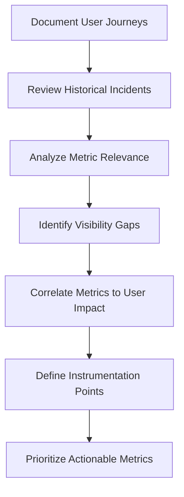

By systematically applying this process, your team can ensure that SLIs are grounded in real-world evidence, improving their ability to detect and address customer-impacting issues effectively.

### Banking Impact

For banking institutions, inadequate SLI implementation directly impacts the bottom line. The following data from FirstGlobal Bank highlights these effects:

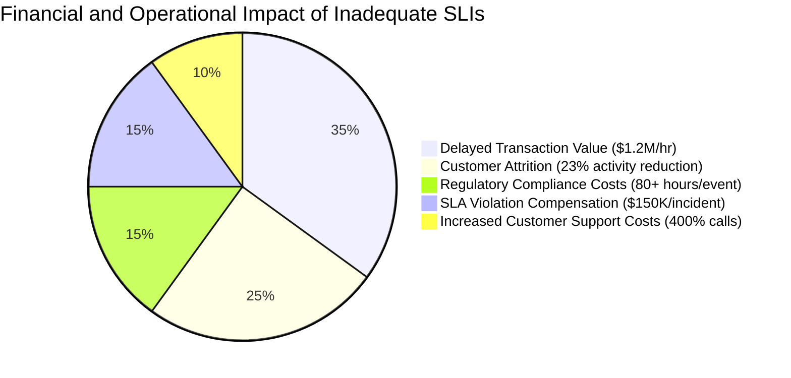

Key Insights:

- **Delayed Transactions**: During outages, an average of $1.2M in transaction value was delayed per hour.
- **Customer Attrition**: 23% of affected customers reduced their banking activity in the following month.
- **Regulatory Compliance**: Each significant incident triggered regulatory reporting requirements, consuming over 80 person-hours per event.
- **SLA Violations**: Compensation payments to corporate clients for SLA violations averaged $150,000 per major incident.
- **Overwhelmed Support**: Customer support calls increased 400% during outages, overwhelming call centers.

Beyond these direct costs, reputational damage compounded the impact:

- **Net Promoter Scores** dropped 12 points after major incidents, reflecting diminished customer trust.

However, comprehensive SLI implementation reversed many of these trends:

- **Early Issue Detection**: Enabled early detection of emerging problems, reducing average incident duration by 65%.
- **Reduced Financial Impact**: Annual financial impact was cut by approximately $3.4M through proactive monitoring and faster resolution.

This data underscores the critical importance of structured SLI implementation for both financial stability and customer satisfaction in banking systems.

### Implementation Guidance

To implement a structured SLI canvas in your banking environment, follow the step-by-step process outlined below. The flowchart provides a visual representation of the key stages to guide your team:

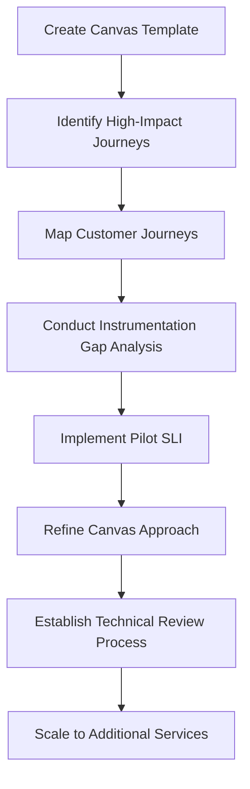

1. **Create a standardized canvas template** tailored to your organization, including sections for user journeys, critical capabilities, data sources, instrumentation points, collection methods, and visualization. Define clear guidance for completing each section and establish approval requirements for finished canvases.

2. **Identify high-impact customer journeys** by selecting 2-3 critical banking functions (payment processing, account access, trading) based on transaction volume, revenue impact, and customer sensitivity. Document complete journey maps for these functions before attempting to define SLIs.

3. **Map customer journeys** to gain a detailed understanding of the steps involved in each critical function. This ensures all necessary data points and instrumentation locations are identified during subsequent stages.

4. **Conduct instrumentation gap analysis** by comparing desired measurement points from your canvas against existing monitoring capabilities. Document where new instrumentation is needed and prioritize implementation based on customer impact and technical feasibility.

5. **Implement a pilot SLI** for one critical journey, following the canvas framework from definition through implementation and validation. Use this pilot to refine your canvas approach and address any gaps or inefficiencies before scaling to additional services.

6. **Establish a technical review process** where implementation canvases are systematically evaluated by a cross-functional team including SRE, development, product, and business representatives. Ensure that canvas completeness, measurement accuracy, and business alignment are verified before SLIs move to production.

7. **Scale to additional services** by applying the refined canvas framework and lessons learned from the pilot to other high-impact customer journeys, ensuring comprehensive SLI coverage across your banking environment.

## Panel 2: Data Source Selection - Finding the Right Signal

### Scene Description

An architecture review meeting is underway, centered around a comprehensive diagram of a core banking platform. Engineers have mapped potential SLI data sources with color-coded tags: green for application logs, blue for API endpoints, yellow for database queries, and purple for network monitoring. Raj, one of the engineers, is pointing to an incident where application logs failed to capture a critical failure that was visible at the API gateway, highlighting the tradeoffs between these sources. On the wall, a decision matrix evaluates each potential data source against key criteria: "accuracy," "coverage," "collection overhead," and "retention period."

Below is a visual representation of the architecture review meeting and the decision-making process:

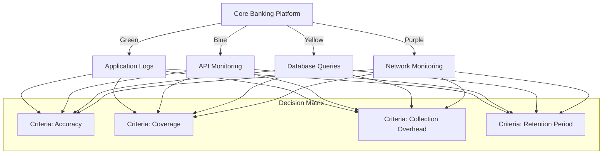

This visual illustrates the interconnectedness of the data sources and their evaluation criteria, aiding the team in determining the most suitable foundation for robust SLIs.

### Teaching Narrative

The foundation of any SLI implementation is selecting the right data source—the wellspring from which your measurements will flow. This critical choice impacts accuracy, completeness, and practicality of your metrics.

Below is a summary of common SLI data sources in banking systems, detailing their strengths and weaknesses:

| **Data Source** | **Strengths** | **Weaknesses** |
| ------------------------- | ----------------------------------------------------------------------- | ---------------------------------------- |
| **Application Logs** | - Detailed records of application behavior and performance | - Often lacks standardization |
| | - Useful for tracking error rates and transaction outcomes | - May be incomplete |
| **API Monitoring** | - Captures request/response patterns and latency at service interfaces | - Misses internal processing details |
| | - Provides a direct view of service interactions | |
| **Database Queries** | - Measures data operations directly | - Blind to application-level contexts |
| | - Valuable for SLIs focused on data processing | |
| **Load Balancer Metrics** | - Aggregates traffic and response statistics for a high-level view | - Lacks granularity |
| | - Useful for overall service health | |
| **Distributed Tracing** | - Offers end-to-end transaction visibility | - Requires comprehensive instrumentation |
| | - Ideal for complex banking transactions | |
| **Synthetic Probes** | - Provides consistent measurements through controlled test transactions | - Limited to predetermined paths |
| | - Useful for verifying end-to-end success | |

Each data source offers a unique perspective on service health. For example, a payment processing SLI might combine API success rates (from load balancers), transaction completion times (from application logs), and end-to-end success verification (from synthetic probes).

For SREs in banking environments, understanding these tradeoffs ensures that metrics are built on appropriate data foundations. Selecting the right data source makes implementation simpler, measurements more accurate, and troubleshooting more effective during incidents.

### Common Example of the Problem

Metropolitan Trust Bank's corporate banking platform suffered from persistent reliability issues despite extensive monitoring. During a critical incident, their transaction processing service appeared healthy according to application logs, which showed successful processing of payment instructions. However, customers reported that transactions weren't completing. After hours of investigation, the team discovered that while the application was successfully processing and logging transactions, the downstream integration with the payment network was failing silently. The application logs—their primary data source for SLIs—provided a fundamentally incomplete view of the service, missing the crucial final step in the transaction journey. This single-source approach created a dangerous blind spot that delayed incident detection and resolution by over 4 hours, affecting thousands of high-value corporate transactions.

### SRE Best Practice: Evidence-Based Investigation

When Metropolitan Trust's SRE team conducted a comprehensive investigation, they applied several evidence-based approaches to data source selection. Their methodical process can serve as a practical guide for similar initiatives. Below is a checklist summarizing the steps they followed:

#### Evidence-Based Investigation Checklist:

1. **Perform Failure Mode Analysis**

   - Identify and document every potential failure point in the system's transaction processing flow.
   - Evaluate which failure points are currently visible or not visible in existing data sources.

2. **Analyze Historical Data Correlation**

   - Compare customer-reported issues with existing metrics.
   - Quantify the percentage of incidents that were undetected by current monitoring.

3. **Create a Visibility Map**

   - Map the architecture to highlight integration points between internal systems and external networks.
   - Identify critical gaps where failures might occur without detection.

4. **Test Potential Data Sources**

   - Simulate failure scenarios to evaluate the effectiveness of different data sources.
   - Determine which sources provide the fastest and most accurate detection.

5. **Conduct a Pilot Program**

   - Implement a combination of complementary data sources (e.g., API gateway metrics, application logs, synthetic transactions).
   - Measure detection effectiveness for known issue patterns and refine as necessary.

6. **Iterate and Optimize**

   - Regularly revisit the visibility map and detection effectiveness as the system evolves.
   - Adjust data source selection to address new gaps or inefficiencies.

#### Case Study: Metropolitan Trust Results

By following this process, the SRE team at Metropolitan Trust achieved significant improvements:

- Failure mode analysis revealed seven distinct failure points, only three of which were visible in application logs.
- Correlation analysis uncovered that 68% of customer-impacting incidents over the past year were undetected by existing metrics.
- Testing showed that combining API gateway metrics, application logs, and synthetic transactions provided 95% detection coverage, compared to 43% from application logs alone.

This structured, evidence-based approach ensures that data source selection is driven by system needs, leading to more accurate, actionable, and efficient monitoring solutions.

### Banking Impact

The incomplete data source strategy had severe business consequences for Metropolitan Trust:

- $4.2M in delayed settlements during a single major incident, requiring manual intervention
- Loss of two major corporate clients specifically citing payment reliability concerns ($1.7M annual revenue)
- Regulatory reporting requirement triggered by transaction delays exceeding 4 hours
- 15,000 customer support minutes consumed during the incident and its aftermath
- Emergency changes required to add visibility, costing 340 developer hours in unplanned work

The impact before and after implementing a multi-source SLI strategy can be summarized as follows:

```plaintext
+-------------------------------+-----------------------------+----------------------------+
|                               | Before Multi-Source SLIs   | After Multi-Source SLIs    |
+-------------------------------+-----------------------------+----------------------------+
| Incident Detection Time       | Often hours                | Reduced by 87%             |
| Undetected Outages            | Multiple incidents         | Zero in 12 months          |
| Regulatory Compliance         | Triggered investigations   | Improved standing          |
| Corporate Client Retention    | Loss of 2 major clients    | Increased reliability       |
| Incident Costs (Annually)     | $4.2M+                     | Reduced by $2.1M           |
| Developer Time for Fixes      | 340 hours per incident     | Minimal ad-hoc work        |
+-------------------------------+-----------------------------+----------------------------+
```

By transitioning to a multi-source SLI strategy, Metropolitan Trust achieved:

- **87% reduction** in mean time to detect payment processing issues
- **Zero undetected outages** in the following 12 months
- Improved **regulatory standing** with evidence of comprehensive monitoring
- Increased corporate client retention due to demonstrable reliability improvements
- Annual savings of **$2.1M** in incident-related costs

This transformation highlights the critical importance of leveraging multiple data sources to ensure accurate, timely, and comprehensive service visibility in banking environments.

### Implementation Guidance

To implement effective data source selection for your banking SLIs:

1. **Conduct a comprehensive data source inventory** by documenting all available monitoring sources across your architecture, including application logs, infrastructure metrics, API gateways, load balancers, database systems, and external integrations. Assess each source's coverage, reliability, and accessibility.

2. **Create a data source evaluation matrix** with weighted criteria including detection speed, accuracy, overhead, retention period, coverage of critical paths, and resilience during failures. Score each potential source against these criteria based on your specific service requirements.

3. **Test detection capabilities during synthetic incidents** by deliberately injecting failures into test environments and evaluating which data sources most effectively detect the issues. Document detection times, false positive/negative rates, and diagnostic value provided by each source.

4. **Implement complementary sources for critical services** by developing a multi-source strategy where primary data sources are augmented with secondary sources that can verify measurements or provide alternative perspectives during different failure modes.

5. **Establish regular source effectiveness reviews** with a quarterly assessment of how well your selected data sources detected actual incidents. Add new sources or modify existing ones based on gaps identified in real operational scenarios, creating a continuous improvement cycle.

6. **Example: Multi-Source SLI Implementation**\
   Below is an example of combining metrics from multiple data sources to implement a payment processing SLI using Prometheus:

   ```yaml
   # Prometheus configuration for a multi-source payment processing SLI
   groups:
     - name: payment-processing-sli
       rules:
         # SLI: API success rate from the load balancer
         - record: sli:payment_api_success_rate
           expr: |
             sum(rate(http_requests_total{job="load_balancer", status="200"}[5m])) /
             sum(rate(http_requests_total{job="load_balancer"}[5m]))

         # SLI: Transaction completion time from application logs
         - record: sli:transaction_completion_time
           expr: |
             histogram_quantile(0.95, rate(transaction_durations_seconds_bucket{job="app_logs"}[5m]))

         # SLI: End-to-end success rate from synthetic probes
         - record: sli:end_to_end_success_rate
           expr: |
             sum(rate(probe_success_total{job="synthetic_probes"}[5m])) /
             sum(rate(probe_total{job="synthetic_probes"}[5m]))

         # Composite SLI: Weighted aggregation of all sources
         - record: sli:payment_processing_overall
           expr: |
             0.5 * sli:payment_api_success_rate +
             0.3 * (1 / sli:transaction_completion_time) +
             0.2 * sli:end_to_end_success_rate
   ```

   This configuration demonstrates how to aggregate metrics from load balancers, application logs, and synthetic probes into a composite SLI. The weights assigned to each source can be adjusted based on their relevance and reliability for your service. Regularly review and fine-tune these values based on observed performance and operational needs.

## Panel 3: The Instrumentation Hierarchy - From Custom Code to Platforms

### Scene Description

A comparative demonstration showcases three distinct approaches to SLI implementation:

1. **Custom Instrumentation**: An engineer demonstrates precision by embedding measurement code directly into a banking application. The approach highlights accuracy but emphasizes the significant maintenance overhead required.

2. **Agent-Based Collection**: Another engineer illustrates the use of OpenTelemetry collectors automatically extracting metrics across services, balancing customization with standardization.

3. **Platform Solutions**: A third engineer presents a specialized observability platform with prebuilt banking-specific dashboards, demonstrating rapid implementation but limited customization flexibility.

On a large screen, Sofia compares these approaches with a matrix evaluating four critical dimensions: **Time to Implement**, **Accuracy**, **Maintenance Cost**, and **Scalability**. The matrix visually contrasts the trade-offs of each approach, helping identify the most suitable methods for different services. Below is a Mermaid diagram representing this comparison:

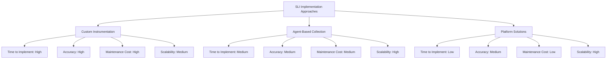

Additionally, services in the architecture are color-coded based on their suitability for each approach. Critical, custom transaction processing services might favor **Custom Instrumentation** for precision, while standard API gateways could leverage **Agent-Based Collection**. Prebuilt dashboards from **Platform Solutions** provide quick wins for common use cases. This layered visualization underscores the importance of tailoring instrumentation strategies to service criticality and uniqueness.

### Teaching Narrative

Implementing SLIs requires adding instrumentation—code and configurations that capture and transmit measurements. A hierarchical approach to instrumentation provides options for different services and maturity levels:

1. **Custom Instrumentation**: Directly embedding measurement code into applications using libraries like Prometheus clients, StatsD, or OpenTelemetry. This offers maximum flexibility and precision but requires significant development effort and ongoing maintenance.

2. **Agent-Based Collection**: Deploying standardized collectors that automatically extract metrics from applications, like OpenTelemetry agents or Prometheus exporters. This approach balances customization with standardization and works well for services that follow common patterns.

3. **Platform Solutions**: Utilizing specialized observability platforms with banking-specific prebuilt dashboards and metrics. These solutions offer rapid implementation but may lack customization options for unique services.

4. **Hybrid Approaches**: Combining methods across different system components based on their criticality, complexity, and available resources.

In banking environments with diverse technology stacks—from modern microservices to legacy mainframes—this hierarchical approach is essential. Critical, custom transaction processing might warrant specialized instrumentation, while standard API gateways might use agent-based approaches.

The key insight for SREs implementing SLIs is that instrumentation should be proportional to service criticality and uniqueness. Not every service requires the same instrumentation approach, and strategic selection of methods optimizes both coverage and implementation efficiency.

### Common Example of the Problem

Capital Commerce Bank's attempt to implement a consistent SLI approach across their diverse technology portfolio highlights the pitfalls of a one-size-fits-all strategy. Their architecture spanned modern cloud microservices for customer-facing applications, Java-based middleware for business logic, and a COBOL mainframe for core banking functions. The team mandated custom code instrumentation for all services, embedding metric collection directly into each application, regardless of its underlying technology.

To better understand the cascading consequences of this decision, consider the following timeline:

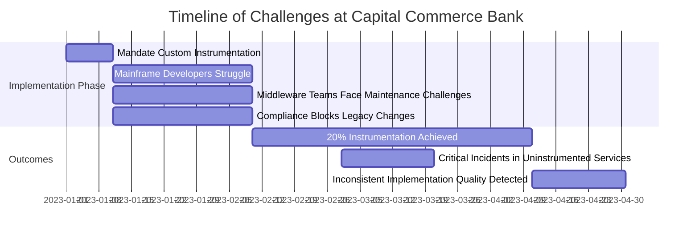

### Sequence of Events and Consequences

1. **Mandate Custom Instrumentation** (January 2023):\
   The leadership team decided on a uniform custom instrumentation approach, requiring all metric collection to be embedded directly into application code.

2. **Mainframe Developer Struggles** (February 2023):\
   Mainframe developers, unfamiliar with modern observability libraries, faced delays and errors during implementation.

3. **Middleware Maintenance Burden** (February 2023):\
   Middleware teams, already balancing feature development and bug fixes, struggled to maintain the added instrumentation code, leading to slower delivery timelines.

4. **Compliance Blocks Legacy Systems** (February 2023):\
   Some legacy systems could not be modified due to strict compliance restrictions, leaving critical components without any observability.

5. **Partial Progress** (March 2023):\
   After three months, only 20% of services had working instrumentation. However, implementations were inconsistent, leading to unreliable metrics.

6. **Critical Incidents Occur** (March 2023):\
   During this period, several critical incidents occurred in uninstrumented services, delaying response times and increasing customer impact.

### Key Insight

This example underscores the dangers of applying a uniform instrumentation approach to a heterogeneous technology stack. By failing to account for the unique characteristics and constraints of different systems, Capital Commerce Bank faced severe delays, operational risks, and inconsistencies. A tailored, hierarchical approach would have allowed proportional instrumentation, optimizing both coverage and efficiency.

### SRE Best Practice: Evidence-Based Investigation

When Capital Commerce's reliability team reassessed their approach, they conducted a systematic investigation to determine the most effective instrumentation strategy.

#### Key Steps in the Investigation:

1. **Service Catalog Analysis**:

   - Classified components by technology stack, criticality, change frequency, and team capabilities.
   - Revealed that nearly 60% of services couldn't reasonably support custom instrumentation due to technical or organizational constraints.

2. **Controlled Experiments**:

   - Tested different instrumentation approaches across representative service types.
   - Measured key metrics: implementation time, coverage effectiveness, maintenance overhead, and detection capability for known failure modes.

3. **Incident Analysis**:

   - Reviewed historical incidents to determine which instrumentation approach would have most effectively detected past issues for each service type.

#### Experimental Findings Summary:

| Metric | Custom Instrumentation | Agent-Based Collection | Platform Solutions |
| -------------------------- | ----------------------------------- | --------------------------------- | ------------------------------- |
| **Implementation Time** | High (weeks/months) | Moderate (days/weeks) | Low (hours/days) |
| **Coverage Effectiveness** | Very High (100% precision) | High (80-90%) | Moderate (60-70%) |
| **Maintenance Overhead** | High (ongoing updates) | Moderate (agent upgrades) | Low (vendor-managed) |
| **Scalability** | Low (customized per service) | High (standardized agents) | Very High (platform-wide) |
| **Detection Capability** | Critical issues in unique workflows | Common failure modes across tiers | Generalized patterns and trends |

#### Incident Analysis Insights:

- **Middleware Tier**: Agent-based collection would have detected 83% of incidents, making it the most effective choice.
- **Payment Processing Services**: Only custom instrumentation could reliably capture critical issues unique to these workflows.
- **Standard API Gateways**: Platform solutions provided sufficient coverage with minimal implementation effort.

#### Outcome:

Based on these findings, the team developed a tiered instrumentation strategy:

- **Custom Instrumentation**: Reserved for critical services with unique workflows, such as payment processing.
- **Agent-Based Collection**: Applied to services with common patterns, like middleware and application backends.
- **Platform Solutions**: Used for standardized components like API gateways and monitoring less-critical services.

This evidence-based approach ensured the instrumentation strategy was proportional to each service's criticality and uniqueness, optimizing coverage and implementation efficiency.

### Banking Impact

The initial uniform instrumentation strategy caused several critical business challenges at Capital Commerce Bank:

- **9+ months of delayed SLI implementation**, leaving critical services without proper monitoring coverage.
- **3 major undetected incidents**, including a **3-hour outage** of mortgage processing.
- **Missed compliance deadlines** for enhanced monitoring, prompting regulatory scrutiny.
- **~4,000 developer hours** diverted from feature delivery to addressing inappropriate instrumentation.
- **Customer experience improvements delayed** as teams prioritized monitoring implementation over innovation.

After transitioning to a hierarchical instrumentation approach:

- **90% of critical services achieved SLI coverage** within three months.
- **76% reduction in mean time to detection (MTTD)** for incidents.
- **30% increase in development team capacity**, previously consumed by instrumentation maintenance.
- **Full compliance with regulatory monitoring requirements**, avoiding further scrutiny.
- **$1.2M in cost savings** compared to the prior uniform strategy.

### Implementation Guidance

To implement an effective instrumentation hierarchy for your banking environment, follow this checklist:

- [ ] **Conduct a Technology Portfolio Assessment**

  - Document all services requiring SLIs.
  - Classify each service by:
    - Technology stack.
    - Criticality.
    - Change frequency.
    - Team capabilities.
  - Create a matrix mapping service characteristics to suitable instrumentation methods.

- [ ] **Develop Instrumentation Standards**

  - Define implementation patterns, libraries, configuration templates, and validation requirements for each tier of the hierarchy.
  - Create clear documentation with environment-specific examples.

- [ ] **Implement Reference Examples**

  - Select representative services for each instrumentation approach.
  - Fully implement SLIs for these services.
  - Use these examples as training tools and validation references for teams.

- [ ] **Create an Instrumentation Decision Tree**

  - Design a decision tree to guide teams in selecting the appropriate instrumentation approach.
  - Base decisions on objective factors such as:
    - Service criticality.
    - Technology constraints.
    - Team capabilities.
    - Integration requirements.

- [ ] **Establish an Instrumentation Governance Process**

  - Set up a review process to approve the selected approach for each service.
  - Ensure consistency and alignment with the hierarchy.
  - Conduct regular reviews to evaluate instrumentation effectiveness, focusing on:
    - Incident detection performance.
    - Maintenance overhead.

- [ ] **Review and Iterate**

  - Periodically revisit the hierarchy and processes as services evolve.
  - Update standards, examples, and governance to reflect new learnings and technological advancements.

## Panel 4: Collection Pipeline Design - Scaling for Banking Volumes

### Scene Description

An operations review meeting is underway, focused on a metrics pipeline that handles millions of daily banking transactions. Engineers are analyzing a flow diagram that illustrates how measurement data progresses through the pipeline—from source systems through collection, processing, storage, and finally to dashboards and alerts. Performance statistics are displayed at each stage, providing insights into throughput and latency.

A recent incident timeline is highlighted in the discussion, showing how the pipeline became overwhelmed during peak trading hours. This overload caused delays in metrics processing and failures in alerting systems. The team is addressing these issues by redesigning critical components of the pipeline, introducing buffer capacity and redundancy at key points to improve resilience. On a monitoring screen, throughput tests are running to validate that the new design can handle 3x the normal peak transaction volume.

Below is a simplified visual representation of the pipeline flow and the incident timeline, using a Mermaid diagram:

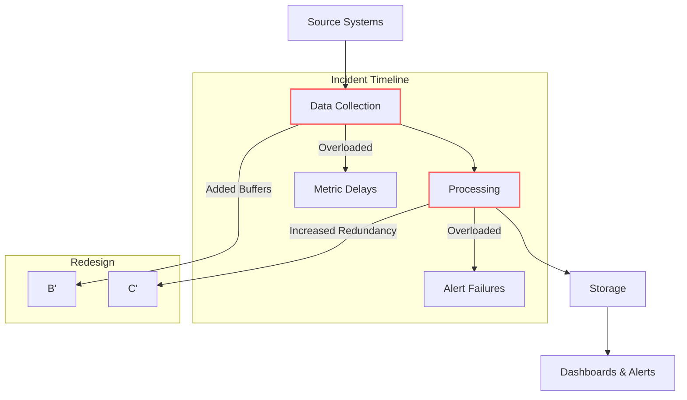

This diagram captures the key stages of the pipeline, highlights the points of failure during the incident, and shows the redesign efforts aimed at improving the system's resilience. By visualizing the flow and the incident timeline, the team can more effectively communicate the challenges and validate the solutions being implemented.

### Teaching Narrative

Banking systems often operate at extraordinary scale—processing millions of transactions daily—which creates unique challenges for SLI implementation. Collection pipeline design addresses how measurement data flows from instrumentation points to final visualization and alerting systems.

A robust collection pipeline must address several critical factors:

1. **Throughput Capacity**: Ensuring the pipeline can handle peak transaction volumes without dropping measurements, especially during high-volume periods like market opens or month-end processing

2. **Buffering and Resilience**: Creating appropriate queuing mechanisms to handle temporary processing backlogs and prevent data loss during pipeline component failures

3. **Sampling Strategies**: Implementing intelligent sampling for high-volume services where processing every measurement would be prohibitively expensive

4. **Aggregation Policies**: Defining how raw measurements are combined, filtered, and transformed before storage

5. **Retention Policies**: Balancing storage costs with analytical needs through tiered retention (e.g., high-resolution recent data, aggregated historical data)

For banking SREs, the collection pipeline itself must be treated as a critical service—if metrics fail to flow, visibility into actual banking services disappears. This means applying SRE principles to the observability infrastructure itself, including capacity planning, failure modeling, and redundancy.

A well-designed collection pipeline ensures that your carefully crafted SLIs accurately reflect service health even during extreme conditions—precisely when measurements are most critical.

### Common Example of the Problem

Apex Investment Bank built a metrics collection pipeline for their high-frequency trading platform that processed over 50,000 transactions per second during market hours. The initial implementation worked well during testing and normal operation, but failed catastrophically during a market volatility event when transaction volumes surged to 200,000 per second. As trading volume exploded, the collection pipeline became overwhelmed—metrics were delayed, then sampled, and ultimately dropped entirely. Dashboards displayed stale data and critical alerts failed to trigger as the actual trading platform degraded under load. The reliability team had no visibility into system health precisely when they needed it most. By the time they manually discovered performance issues, the trading platform had been severely degraded for 17 minutes, resulting in millions in lost trading opportunities and execution issues for major clients.

The sequence of failures during the volatility event can be represented as follows:

```mermaid
sequenceDiagram
    participant SourceSystems as Source Systems
    participant CollectionPipeline as Collection Pipeline
    participant DashboardsAlerts as Dashboards & Alerts
    participant SRETeam as SRE Team

    SourceSystems->>CollectionPipeline: Transaction rate surges to 200k/sec
    CollectionPipeline-->>CollectionPipeline: Buffer fills up
    CollectionPipeline-->>CollectionPipeline: Processing lags; metrics delayed
    CollectionPipeline-->>DashboardsAlerts: Sends sampled data
    DashboardsAlerts-->>DashboardsAlerts: Displays stale data
    DashboardsAlerts->>SRETeam: Critical alerts fail to trigger
    SRETeam-->>SRETeam: No visibility into system health
    SRETeam->>TradingPlatform: Discovers degradation after 17 minutes
    TradingPlatform-->>ClientImpact: Millions in lost trades and client issues
```

This timeline illustrates how the lack of buffer capacity, resilience, and intelligent sampling strategies led to cascading failures. The inability to maintain accurate and timely metrics during the event left the SRE team blind to critical problems, compounding the platform's degradation and financial losses.

### SRE Best Practice: Evidence-Based Investigation

After the incident, Apex's reliability team conducted a thorough investigation of their collection pipeline. The following steps outline their evidence-based approach and can serve as a replicable checklist for similar scenarios:

#### Investigation Checklist:

1. **Perform Capacity Analysis**

   - Measure throughput capacity at each stage of the pipeline under controlled load testing.
   - Identify critical bottlenecks (e.g., database ingestion, aggregation processing).

2. **Analyze Historical Metric Patterns**

   - Examine historical metric volume trends across multiple time scales.
   - Identify peak load scenarios (e.g., volatility events producing 5-10x normal metric volumes).

3. **Model Failure Scenarios**

   - Simulate different failure modes to understand pipeline behavior under stress.
   - Assess if the system has a degradation strategy (e.g., graceful degradation vs. complete failure).

4. **Assess Metric Prioritization**

   - Audit the classification of metrics in processing queues.
   - Identify high-priority metrics (e.g., customer impact) versus lower-priority metrics.
   - Detect and address "noisy neighbor" issues caused by mixed-priority queues.

5. **Redesign Based on Findings**

   - Implement prioritized processing paths to handle critical metrics first.
   - Add intelligent buffering mechanisms to absorb temporary backlogs.
   - Use tiered aggregation strategies tailored to observed volume patterns.

#### Key Takeaways:

By following this evidence-based process, the team uncovered and addressed several critical issues:

- Bottlenecks in ingestion and aggregation components.
- Lack of graceful degradation under extreme load.
- Mixing of critical and non-critical metrics in shared queues.

The redesigned pipeline now incorporates prioritized processing paths, intelligent buffering, and tiered aggregation strategies, ensuring resilience and reliability during high-volume financial operations.

### Banking Impact

The collection pipeline failure during the market volatility event had severe consequences for Apex Investment Bank:

- Trading algorithm performance degraded without alerting, resulting in approximately $3.2M in suboptimal executions
- Several high-net-worth clients experienced significant delays in trade processing
- Two institutional clients invoked SLA penalty clauses totaling $450,000
- Compliance requirements for trade execution quality were breached, triggering regulatory reporting
- The bank's reputation as a leading electronic trading platform was damaged

After implementing a robust collection pipeline:

- The platform successfully maintained full observability during subsequent volatility events with 300% normal volume
- Mean time to detection for trading performance issues decreased from 17 minutes to under 30 seconds
- No SLA violations occurred during the following 12 months of operation
- Regulatory standing improved with demonstrated resilience during stress conditions
- Client confidence increased, leading to 22% growth in electronic trading volume

#### Impact Summary Table

| Metric | Before Redesign | After Redesign |
| ---------------------------------- | --------------------------------------------- | ---------------------------------------- |
| **Trading Algorithm Performance** | $3.2M in suboptimal executions | Fully optimized; no degradation |
| **Client Trade Processing Delays** | Significant delays for high-net-worth clients | No delays reported |
| **SLA Violations** | $450,000 in penalties | 0 violations over 12 months |
| **Regulatory Compliance** | Breached execution quality standards | Fully compliant; resilience demonstrated |
| **Client Confidence** | Damaged; loss of trust | Increased by 22% trading volume growth |
| **Mean Time to Detection (MTTD)** | 17 minutes | Under 30 seconds |

### Implementation Guidance

To implement a scalable collection pipeline for your banking environment:

1. **Conduct comprehensive capacity planning** by analyzing historical metric volumes across different time periods and modeling peak scenarios based on business events (market volatility, month-end processing, tax deadlines). Design your pipeline to handle at least 3x your highest observed peak with headroom for unexpected surges.

2. **Implement traffic prioritization mechanisms** throughout your pipeline, ensuring critical SLIs (those driving alerts and customer experience metrics) receive processing priority over less important metrics during high-volume periods. Use resource-aware processing queues to isolate and prioritize high-importance metrics. Below is a pseudo-code example of implementing priority-based queuing logic:

   ```python
   from queue import PriorityQueue

   class Metric:
       def __init__(self, name, priority, data):
           self.name = name
           self.priority = priority  # Lower value = higher priority
           self.data = data

       def __lt__(self, other):
           return self.priority < other.priority

   # Create a priority queue
   metric_queue = PriorityQueue()

   # Add metrics to the queue
   metric_queue.put(Metric("CustomerLatency", 1, {...}))
   metric_queue.put(Metric("SystemThroughput", 2, {...}))
   metric_queue.put(Metric("DebugLogs", 3, {...}))  # Lower priority metric

   # Process metrics based on priority
   while not metric_queue.empty():
       metric = metric_queue.get()
       process_metric(metric)
   ```

3. **Design graceful degradation capabilities** into your pipeline with explicit policies for how the system behaves under extreme load. For instance, implement fallback logic that applies sampling or aggregation when queue lengths exceed thresholds. Here’s an example of adaptive sampling logic:

   ```python
   def process_metric_with_sampling(metric, queue_length, max_queue_length):
       if queue_length > max_queue_length:
           # Apply sampling or aggregation under high load
           if metric.priority == 1:
               process_full(metric)
           else:
               process_sampled(metric)
       else:
           # Process all metrics under normal conditions
           process_full(metric)
   ```

   This ensures that high-priority metrics remain intact while low-priority metrics are sampled or aggregated during overload scenarios.

4. **Build multi-tier storage architecture** with hot storage for recent high-resolution metrics, warm storage for medium-term aggregated data, and cold storage for long-term historical trends. Define explicit retention and aggregation policies that balance analysis needs with performance and cost constraints. For example:

   ```
   +---------------+       +---------------+       +---------------+
   | Hot Storage   |  -->  | Warm Storage  |  -->  | Cold Storage  |
   | (1-7 days)    |       | (1-12 months) |       | (Archived)    |
   +---------------+       +---------------+       +---------------+
   ```

   Use policies such as:

   - High resolution for the first 7 days
   - Aggregated hourly data for 1-12 months
   - Daily averages for long-term storage

5. **Implement end-to-end observability** for your metrics pipeline itself, with dedicated monitoring that operates independently from your main observability system. Create specific alerts for pipeline health, processing delays, drop rates, and buffer utilization to ensure you know immediately if metric collection is compromised. Below is an example of a monitoring alert rule in pseudo-code:

   ```python
   if buffer_utilization > 80%:
       trigger_alert("High buffer utilization - investigate potential backlog")

   if metric_drop_rate > 5%:
       trigger_alert("Metric drop rate exceeds threshold - check processing pipelines")

   if processing_delay > 500ms:
       trigger_alert("Processing delays detected - investigate bottlenecks")
   ```

## Panel 5: Validation and Testing - Ensuring SLI Accuracy

### Scene Description

A controlled testing environment where the team is deliberately introducing failures into a test banking system. At the center of the workspace is the "Chaos Testing Dashboard," displaying active failure scenarios such as API timeouts, database latency increases, and authentication service failures. Each failure scenario is paired with its corresponding SLI response, which is evaluated in real-time.

Below is a text-based representation of the setup:

```
+------------------+      +-------------------+       +------------------+
| Chaos Testing    |      | SLI Responses     |       | SLI Validation   |
| Dashboard        |      |                   |       | Checklist        |
|                  | ---> | Detected Correctly| --->  | [x] API Timeout  |
| Failure Scenarios| ---> | False Negative    |       | [ ] DB Latency   |
| - API Timeout    | ---> | Delayed Detection |       | [x] Auth Service |
| - DB Latency     |      |                   |       |                  |
| - Auth Failures  |      +-------------------+       +------------------+
+------------------+
```

Engineer Alex interacts with the "Chaos Testing Dashboard," marking tests as "Detected Correctly," "False Negative," or "Delayed Detection." Jamila, positioned nearby, updates SLI implementations based on these findings, adjusting thresholds and refining collection methods. A prominently displayed checklist titled "SLI Validation" helps track progress across different failure scenarios and banking services.

This collaborative setup ensures efficient validation of SLIs, with a clear workflow that highlights the relationship between failure scenarios, SLI responses, and actionable improvements.

### Teaching Narrative

Implementing SLIs without validation is like deploying financial controls without auditing—dangerous and potentially misleading. Rigorous testing ensures your measurements will accurately detect real-world problems before you rely on them in production.

A comprehensive SLI validation approach includes:

1. **Synthetic Fault Injection**: Deliberately introducing controlled failures to verify metrics detect them appropriately, such as API delays, database errors, or network degradation

2. **Historical Incident Replay**: Testing SLIs against historical incident data to confirm they would have detected known problems

3. **Boundary Testing**: Verifying behavior at edge cases, especially around threshold values

4. **Scale Testing**: Ensuring measurement accuracy remains consistent under varying traffic volumes

5. **Cross-Validation**: Comparing new SLIs against existing monitoring to identify discrepancies and blind spots

For banking systems where reliability directly impacts financial outcomes and regulatory compliance, this validation process is not optional—it's essential. False negatives (missing real problems) can lead to extended outages, while false positives (alerting without real issues) cause alert fatigue and erode trust.

When transitioning from traditional monitoring to SLI-based approaches, this testing phase also provides valuable learning opportunities. Engineers can observe how different types of failures manifest in the new measurements, building intuition that will prove invaluable during real incidents.

### Common Example of the Problem

Meridian Financial implemented SLIs for their online banking platform based on theoretical best practices but conducted minimal validation before deployment. The SLIs included metrics for:

- **Website Availability**: Percentage of successful page loads
- **Login Success Rate**: Percentage of successful authentications
- **Transaction Processing Time**: Time taken to complete payment transactions

Six weeks after deployment, a major incident occurred when the account balance display service failed, showing incorrect balances to customers. Despite thousands of affected users, none of the SLIs detected the problem. The availability metric showed 100% uptime since the pages loaded successfully, the login SLI reported normal performance since authentication worked correctly, and the transaction SLI remained healthy since payments were processing normally. For over two hours, customers saw completely incorrect account information while all dashboards showed green, with the issue only discovered through customer complaints.

#### Incident Breakdown Table

| **SLI** | **What It Measured** | **Failure Mode** | **Detection Gap** |
| --------------------------- | ------------------------------------ | --------------------------------- | -------------------------------------------------------------------------------- |
| Website Availability | Successful page loads | Incorrect data displayed on pages | Did not account for data accuracy or integrity; only measured page load success. |
| Login Success Rate | Authentication success | Data corruption post-login | Only validated login functionality, not downstream data correctness. |
| Transaction Processing Time | Payment transaction completion speed | Account balance display errors | Focused on transaction performance, ignoring accuracy of displayed information. |

#### Timeline of Events

```mermaid
gantt
    title Incident Timeline: Account Balance Display Failure
    dateFormat HH:mm
    axisFormat %H:%M
    section Incident Progression
    Failure begins :done, 10:00, 30min
    Customers report issue :active, 10:30, 30min
    Investigation starts :active, 11:00, 30min
    Root cause identified :crit, 11:30, 30min
    Issue resolved :done, 12:00, 30min
```

#### Key Takeaway

This incident highlights the critical importance of validating SLIs against potential real-world failure modes. By focusing solely on availability and performance, the team neglected to include SLIs for data accuracy and integrity. Comprehensive validation would have identified this gap, preventing extended customer impact.

### SRE Best Practice: Evidence-Based Investigation

When rebuilding their SLI implementation, Meridian's reliability team applied rigorous validation techniques. Their approach followed an evidence-based investigation process designed to identify gaps and refine SLI accuracy. Below is a checklist summarizing their steps:

#### Evidence-Based Investigation Checklist

1. **Failure Hypothesis Testing**

   - Identify critical failure modes for each service component.
   - Map failure modes to existing SLI coverage.
   - Quantify uncovered failure scenarios (e.g., "40% of likely failure scenarios not covered").

2. **Historical Incident Analysis**

   - Gather historical outage and incident data (e.g., past 2 years).
   - Test whether proposed SLIs would detect known issues.
   - Identify blind spots in measurement (e.g., data integrity, partial degradations).

3. **Controlled Chaos Testing**

   - Select a staging environment for safe fault injection.
   - Introduce diverse failure types (e.g., API timeouts, database latency).
   - Evaluate SLI response for:
     - Threshold sensitivity (e.g., overly lenient or strict settings).
     - Aggregation behavior (e.g., masking intermittent issues).
     - Correlation with user experience.

4. **Develop a Comprehensive SLI Coverage Matrix**

   - Document all critical customer journeys and failure modes.
   - Ensure each failure mode is adequately measured.
   - Validate appropriate sensitivity and specificity for SLIs.

#### Evidence-Based Investigation Flowchart

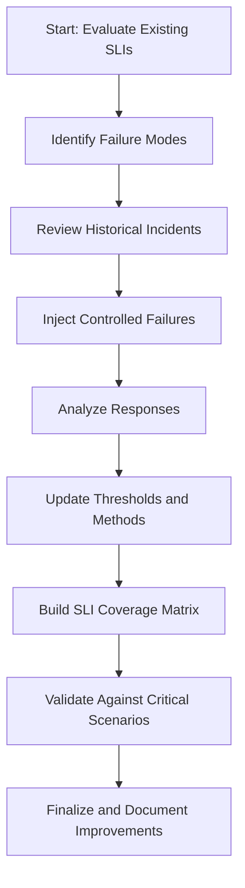

By following this structured process, Meridian's team uncovered key insights that enhanced their SLI implementation. Their findings included threshold adjustments to prevent masking issues, improved alignment between metrics and user experience, and robust coverage for all critical failure modes. This ensured their SLIs were both accurate and actionable, providing confidence in their ability to detect and respond to real-world issues.

### Banking Impact

#### Before and After SLI Validation: Summary Table

| **Metric** | **Before SLI Validation** | **After SLI Validation** |
| --------------------------- | ------------------------------------------ | ----------------------------------------------- |
| **Incident Detection Time** | Hours | Minutes |
| **False Positive Alerts** | High - Frequent alerts causing fatigue | Reduced by 65%, lowering operational overhead |
| **Customer Impact** | 15,000+ affected customers in one incident | Significant reduction in customer-facing issues |
| **Customer Trust** | 7-point drop in satisfaction scores | Stabilized trust, no major drops |
| **Operational Coverage** | Limited to basic uptime metrics | Expanded to include critical data integrity |
| **Regulatory Outcomes** | Required formal incident reports | Positive recognition for strong controls |
| **Estimated Annual Losses** | $1.2M from undetected issues | Avoided these losses |

#### Business Case: Key Highlights

1. **Before Validation**:

   - The account balance display incident at Meridian Financial impacted approximately 15,000 customers over a two-hour period.
   - Over 800 customer support calls overwhelmed the contact center.
   - Customers made financial decisions based on incorrect balance information, leading to overdrafts and failed payments.
   - Regulatory agencies demanded formal incident reports and remediation plans.
   - The company suffered a significant 7-point drop in customer satisfaction.

2. **After Validation**:

   - Comprehensive SLI validation reduced detection times for similar incidents from hours to minutes.
   - False positive alerts were cut by 65%, easing operational strain and minimizing alert fatigue.
   - SLI coverage was expanded to monitor critical data integrity, improving the system’s overall reliability.
   - Regulatory examiners highlighted the new validation process as a benchmark for operational excellence.
   - The bank avoided estimated annual losses of $1.2M by proactively identifying and resolving issues.

### Implementation Guidance

To implement effective SLI validation for your banking services:

1. **Create a failure mode inventory** by systematically documenting all possible ways each service can fail from a customer perspective. Include common scenarios like complete outages, partial degradations, data corruption, integration failures, and performance issues. Use this inventory to ensure your SLIs cover all critical failure modes.

2. **Develop a controlled testing environment** where you can safely inject failures into realistic system replicas. Implement automation that can systematically execute different failure scenarios and measure SLI responses, creating reproducible validation processes.

3. **Implement a historical incident verification process** by documenting detailed timeline and symptom information for past significant incidents. Test new or modified SLIs against this historical data to verify they would have detected these known issues with appropriate sensitivity and timing.

4. **Establish SLI verification criteria** including maximum acceptable detection time, false positive/negative rates, and boundary condition behavior. Create a formal checklist that each SLI must satisfy before being approved for production deployment.

5. **Schedule regular SLI effectiveness reviews** on a quarterly basis where you deliberately retest critical SLIs against evolving failure scenarios and system changes. Implement a continuous improvement cycle that refines measurements based on both real incidents and controlled testing results.

## Panel 6: Making SLIs Accessible - Dashboards and Visualizations

### Scene Description

The setting is a dynamic dashboard design workshop focused on creating visualizations for different audiences. The room features a large display divided into three sections, each showcasing a specific version of dashboards based on SLIs:

- **Engineering Dashboard**: A detailed technical view showing percentiles, error breakdowns, and trends for engineers.
- **Operations Dashboard**: A service health summary optimized for incident response, highlighting current status, thresholds, and recent changes.
- **Business Impact Dashboard**: A high-level overview translating SLIs into business terms like transaction values and customer experience for executives.

UX designer Maya stands near the display, explaining how consistent color schemes and terminology are applied across all dashboards, while detail levels are tailored to the audience. A whiteboard nearby lists key design principles—**Glanceability**, **Progressive Disclosure**, and **Business Context**—as guiding themes for the workshop. Around the room, team members use sticky notes to identify and prioritize the most critical metrics for each audience.

Below is a conceptual representation of the workshop setup:

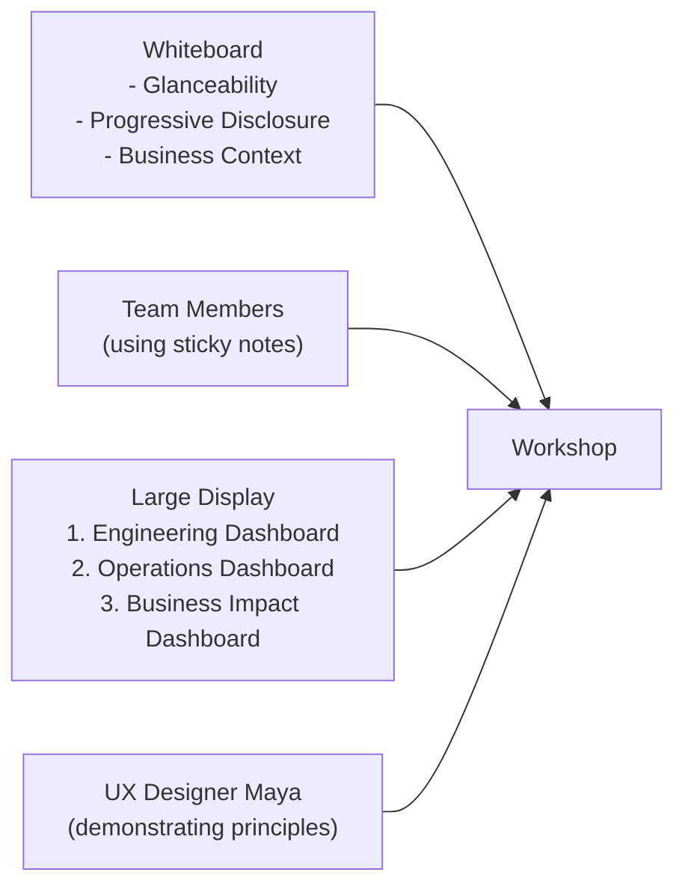

This collaborative environment emphasizes the importance of tailoring dashboards to stakeholder needs while maintaining a unified approach to design and communication.

### Teaching Narrative

Even perfectly implemented SLIs provide little value if they aren't accessible and meaningful to their intended audiences. Visualization design transforms raw measurements into actionable insights through effective dashboards tailored to different stakeholders.

Banking SLI dashboards typically serve multiple audiences with distinct needs:

1. **Engineering Dashboards**: Detailed technical views with high granularity, showing all components of composite SLIs, trend data, and correlation with other system metrics

2. **Operations Dashboards**: Service-centered views optimized for incident response, highlighting current status against thresholds and recent changes

3. **Business Dashboards**: Impact-focused views that translate technical metrics into business terms like "percentage of successful transactions" or "value of delayed payments"

4. **Executive Dashboards**: High-level summaries showing service health in relation to business outcomes and customer experience

Effective visualizations follow key principles:

- **Progressive Detail**: Providing summary views with the ability to drill down for details
- **Context Enhancement**: Including thresholds, historical trends, and related metrics
- **Visual Hierarchy**: Emphasizing the most critical indicators through size, position, and color
- **Consistent Patterns**: Using similar visualization patterns across services for easier cross-comparison

For banking SREs, creating these tailored views makes reliability data accessible throughout the organization—from technical teams to business stakeholders—and ensures that everyone shares a common understanding of service health based on consistent, well-implemented SLIs.

### Common Example of the Problem

United Financial Group spent six months implementing comprehensive SLIs across their digital banking platform, collecting precise measurements of availability, latency, and error rates for every critical service. Despite this significant investment, the SLIs failed to deliver expected value because of visualization problems. The following table summarizes the key challenges faced by different stakeholders during a major incident affecting mobile check deposits:

| Stakeholder Group | Challenges Faced | Example Impact |
| -------------------- | ------------------------------------------------------------------------------------------------- | ----------------------------------------------------------------------------- |
| **Engineers** | Overload of detailed graphs and raw data without clear prioritization or correlation to incidents | Engineers argued over conflicting graphs, delaying root cause identification. |
| **Operations Teams** | Difficulty identifying impacted services and understanding real-time status | Unable to quickly determine which service to escalate or prioritize. |
| **Executives** | Lack of high-level summaries connecting technical issues to business impact | Could not assess the financial and customer experience impact of the outage. |

The lack of tailored visualizations turned their SLI implementation from a strategic asset into a source of confusion. Engineers, operations teams, and executives interpreted the same metrics inconsistently, leading to misaligned responses. For example, engineers focused on percentile graphs, operations teams struggled with incomplete status views, and executives were left without actionable insights into customer and business outcomes. This fragmented understanding hampered effective incident response and delayed resolution.

### SRE Best Practice: Evidence-Based Investigation

To address their visualization challenges, United Financial conducted a systematic investigation leveraging an evidence-based approach. The process included the following steps:

#### Checklist for Evidence-Based Investigation:

1. **Stakeholder Analysis**:

   - Interview user groups to understand their specific information needs, technical fluency, decision-making processes, and the contexts in which they consume reliability data.
   - Identify distinct requirements for different audiences (e.g., engineers, operations, executives).

2. **Usability Testing**:

   - Observe users interacting with existing dashboards to evaluate how effectively they can answer critical questions.
   - Record time-to-insight metrics (e.g., average time to determine service health during incident response).
   - Identify usability barriers, such as confusing layouts or inaccessible terminology.

3. **Usage Pattern Analysis**:

   - Review historical usage data to understand which dashboards and visualizations are most and least frequently accessed.
   - Identify underutilized views and analyze why critical information might be buried or overlooked.

4. **A/B Testing**:

   - Test different visualization approaches by comparing comprehension speed, accuracy, and user satisfaction across groups.
   - Validate the impact of role-specific dashboards and progressive disclosure techniques on different user types.

#### Key Findings:

- Stakeholder analysis revealed fundamentally different requirements across audiences.
- Usability testing showed non-technical users struggled to determine service health, taking an average of 4.7 minutes—far too long for effective incident response.
- Usage pattern analysis found 73% of dashboards were rarely or never viewed, with critical information often buried in overcrowded displays.
- A/B testing demonstrated that role-specific dashboards with progressive detail significantly improved comprehension speed and accuracy across all user groups.

This evidence-based approach led United Financial to completely redesign their visualization strategy, creating purpose-built dashboards. These new views transformed the same underlying SLI data into formats tailored to the needs of different stakeholders, making reliability insights more accessible and actionable organization-wide.

### Banking Impact

The poor visualization strategy at United Financial created significant business issues:

- Average incident response time increased by 23 minutes due to confusion interpreting dashboards
- Executive briefings during major incidents contained contradictory information, damaging leadership confidence
- Business teams couldn't correlate technical issues with customer impact, leading to misaligned priorities
- Regulatory reports required extensive manual data collection despite the information existing in the SLI platform
- The $1.2M SLI implementation delivered only a fraction of its potential business value

After implementing audience-focused visualizations:

- Incident response time decreased by 17 minutes on average
- Business and technical teams developed shared understanding of service health
- Executive confidence in reliability reporting increased significantly
- Mean time to complete regulatory reporting decreased by 65%
- The same underlying SLI data now effectively served multiple organizational needs, maximizing return on implementation investment

#### Before-and-After Comparison Table

To highlight the impact of the visualization redesign, the table below compares key metrics before and after the changes:

| Metric | Before Redesign | After Redesign | Improvement |
| ---------------------------------------------- | ----------------------------------- | ---------------------------------- | ----------------------------------- |
| Average Incident Response Time | +23 minutes | -17 minutes | Reduced confusion and faster action |
| Executive Confidence in Reliability Data | Low (frequent contradictions) | High (consistent, actionable data) | Strengthened leadership trust |
| Alignment Between Business and Technical Teams | Poor (misaligned priorities) | Strong (shared understanding) | Improved collaboration |
| Mean Time for Regulatory Reporting | 12 hours | 4.2 hours | 65% reduction in manual effort |
| Return on SLI Investment | Limited (fractional value realized) | Maximized (multi-audience utility) | Greater ROI |

By tailoring dashboards to specific audiences, United Financial not only resolved operational inefficiencies but also fostered cross-organizational alignment and improved decision-making at all levels.

### Implementation Guidance

To create effective SLI visualizations for your banking environment:

1. **Conduct audience analysis** by identifying all stakeholder groups who need access to reliability data and documenting their specific requirements. Interview representatives from each group to understand their technical fluency, decision contexts, key questions they need to answer, and preferred visualization formats.

2. **Develop a multi-tier dashboard hierarchy** with consistent navigation between different levels of detail. Create summary views for high-level health assessment, service-focused views for operational management, and detailed component views for technical troubleshooting, with intuitive paths between these levels.

3. **Implement business context enrichment** in all dashboards by including relevant translations of technical metrics into business terms. Show transaction volumes, financial values, customer counts, and business process impacts alongside technical measurements to create meaningful context.

4. **Create visualization standards** with consistent color schemes, threshold representations, and interaction patterns across all reliability dashboards. Develop a visual language where red always means the same level of severity, chart types are used consistently, and interaction models remain uniform across different views.

5. **Establish a dashboard review process** with representatives from different stakeholder groups evaluating new visualizations before deployment. Test dashboards against realistic scenarios to verify they effectively answer key questions for each audience, and implement a continuous improvement cycle based on user feedback and usage analytics.

## Panel 7: Lifecycle Management - Sustaining SLI Quality

### Scene Description

A quarterly SLI review meeting is underway, showcasing the evolution of key metrics over time. In the room, a prominently displayed timeline illustrates the lifecycle of their payment SLIs. The timeline includes annotated milestones such as system changes, incident learnings, and implementation improvements, visually emphasizing the iterative process of metric refinement. Below is a text-based representation of the timeline:

```
[Q1 Incident] --> [Q2 Metric Refinement] --> [Q3 System Change] --> [Q4 SLI Review]
```

Team members are presenting before/after comparisons of SLIs that have been refined, highlighting how changes have improved accuracy and relevance. On the side wall, a governance board titled "SLI Lifecycle Management" outlines the structured processes for proposing, testing, deploying, and retiring metrics, reinforcing the team's disciplined approach to lifecycle management.

Raj, one of the team members, points to a deprecated SLI on the timeline that is scheduled for removal. He explains how this metric has been replaced by more accurate and meaningful measurements. A calendar in the room marks the regular review cycles across different service domains, ensuring consistent evaluation and updates to their metrics.

This collaborative setting and visual aids help reinforce the importance of maintaining high-quality, actionable SLIs through structured and iterative lifecycle processes.

### Teaching Narrative

SLI implementation isn't a one-time project but an ongoing process that requires deliberate lifecycle management. Like other critical assets, metrics require governance, maintenance, and eventual retirement as systems and requirements evolve.

A mature SLI lifecycle management approach includes:

1. **Documentation and Ownership**: Maintaining clear definitions, implementation details, and designated owners for each SLI

2. **Change Management**: Following defined processes for proposing, testing, and deploying modifications to existing SLIs

3. **Regular Reviews**: Conducting periodic evaluations of SLI effectiveness, especially after incidents or significant system changes

4. **Version Control**: Tracking metric definitions and implementations in version control systems alongside related code and configuration

5. **Deprecation Processes**: Establishing clear methods for phasing out metrics that no longer provide value or have been superseded

For banking environments where both technology and regulatory requirements evolve rapidly, this lifecycle approach ensures SLIs remain accurate and relevant. Without proper management, metric implementations tend to drift from their original intent, accumulate technical debt, and eventually become misleading or obsolete.

This disciplined approach to metric lifecycle management marks a significant difference between traditional monitoring practices and mature SRE implementations. Rather than accumulating an ever-growing collection of unmanaged metrics, SREs continuously refine a focused set of high-quality indicators that accurately reflect the evolving customer experience.

### Common Example of the Problem

Eastern Trust Bank initially implemented SLIs for their retail banking platform with great enthusiasm. The first implementation phase was successful, with well-defined metrics for core services. However, without proper lifecycle management, quality degraded over time. The issues they faced included:

| **Problem** | **Description** | **Impact** |
| ----------------------------- | ------------------------------------------------------------------------------------------------- | ----------------------------------------------------------------------------------------- |
| **Lack of Ownership** | No designated owners for SLIs, leading to inconsistent updates and maintenance. | SLIs became outdated or irrelevant, reducing their usefulness for decision-making. |
| **Outdated Metrics** | SLIs were not updated during system modernization, measuring non-existent components. | Key signals became inaccurate, missing critical paths or providing misleading data. |
| **Redundant Metrics** | Developers added ad-hoc metrics without consistent standards or alignment to customer experience. | Observability systems became cluttered, making it harder to focus on meaningful SLIs. |
| **Metric Drift** | SLIs gradually deviated from their original intent, failing to reflect actual system performance. | Teams relied on metrics that no longer represented customer impact or operational health. |
| **Duplication and Confusion** | Over 400 metrics were labeled as "SLIs," many of which overlapped or conflicted with each other. | During incidents, teams wasted time debating which metrics to trust, delaying resolution. |

#### Timeline of SLI Degradation:

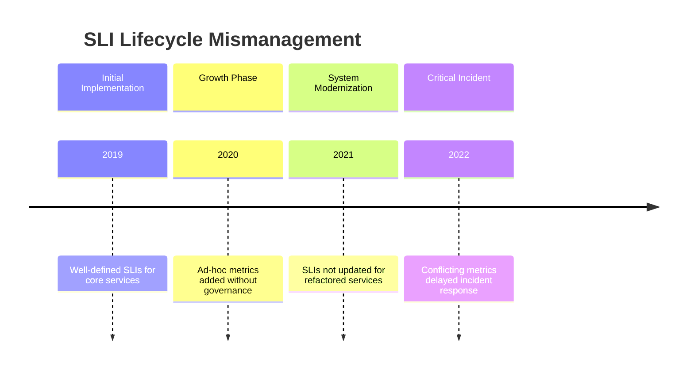

When a critical incident affected the mortgage application service, these issues surfaced prominently. Teams wasted valuable time sorting through conflicting metrics and debating which measurements were accurate. Post-incident analysis revealed that several key SLIs had drifted so far from their original implementation that they no longer provided meaningful signals about customer experience.

This example highlights the importance of a disciplined approach to SLI lifecycle management to avoid these common pitfalls.

### SRE Best Practice: Evidence-Based Investigation

To address their metric sprawl, Eastern Trust conducted a systematic SLI lifecycle analysis:

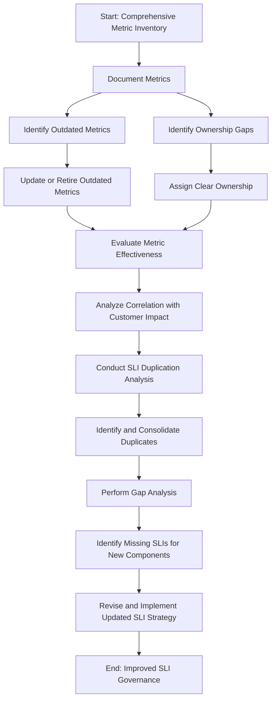

1. **Comprehensive Metric Inventory**: The team began by documenting every existing SLI, capturing details such as implementation, owner, creation date, and last modification. This audit revealed that 42% of metrics had no clear owner, and 28% hadn't been updated in over 18 months despite significant system changes.

2. **Metric Effectiveness Evaluation**: By analyzing the correlation between SLI behavior and actual customer impact during recent incidents, the team discovered older SLIs had weaker signals, while more recently maintained metrics provided stronger indicators of customer experience.

3. **SLI Duplication Analysis**: Clusters of metrics measuring similar aspects of the same services were identified. In some cases, five different teams had created redundant measurements, which led to confusion during incidents. Consolidation efforts reduced duplication and streamlined responses.

4. **Gap Analysis**: Comparing the current service architecture with SLI coverage uncovered critical new components and customer journeys lacking measurement. This gap stemmed from prioritizing legacy metrics over evolving strategies.

This evidence-based approach resulted in a comprehensive overhaul of SLI governance. Eastern Trust implemented formal lifecycle management practices to continuously refine their metrics, ensuring alignment with evolving systems and customer needs.

### Banking Impact

The lack of SLI lifecycle management at Eastern Trust created significant business problems, as shown below:

| **Issue Category** | **Before Implementation** | **After Implementation** |
| ------------------------ | ---------------------------------------------------------------------------------------------------------------------------- | --------------------------------------------------------------------------------------------------------- |
| **Incident Response** | Incident response delayed by an average of 22 minutes due to confusion among redundant and conflicting metrics | Mean time to detect incidents decreased by 14 minutes due to clearer, more accurate signals |
| **Monitoring Costs** | Approximately 35% of monitoring investment wasted on maintaining obsolete or duplicate measurements | Monitoring system costs decreased by 28% through elimination of redundant measurements |
| **Team Confidence** | Technical teams lost confidence in reliability data, creating a culture of skepticism about metrics | Confidence in reliability data increased significantly across both technical and business teams |
| **Service Launches** | New services launched without adequate reliability measurement due to focus on maintaining legacy SLIs | New service launches automatically included appropriate SLI implementation through standardized processes |
| **Regulatory Reporting** | Regulatory reporting required extensive manual data translation due to misalignment between current architecture and metrics | Regulatory reporting streamlined with SLIs aligned to current architecture, reducing manual intervention |

Additional highlights of the transformation include:

- A 67% reduction in the total number of SLIs, while achieving improved coverage of critical customer journeys
- A shift from reactive to proactive reliability management, enabling ongoing refinements and better alignment with business goals

### Implementation Guidance

To implement effective SLI lifecycle management for your banking environment, follow this step-by-step guide:

______________________________________________________________________

#### **Checklist for SLI Lifecycle Management**

1. **Establish SLI Governance**

   - Create templates capturing:
     - Business purpose
     - Implementation details
     - Technical ownership
     - Expected review frequency
   - Assign clear ownership for each SLI.
   - Define and document governance policies, including review schedules and approval workflows.

2. **Version Control for SLI Definitions**

   - Store all SLI specifications, thresholds, and implementation details in a version-controlled repository.
   - Treat SLI definitions as code:
     - Use formal code review processes for updates.
     - Maintain a clear change history.
     - Include detailed documentation for every revision.

3. **Set Up Regular Review Cadence**

   - Schedule **quarterly reviews** for critical services and **annual comprehensive reviews** for your entire portfolio.
   - Conduct **ad hoc reviews** after major incidents or significant system changes.
   - Assign a team or individual to oversee and facilitate these reviews.

4. **Develop a Deprecation Process**

   - Define clear criteria for when an SLI should be deprecated:
     - Metrics provide no actionable value.
     - Better alternatives are available.
   - Plan transitions with:
     - Overlap periods for old and new SLIs.
     - Notification timelines for stakeholders.
     - Explicit retirement dates.
   - Ensure documentation and communication of the deprecation process to avoid disruption.

5. **Measure SLI Effectiveness**

   - Track how well each SLI aligns with customer experience:
     - Correlation between SLI behavior and customer impact.
     - False positive/negative rates during incidents.
   - Analyze usage patterns of SLIs to identify underperforming or redundant metrics.
   - Regularly refine SLIs based on these insights.

______________________________________________________________________

#### **SLI Lifecycle Management Workflow**

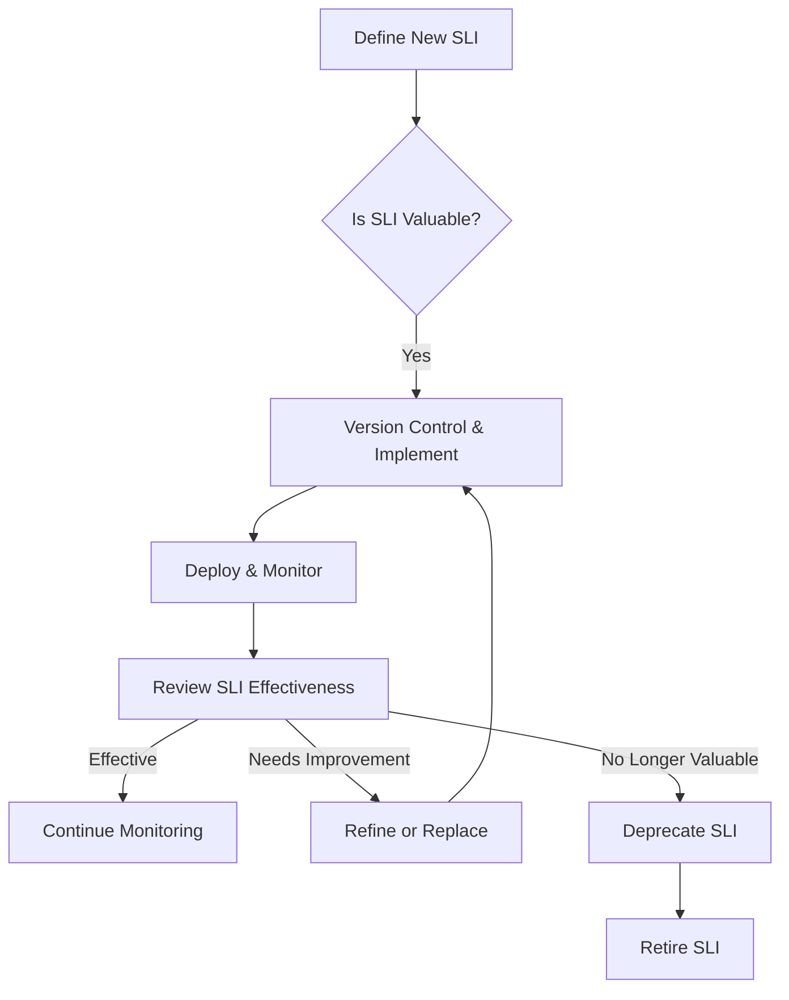

______________________________________________________________________

Use this checklist and workflow to ensure your SLIs remain relevant, accurate, and aligned with the evolving needs of your banking environment. By following these steps, you can sustain high-quality reliability metrics that provide actionable insights and support continuous improvement.
