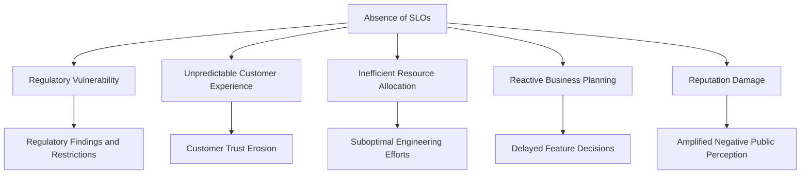
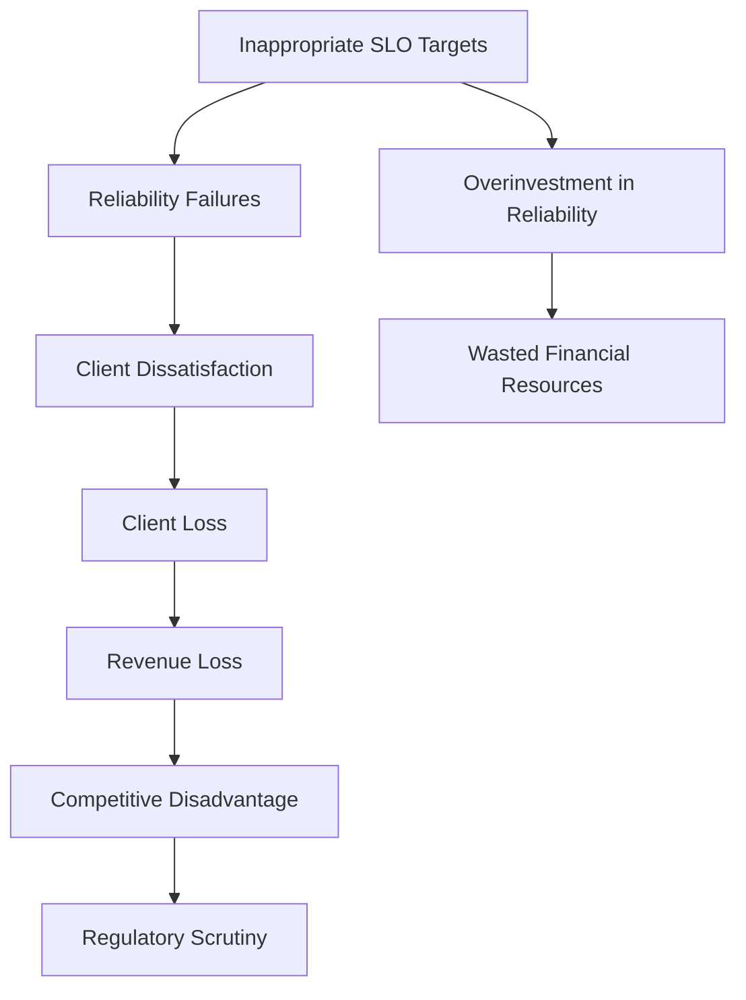
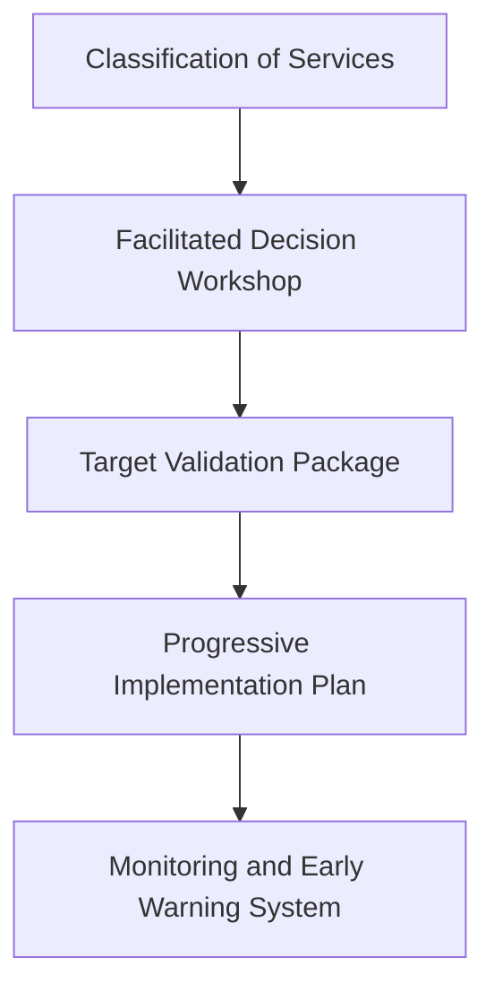
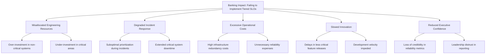
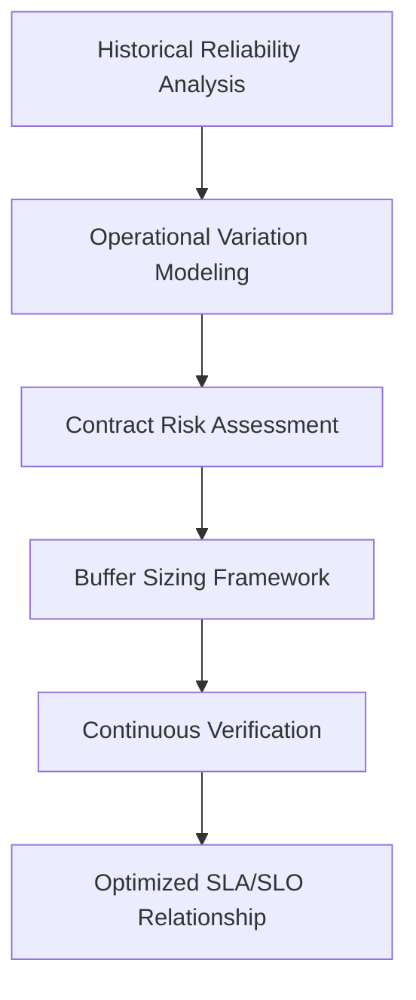
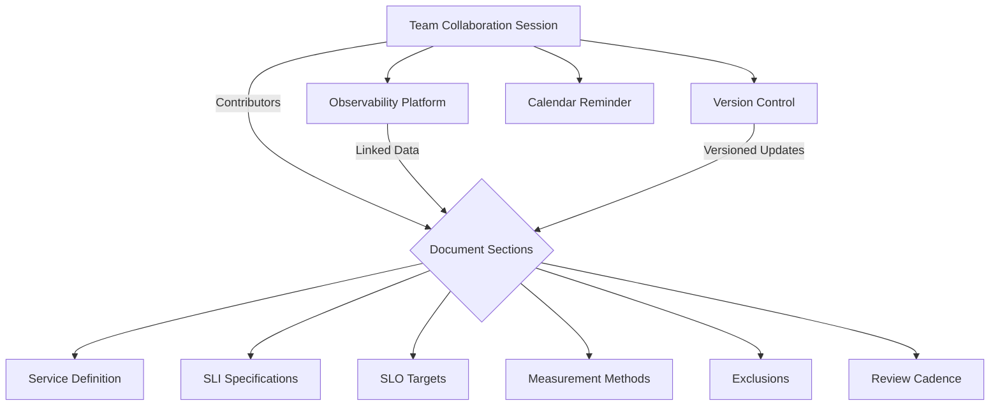
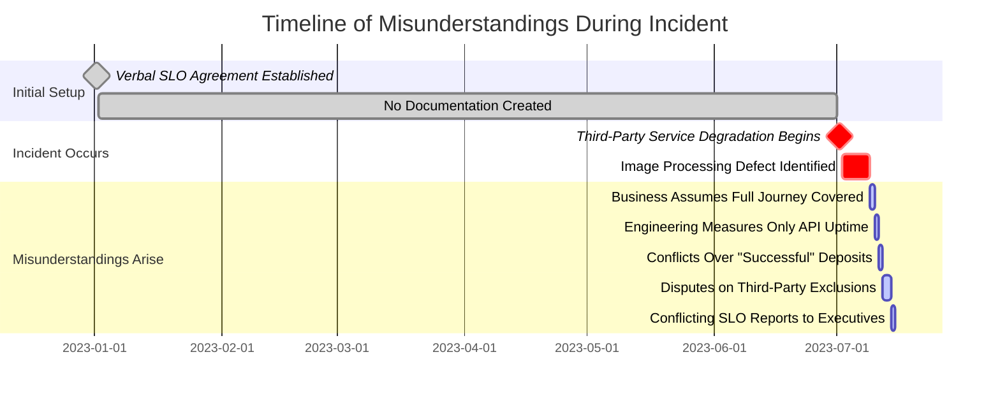
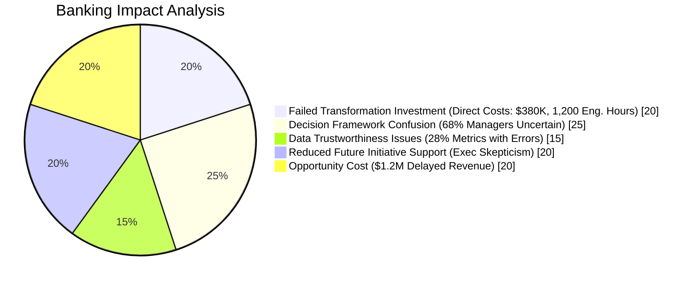
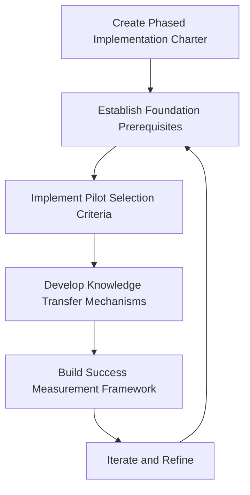

# Chapter 5: Service-Level Objectives (SLOs) - Setting Reliability Targets

## Chapter Overview

Welcome to the SLO Hunger Games, where your service’s fate is determined by numbers, not wishful thinking. This chapter rips the rose-colored glasses off site reliability, exposing SLOs as the brutal, business-driven contracts they are—not the cuddly metrics dashboards you’ve been nursing. Forget vague “uptime” boasts and hand-wavey “good enough” arguments. Here, you’ll learn why “just monitor everything” is a recipe for regulatory fines, customer rage, and operational burnout. We’ll dissect SLOs from every angle: why they exist, what happens when you screw them up, and how to weaponize them for ruthless prioritization. Expect battle scars, not gold stars. If you want to stop firefighting and start engineering like your job—and your company’s reputation—depend on it, read on.

______________________________________________________________________

## Learning Objectives

By the end of this chapter, you will:

- **Differentiate** between SLIs, SLOs, and SLAs (and finally end those circular arguments).
- **Design** SLOs that mean something to both users and auditors, not just your dashboards.
- **Quantify** error budgets and use them to shut down feature launches (or not) with confidence.
- **Facilitate** cross-team knife fights (ahem, workshops) to pick SLO targets that don’t bankrupt you or get you fired.
- **Implement** tiered SLOs so you stop wasting million-dollar HA budgets on the login page background image.
- **Document** SLOs so precisely that nobody can “interpret” their way out of fixing what’s broken.
- **Sequence** a sane, phased SLO implementation—no more “all services, all at once, all on fire.”
- **Navigate** the political minefield between what you *promise* (SLAs) and what you can *actually* deliver (SLOs).

______________________________________________________________________

## Key Takeaways

- SLOs aren’t “nice to have”—they’re your only defense against regulatory fines, angry customers, and executive blame games. No SLO? Prepare to play scapegoat.
- If you think 98.8% is “pretty good,” try explaining 100,000 failed payments to the CEO. SLOs add the missing zero—and the accountability.
- Picking SLO targets without evidence is like picking lottery numbers: hope is not a strategy, especially when millions are on the line.
- Error budgets are not imaginary—they’re your license to ship features or your red light for “stop, everything’s broken.” Use them, or get used to firefighting.
- Treat every service as equally critical? Enjoy burning out your team, bankrupting your budget, and slowing innovation to a crawl.
- SLAs are legal contracts. If your internal SLO is softer than your external SLA, get ready for penalty payments and partner rage. Buffers aren’t optional; they’re survival.
- Bad SLO documentation creates more confusion than downtime. If nobody agrees what “available” means, you’ll argue endlessly while the system burns.
- A big-bang SLO rollout guarantees chaos and disappointment. Incremental, evidence-driven implementation wins the war—unless you like expensive failure.
- The only thing worse than no SLOs is SLO theater—paper targets nobody uses. Make them actionable, or don’t bother.
- In banking, the cost of SLO mistakes is measured in lawsuits, lost customers, and public embarrassment. Welcome to the big leagues—bring your calculator.

______________________________________________________________________

Remember: SLOs aren’t your friend. They’re your boss, your auditor, and your last line of defense. Ignore them at your peril.

______________________________________________________________________

## Panel 1: From Measurement to Objective - The SLI/SLO Relationship

### Scene Description

A strategic planning session in a modern bank's technology headquarters. On a large digital whiteboard, Sofia draws a clear progression from raw metrics to SLIs and then to SLOs. For their payment processing service, she explains how the SLI "99.2% of payments processed within 2 seconds" evolves into the SLO "99.9% of payments will process within 2 seconds over a 28-day window."

The whiteboard features the following flow:

```
Raw Metrics --> SLI: "99.2% of payments processed within 2 seconds" --> SLO: "99.9% of payments will process within 2 seconds over 28 days"
```

Below this, a colorful "reliability journey" timeline is displayed, showing incremental targets over the next six months:

```
Month 1: 99.3% --> Month 2: 99.4% --> Month 3: 99.5% --> Month 4: 99.6% --> Month 5: 99.8% --> Month 6: 99.9%
```

Team members look intently at the board as Sofia highlights the gap between current performance and target. The structured progression and timeline clearly depict the pathway from measurement to objective, enabling the team to focus on actionable steps. At the back of the room, the bank's CTO nods approvingly, reinforcing the importance of aligning targets with both business goals and regulatory expectations.

### Teaching Narrative

Service Level Objectives (SLOs) transform measurements into commitments by adding three critical elements to SLIs: a target level, a time window, and implicit prioritization.

While an SLI tells you what's happening right now ("our payment success rate is currently 99.2%"), an SLO declares what should happen consistently ("our payment success rate will be at least 99.9% measured over 28 days"). This transformation may seem subtle, but it fundamentally changes how teams approach reliability.

The relationship between SLIs and SLOs is precisely defined:

- SLIs are metrics that measure service health from the user perspective
- SLOs are target values for those metrics over specified time windows
- Every SLO must be based on an SLI, but not every SLI needs an associated SLO

This distinction is particularly important in banking environments, where specific reliability levels may be required by regulatory frameworks or customer agreements. By setting explicit SLOs, organizations move from reactive monitoring ("is there a problem?") to proactive reliability management ("are we meeting our commitments?").

For production support engineers transitioning to SRE roles, this shift introduces a new dimension of accountability—not just detecting and resolving issues, but maintaining service performance within predefined boundaries over time.

### Common Example of the Problem

A retail banking division tracks numerous payment processing metrics in real-time dashboards. The operations team vigilantly monitors these dashboards and responds to threshold-based alerts when metrics exceed predefined limits. Despite this diligent monitoring, they face recurring customer complaints and executive escalations about payment reliability.

During a particularly frustrating incident review, the team realizes their fundamental problem: while they have excellent measurement (SLIs) showing that their payment gateway averages 98.8% availability, they've never established what level is actually acceptable over time. One team member argues that 98.8% is "good enough" given technical constraints, while another insists they need "four nines" for critical financial services. Without an agreed-upon target (SLO), these discussions remain subjective and contentious, making it impossible to determine objectively whether the service is meeting expectations or requires immediate improvement.

#### Checklist: Key Issues Identified

- **Lack of Defined Targets**: Metrics are monitored, but no explicit SLOs exist to clarify what level of reliability is acceptable.
- **Subjective Discussions**: Team members debate what is "good enough" without a shared, measurable standard.
- **Reactive Monitoring**: Efforts focus on responding to alerts rather than proactively managing service reliability.
- **Inability to Align on Priorities**: Without SLOs, it is unclear whether the service meets business or customer expectations.
- **Missed Opportunity for Proactive Improvements**: The absence of long-term reliability goals prevents the team from identifying and addressing gaps systematically.

### SRE Best Practice: Evidence-Based Investigation

When transitioning from SLIs to SLOs, experienced SREs follow these evidence-based approaches. The table below summarizes each approach, providing clear examples and expected outcomes to enhance understanding and practical application:

| **Approach** | **Example** | **Outcome** |
| ----------------------------------- | ----------------------------------------------------------------------------------------------------------------------------------------------------------------------------------------------------------------------------------------------------------------------------- | ----------------------------------------------------------------------------------------------- |
| **Historical Performance Analysis** | Collect at least 30 days of SLI data (preferably 90+ days) to establish baseline performance. For instance, the team analyzes three months of availability data, revealing a consistent range of 98.2% to 99.1%, with an average of 98.7%. | Identifies realistic starting points for setting achievable SLOs based on historical trends. |
| **Customer Impact Correlation** | Examine customer complaints, support tickets, and business metrics to detect technical performance thresholds that affect user experience. For example, payment availability below 99.0% correlates with a 15% increase in transaction abandonment and a surge in complaints. | Highlights user-impacting thresholds to prioritize reliability improvements. |
| **Comparative Benchmarking** | Research industry standards and competitor performance through sources like public postmortems and industry reports. The team finds that leading financial institutions maintain payment availability SLOs between 99.9% and 99.95%. | Establishes competitive benchmarks to align SLOs with industry expectations and customer trust. |
| **Stakeholder Interviews** | Conduct structured interviews with business owners, product managers, and executives. For example, these interviews reveal payment processing is considered mission-critical, with expectations far exceeding current performance. | Aligns SLOs with business priorities and stakeholder expectations. |
| **Cost-Benefit Modeling** | Develop models quantifying the cost of achieving different reliability levels and the business impact of failing to meet them. For instance, improving availability from 98.7% to 99.5% is projected to cost $450,000 but prevent $1.2M in annual revenue loss. | Provides data-driven insights to balance engineering investment against business value. |

By using these approaches, teams can ensure that SLOs are both data-driven and aligned with business and user needs. This methodical process reduces guesswork, builds stakeholder confidence, and supports proactive reliability management.

### Banking Impact

The absence of clearly defined SLOs in banking environments creates several critical business impacts. The cascading nature of these impacts can be visualized as a cause-and-effect chain:



1. **Regulatory Vulnerability**: Without explicit reliability targets, banks cannot demonstrate to regulators that they have appropriate control over critical financial services, potentially resulting in regulatory findings and restrictions.

2. **Unpredictable Customer Experience**: Inconsistent reliability leads to unpredictable customer experiences, particularly damaging in financial services where trust is paramount. Research indicates that 32% of customers who experience payment failures will reduce their usage of banking services.

3. **Inefficient Resource Allocation**: Without clear targets, teams tend to either over-invest in already-reliable services or under-invest in critical areas, leading to suboptimal allocation of limited engineering resources.

4. **Reactive Business Planning**: The business cannot make informed decisions about new features versus reliability work without understanding current performance against defined objectives.

5. **Reputation Damage**: When reliability issues occur, the lack of clear standards makes it difficult to determine whether they represent expected variance or significant failures requiring immediate action, often leading to delayed responses and amplified reputational damage.

### Implementation Guidance

To effectively transform SLIs into SLOs in your banking environment, follow this structured process:

```mermaid
flowchart TD
    A[Define Bounded Scope] --> B[Secure Executive Sponsorship]
    B --> C[Create Multi-Tier SLO Templates]
    C --> D[Establish Incremental Targets]
    D --> E[Develop SLO Review Cadence]

    subgraph Step1[Define Bounded Scope]
        direction LR
        S1A[Identify critical services] --> S1B[Select 1-3 services]
        S1B --> S1C[Focus on customer impact]
    end

    subgraph Step2[Secure Executive Sponsorship]
        direction LR
        S2A[Engage technology leaders] --> S2B[Engage business leaders]
        S2B --> S2C[Document formal approval]
    end

    subgraph Step3[Create Multi-Tier SLO Templates]
        direction LR
        S3A[Define target values] --> S3B[Specify measurement windows]
        S3B --> S3C[Document data sources]
        S3C --> S3D[Customize for service tiers]
    end

    subgraph Step4[Establish Incremental Targets]
        direction LR
        S4A[Analyze performance gap] --> S4B[Define current SLO]
        S4B --> S4C[Set progressive milestones]
        S4C --> S4D[Document target SLO]
    end

    subgraph Step5[Develop SLO Review Cadence]
        direction LR
        S5A[Schedule quarterly reviews] --> S5B[Engage cross-functional stakeholders]
        S5B --> S5C[Adjust SLOs as needed]
    end
```



#### Steps in Detail:

1. **Define Bounded Scope**\
   Start small by selecting one to three critical, customer-facing services (e.g., payment processing, authentication, account access). Focus on services with the highest user impact to create meaningful, actionable SLOs.

2. **Secure Executive Sponsorship**\
   Ensure buy-in from technology and business executives. Communicate the value of SLOs as a decision-making framework and document their formal approval of initial SLO targets to mitigate disputes later.

3. **Create Multi-Tier SLO Templates**\
   Develop standardized templates for defining SLOs, detailing the target value, measurement window, data sources, and calculation methodology. Tailor these templates for different service tiers: critical, core, supporting, and auxiliary.

4. **Establish Incremental Targets**\
   When there’s a significant gap between current SLI performance and desired SLO levels, define a progressive improvement timeline. Start with a "current SLO" that reflects achievable performance and document a "target SLO" for long-term objectives.

5. **Develop SLO Review Cadence**\
   Schedule regular (e.g., quarterly) review cycles to evaluate SLO performance. Include both technical and business stakeholders in these reviews to ensure alignment with evolving requirements and objectives.

## Panel 2: The Target Selection Dilemma - Finding the Right Number

### Scene Description

A cross-functional workshop is in progress where technical and business stakeholders are debating appropriate SLO targets for a new investment trading platform. The room is filled with charts on the wall displaying different perspectives: historical performance data, competitor benchmarks, customer expectations from surveys, and cost implications of different reliability levels. Raj is leading the session, skillfully facilitating sometimes heated discussions between the Head of Trading (who insists on 99.99% availability), the CTO (who emphasizes technical feasibility), and the CFO (who is focused on controlling implementation costs).

On a whiteboard, Raj has drawn a decision matrix that visually maps the factors influencing the target selection process. The matrix uses circles of varying sizes to represent the relative importance of each factor. Below is a textual representation of the matrix:

```
+-----------------------+-----------------------+
| Factor                | Relative Importance  |
+-----------------------+-----------------------+
| User Expectations     | ●●●●●●               |
| Business Requirements | ●●●●●                |
| Technical Feasibility | ●●●●                 |
| Economic Constraints  | ●●●●●●●             |
| Historical Performance| ●●●                 |
+-----------------------+-----------------------+
(Larger circles = more weight in decision-making)
```

The group is gradually converging on a tiered approach, where different SLOs will be applied to trading functions based on their criticality. For example, the most critical functions like payment processing and authentication may have targets near 99.99%, while auxiliary services like reporting and analytics may have more moderate targets.

### Teaching Narrative

Setting the right SLO target is one of the most consequential decisions in reliability engineering—too ambitious, and you'll never meet it; too lenient, and it won't protect user experience. This decision requires balancing multiple competing factors:

1. **User Expectations**: What level of reliability do customers need and expect? For critical banking functions like payments or trading, expectations are typically high, while for informational features they may be more moderate.

2. **Business Requirements**: What reliability level aligns with business goals and competitive positioning? Premium banking services may require higher reliability than standard offerings.

3. **Technical Feasibility**: What level can your current architecture realistically support? Legacy systems may have inherent reliability limitations.

4. **Economic Constraints**: What investment is justified for reliability improvements? Perfect reliability is prohibitively expensive, requiring careful cost-benefit analysis.

5. **Historical Performance**: What level has the service actually achieved in the past? Starting with targets aligned with proven capability prevents immediate failure.

The SLO target selection process is inherently cross-functional—it cannot be determined by engineers alone. Effective target setting requires collaboration between technical teams who understand what's possible, product managers who understand user needs, and business leaders who understand strategic priorities.

For banking services, this process often results in tiered objectives, with the highest reliability reserved for the most critical functions (payment processing, authentication) and more moderate targets for auxiliary services (reporting, analytics).

### Common Example of the Problem

The corporate banking division is developing SLOs for their treasury management platform that serves multinational corporate clients. During initial discussions, severe disconnects emerge between stakeholders, each advocating for different availability targets based on their priorities:

| **Stakeholder Group** | **Proposed Target** | **Rationale** |
| --------------------- | ---------------------------------------- | ----------------------------------------------------------------------------------------------------- |
| Sales Team | 99.999% (5 minutes of downtime per year) | Promised "always-on service" to key clients, aiming to exceed client expectations and secure trust. |
| Engineering Team | 99.9% (8.8 hours of downtime per year) | Recently migrated system with current architectural limitations; higher targets deemed infeasible. |
| Product Team | 99.95% (4.4 hours of downtime per year) | Based on competitor benchmarks; seeking to balance reliability with market positioning. |
| Finance Team | 99.5% (43.8 hours of downtime per year) | Questions ROI of higher reliability investments and prioritizes cost efficiency over ambitious goals. |

Without a structured approach to reconcile these conflicting perspectives, discussions spiral into circular arguments. Ultimately, the platform launches without defined reliability targets. This leads to immediate expectation mismatches during the first significant outage, frustrating corporate clients. The dissatisfaction stems not only from the outage itself but also from the bank's inability to communicate clear service expectations or clarify whether the disruption was within acceptable thresholds or an exceptional failure.

### SRE Best Practice: Evidence-Based Investigation

Effective SRE teams follow these evidence-based approaches to resolve target selection dilemmas. Below is a checklist summarizing these approaches to guide practitioners in their own contexts:

#### Checklist for Evidence-Based Investigation:

- [ ] **Competitor Analysis Protocol**:

  - Conduct structured analysis of competitor reliability commitments.
  - Review published SLAs, postmortem data, and gather insights from customer interviews.
  - Example Insight: Leading competitors commit to 99.95% availability during business hours but exclude planned maintenance and only compensate below 99.9%.

- [ ] **Cost Modeling Framework**:

  - Develop detailed cost estimates for achieving different reliability levels.
  - Include infrastructure, engineering efforts, operational overhead, and technical debt implications.
  - Example Insight: Moving from 99.9% to 99.95% requires ~$1.2M initial investment and $350K annual maintenance, while 99.99% requires ~$4.5M upfront and $950K annually.

- [ ] **Customer Impact Quantification**:

  - Gather data on how reliability levels correlate with business metrics like revenue, customer retention, and transaction volume.
  - Example Insight: Corporate treasury clients begin shifting transaction volumes after experiencing more than 4 hours of downtime per quarter.

- [ ] **Technical Risk Assessment**:

  - Conduct failure mode analysis to identify architectural limitations and the probability of achieving different reliability levels.
  - Example Insight: Engineering assessments show 99.9% can be achieved immediately, 99.95% after planned improvements, and 99.99% requiring fundamental re-architecture.

- [ ] **Incremental Improvement Modeling**:

  - Create staged reliability targets with clear milestones tied to specific architectural improvements.
  - Example Insight: A roadmap shows progression from 99.9% to 99.95% over 12 months, with identified technical deliverables for each step.

Practitioners can use this checklist as a starting point to tailor their investigation processes, ensuring that decisions are grounded in data and aligned with organizational priorities.

### Banking Impact

Inappropriate SLO targets create significant business consequences in banking environments. The cascading effects of setting unrealistic or misaligned targets are summarized below:



1. **Client Retention Risk**: Corporate banking clients frequently include service level requirements in their vendor selection criteria. Research indicates that 28% of corporate clients had shifted treasury services to competitors following reliability incidents in the past year.

2. **Revenue Impact**: Transaction-based services like treasury management directly lose revenue during outages. For a platform processing $3.5B daily, even brief reliability failures have substantial financial consequences—a one-hour outage during peak hours costs approximately $700,000 in fees and float income.

3. **Competitive Disadvantage**: In the highly competitive treasury management market, reliability has emerged as a key differentiator. Market analysis shows that banks with lower reliability lose approximately 3% market share annually to more reliable competitors.

4. **Regulatory Scrutiny**: Financial regulators increasingly focus on operational resilience, with explicit expectations for critical banking services. Inappropriate reliability targets can trigger regulatory interventions, including potential limitations on new customer onboarding or service expansion.

5. **Wasted Investment**: Overly ambitious targets drive excessive spending without proportional customer benefit. Financial analysis reveals that improving availability beyond 99.95% for this service would cost an additional $3.2M annually while preventing only approximately $800K in business impact.

### Implementation Guidance

To establish appropriate SLO targets for your banking services, follow this structured workflow:

#### Step-by-Step Workflow



#### Detailed Steps

1. **Classification of Services**:

   - Develop a tiered classification system for banking services based on criticality and user impact:
     - **Tier 0: Critical** (e.g., payment processing, authentication): Target 99.95%-99.99%.
     - **Tier 1: Core** (e.g., account management): Target 99.9%-99.95%.
     - **Tier 2: Supporting** (e.g., reporting): Target 99.5%-99.9%.
     - **Tier 3: Auxiliary** (e.g., analytics): Target 99.0%-99.5%.

2. **Facilitated Decision Workshop**:

   - Conduct cross-functional workshops with representatives from technology, product, finance, compliance, and business units.
   - Use a documented decision matrix with weighted criteria (e.g., customer expectations, technical feasibility, and cost).
   - Establish clear decision rights and ensure all perspectives are represented.

3. **Target Validation Package**:

   - Compile documentation that captures the rationale for each selected SLO target. Include:
     - Data sources and historical performance metrics.
     - Assumptions and trade-off analysis.
     - Cost modeling and competitive benchmarks.
   - Use this package as a reference for stakeholder alignment and future reviews.

4. **Progressive Implementation Plan**:

   - Break down ambitious targets into achievable phases with intermediate milestones. For each phase, define:
     - Current performance baseline.
     - Intermediate and final SLO targets.
     - Required technical deliverables and timelines.
   - Ensure clear communication of the plan to all stakeholders.

5. **Monitoring and Early Warning System**:

   - Deploy robust monitoring tools to track service performance against established SLOs.
   - Implement alerting mechanisms for trends indicating potential SLO violations. This allows teams to act preemptively to avoid breaches.
   - Regularly review monitoring data to iterate and improve reliability strategies.

By following this workflow, you can ensure that SLO targets are thoughtfully defined, collaboratively agreed upon, and effectively implemented to balance user expectations, business needs, and technical feasibility.

## Panel 3: Time Windows and Calculations - The Mathematics of Reliability

### Scene Description

An engineering deep-dive session where Alex demonstrates different SLO calculation methods on digital whiteboards. The setup includes the following key components:

- **Whiteboard 1: Calendar-Based View**

  - Displays a 30-day rolling window for a payment service SLO.
  - Highlights how incidents impact compliance over the rolling period.

- **Whiteboard 2: Error Budget Formula**

  - Shows the mathematical formula used to calculate the permitted error budget for a 99.9% availability target:
    ```
    Error Budget = (1 - SLO Target) × Time Window
    ```
  - Includes a worked example demonstrating that a 99.9% availability SLO over 30 days allows for approximately 43 minutes of downtime.

- **Whiteboard 3: Incident Simulation**

  - Simulates how the same service incidents affect SLO compliance under different time windows:
    ```
    Time Windows: 1-day | 7-day | 30-day
    Incident Impact: High | Medium | Low
    Recovery Speed: Fast | Moderate | Slow
    ```
  - Visualizes how shorter windows amplify incident impact but enable quicker recovery, while longer windows provide more stability.

- **Team Exercises**

  - Team members calculate remaining error budgets for various hypothetical incident scenarios, leveraging the tools and concepts displayed on the whiteboards.

- **Real-Time Dashboard**

  - A dedicated monitor displays current SLO performance across multiple banking services.
  - Services nearing their thresholds are highlighted, emphasizing the importance of proactive monitoring and incident prioritization.

#### Visual Layout (Text-Based Representation)

```
+-------------------------------------------------------+
| Whiteboard 1: Calendar-Based View                    |
| - 30-Day Rolling Window                              |
| - Incident Impact on Compliance                      |
+-------------------------------------------------------+

+-------------------------------------------------------+
| Whiteboard 2: Error Budget Formula                   |
| - Formula: Error Budget = (1 - SLO Target) × Time    |
| - Example: 99.9% SLO => 43 min Downtime              |
+-------------------------------------------------------+

+-------------------------------------------------------+
| Whiteboard 3: Incident Simulation                    |
| - Time Windows: 1-day | 7-day | 30-day               |
| - Impact: High | Medium | Low                        |
| - Recovery: Fast | Moderate | Slow                   |
+-------------------------------------------------------+

+-------------------------------------------------------+
| Real-Time Dashboard: SLO Performance                 |
| - Current Performance Across Banking Services        |
| - Threshold Alerts for Critical Services             |
+-------------------------------------------------------+
```

This setup ensures a structured flow for the session, allowing participants to engage with both theoretical concepts and practical applications of SLO calculations.

### Teaching Narrative

SLOs require precise mathematical definitions to be actionable. Two fundamental components define how SLO attainment is calculated: the time window and the calculation method.

**Time Window Selection** determines the period over which performance is evaluated:

- **Calendar-Based Windows** (e.g., calendar month) align with business reporting but can create artificial boundaries
- **Rolling Windows** (e.g., trailing 30 days) provide continuous evaluation without arbitrary cutoffs
- **Multiple Windows** (e.g., 1-day, 30-day, and 90-day) offer both short-term and long-term perspectives

The time window significantly impacts how incidents affect SLO compliance. Shorter windows make individual incidents more impactful but allow faster recovery, while longer windows provide stability but extend the impact of major incidents.

**Calculation Methods** define how raw data translates into SLO attainment:

- **Request-Based Calculation**: (Good Requests / Total Requests) ≥ Target%
- **Time-Based Calculation**: (Time Available / Total Time) ≥ Target%
- **Composite Calculations**: Combining multiple SLIs into a single SLO through weighted formulas

Banking environments typically require more sophisticated calculations due to the varying importance of different transaction types. For example, an investment platform might weight high-value trades more heavily in SLO calculations than informational queries.

Converting SLO targets into practical error budgets requires further calculation:
Error Budget = (1 - SLO Target) × Time Window

For example, a 99.9% availability SLO over 30 days provides approximately 43 minutes of permitted downtime. Understanding these calculations is essential for effective SLO management and incident response prioritization.

### Common Example of the Problem

The bank's merchant services division implemented SLOs for their payment gateway without carefully considering time window selection. They established a calendar month window with a 99.9% availability target. This approach created several unforeseen problems:

In March, a significant 35-minute outage consumed most of their monthly error budget in a single incident. With barely any budget remaining for the rest of the month, the team implemented a complete feature freeze, halting all planned deployments including critical security patches. This created unnecessary security risk and delayed competitive features.

Conversely, in April, they experienced multiple small incidents of 3-5 minutes each, none substantial enough to trigger significant concern within the calendar month view. However, examining a rolling 30-day window would have revealed a concerning trend of increasingly frequent small outages that eventually led to a major system failure in early May.

The sequence of events impacting SLO compliance can be visualized as follows:

```mermaid
gantt
    title Incident Timeline: March - May
    dateFormat  YYYY-MM-DD
    section March
    35-Minute Outage         :crit, active, m1, 2023-03-15, 1d
    Feature Freeze           :m2, after m1, 2023-03-16, 16d
    section April
    Small Incidents (3-5 min):crit, a1, 2023-04-01, 30d
    section May
    Major System Failure     :crit, active, f1, 2023-05-02, 1d
```

At quarter-end, when transaction volumes tripled, the team lacked the mathematical framework to determine if their fixed percentage target remained appropriate under dramatically different load conditions. Without clear calculations for this scenario, they made arbitrary decisions about acceptable performance during this critical business period.

By visualizing the timeline, it becomes clear how the choice of a calendar month window obscured critical trends and compounded operational risks. A rolling 30-day window would have provided a more continuous and actionable view, enabling earlier intervention and better prioritization of incident response and system improvements.

### SRE Best Practice: Evidence-Based Investigation

Experienced SREs apply these evidence-based approaches to time window and calculation decisions:

1. **Window Impact Analysis**: Use historical incident data to model how different time windows would interpret the same events. Analysis of six months of payment gateway incidents revealed that a 30-day rolling window provided the most balanced view, while 7-day windows were too volatile and calendar-month windows created artificial boundaries that obscured important trends.

2. **Business Cycle Alignment**: Analyze business operations to identify natural time periods for measurement. For merchant services, this analysis showed major weekly patterns (weekend vs. weekday), monthly patterns (beginning vs. end-of-month settlement), and quarterly patterns (seasonal retail peaks) that influenced appropriate window selection.

3. **Calculation Method Comparison**: Implement multiple parallel calculation methods and compare their effectiveness in capturing customer impact. Side-by-side comparison of request-based, time-based, and composite methods revealed that request-based calculations weighted by transaction value provided the most accurate reflection of business impact for merchant services.

4. **Statistical Validity Testing**: Apply statistical methods to determine appropriate sample sizes for reliable measurement. Analysis showed that measurement windows shorter than 14 days created excessive statistical volatility due to natural variation in transaction patterns.

5. **Simulation Testing**: Create models that predict SLO behavior under different incident scenarios. The team simulated 50+ incident patterns against 12 different time window configurations, identifying that a combination of 7-day and 28-day rolling windows provided the optimal balance of responsiveness and stability.

______________________________________________________________________

#### Checklist: Key Practices for Evidence-Based Investigation

- [ ] **Window Impact Analysis**: Evaluate historical incidents across multiple time windows for trend clarity and balance.
- [ ] **Business Cycle Alignment**: Identify operational cycles (weekly, monthly, quarterly) that influence customer behavior and tailor time windows accordingly.
- [ ] **Calculation Method Comparison**: Experiment with request-based, time-based, and composite calculations to find the most accurate representation of customer impact.
- [ ] **Statistical Validity Testing**: Ensure measurement windows are statistically reliable by avoiding excessive volatility in shorter timeframes.
- [ ] **Simulation Testing**: Test various incident scenarios against multiple time window configurations to identify optimal responsiveness and stability.

______________________________________________________________________

#### Summary Table: Evidence-Based Investigation Practices and Benefits

| Practice | Description | Benefit |
| --------------------------------- | --------------------------------------------------------------------------- | ------------------------------------------------------------------------------------- |
| **Window Impact Analysis** | Model historical incidents across different time windows. | Identifies time windows that balance trend stability and responsiveness. |
| **Business Cycle Alignment** | Match time windows to natural business cycles (weekly, monthly, quarterly). | Ensures SLOs align with customer behavior and operational patterns. |
| **Calculation Method Comparison** | Compare request-based, time-based, and composite methods. | Determines the most accurate calculation for reflecting customer and business impact. |
| **Statistical Validity Testing** | Test sample sizes for reliability and volatility. | Reduces noise and ensures accurate, consistent SLO measurement. |
| **Simulation Testing** | Simulate incidents across multiple time window configurations. | Identifies configurations that optimize responsiveness and long-term trend stability. |

### Banking Impact

Poor time window and calculation choices create significant business consequences in banking environments. The following illustrates key problem areas and their statistical findings:

1. **Operational Whiplash**:\
   Inappropriate time windows can cause excessive oscillation between normal operation and emergency response. Merchant services using calendar-month windows experienced 3.5x more "emergency" declarations than properly configured rolling windows, leading to reduced team effectiveness.

   ```mermaid
   barChart
      title Emergency Declarations by Time Window
      axis X Time Window
      axis Y Emergency Declarations
      data Calendar-Month,3.5
      data Rolling-Window,1
   ```

2. **Missed Early Warnings**:\
   Longer windows obscure emerging problems until they become severe. Over six months of incidents, 7-day windows detected degradation patterns early in 83% of cases, compared to only 31% with 30-day windows.

   ```mermaid
   pie
      title Early Detection Rates by Window
      "7-Day Window": 83
      "30-Day Window": 31
   ```

3. **Seasonal Business Risk**:\
   Fixed calculation methods overlook seasonal patterns. For example, during holiday shopping peaks, merchant services transaction volume increased 4x. Fixed percentage availability measurements failed to account for the higher business impact, creating a misalignment in SLO prioritization.

   ```mermaid
   barChart
      title Transaction Volume Increase During Holiday Peaks
      axis X Period
      axis Y Transaction Volume (relative scale)
      data Regular,1
      data Holiday-Peak,4
   ```

4. **Misaligned Priorities**:\
   Inappropriate calculations can overemphasize technically significant but business-irrelevant issues. For instance, a batch processing delay during non-business hours significantly impacted the SLO, while a brief but critical authorization issue during peak hours registered as minor.

   ```mermaid
   barChart
      title Incident Impact vs Business Hours
      axis X Incident Type
      axis Y SLO Impact
      data Batch-Processing (Non-Business),80
      data Authorization-Issue (Peak Hours),20
   ```

5. **Regulatory Reporting Challenges**:\
   Poorly defined calculations complicate regulatory reporting. During a compliance review, regulators identified that inconsistent time windows across services made coherent availability reporting for the overall merchant services platform impossible.

   ```mermaid
   flowchart LR
      A[Inconsistent Time Windows] --> B[Incoherent Reporting]
      B --> C[Regulatory Concerns]
   ```

These examples highlight the critical need for well-chosen time windows and calculation methods to ensure operational stability, early problem detection, and alignment with both business priorities and regulatory requirements.

### Implementation Guidance

To implement effective time windows and calculations for your banking SLOs:

1. **Implement Multi-Window Observation**: Deploy a minimum of two complementary time windows for each critical service: a shorter window (7-14 days) for responsive detection and a longer window (30-90 days) for stability. Configure alerting and dashboards to display both perspectives simultaneously.

   Example Scenario:

   - For a payment service, configure a 7-day window to track recent performance trends and detect anomalies quickly. Simultaneously, maintain a 30-day window to assess overall service reliability and inform long-term planning.
   - Use pseudocode like the following to calculate rolling windows:
     ```python
     import pandas as pd

     # Example incident data with timestamps
     incidents = pd.DataFrame({'timestamp': ['2023-10-01', '2023-10-05', '2023-10-10'],
                               'impact_minutes': [10, 15, 20]})

     # Define rolling windows
     short_window_days = 7
     long_window_days = 30

     # Calculate rolling impact for each window
     current_date = pd.Timestamp('2023-10-15')
     short_window_start = current_date - pd.Timedelta(days=short_window_days)
     long_window_start = current_date - pd.Timedelta(days=long_window_days)

     short_window_impact = incidents[(incidents['timestamp'] >= short_window_start.strftime('%Y-%m-%d'))]['impact_minutes'].sum()
     long_window_impact = incidents[(incidents['timestamp'] >= long_window_start.strftime('%Y-%m-%d'))]['impact_minutes'].sum()

     print(f"Short window impact (7 days): {short_window_impact} minutes")
     print(f"Long window impact (30 days): {long_window_impact} minutes")
     ```

2. **Align Calculation Methods to Service Types**: Map different calculation approaches to appropriate service patterns: request-based calculations for transactional services, time-based calculations for continuous services, and composite calculations for complex user journeys with multiple components.

   Example Scenario:

   - For a transactional service like fund transfers, use a request-based calculation:

     ```python
     good_requests = 9995
     total_requests = 10000
     slo_target = 0.999

     slo_attainment = good_requests / total_requests
     print(f"SLO Attainment: {slo_attainment:.3f}")
     if slo_attainment >= slo_target:
         print("SLO met.")
     else:
         print("SLO not met.")
     ```

   - For a continuous service like a stock ticker API, use a time-based calculation:

     ```python
     time_available = 1438  # minutes available
     total_time = 1440  # total minutes in a day
     slo_target = 0.999

     slo_attainment = time_available / total_time
     print(f"SLO Attainment: {slo_attainment:.3f}")
     if slo_attainment >= slo_target:
         print("SLO met.")
     else:
         print("SLO not met.")
     ```

3. **Create Value-Weighted Transactions**: For financial services processing transactions of widely varying importance, implement value-weighted calculations where higher-value transactions carry proportionally greater weight in SLO calculations.

   Example Scenario:

   - For an investment platform, weight high-value trades more heavily:
     ```python
     transactions = [{'value': 1000, 'success': True},
                     {'value': 500, 'success': False},
                     {'value': 2000, 'success': True}]

     weighted_success = sum(t['value'] for t in transactions if t['success'])
     total_weight = sum(t['value'] for t in transactions)

     slo_attainment = weighted_success / total_weight
     print(f"Weighted SLO Attainment: {slo_attainment:.3f}")
     ```

4. **Develop Business Hour Adjustments**: For services with clearly defined business hours or usage patterns, implement time-of-day and day-of-week weighting to reflect true business impact. For example, weight merchant services availability during business hours 3x higher than overnight periods.

   Example Scenario:

   - For a merchant service:
     ```python
     business_hours_weight = 3
     non_business_hours_weight = 1

     business_hours_downtime = 10  # minutes
     non_business_hours_downtime = 20  # minutes

     weighted_downtime = (business_hours_downtime * business_hours_weight) + \
                         (non_business_hours_downtime * non_business_hours_weight)

     total_weighted_minutes = (60 * business_hours_weight) + (60 * non_business_hours_weight)
     slo_attainment = 1 - (weighted_downtime / total_weighted_minutes)
     print(f"Weighted SLO Attainment: {slo_attainment:.3f}")
     ```

5. **Build Error Budget Calculators**: Develop practical tools that translate SLO targets into concrete operational terms like "minutes of allowable downtime remaining this month" and "maximum incidents of X size before breaching." Make these calculations accessible to all team members through dashboards and automated reports.

   Example Calculator:

   ```python
   slo_target = 0.999
   time_window_minutes = 30 * 24 * 60  # 30 days

   error_budget_minutes = (1 - slo_target) * time_window_minutes
   print(f"Error Budget: {error_budget_minutes:.2f} minutes")

   # Calculate remaining error budget after incidents
   used_error_budget = 43  # minutes
   remaining_budget = error_budget_minutes - used_error_budget
   print(f"Remaining Error Budget: {remaining_budget:.2f} minutes")
   ```

## Panel 4: Tiered SLOs - Differentiating Service Criticality

### Scene Description

A strategic planning meeting for a major banking platform upgrade. The focal point of the room is a large matrix display categorizing banking services into tiers based on criticality and reliability targets:

```
+----------------+----------------------+---------------------+-----------------------+
|    Tier        | Example Services     | Reliability Target  | Business Impact       |
+----------------+----------------------+---------------------+-----------------------+
| Tier 0 -       | Payment Processing,  | 99.95%-99.99%       | Immediate and severe  |
| Critical       | Authentication       |                     | impact; regulatory    |
|                |                      |                     | consequences          |
+----------------+----------------------+---------------------+-----------------------+
| Tier 1 - Core  | Account Management,  | 99.9%-99.95%        | Brief degradation     |
|                | Transfers            |                     | tolerable but not     |
|                |                      |                     | routine               |
+----------------+----------------------+---------------------+-----------------------+
| Tier 2 -       | Reporting,           | 99.5%-99.9%         | Temporary degradation |
| Supporting     | Notifications        |                     | impacts user          |
|                |                      |                     | experience            |
+----------------+----------------------+---------------------+-----------------------+
| Tier 3 -       | Personalization,     | 99%-99.5%           | Desirable reliability |
| Auxiliary      | Analytics            |                     | but not business-     |
|                |                      |                     | critical              |
+----------------+----------------------+---------------------+-----------------------+
```

Sofia and the Head of Digital Banking are presenting to executives, explaining how this tiered approach aligns reliability investments with business priorities. A financial analysis on a side screen highlights the cost implications of each tier's reliability targets.

The discussion includes a collaborative exercise where team members evaluate a new mobile feature and debate which tier it should fall into, guided by a customer impact analysis. The structured visual representation of tiers helps ground the conversation, enabling clearer prioritization and alignment with business objectives.

### Teaching Narrative

Not all banking services deserve the same reliability targets. Tiered SLOs recognize this reality by establishing different reliability expectations for services based on their criticality, creating a structured framework for prioritization and investment decisions.

A typical banking tiered SLO structure might include:

1. **Tier 0 (Critical)**: Services where failure has immediate, severe business impact or regulatory consequences. Examples include payment processing, authentication, and core transaction systems. SLOs typically target 99.95-99.99% reliability with very short recovery time objectives.

2. **Tier 1 (Core)**: Essential business services where brief degradation is tolerable but not routine. Examples include account management, transfers, and customer self-service functions. SLOs typically target 99.9-99.95% reliability.

3. **Tier 2 (Supporting)**: Important services where temporary degradation impacts user experience but doesn't prevent critical functions. Examples include reporting, notifications, and non-essential APIs. SLOs typically target 99.5-99.9% reliability.

4. **Tier 3 (Auxiliary)**: Nice-to-have services where reliability is desirable but not business-critical. Examples include personalization features, analytics, and content management. SLOs typically target 99-99.5% reliability.

This tiered approach delivers several benefits:

- Aligns engineering effort with business priorities
- Creates clear decision frameworks for incident response
- Enables more efficient resource allocation
- Establishes appropriate expectations across the organization

For banking institutions, which must balance innovation with stability, tiered SLOs provide a structured way to manage reliability expectations across diverse service portfolios, ensuring critical functions receive appropriate attention while allowing controlled risk-taking in less critical areas.

### Common Example of the Problem

A mid-sized regional bank implemented SLOs across their digital platform without a tiered classification system. Instead, they established a uniform 99.95% availability target for all services, reasoning that "everything should be highly reliable." This one-size-fits-all approach quickly created several problems:

During a major incident affecting multiple systems, the operations team struggled to prioritize their response. With identical SLO targets for authentication services (preventing all customer logins) and personalization features (causing minor display issues), they lacked a clear framework for allocating limited incident response resources.

The engineering organization found itself spread thin trying to achieve the same reliability level across all systems. They invested significant resources hardening non-critical services like their financial education content portal to meet the same demanding targets as core transaction systems, while more important systems received insufficient attention.

When advocating for infrastructure investments, the technology team couldn't effectively communicate priorities to executives. Without differentiated targets that reflected business impact, all reliability investments appeared equally important, leading to funding decisions based on other factors like implementation complexity rather than business criticality.

#### Comparison: Uniform SLOs vs. Tiered SLOs

To illustrate the impact of this issue further, the table below compares the outcomes of a uniform SLO approach versus a tiered SLO approach:

| **Aspect** | **Uniform SLOs (99.95%)** | **Tiered SLOs** |
| --------------------------- | --------------------------------------------------------------------------------------- | ------------------------------------------------------------------------------------------------ |
| **Incident Prioritization** | No clear prioritization during outages, leading to delays in resolving critical issues. | Clear prioritization based on tier criticality, ensuring faster recovery for essential services. |
| **Resource Allocation** | Resources spread thinly across all services, including non-critical systems. | Focused investment in critical systems, with relaxed targets for less critical services. |
| **Engineering Focus** | High effort wasted on achieving unnecessary reliability for low-impact services. | Effort aligned with business impact, reducing wasted effort on non-essential services. |
| **Executive Communication** | Difficult to justify reliability investments; all services appear equally important. | Clear business alignment, enabling stronger investment cases for critical services. |
| **Business Impact** | Risk of significant downtime for critical services due to lack of prioritization. | Minimized risk for critical services, while accepting controlled degradation for auxiliary ones. |

By adopting a tiered SLO approach, the bank can ensure that engineering efforts and incident response are appropriately aligned with business priorities, ultimately delivering greater stability and reliability where it matters most.

### SRE Best Practice: Evidence-Based Investigation

Experienced SREs implement tiered SLOs using these evidence-based approaches. To support practical application, use the following checklist to guide your investigation process:

#### Checklist for Evidence-Based Investigation

1. **Criticality Assessment Framework**

   - [ ] Develop a scoring system for evaluating service criticality based on quantifiable factors (e.g., revenue impact, customer reach, regulatory requirements, dependency criticality).
   - [ ] Apply the framework to categorize services into natural groupings.
   - [ ] Validate tier classifications with stakeholders to ensure alignment with business priorities.

2. **Business Impact Analysis**

   - [ ] Model financial and operational impacts of service disruptions at different durations.
   - [ ] Identify high-cost outage scenarios (e.g., authentication failures costing $450,000 in lost transactions).
   - [ ] Compare impact severity across services to prioritize reliability investments effectively.

3. **Customer Journey Mapping**

   - [ ] Map customer interactions to distinguish critical, supporting, and enhancing services.
   - [ ] Identify which services directly enable core functions versus those that enhance user experience.
   - [ ] Validate mappings by linking them to customer pain points and business outcomes.

4. **Cost-to-Reliability Modeling**

   - [ ] Quantify the cost of achieving incremental reliability improvements (e.g., 99.99% vs. 99.9%).
   - [ ] Model trade-offs between reliability levels and engineering resource allocation.
   - [ ] Use cost data to justify and communicate prioritization decisions.

5. **Dependency Analysis**

   - [ ] Map service dependencies to trace potential failure propagation paths.
   - [ ] Identify hidden critical dependencies (e.g., auxiliary services that impact regulatory compliance).
   - [ ] Regularly update dependency maps as services and architectures evolve.

#### Summary Table for Quick Reference

| Approach | Key Goal | Example Outcome |
| ---------------------------- | ------------------------------------------------ | -------------------------------------------------------------------------------- |
| Criticality Assessment | Classify services by criticality | Natural grouping of 35 services into 4 tiers. |
| Business Impact Analysis | Quantify financial/operational impact of outages | $450,000 cost for 30-min authentication outage vs. \<$5,000 for education portal. |
| Customer Journey Mapping | Identify service roles in customer interactions | 7 core, 12 supporting, and 16 enhancing services identified. |
| Cost-to-Reliability Modeling | Assess cost of higher reliability levels | 99.99% costs 3x more than 99.9% for most services. |
| Dependency Analysis | Trace failure propagation paths | Discovered auxiliary notifications critical for compliance reporting. |

By following this checklist and leveraging the summary table, SREs can apply an evidence-based approach to implement tiered SLOs effectively, ensuring alignment with both technical and business priorities.

### Banking Impact

Failing to implement tiered SLOs creates substantial business consequences in banking environments. Below are the key impacts, represented with a structured flow diagram for clarity:



1. **Misallocated Engineering Resources**:

   - Over-investment in non-critical systems and under-investment in critical areas.
   - Example: Resource analysis at the regional bank revealed 35% of reliability engineering resources were allocated to services generating less than 5% of revenue or customer usage.

2. **Degraded Incident Response**:

   - Suboptimal prioritization during multi-service incidents.
   - Example: Post-incident analysis of a major outage showed teams initially focused on first-reported issues rather than the most business-critical services, extending critical system downtime by 47 minutes.

3. **Excessive Operational Costs**:

   - High infrastructure redundancy costs for non-critical services.
   - Example: Financial analysis showed $1.2M spent annually on unnecessary reliability measures for services where brief degradation had minimal business impact.

4. **Slowed Innovation**:

   - Delays in releasing less critical features due to unnecessary reliability standards.
   - Example: Personalization feature releases were delayed 4.5x longer because of stringent testing originally designed for critical payment functions.

5. **Reduced Executive Confidence**:

   - Loss of credibility in reliability metrics and leadership distrust in reporting.
   - Example: Executive interviews indicated that undifferentiated reliability reporting led senior leaders to discount these metrics entirely during strategic decision-making.

### Implementation Guidance

To implement effective tiered SLOs in your banking environment, follow these steps:

```mermaid
flowchart TD
    A[Start: Analyze Services] --> B[Create Service Classification Matrix]
    B --> C[Define Tier-Specific SLO Templates]
    C --> D[Implement Governance Process]
    D --> E[Develop Visual Management Systems]
    E --> F[Establish Periodic Reassessment Cycles]
    F --> G[End: Operationalize and Iterate]

    subgraph Step1[Step 1: Create Service Classification Matrix]
        B1[Develop evaluation framework with weighted criteria]
        B2[Define criteria: Revenue Impact, Customer Experience, etc.]
        B3[Document and apply framework consistently]
        B1 --> B2 --> B3
    end

    subgraph Step2[Step 2: Define Tier-Specific SLO Templates]
        C1[Define targets for Availability, Latency, Throughput]
        C2[Set time windows for measurements (e.g., 7-day, 30-day)]
        C3[Tailor targets to each tier (e.g., Tier 0 = 99.95% availability)]
        C1 --> C2 --> C3
    end

    subgraph Step3[Step 3: Implement Governance Process]
        D1[Establish cross-functional review board]
        D2[Approve tier assignments and exceptions]
        D3[Document decisions with clear rationales]
        D1 --> D2 --> D3
    end

    subgraph Step4[Step 4: Develop Visual Management Systems]
        E1[Create dashboards with tier visibility]
        E2[Apply color-coding to represent tiers]
        E3[Integrate visual systems into incident workflows]
        E1 --> E2 --> E3
    end

    subgraph Step5[Step 5: Establish Periodic Reassessment Cycles]
        F1[Schedule quarterly reviews of service tiers]
        F2[Define triggers for reassignment (e.g., usage changes)]
        F3[Document reassessments and update criteria]
        F1 --> F2 --> F3
    end
```

#### Detailed Steps:

1. **Create a Service Classification Matrix**:

   - Develop an evaluation framework with weighted criteria for tier assignments, such as:
     - Revenue Impact (30%)
     - Customer Experience Impact (25%)
     - Regulatory Requirements (20%)
     - Recovery Complexity (15%)
     - Dependency Criticality (10%)
   - Document the framework and ensure consistent application across all services.

2. **Establish Tier-Specific SLO Templates**:

   - Define standardized reliability targets for each tier, covering dimensions like:
     - Availability (e.g., 99.95% for Tier 0, 99.5% for Tier 3)
     - Latency
     - Throughput
   - Specify time windows for measurements (e.g., rolling 7-day and 30-day windows for Tier 0).

3. **Implement Governance Process**:

   - Create a cross-functional review board with representatives from engineering, product, risk, and business teams.
   - Use this board to approve all tier assignments and any exceptions to standard SLO targets.
   - Maintain detailed documentation of decisions and rationales to ensure transparency and consistency.

4. **Develop Visual Management Systems**:

   - Build dashboards and reporting tools that highlight service tiers visually.
   - Use consistent color-coding and ordering to make criticality immediately apparent during incidents and reviews.
   - Ensure these systems are integrated into operational workflows to support quick decision-making.

5. **Establish Periodic Reassessment Cycles**:

   - Schedule regular reviews (e.g., quarterly) to reassess service tier assignments.
   - Define clear triggers for reassignment, such as significant changes in usage patterns, business priorities, or service capabilities.
   - Document all reassessment outcomes and update criteria as needed.

By following this structured approach, you can ensure that tiered SLOs are effectively implemented, aligned with business priorities, and adaptable to evolving service needs.

## Panel 5: SLOs and Service Level Agreements - Internal vs. External Commitments

### Scene Description

A contract negotiation meeting is underway between the bank's technical team and a major payment processor partner. On one side of the table, legal and business development representatives review SLA documents that outline specific penalties for missed targets. On the other side, Sofia and Raj, members of the technical team, quietly compare the proposed external SLAs with their internal SLOs on a tablet. Their internal dashboard displays stricter reliability targets than those specified in the contract.

A whiteboard nearby provides a visual breakdown of the relationship between these metrics:

```
Internal SLO (99.95%)  
   ^  
   |   Safety Margin (Buffer Zone)  
   |--------------------------------------------  
   v  
External SLA (99.9%)  
```

The safety margin, clearly labeled, represents the deliberate gap between the more aggressive internal objectives and the contractual commitments. This visual helps emphasize the "safety zone" that allows for operational variations without risking SLA breaches.

The business team looks puzzled as they question why the technical team insists on maintaining this difference. Meanwhile, Sofia and Raj explain that this approach helps mitigate risks and ensures the bank consistently upholds its external commitments, even during unexpected incidents.

### Teaching Narrative

Service Level Agreements (SLAs) and Service Level Objectives (SLOs) are related but fundamentally different concepts that serve distinct purposes:

**SLAs** are contractual commitments to customers or partners, typically including financial penalties for non-compliance. They represent the formal promise your organization makes externally about service performance.

**SLOs** are internal engineering targets that drive technical decisions and operational practices. They represent what your teams aim to achieve consistently.

In healthy reliability engineering practice, SLOs should always be more stringent than SLAs, creating a buffer zone that absorbs normal operational variations without breaching external commitments. This relationship can be expressed as:

Internal SLO > External SLA

For example, if a banking core processing service has a contractual SLA of 99.9% availability, the internal SLO might target 99.95%, providing a safety margin that reduces the risk of SLA violations and associated penalties.

This distinction is particularly important in financial services, where contractual SLAs often carry significant financial and reputational consequences. By maintaining stricter internal objectives, organizations create early warning systems that trigger action before external commitments are threatened.

For SRE teams, this means constantly balancing two perspectives: the external view focused on meeting contractual obligations, and the internal view focused on maintaining technical excellence that exceeds those requirements.

### Common Example of the Problem

A digital banking division received a major contract to provide white-labeled mobile banking services to several credit unions. During contract negotiations, the business team agreed to aggressive SLAs without consulting the technology organization: 99.95% availability during business hours, with substantial financial penalties for non-compliance.

The engineering team, accustomed to operating with a 99.9% SLO, expressed concern but was told to "make it work." Without a buffer between internal targets and external commitments, they immediately faced several challenges:

- **Normal operational variations** that had previously been acceptable under their internal SLO now risked triggering contractual penalties. During the first quarter, three minor incidents that would have been within their internal error budget resulted in SLA violations requiring compensation payments totaling $125,000.
- The team found themselves operating in **perpetual emergency mode**, with any small incident potentially threatening contractual obligations. This created an unsustainable operational tempo, leading to burnout and eventually losing two key engineers.
- When planning a **necessary infrastructure upgrade**, they couldn't identify a viable implementation approach that wouldn't risk violating the SLA. The upgrade was repeatedly postponed, increasing technical debt and ultimately resulting in a major outage that could have been prevented.

#### Key Takeaways from the Example

1. **Involve the technical team early in SLA negotiations**: Business decisions that ignore engineering realities risk creating unmanageable commitments.
2. **Maintain a safety margin between SLOs and SLAs**: Stricter internal objectives provide a buffer to absorb normal variations without breaching external commitments.
3. **Avoid emergency-mode operations**: Unrealistic targets drive unsustainable workloads, increasing the risk of burnout and turnover.
4. **Balance reliability and technical progress**: Overly aggressive SLAs can hinder necessary upgrades and amplify technical debt, leading to larger system failures.
5. **Proactively communicate risks to stakeholders**: Clear communication about the implications of SLA decisions can mitigate downstream issues.

By applying these lessons, organizations can better align business objectives with technical capabilities, ensuring both reliability and long-term system health.

### SRE Best Practice: Evidence-Based Investigation

Experienced SREs establish appropriate SLA/SLO relationships using these evidence-based approaches. The table below summarizes each approach, its purpose, and key insights for practical application:

| **Approach** | **Purpose** | **Key Insights** |
| ----------------------------------- | ---------------------------------------------------------------------------------------------- | -------------------------------------------------------------------------------------------------------------------------------- |
| **Historical Reliability Analysis** | Identify statistical patterns and operational realities based on past performance data. | Analysis of 12 months of data showed 99.93% average availability, with variations requiring a buffer for sustainable operations. |
| **Operational Variation Modeling** | Quantify natural performance variations under normal conditions using statistical models. | Standard deviation of 0.04% in monthly availability highlighted the need for a buffer to absorb normal variations. |
| **Contract Risk Assessment** | Evaluate financial and reputational risks associated with different SLA commitment levels. | Breaching a 99.95% SLA carried average penalties of $45,000 per incident, compared to $22,000 for a 99.9% SLA. |
| **Buffer Sizing Framework** | Define safety margin guidelines between SLA and SLO based on service criticality and maturity. | New services required a minimum 0.2% buffer, while mature, stable services operated effectively with a 0.1% buffer. |
| **Continuous Verification** | Monitor SLA compliance and assess the effectiveness of established buffers over time. | Services with \<0.15% buffer experienced 4.5x more penalties than those with larger buffers, validating the buffer design. |

These approaches ensure that SLA/SLO relationships are backed by data-driven insights, balancing operational realities with business needs. Below is a representation of how these approaches interconnect in the context of SLA/SLO management:



By leveraging these techniques, SRE teams can confidently define internal SLOs that protect external SLAs, ensuring both technical excellence and contractual compliance.

### Banking Impact

Poorly aligned SLAs and SLOs create significant business consequences in banking environments. The following impacts are summarized below with a quantitative comparison:

```mermaid
graph TB
    A[Financial Penalties]
    B[Damaged Partner Relationships]
    C[Operational Sustainability Issues]
    D[Inhibited System Evolution]
    E[Competitive Disadvantage]

    subgraph Financial Data
    A1[First-Year SLA Penalties: $430,000]
    end

    subgraph Partner Impact
    B1[Partner Satisfaction Drop: 18 Points]
    B2[23% of Partners Considering Alternatives]
    end

    subgraph Team Well-Being
    C1[2.3x Higher Burnout Rates]
    C2[1.8x Higher Turnover Rates]
    end

    subgraph Technical Challenges
    D1[4.5x More Postponed Upgrades]
    D2[2.7x Faster Accumulated Technical Debt]
    end

    subgraph Competitive Analysis
    E1[Bank SLA: 99.95% (on paper)]
    E2[Competitors SLA: 99.9% (actual delivery higher)]
    end

    A --> A1
    B --> B1
    B --> B2
    C --> C1
    C --> C2
    D --> D1
    D --> D2
    E --> E1
    E --> E2
```

1. **Financial Penalties**: Insufficient buffers between internal targets and external commitments frequently trigger contractual penalties. For example, in the credit union partnership, SLA penalties in the first year exceeded **$430,000** due to inadequate margins between external commitments and achievable reliability.

2. **Damaged Partner Relationships**: SLA violations harm relationships with critical financial partners. Survey data revealed that partner satisfaction scores dropped by an average of **18 points** following SLA breaches, with **23% of partners** indicating they would consider alternative providers at contract renewal.

3. **Operational Sustainability Issues**: Teams operating without adequate SLA/SLO buffers experience unsustainable pressure and firefighting. Employee satisfaction surveys showed that such teams reported **2.3x higher burnout rates** and **1.8x higher turnover** compared to those with appropriate buffers.

4. **Inhibited System Evolution**: Without sufficient margin between commitments and targets, teams become reluctant to implement necessary changes. Technical analysis revealed that services with inadequate SLA/SLO separation averaged **4.5x more postponed upgrades** and accumulated technical debt **2.7x faster** than those with appropriate buffers.

5. **Competitive Disadvantage**: Poorly structured SLAs can place the bank at a disadvantage compared to competitors with more sustainable commitments. Competitive analysis highlighted that while the bank's **99.95% SLA** appeared stronger than competitors' **99.9% SLAs** on paper, the actual delivered reliability was lower due to accumulated technical debt and operational challenges.

### Implementation Guidance

To establish effective SLA/SLO relationships in your banking environment, follow this step-by-step framework:

______________________________________________________________________

#### **Step 1: Implement Contract Review Process**

- **Action Items:**
  - Establish a formal process for reviewing all reliability-related contractual commitments.
  - Ensure SRE team sign-off on SLAs before execution.
  - Document an assessment of achievability and verify appropriate buffer zones between SLAs and SLOs.

______________________________________________________________________

#### **Step 2: Define Buffer Standards**

- **Action Items:**
  - Create clear guidelines for the minimum separation between external SLAs and internal SLOs.
  - Base buffer guidelines on service maturity and criticality:
    - New services: Minimum 0.2% buffer.
    - Mature critical services: Minimum 0.15% buffer.
    - Mature non-critical services: Minimum 0.1% buffer.

______________________________________________________________________

#### **Step 3: Develop SLA Modeling Tools**

- **Action Items:**
  - Build tools to simulate SLA violation likelihood based on historical performance.
  - Use these tools during contract negotiations to showcase data-driven risk profiles.
  - Regularly update models with new performance data for accurate risk forecasting.

______________________________________________________________________

#### **Step 4: Establish Proactive Early Warning Systems**

- **Action Items:**
  - Implement real-time monitoring to track the buffer zone between SLOs and SLAs.
  - Configure alerts at key thresholds:
    - 50% buffer consumption: Trigger initial warnings and evaluate mitigation options.
    - 75% buffer consumption: Initiate immediate intervention protocols.
  - Ensure alerting integrates seamlessly with incident management workflows.

______________________________________________________________________

#### **Step 5: Standardize Documentation Practices**

- **Action Items:**
  - Create templates that clearly distinguish internal SLOs from external SLAs.
  - Include the following in documentation:
    - Rationale for buffer zones.
    - Definitions of internal objectives and external commitments.
    - Procedures for maintaining and reviewing SLA/SLO alignment.
  - Embed these templates into key activities like service definitions, team onboarding, and partner discussions.

______________________________________________________________________

#### **Checklist for Implementation Success**

- [ ] Formal SLA contract review process is established and followed.
- [ ] Buffer standards are documented and applied consistently across services.
- [ ] SLA modeling tools are functional and used in negotiations.
- [ ] Early warning systems with appropriate alert thresholds are operational.
- [ ] Documentation templates are created and in use by all relevant teams.

## Panel 6: SLO Documentation - Creating Living Reliability Contracts

### Scene Description

A collaborative documentation session is underway where the SRE team is creating a comprehensive SLO specification document for their payments platform. On a large shared screen, the document template is displayed, divided into key sections: "Service Definition," "SLI Specifications," "SLO Targets," "Measurement Methods," "Exclusions," and "Review Cadence." Team members from product, development, and operations are actively contributing to their respective sections. Jamila, the operations lead, focuses on the "Exclusions" section, carefully defining which types of failures (e.g., internal systems) count against the SLO and which do not (e.g., third-party outages).

Adjacent monitors provide a real-time view of the documentation linked to version control and the observability platform, ensuring traceability and alignment with live service data. A calendar notification in the corner of the screen reminds the team of the next quarterly SLO review session.

Below is a simplified visual representation of the session setup:



This setup fosters a collaborative environment where each team member can contribute their expertise while ensuring the document remains accurate, actionable, and integrated with relevant tools and processes.

### Teaching Narrative

Effective SLOs require comprehensive documentation that serves as a living contract between service owners, users, and stakeholders. This documentation transforms abstract reliability concepts into concrete, shared understanding.

A complete SLO document includes several critical components:

1. **Service Definition**: Clear boundaries of what is and isn't covered by the SLO

2. **SLI Specifications**: Precise definitions of the underlying measurements, including data sources and calculation methods

3. **SLO Targets**: Specific reliability levels with designated time windows

4. **Measurement Methods**: How compliance is calculated and where these calculations can be viewed

5. **Exclusions and Caveats**: Explicitly defined conditions that don't count against the SLO, such as planned maintenance or third-party dependencies

6. **Review Process**: Scheduled reassessment of targets and definitions as services evolve

This documentation serves multiple purposes:

- Aligns understanding across technical and business teams
- Provides clear guidance during incident response
- Creates accountability for service reliability
- Establishes a baseline for continuous improvement
- Reduces disputes about what constitutes an SLO violation

In banking environments where services often have complex dependencies and shared responsibilities, this documentation becomes especially important for clarifying scope and ownership. For example, a payment processing SLO document would specify exactly which parts of the payment journey (authentication, fraud check, core processing, notification) are included in reliability calculations.

This documentation should be treated as a living artifact—reviewed regularly, versioned carefully, and updated as services evolve—rather than a static document created once and forgotten.

### Common Example of the Problem

A retail banking team implemented SLOs for their mobile check deposit service without creating comprehensive documentation. They established a verbal agreement that the service should maintain "99.9% availability," but never formalized the details. Six months later, during a significant incident, several critical misunderstandings emerged:

Here’s a timeline showing how these misunderstandings unfolded:



Key Misunderstandings:

1. **Scope Misalignment**:\
   The business team believed the SLO covered the entire check deposit journey from image capture to funds availability, while the engineering team had been measuring only the image upload API. As a result, during the incident, the engineering dashboard misleadingly showed 100% availability even though customers could not access their funds.

2. **Undefined "Success" Criteria**:\
   No one had clearly defined what constituted a "successful" deposit. When the system began accepting images but rejecting 40% due to a defect in the image processing algorithm, the operations team declared an incident while engineering insisted they were meeting their SLO since the service was "available."

3. **Lack of Documented Exclusions**:\
   When a third-party image verification service experienced degradation, heated arguments erupted about whether this counted against the SLO. Different teams took opposing positions based on their recollection of informal discussions months earlier.

4. **Conflicting Measurement Methods**:\
   Without clear measurement specifications, different teams began reporting conflicting SLO status using different data sources and calculation methods. This inconsistency further damaged trust between groups and created confusion during status reporting to executives.

This example highlights the risks of relying on verbal agreements and insufficient documentation. A well-maintained SLO document could have avoided these misunderstandings by explicitly defining scope, success criteria, exclusions, and measurement methods.

### SRE Best Practice: Evidence-Based Investigation

Experienced SREs create effective SLO documentation using these evidence-based approaches. The following checklist summarizes key actions to ensure thoroughness and reliability:

#### Evidence-Based Investigation Checklist

- [ ] **Service Journey Mapping**: Map the complete user journey to define service boundaries.\
  Example: For check deposit, identify all components (e.g., authentication, validation, processing) and specify which are included in each SLO.
- [ ] **Failure Mode Analysis**: Catalog historical and potential failure modes to address exclusions and edge cases.\
  Example: Review past incidents to identify patterns (e.g., third-party outages, planned maintenance) requiring explicit documentation.
- [ ] **Stakeholder Surveys**: Collect structured input from all stakeholders to align on service reliability expectations.\
  Example: Use surveys to identify perception gaps across teams, such as differing definitions of “availability.”
- [ ] **Measurement Verification**: Use parallel measurement methods to ensure consistency and accuracy in SLO calculations.\
  Example: Validate availability metrics across multiple monitoring systems to detect discrepancies and refine calculation methods.
- [ ] **Ambiguity Testing**: Conduct stakeholder reviews to identify and clarify ambiguous terms or concepts in the draft SLO documentation.\
  Example: Structured feedback sessions can uncover unclear definitions, like what constitutes "partial degradation."

By following this checklist, teams ensure their SLO documentation is comprehensive, actionable, and aligned with stakeholder expectations.

### Banking Impact

Inadequate SLO documentation creates substantial business consequences in banking environments. The table below summarizes key impact areas, real-world examples, and associated metrics/statistics for better clarity and quick reference:

| **Impact Area** | **Example** | **Metric/Statistic** |
| ----------------------------------- | ---------------------------------------------------------------------------------- | ------------------------------------------------------------------------------------ |
| **Misaligned Incident Response** | Teams respond to wrong issues or delay addressing customer-impacting degradations. | 38% of check deposit degradations misclassified; 47-minute average response delay. |
| **Disputed Performance Assessment** | Conflicting interpretations of service health during post-incident reviews. | 72% of SLO violation disagreements caused by documentation gaps. |
| **Compliance and Audit Challenges** | Regulatory failures due to lack of consistent reliability objective documentation. | Regulatory citation for inadequate controls in managing critical financial services. |
| **Wasted Engineering Efforts** | Optimizing metrics unrelated to customer experience, ignoring true pain points. | 350 person-hours wasted on non-impactful check deposit optimizations. |
| **Trust Erosion** | Misunderstandings damage cross-functional relationships and team effectiveness. | 28% decrease in trust between business and technology teams. |

Clear, well-maintained SLO documentation is critical to mitigating these risks and ensuring aligned, effective operations in banking environments.

### Implementation Guidance

To create effective SLO documentation in your banking environment:

1. **Develop Standardized Templates**: Create comprehensive templates with required sections: Service Definition, SLI Specifications, SLO Targets, Measurement Methods, Exclusions, and Review Process. Include clear examples and guidance for completing each section to ensure consistency across services.

2. **Implement Collaborative Authoring Process**: Establish a structured approach for creating SLO documentation that includes representatives from all stakeholder groups: engineering, operations, product, business, and compliance. Use facilitated sessions to draft key sections with real-time input from diverse perspectives.

3. **Create a Formal Review Workflow**: Implement a documented review and approval process for SLO documentation, including technical accuracy verification, business alignment confirmation, and compliance validation. Require explicit sign-off from representatives of each stakeholder group.

4. **Establish Version Control Practices**: Maintain SLO documentation in a version-controlled repository with clear change history, formal approval workflows, and notification mechanisms for updates. Link documentation versions to specific time periods to maintain historical accuracy during incident reviews.

5. **Schedule Regular Refresh Cycles**: Implement a quarterly review cadence for all SLO documentation, with structured assessment of whether definitions, targets, and measurement methods remain appropriate. Document both the review occurrence and any decisions to change or maintain existing documentation.

## Panel 7: From Theory to Practice - SLO Implementation Roadmap

### Scene Description

A program kickoff meeting for implementing SLOs across the bank's digital platform. The centerpiece of the room is a roadmap on the wall, outlining the four key phases of the implementation journey: "Foundation," "Pilot," "Expansion," and "Maturity." Each phase is represented with its deliverables, timelines, and success criteria, providing a clear visual of the progression over 18 months. Below is a text-based visual representation of the roadmap:

```
Foundation (Months 1-3) --> Pilot (Months 4-6) --> Expansion (Months 7-12) --> Maturity (Months 13-18)
|                             |                             |                              |
| Instrumentation,            | Initial SLOs for            | Scale to core services;      | Comprehensive coverage;
| data collection,            | one critical service,       | refine processes,            | regular review cycles,
| templates, and              | focus on learning,          | integrate SLOs into          | connect SLOs to business
| stakeholder education       | document lessons            | operational decisions         | outcomes
```

The CTO addresses the cross-functional implementation team, emphasizing that this is a transformational journey rather than a one-time project. Raj presents the timeline in detail, highlighting the iterative approach over 18 months rather than a big-bang execution. On a side screen, the success criteria for the pilot phase are displayed, stressing the importance of establishing reliable processes over achieving perfect reliability targets.

### Teaching Narrative

Implementing SLOs across a complex banking organization is a transformation journey rather than a one-time project. A structured roadmap approaches this change incrementally, building both technical capabilities and organizational maturity over time.

A typical SLO implementation roadmap includes four progressive phases:

1. **Foundation Phase**: Establish the technical prerequisites and organizational understanding

   - Implement necessary instrumentation and data collection
   - Develop SLO templates and processes
   - Educate stakeholders on SLO concepts and benefits
   - Select pilot services based on visibility and impact

2. **Pilot Phase**: Implement initial SLOs for a limited set of services

   - Focus on one critical, well-understood service
   - Develop end-to-end process from definition to reporting
   - Emphasize learning over perfection
   - Document lessons for broader rollout

3. **Expansion Phase**: Extend to core services while refining processes

   - Scale to tier 1 and 2 services systematically
   - Standardize tooling and dashboards
   - Integrate SLOs into operational processes
   - Begin using SLOs for decision-making

4. **Maturity Phase**: Achieve comprehensive coverage with continuous improvement

   - Implement tiered SLOs across all significant services
   - Establish regular review cycles
   - Connect SLOs to business outcomes
   - Evolve targets based on customer feedback and business needs

This phased approach acknowledges that SLO implementation is both a technical and organizational change. Success requires not just the right metrics and targets, but also new processes, mindsets, and decision frameworks.

For banking organizations transitioning from traditional uptime monitoring to SLO-based reliability engineering, this roadmap provides a structured path forward that builds capabilities incrementally while delivering value at each stage.

### Common Example of the Problem

An enthusiastic technology leader at a commercial banking division returned from an industry conference excited about SLOs. After a brief presentation to executive leadership, he received approval to "implement SLOs across the platform" with an aggressive three-month timeline. The implementation team quickly encountered several challenges:

| **Key Mistake** | **Description** | **Consequence** |
| ------------------------------------------------- | ------------------------------------------------------------------------------------------------ | ---------------------------------------------------------------------------------------------------- |
| **Defining SLOs for all services simultaneously** | Attempted to create SLOs for all 28 critical services at once without prioritization. | Limited SRE expertise was spread too thin, leading to inconsistent definitions and lack of progress. |
| **Skipping proper instrumentation setup** | Began defining SLIs before ensuring monitoring systems could measure them reliably. | Needed SLIs couldn't be measured, resulting in rushed implementation of poorly configured tools. |
| **Minimal stakeholder education** | Business stakeholders were not trained on SLO concepts, goals, or how to interpret the data. | Misinterpretation of reports caused inappropriate decisions and a loss of confidence in the process. |
| **Standardizing early mistakes** | Initial flawed calculation methods and processes were copied across multiple services. | Mistakes became entrenched, requiring significant rework to fix systemic issues. |
| **Declaring premature success** | Declared the initiative "complete" based on paper definitions rather than operational readiness. | SLOs existed only as documents, providing no actionable impact on reliability practices. |

### Key Lessons Learned

- **Prioritize and Sequence Work**: Start small with a single critical service to focus efforts and build expertise before scaling.
- **Prepare Monitoring Infrastructure**: Ensure SLIs are measurable before defining SLOs to avoid technical debt and rushed solutions.
- **Invest in Stakeholder Education**: Align business and technical teams by providing training on SLO concepts and their practical applications.
- **Iterate and Validate**: Use a phased, iterative approach to refine processes and avoid propagating early mistakes.
- **Measure Success by Outcomes**: Focus on operational value and team maturity, not just completion of documentation.

### SRE Best Practice: Evidence-Based Investigation

Experienced SREs implement effective SLO roadmaps using these evidence-based approaches. The following table summarizes key practices, their objectives, and real-world examples for quick reference:

| **Practice** | **Objective** | **Example Insight** |
| --------------------------------------- | --------------------------------------------------------------------------------------------------- | ----------------------------------------------------------------------------------------------------------- |
| **Implementation Readiness Assessment** | Evaluate organizational and technical readiness across monitoring, skills, and processes. | Identified gaps: 63% of necessary data points unavailable; 82% of engineers unable to explain SLO concepts. |
| **Pilot Service Selection Analysis** | Use objective criteria (visibility, metrics availability, business impact) to choose first service. | Selected commercial payments API: 92% metrics available, team has prior SRE experience. |
| **Capability Dependency Mapping** | Document prerequisites and sequence dependencies for successful adoption. | Required: monitoring upgrades, dashboard development, stakeholder education prioritized first. |
| **Implementation Velocity Analysis** | Establish realistic timelines based on past organizational change capacity. | Previous initiatives show 14-18 months needed for organization-wide adoption, irrespective of complexity. |
| **Incremental Value Identification** | Define business and operational benefits achievable at each roadmap phase. | Foundation phase: improved incident detection; Pilot phase: consistent reliability language. |

#### Key Takeaways for Practical Application:

- **Assess Readiness**: Conduct a structured evaluation to uncover gaps in existing capabilities and skills.
- **Start with Pilot Services**: Focus on services with measurable impact and feasible implementation metrics.
- **Map Dependencies Early**: Identify and sequence critical technical and process requirements to avoid bottlenecks.
- **Plan Realistically**: Base timelines on evidence from prior initiatives to manage expectations and avoid burnout.
- **Deliver Incremental Value**: Highlight tangible benefits at each phase to maintain momentum and stakeholder support.

This structured and evidence-based approach ensures each decision is grounded in data, enabling smoother SLO adoption and effective organizational transformation.

### Banking Impact

Poorly executed SLO implementations create significant business consequences in banking environments. The following outlines key impacts with a summary visualization to emphasize their scale and interconnected nature:



1. **Failed Transformation Investment**

   - Rushed implementations typically result in wasted investment without operational benefits.
   - Financial analysis of the commercial banking initiative revealed approximately $380,000 in direct implementation costs and 1,200 engineering hours consumed with minimal improvement in actual reliability practices.

2. **Decision Framework Confusion**

   - Implementing SLOs without proper foundation and understanding creates conflicting decision frameworks.
   - In post-implementation surveys, 68% of managers reported uncertainty about how to use SLO data in planning discussions, continuing to rely on subjective assessments rather than the new metrics.

3. **Data Trustworthiness Issues**

   - Hastily implemented measurement systems produce inconsistent or inaccurate data.
   - Audit of initial SLO reporting found that 28% of reported metrics contained significant calculation errors that undermined confidence in the entire program.

4. **Reduced Future Initiative Support**

   - Failed or disappointing SLO implementations damage support for future reliability initiatives.
   - Executive interviews revealed that the commercial banking experience had created significant skepticism about reliability engineering concepts, making it more difficult to secure support for related improvements.

5. **Opportunity Cost**

   - Rushing implementation diverts resources from other valuable work without delivering proportional benefits.
   - Resource analysis showed that the accelerated timeline had delayed several planned customer experience improvements, resulting in approximately $1.2M in delayed revenue from new capabilities.

The pie chart above highlights the proportional weight of these issues, showing how poor execution not only incurs direct costs but also creates lasting organizational and financial challenges.

### Implementation Guidance

To implement an effective SLO roadmap in your banking environment, follow this step-by-step checklist:

#### **Step 1: Create a Phased Implementation Charter**

- [ ] Develop a formal charter document outlining:
  - Phases: Foundation, Pilot, Expansion, Maturity
  - Timelines, deliverables, and success criteria for each stage
  - Explicit exclusions for early phases to maintain focus
- [ ] Secure executive approval for the incremental approach.

#### **Step 2: Establish Foundation Prerequisites**

- [ ] Identify and implement critical technical and organizational prerequisites:
  - Instrumentation and data collection mechanisms
  - Dashboards and reporting capabilities
  - Documentation templates
- [ ] Conduct stakeholder education sessions to build awareness and alignment.

#### **Step 3: Implement Pilot Selection Criteria**

- [ ] Define an objective framework for selecting pilot services:
  - Technical feasibility: Are metrics available and reliable?
  - Organizational readiness: Is the team capable and prepared?
  - Business alignment: Does the service have high visibility and impact?
- [ ] Select 1-3 initial services for the pilot phase, keeping scope limited to ensure quality.

#### **Step 4: Develop Knowledge Transfer Mechanisms**

- [ ] Establish processes to capture and share lessons learned:
  - Create standardized templates for SLO definitions and reviews
  - Conduct regular retrospectives during each phase
  - Provide training for teams adopting SLOs
- [ ] Ensure all documentation and insights are accessible to cross-functional teams.

#### **Step 5: Build Success Measurement Framework**

- [ ] Define metrics to evaluate the implementation process:
  - Adoption metrics: Number of services covered, teams trained
  - Effectiveness metrics: Decision-making influence, reliability improvement
- [ ] Regularly review and adapt the framework to guide program refinement.

______________________________________________________________________

### **Visual Representation: SLO Implementation Flow**



This checklist and flow ensure teams can follow a structured, iterative approach to implementing SLOs, balancing technical and organizational readiness at every stage.
