# Chapter 6: SLO Engineering - Designing for Reliability

## Chapter Overview

Welcome to the SLO engineering boot camp, where “reliability” isn’t a sad checkbox at the end of your requirements doc—it’s the main event. This chapter drags reliability out from the janitor’s closet and onto the stage as a product feature, where it belongs. You’ll see why treating reliability as a technical afterthought is the fast lane to customer rage, regulatory slaps, and million-dollar reworks. We’ll slice up SLOs, expose the math behind failure, and laugh at the idea that you can bolt on resilience at the end. Expect tales of banks who learned the hard way that “we’ll fix reliability later” translates to “get ready to hemorrhage users and cash.” By the end, you’ll have the tools (and scars) to make reliability the backbone of your architecture, planning, and org culture—whether the business likes it or not.

______________________________________________________________________

## Learning Objectives

- **Adopt** the product owner mindset to treat reliability as a first-class feature, not an after-hours cleanup job.
- **Decompose** end-to-end SLOs into actionable targets for every component, using actual math, not wishful thinking.
- **Balance** reliability and innovation using error budgets, so you stop firefighting and start shipping with purpose.
- **Design** SLOs that account for real-world failure modes, not just blue-sky success scenarios.
- **Calibrate** SLOs with evidence (customer pain, business impact, actual performance), not PowerPoint fantasies.
- **Engineer** architectures that are built to hit SLOs, not just impress at conference talks.
- **Institutionalize** SLO governance so reliability survives reorgs, audits, and the next crop of product managers.

______________________________________________________________________

## Key Takeaways

- Reliability ignored at feature planning is reliability that will burn you in production—publicly, expensively, and repeatedly.
- You can’t “add reliability later” any more than you can add a foundation after building your skyscraper.
- SLO math is ruthless: chain enough “pretty good” components and your end-to-end reliability will suck, no matter how many pep talks you give.
- Error budgets are your only defense against the endless “just one more feature” death march—use them or get run over.
- SLOs that don’t account for partial failures are as useful as a weather forecast that says “the planet will exist tomorrow.”
- Calibrate SLOs with data, not ego. Overengineer and you’ll waste millions; underengineer and you’ll hemorrhage customers.
- Building architecture without SLOs is like building a rocket without escape pods. Enjoy the explosion.
- Governance isn’t bureaucracy—it’s the difference between “reliability as a culture” and “every team for themselves.” Regulators will notice, and so will your bonus.
- If your SLO process can’t survive a regulator or an angry CFO, it’s not real. Fix it before they show up.
- In banking, unreliability doesn’t just kill trust—it kills revenue, market share, and careers. Treat SLOs as existential, because they are.

______________________________________________________________________

## Panel 1: Reliability as a Feature - The Product Owner Mindset

### Scene Description

A product planning workshop for a new mobile banking platform. Reliability is prominently displayed on the main feature board alongside user-facing capabilities, rather than being relegated to a technical appendix. Sofia and the product owner are co-presenting a "Reliability Specification" document with the same level of detail as functional feature specifications.

On the wall, a user journey map highlights reliability requirements at each step of the customer experience, emphasizing how reliability is integrated into the planning process:

```
User Journey Map with Reliability Requirements
---------------------------------------------
[ Login ] ---------- (99.99%)
    ↓
[ Account Overview ] - (99.9%)
    ↓
[ Transaction History ] - (99.5%)
    ↓
[ Payments ] --------- (99.95%)
---------------------------------------------
```

Engineers are discussing how these requirements will shape architecture decisions. The product owner references customer research data showing that reliability is the #1 factor in mobile banking satisfaction, ranked even higher than new features. This clear prioritization ensures reliability becomes a shared responsibility across the team.

### Teaching Narrative

Advanced SLO engineering begins with a fundamental mindset shift: treating reliability as a product feature rather than a technical concern. This shift elevates reliability from an afterthought to a core design consideration with dedicated planning, resources, and product management oversight.

In the product owner mindset, reliability requirements are:

1. **Specified Explicitly**: Documented with the same rigor as functional requirements

2. **Customer-Driven**: Based on user research and business priorities rather than technical convenience

3. **Feature-Specific**: Tailored to different components based on their importance to users

4. **Resource-Allocated**: Given dedicated capacity in planning and development cycles

5. **Outcome-Measured**: Tracked and reported with the same visibility as feature delivery metrics

This approach transforms how banking technology teams approach reliability. Rather than the traditional model where teams build features and operations "keeps them running," everyone shares responsibility for designing systems that meet specific reliability targets.

For SREs working with product teams, this mindset enables more productive conversations about reliability trade-offs. Instead of abstract technical discussions, reliability becomes a concrete product attribute with measurable value to customers and the business. This creates space for nuanced engineering decisions where different parts of the system receive appropriate reliability investments based on their importance to the customer experience.

### Common Example of the Problem

A major retail bank was developing a next-generation mobile banking application to replace their aging platform. The product roadmap focused extensively on new capabilities: biometric authentication, personalized financial insights, integrated investment tools, and an AI-powered virtual assistant. Reliability was mentioned only as a generic technical requirement in an appendix: "The system shall be highly available."

As the release date approached, the product team prioritized feature completion over reliability testing. When concerns were raised about stability risks, the product owner responded, "We'll fix reliability issues after launch—right now we need to hit our feature milestones."

The application launched with all advertised features but immediately experienced severe reliability problems. Authentication failures occurred during peak hours, transactions occasionally disappeared without clear status, and the app crashed frequently on certain device models. Within three days, the app store rating had plummeted to 2.1 stars, with 68% of negative reviews specifically mentioning reliability issues rather than missing features. After two weeks of sustained reliability problems, active users had dropped to 37% of the expected adoption rate, and the bank was forced to roll back to the previous version while they addressed the stability issues.

In post-launch analysis, the team discovered that if they had treated reliability as a feature with specific requirements during the initial development, many issues could have been identified and addressed before launch. Instead, treating reliability as a secondary technical concern had resulted in a feature-complete but unusable application that damaged customer trust and ultimately delayed the entire modernization initiative.

#### Checklist: Key Missteps to Avoid

- **Lack of Explicit Requirements**: Reliability was defined vaguely ("highly available") rather than with specific, measurable targets tied to user needs.
- **Over-prioritization of Features**: The focus on delivering new capabilities overshadowed the importance of ensuring stability and reliability.
- **Postponed Reliability Efforts**: Reliability was treated as an afterthought, planned for "after launch" rather than integrated into the development process.
- **Inadequate Testing**: Stability risks were not adequately tested or addressed during the development cycle, leading to critical failures at launch.
- **Failure to Align with Customer Expectations**: Customer research and app store feedback highlighted reliability as a top priority, yet it was deprioritized in favor of new features.
- **Reactive Rather than Proactive Approach**: Reliability issues were addressed only after they caused significant customer dissatisfaction, rather than mitigated upfront through proactive planning.

By recognizing and addressing these common missteps, product and engineering teams can prevent similar failures and ensure that reliability is treated as a first-class feature in future development efforts.

### SRE Best Practice: Evidence-Based Investigation

Experienced SREs implement reliability as a feature using these evidence-based approaches. The following table summarizes the approaches, providing a clear and practical reference:

| **Approach** | **Description** | **Example** |
| ------------------------------------------ | ------------------------------------------------------------------------------------------------------------ | -------------------------------------------------------------------------------------------------------------- |
| **Reliability Impact Analysis** | Conduct structured research to quantify how reliability affects user satisfaction and business metrics. | Analysis of 3 years of data showed a 0.1% drop in reliability below 99.9% reduced transaction volume by ~3%. |
| **Feature-Specific Reliability Profiling** | Create detailed reliability profiles for different features based on usage patterns and customer importance. | Authentication reliability was weighted 3x higher in user satisfaction compared to advanced features. |
| **Reliability Requirements Workshop** | Facilitate structured sessions across teams to develop explicit reliability requirements for user journeys. | Identified issues like payment confirmation delays increasing customer support tickets. |
| **Competitive Reliability Benchmarking** | Systematically test competitor applications to establish reliability targets. | Found login reliability for top apps ranged from 99.93%-99.98%, setting a benchmark for authentication. |
| **Reliability User Research** | Include reliability-focused questions in user studies to capture expectations and tolerance thresholds. | Customers expected authentication to work "every time" but tolerated occasional delays in transaction history. |

By leveraging these structured approaches, SREs and product teams can align on reliability priorities and make informed decisions that directly enhance user satisfaction and business outcomes.

### Banking Impact

Failing to treat reliability as a feature creates significant business consequences in banking environments. The following quantified impacts illustrate the critical nature of reliability in mobile banking:

1. **Digital Adoption Impact**: Reliability issues directly affect digital channel adoption, a key strategic metric for banking institutions. Following reliability incidents, customers reverted to branch and phone banking at 3.5x the normal rate, increasing service costs by approximately $23 per affected customer.

   ```mermaid
   pie
   title Customer Behavior Shift After Reliability Incidents
   "Branch Usage": 35
   "Phone Banking": 30
   "Digital Channels": 35
   ```

2. **Customer Attrition Risk**: Reliability failures significantly drive account closures. Research showed that customers experiencing multiple reliability failures within a 30-day period were 4.7x more likely to close accounts within the following quarter.

   ```mermaid
   bar
   title Account Closure Likelihood After Multiple Failures
   axis X Account Types
   axis Y Likelihood (x Baseline)
   "Baseline": 1
   "After 1 Failure": 2.3
   "After Multiple Failures": 4.7
   ```

3. **Transaction Revenue Loss**: Mobile reliability directly impacts transaction revenue. For the retail banking application, each hour of degraded reliability during business hours resulted in approximately $175,000 in reduced transaction volume, with only 60% of transactions eventually completed when service was restored.

   ```mermaid
   bar
   title Revenue Impact of Degraded Reliability
   axis X Business Hours Impacted
   axis Y Lost Transaction Revenue (in $K)
   "1 Hour": 175
   "2 Hours": 350
   "3 Hours": 525
   ```

4. **Regulatory Exposure**: Regulatory scrutiny increasingly focuses on digital reliability. Recent examinations cited reliability as a primary concern, with three major banks receiving formal findings for insufficient reliability management in mobile channels.

   ```mermaid
   bar
   title Findings on Reliability by Regulators
   axis X Banks
   axis Y Number of Findings
   "Bank A": 4
   "Bank B": 3
   "Bank C": 2
   ```

5. **Brand Perception Damage**: Reliability failures disproportionately harm brand trust in banking. Brand tracking studies revealed that reliability incidents damaged customer trust metrics 2.3x more severely compared to retail or entertainment applications, requiring longer recovery periods to restore trust.

   ```mermaid
   pie
   title Trust Impact by Industry
   "Banking": 60
   "Retail": 25
   "Entertainment": 15
   ```

### Implementation Guidance

To implement reliability as a feature in your banking product development, follow these steps:

1. **Create Reliability Requirement Templates**\
   Develop standardized templates for documenting reliability requirements with the same rigor as functional requirements. Include sections for:

   - Reliability targets (SLOs)
   - Measurement methods
   - User journey mapping
   - Business impact assessment\
     Ensure these templates are integrated into existing product documentation frameworks.

2. **Implement Journey-Based Reliability Planning**\
   Map reliability requirements to specific customer journeys rather than generic system-wide targets. Document specific reliability requirements at each step of critical journeys (e.g., account access, payments, transfers) to focus on the most customer-sensitive portions of the experience.

3. **Establish Reliability Story Format**\
   Create a standardized format for reliability user stories following this pattern:\
   *"As a [user type], I need [specific reliability characteristic] for [feature] to ensure [user outcome]."*\
   For example:\
   *"As a business banking customer, I need payment initiation to succeed 99.95% of the time to ensure my vendors receive timely payments."*\
   Include these alongside functional stories during sprint planning.

4. **Develop Reliability Acceptance Criteria**\
   Define explicit, testable acceptance criteria for reliability requirements that must be verified before feature completion. For example:\
   *"Authentication completes within 3 seconds for 99.9% of attempts under simulated peak load conditions of 200 requests per second sustained for 30 minutes."*

5. **Create Reliability OKRs**\
   Establish explicit Objectives and Key Results (OKRs) for reliability within the product development organization. Ensure reliability goals receive the same visibility and prioritization as feature delivery metrics. Include these OKRs in regular product reviews to reinforce reliability as a primary product attribute.

______________________________________________________________________

#### Reliability Implementation Checklist

Use this checklist as a quick reference to ensure you’ve incorporated reliability as a feature in your workflows:

- [ ] **Reliability Requirement Templates**: Developed and integrated into documentation frameworks.
- [ ] **Journey-Based Reliability Planning**: Mapped reliability requirements to key customer journeys.
- [ ] **Reliability Story Format**: Standardized and included in sprint planning.
- [ ] **Reliability Acceptance Criteria**: Defined, explicit, and testable for all reliability requirements.
- [ ] **Reliability OKRs**: Created, tracked, and reviewed alongside feature delivery metrics.

## Panel 2: SLO Decomposition - Breaking Down End-to-End Reliability

### Scene Description

An architecture review session where engineers are deconstructing the reliability requirements for an international funds transfer service. A large whiteboard shows the end-to-end customer journey mapped to system components, illustrated as a sequential flow:

```
Customer Journey:
Mobile App → API Gateway → Authentication Service → Account Service → Payment Processing → International Routing → Partner Bank APIs
```

Each component has its own proposed SLO, with mathematical calculations demonstrating how component-level objectives collectively support the overall 99.9% success rate target. Below is a simplified text diagram of the customer journey and its dependencies:

```
[Mobile App] 
    ↓
[API Gateway] 
    ↓
[Authentication Service] 
    ↓
[Account Service] 
    ↓
[Payment Processing] 
    ↓
[International Routing] 
    ↓
[Partner Bank APIs]
```

Raj uses a simulator tool to demonstrate how failures in different components affect the end-to-end SLO. Team members debate whether certain components require stricter targets based on their failure impact and level of controllability.

### Teaching Narrative

Complex banking services involve multiple components working together to deliver customer value. SLO decomposition is the engineering practice of breaking down end-to-end reliability requirements into component-level objectives that collectively support the overall target.

An analogy can help illustrate this concept: think of the system as a chain, where each link represents a component in the end-to-end process. For a chain to function effectively, every link must be strong enough to support the load. If even one link is weak, the entire chain is compromised. Similarly, in a serial system like a payment processing pipeline, the overall reliability is determined by the combined strength (or reliability) of each component:

System_Reliability = Component1_Reliability × Component2_Reliability × ... × ComponentN_Reliability

Now, imagine a parallel system as a safety net made of multiple overlapping ropes. Even if one rope fails, the net can still catch the load because the other ropes provide redundancy. In such cases, the calculation becomes more complex but generally increases overall reliability:

System_Reliability = 1 - ((1 - Component1_Reliability) × (1 - Component2_Reliability) × ... × (1 - ComponentN_Reliability))

This decomposition enables several critical engineering practices:

1. **Component Prioritization**: Identifying which components most significantly impact overall reliability.
2. **Budget Allocation**: Assigning appropriate reliability targets to different teams and services.
3. **Dependency Management**: Understanding how external dependencies affect your ability to meet customer commitments.
4. **Architecture Evaluation**: Assessing whether current system design can theoretically meet reliability goals.

For banking systems with complex transaction flows across multiple services, this decomposition is essential for setting realistic objectives. An international payment might traverse dozens of systems—from the customer's mobile app through core banking, payment networks, correspondent banks, and finally to the recipient's account. Much like strengthening each link in a chain ensures the chain can handle the load, setting appropriate SLOs for each component ensures the end-to-end customer experience meets reliability expectations.

### Common Example of the Problem

A consumer banking division established an ambitious 99.95% reliability target for their new account opening process. This customer journey spanned multiple systems: the web application, identity verification service, credit bureau integration, document processing system, account creation service, card issuance system, and welcome email service.

During the first quarter after launch, the end-to-end reliability achieved only 98.2%, far below the target despite significant investment in each component. Post-implementation analysis revealed fundamental mathematical flaws in their approach.

Each individual service had been assigned a uniform 99.95% target, which product managers considered "high reliability." However, no one had calculated the mathematical impact of chaining these services in sequence. With seven major components in series, even with each achieving 99.95% reliability, the mathematical maximum for the end-to-end journey was only 99.65% (0.9995^7), significantly below their 99.95% target.

Even worse, some components consistently underperformed their individual targets. The identity verification service averaged only 99.7% reliability due to third-party dependencies, while the credit bureau integration achieved just 99.5% reliability due to network constraints. These two components alone mathematically limited the maximum possible end-to-end reliability to 99.2%, making the overall target unachievable regardless of how the other components performed.

The team had invested heavily in hardening components that weren't the primary reliability constraints while underinvesting in the components that mathematically dominated the overall reliability equation. This misallocation of resources resulted in wasted engineering effort and a consistently missed SLO that damaged trust in the entire reliability program.

To illustrate the reliability breakdown and its impact mathematically, the following table provides a summary of the reliability targets, actual performance, and their cumulative effect on the end-to-end reliability:

| Component | Target Reliability | Actual Reliability | Cumulative Reliability Impact |
| ------------------------- | ------------------ | ------------------ | ----------------------------- |
| Web Application | 99.95% | 99.95% | 99.95% |
| Identity Verification | 99.95% | 99.70% | 99.65% |
| Credit Bureau Integration | 99.95% | 99.50% | 99.15% |
| Document Processing | 99.95% | 99.95% | 99.10% |
| Account Creation | 99.95% | 99.95% | 99.05% |
| Card Issuance | 99.95% | 99.95% | 99.00% |
| Welcome Email | 99.95% | 99.95% | 98.95% |

As shown in the table, even minor deviations in reliability for key components (like identity verification and credit bureau integration) significantly reduced the overall reliability of the system. This highlights the importance of identifying and addressing the components with the greatest mathematical impact on end-to-end reliability, rather than applying uniform targets or misallocating resources.

### SRE Best Practice: Evidence-Based Investigation

Experienced SREs implement effective SLO decomposition using these evidence-based approaches. Use the checklist below to guide your investigation process:

#### Evidence-Based Investigation Checklist

- [ ] **Component Dependency Mapping**

  - Create a visual map of service dependencies.
  - Distinguish between **serial dependencies** (failure in any component causes end-to-end failure) and **parallel paths** (redundancy provides resilience).
  - Example Insight: Analysis of the account opening process identified 7 services in a critical serial path and 3 parallel components where redundancy added resilience.

- [ ] **Reliability Math Modeling**

  - Develop mathematical models to calculate theoretical maximum reliability based on architecture.
  - Ensure models account for component placement in the transaction flow.
  - Example Insight: To achieve 99.95% reliability for account opening, critical path services required targets of 99.99%, while less critical components needed 99.9%.

- [ ] **Historical Component Analysis**

  - Review at least six months of historical performance data for each component.
  - Establish realistic baseline capabilities and identify constraints.
  - Example Insight: Internally developed services consistently achieved 99.95%+ reliability, while third-party integrations ranged from 99.5%-99.9%.

- [ ] **Failure Impact Weighting**

  - Analyze how failures in different components impact customer experience.
  - Assign weights to failure impact based on customer behavior and abandonment rates.
  - Example Insight: Failures in early steps (application submission, identity verification) had 2.5x higher abandonment rates compared to failures in later steps.

- [ ] **Simulation Testing**

  - Use Monte Carlo simulations to model thousands of potential failure scenarios.
  - Analyze the statistical distribution of end-to-end reliability outcomes.
  - Example Insight: Simulations showed the third-party identity verification service was the dominant reliability constraint, causing 62% of end-to-end reliability variation.

By following this checklist, SREs can systematically investigate reliability issues, prioritize focus areas, and set component-level targets that align with the overall SLO.

### Banking Impact

Poor SLO decomposition creates significant business consequences in banking environments:

1. **Unattainable Reliability Commitments**: Mathematical misalignment between component SLOs and end-to-end targets creates impossible reliability goals. For the account opening process, this resulted in consistently missed targets despite significant investment, undermining confidence in the reliability program and creating tension between business and technology teams.

2. **Misallocated Engineering Resources**: Without proper decomposition, teams invest in the wrong reliability improvements. Analysis showed approximately $1.2M spent hardening components that weren't the primary reliability constraints, while underinvesting in the actual limiting factors.

3. **Extended Time-to-Market**: Flawed reliability targets often delay product launches as teams struggle to meet impossible goals. The account opening service launch was delayed by 7 weeks as teams attempted to achieve targets that were mathematically impossible given the component architecture.

4. **Degraded Customer Conversion**: In sequential banking processes like account opening, reliability directly impacts completion rates. Data showed that each 0.1% decrease in end-to-end reliability reduced completion rates by approximately 0.4%, representing significant customer acquisition cost.

5. **Regulatory Compliance Risk**: Banking regulators require demonstrable control over critical processes like account opening and payments. Without proper reliability decomposition, banks cannot prove they understand their system limitations, potentially triggering regulatory findings during technology examinations.

### Implementation Guidance

To implement effective SLO decomposition in your banking environment:

1. **Create Service Dependency Maps**: Develop comprehensive dependency diagrams for each critical customer journey, clearly identifying all components involved in the end-to-end process. Distinguish between serial dependencies (where any failure breaks the chain) and parallel components (where redundancy exists). Update these maps quarterly as architecture evolves.

   ```mermaid
   graph TD
       A[Mobile App] --> B[API Gateway]
       B --> C[Authentication Service]
       C --> D[Account Service]
       D --> E[Payment Processing]
       E --> F[International Routing]
       F --> G[Partner Bank APIs]
       subgraph Serial Dependencies
           A --> B --> C --> D --> E --> F --> G
       end
       H[Redundant Service A] --> F
       I[Redundant Service B] --> F
   ```

   *Illustration: Serial dependencies are shown in the main flow, while redundant components (e.g., parallel paths) are connected to critical nodes.*

2. **Implement Reliability Calculator Tools**: Build simple tools that apply reliability mathematics to your service architecture, enabling quick calculation of how component-level objectives translate to end-to-end reliability. Make these calculators available to all teams to promote understanding of reliability relationships.

3. **Establish Component Classification Framework**: Develop a standard system for categorizing components based on their reliability impact. Use the following classifications:

   - **Critical Path**: Directly affects end-to-end reliability (e.g., payment processing).
   - **Supporting**: Affects specific features but not the complete journey (e.g., notification services).
   - **Auxiliary**: Provides enhanced functionality but is not essential for the core service (e.g., analytics).

   ```mermaid
   graph LR
       CP[Critical Path] --> |High Priority| Payment[Payment Processing]
       CP --> |High Priority| Auth[Authentication Service]
       S[Supporting] --> |Medium Priority| Notify[Notification Service]
       A[Auxiliary] --> |Low Priority| Analytics[Analytics Service]
   ```

   *Illustration: Classification framework for prioritizing reliability investments.*

4. **Define Tiered Component SLOs**: Based on mathematical modeling, assign appropriate reliability targets to different components based on their position in the service chain. Use standard tiers such as:

   - **Ultra-Reliable (99.99%+)**: Critical components like authentication or international routing
   - **Highly Reliable (99.9-99.99%)**: Core transaction services
   - **Standard Reliability (99-99.9%)**: Non-critical features like auxiliary services

   ```mermaid
   pie
       title Tiered Component SLOs
       "Ultra-Reliable (99.99%+)": 30
       "Highly Reliable (99.9-99.99%)": 50
       "Standard Reliability (99-99.9%)": 20
   ```

   *Illustration: Proportions of components by reliability tier.*

5. **Implement Constraint-Based Planning**: Identify the mathematical reliability constraints in your architecture—typically third-party dependencies or legacy components—and use these as the foundation for end-to-end planning. Set achievable system-level objectives based on known component constraints, and focus improvement efforts on addressing these constraints rather than over-engineering already reliable components.

## Panel 3: Balancing Reliability and Innovation - The SLO Tension

### Scene Description

A strategic planning session is underway where technology leadership is allocating resources for the next quarter. The room is organized to facilitate a clear view of key priorities and tensions. Two large boards dominate the space:

- **Board 1**: Displays reliability metrics and SLO compliance across services
- **Board 2**: Highlights the product roadmap with upcoming features and innovations

At the center of the room, the CTO stands between these two boards, visually and symbolically illustrating the tension between reliability and innovation. Around the room:

- **Engineers from the platform team**: Positioned near Board 1, advocating for architecture improvements to address declining SLO performance.
- **Product managers**: Positioned near Board 2, emphasizing the competitive pressure to deliver new capabilities to market.

Jamila steps forward to present a balanced proposal. Her approach leverages error budgets to make data-driven decisions about when to prioritize reliability versus innovation. A graph is displayed to the group, showing:

- Services with healthy SLOs continuing with feature development.
- Services below SLO targets temporarily focusing on reliability improvements.

A "balance scorecard" is introduced, tracking both reliability metrics and feature delivery velocity across teams. This scorecard serves as a unifying tool to monitor and align priorities effectively.

#### Room Layout Diagram

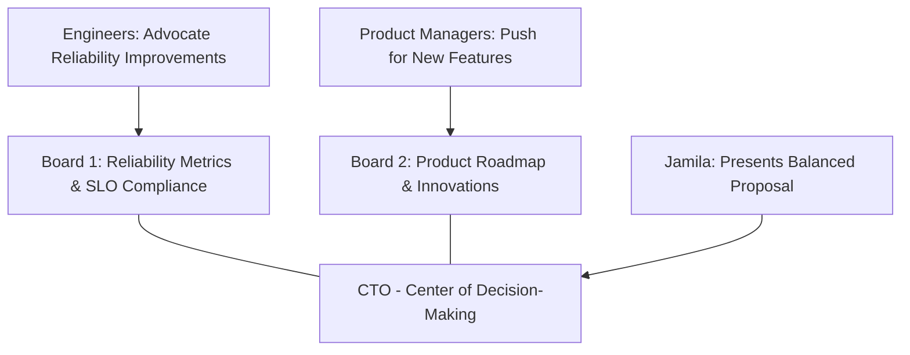

This setup emphasizes the deliberate balancing act between competing priorities, ensuring decisions are guided by data rather than emotions or subjective opinions.

### Teaching Narrative

Advanced SLO engineering directly addresses one of the most fundamental tensions in technology organizations: balancing reliability with innovation. Without a structured framework, this tension often leads to counterproductive conflicts between "build" and "run" teams.

The SLO framework transforms this dynamic by:

1. **Quantifying Reliability**: Converting subjective perceptions ("the system feels unstable") into objective measurements

2. **Establishing Agreements**: Creating explicit, shared understanding of acceptable reliability levels

3. **Enabling Rational Trade-offs**: Providing a data-driven basis for deciding when to prioritize stability versus change

4. **Decoupling Decisions from Emotions**: Removing blame and finger-pointing by focusing on objective metrics

In practice, this framework creates a dynamic equilibrium:

- When a service is meeting its SLOs, teams have more freedom to innovate and deploy new features
- When a service is missing its SLOs, reliability improvements take precedence over new development
- The appropriate balance is determined by data rather than the loudest voice in the room

For banking institutions, where both innovation and stability are existential concerns, this framework provides a crucial governance mechanism. Traditional banks must innovate to compete with fintech disruptors while maintaining the rock-solid reliability that customers expect from financial institutions. Well-designed SLOs create the safety mechanisms that enable faster innovation by clearly signaling when to apply the brakes.

### Common Example of the Problem

A mid-sized regional bank was facing increasing competition from digital-first challengers. Their executive team was split into two factions with competing priorities:

- **The Innovation-Focused Group**: Led by the Chief Digital Officer and Head of Consumer Banking, this group pushed aggressively for rapid development of new digital capabilities. They cited customer research showing the bank's feature set lagging behind competitors and warned of losing market share if innovation didn't accelerate.

- **The Stability-Focused Group**: Led by the CIO and Head of Operations, this group emphasized the risks of moving too quickly. They highlighted recent outages that had affected customer satisfaction and pointed to the regulatory obligations for system reliability.

These competing priorities created a significant tension in planning sessions. The innovation team perceived reliability concerns as obstructionism, while the stability team viewed feature requests as reckless. Without an objective framework to mediate the conflict, decision-making devolved into political battles, with outcomes often dictated by influence rather than strategy.

#### Key Issues at a Glance

| **Issue** | **Description** |
| -------------------------------- | ------------------------------------------------------------------------------------------------- |
| **Competing Priorities** | Innovation group pushed for speed; stability group prioritized reliability, creating conflict. |
| **Misaligned Perspectives** | Teams lacked a shared language or framework, leading to mistrust and breakdowns in collaboration. |
| **Dysfunctional Decision Cycle** | Rapid innovation caused instability, leading to emergency freezes, delaying both progress areas. |
| **Strategic Vulnerability** | Neither reliable systems nor competitive feature sets were achieved, leaving the bank exposed. |

#### Dysfunctional Cycle Representation

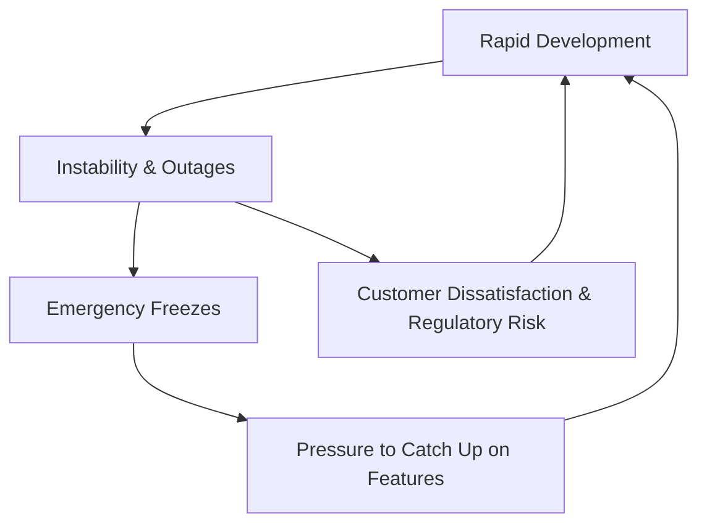

This cycle prevented the bank from achieving either reliable systems or competitive features, leaving them increasingly vulnerable to more agile competitors. Without a structured framework like SLOs, the organization lacked the governance mechanisms needed to break free from this pattern.

### SRE Best Practice: Evidence-Based Investigation

Experienced SREs balance reliability and innovation using these evidence-based approaches. The following checklist summarizes the key practices for quick application:

| Approach | Description | Example Outcome |
| ----------------------------------------------- | -------------------------------------------------------------------------------------------------------------------------------- | -------------------------------------------------------------------------------------------------------------------------------- |
| **Reliability/Innovation Correlation Analysis** | Analyze the relationship between reliability and innovation metrics by studying deployment and incident data. | Services within SLO targets deployed new features 28% more frequently than those with unstable reliability. |
| **Error Budget Framework Development** | Translate SLOs into explicit error budgets with clear decision-making thresholds. | Services with ≥40% error budget remaining proceed with normal feature development; those with \<25% prioritize reliability fixes. |
| **Change Success Rate Analysis** | Correlate change volume with quality metrics to determine the optimal deployment pace. | Teams deploying 4-6 changes per week maintained reliability and innovation, while >8 changes/week led to higher failure rates. |
| **Feature/Reliability Impact Assessment** | Evaluate features based on business value (e.g., customer impact, revenue potential) and reliability risk to balance priorities. | Features scoring high on business value but low on reliability risk were prioritized, maximizing value while minimizing risk. |
| **Experimental Method Validation** | Use controlled experiments to test different reliability and innovation balancing strategies across comparable services. | A six-month experiment showed error-budget-driven teams delivered 22% more features while maintaining higher reliability. |

#### Checklist for Evidence-Based Investigation:

- [ ] Conduct a **Reliability/Innovation Correlation Analysis** to identify patterns and inform decisions.
- [ ] Develop an **Error Budget Framework** with explicit thresholds tied to SLOs.
- [ ] Perform a **Change Success Rate Analysis** to establish an optimal deployment cadence.
- [ ] Implement a **Feature/Reliability Impact Assessment** to prioritize features effectively.
- [ ] Run **Experimental Method Validation** to benchmark and refine balancing strategies.

By using this structured approach, SREs can effectively navigate the tension between reliability and innovation, ensuring data-driven decisions that support both goals.

### Banking Impact

Failing to balance reliability and innovation creates significant business consequences in banking environments. The following areas illustrate the impact, supported by data visualization to highlight critical trends:

#### Competitive Position Erosion

Banks that over-emphasize reliability at the expense of innovation lose market position to more agile competitors. Over an 18-month period, market analysis revealed that a regional bank lost **3.2% market share**, primarily to digital-first competitors offering superior mobile experiences despite having occasionally lower reliability.

```mermaid
barChart
    title Market Share Loss Over 18 Months
    axis X Market Share Loss (%)
    axis Y Competitors
    "Digital-First Competitors": 3.2
    "Regional Bank": -3.2
```

#### Customer Segment Misalignment

Different customer segments have distinctly different reliability and innovation preferences. Research revealed:

- Younger consumers (18-35) valued new capabilities **2.3x more** than perfect reliability.
- Older consumers (55+) valued reliability **1.8x more** than new features.

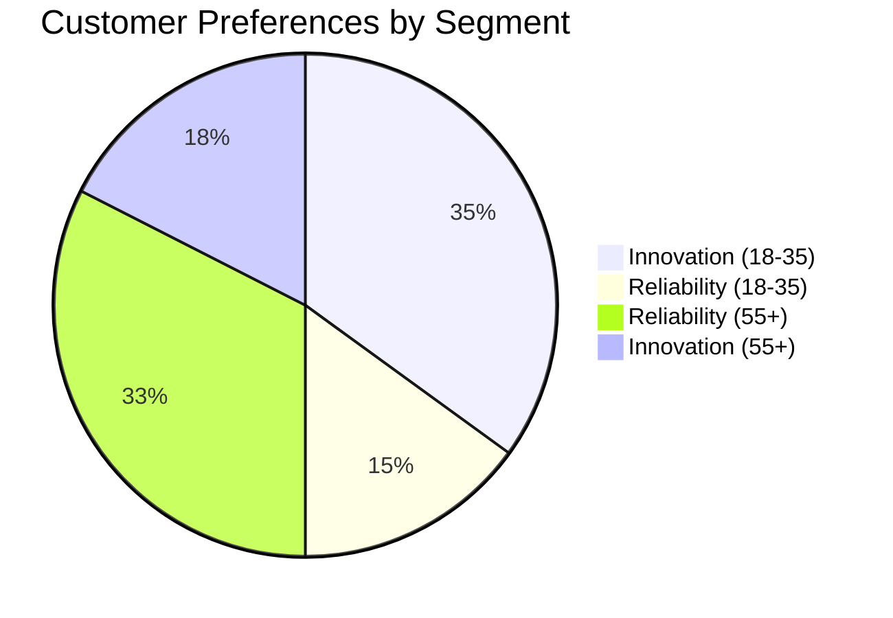

#### Cyclical Disruption Patterns

Without a structured balancing mechanism, banks often experience disruptive cycles of innovation and stability firefighting. Operational analysis highlighted that these cycles caused approximately **35% operational inefficiency** due to context switching, emergency reprioritization, and workflow disruption.

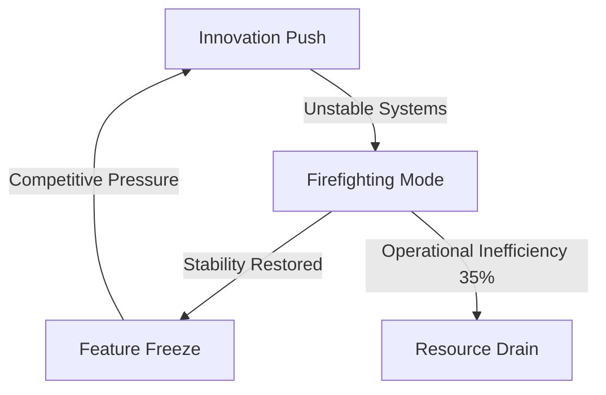

#### Talent Retention Challenges

Repeated cycles of feature freezes followed by emergency development create unsustainable working conditions. Employee satisfaction data showed teams experiencing these cycles had **2.4x higher turnover** than teams with balanced workloads, with engineering talent particularly affected.

```mermaid
barChart
    title Employee Turnover Rates
    axis X Turnover Rate (x)
    axis Y Teams
    "Teams with Cycles": 2.4
    "Balanced Teams": 1
```

#### Regulatory Scrutiny Escalation

Financial regulators increasingly focus on both innovation and stability. Examination feedback cited the bank for:

- Reliability deficiencies
- Falling behind on security innovations

This demonstrates that regulators expect balanced progress rather than excellence in only one dimension, reinforcing the need for structured SLO frameworks.

### Implementation Guidance

To implement effective reliability/innovation balance in your banking environment, follow this structured workflow:

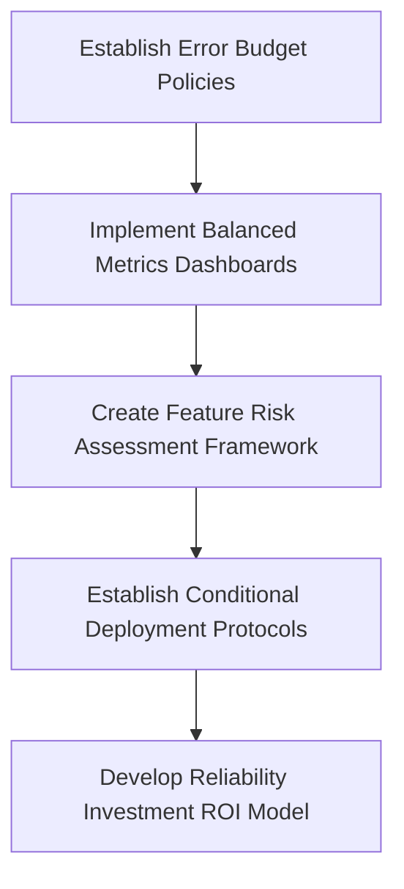

1. **Establish Error Budget Policies**\
   Define formal error budget policies that guide development decisions based on budget consumption levels. For example:

   - If `<25%` of the budget remains, trigger a reliability-focused development cycle.
   - If `>70%` of the budget remains, allow accelerated feature development.\
     Secure approval for these policies from both technology and business leadership to ensure alignment and governance during conflicts.

2. **Implement Balanced Metrics Dashboards**\
   Build executive dashboards that present reliability metrics (e.g., SLO compliance, error budget status) alongside innovation metrics (e.g., feature delivery rate, time-to-market). Use these dashboards to provide a unified view of performance, making them the central tool for guiding balanced discussions during strategic planning.

3. **Create Feature Risk Assessment Framework**\
   Develop a standardized framework to assess the reliability risks of proposed changes or features. Incorporate criteria such as:

   - Implementation complexity
   - Impact on dependencies
   - Data migration requirements
   - Operational changes\
     Assign risk scores to each proposal, which influence implementation strategies and timings based on the current error budget status.

4. **Establish Conditional Deployment Protocols**\
   Implement deployment protocols that adapt to the reliability state of each service:

   - For services with healthy error budgets: Streamline change processes with automated approvals.
   - For services nearing budget depletion: Introduce additional verification steps, such as manual reviews or executive sign-offs, to mitigate risks.

5. **Develop Reliability Investment ROI Model**\
   Create a model to calculate the return on investment (ROI) for reliability improvements. Quantify how these enhancements—such as reduced incident rates or faster recovery times—translate into increased capacity for innovation. This ensures reliability work is evaluated with the same business value lens as feature delivery.

By following this workflow, teams can maintain a dynamic equilibrium between reliability and innovation, ensuring that data-driven decisions guide resource allocation and prioritization.

## Panel 4: Defensive SLO Design - Planning for Failure

### Scene Description

A resilience planning workshop focused on SLO design for a new core banking platform. Rather than assuming perfect conditions, the team is deliberately exploring failure scenarios. On electronic whiteboards, they map out various failure modes: third-party outages, partial infrastructure degradation, regional disruptions, and malicious attacks. For each scenario, they're calculating the SLO impact and evaluating whether their current designs provide sufficient buffer. Alex demonstrates a simulation showing how different architectures would perform during a major cloud provider outage. The team revises their SLO implementation to include aggregation methods that better handle partial failures. A separate section of the room focuses on recovery patterns, with SLIs specifically designed to measure recovery effectiveness. Team members work through a "chaos experiment" planning document, scheduling controlled failure tests to validate their defensive SLO design assumptions.

Below is a text-based diagram capturing the process the team follows during the workshop:

```
Failure Scenarios --> Identify Impacted Components --> Map to SLIs & SLOs --> Evaluate Buffer
      |                       |                                |                         |
      v                       v                                v                         v
Third-Party Outages     Infrastructure Issues       Regional Disruptions       Malicious Attacks
      |                       |                                |                         |
      ------------------- Evaluate Aggregation Methods for Partial Failures ------------------
                                      |
                                      v
                             Recovery Patterns
                                      |
                                      v
                  Design SLIs for Recovery Metrics (e.g., Time-to-Restore)
                                      |
                                      v
                    Plan Chaos Experiments to Validate Assumptions
```

This diagram illustrates how failure scenarios are analyzed and integrated into SLO design, emphasizing the iterative nature of defensive SLO planning. Each step ensures the team progresses from understanding failure modes to implementing and validating recovery-focused solutions.

### Teaching Narrative

Defensive SLO engineering acknowledges an uncomfortable truth: failures are inevitable in complex systems. Rather than designing SLOs that assume perfect conditions, advanced practitioners build in resilience through failure-aware design patterns.

Key defensive SLO engineering practices include:

1. **Failure Mode Analysis**: Systematically exploring how different types of failures (component, regional, third-party) would impact SLO attainment

2. **Buffer Planning**: Ensuring SLO targets include sufficient margin to absorb expected failure modes without breach

3. **Partial Failure Handling**: Designing SLO implementations that properly represent degraded states rather than binary success/failure

4. **Dependency Mapping**: Understanding how various dependencies affect SLO measurements and ensuring appropriate isolation

5. **Recovery Instrumentation**: Creating specific SLIs that measure system recovery capabilities like time-to-restore and error rate during recovery

For banking systems, which often have complex dependencies on both internal and external components, this defensive approach is essential. For example, a payment service might depend on multiple third-party providers for different regions or payment types. Defensive SLO design ensures that failures in any single provider don't inappropriately impact the overall service SLO, while still capturing the real customer impact.

This approach shifts from the naive question "Will our service meet its SLO?" to the more sophisticated "Will our service meet its SLO despite the failures that will inevitably occur?" This resilience-focused mindset is a hallmark of advanced SRE practice, especially in financial services where regulatory expectations include robust failure handling.

### Common Example of the Problem

A digital banking team implemented SLOs for their new mobile wallet service without defensive design considerations. Their SLO specified 99.95% availability and 99.9% of transactions completing within 3 seconds. Initial performance in a controlled production environment met these targets, and the team confidently launched the service.

Within the first month, they encountered several scenarios they hadn't considered in their SLO design. The table below summarizes these scenarios, the failure modes involved, and the corresponding SLO design gaps:

| **Scenario** | **Failure Mode** | **SLO Design Gap** |
| --------------------------------------------------------- | -------------------------------------------------------------- | ------------------------------------------------------------------------------------------------------------------------ |
| **Third-party payment processor degradation** | Partial degradation: processing times increased to 5-7 seconds | SLO did not account for slow-but-successful transactions, leading to debates over whether they should count as failures. |
| **Regional cloud outage affecting one availability zone** | Partial infrastructure failure: reduced capacity | Binary SLO measurement couldn’t represent nuanced partial degradation, failing to capture varying customer experiences. |
| **Authentication service outage during maintenance** | Complete dependency failure: authentication unavailable | SLO treated all failures equally, ignoring customer impact differences between authentication and transaction failures. |

Without defensive SLO design, these scenarios created confusion about the actual reliability status, led to inappropriate alerting and response, and ultimately undermined confidence in their reliability measurement approach. The team found themselves constantly explaining "special circumstances" to justify missing their targets, damaging the credibility of the entire SLO program.

### SRE Best Practice: Evidence-Based Investigation

Experienced SREs implement defensive SLO design using these evidence-based approaches:

1. **Dependency Failure Impact Analysis**: Conduct structured assessment of how failures in each dependency would affect service reliability. Analysis of the mobile wallet's 17 dependencies revealed that 3 critical components (authentication, core processing, and the primary payment network) together determined 78% of overall reliability, while the remaining 14 dependencies contributed only 22%, enabling focused resilience investments.

2. **Failure Mode Effects Analysis (FMEA)**: Apply systematic FMEA methodology to identify and prioritize potential failure modes. The structured analysis identified 24 distinct failure scenarios for the mobile wallet, with detailed impact assessment showing that 7 scenarios would cause complete service disruption, 12 would create partial degradation, and 5 would affect only specific transaction types or user segments.

3. **Historical Incident Pattern Recognition**: Analyze at least 12 months of incident data across similar services to identify common failure patterns. Review of incidents across the bank's digital services revealed that partial degradations were 4.8x more common than complete failures, yet the existing SLO design primarily addressed only complete outages.

4. **Recovery Pattern Analysis**: Measure and categorize actual recovery patterns from previous incidents. Data showed the mobile wallet exhibited three distinct recovery patterns: instant failover (typically 1-3 minutes), gradual recovery (10-30 minutes of progressively improving performance), and step-function recovery (multiple discrete improvement steps as components restored), each requiring different measurement approaches.

5. **Controlled Chaos Experiments**: Conduct controlled failure injections to validate SLO measurement during various degradation scenarios. Experiments revealed that their initial SLO implementation failed to accurately measure 7 of 12 tested partial failure scenarios, significantly underestimating actual customer impact during complex incidents.

#### Quick-Reference Checklist for Evidence-Based Defensive SLO Design

- [ ] Perform **Dependency Failure Impact Analysis** to identify critical components and prioritize resilience investments.
- [ ] Conduct **Failure Mode Effects Analysis (FMEA)** to systematically identify and assess potential failure scenarios.
- [ ] Review **Historical Incident Data** to understand common failure patterns and align SLO design to address both complete and partial failures.
- [ ] Analyze **Recovery Patterns** from past incidents to ensure SLIs are designed for different recovery behaviors (e.g., instant, gradual, step-function).
- [ ] Plan and execute **Controlled Chaos Experiments** to validate SLO performance under various failure and degradation scenarios.

### Banking Impact

Poor defensive SLO design creates significant business consequences in banking environments:

1. **Misleading Reliability Status**: SLOs that don't account for partial failures provide false confidence. During a major incident affecting the mobile wallet's fraud detection system, dashboards showed 99.8% availability (above target) despite 30% of high-value transactions being incorrectly declined, costing approximately $120,000 in lost transaction fees while appearing "within SLO."

2. **Inappropriate Incident Response**: Without nuanced failure detection, teams respond with the wrong urgency or focus. Analysis showed 4 significant mobile wallet incidents where response was delayed by an average of 37 minutes due to SLOs not accurately reflecting the severity of partial degradations.

3. **Misleading Root Cause Analysis**: Simplistic SLO designs attribute problems to the wrong components. Post-incident analysis found that 34% of initially assigned root causes were incorrect due to insufficient granularity in failure detection, leading to ineffective remediation that allowed issues to recur.

4. **Reduced Customer Trust**: Financial transactions require consistent reliability across all aspects of the service. Customer feedback revealed that users who experienced selective failures (like authentication working but payments failing) reported 2.7x lower trust scores than those experiencing total outages, as partial failures created confusion about transaction status.

5. **Regulatory Reporting Inaccuracy**: Financial regulators require accurate incident reporting based on customer impact. In two cases, inadequate SLO design led to under-reporting of incident severity to regulators because partial failures weren't properly captured, resulting in subsequent findings during regulatory examinations.

6. **Reputational Damage During Regional Disruptions**: Regional outages, such as a payment processor experiencing downtime in a specific country, can disproportionately impact customer perception. For example, during a 5-hour disruption affecting a key European payment service, customers in the region experienced failed transactions despite the service reporting 99.9% global availability. Social media backlash and press coverage highlighted the gap between perceived reliability and actual customer experience.

7. **Operational and Financial Penalties**: Defensive SLO design is critical for preventing cascading failures that can violate service level agreements (SLAs) with partners. In one case, a partial failure in a cross-border payment system caused settlement delays exceeding SLA thresholds, triggering $250,000 in penalty fees and jeopardizing a critical banking partnership. This highlights the importance of designing SLOs that isolate and measure specific failure impacts.

### Implementation Guidance

To implement effective defensive SLO design in your banking environment:

1. **Create Dependency-Aware SLO Models**:\
   Develop SLO definitions that explicitly account for external dependencies. For each critical dependency, document expected reliability levels, failure modes, and appropriate handling within your SLO calculations. Include specific rules for how different dependency failures affect overall SLO measurement.

2. **Implement Partial Degradation Detection**:\
   Design SLO implementations that recognize and appropriately measure partial service degradations. Create tiered degradation categories (e.g., "Severe Degradation" = >25% error rate, "Moderate Degradation" = 5-25% errors, "Minor Degradation" = 1-5% errors) with proportional impact on SLO calculations.

3. **Develop Component-Level SLIs**:\
   Rather than measuring only service-level outcomes, implement component-level SLIs that provide better failure isolation. For critical banking services, monitor specific components (authentication, authorization, core processing, notification) separately to enable precise identification of partial failures.

4. **Establish Regional and Segmented Monitoring**:\
   Implement SLO measurement that captures performance variations across different regions, user segments, and transaction types. Configure monitoring to detect situations where issues affect only specific subsets of users or transactions, rather than relying solely on aggregate metrics.

5. **Create Recovery-Specific SLOs**:\
   Develop specialized SLOs focused specifically on recovery patterns. Implement metrics like "Time to First Restoration" (when service begins recovering), "Recovery Progression Rate" (how quickly performance improves during restoration), and "Stability After Recovery" (error rates in the period following restoration) to comprehensively measure recovery effectiveness.

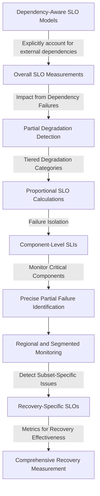

The diagram above illustrates the interconnected nature of defensive SLO design. Dependency-aware SLO models feed into overall SLO measurements, which account for failures and partial degradations. Component-level SLIs and regional monitoring provide granular insights, enabling precise failure isolation. This foundation supports recovery-specific SLOs, ensuring comprehensive evaluation of recovery patterns.

## Panel 5: SLO Calibration - From Assumptions to Evidence

### Scene Description

A data analysis session where the team is reviewing six months of SLO performance data for their corporate banking platform. Multiple screens show different perspectives on the same SLOs: actual performance trends, customer satisfaction correlation, incident retrospectives, and competitive benchmarks. Sofia leads a methodical review of each SLO target, comparing the original assumptions against real-world evidence.

For some services, they're adjusting targets upward based on customer feedback that current performance is insufficient. For others, they're relaxing overly aggressive targets that data shows aren't delivering proportional customer value. A decision matrix helps structure these adjustments, weighing factors like customer impact, engineering cost, and business priority. Team members analyze specific case studies where SLO breaches did or didn't correlate with customer-reported issues, looking for patterns that indicate their targets need recalibration. A "reliability investment ROI" calculation quantifies the expected return from potential reliability improvements.

#### Example Decision Matrix Overview

Below is a simplified representation of the decision matrix being used to guide SLO adjustments:

```
+---------------------+-------------------+-------------------+-------------------+
| Factor              | High Priority     | Moderate Priority | Low Priority      |
+---------------------+-------------------+-------------------+-------------------+
| Customer Impact     | Critical          | Noticeable        | Minimal           |
| Engineering Cost    | Low Effort        | Medium Effort     | High Effort       |
| Business Priority   | Strategic Focus   | Important         | Opportunistic     |
+---------------------+-------------------+-------------------+-------------------+
```

#### Data Sources Reviewed

The team is correlating data from multiple sources to refine their SLOs:

1. **Historical Performance**: Trends in service reliability over the past six months.
2. **Customer Impact**: Feedback and satisfaction data related to service reliability.
3. **Incident Retrospectives**: Insights from major outages or reliability events.
4. **Competitive Benchmarks**: How competitors are performing in similar contexts.
5. **Engineering Constraints**: Feasibility within the bounds of current systems.
6. **Business Outcomes**: Metrics like customer retention and conversion rates.

#### Process Flow for SLO Calibration

A high-level flow of the SLO calibration process:

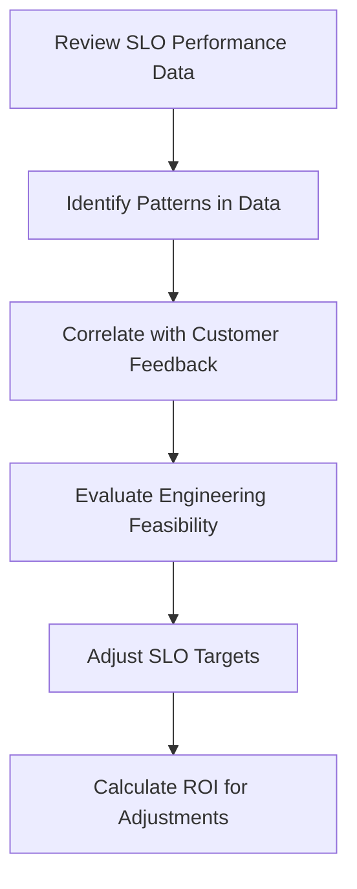

By combining structured analysis with clear decision-making criteria, the team ensures that SLOs remain aligned with both technical and business objectives.

### Teaching Narrative

Initial SLO targets are inevitably based on assumptions and educated guesses. SLO calibration is the engineering practice of systematically refining these targets based on evidence collected over time.

Effective SLO calibration involves correlating multiple data sources:

1. **Historical Performance**: How the service has actually performed over significant time periods
2. **Customer Impact**: Direct evidence of how reliability levels affect user satisfaction and behavior
3. **Incident Analysis**: Insights from significant reliability events and their business consequences
4. **Competitive Intelligence**: Industry benchmarks and competitor performance where available
5. **Engineering Reality**: Practical constraints of current architecture and technology choices
6. **Business Outcomes**: Correlation between reliability levels and business metrics like conversion or retention

This evidence-based approach often reveals that initial targets were either too conservative (wasting engineering resources on unnecessary reliability) or too aggressive (setting unattainable goals that damage team morale).

For banking services, this calibration is particularly important because of the high costs associated with reliability engineering. A trading platform that truly requires 99.99% reliability might justify significant infrastructure investment, while one that delivers equivalent customer satisfaction at 99.9% allows resources to be allocated elsewhere.

Regular SLO calibration cycles—typically quarterly or semi-annually—ensure that reliability targets remain aligned with both technical reality and business priorities as systems and user expectations evolve.

#### Checklist: Steps for Effective SLO Calibration

To make SLO calibration actionable, follow these steps during each calibration cycle:

1. **Gather Data**

   - Collect at least 3-6 months of historical performance data.
   - Compile customer satisfaction metrics (e.g., NPS, complaints, churn) related to reliability.
   - Review incident retrospectives for meaningful insights.
   - Research competitive benchmarks, when available.

2. **Analyze Correlations**

   - Identify trends between reliability levels and customer satisfaction or behavior.
   - Assess the impact of SLO breaches on key business metrics (e.g., revenue, retention).
   - Evaluate recurring incident patterns and their root causes.

3. **Assess Feasibility**

   - Validate whether current architectural or technological constraints limit achievable reliability.
   - Consider engineering costs for meeting or exceeding current targets.

4. **Recalibrate Targets**

   - Relax overly aggressive targets that do not deliver proportional customer or business value.
   - Raise targets where evidence shows current performance is insufficient for user satisfaction.
   - Use a decision matrix to balance customer impact, engineering costs, and business priorities.

5. **Communicate Changes**

   - Clearly document and communicate updates to SLOs across teams.
   - Provide context for target adjustments, supported by evidence, to maintain alignment and buy-in.

6. **Measure ROI**

   - Quantify the expected return of reliability investments using a "reliability investment ROI" calculation.
   - Track the impact of calibration on both system performance and business outcomes over time.

By consistently applying this checklist, teams can ensure their SLOs evolve alongside customer expectations, technical capabilities, and business priorities.

### Common Example of the Problem

A commercial banking division established SLOs for their treasury management platform, setting ambitious targets based largely on theoretical ideals and competitive positioning: 99.99% availability, 99.9% of transactions under 1 second, and 99.999% data accuracy. After operating with these targets for nine months, several problems emerged. The following table summarizes the targets, actual performance, and observed customer/business impact:

| SLO Metric | Target | Actual Performance | Observed Customer/Business Impact |
| --------------------- | ---------- | ------------------ | ------------------------------------------------------------------------------------------------------------------------------ |
| **Availability** | 99.99% | 99.97% (average) | Engineering team demoralized due to unattainable target. Business stakeholders frustrated with unmet goals despite investment. |
| **Transaction Speed** | 99.9% < 1s | 99.98% < 1s | Over-engineered. No added customer satisfaction or business benefit, representing wasted resources. |
| **Data Accuracy** | 99.999% | 99.999% | Achieved, but no measurable correlation with customer satisfaction. |

Most problematically, customer satisfaction data showed no correlation with these SLO metrics. During months where availability targets were missed but transaction speed was maintained, customer satisfaction remained high. Conversely, during periods when all SLOs were technically met but specific high-value features experienced isolated issues not captured in the SLOs, customer satisfaction declined significantly.

Without a systematic calibration process, they continued investing in reliability improvements that didn't address actual customer pain points, while neglecting areas that significantly impacted business outcomes but weren't reflected in their initial SLO selections.

### SRE Best Practice: Evidence-Based Investigation

Experienced SREs implement effective SLO calibration using these evidence-based approaches. The following flowchart outlines a structured investigation process to guide decision-making during calibration:

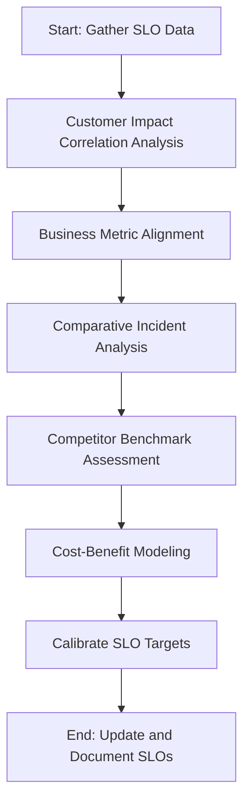

#### Step-by-Step Process:

1. **Customer Impact Correlation Analysis**:\
   Systematically analyze the relationship between SLO performance and customer experience metrics. For example, research with treasury management clients revealed that availability below 99.9% significantly impacted satisfaction (correlation coefficient 0.87), while improvements above 99.95% showed negligible additional benefit. This suggests a natural calibration point around 99.95%.

2. **Business Metric Alignment**:\
   Correlate SLO performance with specific business outcomes. Data analysis showed that payment speed significantly impacted customer behavior only for specific transaction types—wire transfers required sub-second performance (99.5% correlation with usage volume), while ACH transfers showed no usage impact even with 5+ second processing times.

3. **Comparative Incident Analysis**:\
   Contrast customer impact between incidents that breached current SLOs versus those that didn't. A review of 27 major incidents revealed that current SLOs failed to capture 7 customer-impacting events that affected specific high-value journeys not adequately represented in the aggregate SLOs. This indicates a need for more granular targets.

4. **Competitor Benchmark Assessment**:\
   Conduct structured analysis of competitor reliability through both public commitments and customer research. Competitive analysis revealed that leading treasury management providers operated with 99.95-99.97% availability. This suggests that the 99.99% target exceeded competitive requirements without delivering proportional business value.

5. **Cost-Benefit Modeling**:\
   Quantify the engineering cost and expected business impact of different reliability levels. Financial analysis showed that improving from 99.95% to 99.99% availability would require approximately $3.7M in additional infrastructure and engineering costs, while delivering only approximately $800K in business benefits through reduced outages.

By following this structured approach, SREs ensure that SLO calibration balances customer satisfaction, business outcomes, and engineering realities, resulting in targets that are both evidence-based and practical.

### Banking Impact

Poor SLO calibration creates significant business consequences in banking environments. Below is a concise summary of the key impacts:

- **Misallocated Reliability Investment**:

  - Example: $2.4M spent improving treasury management availability from 99.95% to 99.97% without measurable customer benefit.
  - Missed Opportunity: Underfunded fraud detection reliability improvements that directly affected customer satisfaction.

- **Engineering Morale Degradation**:

  - Teams with unattainable targets report 2.3x lower morale.
  - Turnover intention is 1.8x higher compared to teams with evidence-calibrated SLOs.

- **Business Trust Erosion**:

  - 70% of product owners view SLOs as "technical metrics with limited business relevance."
  - Misaligned reliability metrics reduce stakeholder confidence in the program.

- **Competitive Disadvantage**:

  - Overinvestment in unnecessary reliability (e.g., pursuing 99.99% availability instead of a calibrated 99.95%) delayed six major features by an average of 4.5 months.
  - Resource misallocation directly impacted competitive positioning.

- **Risk Management Misalignment**:

  - Theoretical reliability concerns delayed treasury management features, resulting in $1.2M in delayed revenue opportunities.
  - Calibration data later showed minimal actual business risk for these delays.

#### Summary Flowchart

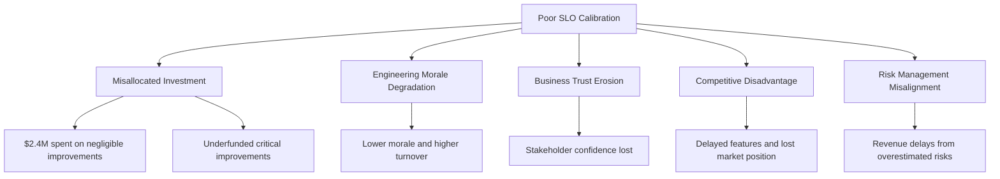

This summary and flowchart highlight how poor SLO calibration impacts banking operations, morale, and business outcomes. By addressing these issues, teams can better align reliability investments with customer and business priorities.

### Implementation Guidance

To implement effective SLO calibration in your banking environment, follow this step-by-step framework to ensure a systematic and repeatable process:

#### Step 1: Establish Calibration Cadence

- **Action**: Define a formal schedule for SLO reviews.
  - **Quarterly Light Reviews**: Focus on significant deviations or breaches for quick adjustments.
  - **Semi-Annual Deep Reviews**: Conduct a comprehensive analysis of all SLOs.
- **Outcome**: Document this cadence in your reliability program governance to ensure consistency and accountability.

#### Step 2: Assemble Calibration Data Sources

- **Action**: Gather and prepare data from multiple perspectives:
  - Historical service performance (e.g., uptime, latency trends).
  - Customer experience metrics (e.g., satisfaction scores, behavioral data).
  - Incident retrospectives from significant reliability events.
  - Industry benchmarks or competitor data, where applicable.
  - Engineering constraints and resource availability.
  - Business impact metrics like conversion rates or retention.
- **Outcome**: Ensure all necessary data is readily available and structured for analysis.

#### Step 3: Apply the Multi-Factor Calibration Framework

- **Action**: Use a structured methodology to evaluate current SLO targets against the collected data:
  - Analyze alignment of current performance with customer expectations.
  - Correlate reliability with business outcomes to identify disproportional efforts.
  - Assess engineering investment required for potential SLO adjustments.
- **Outcome**: Produce a weighted evaluation of each SLO using all relevant factors.

#### Step 4: Implement Customer-Mapped Metrics

- **Action**: Ensure SLO calibration reflects direct customer experience:
  - Deploy monitoring tools for real user experiences (e.g., RUM, synthetic transactions).
  - Map customer-facing metrics to technical SLOs to identify gaps.
- **Outcome**: Address misalignments between technical performance and customer satisfaction.

#### Step 5: Develop and Follow Target Adjustment Guidelines

- **Action**: Create clear, standardized rules for adjusting SLO targets:
  - **Raising Targets**: Criteria for when current reliability exceeds customer needs.
  - **Lowering Targets**: Evidence thresholds for when diminishing returns are identified.
- **Outcome**: Ensure that adjustments are data-driven and defensible to stakeholders.

#### Step 6: Build Reliability Investment ROI Models

- **Action**: Quantify the costs and benefits of potential reliability changes:
  - Calculate engineering costs (e.g., infrastructure, operational overhead).
  - Estimate business impact (e.g., customer retention, reduced downtime).
- **Outcome**: Use ROI calculations to validate whether proposed adjustments align with business priorities.

#### Step 7: Document and Communicate Adjustments

- **Action**: Record all calibration decisions, including:
  - Data sources reviewed.
  - Justifications for raising, lowering, or maintaining targets.
  - Expected customer and business impacts of the changes.
- **Outcome**: Ensure transparency and alignment across technical and business teams.

#### Step 8: Monitor and Iterate

- **Action**: After implementing adjustments, continuously monitor the impact:
  - Use ongoing data collection to validate the effectiveness of new targets.
  - Incorporate lessons learned into future calibration cycles.
- **Outcome**: Maintain alignment between SLO targets, customer satisfaction, and business outcomes as systems and expectations evolve.

#### Example Process Flow

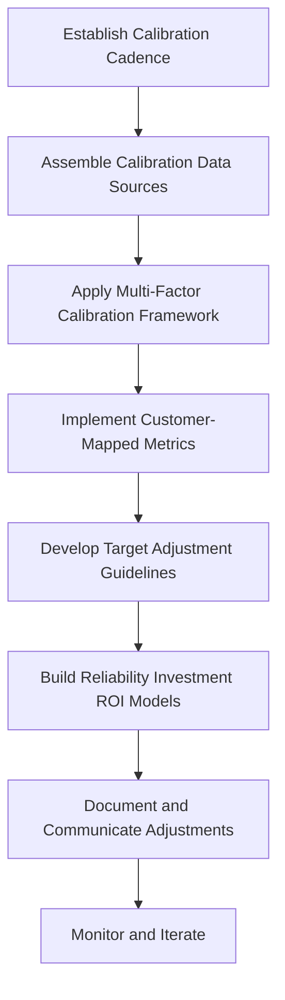

By following this framework, teams can transition from assumption-driven SLOs to evidence-based targets that balance customer needs, engineering costs, and business priorities.

## Panel 6: SLO-Driven Architecture - Designing to Meet Objectives

### Scene Description

An architecture design session for a new account opening service. Instead of beginning with technology selections, the team starts with the SLO requirements: 99.95% availability, 99.9% of applications processed within 30 seconds, and 99.99% data accuracy. The room is organized around these objectives, with design patterns mapped to each.

For availability, they evaluate active-active replication versus fast failover approaches. For latency, they compare synchronous versus asynchronous processing models. For data accuracy, they assess validation approaches and consistency models. Raj facilitates as the team evaluates trade-offs between patterns and selects an architecture explicitly designed to meet the SLOs.

On a whiteboard, the team maps out each architectural decision to specific reliability objectives, creating a clear traceability matrix. Below is a simplified representation of their traceability matrix:

```
+--------------------+-------------------------+-----------------------+--------------------+
| SLO Objective      | Design Pattern         | Trade-offs            | Mitigation         |
+--------------------+-------------------------+-----------------------+--------------------+
| Availability       | Active-active          | Complexity in         | Automated failure  |
| 99.95%             | replication            | coordination          | detection and      |
|                    |                        |                       | recovery           |
+--------------------+-------------------------+-----------------------+--------------------+
| Latency            | Asynchronous           | Potential data        | Prioritized retry  |
| 99.9% within 30s   | processing             | consistency gaps      | queues             |
+--------------------+-------------------------+-----------------------+--------------------+
| Data Accuracy      | Strict validation      | Increased latency     | Optimized rules    |
| 99.99%             | and consistency        | with stricter checks  | for common cases   |
+--------------------+-------------------------+-----------------------+--------------------+
```

Team members actively debate how different technology choices affect their ability to achieve the defined reliability targets. For example, they weigh the higher availability of active-active replication against the complexity it introduces to data consistency. Similarly, they discuss the trade-offs between synchronous processing, which ensures consistency but may impact latency, versus asynchronous processing, which prioritizes speed but may require additional safeguards for accuracy.

To capture risks, they maintain a risk assessment matrix, documenting where the proposed architecture might struggle to meet objectives and listing specific mitigation strategies. Below is an excerpt of their risk assessment:

```
+------------------+------------------------------------+-----------------------------+
| Risk Area        | Description                        | Mitigation Strategy         |
+------------------+------------------------------------+-----------------------------+
| Latency spikes   | High traffic during peak hours     | Dynamic scaling of          |
|                  | causing processing delays          | resources                   |
+------------------+------------------------------------+-----------------------------+
| Data consistency | Conflicts in active-active setup   | Conflict resolution at the  |
|                  | during simultaneous updates        | application layer           |
+------------------+------------------------------------+-----------------------------+
```

By the end of the session, the team has a documented architecture that directly links each decision to the reliability objectives. This ensures traceability and clarity, enabling stakeholders to understand how the architecture aligns with business goals.

### Teaching Narrative

Advanced SLO engineering inverts the traditional architecture process—instead of retrofitting reliability into an existing design, it starts with reliability objectives and derives architecture from these requirements.

This SLO-driven architecture approach follows a systematic process:

1. **Define Reliability Requirements**: Establish specific, measurable objectives for availability, latency, throughput, data accuracy, and other quality attributes

2. **Map Requirements to Patterns**: Identify architectural patterns that enable each requirement (redundancy for availability, caching for latency, validation for accuracy)

3. **Analyze Trade-offs**: Evaluate how different patterns interact, recognizing that optimizing for one objective often impacts others

4. **Select and Justify Patterns**: Choose specific implementations based on their ability to meet reliability targets within constraints

5. **Validate Through Modeling**: Test the theoretical reliability of the proposed architecture through analytical models or simulations

This approach ensures that architecture directly supports business reliability needs rather than following technical fashion or team preferences. It also creates clear traceability between business requirements and technical decisions, improving communication with stakeholders.

For banking systems with complex reliability requirements, this approach is particularly valuable. Different banking functions have distinct reliability profiles—payments require high availability, trading demands low latency, while loan processing prioritizes accuracy over speed. SLO-driven architecture ensures that each service receives an appropriate design for its specific reliability needs rather than a one-size-fits-all approach.

### Common Example of the Problem

A corporate banking division was developing a new international payment platform to replace their legacy system. The architecture team, excited about modern technologies, designed a cutting-edge microservices architecture using the latest cloud-native patterns and tools. The design featured dozens of fine-grained services, event-driven communication, eventual consistency, and heavy use of third-party managed services.

Only after completing significant development did they formally define reliability requirements: 99.99% availability during business hours, 99.95% of transactions processed within 5 minutes, and zero data loss under any circumstances. When they evaluated their architecture against these requirements, they discovered fundamental misalignments:

| **Requirement** | **Design Approach** | **Outcome** | **Impact** |
| ----------------------------------- | ------------------------------------------------------------- | ------------------------------------------------------------------------------ | --------------------------------------------------------------------------------- |
| 99.99% availability | Highly distributed architecture with ~30 service dependencies | Overall availability limited to ~99.85% due to compounded reliability losses | Failed to meet availability target; increased downtime risk |
| 99.95% of transactions within 5 min | Event-driven architecture with eventual consistency | Variable transaction times exceeded 5 minutes for complex multi-currency cases | Missed latency SLO; inconsistent user experience |
| Zero data loss | Heavy reliance on third-party managed services | Data handling patterns unable to guarantee zero loss during failure scenarios | Unacceptable risk of data loss, directly violating critical business requirements |

The team faced a difficult choice: significantly refactor their architecture before launch (delaying delivery and increasing costs) or launch with known reliability limitations. They ultimately chose to launch with reduced reliability, resulting in multiple high-visibility incidents during the first quarter of operation. These incidents damaged client confidence and led to several large customers deferring migration to the new platform.

### SRE Best Practice: Evidence-Based Investigation

Experienced SREs implement SLO-driven architecture using these evidence-based approaches. The table below summarizes each approach, its key benefits, and examples to make the practices actionable and easier to reference:

| **Approach** | **Key Benefits** | **Examples** |
| ------------------------------------------- | --------------------------------------------------------------------------------------------------- | -------------------------------------------------------------------------------------------------------------------------------------------------------- |
| **Reliability Pattern Catalog Development** | Provides a structured reference for selecting patterns that align with specific SLOs. | Catalog includes 37 patterns, such as active-active replication for availability, caching for latency, and checksum validation for data integrity. |
| **Architecture Reliability Modeling** | Quantifies the reliability impact of architectural choices, enabling informed trade-offs. | Simulations showed that achieving 99.99% availability required reducing critical-path dependencies or implementing compensating patterns like fallbacks. |
| **Pattern Interaction Analysis** | Identifies and resolves conflicts between patterns to maintain SLO alignment. | Synchronous processing for guaranteed delivery conflicted with latency SLOs during network degradation, requiring compensating controls. |
| **Reliability Risk Assessment** | Highlights potential failure areas and mitigation strategies to proactively address risks. | Assessment of the initial design identified 14 risk areas with >25% probability of SLO failure, each with documented mitigation options. |
| **Architectural Decision Documentation** | Ensures traceability between SLOs and decisions, improving alignment and stakeholder communication. | The decision record for the payment platform documented 28 major decisions, linking each to specific SLOs and associated trade-offs. |

#### Checklist for Implementing Evidence-Based Investigation:

1. **Develop a Reliability Pattern Catalog**:

   - Map architectural patterns to reliability outcomes.
   - Quantify the impact and document considerations for implementation.

2. **Perform Architecture Reliability Modeling**:

   - Build mathematical models or simulations to evaluate reliability.
   - Use results to identify critical dependencies and compensating patterns.

3. **Conduct Pattern Interaction Analysis**:

   - Examine conflicts between patterns and their impact on SLOs.
   - Design compensating mechanisms to address conflicts when necessary.

4. **Run a Reliability Risk Assessment**:

   - Identify high-risk areas where SLOs might not be met.
   - Quantify the probability of failure and document mitigation strategies.

5. **Document Architectural Decisions**:

   - Create a traceability matrix linking decisions to SLOs.
   - Highlight trade-offs and reasoning behind each architectural choice.

#### Example Workflow with Evidence-Based Investigation:

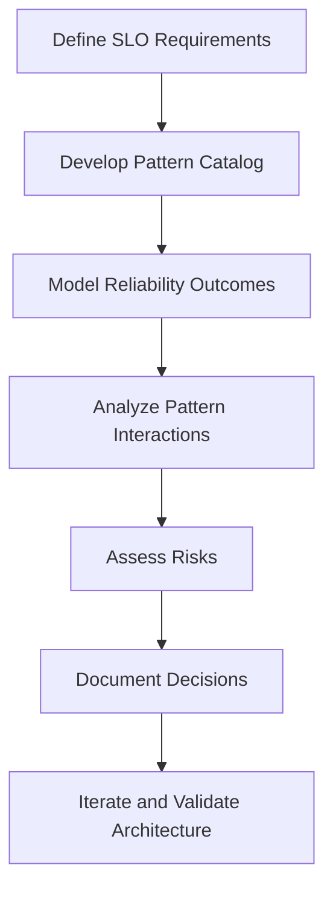

This structured approach ensures technical decisions are evidence-driven, aligned with SLOs, and include clear strategies for mitigating risks. By following these practices, teams can confidently design architectures that meet complex reliability objectives.

### Banking Impact

Failing to implement SLO-driven architecture creates significant business consequences in banking environments. The table below summarizes key financial, reputational, and operational impacts observed in a recent case study of an international payment platform:

| **Impact Area** | **Description** | **Quantitative Example** |
| ------------------------- | --------------------------------------------------------------------------------------------------- | ----------------------------------------------------------------------------------------------------------- |
| **Post-Launch Rework** | Retrofitting reliability after launch incurs higher costs compared to designing it upfront. | $3.8M spent on remediation in the first year vs. $1.2M projected if reliability was built in initially. |
| **Time-to-Market Delays** | Late discovery of reliability gaps delays product launches, affecting revenue and market position. | 4.5-month delay in platform launch due to pre-production reliability issues. |
| **Reputational Damage** | Clients have low tolerance for reliability issues, leading to dissatisfaction and client attrition. | 28-point drop in client satisfaction scores and loss of two major clients citing reliability concerns. |
| **Regulatory Compliance** | Weak reliability planning increases regulatory scrutiny and oversight. | Regulatory examination resulted in enhanced supervisory oversight due to insufficient reliability planning. |
| **Operational Cost Rise** | Architectures lacking reliability require more manual intervention, increasing operational costs. | Operations team required 3.2x more staff than projected to manage manual monitoring and intervention. |

This data underscores the critical importance of adopting SLO-driven architecture in banking systems. By proactively designing for reliability, financial institutions can avoid these costly pitfalls and ensure their platforms meet the stringent demands of both clients and regulators.

### Implementation Guidance

To implement effective SLO-driven architecture in your banking environment:

1. **Create Reliability Requirements Templates**: Develop standardized formats for documenting reliability requirements that must be addressed during architecture design. Include specific sections for availability, latency, throughput, data integrity, and recovery objectives, with clear metrics and measurement approaches for each dimension.

2. **Implement Architecture Review Checkpoints**: Establish formal evaluation points during the design process that specifically assess reliability alignment. Create review templates that map proposed architectural patterns to reliability requirements, with explicit validation that each requirement is addressed by appropriate patterns.

3. **Develop Reliability Pattern Library**: Build a catalog of proven architectural patterns with their reliability implications. Document specific patterns for different reliability dimensions (e.g., active-active deployment for availability, asynchronous processing for throughput, data validation frameworks for accuracy), with implementation guidance and trade-off considerations for each pattern.

4. **Create Architecture Modeling Tools**: Implement capabilities to model the theoretical reliability of proposed architectures before implementation. Develop simple calculators that estimate end-to-end reliability based on component design, dependency structures, and selected patterns, enabling early identification of reliability gaps.

5. **Establish Traceability Requirements**: Require explicit documentation of how architectural decisions support reliability objectives. Implement a standardized architectural decision record format that includes sections for reliability impact, mapping to specific SLOs, accepted trade-offs, and verification approaches for each significant design choice.

## Panel 7: SLO Governance - Institutionalizing Reliability Engineering

### Scene Description

A quarterly SLO governance meeting with broad representation from across the bank. The CTO chairs the session, with engineering leads, product owners, compliance officers, and business stakeholders actively participating. Large displays show SLO performance across the service portfolio, with color-coding indicating status. The group reviews a set of standard reports: SLO exceptions requiring attention, proposed modifications to existing targets, and new services requiring SLO definition. A formal approval process is visible as Sofia presents a case for adjusting the international payments SLO based on new regulatory requirements. The team follows a structured decision framework with clearly defined roles and escalation paths. A governance calendar on the wall shows the cadence of reviews for different service tiers. Meeting participants reference a comprehensive governance handbook that documents roles, processes, and decision rights. Business stakeholders actively engage in reliability discussions, demonstrating a mature organizational understanding that crosses traditional technology/business boundaries.

Below is a visual representation of the meeting structure, roles, and decision flows:

```mermaid
graph TD
    A[Quarterly SLO Governance Meeting] --> B[CTO (Chair)]
    A --> C[Engineering Leads]
    A --> D[Product Owners]
    A --> E[Compliance Officers]
    A --> F[Business Stakeholders]

    subgraph Reports and Inputs
        G[SLO Performance Dashboard]
        H[SLO Exceptions]
        I[Proposed Target Modifications]
        J[New Services Requiring SLOs]
    end

    G --> A
    H --> A
    I --> A
    J --> A

    subgraph Decision Framework
        K[Structured Decision Paths]
        L[Escalation Rules]
        M[Approval Process]
    end

    A --> K
    K --> L
    K --> M

    subgraph Governance Support
        N[Governance Handbook]
        O[Review Cadence Calendar]
    end

    N --> A
    O --> A
```

### Teaching Narrative

Mature SLO engineering requires moving beyond individual teams to establish organization-wide governance that institutionalizes reliability practices. This governance creates the structure, processes, and accountability needed to sustain reliability engineering across complex organizations.

Effective SLO governance includes several key components:

1. **Organizational Structure**: Clearly defined roles and responsibilities for SLO management, including executive sponsorship, technical ownership, and cross-functional oversight

2. **Review Processes**: Regular cadence of SLO reviews at different levels, from team-level monitoring to executive reporting

3. **Decision Frameworks**: Structured approaches for setting, modifying, and exempting SLOs with appropriate checks and balances

4. **Documentation Standards**: Consistent templates and requirements for SLO definition, measurement, and reporting

5. **Integration Points**: Connections between SLO governance and other processes like architecture review, change management, and incident response

6. **Continuous Improvement**: Mechanisms for capturing lessons learned and evolving practices over time

For banking institutions subject to strict regulatory oversight, this governance approach aligns technical reliability practices with broader organizational risk management. It ensures that reliability decisions follow consistent, auditable processes rather than ad-hoc team choices.

This governance model transforms SLOs from a technical tool used by individual teams into an enterprise capability that systematically delivers reliable customer experiences. By establishing appropriate visibility, accountability, and decision-making frameworks, SLO governance enables reliability engineering to scale across even the most complex banking organizations.

### Common Example of the Problem

A large multinational bank implemented SLOs across various technology teams without establishing consistent governance. After initial enthusiasm, several problems emerged within the first year:

| **Problem** | **Description** | **Impact** |
| ------------------------------------- | ----------------------------------------------------------------------------------------------------------------------------------------------------- | ------------------------------------------------------------------------------------------------------------------------------------ |
| **Inconsistent SLO definitions** | Teams used varying calculation methods—e.g., 30-day rolling windows vs. calendar-month windows, or request-based vs. time-based measurements. | Cross-service comparison became impossible, creating confusion for stakeholders and undermining enterprise-level visibility. |
| **Uncoordinated SLO modifications** | Teams altered SLO targets independently—e.g., lowering availability from 99.95% to 99.9%—without oversight or business consultation. | Reliability regressions were hidden from stakeholders, eroding trust and creating risks for business-critical services. |
| **Lack of decision-making framework** | No clear process existed for reliability trade-offs or breach consequences, with contradictory decisions made by managers based on personal judgment. | Feature prioritization and resource allocation became inconsistent, leading to inefficiencies and unresolved reliability issues. |
| **Inadequate regulatory reporting** | Teams maintained inconsistent formats and timeframes for SLOs, making it impossible to provide coherent enterprise-wide reliability reports. | Regulatory examinations flagged gaps in reporting, exposing the organization to compliance risks and potential penalties. |
| **Obsolete SLOs** | Teams continued measuring against outdated SLOs despite changes to system architecture, business needs, or user expectations. | Reliability metrics lost relevance, leading to misaligned priorities and a failure to reflect current customer and business demands. |

These issues highlight the critical need for a structured governance framework to ensure consistency, accountability, and alignment across the organization. Without governance, SLOs remain fragmented and ineffective, leaving the organization vulnerable to operational inefficiencies and regulatory risks.

### SRE Best Practice: Evidence-Based Investigation

Experienced SREs implement effective SLO governance using these evidence-based approaches. Use the checklist below to assess and apply these techniques effectively:

#### Evidence-Based Investigation Checklist

- [ ] **Governance Maturity Assessment**\
  Conduct a structured evaluation of current reliability governance practices across key dimensions:

  - Clarity of roles and responsibilities
  - Process consistency and standardization
  - Decision-making effectiveness
  - Documentation quality and accessibility
  - Alignment with business objectives\
    *Example*: A cross-team assessment identified 77% of governance gaps stemmed from unclear decision processes for SLO modifications.

- [ ] **Decision Rights Mapping**\
  Document explicit decision rights, detailing who makes reliability decisions and under what circumstances.

  - Map authority levels for different decision types
  - Identify inconsistencies in historical decision patterns\
    *Example*: Historical analysis revealed identical reliability issues were resolved inconsistently due to ad-hoc decision-making by team leads.

- [ ] **Process Friction Analysis**\
  Identify and address inefficiencies in governance workflows to reduce delays or barriers.

  - Analyze approval cycles and handoff bottlenecks
  - Streamline processes for SLO changes\
    *Example*: A time-motion study found that 11 handoffs in the SLO approval process extended the average review time to 27 days.

- [ ] **Cross-Industry Governance Benchmarking**\
  Compare governance practices with industry peers to identify best practices.

  - Study governance models from various sectors (financial and technology)
  - Balance centralized standards with delegated authority for agility\
    *Example*: Benchmarking revealed top-performing organizations combined centralized policy frameworks with team-level autonomy for rapid decision-making.

- [ ] **Governance Effectiveness Measurement**\
  Develop and track metrics that evaluate the impact of governance mechanisms on reliability outcomes.

  - Measure SLO compliance rates and incident response times
  - Compare services with formal governance against ad-hoc practices\
    *Example*: Services with robust governance achieved 3.2x better SLO compliance and responded to incidents 2.7x faster than those without structured governance.

#### Practical Insights

Implementing these evidence-based approaches helps ensure that SLO governance operates efficiently, improves reliability outcomes, and aligns with organizational objectives. The checklist provides a tangible framework for systematically assessing and enhancing governance practices, enabling data-driven improvements across teams.

### Banking Impact

Poor SLO governance creates significant business consequences in banking environments. The cascading effects of inadequate governance can be illustrated as follows:

#### Cascading Impact of Poor SLO Governance

```plaintext
[Inconsistent SLO Governance]
          |
          v
[Regulatory Compliance Risk]
  - "Inadequate management oversight of technology reliability"
  - Regulatory finding requiring 90-day remediation
          |
          v
[Business Trust Erosion]
  - 68% of business leaders distrust reliability reporting
  - Mistrust due to inconsistent definitions and processes
          |
          v
[Ineffective Resource Allocation]
  - $3.7M annually in misallocated reliability funds
  - No consistent comparison of reliability needs across services
          |
          v
[Accountability Gaps]
  - Delayed or avoided critical reliability decisions
  - Reliability fixes identified but not implemented
          |
          v
[Reliability Culture Degradation]
  - Teams with ad-hoc governance 2.8x more likely to prioritize features over reliability
  - Mixed organizational messages weaken commitment to reliability
```

#### Key Examples of Business Consequences:

1. **Regulatory Compliance Risk**: Financial regulators expect consistent, well-governed reliability practices. During an examination, inconsistent governance resulted in a formal regulatory finding that cited "inadequate management oversight of technology reliability" and required remediation within 90 days.

2. **Business Trust Erosion**: Without clear governance, business stakeholders lose confidence in reliability data. Executive interviews revealed that 68% of business leaders distrusted reliability reporting due to inconsistent definitions, calculation methods, and approval processes across teams.

3. **Ineffective Resource Allocation**: Inconsistent governance prevents optimal reliability investment. Financial analysis showed approximately $3.7M annually in misallocated reliability improvement funding due to inability to consistently compare reliability needs across services.

4. **Accountability Gaps**: Without clear ownership, critical reliability decisions are delayed or avoided. Investigation into three major incidents revealed that necessary reliability improvements had been identified months earlier but never implemented due to unclear decision authority and approval processes.

5. **Reliability Culture Degradation**: Inconsistent governance sends mixed messages about organizational reliability commitment. Employee surveys showed teams operating under ad-hoc governance were 2.8x more likely to prioritize features over reliability compared to those with structured governance, regardless of explicit management direction.

This cascading model highlights how poor governance compounds across regulatory, business, and cultural dimensions, ultimately undermining the bank's ability to deliver reliable customer experiences and maintain organizational trust.

### Implementation Guidance

To implement effective SLO governance in your banking environment:

1. **Establish a Reliability Governance Council**: Create a formal cross-functional body responsible for SLO oversight. Include representatives from engineering, operations, product management, risk/compliance, and business units. Document the council's charter, membership criteria, meeting cadence, and specific decision authority in a governance charter approved by executive leadership.

   **Example**: A multinational bank formed a Reliability Governance Council chaired by the CTO, with quarterly meetings attended by key stakeholders from engineering, business, and compliance teams. They documented their charter in a shared repository, outlining responsibilities such as reviewing SLO exceptions and approving significant reliability investments. This structure ensured alignment across technical and business priorities.

2. **Develop Tiered Decision Framework**: Implement a structured approach to reliability decisions based on significance and impact. Create clear documentation of which decisions require council approval (e.g., new SLO establishment, significant target changes), which can be made at team level with notification (e.g., minor calculation adjustments), and which require executive input (e.g., substantial reliability investments).

   **Example**: A regional bank introduced a tiered framework where team-level adjustments, such as modifying alert thresholds, required only internal documentation, but strategic SLO changes, like altering availability targets for critical payment services, needed council approval. For major investments, such as adding redundancy to international data centers, executive leadership was consulted early in the process.

3. **Create Standard Governance Artifacts**: Develop and mandate consistent documentation formats for all reliability governance. Implement standardized templates for SLO definitions, change requests, exception processes, and review outcomes. Ensure these templates capture all information needed for effective oversight, including business justification, customer impact assessment, and approval history.

   **Example**: A global financial institution standardized their SLO templates to include sections for customer impact analysis, regulatory alignment, and a detailed approval log. These templates were version-controlled and stored in a central governance tool accessible to all stakeholders. This approach reduced ambiguity and improved auditability during regulatory reviews.

4. **Implement Review Cadences**: Establish a regular schedule of reliability reviews at multiple levels. Document specific review types (operational, tactical, strategic), participation requirements, preparation expectations, and output formats. Create a master governance calendar showing the complete schedule of reviews for all services and reliability tiers.

   **Example**: A digital-first bank defined three levels of reviews: weekly operational reviews for team-level metrics, monthly tactical reviews for cross-team alignment, and quarterly strategic reviews involving executive sponsors. A shared governance calendar highlighted upcoming reviews, ensuring all stakeholders were prepared with the necessary data and reports.

5. **Establish Integration Requirements**: Create explicit connections between reliability governance and other organizational processes. Document specific integration points with change management (reliability status as deployment prerequisite), architecture review (SLO compliance validation), incident management (mandatory SLO review following major incidents), and executive reporting (reliability status in business reviews).

   **Example**: An enterprise bank integrated reliability governance into their change management process by requiring a "SLO compliance check" before production deployments. In addition, architecture reviews included a mandatory assessment of how proposed designs aligned with existing SLOs. Following major incidents, postmortems were required to include recommendations for SLO adjustments, which were then tracked in the governance council meetings.
