# Chapter 7: SLO-Based Alerting - From Threshold Alerts to Customer Impact

## Chapter Overview

Welcome to the SLO-based alerting chapter: a detailed autopsy of everything broken about traditional monitoring, and a practical blueprint for escaping your current alert hell. If you’ve ever felt like your monitoring system was designed by a sadistic AI intent on flooding your inbox at 3 a.m. with “Disk 85% full” and “CPU > 80%” (spoiler: it was), you’re not alone. Here, we torch threshold-based noise, expose how it quietly bankrupts your business and burns out your ops teams, and replace it with a ruthless focus on what actually matters: preventing customer impact. SLO-based alerting isn’t just a technical upgrade — it’s a total shift in mindset, from treating symptoms to fixing root cause, from reactive chaff to predictive signal. You’ll learn how to silence the blaring klaxon of false positives, turn “alert fatigue” into a four-letter word, and align your technical priorities with the things that keep your CFO awake at night. If you’re ready to stop being a human spam filter for your monitoring system and start being the strategic reliability partner your business desperately needs, read on.

______________________________________________________________________

## Learning Objectives

- **Diagnose** alert fatigue and quantify its operational and business fallout using real-world evidence.
- **Design** SLO-driven alerting systems that prioritize customer experience over technical trivia.
- **Map** technical metrics to business-critical customer journeys to surface what actually matters.
- **Implement** burn rate–based SLO alerting, including multi-window detection to capture both spikes and slow-motion train wrecks.
- **Prioritize** incident response by customer and business impact, not just by which server is currently on fire.
- **Construct** a layered alerting hierarchy, blending SLO, synthetic, white-box, and safety net monitoring for true defense-in-depth.
- **Leverage** machine learning and predictive analytics to move from firefighting to proactive reliability management.
- **Establish** governance, playbooks, and feedback loops that keep your alerting system from devolving back into chaos.

______________________________________________________________________

## Key Takeaways

- Drowning in alerts is not a badge of honor; it’s a symptom of a broken system that’s actively costing your business money, customers, and staff.
- If your alerting is still glued to CPU and memory thresholds, you’re optimizing for the wellbeing of servers, not the revenue stream. Guess which one your CEO cares about.
- SLO-based alerting isn’t a “nice to have” — it’s the only way to ensure engineers aren’t ignoring real customer-impacting issues because they’re too busy swatting away noise.
- Burn rate alerting with multiple windows is the difference between catching a heart attack and a slow cancer. If you use one window, you’re guaranteed to miss both.
- Business impact, not technical severity, should dictate response priority — otherwise, you’ll end up fixing the report generator while payments burn.
- A single-layer monitoring setup is a Swiss cheese defense: the holes will always line up eventually. Layered alerting is the only way to reliably catch everything from fat-fingered deploys to subtle logic bugs.
- Predictive alerting isn’t science fiction. It’s the minimum table stakes if you want to move from “we fixed it after the outage” to “the outage never happened.”
- If your postmortems consistently reveal “the alert was there but nobody saw it,” you don’t have an alerting system — you have an automated guilt generator.
- Regulators care about actual control, not check-box compliance. If you can’t prove you detect and prioritize customer impact, expect expensive “suggestions” from your next audit.
- Alerting is not fire-and-forget. If you’re not reviewing, tuning, and justifying every alert regularly, you’re only one incident away from total operational entropy.
- In the end, your alerting system should serve your engineers, your customers, and your bottom line. Anything less is just technical theater.

______________________________________________________________________

## Panel 1: The Alert Fatigue Crisis - When Monitoring Becomes Noise

### Scene Description

A dimly lit operations center at 3 AM. Several bleary-eyed engineers slump over their desks, illuminated by the cold glow of multiple monitors. The screens are filled with dozens of flashing red alerts, each accompanied by technical metrics:

- **CPU > 80%**
- **Disk space 85% full**
- **Connection count high**

The engineers look visibly tired and overwhelmed. One wearily dismisses several alerts without investigation, muttering, "Just the usual false alarms." Meanwhile, a critical customer-impacting issue—a payment gateway failure—is buried among the noise, its alert indistinguishable from the less important notifications. On the wall-mounted statistics board, the grim reality is displayed:

- **200+ daily alerts**
- **95% require no action**
- **12 minutes average time to determine if an alert matters**

In the corner of the room, a clock shows it is 3 AM—this is the third night shift this week for the team. The atmosphere feels heavy, a clear sign of alert fatigue taking its toll.

#### Visual Representation: Operations Center Layout

```mermaid
graph TD
    A[Statistics Board: "200+ daily alerts, 95% noise, 12 min TTR"] -->|Flashing Data| B[Engineer 1: Exhausted, dismissing alerts]
    A -->|Flashing Data| C[Engineer 2: Staring at screen]
    D[Monitors with Alerts: "CPU > 80%", "Disk space 85%"] --> B
    D --> C
    E[Critical Payment Issue: Buried in noise] -->|Ignored| F[Customer Impact]
    G[Clock: 3 AM, Third Night Shift] --> H[Team Fatigue]
```

The diagram above illustrates the operations center environment. Engineers are surrounded by a flood of alerts, with critical issues lost amidst the noise. Key elements like the statistics board, flashing monitors, and the clock emphasize the overwhelming conditions and the systemic challenges faced by the team.

### Teaching Narrative

Traditional threshold-based alerting has created a crisis in many banking operations teams: alert fatigue. This condition occurs when engineers are bombarded with so many notifications that they become desensitized, leading to slower response times and missed critical issues.

The problem stems from fundamental flaws in conventional monitoring approaches:

1. **Resource-Centric Focus**: Alerting on infrastructure metrics (CPU, memory, disk) rather than service behavior

2. **Static Thresholds**: Using fixed trigger points that don't adapt to normal service patterns

3. **Technical Orientation**: Focusing on system internals rather than customer experience

4. **Alert Inflation**: Adding new alerts after each incident without removing less valuable ones

5. **Missing Context**: Failing to differentiate between minor anomalies and major service threats

The consequences for banking operations are severe: reduced engineer effectiveness, increased time-to-resolution for genuine issues, higher operational costs, and eventually, normalization of deviance where alert overrides become routine.

This crisis creates the urgent need for a fundamentally different approach to alerting—one centered on customer impact rather than technical thresholds. SLO-based alerting addresses this need by transforming how we determine which conditions warrant human attention, creating a signal-focused system that cuts through the noise.

### Common Example of the Problem

A major retail bank's payment processing operations team faces a critical alert fatigue problem. Their monitoring system generates over 250 alerts daily across their card payment infrastructure, largely based on static resource thresholds established years ago. During a typical 8-hour shift, the operations team receives the following breakdown of alerts:

| **Alert Type** | **Daily Count** | **Action Required** |
| ------------------------ | --------------- | -------------------------------- |
| CPU Utilization Alerts | 70+ | Rarely actionable; often ignored |
| Memory Threshold Alerts | 45+ | Rarely actionable; often ignored |
| Connection Pool Warnings | 30+ | Rarely actionable; often ignored |
| Disk Space Alerts | 25+ | Rarely actionable; often ignored |
| Miscellaneous Warnings | 80+ | Rarely actionable; often ignored |

**Key Observations:**

- **95% Noise Rate**: The vast majority of these alerts (~95%) require no action beyond acknowledgment, as they reflect normal system behavior rather than actual problems.
- **Coping Mechanisms**: Engineers routinely silence entire alert categories without investigation and rely on unspoken agreements about which alerts can be safely ignored.

#### Incident Example: Payment Authorization Failure

During a recent post-incident review, the team discovered the following:

- A critical payment authorization failure affecting premium banking customers generated alerts.
- These alerts were buried among dozens of routine notifications.
- The on-duty engineer dismissed them without investigation, assuming they were part of the normal noise pattern.

**Impact:**

- The issue went unnoticed until customers began calling the support center 47 minutes later.
- Approximately $420,000 in declined transactions occurred, alongside significant reputational damage with high-value customers.

When the CIO requested an explanation for the delayed response, the operations manager presented the following summary of systemic issues:

- **Alert Overload**: The team was overwhelmed by low-value notifications.
- **Desensitization**: Systematic dismissal habits had developed as survival mechanisms.
- **Poor Differentiation**: The payment failure alerts were indistinguishable in format and priority from routine threshold warnings.

This incident exemplifies the severe consequences of alert fatigue and highlights the urgent need for a more effective, signal-focused alerting system.

### SRE Best Practice: Evidence-Based Investigation

Experienced SREs approach alert fatigue using these evidence-based investigation techniques. To apply these methods effectively, use the following checklist as a practical guide:

#### Checklist: Evidence-Based Alert Investigation

1. **Alert Effectiveness Analysis**

   - [ ] Gather historical alert data for a minimum of 30 days.
   - [ ] Identify the percentage of alerts directly correlated with service degradation.
   - [ ] Classify remaining alerts into categories such as "normal variations" or "non-impactful conditions."
   - [ ] Example Insight: In a payment processing system, 2.8% of alerts required intervention, while 97.2% were harmless noise.

2. **Action Ratio Measurement**

   - [ ] Calculate the ratio of actionable alerts versus total alerts.
   - [ ] Review operations logs for at least three months to identify patterns.
   - [ ] Highlight alerts that resulted in substantive actions versus those ignored or acknowledged without action.
   - [ ] Example Insight: Only 1 in 38 alerts led to meaningful action in a recent study.

3. **Alert Response Timing Study**

   - [ ] Measure response time for alerts over different periods of the day.
   - [ ] Analyze trends to identify if response times degrade during alert floods.
   - [ ] Example Insight: Initial alerts received attention within 4 minutes, but response times exceeded 15 minutes after prolonged bombardment.

4. **Alert Dismissal Pattern Recognition**

   - [ ] Identify categories of alerts consistently dismissed without investigation.
   - [ ] Correlate these patterns with historical data to confirm if they align with non-critical events.
   - [ ] Example Insight: Alerts related to batch processing CPU spikes and end-of-day database connections were routinely dismissed and never indicated real issues.

5. **Incident Correlation Investigation**

   - [ ] Review past incidents to determine if critical alerts were missed due to noise.
   - [ ] Compare incident timelines with alert logs to identify cases where signals were buried among non-critical alerts.
   - [ ] Example Insight: In 9 out of 12 major incidents, appropriate alerts were missed or dismissed due to their similarity to routine notifications.

#### Summary Flow of Investigation Process

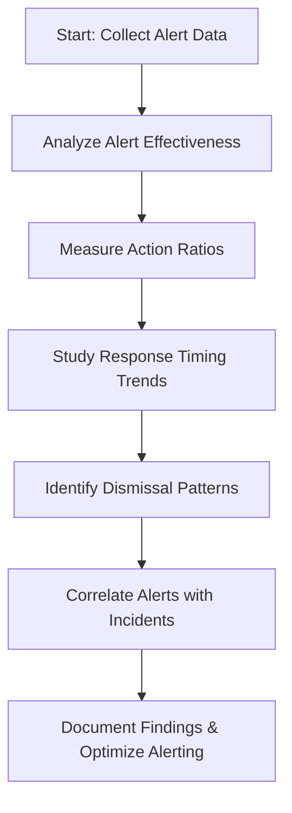

Using this checklist and process flow, SREs can systematically identify and address weaknesses in their alerting systems, paving the way for a more signal-focused and effective monitoring strategy.

### Banking Impact

Alert fatigue creates significant business consequences in banking environments. Below is a breakdown of these impacts, with key statistics and their implications visualized for clarity:

______________________________________________________________________

#### **1. Extended Incident Duration**

- **Impact**: Missed or delayed responses to genuine alerts directly extend outage time.
- **Data**:
  - **+22 minutes**: Average increase in detection time for major incidents due to alert fatigue.
  - **$180,000**: Additional transaction revenue loss per incident.

```
flowchart TD
  A[Extended Incident Duration] --> B[+22 minutes detection delay]
  B --> C[$180,000 revenue loss per incident]
```

______________________________________________________________________

#### **2. Increased Operational Risk**

- **Impact**: Systematically ignoring alerts creates dangerous operational blind spots.
- **Data**:
  - **30%**: Routine alerts dismissed by teams contained early warning indicators for major service degradation.

```
pie
    title Routine Alerts Leading to Risk
    "Routine Alerts Dismissed": 70
    "Early Warning Indicators": 30
```

______________________________________________________________________

#### **3. Elevated Support Costs**

- **Impact**: Customer-reported issues cost significantly more to resolve compared to proactive alerting.
- **Data**:
  - **3.4x higher cost**: Customer-reported issues vs. alert-identified issues.
  - **Cost Drivers**: Additional support tickets, customer communication, inefficient diagnostics.

```
flowchart TD
  A[Elevated Support Costs] --> B[Customer-reported issues cost 3.4x more]
  B --> C[Drivers: Support tickets, communication, diagnostics]
```

______________________________________________________________________

#### **4. Regulatory Compliance Concerns**

- **Impact**: Banking regulators expect strict control over critical systems.
- **Data**:
  - **Control Deficiency**: Alert dismissal patterns flagged as a major compliance issue.
  - **Regulator Concern**: "Critical financial system alerts are routinely ignored without investigation."

```
graph TD
  A[Regulatory Compliance Concerns]
  B[Alert Dismissal Pattern] --> C[Flagged as Control Deficiency]
  C --> D[Risk to Compliance Standards]
```

______________________________________________________________________

#### **5. Staff Burnout and Turnover**

- **Impact**: Teams experiencing alert fatigue face higher stress and attrition rates.
- **Data**:
  - **2.7x higher stress levels**: Reported by payment operations engineers compared to peers.
  - **35% turnover intent**: Engineers actively seeking other positions, citing "constant alert noise."

```
pie
    title Staff Turnover Drivers
    "Stress from Alert Fatigue": 35
    "Other Factors": 65
```

______________________________________________________________________

This data highlights the urgent need to address alert fatigue in banking operations. By tackling these challenges, teams can improve performance, reduce costs, and ensure compliance while safeguarding employee well-being.

### Implementation Guidance

To effectively address alert fatigue in your banking environment, follow this structured approach:

```mermaid
graph TD
    A[Start: Address Alert Fatigue] --> B[1. Implement Signal-to-Noise Metrics]
    B --> C[Define Metrics: False Positive Rate, Action Ratio, Signal Value]
    C --> D[Set Improvement Targets (e.g., Reduce False Positives by 80% in 90 Days)]
    D --> E[Regular Reporting to Leadership]

    A --> F[2. Perform Alert Inventory and Evaluation]
    F --> G[Inventory All Alerts and Categorize by Service Impact, Action Rate, Business Criticality]
    G --> H[Deprecate Alerts Lacking Clear Value]
    H --> I["Default-Off" Stance for Low-Value Alerts]

    A --> J[3. Implement Alert Hierarchy]
    J --> K[Define Tiered Classification System]
    K --> L[Classification Examples: Customer Funds Impact, Customer Experience Impact, etc.]

    A --> M[4. Establish Alert Governance Process]
    M --> N[Create Formal Review and Approval Process]
    N --> O[Require Cross-Functional Approvals for Customer-Impacting Alerts]
    O --> P[Quarterly Alert Cleanup to Prevent Proliferation]

    A --> Q[5. Develop Alert Response Playbooks]
    Q --> R[Create Documented Response Procedures for Critical Alerts]
    R --> S[Include Investigation Steps, Escalation Criteria, and Resolution Approaches]
    S --> T[Ensure Playbooks are Accessible in Alerting Interface]
```

1. **Implement Signal-to-Noise Metrics**: Establish explicit measurements for alert quality, including false positive rate, action ratio (alerts leading to action vs. total alerts), and signal value. Set improvement targets (e.g., reduce false positives by 80% in 90 days) and report progress to leadership regularly to maintain focus on alert quality over quantity.

2. **Perform Alert Inventory and Evaluation**: Conduct a comprehensive inventory of all existing alerts, categorizing them by service impact, historical action rate, and business criticality. Require formal justification for maintaining each alert, with those lacking clear value being deprecated. Adopt a "default-off" stance for low-value alerts, keeping them available for investigation but not actively triggering notifications.

3. **Implement Alert Hierarchy**: Create a tiered alert classification system that clearly distinguishes between different impact levels. For banking environments, use classifications like: "Customer Funds Impact" (affecting money movement), "Customer Experience Impact" (affecting service usability), "Business Operations Impact" (affecting internal processes), and "Resource Utilization" (affecting system resources without direct customer impact).

4. **Establish Alert Governance Process**: Create a formal review and approval process for alert creation and modification. Require cross-functional approval (engineering, operations, business) for any customer-impacting alerts, with explicit documentation of expected response procedures. Implement a regular (quarterly) alert cleanup process to prevent alert proliferation.

5. **Develop Alert Response Playbooks**: For each critical alert type, create clear, documented response procedures that specify expected investigation steps, escalation criteria, and resolution approaches. Ensure these playbooks are accessible within the alerting interface, providing immediate context when alerts fire and reducing the cognitive load on responders.

## Panel 2: The Signal Shift - From Resource Metrics to Customer Experience

### Scene Description

A before-and-after comparison of alerting approaches fills a large wall display.

On the left, "Traditional Monitoring" is represented by a chaotic web of disconnected component alerts: database connections, queue depths, server health, and more. These alerts often overlap and lack context, causing noise and reducing team efficiency.

On the right, "SLO-Based Alerting" is illustrated as a clean, hierarchical structure:

- At the top, critical customer journeys like **Payments**, **Account Access**, and **Trading**.
- In the middle, **Service SLOs** tied to these journeys, such as "Payment Success Rate" or "Account Access Latency."
- At the bottom, contributing metrics like database performance, API latency, and memory utilization, which feed into the SLOs.

Below is a text-based diagram capturing the shift:

#### Traditional Monitoring

```
[CPU > 90%]     [Memory < 2GB]       [Database Connections]
      |                 |                     |
   Alert 1          Alert 2              Alert 3
      |
[Queue Depths]        [API Latency]       [Disk I/O]
      |                     |                  |
   Alert 4              Alert 5           Alert 6
```

#### SLO-Based Alerting

```
        [Customer Journey: Payments]
                    |
            [SLO: Payment Success Rate]
                    |
[Database Performance] -- [API Latency] -- [Queue Depth]
```

Sofia is leading a workshop in front of this display, connecting critical customer journeys to specific SLIs. As she does, team members evaluate and eliminate redundant or low-value alerts. On nearby screens, the team compares dashboards:

- The "Before" dashboard shows 150+ separate alert definitions, overwhelming and noisy.
- The "After" dashboard displays just 12 targeted SLO-based alerts, each tightly aligned to customer impact.

This shift in alerting approach highlights the power of focusing on customer experience, simplifying operations, and making alerts actionable.

### Teaching Narrative

The foundation of effective alerting is answering a fundamental question: "What should trigger human intervention?" Traditional monitoring answers this with system metrics—alert when CPU exceeds 90% or when available memory drops below 2GB. SLO-based alerting provides a radically different answer: alert when customer experience is threatened.

This shift from technical metrics to customer experience transforms alerting in several ways:

1. **From Components to Journeys**: Instead of monitoring individual technical components, we track the customer's ability to complete critical journeys like processing payments or accessing account information

2. **From Resources to Services**: Rather than focusing on infrastructure resources, we monitor service behavior from the user's perspective

3. **From Thresholds to Objectives**: Instead of arbitrary technical thresholds, we alert based on deviation from defined service objectives that reflect customer expectations

4. **From Isolation to Correlation**: Rather than treating each metric independently, we understand how multiple measurements collectively impact service quality

For banking operations teams, this shift dramatically reduces alert volume while increasing relevance. Instead of twenty separate alerts about database connections, memory pressure, and API latency, a single alert indicates that the payment processing SLO is at risk—regardless of which underlying components are causing the issue.

This customer-centric approach not only improves operational efficiency but also aligns technical operations with business priorities. When alerting is based on SLOs that reflect customer experience, engineering teams naturally focus on the issues that matter most to the business and its customers.

### Common Example of the Problem

A commercial banking division operates a treasury management platform serving corporate clients. Their current monitoring approach is entirely component-based, with separate alerts for technical resources across their architecture:

| **System** | **Alert Types** |
| -------------------------- | ----------------------------------------------------- |
| **Database Systems** | Connection counts, query performance, storage metrics |
| **Application Servers** | Memory utilization, CPU load, thread pool status |
| **Network Components** | Bandwidth utilization, error rates, response times |
| **Authentication Systems** | Session counts, validation rates |
| **Batch Processing** | Job completion times, processing volumes |

During a recent service degradation, the operations center received 37 distinct alerts across these systems over a 45-minute period. Below is a simplified timeline of the incident highlighting the overwhelming alert noise and lack of actionable insights:

```mermaid
gantt
    title Incident Timeline: 37 Alerts in 45 Minutes
    dateFormat  HH:mm
    axisFormat  %H:%M
    section Alerts
    Database Alerts    :crit, dbalerts, 08:00, 15min
    App Server Alerts  :crit, appalerts, 08:10, 20min
    Network Alerts     :crit, netalerts, 08:15, 10min
    Auth System Alerts :crit, authalerts, 08:20, 10min
    Batch Processing   :crit, batchalerts, 08:25, 10min
    section Customer Experience
    Wire Transfer Failures :crit, customerimpact, 08:00, 45min
```

While engineers frantically investigated individual components, corporate clients attempting to execute time-sensitive wire transfers were experiencing consistent failures. The separate component alerts, while technically accurate, failed to convey the critical business impact: high-value corporate customers couldn't complete essential financial transactions.

Post-incident analysis revealed the fundamental disconnect between their technical monitoring and business reality. All 37 alerts were working as designed, but none actually communicated what mattered most: **"Corporate clients cannot complete wire transfers."** Engineers wasted precious time investigating low-impact issues while missing the critical customer journey failure. When the CFO asked, *"Why didn't someone tell me our largest clients couldn't move money?"*, the technical team had no good answer—their alerting system simply wasn't designed to express impact in business or customer terms.

### SRE Best Practice: Evidence-Based Investigation

Experienced SREs implement customer-centric alerting using these evidence-based approaches. Below is a step-by-step checklist to guide teams in applying these principles effectively:

#### **Checklist: Evidence-Based Investigation for Customer-Centric Alerting**

1. **Customer Journey Mapping**

   - Conduct a thorough analysis of core user paths within the system.
   - Identify critical touchpoints and define customer expectations.
   - Example: For the treasury management platform, map high-value journeys like authentication, account viewing, payment initiation, approval workflows, reporting, international transfers, and bulk operations.

2. **Component-to-Journey Correlation**

   - Analyze which technical components directly support customer journey success.
   - Use controlled testing and production observations to validate dependencies.
   - Action Item: Prioritize monitoring for components that impact high-value journeys—e.g., identify the 14 of 37 systems that directly affect treasury management user paths.

3. **Alert Impact Classification**

   - Review historical alerts to determine their actual impact on customer journeys.
   - Categorize alerts into "Customer-Impacting" and "Technical Anomaly."
   - Goal: Reduce noise by focusing on the 7% of alerts that correlate with customer disruptions, deprioritizing the 93% that do not.

4. **Alert Consolidation Opportunity Analysis**

   - Analyze patterns in historical incidents to identify redundant alerts.
   - Consolidate multiple technical alerts into single, actionable notifications tied to customer journeys.
   - Example: During treasury management incidents, combine an average of 12 separate component alerts into one journey-based alert.

5. **Business Impact Correlation**

   - Establish measurable connections between technical metrics and business outcomes.
   - Quantify the financial or operational impact of service disruptions.
   - Insight: Wire transfer journey completion rate correlates with revenue impact at $175,000 per percentage point of failed transfers during peak hours.

#### **Process Overview: Evidence-Based Investigation Workflow**

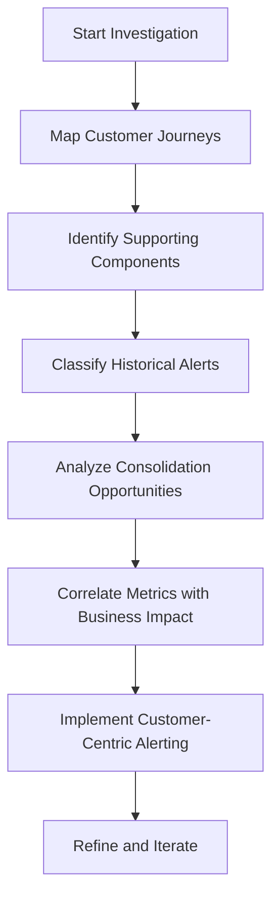

#### **Key Outcomes**

- Reduction in alert volume and noise by focusing on customer-impacting issues.
- Clear alignment between technical operations and business priorities.
- Improved operational efficiency and faster response to critical customer disruptions.

### Banking Impact

Component-focused alerting creates significant business consequences in banking environments. Shifting to customer journey-focused alerting addresses these issues, delivering measurable improvements:

#### Key Business Consequences

| **Consequence** | **Impact** | **Example** |
| --------------------------------------------- | ---------------------------------------------------------------------------------------------------------------------------------------- | ------------------------------------------------------------------------------------------------------------ |
| **Extended Mean Time to Resolution** | Component-based alerting increases incident resolution time by focusing on technical anomalies instead of customer impact. | Journey-focused alerts reduced treasury management incident resolution time by 47 minutes on average. |
| **Misaligned Business Prioritization** | Technical metrics can mislead engineers into prioritizing non-critical issues over customer-impacting incidents. | Engineers fixed internal database performance over API degradation blocking $3.7M in client transfers. |
| **Ineffective Communication with Leadership** | Technical alerts fail to convey business impact, leaving executives unable to make informed continuity decisions during incidents. | Business leaders struggled to interpret component-focused updates during crucial treasury management events. |
| **Reduced Client Confidence** | Delays in resolving customer-impacting incidents erode trust and damage relationships. | Client satisfaction scores dropped 3.7 points for every 15-minute delay in service restoration. |
| **Regulatory Reporting Challenges** | Financial regulators increasingly require clear customer impact assessments, which are difficult to provide with component-based alerts. | Regulatory exams flagged the bank’s inability to quickly assess customer impact as a risk management gap. |

#### Summary of Improvements with Journey-Focused Alerting

- **Faster Resolution**: Teams spend less time investigating unrelated anomalies, focusing instead on the root causes of customer-impacting issues.
- **Aligned Prioritization**: Alerts tied to customer journeys direct attention to business-critical incidents.
- **Clearer Communication**: Incident updates translate technical issues into business impact, improving executive decision-making.
- **Stronger Client Relationships**: Faster resolution times maintain client trust and satisfaction during disruptions.
- **Regulatory Compliance**: Customer journey-focused metrics streamline reporting and meet regulatory expectations.

### Implementation Guidance

To implement customer journey-based alerting in your banking environment, follow these steps:

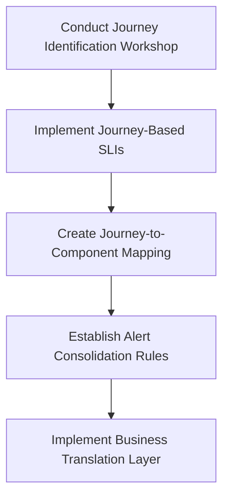

1. **Conduct Journey Identification Workshop**\
   Facilitate a structured session with business, product, and technology teams to identify and prioritize critical customer journeys. For treasury management, document primary journeys like payment initiation, approval workflows, and reporting. Define clear success criteria for each journey from the customer's perspective.

2. **Implement Journey-Based SLIs**\
   Develop specific indicators that measure customer journey success rather than component health. For each critical journey, create SLIs that directly reflect customer experience. For example:

   - "Percentage of wire transfer initiations that complete successfully within 30 seconds"
   - Avoid focusing on raw technical metrics like "database query performance" or "API error rates."

3. **Create Journey-to-Component Mapping**\
   Document explicit relationships between customer journeys and technical components. Build a comprehensive dependency map to identify which infrastructure elements support each journey. Highlight critical path components versus supporting systems, ensuring faster and more focused troubleshooting when journey-based alerts activate.

4. **Establish Alert Consolidation Rules**\
   Define criteria for consolidating component alerts into journey-based notifications. Create rules to suppress or correlate related technical alerts into a single customer-impact notification. Include supporting technical details for investigation but avoid generating separate alerts for each underlying component.

5. **Implement Business Translation Layer**\
   Develop a system to automatically translate technical metrics into business impact during alerting. Configure alerts to include specific business context, such as:

   - Number of affected customers
   - Estimated transaction value impact
   - Comparison to normal business volumes
   - Projected financial consequences if unresolved within typical timeframes

## Panel 3: Alert Design Principles - The SLO Alerting Framework

### Scene Description

An alert design workshop where engineering leads are transforming their alerting strategy. At the center of the room, a whiteboard displays "SLO Alert Design Principles" with the following key concepts visually represented:

- **Alert on Burn Rate**: A graph shows rapid error budget consumption over time, with a clear threshold indicating when intervention is required.
- **Multiple Time Windows**: Two adjacent bar charts compare burn rate calculations over short and long periods, highlighting the differences in detection for fast-burn and slow-burn scenarios.
- **Predictive Alerting**: A line graph illustrates trend projections, with an upward trajectory crossing the error budget limit, signaling a future SLO breach.

Below the whiteboard, Raj demonstrates how these principles apply to a wealth management platform. He uses a specific example where a spike in trade execution errors drastically increases the burn rate. Nearby, team members collaborate in groups, applying these concepts to their own services. On their laptops, banking-specific examples are displayed:

- **Payment Processing**: A high-criticality service with strict burn rate thresholds.
- **Trade Execution**: Medium-criticality service with balanced thresholds.
- **Fraud Detection**: Lower-criticality service with relaxed thresholds.

In the corner, a testing station simulates various failure scenarios. Here, teams verify that the newly designed alerting rules trigger appropriately. The scene emphasizes a hands-on learning experience, where participants actively engage with SLO-based alerting concepts using real-world banking services as examples.

### Teaching Narrative

SLO-based alerting requires a fundamentally different design approach than traditional monitoring. While conventional alerts trigger on instantaneous threshold violations, SLO alerts focus on the rate at which you're consuming your error budget—a concept known as "burn rate."

The core principles of SLO-based alert design include:

1. **Alert on Burn Rate**: Focus on how quickly you're consuming your error budget rather than instantaneous values. For example, rather than alerting when error rate exceeds 1%, alert when you're consuming error budget so rapidly that you'll exhaust it before the SLO time window ends.

2. **Use Multiple Time Windows**: Implement both fast-burn alerts (detecting rapid deterioration over short periods) and slow-burn alerts (identifying gradual degradation over longer periods). For instance, alert when error budget consumption would exhaust your monthly budget in less than 24 hours (fast burn) or when persistent errors would consume your budget within the month (slow burn).

3. **Implement Predictive Alerting**: Add forward-looking alerts that warn when trends predict future SLO violations, giving teams time to act before customer impact becomes significant.

4. **Customize Sensitivity by Service Tier**: Adjust burn rate thresholds based on service criticality, with stricter triggers for higher-tier banking services.

5. **Balance Precision and Recall**: Tune alerting rules to minimize both false positives (alerts without significant customer impact) and false negatives (missing significant issues).

For banking services with different criticality levels and reliability requirements, this framework allows precise calibration of alerting sensitivity. Critical payment processing might use aggressive burn rate thresholds that trigger early intervention, while informational services use more relaxed thresholds that allow longer response times.

This approach transforms alerting from a reactive system that notifies after threshold breaches to a predictive framework that enables intervention before significant customer impact occurs.

### Common Example of the Problem

An investment banking division operates an equity trading platform with a defined SLO of 99.95% transaction success rate measured over a 30-day window. Their current alerting approach is simplistic: they trigger notifications only when the instantaneous error rate exceeds 1% for a 5-minute period. This design creates several critical problems:

| **Scenario** | **Description** | **Key Metrics** | **Impact on Error Budget** | **Operational Outcome** |
| ----------------------- | ---------------------------------------------------------------------------------------------------------------------------------------------- | ---------------------------------------------------------------------------- | --------------------------------------------------------- | ---------------------------------------------------------------------------------------------------- |
| **Subtle Degradation** | Error rates increased from 0.01% to 0.5% during a market volatility event. This increase was below the static 1% threshold and went unnoticed. | - Error rate: 0.5% (50x increase from normal) <br> - Duration: Several hours | Significant portion of the monthly error budget consumed. | Thousands of valid trade orders rejected, representing over $14M in transaction value. |
| **Brief Spike** | Error rates momentarily spiked above 1% for 7 minutes, triggering an alert and leading to emergency response. | - Error rate: >1% (for 7 minutes) <br> - Duration: 7 minutes | Consumed only 0.02% of the monthly error budget. | Caused unnecessary operational disruption without addressing a meaningful reliability threat. |
| **Gradual Degradation** | Error rates increased gradually over several days, eventually leading to a significant outage. | - Error rate: Incremental daily increases <br> - Duration: Several days | Major portion of the error budget consumed over time. | No early warnings provided, leaving the team unable to intervene before significant customer impact. |

Most problematically, their alerting approach provided no early warning capability. During normal operation, error rates would gradually increase as system load grew, but their threshold-based alerts could only react once failures occurred. This left the team perpetually in reactive mode—either responding to insignificant short-term anomalies or missing significant long-term degradations. Without predictive insights or burn rate monitoring, they were unable to detect and address problems before they affected customers.

### SRE Best Practice: Evidence-Based Investigation

Experienced SREs implement burn rate alerting using these evidence-based approaches. The following checklist provides a step-by-step guide to applying these practices effectively:

#### Checklist for Evidence-Based Investigation:

1. **Failure Pattern Analysis**

   - Analyze historical incident data to identify recurring failure patterns.
   - Determine appropriate detection windows for each pattern:
     - Rapid complete failures: Use 5-minute windows.
     - Gradual performance degradations: Use 1-hour windows.
     - Slow capacity exhaustion: Use 6-hour windows.

2. **SLO Impact Modeling**

   - Model how error rates over different time periods affect overall SLO compliance.
   - Example: A sustained 0.5% error rate could consume the monthly error budget in just 4 days, even if it doesn’t exceed traditional threshold alerts.

3. **Alert Sensitivity Calibration**

   - Test various burn rate thresholds against historical incident data.
   - Adjust thresholds to balance early detection with minimizing false alarms:
     - Example: A 14.4x burn rate (30 days of budget consumed in \<50 hours) can provide optimal results.

4. **Multi-Window Effectiveness Testing**

   - Combine multiple time windows to improve detection accuracy.
   - Evaluate performance using systematic testing:
     - Example: Using 5-minute, 1-hour, and 6-hour windows together can detect 97% of major incidents, while reducing false positives by 76% compared to single-window setups.

5. **Predictive Algorithm Validation**

   - Validate trend prediction accuracy with historical data.
   - Use backfitting techniques to assess early warning effectiveness:
     - Example: Predictive algorithms provided early warnings for 82% of major incidents, with an average lead time of 4.7 hours before customer impact.

#### Summary Workflow Representation

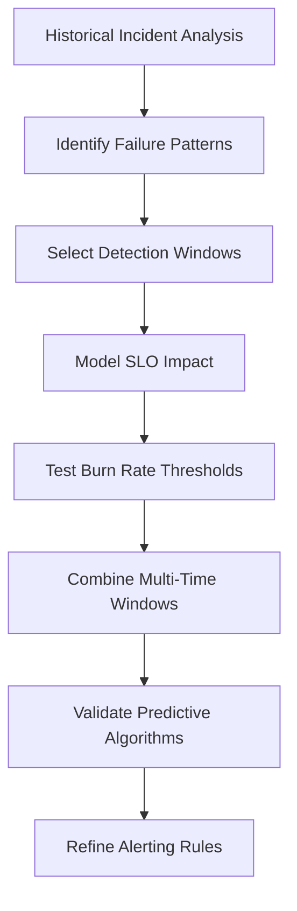

By following this checklist and workflow, teams can systematically design and validate SLO-based burn rate alerts, ensuring they are both actionable and aligned with service reliability goals.

### Banking Impact

Inadequate alert design creates significant business consequences in banking environments. The table below categorizes key impacts, along with associated metrics that quantify their severity:

| **Impact Category** | **Description** | **Associated Metrics** |
| --------------------------------- | ----------------------------------------------------------------------------------------- | ----------------------------------------------------------------------------------------------------- |
| **Missed Trading Opportunities** | Failure to detect subtle degradations impacts trading execution, leading to lost revenue. | - $14M in rejected valid orders<br>- $780K in lost commission revenue |
| **Regulatory Reporting Failures** | Delayed detection of system issues results in non-compliance with financial regulations. | - 2 missed regulatory reporting deadlines<br>- Triggered regulatory inquiries and compliance risks |
| **Client Relationship Damage** | Undetected platform issues harm client trust and reduce platform usage. | - 14-point drop in platform reliability ratings<br>- 3 institutional clients reduced trading activity |
| **Operational Inefficiency** | Wasted resources on false alarms while missing critical issues increases costs. | - 320 engineering hours wasted annually on non-impactful alerts |
| **Reputational Market Impact** | Platform reliability issues negatively affect market perception and trading volumes. | - 7% reduction in trade volumes<br>- Impact persisted 2-3 weeks post-incident |

This structured overview highlights the need for well-designed SLO-based alerting to mitigate these impacts effectively and ensure both operational and business continuity in critical banking environments.

### Implementation Guidance

To implement effective SLO-based alerting in your banking environment:

1. **Establish Burn Rate Alert Framework**: Define a structured approach to burn rate alerting with clear mathematical foundations. For critical banking services, implement alerting when error budget consumption would exhaust the budget before the compliance period ends. Use the following formula for burn rate calculations:

   ```
   Burn Rate = (current_error_rate / allowed_error_rate)
   Alert Trigger = Burn Rate > (time_window / time_remaining)
   ```

   **Example**: If the allowed error rate is 0.1% and the current error rate is 1%, with a compliance period of 30 days and 5 days remaining:

   ```
   Burn Rate = 1% / 0.1% = 10
   Trigger Condition = 5 days / 30 days = 0.1667
   Since 10 > 0.1667, the alert triggers.
   ```

   Document this framework with specific examples tailored to different service types, ensuring clarity for engineering teams.

2. **Implement Multi-Window Alert Configuration**: Deploy complementary alerting windows to catch both rapid and gradual degradations. Configure at least three alerting windows per service type:

   - **Short Window**: 1-5 minutes, for detecting sudden severe issues.
   - **Medium Window**: 30-60 minutes, for identifying ongoing moderate issues.
   - **Long Window**: 6-12 hours, for tracking subtle extended degradations.

   **Example Configuration**:

   ```
   Short Window Burn Rate Threshold: 14x
   Medium Window Burn Rate Threshold: 6x
   Long Window Burn Rate Threshold: 3x
   ```

   Alerts trigger when the respective burn rate threshold for each window is exceeded.

3. **Develop Service Tier Alert Sensitivity**: Create differentiated burn rate thresholds based on service criticality. Use a tiered sensitivity model:

   - **Critical Services**: Trading execution, payment processing
     ```
     Short Window Threshold: 15x
     Medium Window Threshold: 7x
     Long Window Threshold: 4x
     ```
   - **Non-Critical Services**: Reporting, analytics
     ```
     Short Window Threshold: 40x
     Medium Window Threshold: 20x
     Long Window Threshold: 10x
     ```

   These thresholds ensure critical services alert earlier, while non-critical services allow for more leniency.

4. **Create Predictive Trend Detection**: Implement forward-looking alerting based on error budget consumption trends. Use trend analysis with linear regression to project future error budget consumption.

   **Example Formula**:

   ```
   Projected_Error_Budget_Consumption = Current_Error_Budget - (Current_Error_Rate * Time_Remaining)
   Alert Trigger = Projected_Error_Budget_Consumption < 0
   ```

   **Example Scenario**:

   - Current Error Budget: 20%
   - Current Error Rate: 2% per day
   - Time Remaining: 10 days

   ```
   Projected_Error_Budget_Consumption = 20% - (2% * 10) = 20% - 20% = 0%
   ```

   Since the projected consumption is 0%, the alert triggers.

5. **Establish Alert Tuning Feedback Loop**: Develop a systematic process for ongoing alert refinement based on operational experience. Use a feedback loop to review and adjust alerts regularly:

   - **Review Metrics**: False positive rate, detection lead time, and missed incidents.
   - **Adjustment Process**:
     ```
     If False Positives > Target, Increase Thresholds
     If Missed Incidents > Target, Decrease Thresholds
     ```

   Schedule reviews monthly during the initial rollout, moving to quarterly once the system stabilizes. Use historical alerting data to fine-tune thresholds and windows iteratively.

## Panel 4: Multi-Window Alerting - Catching Both Spikes and Trends

### Scene Description

A monitoring center displays a sophisticated multi-window alerting system for a trading platform. Four connected screens show the same service SLO being evaluated over different time windows: 5 minutes, 1 hour, 6 hours, and 1 day. Each has distinct alert thresholds calibrated to its specific window. An incident timeline displayed on an adjacent screen highlights how this system detected two different types of issues: a sudden severe spike that triggered the 5-minute alert, and a gradual degradation that only became visible in the longer windows.

The four time windows and their respective burn rate thresholds are interconnected to provide a comprehensive view of service health. This relationship can be visualized as follows:

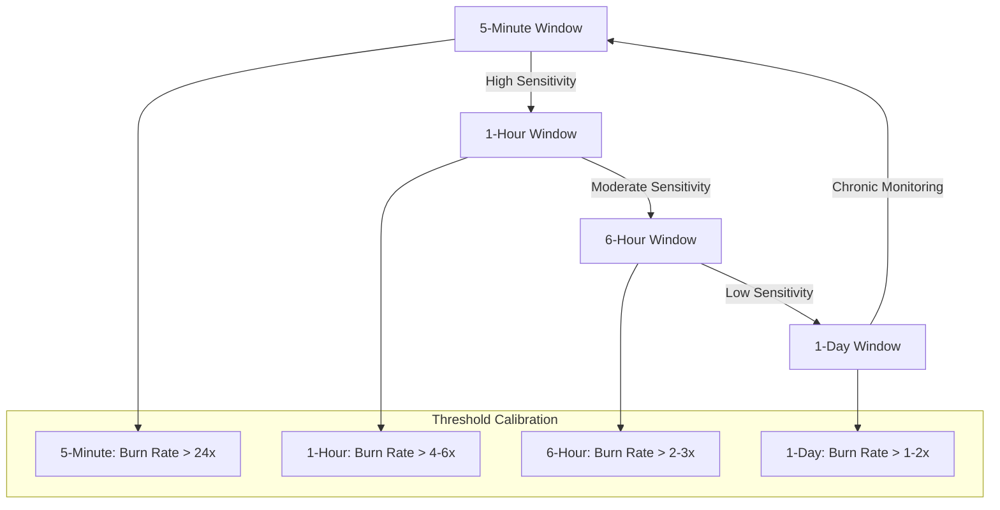

Alex demonstrates the mathematics behind the configuration, showing how burn rates are calculated for each window and how thresholds are determined to balance sensitivity and precision. Team members are tuning these thresholds based on historical incident data displayed on adjacent screens. This collaborative process ensures the system achieves the optimal balance between early detection and false alarms, creating a robust alerting mechanism for both rapid deterioration and gradual degradation.

### Teaching Narrative

Effective SLO-based alerting must detect both rapid deterioration and gradual degradation—a capability that requires evaluating service health across multiple time windows simultaneously.

Multi-window alerting uses a series of measurement periods with corresponding burn rate thresholds designed to catch different failure patterns:

1. **Short Windows (1-5 minutes)**: Detect severe, acute issues with very high burn rates, such as complete service outages or major functionality failures

2. **Medium Windows (30-60 minutes)**: Identify significant but not catastrophic problems that would exhaust error budgets within hours if sustained

3. **Long Windows (6-24 hours)**: Discover gradual degradation that might otherwise go unnoticed but still threatens SLO compliance

4. **Extended Windows (3-7 days)**: Monitor slow, chronic issues that incrementally consume error budgets over days or weeks

Each window requires appropriate burn rate thresholds calibrated to its duration. For example:

- 5-minute window: Alert when burn rate exceeds 24x (consuming a full day's budget in an hour)
- 1-hour window: Alert when burn rate exceeds 4-6x (consuming several days' budget in a day)
- 6-hour window: Alert when burn rate exceeds 2-3x (consuming a week's budget in a few days)
- 1-day window: Alert when burn rate exceeds 1-2x (steadily consuming the monthly budget)

For banking services with varying usage patterns, this multi-window approach is particularly valuable. Trading platforms might experience sharp spikes during market open/close that require short-window detection, while retail banking interfaces might suffer from gradual degradation during high-volume periods that only longer windows would detect.

This comprehensive approach ensures that no significant reliability threat goes undetected, regardless of whether it manifests as a sudden crisis or a slowly developing problem.

### Common Example of the Problem

A retail banking division operates a mobile banking application with a 99.9% availability SLO measured over 30 days. Their initial SLO alerting implementation used a single 15-minute measurement window, triggering notifications when error rates indicated they would consume 30 days of error budget within 24 hours (a 30x burn rate). This single-window approach created several critical blind spots, as summarized below:

| **Incident Type** | **Description** | **Duration** | **Single Window Failure** |
| ------------------------ | ---------------------------------------------------------------------------- | --------------------- | --------------------------------------------------------------------------------------------------------------- |
| **Major Outage** | Complete unavailability caused by infrastructure failure | ~12 minutes | Alert fired only after 12 minutes due to insufficient data within the 15-minute window, delaying response. |
| **Gradual Degradation** | Authentication success rates decreased by ~0.5% daily due to a memory leak | ~2 weeks | Never detected; degradation was too slow to trigger the alert but consumed a large portion of the error budget. |
| **Brief Latency Spikes** | Periodic latency spikes lasting 2-3 minutes, occurring several times per day | Multiple short bursts | Spikes were too brief to significantly affect the 15-minute metrics, leaving the issue undetected. |

To further illustrate these failures, the timeline below shows how the single-window approach missed key opportunities for early detection and mitigation:

```mermaid
gantt
    title Incident Timeline - Single Window Alerting Blind Spots
    dateFormat  HH:mm
    section Major Outage
    Outage Detected                  :done, 12:00, 12:12
    Outage Impact Period             :active, 12:00, 12:30
    section Gradual Degradation
    Degradation Begins               :crit, 00:00, 2d
    Significant Impact Detected      :done, 2d, 2w
    Error Budget Consumed            :active, 00:00, 2w
    section Brief Latency Spikes
    Spike 1                          :crit, 10:00, 10:03
    Spike 2                          :crit, 14:00, 14:02
    Spike 3                          :crit, 18:00, 18:02
```

These examples highlight the blind spots that arise from relying on a single measurement window. The team believed their alerting was comprehensive because it occasionally triggered for major issues, while it completely missed other significant reliability threats that didn’t match the detection pattern of their 15-minute window. This false sense of security delayed incident response and allowed customer impact to grow unchecked.

### SRE Best Practice: Evidence-Based Investigation

Experienced SREs implement multi-window alerting using these evidence-based approaches. Below is a concise checklist summarizing the five key steps:

#### Checklist: Evidence-Based Multi-Window Alerting

1. **Incident Pattern Classification**

   - Analyze historical incidents to categorize failure patterns by duration and severity.
   - Example: Mobile banking incidents revealed three distinct patterns:
     - Severe short-lived outages (e.g., averaging 17 minutes)
     - Moderate intermittent issues (e.g., 30-90 minutes with fluctuating severity)
     - Gradual degradations (e.g., extending over days with increasing impact)

2. **Window Coverage Analysis**

   - Systematically evaluate how different measurement windows detect historical incidents.
   - Insight: Simulations showed no single window could catch all significant patterns (e.g., 5-minute windows missed gradual issues, while 6-hour windows missed brief but severe outages).

3. **Optimal Window Selection**

   - Use statistical analysis to determine the minimum set of windows for comprehensive coverage.
   - Outcome: Four windows (5-minute, 1-hour, 6-hour, and 1-day) provided 97.5% detection coverage while minimizing redundant alerts.

4. **Threshold Calibration Testing**

   - Test burn rate thresholds for each window against historical data.
   - Key Finding: Thresholds should scale inversely with window duration:
     - Shorter windows: Higher thresholds (e.g., 30-36x for 5-minute)
     - Longer windows: Lower thresholds (e.g., 1.5-2x for 1-day)

5. **False Positive/Negative Optimization**

   - Balance detection sensitivity against alert noise through systematic analysis.
   - Results: Optimized configurations reduced false positives by 83% and missed incidents (false negatives) by 91% compared to single-window approaches.

#### Summary of the Workflow

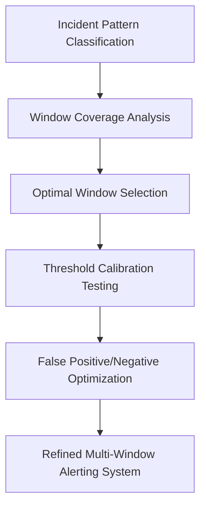

By following this evidence-based workflow, SREs ensure that multi-window alerting systems are finely tuned to detect both sudden crises and gradual degradations with precision and minimal alert noise.

### Banking Impact

Inadequate window coverage creates significant business consequences in banking environments. A multi-window alerting approach can mitigate these impacts by improving detection times and reducing operational and financial risks. The following table summarizes key metrics and outcomes:

| **Impact Area** | **Original Outcome** | **Improved Outcome with Multi-Window Alerting** | **Key Metrics** |
| ------------------------------------- | ------------------------------------------------------------------------------------- | ------------------------------------------------------------------------------------ | ---------------------------------------------------------------------------------------- |
| **Extended Customer Impact Duration** | Outage detection delays increased average downtime, causing transaction revenue loss. | Average detection time reduced by 76%, preventing ~$145,000 in monthly revenue loss. | **Detection Time Reduction**: 76% <br> **Revenue Loss Prevention**: ~$145,000/month |
| **Missed Gradual Degradations** | Slow-developing issues affected thousands of customers over prolonged periods. | Gradual degradations identified within 48 hours, minimizing customer impact. | **Affected Customers**: 37,000 <br> **Early Detection Window**: \<48 hours |
| **Increased Support Costs** | High undetected issue rates generated excessive customer support contacts. | Early issue detection reduced support contacts and costs. | **Additional Support Contacts**: 350-500 per issue <br> **Handling Cost/Contact**: $9-11 |
| **App Abandonment Risk** | Customers experiencing repeated issues abandoned mobile banking channels. | Reliable detection improved customer retention and digital adoption. | **Usage Reduction**: 40% for 3+ reliability issues <br> **Abandonment Rate**: 8% |
| **Remediation Complexity Escalation** | Late-detected issues required complex and resource-intensive fixes. | Early detection reduced remediation effort by 2.7x on average. | **Remediation Effort Multiplier**: 2.7x for late-detected issues |

Key examples demonstrate these impacts:

1. **Extended Customer Impact Duration**: Analysis of mobile banking incidents showed that implementing optimal multi-window alerting would have reduced average detection time by 76%, potentially preventing approximately $145,000 in monthly transaction revenue loss.

2. **Missed Gradual Degradations**: The authentication degradation incident affected approximately 37,000 customers over two weeks, with roughly 14,000 abandoning their login attempts—an impact that proper long-window alerting would have detected within the first 48 hours.

3. **Increased Support Costs**: Call center data revealed that each major undetected mobile app issue generated approximately 350-500 additional support contacts, with an average handling cost of $9-11 per contact, creating substantial operational expenses that early detection could reduce.

4. **App Abandonment Risk**: Mobile banking reliability directly affects digital channel adoption. User analytics revealed that customers who experienced three or more reliability issues within a 30-day period reduced their mobile app usage by approximately 40% on average, with 8% completely abandoning digital channels in favor of branch or phone banking.

5. **Remediation Complexity Escalation**: Engineering analysis showed that issues caught through long-window detection (after days of gradual degradation) required 2.7x more remediation effort on average than similar issues caught early, primarily due to accumulated state corruption and cascading effects.

### Implementation Guidance

To implement effective multi-window alerting in your banking environment, follow this step-by-step checklist:

#### **Step-by-Step Checklist**

1. **Design Your Window Set**

   - Identify critical banking services requiring multi-window alerting.
   - Define four measurement windows:
     - **Short (5 minutes):** Detect severe, acute outages.
     - **Medium (1 hour):** Catch significant degradations.
     - **Long (6 hours):** Monitor gradual performance issues.
     - **Extended (1 day):** Identify slow-developing problems.
   - Ensure all windows operate simultaneously for comprehensive coverage.

2. **Calibrate Burn Rate Thresholds**

   - Configure burn rate thresholds inversely proportional to window duration:
     - **5-minute window:** High threshold (e.g., 30x burn rate).
     - **1-hour window:** Moderate threshold (e.g., 6x burn rate).
     - **6-hour window:** Lower threshold (e.g., 3x burn rate).
     - **1-day window:** Lowest threshold (e.g., 1.5x burn rate).
   - Test thresholds against historical incident data to validate sensitivity.

3. **Establish Response Procedures**

   - Define and document response processes tailored to each window:
     - **Short-window alerts:** Immediate all-hands escalation.
     - **Medium-window alerts:** Assemble investigative teams.
     - **Long-window alerts:** Plan scheduled remediation efforts.
   - Ensure clear ownership and accountability for each procedure.

4. **Implement Alert Correlation**

   - Configure systems to correlate alerts across windows:
     - Group alerts that stem from the same root cause.
     - Consolidate notifications while preserving window-specific details.
   - Avoid alert fatigue by reducing redundant notifications.

5. **Monitor and Refine Performance**

   - Implement metrics to evaluate window effectiveness:
     - **True Positive Rate:** How often the window catches real issues.
     - **False Positive Rate:** How often the window triggers incorrectly.
     - **Detection Lead Time:** How quickly issues are identified.
   - Review and adjust window configurations monthly based on these metrics.

#### **Flowchart: Multi-Window Alerting Process**

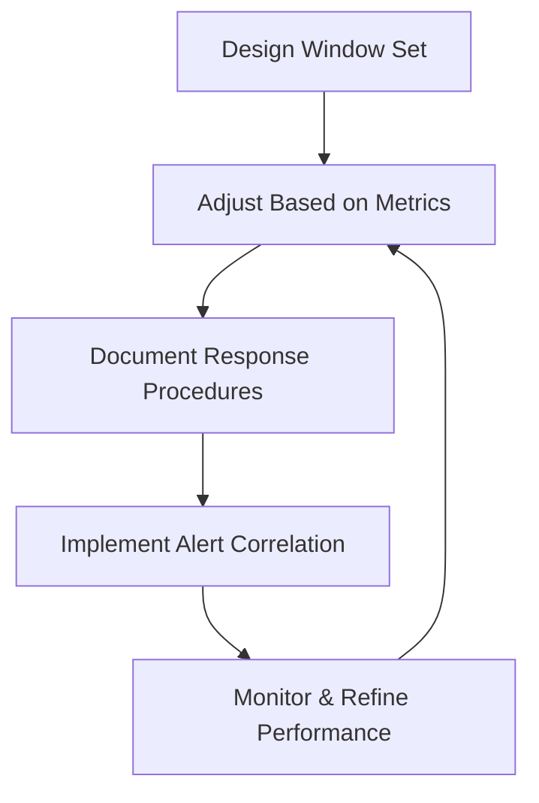

By following this checklist and refining configurations regularly, your multi-window alerting system will effectively balance early detection with precision, ensuring no critical reliability threats go unnoticed.

## Panel 5: Prioritized Response - Alert Severity Based on Customer Impact

### Scene Description

An incident response center during a complex system issue. The alert management system screen displays a hierarchy of simultaneous alerts, prioritized by customer impact rather than technical severity. At the top of the hierarchy, a critical payment processing SLO alert is highlighted in red and assigned P1 status, with automated escalation to the response team. Directly beneath it, several component alerts (e.g., database latency, API errors) are grouped and linked to the parent SLO alert, visually indicating their contribution to the payment issue. Lower on the screen, a P3 alert for a reporting system SLO, marked in green, signifies minimal customer impact and awaits routine handling.

Jamila leads the response team, demonstrating the triage process that organizes response efforts around customer journey impact. On a large wall display, service classifications highlight the tiered prioritization system: Tier 0 services (e.g., payments, authentication) with active SLO violations are escalated immediately, while Tier 2 services (e.g., reporting, analytics) that remain above SLO thresholds are queued for standard-hour responses.

Below is a textual representation of the visual alert management system hierarchy:

```
Critical Alerts (P1 - Immediate Escalation)
└── Payment Processing SLO Alert (P1 - Red)
    ├── Database Latency Alert (Linked Component)
    └── API Errors Alert (Linked Component)

Routine Alerts (P3 - Standard Priority)
└── Reporting System SLO Alert (P3 - Green)
```

This structured layout ensures that response priorities are clear, enabling the team to act on the issues with the highest customer impact first. By focusing on customer journey disruptions rather than isolated technical symptoms, the process aligns engineering effort with business-critical needs.

### Teaching Narrative

SLO-based alerting transforms not just when alerts fire, but how they're prioritized and handled once triggered. This approach replaces technical-severity classifications with customer-impact prioritization, ensuring that response efforts focus on the issues that matter most to users.

The prioritized response framework includes several key components:

1. **Impact-Based Severity**: Alert priority is determined by potential impact on customer experience and business operations rather than technical factors. For example, a minor technical issue affecting payment processing receives higher priority than a major technical problem in a non-critical system.

2. **SLO Violation Forecasting**: Alerts include predictions about when SLOs will be violated if the issue continues, creating urgency proportional to the time remaining before breach.

3. **Intelligent Grouping**: Related alerts are automatically consolidated into incident groups based on their relationship to customer journeys and SLOs, reducing duplication and fragmented response.

4. **Differential Response Tiers**: Different service tiers receive appropriate response levels based on their criticality and current SLO status. For instance, a Tier 0 banking service (payments, authentication) below SLO targets triggers immediate escalation, while a Tier 2 service (reporting, analytics) receives standard-hour response.

5. **Context Enrichment**: Alerts include critical context about customer impact, affected journeys, and historical patterns, enabling faster diagnosis and more informed decision-making.

For banking operations teams managing dozens or hundreds of services, this prioritization framework ensures that limited engineering resources focus on the most business-critical issues. Instead of addressing alerts in the order received or based on which team shouts loudest, response follows a structured prioritization that aligns with customer needs and business priorities.

This aligned response model not only improves reliability for the most important services but also optimizes total engineering effort by ensuring appropriate response levels for issues of different significance.

### Common Example of the Problem

A large national bank's operations center supports dozens of digital banking services across retail, commercial, and wealth management divisions. Their traditional incident management system categorizes all alerts based on technical severity, using standardized classifications:

- P1: Complete service unavailability
- P2: Significant degradation in service performance
- P3: Minor functionality issues or potential future problems
- P4: Informational alerts requiring no immediate action

#### Scenario Timeline: Missteps in Prioritization

| **Time** | **Event** | **Technical Severity** | **Team Response** | **Outcome** |
| -------- | ----------------------------------------------------------------------------------------------- | ---------------------- | -------------------------------------------------------------------------------------------------- | -------------------------------------------------------------------------------------------------------- |
| 12:00 PM | P2 alert: Wealth management reporting system unavailable. | P2 | Assigned senior engineers to investigate. | Immediate response, but impact limited to a few hundred internal users generating weekly client reports. |
| 12:05 PM | P3 alert: Increased API response times for mobile banking authentication service. | P3 | Assigned to junior engineers due to low severity classification. | Response delayed. Impact began to grow as 45,000 active customers experienced login issues. |
| 12:15 PM | P2 alert: Elevated error rates in commercial banking payment processing service. | P2 | Investigated after wealth management issue due to same severity level but lower perceived urgency. | Large-value corporate transfers began failing, creating significant business disruption. |
| 12:45 PM | Mobile banking authentication slowdown worsened, causing widespread transaction abandonment. | P3 | Junior engineers escalated the issue after noticing widespread customer impact. | Escalation delayed. Customer trust and revenue losses occurred. |
| 1:00 PM | Commercial payment processing errors caused delays in processing high-value corporate payments. | P2 | Incident response team switched focus, but critical delays had already impacted corporate clients. | Escalation came too late to mitigate major financial impact. |

#### Key Lessons Highlighted

1. **Technical Severity ≠ Business Impact**: The wealth management reporting system, while technically a P2 issue, had minimal customer or business impact compared to the mobile authentication and payment processing alerts.
2. **Delayed Escalation**: The reliance on technical severity caused critical customer-facing issues to be deprioritized, leading to significant business and customer trust losses.
3. **Inconsistent Resource Allocation**: Senior engineers were allocated to low-impact issues, while high-impact problems were left to less experienced responders.

This example underscores the inefficiencies of prioritizing alerts solely by technical severity. By failing to incorporate customer and business impact into their decision-making, the operations team inadvertently exacerbated the consequences of the incident. The result: avoidable damage to customer experience, business operations, and organizational credibility.

### SRE Best Practice: Evidence-Based Investigation

Experienced SREs implement impact-based alert prioritization using these evidence-based approaches. Use the checklist below as a quick reference to integrate these practices into your environment:

#### Checklist for Evidence-Based Investigation

- [ ] **Service Criticality Classification**:\
  Develop a structured framework for categorizing services based on customer and business impact.\
  Example:

  - Tier 0: Money movement, authentication.
  - Tier 1: Account management, customer information.
  - Tier 2: Enhanced features, personalization.
  - Tier 3: Internal tools, reporting.

- [ ] **Customer Impact Quantification**:\
  Define objective measurements for evaluating customer experience during incidents.\
  Metrics to consider:

  - Affected customer count.
  - Transaction value impact.
  - Average session abandonment rate.

- [ ] **Business Value Correlation**:\
  Link services directly to business outcomes through financial analysis.\
  Example Findings:

  - Mobile authentication issues cost ~$27,000 per hour in lost transaction revenue.
  - Wealth reporting outages primarily affect internal operations, with minimal direct revenue loss.

- [ ] **Response Effectiveness Analysis**:\
  Evaluate the impact of prioritization strategies on incident resolution outcomes.\
  Key Insights:

  - Impact-based prioritization reduced average resolution time for critical issues by 37 minutes.
  - Low-impact issue resolution times increased by only 12 minutes.

- [ ] **Alert Correlation Analysis**:\
  Investigate patterns in alerts and their relationship to incidents.\
  Historical Data Example:

  - 78% of major incidents generated multiple related alerts.
  - Average: 7.3 alerts per significant customer-impacting incident.

By systematically applying this checklist, teams can ensure that their investigation and prioritization processes are rooted in data and aligned with customer and business priorities.

### Banking Impact

Technical-focused prioritization creates significant business consequences in banking environments. The following table summarizes key quantified impacts observed due to misaligned prioritization, followed by detailed examples:

| **Impact Area** | **Quantified Effect** |
| ----------------------------------- | ------------------------------------------------------------------------------------ |
| **Misaligned Response Resources** | 47-minute extended resolution time for customer authentication during misallocation. |
| **Extended Impact Duration** | +23 minutes average downtime for payment services over 12 months of incident data. |
| **Customer Experience Degradation** | 17-point drop in satisfaction when authentication issues exceed 20 minutes. |
| **Revenue Protection Failures** | $145,000 delayed transfers and $22,000 lost fee income during a deprioritized event. |
| **Regulatory Reporting Challenges** | Identified control weakness by regulators due to lack of customer-impact focus. |

#### Detailed Examples:

1. **Misaligned Response Resources**: Limited engineering expertise is allocated to the wrong issues. During the mixed-alert scenario, directing senior engineers to the wealth reporting system while assigning junior staff to customer authentication exemplified this misalignment, extending the resolution time for the more business-critical service by approximately 47 minutes.

2. **Extended Impact Duration**: High-value services experience longer outages due to prioritization disconnects. Analysis of 12 months of incident data showed that customer-facing payment services experienced an average of 23 minutes of additional downtime when competing with technically similar but lower-business-impact issues.

3. **Customer Experience Degradation**: User satisfaction directly correlates with response prioritization effectiveness. Post-incident customer satisfaction surveys showed that mobile banking customers experienced a 17-point satisfaction drop when authentication issues persisted for more than 20 minutes, compared to minimal impact for delays in non-critical services like personalization features.

4. **Revenue Protection Failures**: Incorrect prioritization directly affects transaction revenue. Financial analysis of the commercial payment processing incident revealed approximately $145,000 in delayed high-value transfers during the deprioritized response period, with an estimated $22,000 in lost fee income that proper prioritization could have prevented.

5. **Regulatory Reporting Challenges**: Financial regulators expect appropriate incident prioritization based on customer impact. A regulatory review identified the bank's technical-focused prioritization as a control weakness, noting that "incident response procedures fail to adequately consider customer impact when allocating resources during multiple simultaneous events."

### Implementation Guidance

To implement effective impact-based alert prioritization in your banking environment:

1. **Create Service Tier Classification Matrix**: Develop a structured framework for categorizing banking services based on business and customer impact. Document clear criteria for each tier, including factors like financial impact, customer reach, regulatory requirements, and recovery time objectives. Ensure this classification is formally approved by both technology and business leadership.

2. **Implement Impact-Based Severity Assignment**: Reconfigure alert management systems to prioritize based on service classification rather than technical severity alone. Define specific mapping rules where alerts inherit their primary priority from the affected service's tier, with secondary consideration for technical severity within that tier.

3. **Develop Alert Correlation Rules**: Establish automated systems to group related alerts into unified incidents. Implement correlation logic that identifies when multiple technical issues affect the same customer journey or business service, creating parent/child relationships that maintain detailed technical information while providing consolidated management view.

4. **Create Differential Response Procedures**: Document specific response protocols for different alert priorities based on service classification. Define clear expectations for response timing, escalation paths, communication requirements, and resource allocation for each priority level, ensuring consistent handling across teams.

5. **Implement Customer Impact Enrichment**: Enhance alerts with specific customer and business context. Configure alerting systems to automatically include critical business information: number of affected customers, estimated transaction value impact, customer segments involved, and projected financial consequences if the issue remains unresolved, providing responders with immediate business context for prioritization decisions.

## Panel 6: The Alerting Hierarchy - Building a Multi-Level Detection System

### Scene Description

An alert system architecture review showing a comprehensive defense-in-depth approach to reliability monitoring. On a large wall display, Sofia illustrates a pyramid with four distinct layers, each representing a critical component of the alerting hierarchy:

```mermaid
graph TD
    A(SLO-Based Alerting)<br>Customer Experience
    B(Black-Box Synthetic Monitoring)<br>Critical User Journeys
    C(White-Box System Monitoring)<br>Diagnostic Context
    D(Safety Net Monitoring)<br>Catastrophic Failures

    A --> B
    B --> C
    C --> D
```

1. **SLO-Based Alerting** (Top Layer): Focuses on customer experience, detecting significant deviations from reliability commitments.
2. **Black-Box Synthetic Monitoring** (Verification Layer): Proactively checks critical user journeys to identify failures before widespread impact.
3. **White-Box System Monitoring** (Diagnostic Layer): Provides detailed internal metrics and diagnostic data to troubleshoot issues.
4. **Safety Net Monitoring** (Bottom Layer): Catches catastrophic failures that might bypass other detection methods.

Engineers are mapping specific banking services to these layers within the framework. A simulation demonstrates how a complex failure scenario—a subtle payment processing defect—propagates through the layers. Detection occurs first in black-box monitoring, triggering SLO alerts as the impact accumulates, while white-box monitoring provides critical diagnostic context.

### Teaching Narrative

While SLO-based alerting forms the foundation of a modern monitoring approach, comprehensive reliability requires a multi-level detection system where different alerting methods serve complementary purposes. The alerting hierarchy creates this defense-in-depth through a layered architecture.

The four key layers of a complete alerting hierarchy include:

1. **SLO-Based Alerting (Top Layer)**: Measures customer experience against defined objectives, detecting significant deviations that threaten reliability commitments. This layer answers: "Are we meeting our customer experience promises?"

2. **Black-Box Synthetic Monitoring (Verification Layer)**: Proactively tests critical user journeys from outside the system, detecting failures before they affect large numbers of customers. This layer answers: "Can customers complete their most important tasks right now?"

3. **White-Box System Monitoring (Diagnostic Layer)**: Collects detailed internal metrics for troubleshooting context rather than primary alerting. This layer answers: "Why is the customer experience degrading?" rather than "Is there a problem?"

4. **Safety Net Monitoring (Bottom Layer)**: Provides minimal, high-threshold alerts for catastrophic failures that might bypass other detection mechanisms. This layer answers: "Has something fundamentally broken in an unexpected way?"

Each layer serves a specific purpose in the overall reliability strategy. For banking systems, this hierarchy might manifest as:

- SLO Layer: Customer-focused metrics like payment success rates and authentication reliability
- Black-Box Layer: Synthetic transactions testing critical flows like transfers and account access
- White-Box Layer: Internal metrics on database performance, API latency, and component health
- Safety Net Layer: Basic liveness checks ensuring core services remain minimally functional

This layered approach ensures that no significant failure goes undetected while maintaining the focus on customer experience. It combines the best of traditional monitoring and modern SLO-based approaches in a cohesive, comprehensive system.

### Common Example of the Problem

A regional bank's digital banking platform experienced a complex failure that exposed critical gaps in their single-layer alerting approach. Their monitoring relied exclusively on internal system metrics (white-box monitoring), with hundreds of alerts configured for technical components but no higher-level detection systems.

During a monthly release deployment, a subtle defect was introduced in the mobile banking authentication service. While the service continued to accept login requests and appeared functional in basic health checks, it began silently failing for approximately 30% of iOS users due to an API version compatibility issue. The specific failure pattern:

1. Users could enter credentials and initiate login.
2. The authentication API accepted the request without errors.
3. The confirmation response contained malformed data, only affecting iOS devices.
4. Affected users received a generic "Something went wrong" message.
5. Backend systems showed successful authentication despite users being unable to access their accounts.

This failure pattern bypassed all existing monitoring since:

- The authentication service reported 100% availability (it was accepting connections).
- API error rates remained at normal levels (requests were technically successful).
- Server resources showed normal utilization (the issue was logical, not resource-related).
- Database connections and query performance were within normal parameters.

The issue remained undetected for over 4 hours until social media complaints accumulated enough for customer service to recognize a pattern. By then, thousands of customers had been unable to access their accounts, with many abandoning the mobile app entirely and resorting to phone banking—creating a surge in call center volume and significant customer frustration.

The propagation of this failure through the system layers highlights the limitations of a single-layer monitoring approach. Below is a simplified text-based flow diagram illustrating how the issue went undetected:

```text
[Deployment Introduces API Defect]
            |
            v
[Authentication Service Accepts Requests] --> [White-Box Monitoring (No Alerts)]
            |
            v
[Malformed Responses Sent to iOS Users] --> [No Black-Box Synthetic Monitoring to Detect]
            |
            v
[Users Receive "Something Went Wrong"] --> [No SLO-Based Alerts Triggered]
            |
            v
[Customer Complaints on Social Media]
            |
            v
[Customer Service Identifies Pattern After 4 Hours]
```

Post-incident analysis revealed the fundamental problem: their single-layer monitoring approach created a critical blind spot where technical components could appear healthy while the actual customer experience was severely degraded. A multi-level alerting hierarchy would have detected this issue earlier, as black-box synthetic monitoring could have flagged failed user journeys, and SLO-based alerts would have highlighted customer experience degradation before social media complaints surfaced.

### SRE Best Practice: Evidence-Based Investigation

Experienced SREs implement multi-layer detection using these evidence-based approaches. The following table summarizes key findings from detection gap analysis, failure mode mapping, and layer effectiveness measurements, highlighting the strengths and weaknesses of each layer in the hierarchy:

| **Approach** | **Key Insights** | **Example Findings** |
| ----------------------------------- | ------------------------------------------------------------------------------------------- | ------------------------------------------------------------------------------------------------------------------------------------------------------------------------------------------- |
| **Detection Gap Analysis** | Identifies monitoring blind spots by reviewing historical incidents. | 27% of digital banking incidents over 18 months would have been missed by any single monitoring layer. |
| **Failure Mode Mapping** | Maps failure types to the most effective detection methods. | 37 distinct failure patterns identified: SLO monitoring excelled at service degradations; synthetic testing at functional failures. |
| **Layer Effectiveness Measurement** | Quantifies the detection capabilities of each layer by testing simulated failure scenarios. | Synthetic monitoring detected 92% of functional issues but only 45% of performance degradations. SLO monitoring caught 87% of degradations but missed 30% of edge-case functional failures. |
| **Detection Time Optimization** | Analyzes which layers provide the fastest detection for different failure types. | Black-box synthetic tests detected customer-impacting issues 7.2 minutes earlier than SLO metrics on average. White-box monitoring provided retrospective diagnostics in 63% of cases. |
| **Layer Integration Testing** | Assesses how well layers work together to prevent critical gaps. | Complete four-layer hierarchy achieved 99.3% detection in tests of 25 complex failure modes, compared to 65-80% for individual layers. |

#### Insights from Layer Effectiveness Analysis

The following text-based representation shows the relative effectiveness of each layer in detecting different failure types:

```
Functional Failures:
[███████████████-----] Synthetic Monitoring (92%)
[█████████----------] SLO Monitoring (70%)
[█████--------------] White-Box Monitoring (40%)
[██-----------------] Safety Net Monitoring (15%)

Performance Degradations:
[█████████████-------] SLO Monitoring (87%)
[█████--------------] Synthetic Monitoring (45%)
[████---------------] White-Box Monitoring (35%)
[█------------------] Safety Net Monitoring (10%)
```

This quantitative approach ensures monitoring efforts are both comprehensive and targeted, with a clear understanding of where each layer excels and where gaps remain. When combined with detection time and integration testing insights, these practices form the foundation of a robust, multi-level detection system.

### Banking Impact

Single-layer detection creates significant business consequences in banking environments. To illustrate the key impacts, the following checklist outlines critical areas where detection gaps can affect operations, finances, and customer trust:

#### Key Impacts of Single-Layer Detection:

- **Extended Detection Time**:

  - ☐ Increased time-to-detection, leading to prolonged customer impact.
  - ☐ Example: iOS authentication failure caused a four-hour delay, affecting ~7,200 customers (1,800/hour).

- **Channel Shift Costs**:

  - ☐ Higher operational expenses due to increased reliance on costly service channels.
  - ☐ Example: Authentication issue generated 1,200 additional call center contacts at $9/interaction ($10,800 total).

- **Digital Adoption Regression**:

  - ☐ Reduction in long-term digital engagement due to reliability issues.
  - ☐ Example: 23% of affected customers reduced app usage for two weeks; 7% did not return to normal usage after a month.

- **Transaction Revenue Impact**:

  - ☐ Direct revenue losses from interrupted user transactions.
  - ☐ Example: Authentication outage led to $42,000 in immediate lost revenue, with an additional $15,000 from reduced digital engagement.

- **Reputation and Trust Erosion**:

  - ☐ Decline in public perception and brand trust due to undetected failures.
  - ☐ Example: Social media sentiment dropped by 27 points; multiple complaints cited "the bank didn't even know they had a problem."

#### Summary Flow of Impacts:

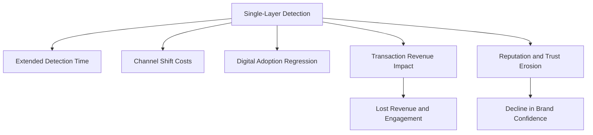

This checklist and flowchart emphasize the multi-faceted risks of single-layer detection, reinforcing the need for a layered alerting hierarchy to safeguard customer experience and business outcomes.

### Implementation Guidance

To implement effective multi-layer detection in your banking environment:

1. **Deploy Complementary Detection Layers**: Implement all four layers of the alerting hierarchy for critical banking services. Configure SLO-based alerting for customer experience measurement, synthetic transaction monitoring for functional verification, white-box monitoring for diagnostic data, and safety net checks for catastrophic failures. Ensure each layer is appropriately integrated while maintaining distinct detection capabilities.

2. **Implement Journey-Based Synthetic Monitoring**: Develop comprehensive synthetic transaction tests that verify critical customer journeys. For mobile banking, create automated tests that execute core user flows (authentication, account viewing, transfers, bill payments) across all supported platforms and devices, with tests running at least every 5 minutes from geographically distributed locations. Below is an example of a synthetic monitoring test configuration using a popular automation framework, such as Playwright:

   ```javascript
   const { chromium } = require('playwright');

   (async () => {
       const browser = await chromium.launch();
       const context = await browser.newContext();
       const page = await context.newPage();

       try {
           // Navigate to the login page
           await page.goto('https://banking.example.com/login');

           // Perform login
           await page.fill('#username', 'test_user');
           await page.fill('#password', 'secure_password');
           await page.click('#login-button');
           await page.waitForSelector('#dashboard', { timeout: 5000 });

           console.log('Login Test Passed');

           // Test account transfer flow
           await page.click('#transfer-tab');
           await page.fill('#recipient', 'recipient_account');
           await page.fill('#amount', '100');
           await page.click('#transfer-button');
           await page.waitForSelector('#transfer-success', { timeout: 5000 });

           console.log('Transfer Test Passed');
       } catch (error) {
           console.error('Synthetic Test Failed:', error);
       } finally {
           await browser.close();
       }
   })();
   ```

   This script performs a synthetic test of login and account transfer flows. It can be scheduled to run periodically using a CI/CD pipeline or monitoring service, ensuring critical journeys are continuously verified.

3. **Establish Layer-Appropriate Alerting Policies**: Define clear alerting rules for each monitoring layer based on its specific purpose. Configure immediate alerts for synthetic test failures and safety net issues, burn rate alerts for SLO violations, and context-only collection for white-box metrics used in diagnosis rather than detection.

4. **Create Cross-Layer Correlation**: Implement systems to connect alerts across different detection layers. Develop correlation rules that link related notifications from different layers into unified incidents, allowing responders to quickly see both the customer impact (SLO and synthetic layers) and potential technical causes (white-box and safety net layers).

5. **Develop Layer-Specific Response Procedures**: Establish tailored incident response approaches based on which layer detected an issue. Create differentiated response playbooks for synthetic test failures (immediate functional verification), SLO alerts (impact assessment and containment), and safety net triggers (emergency triage), ensuring appropriate response mechanisms for each detection method.

## Panel 7: From Detection to Prediction - The Future of SLO Alerting

### Scene Description

An advanced operations center implementing next-generation alerting capabilities. The room is organized into collaborative workstations, with engineers monitoring and analyzing data on large central displays.

#### Visual Layout of the Operations Center:

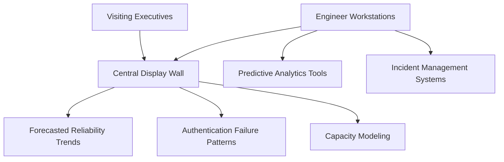

- **Central Display Wall**: Shows machine learning systems analyzing patterns in service performance data to predict potential SLO violations hours or days before they occur.

  - A panel highlights forecasted reliability trends with confidence intervals.
  - Another panel visualizes an emerging pattern in authentication failures that historically preceded major incidents.
  - A separate display showcases capacity modeling predicting SLO breaches during upcoming end-of-quarter financial processing.

- **Engineer Workstations**: Equipped with predictive analytics tools and incident management systems, enabling teams to dive deeper into the data and simulations displayed on the central wall.

- **Raj’s Explanation**: Raj walks visiting executives through the setup, emphasizing how predictive capabilities have shifted operations from reactive firefighting to proactive reliability management. He highlights key metrics displayed on the dashboards:

  - 70% reduction in SLO violations.
  - 45% decrease in unplanned work.
  - Significant improvement in developer experience through fewer off-hours incidents.

This setup underscores the transformative impact of predictive alerting, illustrating how machine learning and advanced data analysis can drive proactive, efficient operations in complex environments.

### Teaching Narrative

The evolution of SLO-based alerting leads ultimately to predictive reliability—moving from detecting problems as they occur to anticipating and preventing them before customer impact manifests. This predictive approach represents the frontier of SLO alerting, leveraging historical data and machine learning to forecast reliability trends.

Advanced predictive alerting incorporates several sophisticated capabilities, summarized in the table below:

| Capability | Purpose | Example Application |
| ----------------------------------- | ---------------------------------------------------------------------------- | ------------------------------------------------------------------------------------------------------ |
| **Predictive Reliability Analysis** | Identify subtle patterns that historically preceded reliability degradation. | Forecast increased authentication failures during peak end-of-quarter processing to preempt incidents. |
| **Anomaly Detection** | Detect unusual system behaviors that don't match established patterns. | Identify unexpected API latency spikes caused by rare edge-case traffic scenarios. |
| **Adaptive Objective Optimization** | Continuously refine SLO definitions, thresholds, and weightings. | Adjust SLO thresholds during seasonal traffic variations to maintain customer experience standards. |
| **Autonomous Remediation** | Automatically implement corrective actions for emerging reliability threats. | Scale up database replicas preemptively when predictive models detect impending resource exhaustion. |
| **Continuous Learning** | Iteratively improve reliability models based on operational data. | Enhance failure prediction accuracy by incorporating insights from post-incident reviews. |

For financial institutions with complex technology ecosystems, these next-generation capabilities represent a significant competitive advantage. Rather than waiting for reliability degradation to occur and then responding, organizations can identify and address emerging issues days or even weeks before they would become apparent through traditional means.

These approaches acknowledge that in complex systems like banking platforms, failures rarely occur suddenly—they typically develop gradually through subtle interactions and cumulative effects that traditional monitoring misses. By analyzing vast operational datasets, machine learning can detect these early indicators and enable truly proactive reliability management.

While implementing these advanced capabilities requires significant data maturity and technical sophistication, they represent the natural evolution of reliability engineering—a future where most potential incidents are prevented before customers experience any impact, and where reliability objectives continuously adapt to deliver optimal customer experiences.

### Common Example of the Problem

A major commercial bank's treasury management platform serves thousands of corporate clients managing billions in daily transactions. Despite implementing comprehensive SLO-based alerting, they still face a fundamental limitation: all their detection systems—even sophisticated burn rate alerting—remain fundamentally reactive, identifying issues only after they begin affecting customers.

During a recent quarter-end period, the treasury platform experienced a severe performance degradation that significantly impacted high-value corporate clients. While their alerting system functioned as designed, detecting the issue within minutes of customer impact, the incident still resulted in substantial consequences:

- Several large corporate clients missed time-sensitive payment deadlines
- Approximately $1.2B in transactions were delayed by 25-65 minutes
- The operations team required emergency all-hands response involving 14 engineers
- Multiple senior executives needed to communicate directly with affected clients
- The incident generated formal complaints from three major clients with regulatory implications

Post-incident forensic analysis revealed that subtle indicators had been present in the system for days before the actual failure. The following timeline illustrates how these early signals gradually escalated into a full-blown incident:

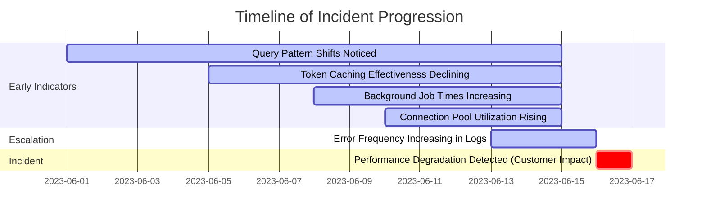

While all this data existed in their monitoring systems, none of it triggered alerts because each individual metric remained within acceptable thresholds. Only when these factors converged to create actual customer impact did traditional detection methods identify a problem—precisely when corporate clients were attempting to complete critical end-of-quarter transactions.

The incident postmortem reached a sobering conclusion: despite state-of-the-art monitoring, they remained locked in a reactive posture, addressing reliability threats only after they affected customers rather than preventing them proactively.

### SRE Best Practice: Evidence-Based Investigation

Experienced SREs implement predictive reliability using these evidence-based approaches. Below is a practical checklist summarizing key steps for applying these methods in your environment:

#### Evidence-Based Investigation Checklist

1. **Incident Precursor Analysis**

   - [ ] Collect historical incident data, focusing on the period leading up to major failures.
   - [ ] Identify recurring patterns (e.g., error types, performance trends, or resource utilization anomalies) that preceded incidents.
   - [ ] Validate precursor signals by analyzing their consistency across multiple incidents.

2. **Pattern Recognition Model Development**

   - [ ] Aggregate at least 12-18 months of operational data for model training.
   - [ ] Collaborate with data scientists to build machine learning models targeting reliability threat signatures.
   - [ ] Evaluate models on accuracy (e.g., >80%) and false positive rates (\<10%) using historical datasets.

3. **Lead Indicator Identification**

   - [ ] Perform statistical analysis to pinpoint metrics that deviate early during precursor periods.
   - [ ] Validate lead indicators by correlating them with known incidents over time.
   - [ ] Document and prioritize 10-15 key metrics that consistently provide early warnings.

4. **Predictive Time Horizon Optimization**

   - [ ] Experiment with varying prediction windows (e.g., 24, 48, 72 hours) to balance accuracy and lead time.
   - [ ] Analyze prediction performance for different forecast horizons and operational scenarios.
   - [ ] Standardize prediction windows based on use case requirements (e.g., high accuracy for critical systems).

5. **Intervention Effectiveness Measurement**

   - [ ] Design A/B tests to compare outcomes of proactive interventions versus monitoring-only approaches.
   - [ ] Measure metrics like customer impact reduction, incident mitigation rates, and operational cost savings.
   - [ ] Iterate on intervention strategies to maximize effectiveness and reduce false positives.

#### Process Flow: Evidence-Based Investigation

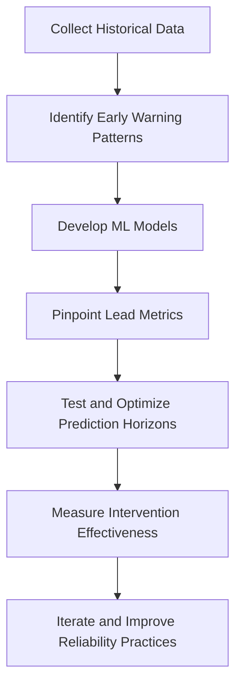

By following this checklist, SRE teams can establish a structured approach to implementing predictive reliability, ensuring their systems evolve from reactive response to proactive prevention.

### Banking Impact

Reactive-only alerting creates significant business consequences in banking environments:

1. **Preventable Customer Impact**: Issues detected only after affecting customers create inevitable service disruption. Analysis of the treasury management incident showed that with adequate prediction, the engineering team could have implemented mitigation before the quarter-end peak, preventing approximately $1.2B in delayed transactions and avoiding all customer impact.

2. **Emergency Response Costs**: Reactive incident management requires disruptive emergency mobilization. The treasury platform incident required pulling 14 engineers from planned work, generating approximately 112 person-hours of unplanned emergency response plus an additional 60 hours of follow-up stabilization, significantly impacting other deliverables and creating cascading schedule delays.

3. **Client Relationship Damage**: High-value corporate banking relationships suffer from reactive reliability management. Client impact analysis showed that affected companies reduced their treasury transaction volume through the bank by 14% in the month following the incident, with three clients explicitly citing reliability concerns in relationship manager discussions.

4. **Regulatory Compliance Risk**: Financial regulators increasingly expect sophisticated reliability practices. A regulatory examination specifically cited the bank's reactive-only approach as a control weakness, noting that "industry-leading financial institutions are implementing predictive reliability capabilities to protect critical financial functions."

5. **Competitive Disadvantage**: Advanced reliability capabilities increasingly influence corporate banking decisions. Market analysis showed that 30% of RFPs for treasury management services now explicitly ask about predictive reliability capabilities, with sophisticated corporate clients using technical due diligence to evaluate bank technology practices before committing significant transaction volume.

#### Key Business Consequences of Reactive Alerting in Banking:

- Increased **customer impact** due to preventable disruptions and delayed transactions.
- Higher **emergency response costs** from unplanned engineering mobilization and stabilization efforts.
- Damaged **client relationships**, resulting in reduced transaction volumes and client dissatisfaction.
- Elevated **regulatory compliance risk**, with scrutiny on outdated reliability practices.
- Significant **competitive disadvantage** as corporate clients prioritize partners with predictive capabilities.

### Implementation Guidance

To implement effective predictive reliability in your banking environment, follow these structured steps:

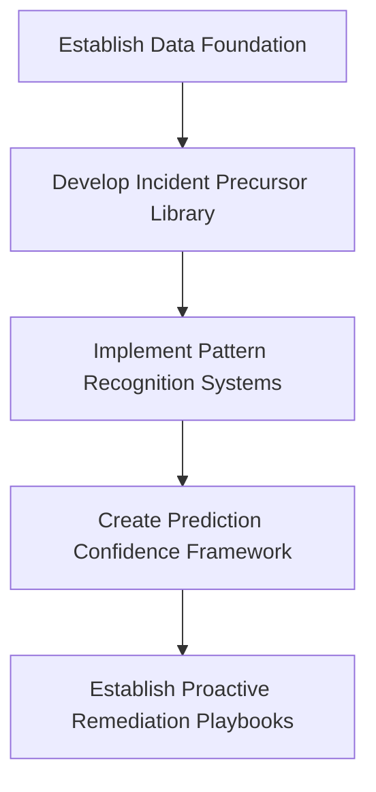

#### Step 1: Establish Data Foundation

- Implement comprehensive data collection and retention for reliability metrics.
- Configure monitoring systems to capture and store at least 90 days of detailed operational data (application metrics, infrastructure telemetry, service performance, error rates, resource utilization).
- Ensure this historical data is accessible for machine learning systems with appropriate granularity for pattern analysis.

#### Step 2: Develop Incident Precursor Library

- Create a structured catalog of patterns that historically preceded incidents.
- Analyze at least 12 months of major incidents, systematically documenting subtle changes and patterns that appeared before customer impact.
- Use this library to train both engineering teams and machine learning systems on recognizing early warning signs.

#### Step 3: Implement Pattern Recognition Systems

- Deploy machine learning capabilities that identify emerging reliability threats.
- Start with supervised learning models trained on historical incident data.
- Progressively implement unsupervised anomaly detection systems to identify novel patterns not seen in historical incidents.
- Configure these systems to generate predictive alerts when concerning patterns emerge.

#### Step 4: Create Prediction Confidence Framework

- Develop a structured approach for acting on predictions based on confidence levels.
- Establish clear guidelines tied to prediction confidence thresholds:
  - **90%+ confidence**: Triggers automatic mitigation.
  - **70-90% confidence**: Initiates investigation with prepared mitigation options.
  - **50-70% confidence**: Warrants increased monitoring without immediate intervention.

#### Step 5: Establish Proactive Remediation Playbooks

- Develop standard response procedures for addressing predicted issues before customer impact.
- Create specific playbooks for common predicted failure patterns, including:
  - Pre-approved mitigation actions.
  - Required approval workflows for different intervention types.
  - Clear rollback procedures if preventive actions create unexpected consequences.
