# Chapter 8: Error Budgets - The Currency of Reliability

## Chapter Overview

Let’s drop the fantasy that you can buy both a Ferrari and an armored tank with a bicycle budget. "Error Budgets: The Currency of Reliability" finally drags banking technology out of the dark ages of “perfect or bust” and into the modern, cutthroat world where reliability is a business lever, not a holy relic. If you think perfection is the gold standard, prepare to watch your innovation pipeline rust shut and your best engineers bail for competitors with fewer meetings and more sense. This chapter is a masterclass in weaponizing error budgets—turning reliability into a calculable, spendable, and, yes, occasionally burnable asset. We’ll expose the real trade-offs, the process deadweight, and the financial self-harm that comes from worshipping uptime at the altar of fear and inertia. Welcome to the real economics of SRE, where every nine you chase has a price—and sometimes, mediocrity is the strategic choice.

______________________________________________________________________

## Learning Objectives

- **Analyze** the "Reliability Paradox" and its consequences for banking tech strategy.
- **Translate** SLOs into concrete, time-based error budgets (and finally put those percentages to work).
- **Apply** error budget mechanics to guide incident response, maintenance, and change management with ruthless clarity.
- **Implement** error budget policies that actually trigger consequences—no more toothless metrics.
- **Attribute** error budget consumption to systems, humans, and decisions—so you fix the cause, not just the symptoms.
- **Forecast** error budget trends to predict and avoid self-inflicted disasters, instead of just picking up the pieces.
- **Quantify** the full economic impact of reliability, connecting uptime, innovation, velocity, and talent to cold, hard business outcomes.

______________________________________________________________________

## Key Takeaways

- Perfect reliability is a myth—and an expensive one. Every extra nine costs you a limb and delivers little but bragging rights.
- Error budgets are the currency of risk. Spend them strategically, or watch your business bleed out waiting for perfect.
- SLO percentages are useless until you translate them into "minutes we can afford to suck." If your team debates 99.9% like it’s a philosophy class, you’ve already lost.
- Without consequences for burning the budget, you’re just collecting metrics for your next regulatory slapdown.
- Budget attribution is how you stop blaming “the system” and start fixing the real problem: usually process shortcuts and bad decisions, not gremlins in the racks.
- Forecasting isn’t optional. If you only manage reliability reactively, your next outage will arrive right on schedule—with your best features stuck in limbo.
- Reliability isn’t a cost center—it’s a competitive weapon. Ignore its economics and watch your transformation dreams die in a swamp of rework, churn, and missed targets.
- If you’re still making reliability decisions based on gut, tradition, or who yells loudest in meetings, congratulations: you’re running a museum, not a bank.

Now go spend your error budget like a boss, not a bureaucrat.

______________________________________________________________________

## Panel 1: The Reliability Paradox - Perfect Is the Enemy of Good

### Scene Description

A tense executive meeting at a major bank. On one side of the conference table, the head of digital banking argues passionately for accelerating feature releases to compete with fintech challengers. On the other side, the CIO emphasizes the risks of moving too quickly, pointing to a recent mobile banking outage that affected thousands of customers. Between them stands Sofia, presenting a slide titled "The Reliability Paradox."

The slide shows two diverging lines:

```
Reliability (%) 
|
|                                Customer-Perceived Value
|                                ─────────────────────────
|                         _______/                               
|                        /
|                       /  
|                      /   
|                     /    
|                    /     ┌───────────────────────────────┐
|                   /      │ Sweet Spot: Balancing         │
|                  /       │ Innovation and Stability      │
|                 /        └───────────────────────────────┘
|                /  
|          Cost and Time Required
|         ─────────────────────────────
|        /
|_______/____________________________________________________
         90%           95%          99%      99.9%      100%
```

As reliability approaches 100%, the cost and time required to achieve further improvements increase exponentially, while customer-perceived value plateaus. Sofia highlights the "sweet spot" on the graph, emphasizing that aiming for perfect reliability can harm the bank's competitive position. Around the room, executives look intrigued as Sofia introduces the concept of "acceptable imperfection" as the key to balancing innovation and stability.

### Teaching Narrative

Banking technology faces a fundamental tension: the dual mandate to innovate rapidly while maintaining rock-solid reliability. This creates the Reliability Paradox—the counterintuitive truth that pursuing perfect reliability not only costs exponentially more but can actually reduce overall business success by stifling innovation.

Three critical insights underpin this paradox:

1. **Diminishing Returns**: As reliability approaches 100%, each incremental improvement requires significantly more investment while delivering less customer-perceptible value. The difference between 99.9% and 99.99% reliability costs substantially more but may not meaningfully improve customer satisfaction.

2. **Innovation-Stability Tradeoff**: Engineering resources are finite. Every hour spent on reliability hardening is an hour not spent on new capabilities. In competitive banking markets, falling behind on innovation can be as damaging as occasional reliability issues.

3. **Risk Avoidance vs. Risk Management**: Traditional banking approaches often focus on eliminating risk entirely, but modern digital delivery requires managing acceptable levels of risk rather than attempting to eliminate it completely.

This paradox creates the need for a framework that explicitly acknowledges and quantifies acceptable imperfection—a way to say, "This service doesn't need to be perfect, it needs to be reliable enough." Error budgets provide this framework by transforming reliability from a binary state ("is it reliable?") to a manageable resource ("how much unreliability can we afford?").

For banking institutions navigating digital transformation, this represents a profound shift in thinking: perfect reliability is not only practically unattainable but often undesirable from a business perspective when considering the full competitive landscape.

### Common Example of the Problem

A major retail bank faced increasing competitive pressure from digital-first challengers offering innovative mobile features. In response, the bank's executive team established a digital transformation initiative with two primary goals: accelerate innovation and maintain exceptional reliability.

These goals quickly came into conflict. The bank's traditional approach to reliability enforced extraordinary precautions before any production change. New features and updates required:

- Extensive pre-production testing across multiple environments
- Full-scale replica testing with production-equivalent load
- Formal Change Advisory Board approval with multiple management sign-offs
- Change implementation only during weekend maintenance windows
- Extensive post-change verification and monitoring

While these protections had historically maintained high reliability, they created significant problems. The table below summarizes these challenges and their impacts:

| **Problem** | **Description** | **Impact** |
| --------------------------------------- | ---------------------------------------------------------------------- | --------------------------------------------------------------------------- |
| **Long feature development cycles** | Development stretched to 6-9 months compared to competitors' 4-6 weeks | Lost market share as competitors released features faster |
| **Delayed security patch deployment** | Critical patches required weeks to deploy due to process overhead | Increased vulnerability window, risking customer trust |
| **High process overhead for engineers** | 40% of engineering capacity spent on change management steps | Reduced time for innovation and demoralized teams |
| **Slow response to customer requests** | Customer-requested features significantly delayed | Frustrated customers moved to competitors offering better, faster solutions |
| **Talent attrition** | Engineers left for competitors with more agile processes | Loss of expertise and increased hiring costs |

When the Digital Banking Director proposed streamlining these processes to accelerate innovation, the Risk Committee strongly objected, pointing to the bank's 99.98% historical availability as evidence the current approach worked perfectly. The CIO insisted "banking is different—customers expect perfect reliability," while the Head of Digital countered that "perfect systems that don't meet customer needs will create perfectly reliable obsolescence."

The standoff continued until a market analysis revealed the bank had fallen to 7th place in mobile banking capabilities despite having the 2nd highest reliability. Customer surveys showed 23% of clients had opened accounts with digital competitors specifically for mobile features unavailable at their primary bank. The reliability-at-all-costs approach was actually damaging the bank's competitive position despite seemingly "perfect" technical metrics.

### SRE Best Practice: Evidence-Based Investigation

Experienced SREs apply these evidence-based approaches to manage the reliability paradox. The following checklist provides a quick reference for practitioners looking to implement these methods:

#### Checklist: Evidence-Based Investigation for Managing Reliability

1. **Customer Perception Analysis**

   - Conduct systematic research on customer satisfaction relative to reliability levels.
   - Use controlled studies or surveys to identify the threshold where further reliability gains are imperceptible to users.
   - Example: Verify whether customers notice differences between 99.9% and 99.99% reliability during normal usage.

2. **Reliability Investment ROI Calculation**

   - Quantify the cost of incremental improvements versus the expected benefit.
   - Include financial analysis of downtime costs, infrastructure, and engineering efforts.
   - Example: Calculate if the investment to move from 99.9% to 99.99% availability justifies the associated cost.

3. **Innovation Opportunity Cost Modeling**

   - Develop models to assess the revenue impact of delayed innovation.
   - Factor in missed customer adoption and competitive positioning.
   - Example: Estimate the financial loss from postponing a new feature like mobile check deposit.

4. **Reliability-Innovation Balance Benchmarking**

   - Assess industry and competitor benchmarks for balancing reliability and innovation.
   - Identify the "good enough" reliability targets that enable faster development cycles.
   - Example: Compare your reliability targets (e.g., 99.9%-99.95%) with top-performing peers to ensure competitiveness.

5. **Controlled Change Acceleration Experiments**

   - Pilot faster deployment processes while monitoring reliability metrics.
   - Focus on lower-risk changes to identify unnecessary controls that add delay without reducing risk.
   - Example: Conduct a pilot where streamlined processes reduce delivery time by over 50% without impacting reliability targets.

By following this checklist, SREs can systematically evaluate trade-offs and make data-driven decisions to balance innovation and reliability effectively.

### Banking Impact

The reliability perfectionism mindset creates significant business consequences in banking environments:

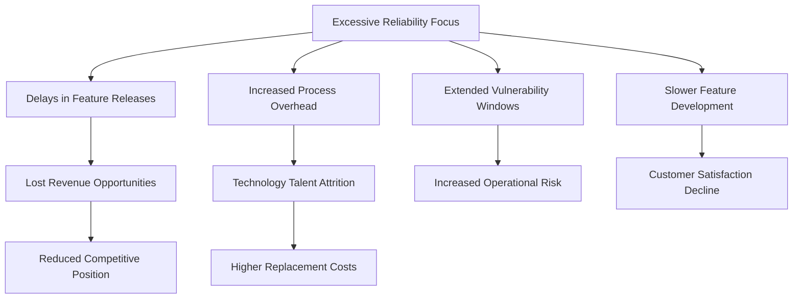

1. **Competitive Disadvantage**: Excessive reliability focus directly impacts competitive position. Market analysis showed the bank had lost 4.3% market share over 18 months specifically to competitors with more advanced digital features despite their slightly lower reliability.

2. **Revenue Opportunity Loss**: Delayed feature releases directly impact revenue streams. Financial analysis revealed approximately $7.5M in annual lost revenue from delayed digital payment capabilities, exceeding the estimated $2.1M in downtime-related costs that "perfect" reliability had prevented.

3. **Technology Talent Attrition**: Cumbersome processes drive away key engineering talent. Employee exit interviews showed reliability-related process overhead was cited as a primary reason for leaving by 37% of departing technology staff, creating $3.2M in annual replacement and knowledge transfer costs.

4. **Increased Operational Risk**: Paradoxically, excessive change controls often increase risk by extending vulnerability windows. Security analysis demonstrated that the bank's lengthy patch deployment process had left critical systems exposed to known vulnerabilities for an average of 17 days longer than peer institutions.

5. **Customer Satisfaction Decline**: Despite high technical reliability, overall satisfaction erodes when features lag. Customer experience surveys showed digital banking satisfaction had declined 7 points over 24 months despite maintained reliability, with feature availability cited as the primary dissatisfaction driver.

### Implementation Guidance

To effectively address the reliability paradox in your banking environment, follow these five key steps:

#### 1. Establish Tiered Reliability Targets

- Define differentiated reliability objectives based on service criticality (e.g., critical payment services at 99.95%, core banking functions at 99.9%, enhanced features at 99.5%).
- Document these targets with business justification and secure executive approval.
- Use a structured framework to ensure consistency and clarity across all service tiers.

#### 2. Implement Value-Driven Reliability Investment

- Create a formal methodology to evaluate reliability investments, balancing costs (e.g., engineering effort, infrastructure, operational complexity) against benefits (e.g., reduced outages, customer retention, regulatory compliance).
- Develop a standardized assessment template to guide reliability-related decision-making.
- Prioritize investments based on measurable customer impact.

#### 3. Develop Streamlined Change Processes

- Implement tiered deployment pathways tailored to the risk level of changes:
  - High-risk changes (e.g., affecting critical payment paths) should follow rigorous controls.
  - Low-risk changes (e.g., non-critical features) can use automated testing and streamlined deployment processes.
- Avoid one-size-fits-all change controls to maximize both efficiency and safety.

#### 4. Create Innovation-Reliability Dashboards

- Build balanced dashboards that highlight both reliability metrics and innovation velocity.
- Include key indicators such as uptime performance, feature delivery rates, competitive positioning, and customer satisfaction.
- Use these dashboards to provide executives with a holistic view of digital banking health.

#### 5. Establish Acceptable Impact Frameworks

- Define explicit error budget policies that quantify acceptable levels of unreliability for each service.
- Clearly outline what actions will be taken when error budgets are exhausted.
- Ensure reliability and innovation trade-offs are managed as an ongoing operational practice rather than ad-hoc decisions.

______________________________________________________________________

### Practical Checklist: Applying the Reliability Paradox Framework

Use this checklist to ensure effective implementation of the above steps:

- [ ] **Reliability Targets**: Have you defined tiered reliability objectives with executive approval?
- [ ] **Investment Assessment**: Is there a structured methodology to evaluate reliability investments based on cost vs. benefit?
- [ ] **Change Processes**: Are deployment pathways customized by risk level to streamline efficiency while maintaining safety?
- [ ] **Executive Dashboards**: Do you have balanced reporting that tracks both reliability and innovation progress?
- [ ] **Error Budgets**: Have you established error budget policies that quantify acceptable unreliability and guide operational decisions?

## Panel 2: Budget Mechanics - Translating SLOs into Allowable Downtime

### Scene Description

An engineering workshop where Raj demonstrates error budget mechanics on a whiteboard. He starts by writing the fundamental formula:

```
Error Budget = (1 - SLO target) × Service Time
```

Using the example of their payment processing service with a 99.9% SLO over 30 days, Raj calculates the monthly error budget step-by-step:

```
1. SLO Target: 99.9% = 0.999
2. Error Rate: 1 - 0.999 = 0.001
3. Service Time: 30 days × 24 hours × 60 minutes = 43,200 minutes
4. Error Budget: 0.001 × 43,200 minutes = 43.2 minutes
```

Below the formula, Raj sketches a flow diagram to illustrate the process:

```
[SLO Target] --> (1 - SLO Target) --> [Error Rate]
                  [Error Rate] × [Service Time] --> [Error Budget]
```

On a digital dashboard, Raj highlights their current consumption metrics: 12 minutes of downtime used this month, leaving 31.2 minutes remaining. The team discusses strategies to manage this remaining budget effectively.

Team members practice similar calculations for other services and time windows. One engineer demonstrates a custom tool that automates error budget calculations for daily, weekly, and monthly windows. Another explains how their system accounts for partial degradations, consuming fractional error budgets rather than counting full outages. For example:

- A 50% degradation lasting 10 minutes consumes 5 minutes of the budget.

Finally, the team experiments with a "budget impact calculator" to model hypothetical scenarios. They input potential incidents or deployment plans to predict how these changes might affect the remaining error budget. This hands-on session helps the team solidify their understanding of error budget mechanics.

### Teaching Narrative

Error budgets transform abstract SLO percentages into concrete operational terms: minutes and seconds of permitted unreliability. This translation creates a practical resource that teams can measure, track, and—most importantly—spend strategically.

The fundamental error budget calculation is straightforward:

Error Budget = (1 - SLO target) × Service Time

For example, a payment service with a 99.9% availability SLO measured over 30 days has an error budget of:
0.001 × (30 days × 24 hours × 60 minutes) = 43.2 minutes

This budget represents the maximum acceptable downtime or degradation for that service over the measurement period. The calculation works similarly for other SLI types like latency or success rate—the error budget represents the permitted quantity of "bad events" within the measurement window.

To further clarify, the table below provides examples of common SLOs, their corresponding error budgets, and the allowed downtime across different time windows:

| **Service SLO** | **Error Budget (%)** | **Daily Downtime (minutes)** | **Weekly Downtime (minutes)** | **Monthly Downtime (minutes)** |
| --------------- | -------------------- | ---------------------------- | ----------------------------- | ------------------------------ |
| 99.9% | 0.1% | 1.44 | 10.08 | 43.2 |
| 99.95% | 0.05% | 0.72 | 5.04 | 21.6 |
| 99.99% | 0.01% | 0.144 | 1.008 | 4.32 |
| 99.999% | 0.001% | 0.0144 | 0.1008 | 0.432 |

Several key principles govern error budget mechanics:

1. **Consumption vs. Violation**: Teams consume error budgets gradually with each failure or degradation, only violating SLOs when the budget is fully depleted.

2. **Degradation Accounting**: Partial service degradations consume proportional fractions of the budget rather than counting as complete outages.

3. **User Impact Weighting**: Budget consumption can be weighted by user impact, with high-traffic periods or critical user segments counting more heavily.

4. **Multiple Time Windows**: Budgets typically operate over several time windows simultaneously (daily, weekly, monthly) to catch both rapid and gradual consumption.

For banking systems with varying criticality levels, error budgets provide precision in reliability management. A core banking platform might have a tiny budget of just minutes per month, while a less critical reporting service has a more generous allowance. This quantification enables appropriate investment in reliability based on business importance rather than treating all services identically.

### Common Example of the Problem

The corporate banking division of a mid-sized financial institution struggled with effectively implementing their newly established SLOs. They had diligently defined SLOs for key services: 99.95% availability for payment processing, 99.9% for account management, and 99.5% for reporting systems. However, these percentage targets remained largely abstract concepts rather than operational tools.

This abstraction created several practical challenges:

- **Incident Response Subjectivity**: During incident response, teams debated whether short outages were "acceptable" without any quantitative framework. A 15-minute authentication service disruption triggered heated discussion about whether the incident was "serious," with operations arguing it violated their reliability standards while engineering insisted it was within normal parameters.

- **Unclear Maintenance Planning**: Scheduling database updates became difficult without a concrete assessment of how proposed 30-minute maintenance windows mapped to SLO targets. Some team members argued they couldn't afford any planned downtime, while others assumed they had "plenty of room" in their SLO.

- **Ambiguous Reporting to Leadership**: Reliability status reports presented to the CIO were almost meaningless. Teams reported SLO compliance in percentages (e.g., 99.87% availability, 99.92% latency compliance) without context about whether these results were concerning or within acceptable limits, leaving leadership unable to make informed decisions.

To help teams identify and address these common problems, use the following checklist:

#### **Error Budget Implementation Problem Checklist**

- [ ] Have we translated SLO percentages into specific error budgets (e.g., minutes of allowable downtime)?
- [ ] Do we have a shared understanding of how much downtime is acceptable during incidents?
- [ ] Are we accounting for partial service degradations as fractional budget consumption?
- [ ] Do we have a clear process for planning maintenance within error budget constraints?
- [ ] Is our reliability reporting meaningful, providing actionable insights rather than just percentages?
- [ ] Are error budgets tied to user impact, prioritizing critical periods or high-value user segments?

Without translating their SLOs into concrete error budgets with clear operational meaning, the team had actually increased ambiguity rather than creating the clarity they sought when implementing SLOs. By addressing the questions in the checklist above, teams can avoid these pitfalls and make SLOs a practical tool for decision-making rather than an abstract metric.

### SRE Best Practice: Evidence-Based Investigation

Experienced SREs implement effective error budget mechanics using these evidence-based approaches:

1. **Time-Based Budget Translation**: Convert percentage-based SLOs into explicit time allowances for different measurement windows. For the corporate banking platform, calculations showed their 99.95% availability SLO translated to 21.6 minutes/month, 5 minutes/week, and 43 seconds/day of allowed downtime, providing concrete parameters for operational discussions.

2. **Service Criticality Calibration**: Analyze business impact to validate appropriate budget sizes. Detailed assessment of transaction volumes and revenue impact revealed that payment processing warranted its strict 99.95% SLO (21.6 minutes/month), while reporting could reasonably operate with a more generous 99.5% SLO (3.6 hours/month) based on actual business usage patterns.

3. **Degradation Impact Analysis**: Establish frameworks for measuring partial degradations. Historical incident analysis demonstrated that typical performance degradations affected 25-40% of users/transactions, leading to a methodology where degradations consumed proportional fractions of error budgets rather than counting as complete outages.

4. **User Impact Weighting Modeling**: Develop impact weighting based on usage patterns and business value. Traffic pattern analysis showed that corporate banking usage concentrated during business hours (8am-6pm) with 85% of transaction volume, leading to time-based weighting where incidents during peak hours consumed 3x more budget than off-hour incidents to accurately reflect business impact.

5. **Budget Consumption Profiling**: Analyze historical incidents to establish typical consumption patterns. Review of 18 months of incident data revealed that normal operations typically consumed 50-70% of monthly error budgets through small incidents and degradations, establishing a baseline for determining when consumption rates indicated abnormal reliability challenges.

#### Relationships Between Key Concepts in Evidence-Based Investigation

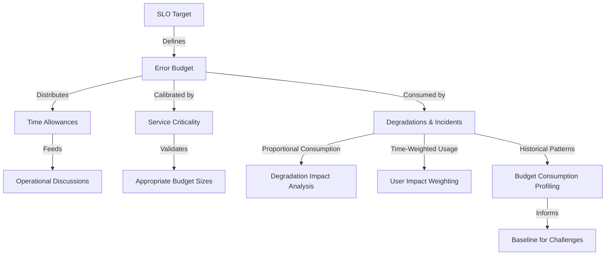

This diagram illustrates how SLO targets define error budgets, which are translated into time allowances and calibrated based on service criticality. Degradations and incidents consume the budget proportionally or with time-based weighting, while historical analysis helps refine baselines for identifying reliability challenges. Together, these elements create the foundation for evidence-based decisions.

### Banking Impact

Abstract reliability targets without error budget translation create significant business consequences in banking environments. The following flowchart illustrates how the lack of concrete error budget implementation can propagate operational and business challenges:

```
[Abstract Reliability Targets]
          ↓
[Lack of Error Budget Translation]
          ↓
-----------------------------------------
|                                       |
|  Inconsistent Incident Response       |
|  → Subjective severity assessment     |
|  → Uneven customer experience         |
-----------------------------------------
          ↓
-----------------------------------------
|                                       |
|  Maintenance Planning Challenges      |
|  → Unclear downtime affordability     |
|  → Delayed security patching          |
|  → Extended vulnerability windows     |
-----------------------------------------
          ↓
-----------------------------------------
|                                       |
|  Operational Ambiguity                |
|  → Uncertainty in performance status  |
|  → Overreaction or missed warning     |
-----------------------------------------
          ↓
-----------------------------------------
|                                       |
|  Risk Management Failures             |
|  → Subjective change risk assessment  |
|  → Bottlenecks in deployments         |
-----------------------------------------
          ↓
-----------------------------------------
|                                       |
|  Misaligned Executive Communication   |
|  → Inadequate context for decisions   |
|  → Leadership confusion on priorities |
-----------------------------------------
```

1. **Inconsistent Incident Response**: Without concrete downtime allowances, incident severity assessment becomes subjective. Incident response analysis showed that similar 10-minute payment outages received dramatically different response levels based on which team lead was on call rather than objective criteria, creating inconsistent customer experience.

2. **Maintenance Planning Challenges**: Abstract targets complicate necessary maintenance scheduling. The corporate banking team delayed critical security patches for an average of 7 additional days due to inability to determine whether maintenance windows were "affordable" within their reliability targets, creating extended security vulnerability windows.

3. **Operational Ambiguity**: Percentage-based targets alone don't indicate whether current performance is adequate. When operating at 99.87% availability against a 99.9% target, teams were unable to determine if they should be initiating emergency reliability improvements or continuing normal operations, leading to either unnecessary work or missed warning signs.

4. **Risk Management Failures**: Without quantified error budgets, change risk assessment lacks context. Analysis of change management decisions revealed that similar-risk changes were treated differently depending on subjective reliability perceptions rather than actual available error budget, creating artificial deployment bottlenecks for some teams.

5. **Misaligned Executive Communication**: Abstract percentages fail to convey reliability status effectively to leadership. Executive interviews revealed that SLO percentage reports provided insufficient context for decision-making, with leaders unable to determine whether reported 99.92% availability represented good performance or emerging problems requiring intervention.

### Implementation Guidance

To implement effective error budget mechanics in your banking environment:

1. **Develop Multi-Window Budget Calculations**: Create standardized calculations that translate SLOs into explicit time allowances across different timeframes. Implement consistent formulas that automatically convert SLO percentages into minutes of allowed downtime for daily, weekly, and monthly windows, making these calculations available through dashboards accessible to all teams. Below is a Python-based pseudocode snippet for automating these calculations:

   ```python
   def calculate_error_budget(slo_target, time_window_minutes):
       error_budget = (1 - slo_target) * time_window_minutes
       return error_budget

   # Example usage:
   time_windows = {"daily": 1440, "weekly": 10080, "monthly": 43200}  # in minutes
   slo_target = 0.999  # SLO target for 99.9% availability

   error_budgets = {window: calculate_error_budget(slo_target, minutes) 
                    for window, minutes in time_windows.items()}

   print(error_budgets)
   # Output: {'daily': 1.44, 'weekly': 10.08, 'monthly': 43.2}
   ```

2. **Implement Degradation Accounting Framework**: Establish clear methods for measuring partial service degradations. Create a documented methodology where degradations consume proportional budget based on impact percentage, using formulas like:\
   `Budget consumed = Outage duration × (Affected percentage ÷ 100)`. Below is pseudocode for calculating degradation impact:

   ```python
   def calculate_degradation_impact(outage_duration, affected_percentage):
       impact = outage_duration * (affected_percentage / 100)
       return impact

   # Example usage:
   outage_duration = 30  # minutes
   affected_percentage = 50  # 50% degradation

   budget_consumed = calculate_degradation_impact(outage_duration, affected_percentage)
   print(budget_consumed)
   # Output: 15.0
   ```

3. **Create Time-Based Impact Weighting**: Develop systems that weight budget consumption based on business impact. Implement time-based weighting where incidents during critical business hours (e.g., trading windows, payment processing peaks, month-end periods) consume proportionally more budget than off-hour incidents. Below is a representation of weighted consumption:

   ```python
   def calculate_weighted_impact(outage_duration, weight_factor):
       weighted_impact = outage_duration * weight_factor
       return weighted_impact

   # Example usage:
   outage_duration = 30  # minutes
   weight_factor = 2.0  # Critical business hour multiplier

   weighted_budget_consumed = calculate_weighted_impact(outage_duration, weight_factor)
   print(weighted_budget_consumed)
   # Output: 60.0
   ```

4. **Establish Budget Visualization Tools**: Implement dashboards that clearly display current budget status and consumption trends. Create intuitive visualizations showing total budget allocation, current consumption, remaining budget, consumption rate, and projected depletion date if current trends continue. Use tools like `matplotlib` or `D3.js` to generate charts. For example:

   ```plaintext
   -------------------------------
   | Time Window | Remaining Budget |
   -------------------------------
   | Daily       | 1.2 mins         |
   | Weekly      | 8.5 mins         |
   | Monthly     | 30 mins          |
   -------------------------------
   ```

5. **Develop Budget Impact Simulation Capabilities**: Create tools that model how potential events affect error budgets. Implement "what-if" calculators that allow teams to estimate budget impact of planned changes, potential incidents, or maintenance windows, enabling data-driven discussions about reliability trade-offs. Below is pseudocode for a simulation calculator:

   ```python
   def simulate_budget_impact(current_budget, planned_outage_duration, weight_factor=1.0):
       simulated_impact = planned_outage_duration * weight_factor
       remaining_budget = current_budget - simulated_impact
       return remaining_budget

   # Example usage:
   current_budget = 43.2  # minutes (monthly budget)
   planned_outage_duration = 20  # minutes
   weight_factor = 1.5  # e.g., during peak hours

   remaining_budget = simulate_budget_impact(current_budget, planned_outage_duration, weight_factor)
   print(remaining_budget)
   # Output: 13.2
   ```

## Panel 3: The Budget as Currency - Spending Reliability Strategically

### Scene Description

A digital banking product team's planning session is underway. A large monitor displays the team's core services alongside their corresponding error budget statuses:

| Service | Error Budget Remaining | Current Focus |
| ------------------ | ---------------------- | ----------------------------------------------------------------------- |
| Account Management | 70% | Approve aggressive innovation, including a major UX overhaul. |
| Payments | 45% | Balance between feature development and reliability improvements. |
| Authentication | 15% | Prioritize reliability improvements and postpone risky feature changes. |

The team is using these error budget statuses as a key decision factor for planning the upcoming sprint. For the authentication service, with only 15% of the budget remaining, they allocate resources to reliability improvements and defer any risky feature changes. For account management, with 70% of the budget left, they take a more aggressive approach, approving a major UX overhaul.

Product manager Maya refers to these budgets as their "innovation currency," explaining that teams earn the ability to take risks by maintaining reliable services. The roadmap displayed on the monitor shows future features explicitly sequenced based on a combination of business priorities and the availability of error budgets, reinforcing the strategic alignment between reliability and innovation.

### Teaching Narrative

Error budgets function as a reliability currency that can be strategically spent to achieve business goals. This framing transforms reliability from a technical constraint into a business resource, creating a powerful mechanism for aligning technology decisions with customer and business needs.

As with financial currencies, error budgets enable several critical business practices:

1. **Strategic Allocation**: Deliberately directing reliability "spending" toward highest-value activities, investing unreliability where it delivers maximum business return

2. **Risk Management**: Making informed decisions about acceptable risk levels for different activities based on potential rewards

3. **Trade-off Transparency**: Creating clear visibility into reliability compromises, moving from implicit to explicit decision-making

4. **Investment Balancing**: Dynamically adjusting the balance between feature development and reliability improvement based on current budget status

In practice, error budgets facilitate several key decision patterns:

- When budgets are healthy, teams can accelerate feature delivery, take calculated deployment risks, conduct experiments, or implement major architectural changes
- When budgets are depleted, teams prioritize reliability improvements, implement deployment freezes, postpone risky changes, or add extra safeguards to essential changes

For banking technology teams, this currency model provides a framework for the complex decisions they face daily: Should we deploy this new mobile feature before thorough performance testing? Can we implement this architectural change during business hours? Is it worth extending maintenance windows to improve backup systems?

Instead of making these decisions based on intuition or politics, teams use error budgets to make data-driven choices that appropriately balance innovation and reliability based on actual customer impact.

### Common Example of the Problem

The retail digital banking team at a regional bank struggled with balancing their dual mandates of innovation and reliability. Without an explicit framework for managing this tension, they fell into a problematic cycle. The following timeline illustrates the reactive cycle and its consequences:

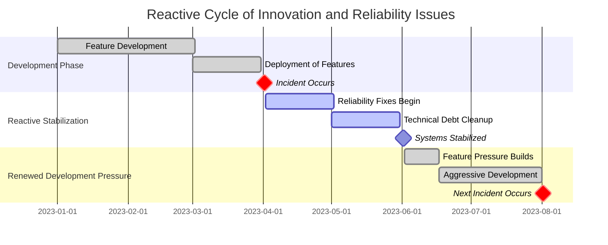

This pattern created several serious problems:

- **Unpredictable Planning**: Roadmaps were constantly disrupted by reactive reliability pauses, making it difficult to plan and deliver features consistently.
- **Engineer Burnout**: The constant context-switching between feature work and emergency stabilization tasks led to morale issues within the engineering team.
- **Customer Impact**: Customers experienced an inconsistent product experience, with bursts of innovation followed by long periods of stagnation during stabilization phases.
- **Risk Mismanagement**: Changes were deployed without considering the system's current risk profile, leading to risky decisions during already unstable periods.
- **Stakeholder Frustration**: Business stakeholders grew increasingly frustrated as promised features were delayed or deprioritized without clear, objective reasoning.

The fundamental issue was the absence of an objective framework for determining when to focus on features versus reliability. Decisions oscillated based on recent incidents, executive perception, and organizational influence rather than a data-driven approach.

This cycle came to a head when the team faced a critical decision: Should they launch a highly anticipated mobile wallet feature despite recent stability issues in the authentication system? Business leadership pushed for the launch to remain competitive, while operations advocated for a delay to avoid further incidents. The lack of a structured decision-making framework turned the process into a political standoff, delaying resolution and further eroding trust between stakeholders.

### SRE Best Practice: Evidence-Based Investigation

Experienced SREs implement budget-based decision-making using these evidence-based approaches. The following checklist summarizes key actions and insights for practical application:

| **Approach** | **Description** | **Key Actions** |
| ---------------------------------- | -------------------------------------------------------------------------------------------- | --------------------------------------------------------------------------------------------------------------------------------------------------------------------- |
| **Decision Threshold Analysis** | Establish data-driven thresholds for operational decisions based on historical patterns. | - Analyze historical incidents and reliability trends.<br>- Define thresholds: >50% (normal development), 25-50% (safeguards), \<25% (focus on reliability). |
| **Risk-Value Mapping** | Use structured methods to assess and compare risk versus value for proposed changes. | - Develop a risk scoring matrix with factors like scope, criticality, test coverage, and complexity.<br>- Quantify and balance risk against potential business value. |
| **Change Success Correlation** | Analyze how budget status correlates with deployment success rates to guide risk decisions. | - Review historical data to identify failure patterns.<br>- Adjust processes based on correlation (e.g., 3.2x higher failure rates below 30% budget). |
| **Budget Forecasting Model** | Build predictive models to estimate future error budget availability and support scheduling. | - Analyze consumption trends to create forecasting algorithms.<br>- Use predictions (e.g., 85% accuracy) to plan timing for higher-risk changes. |
| **Value Stream Impact Assessment** | Measure how budget-based decisions impact overall feature delivery and reliability outcomes. | - Compare performance metrics between budget-based and traditional teams.<br>- Track improvements in feature completion (+28%) and reliability (-47% incidents). |

#### Quick Reference Checklist:

1. Analyze historical data to define decision thresholds for different budget levels.
2. Develop a risk scoring matrix to objectively assess deployment risks.
3. Correlate error budget status with change success rates to inform risk tolerance.
4. Build forecasting models to predict future budget availability with high accuracy.
5. Measure value stream impacts to validate the effectiveness of budget-driven decisions.

By leveraging this structured approach, teams can make informed, evidence-based decisions that balance innovation and reliability, ensuring optimal outcomes for both technical operations and business goals.

### Banking Impact

The absence of strategic budget management creates significant business consequences in banking environments. Below is a summary of key impacts, backed by data, to illustrate the tangible outcomes of neglecting error budget practices.

| **Impact Area** | **Quantitative Data** | **Business Consequences** |
| --------------------------------- | ----------------------------------------------------------------------------- | ------------------------------------------------------------------------------------------------------------ |
| **Delivery Unpredictability** | 43% of committed feature deadlines missed due to unplanned reliability work | Undermines business confidence in technology delivery capability, creating misalignment with stakeholders. |
| **Competitive Response Delays** | Critical features delayed by an average of 7 weeks during reliability freezes | Directly impacts customer acquisition targets and weakens competitive positioning. |
| **Increased Operational Costs** | Emergency remediation costs 2.4x more than planned reliability improvements | Significantly increases total operational expenses, reducing overall profitability. |
| **Risk Management Failures** | 38% of major outages tied to avoidable changes during reactive cycles | Leads to preventable customer impact and erodes trust in the platform's reliability. |
| **Engineer Satisfaction Decline** | 23-point reduction in satisfaction during reactive cycles | Decreases talent retention, with "unpredictable priorities" and "constant context-switching" as key drivers. |

#### Cause-and-Effect Flow of Poor Budget Management

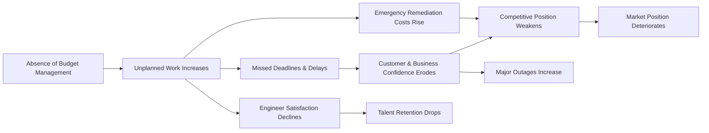

By introducing a structured, error-budget-driven approach, banking teams can mitigate these issues, enabling predictable delivery, reducing operational inefficiencies, and improving both employee satisfaction and customer trust.

### Implementation Guidance

To implement strategic error budget management in your banking environment, follow this actionable step-by-step guide:

#### Step-by-Step Checklist

1. **Establish Decision Threshold Framework**:

   - Define explicit thresholds linking error budget levels to specific actions:
     - **Above 50%**: Proceed with normal development and feature releases.
     - **25-50%**: Introduce enhanced testing, monitoring, and conservative risk-taking.
     - **Below 25%**: Prioritize reliability improvements; freeze risky changes.
     - **Below 10%**: Focus solely on emergency remediation.
   - Gain approval from both engineering and business leadership to ensure alignment.

2. **Implement Change Risk Assessment**:

   - Develop a standardized risk assessment template that evaluates:
     - Change scope and complexity.
     - Service criticality and potential customer impact.
     - Test coverage and rollback readiness.
     - Historical operational reliability for the service.
   - Assign a composite risk score and compare it against the current error budget status to guide deployment decisions.

3. **Create Deployment Scheduling Mechanisms**:

   - Integrate error budget status into release planning workflows:
     - High-risk changes are scheduled during periods of healthy error budgets.
     - Constrain or defer deployments when budgets are low.
   - Collaborate with product management to balance business priorities and reliability constraints.

4. **Develop Budget Management Dashboards**:

   - Design dashboards with clear visibility into:
     - Current error budget levels.
     - Operational implications for each budget range.
     - Guidance on allowable activities and necessary safeguards.
   - Ensure dashboards are accessible to both technical and non-technical stakeholders.

5. **Establish Executive Communication Framework**:

   - Create standardized communication templates to:
     - Explain how current error budget status affects delivery timelines.
     - Outline actions being taken to restore depleted budgets.
     - Highlight the long-term benefits of reliability investments for enabling sustainable innovation.
   - Use consistent language to bridge technical and business perspectives.

#### Flowchart Representation

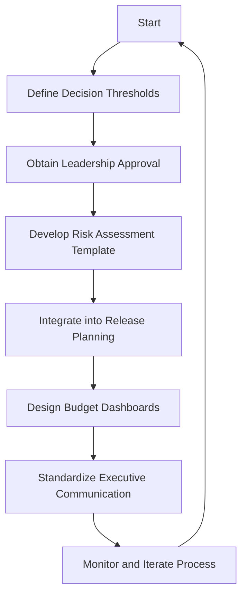

#### Notes for Success:

- Regularly review thresholds and templates to adapt to evolving service needs.
- Ensure all stakeholders are trained on the error budget framework to promote consistent application.
- Use retrospectives to evaluate the effectiveness of decisions made under the framework and identify areas for improvement.

## Panel 4: Budget Policies - Creating a Reliability Feedback Loop

### Scene Description

The scene unfolds during a governance meeting where technology and business leaders are formalizing their error budget policy. The room is equipped with collaborative tools, enhancing both strategic discussions and decision-making. A digital whiteboard displays a structured policy document presented by Sofia, divided into four clear sections:

- "Measurement"
- "Consumption Rules"
- "Breach Consequences"
- "Exception Process"

The policy outlines explicit actions triggered by budget depletion, such as feature freezes activating at 100% consumption, executive reviews at 150%, and formal incident reviews at 200%. For critical banking services, additional regulatory reporting requirements are emphasized to comply with industry obligations.

On the wall, a governance calendar visually maps the cadence of budget reviews for various service tiers, serving as a reference point for scheduling and accountability. Nearby, a "policy effectiveness" chart illustrates the transition from their previous informal approach—marked by recurring incidents—to the early successes of the formalized policy, evidenced by improved reliability trends.

Below is a conceptual visualization of the meeting setup:

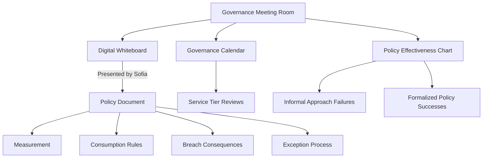

Team members actively debate the appropriate breach consequences for their wealth management platform, carefully balancing competitive pressures against reliability needs. The collaborative setup, combined with visual aids and structured policy sections, establishes a clear and actionable framework for driving reliability improvements.

### Teaching Narrative

Error budget policies transform error budgets from informational metrics into governance mechanisms with teeth. These policies establish the rules, consequences, and processes that create a meaningful reliability feedback loop across the organization.

A comprehensive error budget policy addresses four key areas:

1. **Measurement Framework**: Precisely how budgets are calculated, tracked, and reported, including tooling, responsible parties, and review cadence

2. **Consumption Rules**: Clear definitions of what events consume budget, how consumption is calculated, and any exclusions or special cases

3. **Breach Consequences**: Specific, predefined actions that trigger automatically when budgets are exhausted, creating real consequences for reliability failures

4. **Exception Process**: Formal mechanisms for requesting policy exceptions in extraordinary circumstances, ensuring appropriate oversight without creating unbreakable rules

The most critical element—breach consequences—typically follows a progressive severity model:

- At 100% consumption: Feature freezes activate, halting new deployments until reliability improves
- At 150% consumption: Executive reviews trigger, requiring leadership intervention
- At 200% consumption: Formal incident reviews mandate root cause analysis and systematic improvements

For banking institutions with regulatory obligations, these policies often include additional elements like regulatory notification thresholds, formal risk acceptance procedures, and documentation requirements for compliance purposes.

Effective policies balance several tensions:

- Strict enough to drive meaningful reliability improvements
- Flexible enough to accommodate business realities
- Simple enough to be easily understood
- Comprehensive enough to cover edge cases
- Enforceable through both technical and organizational mechanisms

By establishing these policies, organizations create the feedback loop essential for reliability engineering: unreliable services automatically receive more reliability investment, while reliable services earn the right to innovate more aggressively.

### Common Example of the Problem

A major investment bank implemented error budgets for their trading platforms but operated without formal policies governing how budgets would be used. This created several significant problems:

| **Key Issue** | **Description** | **Impact** |
| ------------------------------------------ | ------------------------------------------------------------------------------------------------------------------------------------------------------ | ------------------------------------------------------------------------------------------------------------------ |
| **Lack of Consequences** | No predefined actions for exceeding error budgets. Development teams treated budget exhaustion as an interesting metric rather than an action trigger. | Continuous deployment of new features despite reliability issues. |
| **Inconsistent Responses Across Teams** | Teams reacted differently to budget depletion. For example, the fixed income team restricted deployments, while the equities team continued as usual. | Created confusion about organizational expectations and resentment between teams. |
| **Broken Reliability Feedback Loop** | Budget depletion did not trigger mandated reliability work. Systems exceeding budgets repeatedly were not improved. | Worsened performance, increased incidents, and lack of reliability investment. |
| **Failure to Prioritize Reliability Work** | Root causes of incidents were identified but not addressed due to the absence of policy-driven consequences. | Led to a major outage with $2.4M in missed trading opportunities, regulatory scrutiny, and client dissatisfaction. |

### Case Study: Equities Trading Platform

Despite having error budgets, the equities trading platform consumed its entire monthly budget within the first two weeks for six consecutive months. Development teams continued deploying new features without interruption, further degrading reliability. In contrast, the fixed income platform team voluntarily paused deployments upon budget exhaustion, demonstrating the inconsistency caused by the lack of a formal policy.

This situation escalated into a crisis when a major trading outage occurred during peak market hours. Post-incident analysis revealed that the root causes had been identified in prior incidents but were never prioritized due to the absence of formal consequences. The outage resulted in approximately $2.4M in missed trading opportunities, increased regulatory scrutiny, and significant client dissatisfaction. This highlighted the critical need for a formalized error budget policy to establish clear rules, enforce consistency, and maintain the reliability feedback loop.

### SRE Best Practice: Evidence-Based Investigation

Experienced SREs implement effective budget policies using these evidence-based approaches, ensuring a systematic path from investigation to improved outcomes:

1. **Policy Effectiveness Benchmarking**: Compare reliability outcomes between teams with and without formal budget policies. Controlled comparison across trading platforms revealed that teams operating with formalized policies experienced 73% fewer major incidents and 47% faster mean-time-to-recovery than teams with budgets but no formal consequences.

2. **Consequence Threshold Optimization**: Analyze historical data to determine optimal intervention points. Statistical analysis of 24 months of reliability data showed that implementing restrictions at 100% budget consumption prevented cascading reliability degradation in 83% of cases, while delaying intervention until 200% consumption made recovery 3.2x more resource-intensive.

3. **Policy Compliance Analysis**: Measure how consistently policies are followed once established. Audit of policy implementation across 12 teams showed 94% compliance when policies had explicit executive sponsorship and formal integration with change management systems, compared to 36% compliance with informal guidelines.

4. **Exception Process Effectiveness**: Evaluate how exception mechanisms balance flexibility and control. Review of 35 policy exception requests showed that a formal process with explicit criteria and multi-level approval requirements prevented 87% of inappropriate exceptions while still accommodating legitimate business needs in urgent situations.

5. **Business Impact Assessment**: Quantify how policy implementation affects overall delivery capabilities. Before/after analysis showed that teams operating under formal budget policies delivered 22% more features annually despite occasional restriction periods, primarily due to reduced unplanned work and more stable planning cycles.

#### Evidence-Based Investigation Flowchart

Below is a flowchart illustrating how evidence-based practices drive improved outcomes:

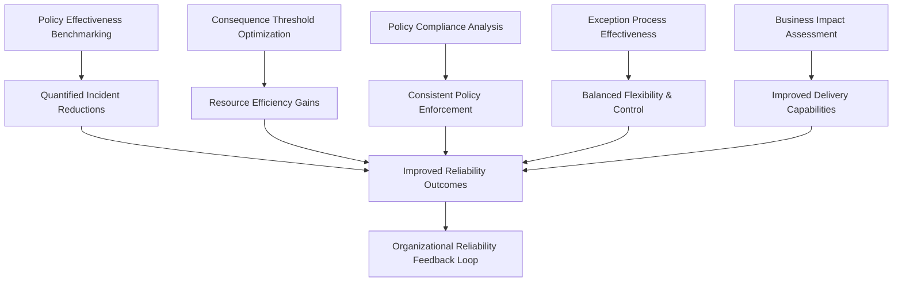

This flowchart demonstrates the relationships between evidence-based practices and their resulting benefits. Each investigation area feeds into a broader reliability feedback loop, ensuring continuous improvement and alignment with organizational goals.

### Banking Impact

The absence of formal error budget policies creates significant business consequences in banking environments. Below is a summary of the five key impacts:

- **Recurring Reliability Issues**: 68% of major outages involved components with known reliability issues that were previously identified but never prioritized for remediation.
- **Inconsistent Customer Experience**: Platforms without formal error budget policies exhibited 3.5x greater variability in reliability metrics, leading to unpredictable service quality and institutional client dissatisfaction.
- **Regulatory Compliance Risk**: Financial regulators flagged the lack of documented reliability policies as a control deficiency, requiring remediation and increased reporting obligations.
- **Increased Operational Overhead**: Platforms without policy-driven reliability cycles consumed 870 additional engineer-hours annually addressing recurring issues, representing a significant opportunity cost.
- **Damaged Trust Between Teams**: Teams operating without consistent budget adherence created "reliability free-riders," reducing collaboration scores by 28 points and undermining organizational cohesion.

#### Banking Impact Summary Flow (Text-Based Representation)

```
[Recurring Reliability Issues] --> [Known Problems Unaddressed] --> [Service Outages]
[Inconsistent Customer Experience] --> [Variability in Reliability] --> [Client Dissatisfaction]
[Regulatory Compliance Risk] --> [Control Deficiency] --> [Increased Reporting Obligations]
[Increased Operational Overhead] --> [870 Extra Engineer-Hours] --> [Opportunity Cost]
[Damaged Trust Between Teams] --> [Reliability Free-Riders] --> [Reduced Collaboration]
```

### Implementation Guidance

To implement effective error budget policies in your banking environment, follow these steps:

1. **Develop Tiered Policy Framework**:

   - Create a structured policy document with appropriate detail and governance.
   - Include key elements: budget calculation methodology, consumption rules, breach consequences, and exception processes.
   - Define progressive intervention levels with increasing severity as budget consumption exceeds 100%.
   - Obtain formal executive approval and schedule regular governance reviews.

2. **Implement Automated Enforcement Mechanisms**:

   - Configure systems to enforce policy without manual intervention.
   - Automate change management controls to:
     - Prevent non-emergency changes when budgets are exhausted.
     - Require additional approvals when budgets are constrained.
     - Notify stakeholders automatically when thresholds are crossed.

3. **Establish Policy Exception Process**:

   - Create a formal exception request template that includes:
     - Explicit justification and risk assessment.
     - Mitigation plans and required approvals.
   - Ensure the process accommodates emergencies while preventing routine circumvention.

4. **Create Policy Education Program**:

   - Develop training materials that explain:
     - Policy mechanics and rationale.
     - The balance between reliability and innovation.
     - How to operate effectively within the policy framework.
   - Deliver training to technical teams, product managers, and business stakeholders.

5. **Implement Compliance Reporting**:

   - Build dashboards to monitor and report on:
     - Policy compliance and exception frequency.
     - Reliability improvements following interventions.
     - Correlations between policy adherence and reliability outcomes.
   - Review metrics quarterly to assess effectiveness and refine as needed.

______________________________________________________________________

#### Checklist for Implementation

- [ ] **Policy Framework**: Draft and approve a detailed, tiered error budget policy addressing calculation, consumption, breaches, and exceptions.
- [ ] **Automation**: Set up automated mechanisms for policy enforcement and stakeholder notifications.
- [ ] **Exception Process**: Design and deploy a structured template for exception handling, balancing oversight with flexibility.
- [ ] **Education Program**: Train all relevant teams on the policy's purpose, mechanics, and operational guidelines.
- [ ] **Compliance Reporting**: Create dashboards and review metrics quarterly to measure and improve policy effectiveness.

## Panel 5: Budget Attribution - From System Failures to Human Decisions

### Scene Description

A post-incident review for a mobile banking outage. Rather than focusing solely on technical root causes, the team is conducting a detailed error budget attribution analysis. A comprehensive diagram on a digital whiteboard shows how the 45-minute outage consumed 104% of the daily error budget, with attribution divided between categories: "Deployment Issues" (35%), "Infrastructure Failures" (15%), "External Dependencies" (25%), "Operational Error" (10%), and "Unknown" (15%). For each category, they document specific events and decisions that consumed budget, connecting technical failures to human and process factors.

Below is a visual representation of the error budget attribution breakdown and its connections to specific categories:

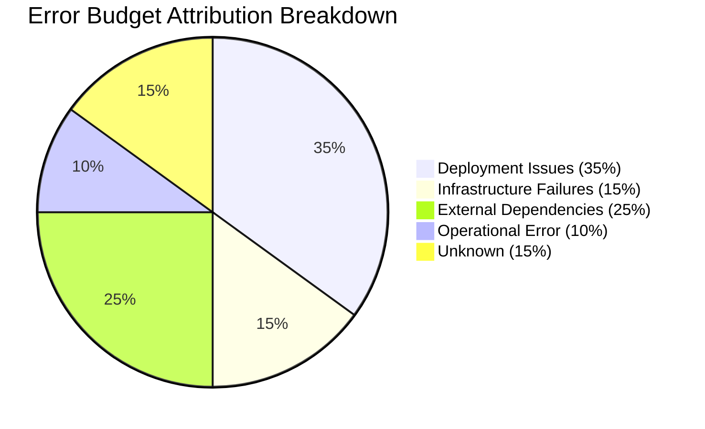

Raj facilitates as the team traces deployment issues to a specific decision to skip canary testing. On adjacent screens, historical attribution data shows patterns emerging over time:

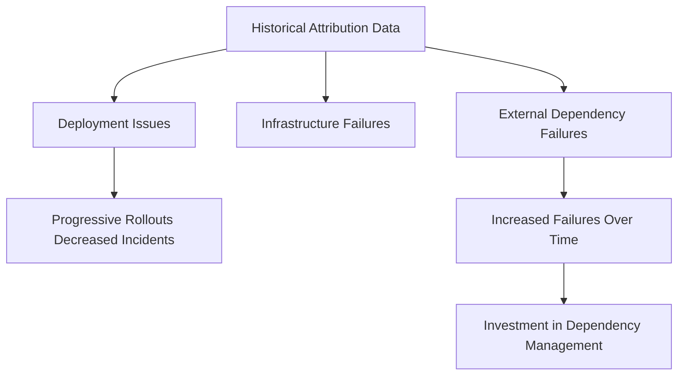

The team observes that deployment-related incidents have decreased since implementing progressive rollouts, while external dependency failures have increased. Leadership uses this data to direct investment toward integration testing and dependency management, ensuring reliability improvements are informed by clear, data-driven patterns.

### Teaching Narrative

Error budget attribution transforms incident analysis from a technical blame game into a systematic learning process. By categorizing and attributing budget consumption to specific causes, organizations identify patterns and focus improvement efforts where they'll have the greatest impact on overall reliability.

Effective budget attribution requires a structured classification approach that typically includes:

1. **Technical Categories**: Classifying incidents by technical failure modes such as:

   - Deployment-related failures
   - Infrastructure/platform issues
   - External dependency failures
   - Code defects
   - Configuration errors
   - Resource constraints

2. **Decision Categories**: Connecting technical failures to the human decisions that contributed to them:

   - Process shortcuts (skipping testing, accelerating deployments)
   - Resource allocation choices (insufficient capacity, technical debt)
   - Architectural decisions (design limitations, single points of failure)
   - Operational actions (manual interventions, configuration changes)

3. **Ownership Mapping**: Assigning budget consumption to the teams responsible for different aspects of the service, creating accountability without blame

This attribution process reveals critical insights that simple incident counts miss. For example, a banking organization might discover that while they experience fewer deployment incidents than infrastructure failures, deployment issues consume far more error budget due to their severity and duration.

For financial institutions managing complex technology landscapes, this attribution creates a data-driven basis for reliability investment. Rather than making improvements based on the most recent or most visible failure, teams systematically address the largest sources of budget consumption over time.

This structured approach shifts reliability discussions from subjective perceptions ("the system feels unstable") to objective attribution ("64% of our budget consumption comes from deployment-related issues"), enabling targeted improvements that deliver maximum reliability return on investment.

### Common Example of the Problem

A digital banking division experienced recurring reliability issues with their mobile application despite significant investment in overall platform stability. Their incident response process focused exclusively on technical root causes without analyzing broader patterns:

After each incident, teams conducted detailed technical investigations to identify the specific failure mechanism—a database query timeout, an API validation error, a cache invalidation issue. They diligently implemented fixes for each specific problem, yet similar incidents continued to occur with different technical manifestations.

Over six months, the mobile platform experienced 17 significant incidents consuming approximately 340% of their cumulative error budget. Despite resolving each individual issue, the team couldn't understand why overall reliability wasn't improving. When the Chief Digital Officer asked, "Why do we keep having incidents despite all our reliability investments?", the team had no systematic answer.

The leadership team began to suspect that either the engineering organization wasn't competent or their technology choices were fundamentally flawed. They considered both expensive re-architecture initiatives and organizational changes based on these suspicions.

What they lacked was a systematic way to connect individual technical failures to underlying patterns and ultimately to the human decisions and organizational factors driving those patterns. Without this attribution layer, they addressed symptoms while the root causes—primarily process shortcuts during their aggressive release cycle—remained unaddressed, guaranteeing that new technical failures would continue to emerge.

#### Checklist for Identifying Similar Problems

Use the following checklist to quickly determine if your organization faces similar challenges:

- **Lack of Attribution Framework**

  - Incident reviews focus solely on immediate technical root causes without tracing broader contributing patterns.
  - No process exists to connect failures to human, organizational, or process factors.

- **Focus on Symptoms, Not Patterns**

  - Teams implement fixes for individual technical issues without identifying recurring themes across incidents.
  - Similar incidents continue to occur with different technical manifestations.

- **Overreliance on Technical Solutions**

  - Leadership suspects skill gaps or flawed tools as the primary driver of reliability problems.
  - Proposed solutions lean toward costly re-architectures or tool replacements instead of addressing systemic process issues.

- **Process Shortcuts**

  - Aggressive release cycles lead to skipped steps like testing, canary deployments, or dependency management.
  - Pressure to meet deadlines results in trade-offs that are not systematically reviewed post-incident.

- **Error Budget Mismanagement**

  - Significant error budget consumption occurs without clear insights into which categories are driving it.
  - No systematic tracking connects budget consumption to team decisions or accountability.

By addressing these gaps, organizations can transition from reactive, symptom-focused reliability efforts to proactive, data-driven improvement strategies.

### SRE Best Practice: Evidence-Based Investigation

Experienced SREs implement effective budget attribution using these evidence-based approaches:

| Approach | Key Insights | Example Findings |
| -------------------------------------- | ------------------------------------------------------------------------ | ----------------------------------------------------------------------------------------------------------------------------------------------------- |
| **Multi-Factor Attribution Framework** | Structured classification system for error budget consumption. | 72% of total error budget consumption traced to three decision patterns: abbreviated testing, capacity issues, dependency isolation gaps. |
| **Consumption Pattern Analysis** | Identify failure categories consuming the most error budget. | Configuration errors occurred in 37% of incidents but consumed only 15% of the budget, while deployment failures consumed 58%. |
| **Correlation Analysis** | Connect technical failures to underlying organizational/process factors. | Releases pushed during the final week of sprints had 3.2x higher failure rates; teams with \<3 months experience showed 2.7x higher failure rates. |
| **Attribution Trend Monitoring** | Track how error budget attribution evolves over time. | Deployment-related consumption decreased by 47% after process improvements, while dependency consumption increased by 68%. |
| **Improvement ROI Analysis** | Measure the impact of targeted interventions based on attribution data. | Addressing deployment issues reduced error budget consumption by 34% in 90 days, compared to a 7% reduction from general infrastructure improvements. |

#### Summary of Key Data Points:

- **Error Budget Consumption by Category**:
  - Deployment Failures: 58%
  - Configuration Errors: 15%
  - Other Categories: 27%
- **High-Risk Conditions**:
  - Releases during final development sprint: 3.2x higher failure rate.
  - Teams with \<3 months experience: 2.7x higher failure rate.
- **Attribution Trends**:
  - Deployment-related consumption: ↓47% (after process improvements).
  - Dependency-related consumption: ↑68% (emerging risk area).

By systematically applying these approaches, SRE teams can transform post-incident reviews into actionable insights, improving reliability through targeted investments and process refinements.

### Banking Impact

Insufficient budget attribution creates significant business consequences in banking environments, leading to a cascading series of challenges that undermine reliability improvement efforts. The following flowchart illustrates these systemic impacts:

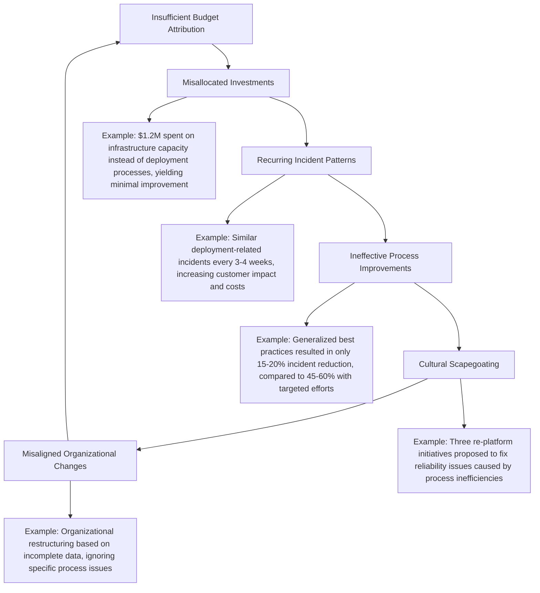

1. **Misallocated Improvement Investments**: Without attribution patterns, reliability investments target the wrong areas. Financial analysis revealed approximately $1.2M spent addressing infrastructure capacity when attribution data would have shown that deployment processes represented 3x greater budget consumption, resulting in minimal reliability improvement despite significant investment.

2. **Recurring Incident Patterns**: Addressing symptoms rather than underlying causes ensures similar incidents will recur. Incident data showed that before implementing attribution analysis, the mobile banking team experienced essentially the same deployment-related incident with different technical manifestations every 3-4 weeks, creating avoidable customer impact and response costs.

3. **Ineffective Process Improvements**: Generic "best practices" often miss organization-specific reliability drivers. Process change analysis showed that implementing generalized reliability improvements without attribution guidance resulted in significant engineering effort with only 15-20% reduction in incidents, compared to 45-60% reduction when targeting specific attribution patterns.

4. **Cultural Scapegoating**: Without systematic attribution, teams tend to blame technology rather than process. Architecture review records showed three major re-platform initiatives proposed specifically to "solve reliability problems" when attribution analysis would have revealed that technology choices represented less than 15% of budget consumption, with process issues accounting for over 60%.

5. **Misaligned Organizational Changes**: Leadership makes personnel decisions based on incomplete reliability data. Organizational restructuring proposals specifically cited reliability concerns as justification for team changes, while attribution analysis would have identified specific process issues that could be addressed without disruptive reorganization.

This flow of interconnected impacts demonstrates how insufficient budget attribution perpetuates systemic inefficiencies, highlighting the need for structured and data-driven error budget analysis to drive meaningful and effective reliability improvements.

### Implementation Guidance

To implement effective error budget attribution in your banking environment, follow these steps:

1. **Create Attribution Taxonomy**: Develop a comprehensive classification system for categorizing budget consumption. Establish a standardized taxonomy with primary categories (deployment, infrastructure, dependencies, code defects, configuration, capacity) and secondary factors (process adherence, testing coverage, architectural limitations, operational practices). Document this taxonomy with clear definitions and examples to ensure consistent application across incidents.

2. **Implement Post-Incident Attribution Process**: Integrate attribution analysis into standard incident reviews. Expand post-incident protocols to include explicit attribution steps: identifying budget consumption amount, categorizing using the standard taxonomy, connecting technical causes to underlying decisions, and updating historical attribution records. Train incident commanders and participants in applying these techniques consistently.

3. **Develop Attribution Visualization Tools**: Create dashboards that show attribution patterns over time. Implement visualization capabilities that display budget consumption by category, trend analysis showing how attribution is shifting, comparative views across different services, and drill-down capabilities to explore specific patterns. Make these dashboards accessible to both technical and business stakeholders.

4. **Establish Attribution-Based Planning**: Use attribution patterns to guide reliability investments. Implement quarterly reviews of attribution data to identify the highest-impact improvement opportunities, with explicit goal-setting for reducing specific attribution categories. Link improvement initiatives directly to attribution patterns with measurable targets for reducing budget consumption in prioritized categories.

5. **Create Attribution Communication Framework**: Develop methods for explaining attribution insights to various stakeholders. Create standard formats for communicating attribution findings to different audiences: technical details for engineering teams, process implications for delivery management, investment priorities for executives, and improvement roadmaps for product owners, ensuring organization-wide understanding and support for targeted reliability initiatives.

______________________________________________________________________

#### Quick Implementation Checklist

Use this checklist to ensure all steps are followed and nothing is overlooked:

- [ ] **Define Attribution Taxonomy**:

  - [ ] Primary categories (e.g., deployment, infrastructure, dependencies).
  - [ ] Secondary factors (e.g., process adherence, testing coverage).
  - [ ] Document taxonomy with examples for consistent use.

- [ ] **Integrate Post-Incident Attribution**:

  - [ ] Update incident review protocols to include attribution analysis.
  - [ ] Identify budget consumption during incidents.
  - [ ] Categorize root causes and link to human decisions.
  - [ ] Train teams on applying attribution methods.

- [ ] **Build Attribution Dashboards**:

  - [ ] Visualize budget consumption trends over time.
  - [ ] Provide comparative views across services.
  - [ ] Enable drill-down into specific attribution patterns.
  - [ ] Make dashboards accessible to technical and business stakeholders.

- [ ] **Plan Reliability Investments**:

  - [ ] Conduct quarterly reviews of attribution data.
  - [ ] Identify high-impact improvement areas.
  - [ ] Set measurable goals for reducing budget consumption.
  - [ ] Align improvement efforts with attribution insights.

- [ ] **Communicate Attribution Findings**:

  - [ ] Tailor reports for engineering teams, delivery managers, executives, and product owners.
  - [ ] Use attribution data to support reliability initiatives organization-wide.
  - [ ] Standardize presentation formats for clarity and consistency.

## Panel 6: Forecasting and Modeling - Predictive Budget Management

### Scene Description

A quarterly planning session is underway where the financial trading platform team models future error budget scenarios. The room is equipped with multiple screens displaying sophisticated forecasting models with various projections:

- **Historical Consumption Patterns**: A visualization highlights higher error rates during periods of market volatility.
- **Capacity Modeling**: Projections indicate potential budget exhaustion during the upcoming quarterly earnings season if no action is taken.
- **Simulation Tool**: A scenario models the reliability impact of planned architectural changes, predicting a 30% reduction in common failure modes.
- **Risk Analysis**: Alex presents pessimistic, expected, and optimistic budget consumption scenarios for a major planned migration.

The team leverages these insights to make data-driven decisions, such as scheduling high-risk work during periods of maximum budget availability, distributing changes across multiple budget periods, and implementing temporary capacity increases during high-consumption periods.

#### Decision-Making Flow

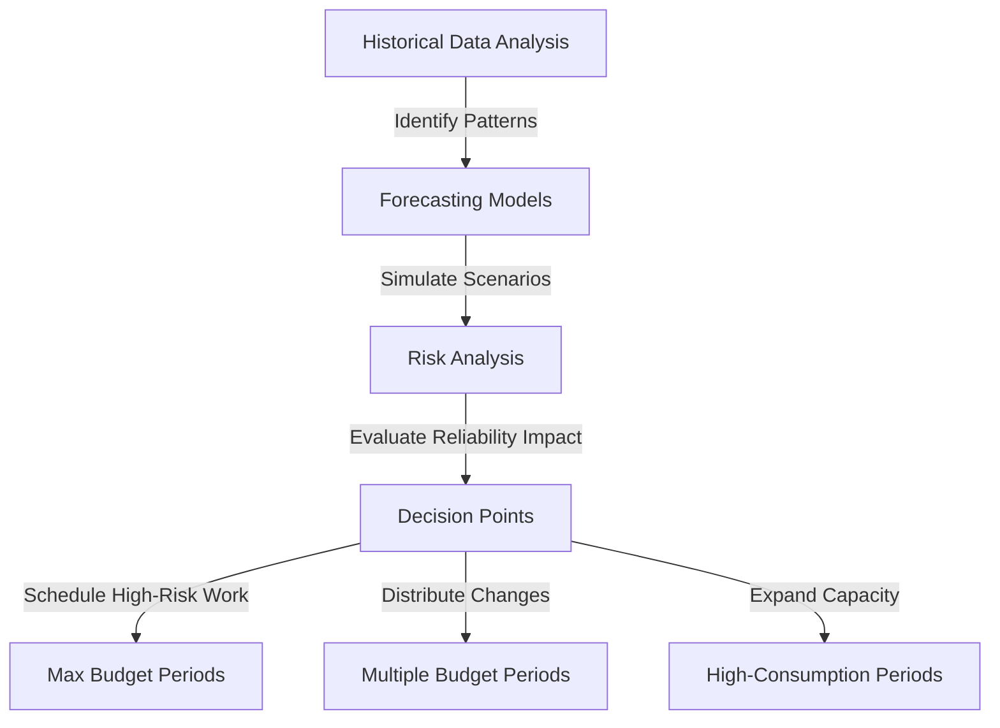

This structured approach ensures that the team anticipates reliability challenges and proactively addresses them before customer impact occurs.

### Teaching Narrative

Advanced error budget management moves beyond reactive tracking to proactive forecasting and modeling. This forward-looking approach enables teams to anticipate reliability challenges and take preventive measures before customer impact occurs.

Error budget forecasting incorporates several sophisticated techniques:

1. **Pattern Analysis**: Identifying cyclical reliability trends in historical data, such as increased failures during peak trading hours, month-end processing, or market volatility.

2. **Consumption Modeling**: Projecting future budget consumption based on historical patterns and known upcoming events like planned deployments, expected traffic changes, or scheduled maintenance.

3. **Capacity Planning**: Predicting when growth trends will exceed current system capabilities and proactively expanding capacity before reliability suffers.

4. **Risk Simulation**: Modeling the potential budget impact of major changes using techniques like Monte Carlo simulation to understand the range of possible reliability outcomes.

5. **Scenario Planning**: Developing contingency plans for different budget consumption scenarios, ensuring teams are prepared to respond appropriately regardless of which scenario materializes.

For banking systems with strict reliability requirements and predictable high-stress periods (tax season, fiscal year-end, major market events), this forecasting approach is particularly valuable. It allows teams to align major changes with periods of maximum budget availability and implement preventive measures before high-risk periods.

This predictive approach transforms error budget management from a reactive "wait until it breaks" model to a proactive "prevent it from breaking" approach that significantly improves overall reliability while reducing disruptive firefighting.

The most sophisticated banking organizations create a continuous forecasting process that constantly updates predictions based on the latest data, enabling increasingly accurate reliability planning over time.

#### Checklist: Key Forecasting Techniques for Predictive Budget Management

- [ ] **Analyze Historical Patterns**

  - Review historical data for cyclical trends (e.g., market volatility, peak trading hours).
  - Identify periods with higher error rates to anticipate similar future challenges.

- [ ] **Model Future Consumption**

  - Use historical consumption patterns and known upcoming events to forecast future budget usage.
  - Account for planned deployments, traffic fluctuations, and maintenance schedules.

- [ ] **Plan for Capacity**

  - Assess when growth trends could exceed system limits.
  - Schedule capacity increases proactively to avoid reliability degradation.

- [ ] **Simulate Risks**

  - Apply Monte Carlo or similar techniques to model the potential impact of major architectural changes.
  - Develop insights into optimistic, expected, and pessimistic reliability scenarios.

- [ ] **Prepare for Scenarios**

  - Create contingency plans for different budget consumption trajectories.
  - Define clear actions for high-consumption, stable, or low-consumption scenarios.

- [ ] **Establish Continuous Forecasting**

  - Build a process for continuously updating forecasts with the latest data.
  - Use updated predictions to refine planning and improve long-term accuracy.

### Common Example of the Problem

A global investment bank's equities trading platform operated with an established error budget framework but took an entirely reactive approach to budget management. They diligently tracked consumption and implemented policy consequences when budgets were exhausted, but did nothing to anticipate or prevent exhaustion before it occurred.

This reactive approach created several significant challenges:

| **Issue** | **Root Cause** | **Potential Preventive Measures** |
| ----------------------------------------------------------------------------------------------------------------------------------- | ------------------------------------------------------------------------------------------------ | ------------------------------------------------------------------------------------------------------------------------------------ |
| Predictable reliability challenges during known high-stress periods (e.g., market opens, options expiration days, earnings seasons) | Lack of proactive adjustments to deployments or operational practices during high-stress periods | Forecast cyclical reliability trends and schedule deployments outside of high-stress windows; implement temporary capacity increases |
| Major changes initiated when budgets were near exhaustion, leading to policy violations and deployment freezes | No consideration of budget impact or consumption trajectory in change scheduling | Use forecasting to model the impact of planned changes and avoid scheduling during periods of high budget consumption |
| Capacity-related failures during growth spikes, despite clear patterns indicating imminent constraints | Capacity planning operating independently from error budget management | Integrate capacity planning with budget forecasting to identify and resolve constraints before failures occur |

These issues came to a head during a particularly volatile trading period. The platform was already at 70% budget consumption with two weeks remaining in the measurement window when the team proceeded with a planned database migration. Combined with higher-than-normal trading volumes, this change triggered a significant incident that exhausted the remaining budget and forced a two-week feature freeze during a critical competitive period when they had planned to release new trading capabilities.

Post-incident analysis revealed:

- The capacity constraints could have been identified weeks earlier through basic forecasting, enabling proactive capacity expansion ahead of demand.
- The risky timing of the migration could have been avoided by scheduling it for a lower-risk period or after implementing preventive measures.

These missed opportunities underscore the importance of shifting from reactive to proactive error budget management.

### SRE Best Practice: Evidence-Based Investigation

Experienced SREs implement predictive budget management using these evidence-based approaches:

1. **Cyclical Pattern Recognition**: Analyze historical data to identify recurring reliability stress points. Time-series analysis of 24 months of trading platform data revealed clear consumption patterns: error rates increased 2.7x during market opens, 3.2x during monthly options expirations, and 2.4x during earnings seasons, creating predictable high-risk periods that warranted specific operational adjustments.

2. **Consumption Rate Trending**: Track the trajectory of budget consumption to predict future state. Statistical analysis showed that consumption rarely occurred linearly—early consumption rates typically accelerated, with platforms that reached 50% consumption within the first third of the measurement window having a 92% probability of exceeding their budget before the window ended.

3. **Event Impact Modeling**: Quantify the reliability impact of specific event types. Analysis of 200+ deployments revealed differentiated risk profiles: major database changes consumed an average of 12% budget, API modifications averaged 7%, and UI-only changes averaged 3%, providing concrete inputs for change scheduling decisions.

4. **Change Risk Simulation**: Develop models that estimate potential budget impact ranges. Monte Carlo simulations of planned migrations incorporating historical performance data and complexity factors predicted an 80% confidence interval for budget consumption between 15-40%, enabling more informed risk management decisions than single-point estimates.

5. **Capacity-Reliability Correlation**: Establish relationships between capacity metrics and error budgets. Correlation analysis revealed specific leading indicators—when authentication service capacity utilization exceeded 65% for three consecutive days, error budget consumption increased by an average of one percentage point per day, providing early warning of emerging constraints.

### Banking Impact

Reactive-only budget management creates significant business consequences in banking environments. The following flow illustrates how reactive practices cascade into broader business impacts:

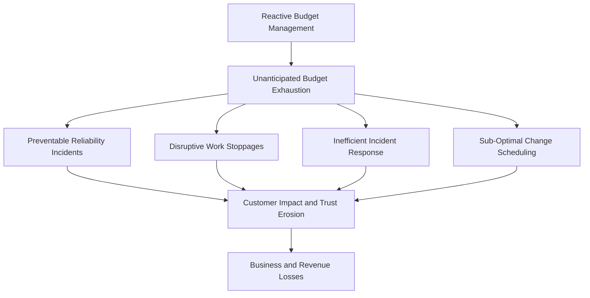

1. **Preventable Reliability Incidents**: Failure to anticipate predictable challenges leads to avoidable incidents. Analysis of trading platform outages revealed that 47% occurred during known high-stress periods (market opens, volatility events, earnings seasons) that could have been identified through basic pattern recognition, representing significant avoidable customer impact.

2. **Disruptive Work Stoppages**: Unexpected budget exhaustion creates unplanned development freezes. Project delivery analysis showed that reactive budget management led to approximately 7 weeks of unplanned feature development stoppage annually, disrupting roadmaps and delaying competitive capabilities by an average of 45 days.

3. **Inefficient Incident Response**: Reactive posture increases total incident costs. Financial comparison showed that emergency response to unanticipated budget exhaustion cost approximately 3.2x more than planned preventive measures, with additional costs from business impact, customer communications, and regulatory reporting.

4. **Sub-Optimal Change Scheduling**: Changes proceed without considering budget state. Release management data showed that 34% of major changes were implemented when budgets were already beyond 70% consumed, creating high risk of policy violations and subsequent freezes that could have been avoided through forecast-informed scheduling.

5. **Customer Trust Erosion**: Recurring issues during predictable high-stress periods damage client confidence. Institutional client feedback specifically cited reliability during "critical market periods" as a key factor in trading platform selection, with several clients reducing allocations following repeated issues during earnings seasons and options expirations.

By transitioning to proactive budget forecasting, banking organizations can mitigate these cascading risks, protecting both their operational stability and customer trust.

### Implementation Guidance

To implement effective predictive budget management in your banking environment, follow this actionable checklist:

#### Checklist for Predictive Budget Management Implementation

1. **Develop Consumption Pattern Analysis**

   - [ ] Conduct a systematic review of at least 12 months of error budget data.
   - [ ] Identify reliability trends related to:
     - Business events (e.g., market opens/closes, month-end processing, quarter/year-end).
     - Customer behavior patterns.
     - Internal operational cycles (e.g., release schedules, maintenance windows).
   - [ ] Document identified patterns to inform operational planning and forecasting.

2. **Create Budget Forecasting Mechanisms**

   - [ ] Build predictive models to forecast future error budget consumption.
   - [ ] Incorporate historical consumption patterns and known upcoming events (e.g., planned changes, traffic variations, maintenance schedules).
   - [ ] Implement rolling forecasts that update continuously, projecting budget status through the end of the measurement window and beyond.

3. **Implement Risk-Aware Scheduling**

   - [ ] Integrate budget projections into change management processes.
   - [ ] Enhance release planning by:
     - Scheduling higher-risk changes during periods of projected budget availability.
     - Adding safeguards for deployments in constrained periods.
   - [ ] Use forecasting data to prioritize reliability over risk during critical business cycles.

4. **Establish Preventive Intervention Triggers**

   - [ ] Define early warning thresholds for forecast-based action.
   - [ ] Set triggers for intervention, such as:
     - Projected consumption exceeding a 75% probability of budget exhaustion within the measurement window.
   - [ ] Prepare automatic responses like:
     - Enhanced monitoring.
     - Temporary capacity increases.
     - Stricter change controls.

5. **Develop Scenario-Based Contingency Plans**

   - [ ] Create predefined response playbooks for various budget scenarios, including:
     - Rapid unexpected consumption.
     - Projected budget exhaustion during critical business periods.
     - Capacity-driven budget risks.
   - [ ] Establish protocols for faster decision-making and execution during forecasted challenges.

#### Implementation Flow (Optional Visualization)

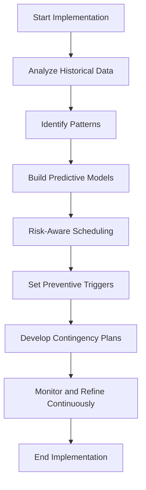

This checklist ensures a structured and actionable approach to implementing predictive budget management. Regularly revisit and refine each step to align with evolving business needs and reliability goals.

## Panel 7: Beyond Incidents - The Complete Reliability Economic Picture

### Scene Description

A board-level strategic presentation where the CTO and CFO jointly present a comprehensive economic analysis of reliability for the bank's digital transformation initiative. Rather than focusing narrowly on incident costs, their analysis spans the complete financial impact of reliability across multiple dimensions.

Key highlights of the presentation include:

- **Capability Economics**: Demonstrating how reliability enables specific business capabilities, such as the new real-time payment platform requiring 99.99% availability to meet market expectations, directly enabling $45M in projected annual revenue.
- **Velocity Economics**: Quantifying how balanced reliability practices accelerate time-to-market by reducing rework, shortening stabilization periods, and enabling more frequent deployments.
- **Technical Debt Economics**: Illustrating how appropriate investment in reliability reduces the accumulation of technical debt, lowers operational burden, and improves long-term technology economics.

The board members engage deeply with this comprehensive picture, asking sophisticated questions about the relationships between reliability and business outcomes. The final slides emphasize reliability as a strategic enabler with concrete economic benefits spanning revenue generation, operational efficiency, risk management, and competitive differentiation.

To enhance understanding, the CTO and CFO present a simplified text diagram illustrating how these dimensions interconnect and drive financial and operational outcomes:

```
      [Reliability Practices]
                ↓
  ---------------------------------
  |               |               |
[Capability]  [Velocity]  [Technical Debt]
  |               |               |
[Revenue]     [Time-to-Market]  [Cost Efficiency]
                ↓
         [Strategic Outcomes]
```

This visualization helps clarify how reliability influences not just operational metrics but broader strategic goals, positioning reliability as a fundamental enabler of the bank's digital transformation.

### Teaching Narrative

The most sophisticated reliability economics transcends simple incident cost analysis to develop a comprehensive understanding of how reliability affects every aspect of technology economics. This holistic perspective recognizes that reliability impacts far more than just downtime costs—it fundamentally shapes an organization's ability to execute its business strategy through multiple economic pathways.

A complete reliability economic picture includes several dimensions that traditional approaches often overlook:

1. **Capability Economics**: How reliability enables or constrains business capabilities and revenue opportunities:

   - New product and service possibilities unlocked by reliability levels
   - Market segments accessible only with specific reliability characteristics
   - Partnership and integration opportunities dependent on reliability
   - Pricing and monetization options enabled by service guarantees

2. **Velocity Economics**: How reliability practices affect development speed and time-to-market:

   - Reduced rework and emergency fixes through proactive reliability
   - Confidence to deploy more frequently with strong reliability practices
   - Decreased stabilization periods following major releases
   - Improved planning predictability with fewer disruptions

3. **Technical Debt Economics**: How reliability investment affects long-term technology economics:

   - Reduced accumulation of reliability-related technical debt
   - Lower maintenance and operational burden
   - Extended system lifespan through sustainable reliability practices
   - Improved engineering productivity and reduced firefighting

4. **Talent Economics**: How reliability affects human capital costs and capabilities:

   - Reduced burnout and turnover from reliability-related stress
   - Improved ability to attract and retain engineering talent
   - Enhanced skills development through proactive rather than reactive work
   - More efficient on-call rotations and support models

For banking institutions navigating complex digital transformations, this comprehensive economic perspective ensures that reliability receives appropriate strategic consideration. Rather than viewing reliability narrowly as a technical requirement or cost center, it positions reliability as a fundamental business capability that enables strategy execution across multiple dimensions.

The most sophisticated organizations integrate reliability economics directly into their technology strategy development, ensuring that reliability considerations inform business planning from the earliest stages rather than emerging as constraints only during implementation. This integrated approach creates technology economics that reflect the full business value of reliability rather than just its direct operational costs.

______________________________________________________________________

#### Practical Checklist: Applying Reliability Economics in Your Organization

Use the following checklist to evaluate and integrate reliability economics into your strategic planning:

- **Capability Economics**

  - [ ] Identify business capabilities that rely on specific reliability thresholds.
  - [ ] Assess potential revenue impact of meeting or exceeding reliability requirements.
  - [ ] Evaluate market segments or partnerships enabled by improved reliability.
  - [ ] Analyze opportunities for service-level guarantees to unlock pricing or monetization strategies.

- **Velocity Economics**

  - [ ] Measure how proactive reliability practices reduce rework and emergency fixes.
  - [ ] Track deployment frequency and stabilization periods after major releases.
  - [ ] Assess development velocity improvements linked to fewer disruptions.
  - [ ] Monitor predictability of project planning and delivery timelines.

- **Technical Debt Economics**

  - [ ] Audit existing technical debt related to reliability gaps.
  - [ ] Estimate cost savings from sustainable, long-term reliability investments.
  - [ ] Track reductions in maintenance burden and firefighting efforts.
  - [ ] Identify opportunities to extend system lifespans through reliability-focused practices.

- **Talent Economics**

  - [ ] Monitor turnover rates and burnout levels in teams affected by reliability issues.
  - [ ] Evaluate the effectiveness of on-call rotations and support models.
  - [ ] Survey employee satisfaction linked to proactive versus reactive work.
  - [ ] Assess the organization’s ability to attract and retain top engineering talent.

By incorporating this checklist into regular evaluations, organizations can ensure that reliability remains a strategic enabler, aligned with broader business goals. This structured approach helps bridge the gap between reliability engineering practices and their broader economic impact.

### Common Example of the Problem

A major retail bank initiated a digital transformation program with a $120M investment over three years. The business case focused entirely on new capabilities (mobile features, personalization, integrated financial management) and the technology modernization necessary to deliver them. Reliability was mentioned only as a technical requirement—systems would be "highly available" with "appropriate redundancy."

This narrow treatment of reliability created several critical economic blindspots:

| **Economic Blindspot** | **Description** | **Impact** |
| ------------------------------------- | ---------------------------------------------------------------------------------------------------- | ----------------------------------------------------------------------------------------------- |
| **Underestimated Operational Costs** | Support models assumed simplistic incident rates and maintenance needs, omitting detailed analysis. | Operational costs ran 2.7x higher than projected within six months of launch. |
| **Reduced Development Velocity** | Reliability issues extended stabilization periods and diverted resources from planned feature work. | By year two, velocity dropped by ~40%, with 30% of capacity spent on reliability remediation. |
| **Constrained Business Capabilities** | Reliability requirements for high-value features were unrecognized until late implementation stages. | Key roadmap features (e.g., real-time payments) were descoped or simplified due to constraints. |

The business case included all development costs for new capabilities but significantly underestimated operational costs after launch. Without explicit reliability economics, the ongoing support model was based on overly optimistic assumptions about incident rates, support requirements, and maintenance needs. As a result, operational costs quickly exceeded projections.

The transformation roadmap also failed to account for the impact of reliability on development velocity. While initial phases delivered features largely on schedule, emerging reliability issues extended stabilization periods with each subsequent release. By the second year, the program could only deliver 60% of its planned story points per quarter, as nearly a third of engineering capacity was consumed by reliability remediation.

Most significantly, the economic model completely overlooked how reliability would enable or constrain core business outcomes. High-value capabilities such as real-time payment processing, integrated investment services, and open banking partnerships had fundamental reliability thresholds that weren’t identified until implementation exposed architectural limitations. Several key features were either descoped or substantially reworked late in the program, undermining their strategic impact.

Ultimately, the transformation delivered about 65% of its planned capabilities within the original budget and timeline. Post-program analysis revealed that inadequate reliability economics had been a primary factor in this underperformance. Both direct costs (incident response, remediation) and indirect costs (reduced velocity, constrained capabilities) significantly impacted the program's outcomes.

### SRE Best Practice: Evidence-Based Investigation

Experienced SREs implement comprehensive reliability economics using these evidence-based approaches. The interconnections between these practices and their impacts on reliability economics can be visualized below:

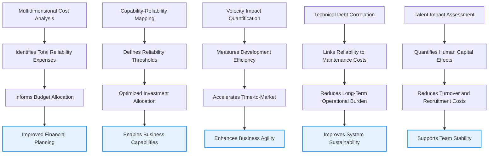

1. **Multidimensional Cost Analysis**: Develop models that capture all reliability-related expenses. Comprehensive analysis of digital banking operations identified that visible incident costs (detection, response, remediation) represented only 37% of total reliability expenses, with preventive measures, excess capacity, compliance activities, and velocity impacts accounting for the remaining 63%.

2. **Capability-Reliability Mapping**: Create explicit connections between business capabilities and reliability requirements. Systematic analysis of digital banking features revealed specific reliability thresholds for different capabilities—real-time payments required 99.95%+ availability and sub-second latency, while personalization features functioned acceptably at 99.5% with multi-second response times, enabling appropriate investment allocation.

3. **Velocity Impact Quantification**: Measure how reliability practices affect development speed. Controlled comparison across development teams showed that those operating with mature reliability practices (error budgets, SLO-based alerting, automated testing) delivered 37% more features annually than those with reactive practices, despite spending 15-20% of capacity on proactive reliability work.

4. **Technical Debt Correlation**: Establish relationships between reliability investment and maintenance costs. Longitudinal study of 14 banking applications revealed that each 1% of capacity invested in proactive reliability engineering reduced maintenance costs by approximately 2.8% over a three-year period, with the effect compounding over time.

5. **Talent Impact Assessment**: Quantify how reliability affects human capital economics. HR data analysis showed that teams experiencing frequent reliability incidents had 2.4x higher turnover and 3.1x higher recruitment costs than those with stable services, with each reliability-driven departure costing approximately $85,000 in replacement expenses and lost productivity.

### Banking Impact

Narrow reliability economics creates significant business consequences in banking environments. These cascading effects can be visualized as follows:

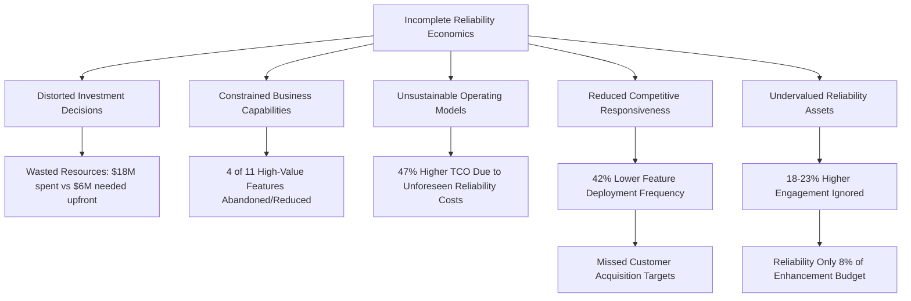

1. **Distorted Investment Decisions**: Incomplete economic models lead to irrational resource allocation. Analysis of the digital transformation program revealed approximately $18M spent addressing reliability issues that could have been prevented with $6M in upfront investment, representing significant economic inefficiency.

2. **Constrained Business Capabilities**: Unrecognized reliability requirements limit strategic options. Product roadmap comparison showed that 4 of 11 high-value features were either abandoned or significantly reduced in scope when implementation revealed reliability requirements that the architecture couldn't support cost-effectively.

3. **Unsustainable Operating Models**: Underestimated operational costs create long-term financial challenges. The digital banking platform's three-year TCO exceeded initial projections by 47%, primarily due to reliability-related operational expenses that weren't anticipated in the original business case.

4. **Reduced Competitive Responsiveness**: Reliability-constrained velocity impacts market position. Competitive analysis showed that after initial launch, the bank's feature deployment frequency fell to 42% of leading competitors due to reliability stabilization requirements, directly affecting customer acquisition targets.

5. **Undervalued Reliability Assets**: Failure to recognize reliability as a strategic capability leads to insufficient investment. Financial analysis demonstrated that high-reliability services generated 18-23% greater customer engagement and 31% higher transaction volume than less reliable equivalents, yet reliability received only 8% of the enhancement budget.

### Implementation Guidance

To implement comprehensive reliability economics in your banking environment:

1. **Create Holistic Economic Framework**: Develop a model that captures all reliability-related costs and benefits. Establish a comprehensive accounting methodology that incorporates direct costs (incident management, preventive measures, excess capacity), indirect costs (velocity impacts, opportunity costs, technical debt), and benefits (enabled capabilities, improved customer experience, reduced operational risk), ensuring complete visibility into reliability economics.

2. **Implement Capability-Requirement Mapping**: Explicitly connect business capabilities to reliability needs. Create a structured process for evaluating how different reliability characteristics (availability, latency, data accuracy) enable or constrain specific banking capabilities, documenting these relationships to inform both architecture decisions and investment prioritization.

3. **Develop Reliability-Adjusted Velocity Metrics**: Incorporate reliability factors into delivery forecasting. Enhance project planning methodologies to explicitly account for reliability-related activities (proactive improvements, incident response, stabilization periods), creating more accurate delivery projections that reflect the real economics of balanced reliability practices.

4. **Establish Reliability Investment Portfolio**: Create an explicit approach to reliability resource allocation. Implement portfolio management for reliability investments with differentiated strategies for various service types—critical payment services warranting significant proactive investment, while non-critical services receive more reactive approaches—optimizing overall economic return.

5. **Create Executive Communication Frameworks**: Develop methods for explaining reliability economics to leadership. Create standard approaches for quantifying and communicating how reliability enables business strategy, affects operational economics, and creates competitive advantage, ensuring executives understand reliability as a strategic capability rather than merely a technical requirement.
