# Chapter 9: Error Budget Policies - Creating Reliability Frameworks

## Chapter Overview

Welcome to the graveyard of good intentions: Error Budget Policies. If you think SLO dashboards and error budgets alone will drag your bank’s reliability out of the gutter, congratulations—you’ve earned the right to watch your metrics become zombie data. This chapter rips the band-aid off the “measure, ignore, repeat” loop and hammers home the brutal truth: reliability doesn’t improve until you turn error budgets into hard policies, enforce them with the ruthlessness of a loan shark, and treat exceptions like fraud attempts. We’ll dissect the anatomy of failure in large, slow-moving orgs and show you how to operationalize error budgets so they actually bite—turning wishful thinking into executive action, credible governance, and the kind of reliability regulators won’t laugh at. Ready to turn your error budget from a wallflower into a bouncer? Read on.

______________________________________________________________________

## Learning Objectives

- **Design** formal error budget policies that connect measurement to mandatory action, not just pretty dashboards.
- **Establish** clear decision frameworks and action thresholds that make reliability non-negotiable, even for "important" feature launches.
- **Implement** progressive consequence models that escalate intervention without nuking your deployment pipeline on day one.
- **Codify** exclusion criteria so teams stop playing the “not my problem” blame game—rooted in customer impact, not technical excuses.
- **Construct** shared responsibility models that force cross-team accountability, killing the “my SLO is green, so I’m clean” mentality.
- **Automate** policy enforcement so your guidelines become guardrails—unbreakable and auditable, not subject to managerial mood swings.
- **Continuously improve** policies based on real-world data, not wishful thinking, so your reliability governance evolves instead of fossilizing.

______________________________________________________________________

## Key Takeaways

- Error budgets without enforceable policies are just “management theater”—everyone claps, nobody improves.
- If exceeding your error budget has no real consequence, expect teams to ignore it. Feature delivery will always win unless you change the rules.
- Siloed budgets guarantee customer pain at integration points while every team passes the buck. End-to-end reliability? Dream on.
- Binary consequence models (“all clear” vs. “deployment freeze”) create chaos, workarounds, and compliance nightmares. Nuance or die.
- Exclusion criteria: get them wrong, and every outage becomes someone else’s fault. Get them right, and teams finally build for resilience.
- Manual enforcement equals selective enforcement. Selective enforcement equals no enforcement. Automate or accept mediocrity.
- Static policies rot. If you’re not regularly tweaking thresholds, exclusions, and governance, your reliability program is already obsolete.
- Regulators, customers, and engineers all hate inconsistency—whether it’s policy application or audit trails. You can’t fake reliability governance.
- Incentives matter. If reliability isn’t tied to bonuses and promotions, expect gaming, corner-cutting, and finger-pointing.
- The only thing worse than no error budget policy is one that nobody respects. Make it actionable, visible, and unavoidable—or admit you aren’t serious about SRE.

Now get out there and make your error budget policy something to fear, not just admire.

______________________________________________________________________

## Panel 1: From Theory to Practice - Operationalizing Error Budgets

### Scene Description

A technology governance meeting at a major bank where leaders are confronting a recurring problem. On a large display, charts show that despite having error budgets in place for six months, reliability hasn't significantly improved. The data reveals a troubling pattern: teams consistently exceed their budgets with few consequences, essentially treating them as informational rather than actionable. Frustration is visible as the CTO questions the value of their error budget implementation.

Sofia stands at the front of the room presenting a new approach titled "Error Budget Policies." She contrasts their current "measurement-only" model with a comprehensive framework showing clear decision thresholds, automated enforcement mechanisms, and a governance structure. On a whiteboard, she lists several recent incidents and demonstrates how formal policies would have changed the outcomes through earlier intervention and more structured responses.

To clarify the distinction between the "measurement-only" model and the proposed "Error Budget Policies" framework, Sofia uses the following diagram:


The diagram highlights how the "measurement-only" model stops at tracking metrics and monitoring dashboards, leading to minimal impact on reliability. In contrast, the "Error Budget Policies" framework layers decision-making, enforcement, and governance over the metrics, driving meaningful improvements in reliability through structured and proactive management.

### Teaching Narrative

Many organizations encounter a critical gap between error budget theory and practice. They implement the technical components—SLIs, SLOs, and error budget calculations—but fail to create the organizational frameworks needed to make these metrics actionable. This results in "zombie error budgets" that measure reliability without actually improving it.

The transition from theoretical error budgets to practical reliability management requires operationalization through formal policies. These policies transform abstract measurements into concrete actions by establishing:

1. **Decision Frameworks**: Clear guidelines for when and how error budgets should influence engineering and business decisions

2. **Action Thresholds**: Specific trigger points that automatically initiate predefined responses when budgets reach certain consumption levels

3. **Enforcement Mechanisms**: Both technical and organizational systems that ensure policy compliance

4. **Governance Structures**: Defined roles, responsibilities, and processes for managing error budgets across the organization

For banking institutions with complex organizational structures and strict governance requirements, this formalization is particularly crucial. Without it, error budgets become merely another dashboard that teams occasionally glance at but rarely act upon.

The most successful organizations recognize that error budget policies are not merely technical documents but organizational change management tools. They create the connective tissue between reliability metrics and engineering behaviors, ensuring that measurement actually drives improvement rather than just documenting problems.

### Common Example of the Problem

A major retail banking division implemented error budgets for their digital banking platform six months ago. They diligently established SLOs for key services (99.95% for authentication, 99.9% for account management, 99.95% for payment processing), created dashboards showing budget consumption, and celebrated the successful technical implementation.

Yet six months later, reliability had actually degraded rather than improved. A detailed review revealed several critical problems:

| **Problem Area** | **Description** | **Impact** |
| ------------------------------------- | --------------------------------------------------------------------------------------------------------------- | ---------------------------------------------------------------------------------------------------- |
| **Lack of Consequences** | Teams regularly exceeded their error budgets with no meaningful repercussions. | Ongoing reliability issues persisted as teams continued development and deployment as usual. |
| **Unclear Expectations** | Teams had no clarity on what actions to take when error budgets were exceeded. | The mobile banking team exceeded their budget in 4 of the last 6 months without altering priorities. |
| **Misaligned Incentives** | Business stakeholders prioritized feature velocity over reliability. | Product managers pushed for aggressive delivery even when error budgets were exceeded. |
| **Superficial Post-Incident Reviews** | Incident reviews focused only on technical root causes without addressing governance or process issues. | Systemic reliability governance failures were left unresolved, leading to repeated issues. |
| **"Zombie Metrics" Phenomenon** | Error budgets became informational only, visible on dashboards but not influencing behavior or decision-making. | Reliability degraded, and error budgets failed to drive meaningful operational improvements. |

#### Example Breakdown

- **Scenario**: The mobile banking team exceeded their monthly error budget in four of the last six months. Despite this, they continued deploying new features without addressing reliability concerns. When asked, the team lead admitted there were no clear guidelines on what action to take when over budget.
- **Stakeholder Misalignment**: During a planning session, a product owner dismissed the error budget status, stating, "I know we're over budget, but we need these features shipped this quarter regardless."
- **Post-Incident Flaws**: After a major payment system outage, the post-incident review identified technical issues but did not address the lack of governance or process improvements that allowed reliability to decline.

The CTO summarized the frustration: "We've invested significant resources in implementing these error budgets, but they don't seem to be driving any actual improvement in our reliability. Are they just a waste of time?"

### SRE Best Practice: Evidence-Based Investigation

Experienced SREs implement error budget operationalization using these evidence-based approaches. The following summary table and Mermaid flowchart illustrate key statistics and comparisons for better retention and engagement.

#### Summary Table of Evidence-Based Approaches

| Practice | Key Insights | Results |
| ------------------------------------ | ------------------------------------------------------------------------------------------------ | ------------------------------------------------------------------------------------ |
| **Policy Effectiveness Assessment** | Comparing teams with formal policies vs. measurement-only implementations. | 73% reduction in major incidents; 47% reduction in MTTR over 12 months. |
| **Decision Threshold Optimization** | Analyzing data to identify optimal intervention points at 85% vs. 100% error budget consumption. | 78% success at 85%, dropping to 42% at 100%. |
| **Enforcement Mechanism Evaluation** | Testing automated vs. manual enforcement methods. | 92% compliance with automated enforcement vs. 48% (document-based) and 23% (verbal). |
| **Governance Model Benchmarking** | Comparing governance structures across institutions. | Organizations with formal committees showed 2.7x more consistent policy application. |
| **Incentive Alignment Analysis** | Evaluating the impact of performance incentives tied to reliability metrics. | Teams with incentives tied to reliability metrics were 3.4x more likely to adhere. |

#### Mermaid Flowchart of Implementation and Outcomes


### Banking Impact

Inadequate error budget operationalization creates significant business consequences in banking environments, spanning technical, financial, customer, regulatory, and talent dimensions. The interconnected nature of these impacts underscores the urgency for formal error budget policies. The following visual representation highlights the cascading effects of poor error budget practices:


1. **Persistent Reliability Issues**: Without actionable policies, known problems remain unaddressed. Analysis of the retail banking platform revealed that services exceeding their error budgets experienced 340% more major incidents in subsequent months compared to services operating within budget, directly affecting customer experience and transaction volumes.

2. **Increased Operational Costs**: Reactive remediation costs substantially more than proactive reliability management. Financial analysis showed that emergency reliability fixes implemented after budget exhaustion cost approximately 3.2x more than planned improvements, representing an avoidable operational expense of approximately $1.7M annually.

3. **Inconsistent Customer Experience**: Unpredictable reliability creates erratic service quality. Customer experience data showed that mobile banking satisfaction scores fluctuated by an average of 12 points month-to-month in the absence of effective error budget policies, compared to 3-4 point variations for platforms with enforced policies.

4. **Regulatory Compliance Risk**: Financial regulators increasingly expect formal reliability governance. A regulatory examination cited the bank's lack of structured reliability management as a control deficiency, noting that it "creates potential for systemic risk through inconsistent application of reliability standards across critical financial services."

5. **Talent Retention Challenges**: Engineering teams become frustrated with recurring reliability issues. Employee satisfaction surveys showed a 23-point reduction in engagement for teams experiencing repeated budget exhaustion without systematic intervention, with 38% of departing engineers citing "tolerance for poor reliability" as a factor in their decision to leave.

This cascade of impacts demonstrates that operationalizing error budgets is not merely a technical refinement but a critical business imperative for modern banking institutions.

### Implementation Guidance

To effectively operationalize error budgets in your banking environment, follow this step-by-step implementation guide:

| **Step** | **Action** | **Key Considerations** |
| -------- | --------------------------------------------------- | ------------------------------------------------------------------------------------------------------------------------------------------------------------------------------------------------------------------------------------------------------------------------------------------------------------------------------------------------------------------ |
| **1** | **Establish Formal Policy Document** | - Develop a comprehensive error budget policy document. <br> - Include sections on budget calculation methodology, consumption tracking, intervention thresholds, enforcement mechanisms, exception processes, roles and responsibilities, and review cadence. <br> - Secure formal approval through appropriate governance channels. |
| **2** | **Implement Tiered Response Framework** | - Define progressive interventions based on budget usage: <br> - **70%**: Enhanced monitoring. <br> - **85%**: Additional testing requirements. <br> - **100%**: Non-critical deployment restrictions. <br> - **120%**: Full change freezes with executive notification. <br> - Clearly document required actions at each level and communicate widely. |
| **3** | **Integrate with Engineering Workflows** | - Embed error budget status into daily tools and processes. <br> - Configure development tools, change management systems, and deployment pipelines to: <br> - Automatically check budget status. <br> - Enforce restrictions as needed. <br> - Require approvals when budgets are constrained. <br> - Make budget status highly visible in engineering workflows. |
| **4** | **Establish Cross-Functional Governance Committee** | - Form a committee with representatives from engineering, operations, product management, and business units. <br> - Assign responsibilities for reviewing policy effectiveness, addressing escalations, approving exceptions, and ensuring consistent application. <br> - Schedule monthly meetings for oversight and continuous improvement. |
| **5** | **Develop Incentive Alignment Strategy** | - Align organizational incentives with error budget adherence. <br> - Update performance metrics to include reliability objectives alongside delivery targets. <br> - Incorporate error budget management into manager evaluations and executive compensation. <br> - Create recognition programs to reward effective reliability governance. |

**Quick Checklist for Execution:**

- [ ] Formal policy document drafted, reviewed, and approved.
- [ ] Tiered response framework defined and communicated.
- [ ] Engineering workflows updated to integrate error budget checks.
- [ ] Governance committee established with clear roles and responsibilities.
- [ ] Incentive structures revised to align with reliability goals.

By following this structured approach, you can bridge the gap between theoretical error budgets and actionable reliability management, ensuring measurable improvements in system reliability.

## Panel 2: Policy Architecture - The Four Essential Components

### Scene Description

An engineering workshop where Raj is leading the development of their error budget policy framework. A large wall display shows a comprehensive policy architecture with four distinct sections color-coded for clarity:

- **Measurement** (Green): Engineers define SLO calculation methods and time windows.
- **Consumption Rules** (Blue): Specifies what incidents count against budgets and how they're calculated.
- **Consequence Mechanisms** (Red): Maps specific actions to budget thresholds.
- **Governance** (Yellow): Outlines roles, review processes, and exception handling.

The following diagram represents the color-coded policy architecture and team assignments:

```
+------------------------+------------------------+
|        Green          |         Blue          |
|  Measurement Section  |  Consumption Rules    |
|------------------------|------------------------|
| - SLO methods         | - Incident tracking   |
| - Time windows        | - Degradations        |
| - Data sources        | - Exclusion criteria  |
+------------------------+------------------------+
|         Red           |        Yellow         |
| Consequence Mechanisms|       Governance      |
| - Threshold actions   | - Roles and reviews   |
| - Response levels     | - Exception handling  |
| - Escalation paths    | - Evolution criteria  |
+------------------------+------------------------+
```

Team members from different specialties focus on distinct sections of the framework. Data engineers work on measurement specifics, operations staff handle consumption rules, and senior leaders define consequence mechanisms. Meanwhile, a bank compliance officer ensures that the entire policy structure aligns with regulatory requirements.

On another screen, a draft policy document for their payment processing service illustrates how these components integrate in practice, demonstrating the policy's adaptability to specific service contexts.

### Teaching Narrative

Effective error budget policies share a common architecture with four essential components that work together to create a comprehensive reliability framework:

1. **Measurement Framework**

   - Defines exactly how error budgets are calculated
   - Specifies the time windows for evaluation (daily, weekly, monthly)
   - Establishes data sources and calculation methodologies
   - Determines reporting cadence and visualization approaches

2. **Consumption Rules**

   - Specifies which events consume error budget
   - Defines how partial degradations are accounted for
   - Establishes exclusion criteria for events outside team control
   - Sets guidelines for retroactive adjustments when appropriate

3. **Consequence Mechanisms**

   - Maps specific actions to budget consumption thresholds
   - Establishes progressive response levels as consumption increases
   - Defines both automatic and manual interventions
   - Creates escalation paths when initial responses prove insufficient

4. **Governance Structure**

   - Assigns roles and responsibilities for policy management
   - Establishes review and approval processes for policy changes
   - Creates exception handling procedures for extraordinary circumstances
   - Defines how policies evolve based on effectiveness data

For banking institutions, these components must be carefully integrated with existing governance structures, including change management processes, risk frameworks, and regulatory compliance requirements. The policy architecture should reflect the organization's specific needs while maintaining enough consistency across services to ensure comprehensibility and manageability.

This architectural approach ensures that error budget policies address all necessary aspects of reliability management while remaining adaptable to different service types and criticality levels. Rather than creating a monolithic policy for all services, organizations typically develop a common framework that can be customized for specific service tiers and business contexts.

### Common Example of the Problem

A European bank's technology division developed error budget policies for their digital banking platform but took an incomplete approach that addressed some aspects while neglecting others. Their initial policy focused almost exclusively on the "Consequence Mechanisms" component – establishing what would happen when budgets were exhausted. It specified deployment freezes at 100% consumption, executive notification at 150%, and formal incident reviews at 200%.

However, they neglected the other essential architectural components, creating significant operational problems:

Without a well-defined **Measurement Framework**, teams calculated budgets inconsistently:

- The mobile app team used 28-day rolling windows while the API team used calendar months.
- Misalignment in evaluation criteria caused disputes when incidents impacted multiple components.
- Result: Teams could not agree on budget consumption, undermining the entire process.

The absence of clear **Consumption Rules** created constant disputes about what counted against budgets:

- A third-party identity verification service degraded, and the authentication team argued it should not count against their budget since it was outside their control.
- Without predefined rules, these debates consumed management time and created inconsistent precedents.
- Result: Operational inefficiencies and unclear accountability.

The lack of a formal **Governance Structure** meant policies were applied inconsistently:

- When the payment services team exceeded their budget, they implemented a deployment freeze as specified.
- A week later, the wealth management platform exceeded its budget, but executives granted an undocumented exception due to "market pressures" without formal review.
- Result: Teams perceived selective enforcement, leading to resentment and reduced trust.

During a regulatory examination, the bank's incomplete policy architecture became a significant liability:

- Auditors identified inconsistent application as a control deficiency.
- They noted, "reliability governance lacks the comprehensive structure necessary for effective risk management of critical financial services."

#### Checklist: Missing Components and Consequences

Use the following checklist to identify gaps in your error budget policy:

1. **Measurement Framework**

   - [ ] Are all teams using consistent time windows for budget calculation?
   - [ ] Are data sources and calculation methodologies standardized?
   - [ ] Is reporting cadence aligned across services?

2. **Consumption Rules**

   - [ ] Are rules for what consumes the budget clearly defined and agreed upon?
   - [ ] Are partial degradations and third-party dependencies addressed?
   - [ ] Are retroactive adjustments documented and governed?

3. **Consequence Mechanisms**

   - [ ] Are actions mapped to consumption thresholds clearly and consistently?
   - [ ] Are both automatic and manual interventions specified?
   - [ ] Are escalation paths defined for when responses are inadequate?

4. **Governance Structure**

   - [ ] Are roles and responsibilities for policy management clearly assigned?
   - [ ] Are review and exception-handling processes documented?
   - [ ] Is there a mechanism for evolving policies based on effectiveness data?

By addressing these components, organizations can avoid the pitfalls experienced by the bank and ensure their error budget policies are robust, consistent, and aligned with both operational and regulatory expectations.

### SRE Best Practice: Evidence-Based Investigation

Experienced SREs implement comprehensive policy architecture using these evidence-based approaches, leveraging data-driven insights to optimize reliability frameworks. The table below summarizes key approaches, outcomes, and metrics for clarity and ease of reference:

| **Approach** | **Description** | **Key Outcomes** | **Metrics** |
| ---------------------------------------- | ------------------------------------------------------------------------------------- | ------------------------------------------------------------------------------------------------------------------------ | --------------------------------------------------------------------- |
| **Component Completeness Assessment** | Evaluate how policy comprehensiveness affects operational effectiveness. | 87% fewer disputes about policy application; 68% higher reliability improvement rates | Comparative analysis across 15 financial services teams |
| **Measurement Standardization Analysis** | Test different measurement approaches to identify optimal consistency. | 73% lower variability in reliability metrics with 28-day rolling windows compared to calendar month windows | Controlled comparison using 24 months of banking service data |
| **Consumption Rule Effectiveness** | Systematically analyze how different consumption rules affect policy outcomes. | 91% reduction in consumption disputes; resolution time for classification questions decreased from 3.2 days to 4.3 hours | Review of 140+ incident classifications |
| **Governance Structure Optimization** | Compare different policy governance models to determine effectiveness. | Cross-functional committees achieved 3.2x better policy compliance compared to single-department ownership | Analysis of eight governance approaches across financial institutions |
| **Exception Process Effectiveness** | Evaluate how different exception handling approaches balance flexibility and control. | 84% prevention of inappropriate exceptions while accommodating legitimate business needs | Data from 35+ policy exception requests |

This structured approach allows teams to identify and implement the most effective practices for each policy component, driving both reliability and organizational alignment.

### Banking Impact

Incomplete policy architecture in banking environments is like constructing a house with missing structural components—while it might appear functional at first glance, the stability and integrity are fundamentally compromised. Just as a building without proper foundations or support beams risks collapse, partial policy frameworks expose banks to significant operational and business risks:

1. **Decision Inconsistency**: Without a complete framework, reliability decisions become arbitrary and unpredictable, like trying to build walls without a blueprint. An analysis of a European bank revealed that similar services with comparable error budget statuses received different responses in 47% of cases due to architectural gaps. This inconsistency led to operational confusion and eroded policy credibility.

2. **Excessive Management Overhead**: Incomplete policies act like a house with no clear layout—every decision requires excessive interpretation and back-and-forth, wasting valuable time. Time tracking showed approximately 240 leadership hours spent quarterly resolving ambiguities that a clearer architecture could have prevented, representing a significant opportunity cost for senior management.

3. **Compliance Documentation Challenges**: Regulatory examinations demand evidence of consistent controls, akin to requiring a detailed blueprint to prove a house meets safety codes. One bank faced a formal finding requiring remediation when it couldn't demonstrate consistent reliability governance across services, leading to additional compliance costs and regulatory reporting burdens.

4. **Ineffective Reliability Investment**: Gaps in policy architecture misdirect resources, much like investing in ornate decorations for a house with unstable foundations. Financial analysis revealed that incomplete frameworks caused approximately €1.8M in misdirected reliability investments, failing to address the primary consumption drivers due to inconsistent measurement and classification.

5. **Organizational Trust Erosion**: Just as occupants lose faith in a structurally unsound home, teams lose trust in policies applied inconsistently. Surveys at one bank showed a 31-point reduction in policy trust scores when teams observed exceptions granted without clear criteria, undermining adherence to future reliability guidelines.

A robust policy architecture is not just a regulatory or operational necessity—it is the foundation that ensures stability, consistency, and trust across the entire organization.

### Implementation Guidance

To implement effective policy architecture in your banking environment:

1. **Develop Comprehensive Policy Template**: Create a standardized document structure covering all architectural components. Build a template that explicitly addresses all four elements with appropriate detail: measurement framework with calculation methods and time windows, consumption rules with classification criteria and exclusions, consequence mechanisms with threshold-based actions, and governance structure with roles and processes. Ensure this template is usable across different service types with appropriate customization areas.

2. **Establish Measurement Standards**: Define consistent calculation methods for all services. Implement standardized time windows (28-day rolling periods), calculation approaches (request-based or time-based), and aggregation methods that apply across your service portfolio. Document these standards with clear examples and provide calculation tools to ensure consistent application.

3. **Create Consumption Classification Framework**: Develop explicit rules for what consumes error budget. Build a comprehensive classification guide covering different failure types, degradation patterns, and external dependencies. Include specific criteria for full versus partial consumption, exclusion conditions with required evidence, and a formal dispute resolution process for ambiguous cases.

4. **Implement Governance Operating Model**: Define specific reliability governance roles and processes. Establish a formal error budget policy committee with documented membership, meeting cadence, decision rights, and escalation paths. Create standard processes for policy exceptions, changes, and effectiveness reviews, ensuring these are integrated with existing bank governance structures.

5. **Develop Cross-Component Integration**: Ensure the four architectural elements work together coherently. Create explicit connections between components (how measurement feeds consumption, how consumption triggers consequences, how governance oversees all elements) with appropriate documentation and workflows. Conduct regular architecture reviews to maintain alignment as the reliability program matures.

## Panel 3: Progressive Consequences - Designing Effective Feedback Loops

### Scene Description

A retrospective meeting analyzing the recent deployment freeze for their corporate banking platform. The team reviews a timeline that illustrates the progression of events and interventions:

```mermaid
gantt
    title Error Budget Consequence Timeline
    dateFormat  HH:mm
    section Early Warning (50-75%)
    Increased visibility through dashboards       :done, 00:00, 2h
    Preliminary consumption reviews              :done, 02:00, 2h
    Light-touch reminders to teams               :done, 04:00, 1h
    section Enhanced Scrutiny (75-90%)
    Additional review requirements for deployments :done, 05:00, 2h
    Increased testing for changes                 :done, 07:00, 2h
    Proactive stakeholder communication           :done, 09:00, 1h
    section Selective Restrictions (90-100%)
    Deployment velocity reduced ("speed limits")  :done, 10:00, 3h
    Additional approval requirements for changes  :done, 13:00, 2h
    Reliability-focused work prioritized          :done, 15:00, 2h
    section Protective Intervention (100-120%)
    Deployment freeze for non-critical changes    :done, 17:00, 3h
    Mandatory reliability improvements            :done, 20:00, 2h
    Regular status updates to leadership          :done, 22:00, 2h
    section Executive Action (>120%)
    Full change restrictions across the service   :done, 00:00, 3h
    Executive-level review of reliability status  :done, 03:00, 1h
    Resource reallocation to critical issues      :done, 04:00, 2h
```



The team evaluates the effectiveness of each intervention. Data analysis shows that the speed limit slowed but did not stop budget depletion, while the deployment freeze allowed for recovery. Screenshots from their CI/CD pipeline highlight how automatic policy enforcement successfully blocked non-emergency deployments during the freeze period.

The Head of Digital Banking shares insights on how the executive review at 120% led to additional resources being allocated for reliability improvements. Jamila facilitates a discussion about refining their consequence framework. The team proposes more granular interventions between 75% and 100%, resulting in a revised policy:

- Early warning (50%)
- Enhanced testing (75%)
- Deployment restrictions (85%)
- Freeze non-critical changes (95%)
- Complete freeze (100%)

### Teaching Narrative

The heart of an effective error budget policy is a well-designed system of progressive consequences—a series of increasingly significant interventions that trigger automatically as budget consumption increases. This progression creates a proportional feedback loop that responds appropriately to different reliability conditions.

An effective consequence framework typically includes these progressive stages:

| **Stage** | **Threshold** | **Key Actions** |
| --------------------------- | -------------------- | ------------------------------------------------------------------------------------------------------------------------------------------------------------------------------------------------------------------------- |
| **Early Warning** | 50-75% Consumption | - Increased visibility through dashboards and notifications<br>- Preliminary reviews of consumption patterns<br>- Light-touch reminders about thresholds<br>- No significant restrictions on engineering activity |
| **Enhanced Scrutiny** | 75-90% Consumption | - Additional review requirements for deployments<br>- Increased testing expectations for changes<br>- Proactive communication to stakeholders<br>- Preliminary planning for possible restrictions |
| **Selective Restrictions** | 90-100% Consumption | - Reduced deployment velocity ("speed limits")<br>- Additional approval requirements for changes<br>- Prioritization of reliability-focused work<br>- Restriction of higher-risk activities |
| **Protective Intervention** | 100-120% Consumption | - Deployment freezes for non-critical changes<br>- Mandatory reliability improvements<br>- Formal incident reviews for significant consumers<br>- Regular status updates to leadership |
| **Executive Action** | >120% Consumption | - Full change restrictions across the service<br>- Executive-level review of reliability status<br>- Resource reallocation to address critical issues<br>- Potential revision of SLO targets if systemically unachievable |

For banking services with varying criticality levels, these thresholds often vary by tier. A Tier 0 payment service might implement restrictions at lower consumption levels (e.g., enhanced scrutiny at 60%), while a Tier 2 reporting service might allow greater flexibility (e.g., restrictions only at 95%).

The most effective consequence systems balance several characteristics:

- **Proportionality**: Matching the severity of the intervention to the reliability situation
- **Progressivity**: Escalating gradually rather than jumping immediately to severe measures
- **Clarity**: Providing unambiguous trigger points and required actions
- **Actionability**: Focusing on specific behaviors that teams can control
- **Recoverability**: Creating paths to return to normal operations once reliability improves

### Common Example of the Problem

A major investment bank implemented error budget policies for their trading platforms but used an overly simplistic consequence model with just two states: "normal operations" at under 100% consumption and "full deployment freeze" at over 100% consumption. This binary approach created several operational challenges:

The sudden transition from unrestricted operations to complete freeze created severe business disruption. When the equities trading platform exceeded its error budget following a deployment issue, all pending changes—including critical security patches and regulatory compliance updates—were immediately halted with no exceptions. This created both security exposure and potential regulatory violations.

The "all-or-nothing" model failed to provide early warnings or graduated responses. The foreign exchange trading team was operating normally with no restrictions despite consuming 95% of their monthly error budget in just 18 days. The team had no formal trigger to adjust their behavior until they actually exceeded the budget, at which point the correction became much more disruptive.

When systems did enter frozen states, they tended to stay restricted for extended periods. Without intermediate steps for recovery, teams struggled to return to normal operations. The fixed income platform remained in a frozen state for over three weeks because the policy offered no graduated path back to normal operations.

Most problematically, the severe consequences of the binary model created perverse incentives. Several teams admitted to purposely setting overly generous error budgets or manipulating calculation methods to avoid triggering the freeze. In one case, a team temporarily removed a problematic API endpoint from their SLO measurement specifically to avoid crossing the 100% threshold, undermining the entire reliability program.

The following flowchart illustrates the binary consequence model and its pitfalls:

```mermaid
flowchart TD
    A[Normal Operations<br>(<100% Consumption)] -->|No Restrictions| B[Full Deployment Freeze<br>(>100% Consumption)]
    B -->|No Intermediate Recovery Steps| C[Prolonged Frozen State]
    C -->|Operational Disruption| D[Critical Updates Delayed]
    A -->|No Early Warnings| E[High Budget Consumption Ignored]
    E -->|Behavior Adjustment Delayed| B
    A -->|Perverse Incentives| F[Manipulated Error Budgets]
```

After several months, the effectiveness of the error budget policy was being questioned by both technical and business leadership. While the concept seemed sound, the implementation had created more problems than it solved due to the lack of progressive consequence design.

### SRE Best Practice: Evidence-Based Investigation

Experienced SREs implement progressive consequences using these evidence-based approaches:

1. **Intervention Effectiveness Analysis**: Evaluate how different consequence types affect reliability behavior. Data analysis across 24 trading platform incidents showed that early warning notifications at 50% consumption prompted proactive mitigation in 63% of cases, while enhanced testing requirements at 75% prevented deployment-related incidents in 71% of applicable situations.

2. **Threshold Optimization Testing**: Analyze historical data to identify optimal intervention points. Statistical analysis of 18 months of reliability data revealed natural threshold clusters: consumption tended to stabilize when interventions occurred below 85%, while systems that passed 90% without intervention had a 74% probability of exceeding their full budget.

3. **Recovery Pattern Identification**: Study how systems return to normal operations after restrictions. Analysis of 14 deployment freezes showed that services with graduated recovery paths (progressive easing of restrictions as budget health improved) returned to normal operations 2.7x faster than those with binary restrictions, while maintaining equivalent reliability gains.

4. **Tier-Specific Consequence Modeling**: Develop appropriate intervention models for different service criticality levels. Controlled comparison of various threshold models across service tiers showed that critical payment services benefited from earlier interventions (starting at 60% consumption), while less critical reporting services operated effectively with interventions beginning at 80-85% consumption.

5. **Automation Impact Assessment**: Measure how enforcement mechanism affects consequence effectiveness. Comparison between manually enforced versus automatically enforced consequences revealed that automated enforcement through CI/CD and change management integration achieved 94% compliance, compared to 47% for manual processes, particularly for intermediate intervention levels.

### Banking Impact

Inadequate consequence design creates significant business consequences in banking environments. The following impacts emphasize the necessity of well-structured progressive feedback loops:

1. **Change Management Disruption**:\
   Binary consequences create unpredictable deployment cycles. Analysis of the investment bank's trading platforms showed that sudden freezes disrupted an average of 7.4 planned changes per event, including critical updates, creating approximately $420,000 in direct delay costs and opportunity costs per major freeze.

2. **Security and Compliance Risk**:\
   Overly rigid consequences block essential updates. Security analysis identified that full freezes without exception processes delayed critical vulnerability patches by an average of 9.3 days, creating documented security exposure that required disclosure to regulatory bodies.

3. **Extended Recovery Periods**:\
   Binary models extend the impact of reliability incidents. Platforms with graduated consequence models recovered standard operations 3.1x faster than those with binary models, reducing business impact duration and minimizing accumulated change backlogs.

4. **Reliability Metric Manipulation**:\
   Severe consequences incentivize measurement gaming. Audit of SLO implementations revealed that teams subject to binary consequences were 4.2x more likely to implement problematic measurement adjustments specifically designed to avoid triggering thresholds.

5. **Reduced Error Budget Policy Credibility**:\
   Dysfunctional consequences undermine the entire reliability program. Stakeholder interviews revealed that 68% of business leaders and 74% of engineering managers at the investment bank questioned the value of error budget policies specifically due to the disruptive nature of binary consequences.

#### Visual Representation of Key Impacts


The pie chart above illustrates the proportional significance of each identified impact. By incorporating a progressive consequence model, these risks can be mitigated, ensuring a balance between operational stability, compliance, and team productivity.

### Implementation Guidance

To implement effective progressive consequences in your banking environment, follow these steps:

1. **Design Graduated Consequence Framework**

   - Create a multi-level system of escalating interventions based on consumption.
   - Develop at least five distinct consequence levels tied to specific budget consumption thresholds (50%, 75%, 85%, 100%, 120+%).
   - Clearly define required actions at each level to ensure progression balances early intervention with appropriate severity.
   - Avoid both premature restrictions and delayed responses.

2. **Implement Tier-Specific Thresholds**

   - Tailor consequence triggers to service criticality.
   - Create differentiated threshold models for different service tiers:
     - Aggressive early intervention for critical financial services (e.g., payment processing, trading execution).
     - More flexible thresholds for less critical services (e.g., reporting, analytics).
   - Document tier-specific models with explicit rationale for the different approaches.

3. **Create Recovery Pathways**

   - Establish clear mechanisms for returning to normal operations.
   - Define specific recovery criteria, such as:
     - Achieving 7 consecutive days below the threshold.
     - Implementing targeted reliability improvements.
   - Avoid binary states that prolong restrictions unnecessarily.

4. **Develop Exception Handling Process**

   - Build appropriate flexibility into the consequence system.
   - Implement a formal exception process for critical changes that must proceed despite budget constraints:
     - Define explicit criteria for exceptions.
     - Include required approvals based on consumption level.
     - Add additional safeguards when exceptions are granted.

5. **Establish Automated Enforcement**

   - Integrate consequences with engineering workflows and tools.
   - Automate restriction implementation based on current budget status:
     - Enhanced testing requirements.
     - Approval workflows.
     - Deployment controls.
   - Provide high-visibility indicators in daily tools to ensure continuous awareness of the current consequence status.

______________________________________________________________________

#### Implementation Checklist

- [ ] Design and document a graduated consequence framework with clear thresholds and actions.
- [ ] Define tier-specific thresholds for services based on criticality.
- [ ] Develop and document recovery pathways to lift restrictions progressively.
- [ ] Establish an exception handling process with explicit criteria and safeguards.
- [ ] Configure CI/CD and development tools for automated enforcement of consequences.
- [ ] Ensure dashboards and team tools provide clear visibility of consequence statuses.
- [ ] Regularly review and refine the framework based on team feedback and operational outcomes.

## Panel 4: Exclusion Criteria - Fair and Balanced Accountability

### Scene Description

A contentious incident review meeting follows a major outage in the bank's mobile application. The incident post-mortem reveals that the primary cause was a third-party authentication provider failure completely outside the bank's control. The mobile app team argues that this shouldn't count against their error budget since they couldn't prevent it. The SRE team counters that customers don't care about the cause—they just experienced a non-functional app.

Sofia mediates, referring to their error budget policy's exclusion criteria section. On a shared screen, the team examines the policy, which distinguishes between different dependency types: "Integrated Third Parties" (count against budget), "Fundamental Infrastructure" (partial exclusion possible), and "Force Majeure Events" (full exclusion). To clarify the policy and facilitate decision-making, Sofia shares the following flowchart representing the categorization process:

```
Event Occurs
   |
   v
Is the dependency internal or external?
   |-----------------------|
   |                       |
Internal               External
   |                       |
   v                       v
Does it fall under         Is it a Force Majeure Event?
"Planned Activities"?           (e.g., natural disasters, 
   |                           security emergencies)
   |-------------------|       |---------------------------|
   |                   |       |                           |
Yes                 No        Yes                        No
   |                   |       |                           |
Excluded         Counted     Excluded             Analyze further:
                  Impact                              |
                                                     v
                                        Is it a "Fundamental Infrastructure"
                                                 provider?
                                                     |-------------------|
                                                     |                   |
                                                  Yes (partial)       No (Integrated Third Party)
                                                     |                   |
                                                 Partial Exclusion      Counted Impact
```

The team uses this framework to analyze whether the authentication provider falls under standard integration expectations or represents fundamental infrastructure. They ultimately determine it's an integrated service that should have had proper fallback mechanisms, and the budget impact stands. However, they agree to update their policy with clearer definitions for future incidents.

### Teaching Narrative

One of the most challenging aspects of error budget policy development is establishing fair exclusion criteria—determining which events should and shouldn't count against service error budgets. These criteria must balance accountability for customer experience with recognition that some factors truly lie beyond a team's control.

Well-designed exclusion criteria typically address several categories:

1. **Third-Party Dependencies**

   - Integrated services (generally count toward budget as part of service design)
   - Infrastructure providers (may have partial exclusions with caps)
   - External networks (often excluded with verification requirements)

2. **Planned Activities**

   - Communicated maintenance windows (typically excluded or discounted)
   - Controlled experiments (may be excluded if properly bounded)
   - Gradual rollouts (often excluded if properly implemented)

3. **Extraordinary Circumstances**

   - Natural disasters and physical emergencies
   - Security incidents requiring immediate response
   - Regulatory-mandated emergency changes

4. **User Behavior**

   - Self-inflicted user errors (often excluded)
   - Abusive or malicious traffic (typically excluded)
   - Expected vs. unexpected usage patterns

For banking systems with complex dependency chains, these exclusion decisions are particularly significant. A trading platform might depend on market data feeds, payment processors, authentication services, and core banking systems—each with different integration models and control levels.

The most effective approach typically follows these principles:

- **Customer-Centric Default**: Start with the customer experience as the primary consideration—if customers are affected, the default is to count the impact
- **Design Responsibility**: Hold teams accountable for dependencies they choose to integrate and how they design for resilience
- **Verification Requirements**: For excluded events, require evidence that the team couldn't reasonably prevent or mitigate the impact
- **Partial Accounting**: Use fractional budget accounting for events with shared responsibility rather than binary inclusion/exclusion
- **Continuous Refinement**: Regularly review and adjust exclusion criteria based on experienced incidents and changing technology landscapes

These balanced criteria ensure that error budgets remain meaningful reflections of service reliability while acknowledging the complex realities of modern technology environments.

### Common Example of the Problem

A global financial institution's payment processing division struggled with establishing appropriate exclusion criteria for their error budget policy. Their initial policy took an oversimplified approach, stating merely that "incidents caused by factors outside the team's direct control may be excluded from error budget calculations upon review."

This vague guidance created several operational challenges:

- Almost every incident involved some external factor, leading to constant disputes about what should count. When the credit card processing service experienced a 45-minute degradation due to a certificate expiration at their payment network provider, the team argued for exclusion since the certificate was managed by the provider. However, investigation revealed they had received expiration warnings for weeks but failed to coordinate the update, making the "outside control" determination ambiguous.

- Inconsistent exclusion decisions undermined the error budget framework's credibility. The debit card team received an exclusion for a network provider issue, while the credit card team was denied exclusion for a very similar situation the following week. Without clear criteria distinguishing these cases, the decisions appeared arbitrary and politically driven.

- The ambiguity created perverse incentives to outsource responsibility. Several teams began advocating for moving functionality to external providers specifically to transfer reliability accountability, proposing architecture changes that would actually increase rather than decrease overall failure risk.

- After six months, nearly 40% of all incidents were being classified as "exclusions" through various justifications, rendering the error budget meaningless as a reliability measure. Business leadership began questioning whether the framework provided any meaningful governance given that teams could apparently avoid accountability for a significant percentage of customer-impacting issues.

#### Checklist: Key Lessons Learned

To prevent similar issues, consider the following actionable practices:

- **Avoid vague exclusion criteria**: Define clear, specific categories for exclusions (e.g., third-party dependencies, planned activities, extraordinary circumstances).
- **Standardize decision-making**: Establish a review process with consistent guidelines to avoid arbitrary or politically motivated decisions.
- **Require accountability for dependencies**: Hold teams responsible for monitoring and managing external dependencies, including proactive measures like certificate expiration tracking.
- **Limit exclusions to verified cases**: Ensure that exclusions are justified with evidence, such as documented notifications or mitigation attempts.
- **Prevent perverse incentives**: Design exclusion policies to discourage outsourcing reliability responsibility without proper risk assessment.
- **Regularly review exclusion trends**: Monitor the percentage of incidents classified as exclusions and revisit criteria if they undermine the framework's reliability goals.

By applying these lessons, teams can create a fair and balanced exclusion policy that maintains the integrity of the error budget while addressing the complexities of modern service dependencies.

### SRE Best Practice: Evidence-Based Investigation

Experienced SREs implement effective exclusion criteria using these evidence-based approaches. The table below summarizes key approaches, their goals, methods, and typical outcomes:

| **Approach** | **Goal** | **Method** | **Outcome** |
| ---------------------------------- | --------------------------------------------------------------- | ----------------------------------------------------------------------------------------------------------- | ---------------------------------------------------------------------------------------------------------------------------------- |
| **Dependency Control Analysis** | Evaluate the level of control teams have over dependencies | Systematic assessment of dependencies to identify control levels (e.g., integrated APIs, platform services) | Clear understanding of control spectrum: High control (>90%) for chosen APIs, low control (\<10%) for fundamental infrastructure |
| **Resilience Expectation Mapping** | Define reasonable resilience requirements for dependency types | Comparative analysis of industry benchmarks and internal standards | Resilience criteria tailored by dependency type: full resilience for integrations, partial for platforms, basic for infrastructure |
| **Exclusion Impact Modeling** | Quantify how exclusion criteria affect error budget reliability | Simulation using historical incident data to analyze correlation between exclusions and customer experience | Identification of exclusion thresholds that preserve measurement accuracy (e.g., \<25% incidents excluded) |
| **Customer Perception Research** | Understand customer perspectives on failure types | Surveys and satisfaction analysis across diverse customer segments | Insight that customers do not differentiate between internal and external failures in trust and satisfaction metrics |
| **Incentive Effect Analysis** | Assess how exclusion policies influence team behavior | Longitudinal studies comparing teams under strict vs. lenient exclusion models | Evidence that strict accountability drives stronger failure isolation (2.8x) and fallback mechanisms (3.5x effectiveness) |

#### Key Insights from Evidence-Based Investigation

1. **Customer Expectations are Uniform**: Customers perceive service failures uniformly, regardless of their origin, emphasizing the need for robust fallback mechanisms.
2. **Control Spectrum Drives Accountability**: Teams should be held accountable for dependencies they choose and can design around, while recognizing limited control over fundamental infrastructure.
3. **Balanced Exclusions Preserve Feedback Loops**: Overly permissive exclusions weaken the error budget's role as a reliability feedback mechanism, reducing its effectiveness.
4. **Policy Design Impacts Architecture**: Strict exclusion policies incentivize teams to prioritize resilience through improved system design and operational practices.

By leveraging these evidence-based approaches, SREs can ensure that exclusion criteria are both fair and aligned with broader reliability goals.

### Banking Impact

Poor exclusion criteria in banking environments can be likened to a leaky bucket—intended reliability and accountability steadily drain away, leaving teams unable to maintain service quality or trust. This analogy helps illustrate the cascading consequences of exclusion mismanagement:

1. **Reliability Accountability Gaps**: A leaky bucket of accountability means critical issues slip through the cracks, eroding incentives for improvement. Analysis of the payment processor's incident history showed that excluded issues were 4.3x less likely to receive substantial remediation investment, despite often representing significant customer impact.

2. **Inconsistent Governance Application**: When the criteria for exclusions are unclear, the bucket leaks fairness, creating frustration and mistrust. Team effectiveness surveys revealed a 34-point reduction in policy trust when teams observed seemingly identical incidents receiving different exclusion determinations, directly affecting future compliance with reliability practices.

3. **Misaligned Architecture Decisions**: Exclusions also influence how robustly a system is designed. Teams operating under lenient exclusion models are like builders relying on a brittle bucket—short-term convenience leads to critical long-term weaknesses. Architecture review records showed that such teams were 3.2x more likely to propose designs with single-point dependencies compared to teams held accountable for all dependencies.

4. **Regulatory Compliance Challenges**: A bucket riddled with leaks represents poor oversight. Financial regulators expect institutions to demonstrate comprehensive reliability governance, but inconsistent exclusion practices make this impossible. A regulatory examination specifically cited exclusion inconsistency as a control deficiency, highlighting inadequate oversight of end-to-end service reliability across dependency boundaries.

5. **Customer Experience Disconnect**: Perhaps the most glaring consequence of a leaky accountability bucket is the gap between measured and actual customer experience. Customer satisfaction data showed only a 0.3 correlation between reported SLO compliance and actual user satisfaction for services with high exclusion rates, compared to a 0.87 correlation for services with comprehensive accountability. This disconnect undermines trust and damages the institution's reputation.

By visualizing poor exclusion criteria as a leaky bucket, the importance of sealing accountability gaps becomes clear. Robust, fair criteria prevent these leaks, ensuring that reliability governance holds water and supports both customer trust and service improvement.

### Implementation Guidance

To implement effective exclusion criteria in your banking environment:

1. **Create Comprehensive Dependency Taxonomy**: Develop a structured classification system for different dependency types. Establish clear categories with explicit definitions: "Chosen Integrations" (services specifically selected by the team), "Platform Dependencies" (infrastructure or services mandated by organization architecture), and "Fundamental Infrastructure" (basic utilities like power and global networks). Document these classifications with banking-specific examples to ensure consistent application.

2. **Implement Tiered Exclusion Framework**: Define appropriate accountability levels for different dependency categories. Create a graduated accountability model where chosen integrations receive no or minimal exclusions, platform dependencies may receive partial exclusions based on demonstrated mitigation efforts, and fundamental infrastructure may qualify for full exclusions under specific conditions. Document the rationale for each tier's treatment.

3. **Establish Verification Requirements**: Develop clear evidence standards for exclusion requests. Implement specific documentation requirements for exclusion consideration, including demonstration of prior risk identification, implemented mitigations, reasonable monitoring, and appropriate response. Create standardized templates that teams must complete when requesting exclusions.

4. **Implement Partial Attribution Mechanism**: Create systems for fractional budget accounting in shared responsibility situations. Develop a methodology for partial budget consumption that reflects distributed accountability, using approaches like: "80% charged to service team, 20% to infrastructure team" based on predetermined responsibility allocations for different failure types.

5. **Develop Exclusion Governance Process**: Establish a formal review and approval process for exclusion decisions. Create a cross-functional review board with representatives from SRE, product, and business units to evaluate exclusion requests using documented criteria. Document all decisions with explicit rationales and maintain a decision log to ensure consistency across similar cases over time.

## Panel 5: Multi-Team Services - Shared Responsibility Models

### Scene Description

A cross-functional alignment session addresses reliability challenges in the bank's end-to-end payment processing system. A complex architectural diagram illustrates the customer journey, which spans multiple independent teams: mobile interface, API gateway, authentication, payment processing, fraud detection, and settlement. Each team operates with its own error budget and policy, leading to coordination challenges.

Raj facilitates the session as representatives from each team discuss strategies for alignment. On one wall, they map how different failure scenarios affect each team's budget. On another, they develop a shared responsibility matrix outlining primary and secondary ownership for segments of the journey. A draft "Federated Error Budget Policy" begins to take shape, combining individual team budgets into an overarching customer journey budget with defined handoff points and shared thresholds.

To simplify the complex relationships and ownership handoffs, the following text-based diagram summarizes the journey and responsibilities:

```
Customer Journey Flow:
Mobile Interface -> API Gateway -> Authentication -> Payment Processing -> Fraud Detection -> Settlement

Ownership Handoff Points:
[ Mobile Interface ] -> [ API Gateway ]
    Primary: Mobile Team         Secondary: API Team

[ API Gateway ] -> [ Authentication ]
    Primary: API Team            Secondary: Authentication Team

[ Authentication ] -> [ Payment Processing ]
    Primary: Authentication Team Secondary: Payment Team

[ Payment Processing ] -> [ Fraud Detection ]
    Primary: Payment Team        Secondary: Fraud Team

[ Fraud Detection ] -> [ Settlement ]
    Primary: Fraud Team          Secondary: Settlement Team
```

The group tests the new approach against recent incidents, highlighting that their previous siloed policies overlooked critical inter-team dependencies, causing recurring issues at integration points. The text diagram reinforces the importance of shared responsibility and emphasizes how individual team actions contribute to the overall customer journey reliability.

### Teaching Narrative

Modern banking services rarely exist in isolation—they typically involve multiple teams, each responsible for components of the overall customer experience. This distributed ownership creates unique challenges for error budget policies, requiring shared responsibility models that maintain accountability while recognizing the interconnected nature of service delivery.

Effective multi-team error budget approaches include several key elements:

1. **Hierarchical Budget Structures**

   - Customer journey budgets that encompass the complete user experience
   - Service-level budgets for specific components within those journeys
   - Clear mappings between component failures and journey impacts

2. **Impact Allocation Frameworks**

   - Fault attribution models that appropriately assign budget impacts when failures cross boundaries
   - Primary vs. contributing cause distinctions for complex incidents
   - Shared budget impacts for integration point failures with joint responsibility

3. **Coordinated Consequence Thresholds**

   - Joint intervention triggers when customer journey budgets reach critical levels
   - Cross-team reliability initiatives when systematic issues affect multiple components
   - Coordinated deployment restrictions that maintain overall journey reliability

4. **Collaborative Governance**

   - Cross-functional review forums for multi-team services
   - Escalation paths for attribution disputes
   - Shared improvement planning when journey-level reliability falls short

For banking institutions with complex service compositions, these shared models are essential. A funds transfer might involve a dozen distinct services owned by different teams—from authentication to fraud prevention to core processing to notification systems. Without a coordinated approach, teams optimize for their individual metrics while overall customer experience suffers.

The most sophisticated organizations implement "federated" error budget policies that balance local team autonomy with collective responsibility for customer outcomes. These policies create clear visibility into how component-level decisions affect overall service reliability while maintaining appropriate accountability for each team's specific responsibilities.

This balanced approach prevents both the "tragedy of the commons" where no team takes responsibility for overall reliability and the unfair attribution where teams are held accountable for factors truly beyond their control.

### Common Example of the Problem

A large commercial bank implemented error budget policies across their technology organization, but did so in a siloed manner where each team independently established their own SLOs and budgets. This approach created several critical problems in their corporate payment processing service, which spanned multiple teams:

The end-to-end customer journey traversed seven different services owned by separate teams: web portal, authentication, transaction validation, payment processing, fraud detection, settlement, and notification. Each defined their own error budgets without consideration of the overall customer experience, leading to fragmented accountability.

During incidents, teams focused exclusively on their component's status rather than the customer journey. When clients couldn't complete international wire transfers, each individual service showed "green" status on their component SLOs while the end-to-end journey was completely broken. The web portal team claimed "our system is accepting requests correctly," authentication reported "users are authenticating successfully," and each subsequent team similarly denied responsibility because their narrow metrics remained within tolerance.

Integration points between teams became reliability blind spots. Analysis of 12 months of incidents revealed that 68% of major customer-impacting issues originated at the boundaries between teams, where responsibility was unclear and no single team's error budget fully captured the failure.

Most problematically, teams made local optimization decisions that harmed overall reliability. The transaction validation team implemented aggressive timeouts to protect their error budget during backend slowdowns, which improved their specific SLO while actually increasing end-to-end transaction failures. They were "succeeding" at their component metrics while contributing to journey-level failures.

After several major incidents with fragmented responses, the head of commercial banking demanded a solution: "How can every team be meeting their reliability targets while our customers can't complete basic transactions?"

#### Checklist: Key Issues in Siloed Error Budget Policies

- **Fragmented Accountability**

  - Teams define SLOs and error budgets in isolation, ignoring the customer journey.
  - No unified ownership of the overall customer experience.

- **Failure of End-to-End Visibility**

  - Teams focus solely on their component metrics ("green" status) while the overall service fails.
  - Lack of alignment between individual team SLOs and customer journey reliability.

- **Integration Blind Spots**

  - Reliability issues at handoff points between teams go unaddressed.
  - No single team's error budget accounts for boundary failures.

- **Local Optimizations at the Expense of Global Reliability**

  - Teams prioritize their specific SLOs, sometimes implementing changes that worsen the customer journey (e.g., aggressive timeouts).
  - Component-level decisions cause unintended downstream impacts.

- **Ineffective Incident Response**

  - During failures, teams deny responsibility based on narrow metrics, delaying resolution.
  - A lack of shared frameworks limits collaboration during cross-team incidents.

### SRE Best Practice: Evidence-Based Investigation

Experienced SREs implement shared responsibility models using these evidence-based approaches. The following table summarizes key findings from reliability investigations and their implications for shared responsibility models:

| **Practice** | **Key Findings** | **Implications** |
| --------------------------------------- | -------------------------------------------------------------------------------------------- | ------------------------------------------------------------------------------------------------------ |
| **Journey-Based Reliability Mapping** | - Component-level SLOs: 0.4 correlation with customer-perceived reliability. | Highlights the need for journey-level accountability to ensure end-to-end reliability. |
| | - Journey-level measurements: 0.89 correlation with customer-perceived reliability. | |
| **Boundary Failure Analysis** | - 71% of major issues involved multiple components. | Emphasizes the importance of addressing failures at integration points where ownership is shared. |
| | - 43% of issues occurred specifically at integration boundaries. | |
| **Incentive Alignment Testing** | - Shared journey accountability improved collaboration by 3.4x. | Demonstrates that shared accountability fosters teamwork and reduces integration-related failures. |
| | - Reduction in integration-related failures by 2.7x under shared models. | |
| **Responsibility Allocation Models** | - Weighted attribution models yielded the most effective incentives and fairness. | Reinforces the value of proportional responsibility allocation to balance fairness and accountability. |
| | | |
| **Governance Effectiveness Assessment** | - Forums with equal representation achieved 2.8x better end-to-end reliability improvements. | Validates the need for inclusive governance structures in multi-team environments. |

By leveraging these evidence-based practices, SREs can create shared responsibility models that drive meaningful improvements in reliability across complex, multi-team systems. These approaches ensure that accountability is distributed thoughtfully while addressing the interconnected nature of modern services.

### Banking Impact

Siloed error budget approaches create significant business consequences in banking environments:


1. **Fragmented Customer Experience**: Component optimization doesn't ensure journey success. End-to-end reliability data showed that while individual payment processing components maintained 99.8%+ availability, customers experienced only 98.6% success rates for complete transactions due to boundary issues and integration failures.

2. **Extended Incident Resolution**: Unclear responsibility extends problem resolution. Time-to-resolution analysis revealed that cross-component incidents took 2.7x longer to resolve under siloed accountability models compared to shared responsibility frameworks, primarily due to delayed coordination and responsibility disputes.

3. **Masked Reliability Issues**: Component-level measurement hides systematic problems. In three major payment outages, all involved components reported "within SLO" status while customers experienced complete service failure, creating dangerous blind spots in reliability governance.

4. **Suboptimal Resource Allocation**: Fragmented accountability leads to misaligned investment. Resource analysis showed that teams operating under siloed models invested primarily in component-specific improvements with limited journey impact, achieving only 30% of the reliability improvement per dollar compared to coordinated investment approaches.

5. **Regulatory Compliance Challenges**: Financial regulators expect comprehensive service oversight. A regulatory examination specifically cited the bank's fragmented reliability governance as a control deficiency, noting that "the institution lacks a comprehensive view of end-to-end transaction reliability across organizational boundaries."

### Implementation Guidance

To implement effective shared responsibility models in your banking environment, follow these steps:

#### Checklist for Implementation

- **[ ] Create Journey-Level SLOs**

  - Define overarching reliability objectives for complete customer experiences (e.g., payments, account access, onboarding).
  - Develop explicit SLOs that measure end-to-end success rates, ensuring they span component boundaries.
  - Assign governance responsibilities to ensure journey SLOs receive the same attention as component-level metrics.

- **[ ] Implement Hierarchical Budget Structures**

  - Design a nested error budget model that connects component budgets to journey-level objectives.
  - Map component-level budget consumption to overall journey impacts, showing clear cause-effect relationships.
  - Communicate these mappings to component teams to ensure alignment with customer experience goals.

- **[ ] Establish Shared Attribution Frameworks**

  - Develop fair and transparent mechanisms for allocating reliability impacts across teams.
  - Define explicit rules for assigning budget impacts during journey-level incidents, incorporating weighted attribution based on responsibility.
  - Document example scenarios to standardize application and reduce ambiguity.

- **[ ] Create Cross-Component Governance**

  - Set up regular cross-functional reliability forums with representatives from all journey components.
  - Define decision rights for journey-level reliability concerns and provide clear escalation paths for disputes.
  - Use these forums to review journey-level SLO adherence and resolve inter-team accountability issues.

- **[ ] Develop Boundary Reliability Initiatives**

  - Identify critical integration points and prioritize their reliability through dedicated initiatives.
  - Establish joint ownership between connected teams, with explicit success metrics focused on boundary improvements.
  - Launch workstreams based on historical failure data and ensure shared recognition for successful outcomes.

#### Summary Implementation Flow


By following this checklist and flow, teams can ensure that their shared responsibility models are actionable, transparent, and aligned with the overall customer experience.

## Panel 6: Policy Enforcement - From Guidelines to Guardrails

### Scene Description

A technical architecture review focusing on automated policy enforcement for the bank's digital platform. Engineers demonstrate a sophisticated policy automation system that integrates with their development and deployment pipeline. On one screen, they show how a proposed deployment to the credit card service was automatically flagged for additional review based on recent error budget consumption. Another screen reveals how their change management system automatically adjusts approval requirements based on current budget status, requiring additional sign-offs for services approaching their budget limits. A third demonstration shows their deployment automation preventing a non-emergency change to a service in a frozen state.

Technical lead Alex walks through the implementation details, showing how their error budget API provides real-time status information to various tools and systems. The team reviews several "override" scenarios where emergency changes successfully navigated the system with appropriate documentation. A compliance officer notes how the automated enforcement creates valuable audit trails for regulatory reviews.

Below is a representation of the automated policy enforcement system and its integration points:


This diagram illustrates how the various components interact to enforce policies at multiple stages. It highlights the flow from the CI/CD pipeline through deployment gates and monitoring systems, ensuring compliance and creating a seamless connection between technical enforcement and regulatory requirements.

### Teaching Narrative

Error budget policies ultimately prove effective only when consistently enforced. The transition from paper policies to operational reality requires implementing both technical and organizational enforcement mechanisms—transforming guidelines into guardrails that actively influence day-to-day engineering decisions.

Comprehensive policy enforcement operates at multiple levels:

1. **Technical Enforcement**

   - Integration with CI/CD pipelines to regulate deployment velocity
   - Automated change management workflows that adjust approval requirements
   - API-driven policy status that informs development and operational tools
   - Deployment gates that prevent policy violations
   - Monitoring systems that automatically track budget consumption

2. **Process Enforcement**

   - Change approval procedures that incorporate budget status
   - Incident management protocols that trigger policy-mandated actions
   - Release scheduling systems that respect current budget state
   - Post-incident reviews that verify policy compliance

3. **Organizational Enforcement**

   - Clear roles and responsibilities for policy enforcement
   - Escalation paths when policies are violated
   - Regular compliance reviews and reporting
   - Consequences for repeated or willful violations

For banking institutions with strict change management and compliance requirements, automated enforcement creates a valuable bridge between reliability engineering and regulatory expectations. It transforms subjective reliability decisions into consistent, auditable processes that align with broader governance frameworks.

The most effective enforcement systems balance several key characteristics:

- Automation: Minimizing manual overhead and human error
- Visibility: Providing clear status information to all stakeholders
- Flexibility: Accommodating legitimate exceptional circumstances
- Proportionality: Applying appropriate constraints based on actual reliability impact
- Auditability: Creating comprehensive records of decisions and actions

This balanced approach ensures that error budget policies become operational reality rather than aspirational documents, consistently influencing engineering decisions in ways that sustainably improve service reliability.

### Common Example of the Problem

A regional bank implemented comprehensive error budget policies for their digital banking platform, with well-designed SLOs, clearly defined consequences, and appropriate governance structures. However, they relied entirely on manual enforcement processes, creating several operational challenges:

#### Operational Challenges Summary

| **Challenge** | **Description** | **Impact** |
| ---------------------------- | ---------------------------------------------------------------------------------------- | ------------------------------------------------------------------------------------------------- |
| **Inconsistent Application** | Policy enforcement varied based on individual interpretation by engineering managers. | Undermined trust in the framework; teams began treating policies as optional guidelines. |
| **Manual Overhead** | Change managers spent ~40 minutes per deployment verifying error budgets and approvals. | Resulted in ~35 hours per week of non-value-adding administrative effort across the organization. |
| **Lack of Visibility** | Policy status was not integrated into developer workflows. | Developers submitted changes unaware of error budget violations, leading to wasted effort. |
| **Compliance Risks** | Manual processes often missed capturing required documentation during policy exceptions. | Internal audits revealed gaps in records, raising governance and regulatory concerns. |

#### Example Workflow Issues


#### Real-World Impact

- **Inconsistent responses:** When the mobile banking service exceeded its error budget, some managers enforced strict deployment freezes while others allowed exceptions, eroding the policy's credibility.
- **Wasted effort:** Developers worked on changes only to face unexpected deployment restrictions, leading to frustration and emergency exceptions to salvage completed work.
- **Audit concerns:** In a review, the team could not provide complete records of policy adherence, prompting questions about the effectiveness of governance.

After six months, actual adherence to the error budget policies deteriorated to ~60%. The CIO expressed frustration: "We invested significant effort in creating these policies, but without consistent enforcement, they're becoming meaningless."

### SRE Best Practice: Evidence-Based Investigation

Experienced SREs implement effective policy enforcement using these evidence-based approaches, supported by quantitative insights:

1. **Enforcement Method Comparison**\
   Evaluate different enforcement approaches to determine effectiveness. Controlled comparison across banking teams revealed the following compliance rates:

   ```mermaid
   pie
       title Policy Compliance Rates
       "Automated Enforcement (CI/CD)": 94
       "Documented Manual Processes": 53
       "Informal Guidance": 36
   ```

   These results emphasize the critical importance of automation in achieving consistent policy adherence.

2. **Exception Process Effectiveness**\
   Analyze how exception handling affects overall policy integrity. Key findings from reviewing 85+ policy exceptions:

   ```mermaid
   bar
       title Exception Rates by Process Type
       axis titles Rate (%), Process Type
       "Automated Workflows": 10
       "Manual Processes": 37
   ```

   Automated workflows with justification fields, explicit approval chains, and audit logs resulted in appropriate exception usage, while manual processes showed 3.7x higher exception rates with poor documentation.

3. **Visibility Impact Assessment**\
   Measure how policy awareness affects developer behavior. Time-series analysis showed:

   ```mermaid
   line
       title Forced Restrictions Over Time
       axis titles Time (Weeks), Rate of Restrictions (%)
       "Embedded Status Tools": 32, 28, 25, 22, 20
       "Periodic Updates": 50, 49, 47, 46, 45
   ```

   Teams with error budget status embedded in daily tools reduced forced restrictions by 68% compared to those relying on periodic updates.

4. **Compliance Verification Testing**\
   Evaluate the audit trail quality of different enforcement mechanisms. Comparative analysis during compliance reviews demonstrated:

   ```mermaid
   pie
       title Audit Trail Completeness
       "Automated Systems": 100
       "Manual Processes": 47
       "Manual Processes (Best Case)": 63
   ```

   Automated systems consistently provided complete audit trails, outperforming manual processes significantly.

5. **Integration Effectiveness Measurement**\
   Quantify the efficiency gains from automated enforcement. Time-motion studies revealed:

   ```mermaid
   bar
       title Deployment Validation Time (Minutes)
       axis titles Time (Minutes), Process Type
       "Manual Validation": 40
       "Automated Verification": 2
   ```

   Automated policy verification reduced average validation time per deployment from 40 minutes to under 2 minutes, saving approximately 33 hours weekly across the organization while significantly improving accuracy.

### Banking Impact

Manual policy enforcement creates significant business consequences in banking environments. The following table summarizes key impacts, corresponding metrics, and their implications:

| **Business Consequence** | **Metrics** | **Implications** |
| --------------------------------------- | ------------------------------------------------------------------------------------ | ---------------------------------------------------------------------------------------------------- |
| **Inconsistent Reliability Governance** | - Enforcement rates: 90+% for some teams, \<40% for others | Uneven application creates inequitable reliability expectations across services. |
| **Excessive Administrative Overhead** | - 1,800 hours/year on manual verification<br>- ~$250,000 annual engineering cost | High resource consumption that automated enforcement could significantly reduce. |
| **Delayed Change Implementation** | - +1.2 business days average delay per change | Slower deployment timelines, particularly for high-priority changes requiring coordinated approvals. |
| **Regulatory Compliance Risk** | - Documentation gaps identified in internal reviews | Potential audit findings due to inability to demonstrate consistent policy adherence. |
| **Policy Credibility Erosion** | - 26-point drop in policy respect<br>- 67% of engineers cite "selective enforcement" | Reduced trust in reliability programs, undermining policy effectiveness. |

By automating policy enforcement, banks can address these challenges, ensuring consistent governance, reducing operational inefficiencies, and strengthening compliance while improving policy credibility among engineering teams.

### Implementation Guidance

To implement effective policy enforcement in your banking environment:

1. **Develop Error Budget API Services**: Create programmatic interfaces to budget status and policy state. Implement centralized services that provide real-time access to current error budget consumption, policy status (normal, restricted, frozen), required approval levels, and exception status for all services. Design these APIs with appropriate authentication, performance characteristics, and reliability to support integration across multiple systems.

   Example API Schema:

   ```json
   {
     "service_id": "string",
     "service_name": "string",
     "current_budget_consumption": "percentage", 
     "policy_status": "string", // e.g., "normal", "restricted", "frozen"
     "required_approval_levels": [
       {
         "level": "integer",
         "description": "string"
       }
     ],
     "exception_status": {
       "is_exception_active": "boolean",
       "justification": "string",
       "approved_by": "string",
       "timestamp": "ISO8601"
     }
   }
   ```

2. **Integrate with CI/CD Pipelines**: Embed policy enforcement in deployment automation. Configure continuous integration and deployment systems to automatically check error budget status before proceeding with builds and deployments, implementing appropriate gates and approval workflows based on current policy state. Ensure these integrations include exception pathways for emergency situations with proper documentation requirements.

   Example CI/CD Integration Flow:

   ```mermaid
   graph TD
     A[Start Build] --> B[Check Error Budget API]
     B -->|Normal Policy| C[Proceed with Deployment]
     B -->|Restricted Policy| D[Require Additional Approval]
     B -->|Frozen Policy| E[Block Deployment]
     D --> C
     E --> F[Override Possible with Emergency Justification]
   ```

3. **Enhance Change Management Systems**: Update processes to incorporate budget status. Modify change management workflows to automatically adjust approval requirements, risk classifications, and implementation constraints based on current error budget state. Implement automated validation to ensure changes comply with current policy restrictions before approval.

   Example Workflow Adjustment:

   - If `policy_status` is `restricted`, require `level 2` approval.
   - If `policy_status` is `frozen`, block change request unless `exception_status.is_exception_active` is `true`.

4. **Create Developer Visibility Tools**: Provide clear status information in daily workflows. Develop dashboard integrations, IDE plugins, and notification systems that make current error budget status and policy implications visible to developers during normal work. Implement proactive alerts when services approach threshold boundaries to enable behavior adjustment before forced restrictions.

   Example Dashboard Panel:

   ```
   Service: Credit Card Service
   Current Budget Consumption: 85%
   Policy Status: Restricted
   Required Approvals: Level 2
   Exception Active: No
   ```

5. **Implement Comprehensive Audit Logging**: Ensure all policy decisions create appropriate records. Develop automated logging for all policy enforcement actions, including deployment approvals, restrictions, exceptions, and overrides. Ensure these logs capture all required information for regulatory compliance: who made decisions, what justifications were provided, which approvals were obtained, and how policy was applied.

   Example Log Entry:

   ```json
   {
     "timestamp": "2023-10-10T14:23:00Z",
     "action": "Deployment Blocked",
     "service_id": "credit-card-service",
     "policy_status": "frozen",
     "decision_maker": "automated-system",
     "exception_status": {
       "is_exception_active": false,
       "justification": null,
       "approved_by": null
     },
     "notes": "Deployment blocked due to frozen policy state."
   }
   ```

## Panel 7: Continuous Improvement - Evolving Policies for Maximum Impact

### Scene Description

A quarterly error budget policy review session where the bank's reliability team is evaluating six months of policy effectiveness data. On large displays, they analyze key metrics: policy violation frequency, error budget trends, deployment frequency, and customer-reported incidents. Sofia leads a structured evaluation process using a "Policy Effectiveness Matrix" to assess each policy element. Some components show strong positive impact—deployment gates have reduced post-deployment incidents by 40%. Others reveal unexpected consequences—overly restrictive freezes have led to a backlog of changes that create risk when finally released.

The structured evaluation process follows these key steps, visualized below:


Team members propose targeted adjustments such as refining consequence thresholds, updating exclusion criteria based on recent edge cases, and modifying enforcement mechanisms for certain service types. The updated policy incorporates lessons from their most significant incidents, including a recent regulatory examination that identified areas for improvement. A roadmap on the wall shows planned policy evolution over the next year, gradually increasing sophistication as teams mature in their reliability practices.

### Teaching Narrative

Error budget policies are living documents that require regular evaluation and refinement to maximize their effectiveness. The most successful organizations implement structured continuous improvement processes that systematically evolve policies based on operational experience and changing business needs.

Effective policy improvement processes include several key components:

1. **Effectiveness Measurement**

   - Tracking key metrics that indicate policy impact: incident frequency, error budget trends, deployment velocity, customer experience measures
   - Collecting feedback from teams on policy usability and fairness
   - Analyzing compliance rates and exception frequency
   - Evaluating whether policies are driving desired behaviors and outcomes

2. **Systematic Evaluation**

   - Regular review cadences (typically quarterly for new policies, semi-annually for mature ones)
   - Structured assessment frameworks that examine each policy component
   - Analysis of edge cases and unexpected consequences
   - Correlation of policy changes with reliability outcomes

3. **Targeted Refinement**

   - Specific, data-driven adjustments rather than wholesale rewrites
   - Calibration of thresholds based on operational experience
   - Clarification of ambiguous elements that caused confusion
   - Addition of new components that address emerging challenges

4. **Controlled Evolution**

   - Gradual maturation of policies as organization capability increases
   - Thoughtful communication of changes to affected teams
   - Clear versioning and transition periods for significant modifications
   - Appropriate governance and approval for material policy changes

For banking institutions navigating complex regulatory and competitive environments, this improvement process ensures that error budget policies remain relevant and effective as conditions change. A policy designed for stable market conditions might require adjustment during volatile periods, while one created for a mature service might need modification for newly launched offerings.

The most sophisticated organizations view policy improvement as a core reliability engineering practice—continuously refining their frameworks based on a growing understanding of what drives effective reliability management in their specific context. This learning orientation transforms error budget policies from static documents into dynamic tools that evolve alongside the organization's reliability journey.

### Common Example of the Problem

A major financial services provider implemented error budget policies for their retail banking platform but treated them as static documents rather than evolving frameworks. After initial development and rollout, the policies remained unchanged for 18 months despite significant changes in their technology landscape and accumulating operational experience.

This static approach created several problems that reduced policy effectiveness over time:

| **Issue** | **Description** | **Impact** |
| --------------------------------- | ----------------------------------------------------------------------------------------------------------------------- | ------------------------------------------------------------------------------------------------------------ |
| **Threshold Misalignment** | Initial thresholds (e.g., 75% and 100% budget consumption) provided insufficient warning time for proactive actions. | Teams experienced abrupt transitions from "normal" to "frozen," reducing their ability to react effectively. |
| **Exclusion Criteria Gaps** | The exclusion framework was designed for on-premises systems and failed to account for cloud services and integrations. | Teams struggled with inconsistent classifications, leading to frustration and operational inefficiencies. |
| **Maturity Misalignment** | Newly launched services were held to the same strict policies as mature platforms despite differing reliability needs. | Early-stage innovations were abandoned due to enforcement of inappropriate standards. |
| **Policy Circumvention Patterns** | Teams found ways to bypass policies through emergency fixes, service segmentation, or unregulated components. | Circumvention undermined the intent of policies, resulting in gaps in reliability enforcement. |
| **Stagnation Over Time** | Policies remained static for 18 months despite evolving technology and operational insights. | Teams viewed the policies as outdated, reducing adherence and trust in the framework. |

These recurring issues highlight the risks of treating error budget policies as static artifacts rather than dynamic tools. Below is a checklist to help identify similar problems in your own policies:

#### Checklist: Identifying Common Policy Challenges

- [ ] Are threshold settings based on real-world operational data, and do they allow sufficient time for proactive interventions?
- [ ] Do exclusion criteria account for all relevant dependency types, including cloud services and third-party integrations?
- [ ] Are policies tailored to the maturity levels of the services they govern, with appropriate standards for new vs. established systems?
- [ ] Have circumvention patterns been analyzed, and are policies updated to address observed workarounds?
- [ ] Is there a regular cadence for reviewing and updating policies to reflect evolving organizational and technological contexts?

By addressing these challenges through systematic and iterative improvements, organizations can ensure their error budget policies remain relevant, actionable, and effective over time.

### SRE Best Practice: Evidence-Based Investigation

Experienced SREs implement policy improvement processes using these evidence-based approaches:

1. **Policy Effectiveness Metrics**: Develop comprehensive measures of how policies affect reliability outcomes. Longitudinal analysis of the retail banking platform showed that initial policy implementation reduced incident rates by 47% and improved mean time to restoration by 34%, but these improvements plateaued after 3-4 months until policy refinements were implemented based on operational feedback.

   **Example Data Table: Policy Impact Metrics (First 6 Months)**

   | Metric | Baseline (Pre-Policy) | Post-Policy (Month 1) | Post-Policy (Month 6) | % Improvement |
   | ---------------------------- | --------------------- | --------------------- | --------------------- | ------------- |
   | Incident Rate (per month) | 120 | 64 | 63 | 47% |
   | Mean Time to Restoration | 90 mins | 59 mins | 60 mins | 34% |
   | Error Budget Consumption (%) | 85% | 72% | 74% | 13% |

2. **Systematic Review Processes**: Establish structured approaches to policy evaluation. Comparative analysis of different assessment methodologies showed that formalized quarterly reviews using a standardized evaluation matrix (covering compliance rates, exception frequency, change velocity impact, and incident correlation) identified 3.2x more improvement opportunities than ad-hoc or annual reviews.

   **Mermaid Diagram: Review Process Comparison**

   ```mermaid
   pie
      title Improvement Opportunities Identified
      "Quarterly Reviews": 62
      "Ad-Hoc Reviews": 19
      "Annual Reviews": 17
   ```

3. **Compliance Pattern Analysis**: Identify how teams interact with policy requirements in practice. Behavioral analysis revealed systematic patterns in how teams responded to policies—approximately 15% of teams strictly adhered to requirements, 65% generally complied with occasional creative interpretation, and 20% actively sought workarounds when policies conflicted with delivery pressure.

   **Example Compliance Patterns**

   | Team Behavior | % of Teams | Observed Patterns |
   | ------------------ | ---------- | ----------------------------------------------------------------------------- |
   | Strict Adherence | 15% | Fully complied with all policy requirements |
   | General Compliance | 65% | Generally followed policies, with occasional deviations due to interpretation |
   | Active Workarounds | 20% | Frequently sought ways to bypass policies under delivery pressure |

4. **Exception Reason Classification**: Categorize and analyze policy exception requests to identify improvement opportunities. Systematic review of 100+ exception requests revealed recurring patterns, with 72% falling into four categories that indicated specific policy gaps or misalignments rather than legitimate exceptional circumstances.

   **Top Exception Request Categories**

   | Category | % of Exceptions | Example Issue Identified |
   | --------------------------- | --------------- | ---------------------------------------------------------------- |
   | Deployment Freeze Conflicts | 28% | Freeze periods overlapped with critical planned product launches |
   | Threshold Ambiguity | 20% | Teams unclear on acceptable error budget consumption thresholds |
   | Service Type Exemptions | 14% | Policies did not account for unique requirements of new services |
   | Regulatory Misalignment | 10% | Policy requirements conflicted with updated compliance mandates |

5. **A/B Policy Testing**: Implement controlled experiments with policy variations to determine optimal approaches. Comparative testing of different consequence threshold models across similar services revealed that graduated five-level models (50%, 70%, 85%, 100%, 120%) significantly outperformed three-level models (70%, 100%, 150%) in preventing budget exhaustion while maintaining similar deployment velocity.

   **Example A/B Testing Results**

   | Threshold Model | Deployment Velocity (Changes/Month) | Budget Exhaustion (% of Services) |
   | ----------------------------- | ----------------------------------- | --------------------------------- |
   | Three-Level (70/100/150) | 45 | 18% |
   | Five-Level (50/70/85/100/120) | 46 | 9% |

### Banking Impact

Static error budget policies create significant business consequences in banking environments. The following table summarizes the quantitative impacts observed, followed by detailed insights into each area:

| **Impact Area** | **Quantitative Impact** |
| ------------------------------ | --------------------------------------------------------------------------------------------------------- |
| Declining Policy Effectiveness | Compliance dropped from ~90% (initial implementation) to \<60% after 18 months without updates. |
| Inappropriate Constraints | $4.2M in lost revenue from abandoned mobile banking features due to misapplied policies. |
| Policy Circumvention | Policy bypass techniques increased from \<5% of deployments (first 3 months) to ~23% by month 18. |
| Misaligned Resource Allocation | $1.8M spent addressing reliability gaps not covered by outdated policies, leading to diminishing returns. |
| Regulatory Compliance Risk | Regulatory examination flagged unchanged policies as a control weakness, increasing compliance risks. |

#### Detailed Insights

1. **Declining Policy Effectiveness**:\
   Unchanged policies lose impact over time. Compliance tracking demonstrated a steep decline in adherence, from nearly 90% during initial implementation to below 60% after 18 months without updates. This directly impacted reliability outcomes as teams increasingly deviated from prescribed practices.

2. **Inappropriate Reliability Constraints**:\
   One-size-fits-all policies stifle innovation. A product launch analysis revealed that three promising mobile banking features were abandoned due to inappropriate application of policies meant for mature services. This represented approximately $4.2M in lost revenue opportunities, highlighting the need for targeted policy flexibility.

3. **Growing Policy Circumvention**:\
   Static policies incentivize workarounds. An audit of change management records identified a significant increase in policy bypass techniques, rising from under 5% of all deployments in the first three months to approximately 23% by month 18. This trend undermines governance and introduces operational risks.

4. **Misaligned Resource Allocation**:\
   Outdated policies misdirect investments. Resource tracking revealed approximately $1.8M spent on reliability challenges not effectively addressed by existing policy frameworks. Meanwhile, teams continued investing in policy-driven improvements that yielded diminishing returns, indicating the need for realignment.

5. **Regulatory Compliance Risk**:\
   Static governance frameworks fail to adapt to evolving requirements. A recent regulatory examination highlighted unchanged reliability policies as a key control weakness, stating that "effective technology risk management requires regular assessment and refinement of control frameworks to address emerging challenges." This finding underscores the importance of continuous policy evolution in high-stakes banking environments.

### Implementation Guidance

To implement effective policy improvement processes in your banking environment:

1. **Establish Regular Review Cadence**: Create a structured schedule for policy evaluation. Implement quarterly reviews during the first year of policy implementation, transitioning to semi-annual reviews for mature policies. Document this cadence in the policy governance framework, assign clear ownership for coordinating reviews, and ensure appropriate stakeholder participation from engineering, operations, product, and compliance teams.

2. **Develop Comprehensive Evaluation Framework**: Create a structured approach for assessing policy effectiveness. Implement a standard evaluation matrix that examines multiple dimensions: compliance statistics, exception patterns, reliability outcomes, operational efficiency, and stakeholder feedback. Use consistent scoring methods to identify areas requiring refinement and track improvement over time.

3. **Implement Version Control for Policies**: Manage policy evolution with appropriate change control. Establish formal versioning for all policy documents, with clear change logs documenting modifications, rationales, approval processes, and effective dates. Ensure policy updates follow appropriate governance workflows with required approvals and implementation planning.

4. **Create Feedback Collection Mechanisms**: Develop systematic approaches for gathering operational input. Implement multiple feedback channels including structured surveys, facilitated retrospectives, exception pattern analysis, and compliance monitoring. Create a centralized repository for improvement suggestions that feeds into the regular review process.

5. **Establish Graduated Evolution Path**: Develop a long-term maturity roadmap for policy sophistication. Create a multi-stage evolution plan that progressively increases policy sophistication as organizational capabilities mature, with clear criteria for advancing through stages. Begin with foundational elements and basic enforcement, then incrementally add advanced components like multi-dimensional budgets, predictive forecasting, and automated remediation as teams demonstrate readiness.
