# Chapter 10: Multi-Dimensional SLOs - Advanced Reliability Engineering

## Chapter Overview

Welcome to the reliability multiverse, where “available” is just table stakes and single-metric dashboards are for amateurs. This chapter drags you—kicking and screaming—beyond availability into the tangled mess of real-world reliability: latency, throughput, correctness, data quality, and every other way your systems can betray you. We’ll dissect why your “99.95% up” service still sucks for customers, why SLOs that don’t talk to business metrics are a CFO’s nightmare, and why your highest-paying clients expect more than the “good enough” you serve to the masses. Buckle up as we expose the fallacies of one-dimensional thinking, the hazards of static targets, and the laughable inadequacy of reactive alerts. If you’re still bragging about uptime, you’re living in the past. This is advanced reliability engineering—where failure is multidimensional, and success means outsmarting chaos before it eats your business alive.

______________________________________________________________________

## Learning Objectives

- **Expand** your reliability mindset from “Is it up?” to a brutal, multi-dimensional reality that actually reflects customer pain.
- **Map** critical services to the reliability dimensions that matter—no more hiding behind meaningless SLAs.
- **Analyze** incidents through the lens of failure mode mapping and correlation, exposing blind spots that cost real money.
- **Design** composite, business-aligned SLOs that capture the actual experience, not just a collection of green lights.
- **Implement** journey-based objectives so your customers stop suffering “green dashboad hell.”
- **Engineer** differentiated reliability across customer segments, ensuring your high rollers actually get the treatment they’re paying for.
- **Adapt** reliability targets dynamically in response to real-world chaos, instead of praying your static SLOs survive Black Friday.
- **Correlate** technical metrics to business outcomes—speak the CFO’s language or watch your budget evaporate.
- **Deploy** predictive, machine learning-driven reliability so you prevent outages, not just count them.

______________________________________________________________________

## Key Takeaways

- Availability is just the appetizer; real customer pain comes from the reliability dimensions you’re not measuring.
- One-dimensional monitoring leads to expensive surprises—like green dashboards and red faces in front of execs.
- Composite SLOs are the only way to stop arguing about which SLO matters when the customer is already gone.
- If your SLOs don’t map to business outcomes, don’t be shocked when your funding gets slashed—nobody cares about your nines except you.
- Journey-based SLOs end the finger-pointing between teams; customers only care if the whole thing works, not just your microservice.
- Treating all customers the same is a business strategy—for bankruptcy. Segment reliability or watch your best clients walk.
- Static targets are for the lazy. Adaptive reliability is how you survive reality—unless you enjoy postmortems and reputational damage.
- If you can’t prove how reliability impacts revenue, satisfaction, or retention, you’re just burning money in the server room.
- Next-generation SLOs mean you fix issues before they hit the fan. If you’re not using ML for reliability, you’re playing checkers in a chess tournament.
- The future of reliability is proactive, predictive, and ruthless about business value. Get there or get comfortable with losing.

______________________________________________________________________

## Panel 1: Beyond Availability - The Multiple Dimensions of Reliability

### Scene Description

A strategic reliability planning session at the bank's technology headquarters. On a large digital whiteboard, Sofia is expanding the team's reliability framework beyond traditional metrics. At the center of the board is a diagram labeled "The Reliability Star," with five interconnected dimensions radiating from a central point:

```
        Availability
             ▲
             │
   Data      │      Latency
   Quality ◀─●──▶
             │
             ▼
       Throughput
             │
             ▼
        Correctness
```

Each dimension is tied to specific banking examples:

- **Availability**: Payment processing (e.g., ensuring customers can access their accounts).
- **Latency**: Trading platforms (e.g., executing trades with millisecond precision).
- **Throughput**: End-of-day batch processing (e.g., handling high transaction volumes during peak times).
- **Data Quality**: Account reconciliation (e.g., maintaining accurate and consistent account balances).
- **Correctness**: Regulatory calculations (e.g., ensuring compliance through accurate outputs).

Team members place sticky notes with recent incidents around the star, revealing how single-dimension monitoring missed critical customer impacts. For example, a payment system outage highlighted availability issues, but closer analysis uncovered secondary impacts on data quality and correctness. The CTO looks intrigued as Sofia explains how their current reliability approach captures only a fraction of what matters to customers and regulators, emphasizing the need for a more holistic model.

### Teaching Narrative

Traditional reliability engineering often focuses primarily on availability—whether a service is up or down. While availability is certainly important, it represents just one dimension of the complete reliability picture. Advanced SRE practices recognize that true reliability encompasses multiple distinct dimensions that collectively define the customer experience.

The five key dimensions of reliability include:

1. **Availability**: The proportion of time that a service is accessible and functional. For banking services, this represents the foundation of reliability—customers must be able to access their accounts and perform basic operations.

2. **Latency**: How quickly the service responds to requests. In financial contexts, latency can be critical—milliseconds matter in trading platforms, while seconds may be acceptable for general banking operations.

3. **Throughput**: The volume of requests a service can handle simultaneously. Banking systems face significant throughput challenges during peak periods like market openings, month-end processing, or tax seasons.

4. **Data Quality**: The accuracy, completeness, and consistency of data managed by the service. Financial systems are particularly sensitive to data quality issues, as even minor discrepancies can have significant regulatory and financial implications.

5. **Correctness**: Whether the service performs operations as expected and produces accurate results. For calculation-heavy banking functions like interest accrual, risk modeling, or regulatory reporting, correctness is paramount.

Each dimension requires distinct measurement approaches, thresholds, and engineering practices. By expanding reliability thinking beyond simple uptime, organizations gain a more comprehensive understanding of how their services perform against customer expectations and business requirements.

For banking institutions with complex service portfolios, this multi-dimensional approach is particularly valuable. Different banking functions may prioritize different reliability dimensions—payments prioritize availability, trading platforms emphasize latency, batch processing focuses on throughput, while regulatory functions demand correctness and data quality.

### Common Example of the Problem

A major retail bank's digital transformation team had implemented reliability monitoring for their new mobile banking platform, focusing exclusively on system availability. They diligently tracked uptime percentages and celebrated achieving their 99.95% availability target for three consecutive months.

Despite this apparent success, customer satisfaction scores for the mobile platform remained stubbornly low, and adoption rates lagged projections. The disconnect became apparent during an executive review when the customer experience team presented troubling feedback that seemed disconnected from the reliability team's positive metrics.

Further investigation revealed several critical issues that weren't captured by simple availability measurements:

| **Dimension** | **Issue** | **Customer Impact** | **Why It Was Missed by Availability Metrics** |
| ---------------- | --------------------------------------------------------------------------------------------- | -------------------------------------------------------------------------------------------------- | ----------------------------------------------------------------------------------- |
| **Latency** | Severe performance issues during peak usage periods, with transaction response times > 8 sec. | Customers experienced frustration and delays compared to competitors offering sub-second response. | System uptime did not reflect degraded performance during high traffic. |
| **Data Quality** | Pending transactions occasionally disappeared from the balance view before reappearing later. | Customers were confused, leading to increased support calls and decreased trust in the app. | Availability monitoring did not account for data accuracy or consistency issues. |
| **Correctness** | Payment scheduling system processed future-dated transfers on incorrect dates. | Customers faced overdrafts and financial disruptions due to misprocessed transactions. | Availability monitoring only confirmed if the system was operational, not accurate. |

When the Chief Digital Officer asked, "How can our reliability be green while our customers are having such a poor experience?", the team realized their one-dimensional focus on availability had created a dangerous blind spot—they were optimizing for a metric that captured only a fraction of what actually mattered to customers.

### SRE Best Practice: Evidence-Based Investigation

Experienced SREs implement multi-dimensional reliability using these evidence-based approaches. To guide teams in applying these practices, here’s a practical checklist summarizing the key actions for each approach:

1. **Dimension Impact Analysis**

   - [ ] Conduct structured evaluations to understand the impact of each reliability dimension on customer experience.
   - [ ] Use controlled experiments, telemetry, and customer feedback to quantify the importance of dimensions like latency, correctness, or availability.
   - [ ] Compare satisfaction metrics to identify which dimensions drive customer retention or dissatisfaction.

   **Example Insight**: Mobile banking users weighted latency 2.3x higher than availability in satisfaction ratings, while correctness issues had a 4.5x higher correlation with customer attrition than availability issues.

2. **Failure Mode Mapping**

   - [ ] Catalog historical failures, grouping incidents by affected reliability dimensions.
   - [ ] Quantify the impact of incidents across dimensions (e.g., customer complaints, regulatory risks, or financial losses).
   - [ ] Use retrospective data to identify trends and under-monitored dimensions.

   **Example Insight**: Analysis of 18 months of incidents revealed availability failures accounted for only 31% of significant issues, while latency (27%), data quality (22%), correctness (12%), and throughput (8%) collectively caused the majority of customer impact.

3. **Reliability Dimension Correlation**

   - [ ] Measure how changes in one dimension affect others.
   - [ ] Analyze statistical correlations (or lack thereof) between dimensions to avoid unintended trade-offs.
   - [ ] Ensure reliability improvements in one area don’t degrade performance in another (e.g., availability optimizations causing correctness issues).

   **Example Insight**: Correlation analysis showed that availability and data quality had a low correlation of 0.31, and some availability optimizations introduced race conditions, reducing correctness.

4. **Customer Journey Dimension Prioritization**

   - [ ] Map key customer journeys and the reliability dimensions critical to each path.
   - [ ] Identify dimension-specific thresholds for each journey (e.g., payment flows prioritize correctness and availability, while login flows focus on throughput during peaks).
   - [ ] Continuously validate journey priorities with real-world data and feedback.

   **Example Insight**: Payment flows were most sensitive to correctness and availability, account information flows prioritized data quality and latency, while login processes depended on availability and throughput.

5. **Competitive Benchmarking**

   - [ ] Research reliability frameworks used by industry leaders.
   - [ ] Compare how many dimensions competitors measure and the thresholds they set for each.
   - [ ] Incorporate best practices into your service level definitions.

   **Example Insight**: Top-performing financial applications implemented an average of 3.7 distinct reliability dimensions, with the highest-rated applications consistently measuring at least 4 dimensions.

______________________________________________________________________

#### Evidence-Based Investigation Checklist

Use this checklist to ensure evidence-based investigation practices are effectively applied:

- [ ] Conduct **Dimension Impact Analysis** to understand customer priorities.
- [ ] Perform **Failure Mode Mapping** to identify under-monitored dimensions.
- [ ] Analyze **Reliability Dimension Correlation** to detect dependencies and trade-offs.
- [ ] Prioritize dimensions for each **Customer Journey** based on specific needs.
- [ ] Explore **Competitive Benchmarking** to identify and adopt industry best practices.

By treating reliability as a multi-dimensional challenge, teams can develop a more robust strategy to meet customer expectations and business goals.

### Banking Impact

Single-dimension reliability creates significant business consequences in banking environments. The interconnected nature of reliability dimensions means that failing to monitor and address all dimensions can lead to cascading impacts across the organization. The following flowchart illustrates how single-dimension reliability oversight can result in critical business consequences:


1. **Hidden Customer Experience Issues**: One-dimensional monitoring masks critical problems. Analysis of the retail bank's customer complaints revealed that 68% of severe negative feedback related to dimensions not captured in availability metrics, primarily performance issues (37%) and data quality/correctness concerns (31%).

2. **Misaligned Reliability Investment**: Limited visibility leads to misdirected resources. The mobile platform team had invested approximately $870,000 in availability improvements over six months while underinvesting in performance optimization that would have delivered significantly higher customer satisfaction improvements for the same investment.

3. **Increased Support Costs**: Unmonitored dimensions drive support contact volume. Contact center analysis showed that data quality and correctness issues generated 3.2x more support calls than availability problems, with an average handling time 2.5x longer due to troubleshooting complexity.

4. **Digital Adoption Barriers**: Poor multi-dimensional reliability impedes channel shift. User behavior analysis revealed that customers experiencing latency or data quality issues were 4.7x more likely to revert to branch or phone banking for future transactions, directly undermining the bank's digital transformation goals.

5. **Regulatory Compliance Risk**: Dimension blind spots create regulatory exposure. During a regulatory examination, the bank received a formal finding related to payment scheduling correctness issues that weren't detected through availability monitoring, resulting in required remediation actions and potential penalties.

### Implementation Guidance

To implement effective multi-dimensional reliability in your banking environment, follow these key steps. A checklist is provided at the end for quick reference.

1. **Create Dimension Relevance Matrix**:\
   Develop a structured framework for mapping reliability dimensions to banking services.

   - Conduct a systematic assessment of which dimensions matter most for different service types (e.g., payments, account access, trading, lending, etc.).
   - Document the primary and secondary reliability dimensions for each service, with clear rationale based on customer impact and business requirements.

2. **Implement Dimension-Specific SLIs**:\
   Develop specialized indicators for each reliability dimension.

   - Design and implement distinct SLIs for each relevant dimension:
     - Availability: success rate metrics.
     - Latency: response time distributions.
     - Throughput: transaction capacity.
     - Data Quality: consistency and accuracy tracking.
     - Correctness: calculation accuracy verification.

3. **Establish Balanced SLO Framework**:\
   Create comprehensive objectives across appropriate dimensions.

   - Develop formal SLOs for all relevant dimensions of each service, such as:
     - 99.95% availability.
     - 95th percentile latency under 800ms.
     - Data quality accuracy of 99.999%.
   - Ensure targets reflect realistic engineering tradeoffs and business priorities.

4. **Develop Integrated Dashboards**:\
   Create visualization systems that present a complete reliability picture.

   - Implement dashboards showing all relevant dimensions simultaneously, with:
     - Status indicators for each dimension.
     - Overall service health summaries.
   - Highlight dimensional tradeoffs and relationships while maintaining visibility into the complete reliability state.

5. **Implement Dimension-Aware Incident Response**:\
   Adapt incident processes to handle different reliability dimensions.

   - Update incident management procedures to categorize, prioritize, and respond to issues across all reliability dimensions.
   - Create specialized response playbooks tailored to different dimensional failures (e.g., latency vs. data quality vs. correctness).

______________________________________________________________________

#### Quick Checklist for Multi-Dimensional Reliability Implementation:

- [ ] **Dimension Relevance Matrix**: Map reliability dimensions to each service with documented priorities.
- [ ] **Dimension-Specific SLIs**: Define and implement SLIs for availability, latency, throughput, data quality, and correctness.
- [ ] **Balanced SLO Framework**: Establish realistic, multi-dimensional SLOs for each service.
- [ ] **Integrated Dashboards**: Build dashboards to visualize all reliability dimensions holistically.
- [ ] **Dimension-Aware Incident Response**: Update incident processes and playbooks for dimension-specific handling.

## Panel 2: Composite SLOs - Combining Dimensions into Holistic Objectives

### Scene Description

An engineering workshop where the team is developing composite SLOs for their mobile banking platform. Multiple screens display different reliability dimensions being unified into a single comprehensive objective. Raj demonstrates a mathematical model that weights and combines availability (99.9%), response time (95th percentile < 800ms), throughput (2000 requests/second), and correctness (99.999% transaction accuracy) into a unified "Mobile Banking Experience SLO."

On one screen, a simulation tool dynamically visualizes how different types of degradation impact the composite score. For instance, the simulation shows that even when individual dimensions remain within their thresholds, the combined customer experience can fall below acceptable levels due to misaligned weightings or non-linear degradation curves. Engineers debate the appropriate weighting factors, with product managers advocating for increased weight on responsiveness based on customer feedback data.

On a whiteboard, a formula illustrates how the dimensions are mathematically integrated. The formula applies relative importance factors to normalize and combine the metrics:

```
Composite_SLO_Score = (0.4 * Availability) + (0.3 * Response_Time) + (0.1 * Throughput) + (0.2 * Correctness)
```

The following ASCII diagram represents the flow of the composite SLO development process:

```
+-------------------+       +--------------------------+
| Reliability       |       | Define Weighting Factors |
| Metrics           |------>| (Availability: 40%,      |
| (Availability,    |       |  Response Time: 30%,     |
|  Response Time,   |       |  Throughput: 10%,        |
|  Throughput,      |       |  Correctness: 20%)       |
|  Correctness)     |       +--------------------------+
+-------------------+                   |
                                        |
                                        v
                          +---------------------------+
                          | Mathematical Integration  |
                          | (Weighted Aggregation     |
                          |  and Normalization)       |
                          +---------------------------+
                                        |
                                        v
                          +---------------------------+
                          | Simulation and Impact     |
                          | Analysis: Visualize       |
                          | Degradation Scenarios     |
                          +---------------------------+
                                        |
                                        v
                          +---------------------------+
                          | Composite SLO Score       |
                          | (Customer Experience      |
                          | Impact)                   |
                          +---------------------------+
```

This flow ensures teams can clearly see how individual metrics contribute to the overall customer experience. By unifying these dimensions into a single, actionable objective, the team gains clarity on the trade-offs and priorities for improving holistic service reliability.

### Teaching Narrative

As reliability engineering matures, organizations often find that individual dimension-specific SLOs, while valuable, fail to capture the holistic customer experience. Composite SLOs address this limitation by mathematically combining multiple reliability dimensions into unified objectives that better reflect overall service quality.

Composite SLOs integrate different reliability aspects through several key mechanisms:

1. **Weighted Aggregation**: Assigning relative importance to different dimensions based on customer impact and business priorities. For example, a mobile banking app might weight availability at 40%, response time at 30%, throughput at 10%, and correctness at 20%.

2. **Mathematical Combination Functions**: Applying appropriate formulas to combine dimensions with different units and scales. Common approaches include:

   - Weighted averages for dimensions with similar scales
   - Multiplication of normalized values for dimensions with critical interdependencies
   - Minimum value ("weakest link") for dimensions where any failure compromises the entire experience

3. **Threshold Harmonization**: Normalizing different measurement types to enable meaningful combination, often using a 0-1 scale where 1 represents perfect performance and 0 represents complete failure.

4. **Degradation Curves**: Defining how performance translates to customer experience at different levels, recognizing that some metrics have non-linear impacts (e.g., latency deterioration from 100ms to 200ms might be barely noticeable, while 2s to 4s is significantly worse).

For banking services with diverse quality requirements, composite SLOs provide a more nuanced understanding of overall reliability. A payment service might maintain 100% availability but experience severe latency degradation and occasional data inconsistencies—individual SLOs might show mixed results, while a composite SLO clearly identifies the overall customer impact.

These composite measures enable more sophisticated reliability management, allowing teams to understand trade-offs between dimensions and prioritize improvements based on their holistic impact rather than optimizing single metrics in isolation.

### Common Example of the Problem

A European commercial bank operated a corporate banking platform serving multinational clients with complex treasury management needs. Their reliability approach utilized five distinct SLOs tracking different dimensions:

- **Availability**: 99.9% platform accessibility
- **Latency**: 95% of requests under 1 second
- **Throughput**: Support for 1,000 concurrent sessions
- **Data Quality**: 99.95% transaction data consistency
- **Correctness**: 99.999% calculation accuracy

While comprehensive in coverage, this fragmented approach created several operational challenges, as illustrated in the following timeline of a critical incident:

```mermaid
gantt
    title Timeline of Incident Impact
    dateFormat HH:mm
    section SLO Status
    Availability:done, a1, 00:00, 12h
    Latency:crit, c1, 02:00, 6h
    Throughput:done, t1, 00:00, 12h
    Data Quality:done, d1, 00:00, 12h
    Correctness:done, c2, 00:00, 12h
    section Customer Experience
    Severe Latency Impact:crit, cx1, 02:00, 6h
    Usability Degradation:crit, ux1, 02:30, 5h30m
```



#### Summary of Incident Impact

| **Dimension** | **SLO Target** | **Incident Status** | **Customer Impact** |
| ---------------- | ------------------------------ | --------------------------------------------------------------- | ------------------------------------------------------------------------------------------ |
| **Availability** | 99.9% platform accessibility | Met target - platform technically "available" | Customers experienced severe delays, effectively rendering the system unusable |
| **Latency** | 95% of requests under 1 second | Failed - response times exceeded 5 seconds for extended periods | High response times caused frustration and disrupted corporate treasury operations |
| **Throughput** | Support for 1,000 sessions | Met target - no observable capacity issues | No direct throughput issues, but high latency compromised the ability to process workloads |
| **Data Quality** | 99.95% data consistency | Met target - no significant data inconsistencies reported | Data remained accurate, but delays made timely use of the data impossible |
| **Correctness** | 99.999% calculation accuracy | Met target - calculations performed correctly | Accuracy was not impacted, but delays overshadowed this reliability |

#### Key Challenges Highlighted by the Incident

1. **Contradicting SLOs**: The platform remained "available" per the availability SLO but failed the latency SLO, leading to confusion over incident severity. Operations reports described the situation as "partial success," despite customers being unable to effectively use the system.

2. **Siloed Prioritization**: The team struggled to decide whether to address widespread latency issues or a less frequent but severe data quality issue. Without a unified measurement, prioritization relied on subjective judgment rather than objective analysis.

3. **Masked Interaction Effects**: During peak demand, degraded performance across multiple dimensions created a combined impact that severely compromised the customer experience. All SLOs appeared "green," yet users faced significant disruptions.

4. **Loss of Business**: The incident culminated in the loss of a major corporate client who cited reliability issues as their reason for leaving. Despite meeting all individual SLO targets, the bank's inability to measure and address holistic customer experience led to reputational and financial damage.

This example underscores the limitations of fragmented SLOs and the need for composite SLOs that better reflect the integrated nature of customer experience.

### SRE Best Practice: Evidence-Based Investigation

Experienced SREs implement composite SLOs using these evidence-based approaches:

1. **Dimension Interaction Analysis**: Study how different reliability dimensions affect each other and the overall experience. Controlled testing of the corporate banking platform revealed key interaction patterns: latency degradations beyond 2 seconds reduced effective availability by 28% due to transaction abandonment, while throughput limitations amplified latency issues by a factor of 3.5x during peak periods.

2. **Customer Experience Correlation**: Identify which composite models best predict actual user satisfaction. Statistical analysis comparing various aggregation methods against customer satisfaction data showed that weighted multiplication of normalized dimensions achieved a 0.86 correlation with reported satisfaction, compared to 0.51-0.64 correlations for individual dimensional SLOs.

3. **Dimension Weighting Optimization**: Determine appropriate importance factors for different reliability aspects. Through systematic analysis of customer feedback, usage patterns, and business impact, the team developed an evidence-based weighting model where availability contributed 35%, latency 30%, correctness 20%, data quality 10%, and throughput 5% to the overall experience score for their corporate banking application.

4. **Non-linear Impact Modeling**: Map how different degradation levels affect customer experience. Controlled user testing revealed that latency followed a distinct non-linear impact curve—degradation from 0.5s to 1s reduced satisfaction by only 5%, while degradation from 2s to 4s reduced satisfaction by 45%, requiring appropriate normalization in the composite calculation.

5. **Composite Threshold Validation**: Test different aggregation thresholds against business outcomes. Analysis of historical data showed that composite scores below 0.85 (on a 0-1 scale) correlated with a 28% increase in support contacts and a 12% reduction in transaction volume, providing clear evidence for appropriate threshold setting in the composite SLO.

#### Checklist for Evidence-Based Composite SLO Investigation

Use the following checklist to guide your evidence-based investigation process:

- [ ] Conduct **Dimension Interaction Analysis** to understand interdependencies and cascading effects between reliability dimensions.
- [ ] Perform **Customer Experience Correlation** to validate which composite aggregation models align best with user satisfaction metrics.
- [ ] Optimize **Dimension Weighting** by analyzing customer feedback, business impact, and usage trends to assign importance factors.
- [ ] Build **Non-linear Impact Models** to capture how degradation levels affect customer experience differently, and normalize them for accurate integration.
- [ ] Validate **Composite Thresholds** by testing aggregation scores against historical business outcomes and operational data.

This checklist provides a practical framework to ensure a rigorous, data-driven approach to developing and refining composite SLOs.

### Banking Impact

Dimensional fragmentation creates significant business consequences in banking environments. Below are the key impacts summarized for clarity:

- **Misleading Reliability Assessments**:\
  Separate SLOs fail to capture the actual customer experience.

  - **Insight**: In 37% of customer-reported "severe issues," all individual SLOs remained within compliance thresholds.
  - **Risk**: This creates dangerous false confidence in platform reliability.

- **Ineffective Prioritization**:\
  Without a holistic measurement approach, improvement efforts often target the wrong areas.

  - **Example**: The bank allocated ~62% of reliability investment to availability improvements, yet latency issues had a **2.3x greater impact** on customer satisfaction.

- **Stakeholder Communication Challenges**:\
  Fragmented metrics make it harder for executives and non-technical stakeholders to understand platform reliability.

  - **Statistic**: 71% of business leaders interviewed were unable to confidently determine if the system met customer needs, despite regular dimensional SLO reporting.

- **Customer Retention Risk**:\
  Gaps in the customer experience can harm critical relationships and revenue.

  - **Data**: 3 of 5 major client losses over the past year cited reliability concerns, even though all individual SLOs were within targets.
  - **Impact**: These losses represented approximately **€3.7M in annual revenue**.

- **Regulatory Reporting Deficiencies**:\
  Fragmented dimensional SLOs may fail to identify reportable conditions.

  - **Case Studies**:
    - In two instances, regulators required incident notifications for severe composite user experience degradation.
    - No single SLO breach reached mandatory reporting thresholds in these cases.

______________________________________________________________________

**Visualizing the Problem**\
The following flowchart illustrates how fragmented SLOs lead to missed insights and business risks:


### Implementation Guidance

To implement effective composite SLOs in your banking environment:

1. **Develop Dimension Normalization Framework**: Create a consistent approach for standardizing different reliability aspects. Implement a methodology that converts diverse metrics (percentages, durations, counts) into comparable scales, typically 0-1 normalized values where 1 represents perfect performance and 0 represents complete failure. Develop appropriate transformation functions for each dimension, including non-linear mappings where needed to reflect actual customer impact. Below is a pseudo-code example for normalizing dimensions:

   ```pseudo
   function normalize_dimension(value, min, max, is_inverse = false):
       normalized = (value - min) / (max - min)
       if is_inverse:
           normalized = 1 - normalized
       return max(0, min(normalized, 1))  # Clamp to [0, 1]

   # Example usage:
   availability = normalize_dimension(0.998, 0, 1)
   latency = normalize_dimension(800, 0, 2000, is_inverse=true)  # Lower latency is better
   correctness = normalize_dimension(0.99999, 0, 1)
   ```

2. **Implement Weighted Aggregation Model**: Create the mathematical foundation for combining dimensions. Define and implement a formula that combines normalized dimensions with appropriate weighting factors reflecting their relative importance. For most banking applications, a weighted multiplication model is suitable, as it emphasizes the criticality of each dimension. The following pseudo-code illustrates this approach:

   ```pseudo
   function calculate_composite_slo(weights, dimensions):
       composite_slo = 1
       for i in range(0, len(dimensions)):
           composite_slo *= dimensions[i] ** weights[i]
       return composite_slo

   # Example usage:
   weights = [0.4, 0.3, 0.2, 0.1]  # Availability, Latency, Correctness, Throughput
   dimensions = [availability, latency, correctness, throughput]
   composite_slo = calculate_composite_slo(weights, dimensions)
   ```

3. **Create Experience-Calibrated Thresholds**: Establish appropriate composite targets based on customer impact. Through customer research, competitive analysis, and historical correlation, determine composite score thresholds that meaningfully reflect acceptable experience levels. Implement tiered thresholds with clear operational implications for each level:

   ```
   Composite SLO Levels:
   - "Excellent" > 0.95
   - "Good" 0.85 - 0.95
   - "Degraded" 0.70 - 0.85
   - "Poor" < 0.70
   ```

4. **Develop Dimensional Contribution Analysis**: Provide visibility into what's driving composite scores. Build analytical capabilities that decompose composite SLO values to show the relative contribution from each dimension. For example, a breakdown of a composite SLO might look as follows:

   ```
   Composite SLO: 0.89
   - Availability: 0.998 (Weight: 40%, Contribution: 0.3992)
   - Latency: 0.85 (Weight: 30%, Contribution: 0.255)
   - Correctness: 0.9999 (Weight: 20%, Contribution: 0.19998)
   - Throughput: 0.75 (Weight: 10%, Contribution: 0.075)
   ```

   Use visualization tools or dashboards to present this data in a way that both technical and non-technical stakeholders can understand.

5. **Implement Progressive Deployment Strategy**: Roll out composite SLOs alongside existing metrics. Avoid replacing dimensional SLOs immediately; instead, run composite and traditional measurements in parallel for 3-6 months to build confidence and understanding. Use this overlap period to:

   - Validate composite formulations
   - Refine weighting factors
   - Create historical correlation data

   During this phase, conduct regular reviews with stakeholders, and iterate based on simulations and real-world performance data to ensure the composite SLO accurately reflects the holistic customer experience.

## Panel 3: Critical Customer Journeys - End-to-End Reliability Objectives

### Scene Description

A large conference room buzzes with activity as business and technology leaders collaborate to map customer journeys across the bank's digital services. The focus shifts from individual microservices to complete customer paths: account opening, mortgage application, international funds transfer, and trade execution. For each journey, the team documents the steps, services involved, and reliability requirements.

On electronic whiteboards, they visually translate these journeys into SLO chains, mapping dependencies and identifying critical paths. Below is an illustrative representation of the mortgage application journey:


Jamila demonstrates how a seemingly minor degradation in the Document Verification Service (e.g., a latency spike) can cascade into significant delays across the entire critical path, ultimately impacting the customer's experience. The visual mapping helps the team pinpoint these bottlenecks and assess their impact on the overall journey.

The team establishes journey-level SLOs that encompass all components, distinguishing between acceptable performance for individual services and acceptable end-to-end reliability from the customer perspective. This approach ensures that the optimization of individual services contributes meaningfully to the overall customer experience.

### Teaching Narrative

Advanced reliability engineering shifts focus from service-level objectives to journey-level objectives—comprehensive measures that evaluate reliability across the complete paths customers follow to accomplish their goals. This approach recognizes that customers experience reliability as an end-to-end journey rather than as isolated service interactions.

Implementing journey-based SLOs involves several critical practices:

1. **Journey Mapping**: Documenting the complete customer paths through various systems and services, from initiation to completion. For banking, these journeys might include opening an account, applying for a loan, executing a trade, or transferring funds internationally.

2. **Critical Path Analysis**: Identifying the sequence of dependencies that determine the minimum time required to complete a journey, distinguishing between critical and non-critical components.

3. **Composite Requirements**: Establishing reliability objectives for the journey as a whole, which may differ from the requirements for individual components.

4. **Dependency Modeling**: Understanding how reliability characteristics propagate through complex service chains, recognizing that overall journey reliability is often determined by the weakest link.

5. **Cross-Team Alignment**: Creating shared objectives that span organizational boundaries, ensuring collective responsibility for customer outcomes rather than siloed service metrics.

For financial institutions with complex, multi-step processes, this journey-based approach is particularly valuable. A mortgage application might involve identity verification, credit checking, documentation processing, underwriting, approval workflow, and funding disbursement—each handled by different teams and systems. Traditional service-level SLOs might show all individual components meeting their targets while the overall customer experience remains unacceptably slow or unreliable.

Journey-based SLOs address this disconnection by creating visibility and accountability for end-to-end reliability, ensuring that optimization of individual components contributes to meaningful customer outcomes rather than local metrics that don't translate to overall experience improvements.

______________________________________________________________________

#### Practical Checklist: Implementing Journey-Based SLOs

Use this checklist to guide the implementation of journey-based SLOs in your organization:

- [ ] **Identify Critical Customer Journeys**\
  Map the most impactful customer journeys, such as account opening, mortgage applications, or trade execution.

- [ ] **Document Journey Steps and Dependencies**\
  Break down each journey into its constituent steps and services, identifying dependencies and touchpoints.

- [ ] **Perform Critical Path Analysis**\
  Determine which sequence of steps defines the end-to-end journey time, and identify critical versus non-critical components.

- [ ] **Define Composite SLOs**\
  Establish end-to-end reliability objectives that reflect the entire customer journey, not just individual service performance.

- [ ] **Model Dependencies**\
  Create a dependency map to understand how failures or degradations in one service propagate across the journey.

- [ ] **Align Cross-Team Objectives**\
  Facilitate collaboration across teams responsible for different services, ensuring shared accountability for the journey's outcomes.

- [ ] **Monitor and Iterate**\
  Continuously measure the journey-level SLOs, identify areas for improvement, and iterate on the design to enhance reliability.

By following this checklist, teams can ensure that reliability engineering efforts focus on delivering meaningful customer experiences, rather than isolated service optimizations.

### Common Example of the Problem

A large North American bank had implemented comprehensive service-level reliability measurement across their technology stack. Each component team diligently tracked their SLOs and consistently reported green status across critical services. Despite this apparent success, customer satisfaction with key processes remained stubbornly low.

This disconnect became evident during their international wire transfer service review. The executive committee was presented with a perplexing contradiction: all nine component services involved in international transfers reported meeting or exceeding their reliability targets, yet customer feedback consistently cited "unreliable transfer processing" as a primary complaint, with satisfaction scores 27 points below the industry average.

A detailed investigation revealed the fundamental problem: reliability was being measured at the component level rather than from the customer journey perspective. When a customer initiated an international wire transfer, their request flowed through multiple services:

| Service | Availability SLO | Contribution to End-to-End Reliability |
| ---------------------- | ---------------- | -------------------------------------- |
| Mobile/web front-end | 99.95% | 99.95% |
| Authentication service | 99.9% | 99.85% |
| Account management | 99.9% | 99.75% |
| FX conversion | 99.8% | 99.55% |
| Payment authorization | 99.9% | 99.45% |
| Compliance screening | 99.8% | 99.25% |
| Core banking | 99.95% | 99.20% |
| SWIFT gateway | 99.9% | 99.10% |
| Notification service | 99.5% | 98.65% |

The table above shows how the individual service SLOs multiplied to produce an end-to-end success rate of approximately **98.65%** (the product of all individual availability levels). This result was significantly lower than any single service’s SLO, clearly illustrating the compounding effect of small reliability gaps across multiple services.

In addition to availability, latency accumulated across service boundaries, with end-to-end processing time often exceeding customer expectations despite each component meeting its individual performance targets.

Most problematically, no team was responsible for the overall journey reliability. When customers experienced failures, individual teams could legitimately claim "our component was working correctly," creating complex finger-pointing scenarios and leaving no clear owner for end-to-end improvement.

A holistic journey-based approach would have identified these issues earlier, ensuring accountability for the entire customer experience and enabling proactive mitigation of cascading reliability gaps.

### SRE Best Practice: Evidence-Based Investigation

Experienced SREs implement journey-based SLOs using these evidence-based approaches. The following steps, visualized in the flowchart below, outline how investigation and analysis are conducted to ensure end-to-end reliability:


1. **Journey Success Correlation**: Measure the relationship between component-level and journey-level reliability. Analysis of 12 months of international wire transfer data revealed that individual service SLOs had only a 0.47 correlation with customer-perceived reliability, while journey-level measurements achieved a 0.89 correlation with customer satisfaction.

2. **Critical Path Identification**: Determine which components most significantly impact overall journey success. Statistical analysis of transfer processing revealed that the compliance screening and SWIFT gateway services represented the most common bottlenecks, despite not being the least reliable individual components, due to their position in the sequential flow and retry limitations.

3. **Failure Propagation Modeling**: Analyze how issues cascade through service chains. Controlled testing using fault injection showed that certain types of failures had amplified impacts—an intermittent 1% failure rate in the FX conversion service triggered retry behaviors that created a 5.7% failure rate in downstream services due to timeout configurations.

4. **End-to-End vs. Component SLO Analysis**: Compare journey-level with component-level measurement approaches. Side-by-side analysis of 850+ customer transactions showed that component SLOs failed to detect 43% of customer-impacting journey failures, primarily those involving interaction effects between services rather than outright component failures.

5. **Cross-Team Collaboration Impact**: Evaluate how organizational structures affect journey reliability. Teams operating with journey-level objectives and shared accountability demonstrated 3.2x faster resolution for cross-component issues and 2.7x higher effectiveness in addressing systemic bottlenecks compared to teams measured solely on component-level metrics.

By following these structured steps and leveraging data-driven investigation methods, SREs can transition from isolated component reliability to comprehensive journey-based reliability, ensuring that customer experiences align with organizational objectives.

### Banking Impact

Component-focused reliability creates significant business consequences in banking environments. Below is a summary of the key impacts, highlighting the challenges and their implications:

#### Key Impacts at a Glance:

- **Hidden Customer Experience Issues**:\
  Service-level SLOs mask journey-level failures. For example:

  - ~1.35% of international transfer attempts fail entirely despite all services showing "green" status.
  - This translates to ~2,800 failed high-value transactions monthly, with no systematic visibility or improvement process.

- **Customer Satisfaction Disconnection**:

  - Metrics misalignment: Component SLO compliance correlates weakly (0.32) with customer satisfaction, compared to 0.89 for journey-level measurements.
  - Result: A dangerous gap between technical performance and perceived customer experience.

- **Increased Support Costs**:

  - Cross-component issues generate 3.4x more support calls than single-component failures.
  - These issues take 2.8x longer to resolve, driving ~$450,000 in annual avoidable support costs for the international transfer service alone.

- **Regulatory Compliance Risk**:

  - Component focus creates blind spots in end-to-end process reliability.
  - Recent regulatory findings highlighted monitoring gaps, leading to compliance remediation and potential penalties.

- **Competitive Disadvantage**:

  - Reliability perception impacts market share.
  - Customers rank "reliable end-to-end processing" as the #2 factor in choosing international payment providers.
  - The bank’s market share in this high-margin service is declining by 2.3 percentage points annually due to reliability concerns.

#### Visualizing the Impact with Dependencies Flow:


#### Why It Matters:

Focusing on journey-level reliability not only improves customer perception and satisfaction but also reduces operational costs, mitigates compliance risks, and enhances the bank's competitive edge in high-margin services.

### Implementation Guidance

To implement effective journey-based SLOs in your banking environment, consider the following steps. Below, we provide a detailed example based on a mortgage application journey to illustrate each step in practice.

#### Step-by-Step Example: Implementing Journey-Based SLOs for a Mortgage Application

1. **Create Comprehensive Journey Maps**\
   Begin by documenting the mortgage application journey from the customer's perspective. Conduct workshops with all relevant teams to identify each step in the process:

   - **Steps Identified**: Identity verification, credit checking, document submission, underwriting, approval workflow, and funding disbursement.
   - **Dependencies Mapped**: Highlight handoff points between services (e.g., document submission to underwriting) and identify any third-party services (e.g., external credit bureaus).
   - **Visual Representation**: Use a simple flow to represent the journey:
     ```plaintext
     Customer -> Identity Verification -> Credit Check -> Document Submission -> Underwriting -> Approval -> Funding
     ```
     Annotate this map with expected timeframes and reliability targets for each step (e.g., "Identity Verification: \<5 seconds, 99.95% availability").

2. **Implement End-to-End Instrumentation**\
   Deploy distributed tracing to monitor the journey holistically:

   - Add consistent correlation identifiers to track a single mortgage application across all services.
   - Simulate customer journeys using synthetic tests, e.g., submitting test mortgage applications that traverse the entire process.
   - Example Metric: Measure the total time from application submission to funding, breaking down delays per step.
   - Dashboard Example:
     ```plaintext
     Journey Success Rate: 98.7%
     Average Completion Time: 3 hours 15 minutes
     Identity Verification Time: 4 seconds
     Credit Check Time: 10 seconds
     Document Submission Time: 2 hours
     Underwriting Time: 1 hour
     Approval Time: 10 minutes
     Funding Time: 10 minutes
     ```

3. **Establish Journey-Level SLOs**\
   Define explicit reliability objectives for the entire mortgage application process:

   - Example SLO: "99.9% of mortgage applications are completed within 4 hours from submission to funding."
   - Include a calculation methodology: Count successful completions within the SLO time window divided by total submissions.
   - Governance: Assign clear ownership of this journey SLO to a designated "Mortgage Journey Owner" and review compliance in reliability meetings.

4. **Develop Dependency Analysis Capabilities**\
   Analyze how the reliability of individual components impacts the overall journey:

   - Perform a **Critical Path Analysis**: Identify that document submission and underwriting are the bottlenecks.
   - Use failure mode analysis to understand cascade effects, e.g., high latency in credit checks delaying underwriting.
   - Example Dependency Model (simplified):
     ```mermaid
     graph TD
       A[Identity Verification] --> B[Credit Check]
       B --> C[Document Submission]
       C --> D[Underwriting]
       D --> E[Approval]
       E --> F[Funding]
     ```

5. **Implement Cross-Team Accountability**\
   Establish shared responsibility for the mortgage application journey:

   - Appoint a **Mortgage Journey Owner** accountable for end-to-end reliability.
   - Create a shared error budget for the journey, enabling teams to prioritize fixes that benefit the entire process.
   - Example Practice: Conduct monthly cross-functional reviews where teams analyze journey-level metrics and propose optimizations.
     - If document submission latency is a recurring issue, allocate resources from both the document processing and underwriting teams to address it collectively.

By following this approach, the bank can ensure that all teams work collaboratively to deliver a seamless and reliable mortgage application journey, improving customer satisfaction and trust.

## Panel 4: Segmented Reliability - Differentiated Experiences by Customer Tier

### Scene Description

A product strategy session takes place where the bank's wealth management division is implementing segmented reliability practices. Digital displays showcase their service reliability strategy differentiated by customer segments: mass retail, affluent, high-net-worth, and ultra-high-net-worth. Each segment has specific SLO targets—trading platform availability ranges from 99.9% for retail to 99.99% for ultra-high-net-worth clients.

The architecture supporting this segmentation is visualized as follows:


During the session, Alex demonstrates the monitoring system that tracks reliability by segment. This system highlights how critical transactions from priority clients receive enhanced processing paths, ensuring their reliability targets are met. The monitoring dashboard visualizes key metrics, such as uptime, latency, and error rates, segmented by customer group. The following example outlines the flow:


Risk and compliance officers review the segmentation approach to ensure it aligns with fairness principles, regulatory requirements, and the bank's brand values. A cost-benefit analysis is presented, comparing the expense of enhanced reliability for premium segments against the generated revenue and the strategic relationship value of each customer tier.

### Teaching Narrative

As reliability engineering matures, organizations increasingly recognize that one-size-fits-all objectives rarely align with business realities. Segmented reliability introduces differentiated SLOs for distinct customer groups, creating a more nuanced approach that aligns technical investments with business priorities.

Implementing segmented reliability involves several sophisticated practices:

1. **Customer Segmentation**: Identifying distinct customer groups based on business value, needs, or contractual agreements. In banking, these segments might include retail customers, business clients, high-net-worth individuals, or institutional partners.

2. **Differentiated Objectives**: Establishing specific reliability targets for each segment, recognizing that different customer groups may have different expectations and impact different business outcomes.

3. **Technical Implementation**: Creating the architecture and systems necessary to deliver different reliability levels to different users, which might include:

   - Dedicated infrastructure for premium segments
   - Priority queuing and routing mechanisms
   - Resource allocation policies that reflect segment priorities
   - Separate service instances with different reliability characteristics

4. **Balanced Monitoring**: Implementing observation systems that track reliability by segment, ensuring visibility into the actual experience of different customer groups.

5. **Ethical Considerations**: Ensuring that segmentation practices align with regulatory requirements, fairness principles, and brand values.

For financial institutions with diverse customer bases, this segmented approach creates a strategic framework for reliability investment. Rather than pursuing uniform reliability that might be unnecessarily expensive for some users while insufficient for others, organizations can tailor their reliability investments to match the specific needs and value of different customer segments.

This doesn't mean neglecting any customer group—all segments should receive appropriate reliability for their needs. Rather, it means recognizing that different business contexts justify different reliability investments, creating a more economically sustainable approach to service quality.

### Common Example of the Problem

A global investment bank operated a unified trading platform serving clients ranging from retail investors to multi-billion-dollar institutional funds. Their reliability approach treated all clients identically, with a single platform-wide SLO targeting 99.95% availability.

This uniform approach created several significant business challenges:

- **Misaligned Reliability Expectations**: High-value institutional clients, who generated over 60% of trading revenue, experienced the same reliability as retail customers despite vastly different business requirements and expectations. Major institutions with billions under management faced platform issues during critical trading periods, with no technical mechanisms in place to prioritize resolution or enhance reliability for these key relationships.

- **Inefficient Resource Allocation**: Engineering invested substantial effort ensuring 99.95% availability across all platform components, including features primarily used by lower-value segments. Meanwhile, specialized institutional trading capabilities—which directly affected the bank's most valuable relationships—received the same reliability investment as mass-market features.

- **Competitive Disadvantage**: Competitors began offering tiered reliability guarantees. Several institutional clients shifted trading activity to competitors providing 99.99% SLAs for premium accounts. The bank, insisting on a uniform 99.95% target, could not effectively justify why competitors seemed capable of delivering better reliability for critical clients.

- **Client Retention Risks**: A crisis emerged when a major hedge fund cited reliability as the primary reason for reducing trading activity by 40%. While the platform technically met its overall 99.95% availability target, this client experienced three significant outages during crucial market events. Their relationship manager asked pointedly: "Why are we treating a $500 million fund the same as a $5,000 retail account in terms of reliability?"

To better illustrate the problem, the following table compares the bank’s uniform reliability approach with a segmented reliability strategy:

| **Aspect** | **Uniform Reliability (99.95%)** | **Segmented Reliability** |
| ------------------------ | ---------------------------------------------------------- | ----------------------------------------------------------- |
| **SLO Target** | Single SLO for all clients at 99.95% availability | Differentiated SLOs: Retail (99.9%), Institutional (99.99%) |
| **Resource Allocation** | Equal investment across all platform features | Prioritization of resources for high-value client features |
| **Client Experience** | Uniform reliability regardless of client value | Enhanced reliability for high-value clients |
| **Competitive Position** | Lost institutional clients to competitors with tiered SLAs | Retained and attracted clients with tailored guarantees |
| **Revenue Impact** | Decline in institutional trading activity | Increased retention and growth in high-value segments |

This table demonstrates how a segmented reliability approach could have addressed the bank’s challenges by aligning technical investments with the distinct needs of their diverse client base. Moving beyond a one-size-fits-all strategy would have allowed the bank to better support their most critical relationships while maintaining appropriate service levels for other segments.

### SRE Best Practice: Evidence-Based Investigation

Experienced SREs implement segmented reliability using these evidence-based approaches. The following checklist summarizes key steps to guide practical application:

#### Checklist: Evidence-Based Investigation for Segmented Reliability

- [ ] **Value-Based Segmentation Analysis**

  - Evaluate customer segments based on reliability requirements and business impact.
  - Example: Trading platform analysis revealed institutional clients valued reliability 4.3x higher than retail, justifying differentiated investment.

- [ ] **Economics of Segmented Reliability**

  - Quantify the costs and benefits of differentiated reliability.
  - Example: Financial modeling showed $3.7M in additional infrastructure costs could protect $28M in high-value revenue, yielding clear ROI.

- [ ] **Technical Segmentation Options**

  - Analyze and compare technical approaches for implementing segmentation.
  - Example: A hybrid approach combining dedicated infrastructure for critical components with priority routing maximized cost-effectiveness.

- [ ] **Regulatory and Ethical Assessment**

  - Review compliance and ethical considerations with legal and regulatory teams.
  - Example: Differentiation based on documented business terms was confirmed permissible, provided all clients received contracted service levels.

- [ ] **Customer Perception Research**

  - Investigate how different customer segments perceive reliability differentiation.
  - Example: Surveys revealed 87% of institutional clients expected preferential reliability, while retail clients prioritized cost over reliability nuances.

This checklist ensures a structured and actionable approach to implementing segmented reliability, aligning technical decisions with business priorities and customer expectations.

### Banking Impact

Uniform reliability creates significant business consequences in banking environments. The following table summarizes key quantified impacts, providing a concise view of the business challenges caused by a lack of segmented reliability:

| **Impact Area** | **Quantified Effect** | **Description** |
| ---------------------------------- | --------------------------------------------------------------------- | ------------------------------------------------------------------------------------------------------------------------------------------------------------------------- |
| **Strategic Client Attrition** | $42M annual revenue loss | Institutional clients citing reliability as a primary factor for leaving. 73% moved to competitors offering tiered reliability guarantees. |
| **Misaligned Resource Allocation** | $5.3M annual overspend | Resources allocated to low-value platform components, while critical features for high-value clients received insufficient investment. |
| **Competitive Disadvantage** | 7/10 competitors offer tiered reliability | Market leaders with tiered reliability commitments outperformed peers, with the highest-growth institutions leveraging differentiated reliability as a value proposition. |
| **Revenue Opportunity Costs** | $18M potential annual revenue gain | Potential premium service offerings restricted by uniform infrastructure unable to meet quality guarantees required for differentiated reliability. |
| **Reputational Asymmetry** | 11x higher negative market commentary for institutional client issues | Reliability incidents affecting institutional clients generated disproportionate reputational risk compared to similar issues impacting retail customers. |

This data highlights the necessity of aligning reliability strategies with the distinct needs and business value of customer segments. By addressing these challenges through segmented reliability, banks can reduce revenue loss, optimize resource allocation, and improve their competitive positioning while minimizing reputational risks.

### Implementation Guidance

To implement effective segmented reliability in your banking environment, follow these steps, supported by the diagram below for clarity:

#### Step-by-Step Process Overview:


1. **Develop Value-Based Segmentation Framework**

   - Define customer segments based on business impact and reliability needs (e.g., mass retail, affluent, high-net-worth).
   - Establish explicit criteria for segmenting customers such as relationship value, transaction volumes, contractual terms, and regulatory requirements.
   - Document the framework and secure governance approval to ensure consistent, fair, and transparent application across the organization.

2. **Create Tiered SLO Structure**

   - Define segment-specific Service Level Objectives (SLOs) with precise targets for each tier (e.g., 99.9% for retail, 99.95% for affluent, 99.99% for high-net-worth).
   - Use business impact analysis and economic modeling to justify the targets.
   - Set up governance processes to regularly review and update the SLO framework as business needs evolve.

3. **Implement Technical Segmentation Mechanisms**

   - Deploy architecture components that deliver differentiated reliability:
     - Dedicated infrastructure for premium segments.
     - Priority routing and queuing mechanisms for critical transactions.
     - Resource allocation controls to reflect segment priorities.
     - Preferential failover systems for high-value clients.
   - Ensure the design balances reliability goals with system manageability and scalability.

4. **Establish Segment-Aware Monitoring**

   - Implement observability systems that provide visibility into reliability metrics by customer tier.
   - Develop segment-specific dashboards and alerting systems to track performance against SLOs.
   - Create automated reporting to compare actual reliability outcomes for each segment and identify gaps in meeting objectives.

5. **Create Transparent Communication Framework**

   - Develop clear messaging to explain reliability differentiation to customers and stakeholders.
   - Incorporate reliability expectations into commercial agreements, SLAs, and service terms for each segment.
   - Train client-facing teams to highlight the value alignment of reliability segmentation, avoiding perceptions of preferential treatment.

By following this structured approach, your organization can align technical investments with business priorities and deliver tailored reliability experiences that meet the needs of diverse customer groups.

## Panel 5: Environmental Adaptivity - Dynamic Reliability Targets

### Scene Description

An operations center during a major market volatility event. Multiple screens show the bank's trading platform automatically adapting its reliability strategy in response to changing conditions. As market volume surges 300% above normal, automated systems adjust reliability targets in real-time: throughput requirements increase, latency thresholds relax slightly, and certain non-critical features temporarily degrade to preserve core functionality. Dashboards display normally fixed SLOs transitioning to dynamic modes based on predefined environmental triggers.

Below is a visualization of the system's real-time adjustments during the event:


SRE Raj monitors the adaptive system as it reallocates resources, adjusts queue priorities, and enables performance-preserving fallbacks. A post-event analysis screen compares outcomes between their legacy static approach and the new adaptive system—showing how dynamic reliability targets allowed them to maintain critical trading functions despite extreme conditions, while their previous static approach would have failed completely.

### Teaching Narrative

Traditional SLOs typically establish fixed reliability targets regardless of operating conditions. While this simplicity has advantages, it fails to acknowledge that optimal reliability targets often vary based on environmental factors like user load, market conditions, or system state. Adaptive reliability addresses this limitation by implementing dynamic SLOs that intelligently adjust based on changing contexts.

Implementing environmentally adaptive reliability involves several advanced techniques:

1. **Context-Aware Objectives**: Defining how reliability targets should adjust based on specific environmental conditions, such as:

   - Transaction volume and user load
   - Time period (market hours vs. off-hours)
   - Special events (fiscal close, tax deadlines)
   - Market volatility or external conditions
   - System health and resource availability

2. **Mode Transitions**: Establishing clear rules for when and how SLOs should shift between different operational modes, including:

   - Normal operations with standard targets
   - High-load operations with modified objectives
   - Emergency operations with prioritized functionality
   - Recovery operations during stabilization

3. **Graceful Degradation Paths**: Defining how services should adaptively reduce functionality when necessary, preserving critical capabilities at the expense of less essential features.

4. **Automated Adaptation**: Implementing systems that can detect environmental changes and automatically adjust reliability targets and resource allocations without manual intervention.

For banking systems subject to extreme variability in operating conditions, this adaptive approach is particularly valuable. During market volatility, a trading platform might experience 10x normal volume—maintaining fixed latency SLOs in such conditions may be impossible without massive overprovisioning. Instead, adaptive reliability allows the service to gracefully adjust its targets based on current conditions while maintaining essential functionality.

This approach acknowledges a fundamental reality of complex systems: optimal reliability is contextual rather than absolute. By building this contextual awareness into SLO frameworks, organizations create more resilient services that can maintain critical functions across a wider range of operating conditions.

______________________________________________________________________

#### Implementation Checklist for Adaptive Reliability

Use this checklist as a guide to design and implement adaptive reliability into your systems:

- [ ] **Identify Key Environmental Factors**\
  Map out the conditions that influence your system's reliability needs (e.g., transaction volume, system health, market conditions).

- [ ] **Define Context-Aware Objectives**\
  Establish how SLOs should adjust under specific conditions, including acceptable trade-offs (e.g., relaxed latency vs. increased throughput).

- [ ] **Design Mode Transitions**\
  Develop clear rules for switching between operational modes (normal, high-load, emergency, recovery), ensuring smooth transitions.

- [ ] **Plan Graceful Degradation**\
  Determine which features can degrade under stress to preserve core functionality, and define fallback strategies.

- [ ] **Automate Environmental Triggers**\
  Implement detection systems to monitor environmental changes and trigger SLO adjustments automatically.

- [ ] **Test Across Scenarios**\
  Simulate various environmental conditions to validate that adaptive mechanisms function as expected and meet reliability goals.

- [ ] **Monitor and Iterate**\
  Continuously monitor system performance under dynamic SLOs and refine adaptive strategies based on real-world data.

By following this checklist, you can build an adaptive reliability framework that ensures your system remains robust under varying conditions while delivering critical functionality to users.

### Common Example of the Problem

A major investment bank operated a fixed-income trading platform with static reliability targets: 99.95% availability, 99.9% of transactions with latency under 200ms, and support for 1,000 concurrent trader sessions. These SLOs were established based on typical trading conditions and codified in their reliability policies.

However, this static approach created severe challenges during exceptional market periods:

During a Federal Reserve interest rate announcement, trading volume surged to over 6x normal levels as clients rushed to reposition their fixed-income portfolios. The platform struggled under this exceptional load, with average latency climbing to over 3 seconds as connection pools and processing queues reached capacity. While technically still "available," the system became effectively unusable for time-sensitive trades.

The following sequence of events illustrates the problem progression:


The operations team faced an impossible dilemma: their static SLOs were unmeetable under these conditions, yet there was no predefined mechanism to adjust expectations or prioritize functionality. Some engineers implemented emergency resource allocations and traffic throttling, while others insisted on maintaining all services to meet the defined SLOs, creating conflicting interventions that further destabilized the platform.

Most problematically, the platform treated all functionality equally during the crisis. Critical trade execution requests competed for resources with low-priority activities like report generation and data exports. This led to situations where essential trading functions failed while background activities continued. Without predefined adaptive mechanisms, the team had no established framework for prioritizing capabilities based on environmental conditions.

After the event, post-incident analysis revealed approximately $4.2M in lost trading revenue and several damaged client relationships. When the CIO asked why the platform couldn't adapt to these predictable market events, the team acknowledged they had designed for typical conditions rather than peak scenarios, with no formal process for adjusting reliability targets during exceptional circumstances.

### SRE Best Practice: Evidence-Based Investigation

Experienced SREs implement adaptive reliability using these evidence-based approaches. The table below summarizes each approach, its purpose, and key outcomes for clarity and ease of reference:

| **Approach** | **Purpose** | **Key Outcomes** |
| ------------------------------------------- | ------------------------------------------------------------------------------------------------------------- | ------------------------------------------------------------------------------------------------------------------------- |
| **Operational Mode Pattern Identification** | Analyze historical data to identify distinct operating conditions requiring different reliability approaches. | Identified four operational modes (normal, elevated, extreme, crisis), each with unique performance and resource needs. |
| **Adaptive Threshold Optimization** | Establish appropriate reliability targets for varying operational modes based on data analysis and testing. | Reduced resource usage by 67% during extreme volume by modestly adjusting latency SLOs while maintaining functionality. |
| **Critical Functionality Prioritization** | Define and prioritize the most critical system capabilities under constrained conditions. | Created a clear functionality hierarchy, enabling systematic degradation paths to preserve trade execution. |
| **Transition Trigger Identification** | Determine high-confidence conditions for transitioning between operational modes. | Developed volumetric thresholds and rate-of-change indicators that optimize mode-switching decisions and timing. |
| **Automated Response Effectiveness** | Assess and compare the performance of automated versus manual adaptation mechanisms. | Predefined automated adaptations reduced mean-time-to-stabilize by 76% and improved trading function availability by 37%. |

By systematically applying these approaches, SREs can ensure adaptive reliability strategies are data-driven, effective, and aligned with the system’s critical objectives.

### Banking Impact

Static reliability targets create significant business consequences in banking environments:

1. **Critical Function Failures**: Fixed targets lead to catastrophic degradation under pressure. Analysis of three major market events showed that static reliability approaches resulted in complete trading function failure for an average of 42 minutes during each event, representing approximately $3.8M in lost transaction revenue per incident. For example, during a high-volatility day triggered by macroeconomic announcements, a major trading platform experienced a system-wide halt, leaving traders unable to execute time-sensitive orders and resulting in significant financial and reputational damage.

2. **Resource Misallocation During Crises**: Without prioritization, critical functions suffer unnecessarily. Resource utilization analysis during peak events revealed that up to 40% of system capacity was consumed by low-priority functions while critical trading capabilities failed, creating avoidable business impact from poor dynamic resource allocation. For instance, a banking platform’s internal analytics dashboard consumed excessive compute resources during a fiscal quarter-end surge, while its payment processing system became unresponsive, delaying millions in corporate transactions.

3. **Excessive Infrastructure Costs**: Static SLOs drive overprovisioning for peak scenarios. Infrastructure cost analysis showed that maintaining fixed SLOs across all operating conditions required approximately 3.7x the computing resources actually needed during normal operations, representing approximately $4.2M in annual infrastructure costs that adaptive approaches could reduce without impacting typical experience. In one case, an investment bank maintained idle compute nodes for rare Black Friday-like trading spikes, incurring millions in unnecessary costs annually.

4. **Damaged Client Relationships**: Unpredictable degradation affects key customers. Client impact analysis following fixed-income platform incidents showed that 8 major institutional clients reduced trading activity by an average of 22% following poor performance during market events, primarily citing unpredictable platform behavior during critical trading windows. During a high-yield bond selloff, one client’s inability to execute trades in real-time led to missed opportunities and strained trust, prompting a shift to a competitor’s platform.

5. **Operational Uncertainty**: Without predefined adaptation modes, teams make inconsistent decisions. Post-incident reviews revealed that during market events, different engineering teams implemented contradictory emergency measures based on conflicting priorities, in some cases creating additional instability due to uncoordinated interventions. For example, during a flash crash, one team throttled API access to preserve database integrity, while another increased API limits to handle user requests, resulting in cascading failures that prolonged the outage.

6. **Missed Opportunities During Market Recovery**: Rigid reliability targets can also hinder recovery efforts after a disruption. Following a significant outage on a derivatives trading platform, static SLOs delayed the reallocation of system resources to high-priority market recovery tasks, prolonging the restoration of normal operations. In contrast, a competing bank with adaptive reliability systems was able to dynamically reprioritize recovery workflows, enabling quicker service restoration and capturing additional transaction volume during the recovery window.

### Implementation Guidance

To implement effective adaptive reliability in your banking environment:

1. **Create Operational Mode Framework**: Define distinct operational states with appropriate reliability characteristics. Establish clear modes for your banking services (normal operations, elevated volume, peak conditions, crisis response), with explicit entry and exit criteria for each state. Document the specific reliability targets and functionality priorities that apply in each mode, with appropriate business and technical justification.

2. **Implement Mode Detection System**: Develop mechanisms to identify when environmental conditions warrant mode transitions. Deploy monitoring capabilities that track key environmental indicators (transaction volumes, queue depths, error rates, external market data), with specific thresholds and patterns that trigger mode evaluations. Create both automated detection and manual override capabilities to ensure appropriate responsiveness to changing conditions.

   Below is an example pseudocode for a mode detection system:

   ```python
   import datetime

   # Thresholds for mode transitions
   THRESHOLDS = {
       "normal": {"volume": 1000, "error_rate": 0.01},
       "elevated": {"volume": 5000, "error_rate": 0.05},
       "peak": {"volume": 10000, "error_rate": 0.1},
       "crisis": {"volume": 20000, "error_rate": 0.2},
   }

   def detect_mode(transaction_volume, error_rate):
       for mode, criteria in reversed(THRESHOLDS.items()):
           if transaction_volume >= criteria["volume"] or error_rate >= criteria["error_rate"]:
               return mode
       return "normal"

   # Example usage
   current_volume = 12000
   current_error_rate = 0.08
   current_mode = detect_mode(current_volume, current_error_rate)
   print(f"Current mode: {current_mode}")
   ```

   This snippet demonstrates a simple rule-based mode detection system that evaluates transaction volume and error rate against predefined thresholds for each mode.

3. **Develop Adaptive Resource Controls**: Create systems that adjust resource allocation based on operational mode. Implement technical mechanisms for dynamic resource management, including priority queuing, traffic shaping, feature toggles, and capacity reallocation. Configure these systems to automatically implement predefined adaptation strategies when mode transitions occur, preserving critical functionality during constrained conditions.

   Example pseudocode for adaptive resource allocation:

   ```python
   def allocate_resources(mode):
       resource_config = {
           "normal": {"cpu_limit": 50, "memory_limit": 512},
           "elevated": {"cpu_limit": 75, "memory_limit": 1024},
           "peak": {"cpu_limit": 90, "memory_limit": 2048},
           "crisis": {"cpu_limit": 100, "memory_limit": 4096},
       }
       return resource_config.get(mode, resource_config["normal"])

   # Allocate resources based on current mode
   resources = allocate_resources(current_mode)
   print(f"Allocated resources: {resources}")
   ```

4. **Establish Graceful Degradation Pathways**: Define how services should systematically reduce functionality under pressure. Document specific degradation sequences for each service, clearly identifying which capabilities must be maintained versus those that can be temporarily reduced or disabled during challenging conditions. Implement the technical mechanisms required to enact these degradation paths automatically when appropriate triggers occur.

   Example degradation flow:

   ```
   [Normal Functionality] -> [Disable Non-Critical Logs] -> [Reduce Analytics Features] -> [Restrict API Endpoints]
   ```

   Use feature flags or toggles to dynamically enable or disable functionality as part of the degradation path.

5. **Create Mode-Aware Monitoring**: Develop observability systems that incorporate operational mode context. Enhance monitoring and alerting systems to adjust expectations based on current operational mode, with appropriate thresholds and evaluation criteria for each state. Implement dashboards that clearly display current operational mode, mode-specific SLO targets, and adaptation mechanisms currently active, providing clear context for both engineering and business stakeholders.

   Example monitoring flow in **Mermaid**:

   ```mermaid
   graph TD
       A[Collect Metrics] --> B[Evaluate Mode]
       B --> C[Adjust Thresholds]
       C --> D[Update Dashboards]
       D --> E[Alert Based on Mode]
   ```

   This ensures that all stakeholders have visibility into the system's current state and the active adaptations.

## Panel 6: Reliability Correlation - Connecting Technical and Business Metrics

### Scene Description

A quarterly business review where technology and business leaders analyze the relationship between technical reliability and business outcomes. Large displays show sophisticated correlation analyses between SLO performance and key metrics: customer retention, transaction volume, revenue, and satisfaction scores.

For the mobile banking platform:

- **Authentication Latency > 2 seconds**:
  - **15% drop** in login attempts
  - **23% reduction** in transaction completions
- **Payment Processing Reliability**:
  - **Net Promoter Score (NPS)** correlation coefficient: **0.82**

Data scientists present regression models that quantify the business impact of different reliability dimensions. The CFO looks impressed as Sofia translates reliability investments into projected revenue protection and growth opportunities. On a strategic planning board, future reliability targets are now explicitly linked to business outcome goals rather than purely technical considerations.

#### Visual Summary: Correlation Flow


This visualization illustrates how specific reliability metrics influence key business outcomes, providing a clear connection between technical performance and business value. It reinforces how reliability-focused decisions directly impact customer behavior, revenue, and satisfaction.

### Teaching Narrative

The most sophisticated reliability engineering practices establish clear, data-driven connections between technical SLOs and business outcomes. This correlation approach transforms reliability from a technical concern to a business driver by quantifying exactly how technical performance impacts business metrics that executives and stakeholders care about.

Implementing reliability correlation involves several advanced practices:

1. **Metric Pairing**: Identifying the specific business metrics that each technical reliability dimension influences, such as:

   - Authentication availability → Customer logins and active users
   - Transaction latency → Conversion rates and cart abandonment
   - System throughput → Revenue processing capacity
   - Data quality → Regulatory compliance and reporting accuracy

2. **Statistical Analysis**: Employing advanced statistical techniques to establish correlation coefficients and causal relationships between technical reliability and business performance.

3. **Economic Modeling**: Quantifying the financial impact of reliability in business terms, including:

   - Revenue impact of availability degradation
   - Customer acquisition costs associated with reliability-driven churn
   - Opportunity costs of capacity limitations
   - Competitive disadvantage of performance gaps

4. **Predictive Frameworks**: Developing models that can forecast how changes in reliability metrics will likely impact business outcomes, enabling more informed investment decisions.

For banking institutions where reliability directly impacts financial performance, these correlation practices provide crucial insights for strategic decision-making. They answer essential questions like: "How much revenue is at risk if our payment processing availability drops from 99.95% to 99.9%?" or "What customer growth can we expect if we improve mobile banking response time by 200ms?"

This approach creates a common language between technical and business leaders, enabling meaningful conversations about reliability that transcend technical jargon. Rather than arguing about abstract nines of availability, teams can discuss concrete business implications: "If we accept this reliability level, we should expect approximately $X in lost revenue and Y% increase in customer support volume."

By establishing these correlations, organizations transform reliability from a cost center to a business enabler, making the case for appropriate investment in terms that resonate with business decision-makers.

### Common Example of the Problem

A regional bank had implemented comprehensive reliability measurement for their digital banking platform, with well-defined SLOs across multiple dimensions: 99.95% availability, 99.9% of transactions under 1 second, 99.99% data accuracy, and 2,000 concurrent user support.

While technically thorough, this approach created significant challenges in business communication and decision-making. The following table summarizes the key issues identified:

| **Problem Area** | **Description** | **Impact** |
| ------------------------------ | ------------------------------------------------------------------------------------------------------------------------------------------------------------------- | ---------------------------------------------------------------------------------------------------- |
| **Communication Gaps** | Technology and business leaders spoke different languages when discussing reliability. Achievements like "five nines availability" were not tied to business goals. | Business executives struggled to understand how technical metrics translated into business outcomes. |
| **Arbitrary Targets** | Reliability targets were based on industry benchmarks (e.g., 99.95% availability) rather than specific business requirements. | Teams lacked a business justification for reliability goals, weakening trust in technical decisions. |
| **Unclear ROI on Investment** | Proposed investments (e.g., $1.2M to improve payment processing reliability) lacked quantified business impact data. | Resource allocation debates became subjective, delaying or underfunding critical initiatives. |
| **Budget Planning Disconnect** | During budget reviews, the technology team could not quantify how reliability investments would protect or grow revenue. | Critical reliability projects were deprioritized, putting revenue and customer trust at risk. |

This disconnect reached a critical point during budget planning when the CFO asked a simple question: "What business impact can we expect if we approve this reliability investment?" The technology team responded with technical improvements but couldn't quantify the expected business outcomes. This lack of alignment led to underfunding several critical reliability initiatives that would have protected significant revenue.

**Checklist for Identifying Similar Issues:**

- [ ] Are reliability targets (e.g., availability, latency) clearly connected to measurable business outcomes?
- [ ] Can technical achievements be translated into terms business leaders understand (e.g., revenue impact, customer retention)?
- [ ] Are proposed reliability investments supported by data-driven ROI projections?
- [ ] Are reliability goals selected based on specific business needs rather than arbitrary industry standards?
- [ ] Do cross-functional teams collaborate to ensure alignment between technical and business priorities?

By addressing these issues, organizations can bridge the gap between technical reliability and business outcomes, ensuring reliability is treated as a strategic business enabler.

### SRE Best Practice: Evidence-Based Investigation

Experienced SREs implement business correlation using these evidence-based approaches, summarized below:


#### Summary of Evidence-Based Approaches

| Approach | Objective | Key Insights/Examples |
| ------------------------------------ | ----------------------------------- | ---------------------------------------------------------------------------------------------- |
| **Controlled Reliability Variation** | Identify performance thresholds | 2s latency → -17% logins; 5s latency → -68% logins |
| **Regression Analysis** | Establish statistical relationships | 0.1% ↓ availability = -$42K/month; 100ms ↑ latency = -3.2% transactions |
| **A/B Testing** | Validate causation | 99.95% vs 99.9% availability = +8% completed transactions |
| **Metric Alignment Analysis** | Prioritize key business metrics | Reliability ↔ Active users (0.78); Processing ↔ Revenue (0.83); Accuracy ↔ Satisfaction (0.74) |
| **Economic Impact Modeling** | Quantify financial impact | 0.1% ↑ payment reliability = $380K annual protected revenue |

### Banking Impact

Disconnected reliability metrics create significant business consequences in banking environments. The following table summarizes key impacts and their implications:

| **Impact** | **Description** | **Example/Insight** |
| --------------------------------------- | ------------------------------------------------------------------------------------------------------------------ | --------------------------------------------------------------------------------------------------------------------------------------------------------- |
| **Misaligned Investment Decisions** | Reliability funding often becomes subjective without business correlation, leading to misallocation of resources. | $3.2M in high-ROI reliability initiatives were underfunded or rejected, while $1.7M was spent on low-value technical improvements over a two-year period. |
| **Ineffective Executive Communication** | Traditional technical metrics fail to resonate with business leaders, leading to governance gaps in oversight. | 73% of executives found traditional reliability reporting "minimally valuable" due to a lack of business context. |
| **Arbitrary Target Setting** | Reliability objectives are often based on technical standards or competitor benchmarks rather than business needs. | 62% of the bank's reliability SLOs were misaligned with actual business requirements, causing both over-engineering and under-protection. |
| **Reactive Business Response** | Without correlation data, business teams struggle to anticipate and mitigate reliability impacts during incidents. | In three major incidents, lack of correlation data extended business impacts and prevented proactive customer communication. |
| **Competitive Benchmark Challenges** | Industry comparisons lack actionable insights without translating technical metrics into business impact. | Competitive analysis efforts were inconclusive, as technical reliability differences could not be assessed for actual business advantages. |

### Implementation Guidance

To implement effective reliability correlation in your banking environment:

1. **Develop Business-Technical Metric Pairings**: Create explicit connections between reliability dimensions and business outcomes. Conduct systematic analysis to identify which reliability aspects affect which business metrics, establishing clear pairings: authentication reliability with active user metrics, transaction reliability with revenue metrics, data accuracy with compliance measures, etc. Document these relationships with supporting evidence and statistical validation.

2. **Implement Correlation Data Collection**: Deploy measurement systems that capture both technical and business metrics. Enhance monitoring capabilities to simultaneously track reliability performance and associated business outcomes, with appropriate data granularity and retention for correlation analysis. Implement unique identifiers that allow transaction-level mapping between technical performance and business results.

3. **Create Business Impact Dashboards**: Develop visualization tools that show reliability-business relationships. Build executive-focused dashboards that display reliability metrics alongside corresponding business outcomes, with clear indication of correlation strength and trend analysis. Design these views to make reliability impact immediately comprehensible to non-technical stakeholders.

4. **Establish Financial Translation Models**: Build frameworks for converting reliability metrics to business terms. Develop and validate mathematical models that translate reliability changes into financial projections, incorporating relevant business factors like transaction volumes, average values, conversion rates, and customer behavior patterns. Create tools that allow quick scenario modeling for different reliability levels.

5. **Implement Correlation-Based Target Setting**: Redefine reliability objectives based on business requirements. Revise SLO targets using correlation data to identify appropriate reliability levels for business needs, replacing arbitrary technical targets with business-justified objectives. Document explicit business rationale for each reliability target, creating clear traceability between technical SLOs and business expectations.

## Panel 7: Next-Generation SLOs - Machine Learning and Predictive Reliability

### Scene Description

An advanced operations center implementing next-generation alerting capabilities is designed to enable proactive reliability management. The room features multiple high-resolution displays arranged to provide clear visual access to critical insights. At the center, a primary dashboard highlights machine learning systems analyzing patterns in service performance data, predicting potential SLO violations hours or even days before they occur.

Below is a conceptual diagram of the operations center layout:

```
+-------------------------+-------------------------+-------------------------+
|                         Central Predictive Dashboard                          |
|        [Forecasted Trends with Confidence Intervals | Key Metrics]           |
+-------------------------+-------------------------+-------------------------+
|  [Screen 1: Emerging Authentication Failures]   |  [Screen 2: Capacity Modeling] |
+-------------------------------------------------+--------------------------+
|                    Engineer Workstations: Live Investigation Tools                   |
+-----------------------------------------------------------------------------+
|                         Visitor Area: Presentations and Executive Briefings          |
+-----------------------------------------------------------------------------+
```

Engineers are seen actively reviewing predictive visualizations that show forecasted reliability trends, complete with confidence intervals to guide decision-making. On one screen, the system highlights an emerging pattern of authentication failures detected through historical analysis—an issue that has previously preceded major incidents. Another screen showcases capacity modeling, demonstrating predictions of SLO breaches during the upcoming end-of-quarter financial processing period.

Raj, a senior engineer, explains to visiting executives how these capabilities have fundamentally shifted their operations from reactive firefighting to a culture of proactive reliability management. He gestures toward a metrics dashboard summarizing operational improvements: a 70% reduction in SLO violations, a 45% decrease in unplanned work, and a significantly enhanced developer experience thanks to fewer off-hours incidents.

This advanced setup exemplifies how cutting-edge machine learning and predictive analytics transform complex systems, providing actionable insights that keep operations ahead of potential reliability challenges.

### Teaching Narrative

The frontier of reliability engineering incorporates artificial intelligence and machine learning to create predictive, adaptive, and increasingly autonomous reliability systems. These next-generation approaches move beyond traditional static, reactive SLOs toward dynamic, predictive frameworks that anticipate and prevent reliability issues before customer impact manifests.

Advanced next-generation reliability practices include several cutting-edge capabilities:

1. **Predictive Reliability Analysis**: Using machine learning to identify subtle patterns that historically preceded reliability degradation, enabling intervention before traditional metrics show problems.

2. **Anomaly Detection**: Employing AI to identify unusual system behaviors that don't match established patterns, detecting potential issues that predefined thresholds might miss.

3. **Adaptive Objective Optimization**: Implementing algorithms that continuously refine SLO definitions, thresholds, and weightings based on observed impacts and changing patterns.

4. **Autonomous Remediation**: Developing systems that can automatically implement corrective actions when predictive models indicate emerging reliability threats.

5. **Continuous Learning**: Creating frameworks that iteratively improve reliability models based on operational data, incident outcomes, and customer feedback.

For financial institutions with complex technology ecosystems, these next-generation capabilities represent a significant competitive advantage. Rather than waiting for reliability degradation to occur and then responding, organizations can identify and address emerging issues days or even weeks before they would become apparent through traditional means.

These approaches acknowledge that in complex systems like banking platforms, failures rarely occur suddenly—they typically develop gradually through subtle interactions and cumulative effects that traditional monitoring misses. By analyzing vast operational datasets, machine learning can detect these early indicators and enable truly proactive reliability management.

While implementing these advanced capabilities requires significant data maturity and technical sophistication, they represent the natural evolution of reliability engineering—a future where most potential incidents are prevented before customers experience any impact, and where reliability objectives continuously adapt to deliver optimal customer experiences.

### Common Example of the Problem

A major financial institution operated a complex payment processing platform handling millions of transactions daily. Despite implementing comprehensive SLOs and monitoring, they continued experiencing significant reliability incidents that seemed to occur without warning.

Their existing reliability approach had fundamental limitations:

Traditional threshold-based monitoring only detected issues once they reached severity levels that already impacted customers. By the time metrics crossed predefined thresholds triggering alerts, the degradation had typically been developing for hours or days through subtle pattern changes invisible to static monitoring approaches.

Historical reliability patterns contained valuable early warning signals that went unrecognized. Post-incident analysis frequently revealed that certain subtle metric combinations and behavior patterns had consistently preceded major outages, but these correlations were too complex for human analysts to identify proactively.

Most problematically, the organization's reliability approach remained fundamentally reactive rather than preventive. When the operations team was asked, "Why didn't we see this coming?", they could only explain that individual metrics remained within acceptable ranges until the actual incident occurred, despite clear evidence in hindsight that warning signs had existed.

To illustrate these limitations more clearly, the following table compares traditional reliability approaches with predictive, machine learning-based approaches:

| **Aspect** | **Traditional Approach** | **Predictive Approach** |
| ----------------------------- | ------------------------------------------------------------------------------------------------------------ | ------------------------------------------------------------------------------------------------------------- |
| **Detection Timing** | Issues detected only after crossing predefined thresholds, often after customer impact has already occurred. | Issues detected proactively by identifying patterns and trends before thresholds are breached. |
| **Sensitivity to Complexity** | Limited to simple, predefined metrics and thresholds. | Capable of analyzing complex, multidimensional data to uncover subtle correlations and early warning signals. |
| **Incident Prevention** | Reactive: Responds to incidents after they occur. | Proactive: Prevents incidents by addressing emerging risks days or weeks before they manifest. |
| **Human Analyst Dependency** | Relies heavily on manual analysis and predefined rules. | Augments human expertise with machine learning to identify patterns not discernible by humans. |
| **Adaptability** | Static thresholds that require manual tuning and may not reflect evolving system behavior. | Adaptive models that continuously learn and adjust based on new data and operational context. |

The limitations of traditional approaches became painfully clear during a major payment outage that caused approximately $3.8M in transaction failures. Forensic analysis showed that an unusual pattern of database connection behavior had been developing for 72 hours before the incident, and similar patterns had preceded three previous outages. However, since this pattern didn't trigger any predefined thresholds, no alerts were generated until actual failure occurred. In contrast, a predictive approach would have flagged the anomalous behavior early, providing sufficient time to intervene and prevent the outage.

### SRE Best Practice: Evidence-Based Investigation

Experienced SREs implement next-generation reliability using these evidence-based approaches. To apply these practices effectively, follow the step-by-step guide and checklist below:

______________________________________________________________________

#### **Step-by-Step Guide for Evidence-Based Investigation**

1. **Pattern Precursor Identification**:

   - Collect at least 24 months of historical incident and operational data.
   - Analyze data for recurring patterns or subtle changes preceding incidents (e.g., database connection anomalies, low-level error rate growth, authentication irregularities).
   - Document and tag these precursors for future predictive model training.

2. **Predictive Algorithm Evaluation**:

   - Select candidate machine learning models (e.g., gradient boosting, neural networks, ensemble methods).
   - Train models using labeled historical data with identified precursor patterns.
   - Evaluate each model’s performance using metrics like true positive rate, false positive rate, and prediction lead time.
   - Choose the model with the best balance of accuracy and low false positives.

3. **Lead Time Optimization**:

   - Test prediction lead times for specific failure types (e.g., database degradations, authentication issues).
   - Establish optimal horizons based on reliability needs (e.g., 48-72 hours for database issues, 24-36 hours for authentication).
   - Configure alerts and interventions to align with these lead times.

4. **Autonomous Intervention Validation**:

   - Define automated remediation actions for each failure type (e.g., resource scaling, connection pool recycling, configuration adjustments).
   - Simulate predicted reliability threats in a staging environment to validate interventions.
   - Measure the success rate of automated responses and refine predefined actions as needed.

5. **Continuous Model Improvement Assessment**:

   - Set up regular evaluation cycles to update and retrain predictive models using recent operational data.
   - Track prediction accuracy metrics (e.g., precision, recall) over time.
   - Incorporate feedback from incident postmortems and customer reports to enhance model performance.

______________________________________________________________________

#### **Checklist for Implementing Evidence-Based Investigation**

- [ ] **Historical Data Analysis**:

  - [ ] Collect a minimum of 24 months of operational and incident data.
  - [ ] Identify and document precursor patterns leading to reliability issues.

- [ ] **Model Selection and Training**:

  - [ ] Experiment with multiple ML models and evaluate their performance.
  - [ ] Select the most effective model based on accuracy and low false positives.

- [ ] **Prediction and Lead Time Configuration**:

  - [ ] Optimize prediction windows for each failure type.
  - [ ] Align alerts and interventions with the identified optimal lead times.

- [ ] **Automated Remediation Testing**:

  - [ ] Define and simulate remediation actions for predicted issues.
  - [ ] Validate the effectiveness of interventions in controlled environments.

- [ ] **Continuous Learning and Improvement**:

  - [ ] Regularly retrain models with new data and feedback.
  - [ ] Monitor prediction accuracy and refine models iteratively.

______________________________________________________________________

By following this structured guide and checklist, SRE teams can systematically implement evidence-based practices to enhance predictive reliability and proactively mitigate potential SLO violations.

### Banking Impact

Reactive-only reliability creates significant business consequences in banking environments. By transitioning to predictive reliability practices, financial institutions can realize substantial improvements across key areas. The table below summarizes quantified impacts observed in a case study of predictive reliability adoption:

| **Impact Area** | **Reactive Model** | **Predictive Model** | **Quantified Benefit** |
| ------------------------------- | ------------------------------------------ | -------------------------------------------------- | --------------------------------------------------------------------------------------------------- |
| **Preventable Customer Impact** | $7.5M annual transaction failures | $2.1M annual transaction failures | $5.4M reduction in avoidable transaction failures annually, based on early intervention. |
| **Operational Overhead** | 6,800 engineering hours annually | 2,200 engineering hours annually | 4,600 fewer hours spent on incident response, saving approximately $690,000 annually. |
| **Resolution Time** | 3.2x longer on average | 1.0x baseline | Significant reduction in time-to-resolution by addressing issues earlier in development. |
| **Engineer Experience** | High on-call burnout, $420K turnover costs | Improved work-life balance, minimal turnover costs | Reduction in burnout-related turnover, saving $420,000 annually in recruitment and training costs. |
| **Competitive Position** | 23% more customer-impacting incidents | 23% fewer incidents | Competitive advantage through enhanced reliability, contributing to 17% higher customer engagement. |

#### Key Observations

1. **Preventable Customer Impact**: Analysis of major incidents revealed that 72% showed identifiable precursor patterns that predictive models could have detected, enabling preventive intervention and reducing transaction failures.
2. **Excessive Operational Overhead**: Predictive reliability reduces the need for reactive firefighting, cutting annual support hours by 68%.
3. **Extended Resolution Times**: Issues identified proactively are resolved significantly faster due to reduced system complexity at the time of intervention.
4. **Engineer Experience Degradation**: Predictive practices alleviate the burden of late-night, on-call emergencies, improving engineer satisfaction and reducing turnover costs.
5. **Competitive Advantage**: Financial institutions leveraging predictive reliability experience fewer customer-impacting incidents, creating a measurable improvement in customer experience and engagement.

These quantified improvements demonstrate the transformational value of predictive reliability in banking environments, driving operational efficiency, customer satisfaction, and market competitiveness.

### Implementation Guidance

To implement next-generation reliability in your banking environment, follow this structured process:


1. **Establish Machine Learning Data Foundation**:

   - Create the comprehensive dataset required for predictive analytics.
   - Implement centralized collection for all reliability-related metrics, logs, events, and customer impact data, with appropriate retention periods (12+ months) and granularity for pattern analysis.
   - Ensure this data lake includes rich contextual information beyond basic metrics, capturing system state, configuration changes, and environmental factors.

2. **Implement Predictive Model Development**:

   - Build and validate machine learning capabilities for reliability prediction.
   - Start with supervised learning approaches using labeled historical incidents to identify precursor patterns.
   - Progressively implement unsupervised anomaly detection systems to identify novel patterns not seen in historical data.
   - Establish clear accuracy metrics and validation processes to ensure prediction quality.

3. **Create Graduated Response Framework**:

   - Develop tiered intervention approaches based on prediction confidence.
   - Establish a structured response model with appropriate actions for different prediction scenarios:
     - Automated remediation for high-confidence predictions with clear resolution paths.
     - Engineer notification for medium-confidence situations requiring human judgment.
     - Enhanced monitoring for lower-confidence predictions requiring further validation.

4. **Develop Continuous Learning System**:

   - Build mechanisms for ongoing model improvement.
   - Implement feedback loops that capture incident outcomes, intervention effectiveness, and prediction accuracy to continuously refine models.
   - Create systematic processes for incorporating new patterns and failure modes into predictive systems, ensuring models evolve alongside your technology landscape.

5. **Implement Organizational Integration**:

   - Align teams and processes to leverage predictive capabilities.
   - Update incident response procedures to incorporate predictive alerts alongside traditional monitoring.
   - Create new workflow categories for preventive intervention based on predictions.
   - Establish appropriate metrics and recognition systems that value prevention equally with resolution, shifting cultural focus from heroic firefighting to proactive prevention.

By following this process, your organization can successfully transition to a predictive reliability framework that minimizes SLO violations, reduces unplanned work, and improves overall operational efficiency.
