# Chapter 11: Quantifying Business Impact - The Economics of Reliability

## Chapter Overview

Welcome to the bank boardroom, where reliability meets capitalism and nobody leaves with their illusions intact. This chapter rips off the Band-Aid and exposes the economic guts of reliability engineering—no more hiding behind “nines” or sacred uptime cows. Here, SREs become business assassins, armed with ROI models, downtime cost calculators, and a sixth sense for sniffing out wasted investment. You’ll learn to turn reliability from a cost center everyone loves to ignore into a strategic weapon that slices through budget politics, compliance nightmares, and the fever dreams of overzealous engineers. If you’re still talking about reliability in pure tech jargon, buckle up: we’re rewriting the script in dollars, risk, and competitive advantage. In banking, reliability isn’t just survival—it’s the difference between dominating the market and writing public apology letters.

______________________________________________________________________

## Learning Objectives

- **Translate** technical reliability metrics into blunt business outcomes executives actually care about.
- **Quantify** the real financial impact of downtime—no more hand-waving or “industry standard” excuses.
- **Model** the ROI of reliability investments with ruthless clarity, including opportunity costs and diminishing returns.
- **Benchmark** your reliability against competitors and weaponize that insight for market differentiation.
- **Manage** reliability as a business risk portfolio, not a random collection of heroic fixes.
- **Integrate** regulatory requirements into reliability economics (before compliance comes knocking with a fine).
- **Build** multi-dimensional financial frameworks showing how reliability enables, limits, or torpedoes business strategy.

______________________________________________________________________

## Key Takeaways

- The “perfect reliability” fantasy is a budget black hole. Hunt the sweet spot where investment actually pays off.
- Technical metrics alone don’t pay the bills (or convince the CFO). Talk revenue, customer churn, and regulatory risk—or get ignored.
- If you can’t put a dollar sign on downtime, your incident report is just bedtime reading for finance.
- Most banks are hemorrhaging money on over-engineered relics and under-protecting the services that actually matter. Portfolio management or bust.
- Competitive advantage isn’t about uptime bragging rights—it’s about landing deals, keeping clients, and charging premiums. Reliability sells.
- Regulatory compliance is not optional or “someone else’s problem.” Bake it into your reliability economics, or enjoy explaining delays and fines.
- Reliability is a strategic enabler, not a necessary evil. Ignore its economic impact and watch your transformation projects stall, your engineers quit, and your competition eat your lunch.
- If your reliability investment decisions are based on the loudest voice in the room (instead of financial models), congratulations: you’re running a charity, not a business.
- Treating reliability as a cost center guarantees underinvestment and operational pain. Treat it as a lever for business value, and suddenly, the boardroom listens.
- In banking, the cost of getting this wrong isn’t just a bad quarter—it’s board-level panic, regulatory heat, and a long, slow slide to irrelevance.

______________________________________________________________________

This chapter isn’t here to make you feel good. It’s here to help you survive—and thrive—by making reliability pay for itself, in language even your most cynical executive can’t ignore.

______________________________________________________________________

## Panel 1: The Business Case for Reliability - Moving Beyond Technical Metrics

### Scene Description

A tense executive budget meeting at a major bank. On one side of the conference table, the head of digital banking argues passionately for accelerating feature releases to compete with fintech challengers. On the other side, the CIO emphasizes the risks of moving too quickly, pointing to a recent mobile banking outage that affected thousands of customers. Between them stands Sofia, presenting a slide titled "The Reliability Paradox."

The slide contains a graph with two diverging lines:

- One line, representing **cost and time**, curves sharply upward as reliability approaches 100%.
- The other line, representing **customer-perceived value**, flattens as it approaches a plateau.

Sofia highlights a "sweet spot" on the graph, where the cost and time required to improve reliability are balanced against the diminishing returns in customer-perceived value. Below is a conceptual representation of the graph:

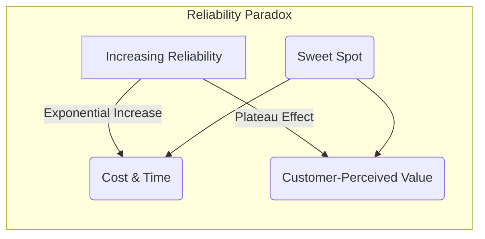

Sofia explains that aiming for perfect reliability not only drives up costs but also harms the bank's competitive position by delaying innovation. Around the room, executives look intrigued as she introduces the concept of "acceptable imperfection" as the key to balancing innovation and stability.

### Teaching Narrative

The most sophisticated reliability engineering transcends technical considerations to focus on business outcomes. This transition requires a fundamental shift in how reliability is communicated and valued within organizations—moving from technical metrics that engineers understand to business impacts that executives prioritize.

Creating the business case for reliability involves connecting technical performance to four key business dimensions:

1. **Revenue Impact**: Quantifying how reliability affects the organization's top line through:

   - Transaction completion rates and values
   - Customer acquisition and retention
   - Competitive differentiation and market share
   - Business opportunity enablement or limitation

2. **Cost Implications**: Identifying both the direct and indirect costs of unreliability:

   - Incident response and remediation expenses
   - Customer support and communication costs
   - Compensation, credits, and make-goods for affected customers
   - Technical debt accumulation and engineering productivity loss

3. **Risk Exposure**: Evaluating how reliability affects organizational risk:

   - Regulatory compliance and potential penalties
   - Security vulnerabilities and data protection
   - Reputation damage and brand impact
   - Contractual obligations and liability exposure

4. **Strategic Alignment**: Demonstrating how reliability enables business strategy:

   - Digital transformation enablement
   - New market entry requirements
   - Partnership and integration opportunities
   - Customer experience differentiation

For banking institutions, this business-centered approach is particularly critical. In financial services, reliability directly impacts revenue generation, regulatory compliance, and customer trust—three pillars of banking success. By quantifying these connections, technology leaders transform reliability from a cost center to a strategic investment with measurable returns.

This shift changes the fundamental conversation from "How many nines of availability do we need?" to "What business outcomes are we trying to achieve, and what reliability levels enable those outcomes?" This business-first framing ensures that reliability investments align with organizational priorities and receive appropriate executive support.

### Common Example of the Problem

A mid-sized regional bank's technology team struggled to secure funding for critical reliability improvements to their digital banking platform. Despite experiencing several customer-impacting incidents, their business case for reliability investment gained little traction with executive leadership.

The core problem lay in how the technology team framed their reliability discussion. Their proposal focused entirely on technical metrics and engineering concerns:

- "We need to improve our availability from 99.9% to 99.95%"
- "Our current architecture has single points of failure we need to address"
- "We should implement redundancy across all critical components"
- "We need additional infrastructure to handle peak loads"

While technically accurate, this framing failed to resonate with business executives. When the CFO asked, "What's the business impact of these investments?", the technology team struggled to articulate the value in business terms. They couldn't quantify how the proposed improvements would affect revenue, customer retention, or competitive position. Instead, they relied on vague assertions like "improved customer experience" and "reduced risk," without specific metrics or financial impacts.

This disconnect reached a critical point when the bank experienced a significant mobile banking outage during end-of-month bill payment processing. The 90-minute disruption prevented approximately 12,000 customers from accessing their accounts and making scheduled payments. However, in the post-incident review, the technology team reported the event as "a 0.021% availability impact for the month," minimizing its significance in purely technical terms rather than highlighting the business consequences.

To clarify the issue, consider the following table contrasting how reliability concerns were framed from a technical versus business perspective:

| **Aspect** | **Technical Framing** | **Business Framing** |
| ----------------------------- | ------------------------------------------ | --------------------------------------------------------------------------------- |
| **Availability Target** | "Improve from 99.9% to 99.95%" | "Prevent 12,000 customers from being unable to access accounts during peak times" |
| **Architecture Weakness** | "Address single points of failure" | "Reduce risk of outages that disrupt high-value transactions" |
| **Capacity Planning** | "Add infrastructure for peak loads" | "Ensure seamless experience during critical events like bill payments" |
| **Incident Impact Reporting** | "0.021% availability impact for the month" | "90-minute outage affecting 12,000 customers and end-of-month bill payments" |

The executive committee remained reluctant to approve the proposed reliability investments, viewing them as technical nice-to-haves rather than strategic business necessities. As one executive commented, "We can't justify spending millions on infrastructure when we can't see the direct business return."

### SRE Best Practice: Evidence-Based Investigation

Experienced SREs build business cases for reliability using these evidence-based approaches. To ensure practical application, a checklist summarizing these methods has been included below:

#### Checklist: Evidence-Based Approaches for Reliability Business Cases

- [ ] **Revenue Impact Quantification**:

  - Develop explicit financial models connecting reliability to revenue.
  - Example: Analysis of transaction data revealed that each hour of mobile banking downtime during business hours directly prevented ~$245,000 in transaction completion, with an additional ~$120,000 in indirect impact from reduced customer activity.

- [ ] **Customer Behavior Correlation**:

  - Establish clear relationships between reliability events and customer actions.
  - Example: Analysis showed that customers experiencing two or more significant incidents within 90 days reduced digital transaction volume by 31% and were 4.2x more likely to explore competitive options.

- [ ] **Competitive Benchmarking**:

  - Conduct structured comparisons of reliability against market alternatives.
  - Example: Assessment of eight competing financial institutions showed those with higher digital reliability achieved 2.3x greater customer acquisition rates and 1.8x higher mobile engagement metrics.

- [ ] **Incident Cost Analysis**:

  - Calculate the comprehensive financial impact of reliability events.
  - Example: A single 90-minute mobile banking outage resulted in ~$245,000 in direct costs (lost transaction revenue, incident response, customer support) and ~$830,000 in indirect costs (customer attrition, reduced engagement, brand damage), for a total impact of over $1M.

- [ ] **Reliability Investment ROI Modeling**:

  - Develop return-on-investment projections for reliability improvements.
  - Example: A $1.2M investment in platform reliability was projected to prevent ~$3.8M in annual incident costs, representing a 217% annual ROI and a 5.6-month payback period.

#### Summary Flow of Evidence-Based Investigation

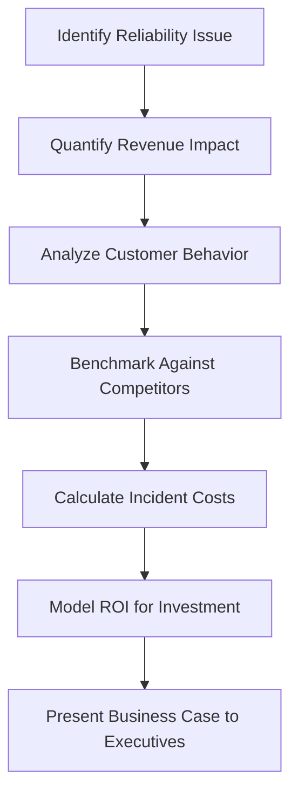

This checklist and flowchart provide actionable steps for SREs to systematically connect reliability metrics to business outcomes, ensuring alignment with organizational priorities and securing executive support.

### Banking Impact

Technical-centric reliability discussions create significant business consequences in banking environments. The cascading effects of underinvestment in reliability can be understood through the following flow:

```
Underinvestment in Reliability
        ↓
 Higher Incident Rates
        ↓
 Customer Dissatisfaction & Attrition
        ↓
 Revenue Loss & Market Share Decline
        ↓
 Increased Regulatory Scrutiny & Compliance Costs
        ↓
 Competitive Disadvantage
```

1. **Underinvestment in Critical Infrastructure**: Without clear business cases, reliability receives inadequate funding. Analysis showed that the regional bank's reliability investment had fallen to 7.2% of the technology budget compared to an industry average of 12-15%, directly contributing to a 34% higher incident rate than peers.

2. **Misaligned Executive Expectations**: Technical metrics fail to create appropriate risk awareness. Board and executive interviews revealed a significant perception gap, with leadership consistently underestimating reliability impact by 3-5x compared to actual financial consequences, leading to inadequate risk mitigation strategies.

3. **Customer Attrition Risk**: Reliability directly affects customer retention. Customer journey analysis showed that reliability incidents were a contributing factor in 23% of all account closures, representing approximately $3.2M in annual lost customer lifetime value that appropriate reliability investment could significantly reduce.

4. **Competitive Vulnerability**: Reliability gaps create market disadvantages. The bank's digital customer acquisition rate had fallen 12 percentage points below competitors with stronger reliability records, with prospective customers specifically citing "platform stability concerns" in account opening abandonment surveys.

5. **Regulatory Compliance Exposure**: Reliability directly affects regulatory standing. The bank had received two supervisory findings related to digital service availability over the past 18 months, creating additional compliance costs, potential penalties, and restrictions on new product launches that directly impacted revenue opportunities.

### Implementation Guidance

To build effective business cases for reliability in your banking environment:

1. **Develop Revenue Impact Models**: Create explicit financial frameworks connecting reliability to revenue. Implement systematic tracking of transaction volumes, values, and completion rates during normal operations and incidents. Develop statistical models showing how reliability metrics directly correlate with financial outcomes, and build projection tools that can demonstrate the revenue implications of different reliability levels.

2. **Implement Comprehensive Incident Costing**: Establish methodologies for calculating complete incident impact. Design and deploy a structured incident cost framework that captures all financial dimensions: direct costs (lost transactions, operational expenses), indirect costs (customer behavior changes, brand impact), and opportunity costs (delayed initiatives, competitive disadvantage). Ensure this framework produces executive-friendly summaries that clearly communicate business impact.

3. **Create Business-Centric Dashboards**: Develop visualization tools that connect reliability to business metrics. Build executive dashboards that display reliability alongside corresponding business outcomes—showing availability with transaction completion rates, latency with conversion metrics, and error rates with customer satisfaction scores. Design these tools to make reliability impact immediately understandable to non-technical stakeholders.

4. **Establish Reliability Business Reviews**: Implement regular sessions focused on business impact. Institute quarterly reliability business reviews with a structured format that emphasizes business outcomes rather than technical metrics. Include customer impact analysis, financial consequences, competitive comparisons, and ROI calculations for proposed improvements. Ensure these reviews involve both technology and business leadership.

5. **Develop Strategic Reliability Roadmaps**: Create forward-looking plans with clear business alignment. Build comprehensive reliability improvement roadmaps that explicitly connect technical initiatives to business objectives, with clear indications of expected business outcomes for each investment. Include measurable business key performance indicators alongside technical metrics, and establish regular review points to validate realized business impact.

## Panel 2: The Reliability Balance Sheet - Calculating the Cost of Downtime

### Scene Description

A financial analysis workshop where technology and finance teams collaborate to develop a comprehensive "Cost of Downtime" model for their banking services. On large displays, they map all potential impact categories with specific monetary values. The following table illustrates key downtime impact components discussed during the session:

| **Impact Category** | **Monetary Value** | **Example Scenario** |
| ------------------------------ | ------------------------------------------------------ | -------------------------------------------------------------- |
| **Direct Transaction Revenue** | $125,000/hour for the payment gateway | Lost revenue from failed payment transactions. |
| **Customer Support Costs** | $42,000 per major incident | Increased volume of support tickets and resolution expenses. |
| **Regulatory Penalties** | Up to $500,000 for reportable incidents | Fines for compliance breaches or unfulfilled service levels. |
| **Brand Impact** | Measured through Net Promoter Score (NPS) correlations | Long-term reputation damage leading to reduced customer trust. |

For each service, the team builds a detailed financial model that calculates per-minute downtime costs at different times of day and on different days of the week. Raj demonstrates a simulation tool that estimates the financial impact of historical incidents. For example, a recent 45-minute mobile banking outage resulted in a loss of approximately $1.2M. This tool highlights the variability of downtime costs based on service criticality and timing.

The team also debates valuation methodologies for indirect impacts such as customer attrition. They ultimately agree on a conservative approach to ensure finance leaders can support the model. The final dashboard, summarized as follows, presents a clear hierarchy of services based on downtime cost:

| **Service** | **Downtime Cost (per hour)** |
| ------------------ | ---------------------------- |
| Payment Processing | $2.1M |
| Mobile Banking | $1.6M |
| Fraud Detection | $1.2M |
| Internal Reporting | $5,000 |

This hierarchy enables the organization to prioritize reliability investments proportionally to business impact. The workshop concludes with the team recognizing that downtime during peak business hours may cost up to 10x more than equivalent downtime during off-hours. The most sophisticated models incorporate these variations and use probability-weighted scenarios to account for different failure modes and durations.

### Teaching Narrative

Creating a reliability balance sheet—a comprehensive financial model of downtime costs—transforms abstract reliability discussions into concrete business decisions. This model serves as the foundation for rational investment decisions, allowing organizations to allocate reliability resources proportionally to business impact rather than technical complexity or team preferences.

A complete downtime cost model includes several key components:

1. **Direct Revenue Impact**: Immediate financial losses due to transaction failures, calculated through:

   - Transaction volume × average value × profit margin × failure percentage
   - Time-based patterns that reflect business cycles (trading hours, payment windows)
   - Seasonal factors that influence transaction values and volumes

2. **Operational Costs**: Additional expenses incurred during and after incidents:

   - Incident response time (engineer hours × fully-loaded cost)
   - Customer support volume (additional tickets × resolution cost)
   - Recovery operations (data reconciliation, manual processing)
   - Post-incident analysis and remediation

3. **Compliance and Regulatory Impact**: Financial consequences of reliability failures in regulated environments:

   - Regulatory reporting requirements and associated costs
   - Potential fines and penalties for service level violations
   - Increased oversight and audit requirements following incidents
   - Compliance remediation expenses

4. **Customer Lifetime Value Impact**: Long-term financial effects on customer relationships:

   - Attrition rates following service disruptions
   - Customer acquisition costs to replace lost relationships
   - Reduced transaction volume from impacted customers
   - Reputation-driven new customer acquisition impact

For banking services with varying criticality levels, this financial modeling creates clear differentiation between high-impact services that warrant premium reliability investment and lower-impact services where moderate reliability is economically justified. It transforms subjective prioritization ("this feels important") into data-driven decision-making ("this service costs $X per minute of downtime").

The most sophisticated models also factor in time-based variations—recognizing that downtime during peak business hours might cost 10x more than equivalent downtime during off-hours—and employ probability-weighted scenarios to account for different failure modes and durations.

### Common Example of the Problem

A major commercial bank operated dozens of digital services without a clear understanding of their relative financial impact. When prioritizing reliability investments, they faced a persistent challenge: which systems deserved the most attention and resources?

The absence of a structured downtime cost model created several significant problems:

| **Issue** | **Example** | **Consequences** |
| --------------------------------------- | -------------------------------------------------------------------------------------------------------------------------------------------------------------------- | ---------------------------------------------------------------------------------------------------------------- |
| Misaligned Reliability Investments | The FX trading platform received extensive reliability measures due to its complexity, while the wire transfer system, processing over $2B daily, was deprioritized. | Critical systems with higher business impact were neglected, increasing the risk of severe financial losses. |
| Lack of Prioritization During Incidents | During simultaneous degradation of the corporate payment portal and internal reporting system, operations teams debated priorities without clear guidance. | Delayed response to high-impact incidents, potentially exacerbating customer dissatisfaction and financial loss. |
| Politicized Decision-Making | Business unit leaders lobbied for their systems based on subjective claims of importance rather than objective financial metrics. | Reliability decisions became influenced by organizational politics rather than data-driven business impact. |
| Inability to Justify Investments | The CTO struggled to justify a $4.2M reliability improvement proposal, offering vague references to "critical systems" without financial specifics. | The CFO rejected the investment due to a lack of clear cost-benefit analysis, stalling critical improvements. |

This approach reached a breaking point during the annual technology budget planning cycle. Without a reliability balance sheet, the technology team was unable to provide the financial justification needed for strategic investment. The CFO emphasized, "We can't make multi-million dollar investment decisions without understanding the explicit cost-benefit relationship." This highlighted the urgent need for a structured downtime cost model to align reliability investments with business impact.

### SRE Best Practice: Evidence-Based Investigation

Experienced SREs implement downtime cost modeling using structured, evidence-based approaches. The following step-by-step guide provides actionable practices for building and validating a reliable financial impact model.

#### Step-by-Step Guide to Evidence-Based Downtime Cost Modeling

1. **Identify Critical Services**

   - **Checklist**:
     - List all services provided by the organization.
     - Rank services by their business criticality (e.g., customer-facing vs. internal).
     - Prioritize services with direct revenue, regulatory, or customer experience impacts.
   - **Example**: Payment processing is identified as a Tier-1 service due to its $2.1M/hour downtime cost.

2. **Perform Service-by-Service Financial Analysis**

   - **Checklist**:
     - Gather relevant financial data (e.g., transaction volume, profit margins, operational costs).
     - Calculate direct revenue loss:\
       `Transaction volume × Average value × Profit margin × Failure rate`.
     - Include secondary costs: operational, regulatory, and customer impacts.
   - **Actionable Tip**: Break costs down into hourly and per-minute increments for easier comparison.
   - **Example**: Payment system downtime during business hours results in:
     - $145,000/hour in direct revenue loss.
     - $42,000/hour in operational costs.
     - $83,000/hour in customer-related impacts.
     - $37,000/hour in regulatory exposure.
     - **Total**: $307,000/hour.

3. **Incorporate Temporal Impact Variation**

   - **Checklist**:
     - Analyze time-based transaction patterns (e.g., busiest hours, month-end peaks).
     - Calculate cost multipliers for peak vs. off-peak periods.
   - **Example**: Month-end downtime costs are 3.2x higher than mid-month, while business-hour failures are 4.7x higher than overnight.

4. **Validate Models Using Historical Data**

   - **Checklist**:
     - Collect past incident data (e.g., duration, time of occurrence, business impact).
     - Compare predicted costs from the financial model to actual historical losses.
     - Adjust the model to improve accuracy.
   - **Example**: Back-testing the model against 24 months of incident history confirmed an 87% accuracy rate in predicting financial impacts.

5. **Analyze Customer Behavior Patterns**

   - **Checklist**:
     - Use customer analytics to identify post-incident behavior changes (e.g., attrition, reduced engagement).
     - Employ statistical methods (e.g., multivariate regression) to quantify impact.
   - **Example**: Customers exposed to 30+ minutes of payment disruption showed a 4.2% higher attrition rate over 90 days.

6. **Quantify Indirect Impacts**

   - **Checklist**:
     - Conduct surveys and market research to assess brand perception changes.
     - Analyze historical sales and cross-sell data to estimate opportunity costs.
   - **Example**: Brand impact is valued at $18,000/hour based on Net Promoter Score correlations, while reduced cross-sell opportunities add $26,000/hour.

7. **Iterate and Refine the Model**

   - **Checklist**:
     - Regularly update the model with new data (e.g., evolving business patterns, customer trends).
     - Include probability-weighted failure scenarios to address variability in incident types and durations.
   - **Actionable Tip**: Use simulations or forecasting tools to test the model under hypothetical scenarios.

#### Summary Checklist for Evidence-Based Downtime Cost Modeling

- [ ] Identify and prioritize critical services.
- [ ] Perform and document financial analysis for each service.
- [ ] Account for time-based variations in impact.
- [ ] Validate models against historical incidents and refine as needed.
- [ ] Analyze and quantify customer behavior impacts.
- [ ] Develop methodologies for indirect effects (e.g., brand impact, opportunity cost).
- [ ] Continuously iterate and improve the financial model.

By following this structured approach, SREs can create robust, evidence-backed downtime cost models that support strategic reliability investments and align with business priorities.

### Banking Impact

Without downtime cost modeling, banks face significant business consequences. The following table summarizes key quantitative impacts, followed by detailed explanations:

| Consequence | Financial Impact / Metric | Key Issue |
| --------------------------------------- | -------------------------------------------------------- | ------------------------------------------------------------------------------------------------- |
| Misallocated Reliability Investment | $3.2M annually | Resources directed to low-impact services, leaving critical systems under-protected. |
| Extended High-Impact Incidents | $4.8M annually in avoidable financial impact | Average time-to-resolution for high-value disruptions 2.3x longer without prioritized response. |
| Imbalanced Risk Management | Downtime costs range: $5,000/hour to $300,000+/hour | Uniform reliability targets (99.95%) misaligned with financial exposure, creating inefficiencies. |
| Inadequate Business Continuity Planning | High-revenue services left exposed in recovery scenarios | Technically complex systems prioritized over financially critical ones during disaster planning. |
| Ineffective Executive Communication | Incident impacts underestimated by 5-8x | Lack of visibility into true reliability economics leading to systematic underinvestment. |

#### Detailed Explanations:

1. **Misallocated Reliability Investment**: Analysis revealed that approximately $3.2M in annual reliability spending was allocated to services with minimal business impact. Meanwhile, critical systems exposing the bank to severe financial risks were underfunded, leading to a net negative return on investment (ROI) for reliability efforts.

2. **Extended High-Impact Incidents**: Without impact-based prioritization, incident response teams lacked clear guidance, significantly prolonging the resolution of critical outages. On average, high-value service disruptions took 2.3x longer to resolve, resulting in approximately $4.8M in avoidable financial losses annually.

3. **Imbalanced Risk Management**: The bank applied identical reliability targets (99.95%) across all services, despite downtime costs varying widely from $5,000/hour to over $300,000/hour. This misalignment led to over-investment in low-impact systems and under-protection for high-value services.

4. **Inadequate Business Continuity Planning**: Disaster recovery exercises often prioritized technically complex systems over financially critical ones. As a result, high-revenue services were left exposed during recovery scenarios, undermining the organization's financial resilience.

5. **Ineffective Executive Communication**: Without a reliability balance sheet, executives consistently underestimated the financial impact of seemingly "minor" incidents by 5-8x. This lack of accurate visibility drove underinvestment in reliability initiatives and increased overall institutional risk.

### Implementation Guidance

To implement effective downtime cost modeling in your banking environment:

1. **Create Service-Specific Financial Impact Templates**: Develop standardized frameworks for calculating downtime costs. Create comprehensive templates that capture all financial dimensions: transaction revenue impact, operational costs, customer experience effects, and regulatory/compliance exposure. Design these templates to accommodate different service types while maintaining consistent methodology across the organization.

2. **Implement Time-Weighted Impact Calculations**: Build models that account for temporal variations in downtime cost. Analyze transaction patterns, customer behavior, and business cycles to develop time-based weighting factors for different periods (business hours vs. off-hours, month-end vs. mid-month, etc.). Integrate these factors into your cost models to create realistic impact projections that reflect actual business patterns.

3. **Establish Multi-Factor Validation Process**: Develop approaches for verifying downtime cost models. Implement systematic validation through multiple methods: back-testing against historical incidents, finance team review of calculation methodologies, business unit confirmation of underlying assumptions, and regular recalibration based on actual incident outcomes. Create formal approval workflows for cost models to ensure broad organizational acceptance.

4. **Develop Impact Visualization Tools**: Create dashboards that make downtime costs immediately comprehensible. Build executive-friendly visualization systems showing the financial impact of different services, with appropriate filtering and exploration capabilities to examine specific dimensions or scenarios. Ensure these tools clearly communicate relative financial importance across your service portfolio.

5. **Integrate with Operational Systems**: Embed downtime cost data into day-to-day reliability processes. Incorporate financial impact metrics into incident management systems, alerting tools, prioritization frameworks, and change management processes. Ensure that operational teams have immediate access to financial impact data during critical decision moments, particularly during incident response and resolution prioritization.

## Panel 3: The Investment Calculus - Building ROI Models for Reliability

### Scene Description

A strategic planning session focuses on reliability investment decisions for the bank's digital transformation program. Multiple screens display sophisticated financial models comparing various reliability investment options. For the new wealth management platform, the team evaluates three reliability tiers with distinct architecture approaches:

- **Minimal Solution**: 99.9% availability
- **Robust Solution**: 99.95% availability
- **Premium Solution**: 99.99% availability

Each option details its implementation costs, operational expenses, and expected business outcomes based on reliability levels. Sofia presents a **net present value (NPV) analysis** for each scenario, combining implementation costs and the anticipated financial benefits from incident reduction. Risk models illustrate confidence intervals for each approach, with Monte Carlo simulations providing a range of potential outcomes.

The decision-making process unfolds as follows:

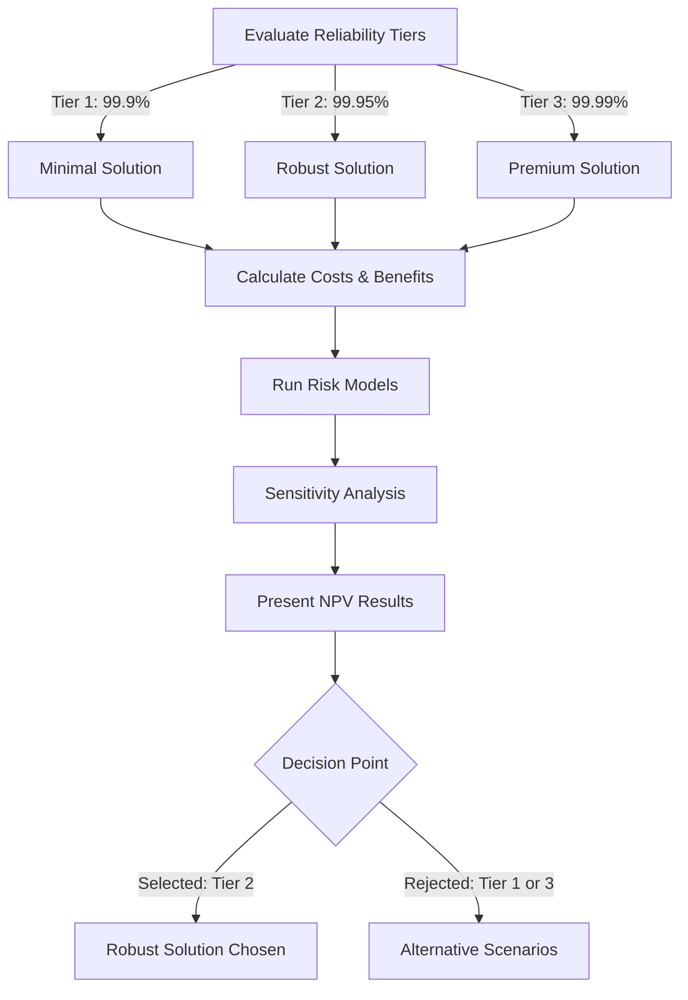

During the discussion, the CFO and CTO carefully weigh the trade-offs between cost, reliability, and risk. Ultimately, they select the middle option—the **Robust Solution (99.95%)**—based on its superior risk-adjusted return profile. This decision reflects a balanced approach, avoiding both the cheapest solution and the maximum reliability tier, which offers diminishing returns.

By using detailed financial models and simulations, the team ensures that their decision aligns with both business objectives and resource optimization.

### Teaching Narrative

Sophisticated reliability engineering requires not just measuring the cost of downtime, but developing comprehensive return on investment (ROI) models that compare different reliability investment options. These models enable organizations to make data-driven decisions about how much reliability is enough—finding the optimal balance point where additional investment no longer produces proportional returns.

Effective reliability ROI modeling involves several critical components:

1. **Investment Scenario Development**: Creating multiple reliability approaches with different characteristics:

   - Varying architecture patterns and technology choices
   - Different redundancy and resilience levels
   - Alternative operational models and support structures
   - Phased implementation approaches with incremental investment

2. **Total Cost Modeling**: Comprehensively calculating the full cost of each reliability approach:

   - Initial implementation and capital expenses
   - Ongoing operational and maintenance costs
   - Technical debt and future migration considerations
   - Opportunity costs of engineering resources

3. **Benefit Quantification**: Estimating the financial upside of improved reliability:

   - Reduced incident frequency and duration based on architectural improvements
   - Decreased downtime costs across all impact categories
   - Enhanced business capabilities enabled by improved reliability
   - Competitive advantages and market opportunities

4. **Risk-Adjusted Analysis**: Incorporating uncertainty and probability into financial projections:

   - Confidence intervals for cost and benefit estimates
   - Best/worst/expected case scenario development
   - Sensitivity analysis for key assumptions
   - Monte Carlo simulations for complex systems

For banking institutions evaluating major platform investments, these ROI models provide crucial guidance for appropriate reliability investment. They replace simplistic approaches ("more reliability is always better" or "minimum viable reliability") with nuanced economic analysis that recognizes both the value of reliability and its diminishing returns at extreme levels.

The most sophisticated organizations use these models to find the "reliability sweet spot" for each service—the investment level that maximizes business value by balancing implementation costs against downtime reduction benefits. This approach ensures that limited engineering resources are allocated to deliver maximum business impact rather than pursuing either under-engineered solutions that create unacceptable business risk or over-engineered systems with reliability levels beyond economic justification.

### Common Example of the Problem

A large retail bank was planning a next-generation digital banking platform to replace their aging system. The technology architecture team developed three potential reliability approaches:

| Approach | Availability | Architecture | Investment Cost | Estimated Downtime (per year) | Key Features |
| ------------ | ------------ | -------------------------- | --------------- | ----------------------------- | ---------------------------------------------- |
| **Basic** | 99.9% | Active-passive failover | $8.2M | ~8.76 hours | Limited redundancy, lower resilience |
| **Enhanced** | 99.95% | Active-active architecture | $12.7M | ~4.38 hours | Comprehensive redundancy, improved recovery |
| **Premium** | 99.99% | Multi-region resilience | $21.4M | ~0.88 hours | Zero-downtime capabilities, highest resilience |

Without a structured ROI framework, the decision process quickly devolved into competing opinions rather than data-driven analysis:

- The **engineering team** strongly advocated for the premium approach, arguing that "reliability is paramount for banking" and "anything less than the best is unacceptable for financial services." While they presented extensive technical justifications, they struggled to connect their recommendation to tangible business outcomes.

- The **finance team** pushed for the basic approach, focusing exclusively on implementation costs and dismissing the broader business impact of reliability differences. They treated reliability as a binary attribute—either the system worked or it didn’t—failing to account for the nuanced economic implications of incremental reliability improvements.

Most critically, the debate lacked a systematic methodology for comparing the options. Without explicit ROI models showing the expected business returns of each reliability tier, the discussion became increasingly subjective. Both sides resorted to emotional appeals rather than presenting clear economic arguments.

The situation reached an impasse during an executive committee meeting, where the CEO expressed frustration:

> "I'm being asked to make a multi-million dollar decision based on opinions rather than analysis. One side says we can't afford the premium option; the other says we can't afford not to choose it. What I need is a clear understanding of the business returns for each investment level."

The absence of reliability ROI modeling transformed what should have been a rational economic decision into a contentious battle of opinions, delaying the entire digital transformation program while teams argued without a shared analytical framework.

### SRE Best Practice: Evidence-Based Investigation

Experienced SREs implement reliability ROI modeling using these evidence-based approaches. To ensure clarity and actionable insights, the following checklist summarizes the critical steps:

#### Checklist: Key Actions for Evidence-Based Investigation

1. **Reliability Level Impact Modeling**

   - Quantify business outcomes at different reliability tiers.
   - Example: Analyze digital banking usage patterns to calculate downtime costs at each tier.
     - *Case Insight*: Improving from 99.9% to 99.95% availability reduced annual downtime costs by $4.2M, while further improvement to 99.99% yielded only $0.9M in additional savings.

2. **Total Cost of Ownership Analysis**

   - Develop comprehensive multi-year cost projections for each reliability option.
   - Factor in implementation, operational, and incident management costs.
     - *Comparison*: The enhanced approach ($12.7M initial + $3.6M annual) offered better lifetime economics than the basic ($8.2M initial + $4.8M annual) and premium ($21.4M initial + $3.2M annual) options.

3. **Net Present Value Calculation**

   - Use NPV to evaluate the economic value of each reliability tier.
   - Apply a consistent discount rate to compare lifetime financial outcomes.
     - *Result*: The enhanced approach delivered $6.3M in positive NPV versus $2.1M for the basic approach and negative $1.7M for the premium approach.

4. **Sensitivity Analysis**

   - Test the robustness of ROI projections under varying assumptions.
   - Systematically adjust critical factors such as incident frequency and implementation costs.
     - *Outcome*: The enhanced approach maintained a positive ROI in 87% of scenarios, while the premium option achieved positive returns in only 23% of scenarios.

5. **Opportunity Cost Assessment**

   - Evaluate trade-offs between reliability investments and other strategic priorities.
   - Consider the impact on timelines for alternative projects or features.
     - *Trade-Off*: Selecting the premium option would delay six customer-facing features, representing $8.7M in potential annual revenue, making the marginal reliability improvement unjustifiable.

#### Key Takeaways

- **Focus on Data-Driven Insights**: Use quantitative models to assess the financial and operational impacts of reliability investments.
- **Balance Reliability with Business Priorities**: Avoid over- or under-engineering by evaluating the diminishing returns of higher reliability levels and associated trade-offs.
- **Mitigate Risks Through Sensitivity Analysis**: Test assumptions to ensure your chosen option remains viable under uncertainty.
- **Leverage NPV for Decision-Making**: Make investment decisions based on economic value rather than intuition or pressure for the "best" reliability tier.
- **Consider Opportunity Costs**: Align reliability investments with broader organizational goals to maximize overall value.

By following this structured approach, SREs can build rigorous, evidence-based ROI models that guide strategic reliability investment decisions effectively.

### Banking Impact

The absence of reliability ROI modeling creates significant business consequences in banking environments. These impacts can be categorized as follows:

- **Systemic Overinvestment**:\
  Banks deploy excessive reliability without economic balancing, leading to wasteful spending.

  - Example: A retail bank's technology portfolio analysis revealed $14.3M annually spent on "reliability perfectionism" that delivered minimal additional business value.
  - Opportunity cost: These funds could have been redirected to customer-facing innovation projects.

- **Implementation Decision Paralysis**:\
  Subjective reliability debates delay critical programs and their associated benefits.

  - Example: A digital banking platform modernization faced a six-month delay due to unresolved reliability discussions.
  - Cost: Approximately $12M in delayed benefits and extended competitive vulnerability.

- **Engineering Resource Misallocation**:\
  Limited engineering resources are directed toward low-value initiatives, leaving high-value projects underfunded.

  - Data: Analysis showed 22% of engineering capacity dedicated to "extreme reliability" initiatives with negative ROI.
  - Impact: High-value customer-facing improvements remained under-resourced despite higher demonstrable returns.

- **Technology Strategy Misalignment**:\
  Reliability decisions often diverge from actual business needs.

  - Observation: Over-engineering low-impact internal systems while under-investing in high-value customer touchpoints.
  - Result: Misdirected technology investments that fail to align with strategic priorities.

- **Competitive Disadvantage**:\
  Poor reliability investment strategies hinder market competitiveness.

  - Finding: Digital-first challengers achieved 3.2x more customer-facing innovation per dollar spent by employing economic balancing for reliability decisions.
  - Risk: Opportunity costs create vulnerabilities and widen the gap against more agile competitors.

#### Summary of Consequences

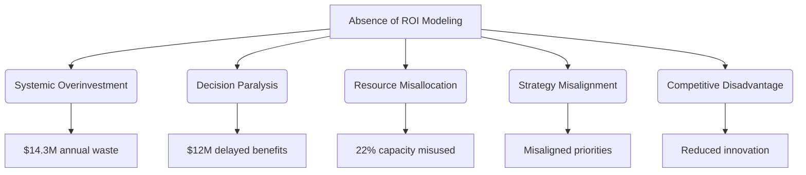

By addressing these issues with robust reliability ROI models, banks can optimize investments, align strategies with business goals, and maintain competitive advantage.

### Implementation Guidance

To implement effective reliability ROI modeling in your banking environment, follow this step-by-step process:

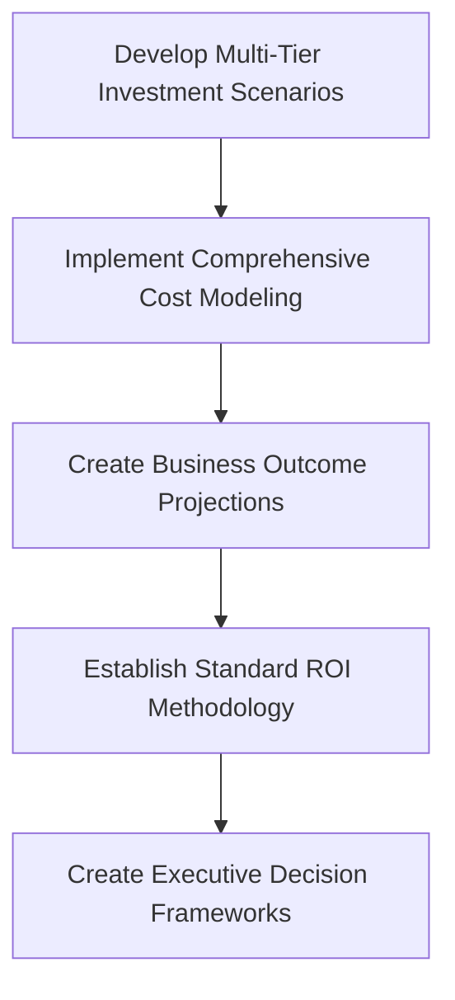

1. **Develop Multi-Tier Investment Scenarios**

   - Create structured reliability options with comprehensive characteristics.
   - For each significant system, define at least three distinct reliability approaches with clear technical specifications, implementation requirements, and expected performance characteristics.
   - Ensure these options represent genuinely different reliability philosophies rather than minor variations, providing meaningful economic choices.

2. **Implement Comprehensive Cost Modeling**

   - Build detailed financial projections for each reliability tier.
   - Create five-year total cost of ownership (TCO) models that capture all relevant expenses, including implementation costs, operational overhead, incident management, maintenance requirements, and future technical debt implications.
   - Validate these models with both engineering and finance teams to ensure completeness and accuracy.

3. **Create Business Outcome Projections**

   - Develop explicit benefit forecasts for different reliability levels.
   - Build financial models that quantify expected business impacts, such as reduced downtime costs, improved customer experience metrics, competitive positioning, and new business capabilities.
   - Base these projections on historical data, industry benchmarks, and validated customer impact models.

4. **Establish Standard ROI Methodology**

   - Implement consistent financial analysis techniques across all reliability investment evaluations.
   - Adopt standardized approaches like Net Present Value (NPV), Internal Rate of Return (IRR), and payback period calculations.
   - Develop templates and tools that apply these methodologies uniformly, ensuring clear documentation of assumptions and calculation methods.

5. **Create Executive Decision Frameworks**

   - Build structured approaches for making reliability investment decisions.
   - Develop decision matrices to systematically evaluate reliability options using multiple criteria: financial returns, risk profiles, strategic alignment, and implementation feasibility.
   - Create executive-friendly visualization tools to clearly communicate economic trade-offs, enabling informed and strategic business decisions.

By following these steps, organizations can systematically approach reliability ROI modeling, ensuring both technical rigor and strategic alignment in their investment decisions.

## Panel 4: Reliability as Competitive Advantage - Market Differentiation Through Quality

### Scene Description

A competitive analysis meeting brings together product and technology leaders to evaluate how reliability impacts their market position. The room is organized to facilitate detailed discussions and data-driven insights:

- **Central Dashboard**: A comprehensive display compares the banking platform's reliability metrics against major competitors and fintech challengers across multiple dimensions, such as uptime, response times, and incident resolution.

- **Customer Research Insights**: Data reveals that reliability has emerged as a critical factor for corporate banking clients, with 62% of RFPs now including uptime requirements. This emphasizes the growing importance of reliability in client decision-making.

- **Competitor Marketing Wall**: A dedicated section showcases competitors' marketing materials, highlighting their reliability claims, service level guarantees, and differentiating factors.

- **Exit Interview Data**: Alex presents findings from customer exit interviews, showing that reliability is the second most common reason for account closures, just behind fees.

- **Strategic Discussion**: The Chief Product Officer leads a debate on whether to introduce industry-leading SLAs as a differentiation strategy. The discussion explores the potential competitive advantages against the operational risks involved.

- **Segment Analysis**: The team examines specific market segments where reliability premiums exist—wealth management, corporate banking, and trading services. They develop targeted strategies tailored to each segment, addressing both technical requirements and marketing approaches.

#### Flow of Discussion

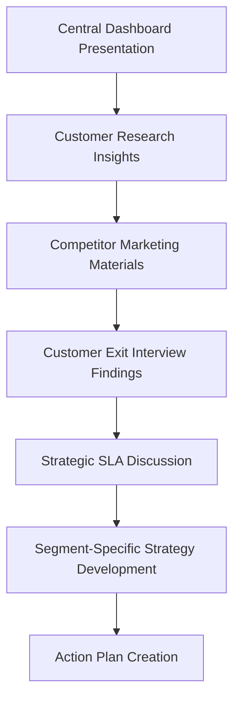

This structured flow ensures that all critical elements are addressed, culminating in actionable strategies that leverage reliability as a competitive advantage.

### Teaching Narrative

Beyond internal operational considerations, reliability increasingly functions as a critical market differentiator—a competitive advantage that directly influences customer acquisition, retention, and willingness to pay. Forward-thinking organizations actively manage reliability not just as a technical necessity but as a strategic market position.

Leveraging reliability as competitive advantage involves several sophisticated approaches:

1. **Market Positioning**: Deliberately establishing a reliability position relative to competitors:

   - Premium positioning with best-in-class reliability guarantees
   - Value positioning with appropriate reliability at competitive cost
   - Segmented positioning with tiered reliability options for different customer needs

2. **Reliability Signaling**: Communicating reliability capabilities to the market through:

   - Formal SLAs with specific commitments and compensation models
   - Transparency through public status pages and performance dashboards
   - Third-party verification and certification of reliability claims
   - Case studies and customer testimonials highlighting reliability benefits

3. **Competitive Intelligence**: Continuously monitoring competitor reliability performance:

   - Tracking published SLAs and public commitments
   - Monitoring service status and incident history
   - Gathering customer feedback about competitor reliability
   - Benchmarking reliability metrics against industry standards

4. **Value Capture**: Developing business models that monetize exceptional reliability:

   - Premium pricing tiers with enhanced reliability guarantees
   - Reliability-differentiated product offerings
   - Enterprise contracts with negotiated service levels
   - Reliability-dependent business capabilities

For banking services where trust is paramount, reliability differentiation can create substantial competitive advantage. Corporate banking clients may select partners based primarily on proven reliability track records, high-net-worth individuals may choose wealth management platforms that demonstrate exceptional uptime, and institutional investors may prefer trading platforms with superior performance guarantees.

The most sophisticated organizations regularly assess the "reliability premium"—how much additional revenue or market share they can capture through superior reliability—and use this assessment to guide appropriate investment. Rather than treating reliability as a cost to be minimized, they manage it as a strategic asset that can drive revenue growth and customer loyalty when positioned effectively.

### Common Example of the Problem

A mid-sized corporate banking institution struggled with diminishing market share despite offering competitive products and pricing. Their commercial banking division had experienced a troubling trend over the past 24 months, losing several large corporate clients to competitors.

Exit interviews revealed a surprising pattern: while product features and pricing were cited as satisfactory, reliability concerns were mentioned by 7 of 10 departing clients as a primary factor in their decision to switch providers. Specific feedback included:

- "We couldn't afford the transaction processing delays we frequently experienced"
- "Unpredictable system availability made it difficult to manage our treasury operations"
- "Our CFO lost confidence after several payment processing issues affected our vendor relationships"

The bank's technology team protested that their systems maintained "industry standard" reliability with 99.9% availability. However, further investigation revealed that competitors had recognized reliability as a strategic differentiator and had made significant investments to establish superior capabilities. The following table illustrates the competitive landscape and customer perceptions:

| **Aspect** | **Mid-Sized Bank** | **Competitor Actions** | **Customer Feedback** |
| -------------------------- | ---------------------------------------- | ----------------------------------------------------------------------------------------------------------- | ------------------------------------------------------------------------------------------------------- |
| **Reliability Guarantees** | 99.9% availability (industry standard) | Major competitor guarantees 99.99% availability with financial SLAs | "We couldn't afford the transaction processing delays we frequently experienced" |
| **Transparency** | Limited; no public performance reporting | Fintech challenger provides real-time status dashboards with historic metrics | "Unpredictable system availability made it difficult to manage our treasury operations" |
| **Service Tiers** | Single-tier offering | Competitor offers tiered reliability with premium clients receiving priority processing and dedicated infra | "Our CFO lost confidence after several payment processing issues affected our vendor relationships" |
| **RFP Alignment** | No structured SLA process | Competitors proactively address SLA requirements in RFPs | 62% of RFPs now include specific reliability requirements, which the bank struggles to meet effectively |

Despite having comparable or superior features in many areas, the bank found themselves at a competitive disadvantage because they viewed reliability purely as an operational concern rather than a market differentiator. The Chief Revenue Officer expressed frustration: "We're losing million-dollar relationships over reliability issues while simultaneously being told our systems are 'meeting standards' – something doesn't add up."

Most concerning, the sales team reported that 62% of recent RFPs from potential corporate clients now included specific reliability requirements and SLA expectations—yet the bank had no structured process for either establishing competitive reliability commitments or effectively communicating their actual capabilities to the market.

### SRE Best Practice: Evidence-Based Investigation

Experienced SREs leverage reliability as a competitive advantage using structured, evidence-based approaches. To make these practices actionable, follow the checklist below:

#### Evidence-Based Investigation Checklist

1. **Competitor Reliability Benchmarking**

   - ☐ Identify key competitors in your market segment (e.g., traditional banks, digital-first providers).
   - ☐ Gather publicly available data, including SLAs, uptime commitments, and incident reports.
   - ☐ Map competitors' reliability offerings against industry standards (e.g., 99.9-99.99% availability).
   - ☐ Create a summarized reliability landscape to identify where your organization stands relative to competitors.

2. **Customer Reliability Valuation**

   - ☐ Design surveys or interviews targeting a representative sample of customers (e.g., 200+ corporate banking clients).
   - ☐ Ask customers to rank reliability as a selection factor and quantify their willingness to pay for premium availability levels (e.g., 99.99% uptime).
   - ☐ Analyze patterns of willingness-to-pay for reliability tiers and use findings to prioritize investments.

3. **Reliability-Driven Selection Analysis**

   - ☐ Review recent RFPs or procurement documents to identify trends in reliability requirements.
   - ☐ Quantify the prominence of reliability as a selection criterion (e.g., % increase in RFPs mentioning SLAs).
   - ☐ Document examples of reliability-related rejections or successes in competitive bids.

4. **Revenue Impact Modeling**

   - ☐ Collect customer retention, acquisition, and pricing data for services impacted by reliability.
   - ☐ Use financial modeling to estimate incremental revenue opportunities from improved reliability (e.g., retention, acquisition, and premium pricing contributions).
   - ☐ Validate models with historical data and adjust based on market segment insights.

5. **Competitive Gap Assessment**

   - ☐ Benchmark your organization against market leaders using structured reliability criteria (e.g., SLAs, incident communication, and public reporting).
   - ☐ Identify specific gaps, such as:
     - ☐ Lack of formal SLAs with defined compensation.
     - ☐ Absence of public uptime or incident reporting mechanisms.
     - ☐ Insufficient client communication during service outages.
     - ☐ Limited data for sales teams to address reliability concerns.
   - ☐ Prioritize and assign ownership for closing critical gaps.

#### Step-by-Step Investigation Flow

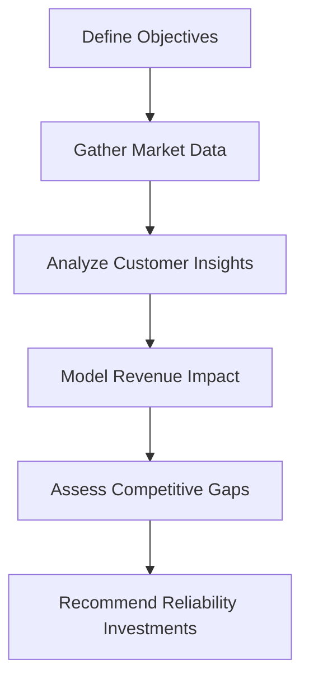

By following this checklist and structured process, SREs can provide actionable insights that directly link reliability improvements to competitive differentiation and business outcomes.

### Banking Impact

Failing to leverage reliability as a competitive advantage creates significant business consequences in banking environments:

1. **Client Acquisition Challenges**: Reliability gaps directly impact sales effectiveness. Analysis of lost corporate banking opportunities showed reliability concerns as a contributing factor in 43% of cases, representing approximately $12.7M in annual recurring revenue that more competitive reliability positioning could have secured.

2. **Premium Pricing Limitations**: Without reliability differentiation, services become commoditized. Market analysis revealed that competitors with documented reliability advantages commanded 8-14% premium pricing for equivalent services, representing a significant margin opportunity that reliability differentiation could enable.

3. **Market Segment Vulnerability**: Reliability-sensitive clients migrate to competitors. Client segmentation analysis showed the bank had experienced disproportionate attrition (37% higher than average) among "reliability-conscious" segments—particularly financial services firms, healthcare organizations, and large manufacturing clients—representing their most profitable customer segments.

4. **Sales Cycle Elongation**: Unaddressed reliability concerns extend procurement processes. Sales process analysis revealed that deals involving significant reliability discussions took 3.2x longer to close and required 2.7x more resources to address unstructured reliability questions, creating substantial sales inefficiency compared to competitors with established reliability positioning.

5. **Fading Market Reputation**: Reliability perceptions shape brand standing. Brand perception research showed the bank's "reliability and trustworthiness" ratings had declined 14 points over 24 months despite stable actual performance, driven by competitors' more effective reliability positioning and the bank's lack of proactive reliability communication.

#### Data Visualization: Impact of Reliability on Banking Outcomes

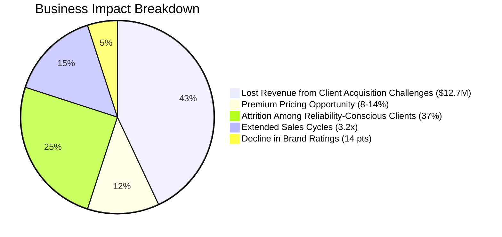

This visualization summarizes the quantitative impacts outlined above, emphasizing the critical areas where reliability gaps affect banking performance. By addressing these areas with targeted reliability strategies, the bank can recover lost revenue, improve profit margins, and strengthen its competitive position.

### Implementation Guidance

To leverage reliability as competitive advantage in your banking environment:

1. **Conduct Market-Driven Reliability Assessment**: Determine your competitive reliability position. Implement systematic competitive benchmarking of reliability capabilities, customer expectations, and market standards across your key segments. Document specific reliability differentiators valued by customers, identify competitive gaps in your current capabilities, and establish clear reliability positioning goals based on market intelligence rather than internal technical standards.

2. **Develop Formal Reliability Commitments**: Create explicit, market-facing reliability guarantees. Establish formal Service Level Agreements with specific, measurable commitments, backed by appropriate compensation models for missed targets. Design these SLAs with market differentiation in mind, focusing on metrics and guarantees most valued by customers rather than technical convenience. Ensure sales and marketing teams are equipped to effectively communicate these commitments.

3. **Implement Reliability Transparency Systems**: Build market-facing reliability reporting capabilities. Deploy public status dashboards showing current and historical performance against commitments, with appropriate detail for different audiences. Create incident communication mechanisms that provide clear, timely updates during service disruptions. Establish regular reliability reporting for clients that demonstrates your commitment to transparency and accountability.

4. **Create Segment-Specific Reliability Strategies**: Develop targeted approaches for different market segments. Implement distinct reliability positioning for each key customer segment based on their specific needs: enterprise-grade guarantees for corporate clients, performance-focused positioning for trading operations, and stability emphasis for retail banking. Ensure technical capabilities and commercial offerings align with segment-specific reliability expectations.

5. **Integrate Reliability into Go-to-Market Strategy**: Embed reliability positioning throughout customer engagement. Equip sales teams with reliability differentiation materials, competitive comparison data, and objection-handling training for reliability discussions. Update marketing materials to appropriately highlight reliability capabilities where they provide competitive advantage. Include reliability specialists in key client presentations and RFP responses to address technical questions with confidence and credibility.

## Panel 5: The Risk Portfolio - Balancing Reliability Across Services

### Scene Description

A risk management workshop where the bank's technology leaders are developing a comprehensive reliability risk portfolio approach. A large matrix display dominates the room, mapping all major banking services according to business criticality (y-axis) and current reliability investment (x-axis). The matrix reveals clear patterns: payment processing (high criticality) appropriately aligns with significant reliability investment, while internal reporting (lower criticality) has modest reliability targets. However, misalignments are also evident: a legacy loan processing system with moderate business impact has disproportionately high reliability investment due to historical priorities, while the rapidly growing mobile wealth management service shows insufficient reliability investment despite high revenue impact.

Below is a simplified text-based representation of the matrix display:

```
Business Criticality
  |
  |                             Payment Processing
  |                    [High Criticality, High Investment]
  |   Legacy Loan                          Mobile Wealth Management
  | [Moderate Criticality,       [High Criticality, Low Investment]
  |   High Investment]
  |---------------------------------------------------------------> Reliability Investment
```

As the workshop progresses, Sofia facilitates the team in recalibrating their reliability portfolio. Discussions focus on reallocating resources to achieve optimal business risk balance, targeting areas of misalignment. The Chief Risk Officer actively participates, providing input to align reliability decisions with the bank's broader risk management framework.

To guide this process, the team references a "reliability investment efficiency frontier" chart. This chart visualizes how the recalibrated portfolio achieves maximum business protection while optimizing engineering resource allocation. Below is a conceptual example:

```
Reliability Investment Efficiency Frontier
  |
  |                                  *
  |                             *          *
  |                        *                     Current Portfolio
  |                   *
  |             *
  |   *  Recalibrated Portfolio
  |---------------------------------------------------------------> Engineering Resources Allocated
```

Through these tools and discussions, the workshop demonstrates how visualizing and analyzing alignment between criticality and investment can drive smarter, more strategic decisions about reliability resource allocation.

### Teaching Narrative

As reliability engineering matures, leading organizations adopt portfolio management approaches that optimize reliability investment across multiple services rather than making isolated decisions. This portfolio perspective ensures that limited engineering resources provide maximum business protection by aligning reliability investment with business impact across the entire service catalog.

Effective reliability portfolio management involves several sophisticated practices:

1. **Service Categorization**: Systematically classifying services based on business characteristics:

   - Revenue contribution and financial impact
   - Customer visibility and experience impact
   - Regulatory requirements and compliance implications
   - Strategic importance and growth trajectory
   - Operational dependencies and integration criticality

2. **Investment Mapping**: Quantifying current reliability investment across services:

   - Infrastructure and redundancy costs
   - Engineering resources allocated to reliability
   - Operational support and incident response allocation
   - Monitoring and observability investment

3. **Alignment Analysis**: Identifying mismatches between business criticality and reliability investment:

   - Over-engineered services consuming disproportionate resources
   - Under-protected services creating unacceptable business risk
   - Legacy allocation patterns that don't reflect current priorities
   - Emerging services with rapidly changing risk profiles

4. **Portfolio Optimization**: Reallocating resources to maximize business protection:

   - Establishing target reliability levels proportional to business impact
   - Developing migration paths from current to optimal state
   - Creating frameworks for continuous portfolio rebalancing
   - Integrating reliability portfolio with broader technology governance

To make these practices actionable, the following checklist can guide practitioners in implementing a reliability portfolio management approach:

#### Reliability Portfolio Management Checklist

- **Service Categorization**

  - [ ] Identify and classify services based on business impact factors (e.g., revenue, customer experience, compliance).
  - [ ] Regularly review and update service categorizations as business priorities evolve.

- **Investment Mapping**

  - [ ] Quantify reliability investments across all services (e.g., infrastructure, engineering, monitoring).
  - [ ] Maintain visibility into the allocation of operational and support resources.

- **Alignment Analysis**

  - [ ] Analyze mismatches between business criticality and current reliability investments.
  - [ ] Flag over-engineered services and under-protected services for review.
  - [ ] Evaluate legacy and emerging service reliability profiles against current priorities.

- **Portfolio Optimization**

  - [ ] Define target reliability levels based on proportional business impact.
  - [ ] Develop and track migration plans to align services with target reliability investments.
  - [ ] Establish processes for continuous rebalancing of the reliability portfolio.
  - [ ] Integrate reliability decisions into the broader risk management and governance framework.

For banking institutions with diverse service catalogs spanning retail, commercial, wealth management, and investment banking functions, this checklist ensures that reliability investments are systematically aligned with business needs. It prevents common anti-patterns like excessive investment in legacy systems or insufficient protection for high-growth digital channels.

The most sophisticated organizations manage reliability as an investment portfolio with explicit risk-return characteristics, continuously adjusting allocations as business priorities evolve. This checklist enables teams to ensure that reliability resources flow to the services where they create maximum business value, avoiding allocation based on technical debt, team advocacy, or historical patterns.

### Common Example of the Problem

Managing a reliability portfolio without a structured approach is like managing a financial investment portfolio without proper strategy or analysis. Imagine an investor who pours money into old, underperforming stocks simply because they’ve owned them for years, while neglecting promising, high-growth opportunities because they’re new and less familiar. Over time, the portfolio becomes misaligned, failing to deliver the returns needed to meet critical financial goals. Similarly, when a technology organization manages reliability investments based on historical inertia or team preferences rather than business priorities, the result is a misaligned portfolio that cannot adequately protect the organization’s value.

A large financial institution faced exactly this challenge with over 200 distinct technology services spread across retail, commercial, and investment banking functions. Their reliability investments had grown haphazardly over time, resulting in significant misalignment:

- **Arbitrary Reliability Investment**: Some systems received extensive reliability engineering—redundant infrastructure, automated failover, and comprehensive monitoring—despite having moderate or minimal business impact. Conversely, high-impact services operated with minimal reliability protection, leaving critical customer-facing functions vulnerable to outages.

- **Historical Biases**: Legacy mainframe systems continued to consume disproportionate resources due to their age and perceived fragility, even as their business relevance waned. Meanwhile, rapidly growing digital channels, essential to the bank’s future competitiveness, were underfunded because they were newer and lacked a historical track record.

- **Inconsistent Standards Across Teams**: The wealth management division applied a rigid 99.99% availability standard to all services, regardless of their business importance, consuming significant resources unnecessarily. In contrast, the retail banking division struggled to achieve even 99.9% availability for critical customer-facing systems due to resource constraints. These discrepancies reflected internal politics and siloed decision-making rather than a unified, business-driven strategy.

The consequences of these misalignments became starkly evident during a major incident affecting mobile banking authentication. This high-visibility service, supporting millions of daily customer interactions, had received insufficient reliability investment and failed during a peak usage period. Post-incident analysis revealed that the same organization had allocated far greater resources to an internal reporting tool used by fewer than 200 employees, ensuring it operated on fully redundant infrastructure with extensive failover capabilities. When pressed by the CIO to explain why critical customer services were less protected than internal tools, the team could only respond, “That’s how it’s always been done.”

Without adopting a portfolio-based approach to reliability, the bank lacked the ability to evaluate whether their overall investment in reliability was protecting business value effectively. As a result, they couldn’t determine how to reallocate resources to better align with evolving priorities, leaving the organization exposed to unnecessary risk.

### SRE Best Practice: Evidence-Based Investigation

Experienced SREs implement reliability portfolio management using these evidence-based approaches. The table below summarizes each approach, its inputs, and expected outputs for improved clarity and usability.

| **Approach** | **Inputs** | **Expected Outputs** |
| ------------------------------------------ | ------------------------------------------------------------------------------------------------------------------------------- | ------------------------------------------------------------------------------------------------------------------------------------------------------------- |
| **Service Criticality Mapping** | - Standardized criteria: revenue impact, customer reach, regulatory requirements, strategic alignment<br>- Service catalog data | - Objective criticality ranking of services<br>- Identification of high-impact services with inadequate reliability investment |
| **Reliability Investment Quantification** | - Infrastructure costs<br>- Engineering resource allocation<br>- Operational support data | - Clear visibility into current reliability investment distribution<br>- Discovery of misalignments, e.g., 68% of resources allocated to 34% business impact |
| **Risk-Adjusted Return Calculation** | - Business impact data<br>- Current reliability spending<br>- Financial modeling inputs | - Optimized reliability levels proportional to business protection<br>- $14.7M annual reduction in expected business impact through reallocation of resources |
| **Portfolio Efficiency Frontier Analysis** | - Allocation strategies<br>- Mathematical optimization models | - Identification of the "efficiency frontier"<br>- Strategic reallocation opportunities for maximum risk-adjusted return |
| **Migration Impact Assessment** | - Transition scenarios<br>- Technology lifecycle events<br>- Disruption minimization strategies | - Sequenced action plan for rebalancing investments<br>- Minimization of operational disruption while addressing severe misalignments first |

This structured approach ensures that SRE teams leverage data-driven insights to guide reliability investment decisions, aligning resources with business priorities and maximizing overall risk-adjusted returns. By combining quantitative analysis with strategic planning, organizations can systematically achieve an optimal reliability portfolio.

### Banking Impact

Suboptimal reliability portfolio management creates significant business consequences in banking environments. The following summarizes five key impacts:

**1. Systemic Risk Exposure:**

- Misallocated resources create critical vulnerabilities.
- Example: $87M in annual transaction revenue left inadequately protected due to under-investment in high-impact services.
- Consequence: Increased business risk exposure that optimal allocation could mitigate.

**2. Inefficient Resource Utilization:**

- Portfolio imbalances waste limited resources.
- Example: $12.3M annually spent on services with minimal business impact.
- Consequence: Opportunity cost that could be redirected to higher-value protection.

**3. Inconsistent Customer Experience:**

- Reliability variations create unpredictable quality across services.
- Example: Client satisfaction scores vary by up to 32 points between over-protected and under-protected components.
- Consequence: Disjointed and inconsistent customer journeys.

**4. Technology Strategy Misalignment:**

- Reliability investment contradicts strategic direction.
- Example: Legacy systems scheduled for replacement received 3.2x more reliability investment per dollar of business impact than growth-focused digital channels.
- Consequence: Resources diverted from the bank's strategic priorities.

**5. Regulatory Compliance Challenges:**

- Unbalanced protection creates examination exposure.
- Example: Services with explicit compliance requirements received inadequate reliability investment.
- Consequence: Potential regulatory findings and penalties.

**Summary Visualization:**

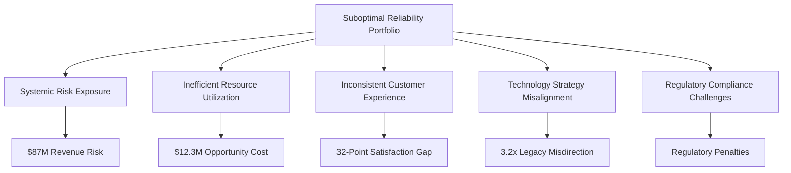

This structured approach provides clarity and highlights the critical impacts for decision-making.

### Implementation Guidance

To implement effective reliability portfolio management in your banking environment:

1. **Create Service Criticality Framework**: Develop systematic methodology for assessing business impact. Establish a comprehensive evaluation framework with weighted criteria: revenue impact, customer reach, regulatory requirements, strategic importance, and operational dependencies. Apply this framework consistently across all services to create an objective criticality ranking that transcends organizational boundaries and historical biases.

2. **Implement Reliability Investment Tracking**: Build systems to measure total reliability costs. Develop mechanisms to track all reliability-related expenses across services: infrastructure redundancy, engineering allocation, operational support, monitoring systems, and indirect costs. Create normalized metrics (e.g., reliability investment per transaction dollar) to enable meaningful cross-service comparison.

3. **Establish Target State Models**: Define appropriate reliability levels for different service types. Create a structured matrix connecting business criticality to reliability targets, with explicit mapping between service importance and appropriate reliability investment. Develop clear standards for different service tiers that balance protection with resource efficiency.

4. **Develop Portfolio Optimization Tools**: Build capabilities for analyzing allocation efficiency. Implement analytical systems that can model different reliability investment distributions and their expected business impact. Create visualization tools that clearly demonstrate current alignment gaps and highlight reallocation opportunities with the highest risk-adjusted returns.

5. **Create Governance Mechanisms**: Establish processes for managing reliability portfolio over time. Implement regular portfolio reviews (quarterly) with appropriate executive visibility and decision rights. Develop exception processes for deliberate deviations from optimal allocation. Create integration points with broader technology governance to ensure reliability investment remains aligned with evolving business priorities and technology strategy.

## Panel 6: Regulatory Economics - Compliance as a Reliability Driver

### Scene Description

A joint session between the bank's technology team and regulatory compliance officers focused on the reliability implications of new financial regulations. Documents on display show specific regulatory requirements with direct reliability impact:

- **Transaction Processing Guarantees**: Ensuring availability and accuracy of critical financial transactions.
- **Data Retention Obligations**: Meeting stringent data storage and retrieval requirements.
- **Recovery Time Objectives**: Aligning business continuity plans with mandated recovery expectations.
- **Security Verification Requirements**: Achieving compliance with data protection and integrity standards.

Compliance executives highlight the increasing regulatory penalties for service disruptions, presenting a case study where another bank faced a $5M fine for a trading platform outage that compromised market integrity. Raj delivers a detailed analysis of key reliability requirements derived from multiple regulatory frameworks—such as PSD2 for payment services, MIFID II for trading platforms, and GDPR for data protection.

The session emphasizes a structured approach to compliance-driven reliability engineering. The team demonstrates the flow from regulatory obligations to actionable reliability targets, including Service Level Objectives (SLOs), and introduces the concept of a "regulatory reliability premium." This premium represents the additional reliability investment required to meet compliance standards beyond what would be justified by business economics alone.

Below is a simplified flow diagram illustrating this process:

```mermaid
flowchart TD
    A[Regulatory Frameworks] -->|Define Requirements| B[Compliance Obligations]
    B -->|Traceability| C[Technical Translation]
    C -->|Develop| D[Compliance-Driven SLOs]
    D -->|Calculate| E[Regulatory Reliability Premium]
    E -->|Balance| F[Investment Decisions]
    subgraph Regulatory Examples
        PSD2
        MIFID_II
        GDPR
    end
    A --> Regulatory Examples
```

This framework enables the team to align regulatory mandates with technical implementation in a traceable and efficient manner. By integrating these considerations into a unified reliability model, the bank ensures compliance while maximizing business value, balancing compliance obligations against broader strategic priorities.

### Teaching Narrative

In highly regulated industries like banking, regulatory requirements often become primary drivers of reliability engineering practices. These compliance obligations create a distinct economic framework where reliability investment decisions must balance traditional business ROI against regulatory risk mitigation.

Effective management of regulatory reliability economics involves several specialized practices:

1. **Regulatory Mapping**: Explicitly connecting compliance requirements to reliability implications:

   - Availability obligations for essential financial services
   - Recovery time objectives for business continuity compliance
   - Data integrity and protection requirements
   - Processing accuracy and auditability obligations
   - Reporting and notification requirements during incidents

2. **Penalty Risk Modeling**: Quantifying the financial exposure created by reliability failures:

   - Direct regulatory fines and penalties
   - Remediation requirements and associated costs
   - Enhanced supervision and examination expenses
   - Reputation damage within regulatory community
   - Potential business restrictions following significant violations

3. **Compliance-Driven SLOs**: Translating regulatory obligations into technical reliability objectives:

   - Minimum availability thresholds for regulated services
   - Maximum allowable outage durations
   - Required redundancy and resilience characteristics
   - Mandated testing and verification processes
   - Documentation and evidence expectations

4. **Regulatory Premium Calculation**: Determining when compliance requirements necessitate reliability beyond business ROI:

   - Identifying where regulatory minimums exceed economic optimums
   - Quantifying the additional investment needed for compliance
   - Optimizing implementation to satisfy requirements efficiently
   - Integrating regulatory and business drivers in investment models

For banking institutions operating under complex regulatory frameworks like Basel III, MIFID II, PSD2, and various national banking regulations, these regulatory considerations often establish the effective floor for reliability investment. While business economics might justify 99.9% availability for a particular service, regulatory requirements might mandate 99.95% with specific recovery capabilities, establishing the minimum acceptable reliability independent of direct business ROI calculations.

The most sophisticated organizations develop integrated models that combine business economics and regulatory requirements into unified reliability investment frameworks. These models enable appropriate allocation decisions that satisfy compliance obligations while maximizing business value within those constraints, rather than treating regulatory requirements and business needs as separate and potentially conflicting considerations.

### Common Example of the Problem

A European bank's digital transformation team encountered significant challenges when launching a new cross-border payment service. Their initial reliability design was based entirely on business economics, with a target of 99.9% availability that internal modeling suggested would provide optimal return on investment.

However, as the launch date approached, the compliance team identified several regulatory requirements that the proposed architecture couldn't satisfy:

- The EU's Payment Services Directive 2 (PSD2) required "high availability" for critical payment infrastructure.
- European Banking Authority guidelines specified maximum recovery time objectives significantly shorter than the planned architecture could support.
- Local regulations in three countries required continuous transaction monitoring capabilities beyond the planned implementation.
- Cross-border transaction regulations mandated specific data persistence and auditability that required additional reliability measures.

This late identification of regulatory requirements created several significant problems:

| **Regulatory Gap** | **Impact** |
| ------------------------------------------ | ------------------------------------------------------------------------- |
| PSD2 "high availability" requirement | Required re-engineering for higher availability, adding €2.7M in costs. |
| Recovery time objectives (RTOs) | Redesign caused a 4-month launch delay, reducing competitive positioning. |
| Continuous transaction monitoring | Needed unplanned system enhancements, increasing project complexity. |
| Data persistence and auditability mandates | Introduced new compliance overhead, impacting ROI projections. |

#### Key Outcomes

- **Redesign Costs**: The architecture had to be significantly redesigned to comply with regulatory requirements, leading to additional unplanned investment of €2.7M.
- **Launch Delays**: The need for compliance-driven changes delayed the launch by 4 months, directly affecting revenue projections and competitive positioning in the market.
- **Organizational Tensions**: Misalignment between technology and compliance teams led to inefficiencies, with technology perceiving regulatory demands as "arbitrary constraints" and compliance asserting their non-negotiable legal nature.
- **Economic Viability**: The additional compliance-driven reliability investments negatively impacted the financial model, forcing leadership to reconsider the service's overall ROI.

#### Lessons Learned

This scenario highlighted a critical gap in the bank's reliability planning process: the absence of a systematic approach to integrating regulatory requirements into reliability design from the outset. By treating compliance as an afterthought rather than a foundational design parameter, the organization faced avoidable costs, delays, and inefficiencies.

To prevent similar issues in the future, the following checklist can guide teams in aligning reliability planning with regulatory compliance:

#### **Checklist: Incorporating Regulatory Requirements into Reliability Planning**

- [ ] Conduct early regulatory mapping to identify availability, RTO, and monitoring obligations.
- [ ] Validate that proposed architectures meet all compliance-driven data persistence and auditability requirements.
- [ ] Quantify the financial impact of regulatory-driven reliability requirements on the project ROI.
- [ ] Establish cross-functional collaboration between technology and compliance teams to ensure alignment.
- [ ] Develop a traceable methodology to integrate regulatory obligations into SLOs and reliability investments.

By adopting these practices, organizations can proactively align their reliability strategies with regulatory requirements, avoiding unnecessary costs and ensuring compliance is fully integrated into the design process.

### SRE Best Practice: Evidence-Based Investigation

Experienced SREs manage regulatory reliability economics using these evidence-based approaches. The following structured table and diagram summarize key practices and their associated outcomes for improved clarity and practical application.

#### Summary Table of Practices and Outcomes

| Practice | Description | Key Outcomes |
| ------------------------------------------------ | --------------------------------------------------------------------------- | ---------------------------------------------------------------------------------------------------------------------------------- |
| **Comprehensive Regulatory Requirement Mapping** | Create explicit connections between regulations and technical requirements. | Identified 37 provisions with direct reliability implications: 12 availability, 8 recovery time, 17 data obligations. |
| **Compliance Cost Optimization** | Develop efficient approaches to satisfy regulatory requirements. | €850,000 in potential savings through optimized architectures meeting compliance needs with minimal additional infrastructure. |
| **Penalty Exposure Quantification** | Calculate potential regulatory consequences of reliability failures. | Quantified risks: €4.5M for severe outages, €2.8M for data failures, plus potential restrictions on service launches. |
| **Economic Integration Modeling** | Develop unified frameworks combining business and regulatory drivers. | Integrated architecture delivered higher risk-adjusted return, balancing penalty avoidance and efficiency. |
| **Regulatory Change Impact Assessment** | Evaluate how evolving regulations affect reliability requirements. | Identified future obligations within 24 months, enabling proactive designs to reduce compliance costs versus reactive adaptations. |

#### Evidence-Based Investigation Workflow

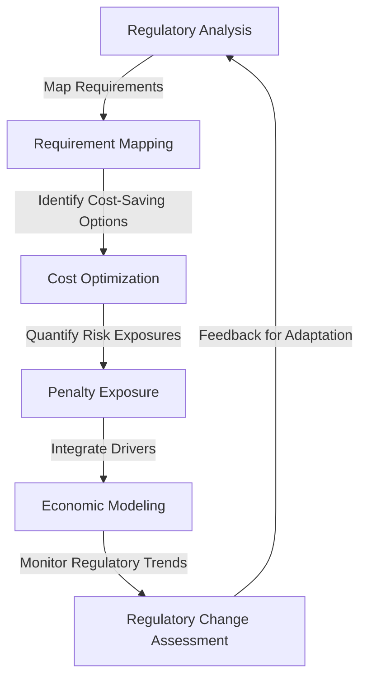

This workflow illustrates how SREs systematically approach regulatory reliability economics, starting with requirement mapping and progressing through optimization, risk quantification, and economic modeling. It emphasizes continuous monitoring and adaptation to evolving regulatory landscapes for sustained reliability and compliance.

### Banking Impact

Inadequate regulatory reliability management creates significant business consequences in banking environments:

#### Key Impacts Breakdown

1. **Launch Delays and Redesign Costs**:

   - Late compliance identification disrupts development timelines.
   - European bank analysis showed:
     - Average timeline extension: **3.2 months** for major service launches.
     - Increased implementation costs: **15-22%** due to late-stage modifications.

2. **Penalty and Remediation Exposure**:

   - Reliability designs failing regulatory requirements create financial risks.
   - Risk modeling results:
     - Potential exposure per significant incident: **€3.7M-€6.2M**.

3. **Supervision Escalation**:

   - Reliability failures lead to increased regulatory oversight intensity.
   - Supervisory analysis:
     - Banks with compliance-related incidents faced **2.7x more intensive examination** in subsequent cycles.

4. **Competitive Restriction**:

   - Regulatory concerns impair business agility and market competitiveness.
   - Historical patterns:
     - Banks under enhanced supervision experienced **7-month delays** in new product approvals compared to compliant competitors.

5. **Inefficient Compliance Implementation**:

   - Reactive compliance approaches significantly increase total costs.
   - Comparative analysis:
     - Proactive incorporation of regulatory requirements into initial designs costs **~60% less** than retrofitting compliance later.

#### Visualizing the Data

To better illustrate these impacts, the following bar chart summarizes the quantified consequences of inadequate regulatory reliability management:

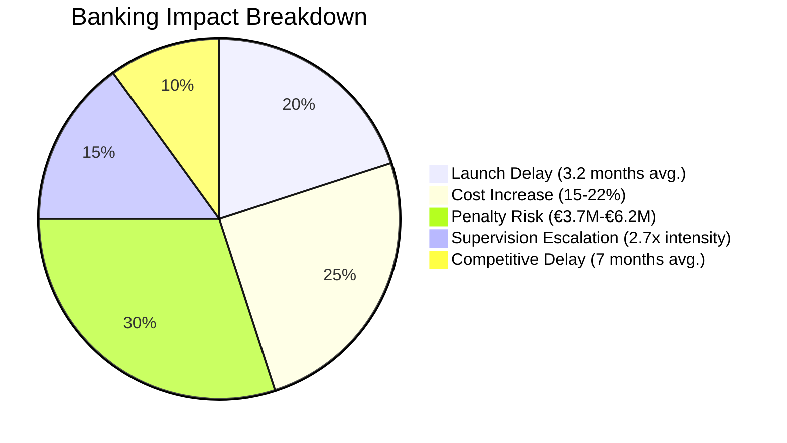

By examining these impacts, it becomes clear that integrating compliance requirements into reliability design early not only mitigates financial risks but also enables competitive advantages, reduced costs, and improved regulatory standing.

### Implementation Guidance

To effectively manage regulatory reliability economics in your banking environment:

1. **Create Regulatory Reliability Framework**: Develop a structured approach for connecting compliance to technology. Establish a comprehensive framework that systematically maps regulatory requirements to specific reliability implications, with clear documentation of how each obligation affects availability targets, recovery objectives, data management, and other technical parameters. Create a central repository of these requirements accessible to both technology and compliance teams.

2. **Implement Early-Stage Compliance Integration**: Embed regulatory considerations into initial planning. Modify your technology planning process to incorporate compliance review during concept and design phases rather than late-stage validation. Create standardized templates for reliability requirements that explicitly address regulatory obligations alongside business needs, ensuring integrated consideration from the beginning.

3. **Develop Unified Economic Models**: Build frameworks that combine business and regulatory drivers. Create financial models that simultaneously account for traditional business ROI factors (revenue protection, customer experience) and compliance considerations (penalty avoidance, supervision costs). Develop visualization tools that clearly demonstrate how regulatory requirements affect the economic optimization point for reliability investment.

4. **Establish Cross-Functional Governance**: Create collaborative processes for managing regulatory reliability. Implement joint technology-compliance working groups with clear decision frameworks for reliability requirements. Develop escalation paths for resolving conflicts between business optimization and compliance obligations. Create shared accountability systems that recognize both technology and compliance contributions to effective reliability solutions.

5. **Build Regulatory Change Management Processes**: Develop mechanisms for adapting to evolving requirements. Implement proactive regulatory monitoring that identifies emerging obligations with reliability implications. Create impact assessment workflows that evaluate how regulatory changes affect existing and planned services. Develop adaptation roadmaps that efficiently integrate new requirements into your reliability architecture with minimal disruption and cost.

## Panel 7: Beyond Incidents - The Complete Reliability Economic Picture

### Scene Description

A board-level strategic presentation where the CTO and CFO jointly present a comprehensive economic analysis of reliability for the bank's digital transformation initiative. Rather than focusing narrowly on incident costs, their analysis spans the complete financial impact of reliability across multiple dimensions. One section shows how reliability enables specific business capabilities—their new real-time payment platform requires 99.99% availability to meet market expectations, directly enabling $45M in projected annual revenue. Another section quantifies how reliability affects development velocity, with balanced reliability practices accelerating time-to-market by reducing rework and stabilization periods. A third analysis demonstrates how appropriate reliability investment reduces technical debt accumulation and improves long-term economics. The board members engage deeply with this comprehensive picture, asking sophisticated questions about reliability-business relationships. The final slides present reliability not as a cost center but as a strategic enabler with concrete economic benefits spanning revenue generation, operational efficiency, risk management, and competitive differentiation.

To summarize the core economic dimensions of reliability and their financial impacts, the following text diagram provides clarity:

```
+------------------------+---------------------------+
| Economic Dimension     | Financial Impacts        |
+------------------------+---------------------------+
| Capability Economics   | - $45M annual revenue    |
|                        | - New market access      |
|                        | - Service monetization   |
+------------------------+---------------------------+
| Velocity Economics     | - Faster time-to-market  |
|                        | - Reduced rework costs   |
|                        | - Predictable planning   |
+------------------------+---------------------------+
| Technical Debt         | - Lower maintenance and  |
| Economics              |   operational costs      |
|                        | - Extended system lifespan|
|                        | - Increased productivity |
+------------------------+---------------------------+
| Talent Economics       | - Reduced burnout        |
|                        | - Higher retention rates |
|                        | - Efficient on-call      |
+------------------------+---------------------------+
```

This framework helps the board visualize how reliability investments translate into tangible business value across multiple dimensions, strengthening the case for integrating reliability into the bank's strategic planning.

### Teaching Narrative

The most sophisticated reliability economics transcends simple incident cost analysis to develop a comprehensive understanding of how reliability affects every aspect of technology economics. This holistic perspective recognizes that reliability impacts far more than just downtime costs—it fundamentally shapes an organization's ability to execute its business strategy through multiple economic pathways.

A complete reliability economic picture includes several dimensions that traditional approaches often overlook:

1. **Capability Economics**: How reliability enables or constrains business capabilities and revenue opportunities:

   - New product and service possibilities unlocked by reliability levels
   - Market segments accessible only with specific reliability characteristics
   - Partnership and integration opportunities dependent on reliability
   - Pricing and monetization options enabled by service guarantees

2. **Velocity Economics**: How reliability practices affect development speed and time-to-market:

   - Reduced rework and emergency fixes through proactive reliability
   - Confidence to deploy more frequently with strong reliability practices
   - Decreased stabilization periods following major releases
   - Improved planning predictability with fewer disruptions

3. **Technical Debt Economics**: How reliability investment affects long-term technology economics:

   - Reduced accumulation of reliability-related technical debt
   - Lower maintenance and operational burden
   - Extended system lifespan through sustainable reliability practices
   - Improved engineering productivity and reduced firefighting

4. **Talent Economics**: How reliability affects human capital costs and capabilities:

   - Reduced burnout and turnover from reliability-related stress
   - Improved ability to attract and retain engineering talent
   - Enhanced skills development through proactive rather than reactive work
   - More efficient on-call rotations and support models

For banking institutions navigating complex digital transformations, this comprehensive economic perspective ensures that reliability receives appropriate strategic consideration. Rather than viewing reliability narrowly as a technical requirement or cost center, it positions reliability as a fundamental business capability that enables strategy execution across multiple dimensions.

The most sophisticated organizations integrate reliability economics directly into their technology strategy development, ensuring that reliability considerations inform business planning from the earliest stages rather than emerging as constraints only during implementation. This integrated approach creates technology economics that reflect the full business value of reliability rather than just its direct operational costs.

### Common Example of the Problem

A global bank embarked on a major digital transformation program with a $250M budget over three years. The business case focused exclusively on customer-facing capabilities—mobile features, personalized experiences, AI-powered insights, and streamlined customer journeys.

Reliability was mentioned only briefly in technical appendices, treated as an implementation detail rather than a strategic consideration. This narrow framing created several significant challenges:

| **Challenge** | **Consequence** | **Missed Opportunity** |
| -------------------------------------------------- | ------------------------------------------------------------------------------------------------- | ------------------------------------------------------------------------------------------------------ |
| Reliability treated as a cost center | Systematic underinvestment in reliability capabilities | Positioning reliability as a strategic enabler to optimize long-term business outcomes |
| Economic model omitted reliability dimensions | Unrealistic assumptions about release cadence and feature delivery | Integrating velocity, technical debt, and talent considerations into economic planning |
| Roadmap ignored reliability-driven constraints | Feature delivery fell ~40% behind projections due to rework and stabilization needs | Leveraging proactive reliability practices to maintain velocity and deliver features on schedule |
| Leadership lacked a cohesive reliability framework | Inability to explain reliability’s impact beyond incident metrics during board-level discussions | Establishing a comprehensive reliability-economic framework to align business and technical priorities |
| Unsustainable reliability practices | Talent attrition, with senior engineers citing reliability issues as a primary reason for leaving | Creating sustainable engineering practices to attract and retain top talent |

The consequences became apparent midway through the program. Feature delivery had fallen approximately 40% behind projections, primarily due to reliability-related rework and stabilization needs that weren't factored into the original timeline. Several key features had been delayed or descoped due to reliability constraints that emerged only during implementation. The program also encountered unexpected talent challenges, with several senior engineers departing specifically citing "unsustainable reliability practices" as their primary reason for leaving.

When the board questioned these shortfalls, the program leadership lacked a cohesive framework to explain how reliability was affecting the transformation's economics beyond simple incident metrics. The narrow economic perspective embedded in the original business case made it impossible to provide a comprehensive explanation of reliability's true impact on the program's performance and expected outcomes.

### SRE Best Practice: Evidence-Based Investigation

Experienced SREs develop comprehensive reliability economics using these evidence-based approaches. The following checklist summarizes key practices to ensure actionable, data-driven insights for your organization:

#### Evidence-Based Investigation Checklist

1. **Capability Enablement Analysis**

   - Quantify how reliability unlocks business opportunities.
   - Example: Conduct detailed market analysis to determine required reliability thresholds for new products or services.
   - Validate with financial projections (e.g., $42M annual revenue enabled by 99.95% availability for a real-time payment platform).

2. **Velocity Impact Quantification**

   - Measure the relationship between reliability practices and development speed.
   - Compare teams with mature reliability practices (e.g., proactive monitoring, automated testing) against reactive counterparts.
   - Example: Track feature delivery rates; mature teams may deliver 37% more features annually while allocating capacity to reliability work.

3. **Technical Debt Correlation**

   - Evaluate how investments in reliability reduce long-term maintenance and operational costs.
   - Perform longitudinal studies to link capacity allocation to cost savings.
   - Example: 1% capacity invested in reliability engineering reduces maintenance costs by 2.7% over three years.

4. **Talent Economics Assessment**

   - Quantify the impact of reliability practices on team retention and recruitment costs.
   - Analyze HR data for turnover rates and associated costs.
   - Example: Reliability-related turnover costs $85,000 per departure; frequent incidents correlate with 2.8x higher turnover rates.

5. **Holistic Economic Modeling**

   - Develop integrated models to capture all economic impacts of reliability.
   - Combine data from capability, velocity, technical debt, and talent dimensions.
   - Example: Financial models show a 32% ROI increase with balanced reliability investment, despite higher initial costs.

#### Summary Framework

For visualizing these practices, the following textual representation outlines the interconnected dimensions of reliability economics:

```
+-----------------------+
| Capability Economics  |
| (Revenue Opportunities)|
+-----------+-----------+
            |
+-----------v-----------+
|   Velocity Economics   |
| (Time-to-Market Gains) |
+-----------+-----------+
            |
+-----------v-----------+
| Technical Debt Economics|
| (Long-Term Cost Savings)|
+-----------+-----------+
            |
+-----------v-----------+
|   Talent Economics     |
| (Human Capital Impact) |
+-----------------------+
            |
+-----------v-----------+
| Holistic Economic Model|
| (Integrated ROI View)  |
+-----------------------+
```

By following this checklist and leveraging these interconnected practices, SREs can drive strategic reliability decisions with measurable business outcomes, ensuring alignment with organizational goals.

### Banking Impact

Narrow reliability economics creates significant business consequences in banking environments. The following chart summarizes five key impacts and their quantified effects observed in major transformation initiatives:

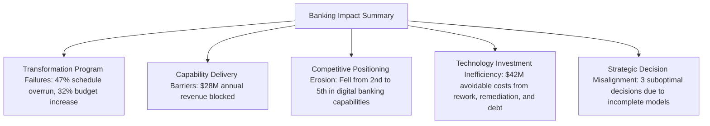

1. **Transformation Program Failures**: Limited economic models lead to unrealistic planning. Analysis of major bank transformation initiatives showed that programs using narrow reliability economics experienced an average 47% schedule overrun and 32% budget increase, with reliability challenges cited as the primary contributor in 68% of cases.

2. **Capability Delivery Barriers**: Reliability constraints block strategic objectives. The global bank's digital transformation delivered only 63% of planned capabilities within the original timeframe, with reliability limitations specifically preventing implementation of several high-value features representing approximately $28M in annual revenue opportunity.

3. **Competitive Positioning Erosion**: Inadequate reliability impedes market differentiation. Competitive analysis showed the bank had fallen from 2nd to 5th position in digital banking capabilities relative to peers during the transformation, with reliability-related delivery delays directly contributing to their declining market position.

4. **Technology Investment Inefficiency**: Narrow perspectives create poor resource allocation. Financial analysis revealed approximately $42M in avoidable costs within the transformation program due to reliability-related rework, emergency remediation, and technical debt accumulation that appropriate initial investment would have substantially reduced.

5. **Strategic Decision Misalignment**: Incomplete economic models drive poor choices. Board and executive interviews revealed that limited reliability economic understanding had directly contributed to at least three significant strategic decisions that subsequently proved suboptimal, including platform selection, development methodology, and sourcing approach.

### Implementation Guidance

To implement comprehensive reliability economics in your banking environment:

1. **Develop Multi-Dimensional Economic Framework**: Create models that capture all reliability impacts. Build comprehensive financial frameworks that explicitly address all economic dimensions: capability enablement, velocity effects, technical debt implications, and talent economics. Design these models to provide balanced perspectives on both short-term costs and long-term benefits, with appropriate quantification of traditionally overlooked dimensions.

2. **Implement Strategic Business Case Methodology**: Embed reliability economics in program planning. Create standardized approaches for incorporating reliability considerations into transformation business cases from inception. Develop templates and tools that help business owners and program leaders account for reliability's full economic impact when developing financial projections and strategic plans.

3. **Create Executive Education Program**: Build leadership understanding of reliability economics. Develop concise, business-focused educational materials that help executives understand reliability's comprehensive economic impact. Create case studies, visualization tools, and discussion frameworks that transform reliability from a technical topic to a strategic business consideration in leadership conversations.

4. **Establish Balanced Metric Systems**: Implement measurement approaches that reflect comprehensive impact. Deploy metrics that capture reliability's effects across all economic dimensions: capability enablement (features enabled/blocked by reliability), velocity impact (delivery speed, rework rates), technical debt trends (maintenance burden, system stability), and talent metrics (retention, productivity). Create executive dashboards that highlight these relationships.

5. **Develop Strategic Reliability Planning Processes**: Create frameworks for proactive reliability investment. Implement planning methodologies that identify reliability requirements during initial business strategy development rather than technical implementation. Create explicit connections between business capability goals and required reliability characteristics, with clear economic modeling of the relationship between reliability investment and strategic outcomes.
