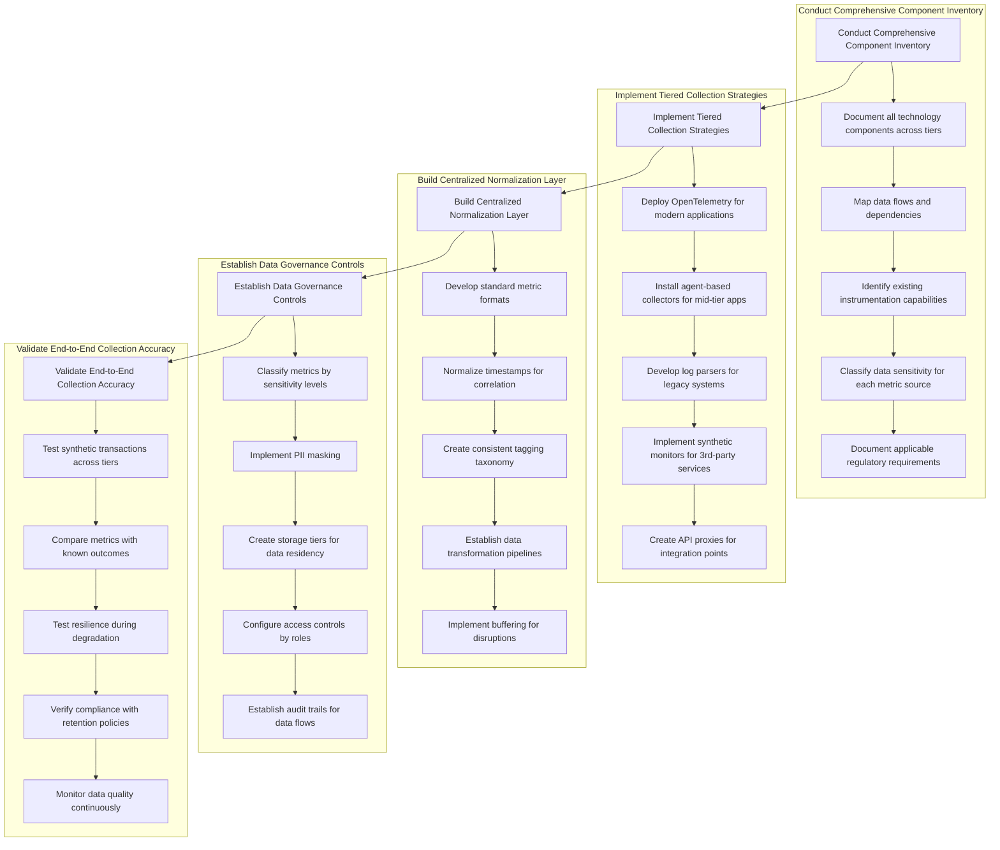
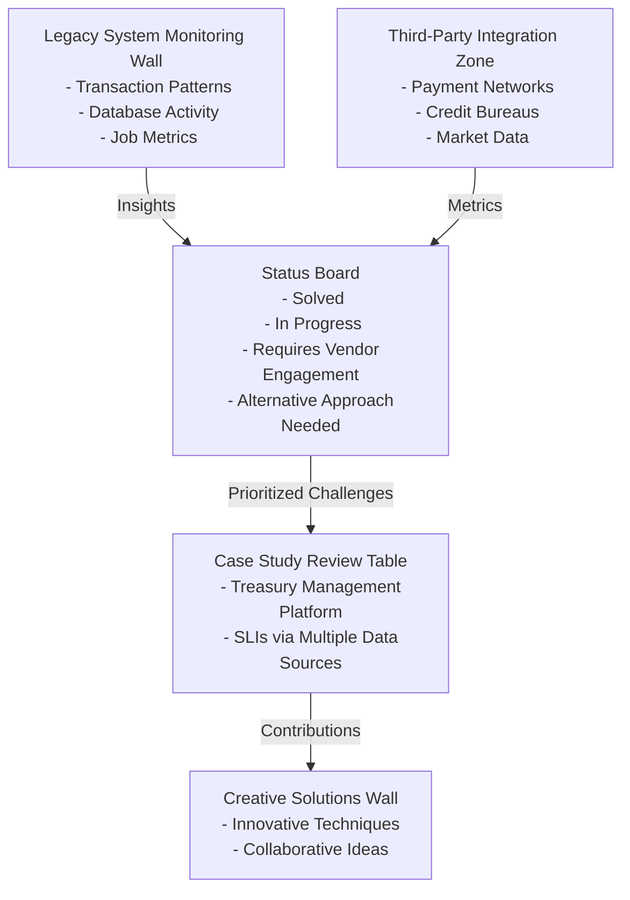
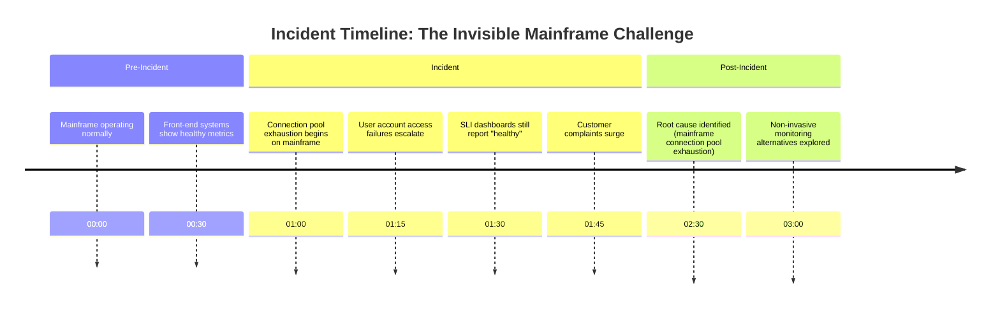
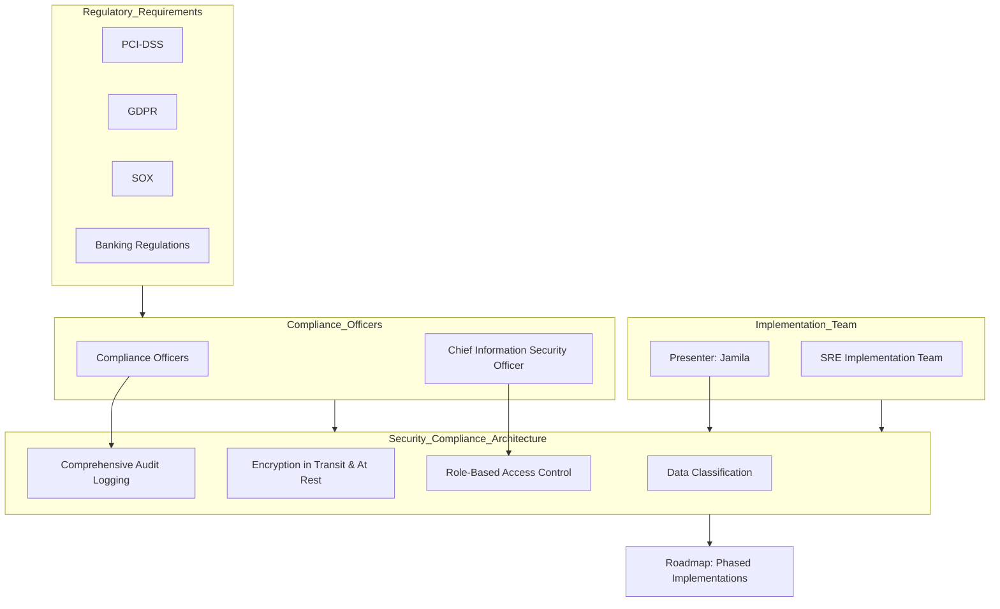
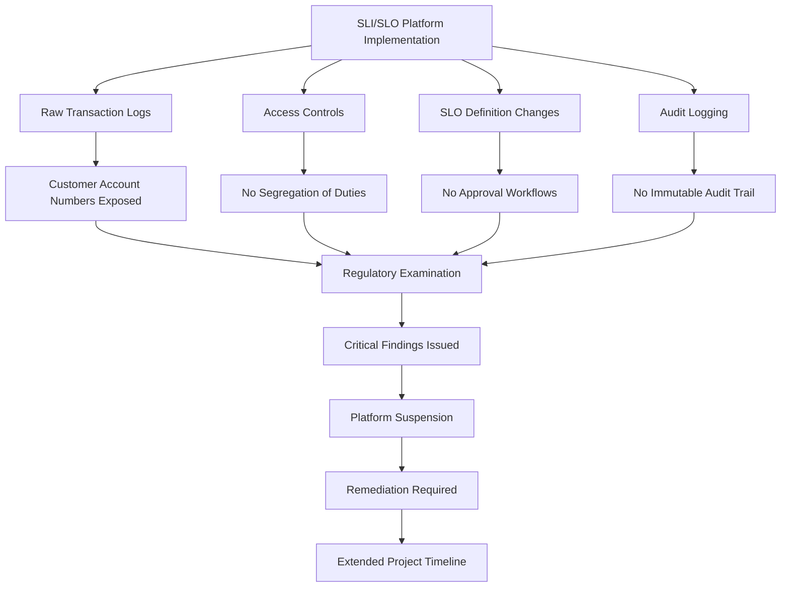
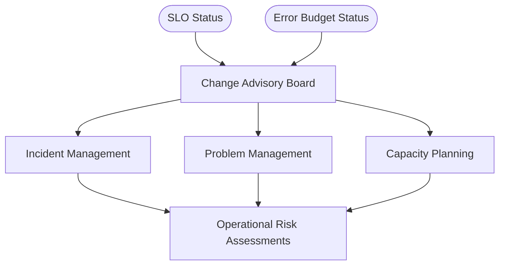
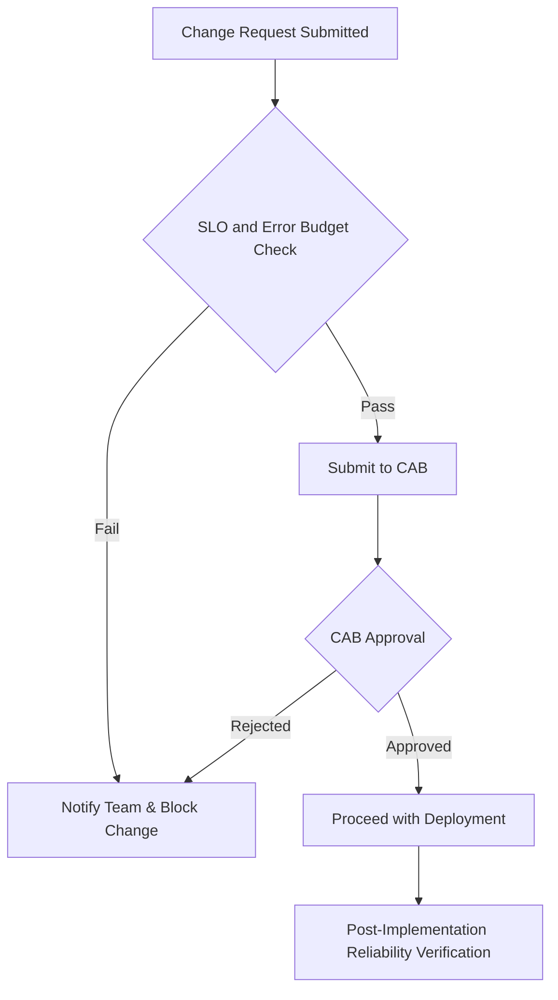
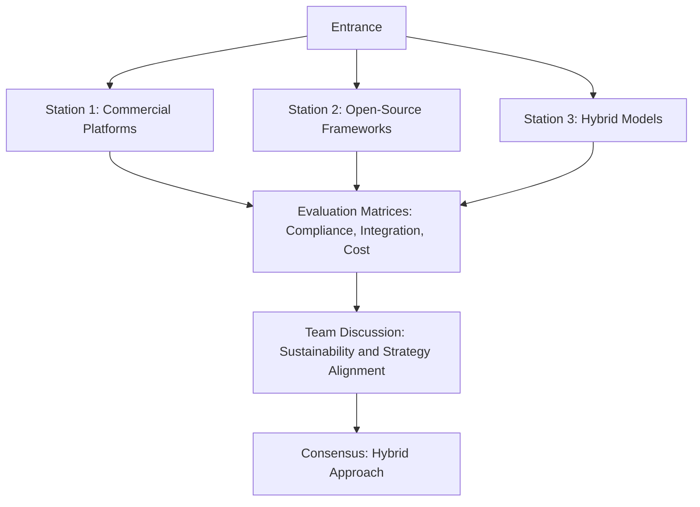
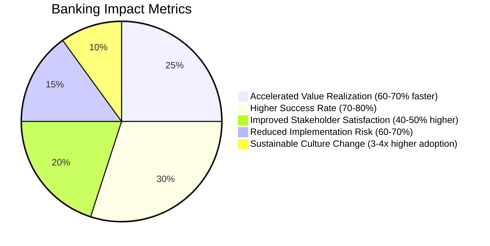
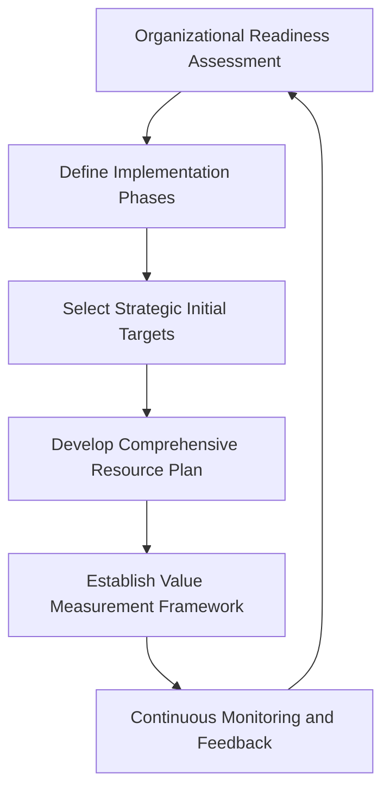

# Chapter 12: Implementing SLI/SLO Platforms in Banking Environments

## Chapter Overview

Welcome to the SRE Hunger Games, Banking Edition. Here’s where dreams of clean, cloud-native reliability platforms come to die—or at least to be repeatedly mugged by COBOL mainframes, regulatory zealots, and process committees wielding change control spreadsheets like medieval weaponry. This chapter doesn’t sugarcoat the reality: implementing SLI/SLO platforms in banking is a game of chess with a brick wall. You’ll juggle decades-old tech, compliance mandates with the subtlety of a tax audit, and organizational inertia so dense it bends light. But if you want to turn reliability into something more than a buzzword on a board slide, and you enjoy war stories with your best practices, buckle up. We’re taking you from theory to the trenches—where dashboards lie, mainframes don’t play nice, and “quick wins” are always at someone else’s expense.

______________________________________________________________________

## Learning Objectives

- **Map** your entire, ugly banking ecosystem—from shiny microservices to mainframes that predate your first smartphone.
- **Design** phased implementation strategies that deliver value before everyone loses interest or budget.
- **Evaluate** SLI/SLO tooling through a lens that actually matters: compliance, legacy integration, and the real cost of ownership.
- **Instrument** data collection across every tier, so your dashboards reflect reality—not just the easy bits.
- **Integrate** legacy systems and third-party dependencies using proxies, synthetic transactions, and creative hacks (because direct metrics are a fairy tale).
- **Embed** security and compliance controls so audit failures don’t kill your reliability program.
- **Align** SLI/SLO processes with existing banking bureaucracy, avoiding parallel universes of governance.
- **Choose** between building, buying, or cobbling together platforms—without stepping into vendor lock-in quicksand.
- **Sequence** your implementation roadmap so you actually finish something (and don’t burn out your team or budget).

______________________________________________________________________

## Key Takeaways

- “Big bang” SLI/SLO rollouts in banks end like most big bangs: lots of noise, not much life left after.
- Your SLO dashboard is only as honest as your worst-instrumented system—usually the one running COBOL no one wants to touch.
- Compliance isn’t a checkbox. Screw it up, and your reliability program gets shut down faster than a suspicious wire transfer.
- Commercial SLO platforms are great—until you need to monitor something invented before JSON. Welcome to custom integration hell.
- Parallel processes breed confusion and incidents. Integrate reliability with existing change and incident management, or prepare for chaos (and angry auditors).
- Early wins matter. Pick targets visible enough to impress leadership, but not so gnarly that you need a time machine to instrument them.
- Evidence-based investigation isn’t just for SREs; it’s your only defense when stakeholders question why their favorite service isn’t “green.”
- Forget one-size-fits-all instrumentation. Embrace heterogeneity or enjoy blissful ignorance—until your next high-profile outage.
- Tooling cost is a tiny iceberg tip. The real expense: integration, compliance, and the eternal joy of maintaining what you built.
- Roadmaps must be phased and realistic. Announce an “all-in” reliability transformation, and watch morale and credibility evaporate in six months.

This isn’t a chapter for the faint of heart—or anyone allergic to ugly truths. But if you want to make SRE work in banking, this is your field manual. Bring caffeine. Leave illusions at the door.

______________________________________________________________________

## Panel 1: Implementation Strategy - From Theory to Banking Reality

### Scene Description

The room is abuzz with a strategic planning session focused on implementing SLI/SLO platforms across the bank's complex technology ecosystem. The walls display detailed visuals of the diverse landscape they must incorporate:

- **Legacy Systems**: Mainframes running core banking functions, known for limited observability.
- **Mid-Tier Applications**: Java and .NET-based enterprise platforms handling critical business logic.
- **Modern Digital Channels**: Cloud-native microservices enabling digital customer experiences.
- **Third-Party Integrations**: External systems with varying levels of compatibility and observability.
- **Regulatory Systems**: Compliance-focused platforms with specialized operational constraints.

At the center of the room, Sofia stands at a whiteboard illustrating a pragmatic, multi-phase approach. The initial phase highlights a proof of concept on the payment processing service, followed by gradual expansion to additional critical systems. Next to her, a **decision tree diagram** maps out multiple implementation paths for the various technology stacks, offering clarity on how to sequence the rollout for maximum impact.

Below is a text-based representation of the decision tree:

```
Start
  ├── Payment Processing Service (Proof of Concept)
  │     └── Expand to High-Impact Services
  │            ├── Mid-Tier Applications
  │            ├── Customer-Facing Microservices
  │            └── Compliance Systems
  └── Legacy Integration
        └── Gradual Rollout Across Mainframes
```

On another wall, a **"Platform Selection Criteria" chart** evaluates potential SLI/SLO tools against banking-specific requirements, such as:

- Security certifications and compliance alignment
- Compatibility with legacy systems and proprietary technologies
- Support for change management workflows
- Robust audit trail and evidence maintenance features
- Consistent performance across development, testing, and production environments

Team leads from various technology domains gather in clusters, discussing their unique challenges and opportunities. While some express excitement about the potential benefits, others voice concerns regarding observability in legacy systems and ensuring alignment with regulatory expectations. The CTO underscores the importance of achieving **early wins** to build organizational momentum, emphasizing that the first successes must demonstrate tangible business impact.

The room's collaborative energy reflects the bank's focus on balancing strategic priorities: addressing immediate technical needs while building toward long-term reliability goals.

### Teaching Narrative

Implementing SLI/SLO platforms in banking environments demands a pragmatic strategy that acknowledges the unique complexities of financial technology ecosystems. Unlike digital-native companies where implementation often follows standardized patterns, banks must navigate heterogeneous technology landscapes spanning decades of investment.

An effective banking implementation strategy begins with four foundational elements:

1. **Ecosystem Mapping**: Thoroughly understanding the technology landscape that must be incorporated, including:

   - Legacy core banking systems, often mainframe-based with limited instrumentation capabilities
   - Mid-tier applications built on Java, .NET, or similar enterprise technologies
   - Modern digital channels using cloud-native architectures and microservices
   - Third-party systems with varying levels of observability and integration options
   - Regulatory and compliance systems with specialized requirements

2. **Phased Approach Design**: Creating a multi-stage implementation plan that delivers incremental value rather than attempting a "big bang" deployment:

   - Proof of concept on a critical but manageable service
   - Horizontal expansion to similar technology stacks
   - Vertical integration across service dependencies
   - Gradual incorporation of legacy systems
   - Integration with existing operational frameworks

3. **Platform Selection Criteria**: Establishing banking-specific requirements for SLI/SLO tooling:

   - Security and compliance capabilities required for financial services
   - Integration capabilities with legacy and proprietary systems
   - Change management and approval workflow support
   - Audit trail and evidence maintenance features
   - Multi-environment consistency across development, testing, and production

4. **Early Win Identification**: Selecting initial implementation targets that maximize visibility and organizational momentum:

   - Customer-facing services with clear business impact
   - Systems with existing performance challenges
   - Modern platforms with easier instrumentation options
   - Services with clearly defined ownership and strong team engagement
   - Areas with supportive leadership and change readiness

For banking institutions, implementation strategy must balance competing priorities: delivering early demonstrable value while building toward comprehensive coverage, addressing critical systems while managing complexity, and integrating with existing operational practices while introducing new reliability concepts.

This strategic approach prevents common implementation pitfalls like technology-first decisions that fail to address organizational readiness, overly ambitious scope that never reaches production, or lowest-resistance implementations that miss critical systems where reliability matters most.

### Common Example of the Problem

**The Digital Transformation Stumble**: A major retail bank attempted to implement SLOs as part of their digital transformation initiative. The technology team started by targeting everything at once—mobile banking, online banking, ATM networks, and core systems—using a uniform approach based on cloud-native tooling. Six months later, they had beautiful dashboards for their containerized microservices (representing only 15% of critical functionality), but no visibility into their COBOL-based core banking platform where most transactions were processed. Business stakeholders lost faith in the initiative when they realized the most critical systems weren't covered. Meanwhile, the operations team continued using their traditional monitoring tools separately, creating parallel and conflicting views of system health.

#### Key Mistakes Checklist

- **Overly Broad Scope**: Attempted to implement SLOs across all systems simultaneously without prioritization.
- **Technology-First Approach**: Focused on cloud-native tooling that was incompatible with legacy systems.
- **Critical Systems Neglect**: Ignored the core banking platform, which processed the majority of transactions.
- **Lack of Stakeholder Alignment**: Failed to meet business stakeholder expectations due to incomplete coverage.
- **Duplicate Tooling**: Allowed traditional monitoring tools to persist without integration, creating conflicting data sources.
- **Insufficient Early Wins**: Delivered dashboards for less critical systems, undermining organizational confidence in the initiative.

By avoiding these common pitfalls, banking organizations can ensure their SLO implementation delivers meaningful impact and builds trust with stakeholders.

### SRE Best Practice: Evidence-Based Investigation

When approaching SLI/SLO implementation in complex banking environments, evidence-based investigation provides crucial guidance by ensuring decisions are grounded in data and aligned with system realities. The following table summarizes the five investigation steps, their goals, and expected outcomes:

| **Investigation Step** | **Goal** | **Expected Outcome** |
| ---------------------------------------- | ---------------------------------------------------------------------------------------------------------------------------------------------- | ------------------------------------------------------------------------------------------------------------------------- |
| **Technology Inventory Analysis** | Systematically assess all technology components, categorizing them by architecture type, observability capabilities, and business criticality. | A comprehensive implementation map that identifies critical systems and prevents coverage gaps. |
| **Existing Monitoring Evaluation** | Analyze current monitoring tools and coverage to evaluate effectiveness and identify reuse opportunities. | Insights into leveraging existing tools for initial SLI implementation, reducing unnecessary tool replacements. |
| **Pilot Implementation Data Collection** | Collect detailed metrics during proof-of-concept deployments to evaluate technical and organizational success factors. | Refined implementation strategy informed by data on reliability, team adoption, and operational integration. |
| **Cross-Industry Pattern Analysis** | Research and analyze successful implementations at other financial institutions with similar environments. | Evidence-based understanding of effective patterns, common pitfalls, and validated approaches from comparable contexts. |
| **Stakeholder Needs Assessment** | Conduct structured interviews with business, technology, and operations stakeholders to document reliability requirements. | Alignment of implementation goals with stakeholder needs, ensuring relevance and reducing the risk of unmet expectations. |

By following these investigation steps, banking institutions can create a robust foundation for SLI/SLO implementation. Evidence-based insights prevent common pitfalls, such as over-reliance on assumptions or misalignment with organizational priorities, while fostering a deliberate, data-driven approach to reliability engineering.

### Banking Impact

The business impact of an effective SLI/SLO implementation strategy in banking environments is profound, delivering measurable benefits across multiple dimensions. Below is a summary of key impacts with quantified benefits:

| **Impact Area** | **Quantified Benefit** | **Description** |
| ------------------------------- | ------------------------------------------------------------------------- | --------------------------------------------------------------------------------------------------------------------------------------------------- |
| **Regulatory Compliance** | 20-30% reduction in compliance costs | Automated reporting and evidence collection streamline regulatory audits, reducing manual effort and associated costs. |
| **Incident Cost Reduction** | 40-60% reduction in Mean-Time-To-Resolve (MTTR), saving millions annually | Faster incident resolution minimizes revenue loss and operational disruption, especially for critical customer-facing services. |
| **Technology Investment ROI** | 15-25% improvement in ROI on technology spending | Data-driven prioritization of reliability improvements ensures targeted investments in areas with the highest impact. |
| **Customer Experience** | 10-15% increase in customer satisfaction metrics and retention rates | Direct correlation between SLIs and customer experience enables targeted improvements that drive customer loyalty and reduce churn. |
| **Digital Transformation Risk** | 2-3x higher success rates for transformation initiatives | Reliability data serves as an early warning system for potential customer-impacting risks, reducing failure rates in complex modernization efforts. |

These benefits highlight how a well-designed reliability strategy not only enhances operational performance but also aligns with critical banking priorities such as regulatory adherence, cost efficiency, and customer satisfaction. By quantifying these impacts, banks can more effectively communicate the value of SLI/SLO platforms across organizational stakeholders.

### Implementation Guidance

To facilitate a structured and comprehensive implementation of SLI/SLO platforms, the following step-by-step guidance is provided, now enhanced with actionable checklists to ensure progress tracking and thorough execution.

#### 1. **Start with Service Mapping**

- **Checklist:**
  - [ ] Document all critical banking services and their technology components.
  - [ ] Classify services by business criticality, technical architecture, and observability maturity.
  - [ ] Create a dependency map showing relationships between services.
  - [ ] Identify regulatory requirements applicable to each service.
  - [ ] Establish clear scope boundaries for the initial implementation.

#### 2. **Develop a Multi-Phase Roadmap**

- **Checklist:**
  - [ ] Create a 30-60-90 day plan for initial proof of concept on one service.
  - [ ] Define clear success criteria for each phase, focusing on both technical and business outcomes.
  - [ ] Develop a 6-12 month expansion plan prioritizing service onboarding.
  - [ ] Include explicit learning and adaptation points between implementation phases.
  - [ ] Align implementation milestones with existing technology and business planning cycles.

#### 3. **Establish Banking-Specific Selection Criteria**

- **Checklist:**
  - [ ] Define mandatory security and compliance requirements for any tooling.
  - [ ] Identify integration capabilities needed for legacy banking systems.
  - [ ] Evaluate data residency and sovereignty requirements for metrics storage.
  - [ ] Assess audit trail and evidence preservation capabilities.
  - [ ] Create an evaluation framework weighted by the bank's specific priorities.

#### 4. **Build Cross-Functional Implementation Team**

- **Checklist:**
  - [ ] Include representatives from application teams, operations, risk, compliance, and business units.
  - [ ] Assign clear roles for SLI definition, implementation, and validation.
  - [ ] Establish dedicated integration resources for complex legacy systems.
  - [ ] Include organizational change management expertise.
  - [ ] Secure executive sponsorship with clear escalation paths.

#### 5. **Select High-Visibility Initial Targets**

- **Checklist:**
  - [ ] Choose a customer-facing service with clear business impact.
  - [ ] Ensure the initial service has strong team support and engagement.
  - [ ] Verify that quick wins are achievable within 30-60 days.
  - [ ] Select a service with existing pain points that SLIs will help address.
  - [ ] Ensure the service has manageable technical complexity for implementation.

By following this guidance and leveraging the detailed checklists, teams can systematically address critical actions, track their progress, and adapt the approach as needed to ensure a successful SLI/SLO platform implementation across the bank's technology ecosystem.

## Panel 2: Data Collection Architecture - Instrumentation Across Banking Tiers

### Scene Description

An architecture design session focused on implementing SLI data collection across the bank's multi-tier technology stack. Large architectural diagrams illustrate the relationships between varied instrumentation approaches and their respective environments. For cloud-native services, engineers demonstrate modern observability tools using OpenTelemetry collectors. For mid-tier Java applications, they review agent-based approaches that avoid code modifications. For mainframe systems, Alex presents a specialized extraction layer that captures critical transaction data from existing monitoring tools and logs without modifying legacy code.

The data flows from these diverse systems converge in a central reliability data platform that normalizes inputs into consistent SLI formats. The team carefully evaluates data residency, examining which metrics can safely flow to cloud platforms versus those that must remain within the bank's secure perimeter due to regulatory requirements. On a whiteboard, they map coverage percentages for different banking services, highlighting gaps in their instrumentation capabilities that will require custom development.

Below is a simplified text-based diagram summarizing the multi-tier instrumentation architecture and data flow:

```
Cloud-Native Services --> Modern Observability Tools (OpenTelemetry, API Gateway Metrics)
Mid-Tier Applications --> Agent-Based Monitoring (JVM/.NET Metrics, Middleware Instrumentation)
Mainframe Systems --> Specialized Extraction Layer (Log Parsing, Middleware Interceptors)
     | 
     v
Central Reliability Data Platform
     |
     v
- Data Normalization
- Format Standardization
- SLI Calculation & Visualization
     |
     v
   Data Governance
     |
     |- Sensitive Data Anonymization
     |- Data Residency Compliance
```

This visual outline complements the detailed descriptions by providing a high-level view of the architecture, emphasizing the flow of data from source systems through the central platform, and highlighting the importance of compliance and governance in regulated environments.

### Teaching Narrative

Successfully implementing SLI/SLO platforms in banking environments requires a sophisticated data collection architecture that accommodates diverse technology stacks, handles sensitive financial data appropriately, and minimizes disruption to critical systems. This multi-tier instrumentation approach creates a comprehensive reliability view without requiring uniform implementation methods across all systems.

An effective banking instrumentation architecture typically includes several specialized collection methods:

1. **Modern Stack Instrumentation**: For cloud-native and contemporary applications:

   - Native observability frameworks (OpenTelemetry, Prometheus)
   - Application-level instrumentation with standard libraries
   - Infrastructure metrics from cloud platforms and containers
   - API gateway and service mesh telemetry

2. **Mid-Tier Application Approaches**: For established enterprise applications:

   - Agent-based monitoring that requires minimal code changes
   - JVM/.NET runtime metrics collection
   - Application server and middleware instrumentation
   - Database query monitoring and transaction tracing

3. **Legacy System Integration**: For mainframe and core banking platforms:

   - Log extraction and parsing for existing output
   - Middleware interceptors for transaction flows
   - API wrappers around legacy interfaces
   - Existing monitoring tool data extraction
   - Synthetic transaction monitoring for black-box visibility

4. **Data Convergence Layer**: Systems to normalize and aggregate heterogeneous data:

   - Collection gateways with protocol translation capabilities
   - Data transformation pipelines for format standardization
   - Timestamp normalization and correlation
   - Classification and tagging for consistent attribution
   - Temporary storage and buffering for reliability

The most successful implementations balance completeness with pragmatism, recognizing that different banking systems require different instrumentation approaches. Rather than forcing uniform methods across all platforms, effective architectures embrace heterogeneity while creating consistent output for SLI calculation and visualization.

For regulated financial data, this architecture must also incorporate appropriate data governance controls—determining which metrics contain sensitive information requiring special handling, establishing appropriate anonymization and aggregation techniques, and ensuring compliance with data residency requirements that may restrict where certain metrics can be processed or stored.

______________________________________________________________________

#### Checklist for Implementing Banking Data Collection Architecture

- **Define Scope and Objectives**

  - Identify key banking services and systems requiring SLI/SLO coverage.
  - Determine regulatory and compliance requirements for data collection and storage.

- **Select Instrumentation Methods**

  - Cloud-native systems: Use OpenTelemetry, Prometheus, and other native observability tools.
  - Mid-tier applications: Implement agent-based monitoring and runtime metrics collection.
  - Legacy systems: Leverage log parsing, middleware interceptors, and API wrappers.

- **Design Data Convergence Layer**

  - Set up collection gateways with protocol translation.
  - Implement pipelines for data transformation and format standardization.
  - Ensure timestamp normalization and correlation across data sources.

- **Incorporate Data Governance Controls**

  - Identify metrics containing sensitive financial data.
  - Apply anonymization, aggregation, and tagging techniques as needed.
  - Establish data residency rules to align with regulatory requirements.

- **Evaluate and Address Gaps**

  - Map instrumentation coverage across all banking tiers.
  - Identify services or systems with incomplete coverage and plan custom development.

- **Validate and Iterate**

  - Test data collection and normalization processes in staging environments.
  - Validate compliance with regulatory and security requirements.
  - Refine the architecture based on feedback and observed performance.

This checklist provides a practical guide to supplement the technical narrative, ensuring that teams can systematically implement a robust and compliant data collection architecture across diverse banking systems.

### Common Example of the Problem

**The Instrumentation Gap Crisis**: Imagine assembling a complex puzzle that represents your bank's digital payment ecosystem. You've meticulously placed all the pieces for your cloud-native systems, and the picture looks pristine. However, there's a glaring hole where the mainframe piece should be—a critical segment of the puzzle that's missing entirely. This was the reality for a regional bank's digital payments team.

They implemented SLIs using modern observability tools and proudly displayed their polished dashboards. During a major incident, those dashboards showed a perfect picture of health for the cloud-native payment gateway. Yet, customer complaints flooded in about transaction failures. The missing puzzle piece? The mainframe-based core banking system responsible for processing debits and credits. Their data architecture lacked any mechanism to extract reliability signals from the COBOL applications running on the mainframe. This blind spot created a misleading image of service health, eroding trust in the reliability program.

The team scrambled to address the gap, launching an emergency project to build a mainframe extraction layer. This effort, akin to carving out a custom puzzle piece under pressure, delayed their broader implementation by months and highlighted the critical importance of complete instrumentation across all tiers.

### SRE Best Practice: Evidence-Based Investigation

A comprehensive approach to data collection architecture requires evidence-based investigation across different system types. The following table summarizes the five key investigation steps, their goals, and common findings:

| **Investigation Step** | **Goal** | **Common Findings** |
| -------------------------------------- | ------------------------------------------------------------------------------ | -------------------------------------------------------------------------------------------------------------- |
| **Coverage Gap Analysis** | Map all critical transaction components and verify instrumentation coverage. | Initial coverage estimates are overly optimistic by 30-40% compared to verified results. |
| **Data Quality Validation** | Compare SLI data against known system behaviors to ensure accuracy. | Extracted mainframe metrics often require calibration to match actual system performance. |
| **Collection Impact Assessment** | Measure the performance impact of instrumentation on system resources. | Poorly implemented collection can degrade performance by 5-15%, especially on resource-limited legacy systems. |
| **Cross-System Correlation Testing** | Ensure metrics from different collection methods can be accurately correlated. | Timestamp synchronization issues frequently prevent accurate cross-system tracing without normalization. |
| **Regulatory Compliance Verification** | Assess data collection mechanisms for compliance with regulatory requirements. | Initial implementations often reveal 3-5 significant control gaps related to sensitive data handling. |

Each investigation step ensures that the data collection architecture achieves both technical and regulatory requirements while maintaining system reliability. By following this structured approach, SRE teams can iteratively improve instrumentation coverage, data quality, and system performance across diverse banking environments.

### Banking Impact

Effective multi-tier data collection architecture delivers significant business impact for banking organizations:

1. **Comprehensive Incident Detection**: Banks with complete instrumentation coverage across all technology tiers detect 65-80% of service issues before customers report them, compared to just 15-25% with partial coverage.

2. **Accelerated Mean-Time-To-Resolution**: When incidents occur, comprehensive data collection reduces diagnostic time by 40-60%, directly translating to reduced financial impact and improved customer experience.

3. **Regulatory Confidence**: Properly implemented data governance within the collection architecture significantly reduces regulatory findings related to monitoring controls, with some banks reporting 90% fewer issues during examinations.

4. **Technology Migration De-Risking**: Complete reliability visibility across legacy and modern systems provides crucial data for migration risk assessment, reducing unexpected issues during technology transformations by 30-40%.

5. **Operational Efficiency**: Unified data collection across diverse technologies reduces operational overhead by eliminating the need to consult multiple disconnected monitoring systems, typically improving operational efficiency by 20-30%.

### Implementation Guidance



## Panel 3: Integration Challenges - Legacy Systems and Third-Party Dependencies

### Scene Description

A technical war room where the implementation team is tackling their most difficult integration challenges. The room is organized into distinct focus areas, each addressing a critical aspect of integration work:

- **Legacy System Monitoring Wall**: Displays the bank's core banking platform—a 30-year-old mainframe system with limited monitoring capabilities. Engineers are reviewing specialized approaches to extract meaningful reliability data without modifying critical legacy code. Examples include transaction patterns, database activity signatures, and job completion metrics.

- **Third-Party Integration Zone**: Highlights dependencies like payment networks, credit bureaus, and market data providers. Raj demonstrates a hybrid approach that combines limited direct metrics from partners, synthetic transactions, and inferred health indicators to provide a more complete view of system health.

- **Status Board**: Categorizes and prioritizes integration challenges:

  - "Solved"
  - "In Progress"
  - "Requires Vendor Engagement"
  - "Alternative Approach Needed"

- **Case Study Review Table**: The team examines a particularly complex case involving their treasury management platform. Here, they successfully implemented SLIs by combining multiple imperfect data sources into a cohesive and actionable reliability view.

- **Creative Solutions Wall**: Showcases innovative approaches to seemingly intractable problems. Engineers contribute new ideas and techniques, fostering collaboration and continuous improvement.

Below is a simplified visual representation of the war room layout:



This setup provides a structured and engaging environment that emphasizes collaboration and problem-solving. Each area of the war room is designed to support the team as they address the unique challenges of integrating legacy systems and third-party dependencies.

### Teaching Narrative

Banking systems present unique integration challenges for SLI/SLO implementation due to their heavy reliance on both legacy platforms and external dependencies. Successfully navigating these challenges requires specialized approaches that go beyond standard observability patterns, embracing pragmatic solutions that capture meaningful reliability data even when ideal instrumentation isn't possible.

Legacy system integration involves several specialized techniques:

1. **Indirect Measurement Strategies**: Finding observable proxies when direct metrics aren't available:

   - Transaction completion patterns in downstream systems
   - Database activity signatures that indicate service health
   - Scheduled job completion timing and success rates
   - User interaction patterns that reflect system behavior

2. **Minimally Invasive Instrumentation**: Extracting data with minimal change to sensitive systems:

   - Log parsers for existing output files
   - Network traffic analysis at integration points
   - Memory dumps and system status captures
   - Exit routine and API intercepts where supported

3. **Boundary Monitoring**: Focusing on the inputs and outputs of legacy systems:

   - Interface monitoring for message flows
   - Response time tracking at system boundaries
   - Error pattern detection in interface communications
   - Correlation between requests and downstream activities

Third-party dependency integration requires different approaches:

1. **Service Provider Collaboration**: Working with financial service providers to obtain reliability data:

   - Standard status API consumption where available
   - Enhanced monitoring options in service contracts
   - Direct integration with provider monitoring systems
   - Custom webhook or notification implementations

2. **Synthetic Verification**: Implementing artificial transactions to verify service health:

   - Test transactions through production interfaces
   - Heartbeat checks on service availability
   - Canary requests measuring actual performance
   - Comprehensive service simulations for end-to-end testing

3. **Triangulation Methods**: Combining multiple indirect indicators to infer service health:

   - Response pattern analysis across multiple requests
   - Correlation of third-party performance with other system indicators
   - Historical behavior modeling to detect anomalies
   - Cross-check verification through redundant pathways

For banking institutions, these pragmatic approaches acknowledge that perfect observability is rarely achievable across all systems. Instead, they focus on capturing sufficient reliability data to make informed decisions, even when that requires combining multiple imperfect sources of information into a coherent reliability view.

### Common Example of the Problem

**The Invisible Mainframe Challenge**: A multinational bank's SRE team struggled to implement meaningful SLIs for their retail banking platform. Their new observability platform provided excellent metrics for their web and mobile applications but couldn't connect to their IBM z/OS mainframe running the core account processing. During a major incident, their SLI dashboards showed perfect health despite thousands of customers being unable to access their accounts. Investigation revealed that while all front-end systems were operating normally, the mainframe's CICS transaction processor was rejecting requests due to a connection pool exhaustion—a condition completely invisible in their SLI implementation. The disconnect between their reliability measurements and actual customer experience undermined credibility with business stakeholders. What made the situation particularly challenging was that the mainframe team had strict change control policies prohibiting any modifications to production systems for monitoring purposes, forcing the SRE team to find non-invasive alternatives.

Below is a timeline illustrating the incident and key disconnects:



This timeline highlights the gap between observed metrics and actual system behavior, emphasizing how the mainframe issue remained invisible to the SRE team's dashboards. The incident underlines the importance of adopting non-invasive strategies to bridge the observability gap, ensuring future reliability measurements align more closely with customer experience.

### SRE Best Practice: Evidence-Based Investigation

Effective integration with legacy systems and third parties requires a structured investigative approach. Use the following checklist to guide your process, ensuring each step is actionable and outcomes are clearly defined:

| **Step** | **Purpose** | **Expected Outcome** |
| ----------------------------------------- | ------------------------------------------------------------------------------------------------------ | -------------------------------------------------------------------------------------------------- |
| **1. Data Source Mapping** | Systematically inventory all potential data sources, including logs, APIs, and system outputs. | Identify 5-10x more potentially useful data than initially expected for monitoring and analysis. |
| **2. Controlled Fault Injection** | Introduce controlled issues into systems to identify the most responsive and reliable indicators. | Determine that boundary metrics detect 80-90% of issues without requiring system modification. |
| **3. Correlation Analysis** | Analyze relationships between observable metrics and known system behaviors using statistical methods. | Discover non-obvious correlations that can act as reliable proxies for unavailable direct metrics. |
| **4. Alternative Pathway Validation** | Cross-check indirect metrics against limited ground truth data (e.g., reports, manual validation). | Identify calibration needs for ~30-40% of indirect measurements to improve accuracy. |
| **5. Synthetic Transaction Benchmarking** | Establish baseline metrics for synthetic transactions during normal operation. | Detect 70-80% of significant system issues through deviations from benchmark performance. |

#### Investigation Workflow (ASCII Flowchart)

```plaintext
[Start] --> [Data Source Mapping] --> [Controlled Fault Injection] --> [Correlation Analysis] --> [Alternative Pathway Validation] --> [Synthetic Transaction Benchmarking] --> [End]
```

By following this checklist and workflow, teams can adopt an evidence-based approach to tackle integration challenges, ensuring meaningful reliability data is captured even in complex environments.

### Banking Impact

Solving legacy and third-party integration challenges delivers substantial business benefits. The following table summarizes key impacts observed across banking institutions:

| **Benefit** | **Description** | **Measured Improvement** |
| ---------------------------------------- | ------------------------------------------------------------------------------- | ---------------------------------------------------------------------- |
| **Complete Customer Journey Visibility** | Enhanced SLI frameworks for legacy systems provide comprehensive visibility. | 90-95% visibility compared to 30-50% with modern-only implementations. |
| **Reduced False Negatives** | Improved monitoring minimizes undetected incidents reported by customers. | 60-70% reduction in missed incidents. |
| **Technology Migration Risk Reduction** | Reliable baseline data reduces unforeseen issues during modernization efforts. | 40-50% reduction in unexpected migration issues. |
| **Vendor Management Improvement** | Data-driven SLIs improve accountability and performance of third-party vendors. | 30-40% improvement in service provider accountability. |
| **Regulatory Compliance Enhancement** | Comprehensive visibility strengthens compliance with monitoring requirements. | 50-60% reduction in findings related to monitoring coverage. |

### Implementation Guidance

1. **Map All Integration Points and Dependencies**

   - Document all interfaces between modern applications and legacy systems.
   - Identify all critical third-party service dependencies.
   - Classify integration points by technology type and access method.
   - Assess existing monitoring coverage at each integration point.
   - Prioritize based on business criticality and current visibility gaps.

   ```mermaid
   graph TD
       A[Identify Integration Points] --> B[Classify by Technology Type]
       B --> C[Assess Monitoring Coverage]
       C --> D[Prioritize Critical Gaps]
   ```

2. **Implement Boundary Monitoring**

   - Deploy network-level monitoring at legacy system interfaces.
   - Implement API gateway instrumentation for all third-party calls.
   - Create response time and error tracking at integration boundaries.
   - Establish volume and pattern monitoring for interface traffic.
   - Develop correlation between boundary metrics and customer experience.

   Example: API Gateway Instrumentation with Prometheus

   ```yaml
   scrape_configs:
     - job_name: 'api_gateway'
       metrics_path: '/metrics'
       static_configs:
         - targets: ['api-gateway.example.com:9090']
   ```

   Example: Response Time and Error Tracking in Python

   ```python
   import time
   import requests

   def monitor_api(endpoint):
       try:
           start_time = time.time()
           response = requests.get(endpoint)
           latency = time.time() - start_time
           success = response.status_code == 200
           print(f"Endpoint: {endpoint}, Latency: {latency:.2f}s, Success: {success}")
       except Exception as e:
           print(f"Monitoring failed for {endpoint}: {str(e)}")
   ```

3. **Develop Synthetic Transaction Framework**

   - Design synthetic tests that simulate key customer journeys.
   - Implement regular execution schedules with appropriate frequency.
   - Create baseline performance profiles during normal operations.
   - Develop variance thresholds that trigger alerts when deviations occur.
   - Ensure synthetic transactions include verification of end-to-end results.

   Example: Synthetic Transaction with Bash Script

   ```bash
   #!/bin/bash
   response=$(curl -o /dev/null -s -w "%{http_code}" https://example.com/api/transaction)
   if [ "$response" -ne 200 ]; then
       echo "Synthetic transaction failed! HTTP Status: $response"
   else
       echo "Synthetic transaction succeeded!"
   fi
   ```

   Example: Scheduled Synthetic Test with Cron

   ```
   */5 * * * * /path/to/synthetic_test.sh >> /var/log/synthetic_test.log 2>&1
   ```

4. **Enhance Third-Party Monitoring**

   - Negotiate enhanced monitoring provisions in service contracts.
   - Implement direct status API integration where available.
   - Create redundant verification methods for critical services.
   - Develop correlation between provider status and actual performance.
   - Establish automated alerting for third-party degradation.

   Example: Custom Third-Party Status Check

   ```python
   import requests

   def check_provider_status(api_url):
       response = requests.get(api_url)
       if response.status_code == 200:
           print("Provider is operational.")
       else:
           print(f"Provider issue detected! Status Code: {response.status_code}")
   ```

5. **Build Triangulation Methods**

   - Identify multiple indicators that collectively signal system health.
   - Implement statistical correlation models across different metrics.
   - Create weighted composite indicators from multiple data sources.
   - Establish confidence scoring for indirect measurements.
   - Validate triangulation accuracy during controlled testing.

   Example: Weighted Composite Indicator in Python

   ```python
   def calculate_system_health(indicators):
       weights = {'metric1': 0.4, 'metric2': 0.3, 'metric3': 0.3}
       composite_score = sum(indicators[metric] * weight for metric, weight in weights.items())
       print(f"Composite System Health Score: {composite_score}")
       return composite_score
   ```

   Example: Confidence Scoring with Indicators

   ```python
   def confidence_score(indicators):
       valid_count = sum(1 for value in indicators.values() if value > 0.8)
       score = valid_count / len(indicators)
       print(f"Confidence Score: {score:.2f}")
       return score
   ```

## Panel 4: Security and Compliance - Meeting Banking Regulatory Requirements

### Scene Description

A joint review session takes place between the SRE implementation team and the bank's security, risk, and compliance officers. Compliance team members review regulatory requirements from various frameworks: PCI-DSS, GDPR, SOX, and banking-specific regulations. On a large screen, Jamila presents their implementation's security and compliance architecture, highlighting specific controls: data classification that prevents sensitive information from entering monitoring systems, encryption of reliability metrics in transit and at rest, access controls limited to authorized personnel, and comprehensive audit logging of all SLO modifications.

The following diagram illustrates the key components of the security and compliance architecture, including data flows, critical controls, and interactions between stakeholders:



The diagram highlights how the regulatory requirements inform the compliance officers’ assessments, which in turn guide the architecture's design. The chief information security officer scrutinizes the authentication mechanisms for the SLO platform, while the compliance team verifies that the implementation supports their evidence collection requirements for regulatory examinations. A risk assessment matrix evaluates regulatory requirements against implementation approaches, identifying gaps and mitigations. On a roadmap, additional compliance capabilities show phased implementation, with regulatory reporting automation as a future enhancement.

### Teaching Narrative

Implementing SLI/SLO platforms in banking environments requires careful attention to security and compliance requirements that go far beyond those in less regulated industries. These controls must be designed into the reliability implementation from the beginning rather than added as an afterthought, creating systems that simultaneously enable effective reliability management and regulatory compliance.

A compliant banking SLI/SLO implementation encompasses several specialized capabilities:

1. **Data Protection Controls**: Safeguarding potentially sensitive information within reliability metrics:

   - Data classification frameworks that identify protected information
   - Filtering mechanisms that prevent sensitive data inclusion in metrics
   - Anonymization and aggregation techniques for customer-related metrics
   - Encryption requirements for metric storage and transmission
   - Data retention policies aligned with regulatory timeframes

2. **Access Management Framework**: Controlling who can view and modify reliability data:

   - Role-based access control for different reliability functions
   - Segregation of duties between reliability definition and implementation
   - Authentication integration with enterprise identity systems
   - Privileged access management for administrative functions
   - Contextual authorization based on data sensitivity

3. **Audit and Evidence Collection**: Maintaining verifiable records of reliability practices:

   - Immutable logging of all SLO definition changes
   - Evidence preservation for reliability-related decisions
   - Version control and approval workflows for SLO modifications
   - Documentation of incident response and SLO considerations
   - Automated evidence collection for regulatory examinations

4. **Regulatory Reporting Integration**: Aligning reliability data with regulatory requirements:

   - Mapping between SLIs and reportable service metrics
   - Automated generation of regulatory submission data
   - Reconciliation between internal and external reporting
   - Evidence packages for regulatory inquiries
   - Historical performance archives for compliance verification

To make this actionable, practitioners can use the following checklist to validate their implementation's compliance readiness:

#### Compliance Readiness Checklist

- **Data Protection**

  - [ ] Sensitive data is classified and protected using a robust framework.
  - [ ] Mechanisms are in place to prevent sensitive data inclusion in metrics.
  - [ ] Anonymization and aggregation techniques are applied to customer metrics.
  - [ ] Metrics are encrypted both in transit and at rest.
  - [ ] Data retention follows regulatory timeframes.

- **Access Management**

  - [ ] Role-based access controls are defined and enforced.
  - [ ] Duties are segregated between reliability definition and implementation.
  - [ ] Authentication integrates with enterprise identity systems.
  - [ ] Privileged access is limited and managed securely.
  - [ ] Data sensitivity informs contextual authorization decisions.

- **Audit and Evidence**

  - [ ] SLO changes are logged immutably and preserved.
  - [ ] Evidence of decisions related to reliability is documented.
  - [ ] Version control is in place for SLO definitions and workflows.
  - [ ] Incident response considerations include SLO impacts.
  - [ ] Automated evidence collection supports regulatory examinations.

- **Regulatory Reporting**

  - [ ] SLIs are mapped to required regulatory metrics.
  - [ ] Regulatory submission data is generated automatically.
  - [ ] Internal and external reporting are reconciled for consistency.
  - [ ] Evidence packages are prepared for regulatory inquiries.
  - [ ] Historical performance archives are maintained for verification.

For financial institutions, these compliance capabilities aren't optional features—they're fundamental requirements that determine whether an SLI/SLO implementation can exist in production. Regulatory frameworks like PCI-DSS, SOX, GDPR, and various banking regulations establish specific controls that must be demonstrably present in any system handling financial service information.

The most effective implementations integrate these compliance requirements seamlessly into the reliability platform, creating systems that simultaneously satisfy regulatory obligations and operational needs rather than treating them as competing priorities. This integrated approach ensures that reliability engineering becomes a complement to the bank's compliance program rather than a potential risk or conflict.

### Common Example of the Problem

**The Failed Regulatory Examination**: A mid-sized bank implemented a modern SLI/SLO platform to improve reliability visibility across their digital banking services. The implementation was technically successful, providing valuable insights that helped reduce incidents. However, during a regulatory examination, auditors discovered several critical compliance gaps: customer account numbers were visible in raw transaction logs used for SLI calculations, access controls didn't enforce proper segregation of duties, changes to SLO definitions lacked appropriate approval workflows, and there was no immutable audit trail of reliability data used for regulatory reporting. The examination resulted in formal findings requiring immediate remediation, forcing the bank to suspend their reliability platform until compliance issues could be addressed. What should have been a showcase of improved operational controls instead became a regulatory liability, setting back their SRE transformation by months and requiring significant rework of the entire implementation.

**Visualizing the Problem: Compliance Gaps and Impact**



This flowchart illustrates the compliance gaps and their cascading impact. Sensitive customer data exposure (C), lack of access control enforcement (E), missing approval workflows for SLO changes (G), and absence of immutable audit logging (I) all contributed to regulatory findings (J). These findings led to the suspension of the platform (L), remediation efforts (M), and ultimately a significant delay in the bank’s SRE transformation (N). The example underscores the importance of addressing compliance requirements from the start to prevent such setbacks.

### SRE Best Practice: Evidence-Based Investigation

A compliance-focused approach to SLI/SLO platforms requires thorough investigation across several dimensions. The following table summarizes key investigation dimensions, the typical issues identified during these investigations, and their frequency:

| **Investigation Dimension** | **Typical Issues Found** | **Frequency of Issues** |
| ----------------------------------- | -------------------------------------------------------------------------------------------------------------------------------------------------------------------- | --------------------------------------------------------------- |
| **Regulatory Requirement Mapping** | - Missing alignment with specific regulatory controls (e.g., PCI-DSS encryption or GDPR data retention).<br>- Overlooking localized banking regulations. | 30-50 distinct compliance controls typically required. |
| **Data Flow Security Analysis** | - Unexpected paths for sensitive data leakage into monitoring systems.<br>- Gaps in encryption during data transmission or storage. | 5-10 unexpected data exposure paths found per implementation. |
| **Access Control Testing** | - Insufficient restrictions on privilege escalation.<br>- Weak enforcement of role-based access controls.<br>- Lack of integration with enterprise identity systems. | 20-30% of access paths insufficient in initial implementations. |
| **Audit Trail Verification** | - Missing or incomplete logging of SLO definition changes.<br>- Gaps in logging reliability-related decisions or evidence preservation. | 25% of audit-relevant actions missed during initial testing. |
| **Compliance Validation Exercises** | - Evidence gaps for regulatory examinations.<br>- Incomplete documentation of incident response considerations or SLO changes. | 15-20 evidence gaps identified in preparation exercises. |

#### Recommended Approach for Evidence-Based Investigations

1. **Standardized Methodologies**: Use standardized templates and checklists during validation exercises to ensure comprehensive coverage of critical areas.
2. **Automated Testing**: Leverage automated tools for security and access control testing to identify gaps quickly and consistently.
3. **Iterative Refinement**: Treat investigation findings as inputs for iterative system refinements, ensuring progressively stronger compliance over time.
4. **Collaboration with Compliance Teams**: Engage compliance officers early and often during investigations to align on evidence requirements and expectations.

By systematically addressing these dimensions, organizations can strengthen their SLI/SLO platform implementations and ensure alignment with both operational and regulatory requirements.

### Banking Impact

Properly addressing security and compliance requirements delivers significant business benefits beyond regulatory compliance:

1. **Regulatory Confidence**: Banks with compliance-integrated reliability platforms report 70-80% fewer findings during regulatory examinations related to monitoring and operational controls.

2. **Expanded Usage Authorization**: Properly secured SLI/SLO platforms can receive authorization for monitoring high-sensitivity applications like payments and lending, which are often excluded from monitoring due to compliance concerns.

3. **Accelerated Approval Processes**: SLI implementations with built-in compliance controls typically achieve production approval 40-50% faster than those requiring post-implementation remediation.

4. **Reduced Compliance Costs**: Integrated reliability and compliance reporting can reduce manual evidence collection efforts by 30-40% during regulatory examinations and audits.

5. **Enhanced Risk Management**: Compliance-aware reliability data provides valuable inputs to operational risk calculations, helping banks optimize capital allocations required by regulatory frameworks like Basel.

### Implementation Guidance

1. **Perform Comprehensive Regulatory Analysis**

   - Identify all applicable regulations and standards for your specific context
   - Map specific requirements to SLI/SLO platform components
   - Consult with compliance and legal teams to interpret requirements
   - Create a compliance requirements traceability matrix
   - Establish validation methods for each compliance control

2. **Implement Data Protection Controls**

   - Develop data classification schema for all metric types
   - Implement filtering to exclude sensitive data from metrics
   - Deploy field-level masking for any potentially sensitive information
   - Establish encryption for data in transit and at rest
   - Create data retention and purging mechanisms aligned with regulatory requirements

   ```python
   # Example: Setting up encryption for data in transit using Python
   import ssl
   import socket

   context = ssl.create_default_context(ssl.Purpose.CLIENT_AUTH)
   context.load_cert_chain(certfile="server.crt", keyfile="server.key")
   context.options |= ssl.OP_NO_TLSv1 | ssl.OP_NO_TLSv1_1  # Enforce stronger protocols

   with socket.socket(socket.AF_INET, socket.SOCK_STREAM) as sock:
       with context.wrap_socket(sock, server_side=True) as ssock:
           ssock.bind(('0.0.0.0', 8443))
           ssock.listen(5)
           print("Encrypted connection established")
   ```

   ```yaml
   # Example: Data retention policy configuration in YAML
   data_retention:
     metrics:
       retention_period: "90d"  # Retain metrics for 90 days
       purge_schedule: "weekly"  # Weekly purging of expired data
       backup_encryption: "AES-256"
   ```

3. **Establish Robust Access Management**

   - Implement role-based access control for all reliability functions
   - Integrate with enterprise identity and authentication systems
   - Create segregation of duties between definition and monitoring roles
   - Implement attribute-based authorization for sensitive metrics
   - Establish privileged access management for administrative functions

   ```yaml
   # Example: Role-based access control (RBAC) policy for reliability data
   access_control:
     roles:
       - name: "SLO_Viewer"
         permissions: ["read_metrics", "view_slos"]
       - name: "SLO_Admin"
         permissions: ["read_metrics", "modify_slos", "delete_slos"]
     users:
       - username: "alice"
         role: "SLO_Admin"
       - username: "bob"
         role: "SLO_Viewer"
   ```

   ```json
   // Example: Integration with an enterprise identity provider (OIDC configuration)
   {
     "issuer": "https://idp.example.com",
     "client_id": "slo_platform",
     "client_secret": "secure_secret",
     "redirect_uris": ["https://slo-platform.example.com/auth/callback"],
     "scopes": ["openid", "profile", "email"]
   }
   ```

4. **Create Comprehensive Audit Capabilities**

   - Implement immutable audit logging for all SLO definitions and changes
   - Establish version control for reliability configurations
   - Create approval workflows for SLO modifications
   - Develop automated evidence collection for key reliability activities
   - Implement tamper-evident storage for compliance-relevant data

   ```bash
   # Example: Immutable logging setup using append-only file system
   sudo chattr +a /var/log/slo_audit.log
   echo "SLO updated by user Alice" >> /var/log/slo_audit.log
   ```

   ```json
   // Example: SLO version control metadata
   {
     "sla_id": "12345",
     "version": "1.2.0",
     "modified_by": "alice",
     "modification_date": "2023-10-15T14:30:00Z",
     "change_summary": "Updated error budget policy.",
     "approval_status": "approved"
   }
   ```

5. **Develop Regulatory Reporting Integration**

   - Map reliability metrics to regulatory reporting requirements
   - Create automated report generation for compliance submissions
   - Implement evidence packages for audit inquiries
   - Establish historical archives that meet regulatory retention requirements
   - Develop reconciliation between SLI data and other regulatory reporting

   ```python
   # Example: Automated regulatory report generation
   import pandas as pd

   # Load reliability metrics
   metrics = pd.read_csv("reliability_metrics.csv")

   # Filter and map metrics for reporting
   regulatory_metrics = metrics[metrics["category"] == "regulatory"]
   regulatory_metrics.to_csv("regulatory_report.csv", index=False)

   print("Regulatory report generated: regulatory_report.csv")
   ```

   ```mermaid
   graph TD
   A[SLI Metrics] --> B[Regulatory Mapping]
   B --> C[Automated Report Generation]
   C --> D[Submission to Regulators]
   ```

## Panel 5: Organizational Integration - Aligning with Existing Banking Processes

### Scene Description

A change management workshop focused on integrating the new SLI/SLO platform with established banking operational processes. On one wall, the existing change management workflow is mapped out, showing multiple approval gates, separation of duties, and compliance checkpoints. On another wall, the team designs how reliability measurements and error budgets will integrate into this framework. Sofia demonstrates how SLO status will become a required input for the Change Advisory Board, with different approval paths based on current error budget status. Process integration diagrams show how reliability data will flow into incident management, problem management, and capacity planning processes. Team members role-play scenarios like production deployments and incident response using the new integrated processes.

To clarify the integration process, consider the following diagram, which maps the flow of reliability data through key operational processes:



On a "challenges board," the team tackles specific integration points: how SLO violations will trigger standard incident processes, how error budgets will influence emergency change procedures, and how reliability data will inform operational risk assessments. A banking operations manager expresses initial skepticism but gradually engages as he sees how the new approach enhances rather than disrupts existing governance.

### Teaching Narrative

Successfully implementing SLI/SLO platforms in banking environments requires thoughtful integration with established operational processes rather than attempting to replace them. Banks typically have mature, well-defined procedures for change management, incident response, and operational governance—often developed over decades and closely tied to regulatory requirements. Effective reliability implementations enhance these existing processes rather than competing with them.

Key organizational integration points include:

1. **Change Management Alignment**: Embedding reliability considerations into established change processes:

   - SLO status as a required change approval input
   - Error budget verification during change scheduling
   - Reliability impact assessments for proposed changes
   - Differentiated approval paths based on reliability status
   - Post-implementation reliability verification

2. **Incident Management Integration**: Connecting SLO violations to existing incident procedures:

   - Mapped severity levels between SLO impacts and incident priorities
   - Automated incident creation for significant SLO violations
   - Reliability data enrichment in incident records
   - SLO-based incident detection alongside traditional alerts
   - Error budget accounting during incident resolution

3. **Operational Risk Processes**: Linking reliability engineering to risk management frameworks:

   - SLO mapping to operational risk categories
   - Reliability metrics as key risk indicators
   - Error budget status in risk reporting
   - Reliability data for risk assessment and scenario planning
   - SLO violations in operational risk event tracking

4. **Governance Committee Structure**: Establishing appropriate oversight and decision frameworks:

   - Reliability review in existing governance forums
   - SLO approval workflows through appropriate authorities
   - Error budget policy governance with existing committees
   - Clear escalation paths for reliability concerns
   - Integrated reporting to executive governance bodies

For banking institutions with established ITIL or similar operational frameworks, this integration approach prevents the creation of parallel processes that inevitably create confusion and conflict. Instead, it enhances existing processes with reliability data and frameworks, allowing the organization to maintain operational consistency while adopting advanced reliability engineering practices.

The most successful implementations carefully map the relationships between new reliability concepts and existing operational terminology—translating between SLOs and service levels, error budgets and operational risk tolerances, and reliability engineering principles and established operational practices—creating bridges between traditional banking operations and modern SRE approaches.

### Common Example of the Problem

**The Parallel Process Failure**: An international bank implemented SLIs and error budgets as part of their site reliability engineering transformation. The SRE team, excited about their new capabilities, created an independent deployment approval process based on error budget status that operated parallel to the bank's established Change Advisory Board (CAB) process. This resulted in conflicting governance: the error budget might permit a deployment that the CAB had not approved, or the CAB might approve a change when error budgets were exhausted. Teams became confused about which process to follow, and several changes were deployed without proper risk assessment because they had error budget available but hadn't completed the required CAB review. After a significant incident resulted from this governance gap, the bank was forced to temporarily suspend their error budget process while they reconciled the two frameworks. The reliability initiative lost months of momentum and faced significant resistance from traditional operations teams who viewed it as disrupting established controls rather than enhancing them.

#### Checklist to Avoid Parallel Process Failure

To prevent similar issues when integrating reliability practices into existing operational frameworks, consider the following steps:

1. **Collaboratively Design Process Integration**:

   - Involve key stakeholders from existing governance bodies (e.g., CAB, risk teams) in the design phase.
   - Map out all overlapping decision points between reliability processes and existing workflows.

2. **Define a Single Source of Truth**:

   - Establish clear ownership of deployment approval authority to avoid conflicting decisions.
   - Ensure SLO and error budget data are integrated into the existing CAB process rather than creating a parallel approval path.

3. **Communicate Process Changes Early and Often**:

   - Train all relevant teams on how SLOs and error budgets will influence existing processes.
   - Use shared documentation and workshops to address questions and reduce confusion.

4. **Pilot and Validate the Integrated Process**:

   - Test the combined process on low-risk changes or non-production environments.
   - Document edge cases where the combined process might create conflicts and refine workflows accordingly.

5. **Automate Wherever Possible**:

   - Use automation to ensure SLO data and error budgets are automatically included in CAB reviews and change requests.
   - Implement automated checks to prevent deployments that violate either error budgets or CAB requirements.

6. **Monitor and Adjust**:

   - Regularly review the integrated process for gaps or inefficiencies.
   - Solicit feedback from both SRE and traditional operations teams to ensure the process is working as intended.

7. **Establish Escalation and Reconciliation Protocols**:

   - Define clear escalation paths for resolving conflicts between reliability data and traditional governance.
   - Create a reconciliation framework for when SLO-based approvals and CAB decisions diverge.

By following these steps, organizations can avoid the pitfalls of parallel process failure and ensure that reliability practices enhance rather than disrupt existing operational governance. Below is a simplified flow of how integrated processes should work:



### SRE Best Practice: Evidence-Based Investigation

Effective organizational integration requires systematic investigation of existing processes and thoughtful design of integration points. Below is a summary of the five investigation steps and their typical outcomes, providing a clear and structured reference for teams:

| **Investigation Step** | **Description** | **Typical Outcomes** |
| --------------------------------- | ---------------------------------------------------------------------------------------------------------------------------------------- | ----------------------------------------------------------------------------------------------- |
| **Process Mapping Exercise** | Conduct detailed documentation of current operational processes, identifying decision points, approval gates, and governance mechanisms. | 15-20 critical integration points where reliability data should inform existing workflows. |
| **Stakeholder Impact Assessment** | Analyze how reliability practices impact operational roles, including changes to responsibilities and decision criteria. | Identification of 5-8 key roles requiring significant adaptation. |
| **Trial Integration Sessions** | Simulate how integrated processes handle scenarios like changes, incidents, and capacity planning. | 10-15 process conflicts revealed that require resolution. |
| **Comparative Benchmarking** | Research other financial institutions’ approaches to integrating reliability practices. | Identification of proven patterns and avoidance of common pitfalls based on industry standards. |
| **Governance Gap Analysis** | Evaluate current governance structures against reliability needs, identifying integration opportunities and gaps. | Determination that 70-80% of reliability governance can merge into existing structures. |

This structured approach ensures a comprehensive understanding of integration points, roles impacted, and potential conflicts, enabling an evidence-based foundation for embedding reliability practices into established banking processes.

### Banking Impact

Effective organizational integration delivers substantial business benefits. The following metrics highlight the quantitative improvements observed in banking environments that successfully integrate reliability engineering principles into existing processes:

1. **Change Success Rate Improvement**: Banks with well-integrated reliability and change processes report 30-40% higher success rates for production changes, with fewer incidents and rollbacks.

2. **Operational Efficiency**: Integrated processes reduce duplicate work and governance overhead, typically improving operational efficiency by 15-25% compared to parallel processes.

3. **Risk Management Enhancement**: Reliability data integrated into risk processes provides quantitative insights that improve risk assessment accuracy by 40-50% for technology-related risks.

4. **Organizational Alignment**: Integrated approaches significantly reduce resistance to reliability practices, with adoption rates 3-4x higher than implementations that attempt to replace existing processes.

5. **Regulatory Acceptance**: Banking regulators respond more positively to reliability practices that enhance existing governance rather than bypass it, resulting in fewer regulatory concerns during examinations.

The following bar chart summarizes these impacts for easier comparison:

```mermaid
barChart
  title Banking Impact Metrics
  axis X Categories
  axis Y Percentage Improvement
  "Change Success Rate" : 30, 40
  "Operational Efficiency" : 15, 25
  "Risk Assessment Accuracy" : 40, 50
  "Adoption Rate" : 300, 400
  "Regulatory Acceptance" : 0, 0
```

### Implementation Guidance

To ensure a smooth integration of the SLI/SLO platform into existing banking processes, use the following actionable checklist to guide implementation efforts:

#### 1. Map Current Operational Processes

- [ ] Document existing change management workflows, approval gates, and timelines.
- [ ] Map end-to-end incident management processes, from detection to resolution.
- [ ] Identify operational risk assessment and reporting mechanisms currently in place.
- [ ] Catalog governance committees, their responsibilities, and decision-making authorities.
- [ ] Document current approaches to service level management and key performance metrics.

#### 2. Design Integration Touchpoints

- [ ] Create inputs for SLO status to be used in change approval workflows.
- [ ] Define processes for SLO-based incident detection that align with standard incident procedures.
- [ ] Develop error budget reporting mechanisms for inclusion in operational risk frameworks.
- [ ] Integrate reliability metrics into existing executive dashboards and reporting tools.
- [ ] Align reliability considerations with capacity planning and forecasting processes.

#### 3. Establish Shared Terminology and Translations

- [ ] Develop a glossary mapping SRE concepts (e.g., error budgets, SLOs) to banking operational terms.
- [ ] Create visual aids (e.g., flowcharts, frameworks) to translate reliability concepts for stakeholders.
- [ ] Draft role-specific guidance for interpreting and acting on reliability data.
- [ ] Standardize language for cross-team communication about reliability and performance.
- [ ] Document how reliability practices complement and enhance existing operational objectives.

#### 4. Implement Progressive Integration

- [ ] Begin with low-risk, high-visibility integration points to demonstrate value early.
- [ ] Facilitate joint working sessions between SRE and operations teams to build collaboration.
- [ ] Establish feedback loops to identify and address integration roadblocks.
- [ ] Collect and share success stories that showcase benefits of the integrated approach.
- [ ] Gradually expand integration efforts as team familiarity and confidence increase.

#### 5. Update Governance and Documentation

- [ ] Revise operational procedures to embed reliability considerations and error budget policies.
- [ ] Update governance committee charters to include reliability oversight responsibilities.
- [ ] Modify job descriptions and role expectations to reflect reliability-related duties.
- [ ] Incorporate reliability engineering principles into training materials and onboarding programs.
- [ ] Adjust escalation paths to include workflows triggered by reliability data, such as SLO violations.

By systematically working through this checklist, teams can align the SLI/SLO platform with existing banking processes in a structured and collaborative manner, ensuring both operational continuity and the successful adoption of reliability practices.

## Panel 6: Tooling Decisions - Build vs. Buy in Regulated Environments

### Scene Description

A platform selection workshop is underway, where the bank's technology team evaluates different approaches to implementing their SLI/SLO platform. The workshop room is organized into multiple stations, each showcasing a distinct option:

- **Station 1: Commercial Platforms**\
  Led by Alex, this station highlights the strengths of commercial observability platforms, such as quick deployment and standardized workflows. Limitations discussed include challenges with legacy system integration and compliance features.

- **Station 2: Open-Source Frameworks**\
  Raj leads this station, demonstrating an open-source approach that offers flexibility for banking-specific customizations. However, it comes with the trade-off of requiring greater implementation effort and expertise.

- **Station 3: Hybrid Models**\
  A third station features hybrid solutions that combine commercial components with custom-built integration layers tailored for legacy systems. This approach emphasizes a balance between speed to value and specialized capability alignment.

Each station includes detailed evaluation matrices that assess capabilities against banking-specific requirements, including regulatory compliance, legacy integration, and cost modeling. The evaluation also explores the long-term sustainability of each option, focusing on regulatory change adaptation, vendor risk management, and broad compatibility with the bank’s technology strategy.

The workshop layout can be represented as follows:



Cost models displayed at each station go beyond license fees, incorporating implementation, integration, maintenance, and compliance costs. These comprehensive projections help the team thoroughly evaluate the trade-offs of each approach.

As the session concludes, the team aligns on a hybrid strategy that optimally combines commercial platforms for modern technology stacks, custom components for legacy integration and compliance, and open-source frameworks for flexibility. This approach balances implementation speed with the unique requirements of the banking environment.

### Teaching Narrative

The build versus buy decision for SLI/SLO platforms takes on additional complexity in banking environments due to specialized requirements around legacy integration, regulatory compliance, and long-term sustainability. This decision requires balancing multiple factors beyond those typically considered in less regulated industries.

A comprehensive banking-specific evaluation framework includes:

1. **Regulatory Compliance Assessment**: Evaluating how different approaches satisfy banking regulations:

   - Built-in compliance features for financial services
   - Audit trail and evidence preservation capabilities
   - Adaptation capacity for evolving regulatory requirements
   - Vendor compliance posture and certifications
   - Control validation and examination support

2. **Legacy Integration Capabilities**: Determining how effectively each option works with banking-specific technologies:

   - Mainframe and core banking system connectivity
   - Financial messaging system integration (SWIFT, FIX, ISO20022)
   - Proprietary protocol and format support
   - Third-party financial service provider monitoring
   - Batch processing and reconciliation visibility

3. **Total Cost Modeling**: Developing comprehensive cost projections beyond acquisition expenses:

   - Implementation costs across diverse technology landscapes
   - Integration expenses for banking-specific systems
   - Compliance maintenance and regulatory adaptation costs
   - Operational support requirements and associated staffing
   - Long-term maintenance and evolution expenses

4. **Risk Profile Analysis**: Assessing different risk factors across options:

   - Vendor stability and banking industry commitment
   - Support for banking-specific use cases
   - Adaptation capacity for regulatory changes
   - Internal ownership of critical compliance controls
   - Long-term sustainability and evolution capabilities

In banking environments, pure build or buy approaches often prove suboptimal. Commercial platforms typically lack the specialized capabilities needed for financial services, particularly around legacy integration and compliance, while fully custom solutions require substantial investment and create long-term maintenance challenges.

The most successful banking implementations often adopt hybrid approaches that combine:

- Commercial observability platforms for modern technology stacks
- Specialized financial service integrations for industry-specific systems
- Custom components for legacy integration and compliance functions
- Open-source frameworks for flexible adaptation to banking requirements

This balanced approach leverages standardized components where appropriate while developing custom elements where banking-specific needs demand specialized solutions, creating an optimal combination of implementation speed, capability alignment, and long-term sustainability.

### Common Example of the Problem

**The Vendor Lock-in Dilemma**: A global bank selected a leading commercial observability platform for their SLI/SLO implementation based on impressive demos and promised quick time-to-value. Six months into implementation, they discovered significant limitations: the platform couldn't integrate with their IBM mainframe without expensive custom development, lacked the granular access controls required by their security policies, and couldn't provide the audit trails needed for regulatory compliance. The bank faced an impossible choice: abandon their significant investment and start over, build extensive custom components around the platform (negating the "buy" advantages), or accept permanent gaps in critical functionality.

What had initially seemed like the safe, fast option became a strategic liability. After painful deliberation, they ultimately implemented a hybrid approach—keeping the commercial platform for modern systems while building custom solutions for legacy integration and compliance requirements—but the fragmented approach created ongoing challenges for data correlation and unified visualization.

______________________________________________________________________

#### Key Takeaways Checklist

To avoid repeating similar issues, consider the following when evaluating tooling options for regulated environments:

- **Legacy Integration**:

  - Verify compatibility with core banking systems (e.g., IBM mainframes, financial messaging protocols like SWIFT, FIX, ISO20022).
  - Ensure the solution supports proprietary and legacy technologies without significant custom development.

- **Regulatory Compliance**:

  - Confirm built-in capabilities for audit trails and evidence preservation.
  - Assess whether the platform meets security policies, including granular access controls.
  - Evaluate the vendor's ability to adapt to evolving regulatory requirements.

- **Vendor Risk Management**:

  - Investigate the vendor's track record in the banking industry and long-term commitment to regulatory compliance.
  - Consider the risk of vendor lock-in and the potential costs of switching or building custom extensions.

- **Total Cost of Ownership**:

  - Look beyond license fees and assess full implementation, integration, and maintenance costs.
  - Factor in the expense of developing custom components if the solution has gaps in critical functionality.

- **Strategic Fit and Sustainability**:

  - Align platform capabilities with both modern technology stacks and legacy systems.
  - Plan for a hybrid approach if necessary, but ensure clear strategies for data correlation and unified visualization.

Proactively addressing these areas can reduce the risk of strategic misalignment and ensure a smoother implementation process that balances speed to value with long-term sustainability.

### SRE Best Practice: Evidence-Based Investigation

A systematic approach to tooling decisions requires comprehensive evidence gathering. The following table summarizes the five key investigation steps, their objectives, and expected outcomes:

| **Investigation Step** | **Objective** | **Expected Outcome** |
| ------------------------------------------ | ---------------------------------------------------------------------------------------------------------------------------- | --------------------------------------------------------------------------------------------------------------------------- |
| **Banking-Specific Requirements Analysis** | Document requirements unique to financial services, particularly around compliance, legacy integration, and risk management. | Identification of 30-40 banking-specific requirements that highlight gaps in standard tooling capabilities. |
| **Vendor Capability Verification** | Perform hands-on testing of vendor platforms using representative banking-specific use cases. | Discovery that vendor capabilities for banking needs are typically 30-40% less mature than general capabilities. |
| **Reference Architecture Review** | Analyze other financial institutions' implementations to find successful patterns and common pitfalls. | Insight that 70% of successful banking implementations leverage hybrid approaches instead of pure build or buy strategies. |
| **Total Cost of Ownership Modeling** | Create multi-year cost projections, including implementation, integration, maintenance, and compliance costs. | Realization that initial license costs represent only 20-30% of the five-year total cost of ownership. |
| **Regulatory Impact Assessment** | Assess how different tooling approaches influence regulatory compliance posture and examination readiness. | Identification of 5-10 critical compliance capabilities that must be controlled internally to meet regulatory requirements. |

By following these structured steps, SRE teams can ensure their tooling decisions are grounded in evidence, aligning with both technical and regulatory requirements in banking environments. This approach reduces decision-making risks and supports the adoption of sustainable, compliant solutions.

### Banking Impact

Making optimal tooling decisions delivers significant business benefits. The following quantitative impacts illustrate why a balanced build/buy approach is critical for banking environments:

```mermaid
barChart
    title Banking Impact Metrics
    axis titles Implementation Success Rate, Percentage/Multiplier
    bar Implementation Success Rate : 4
    bar Time-to-Value Acceleration : 50
    bar Regulatory Confidence : 70
    bar Long-term Cost Optimization : 40
    bar Strategic Flexibility : 3
```

1. **Implementation Success Rate**: Banks that adopt appropriately balanced approaches report **3-4x higher success rates** for SLI/SLO implementations compared to pure build or buy approaches.

2. **Time-to-Value Acceleration**: Well-designed hybrid implementations typically deliver initial business value **40-50% faster** than pure custom builds while providing more complete capabilities than off-the-shelf solutions.

3. **Regulatory Confidence**: Proper tooling decisions that address compliance requirements comprehensively reduce regulatory findings by **60-70%** compared to implementations that retrofit compliance later.

4. **Long-term Cost Optimization**: Banks with balanced build/buy approaches typically spend **30-40% less** over a five-year period than those that must significantly rework inappropriate initial decisions.

5. **Strategic Flexibility**: Properly designed hybrid implementations provide **2-3x greater adaptability** to changing regulatory and business requirements compared to heavily customized vendor platforms or monolithic custom solutions.

### Implementation Guidance

To ensure a structured approach to selecting and implementing an SLI/SLO platform in regulated banking environments, follow the step-by-step checklist below. This approach helps teams address critical requirements, evaluate options comprehensively, and plan for long-term sustainability.

#### **Step-by-Step Implementation Checklist**

1. **Develop Comprehensive Requirements**

   - [ ] Document functional requirements for monitoring modern applications.
   - [ ] Identify specialized needs for legacy system integration.
   - [ ] Detail compliance requirements from applicable regulations.
   - [ ] Specify security controls and access management needs.
   - [ ] Define data residency and retention requirements.

2. **Create a Multi-Dimensional Evaluation Framework**

   - [ ] Establish weighted scoring criteria for all requirements.
   - [ ] Develop test cases for banking-specific capabilities.
   - [ ] Create proof-of-concept scenarios for critical functions.
   - [ ] Define minimum thresholds for regulatory compliance features.
   - [ ] Include total cost of ownership in evaluation criteria.

3. **Evaluate Multiple Implementation Patterns**

   - [ ] Assess pure commercial platforms against requirements.
   - [ ] Evaluate open-source frameworks with custom development.
   - [ ] Consider hybrid approaches combining multiple components.
   - [ ] Analyze managed service options with banking specialization.
   - [ ] Explore partnerships with financial services-focused vendors.

4. **Identify Banking-Specific Integration Needs**

   - [ ] Document all legacy systems requiring custom integration.
   - [ ] Map specialized protocols used in financial services.
   - [ ] Identify compliance-related integration requirements.
   - [ ] Detail performance needs for high-volume transaction systems.
   - [ ] Specify data transformation needs for financial information.

5. **Design Long-term Sustainability Model**

   - [ ] Develop governance model for ongoing platform management.
   - [ ] Create skills development plan for required technologies.
   - [ ] Establish vendor management strategy for third-party components.
   - [ ] Define process for adapting to regulatory changes.
   - [ ] Create upgrade and maintenance strategy for all components.

#### **Process Flow Diagram**


By following this checklist and process flow, teams can ensure systematic consideration of all critical factors and align their tooling strategy with the unique demands of regulated banking environments.

## Panel 7: Implementation Roadmap - The Progressive Reliability Journey

### Scene Description

A program kickoff meeting for the bank's reliability platform implementation sets the stage for a two-year transformation journey. A comprehensive roadmap spans the wall, visually dividing the journey into three clear phases:

```
Foundation Phase (0-6 months) --> Expansion Phase (6-12 months) --> Maturity Phase (12-24 months)
```

Each phase has defined goals, key milestones, and success criteria:

- **Foundation Phase (0-6 months)**:

  - Establish basic SLI capability for tier-one services.
  - Collect baseline reliability data and demonstrate early value.
  - Success Metric: Implementation completion of core SLI components.

- **Expansion Phase (6-12 months)**:

  - Extend SLI/SLO coverage to additional critical services.
  - Integrate with change management and incident response processes.
  - Success Metric: Operationalization of error budgets and formal SLOs.

- **Maturity Phase (12-24 months)**:

  - Deploy advanced capabilities like multi-dimensional SLOs and predictive reliability.
  - Integrate reliability into strategic planning and business impact analysis.
  - Success Metric: Self-service reliability capabilities for teams.

Sofia, a program leader, presents a readiness assessment of different parts of the organization, identifying areas requiring targeted education programs. The roadmap also outlines critical resource requirements, dependencies, and risk mitigations for each phase.

The CTO emphasizes the importance of viewing this as a capability journey rather than a one-time technology project. By focusing on progressive improvement in reliability management, the bank avoids common pitfalls like scope creep or change fatigue. A "quick wins" section highlights early implementation targets that build momentum and demonstrate value as the transformation progresses.

### Teaching Narrative

Implementing SLI/SLO platforms in banking environments requires a structured roadmap that acknowledges both technical complexity and organizational change management needs. This progressive journey approach recognizes that reliability transformation is an evolutionary process that builds capability over time rather than a one-time technology implementation.

An effective banking implementation roadmap typically includes several key phases:

1. **Foundation Phase (0-6 months)**: Establishing basic reliability measurement capabilities:

   - Implementing core SLI platform components
   - Instrumenting initial high-visibility services
   - Collecting baseline reliability data
   - Educating key stakeholders on reliability concepts
   - Demonstrating value through targeted use cases
   - Focusing on implementation completion rather than reliability targets

2. **Expansion Phase (6-12 months)**: Extending coverage and integration:

   - Expanding instrumentation across additional critical services
   - Implementing formal SLOs beyond measurement
   - Integrating with change management and incident processes
   - Developing error budget implementation
   - Building reliability reporting capabilities
   - Creating operational processes around reliability data

3. **Maturity Phase (12-24 months)**: Implementing advanced capabilities:

   - Deploying multi-dimensional SLOs
   - Establishing comprehensive error budget policies
   - Implementing predictive reliability capabilities
   - Integrating reliability into strategic planning
   - Developing advanced business impact correlation
   - Creating self-service reliability capabilities for teams

This phased approach provides several critical benefits for banking implementations:

- Delivers incremental value rather than requiring a "big bang" transformation
- Allows organizational adaptation alongside technical implementation
- Creates realistic expectations about capability evolution
- Enables course correction based on early implementation learning
- Manages change at a pace compatible with banking operational constraints

For financial institutions with complex technology landscapes and strict operational controls, this progressive journey prevents common implementation pitfalls like scope creep, change fatigue, or technical complexity overwhelming organizational readiness. It recognizes that successful reliability transformation requires not just technology implementation but cultural and process evolution—changes that happen incrementally rather than overnight.

The most effective roadmaps maintain focus on business outcomes at each phase rather than technical milestones alone, ensuring that reliability implementation delivers tangible value throughout the journey rather than promising benefits only at the end of a multi-year transformation.

### Common Example of the Problem

**The Big Bang Failure**: A regional bank attempted to implement a comprehensive SLI/SLO platform across their entire technology landscape in a single six-month project. They invested heavily in tooling, attempted to instrument all services simultaneously, and announced ambitious reliability targets for every application. The scope quickly proved unmanageable—legacy systems required unexpected integration work, teams lacked necessary skills, and organizational resistance emerged as operational processes had to change too quickly. Six months later, they had spent their entire budget but achieved only partial implementation on a handful of services. Worse, the reliability targets they'd announced couldn't be met due to incomplete instrumentation, damaging credibility with business stakeholders. Leadership deemed the project a failure and canceled further investment, setting back their reliability evolution by years. In retrospect, they realized they should have taken a phased approach, demonstrating value incrementally while building organizational capability over time.

#### Checklist: Key Mistakes to Avoid

- **Over-scoping**: Attempting to instrument all services simultaneously without prioritization.
- **Lack of readiness assessment**: Neglecting to evaluate the organization's technical and process maturity before starting.
- **Underestimating legacy challenges**: Failing to account for the complexity of integrating legacy systems.
- **Insufficient skills development**: Rolling out tools without ensuring teams are trained on reliability concepts and practices.
- **Unrealistic timelines**: Setting overly ambitious implementation deadlines that fail to account for unexpected challenges.
- **Premature target setting**: Announcing reliability goals before establishing baseline data and completing foundational instrumentation.
- **Ignoring phased progress**: Focusing on a "big bang" implementation instead of demonstrating incremental value.
- **Poor change management**: Moving too quickly without addressing organizational resistance or adapting operational processes.

### SRE Best Practice: Evidence-Based Investigation

A successful implementation roadmap requires evidence-based planning and regular adjustment. The following practices, their goals, and typical outcomes are summarized below for clarity and actionable insights:

| Practice | Goal | Typical Outcome |
| --------------------------------------- | --------------------------------------------------------------------------------------- | ----------------------------------------------------------------------------------------------- |
| **Organizational Readiness Assessment** | Evaluate technical capabilities, process maturity, and cultural readiness across teams. | Identifies readiness variability, with 30-40% of teams often requiring substantial preparation. |
| **Value Delivery Sequencing** | Prioritize implementation targets to maximize early value demonstration. | High-visibility, moderate-complexity services yield 2-3x better perception of success. |
| **Dependency Mapping** | Document technical, process, and organizational dependencies affecting sequencing. | Reveals 5-10 critical path items that must be addressed before progressing through phases. |
| **Resource Capacity Analysis** | Assess skills, time, and resources against implementation needs. | Highlights resource gaps, often 40-50% below actual requirements for specialized capabilities. |
| **Milestone Effectiveness Measurement** | Define metrics to evaluate phase effectiveness before advancing. | Organizations with rigorous phase gate reviews are 3x more likely to achieve overall success. |

This structured, evidence-based approach ensures that each phase of the implementation roadmap is tailored, realistic, and aligned with organizational needs and constraints.

### Banking Impact

A well-designed implementation roadmap delivers substantial business benefits. The phased approach ensures incremental value delivery while mitigating risks, as illustrated below:



1. **Accelerated Value Realization**: Banks with phased implementations typically deliver initial business value 60-70% faster than those attempting comprehensive deployment, even though complete implementation takes longer.

2. **Higher Success Rate**: Financial institutions that follow progressive implementation approaches report 70-80% success rates compared to just 20-30% for "big bang" implementations.

3. **Improved Stakeholder Satisfaction**: Phased implementations with clear value delivery at each stage achieve substantially higher stakeholder satisfaction scores (typically 40-50% higher) than comprehensive approaches with delayed benefits.

4. **Reduced Implementation Risk**: Progressive implementations distribute risk across multiple phases, reducing the impact of any single failure and providing opportunities for course correction, typically reducing major implementation risks by 60-70%.

5. **Sustainable Culture Change**: Phased approaches allow time for organizational adaptation, resulting in 3-4x higher long-term adoption rates for reliability practices compared to rapid implementations that trigger organizational resistance.

### Implementation Guidance

#### Checklist for Implementation Success

1. **Conduct Organizational Readiness Assessment**

   - [ ] Evaluate technical capabilities across teams.
   - [ ] Assess process maturity for reliability-related activities.
   - [ ] Gauge leadership understanding and support levels.
   - [ ] Identify skills gaps requiring training or external resources.
   - [ ] Document current reliability practices and perceptions.

2. **Define Clear Implementation Phases**

   - [ ] Create 3-6 month phases with specific objectives.
   - [ ] Establish clear success criteria for each phase.
   - [ ] Identify services targeted for each implementation stage.
   - [ ] Map dependencies between phases to avoid bottlenecks.
   - [ ] Align phase boundaries with organizational change capacity.

3. **Select Strategic Initial Targets**

   - [ ] Choose services with high business visibility and impact.
   - [ ] Ensure initial targets have manageable technical complexity.
   - [ ] Prioritize areas with supportive leadership and teams.
   - [ ] Focus on opportunities to demonstrate quick, measurable value.
   - [ ] Defer critical regulatory services for later phases.

4. **Develop Comprehensive Resource Plan**

   - [ ] Identify required skill sets for each phase of implementation.
   - [ ] Develop detailed staffing plans with assigned responsibilities.
   - [ ] Establish training programs to build internal capability.
   - [ ] Plan for external expertise in areas requiring specialized knowledge.
   - [ ] Create a capacity management plan for shared resources.

5. **Establish Value Measurement Framework**

   - [ ] Define business outcome metrics aligned with reliability goals.
   - [ ] Specify technical success measures to track implementation quality.
   - [ ] Set a regular review cadence to assess progress and adapt.
   - [ ] Implement feedback loops for continuous improvement.
   - [ ] Develop executive reporting to maintain leadership sponsorship and visibility.

#### Visualizing the Implementation Process



This checklist provides a practical reference to guide teams through the progressive reliability journey, ensuring each phase builds sustainable capabilities while delivering measurable value.
