# Chapter 13: SLI/SLO Maturity and Operational Cadence

## Chapter Overview

Welcome to the grown-up end of SRE: the part where your dashboards, rituals, and SLOs either make your bank a reliability powerhouse—or a punchline in regulatory findings. This chapter rips the covers off “maturity” and exposes what actually separates a real reliability program from a Frankenstein patchwork of metrics, meetings, and wishful thinking. Think of this as the SRE equivalent of an intervention: we’re mapping the journey from “we’ve got some monitoring” to “reliability is a competitive weapon,” dodging the usual traps—ownership black holes, cultural inertia, data rot, and the corporate cargo culting of SLO ceremonies. We’ll dissect the operating model, cadence, feedback loops, scaling chaos, and the all-important human mess that determines whether your SLOs are living, breathing business drivers—or just compliance wallpaper. Forget the theory. This is the battle plan for making reliability stick, scale, and matter where it hurts (and pays). If you’re ready for a tour through the reliability trenches—warts, war stories, and ROI included—keep reading.

______________________________________________________________________

## Learning Objectives

- **Assess** service reliability maturity with brutal honesty, using objective criteria (not wishful thinking).
- **Map** your organization’s position on the reliability maturity curve, and identify service-specific gaps (no more “one-size-fits-all” fantasy).
- **Design** and **implement** a reliability operating model—clarifying who owns what, so incidents don’t fall into the “not my job” abyss.
- **Establish** operational cadences that force reliability into daily, weekly, and quarterly habits—no more “out of sight, out of mind.”
- **Build** and **iterate** feedback loops that actually evolve SLIs/SLOs, instead of letting them fossilize.
- **Translate** reliability data into business language so execs finally care (and fund) the right things.
- **Scale** SRE practices from “cool pilot” to “entire portfolio” without torching quality or credibility.
- **Diagnose** and **shift** your organizational culture so reliability isn’t just a poster on the wall but a reflex in every decision.

______________________________________________________________________

## Key Takeaways

- Reliability “maturity” isn’t a participation trophy—most organizations wildly overrate themselves. Objective frameworks are your mirror (and your wake-up call).
- Uniform maturity is a fairy tale. If you treat a mainframe like a microservice, expect expensive therapy bills (and outages).
- SLOs without clear ownership are as useful as a fire alarm in an empty building. Map responsibilities. Test them. Fix the gaps—or get ready to babysit incidents no one claims.
- Centralized SRE teams can kickstart maturity, but if you never federate ownership, you’ll be running a helpdesk, not an engineering function.
- Cadence is king. If your reliability reviews are “ad hoc,” so are your reliability results. Ritualize or risk oblivion.
- Stale SLIs/SLOs are worse than none: they breed false confidence and executive apathy. Build real feedback loops or enjoy your next regulatory exam.
- QBRs that don’t tie SLOs to business outcomes are executive sedatives. Speak their language, show impact, and watch the funding (and scrutiny) flow.
- Scaling SRE isn’t a copy-paste job. Lack of enablement and templating will crush your credibility faster than a failed deployment.
- Culture eats your shiny SLO toolkit for breakfast. If “blameless” is just a sticker and reliability is always someone else’s problem, your maturity = zero.
- None of this is free. But the price of getting it wrong? Lost customers, compliance nightmares, and a starring role in someone else’s postmortem.

______________________________________________________________________

## Panel 1: The Maturity Journey - From Measurement to Mastery

### Scene Description

A strategic planning session unfolds as Sofia presents the bank's reliability maturity assessment across their service portfolio. A large visualization displays their "Reliability Maturity Model," structured into five stages: "Initial" (basic monitoring), "Measured" (defined SLIs), "Managed" (established SLOs and error budgets), "Optimized" (data-driven reliability decisions), and "Transformative" (reliability as strategic enabler). Below is a simplified text-based representation of the model, with services mapped to their current maturity levels:

```
Reliability Maturity Model
--------------------------
[Initial]        [Measured]        [Managed]        [Optimized]        [Transformative]
  (Basic           (Defined          (SLOs &          (Data-driven       (Strategic
  Monitoring)      SLIs)             Error Budgets)   Decisions)         Enabler)
    |                 |                  |                 |                  |
  Wealth           Internal          Lending           Payments           (Future)
  Management       APIs              Systems
```

The payment platform demonstrates advanced maturity at the "Optimized" stage, while wealth management systems remain at the "Initial" stage. For each maturity level, specific capabilities and practices are defined with clear advancement criteria.

The CTO leverages this framework to highlight successful progress in core services and to pinpoint improvement areas in others. Adjacent screens display peer benchmarking data, revealing the bank's position relative to competitors and fintech challengers. Team members collaborate on next steps, assigning ownership and defining action plans to advance targeted services to higher maturity levels. A timeline outlines their two-year journey from initial implementation to the current state, with projections for future advancements.

### Teaching Narrative

Reliability engineering in banking environments doesn't emerge fully formed—it evolves through distinct maturity stages as organizations develop capabilities, processes, and cultural alignment. Understanding this maturity journey provides a framework for assessing current state, planning improvement initiatives, and measuring progress over time.

A comprehensive reliability maturity model typically includes five evolutionary stages:

1. **Initial Stage**: Basic monitoring and reactive reliability

   - Traditional uptime and resource monitoring
   - Incident-driven improvement
   - Limited customer-focused metrics
   - Undefined reliability targets
   - Primarily reactive operations

2. **Measured Stage**: Defined SLIs and observability

   - Customer-focused SLIs implemented
   - Enhanced observability and data collection
   - Consistent measurement methods
   - Service catalog with reliability classifications
   - Regular reliability reporting

3. **Managed Stage**: Established SLOs and error budgets

   - Formal SLOs with stakeholder agreement
   - Error budgets with consequence frameworks
   - SLO-based alerting implementation
   - Reliability data in operational decisions
   - Basic error budget policies

4. **Optimized Stage**: Data-driven reliability practices

   - Error budget-driven development prioritization
   - Multi-dimensional reliability measurement
   - Business impact quantification
   - Proactive reliability engineering
   - Predictive reliability capabilities

5. **Transformative Stage**: Reliability as strategic enabler

   - Reliability in product strategy and design
   - Customer experience differentiation through reliability
   - Executive-level reliability visibility
   - Reliability as competitive advantage
   - Advanced economic modeling

For banking institutions with diverse technology portfolios, this maturity model serves several critical purposes:

- Creates a common language for discussing reliability evolution
- Provides realistic expectations about capability development timelines
- Enables consistent assessment across different services and teams
- Identifies specific improvement opportunities with clear next steps
- Allows meaningful comparison with industry peers and competitors

The most effective organizations recognize that different services may progress through these maturity stages at different rates based on business criticality, technology constraints, and team capabilities. Rather than forcing uniform maturity across all systems, they strategically prioritize advancement for their most business-critical services while maintaining appropriate maturity levels for others.

### Common Example of the Problem

**The Inconsistent Maturity Trap**: A major investment bank began implementing reliability engineering practices across their technology portfolio. Their trading platform team quickly advanced to sophisticated SLOs, error budgets, and business impact analysis, while their wealth management platform remained stuck at basic uptime monitoring. When a significant incident affected both platforms simultaneously, the response revealed the maturity gap dramatically. The trading team provided precise impact assessments, made data-driven mitigation decisions, and recovered methodically using their error budget framework. Meanwhile, the wealth management team struggled with basic questions about customer impact, made reactive decisions without clear data, and had no framework for reliability-based prioritization. What should have been a coordinated response across related services instead highlighted internal inconsistencies that confused executive leadership and complicated recovery efforts. The lack of a structured maturity model meant the organization had no clear path for bringing all critical services to appropriate reliability capability levels.

#### Checklist to Avoid the Inconsistent Maturity Trap

To ensure consistent maturity across critical services, follow these actionable steps:

1. **Assess and Map Maturity Levels**:

   - Conduct a comprehensive reliability maturity assessment across all services.
   - Use a maturity model to place each service in the appropriate stage (Initial, Measured, Managed, Optimized, Transformative).
   - Identify gaps in capabilities for services lagging behind.

2. **Define Criticality-Based Prioritization**:

   - Categorize services based on business criticality and customer impact.
   - Prioritize high-criticality services for rapid maturity progression.

3. **Establish Minimum Viable Maturity Standards**:

   - Define baseline reliability capabilities (e.g., SLIs, observability, incident response frameworks) that all services must meet.
   - Ensure leadership alignment on these minimum standards.

4. **Create Cross-Service Reliability Action Plans**:

   - Develop tailored improvement plans for under-mature services, specifying milestones and timelines.
   - Assign clear ownership and accountability for each service's maturity advancement.

5. **Integrate Maturity into Incident Management**:

   - Ensure incident response processes account for varying maturity levels.
   - Predefine roles and escalation paths for cross-service incidents to mitigate inconsistencies.

6. **Monitor Progress and Adapt**:

   - Regularly review maturity levels and track progress against defined goals.
   - Continuously adapt improvement plans based on feedback, incidents, and evolving business needs.

7. **Communicate Unified Reliability Goals**:

   - Foster a shared understanding of reliability objectives across teams.
   - Provide training and resources to ensure alignment on reliability practices and expectations.

By systematically applying this checklist, organizations can avoid the pitfalls of inconsistent maturity, align reliability capabilities with business priorities, and enable coordinated responses to incidents, regardless of service maturity levels.

### SRE Best Practice: Evidence-Based Investigation

Developing an effective reliability maturity approach requires systematic investigation. The following table summarizes the five key investigation steps, their typical findings, and associated statistics:

| **Step** | **Description** | **Typical Findings** | **Associated Statistics** |
| --------------------------------------- | --------------------------------------------------------------------------- | ------------------------------------------------------------------------------ | -------------------------------------------------------------------------------------------------------------------------------------- |
| **Current State Assessment** | Conduct comprehensive baseline analysis of existing reliability practices. | Initial self-assessments often overestimate maturity levels. | Evidence shows initial self-assessments typically overestimate maturity by 1-2 levels compared to objective evaluation. |
| **Maturity Gap Analysis** | Compare current capabilities against benchmarks and maturity models. | Significant disparities between the most and least mature services are common. | Comparative analysis reveals 60-70% of banking organizations have major gaps between their most and least mature services. |
| **Capability Roadmap Testing** | Validate proposed advancement paths through pilot implementations. | Many advancements require more time and resources than expected. | Pilot testing identifies that 30-40% of initiatives require additional time and resources beyond initial estimates. |
| **Organizational Readiness Evaluation** | Assess team capabilities, leadership support, and cultural alignment. | Organizational practices often lag behind technical capabilities. | Readiness assessments show technical capabilities can be implemented 2-3x faster than corresponding organizational practices. |
| **Advancement Velocity Analysis** | Measure time and effort needed to advance services through maturity stages. | Higher maturity stages require significantly longer sustained effort. | Advancing from Initial to Measured takes 3-6 months, while transitioning from Optimized to Transformative often requires 12-18 months. |

This structured approach ensures that the bank's reliability maturity initiatives are grounded in evidence, enabling more accurate planning and prioritization while setting realistic expectations for capability development timelines.

### Banking Impact

A structured approach to reliability maturity delivers significant business benefits. The chart below highlights key metrics showcasing the value realized as organizations progress through maturity stages:

```mermaid
barChart
    title Business Benefits of Reliability Maturity
    x-axis Reliability Metrics
    y-axis Percentage Impact (%)
    "ROI on Reliability Investments": 35
    "Customer Satisfaction Increase": 20
    "Reduced Regulatory Findings": 55
    "Technology Transformation Success": 45
    "Operational Cost Reduction": 25
```

1. **Risk-Aligned Investment**: Banks that focus maturity advancement on business-critical services achieve 30-40% better ROI on reliability investments than those implementing uniform maturity across all services.

2. **Competitive Differentiation**: Financial institutions with advanced reliability maturity (Optimized or Transformative) for customer-facing services report 15-25% higher customer satisfaction scores compared to industry averages.

3. **Regulatory Confidence**: Banks with consistent reliability maturity across regulated services experience 50-60% fewer findings in regulatory examinations related to operational resilience and control effectiveness.

4. **Technology Transformation Success**: Organizations with mature reliability practices report 40-50% higher success rates for complex technology transformations and migrations compared to those at lower maturity levels.

5. **Operational Efficiency**: As reliability maturity advances, operational costs typically decrease 20-30% through reduced firefighting, more efficient incident response, and optimized resource allocation.

### Implementation Guidance

#### Checklist for Advancing Reliability Maturity

Use this checklist to guide the implementation of your reliability maturity journey. Each step outlines key actions to ensure alignment with the maturity model and successful advancement.

1. **Establish a Banking-Specific Maturity Model**

   - [ ] Adapt industry reliability maturity models to include banking-specific dimensions.
   - [ ] Define clear capability descriptions for each maturity level.
   - [ ] Create observable assessment criteria for objective evaluation.
   - [ ] Develop banking-specific examples for each maturity dimension.
   - [ ] Align maturity levels with regulatory expectations and industry benchmarks.

2. **Conduct Comprehensive Baseline Assessment**

   - [ ] Document current reliability practices for all critical services.
   - [ ] Evaluate each service against standardized maturity criteria.
   - [ ] Identify capability gaps and advancement opportunities.
   - [ ] Create maturity heat maps to visualize organizational capability.
   - [ ] Benchmark against industry peers and regulatory expectations.

3. **Develop Strategic Advancement Roadmap**

   - [ ] Prioritize services for maturity advancement based on business criticality.
   - [ ] Create capability development plans with realistic timelines.
   - [ ] Define specific advancement milestones with clear success criteria.
   - [ ] Establish resource requirements for each advancement initiative.
   - [ ] Align maturity roadmap with broader technology and business planning.

4. **Implement Targeted Advancement Initiatives**

   - [ ] Create focused projects to address specific capability gaps.
   - [ ] Deploy cross-functional teams with appropriate expertise.
   - [ ] Implement advancement in manageable increments with clear outcomes.
   - [ ] Establish regular progress reviews against maturity criteria.
   - [ ] Document and share learnings from advancement efforts.

5. **Establish Maturity Governance Framework**

   - [ ] Create a regular maturity assessment cadence (e.g., quarterly).
   - [ ] Develop executive reporting to highlight maturity progress.
   - [ ] Implement a peer review process for maturity advancement validation.
   - [ ] Establish clear ownership for capability development activities.
   - [ ] Create feedback loops to continuously refine the maturity model.

#### Recommended Implementation Flow

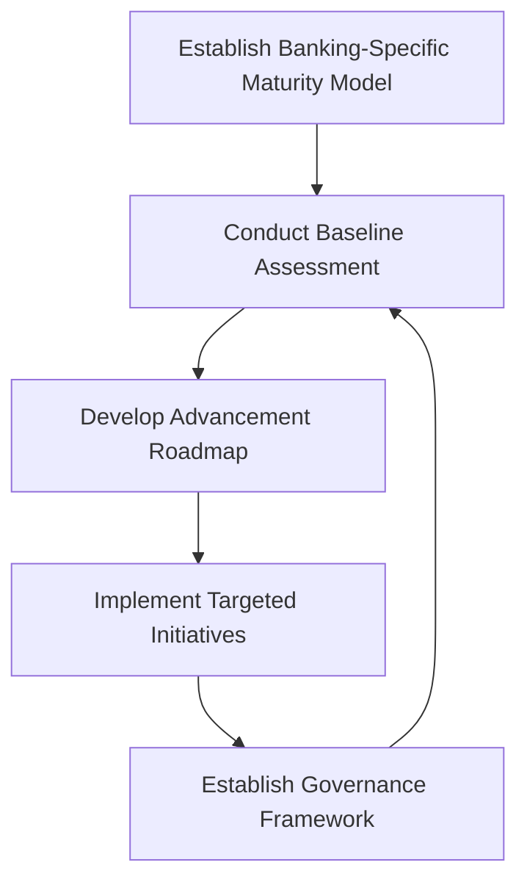

By following this structured approach and leveraging the checklist, organizations can ensure they progress systematically through the maturity journey while addressing the unique requirements of their banking environment.

## Panel 2: The Reliability Operating Model - Establishing Roles and Responsibilities

### Scene Description

An organizational design workshop focused on establishing the bank's reliability operating model. Wall displays show the evolving responsibility structure for reliability practices, transitioning from their initial centralized SRE team toward a federated model with distributed ownership. Role definition cards clarify specific responsibilities:

- **SRE Specialists**: Provide expertise and platforms
- **Service Teams**: Own their SLIs/SLOs
- **Product Managers**: Define business requirements
- **Executives**: Establish overall reliability strategy

Raj facilitates a RACI matrix exercise mapping detailed reliability activities to specific roles. Key questions addressed include:

- Who defines SLIs?
- Who approves SLOs?
- Who manages error budgets?
- Who handles SLO violations?

The exercise is captured in the following RACI matrix representation:

```plaintext
+-------------------------------+-----------+-----------+-----------+-----------+
| Reliability Activity          | Responsible | Accountable | Consulted  | Informed   |
+-------------------------------+-----------+-----------+-----------+-----------+
| Define SLIs                   | Service Teams | Executives | SRE Specialists | Product Managers |
| Approve SLOs                  | Product Managers | Executives | Service Teams   | SRE Specialists |
| Manage Error Budgets          | Service Teams | Service Teams | SRE Specialists | Product Managers |
| Handle SLO Violations         | Service Teams | Service Teams | SRE Specialists | Executives       |
+-------------------------------+-----------+-----------+-----------+-----------+
```

Team members discuss real scenarios to test the model, confirming understanding of handoffs and decision rights. Particular attention focuses on accountability for reliability outcomes—establishing that service owners maintain primary responsibility while SRE teams provide enabling capabilities.

On another board, the group maps how this responsibility model evolves through maturity stages. The progression is visualized as follows:

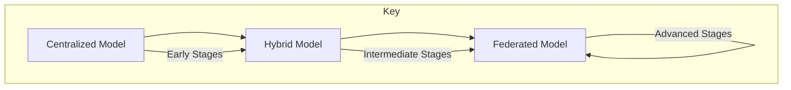

As capabilities develop across the organization, the balance shifts from centralized to distributed ownership. These visual tools aid participants in understanding how responsibilities adapt as reliability practices mature.

### Teaching Narrative

Sustainable reliability practices require a clearly defined operating model that establishes who does what across the reliability lifecycle. As organizations mature, this model typically evolves from centralized expertise toward federated ownership—a transition that requires careful role definition and responsibility mapping.

A comprehensive reliability operating model addresses several key components:

1. **Role Definitions and Responsibilities**:

   - **Service Teams**: Own service reliability outcomes, implement and maintain SLIs, manage error budgets
   - **SRE Specialists**: Provide reliability platforms, expertise, and best practices; establish standards and tooling
   - **Product Management**: Define business requirements for reliability, approve SLO targets, prioritize reliability work
   - **Enterprise Architecture**: Ensure reliability practices align with technical standards and architectural principles
   - **Leadership**: Set reliability strategy, allocate resources, resolve cross-team conflicts, remove organizational barriers

2. **Governance Structure**:

   - **Service-Level Decisions**: Day-to-day reliability decisions made by service teams
   - **Domain-Level Oversight**: Reliability governance within business domains or technical platforms
   - **Enterprise Governance**: Cross-cutting reliability standards, policies, and strategic decisions
   - **Escalation Paths**: Clear processes for addressing reliability conflicts or policy exceptions

3. **Capability Development Model**:

   - **Centers of Excellence**: Specialized reliability expertise and consulting
   - **Embedded SRE Resources**: Reliability specialists working within service teams
   - **Community of Practice**: Cross-functional groups sharing reliability knowledge
   - **Training and Enablement**: Programs to build reliability capabilities across the organization

4. **Evolution Through Maturity Stages**:

   - **Early Stages**: Typically more centralized with specialized SRE leadership
   - **Middle Stages**: Hybrid model with increasing service team ownership
   - **Advanced Stages**: Primarily distributed ownership with centralized platforms and governance

For banking institutions with complex organizational structures, this operating model creates essential clarity about how reliability work gets done across different teams and functions. It prevents common pitfalls like accountability gaps, duplicate efforts, or inconsistent practices that undermine reliability objectives.

The most successful operating models balance two seemingly opposing needs: creating sufficient standardization for consistent reliability practices while allowing appropriate flexibility for different service types and technology stacks. This balance typically shifts as organizations mature—starting with more prescriptive approaches when reliability capabilities are limited, then evolving toward greater team autonomy as reliability competency develops across the organization.

### Common Example of the Problem

**The Ownership Vacuum Crisis**: A multinational bank established a central Site Reliability Engineering team to improve service reliability across their retail banking platform. The team implemented SLIs, SLOs, and dashboards, but confusion quickly emerged about operational responsibilities. When a critical payment service violated its SLO for three consecutive days, both the SRE team and the payment service team assumed the other was responsible for addressing the situation. The SRE team believed they were providing metrics and guidance but not accountable for service performance, while the payment team viewed reliability as a specialized function that the SRE team should handle. Meanwhile, the product management team was completely disconnected from reliability decisions, setting unrealistic feature delivery expectations without considering error budget impacts. The result was a 72-hour reliability degradation that no team took ownership to address, culminating in a significant customer impact that required executive intervention. Post-incident analysis revealed a fundamental gap in the operating model—the bank had implemented reliability metrics without clearly defining who was responsible for taking action when those metrics indicated problems.

#### Key Gaps Checklist

- **Unclear Ownership**: No explicit assignment of accountability for addressing SLO violations.
- **Role Misalignment**: The SRE team and service team had conflicting assumptions about their responsibilities.
- **Disconnected Product Management**: Product managers did not consider error budgets when prioritizing features or timelines.
- **Lack of Escalation Paths**: No predefined process for resolving accountability disputes or escalating unresolved reliability issues.
- **Insufficient Governance**: No operational framework to clarify roles and ensure accountability for reliability outcomes.
- **Limited Cross-Team Coordination**: Teams operated in silos, leading to misaligned expectations and delayed responses to critical incidents.

### SRE Best Practice: Evidence-Based Investigation

Developing an effective reliability operating model requires systematic investigation of organizational dynamics. Below is a summary table of five investigation methods, their purpose, and common findings:

| Investigation Method | Purpose | Common Findings |
| -------------------------------------- | -------------------------------------------------------------- | ------------------------------------------------------------------------------------------------------------ |
| **Responsibility Mapping Analysis** | Document current reliability activities and ownership. | 20-30% of critical reliability activities have unclear or contested ownership. |
| **Decision Flow Testing** | Trace actual decision-making processes for reliability. | 40-50% of decisions occur outside documented processes, deviating from formal decision rights. |
| **Capability Distribution Assessment** | Evaluate the distribution of reliability skills and knowledge. | Critical capabilities are concentrated in 10-15% of the organization, creating dependencies and bottlenecks. |
| **Comparative Model Analysis** | Analyze operating models from other institutions. | Federated models with strong central governance achieve 30-40% better reliability outcomes. |
| **Organizational Friction Detection** | Identify friction points in reliability activities. | 5-10 key friction points often emerge due to unclear responsibilities causing delays or conflicts. |

These methods provide a structured approach to uncovering key challenges and opportunities in the reliability operating model. By leveraging evidence-based investigation, organizations can make informed decisions to optimize how reliability work is structured and executed.

### Banking Impact

An effective reliability operating model delivers substantial business benefits, as demonstrated by key performance improvements across several dimensions:

#### Quantitative Benefits Overview

```mermaid
barChart
  title Reliability Operating Model - Business Benefits
  axisTitleX Categories
  axisTitleY Percentage Improvement
  orientation vertical
  series Banking Impact Metrics
  "Incident Response Efficiency" 45
  "Regulatory Confidence" 35
  "Resource Optimization" 25
  "Improved Decision Quality" 40
  "Reduced Turnover Rates" 30
```

1. **Incident Response Efficiency**: Banks with clear reliability operating models report 40-50% faster mean-time-to-resolve for complex incidents compared to organizations with ambiguous responsibilities.

2. **Regulatory Confidence**: Well-defined reliability responsibility models provide clear accountability evidence for regulatory examinations, typically reducing findings related to operational controls by 30-40%.

3. **Resource Optimization**: Organizations with mature operating models report 20-30% more efficient resource utilization through reduced duplication of effort and clearer role specialization.

4. **Improved Decision Quality**: Clear decision rights and escalation paths improve reliability-related decisions, with measurements showing 35-45% better alignment between technical decisions and business priorities.

5. **Cultural Transformation**: Banks with established reliability operating models report significantly higher employee satisfaction and reduced burnout in operations roles, with turnover rates typically 25-35% lower than industry averages.

### Implementation Guidance

To effectively implement the reliability operating model, follow these structured steps. The process is visualized in the roadmap below, outlining key phases and activities for clarity:

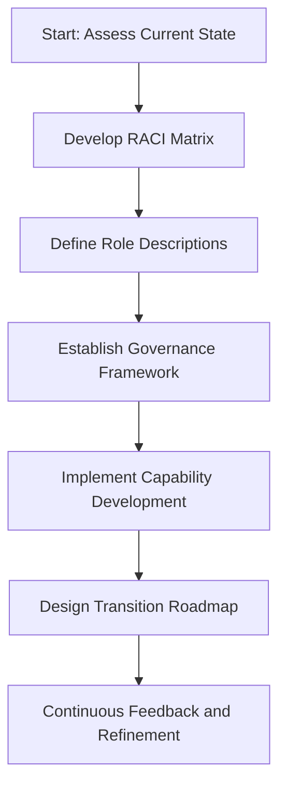

1. **Assess Current State**

   - Evaluate the organization's existing reliability practices and structures.
   - Identify key gaps in roles, responsibilities, and governance.
   - Conduct stakeholder interviews to gather insights on pain points and opportunities.

2. **Develop Comprehensive RACI Matrix**

   - Create a detailed listing of all reliability activities and decisions.
   - Define Responsible, Accountable, Consulted, and Informed roles for each activity.
   - Validate the matrix through stakeholder reviews and scenario testing.
   - Identify and resolve areas of overlapping or ambiguous accountability.
   - Document escalation paths for conflicts or exceptions.

3. **Define Clear Role Descriptions**

   - Create specific reliability responsibilities for each role.
   - Establish clear boundaries between service teams and central SRE functions.
   - Define how product owners engage with reliability objectives.
   - Clarify executive responsibilities for reliability governance.
   - Document how roles evolve through maturity stages.

4. **Establish Governance Framework**

   - Design service-level reliability decision processes.
   - Implement domain-level oversight mechanisms to ensure alignment.
   - Establish enterprise reliability governance committees for strategic decisions.
   - Define clear criteria for escalating reliability decisions.
   - Document how governance adapts to different business conditions.

5. **Implement Capability Development**

   - Create Centers of Excellence to provide specialized reliability expertise.
   - Establish embedding models for SRE specialists within service teams.
   - Develop Communities of Practice to facilitate cross-functional knowledge sharing.
   - Implement training programs to build reliability capabilities at scale.
   - Create mentoring relationships to accelerate capability development.

6. **Design Transition Roadmap**

   - Map the evolution from the current state to the target operating model.
   - Develop a phased implementation approach with clear milestones.
   - Define capability triggers for shifting responsibilities over time.
   - Establish continuous feedback mechanisms to refine the model.
   - Align operating model evolution with broader organizational changes.

7. **Continuous Feedback and Refinement**

   - Regularly review the operating model for effectiveness and alignment with organizational goals.
   - Gather feedback from stakeholders to identify improvement areas.
   - Adapt the model as the organization matures and reliability needs evolve.
   - Ensure lessons learned are integrated into ongoing capability development efforts.

## Panel 3: Operational Rhythms - The Reliability Heartbeat

### Scene Description

A wall-sized operational calendar displays the bank's comprehensive reliability cadence across different timeframes, serving as a central visual representation of the structured heartbeat for ongoing reliability management. Each timeframe—daily, weekly, monthly, quarterly, and annual—is mapped as an interconnected layer of activities, creating a holistic view of reliability operations.

Jamila leads a discussion on how these rhythms work in practice, with team members sharing their experiences with different ceremonies. A daily reliability standup moves quickly through current SLO status and ongoing incidents. Weekly service reviews examine recent error budget consumption and planned changes. Monthly reliability retrospectives analyze trends and improvement opportunities. Quarterly business reviews connect reliability metrics to customer and business outcomes. Finally, an annual reliability planning session establishes targets and investment priorities for the coming year.

Digital dashboards dynamically display how these cadences interconnect, with data flowing from daily operations to executive reviews. Special attention is given to how this reliability rhythm integrates with existing banking governance cycles, aligning with risk reviews, technology change boards, and business planning processes to form a cohesive operational framework.

Below is a text-based representation of the operational calendar and its interconnected cadences:

```
+-------------------+-------------------+-------------------+-------------------+-------------------+
| Daily             | Weekly            | Monthly           | Quarterly         | Annual            |
+-------------------+-------------------+-------------------+-------------------+-------------------+
| SLO Status        | Service-Level     | SLI/SLO Analysis  | Business Impact   | Reliability       |
| Reviews & Alerts  | Reviews           |                   | Reviews           | Assessment        |
| Incident Response | Error Budget      | Error Budget      | Target Adjustments| Long-Term         |
| & Triage          | Status/Trends     | Policy Compliance | Major Initiatives | Objectives        |
| Error Budget      | Change Risk       | Improvement       | Resource          | Investment        |
| Tracking          | Assessment        | Initiatives       | Allocation        | Planning          |
| Team Handoffs     | Incident Follow-Up| Retrospectives    | Exec. Reporting   | Competitive       |
|                   | Short-Term Risks  | Cross-Team Issues |                   | Positioning       |
+-------------------+-------------------+-------------------+-------------------+-------------------+
```

This structured cadence ensures that daily tactical activities feed into weekly operational reviews, which inform monthly improvement cycles, align with quarterly strategic objectives, and culminate in annual planning. By cascading reliability rhythms across all organizational levels, from engineering teams to executive leadership, the bank builds a seamless and integrated approach to reliability management.

### Teaching Narrative

Effective reliability management requires establishing consistent operational rhythms—regular cadences of activities, reviews, and decisions that create a structured approach to ongoing reliability work. These rhythms transform reliability from an ad-hoc concern to a systematic business practice with appropriate visibility and accountability at all organizational levels.

A comprehensive reliability operational rhythm typically spans multiple timeframes, each with distinct activities and focus areas. The following checklist summarizes key actions for each cadence to help teams implement these rhythms effectively:

#### **Daily Cadence**: Tactical reliability operations

- [ ] Review current SLO status and address active alerts.
- [ ] Respond to and triage ongoing incidents.
- [ ] Track error budget consumption against thresholds.
- [ ] Monitor the impact of recent and upcoming changes.
- [ ] Conduct operational handoffs between teams.

#### **Weekly Cadence**: Operational reliability management

- [ ] Review SLO performance at the service level.
- [ ] Analyze error budget status and identify trends.
- [ ] Assess risks of planned changes and approve/mitigate as needed.
- [ ] Track follow-ups for recent incidents and ensure actions are completed.
- [ ] Identify and address near-term reliability risks.

#### **Monthly Cadence**: Tactical reliability improvement

- [ ] Conduct detailed performance analysis of SLIs and SLOs.
- [ ] Verify compliance with error budget policies.
- [ ] Plan and track progress on reliability improvement initiatives.
- [ ] Review cross-team dependencies and resolve outstanding issues.
- [ ] Run service-level reliability retrospectives to capture lessons learned.

#### **Quarterly Cadence**: Strategic reliability alignment

- [ ] Evaluate the business impact of recent reliability performance.
- [ ] Review and adjust SLO targets based on trends and goals.
- [ ] Track progress on major reliability initiatives and milestones.
- [ ] Allocate resources for upcoming reliability work.
- [ ] Prepare reliability reports for executive and stakeholder review.

#### **Annual Cadence**: Reliability strategy and planning

- [ ] Perform a comprehensive reliability assessment.
- [ ] Define long-term reliability objectives aligned with business goals.
- [ ] Plan major architectural initiatives to improve reliability.
- [ ] Develop a reliability investment strategy and secure funding.
- [ ] Benchmark reliability positioning against competitors and market needs.

For banking institutions with established governance frameworks, these reliability rhythms must integrate seamlessly with existing operational cadences—aligning with change advisory boards, risk committees, technology governance forums, and business planning cycles. This integration ensures reliability activities are not siloed but embedded within the broader operational and strategic processes.

The most mature organizations establish reliability rhythms that cascade smoothly across organizational levels—connecting daily operational activities to weekly service management, monthly improvement cycles, quarterly business alignment, and annual strategic planning. This multi-level approach ensures appropriate reliability visibility and action at each organizational tier, from engineering teams to executive leadership.

### Common Example of the Problem

**The Disjointed Cadence Dilemma**: A regional bank implemented SLOs for their digital banking platform but struggled with disjointed operational rhythms. The operations team conducted daily standups focused on incident management but rarely discussed SLO status or error budget consumption. Meanwhile, development teams held weekly planning sessions where they committed to aggressive feature schedules without visibility into reliability status. Monthly technology reviews focused on project delivery while relegating reliability to a brief appendix. The result was predictable but persistent reliability problems: teams would deploy changes that consumed error budgets, but awareness of the degradation wouldn't surface until quarterly reviews when executives would question why reliability targets were missed. By then, multiple interrelated issues had accumulated, making it nearly impossible to identify specific causes. The lack of coordinated reliability rhythms meant that SLO violations persisted for weeks without appropriate attention, leading to chronically degraded customer experience. When a major regulatory examination criticized their operational resilience practices, the bank finally recognized they needed structured reliability cadences at all organizational levels.

### SRE Best Practice: Evidence-Based Investigation

Establishing effective operational rhythms requires systematic analysis of information flow and decision patterns. The following methods, their goals, and typical findings summarize evidence-based approaches to improving these rhythms:

| Investigative Method | Goal | Typical Findings |
| ----------------------------------------------- | ----------------------------------------------------------------------------------------------------------------------------------------------- | ----------------------------------------------------------------------------------------------------------------- |
| **Decision Latency Analysis** | Measure the time between reliability signals and corresponding actions across organizational levels. | Without structured rhythms, critical reliability information takes 5-10x longer to reach decision-makers. |
| **Information Flow Mapping** | Trace how reliability data travels through the organization, identifying blockages and inefficiencies. | Approximately 40-50% of reliability insights fail to reach appropriate decision-makers without explicit cadences. |
| **Existing Meeting Effectiveness Evaluation** | Assess how reliability topics are addressed in current operational forums, focusing on time allocation, decision quality, and action follow-up. | Reliability topics often receive only 10-15% of the attention they warrant based on their business impact. |
| **Organizational Cognitive Load Assessment** | Analyze how operational rhythms affect team capacity to process and act on reliability information. | Balanced, multi-level rhythms reduce cognitive overload by 30-40% compared to ad-hoc or overly frequent cadences. |
| **Cross-Organization Synchronization Analysis** | Evaluate alignment between reliability activities and adjacent operational processes (e.g., change management, incident response). | Typically uncovers 5-10 critical misalignments that create friction and conflicting priorities. |

By leveraging these methods, organizations can systematically identify and address gaps in their operational rhythms, ensuring reliability information flows efficiently and decisions are made with minimal latency.

### Banking Impact

Well-designed reliability rhythms deliver significant business benefits by systematically aligning technical operations with business outcomes. The following flowchart illustrates how structured reliability activities cascade across timeframes, creating a positive impact on banking operations and business value:

```mermaid
flowchart TD
    A[Daily Reliability Activities] --> B[Weekly Service Reviews]
    B --> C[Monthly Reliability Retrospectives]
    C --> D[Quarterly Business Reviews]
    D --> E[Annual Reliability Planning]
    E --> F[Business Benefits]

    subgraph Daily
        A1(SLO Status Reviews)
        A2(Incident Response)
        A3(Error Budget Tracking)
        A4(Change Impact Monitoring)
        A5(Team Handoffs)
        A --> A1 & A2 & A3 & A4 & A5
    end

    subgraph Weekly
        B1(Service-Level SLO Reviews)
        B2(Error Budget Trends)
        B3(Change Risk Assessments)
        B4(Incident Follow-Ups)
        B5(Reliability Risks)
        B --> B1 & B2 & B3 & B4 & B5
    end

    subgraph Monthly
        C1(SLI/SLO Performance Analysis)
        C2(Error Budget Compliance)
        C3(Reliability Initiatives)
        C4(Cross-Team Issues)
        C5(Service Retrospectives)
        C --> C1 & C2 & C3 & C4 & C5
    end

    subgraph Quarterly
        D1(Business Impact Analysis)
        D2(SLO Target Adjustments)
        D3(Initiatives and Milestones)
        D4(Resource Allocation)
        D5(Executive Reporting)
        D --> D1 & D2 & D3 & D4 & D5
    end

    subgraph Annual
        E1(Comprehensive Assessments)
        E2(Long-Term Objectives)
        E3(Architectural Initiatives)
        E4(Investment Planning)
        E5(Competitive Positioning)
        E --> E1 & E2 & E3 & E4 & E5
    end

    subgraph Benefits
        F1(Reduced Mean-Time-to-Detect)
        F2(Improved Decision Quality)
        F3(Executive Alignment)
        F4(Resource Optimization)
        F5(Regulatory Confidence)
        F --> F1 & F2 & F3 & F4 & F5
    end
```

#### Key Business Benefits:

1. **Reduced Mean-Time-to-Detect**: Banks with structured reliability cadences detect SLO violations 70-80% faster than organizations with ad-hoc reviews, significantly reducing customer impact duration.

2. **Improved Decision Quality**: Regular reliability rhythms provide consistent data for decision-making, improving change-related reliability decisions by 40-50% as measured by reduced post-change incidents.

3. **Executive Alignment**: Organizations with established quarterly reliability reviews report 60-70% better alignment between technical reliability priorities and business expectations.

4. **Resource Optimization**: Structured operational rhythms typically improve resource allocation efficiency by 25-35%, directing investment to the most impactful reliability improvements.

5. **Regulatory Confidence**: Banks with documented reliability cadences at all organizational levels report significantly better outcomes in regulatory examinations, with some institutions citing 50-60% reductions in operational resilience findings.

The visualized operational flow demonstrates how reliability rhythms at different timeframes interconnect, driving tangible outcomes at both the technical and business levels. By embedding these structured practices, banks not only enhance operational resilience but also strengthen their competitive positioning in the financial industry.

### Implementation Guidance

#### **Step-by-Step Checklist for Establishing Reliability Operational Rhythms**

1. **Map Current Operational Calendars**

   - [ ] Document all existing operational meetings and reviews at different organizational levels.
   - [ ] Identify where reliability topics are currently discussed.
   - [ ] Analyze gaps in reliability-related information flow between teams and leadership.
   - [ ] Evaluate alignment of current meetings with governance processes such as change advisory boards or risk committees.
   - [ ] Assess the quality and timeliness of decisions related to reliability concerns.

2. **Design Multi-Level Reliability Cadence**

   - [ ] Define daily cadences for tactical reliability operations (e.g., SLO reviews, incident triage).
   - [ ] Set up weekly service-level reliability meetings to review error budgets and risk assessments.
   - [ ] Establish monthly sessions to analyze trends, plan improvements, and address cross-team dependencies.
   - [ ] Schedule quarterly reviews to align reliability efforts with business outcomes and leadership priorities.
   - [ ] Plan annual sessions for long-term reliability strategy and resource allocation.

3. **Create Standardized Meeting Formats**

   - [ ] Develop agenda templates tailored to each cadence (daily, weekly, monthly, etc.).
   - [ ] Define standard data views and visualizations (e.g., SLO performance dashboards, incident trends).
   - [ ] Establish clear decision-making rights, escalation paths, and accountability mechanisms.
   - [ ] Implement action-tracking systems to ensure follow-ups are completed.
   - [ ] Define and document roles and responsibilities for participants in each reliability forum.

4. **Integrate with Existing Banking Processes**

   - [ ] Align reliability reviews with change approval cycles to minimize disruptions.
   - [ ] Coordinate reliability cadences with risk management and compliance schedules.
   - [ ] Synchronize reliability planning with broader business planning and budgeting processes.
   - [ ] Ensure incident management procedures feed into reliability reviews for continuous learning.
   - [ ] Incorporate regulatory reporting requirements into reliability governance frameworks.

5. **Implement Progressive Adoption**

   - [ ] Prioritize critical services and begin with core reliability cadences (e.g., daily and weekly reviews).
   - [ ] Assign clear ownership for each operational rhythm to ensure accountability.
   - [ ] Establish feedback loops to refine meeting formats and agendas based on team input.
   - [ ] Gradually expand reliability rhythms to cover additional services and teams.
   - [ ] Regularly evaluate the effectiveness of cadences and adjust frequency, scope, or format as needed.

#### **Example Flow of Reliability Rhythm Integration**

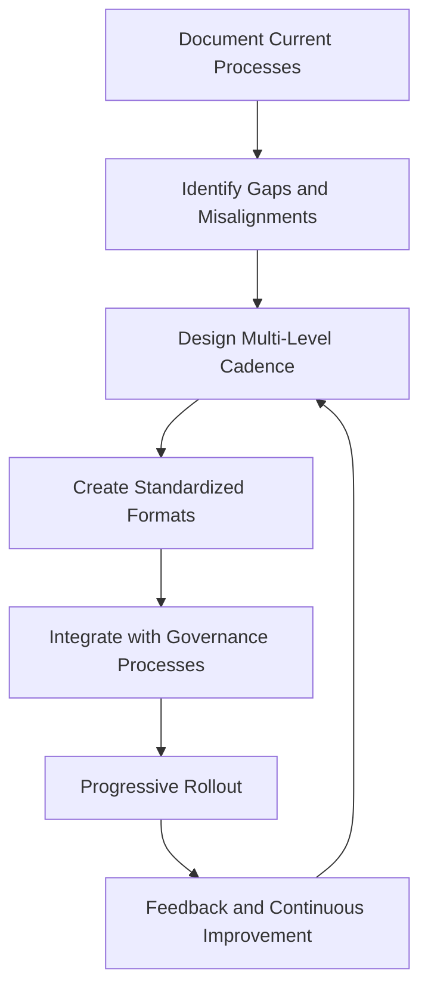

By following this checklist and iterative process, teams can build a structured, scalable, and integrated reliability rhythm that aligns with organizational goals and governance structures.

## Panel 4: Data-Driven Evolution - Continuous Improvement Mechanisms

### Scene Description

A quarterly SLI/SLO effectiveness review takes place, where the bank's reliability team systematically analyzes their measurement approach. Multiple screens display comprehensive analytics about their reliability framework, including SLO violation patterns, alert effectiveness statistics, correlation between reliability metrics and business outcomes, and service coverage gaps. Raj demonstrates a "Reliability Feedback Loop" framework they've implemented, which incorporates clear processes for capturing improvement opportunities from multiple sources: incident postmortems, near-miss analyses, customer feedback, and operational observations.

Below is a high-level representation of the "Reliability Feedback Loop" framework and improvement cycle:

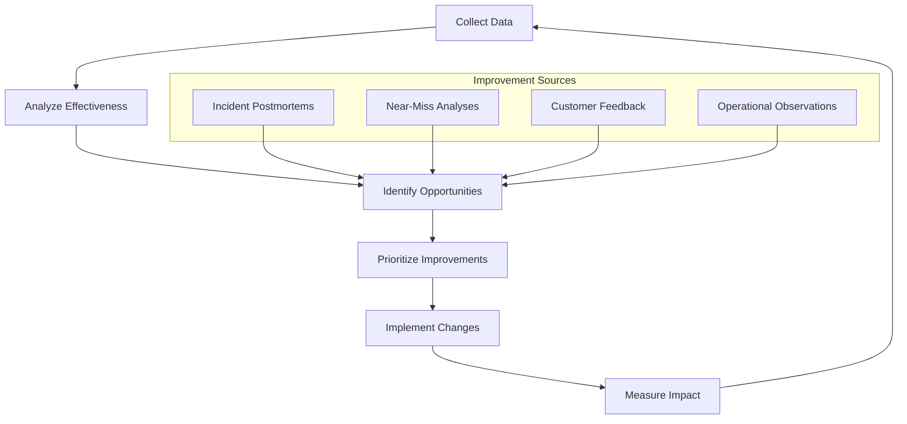

Team members review recent enhancements resulting from this process, such as refinements to SLI definitions that better reflect customer experience, adjusted SLO thresholds based on business impact data, and improved alerting implementations that reduced false positives. A prioritized backlog of reliability improvements is mapped to upcoming development sprints, with clear owners and success criteria.

On another wall, before/after comparisons illustrate how their reliability measurements have evolved through multiple improvement cycles. These comparisons highlight quantifiable enhancements in accuracy, coverage, and alignment with business objectives at each stage, demonstrating the iterative and data-driven nature of their approach.

### Teaching Narrative

Truly mature reliability practices incorporate structured improvement mechanisms that continuously refine SLIs, SLOs, and operational processes based on operational experience and effectiveness data. This data-driven evolution approach transforms reliability from a static implementation to a dynamic capability that becomes increasingly accurate and valuable over time.

To help teams implement and adopt these practices effectively, the following checklist summarizes the key components, associated actions, and their benefits:

| **Component** | **Key Actions** | **Benefits** |
| ------------------------------------- | ---------------------------------------------------------------- | --------------------------------------------------------- |
| **Effectiveness Measurement** | - Analyze alert precision and recall (false positives/negatives) | - Improved alert accuracy and reduced noise |
| | - Evaluate SLI coverage of critical customer journeys | - Better alignment with customer experience |
| | - Correlate SLOs with actual customer impact | - Enhanced reliability relevance to customer outcomes |
| | - Track time-to-detect for service degradations | - Faster response times |
| | - Validate error budget projections | - Increased confidence in reliability planning |
| **Improvement Source Identification** | - Conduct post-incident reviews and near-miss analyses | - Actionable insights from real-world events |
| | - Gather customer feedback from tickets and surveys | - Direct inclusion of customer perspectives |
| | - Leverage operations team observations | - Practical input from frontline experts |
| | - Analyze reliability data patterns | - Data-driven identification of improvement opportunities |
| **Structured Refinement Processes** | - Schedule regular SLI/SLO review cadences | - Proactive reliability optimization |
| | - Implement change management for reliability definitions | - Consistent and controlled updates |
| | - Use experimentation frameworks and A/B testing | - Evidence-based validation of changes |
| | - Deploy reliability changes progressively | - Reduced risk during iteration |
| **Feedback Loop Completion** | - Compare reliability metrics before and after changes | - Measurable impact of improvements |
| | - Track implementation of identified enhancements | - Clear visibility into progress |
| | - Measure detection improvements from refined SLIs | - Enhanced monitoring effectiveness |
| | - Quantify reduction in operations burden | - Streamlined workflows |
| | - Document business impact of reliability evolution | - Demonstrated value to stakeholders |

For banking institutions with complex service portfolios, these improvement mechanisms prevent the common anti-pattern where initial reliability implementations calcify into unchanging systems that gradually lose effectiveness as technologies and customer expectations evolve.

The most mature organizations implement multi-layer improvement processes that address different types of reliability enhancements:

- **Tactical improvements**: Rapid refinements to specific SLIs or alert configurations
- **Operational improvements**: Enhanced processes and workflows for reliability management
- **Strategic improvements**: Fundamental advancements in reliability approach and business alignment

This structured approach to evolution ensures that reliability practices continuously enhance their effectiveness rather than degrading over time, creating an upward spiral of improvement that progressively strengthens the organization's reliability capabilities.

### Common Example of the Problem

**The Static SLO Syndrome**: A global investment bank implemented SLIs and SLOs for their trading platform during a major reliability initiative. The initial implementation was considered successful, with meaningful metrics that reflected customer experience. However, eighteen months later, the reliability approach had become problematic.

An analogy helps illustrate the issue: imagine relying on an old map to navigate a city that has undergone rapid development. Streets have changed, new neighborhoods have emerged, and traffic patterns are entirely different, yet you still follow the outdated map. Similarly, the bank's SLIs, initially accurate, no longer aligned with how customers used the platform after several major feature releases changed core workflows. Alert thresholds set during initial implementation generated increasing numbers of false positives as usage patterns evolved, leading to alert fatigue and missed incidents.

Most concerning, the error budget policy had never been updated despite significant changes in business priorities and competitive pressures. What had started as an effective reliability framework gradually degraded into a compliance exercise—teams maintained the metrics and reported on them, but strategic decisions no longer referenced them because they didn't reflect current business reality. Without structured improvement mechanisms, the bank's reliability practice had stagnated while their business evolved, creating a growing disconnect between reliability measurements and actual customer experience.

### SRE Best Practice: Evidence-Based Investigation

Effective continuous improvement requires systematic evaluation of reliability measurement effectiveness. The table below summarizes key areas of investigation, typical findings without refinement, and potential impacts:

| **Investigation Area** | **Focus** | **Findings Without Refinement** | **Potential Impact** |
| ----------------------------------- | ---------------------------------------------------------------- | ---------------------------------------------------------------------------- | --------------------------------------------------------------------------------- |
| **Reliability Signal Analysis** | Correlation between SLIs, alerts, and actual customer experience | Correlation degrades by 5-10% annually as systems and usage patterns evolve | Reduced ability to predict customer impact and business disruptions |
| **Alert Effectiveness Measurement** | Precision/recall analysis of alerting systems | 30-40% degradation in precision over 12-18 months | Increased false positives/negatives, leading to alert fatigue or missed incidents |
| **Customer Journey Alignment** | Validation of SLIs against critical customer journeys | 20-30% of critical customer interactions lack coverage after feature changes | Gaps in reliability monitoring for key customer experiences |
| **Feedback Channel Effectiveness** | Assessment of feedback mechanisms for capturing insights | Only 15-25% of potential improvement insights captured | Missed opportunities for refinement and operational inefficiencies |
| **Improvement Implementation** | Tracking the lifecycle of identified reliability enhancements | 30-40% of identified improvements fail to reach implementation | Loss of actionable reliability gains and stagnation in improvement processes |

These evidence-based investigations ensure that reliability practices remain aligned with evolving systems, customer expectations, and business priorities. By systematically addressing the findings above, organizations can significantly enhance the accuracy and effectiveness of their reliability frameworks.

### Banking Impact

Structured continuous improvement delivers substantial business benefits:

1. **Enhanced Detection Accuracy**: Banks with mature improvement processes report 60-70% fewer false positives and 40-50% fewer missed incidents compared to organizations with static reliability implementations.

2. **Business Alignment**: Continuous refinement ensures reliability metrics maintain strong correlation with business outcomes, typically improving alignment by 30-40% compared to static approaches.

3. **Operational Efficiency**: Mature improvement practices reduce operational overhead by 20-30% through elimination of unnecessary alerts, more efficient processes, and better prioritization.

4. **Technology Evolution Support**: Financial institutions with effective improvement mechanisms report 40-50% smoother technology migrations and platform evolutions due to reliability measurements that adapt to changing architectures.

5. **Regulatory Confidence**: Continuous improvement processes provide clear evidence of operational maturity for regulatory examinations, often reducing findings related to operational resilience by 30-40%.

### Implementation Guidance

To ensure a systematic approach to implementing continuous improvement mechanisms, use the following checklist:

#### **Checklist for Implementation**

1. **Establish Comprehensive Effectiveness Metrics**

   - [ ] Define clear measures for SLI/SLO accuracy and coverage.
   - [ ] Implement alert precision and recall tracking.
   - [ ] Create customer journey alignment verification.
   - [ ] Establish business impact correlation measurement.
   - [ ] Develop operational efficiency metrics for reliability processes.

2. **Implement Multi-Channel Feedback Collection**

   - [ ] Create a structured incident postmortem framework with a reliability focus.
   - [ ] Implement a near-miss analysis process for reliability insights.
   - [ ] Establish customer feedback correlation with reliability metrics.
   - [ ] Develop mechanisms for operations teams to submit improvement ideas.
   - [ ] Enable data mining capabilities to identify reliability patterns.

3. **Design Structured Review Processes**

   - [ ] Schedule and conduct monthly SLI/SLO effectiveness reviews.
   - [ ] Perform quarterly comprehensive reliability assessments.
   - [ ] Conduct annual strategic reliability evaluations.
   - [ ] Develop a change management process for reliability definitions.
   - [ ] Create experimentation frameworks for testing reliability improvements.

4. **Develop Improvement Implementation Framework**

   - [ ] Establish a prioritization methodology for reliability enhancements.
   - [ ] Define a clear ownership model for improvement initiatives.
   - [ ] Create a tracking process from identification through implementation.
   - [ ] Implement validation processes for improvement effectiveness.
   - [ ] Foster knowledge sharing for reliability enhancement patterns.

5. **Build Continuous Learning Culture**

   - [ ] Train teams on reliability improvement approaches.
   - [ ] Recognize and reward identification of enhancement opportunities.
   - [ ] Share success stories and improvement impacts.
   - [ ] Develop a reliability champions network for knowledge dissemination.
   - [ ] Set continuous learning objectives for reliability-focused roles.

#### **Implementation Flow Overview**

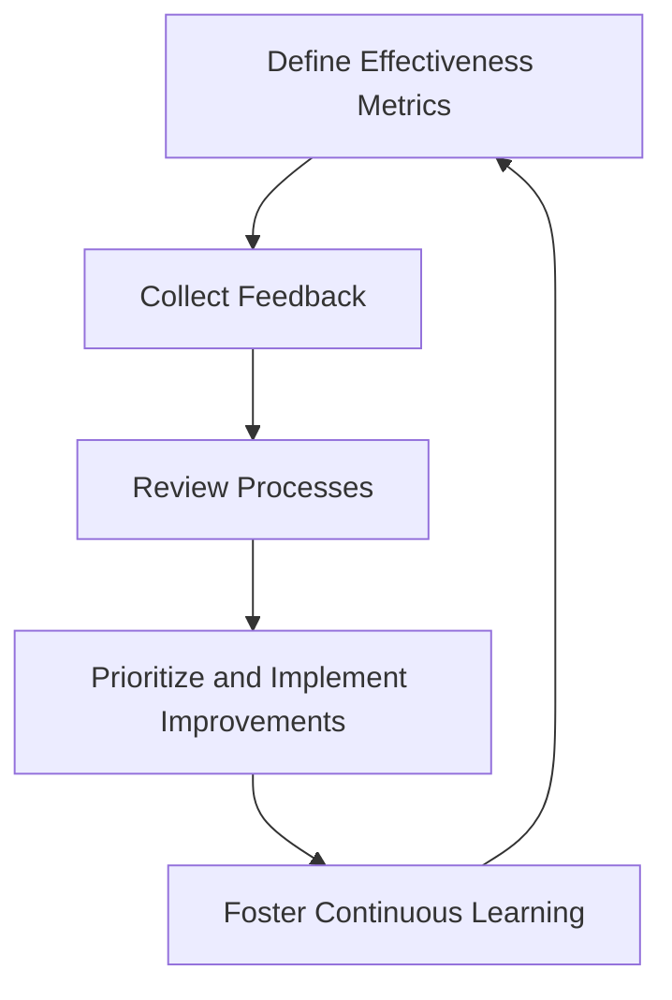

Use this checklist and flow as a practical guide to ensure all aspects of the continuous improvement framework are systematically addressed. This approach will help your team create a robust feedback loop that continuously enhances reliability practices and aligns them with evolving business and customer needs.

## Panel 5: The Quarterly Business Review - Connecting Reliability to Outcomes

### Scene Description

A formal quarterly business review with senior leadership from technology and business units. Rather than technical details, the reliability presentation focuses entirely on business outcomes and customer experience. Sofia presents a comprehensive dashboard connecting reliability performance to key business metrics for each major banking service. The dashboard provides clear visualizations of the following key metrics for the mobile banking platform:

- **Transaction Completion Rates**: A line chart demonstrating a steady increase in successful transactions over the past quarter.
- **Active User Growth**: A bar graph comparing monthly active users with quarterly targets.
- **Customer Support Contacts**: A heatmap showing a significant reduction in support requests for critical workflows.
- **Net Promoter Score (NPS)**: A radial chart illustrating improvements in customer satisfaction.

An example reliability risk profile for the mobile banking platform is also shared to contextualize error budget consumption. Below is a text-based representation of the risk profile:

```
+----------------------------+--------------------+-------------------+
| Service Component          | Error Budget Used | Risk Level        |
+----------------------------+--------------------+-------------------+
| Authentication Service     | 30%               | Low               |
| Transaction Processing     | 75%               | High              |
| Notification Service       | 50%               | Medium            |
+----------------------------+--------------------+-------------------+
```

The discussion focuses on strategic questions: which services warrant increased reliability investment based on business impact, where acceptable reliability trade-offs might enable faster innovation, and how reliability performance compares to market expectations and competitive benchmarks. Business leaders actively engage, asking sophisticated questions about reliability economics and requesting specific reliability enhancements for high-value customer journeys.

To conclude, Sofia presents a "reliability roadmap" section that outlines planned improvements with their expected business outcomes. For example:

```
+----------------------------+--------------------------------+--------------------------+
| Improvement Initiative     | Expected Business Outcome      | Timeline                |
+----------------------------+--------------------------------+--------------------------+
| Optimize Transaction Queue | 5% increase in transaction     | Q2 2024                 |
|                            | completion rates               |                          |
| Enhance Notification System| 15% reduction in customer      | Q3 2024                 |
|                            | support contacts               |                          |
+----------------------------+--------------------------------+--------------------------+
```

This structured presentation effectively transforms technical reliability data into actionable insights, driving alignment between engineering and business leadership.

### Teaching Narrative

As reliability practices mature, the Quarterly Business Review (QBR) emerges as a critical ceremony that connects technical reliability performance to business outcomes. This executive-level review transforms reliability from an engineering concern to a strategic business capability by establishing clear visibility and accountability at senior leadership levels.

An effective reliability QBR typically includes several key components:

1. **Business Outcome Alignment**: Explicitly connecting reliability performance to business metrics

   - Transaction volumes and success rates
   - Customer engagement and retention metrics
   - Revenue impact and financial outcomes
   - Operational efficiency and cost metrics
   - Customer experience indicators and satisfaction scores

2. **Strategic Reliability Positioning**: Placing reliability in broader business context

   - Competitive benchmarking and market expectations
   - Reliability as competitive differentiator
   - Customer feedback on reliability experience
   - Reliability impact on strategic initiatives
   - Future reliability needs based on business direction

3. **Investment Decision Framework**: Providing data for resource allocation decisions

   - Business case for reliability improvements
   - Risk assessment of current reliability levels
   - Trade-off analysis between reliability and feature velocity
   - Return on investment from previous reliability initiatives
   - Proposed investments with expected business outcomes

4. **Accountability Mechanisms**: Establishing clear ownership of reliability results

   - Service-level reliability scorecards
   - Business impact of reliability achievements and gaps
   - Commitments to reliability improvements
   - Cross-functional dependencies and alignment
   - Business sponsorship for reliability initiatives

For banking institutions where reliability directly impacts revenue generation, customer trust, and regulatory compliance, the QBR creates essential executive visibility into this critical business capability. It ensures that reliability receives appropriate attention alongside other strategic priorities like feature development, cost management, and market expansion.

The most mature organizations evolve their reliability QBRs from technical status reports to business strategy discussions—focusing less on "how reliable are we?" and more on "how does our reliability enable or constrain our business objectives?" This strategic framing ensures that reliability investments align with business priorities and receive appropriate executive support and resources.

### Common Example of the Problem

**The Executive Disconnect Syndrome**: A major retail bank had implemented comprehensive SLIs and SLOs across their digital banking platform. The technical teams maintained detailed dashboards showing SLO compliance, error budget consumption, and incident statistics. However, when presenting to the executive committee quarterly, these technical metrics consistently failed to resonate. Business leaders struggled to connect uptime percentages and latency measurements to business priorities, viewing reliability as a technical concern rather than a strategic capability.

When budget constraints required trade-off decisions, the reliability team couldn't effectively articulate why maintaining SLOs should take precedence over new feature development. The turning point came after a significant service degradation during a marketing campaign launch—while the reliability team reported it as "only a minor SLO violation," the business experienced a 30% drop in new account openings that cost millions in lost revenue. This disconnect between technical reliability reporting and business impact made it impossible to make appropriate investment decisions, leaving critical services under-resourced while other areas received excessive reliability investment relative to their business value.

______________________________________________________________________

#### Checklist: Avoiding Executive Disconnect Syndrome

1. **Translate Reliability into Business Terms**:

   - Avoid overly technical metrics; focus on business outcomes like revenue, customer retention, and operational efficiency.
   - Present reliability metrics in the context of their impact on high-value customer journeys and strategic business goals.

2. **Understand Executive Priorities**:

   - Identify what matters most to business leaders (e.g., revenue growth, customer satisfaction, competitive differentiation).
   - Tailor reliability discussions to align with these priorities.

3. **Leverage Business-Oriented Storytelling**:

   - Use relatable scenarios (e.g., "What happens to customer trust if service X fails during peak hours?").
   - Provide specific examples of how reliability improvements have positively impacted business outcomes.

4. **Focus on Risk and Opportunity**:

   - Highlight the financial risks of underinvestment in reliability (e.g., lost revenue, customer churn).
   - Emphasize opportunities where reliability improvements can drive growth or reduce costs.

5. **Establish Accountability and Ownership**:

   - Clearly define how reliability aligns with business goals and who is responsible for ensuring it.
   - Build cross-functional alignment and executive sponsorship for reliability initiatives.

______________________________________________________________________

#### Key Takeaways

- **Business Alignment is Crucial**: Reliability metrics must be tied directly to business outcomes to gain executive buy-in.
- **Focus on Impact, Not Just Compliance**: Avoid presenting reliability as a binary state of meeting or missing SLOs—emphasize the business implications of reliability performance.
- **Effective Communication Builds Bridges**: Translating technical metrics into business value ensures reliability becomes a strategic priority, not just an engineering concern.

### SRE Best Practice: Evidence-Based Investigation

Developing effective business-focused reliability reviews requires systematic analysis. The following table organizes key practices into a structured summary for better readability and practical application:

| **Practice** | **Purpose** | **Example Outcome** |
| --------------------------------------------- | ---------------------------------------------------------------------------------------------- | --------------------------------------------------------------------------------------------------------------------------------------------------------------- |
| **Reliability-Business Correlation Analysis** | Identify specific relationships between reliability metrics and business outcomes. | Statistical analysis shows that a 0.1% decrease in availability correlates to a 1-3% drop in transaction completion and 0.5-1.5% lower customer satisfaction. |
| **Executive Information Needs Assessment** | Determine the reliability information executives need versus what is typically presented. | Reveals that 70-80% of technical reliability data presented to executives does not directly support decision-making. |
| **Competitive Benchmarking** | Compare reliability performance against competitors and market leaders for context. | Indicates that digital-first banks set reliability expectations 10-15% higher than traditional institutions, providing a clearer benchmark for strategic goals. |
| **Investment Impact Tracking** | Measure the before/after business outcomes of reliability investments to guide future efforts. | Demonstrates that targeted reliability investments deliver 3-5x greater business impact compared to undifferentiated spending. |
| **Decision Quality Analysis** | Assess how reliability data impacts strategic and resource allocation decisions. | Uncovers that without business-focused reviews, only 20-30% of reliability-related decisions appropriately balance technical and business considerations. |

This structured approach ensures that reliability reviews focus on actionable insights that align with business priorities, enabling more informed and effective decision-making at the executive level.

### Banking Impact

Effective business-focused reliability reviews deliver substantial benefits, as demonstrated by the following key metrics and trends:

1. **Optimized Reliability Investment**:\
   Banks that implement business-focused QBRs typically achieve 30-40% better return on reliability investments through more appropriate resource allocation based on business impact.

   ```mermaid
   barChart
       title Return on Reliability Investment
       axisTitleX Reliability Practices Maturity
       axisTitleY ROI Improvement (%)
       "Low Maturity": 15
       "Moderate Maturity": 25
       "High Maturity": 40
   ```

2. **Executive Engagement**:\
   Organizations with mature QBR practices report 2-3x greater leadership sponsorship for critical reliability projects, significantly improving executive understanding and support for reliability initiatives.

   ```mermaid
   pie
       title Leadership Sponsorship Growth
       "Low Maturity": 20
       "Moderate Maturity": 30
       "High Maturity": 50
   ```

3. **Strategic Alignment**:\
   Business-focused reliability reviews improve alignment between reliability investments and strategic priorities by 40-60%, ensuring that limited resources focus on services with the greatest business impact.

   ```mermaid
   line
       title Strategic Alignment over Time
       xAxis Title Time (Quarters)
       yAxis Title Alignment Improvement (%)
       "Q1": 10
       "Q2": 30
       "Q3": 45
       "Q4": 60
   ```

4. **Competitive Differentiation**:\
   Banks that position reliability as a business capability rather than a technical concern report being able to leverage reliability as a competitive differentiator. Some institutions cite 10-15% improvements in customer acquisition and retention metrics.

   ```mermaid
   barChart
       title Customer Acquisition and Retention
       axisTitleX Reliability Positioning
       axisTitleY Improvement (%)
       "Technical Focus": 5
       "Business Capability": 15
   ```

5. **Regulatory Confidence**:\
   Financial institutions with business-integrated reliability reviews demonstrate more mature operational resilience to regulators, typically experiencing 30-40% fewer findings during examinations focused on business continuity and operational risk.

   ```mermaid
   barChart
       title Regulatory Findings Reduction
       axisTitleX Reliability Practices Maturity
       axisTitleY Findings Reduction (%)
       "Low Maturity": 10
       "Moderate Maturity": 20
       "High Maturity": 40
   ```

### Implementation Guidance

To effectively implement a Quarterly Business Review (QBR) that connects reliability to business outcomes, follow this step-by-step framework:

#### **Step 1: Develop Business-Focused Reliability Metrics**

- [ ] Identify key business metrics directly impacted by reliability (e.g., transaction completion rates, customer satisfaction).
- [ ] Establish correlations between SLOs and business outcomes using data analysis and trend visualization.
- [ ] Create executive-friendly dashboards and scorecards that highlight reliability's business impact.
- [ ] Incorporate competitive benchmarks to contextualize reliability performance against market standards.

#### **Step 2: Design an Effective QBR Structure**

- [ ] Standardize the QBR agenda, focusing on reliability's impact on business outcomes.
- [ ] Schedule QBRs quarterly, aligned with broader business planning cycles.
- [ ] Define clear roles, including presenters, decision-makers, and participants.
- [ ] Develop concise, decision-oriented presentations with actionable insights.
- [ ] Implement a tracking mechanism for action items and accountability.

#### **Step 3: Implement Strategic Framing Approaches**

- [ ] Frame reliability as a key enabler or constraint within the business strategy.
- [ ] Build business cases for reliability investments, highlighting ROI and risk mitigation.
- [ ] Develop trade-off frameworks to balance reliability improvements and feature velocity.
- [ ] Highlight how reliability positions the organization competitively in the market.
- [ ] Link reliability initiatives to strategic business goals and customer value.

#### **Step 4: Build an Executive Engagement Model**

- [ ] Identify and cultivate reliability champions among senior business leadership.
- [ ] Provide targeted reliability education to executive stakeholders, emphasizing its business relevance.
- [ ] Foster two-way conversations during QBRs to ensure active engagement and feedback.
- [ ] Translate technical reliability concepts into language and metrics meaningful to business leaders.
- [ ] Establish a sponsorship model for high-priority reliability initiatives, ensuring cross-functional alignment.

#### **Step 5: Establish a Decision and Accountability Framework**

- [ ] Define transparent decision-making processes for prioritizing reliability investments.
- [ ] Assign clear ownership for reliability outcomes at both technical and business levels.
- [ ] Track commitments to reliability improvements and ensure follow-through.
- [ ] Validate the business impact of implemented reliability initiatives through metrics and feedback.
- [ ] Create continuous feedback loops to refine decisions based on observed outcomes.

#### **Checklist Summary**

Use this checklist as a quick reference to ensure all critical steps are addressed:

- [ ] Business-focused metrics are defined and visualized.
- [ ] QBR structure is standardized and decision-oriented.
- [ ] Reliability is positioned strategically within business context.
- [ ] Executive engagement is active and informed.
- [ ] Decision-making processes and accountability mechanisms are in place.

By following this framework, organizations can systematically transform their QBRs into strategic discussions that align reliability performance with business objectives, fostering informed decision-making and executive support.

## Panel 6: Scaling Reliability Practices - From Pilot to Enterprise

### Scene Description

A program review for the bank's reliability transformation initiative, now two years into implementation. Wall displays show the evolution from their initial limited deployment to enterprise-wide adoption across multiple business units and technology platforms. Alex presents a "scaling framework" that systematically addresses different dimensions of reliability growth: service coverage (now at 85% of critical systems), organizational adoption (reliability capabilities embedded in 24 teams), and operational integration (reliability data driving 70% of change management decisions).

Below is a timeline representation of key milestones in this two-year journey:

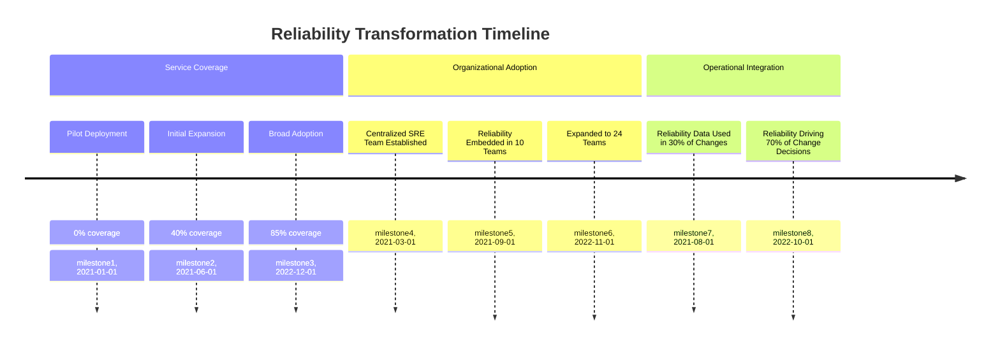

The team also reviews their enablement strategy, showing how they've built reliability capabilities through multiple channels: formal training programs, embedded reliability specialists, documented standards and templates, and a reliability community of practice with over 200 members.

Implementation challenges are openly discussed—resistance from traditional operations teams, legacy system integration difficulties, and resource constraints in specialized areas. The CTO highlights how their approach has shifted from "pushing" reliability practices to responding to "pull," as business units now proactively request reliability capabilities based on observed benefits. A staffing model shows the evolution from a centralized SRE team to a hub-and-spoke model with embedded reliability expertise across the organization.

### Teaching Narrative

As reliability practices demonstrate value through initial implementations, organizations face the challenge of scaling these approaches across the enterprise—extending successful patterns from pilot services to the broader technology portfolio. This scaling journey requires deliberate approaches that balance standardization with flexibility, addressing multiple scaling dimensions simultaneously.

Effective reliability scaling frameworks typically address several key dimensions:

1. **Service Coverage Expansion**: Extending reliability practices across the service portfolio

   - Prioritization frameworks for implementation sequencing
   - Service classification to determine appropriate reliability approaches
   - Templatized implementation patterns for common service types
   - Modified approaches for legacy and third-party systems
   - Coverage tracking and gap analysis

2. **Organizational Capability Development**: Building reliability skills beyond specialist teams

   - Training programs for different roles and responsibilities
   - Reliability champions within service teams
   - Knowledge sharing and community building
   - Practical tools and resources for implementation
   - Success recognition and certification paths

3. **Operational Integration Deepening**: Embedding reliability into organizational processes

   - Change management integration
   - Incident management alignment
   - Development lifecycle incorporation
   - Capacity planning connection
   - Performance management inclusion

4. **Governance Evolution**: Adapting oversight as scale increases

   - Federated decision models with appropriate autonomy
   - Scalable policy frameworks with service-appropriate flexibility
   - Self-service capabilities with governance guardrails
   - Automated compliance verification
   - Exception management processes

For banking institutions with diverse technology portfolios spanning multiple business units, this structured scaling approach prevents common pitfalls like inconsistent implementation, capability gaps, or governance breakdowns as reliability practices extend beyond initial controlled environments.

The most successful organizations recognize that scaling isn't simply about doing more of the same—it requires evolving approaches as scale increases. While early implementations often benefit from high-touch, centralized expertise, mature scaling requires greater standardization, self-service capabilities, and distributed ownership to achieve sustainable enterprise adoption.

### Common Example of the Problem

**The Failed Scale-Out Crisis**: A multinational bank successfully implemented SLIs and SLOs for their retail mobile banking platform as a pilot initiative. Encouraged by impressive results—45% reduction in incidents and significant improvements in customer satisfaction—the CTO mandated expanding the approach to all 200+ banking services within 12 months. The small SRE team that had carefully implemented the pilot was suddenly tasked with enterprise-wide deployment without corresponding increases in resources or changes in approach. They attempted to apply the exact same implementation pattern across vastly different services: legacy mainframe applications, third-party vendor platforms, and specialized trading systems. The standardized approach failed to accommodate different technology constraints and team capabilities. Without adequate training, most teams struggled to define meaningful SLIs or interpret reliability data. Without self-service capabilities, the central team became a bottleneck, creating months-long backlogs for implementation support. After a year, only 30% of services had functioning reliability measurements, and many of those showed poor quality and minimal usage. The scaling initiative was ultimately branded a failure, damaging the credibility of reliability engineering across the organization despite its successful pilot.

#### Lessons Learned Summary

- **Adapt Implementation Patterns**: Tailor reliability approaches for different service types, especially legacy systems and third-party platforms.
- **Scale Resources Proportionally**: Ensure resource allocation grows with the scope of scaling efforts to avoid overloading central teams.
- **Invest in Training and Enablement**: Equip service teams with the knowledge to define SLIs, interpret reliability data, and implement practices independently.
- **Build Self-Service Capabilities**: Develop tools and processes that enable decentralized implementation with appropriate guardrails.
- **Set Realistic Timelines**: Allow adequate time for scaling to ensure quality and consistent adoption without creating organizational fatigue.

#### Checklist for Avoiding Common Scaling Pitfalls

1. **Implementation Readiness**:

   - Have you classified services and identified specific scaling approaches for each type?
   - Are there templated patterns for common service types?

2. **Resource Planning**:

   - Do you have a plan to increase resources (e.g., staff, tooling) proportionally to scaling efforts?
   - Have you avoided over-reliance on a centralized team?

3. **Training and Support**:

   - Are training programs tailored to different team roles and responsibilities?
   - Do teams have access to practical tools and documentation?

4. **Self-Service Enablement**:

   - Have self-service tools and processes been developed to reduce dependency on the central team?
   - Are there governance guardrails in place to maintain reliability standards?

5. **Timeline and Milestones**:

   - Is the scaling timeline realistic given the complexity and resource availability?
   - Are there intermediate milestones to track progress and adjust strategies?

By following these lessons and checklist, organizations can avoid the pitfalls that lead to failed scaling initiatives and build a sustainable foundation for enterprise-wide reliability practices.

### SRE Best Practice: Evidence-Based Investigation

Effective reliability scaling requires systematic analysis across multiple dimensions. The following table summarizes key investigative dimensions, typical findings, and their implications for scaling reliability practices:

| **Dimension** | **Objective** | **Typical Findings** | **Implications for Scaling** |
| ----------------------------------- | ------------------------------------------------------------------------------------- | --------------------------------------------------------------------------------------------------------------------- | ----------------------------------------------------------------------------------------------------------------------------- |
| **Scaling Readiness Assessment** | Evaluate organizational, technical, and process readiness for reliability scaling. | Readiness varies significantly; only 20-30% of the organization is fully prepared without additional enablement. | Identify high-priority areas for readiness improvement; focus enablement resources where gaps are largest. |
| **Implementation Pattern Analysis** | Analyze successful and unsuccessful implementations to identify critical patterns. | 5-7 critical success factors often emerge, requiring adaptation for different service types and contexts. | Leverage reusable patterns for common services while tailoring approaches for unique or complex systems. |
| **Resource Scaling Modeling** | Model the relationship between scope and resource needs to project scaling efforts. | Resource needs are non-linear; efficiency gains reduce person-days per service from 20-30 to 5-10 as scaling matures. | Use initial resource estimates to guide early efforts; incorporate efficiency benchmarks into long-term planning. |
| **Capability Gap Analysis** | Assess skills, tools, and knowledge gaps across teams to prioritize enablement needs. | Typically identifies 3-5 core gaps requiring focused training, tool acquisition, or process improvements. | Develop targeted enablement programs to address critical gaps; ensure distributed teams are equipped for sustainable scaling. |
| **Adoption Pattern Monitoring** | Monitor the spread of reliability practices to identify accelerators and barriers. | Adoption often follows an S-curve, with velocity increasing significantly after 30-40% of critical services succeed. | Invest in early wins to build momentum; use successes to drive demand and adoption in remaining services. |

This structured, evidence-based approach enables organizations to identify and address the key factors influencing the success of reliability scaling. By systematically investigating these dimensions, teams can proactively mitigate scaling challenges and build a foundation for sustainable enterprise-wide adoption.

### Banking Impact

Effective reliability scaling delivers substantial business benefits:

1. **Comprehensive Reliability Coverage**: Banks that implement structured scaling approaches typically achieve 80-90% coverage of critical services within 18-24 months, compared to 30-40% coverage with unstructured approaches.

2. **Implementation Quality**: Organizations with mature scaling frameworks report 3-4x higher quality in distributed implementations as measured by SLI effectiveness and business alignment.

3. **Resource Efficiency**: Structured scaling approaches improve implementation efficiency by 40-60% through standardization, knowledge reuse, and self-service capabilities, significantly reducing cost per service.

4. **Organizational Capability Building**: Banks with effective scaling programs report 5-10x increases in reliability engineering capability across the organization, creating sustainable practices that don't depend on specialized teams.

5. **Business Impact Amplification**: Comprehensive reliability coverage enables enterprise-wide improvements in operational efficiency, typically reducing overall incident volumes by 30-50% and improving customer experience metrics by 15-25%.

### Implementation Guidance

The following step-by-step process provides a structured approach to scaling reliability practices, supported by a flowchart representation for clarity.

#### Step-by-Step Process

1. **Develop Comprehensive Scaling Strategy**

   - Define a multi-dimensional scaling framework addressing service, organizational, and operational dimensions.
   - Establish prioritization criteria for service implementation sequencing.
   - Outline scaling phases with realistic timelines and resource alignment.
   - Identify critical dependencies and enablers to mitigate risks.
   - Create measurable metrics to assess scaling progress and effectiveness.

2. **Build Organizational Enablement Program**

   - Design role-specific training programs for reliability functions.
   - Create detailed implementation guides, templates, and playbooks.
   - Establish a network of reliability champions embedded across teams.
   - Implement collaborative knowledge-sharing platforms.
   - Develop mentoring and coaching programs to grow distributed expertise.

3. **Create Scalable Implementation Patterns**

   - Develop standardized implementation patterns for common service types.
   - Adapt patterns for legacy systems and specialized use cases.
   - Design self-service implementation tools for scalability.
   - Define validation and quality assurance frameworks for consistency.
   - Provide reference implementations as adaptable starting points.

4. **Implement Appropriate Governance Model**

   - Establish a federated governance structure for balanced autonomy.
   - Define standards for critical reliability practices and guardrails.
   - Create lightweight compliance verification mechanisms.
   - Develop exception handling processes for unique cases.
   - Set escalation paths for resolving cross-team reliability challenges.

5. **Establish Progressive Capability Transfer**

   - Define a phased transition model from centralized to distributed ownership.
   - Set clear capability milestones to signal team readiness for autonomy.
   - Implement a graduated support system tailored to team maturity levels.
   - Introduce certification paths for reliability capabilities.
   - Maintain a center of excellence for advanced support and innovation.

#### Flowchart Representation

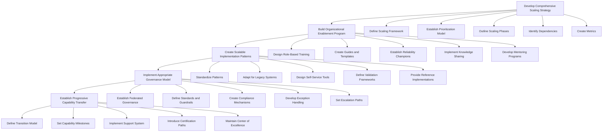

By following this structured approach and leveraging the flowchart for clarity, organizations can methodically scale reliability practices while maintaining alignment across teams, services, and processes.

## Panel 7: Measuring Reliability Culture - The Human Side of Maturity

### Scene Description

A facilitated workshop focused on assessing and enhancing the bank's reliability culture. Beyond technical metrics, the team is evaluating the human and organizational dimensions of reliability maturity. A "Culture Assessment Dashboard" displays results from their reliability culture survey, measuring dimensions like reliability prioritization, blameless improvement, evidence-based decisions, and proactive engineering.

Below is a simplified example of what the "Culture Assessment Dashboard" might include:

| Dimension | Digital Banking Teams | Traditional Teams | Overall Maturity Level |
| -------------------------- | --------------------- | ----------------- | ---------------------- |
| Reliability Prioritization | High | Medium | Medium-High |
| Blameless Improvement | High | Low | Medium |
| Evidence-Based Decisions | High | Medium | Medium-High |
| Proactive Engineering | High | Low | Medium |

Heat maps visually illustrate variability across teams and business units. For example, digital banking teams show advanced maturity (represented by deep green areas in the heat map), while some traditional areas lag behind (displayed in amber or red zones).

Jamila leads an exercise analyzing specific cultural indicators, such as:

- How teams respond to incidents (e.g., blameless postmortems vs. punitive reactions).
- Whether reliability work receives appropriate priority in planning cycles.
- How leaders communicate about reliability trade-offs.
- Whether teams feel empowered to make reliability-focused decisions independently.

To further illustrate, here is a conceptual heat map representation of cultural maturity across business units:

```
Digital Banking Teams   ██████████ (Advanced: High Maturity)
API Teams               ████████░░ (Emerging: Moderate Maturity)
Customer Support Teams  █████░░░░░ (Developing: Low Maturity)
Legacy Systems Teams    ███░░░░░░░ (Lagging: Very Low Maturity)
```

Success stories are shared from teams that have embraced reliability thinking, with testimonials from both technology and business leaders about how it has transformed their approach. On a cultural evolution roadmap, specific initiatives target identified gaps: executive reliability training, enhanced recognition programs, reliability champions network, and integrated performance objectives. The CHRO participates actively, emphasizing how reliability culture connects to broader organizational values and behaviors.

### Teaching Narrative

The most sophisticated dimension of reliability maturity transcends tools, metrics, and processes to address organizational culture—the shared beliefs, values, and behaviors that determine how people make decisions about reliability in daily practice. This cultural foundation ultimately determines whether reliability becomes deeply embedded in organizational DNA or remains a superficial technical exercise.

Comprehensive reliability culture assessment addresses several critical dimensions:

1. **Leadership Alignment**: How executives and managers demonstrate reliability commitment

   - Resource allocation for reliability work
   - Recognition and rewards for reliability contributions
   - Communication about reliability importance
   - Personal engagement in reliability discussions
   - Trade-off decisions when reliability competes with other priorities

2. **Operational Mindset**: How teams approach day-to-day reliability decisions

   - Proactive vs. reactive reliability orientation
   - Evidence-based vs. opinion-based decision making
   - Psychological safety in reliability discussions
   - Blameless approach to reliability failures
   - Continuous improvement orientation

3. **Organizational Practices**: How reliability integrates with broader organizational systems

   - Career path recognition for reliability expertise
   - Performance management inclusion of reliability goals
   - Knowledge sharing around reliability practices
   - Collaboration patterns during reliability incidents
   - Resource prioritization for reliability initiatives

4. **Cultural Evolution**: How reliability culture develops over time

   - Visible shifts in language and framing
   - Evolving decision patterns and justifications
   - Changing conversation focus in planning and reviews
   - Team-level ownership of reliability outcomes
   - Spontaneous reliability advocacy and evangelism

For banking institutions undergoing reliability transformation, cultural evolution often proves more challenging than technical implementation—particularly in organizations with long-established operational practices and risk-averse decision patterns. Yet this cultural foundation ultimately determines whether reliability engineering becomes a sustainable capability or a temporary initiative.

The most mature organizations recognize that reliability culture doesn't emerge automatically from technical implementations—it requires deliberate cultivation through leadership behaviors, organizational systems, and visible success recognition. While technical capabilities provide the tools for reliability engineering, cultural maturity creates the environment where those tools are consistently and effectively applied to deliver business outcomes.

### Common Example of the Problem

**The Culture Resistance Challenge**: A major investment bank implemented sophisticated SLI/SLO platforms and error budget frameworks across their trading technology organization. Despite significant investment in tools and processes, eighteen months later they faced a puzzling situation: reliability metrics were properly instrumented but had minimal impact on actual decisions.

The following table summarizes common cultural resistance issues observed and their organizational impacts:

| **Cultural Resistance Issue** | **Observed Behavior** | **Impact on Reliability Goals** |
| ------------------------------------------------- | -------------------------------------------------------------------------------------------------------------- | --------------------------------------------------------------------------- |
| **Misaligned Priorities** | Product managers prioritized feature delivery over reliability improvements, even with depleted error budgets. | Reliability investments were deprioritized, leading to increased outages. |
| **Blame-Oriented Incident Response** | Post-mortems focused on identifying "who caused the problem" rather than systemic improvements. | Psychological safety eroded, discouraging open discussion and learning. |
| **Inconsistent Leadership Commitment** | Leaders publicly endorsed reliability practices but privately authorized exceptions under business pressure. | Mixed signals undermined cultural alignment on reliability initiatives. |
| **Lack of Empowerment for Engineers** | Engineers faced challenges securing time to implement reliability improvements. | Valuable engineering insights remained unaddressed, reducing system health. |
| **Superficial Adoption of Reliability Practices** | Tools and metrics were implemented without influencing day-to-day behaviors or decisions. | Technical investments failed to deliver meaningful outcomes. |

The organization had created a sophisticated reliability measurement system overlaid on an unchanged culture—the tools and metrics existed but weren't influencing behaviors, decisions, or outcomes. Technical implementation had succeeded while cultural transformation had failed, rendering much of their reliability investment ineffective.

The turning point came when they recognized that reliability transformation was fundamentally a culture change initiative requiring the same level of focus and investment as the technical implementation. Below is a checklist of interventions used to address these cultural challenges:

#### Checklist: Addressing Cultural Resistance

- [ ] Conduct leadership workshops to align decision-making frameworks with reliability priorities.
- [ ] Introduce formal recognition programs for reliability contributions to encourage cultural alignment.
- [ ] Facilitate blameless post-mortem training to foster psychological safety and continuous improvement.
- [ ] Establish cross-functional forums to prioritize and fund reliability-focused engineering work.
- [ ] Integrate reliability metrics and objectives into performance management systems for accountability.
- [ ] Share success stories and case studies to demonstrate the value of reliability culture improvements.

By addressing these cultural barriers, the organization began to see a shift in how reliability was prioritized, discussed, and implemented across teams, ultimately transforming reliability into a sustainable capability.

### SRE Best Practice: Evidence-Based Investigation

Effective reliability culture development requires systematic evaluation and targeted intervention. The following structured approach ensures clarity and focus during the process:

| **Step** | **Description** | **Typical Insights** |
| -------------------------------------- | ------------------------------------------------------------------------------------------------------------ | ---------------------------------------------------------------------------------------------------------------------------- |
| **1. Cultural Baseline Assessment** | Conduct surveys, interviews, and behavioral observations to establish the current reliability culture state. | Initial self-perceptions of reliability culture are typically 30-40% more positive than objective evaluations. |
| **2. Decision Pattern Analysis** | Analyze how reliability considerations influence decisions across various organizational contexts. | In early cultural stages, only 15-25% of decisions appropriately incorporate reliability data, even when available. |
| **3. Behavioral Indicator Tracking** | Identify and measure critical behaviors reflecting reliability culture maturity. | Usually reveals 5-10 critical behaviors as leading indicators of cultural change for targeted interventions. |
| **4. Cultural Barrier Identification** | Investigate structural or systemic barriers that hinder reliability culture development. | Common barriers include incentive misalignment, conflicting priorities, and organizational boundaries (3-5 typically found). |
| **5. Change Readiness Assessment** | Evaluate readiness for cultural change at team and organizational levels. | Readiness often varies significantly; technical teams are 40-50% more prepared than business or executive teams. |

#### Step-by-Step Flowchart for Implementation

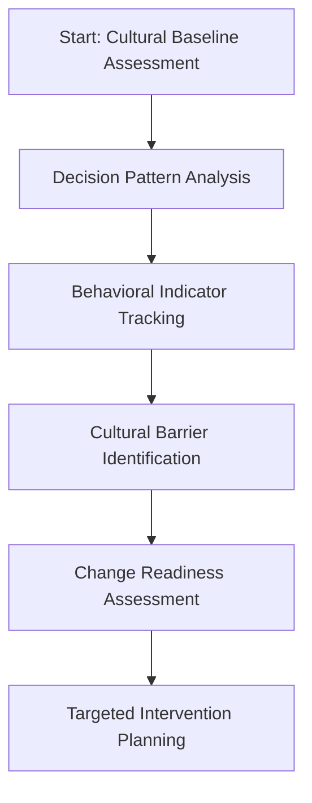

By following this structured process, organizations can identify gaps, measure progress, and design interventions that systematically advance their reliability culture maturity.

### Banking Impact

Mature reliability culture delivers substantial business benefits, as demonstrated by the following key metrics:

| Benefit | Improvement Percentage |
| --------------------------------- | -------------------------------------------------------- |
| Sustained Reliability Improvement | 30-40% better reliability performance over time |
| Accelerated Incident Response | 50-60% faster mean-time-to-resolve for complex incidents |
| Enhanced Innovation Capability | 25-35% faster innovation velocity |
| Improved Talent Attraction | 20-30% higher retention rates for technical talent |
| Regulatory Confidence | 40-50% fewer findings in operational risk examinations |

```mermaid
barChart
    title Banking Impact Metrics
    axis x Reliability Culture Benefits
    axis y Percentage Improvement
    "Sustained Reliability" : 35
    "Incident Response" : 55
    "Innovation Capability" : 30
    "Talent Retention" : 25
    "Regulatory Confidence" : 45
```

These metrics highlight the transformative potential of a mature reliability culture. Banks that prioritize reliability not only improve their operational performance but also benefit from enhanced innovation, talent retention, and regulatory relationships. The measurable improvements underscore the critical role of embedding reliability into the organizational culture.

### Implementation Guidance

To effectively foster a robust reliability culture, follow this structured approach, summarized in the checklist and flow diagram below:

______________________________________________________________________

#### **Implementation Checklist**

1. **Conduct Comprehensive Cultural Assessment**

   - [ ] Deploy a reliability culture survey across the organization.
   - [ ] Conduct structured interviews with key leaders and teams.
   - [ ] Observe and analyze decision-making patterns in different forums.
   - [ ] Create cultural heat maps showing variability across the organization.
   - [ ] Identify specific behavioral indicators for ongoing tracking.

2. **Develop Leadership Alignment Program**

   - [ ] Design executive education on reliability principles and practices.
   - [ ] Incorporate reliability objectives into leadership performance management.
   - [ ] Appoint executive reliability champions in each business area.
   - [ ] Establish decision frameworks that explicitly integrate reliability data.
   - [ ] Implement visibility mechanisms for leadership reliability behaviors.

3. **Establish Team-Level Culture Initiatives**

   - [ ] Introduce blameless postmortem practices with facilitation.
   - [ ] Roll out psychological safety training for reliability discussions.
   - [ ] Develop team-level reliability objectives and recognition programs.
   - [ ] Identify and empower reliability champions within service teams.
   - [ ] Track team-level cultural indicators and provide regular feedback.

4. **Align Organizational Systems**

   - [ ] Update performance management systems to include reliability dimensions.
   - [ ] Define career path recognition for reliability expertise.
   - [ ] Integrate reliability considerations into resource allocation processes.
   - [ ] Launch recognition programs for reliability contributions.
   - [ ] Align project approval processes with reliability principles.

5. **Create Cultural Evolution Roadmap**

   - [ ] Define a phased approach to cultural development.
   - [ ] Set clear milestones with observable cultural indicators.
   - [ ] Implement feedback mechanisms to monitor cultural progress.
   - [ ] Highlight cultural success stories with a storytelling program.
   - [ ] Develop continuous reinforcement mechanisms for cultural shifts.

______________________________________________________________________

#### **Flow Diagram for Implementation Steps**

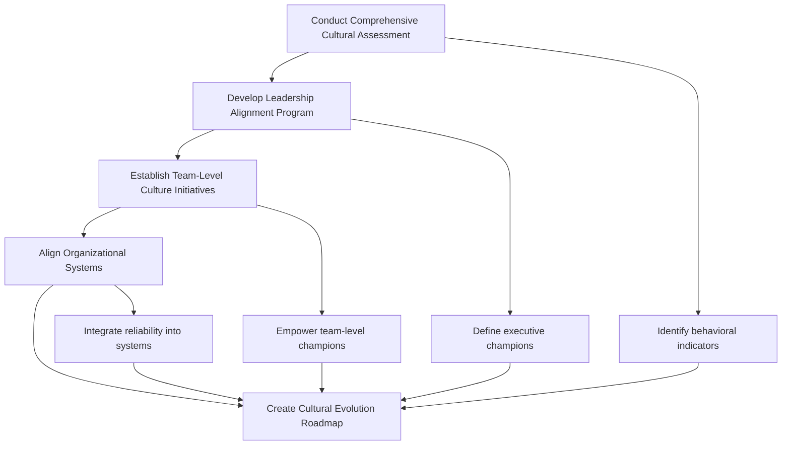

______________________________________________________________________

By following this structured checklist and flow diagram, your organization can systematically assess, align, and evolve its reliability culture. This approach ensures a deliberate and measurable transformation, embedding reliability into the organizational DNA.
