# Chapter 14: Reliability in Complex Financial Systems

## Chapter Overview

Welcome to the twisted funhouse of financial system reliability, where your favorite web-scale SRE playbooks go to die. Forget everything you learned at the last unicorn startup—here, a single “oops” can vaporize millions, trigger regulatory SWAT teams, and send your CEO to a congressional hearing. This chapter rips the rose-tinted glasses off SREs and throws them into the meat grinder of banking reality: ancient mainframes duct-taped to microservices, global transactions ricocheting through a Rube Goldberg maze of time zones, and regulatory demands that make GDPR look like a polite suggestion. If you think reliability is just about five nines, buckle up—here, it’s about perfect reconciliation, forensic audit trails, and not causing the next financial crisis. Ready to trade your chaos monkeys for actual accountability? Let’s get to work.

______________________________________________________________________

## Learning Objectives

- **Identify** the non-negotiable reliability requirements unique to financial systems (spoiler: "eventual consistency" is a dirty word here).
- **Map** regulatory requirements to technical reliability controls (and not just to tick boxes—unless you like regulatory body-cavity searches).
- **Adapt** SRE patterns to financial realities—no more copy-pasting from web-scale blogs.
- **Engineer** cross-boundary observability and reliability in transaction journeys that span continents, vendors, and organizational black holes.
- **Design** reconciliation and consistency frameworks that go way beyond “is it up?” into “is every cent accounted for, everywhere, all the time?”
- **Balance** the madness of batch and real-time processing without letting one nuke the other at 2am.
- **Integrate** reliability with financial risk management so your ops data actually matters to someone in a suit.
- **Build** global reliability models that survive time zones, market hours, and regulatory patchwork.
- **Steer** long-term modernization without causing the next banking apocalypse.

______________________________________________________________________

## Key Takeaways

- “Move fast and break things” is career suicide in banking. Move smart, reconcile everything, and bring receipts.
- If your SRE playbook doesn’t mention reconciliation, state management, or regulatory compliance, it’s not just incomplete—it’s dangerous.
- Cross-organizational transactions are a visibility nightmare. If you can’t trace a payment end-to-end, you’re flying blind and waiting for a customer (or regulator) to find the crash site.
- Batch and real-time systems are interdependent frenemies. Ignore one, and the other will take you down—usually at 6AM, right before your coffee.
- Uptime is worthless if your ledgers don’t balance. “Available but wrong” is the fast lane to regulatory hell.
- Reliability and risk management aren’t siloed—if they are in your shop, you’re already losing money (and probably regulatory goodwill).
- Global scale means your maintenance window is always someone’s market open. Uniform SLOs across time zones are a myth—plan accordingly or prepare for global embarrassment.
- Core banking migrations are marathons, not sprints. Big bang cutovers are only good for postmortems.
- In financial SRE, “good enough” never is. The only thing more expensive than over-engineering is an under-engineered incident.
- If you’re not measuring, monitoring, and reconciling everything—everywhere, always—someone else (a regulator, a hacker, or a customer) will do it for you. And you won’t like the results.

______________________________________________________________________

## Panel 1: The Unique Reliability Landscape of Financial Systems

### Scene Description

An architecture review session for the bank's core transaction processing ecosystem unfolds, with wall-sized diagrams illustrating the extraordinary complexity of their financial infrastructure. The environment integrates decades-old mainframe systems with modern microservices, connects batch processes to real-time APIs, spans multiple redundant data centers, and depends on specialized financial messaging networks and intricate integration with external market participants. Sofia emphasizes the unique reliability challenges this landscape presents, while key regulatory requirements are annotated throughout the architecture to highlight where financial compliance demands specific reliability controls.

To aid understanding, the following simplified diagram captures the high-level structure and interconnections:


The team reviews a "Reliability Constraint Framework" that maps distinctive financial system characteristics: absolute transaction integrity requirements, strict reconciliation needs, complex transaction states, regulatory reporting obligations, and operation across multiple global time zones. Recently hired SRE engineers, accustomed to web-scale systems, appear slightly overwhelmed as they contrast this environment with their previous experiences. A senior architect explains how financial reliability fundamentally differs from other industries, requiring specialized approaches that go beyond standard SRE practices.

### Teaching Narrative

Financial systems present a distinctive reliability landscape that differs significantly from the web and consumer technology environments where many SRE practices originated. These differences stem from the unique characteristics of financial infrastructures, the specialized nature of banking transactions, and the regulatory context in which these systems operate.

Key distinguishing characteristics of financial systems include:

1. **Transaction Integrity Requirements**: Unlike many consumer platforms where occasional data inconsistency might be tolerable, financial systems demand absolute transaction integrity, with obligations for perfect reconciliation, audit trails, and financial accuracy that create distinctive reliability needs.

2. **Architectural Complexity**: Financial infrastructures typically combine multiple generations of technology—from legacy mainframes to modern microservices—creating heterogeneous architectures with complex interdependencies that complicate reliability engineering.

3. **State Management Challenges**: Banking transactions often exist in complex, multi-stage states across extended timeframes (pending, processing, settled, reconciled), creating reliability requirements that extend beyond simple request/response patterns.

4. **System of Record Responsibilities**: Many financial platforms serve as systems of record with legal standing, creating unique recovery and consistency requirements that exceed typical availability concerns in other industries.

5. **Regulatory Framework**: Financial systems operate under extensive regulatory oversight, with specific requirements for reliability, resilience, recovery, and reporting that directly influence how reliability is implemented and managed.

For SRE practitioners entering the financial domain from other industries, these distinctive characteristics require adjusting standard practices to address banking-specific reliability needs. Approaches that work well for consumer web platforms may prove insufficient or inappropriate for financial systems without thoughtful adaptation.

The most effective reliability engineering in banking contexts begins with acknowledging these domain-specific challenges rather than simply applying generic SRE patterns. This recognition forms the foundation for developing specialized approaches that address the unique reliability needs of financial services while leveraging the core principles of SRE adapted to this distinctive context.

### Common Example of the Problem

**The Web-Scale Pattern Failure**: Imagine a financial system as a meticulously controlled assembly line in a precision manufacturing plant. Every component on the line must meet exact specifications, and every step in the process must happen in a precise sequence. Now imagine introducing a new approach designed for a completely different environment—like a high-speed, flexible production line for consumer gadgets—where occasional defects or shortcuts are acceptable as long as production keeps moving. This mismatch of expectations can lead to catastrophic outcomes.

A large retail bank hired a celebrated SRE leader from a prominent tech company to transform their reliability practices. The new leader immediately implemented reliability patterns that had proven successful in web-scale environments: embracing failure through chaos engineering, focusing primarily on availability over consistency, implementing aggressive canary deployments, and designing for graceful degradation.

Six months later, the bank experienced a severe incident during a deployment to their core banking platform:

- Chaos testing introduced subtle data inconsistencies that accumulated over time.
- The availability-first approach sacrificed transaction integrity, leading to reconciliation issues.
- Canary deployments created mismatched states between interconnected account systems.

The result? Account discrepancies for customers, an investigation from regulators, and months spent resolving the inconsistencies. What worked brilliantly for stateless web services proved disastrous in a financial context where absolute transaction integrity and perfect reconciliation are non-negotiable.

#### Checklist: What Went Wrong?

1. **Misaligned Priorities**: Availability was prioritized over consistency, ignoring the criticality of transaction integrity in financial systems.
2. **Unadapted Chaos Engineering**: Failure injection introduced inconsistencies that the system was not designed to handle.
3. **Flawed Deployment Strategy**: Canary deployments caused state mismatches in tightly coupled systems with complex dependencies.
4. **Lack of Domain Awareness**: Standard web-centric practices were applied without accounting for the unique requirements of financial systems.

The fundamental mistake lay in failing to adapt these web-scale reliability patterns to the unique needs of financial systems. Absolute precision—like that of a controlled assembly line—is critical in banking, where even minor deviations can cascade into significant operational and regulatory consequences. This example underscores the importance of tailoring reliability practices to the domain’s specific demands rather than relying on generic solutions.

### SRE Best Practice: Evidence-Based Investigation

Adapting reliability practices to financial contexts requires a systematic, evidence-based approach to understand domain-specific requirements and challenges. The table below summarizes key investigative practices and highlights contrasts between financial systems and web-scale platforms:

| **Investigation Area** | **Key Focus** | **Findings in Financial Systems** | **Comparison to Web-Scale Systems** |
| ------------------------------------ | ----------------------------------------------------------------------------------------------- | ---------------------------------------------------------------------------------------------------------------------- | ------------------------------------------------------------------------------------------------------------------------------ |
| **Regulatory Requirement Mapping** | Analyze regulations (e.g., Basel, PCI-DSS, GLBA) to identify reliability-related obligations. | Financial systems must satisfy 3-5x more regulatory requirements related to reliability. | Web-scale platforms face fewer regulatory constraints, with compliance typically focused on privacy and security (e.g., GDPR). |
| **Transaction Integrity Analysis** | Map consistency requirements across transaction types (absolute vs. eventual consistency). | 70-80% of financial transactions require absolute consistency with no tolerance for inconsistency. | Many web-scale systems can tolerate eventual consistency, prioritizing availability over strict integrity. |
| **Recovery Pattern Testing** | Test recovery mechanisms against state preservation and audit trail requirements. | Standard web-scale recovery patterns meet only 40-50% of financial recovery needs without adaptation. | Web-scale systems often optimize for rapid recovery without strict state preservation or detailed audit trails. |
| **Architectural Dependency Mapping** | Document interdependencies across heterogeneous systems to understand reliability implications. | Financial systems exhibit 3-4x more critical service dependencies compared to web platforms. | Web-scale architectures are typically more homogenous, with fewer critical interdependencies. |
| **Comparative Benchmark Analysis** | Study industry-specific practices to identify domain-specific patterns and anti-patterns. | Financial institutions with tailored reliability practices see 60-70% fewer serious incidents than generic approaches. | Web-scale systems benefit from widely shared, general-purpose SRE practices that are often sufficient without domain tuning. |

This structured approach helps SRE practitioners adapt their methods to the unique reliability challenges of financial systems. By focusing on evidence-based investigation, teams can develop specialized strategies that address the strict requirements of the financial domain while leveraging core SRE principles.

### Banking Impact

Properly adapting reliability practices to financial contexts delivers substantial business benefits:

1. **Regulatory Compliance**: Banks with financial-specific reliability practices report 70-80% fewer findings in regulatory examinations related to operational resilience and control effectiveness.

2. **Customer Trust Preservation**: Financial institutions with reliability approaches properly adapted to banking contexts experience 30-40% lower customer attrition following incidents due to better preservation of transaction integrity.

3. **Operational Risk Reduction**: Adapted reliability practices reduce operational risk events by 50-60% compared to generic approaches, directly impacting regulatory capital requirements and financial reserves.

4. **Recovery Effectiveness**: Banks with financial-specific reliability strategies demonstrate 40-50% faster recovery times for complex incidents involving transaction integrity challenges.

5. **Technology Transformation De-Risking**: Organizations with reliability practices adapted to financial contexts report 30-40% higher success rates for complex technology modernization initiatives that span legacy and modern platforms.

### Implementation Guidance

#### Step-by-Step Checklist for Implementing Financial Reliability Practices

##### 1. Conduct Financial-Specific Reliability Assessment

- [ ] Map regulatory requirements that directly impact reliability practices.
- [ ] Document transaction integrity needs for each service and their dependencies.
- [ ] Identify and categorize systems of record with unique recovery and consistency requirements.
- [ ] Catalog reconciliation and audit requirements for all critical processes.
- [ ] Assess integration points with specialized financial messaging networks (e.g., SWIFT, FIX).

##### 2. Adapt SRE Practices for Financial Contexts

- [ ] Modify incident management protocols to prioritize transaction integrity over availability alone.
- [ ] Redefine SLOs to incorporate financial-specific metrics such as reconciliation delays or settlement accuracy.
- [ ] Adapt testing strategies to ensure end-to-end transaction consistency across heterogeneous systems.
- [ ] Enhance recovery playbooks to include state restoration processes for complex transaction flows.
- [ ] Develop monitoring systems that verify reconciliation completeness and detect financial state anomalies.

##### 3. Develop Financial Transaction State Model

- [ ] Document the lifecycle of transactions, including all possible states (e.g., pending, processing, settled).
- [ ] Create state integrity verification mechanisms for detecting invalid or orphaned states.
- [ ] Implement transaction state monitoring to ensure consistency across distributed systems.
- [ ] Develop recovery workflows tailored to each transaction state failure scenario.
- [ ] Establish automated reconciliation processes that span transaction boundaries and time zones.

##### 4. Create Regulatory Compliance Framework

- [ ] Map all reliability practices to applicable regulatory requirements (e.g., SOX, Basel III, GDPR).
- [ ] Implement automated evidence collection systems for compliance audits.
- [ ] Set a regular cadence for internal compliance assessments and gap analysis.
- [ ] Build capabilities for generating regulatory reports tied to reliability metrics and SLAs.
- [ ] Develop remediation workflows for addressing compliance-related deficiencies promptly.

##### 5. Build Financial-Specific Knowledge Base

- [ ] Document reliability patterns and anti-patterns specific to financial systems.
- [ ] Develop onboarding materials and training programs for SREs new to the financial domain.
- [ ] Create decision frameworks for evaluating trade-offs in financial reliability scenarios.
- [ ] Foster communities of practice to promote cross-team collaboration on financial reliability challenges.
- [ ] Establish mechanisms for continuous knowledge sharing and updates across teams.

#### Flowchart Representation of Implementation Process


## Panel 2: Reliability Across System Boundaries - The Financial Transaction Journey

### Scene Description

A transaction tracing workshop is underway, where the team is mapping the complete journey of a cross-border payment through dozens of systems and entities. A large journey visualization spans multiple screens, illustrating how a single international transfer traverses the bank's internal systems (customer channels, fraud detection, compliance screening, core banking), external networks (SWIFT, correspondent banking), and third-party entities (intermediary banks, foreign exchange services, regulatory systems).

For each boundary crossing, distinct reliability challenges are identified, including inconsistent SLO definitions between organizations, limited observability across external systems, varying transaction models in different domains, and complex error handling across organizational boundaries. Raj demonstrates a "Cross-Boundary Reliability Framework" they've developed to address these challenges, with specific techniques for maintaining reliability visibility across system transitions.

The team analyzes a recent incident where a payment appeared to vanish at an organizational boundary, highlighting how their enhanced cross-boundary observability enabled rapid identification and resolution. On another screen, they review their reliability contracts with critical financial partners, showing how they've established shared reliability definitions and coordinated error budgets across organizational boundaries.

To better understand the complexity of this journey, the following Mermaid diagram visualizes the key systems and boundaries encountered during a typical cross-border payment, along with labeled reliability challenges at each transition:


This diagram provides a clear representation of the transaction flow, highlighting critical system boundaries and the associated reliability challenges. It serves as a valuable tool for understanding the end-to-end journey and the importance of maintaining reliability visibility across organizational boundaries.

### Teaching Narrative

Unlike self-contained applications, financial transactions routinely cross multiple system and organizational boundaries, creating unique reliability engineering challenges. These cross-boundary journeys—like payments flowing through correspondent banks or trades traversing exchanges and clearing houses—require specialized approaches to maintain reliability visibility and management across complex transaction paths.

Key challenges in cross-boundary financial reliability include:

1. **Observability Boundaries**: Visibility often diminishes or disappears completely as transactions move across organizational boundaries, creating "blind spots" in reliability monitoring that complicate incident detection and diagnosis.

2. **Inconsistent Reliability Definitions**: Different organizations and systems along the transaction path may define and measure reliability differently, making it difficult to establish consistent end-to-end reliability objectives.

3. **Heterogeneous Error Models**: Systems along the transaction journey often implement different error handling approaches, status codes, and failure recovery mechanisms, creating complex reliability behavior that's difficult to model and predict.

4. **Shared Responsibility Challenges**: Transaction failures may result from issues in any system along the path, with limited information to accurately determine root cause and ownership, particularly across organizational boundaries.

5. **Distributed Transaction States**: Financial transactions often exist simultaneously in different states across multiple systems, making it difficult to determine their true status and health at any given moment.

Effective financial reliability engineering addresses these cross-boundary challenges through several specialized approaches:

- **Transaction Correlation Frameworks**: Implementing consistent transaction identifiers that persist across system boundaries to enable end-to-end transaction tracing
- **Boundary Instrumentation**: Creating enhanced observability at system transition points where transactions cross critical boundaries
- **Inter-organizational SLAs**: Establishing formal reliability agreements with external partners that include shared definitions, measurement approaches, and responsibility models
- **Synthetic Transaction Monitoring**: Implementing artificial transactions that trace complete cross-boundary journeys to verify reliability from the customer perspective
- **State Reconciliation Processes**: Creating systematic reconciliation mechanisms that verify transaction consistency across different systems and organizational boundaries

#### Summary of Challenges and Approaches


For banking institutions, these cross-boundary reliability approaches are essential for managing the complex transaction journeys that define modern financial services, ensuring reliability visibility and management extends beyond internal systems to encompass the complete customer experience.

### Common Example of the Problem

**The Vanishing Payment Mystery**: A global bank faced a perplexing situation when corporate clients began reporting international payments that seemed to disappear into a black hole. From the bank's perspective, everything looked normal—their payment gateway, compliance systems, and core banking platform all showed successful transaction processing with green dashboards. Yet recipients weren't receiving funds, and the bank's operations team couldn't determine where payments were failing.

The problem stemmed from a fundamental cross-boundary reliability gap: once payments left the bank's SWIFT gateway, they lost all visibility into subsequent processing by correspondent banks. When an intermediary bank changed their processing rules, many payments were being rejected at this external boundary. Without cross-boundary observability, the bank couldn't detect these failures until clients complained, typically 2–3 days after initiation. The situation damaged client relationships, triggered regulatory inquiries, and created significant operational overhead as teams manually traced transactions through multiple external systems. The incident revealed that their reliability monitoring was essentially blind beyond their organizational boundaries, despite these external segments being critical parts of the customer experience.

#### Lessons Learned Checklist: Avoiding the Vanishing Payment Problem

- **Enable Cross-Boundary Observability**:

  - Implement transaction correlation frameworks to maintain visibility across all system and organizational boundaries.
  - Deploy boundary instrumentation to capture detailed telemetry at critical transition points.

- **Establish Shared Reliability Agreements**:

  - Collaborate with external partners to define inter-organizational SLAs with shared reliability objectives, error budgets, and clear ownership models.

- **Proactively Monitor with Synthetic Transactions**:

  - Use synthetic transactions to simulate end-to-end payment flows and detect issues in real time before customers are impacted.

- **Define Escalation and Communication Protocols**:

  - Develop clear incident response playbooks with external partners for rapid detection, escalation, and resolution of cross-boundary failures.

- **Continuously Reconcile Transaction States**:

  - Implement automated state reconciliation processes to identify inconsistencies and ensure transaction integrity across systems.

By applying these lessons, the bank enhanced its cross-boundary reliability practices, enabling faster detection of issues, improved customer trust, and stronger partnerships with external entities.

### SRE Best Practice: Evidence-Based Investigation

Effective cross-boundary reliability requires systematic analysis and instrumentation. The following practices and findings provide a structured, evidence-based approach to address reliability challenges at organizational boundaries:

| Practice Area | Key Activity | Findings |
| ------------------------------------- | ------------------------------------------- | ------------------------------------------------------------------------------------------------------------------------------------- |
| **End-to-End Transaction Mapping** | Map transaction flows across all boundaries | Financial institutions typically underestimate boundary crossings by 30-40% during initial assessments. |
| **Boundary Observability Assessment** | Evaluate observability at transition points | Visibility degrades by 50-70% at organizational boundaries without specialized instrumentation. |
| **Transaction Correlation Testing** | Test transaction tracing mechanisms | 60-70% of transaction identifiers are lost or transformed at boundaries without correlation frameworks. |
| **Failure Mode Analysis** | Analyze error propagation across boundaries | Identified 15-20 distinct failure patterns specific to boundary transitions. |
| **Recovery Pattern Effectiveness** | Test cross-boundary recovery mechanisms | Standard recovery approaches are 60-70% less effective in multi-organization incidents due to coordination and visibility challenges. |

#### Key Insights:

1. **End-to-End Transaction Mapping**: Comprehensive mapping of transaction flows helps uncover hidden complexity. Most organizations underestimate the number of boundary crossings in their systems, which can obscure reliability risks.

2. **Boundary Observability Assessment**: Observability gaps at boundaries create "blind spots" in transaction monitoring. Without tailored instrumentation, visibility significantly drops, increasing time-to-diagnosis during incidents.

3. **Transaction Correlation Testing**: Persistent transaction identifiers are critical for tracing transactions across boundaries. Testing highlights that a lack of correlation frameworks leads to identifier loss, complicating root cause analysis.

4. **Failure Mode Analysis**: Boundary-specific failure patterns reveal how errors propagate through the system. This analysis enables targeted improvements in error detection and handling at critical boundaries.

5. **Recovery Pattern Effectiveness**: Recovery mechanisms often falter at organizational boundaries, where coordination challenges and limited visibility hinder effective resolution. Testing these patterns is essential to ensure robust, cross-boundary reliability.

This evidence-driven approach ensures that reliability engineering efforts are focused on the most critical cross-boundary challenges, enabling faster resolution of incidents and improved end-to-end transaction reliability.

### Banking Impact

Effective cross-boundary reliability delivers substantial business benefits, as demonstrated through real-world examples:

1. **Customer Experience Enhancement**: Banks with mature cross-boundary reliability capabilities report 50-60% higher customer satisfaction for complex services like international payments and securities settlement. For example, Bank X implemented a transaction correlation framework and saw a 55% increase in customer satisfaction scores by providing real-time status updates for cross-border payments, reducing customer anxiety about delays or lost transactions.

2. **Operational Efficiency**: Financial institutions with effective cross-boundary observability reduce the time spent on manual transaction tracing by 70-80%, significantly decreasing operational costs. A major multinational bank, Bank Y, leveraged boundary instrumentation to automate transaction tracing, cutting manual investigation times by 75%, saving an estimated $10 million annually in operational overhead.

3. **Regulatory Compliance**: Banks with comprehensive cross-boundary visibility experience 40-50% fewer regulatory findings related to transaction monitoring and anti-money laundering controls. For instance, Bank Z utilized synthetic transaction monitoring to continuously validate compliance across multiple jurisdictions, reducing regulatory penalties by 45% over a two-year period.

4. **Incident Resolution Acceleration**: Organizations with effective cross-boundary reliability approaches report 60-70% faster resolution for incidents involving external partners and networks. A regional bank in Europe reduced incident resolution times by 65% by implementing shared observability dashboards with its correspondent banking partners, enabling collaborative troubleshooting during payment failures.

5. **Partner Relationship Improvement**: Clear reliability contracts and shared observability with financial partners typically improve working relationships by establishing objective measurements and clear responsibilities, reducing finger-pointing during incidents by 50-60%. For example, Bank W introduced inter-organizational SLAs with its forex service providers, leading to a 55% reduction in disputes and fostering stronger partnerships through mutually agreed-upon reliability metrics.

### Implementation Guidance

1. **Implement End-to-End Transaction Tracing**

   - Develop unique transaction identifiers that persist across boundaries.
   - Create correlation mechanisms for different identifier formats.
   - Implement distributed tracing where technically feasible.
   - Establish mandatory metadata that must travel with transactions.
   - Develop trace reconstitution capabilities for fragmented journeys.

   ```python
   # Example: Implementing a transaction tracing identifier in Python
   import uuid

   def generate_transaction_id():
       # Generate a unique transaction identifier
       return str(uuid.uuid4())

   def attach_metadata(transaction_id, metadata):
       # Attach mandatory metadata to the transaction
       return {"transaction_id": transaction_id, **metadata}

   # Example usage
   transaction_id = generate_transaction_id()
   transaction_metadata = attach_metadata(transaction_id, {"origin": "systemA", "destination": "systemB"})
   print(transaction_metadata)
   ```

2. **Enhance Boundary Observability**

   - Implement enhanced logging at all system boundary points.
   - Create transmission acknowledgment frameworks across boundaries.
   - Deploy specialized monitoring for inter-system communication.
   - Establish timing expectations for boundary crossings.
   - Implement alerting for boundary transition failures.

   ```mermaid
   sequenceDiagram
       participant SystemA
       participant Boundary
       participant SystemB

       SystemA->>Boundary: Send Transaction
       Boundary-->>SystemA: Acknowledgment
       Boundary->>SystemB: Forward Transaction
       SystemB-->>Boundary: Acknowledgment
   ```

   - Example logging at boundaries:
     ```json
     {
       "timestamp": "2023-10-01T12:00:00Z",
       "boundary": "SystemA -> SystemB",
       "transaction_id": "123e4567-e89b-12d3-a456-426614174000",
       "status": "forwarded",
       "latency_ms": 45
     }
     ```

3. **Develop Formal Cross-Boundary Reliability Contracts**

   - Establish shared reliability definitions with key partners.
   - Create formal SLAs for critical transaction processing.
   - Implement joint incident management protocols.
   - Develop shared postmortem processes for boundary issues.
   - Create escalation frameworks for cross-organizational incidents.

   ```plaintext
   SLA Agreement:
   - Availability: 99.99%
   - Maximum Transaction Latency: 200ms
   - Error Resolution Time: <1 hour
   - Monthly Synthetic Test Results: Shared via API
   ```

4. **Implement Cross-Boundary Testing**

   - Deploy synthetic transactions that traverse complete journeys.
   - Create test scenarios for common boundary failure modes.
   - Implement regular verification of cross-boundary observability.
   - Establish joint testing cadence with key partners.
   - Develop boundary resilience testing capabilities.

   ```python
   # Synthetic transaction example in Python
   def simulate_synthetic_transaction(transaction_id):
       # Simulate a transaction journey across boundaries
       try:
           print(f"Initiating synthetic transaction: {transaction_id}")
           # Simulate boundary crossing
           boundary_response = boundary_simulation(transaction_id)
           if boundary_response["status"] != "success":
               raise Exception("Boundary failure detected")
           print(f"Synthetic transaction {transaction_id} completed successfully")
       except Exception as e:
           print(f"Error in synthetic transaction: {e}")

   def boundary_simulation(transaction_id):
       # Simulate boundary behavior
       return {"transaction_id": transaction_id, "status": "success"}

   # Execute a synthetic transaction
   synthetic_id = generate_transaction_id()
   simulate_synthetic_transaction(synthetic_id)
   ```

5. **Create State Reconciliation Mechanisms**

   - Implement periodic reconciliation across system boundaries.
   - Develop automated discrepancy detection and alerting.
   - Create transaction status verification at key journey points.
   - Establish recovery processes for boundary inconsistencies.
   - Implement audit trails specifically for boundary transitions.

   ```mermaid
   graph TD
       A[System A State] -->|Reconciliation Process| B[System B State]
       B -->|Detected Discrepancy| C[Alert Generated]
       C -->|Resolution Triggered| D[State Consistency Restored]
   ```

   - Example audit trail entry:
     ```json
     {
       "transaction_id": "123e4567-e89b-12d3-a456-426614174000",
       "boundary": "SystemA -> SystemB",
       "state_systemA": "Processed",
       "state_systemB": "Pending",
       "reconciliation_status": "Triggered"
     }
     ```

## Panel 3: Reconciliation and Consistency - Beyond Simple Availability

### Scene Description

A specialized reliability engineering session focused on the bank's reconciliation frameworks across their financial systems. Instead of simple availability metrics, the screens show sophisticated consistency measurements: transaction matching rates between systems, reconciliation completion times, exception percentages, and unresolved discrepancy trends. Jamila presents their "Financial Data Consistency Framework" that extends traditional SLIs with specialized metrics for financial accuracy.

One visualization demonstrates how transactions flow through multiple recording systems with consistency checks at each transition point. The following diagram provides a conceptual view of this flow:


In this diagram, each system represents a critical stage in the transaction lifecycle, with consistency checks ensuring data integrity between transitions. Engineers analyze a particularly complex case study involving a trading platform where thousands of transactions must reconcile perfectly across these systems.

On another screen, the team reviews their reconciliation-focused SLOs that go beyond uptime to include metrics like "reconciliation completion within time window" and "percentage of automatically matched transactions." A technical architect demonstrates how they've implemented specialized detection systems that identify potential inconsistencies before they become critical problems, showing how this approach fundamentally differs from traditional error detection in non-financial contexts.

### Teaching Narrative

In financial systems, reliability extends far beyond simple availability or response time to encompass critical dimensions of data consistency, reconciliation, and financial accuracy. These specialized aspects of financial reliability reflect the fundamental requirement that banking systems maintain perfect agreement about financial state—not just between components of a single system, but across multiple systems of record and organizational boundaries.

Key financial consistency requirements include:

1. **Perfect Reconciliation**: Financial transactions must balance precisely across all systems and ledgers, with any discrepancies—no matter how small—requiring investigation and resolution. This creates a fundamentally different reliability standard than platforms where occasional inconsistency might be acceptable.

2. **Multi-System Consistency**: Financial state typically exists across multiple independent systems (trading, settlement, accounting, regulatory reporting) that must maintain perfect agreement despite different architectures, update patterns, and operational characteristics.

3. **Temporal Reconciliation**: Many financial processes require balancing and reconciliation within specific time windows (daily, intraday, real-time) to satisfy business, operational, and regulatory requirements, adding time-bound consistency constraints.

4. **Exception Management**: Financial reconciliation processes must identify, track, and resolve exceptions—transactions that don't automatically match across systems—with specialized workflows that ensure every discrepancy receives appropriate attention and resolution.

5. **Audit Trail Requirements**: Financial consistency includes maintaining comprehensive, immutable records of all state changes for audit and compliance purposes, creating additional reliability requirements beyond functional correctness.

These financial-specific requirements necessitate specialized reliability approaches that go beyond traditional SRE practices:

- **Reconciliation-Focused SLIs**: Developing specialized indicators that measure consistency across systems, reconciliation completion rates, exception volumes, and resolution timeliness
- **Balance Verification Systems**: Implementing automated checks that continuously verify consistency across different system boundaries and raise alerts when discrepancies emerge
- **State Comparison Frameworks**: Creating systematic capabilities to compare financial state across systems, identifying inconsistencies with precision despite different data models and representations
- **Exception SLOs**: Establishing specific objectives for exception rates, aging, and resolution timeframes that complement traditional availability metrics
- **Consistency-Aware Incident Response**: Developing specialized playbooks for addressing consistency incidents that may require different response patterns than availability or performance issues

For banking systems, these consistency-focused reliability practices are often more critical than traditional availability concerns—a system that's available but producing inconsistent financial results may be worse than one that's temporarily unavailable but guaranteed to maintain data integrity.

### Common Example of the Problem

**The Balance Mismatch Crisis**: A major investment bank encountered a severe reconciliation problem when their trading platform implemented new SLOs focused primarily on availability and performance. The reliability team celebrated achieving 99.99% availability for three consecutive months, but warning signs emerged when the daily reconciliation processes began showing increasing exception rates. Initially dismissed as "noise" since the customer-facing systems remained responsive, the situation deteriorated when the quarterly financial close revealed significant discrepancies between trading, settlement, and accounting systems. Some transactions appeared in one system but not others, while others showed different values across systems.

The progression of the issue can be visualized as follows:


Despite the impressive availability metrics, the bank faced a reliability crisis requiring weeks of manual reconciliation, delayed financial reporting, and potential regulatory penalties. The fundamental problem was defining reliability too narrowly—focusing on system uptime while neglecting equally critical consistency requirements.

The incident response was particularly challenging because traditional incident management processes weren't designed for consistency failures that might have occurred weeks before detection. The bank ultimately had to develop specialized reconciliation-focused SLIs and incident procedures that treated consistency with the same priority as availability.

### SRE Best Practice: Evidence-Based Investigation

Effective reconciliation and consistency approaches require systematic analysis and measurement. The following table summarizes key findings from analytical approaches, providing actionable insights for improving financial system reliability:

| **Analysis Type** | **Key Insights** | **Typical Findings** |
| ------------------------------------ | ------------------------------------------------------------------------------------------ | --------------------------------------------------------------------------------------------------------- |
| **Reconciliation Gap Analysis** | Assessment of reconciliation coverage across financial flows and systems. | 15-20% of critical financial data flows lack adequate reconciliation controls. |
| **Exception Pattern Analysis** | Identification of trends and patterns in reconciliation exceptions. | 70-80% of exceptions fall into a small number of recurring patterns that can be systematically addressed. |
| **Temporal Consistency Measurement** | Measurement of time delays in achieving cross-system financial data consistency. | Without optimization, cross-system consistency often lags by minutes to hours, increasing business risks. |
| **Reconciliation Effectiveness** | Evaluation of reconciliation approaches for accuracy, timeliness, and resource efficiency. | Automated methods achieve 90-95% effectiveness, with 5-10% requiring manual handling. |
| **Consistency Incident Impact** | Analysis of the business impact and costs of historical consistency incidents. | Consistency incidents typically incur 3-5x higher resolution costs than availability incidents. |

These findings emphasize the importance of data-driven approaches to reliability in financial systems. Systematic investigation and targeted improvements in reconciliation controls, exception handling, and temporal optimization can significantly mitigate risks and enhance operational effectiveness.

### Banking Impact

Effective consistency-focused reliability delivers substantial business benefits. The chart below illustrates key impact areas, quantifying the improvements achieved by banks with mature reconciliation and consistency practices:

```mermaid
barChart
  title Banking Impact: Business Benefits of Consistency-Focused Reliability
  orientation horizontal
  xAxis Percentage Improvement
  yAxis Impact Areas
  series Regulatory_Compliance,Operational_Efficiency,Financial_Accuracy,Risk_Reduction,Customer_Trust
  Regulatory_Compliance: 65
  Operational_Efficiency: 45
  Financial_Accuracy: 85
  Risk_Reduction: 75
  Customer_Trust: 25
```

1. **Regulatory Compliance**: Banks with mature reconciliation-focused reliability practices report 60-70% fewer findings in regulatory examinations related to financial accuracy and control effectiveness.

2. **Operational Efficiency**: Financial institutions with advanced reconciliation automation achieve 40-50% lower operational costs for exception handling and manual corrections.

3. **Financial Accuracy**: Organizations with consistency-focused reliability approaches report 80-90% reductions in financial adjustments and corrections during closing periods.

4. **Risk Reduction**: Banks with mature consistency monitoring capabilities identify potential issues 70-80% faster than traditional approaches, significantly reducing financial and regulatory exposure.

5. **Customer Trust**: Financial institutions with strong consistency controls experience significantly fewer customer-impacting discrepancies, resulting in 20-30% lower dispute volumes and associated handling costs.

### Implementation Guidance

To effectively implement reconciliation-focused reliability practices, follow the steps below. A checklist is provided for each area to ensure actionable and practical application.

______________________________________________________________________

#### 1. **Develop Reconciliation-Focused SLIs**

- [ ] Define clear metrics for reconciliation completeness (e.g., percentage of transactions reconciled)
- [ ] Establish exception rate indicators (e.g., percentage of unmatched transactions)
- [ ] Define aging indicators for unresolved exceptions (e.g., time to resolution)
- [ ] Create transaction matching effectiveness measures (e.g., match rates across systems)
- [ ] Implement balance verification coverage metrics (e.g., daily balance verification percentage)
- [ ] Develop cross-system consistency indicators (e.g., state alignment across trading and accounting systems)

______________________________________________________________________

#### 2. **Implement Multi-Level Reconciliation Framework**

- [ ] Design transaction-level reconciliation processes
- [ ] Implement aggregate balance verification mechanisms for batch-level consistency
- [ ] Establish cross-system state comparison capabilities for data alignment
- [ ] Develop temporal reconciliation processes for time-bound requirements (e.g., daily or real-time)
- [ ] Implement continuous reconciliation for critical systems to detect discrepancies proactively

______________________________________________________________________

#### 3. **Create Consistency Monitoring Systems**

- [ ] Deploy automated balance verification checks with alert thresholds
- [ ] Implement real-time transaction matching systems for high-frequency processes
- [ ] Create exception detection and alerting mechanisms with priority levels
- [ ] Develop trending analysis tools for reconciliation metrics (e.g., exception trends over time)
- [ ] Establish proactive consistency verification to preempt critical issues

______________________________________________________________________

#### 4. **Establish Exception Management Processes**

- [ ] Develop a clear exception categorization framework (e.g., critical, high, medium, low severity)
- [ ] Implement tiered resolution approaches based on exception severity
- [ ] Establish aging thresholds and escalation triggers (e.g., unresolved exceptions exceeding 24 hours)
- [ ] Conduct root cause analysis for recurring exception patterns
- [ ] Create feedback loops to address and resolve systematic issues through process improvement

______________________________________________________________________

#### 5. **Develop Consistency-Focused Incident Procedures**

- [ ] Design specialized incident response protocols for consistency violations
- [ ] Implement forensic analysis capabilities to investigate reconciliation failures
- [ ] Establish correction and verification procedures for identified discrepancies
- [ ] Develop communication templates tailored for consistency-related incidents
- [ ] Conduct post-incident analysis specifically targeting reconciliation failures to prevent recurrence

______________________________________________________________________

### Quick Checklist Summary

**For Immediate Implementation:**

- [ ] Define and track reconciliation-focused SLIs
- [ ] Build and deploy multi-level reconciliation frameworks
- [ ] Set up automated consistency monitoring systems
- [ ] Establish robust exception management workflows
- [ ] Prepare and document consistency-specific incident response playbooks

By following this structured approach and leveraging the checklist for each area, teams can ensure comprehensive and effective implementation of reconciliation-focused reliability practices.

## Panel 4: Batch and Real-Time Hybrid Reliability - Managing Dual Operating Models

### Scene Description

An operations planning session addresses the unique challenges of the bank's hybrid processing environment, which combines batch and real-time systems. Multiple screens display their "Dual-Mode Reliability Framework," illustrating how different processing paradigms coexist within the financial architecture. One wall prominently features a timeline of processing windows across a 24-hour global banking day, highlighting the interplay of the following components:

- **Real-Time Transactions**: Flow continuously during customer hours, aligned with global business activity.
- **Batch Processing**: Executes in scheduled windows for regulatory reporting, interest calculations, and large-volume operations.
- **End-of-Day Reconciliation**: Occurs during predefined periods to ensure data consistency across systems.
- **Maintenance Timeframes**: Allocated for planned updates and infrastructure upkeep.

Below is a textual representation of this timeline:

```
+----------------+----------------------+------------------+------------------+
|    Time (UTC)  | Real-Time Activity  | Batch Operations | Maintenance Time |
+----------------+----------------------+------------------+------------------+
| 00:00 - 06:00  | Low customer volume | Batch-heavy      | Maintenance prep |
| 06:00 - 18:00  | Peak transactions   | Minimal batch    | None             |
| 18:00 - 22:00  | Moderate activity   | Batch peaks      | None             |
| 22:00 - 00:00  | Low customer volume | Batch-heavy      | Maintenance time |
+----------------+----------------------+------------------+------------------+
```

Alex demonstrates how their SLIs and SLOs adapt dynamically to these modes, with real-time metrics prioritized during customer hours and batch completion objectives during processing windows. The team reviews a detailed incident where batch processing delays disrupted real-time availability, revealing gaps in monitoring that failed to account for interdependencies between the two paradigms.

The engineers debate the challenges of maintaining reliability in systems that must simultaneously support instantaneous transactions and massive periodic processing. Discussions include the need for mode-specific metrics, enhanced incident correlation strategies, and resource governance to mitigate conflicts.

A roadmap displayed on another screen outlines their strategic evolution. It emphasizes greater real-time capabilities while recognizing the continued necessity of batch processing for regulatory, reconciliation, and large-volume operations in the foreseeable future.

### Teaching Narrative

Unlike many modern technology platforms that operate exclusively in real-time, financial systems typically maintain a complex hybrid of real-time and batch processing paradigms. This dual operating model—often a necessary consequence of core banking requirements, historical architecture decisions, and specific financial processes—creates unique reliability engineering challenges that demand specialized approaches beyond standard SRE practices.

Key characteristics of this hybrid reliability landscape include:

1. **Parallel Processing Paradigms**: Financial systems often require maintaining both real-time transaction processing for customer interactions and batch processing for regulatory reporting, interest calculations, statement generation, and large-volume operations.

2. **Temporal Operating Windows**: Many financial operations follow strict timing patterns dictated by market hours, settlement windows, reporting deadlines, and global time zones, creating complex temporal reliability requirements beyond 24/7 availability.

3. **Processing Interdependencies**: Batch and real-time systems typically share critical resources and dependencies, creating complex reliability relationships where issues in one processing mode can impact the other in non-obvious ways.

4. **Mode-Specific Reliability Definitions**: Batch and real-time operations often have fundamentally different reliability requirements—batch jobs focus on completion within time windows while real-time systems prioritize immediate availability and response time.

5. **Transition Challenges**: Financial systems must manage critical transition points between processing modes (day/night processing, market open/close, statement cycles), often the most vulnerable periods for reliability incidents.

Effective financial reliability engineering addresses these hybrid challenges through specialized approaches:

- **Multi-Modal SLIs/SLOs**: Developing distinct reliability indicators and objectives appropriate for different processing modes, with mode-specific definitions, measurements, and thresholds
- **Temporal SLO Frameworks**: Creating time-aware reliability objectives that adapt to different operating windows and processing phases throughout the financial calendar
- **Batch Success Criteria**: Establishing clear reliability definitions for batch operations beyond simple completion, including timeliness, accuracy, reconciliation, and downstream impact
- **Transition Management**: Implementing specialized monitoring and controls around critical mode transitions, often the highest-risk periods for reliability incidents
- **Resource Governance**: Developing frameworks that manage shared infrastructure and dependencies across processing modes to prevent resource conflicts and unexpected interactions

For banking institutions, these hybrid reliability approaches acknowledge the reality that financial systems will maintain dual processing paradigms for the foreseeable future despite the general industry trend toward real-time operations. Rather than treating batch processing as a legacy anomaly, mature financial reliability engineering embraces both paradigms with appropriate specialized practices for each.

### Common Example of the Problem

**The Night Batch Cascade Failure**: A retail bank implemented comprehensive reliability monitoring for their customer-facing digital platforms with sophisticated SLOs and alerting. However, they treated their overnight batch processing as a separate concern with minimal reliability engineering attention. This division created a serious blind spot when their end-of-day batch process began experiencing gradually increasing run times. Without proper monitoring or SLOs for batch completion, the situation deteriorated silently until one night the processing extended beyond its allocated window into morning business hours. This triggered a cascade of reliability issues: morning trading systems couldn’t initialize without batch completion, customer accounts showed incorrect balances, and digital banking platforms displayed stale data. Despite excellent real-time SLOs and monitoring, the bank experienced a major customer-impacting incident stemming from their batch processing blind spot. The incident revealed that their reliability practices were optimized exclusively for real-time operations while neglecting the equally critical batch paradigm and the interdependencies between them. The situation was further complicated by unclear ownership—the "reliability team" focused on real-time systems while a separate "batch operations" team managed nightly processing without modern reliability practices.

Below is a timeline illustrating the sequence of events that led to this failure for clarity:

```mermaid
gantt
    title Night Batch Cascade Failure Timeline
    dateFormat HH:mm
    section Batch Processing
    Batch Start :done, 23:00, 4h
    Batch Overrun :active, crit, 03:00, 3h
    section Real-Time Systems
    Morning Trading Init Fails :crit, 06:00, 1h
    Customer Account Issues :crit, 07:00, 1h
    Digital Banking Impact :crit, 07:00, 2h
    section Resolution
    Incident Detection :done, 07:30, 30min
    Mitigation and Recovery :active, 08:00, 2h
```



This timeline shows how the batch process began at its scheduled time but overran its designated window. The overrun delayed critical real-time system initialization at the start of the business day, causing cascading issues for customer account balances and digital banking platforms. The incident was only detected hours later, requiring extensive recovery efforts.

This example highlights the importance of treating batch processing with the same reliability rigor as real-time systems. Effective hybrid reliability practices include implementing SLIs and SLOs for batch processes, monitoring interdependencies, and ensuring clear ownership across both paradigms.

### SRE Best Practice: Evidence-Based Investigation

Effective hybrid reliability requires systematic analysis and specialized approaches. Use the following checklist to guide evidence-based investigations in hybrid processing environments:

| **Step** | **Action** | **Typical Findings** |
| ------------------------------------------------- | ------------------------------------------------------------------------------------------------------------ | ----------------------------------------------------------------------------------------------------------------------------------------- |
| **1. Processing Mode Inventory** | Map all real-time and batch processes, including interdependencies and resource requirements. | 30-40% of critical financial functions depend on effective collaboration between batch and real-time modes. |
| **2. Temporal Operating Pattern Analysis** | Document all time-bound processing windows, transitions, and dependencies to understand temporal footprints. | 5-10 critical daily transition points often represent elevated reliability risks. |
| **3. Resource Contention Measurement** | Analyze shared resource usage to identify competition between processing modes. | Batch processes can consume 70-80% of resources during peaks, potentially impacting real-time services. |
| **4. Mode Transition Failure Analysis** | Review historical incidents to identify failure patterns during processing mode transitions. | 20-30% of significant incidents occur during mode transitions, despite representing less than 5% of operating time. |
| **5. Hybrid Monitoring Effectiveness Assessment** | Evaluate monitoring coverage for both paradigms and their interactions. | Traditional monitoring often covers 70-80% of real-time scenarios, 30-40% of batch scenarios, and less than 20% of interaction scenarios. |

#### Checklist for Evidence-Based Investigation:

- [ ] Conduct a comprehensive inventory of all real-time and batch processes with documented interdependencies.
- [ ] Analyze temporal operating patterns, including daily transitions and processing windows.
- [ ] Measure and evaluate resource contention across shared infrastructure.
- [ ] Perform a detailed review of past mode transition failures to identify trends and systemic risks.
- [ ] Assess the effectiveness of current hybrid monitoring strategies, focusing on both individual and interaction scenarios.

By following this structured approach, teams can uncover critical insights into hybrid reliability challenges and implement targeted improvements for better system performance.

### Banking Impact

Effective hybrid reliability delivers substantial business benefits:

1. **Operational Continuity**: Banks with mature hybrid reliability practices report 50-60% fewer disruptions during critical processing transitions like day/night shifts and batch windows.

2. **Resource Optimization**: Financial institutions with sophisticated dual-mode reliability management typically achieve 30-40% better resource utilization across both processing paradigms.

3. **Schedule Adherence**: Organizations with temporal SLOs for batch operations report 70-80% improvements in completing critical processing within defined windows, reducing impact on downstream systems.

4. **Customer Experience Enhancement**: Banks with effective hybrid reliability approaches experience 40-50% fewer customer-visible impacts stemming from batch processing issues or mode transitions.

5. **Regulatory Compliance**: Financial institutions with integrated hybrid reliability practices report significantly better compliance with regulatory processing and reporting deadlines, reducing late submissions by 60-70%.

### Implementation Guidance

#### Step-by-Step Workflow Diagram for Dual-Mode Reliability Framework Implementation


1. **Develop Dual-Mode Reliability Framework**

   - **Define SLIs/SLOs**: Create distinct reliability indicators and objectives for real-time and batch processes.
   - **Set Temporal Boundaries**: Establish clear operating windows for batch and real-time processing.
   - **Batch Metrics**: Develop specialized metrics for batch completion, accuracy, and reconciliation.
   - **Transition Indicators**: Implement reliability indicators specific to processing mode transitions.
   - **Unified View**: Create a centralized reliability dashboard that integrates both processing paradigms.

2. **Implement Time-Aware SLOs**

   - **Time-Bound Objectives**: Define objectives for batch completion that align with operational deadlines.
   - **Schedule Metrics**: Create adherence metrics for critical processing schedules.
   - **Transition Success**: Establish criteria for successful mode transitions.
   - **Calendar-Aware Thresholds**: Implement reliability thresholds that adapt to the financial calendar.
   - **Temporal Trends**: Develop mechanisms to track and analyze temporal patterns in processing workloads.

3. **Create Resource Governance Model**

   - **Resource Controls**: Implement allocation controls to manage shared resources across processing modes.
   - **Prioritization Frameworks**: Define prioritization for resource usage based on mode-specific criticality.
   - **Capacity Planning**: Address the needs of both batch and real-time paradigms in capacity planning processes.
   - **Isolation Mechanisms**: Develop measures to isolate critical real-time functions from batch impacts.
   - **Dynamic Resource Management**: Enable real-time adjustment of resource allocation during transitions.

4. **Enhance Transition Monitoring**

   - **Specialized Instrumentation**: Deploy monitoring tools focused on mode transition points.
   - **Coordination Dashboards**: Create dashboards to visualize and coordinate transition activities.
   - **Enhanced Alerting**: Implement alerts specific to anomalies during transitions.
   - **Predictive Analytics**: Utilize analytics to forecast potential risks during transitions.
   - **Health Verification**: Establish checks to verify the stability and success of transitions in real time.

5. **Implement Hybrid Incident Management**

   - **Batch Protocols**: Develop response protocols tailored to batch processing issues.
   - **Escalation Frameworks**: Create escalation paths for incidents involving mode transitions.
   - **Cross-Team Coordination**: Foster collaboration between teams handling hybrid issues.
   - **Dependency Mapping**: Implement mapping of shared dependencies to aid in incident triage.
   - **Post-Incident Analysis**: Create templates for analyzing and learning from hybrid system failures.

## Panel 5: Reliability and Financial Risk Management - The Essential Partnership

### Scene Description

A joint session between the bank's SRE team and financial risk management group takes place, where digital displays visually map the explicit connections between reliability practices and financial risk domains: operational risk, settlement risk, liquidity risk, and regulatory risk. Sofia and the Chief Risk Officer co-present a "Reliability Risk Framework" that illustrates how SLIs and SLOs directly support risk management objectives through the following key components:


Case studies highlight these relationships, such as a recent payment platform disruption that caused settlement delays and potential liquidity impacts for corporate clients. The risk team demonstrates how reliability data increasingly informs risk models and capital reserve calculations. Simultaneously, the SRE team showcases how risk scenarios guide the prioritization of reliability investments and influence architectural decisions.

Another display outlines the governance model, which illustrates the operational partnership between the two domains:


This governance model emphasizes collaboration, with reliability teams actively engaging in operational risk committees while risk specialists contribute to reliability planning sessions. On a final display, regulatory submissions demonstrate how reliability metrics and practices have become embedded in the bank's regulatory compliance program, with SLO data directly supporting mandatory risk control evidence.

### Teaching Narrative

In financial institutions, reliability engineering and risk management form an essential partnership that distinguishes banking SRE from implementations in other industries. While traditional SRE often operates relatively independently from broader risk frameworks, financial reliability engineering must explicitly integrate with established risk management disciplines to address the unique regulatory, financial, and operational risk landscape of banking.

This essential partnership spans several key dimensions:

1. **Operational Risk Integration**: Banking operational risk frameworks—required by regulations like Basel III—must incorporate reliability engineering practices as critical controls, creating explicit connections between SRE activities and formal risk management.

2. **Financial Impact Modeling**: Reliability incidents in banking directly translate to specific financial risks—settlement failures, liquidity impacts, market exposure—requiring close coordination between reliability and risk quantification approaches.

3. **Regulatory Risk Alignment**: Financial institutions face extensive regulatory requirements for technology resilience, with reliability practices serving as essential evidence for compliance with frameworks like DORA (EU), Operational Resilience (UK), or Federal Reserve guidance (US).

4. **Capital Implications**: Banking regulations often require capital reserves for operational risk, with reliability practices and performance directly influencing required capital calculations and allocations.

5. **Governance Integration**: Financial risk governance frameworks must incorporate reliability considerations at multiple levels, from technical decisions to board reporting, creating complex organizational connections between reliability and risk functions.

Effective financial reliability engineering embraces this partnership through several specialized approaches:

- **Risk-Informed SLOs**: Developing reliability objectives explicitly linked to financial risk tolerance, with thresholds and targets derived from formal risk appetite statements
- **Control Framework Alignment**: Positioning reliability practices as formal controls within the operational risk framework, with clear mapping between SRE activities and risk mitigation
- **Integrated Assessment**: Conducting joint evaluations that connect reliability status to risk exposure, providing a comprehensive view that neither discipline could achieve independently
- **Regulatory Narrative**: Creating explicit links between reliability practices and regulatory requirements, demonstrating how SRE implements required resilience capabilities
- **Shared Metrics**: Establishing common measurements that serve both reliability and risk management purposes, creating a unified view of technology resilience

For banking institutions, this integration transforms reliability from a purely technical discipline to an essential component of the broader risk management function. Rather than operating as separate domains, the most mature organizations create seamless connections between reliability and risk practices, recognizing that they represent different perspectives on the same fundamental objective: ensuring the bank can reliably deliver financial services within acceptable risk parameters.

### Common Example of the Problem

**The Disconnected Disciplines Crisis**: A global investment bank maintained separate reliability engineering and risk management functions with minimal interaction between them. The reliability team focused on traditional SRE practices—implementing SLOs, managing error budgets, and improving system resilience—while the risk management team maintained the bank's operational risk framework as required by Basel regulations. This separation created serious problems during a regulatory examination focused on operational resilience. When regulators asked how technology risks were identified, measured, and managed, they received disconnected answers: the risk team presented their operational risk framework with minimal technical detail, while the reliability team showcased SLOs and error budgets with no connection to regulatory requirements or risk appetites.

The examination revealed a fundamental gap—reliability metrics weren't incorporated into risk reporting, reliability incidents weren't properly classified as risk events, and reliability improvements weren't documented as risk mitigation. The bank received formal findings requiring them to integrate these disciplines. The integration revealed critical blind spots: some high-risk services lacked appropriate reliability objectives, while other low-risk services had excessive reliability investment. Without connecting reliability practices to financial risk frameworks, the bank had been making unreliable decisions about where to focus their resilience efforts.

#### Key Takeaways and Checklist for Addressing Integration Gaps

- **Key Takeaways**:

  1. Siloed reliability and risk functions can lead to misaligned priorities, regulatory findings, and inefficient resource allocation.
  2. Reliance solely on traditional SRE practices is insufficient in financial institutions without explicit integration into risk frameworks.
  3. Regulatory requirements demand a cohesive narrative that connects technical reliability practices with financial risk management processes.
  4. Failure to incorporate reliability data into risk assessments creates blind spots that hinder effective resilience planning.

- **Checklist to Bridge the Gap**:

  - [ ] Map reliability metrics (e.g., SLIs, SLOs) to risk management objectives, ensuring they align with the bank's risk appetite and tolerance.
  - [ ] Classify reliability incidents as risk events and document them within operational risk frameworks.
  - [ ] Integrate reliability improvements into risk mitigation plans with explicit links to regulatory requirements.
  - [ ] Conduct joint assessments between reliability and risk teams to identify high-risk services and align resilience investments accordingly.
  - [ ] Establish shared reporting structures to provide a unified view of technology risk and resilience to regulators and stakeholders.
  - [ ] Include reliability engineers in operational risk committees and risk specialists in reliability planning sessions.
  - [ ] Regularly review and update reliability objectives based on changes in business-critical services or regulatory standards.

By following this checklist, organizations can ensure a seamless partnership between reliability engineering and financial risk management, addressing integration gaps and building a unified approach to resilience.

### SRE Best Practice: Evidence-Based Investigation

Effective integration between reliability and risk management requires systematic analysis and explicit connections. The following table summarizes key evidence-based practices, their purposes, and typical outcomes:

| **Practice** | **Purpose** | **Typical Outcomes** |
| ----------------------------------------- | --------------------------------------------------------------------------------------------------- | ---------------------------------------------------------------------------------------------------------- |
| **Regulatory Requirement Mapping** | Analyze how reliability practices fulfill specific regulatory requirements (e.g., Basel, DORA) | Reveals that robust reliability practices directly address 40-60% of operational resilience requirements. |
| **Risk Control Effectiveness Assessment** | Evaluate reliability practices as risk controls within operational risk frameworks. | Demonstrates 2-3x better risk mitigation evidence with SLO-based controls compared to traditional methods. |
| **Financial Impact Correlation** | Establish correlations between reliability metrics and financial impacts through incident analysis. | Identifies predictable financial impact patterns for critical services, informing risk models. |
| **Risk-Reliability Governance Analysis** | Examine decision-making processes to identify integration opportunities between domains. | Highlights 10-15 key decision points where integrated processes improve outcomes significantly. |
| **Capital Requirement Modeling** | Analyze how reliability practices influence operational risk capital requirements. | Shows that mature practices can reduce capital requirements by 15-25% through enhanced controls. |

### Banking Impact

Effective reliability-risk integration delivers substantial business benefits. The table below highlights key metrics comparing outcomes before and after implementing integrated reliability and risk management practices:

| **Impact Area** | **Before Integration** | **After Integration** | **Improvement** |
| ----------------------------- | ------------------------------------------------- | ------------------------------------------------ | ---------------------------------------- |
| **Regulatory Confidence** | Frequent findings in operational resilience exams | 60-70% fewer findings in regulatory examinations | Enhanced compliance and reduced scrutiny |
| **Capital Optimization** | Higher operational risk capital reserves | 15-25% reduction in capital requirements | More efficient use of capital |
| **Investment Prioritization** | Fragmented targeting of resilience investments | 30-40% better alignment to high-risk services | Improved resource allocation |
| **Board Confidence** | Limited executive understanding of resilience | 3-4x increase in effective governance engagement | Stronger alignment with leadership |
| **Incident Reduction** | Frequent high-impact service disruptions | 30-40% reduction in high-impact incidents | Greater operational stability |

This quantitative comparison underscores the transformative impact of aligning reliability practices with risk management frameworks. Enhanced integration not only strengthens regulatory and operational resilience but also drives measurable gains in financial efficiency, governance, and incident prevention, positioning the organization for sustained success.

### Implementation Guidance

#### Step-by-Step Flowchart for Implementation


#### Detailed Steps

1. **Develop Integrated Reliability-Risk Framework**

   - Map reliability practices to operational risk control framework.
   - Create explicit connections between SLOs and risk appetite.
   - Align reliability metrics with risk reporting.
   - Develop joint assessment methodologies.
   - Establish shared terminology and definitions.

2. **Implement Risk-Informed SLOs**

   - Derive reliability objectives from risk tolerance statements.
   - Create service criticality framework based on risk exposure.
   - Establish tiered reliability requirements by risk level.
   - Implement targeted controls for high-risk services.
   - Develop validation mechanisms for risk-reliability alignment.

3. **Create Integrated Governance Model**

   - Establish reliability representation in risk committees.
   - Include risk perspective in reliability planning.
   - Develop integrated reporting for executive audiences.
   - Create joint decision frameworks for resilience investments.
   - Implement coordinated incident and event classification.

4. **Develop Regulatory Alignment**

   - Map reliability practices to specific regulatory requirements.
   - Create evidence collection that serves compliance needs.
   - Develop reliability metrics that support regulatory reporting.
   - Establish joint preparation for regulatory examinations.
   - Implement coordinated response to regulatory findings.

5. **Build Quantitative Risk-Reliability Models**

   - Develop financial impact quantification for reliability degradations.
   - Create capital requirement modeling for reliability controls.
   - Implement scenario analysis incorporating reliability metrics.
   - Establish risk-based prioritization for reliability improvements.
   - Develop validation methods for control effectiveness.

## Panel 6: Global Scale and Time Sensitivity - Operating Across Boundaries

### Scene Description

A global operations center for the bank's 24x7 payment infrastructure spanning multiple continents. The room is equipped with wall displays that visualize their worldwide operational footprint, highlighting regional processing centers, data centers across time zones, and market-specific deployments that adhere to local regulatory requirements. Central to the room is a team collaboratively reviewing their "Follow-the-Sun Reliability Model," designed to manage services seamlessly across global boundaries.

Raj demonstrates their time-aware SLO framework, which dynamically adapts to the distinct operating windows of various regions—market hours in Asia, Europe, and the Americas—ensuring tailored reliability requirements during active trading versus maintenance periods. Engineers analyze a cascading incident, tracking how cross-regional monitoring detected emerging issues early, preventing further global implications.

To the side, a deployment calendar outlines their sophisticated release strategy, balancing regional maintenance windows, regulatory constraints, and market hours, while ensuring minimal disruption. Adjacent to this, a global reliability dashboard provides a bird’s-eye view of service health across all regions. Indicators on the dashboard highlight cross-regional dependencies and critical data consistency metrics, offering actionable insights into the interconnected system.

The following diagram illustrates the key components of the global operations center and their interconnections:


The discussion focuses on the delicate balance between global standardization and local requirements. Specific examples are provided to show how reliability definitions and practices adapt to varying regulatory regimes while upholding consistent core principles. This visualization underscores the interconnected nature of the center's operations and the sophisticated systems enabling global financial reliability.

### Teaching Narrative

Financial systems often operate at global scale with extraordinary time sensitivity, creating distinct reliability challenges that extend beyond those faced by many other industries. These global financial services—from payment networks to trading platforms to treasury management systems—must function seamlessly across geographic, regulatory, and temporal boundaries while meeting strict timing requirements unique to financial operations.

Key characteristics of this global financial reliability landscape include:

1. **Continuous Global Operations**: Many financial services must operate continuously across all time zones, with no acceptable global downtime window, while simultaneously accommodating regional maintenance needs and market-specific operating hours.

2. **Variable Regional Requirements**: Different geographic markets often have distinct regulatory requirements, local financial practices, and market-specific implementations, creating a heterogeneous global environment that must nevertheless function as a cohesive whole.

3. **Strict Timing Dependencies**: Financial operations frequently have non-negotiable timing requirements driven by market hours, settlement windows, regulatory deadlines, and interbank processes, creating temporal constraints that directly impact reliability practices.

4. **Cross-Regional Consistency**: Financial data must maintain perfect consistency across regional deployments despite different operating schedules, local adaptations, and time zone variations, creating complex reconciliation requirements.

5. **Cascading Impact Potential**: Issues in one region can quickly propagate globally through financial interconnections, creating complex failure modes that cross geographic and organizational boundaries with systemic implications.

Effective global financial reliability engineering addresses these challenges through specialized approaches:

- **Time-Aware Reliability Frameworks**: Developing SLIs and SLOs that explicitly incorporate temporal dimensions, with different objectives for various global operating windows and market hours
- **Regional Reliability Models**: Establishing reliability practices that balance global consistency with local adaptation, accommodating different regulatory requirements while maintaining core principles
- **Global Dependency Mapping**: Creating comprehensive visibility into cross-regional dependencies and potential cascade paths to identify vulnerabilities before they create systemic issues
- **Coordinated Change Management**: Implementing sophisticated global deployment approaches that respect regional constraints while ensuring service continuity and data consistency across boundaries
- **Follow-the-Sun Operations**: Developing 24x7 operational models that leverage global teams to maintain continuous reliability management across all time zones

For global banking institutions, these specialized practices acknowledge the reality that financial reliability extends beyond technical operations to encompass complex cross-boundary considerations. The most mature organizations develop global reliability capabilities that balance standardization with necessary regional adaptation, maintaining consistent core principles while accommodating the inevitable variations in global financial operations.

### Common Example of the Problem

**The Market Hours Incident**: A global investment bank implemented standardized SLOs and reliability practices for their trading platform without accounting for regional differences in market hours and trading patterns. The reliability team established uniform maintenance windows and deployment schedules based on their primary location's timezone, using consistent 24/7 reliability targets across all regions. This approach proved disastrous when they deployed a critical update during what they considered "off-hours"—unaware that it coincided with peak trading in Asian markets. The deployment created significant disruption during Tokyo market open, affecting thousands of trades and triggering regulatory reporting requirements in multiple jurisdictions.

#### Timeline of Events: The Market Hours Incident


#### Key Incident Breakdown

- **Misaligned Maintenance Windows**: The deployment was scheduled during a perceived "low-risk" period based on the bank's primary location, but this timeframe coincided with critical Tokyo market hours.
- **Cascading Impact**: The update introduced disruptions that propagated across regions, impacting global trading operations and causing delays in settlement processes.
- **Regulatory Complexity**: Each affected region had distinct regulatory requirements for incident reporting and recovery, creating additional compliance challenges during the resolution process.
- **Insufficient Regional Coverage**: The incident response model lacked adequate support for the Asian timezone, delaying effective mitigation and compounding the issue.

#### Lessons Learned

- **Time-Aware SLOs and Maintenance Planning**: Reliability practices must account for regional market hours and critical trading periods to avoid operational conflicts.
- **Cross-Regional Coordination**: Global operations require incident response models that ensure adequate coverage and expertise across all time zones.
- **Regulatory Awareness**: Compliance measures must be integrated into the reliability framework, ensuring that incident handling aligns with regional regulatory requirements.

This incident starkly demonstrated the importance of integrating temporal, geographic, and regulatory dimensions into global financial reliability practices. Uniform approaches that neglect these factors can lead to severe disruptions and cascading failures, emphasizing the need for specialized and adaptive strategies.

### SRE Best Practice: Evidence-Based Investigation

Effective global reliability requires systematic analysis and specialized approaches. The following checklist organizes these practices into actionable steps to ensure clarity and applicability:

| **Best Practice** | **Action Steps** | **Expected Outcome** |
| ---------------------------------------- | --------------------------------------------------------------------------------------------------------------------------------------------------------------- | ----------------------------------------------------------------------------------------------------------------- |
| **Global Operating Pattern Mapping** | - Document all market hours, operating windows, and critical time periods across regions. <br> - Identify overlaps and unique windows for each region. | Comprehensive mapping of 15-20 distinct operating windows, explicitly integrated into reliability planning. |
| **Regulatory Requirement Comparison** | - Analyze reliability-related regulations across jurisdictions. <br> - Categorize requirements into commonalities and regional variations. | Identification of 10-15 distinct regulatory frameworks with clear documentation of overlaps and differences. |
| **Cross-Region Dependency Analysis** | - Map all service and data flows across regional boundaries. <br> - Identify critical dependencies and potential cascade paths. | Visibility into 40-60% of services with cross-regional dependencies, highlighting vulnerabilities for mitigation. |
| **Regional Incident Pattern Assessment** | - Review historical incidents for cross-regional cascade patterns. <br> - Analyze incidents involving time zone transitions and regional handoffs. | Insights into 25-30% of incidents with cross-regional factors, informing preventative and response strategies. |
| **Time-Sensitive SLO Effectiveness** | - Test SLO structures that incorporate explicit market hour differentiation. <br> - Compare against uniform 24/7 objectives for alignment with business impact. | Time-aware SLOs achieving 3-4x better alignment with business impact than uniform objectives. |

#### Quick Reference Checklist for Evidence-Based Investigation

- [ ] Document all regional operating patterns and critical time periods.
- [ ] Analyze and compare regulatory requirements across jurisdictions.
- [ ] Map cross-regional service and data dependencies.
- [ ] Assess regional and cross-regional incident patterns.
- [ ] Validate and refine time-sensitive SLO structures.

By organizing these practices into a table and checklist format, teams can systematically approach evidence-based investigations, ensuring thoroughness and consistency in global reliability engineering.

### Banking Impact

Effective global reliability delivers substantial business benefits:

#### Key Benefits with Quantified Impact


1. **Operational Continuity**: Banks with time-aware global reliability practices report 40-50% fewer disruptions during critical regional market hours and transition periods.

2. **Regulatory Compliance**: Financial institutions with region-specific reliability approaches experience 50-60% fewer regulatory findings related to market-specific operational requirements.

3. **Resource Optimization**: Organizations with follow-the-sun operational models typically achieve 30-40% better resource utilization while maintaining continuous coverage across global operations.

4. **Customer Experience Consistency**: Banks with effective global reliability practices deliver significantly more consistent customer experiences across regions, with regional variation in reliability metrics reduced by 60-70%.

5. **Incident Containment**: Financial institutions with sophisticated cross-regional monitoring report 50-60% better containment of incidents within regional boundaries, preventing global cascade effects.

The visual representation above highlights the significant impact of these practices, emphasizing the measurable benefits achieved through advanced global reliability strategies.

### Implementation Guidance

The following structured flowchart outlines the step-by-step process for implementing global-scale reliability practices across boundaries:


#### Detailed Steps

1. **Develop Time-Aware Reliability Framework**

   - Create a comprehensive global calendar of market hours and operating windows.
   - Establish time-sensitive SLOs that reflect regional criticality and operational priorities.
   - Implement temporal monitoring systems that dynamically adapt to different operating periods.
   - Plan maintenance windows that align with regional requirements and minimize disruption.
   - Develop change management processes that account for global time awareness.

2. **Implement Regional Reliability Models**

   - Define global reliability standards while allowing for appropriate regional variations.
   - Create region-specific implementation approaches that address local regulatory and operational requirements.
   - Establish regional reliability teams with clear coordination mechanisms for global collaboration.
   - Adapt SLIs and SLOs to reflect regional contexts and criticalities.
   - Standardize cross-region practices wherever beneficial to ensure consistency.

3. **Create Global Dependency Management**

   - Map all cross-regional service and data dependencies to understand systemic relationships.
   - Implement monitoring for cross-region transactions and data flows to detect potential issues early.
   - Develop processes to verify data consistency across regional boundaries.
   - Create dependency-aware incident management protocols to address cascading issues efficiently.
   - Establish cascade prevention mechanisms to mitigate global service impacts.

4. **Establish Follow-the-Sun Operations**

   - Implement a global operational model with seamless regional handoffs to maintain 24x7 coverage.
   - Define clear ownership and responsibility models across regions to avoid gaps in accountability.
   - Develop mechanisms for knowledge sharing between regional teams to enhance situational awareness.
   - Standardize tooling and operational processes to ensure consistency across all regions.
   - Implement robust cross-region incident management protocols for quick resolution of global issues.

5. **Develop Global-Local Governance Model**

   - Create a governance structure that spans both global and regional concerns effectively.
   - Establish decision-making frameworks to balance standardization with necessary adaptations.
   - Implement global reliability reporting systems with detailed regional breakdowns.
   - Develop approaches to ensure regulatory compliance for each jurisdiction while maintaining global consistency.
   - Create escalation paths to address cross-regional issues promptly and effectively.

## Panel 7: Long-Term Reliability Evolution - Modernization Without Disruption

### Scene Description

A strategic planning session focused on the bank's multi-year core banking transformation. On one wall, architectural diagrams compare their current state with the future target architecture, showing a complex journey from legacy mainframe systems to a modern, cloud-enabled platform. To help frame the discussion, the following text-based diagram outlines the transformation journey and key strategies:

```
Legacy Systems
    |
    v
Parallel Operations
    |   (Data Consistency Checks & Reconciliation)
    v
Incremental Migration Paths
    |   (Product-by-Product Transition)
    v
Enhanced Monitoring
    |   (SLIs/SLOs for Migration Phases)
    v
Cutover with Error Budgets
    |   (Controlled Transition to New Systems)
    v
Modern Cloud Platform
    |   (Improved Reliability & Reduced Technical Debt)
    v
Long-Term Evolution
```

The team reviews their "Reliability Continuity Framework," designed to maintain robust SLOs throughout this extended transformation. Technical leaders explain the unique challenges of financial modernization—replacing foundational systems while maintaining continuous operations and perfect data integrity for trillions in financial transactions. Key reliability strategies are highlighted: parallel operation periods with comprehensive reconciliation, incremental migration paths for different financial products, specialized monitoring during transition phases, and enhanced error budgets during critical cutover periods.

Alex demonstrates their migration-specific SLIs that measure data consistency between old and new systems during the transition. A risk assessment matrix maps potential reliability threats during the transformation with specific mitigation strategies for each. Long-term reliability metrics show how they're tracking both current operational performance and progress toward their target architecture, with clear indicators of technical debt reduction and reliability improvement over the multi-year journey.

### Teaching Narrative

Financial institutions face a distinct reliability engineering challenge: modernizing critical systems that may have operated for decades while maintaining continuous service and perfect data integrity throughout extended transformation journeys. Unlike many technology companies that can rapidly replace components or even entire platforms, banks must execute extraordinarily careful transitions when upgrading fundamental financial systems of record.

This modernization imperative creates unique long-term reliability considerations:

1. **Continuous Operation Requirement**: Financial institutions typically cannot take extended outages to facilitate upgrades—modernization must occur while maintaining near-continuous availability for critical banking functions and customer services.

2. **Perfect Data Continuity**: Financial transformations require flawless data migration with comprehensive reconciliation, ensuring that every transaction, balance, and financial record transfers perfectly between old and new systems.

3. **Extended Transition Periods**: Core financial system modernizations often span years rather than weeks or months, requiring reliability approaches that can sustain quality throughout prolonged migration periods with parallel operations and incremental transitions.

4. **Regulatory Oversight**: Financial modernization occurs under extensive regulatory scrutiny, with explicit requirements for testing, validation, fallback capabilities, and evidence collection throughout the transformation journey.

5. **Risk Management Balance**: Financial institutions must carefully balance the reliability risks of aging legacy systems against the transition risks of modernization, making nuanced decisions about transformation timing and approach.

Effective financial reliability engineering addresses these modernization challenges through specialized long-term approaches:

- **Transition-Specific SLIs/SLOs**: Developing specialized reliability indicators and objectives for migration periods that incorporate both operational performance and transformation progress
- **Migration Reliability Patterns**: Implementing proven architectural approaches for financial modernization that minimize reliability impacts, such as strangler patterns, parallel processing with reconciliation, and incremental data migration
- **Enhanced Monitoring During Transition**: Creating augmented observability during modernization periods, with particular attention to data consistency between legacy and modern systems
- **Staged Reliability Evolution**: Establishing clear reliability milestones throughout the transformation journey, with appropriate objectives for each phase rather than a single fixed target
- **Dual Production Operations**: Developing sophisticated operational models for managing parallel systems during extended transition periods, including specialized incident response, change management, and observability practices

For banking institutions navigating these complex transformations, reliability engineering must extend beyond immediate operational concerns to encompass the entire modernization journey. The most successful organizations develop comprehensive reliability continuity frameworks that maintain service quality and data integrity while progressively evolving from legacy to modern financial architectures over extended timeframes.

### Common Example of the Problem

**The Big Bang Failure**: A regional bank attempted to modernize their core banking platform through a "big bang" migration approach. After years of planning, they scheduled a weekend cutover from their legacy mainframe to a new cloud-based platform. Despite extensive testing, the transition encountered critical problems when unexpected data inconsistencies emerged during the migration. With the Monday opening deadline approaching and reconciliation issues unresolved, they faced an impossible choice: delay opening (unacceptable to leadership) or proceed with known data issues (unacceptable for financial integrity). They ultimately attempted to roll back to the legacy system, but the partial migration had already created synchronization problems. The bank opened late with significant customer impact, regulatory scrutiny, and lasting reputation damage.

Post-incident analysis revealed fundamental flaws in their approach: the migration timeline was too compressed for adequate validation, they lacked specialized monitoring for transition-specific risks, and their rollback procedures weren't designed for partial migration scenarios. Most critically, they had approached the transformation as a point-in-time cutover rather than a carefully staged journey with appropriate reliability controls at each phase. This incident highlighted how financial system modernization requires specialized reliability approaches that differ significantly from standard operational practices or typical technology migrations.

#### Key Lessons Learned Checklist:

- **Avoid Compressed Timelines**: Ensure migration schedules allow sufficient time for comprehensive validation, testing, and reconciliation to identify and address potential issues.
- **Implement Transition-Specific Monitoring**: Establish dedicated observability mechanisms to detect data inconsistencies, synchronization problems, and other risks unique to the migration process.
- **Design Robust Rollback Procedures**: Develop rollback plans capable of handling partial migrations and ensuring consistent system states across legacy and modern platforms.
- **Adopt a Staged Migration Approach**: Avoid "big bang" cutovers in favor of incremental or phased migrations, allowing for early detection and resolution of issues while minimizing impact.
- **Plan for Dual Production Operations**: Prepare for parallel operation of legacy and modern systems, including specialized incident response and change management processes.
- **Secure Leadership Alignment**: Set realistic expectations with leadership to prioritize reliability and data integrity over aggressive timelines or perceived urgency.
- **Incorporate Reliability Controls at Every Phase**: Define and enforce specific reliability objectives for each stage of the transformation journey, ensuring quality and stability throughout.

By adhering to these lessons, financial institutions can mitigate the significant risks associated with core banking system modernizations and establish a foundation for long-term reliability.

### SRE Best Practice: Evidence-Based Investigation

Effective modernization reliability requires specialized analysis and controls. The following table summarizes key best practices alongside their typical outcomes:

| **Best Practice** | **Description** | **Typical Outcomes** |
| --------------------------------------------- | ---------------------------------------------------------------------------------------------------------- | ----------------------------------------------------------------------------------------------------- |
| **Migration Risk Pattern Analysis** | Analyze historical financial system migrations to identify common failure modes and mitigation strategies. | Identifies 10-15 distinctive risk patterns requiring specialized controls beyond standard practices. |
| **Dual-System Consistency Verification** | Test approaches for verifying data consistency between legacy and new systems during parallel operations. | Detects 80-90% of potential migration issues before impacting customers through comprehensive checks. |
| **Transition Point Vulnerability Assessment** | Evaluate reliability vulnerabilities during different transition phases, particularly cutover periods. | Highlights 5-10x higher incident risk during cutover, necessitating enhanced controls and monitoring. |
| **Rollback Effectiveness Testing** | Validate rollback and recovery mechanisms under realistic migration scenarios. | Reveals 30-40% of rollback plans fail without specialized design and regular validation. |
| **Regulatory Compliance Verification** | Analyze how modernization approaches meet regulatory requirements for system changes and transitions. | Identifies 5-10 critical compliance requirements to address explicitly in reliability planning. |

These best practices provide a structured, evidence-based approach to identifying and mitigating risks during modernization. Below is a simplified flowchart illustrating the investigation process:


By incorporating these practices into the "Reliability Continuity Framework," organizations can proactively address migration-related risks, enhance operational confidence, and ensure compliance throughout the transformation journey.

### Banking Impact

Effective modernization reliability delivers substantial business benefits. Below is a summary of key advantages, supported by industry data:

```mermaid
barChart
    title Banking Modernization Impact
    axisX Categories
    axisY Percentage (%)
    series Transformation_Success Customer_Impact_Minimization Regulatory_Confidence Cost_Optimization Accelerated_Innovation
    Transformation_Success: 60, 70
    Customer_Impact_Minimization: 70, 80
    Regulatory_Confidence: 80, 90
    Cost_Optimization: 20, 30
    Accelerated_Innovation: 30, 40
```

1. **Transformation Success Rates**: Banks with specialized reliability approaches for modernization report 60-70% higher success rates for major technology transformations compared to traditional approaches.

2. **Customer Impact Minimization**: Financial institutions with mature transition reliability practices experience 70-80% less customer impact during major system migrations.

3. **Regulatory Confidence**: Organizations with comprehensive modernization reliability frameworks report significantly better regulatory outcomes, with some institutions citing 80-90% reductions in findings during transformation-related examinations.

4. **Cost Optimization**: Banks with effective modernization reliability approaches typically reduce transformation costs by 20-30% through prevented incidents, reduced recovery efforts, and more efficient migration processes.

5. **Accelerated Innovation**: Financial institutions with proven reliability frameworks for modernization can implement changes more confidently, typically achieving 30-40% faster technology evolution while maintaining strict reliability requirements.

### Implementation Guidance

To ensure actionable and practical guidance for executing a long-term reliability strategy during financial modernization, the following checklist summarizes key implementation steps for each area of focus:

______________________________________________________________________

#### 1. **Develop Comprehensive Modernization Reliability Strategy**

- [ ] Create a multi-year reliability roadmap aligned with the transformation journey.
- [ ] Define stage-appropriate reliability objectives for each transformation phase.
- [ ] Develop a transition-specific risk assessment framework to identify and mitigate risks.
- [ ] Establish a specialized governance model focused on transformation reliability oversight.
- [ ] Define enhanced monitoring requirements tailored to migration periods.

______________________________________________________________________

#### 2. **Implement Dual-System Reliability Approach**

- [ ] Design a parallel operating model for simultaneous legacy and new system operations.
- [ ] Develop robust cross-system reconciliation processes to ensure data consistency.
- [ ] Implement specialized monitoring tools to verify system synchronization in real-time.
- [ ] Clearly define operational responsibilities across legacy and modern platforms.
- [ ] Create migration-specific incident management procedures to address dual-system issues.

______________________________________________________________________

#### 3. **Design Incremental Migration Path**

- [ ] Develop a phased migration approach with well-defined reliability milestones.
- [ ] Establish a product-by-product or function-by-function migration strategy.
- [ ] Conduct enhanced testing and validation between incremental migration phases.
- [ ] Define verification criteria for reliability at each migration step.
- [ ] Implement rollback capabilities to handle partial migrations and mitigate failures.

______________________________________________________________________

#### 4. **Create Transition-Specific SLIs/SLOs**

- [ ] Define migration-specific Service Level Indicators (SLIs) to measure reliability.
- [ ] Establish data consistency metrics to validate synchronization between systems.
- [ ] Track transition progress through defined operational and business metrics.
- [ ] Create specialized error budgets that account for migration-related risks.
- [ ] Correlate transition metrics with business impact to align technical and organizational goals.

______________________________________________________________________

#### 5. **Establish Migration Reliability Governance**

- [ ] Develop a decision-making framework for migration pacing and sequencing.
- [ ] Implement enhanced change control processes during transition periods.
- [ ] Conduct specialized risk assessments for migration-related activities.
- [ ] Establish a structured communication plan to keep stakeholders informed of reliability status.
- [ ] Create a regulatory engagement strategy to ensure compliance throughout the transformation.

______________________________________________________________________

The above checklist provides a structured approach to implementing reliable modernization strategies without disrupting critical banking operations.
