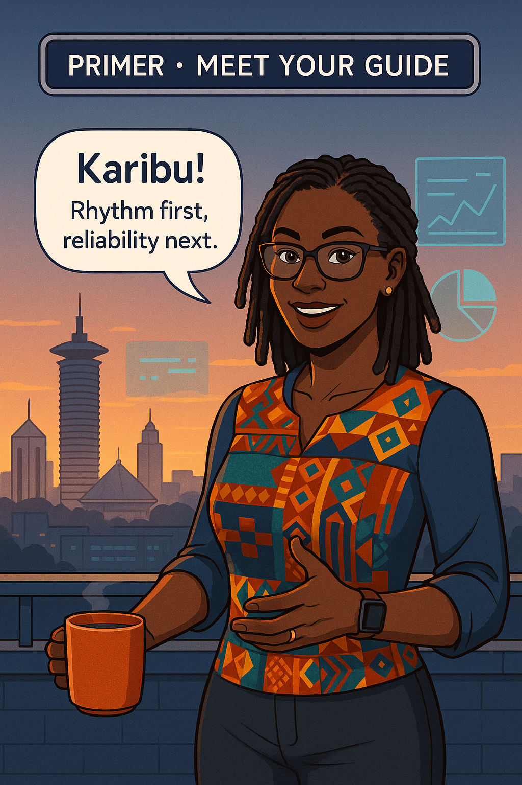
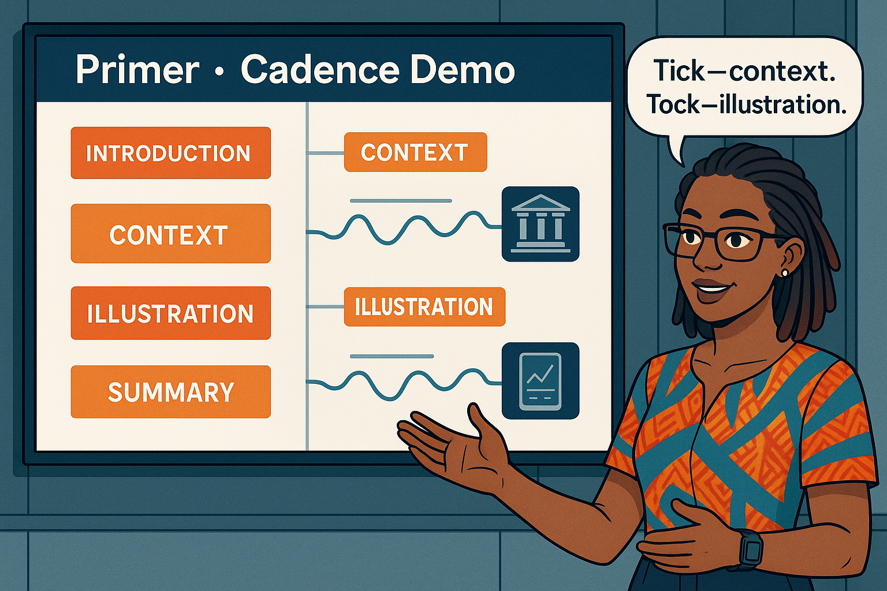
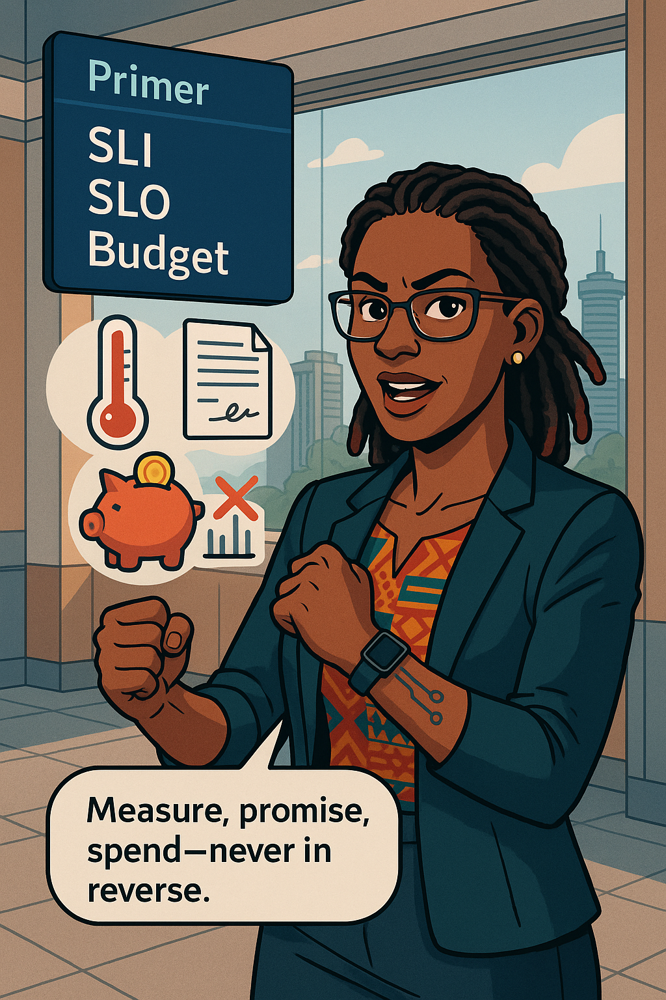
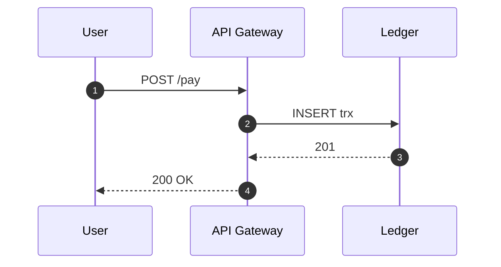
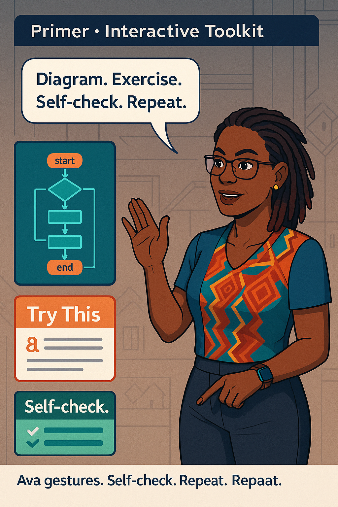

## 🎯 Learning Objective
Orient you to the book’s cadence (Prose → Panel), Ava’s role, and the SLI/SLO/Error‑Budget triad.

## ✅ Takeaway
Read in rhythm: prose delivers depth, the panel locks the idea visually. Metrics must always map to user value—or face Ava’s wrist‑slap.

## Prose
The Nairobi dawn paints tech‑tower glass indigo, the horizon a brush of vibrant orange—the very palette our story will wear. **You** stand beside **Ava Kimani**, who lifts her chipped mug—*Reliability you can measure*—and says, “Karibu, learner. Before we chase outages, we master the compass.”

She sketches that compass: **Context → Picture → Context → Picture**. Every prose block will hover between four and six hundred words—enough to weave narrative, never so long you drown. Each block hands off to a panel referenced by ID, then a Markdown image line so reviewers see art and validators match filenames.

{width=550px}

---

## 🎯 Learning Objective
Demonstrate the four‑heading scaffold every cadence unit must follow.

## ✅ Takeaway
Look for exactly: 🎯 LO → ✅ Takeaway → Prose → Image Embed, then the illustration.

## Prose
Ava projects a white grid onto the terrace wall. Down one column: the four required headings. She ticks each row with a teal marker. “Miss one,” she warns, “and our contract checker barks.”  
You write `Image Embed: panel_id: 2`, then a Markdown line using the filename inside the panel JSON. That pairing satisfies humans and machines alike. Ava smiles: “Tick—story. Tock—panel. Keep that beat and learning sticks like ugali.”

 
{width=550px}

---

## 🎯 Learning Objective
Preview the Holy Trinity icons you’ll meet on every page.

## ✅ Takeaway
**SLI → SLO → Error‑Budget** form the grammar of reliability; orphan metrics earn an immediate wrist‑slap.

## Prose
Three holographic icons hover: a **Thermometer** (*SLI*), a **Signed Contract** (*SLO*), and an **Orange Piggy‑Bank** (*Error‑Budget*). Ava taps the pig‑bank; coins vanish. “Overspend and deployments freeze harder than a July dawn in Tigoni.”  
She recalls a fintech boasting 99.999 % uptime while customers stared at 30‑second lags. Their metric? Host CPU. Their missing piece? A user‑journey latency SLI. She raises an eyebrow. “Average latency? Amateur hour. Show me p95 and p99.” You instinctively flinch—the fabled wrist‑slap is incoming.

{width=550px}

---

## 🎯 Learning Objective
Introduce Mermaid diagrams, “Try This” boxes, and the chapter self‑check table.

## ✅ Takeaway
Mermaid blocks live in their own mini‑chunks and don’t eat into the word quota; every chapter ends with a self‑check—no ❌ allowed.

## Prose
Ava draws a Mermaid diagram of a payment flow. “Diagrams sit inside prose so parsers ignore them in word counts,” she explains. A teal **Try This** box appears: *“Sketch your own flow—label the slowest hop.”*  
Finally, she flips to a green **Contract Checklist** table—every tick green. “If a ❌ shows, we halt. Reliability begins with accountability.”

---

{width=550px}
