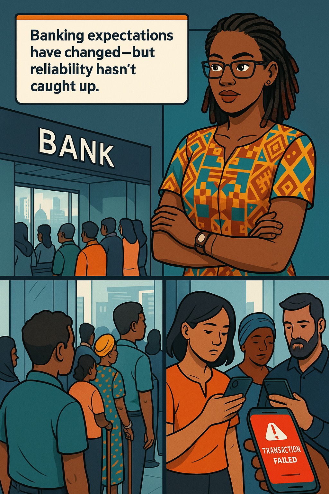

# Chapter 1 – The Reliability Revolution

## Welcome to the World of Measurable Reliability

Good morning, afternoon, or evening—depending on when you're reading this! I'm Ava Kimani, coming to you from sunny Nairobi. For the past 15 years, I've been on the frontlines of reliability engineering, watching it transform from a reactive scramble to a precise discipline. Today, I'll be your guide as we embark on this journey from production support to becoming true guardians of reliability.

*Notices a slide with "100% uptime" written on it*

*Playfully slaps wrist* 

>Let's start by clearing away some misconceptions. If you've come here looking for the secret to perfect reliability, I'm afraid you're in for disappointment. Perfect reliability doesn't exist—and chasing it is not only futile but actively harmful to your organization. What we're after is something far more valuable: reliability you can measure, understand, and improve systematically.

---

## 1 · Opening Anecdote 


Nairobi’s first light spills across the rooftops like a promise. Ava Kimani stands on the edge of a coworking terrace, nursing her battered ceramic mug—the one that reads **Reliability you can measure** in flaking gold letters. Below her, the *Silicon Savannah* revs awake: boda‑boda couriers weaving through traffic, fibre backbones humming alive, fintech dashboards blinking from the glass façades of digital banks.

> ***“For fifteen years,”*** Ava tells us, ***“I’ve watched ops teams chase outages the way kids chase fireflies—frantic, dazzled, never in control. Today we trade the chase for a compass.”***  She taps the rim of her mug once, a metronome for the lesson to come.  In that tap lives her philosophy: **a rhythm of observation, decision, action, reflection—measured, repeated, improved.**

The air carries the metallic trill of the first commuter train. On her smartwatch: 04:59 UTC+3. A push notification flares—*checkout‑service v2.9.3 deployed*. She smiles, but not because deployments excite her. They *inform* her. "Changes autograph every incident," she’ll soon remind the reader.

{{WISDOM_BOX}}

> **SRE Wisdom:** *“Reliability isn’t a line of hope in a status page—it’s the slope of continuous improvement.”*  ─ **Ava Kimani**

---

## 2 · From Branch Queues to 24×7 Mobile



In 1985 banking success meant a marble lobby, polished brass pens, and a velvet rope that parted when the manager finally called, *Next!*  In 2005, it meant a hallway of ATMs with a “24‑hour” neon sign. The banking industry has undergone a seismic shift. In 2025, success is a user who never thinks about banking at all—because the payment accepted, the balance updated, the fraud check cleared *while they waited for a latte*.

 Today's customers expect to access their accounts, make payments, and apply for loans 24/7 from their mobile devices. Their expectations have never been higher, and the cost of reliability failures has never been steeper.

Yet inside many institutions, monitoring screens still zoom in on server CPU, disk I/O, JVM heap. Users queue invisibly at the *experience* level, not the infrastructure level. That disconnect is the breeding ground for the midnight outage we’re about to witness.

A Kenyan coffee farmer finishes uploading a produce‑loan application on his phone. **SUBMIT** spins … spins … fails. Across the split panel, a branch in downtown Nairobi shows customers frowning as a teller apologises for “system latency.” The underlying call is the same gRPC micro‑transaction API, failing silently behind a wall of green host status LEDs.

**Cost of one misaligned metric:** revenue? big. Customer trust? bigger. Regulatory headache? colossal.

{{NAIROBI_PROVERB}}

> *“Kuteleza si kuanguka.”* (Slipping isn’t the same as falling.)  
> **Lesson:** Minor glitches warn you before the precipice—*if* you’re listening at the right layer.

---

## 3 · Heroic Firefighting vs Sustainable Reliability


Scene: 03:17. Pager sirens strobe red across a war‑room. Two engineers slump over keyboards littered with cling‑film pizza and half‑drunk maziwa chai. A banner on the big screen reads **99.999 % Uptime (month‑to‑date)**—a vanity relic. Meanwhile, a service map pulses crimson where payment calls time‑out.

Ava swings in, wrist raised—*slap!* She taps the uptime figure as if brushing dust from a trophy.

> ***“Ninety‑nine point nine nine nine of *what*, exactly?”***  
> Silence answers louder than any siren.

This is the downside of hero culture: adrenaline, applause, a LinkedIn kudos post—followed by chronic fatigue, institutional amnesia, and tech‑debt interest compounding at 18 % APR.

As production support professionals, you've been the heroes rushing in when these systems fail. You've sacrificed sleep, meals, and weekends to restore service. You've felt the pressure when executives demand answers and customers flood support lines. This reactive heroism has been necessary—but it's not sustainable, and it's not strategic.

>Site Reliability Engineering offers a better way.


**Unsustainability indicators**

| Symptom | Root cause | Long‑term cost |
|---------|------------|----------------|
| Repeated “all‑hands” war‑rooms | Lack of observable user‑level signals | Burnout, talent churn |
| Uptime fetish | Metrics unaligned with experience | False confidence → fines |
| Pager floods | Threshold‑based alerting | Alert desensitisation, missed catastrophes |
| No error budget | Culture treats *any* failure as equal | Feature freezes, stifled innovation |

{{ERROR_BUDGET_METER}}

```
Error‑Budget Remaining: [■■□□□□□□□□]  12 %
```
> *Visual cue we’ll use throughout the book. When this bar shrinks, innovation slows.*

---

## 4 · Enter Site Reliability Engineering


Ava unfurls a glossy poster of a staircase: **Incident Response → Monitoring → Testing → Prevention → Design for Reliability**. Each riser is a habit stack; each habit backed by a *metric*.

> ***“Heroes respond. Architects anticipate,”*** she says. **SRE** institutionalises anticipation.

Key concept shifts:

| Production Support Paradigm | SRE Paradigm |
|-----------------------------|--------------|
| *Mean Time to Repair* | *Mean Time between Unacceptable Behavior* |
| Host‑centric metrics | User‑journey indicators |
| First fix, then root‑cause | First prevent, then learn |
| Silence equals success | *Measured* silence equals success |

{{WRIST_SLAP}}

> **Wrist‑Slap Moment:**  *“Average latency? Amateur hour. Show me p95 and p99 or keep guessing.”*

Ava asks the team to recite the mantra: **Reliability you can measure is the only reliability that matters.** She points her stylus at the staircase’s top step—*Design for Reliability*—and promises the book will escort them there, one panel at a time.

---
### From Production Support to Proactive SRE

The transition from production support to Site Reliability Engineering represents more than a job title change—it's a fundamental shift in how we approach technology operations. Production support asks: "How quickly can we fix what's broken?" SRE asks: "How can we build systems that break less often, fail more gracefully, and recover more predictably?"

This shift requires new tools, new metrics, and most importantly, new ways of thinking. At the heart of this transformation are three critical concepts that will become your most valuable tools: Service Level Indicators (SLIs), Service Level Objectives (SLOs), and Error Budgets.

---

## The Holy Trinity: SLIs, SLOs, and Error Budgets

### Service Level Indicators (SLIs): Measuring What Matters

An SLI is a carefully defined quantitative measure of some aspect of the service you provide. But not just any measurement will do.

*Leans forward with intensity*

The key insight of SRE is that we measure from the user's perspective. Your internal metrics might look perfect while your users are experiencing failures. I've seen banking systems where all servers showed "green" status while customers couldn't complete transactions. That's why we focus on user-centric SLIs.

For a banking API, relevant SLIs might include:
- Request success rate (% of API calls that return valid responses)
- Request latency (how long users wait for responses)
- Data freshness (how up-to-date account information is)
- Transaction throughput (capacity to process concurrent operations)

Each of these directly impacts user experience, and each can be measured objectively. But measurement alone isn't enough.

### Service Level Objectives (SLOs): Making Explicit Promises

An SLO transforms an SLI from a passive measurement into an active commitment. It answers the question: "How reliable is reliable enough?"

For example, you might set an SLO stating that 99.9% of payment transactions will complete in under 500ms over a 30-day period. This isn't just a technical target—it's a promise about the user experience you'll deliver.

*Gestures emphatically*

This is where many organizations go wrong. They either set no explicit objectives, leaving teams to guess what "good enough" means, or they set arbitrary targets with no connection to user expectations or business needs. In banking, a 99.99% availability target might be necessary for core payment processing but excessive for a feature that generates custom spending reports.

Effective SLOs are:
- Meaningful to users and the business
- Achievable with current technology and resources
- Measurable with existing instrumentation or reasonable investments
- Clearly defined with explicit time windows and measurement methods

Once you've established meaningful SLOs, you unlock the most powerful concept in SRE: the error budget.

### Error Budgets: Permission to Innovate

The most revolutionary concept in SRE isn't about eliminating failure—it's about embracing controlled failure through error budgets.

Here's how it works: If your SLO is 99.9% availability, that means you can be unavailable for 0.1% of the time while still meeting your commitment. That 0.1% is your error budget—a quantified allowance for imperfection.

*Smiles with a hint of mischief*

This is where SRE truly diverges from traditional approaches. Instead of treating all failures as emergencies, we recognize that some amount of failure is inevitable and acceptable. The error budget transforms reliability from a binary "good/bad" judgment into a resource that can be strategically managed.

When you have error budget to spare, you can:
- Deploy new features more aggressively
- Conduct experiments and A/B tests
- Migrate to new infrastructure
- Refactor legacy systems

When you're approaching error budget exhaustion, you prioritize stability:
- Reduce deployment frequency
- Implement additional testing
- Postpone non-critical changes
- Invest in reliability improvements

This approach aligns development velocity with reliability requirements. It replaces subjective arguments about "moving fast" versus "being stable" with objective data about whether you're meeting your reliability commitments.

## The Banking Context: Where Reliability Meets Regulation

In banking, reliability isn't just about customer satisfaction—it's about regulatory compliance, financial security, and systemic stability. Financial regulations often include explicit availability and performance requirements, making SLOs not just good practice but legal obligation.

For example, payment systems may be required to meet specific uptime targets, ensure transaction completion within defined timeframes, and maintain comprehensive audit trails. These regulatory requirements form the foundation of your SLOs—the minimum bar you must clear.

But leading banking institutions don't stop at compliance. They recognize that reliability is a competitive advantage in an industry built on trust. Your customers may not understand the technical details of your systems, but they instantly feel the impact when reliability falters.

Consider these banking-specific reliability challenges:
- Transaction integrity must be maintained even during partial system failures
- End-of-day processing has strict time windows with significant financial consequences for delays
- Fraud detection systems must balance thoroughness with performance
- Peak processing volumes occur predictably (paydays, tax deadlines) but with massive scale differences from baseline

These challenges require sophisticated approaches to SLIs, SLOs, and error budgets that go beyond generic recommendations.

---

## 5 · The Roadmap Ahead

This chapter set the epistemic baseline: **why** reliability must be measurable and **why** reactive heroics won’t scale. The rest of *The SLO Sentinel* converts *why* into *how*.

**What to expect next**

1. **User‑Centric Metrics** – framing SLIs that map to customer journeys.  
2. **Explicit Commitments** – engineering SLOs that balance ambition and feasibility.  
3. **Innovation Currency** – calculating, tracking, and *spending* error budgets.  
4. **Tooling Toolkit** – Prometheus, Grafana, Splunk, CloudWatch, and K8s operators.  
5. **Governance & Culture** – turning numbers into policy, and policy into habit.

{{TRY_THIS}}

> **Try This – Diagnostic Reflection**  
> *Tonight, open your alert console and categorise the last 20 pages.*  
> 1. Was the alert tied to a user‑visible symptom?  
> 2. Could you trace it to a recent change?  
> 3. Did it reference a documented SLO?  
> Count how many Yes/No answers you record. That ratio is your current reliability maturity indicator.
