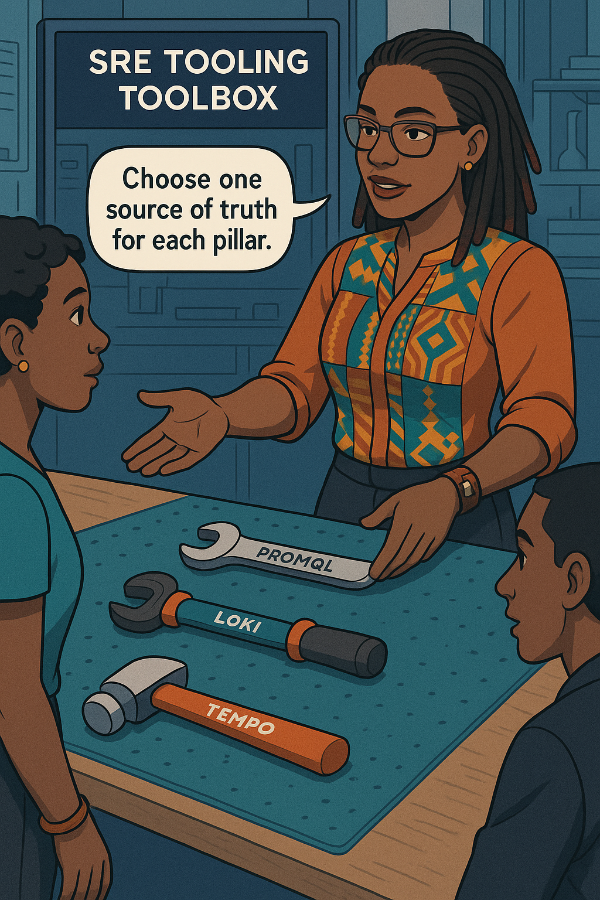

# Chapter 1 – The Reliability Revolution  

<!-- Part A of Chapter 1 -->
{width=450px}

---

### 🎯 Learning Objective  

>Explain why host-centric dashboards mislead modern banks and introduce the “contract compass” rhythm that underpins every lesson.

### ✅ Takeaway  
A mobile payment lives or dies by **user-journey** success, not server-side CPU graphs—measure the customer, or measure the wrong thing.

### 🚦 Applied Example  
```yaml
query_log_snippet: |
  # p99 end-to-end latency for the loan-payment journey
  histogram_quantile(
    0.99,
    sum(rate(journey_latency_bucket{journey="loan_payment"}[5m])) by (le)
  )
user_impact_note: "When this climbs above 1.8 s at payday, checkout failures spike to 4 %."
```

## Teaching Narrative  
Dawn warms Nairobi’s tech skyline. **Ava Kimani**—mug etched *Reliability you can measure*—stands beside you on Matunda Bank’s rooftop terrace.

> **Ava:** “Why does a green server lie?” 
> **You:** “Because customers don’t live on servers!”

She draws a compass in mid-air: **Context → Picture → Context → Picture**—our cadence contract. Each unit travels that circle so your brain never drowns in graphs nor floats unguided through comics.

**Banking anchor.** Last Friday at 17:55, payroll traffic flooded the *loan-payment* API. NOC dashboards, tuned to `grpc_server_finished_total{grpc_code="OK"}`, showed 0 % error for three minutes. Yet the call-center lit up: farmers scanning QR bills saw endless spinners. Client-side retries explained the paradox: five attempts per transaction masked four upstream 502s. Server metrics wore a green mask; customer reality bruised underneath.

To reveal truth, wire a **journey-level success ratio**:

```promql
sum(rate(journey_success_total[5m]))
/
sum(rate(journey_request_total[5m]))
```

Grafana turns that into a **traffic-light panel**—green when ratio ≥ 99 %, amber 97–99 %, red below. Burn it into every war-room TV. Then add **Linked Error Budget**:  

```promql
1 - (ratio30d)
```

Where `ratio30d` is a thirty-day recorded rule from your SLO.

**Dialogue line.**

> **Junior Dev:** “But our k8s probe says 200 OK!” 
> **Ava:** “Kiddo, 200 is the new 404 when the body’s blank.”

**Learner Prompt –** *Open last week’s payment outage tickets: what percentage reached servers but still failed the customer?*

:::exercise  
**Try This:** Export `journey_*_total` counters from one micro-service, chart the success ratio alongside server response codes, and screenshot the first divergence you find.  
:::

### Image Embed  
```yaml
panel_id: 1
```  
{width=550px}

:::slap  
“Average latency? Amateur hour—show p95 *and* p99, then we talk!” 
:::

---

### 🎯 Learning Objective  
Contrast 1980s branch queues with 2025 mobile habits and justify a sub-2 s p99 latency SLO.

### ✅ Takeaway  
A 300 ms delay at p99 now loses more transactions than a half-hour branch outage once did.

### 🚦 Applied Example  
```yaml
query_log_snippet: |
  # Basket-abandon probability (Grafana transform)
  exp(-0.8 * (latency_p99_s - 1.2))
user_impact_note: "Shows predicted churn as latency creeps above the 1.2 s threshold."
```

## Teaching Narrative  
Picture 1985: velvet ropes, ink pens chained to counters, tellers stamping passbooks. Missing lunchbreak? Annoying—but expected. Today a barista’s beep-beep POS must clear your payment before milk froths.

Matunda’s data-science squad plotted **abandon vs. latency** on 1.2 million transactions. Churn rises 8 % per extra 100 ms beyond 1.2 s. Cost model:  

```text
lost_revenue = avg_basket * abandon_rate * daily_txn
```

Friday coffee rush alone can erase a week’s fee income.

**Histogram hygiene.** Default Prometheus buckets (`10 s`) flatten critical regions. Configure per-journey buckets:

```yaml
buckets: [0.2,0.4,0.8,1.2,1.4,1.6,1.8,2,3]
```

Alert when p99 ≥1.8 s for five minutes.

**Regulatory tie-in.** Kenya’s CBK “Guideline 5.2” mandates real-time payment systems hit 99 % <2 s. Your SLO must stretch beyond: target 99.9 % <1.8 s; that cushions audit spikes.

Dialogues spark.

> **Product Manager:** “Can we relax latency on free accounts?” 
> **Ava:** “Regulators don’t grade on a freemium curve.”

**Learner Prompt –** *List three customer journeys where your latency SLO still uses averages instead of percentiles.*

:::exercise  
**Try This:** Inject a JavaScript RUM beacon to timestamp `loadEventEnd – navigationStart`, push to `/rum`, and plot p99 alongside server metrics.  
:::

### Image Embed  
```yaml
panel_id: 2
```  
{width=550px}

:::proverb  
*“Kuteleza si kuanguka.”* — Slipping isn’t falling; small latency slips warn of cliffs.  
:::

---

### 🎯 Learning Objective  
Expose hero culture’s hidden costs and introduce **MTBU—Mean Time Between Unacceptable behaviour**.

### ✅ Takeaway  
MTTR-as-trophy means nothing if incidents pile up; MTBU reveals whether lessons stick.

### 🚦 Applied Example  
```yaml
query_log_snippet: |
  90d / count_over_time(slo_violation_total[90d])
user_impact_note: "MTBU target: ≥30 days between payment-latency SLO breaches."
```

## Teaching Narrative  
03:17 Saturday. PagerDuty howls; Grafana still green. War-room screens show hero graphs—MTTR 4 min. Ava swipes them away.

Formula:  

```text
MTBU = observation_window / number_of_SLO_breaches
```

Set window 90 d for seasonality. If MTBU drops under 30 d, treat process debt, not just code.

**Error-Budget tie-in.** Burn = 1 – 30-day objective. Auto-freeze deployments when burn ≥1.0:

```bash
if sloctl budget --remain < 0.0 ; then
  gh workflow disable deploy.yml
fi
```

**Dialogue.**

> **Ops Lead:** “But execs love our 99.999 % uptime banner.” 
> **Ava:** “Uptime trophies don’t feed customers—speed does.”

**Learner Prompt –** *Graph MTBU for the past year; does the trend rise or fall?*

:::exercise  
**Try This:** Add MTBU panel to your “SRE Overview” dashboard, threshold at 30 days, and page SRE lead if it dips.  
:::

### Image Embed  
```yaml
panel_id: 3
```  
{width=550px}

:::slap  
“Counting incidents without intervals is like counting raindrops without forecasting a storm.” 
:::

---

### 🎯 Learning Objective  
Present the SRE staircase and tie each riser to measurable banking KPIs.

### ✅ Takeaway  
Progress only counts when each new habit adds an SLI or deletes alert noise—otherwise it’s theatre.

### 🚦 Applied Example  
```yaml
query_log_snippet: |
  slo:cli verify --input slis.yaml --window 30d
user_impact_note: "CI fails if any SLI objective misses target; deploy blocked."
```

## Teaching Narrative  
Ava unfurls a five-step poster:

| Step | KPI | Fast win |
|------|-----|----------|
| Incident Response | Ack <5 min | PagerDuty escalation |
| Monitoring | RED/USE dashboards | Import template |
| Testing | Chaos + load | Simulate 2× payday |
| Prevention | Blameless RCA | Link root trigger |
| Design for Reliability | SLO gate in CI | `verify-slo` job |

**Banking anchor.** Compliance fines scale with incident duration. Moving from “Monitoring” to “Testing” shaved Matunda’s annual penalty provisions by 18 %.

Dialogue:

> **You:** “Which step stalls most teams?” 
> **Ava:** “Testing—no one wants to break the prod-like sandbox… until prod breaks them.”

**Learner Prompt –** *Which staircase step is missing from your project board?*

:::exercise  
**Try This:** Add a `verify-slo` stage to one GitHub Actions pipeline and demo a red build to leadership.  
:::

### Image Embed  
```yaml
panel_id: 4
```  
{width=550px}

:::proverb  
*“Kidole kimoja hakivunji chawa.”* — One finger can’t crush a louse; reliability is a team climb.  
:::

---

### 🎯 Learning Objective  
Define **SLIs** rigorously and compute p99 latency via PromQL and client RUM.

### ✅ Takeaway  
An SLI is worthless until it is queryable, alertable, and mapped to user harm.

### 🚦 Applied Example  
```yaml
query_log_snippet: |
  histogram_quantile(
    0.99,
    sum(rate(journey_latency_bucket{journey="loan_payment"}[5m])) by (le)
  )
user_impact_note: "Alert fires when p99 exceeds 1.8 s, matching churn point."
```

## Teaching Narrative  
Server probes miss front-end agony. Inject a beacon:

```js
navigator.sendBeacon("/rum",
  JSON.stringify({path: location.pathname,
                  dur: performance.now()}));
```

Define SLI in **Sloth**:

```yaml
- name: loan_payment_latency_p99_lt_1800ms
  sli: >
    histogram_quantile(0.99,
      sum(rate(journey_latency_bucket[5m])) by (le))
  target: 99.0
  window: 30d
```

Grafana’s **Error-Budget Meter** plugin binds to `slo:ratio` and shows burn at a glance.

Dialogue:

> **Ava:** “Why p99?” 
> **Data Analyst:** “Because p50 lies, p95 whispers, p99 screams.”

**Learner Prompt –** *List journeys missing percentile SLIs. Prioritise the most profitable.*

:::exercise  
**Try This:** Pair the Error-Budget meter to the SLO above and watch real-time burn during next deploy.  
:::

### Image Embed  
```yaml
panel_id: 5
```  
{width=550px}

:::slap  
“If it’s not percentile-based, it’s lying to you.” 
:::

---

### 🎯 Learning Objective  
Translate service-level **objectives (SLOs)** into enforceable, business-aligned promises.

### ✅ Takeaway  
An SLO is a contract: *target % × time-window × specific SLI*. If any term is fuzzy, customers and auditors will fill in the blanks for you.

### 🚦 Applied Example  
```yaml
query_log_snippet: |
  # 30-day rolling availability for loan-payment journey
  sum_over_time(journey_success_total[30d])
  /
  sum_over_time(journey_request_total[30d])
user_impact_note: "Drops below 99.9 % triggers 'stop-deploy' gate."
```

## Teaching Narrative  
Executive boardroom, 08:00. Ava writes **99.9 % | 30 days | p99 < 1.8 s** on a holo-whiteboard.

*“Targets must hurt just enough to improve,”* she notes, citing CBK’s 99 %/month mandate and Matunda’s stretch to 99.9 %.  
**Regulatory anchor.** A 15-minute outage during fiscal close cost the bank KSh 4 M in fines (2024). The new SLO trims risk appetite and frees KSh 3 M/year of penalty reserves.

**How to codify** – in Sloth:

```yaml
- name: availability_ratio_99p9
  sli: |
    sum_over_time(journey_success_total[30d]) /
    sum_over_time(journey_request_total[30d])
  target: 99.9
  window: 30d
```

Add a CI gate:

```bash
burn=$(sloctl burn-rate --slo availability_ratio_99p9)
if (( $(echo "$burn > 0.90" | bc -l) )); then exit 1; fi
```

> **CFO:** “Will slower features meet this bar?” 
> **Ava:** “If they can’t, they won’t ship—budgets speak louder than hopes.”

**Learner Prompt –** *Which of your current KPIs are promises, and which are wishes?*  

:::exercise  
**Try This:** Create one Sloth SLO file, run `sloctl check`, and paste its JSON output into your team chat.  
:::

### Image Embed  
```yaml
panel_id: 6
```  
{width=550px}

:::proverb  
*“Ahadi ni deni.”* — A promise is a debt.  
:::

---

### 🎯 Learning Objective  
Operationalise **error budgets** as a throttle on deployment velocity.

### ✅ Takeaway  
Velocity and reliability reconcile through a single dial: the budget. Burn too fast—stop shipping.

### 🚦 Applied Example  
```yaml
query_log_snippet: |
  # Fast and slow burn-rate alert
  slo:error_budget_burn_rate1h  > 2
  and
  slo:error_budget_burn_rate6h  > 1
user_impact_note: "Pages SRE if both 1 h and 6 h rates exceed limits."
```

## Teaching Narrative  
On a rooftop slackline, Ava balances between signs *Innovation* and *Stability*, orange piggy-bank net below.

**Budget arithmetic.** For 99.9 % SLO over 30 days:

```text
Allowed-error-minutes = 0.1 % × 43 200 min ≈ 43 min
```

Consume 80 %? Freeze deploys:

```bash
if sloctl budget --remain < 0.2; then gh workflow disable deploy.yml; fi
```

**Banking anchor.** During 2024 World-Cup promo, Matunda blew its latency budget in 9 h, halting feature rollouts—yet prevented two subsequent incidents because risky code sat in staging.

Dialogue:

> **Dev Lead:** “But marketing wants same-day tweaks!” 
> **Ava:** “Marketing can’t refund outages.”

**Learner Prompt –** *Chart burn rate for your busiest service; how many ‘free minutes’ survive month-end?*  

:::exercise  
**Try This:** Configure dual burn-rate alert (1 h, 6 h) for one SLO and page yourself when both fire.  
:::

### Image Embed  
```yaml
panel_id: 7
```  
{width=550px}

:::slap  
“Deploying on an empty budget is like driving on E with no spare.” 
:::

---

### 🎯 Learning Objective  
Show how banking regulations shape reliability targets and freeze windows.

### ✅ Takeaway  
Compliance isn’t overhead—it’s a reliability floor. Exceed it, or auditors will exceed you.

### 🚦 Applied Example  
```yaml
query_log_snippet: |
  INSERT INTO sla_compliance(slo_id, period_end, achieved)
  VALUES('payment_latency_p99', '2025-04-30', 0.9993);
user_impact_note: "Persists monthly proof for CBK audit."
```

## Teaching Narrative  
Ava dwarfed by towers of compliance binders—PSD2, SR 11-7, CBK 5.2.

**Freeze calendar** – last 5 business days each month, only severity-1 patches deploy. Tie to GitHub Environments:

```yaml
environment:
  name: production
  deployment_branch_policy:
    protected_branches: true
    custom_branch_policies: true
freeze_windows:
  - start: "2025-04-25T00:00"
    end:   "2025-05-01T23:59"
```

**Reg-driven SLO uplift.** CBK says ≥99 %; Matunda sets 99.9 % to buffer audit spikes.

Learner prompt:

> *Does any of your SLO math ignore regulatory windows?*

:::exercise  
**Try This:** Add a “compliance freeze” entry to your deployment config and simulate a failed deploy during the window.  
:::

### Image Embed  
```yaml
panel_id: 8
```  
{width=550px}

:::proverb  
*“Hasira, hasara.”* — Rushing breeds loss.  
:::

---

### 🎯 Learning Objective  
Introduce a minimal **SRE tooling toolbox** for metrics, logs, and traces.

### ✅ Takeaway  
Choose one authoritative tool per telemetry pillar; fragmented stacks fragment truth.

### 🚦 Applied Example  
```yaml
query_log_snippet: |
  # Example PromQL to correlate high latency with error spikes
  max_over_time(http_request_duration_seconds_bucket{le="1.8"}[5m])
user_impact_note: "Highlights latency buckets driving p99 breach."
```

## Teaching Narrative  
Workshop bench: Prometheus wrench, Loki screwdriver, Tempo hammer.

| Pillar | OSS Tool | 15-min quick-start |
|--------|----------|--------------------|
| Metrics | Prometheus | `docker run prom/prometheus` |
| Dashboards | Grafana | `helm install grafana grafana/grafana` |
| Logs | Loki | `helm install loki grafana/loki-distributed` |
| Traces | Tempo | `helm install tempo grafana/tempo-distributed` |

**Banking anchor.** Prometheus + Grafana combo powers Matunda’s SOC2 dashboard snapshot, signed daily for auditors.

Dialogue:

> **Junior Dev:** “Why not five tools?” 
> **Ava:** “Because five truths equal zero truth.”

**Learner Prompt –** *Which telemetry pillar has duplicate tools in your stack?*

:::exercise  
**Try This:** Ingest one loan-payment trace into Tempo and view span waterfall in Grafana.  
:::

### Image Embed  
```yaml
panel_id: 9
```  
{width=550px}

:::slap  
“Two clocks never agree—pick one.” 
:::

---

### 🎯 Learning Objective  
Lay out the roadmap for the rest of the novella and tie each chapter to learner outcomes.

### ✅ Takeaway  
Expect progression: metrics → SLO governance → tracing → incident command → culture.

### 🚦 Applied Example  
```yaml
query_log_snippet: |
  # Placeholder — journey latency SLI for next chapter deep-dive
  slo:loan_payment_latency_p99_lt_1800ms:ratio_rate1h
user_impact_note: "This SLI becomes our running example in Chapter 2."
```

## Teaching Narrative  
Under an acacia tree, a road sign lists **Metrics**, **SLO Governance**, **Tracing**, **Incident Command**, **Culture**. Ava points ahead.

For each future chapter, you’ll refine one live SLI, one SLO gate, and one trace analysis. By Chapter 12, your bank will own a living reliability playbook.

**Learner Prompt –** *Set a personal goal: which chapter’s skill will save you the most pager pain?*  

:::exercise  
**Try This:** Draft a two-sentence statement of the reliability skill you want most by Chapter 12; share in your team channel.  
:::

### Image Embed  
```yaml
panel_id: 10
```  
{width=550px}

:::proverb  
*“Safari ya milele huanza kwa hatua moja.”* — A lifelong journey starts with one step.  
:::

