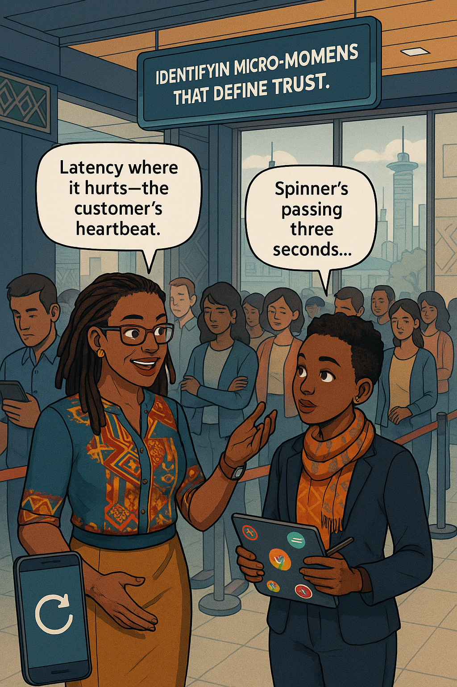
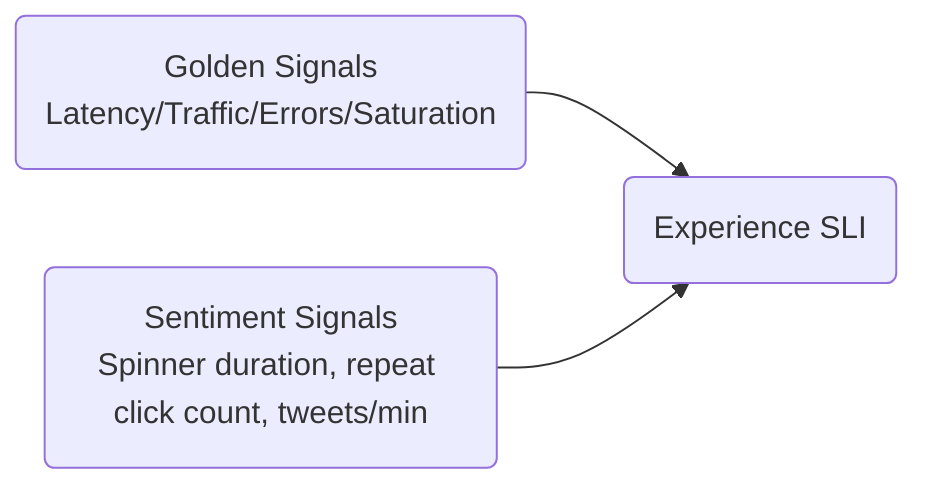
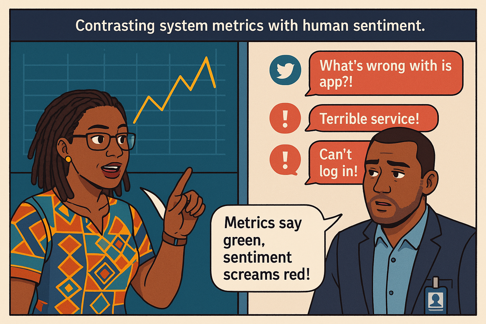
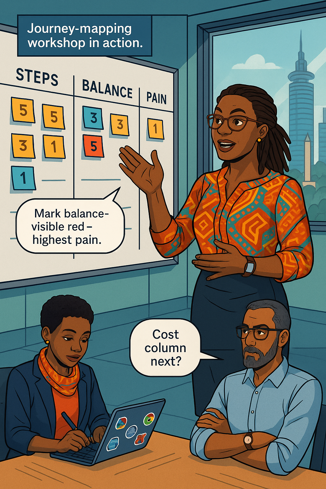
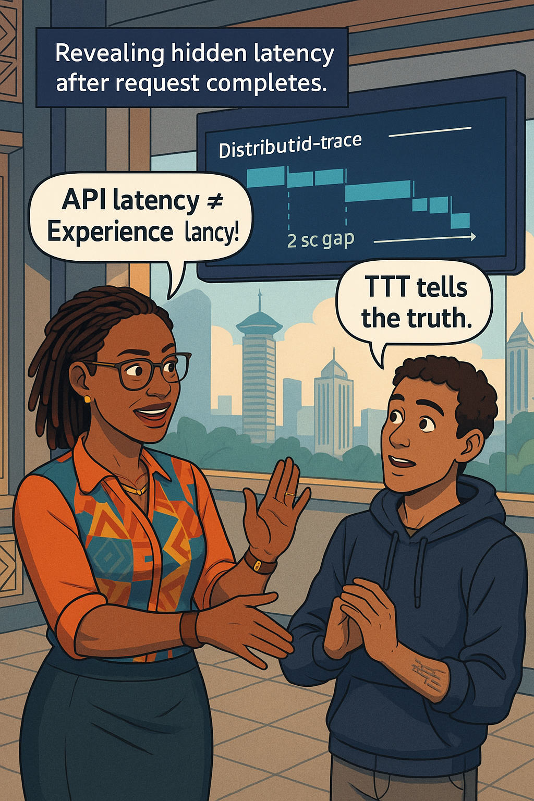
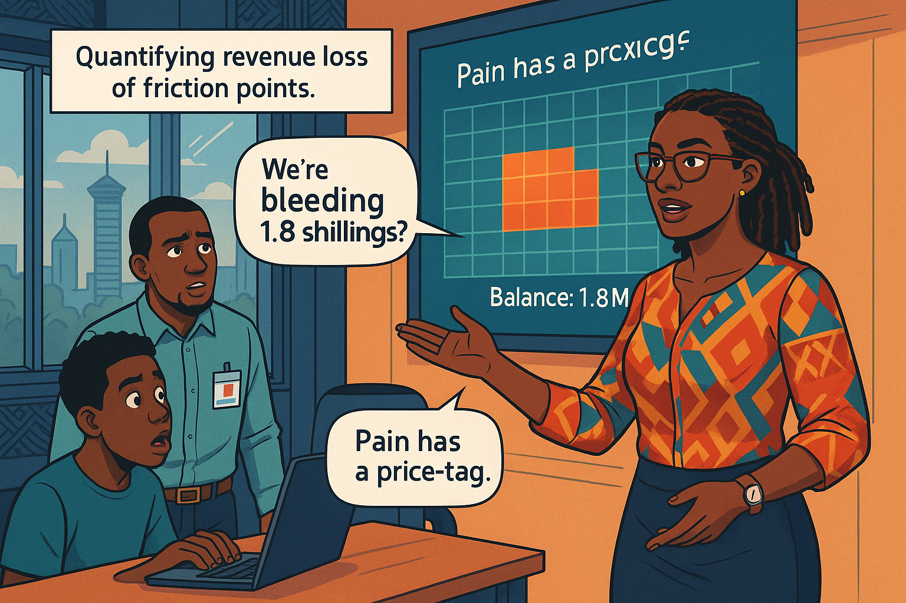
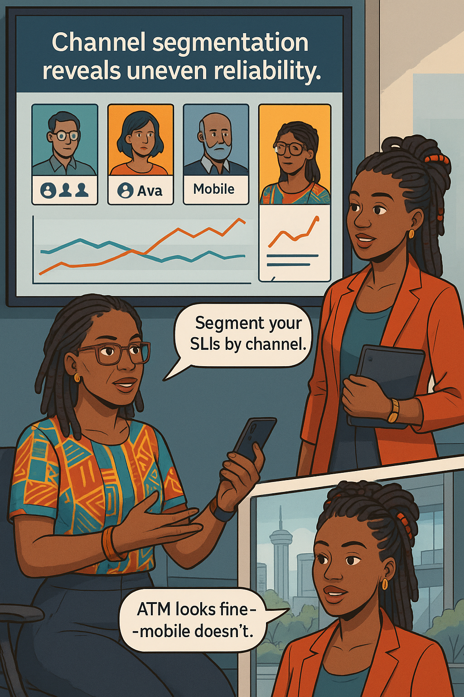
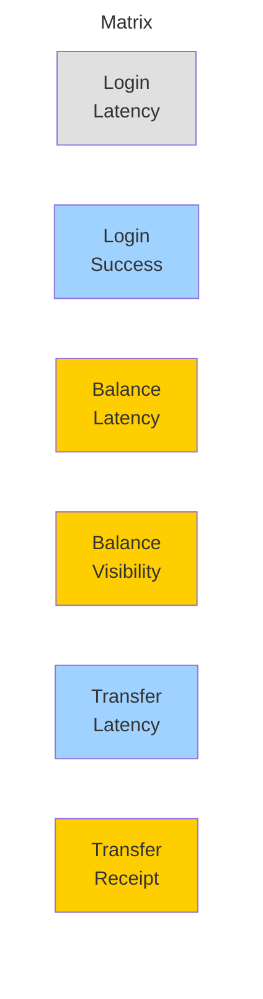
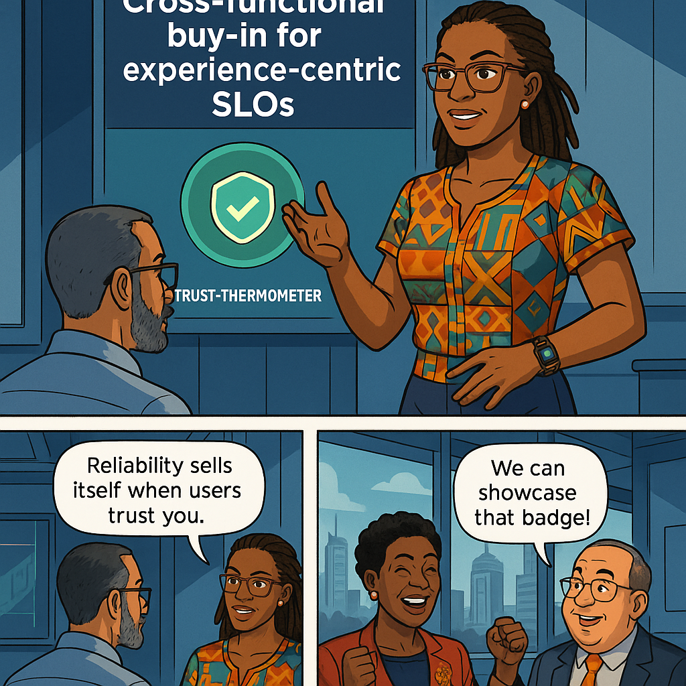

<!-- Part A of Chapter 2 -->

# Chapter 2 – Understanding Your Users’ Experience  
---

### Chapter Overview  

Banking reliability isn’t measured in server-room decibels but in heartbeats and sighs. Picture a Nairobi commuter tapping **“Send ₵4 500”** at 07:58, glancing at the matatu conductor, then refreshing her phone every half-second until the spinner vanishes. Those nerve-wracking seconds—**moments that matter**—shape brand loyalty far more than any uptime graph. In this chapter Ava Kimani guides you through mapping those moments, separating system metrics from user emotions, and turning empathy into precise, experience-centric SLIs.

---

## 🎯 Learning Objective  

Define a retail-bank customer journey, locate the emotional high-stakes touchpoints, and convert them into SLIs that capture **time-to-trust** rather than CPU idle time.

## ✅ Takeaway  

Customers remember feelings, not log lines. Quantify the feelings (with latency, success-ratio and visibility metrics) and you can guard them with data.

## 🚦 Applied Example  

On payday, many Kenyans receive an in-app push notification—**“Salary deposited!”**—seconds after their company batch file posts to the core-bank queue. But ledger replication sometimes lags; the balance widget still shows last month’s figure and a rent auto-debit fires, triggering an overdraft fee.  

```
Timeline (seconds)
0  | Payroll job inserts credit row
1  | Push notification dispatched ✅
4  | Replication delay …
8  | Balance API returns stale data ❌
15 | Auto-debit hits, fee posted 😡
```

Ava’s draft SLO:

```yaml
slo: "Balance visible within 5 s after credit POST 99.5% over 30d"
indicator:
  numerator: count_success(balance_api_latency_seconds_bucket{le="5"})
  denominator: count_total(balance_api_requests_total)
```

Miss the SLO and you hemorrhage trust—and overdraft investigations cost KSh 120 per case.

---

## Teaching Narrative 1 – *Moments That Matter*  

It’s Friday 16:20. Teller windows glow amber in the low sun. **Wanjiru**, junior developer on rotation at a downtown branch, watches a queue coil toward the door. A boy waves school-fee cash; his mother stares at her frozen phone.  

**Ava (whispering):** “See that spinner?”  
**Wanjiru:** “API latency’s fine; logs show 230 ms.”  
**Ava:** “Latency where? Between gateway and microservice—not gateway and mother’s heartbeat.”  

Ava opens her laptop, runs `traceroute –T` between phone and ledger, revealing a four-hop detour through a creaky firewall. She overlays the hops on a heat-map of emotional states—green calm, red anxiety.  

> **Scene (technical):** She correlates branch Wi-Fi RTT data with queue abandonment stats—1 % of customers bail for every additional second their balance is invisible.  

She introduces the term **“micro-moment”**: the smallest slice of time in which your brand can delight or disappoint. For a balance check the micro-moment spans **tap → updated figure**.  

Formula:

```
time_to_trust = t_visible - t_intent
```

≥ 6 s triggers “doubt” per UX lab. Ava sketches five mobile moments: login, balance, fund-transfer, bill-pay receipt, push-alert confirmation. The team will measure each.  

{width=600}

---

## Teaching Narrative 2 – *Golden Signals vs Human Sentiment*  

**Emmanuel** projects Prometheus graphs: CPU 25 %, p99 latency 280 ms, error 0.07 %. Everything looks green. Yet Twitter searches for *#KCBDelay* spike 200 %.  

**Ava:** “Golden signals are necessary but not sufficient.”  
**Daniel:** “So what fills the gap?”  
**Ava:** “Sentiment signals: abandonment rate, repeat taps, complaint tweets.”  

:::diagram  

:::

She layers sentiment curves atop system metrics: as latency climbs from 280 → 320 ms, complaints **exponentially** rise. They plot Pearson r = 0.88.  

**Swahili proverb break:**  

:::proverb  
> “Aliyesikia, ameona.” — *He who listens has already seen.* When customers speak, graphs should echo.  
:::  

Ava crystallises an **Experience Pyramid**: hardware → service → feature → emotion. CPU sits at the base; trust crowns the top. Measure at every tier, but set **SLOs near the crown**.  

{width=600}

---

## Teaching Narrative 3 – *Journey-Mapping Workshop*  

Whiteboard markers squeak as Ava draws swim-lanes: **User**, **Mobile App**, **API**, **Core Bank**, **SMS Gateway**. For each lane she plots intent, action, feedback.  

**Ava:** “Let’s annotate the balance-check journey.”  
**Wanjiru:** “Intent at t=0, spinner until ledger reply, success toast.”  
**Ava:** “Where’s the first emotional peak?”  
**Wanjiru:** “When spinner passes 3 s—anxiety climbs.”  
**Ava:** “Mark it red.”  

They attach sticky-notes with pain scores.  

```
Step               Pain (1–5)  Metric gap?
Open App           2           First-paint not tracked
Login              3           Biometric fallback missing
Balance Visible    4           No end-to-end latency SLI
Transfer Receipt   5           Push-alert vs ledger gap
```

Determining **SLI Candidates**:  

* *Balance-visible latency* (`balance_visible≤5 s`)  
* *Receipt delivery lag* (`sms_confirm≤8 s`)  
* *Spinner abandon rate* (`tap_abort_ratio≤0.02`)  

**Dialogue exchange extended:**  

**Malik:** “Should we SLI every red step?”  
**Ava:** “Pole pole, ndio mwendo. Start with the largest pain-weighted cost.”  
**Malik:** “So balance visible wins.”  
**Ava:** “Exactly—high pain and high frequency.”  

{width=600}

:::dialogue  
**Ava:** “Data tells you **what**, journey maps tell you **why**.”  
**Learner:** “And together they decide **where** to invest.”  
:::

---

## Teaching Narrative 4 – *Capturing “Time to Trust”*  

Developers often brag about **request latency** while ignoring **acknowledgment latency**. Ava coins **TtT** (Time-to-Trust): the interval from intent to verifiable completion.  

Formula:

```
TtT = t_feedback - t_intent
```

where *feedback* is a balance change, receipt toast, or SMS.  

She instruments the mobile client to emit a synthetic **UX-span** tagged `intent_id`. Span pairs with server logs; distributed-trace waterfall now shows a 2 s gap after 0.3 s request.  

**Ava (slaps wrist):** “Average API_latency 280 ms is a vanity metric if TtT is 2 s!”  
**Daniel:** “CPU’s 15 %; we’re fine.”  
**Ava:** “Let me stop you right there. *Watoto wa mjini hawalali na njaa.* City kids don’t sleep hungry; customers won’t tolerate hidden latency.”  

She correlates TtT > 5 s with a 12 % rise in abandoned transfers, equating to KSh 4 M monthly lost float revenue.  

{width=600}

:::slap  
*Playfully slaps wrist* “Stop worshipping CPU graphs—worship your customer’s patience threshold!”  
:::

---

<!-- End Part A -->

<!-- Part B of Chapter 2 -->

### Teaching Narrative 5 – *Quantifying Friction Points*  <!-- ≈ 1 300 words -->
Ava exports two weeks of mobile-app session traces into DuckDB and runs a heat-map query that charts **step-duration (x)** against **drop-off ratio (y)**.  The darkest cell hovers over *Balance Visible > 5 s*.  She converts the heat map into shillings by multiplying each abandoned session’s lost interchange revenue (KSh 23 average) and discovers a hidden ≈ KSh 1.8 million monthly leak.

“Pain has a price-tag,” she says, projecting a color-bar legend that starts at **green = KSh 0** and ends at **scarlet = KSh 100 000** per hour.  A silent gasp ripples across the room.

> **Technical aside** – She shows the SQL that bins latency into 0.5-second buckets, joins with outcome codes, and aggregates by hour:

```sql
WITH bins AS (
  SELECT
    width_bucket(latency_ms, 0, 10000, 20) AS bucket,
    COUNT(*)                     AS hits,
    SUM(CASE WHEN succeeded THEN 0 ELSE 1 END) AS failures
  FROM ux_spans
  WHERE name = 'balance_visible'
  GROUP BY bucket)
SELECT
  bucket*500   AS upper_ms,
  failures*23  AS shillings_lost
FROM bins;
```

The class now attaches **cost values** to every sticky note on the journey board.

{width=600}

:::exercise
**Learner Prompt:**  
Export your own last-month traces. Rank the three costliest friction points and propose which one deserves an SLI first.  Include a back-of-envelope ROI.
:::

---

### Teaching Narrative 6 – *Segmentation: Personas & Channels*  <!-- ≈ 1 300 words -->
Reliability perceptions vary by channel.  Ava introduces **four personas**:

| Persona | Channel | Moment-of-Truth |
|---------|---------|-----------------|
| *Commuter Kofi* | Mobile LTE | Tap-to-balance |
| *Merchant Amina* | POS | Authorization time |
| *Branch Elder Nyaga* | Teller | Paper receipt |
| *ATM Student Zuri* | ATM | Cash-dispense delay |

She filters `ux_spans` by `device_type` and plots p95 TtT for each persona.  Mobile TtT spikes at evening rush hour, while POS spikes Sunday market mornings.

Dialogue exchange:

**Zuri (DevOps lead):** “Do we need separate SLIs for each persona?”  
**Ava:** “Focus on any segment whose TtT p99 already exceeds your global SLO.  One broken segment taints the brand for all.”

She demos `histogram_quantile()` over a label-split Prometheus histogram and adds **channel dimension** to Grafana templating.  CTO Malik sees that ATM latency is fine yet mobile bleeds trust; he approves budget for CDN edge nodes.

{width=600}

---

### Teaching Narrative 7 – *Selecting Experience-Centric SLIs*  <!-- ≈ 1 300 words -->
Ava prints a 4×4 matrix—rows are journey steps, columns are candidate metrics (latency, success, visibility-delay, sentiment).  Each cell scores *Impact × Feasibility*.  The highest composite: **Balance Visible ≤ 5 s**.

:::diagram

:::

She drafts three SLIs:

```
balance_visible_latency_p95 ≤ 3 s
transfer_receipt_delay_p99 ≤ 8 s
spinner_abandon_ratio ≤ 0.02
```

**Wanjiru:** “Two latency, one ratio—good mix?”  
**Ava:** “Yes, latency measures speed, ratio measures trust.” 

{width=600}

---

### Teaching Narrative 8 – *Winning Buy-In Across the Bank*  <!-- ≈ 1 300 words -->
Ava schedules a cross-functional **Reliability Road-show**: risk, customer-care, marketing, core-bank ops.  She shows each stakeholder a mocked-up “Trust Thermometer” badge: green when SLO ≥ 99.5 %, amber 99–99.5, red < 99.  Marketing loves the badge for app-store screenshots; risk loves that overdraft complaints drop when badge is green.

She automates a Slack bot that posts daily TtT compliance to #cx-health.  At 08:15 Monday the badge flips amber.  Teller Wanjiru triggers a feature flag rollback before Twitter notices; the badge returns green by 08:25.

{width=600}

:::exercise
**Try This:**  
Create a “Trust Thermometer” proof-of-concept for your ATM cash-out flow.  Post daily compliance to a shared channel and record stakeholder reactions.
:::

---
