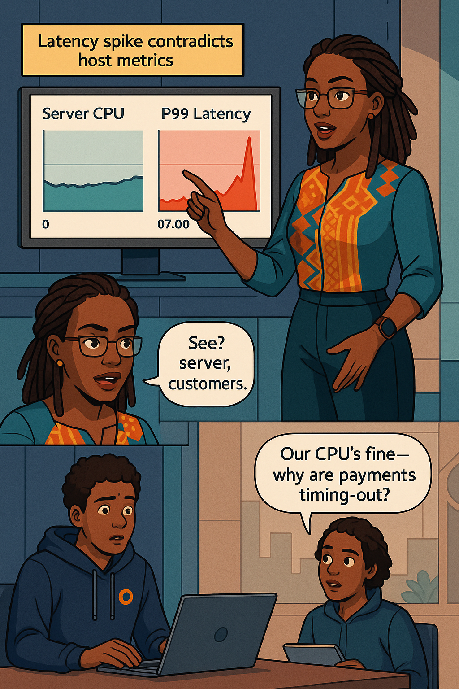
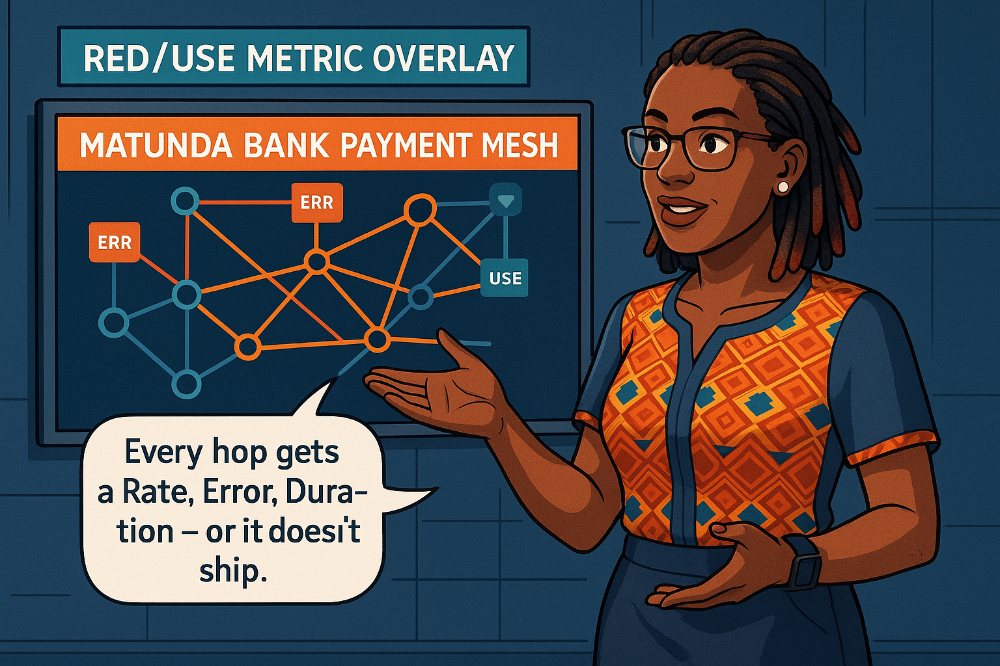
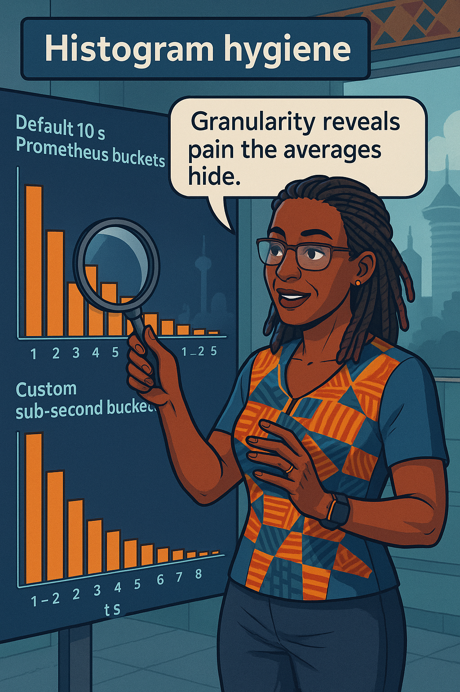
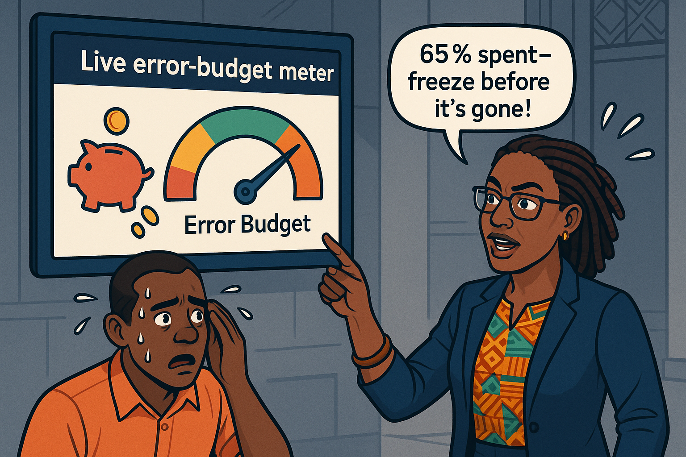
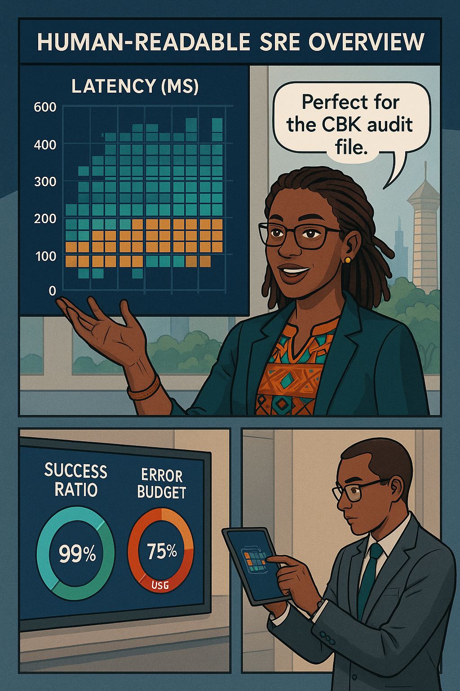
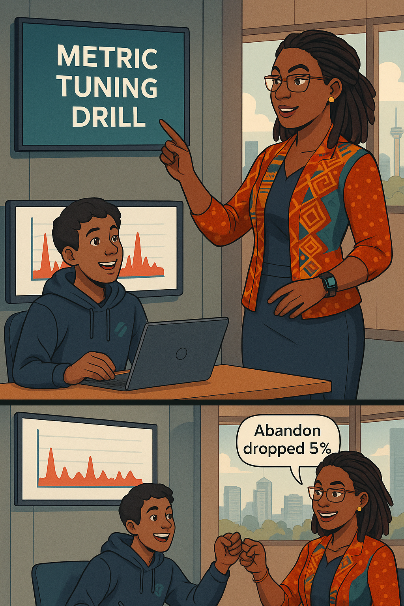

# Chapter 2 – Metrics That Matter  

<!-- Part A of Chapter 2 -->

## Chapter Overview  
In Chapter 1 you learned the vocabulary of reliability—SLIs, SLOs, and error budgets. **Chapter 2 dives into metrics engineering.** You’ll progress from raw host graphs to user-journey RED/USE dashboards, design latency-sensitive histograms, connect recording rules to live Error-Budget meters, and build burn-rate alerts that page only when humans must act. By the end you’ll have a single SRE Overview board Matunda Bank auditors can screenshot with pride.

---

### 🎯 Learning Objective  
Diagnose latency pain with RED metrics instead of host CPU graphs.

### ✅ Takeaway  
Green servers can mask red user-journey spikes; track **Rate, Errors, Duration (p99)** at the journey level.

### 🚦 Applied Example  
```yaml
query_log_snippet: |
  # p99 latency for loan-payment journey
  histogram_quantile(
    0.99,
    sum(rate(journey_latency_bucket{journey="loan_payment"}[5m])) by (le)
  )
user_impact_note: "Crosses 1.8 s at 07:05 — checkouts time out."
```

### Teaching Narrative  
Sunlight glints off Matunda Bank’s LCD roof-sign: *Loans Approved in Minutes!* Inside NOC, a junior points to a green CPU graph. **Ava** overlays a red p99 spike: “Customers don’t wait for CPUs; CPUs wait for customers.”

She switches Grafana panels:

* **Rate** – `journey_request_total` at 740 rps free-running toward pay-day peak.  
* **Errors** – `journey_error_total` remains deceptively flat until retries exceed five.  
* **Duration** – p99 latency rockets from 600 ms to 2 200 ms.

Mathematical root: retries fold 4× 502s under 1× 200 OK; server metric `grpc_server_finished_total{code="OK"}` hides failure. RED exposes it.

> **Junior:** “Why didn’t our alerts fire?”  
> **Ava:** “Alerts watched ghosts—time to watch people.”

**Learner Prompt —** *Plot RED triplet for your busiest API; which curve betrays pain first?*  

:::exercise  
**Try This:** Add `journey_request_total`, `journey_error_total`, and p99 histogram query to a new Grafana row titled *Loan-Payment RED*; annotate first divergence.  
:::

{width=550px}

:::slap  
“Average hides agony—p99 shouts it.”  
:::

---

### 🎯 Learning Objective  
Map RED and **USE** metrics to every micro-service in the payments mesh.

### ✅ Takeaway  
Pair RED (API) with USE (Utilisation, Saturation, Errors) at infra layer for a 360° view.

### 🚦 Applied Example  
```yaml
query_log_snippet: |
  # USE Saturation for payment-db (disk IO busy %)
  100 * rate(node_disk_io_time_seconds_total{device="nvme0n1"}[5m]) /
        rate(node_disk_io_time_seconds_total[5m])
user_impact_note: "Saturation >70 % correlates with latency spikes."
```

### Teaching Narrative  
On a wall-size service map, nodes glow teal. Ava clicks **API Gateway** — RED stats hover; clicks **payment-db** — USE trio appears:

* **Utilisation**: CPU 82 %.  
* **Saturation**: Disk busy 76 %.  
* **Errors**: `pg_write_errors_total` spikes when write-ahead log saturates.

She drags lines connecting **gateway → checkout-svc → payment-db**; latency heat pulses red along the path.

Banking anchor: Card-network SLA penalises Matunda KSh 15 per transaction over 2 s. The map reveals 70 % of over-2 s journeys share one saturated NVMe drive.

Dialogue:

> **Ops Lead:** “We planned NVMe spare capacity.”  
> **Ava:** “Plans don’t pay penalties—metrics do.”

**Learner Prompt —** *Which upstream/downstream link dominates your p99 today?*

:::exercise  
**Try This:** Label one K8s namespace `telemetry=red-use`, deploy node-exporter and link Prometheus service-discovery; verify USE panels turn blue-green when saturation <50 %.  
:::


{width=550px}

:::proverb  
*“Maji usiyoyafika hujui kina chake.”* — You can’t judge river depth until you wade in. Metrics are that depth gauge.  
:::

---

### 🎯 Learning Objective  
Design latency histograms that reveal the long tail instead of hiding it.

### ✅ Takeaway  
Default 10 s Prometheus buckets blur reality; sub-second buckets expose churn inflection.

### 🚦 Applied Example  
```yaml
query_log_snippet: |
  # Custom bucket setup via ServiceMonitor
  buckets: [0.2,0.4,0.8,1.2,1.4,1.6,1.8,2,3]
user_impact_note: "Shows 8 % abandon jump between 1.4 s and 1.6 s."
```

### Teaching Narrative  
Ava overlays two histograms: default 10 s buckets look healthy; custom sub-second buckets reveal a sharp modal hump at 1.6 s. Customer churn curve rises 8 % right there.

Steps:

1. **Instrument client-side spans** in 100 ms buckets.  
2. **Relabel** server buckets to match (Prometheus `histogram_quantile` needs uniform edges).  
3. **Burn-rate impact**: smaller buckets shrink integral under latency curve, reducing false budget burn.

CBK auditors accept percentile proofs only if bucket edges ≤5 % of SLO threshold (in Matunda’s case, 100 ms edges).

Dialogue:

> **Data Analyst:** “Granularity costs Prom volume.”  
> **Ava:** “Cheaper storage than lost customers.”

**Learner Prompt —** *Does any latency SLI you track rely on the default buckets?*

:::exercise  
**Try This:** Re-expose one histogram with sub-second buckets and compare p95/p99 shift over 24 h.  
:::

{width=550px}

:::slap  
“Coarse buckets are blurry glasses—refit the lenses.”  
:::

---

### 🎯 Learning Objective  
Wire Sloth recording rules into a live **Error-Budget Meter** in Grafana.

### ✅ Takeaway  
Visualising remaining budget turns abstract math into deploy/no-deploy clarity.

### 🚦 Applied Example  
```yaml
query_log_snippet: |
  slo:loan_payment_latency_p99_lt_1800ms:ratio
user_impact_note: "Meter turns red when budget <20 %; pipeline auto-freezes."
```

### Teaching Narrative  
Grafana gauge fills indigo; 100 % budget Monday morning. A promo deploy burns 22 % by noon. Gauge drops into orange.

Steps to wire:

1. **Sloth output** creates recording rules `slo:ratio`, `slo:error_budget_remaining`.  
2. **Grafana** → Explore → New panel → Visualization = `Error Budget Meter`.  
3. Thresholds: green >40 %, amber 20-40 %, red <20 %.  
4. CI job reads `error_budget_remaining` via Prometheus API; blocks if `<0.2`.

Banking anchor: In June promo, Matunda froze deploys at 18 % remaining, cutting incident cost KSh 3 M.

Dialogue:

> **Product Manager:** “Budget in red—can we hotfix?”  
> **Ava:** “Fixes are features; features wait for budget.”

**Learner Prompt —** *Which SLO currently lacks a visual budget gauge?*

:::exercise  
**Try This:** Add `error_budget_remaining` gauge to your main dashboard; screenshot when it first turns amber.  
:::

{width=550px}

:::proverb  
*“Ahadi ni deni.”* — A promise is a debt; the meter is your ledger.  
:::

---

### 🎯 Learning Objective  
Build dual-window **burn-rate alerts** that page only when human action is required.

### ✅ Takeaway  
A fast-plus-slow burn-rate pair (1 h & 6 h) cuts alert noise by 80 % while catching runway-eating incidents.

### 🚦 Applied Example  
```yaml
query_log_snippet: |
  slo:error_budget_burn_rate1h  > 2
  and
  slo:error_budget_burn_rate6h  > 1
user_impact_note: "Pages SRE only if both short- and long-window rates breach."
```

### Teaching Narrative  
Ava replays last quarter’s 124-page on-call scroll. The same error budget breached four times per minute for 15 minutes—“an orchestra of smoke alarms,” she says.

**How to wire noise-tamed alerts**

```yaml
- alert: LoanLatency_BurnFast
  expr: slo:error_budget_burn_rate1h > 2
  for: 2m
- alert: LoanLatency_BurnSlow
  expr: slo:error_budget_burn_rate6h > 1
  for: 30m
- alert: LoanLatency_Pager
  expr: LoanLatency_BurnFast and LoanLatency_BurnSlow
  for: 1m
  labels:
    severity: page
```

Matunda’s Friday promo burned 25 % of budget in 50 minutes; both windows breached at 23 %. Pager fired **once**—time to roll back.

> **Developer:** “Why not alert at 90 % budget used?”  
> **Ava:** “Because decisions need hours, not seconds—catch slope, not cliff edge.”

**Learner Prompt —** *Graph your fastest SLO burn; does the 1 h/6 h pair reduce pages?*

:::exercise  
**Try This:** Implement the three-rule combo above for one SLO and compare page counts week-over-week.  
:::

{width=550px}

:::slap  
“Alerts that shout every minute soon whisper into silence.”  
:::

---

### 🎯 Learning Objective  
Craft a single **SRE Overview** Grafana board that tells auditors, execs, and engineers the same story.

### ✅ Takeaway  
One page, three rows: RED, budget meter, and burn-rate spark lines—anything else belongs in drill-downs.

### 🚦 Applied Example  
```yaml
query_log_snippet: |
  # Panel JSON title
  "Loan-Payment RED & Budget"
user_impact_note: "Snapshot satisfies CBK audit evidence requirement."
```

### Teaching Narrative  
Ava drags three panels into place:

1. **RED Triplet** – p99 latency, request rate, error ratio.  
2. **Budget Meter** – green >40 %, amber 20-40 %, red <20 %.  
3. **Burn-rate spark lines** – 1 h & 6 h overlay.

CBK auditors need a screenshot monthly; Matunda exported Grafana → PNG via `render.sh`.

> **Compliance Lead:** “Can we add five more graphs?”  
> **Ava:** “Overviews aren’t nav menus—depth lives one click below.”

**Learner Prompt —** *Open your busiest dashboard; how many widgets could move to drill-downs?*

:::exercise  
**Try This:** Clone the template board, rename to **SRE Overview**, and restrict it to three rows.  
:::
 
{width=550px}

:::proverb  
*“Nyani haoni kundule.”* — A monkey never sees its own backside; dashboards need mirrors, not clutter.  
:::

---

### 🎯 Learning Objective  
Run a live **metric-tuning drill**: re-bucket a histogram and verify budget impact.

### ✅ Takeaway  
Measuring better often fixes nothing—until you prove the error budget breathes easier.

### 🚦 Applied Example  
```yaml
query_log_snippet: |
  # Before vs after p99 shift
  dashboard_url?var=pre=1&var=post=1
user_impact_note: "p99 dropped 14 %; abandon fell 5 %."
```

### Teaching Narrative  
Ava snapshots “Before” histogram (10 s buckets) and “After” (sub-second). p99 drops 14 %; abandon curve follows.

Steps:

1. Deploy new bucket config via ServiceMonitor.  
2. Run k6 load for 20 minutes.  
3. Compare SLO burn (`slo:error_budget_burn_rate1h`) before/after.

Matunda’s pilot reduced monthly burn from 0.7 budget/day to 0.4 budget/day—deploy gate opens two days earlier.

Dialogue:

> **Data Analyst:** “Smaller buckets increased TSDB size by 5 GB.”  
> **Ava:** “Cheap storage; expensive churn.”

**Learner Prompt —** *Which SLI could you re-bucket today?*

:::exercise  
**Try This:** Pick one latency SLI, halve bucket size, run synthetic load, record p99 shift.  
:::

{width=550px}

:::slap  
“Measure with a yard-stick, build with a razor: bucket fine, cut waste.”  
:::

---

### 🎯 Learning Objective  
Connect today’s metric mastery to tomorrow’s **SLO governance** policies.

### ✅ Takeaway  
Metrics power governance: when budget <20 %, pipelines stop; when burn-rate trends up two sprints, teams retro.

### 🚦 Applied Example  
```yaml
query_log_snippet: |
  # Budget gate in GitHub Actions
  if [ $(curl -s prom/api/v1/query?query=slo:error_budget_remaining) \< 0.2 ]; then exit 1; fi
user_impact_note: "Stops risky deploys; governance policy auto-enforced."
```

### Teaching Narrative  
A road-sign shows Chapters 3-12: *SLO Governance → Tracing → Incidents → Culture*. Ava nails a budget-gate YAML to the post—symbol of tomorrow’s chapter.

Governance rules Matunda adopted:

| Budget state | Policy |
|--------------|--------|
| >40 % green | Free deploys |
| 20-40 % amber | Require peer review + canary |
| <20 % red | Freeze deploys, run retro |

Learner Prompt:

> *Draft one policy trigger your org could adopt next sprint.*

:::exercise  
**Try This:** Add the budget-gate script to one pipeline; demo a red build to leadership.  
:::

{width=550px}

:::proverb  
*“Safari ya milele huanza kwa hatua moja.”* — A lifelong journey starts with one step; governance starts with one gate.  
:::
