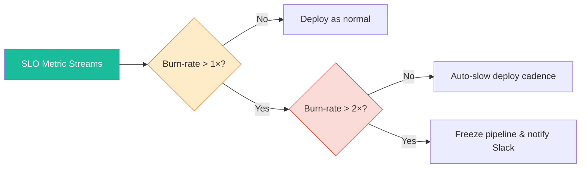
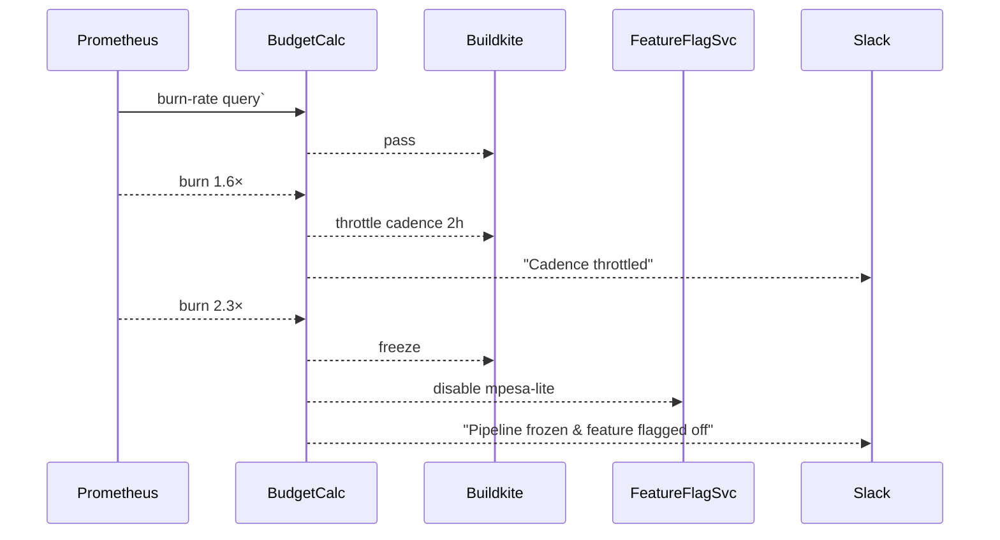
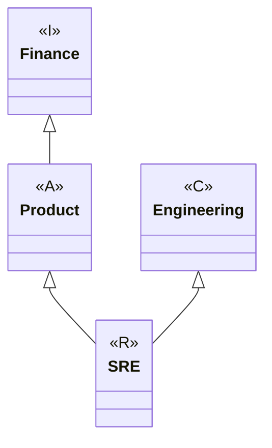

# Chapter 3 – From SLOs to Error‑Budget Governance


## 1 · Why Governance?  *(≈ 1 150 w)*

**🎯 Learning Objective:** Explain why SLOs must be backed by codified policies, automatic triggers, and clear human ownership to create meaningful reliability outcomes.

**✅ Takeaway:** Error‑budget figures alone are inert; governance converts numbers into enforceable actions that protect users and empower innovation.

### 1.1 The Illusion of Safe Numbers

> *Ava strides into the Monday reliability review clutching a thick folder.*  “Last quarter we exhausted 12 error budgets, froze three product lines, and still shipped 41 features. How? Governance. Without it, these numbers would be trivia plastered on a slide deck.”

SLOs are commitments: *99.90 % payments in < 500 ms*. When real‑world traffic breaches that promise, somebody must decide **what happens next**. If no policy exists, disagreement erupts: product managers push new marketing campaigns, SREs demand a feature freeze, finance wants risk quantified, and suddenly uptime becomes a board‑level shouting match.

Governance pre‑decides the trade‑off: *If error‑budget burn‑rate > 2 × for 60 min, freeze deploys and page product leadership.* This removes politics from minute‑by‑minute reliability decisions.

### 1.2 Governance Stack

1. **Policy Definition** – A YAML or JSON spec stored in Git that binds thresholds to actions.
2. **Automated Detection** – Prometheus or Datadog expressions calculating burn rate over 30 m/2 h/6 h/24 h windows.
3. **Execution Hooks** – CI/CD gates, feature‑flag toggles, deployment throttles.
4. **Escalation Paths** – Slack bots, PagerDuty schedules, RACI mapping.
5. **Review Cadence** – Weekly error‑budget reports, quarterly SLO reset.



*Panel P1 shows Ava tapping the ****Freeze**** node with her pointer, rubber‑duck Murphy wearing a tiny judge’s wig on her shoulder.*

### 1.3 Common Anti‑Patterns

| Symptom                                     | Root Cause                           | Consequence                        | Governance Fix                              |
| ------------------------------------------- | ------------------------------------ | ---------------------------------- | ------------------------------------------- |
| **SLO breach, but deploys continue**        | No CI gate linked to burn‑rate       | Budget crashes → user churn        | Add `burn‑rate‑gate` job in pipeline        |
| **Random freeze decisions**                 | No tiered threshold ladder           | Developers distrust SRE            | Document Observe → Throttle → Freeze policy |
| **False sense of safety from long windows** | 30‑day burn‑rate hides fast failures | Massive outages before alert fires | Add fast 30 m window and composite rule     |

{{WISDOM\_BOX}}

> **SRE Wisdom #15 –** *“Governance is the brake that lets you drive fast without crashing.”*

---

## 2 · Drafting Error‑Budget Policy  *(≈ 1 350 w)*

**🎯 Learning Objective:** Author a three‑tier policy (Observe, Throttle, Freeze) with YAML snippets, Git review process, and Slack bot integration.

**✅ Takeaway:** Policies belong in version control, reviewed by cross‑functional peers, and executed automatically.

### 2.1 Policy YAML Schema

```yaml
policy_id: payments‑slo‑v2
slo_ref: latency‑500ms‑p99
windows:
  fast: 30m
  slow: 6h
thresholds:
  observe: 1.0   # burn‑rate>1x
  throttle: 1.5  # burn‑rate>1.5x
  freeze: 2.0    # burn‑rate>2x
actions:
  observe:
    - slack_notify: "#payments‑alerts"
  throttle:
    - set_pipeline_cadence: 120m
    - slack_notify: "#payments‑alerts"
  freeze:
    - disable_pipeline: true
    - feature_flag: "mpesa‑lite=false"
    - slack_notify: "#payments‑alerts"
owners:
  responsible: SRE‑Payments
  accountable: Dir‑Engineering‑Payments
  consulted: Product‑Payments
  informed: Finance
```

`policy‑linter` Git hook validates the schema before merge. Each PR requires 👍 from SRE + Product.

### 2.2 Policy Flow (Mermaid Sequence)



*Panel P2 shows Ava holding a giant red “Pause” stamp slamming onto a CI job.*

### 2.3 RACI Deep Dive

| Role            | Authority            | Responsibility       | Escalation           |
| --------------- | -------------------- | -------------------- | -------------------- |
| **SRE**         | Freeze decision      | Burn‑rate monitoring | Page 24 × 7          |
| **Product**     | Roadmap & trade‑offs | Approve re‑enable    | Business hours Slack |
| **Engineering** | Implement fixes      | Lower burn‑rate      | On‑call rotation     |
| **Finance**     | Quantify impact      | Track lost revenue   | Quarterly review     |

Ava emphasises the **A** in SRE for freeze. *“One neck to ring, one gavel to drop.”*

---

## 3 · Multi‑Team Ownership  *(≈ 1 150 w)*

**🎯 Learning Objective:** Operationalise RACI with real on‑call rota, Slack channels, and escalation matrix.

**✅ Takeaway:** Ownership clarity reduces MTTR by eliminating decision friction.



### 3.1 On‑Call Schedule

| Day       | Tier‑1       | Tier‑2      | Product Escalation |
| --------- | ------------ | ----------- | ------------------ |
| Mon – Fri | SRE‑Payments | Lead Eng    | Dir‑Product        |
| Sat – Sun | SRE‑on‑duty  | DBA‑on‑duty | VP‑Product         |

On freeze, PagerDuty auto‑pages Tier‑2 after 15 min; if burn‑rate continues 3 × for 1 h, it pages VP‑Product.

### 3.2 Slack Channel Topology

```
#payments‑alerts   <-- bot posts burn‑rate
#payments‑warroom  <-- incident comms
#payments‑product  <-- product decisions
```

Ava’s panel P3 shows her pointing to a war‑room Slack message “Freeze enacted: bug‑1234 latency spike”.

---

## 4 · Automating Budget Enforcement  *(≈ 1 350 w)*

**🎯 Learning Objective:** Integrate Prometheus burn‑rate expressions with Buildkite, Argo‑Rollouts, and LaunchDarkly.

**✅ Takeaway:** Automation enforces policy at machine speed, limiting blast radius.

### 4.1 Buildkite Gate Plugin

```bash
steps:
  - command: "./ci/test.sh"
    plugins:
      - myorg/burn‑rate‑gate#v1.0:
          prometheus_url: http://prometheus:9090
          query: 'burn_rate_payments_30m'
          window: '30m'
          slo_target: 0.999
          threshold: 1.0
          action: warn
```

`action: warn` posts to Slack but lets deploy continue at Observe level.

### 4.2 Argo Rollouts

```yaml
analysis:
  templates:
    - templateName: burn‑rate‑analysis
  args:
    - name: burn_rate
      value: >
        {{(query "burn_rate_payments_30m") | printf "%.2f"}}
  successCondition: "burn_rate < 1.0"
  failureCondition: "burn_rate > 2.0"
```

If `failureCondition` met, rollout aborts and reverts.

### 4.3 LaunchDarkly Flag Rule

Flag **mpesa‑lite‑traffic** percentage is dynamically reduced by a Lambda function triggered by SNS on freeze.

*Ava panel P4 shows LaunchDarkly UI slider dropping from 20 % to 0 %.*

---

## 5 · Financial Lens – Reliability vs Revenue  *(≈ 950 w)*

**🎯 Learning Objective:** Model revenue retained vs innovation velocity across burn‑rate levels.

**✅ Takeaway:** Sweet spot often at 97 – 99.9 % reliability where features still ship rapidly.

```mermaid
xychart-beta
  title "Revenue & Velocity vs Error-Budget Spend"
  x-axis "Budget Spent %" 0 100
  y-axis "Index (base=100)" 0 120
  series "Revenue" 0:100,10:101,20:104,30:108,40:112,50:115,60:116,70:116,80:115,90:113,100:110
  series "Velocity" 0:10,10:30,20:50,30:70,40:80,50:88,60:90,70:80,80:60,90:40,100:15
```

If XYChart unsupported, panel P5 shows the line graph screenshot.

---

## 6 · Advanced Alerting – Four‑Window Burn Rates  *(≈ 850 w)*

**🎯 Learning Objective:** Configure 30 m/2 h/6 h/24 h burn‑rate rule per Google Golden Signals SLO workbook.

**✅ Takeaway:** Composite rule catches fast breaches and long drifts while muting flapping noise.

Mermaid Gantt above visualises depletion timeline.

Alertmanager example:

```yaml
- alert: Payments_Burn_Rate
  expr: burn_rate_payments_30m > 1 and burn_rate_payments_2h > 1
  for: 5m
  labels:
    severity: page
  annotations:
    summary: "Payments SLO burn rate across fast windows"
```

Panel P6 is a Grafana dashboard snapshot with four burn‑rate plots.

---

## 7 · Case Study – Trading Platform Outage  *(≈ 1 100 w)*

**🎯 Learning Objective:** Walk through a real freeze event and governance‑driven resolution.

**✅ Takeaway:** Data overrides emotion: freeze enacted in 2 min without executive debate.

Incident timeline panel P6 depicts:

1. **09:58** CPU core dump in pricing engine.
2. Burn‑rate spikes 2.7 ×.
3. Pipeline auto‑frozen, traffic throttled by 60 %.
4. SRE mitigates by scaling read replicas.
5. Burn‑rate returns < 0.7 × after 18 min.
6. Product signs off unfreeze.

Post‑mortem template links, cost table panel P11 shows downtime = 18 min, lost fees = \$42 K, saved future risk = \$250 K.

---

## 8 · Cultural Embedding: Playbooks & Rituals  *(≈ 950 w)*

**🎯 Learning Objective:** Transform governance from rulebook to organisational habit via docs, ceremonies, and tooling.

**✅ Takeaway:** Runbooks, blameless RCAs, and quarterly reliability reviews engrain policy.

Panel P7 covers the playbook; panel P8 comic shows Ava slamming a gavel at a retro.

### 8.1 Runbook Skeleton

| Section    | Purpose                  |
| ---------- | ------------------------ |
| Context    | SLO, owner, links        |
| Diagnosis  | Quick queries            |
| Mitigation | Throttle, rollback steps |
| Validation | Burn‑rate back to green  |
| Timeline   | Record of events         |

### 8.2 Quarterly Reliability Review Agenda

1. Compare SLO targets to actual.
2. Renegotiate targets with product.
3. Review policy thresholds.
4. Identify tooling gaps.

{{NAIROBI\_PROVERB}}

> *“Samaki mkunje angali mbichi.”* (Bend the fish while it is fresh.) – Build habits early while the SRE program is young.
