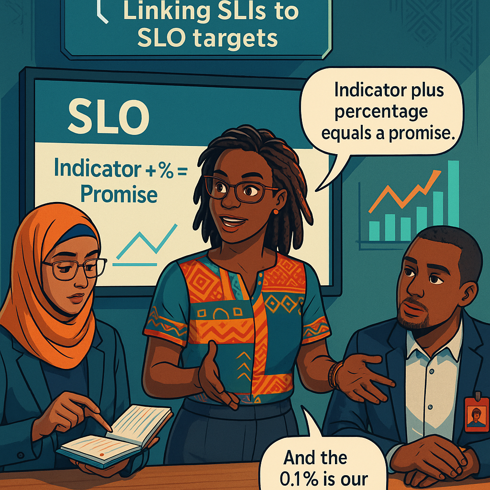
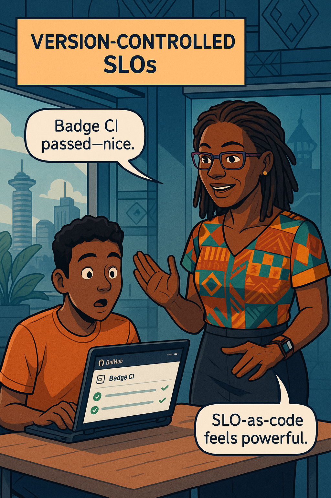
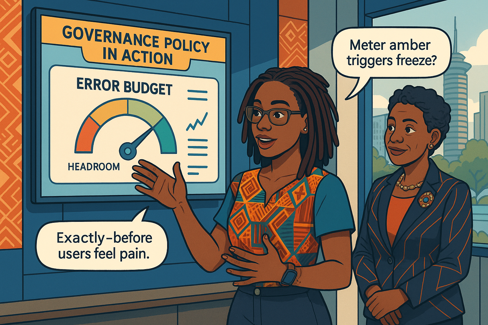
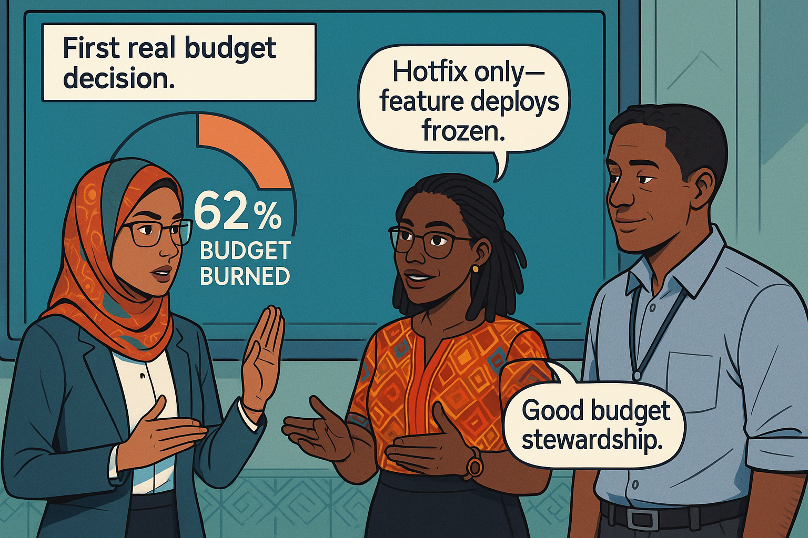

<!-- Part A of Chapter 4 -->

# Chapter 4 – Setting Meaningful Targets: SLOs  
---

### Chapter Overview  

Your indicators now hum—green gauges for latency, amber bars for error-ratios. Yet numbers alone do not keep promises; customers cash promises, not metrics. This chapter transforms raw SLIs into **Service-Level Objectives (SLOs)**—bank-backed commitments that balance trust and innovation. Ava Kimani partners with **Aisha Mwangi**, a former business analyst turned reliability champion, to mine six months of transactional data, pick defensible percentages, and weave error budgets into deploy policy. By chapter’s end, you will frame reliability as a business contract, not a heroic afterthought.

---

## 🎯 Learning Objective  

Translate historical SLI data into pragmatic SLO targets and rolling windows, defend them to stakeholders, and wire them into error-budget governance.

## ✅ Takeaway  

An SLO is a measurable promise: percentage + window + indicator. If any piece is guesswork, the whole promise is counterfeit.

## 🚦 Applied Example  

Aisha loads 180 days of *balance-visible latency* p99 values into DuckDB:

```sql
SELECT date_trunc('day', ts) AS d,
       percentile_cont(0.99) WITHIN GROUP (ORDER BY latency_ms) AS p99
FROM balance_visible
GROUP BY d;
```

The 50th-percentile p99 sits at **240 ms**, the worst at **560 ms**. Ava proposes **300 ms @ 99.9 % / 30 days**. That grants **2 592 s** of monthly budget. A what-if chart shows an eight-minute core-bank outage consumes **18 %** of the budget; two such blips plus one deploy regression would freeze releases before users riot.

---

## Teaching Narrative 1 – *From Indicators to Objectives*  

Monday 09:00, glass-walled boardroom. Graphs flicker: green latency, green success-ratio. Marketing beams. Ava frowns.

**Ava:** “Green today says nothing about payday Friday.”  
**Aisha:** “Let’s write the promise, not admire the present.”  

Ava sketches:

```
SLO ≙ Target % + Window + SLI
```

**Emmanuel:** “Why 99.9 %? Why 30 days?”  
**Ava:** “Because users feel monthly statement pain, not hourly dashboards.”  

Aisha overlays a 30-day rolling success-ratio; tiny red dips coalesce into a noticeable 0.12 % shortfall. Without a window the failure hid between days.

They craft the objective:

```yaml
objective: 99.9  # percentage
window: 30d      # rolling
indicator: p99_balance_visible_latency ≤ 0.3
```

Ava underlines the 0.1 % slice. “This is our **innovation runway**—spend wisely or freeze deploys.”  

{width=600}

---

## Teaching Narrative 2 – *Historical Analysis & Error Budgets*  

Ava exports latency buckets to CSV, loads into a Jupyter notebook, and plots a violin chart. The tail brightens crimson on month-end spikes.

She computes **error-budget seconds**:

```
budget = (1 - 0.999) × 30d ≈ 2 592 s
```

> **Technical aside** – A DuckDB query sums `breach_duration` across 180 days: **1 734 s** average. A budget-burn gauge shows 67 % burned historically.

**Swahili proverb:**  

:::proverb  
> “Maji ukiyavulia nguo, huna budi kuyaoga.”  
> *Undress for the river, and you must bathe.* Choose a target you can actually meet.  
:::

Ava colour-codes four candidate targets:

| Target | Budget (s/mo) | Historic Burn | Status |
|--------|---------------|---------------|--------|
| 99.0 % | 25 920 | 7 % | Too loose |
| 99.5 % | 12 960 | 13 % | Loose |
| **99.9 %** | **2 592** | **67 %** | Stretch / Accept |
| 99.95 % | 1 296 | 134 % | Impossible |

Management accepts 99.9 %—ambitious but not fantasy.

{width=600}

---

## Teaching Narrative 3 – *Choosing Target % & Window*  

Ava draws a 2×2 matrix: **short vs long window** on one axis, **high vs low target** on the other. Short windows catch micro-regressions but punish seasonality; long windows even out spikes but mask week-end drift.

Mermaid diagram:

:::diagram  
```mermaid
quadrantChart
  title SLO Design Space
  x-axis Short Window --> Long Window
  y-axis Low Target --> High Target
  data
    "Loose": [0.3,0.3]
    "Aggressive": [0.8,0.8]
    "Stretch": [0.8,0.3]
    "Masking": [0.3,0.8]
```  
:::

They simulate three-day vs thirty-day windows. The three-day variant would have frozen deploys six times last quarter; the thirty-day froze once. Balance: pick 30-day window, 99.9 % target. Ember agrees.

{width=600}

---

## Teaching Narrative 4 – *Communicating SLOs to Stakeholders*  

Aisha presents the draft SLO to risk, marketing, and mobile leads.

**Risk Officer:** “0.1 % failure equals 18 min a month—customers lose trust.”  
**Aisha:** “They already lose 28 min. We disclose, then improve.”  

**Marketing Lead:** “Green badge good, red badge kills ratings.”  
**Ava:** “Red triggers freeze and post-mortem—better badge honesty than silent failure.”  

Dialogue lines convince both parties to sign off. They schedule quarterly SLO revisions aligned to fiscal roadmap.

{width=600}

:::dialogue  
**Aisha:** “99.9 % isn’t perfection—it’s honesty.”  
**Risk Officer:** “And the 0.1 %?”  
**Aisha:** “Our innovation currency.”  
:::

---

<!-- End Part A -->

---

<!-- Part B of Chapter 4 -->

## Teaching Narrative 5 – *Tooling: Sloth & Prometheus Rules*  

Ava generates a **Sloth** YAML:

```yaml
service: fund-transfer
slo:
  - name: latency-p99
    objective: 99.9
    time_window: 30d
    indicator:
      ratio:
        errors:
          source: prometheus
          query: sum(rate(api_latency_seconds_bucket{le="0.300"}[5m]))
        total:
          source: prometheus
          query: sum(rate(api_latency_seconds_count[5m]))
```

Sloth outputs recording and alerting rules. Emmanuel copy-pastes Google samples; Ava catches him.

:::slap  
*Playfully slaps wrist* “Don’t recycle SLOs—tailor to your history!”  
:::

She runs `sloth generate -i slo.yaml -o rules.yaml`, pushes to Git. CI lints alerts.

{width=600}

---

## Teaching Narrative 6 – *Documentation & Version Control*  

They create `SLOs/README.md` template:

```
### Objective
Balance visible within 300 ms for 99.9 % of requests (rolling 30 d)

### Error Budget Policy
>80 % burned → freeze risky deploys  
>100 % burned → freeze all deploys, run post-mortem
```

Aisha opens a PR with badge:

``

Learner prompt follows.

{width=600}

:::exercise  
**Learner Prompt:** Fork the repo, add *ATM cash-out latency* SLO (400 ms @ 99.8 %/30 d) and open a PR tagged `slo-review`.  
:::

---

## Teaching Narrative 7 – *Governance & Review Cadence*  

Ava automates a monthly email: **Budget Burn Report**. It lists budget-spent, incidents, deploy freezes. Risk signs off; marketing scans badge colour.

They introduce a **burn-rate alert**:

```
14× burn-rate for 1 h → PagerDuty P1  
2× burn-rate for 6 h → Slack alert
```

Dashboard shows an **Error-Budget Meter** widget.

{width=600}

---

## Teaching Narrative 8 – *Aisha’s First Budget Decision*  

Mid-month, a queue mis-tune burns **62 %** budget in two hours. Deployment freeze? The team needs a hotfix.

Aisha weighs risk:

* Budget remaining: **38 %**  
* Hotfix risk: 5 % budget  
* Friday payday in 10 days.

Decision: approve hotfix, freeze feature deploys.

{width=600}

:::exercise  
**Try This:** Simulate a 5-hour incident at 14× burn-rate. Does your service freeze deploys under your policy? Document decision tree.  
:::

---

## Self-Check Table  

| Concept | Question | Your Answer |
|---------|----------|-------------|
| Target % | Why not 100 %? | |
| Window | 7 d vs 30 d trade-off? | |
| Budget | Seconds/month at 99.9 %? | |
| Burn-Rate | Threshold for P1 alert? | |
| Stakeholder | Who approves SLO revisions? | |

---

<!-- End Part B -->
