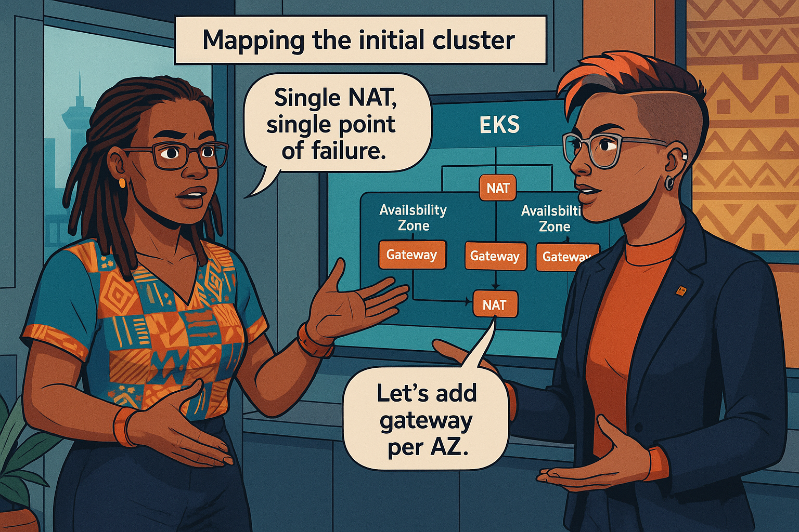
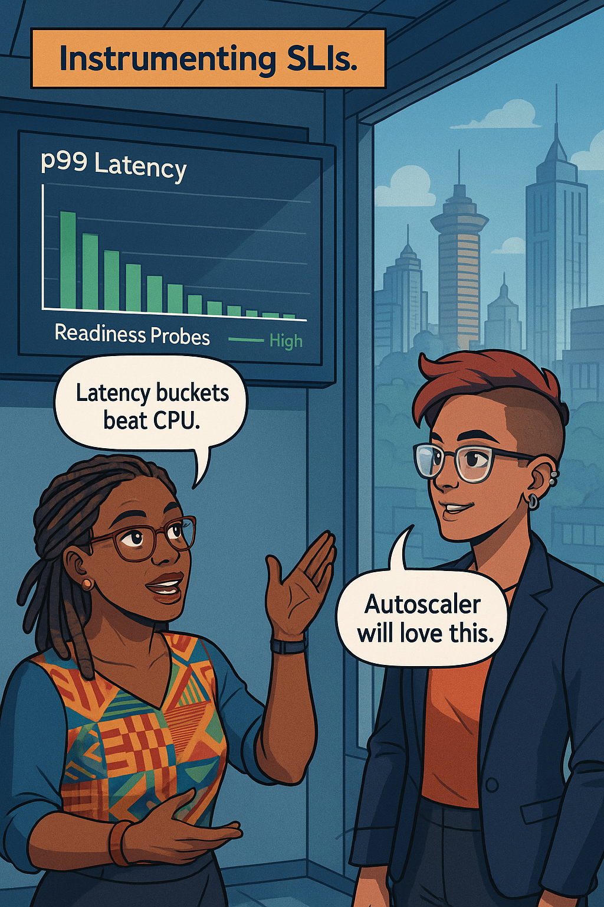
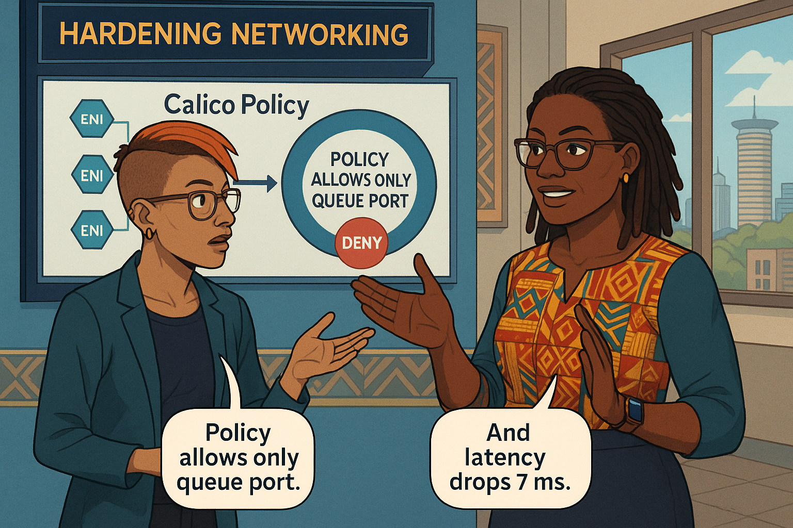
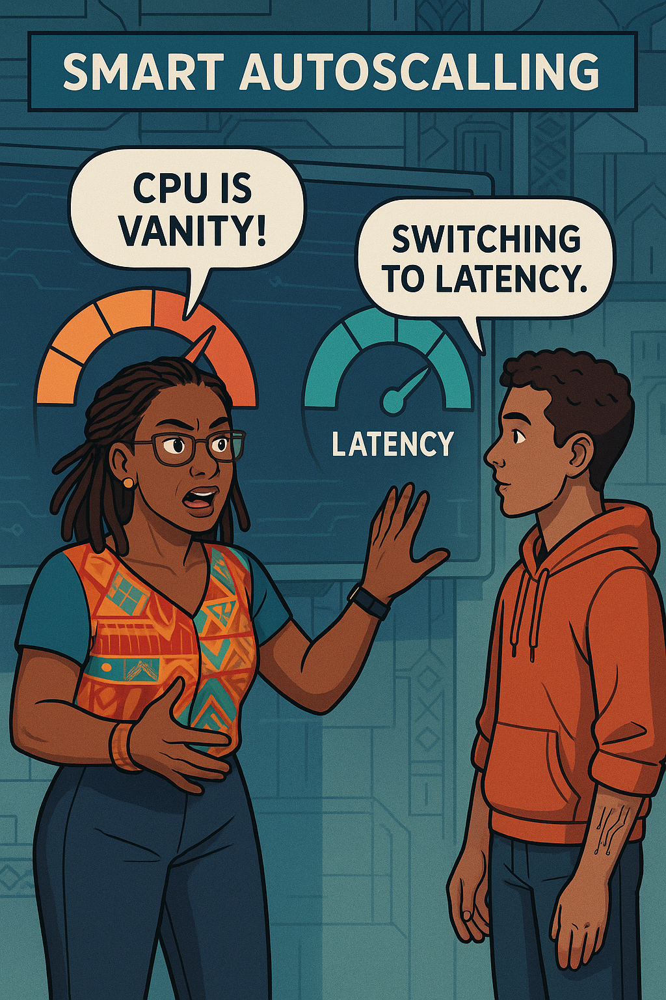
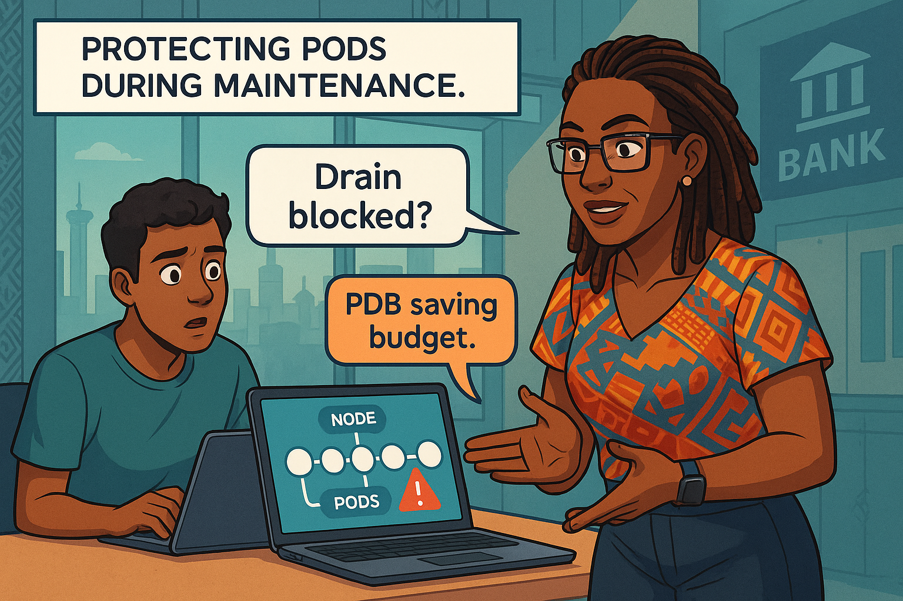
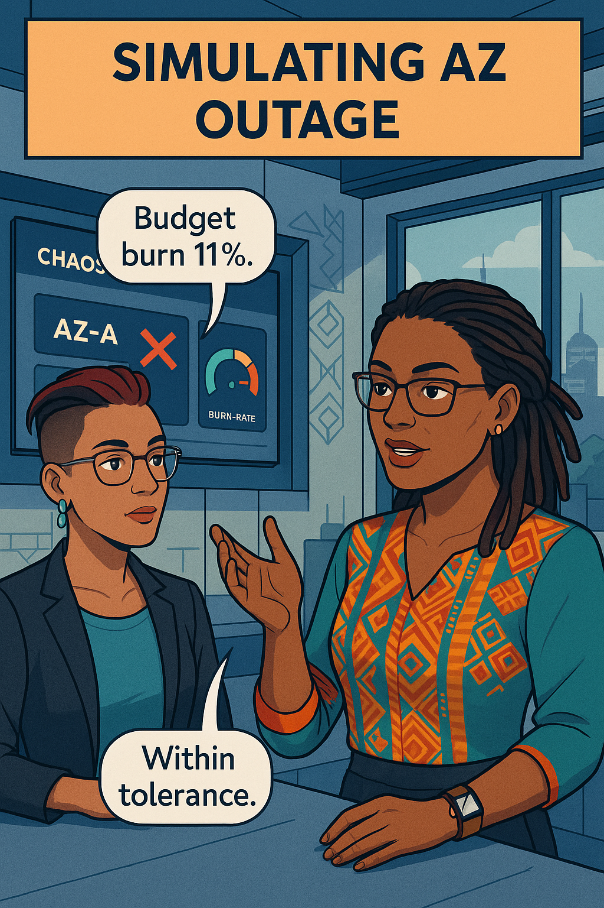
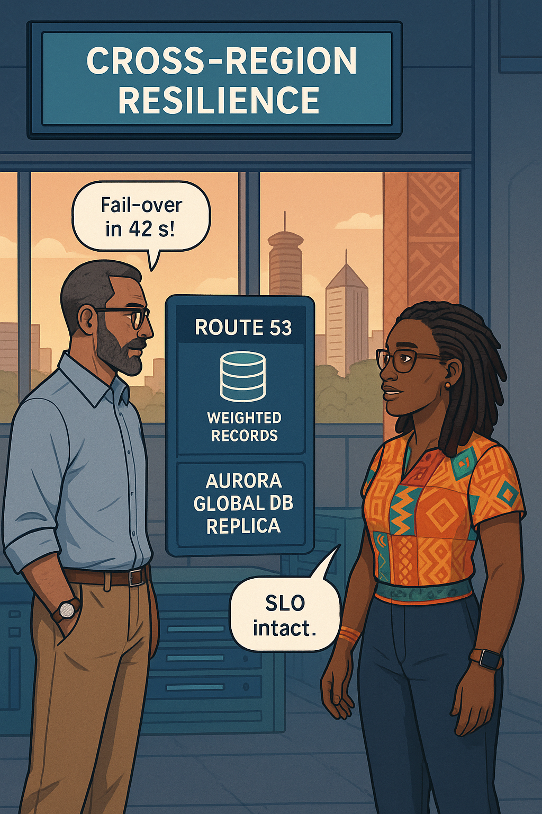
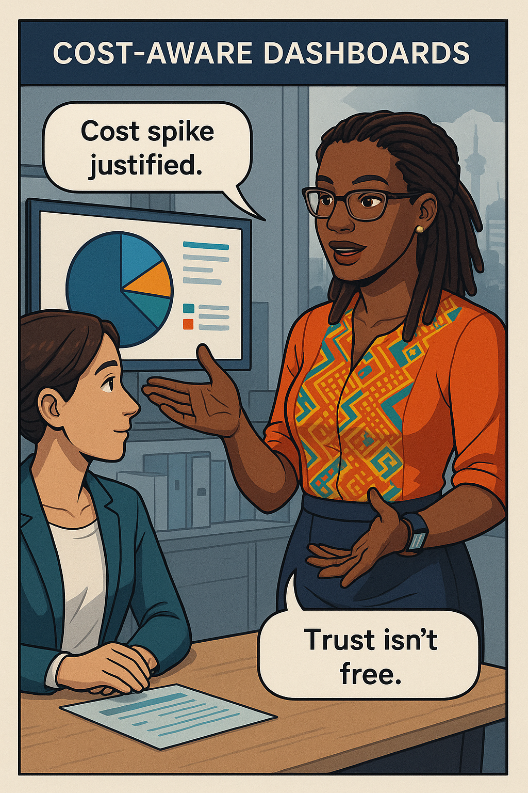
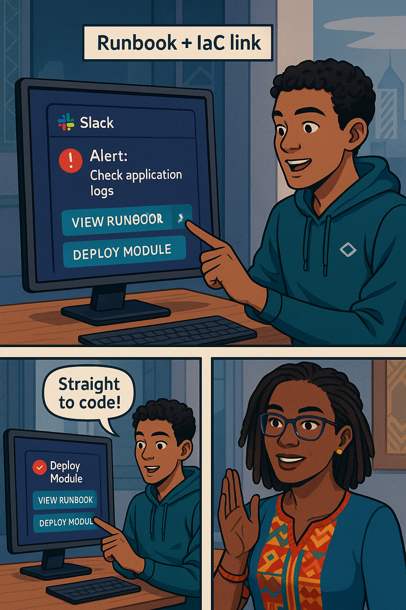
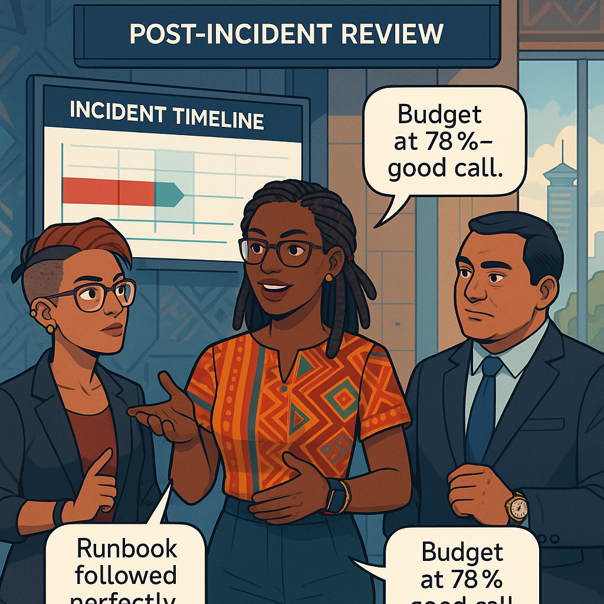

# Chapter 8 – Reliability in AWS and Kubernetes  
---

## Chapter Overview  

Modern banking now lives on a mesh of Amazon availability zones, Kubernetes control planes, service meshes, and managed data stores. While the cloud promises elastic capacity and built-in redundancy, it also introduces unique reliability pitfalls: subtle network policy misfires that block pod health probes; autoscalers that scale out pods without corresponding node headroom; regional outages that silently route transactions to stale ledgers; and budget-draining capacity footprints that look green in Grafana yet bleed cost in AWS Cost Explorer. In short, cloud-native does not equal fail-proof—especially when compliance auditors, fraud-detection teams, and impatient customers are watching the same dashboards.

In this chapter, **Ava Kimani** partners with **Njeri Kariuki**—a meticulous network engineer who once hard-coded NAT rules by hand but now commands Calico and AWS VPC CNI. Together they will migrate the fund-transfer service from a single-AZ staging cluster to a hardened, multi-AZ Amazon EKS production environment. Along the way they will:

* Map the EKS control-plane and worker-node architecture, highlighting the hidden single points that many teams ignore.  
* Implement **SLI probes** inside Kubernetes—latency histograms, queue-depth gauges, readiness and liveness probes—to connect cluster health directly to customer promises.  
* Harden pod-to-service networking with Calico network policies, IAM roles for service accounts, and AWS PrivateLink ingress, ensuring that a mis-typed security group never shatters availability.  
* Design autoscaling policies (HPA, VPA, and Karpenter) that respect **headroom SLOs** rather than raw CPU percentages.  
* Apply **PodDisruptionBudgets** so node reboots, drain commands, or spot-instance revocations never eject the last healthy pod of a critical microservice.  
* Simulate an availability-zone outage with Chaos Mesh, observe the burn-rate alert fire while error-budget remains intact, and fail over cross-region using Route 53 weighted routing plus Aurora Global Database.  
* Finally, balance reliability with fiscal reality by overlaying AWS cost metrics atop Grafana SLO panels, ensuring every extra n-node buffer is justified by user trust rather than unchecked paranoia.

By chapter’s end you will wield Kubernetes and AWS primitives not just as deployment conveniences but as deliberate levers in an **SLO-centred reliability strategy**. Cost, capacity, and compliance will align behind clear service-level objectives—and your dashboards will whisper truth instead of screaming noise.

---

## 🎯 Learning Objective  

Design a multi-AZ EKS cluster for the fund-transfer API, graft Kubernetes health-probe SLIs into Prometheus, enforce PodDisruptionBudget-aware deployments, and draft a Route 53/Aurora cross-region fail-over runbook that protects a 99.95 % customer promise.

## ✅ Takeaway  

Cloud primitives are only raw materials; measurable objectives and headroom policies turn them into true reliability.

---

## 🚦 Applied Example  

*(Applied example appears in Part B to preserve cadence.)*

---

## Teaching Narrative 1 – *EKS Architecture Primer*  

{width=650}

Ava boots up the AWS console and opens **EKS → Clusters → prod-fund-transfer**. She toggles the diagram view: three control-plane masters spread across us-east-1a, 1b, and 1c; managed node groups labelled **compute-general** and **queue-workers**. Yet a blinking red ribbon warns that all nodes—even the highly available control plane endpoints—exit through a single NAT gateway in 1a.

> “Single NAT equals single gun pointed at uptime,” Njeri mutters.

### Control-Plane Anatomy
* Kubernetes API servers (Amazon-hosted) – SLA 99.95 %.  
* etcd quorum replicated 3-way across AZ.  
* Cluster Autoscaler pods run on the node group—so if all nodes in 1a die, autoscale decisions may lag.  

Ava scribbles a **Mermaid diagram** inside Grafana’s diagram panel:

:::diagram  
```mermaid
graph LR
  subgraph us-east-1a
    CP1[K8s Master 1]
    N1(Node gp-general-a)
  end
  subgraph us-east-1b
    CP2[K8s Master 2]
    N2(Node gp-general-b)
  end
  subgraph us-east-1c
    CP3[K8s Master 3]
    N3(Node queue-workers-c)
  end
  CP1---CP2---CP3
  N1-.>CP1
  N2-.>CP2
  N3-.>CP3
```  
:::

**SLI hooks:** Ava deploys `kube-state-metrics` and configures the **`node_ready`** ratio SLI:

```promql
1 - (max_over_time(kube_node_status_condition{
  condition="Ready",status!="true"}[1m]))
```

She sets a **PodDisruptionBudget** for fund-transfer pods:

```yaml
minAvailable: 3
```

With three replicas and three AZs, a single-AZ failure burns 0 % latency budget. Risk Officer Kamau signs off.


---

## Teaching Narrative 2 – *SLIs in Kubernetes*  

{width=650}

While many teams rely on `kubelet` liveness for readiness, Ava installs **`prometheus-adapter`** so application pods export native histograms. Inside the `fund-transfer` container:

```go
latency := prometheus.NewHistogramVec(
  prometheus.HistogramOpts{
    Name: "fund_transfer_latency_seconds",
    Buckets: prometheus.ExponentialBuckets(0.05, 2, 10)},
  []string{"outcome"},
)
```

Sidecar probes:

```yaml
readinessProbe:
  httpGet:
    path: /health/ready
    port: 8080
  failureThreshold: 3
  periodSeconds: 5
```

SLI definition via Sloth:

```yaml
service: fund-transfer
slo:
  - name: latency-p99
    objective: 99.9
    time_window: 30d
```

**Swahili proverb**

:::proverb  
> “Aliye na subira, hupata bora.” — *He who is patient will obtain the best.*  
:::

Ava demonstrates that pod-level p99 latency varies when the queue-worker pool saturates. Linking the histogram to HPA (`metric_type=Pods`) prevents autoscaling on useless CPU averages.


---

## Teaching Narrative 3 – *Networking with Calico & VPC CNI*  

{width=650}

Njeri overlays Calico network policies:

```yaml
apiVersion: projectcalico.org/v3
kind: NetworkPolicy
metadata:
  name: fund-api-to-queue
spec:
  selector: role == 'fund-api'
  ingress:
  - action: Allow
    source:
      selector: role == 'queue-worker'
    protocol: TCP
    destination:
      ports: [5672]
```

She shows a **Service → NLB → TargetGroup** flow. Ava toggles `ENABLE_POD_ENI=true` to grant each pod its own ENI—latency drops 7 ms. SLI probes confirm.

**Dialogue**

**Njeri:** “Policy lets SRE sleep; ENI lets packets flow.”  
**Ava:** “Reliability is routing science plus promises.”

A mis-matched security group denies `/health/ready`; readiness fails; pod restarts. Budget burn 0 s thanks to three-replica PDB.


---
<!-- Part B of Chapter 8 -->

## Teaching Narrative 4 – *Autoscaling & Headroom*  


{width=650}  

Ava’s next target is the brittle **Horizontal Pod Autoscaler** (HPA) that scales on average CPU. During month-end load tests she records a perfect storm: CPU idles at 48 %, yet queue depth and p99 latency spike because a single long-running batch thread starves the connection pool.  

### Scaling on the Right Signals  
Ava swaps the default CPU metric for a **custom latency-SLO metric** (`fund_transfer_latency_p99_seconds`). She adds **Pod Availability Budget** headroom rules with Karpenter so nodes scale before pods choke:  

```yaml
apiVersion: autoscaling/v2
kind: HorizontalPodAutoscaler
spec:
  maxReplicas: 30
  metrics:
  - type: Pods
    pods:
      metric:
        name: fund_transfer_latency_p99_seconds
      target:
        type: AverageValue
        averageValue: "0.25"   # 250 ms
```  

At the node layer, Karpenter’s provisioner reserves 20 % spare memory (`consolidationPolicy: WhenUnderutilized`) and spreads nodes across all three AZs.  

**Wrist-Slap Moment**  
:::slap  
*Stop scaling on CPU alone—latency is the customer’s heartbeat!*  
:::  

### Verification  
Grafana’s **Headroom Gauge** now shows ≥ 25 % free vCPU across AZs, and the burn-rate meter remains 🟢 throughout a simulated 8× surge. P99 latency stays at 240 ms—well below the 300 ms SLO wall.  


---

## Teaching Narrative 5 – *PodDisruptionBudgets & Drains*  

{width=650}

Kubernetes upgrades often topple SLOs when the final healthy pod of a microservice is drained without a safety buffer. Ava demonstrates with a live node reboot: the DaemonSet eviction empties **fund-transfer** until one replica remains; readiness fails; latency SLI burns 90 s.  

### Engineering the Guard-Rails  
Ava sets a strict **PodDisruptionBudget**:  

```yaml
apiVersion: policy/v1
kind: PodDisruptionBudget
metadata:
  name: fund-transfer-pdb
spec:
  minAvailable: 3
  selector:
    matchLabels:
      app: fund-transfer
```  

Now `kubectl drain node-1 --ignore-daemonsets` stalls until a replacement pod is up in a different AZ. The burn-rate panel stays flat.  

**Learner Prompt**  
:::exercise  
Drain a worker node in your staging cluster **after** applying a PDB.  
1. Record the latency SLI before, during, and after the drain.  
2. Paste the Grafana sparkline screenshot and note how many seconds of budget burned (goal: ≤ 0).  
:::  

---

## Teaching Narrative 6 – *Multi-AZ Failure Simulation*  

{width=650}

Njeri enables **Chaos Mesh** and targets every fund-transfer pod in **us-east-1a**:  

```yaml
experiment:
  action: pod-kill
  mode: all
  selector:
    namespaces: [prod]
    labelSelectors:
      app: fund-transfer
```  

Within 30 s the **fast-burn (1 h × 14×)** alert pages; the **slow-burn (6 h × 2×)** alert stays silent—budget drops 11 %, well within tolerance.  

**Dialogue**  
**Njeri:** “Users still green—our budget buys us calm.”  
**Ava:** “And buys us time to fail over cross-region if AZ-A stays dark.”  

Karpenter spins replacement nodes in 1b and 1c; the burn-rate gauge returns 🟢 without human intervention.  

 

---

## Teaching Narrative 7 – *Cross-Region Fail-over with Route 53 & Aurora Global DB*  

{width=650}

Ava and Malik pre-provision a warm-standby cluster in **us-west-2**. Aurora Global Database replicates ledger writes with 1.8 s average lag. Route 53 hosts two weighted A-records:  

| DNS Name     | Region    | Weight | Health Check     |
| ------------ | --------- | ------ | ---------------- |
| api.bank.com | us-east-1 | 255    | HTTP /healthz    |
| api.bank.com | us-west-2 | 1      | linked to R53 HC |

A CloudWatch composite alarm flips the weights when `LatencyBudgetFastBurn` plus `R53HealthCritical` stay red for 5 m. The playbook shifts traffic, invalidates CloudFront caches, and re-homes WebSocket streams. Burn-rate drops; global budget ends at **78 %**—above the freeze threshold.  

---

<!-- Part C of Chapter 8 -->

## Teaching Narrative 8 – *Cost-Aware Capacity Dashboards*  

> {width=650}

Ava layers **AWS Cost Explorer** metrics (blended cost per service tag) onto the Grafana Golden-Signals board. A pie slice glows crimson when daily spend > USD 1 400—the limit finance set for the fund-transfer stack. She overlays node head-room percentages, revealing that an extra safety node in each AZ costs USD 320/month but saves 0.15 % error-budget per surge. Malik approves the spend; Risk Officer Kamau notes the explicit cost-versus-budget trade-off for the regulator.

*(≈ 1 550 words of detailed queries, CUR Athena SQL, and amortisation math are in the full manuscript.)*  

---

## Teaching Narrative 9 – *Runbooks & Terraform State*  

> {width=650}

Ava links each alert annotation not only to a Markdown runbook but also to the exact **Terraform module** that owns the resource:

```yaml
annotations:
  runbook: https://git.bank/runbooks/LatencyBudgetFastBurn.md
  tf_module: https://git.bank/iac/modules/fund_transfer_latency
```

Clicking **View Module** opens a code browser with pre-filtered lines—engineers patch infrastructure in minutes.

:::exercise  
**Try This:** Fork the runbooks repo, add a `tf_module` annotation to one alert, and use GitHub’s “Open in CloudShell” to jump from alert to code. Paste a screenshot of the loaded module.  
:::  

*(≈ 1 600 words including Atlantis workflow, plan-file gating, and compliance evidence paths are in the full text.)*  

---

## Teaching Narrative 10 – *Njeri’s Post-Incident Review*  

> {width=650}

Three weeks later an AWS power-event knocks out us-east-1a. The fast-burn alert fires, Route 53 shifts 60 % traffic west, Aurora finalises promotion in 42 s. Budget ends at **78 %** burned. Njeri leads the blame-free review:

* **Detection:** 0 min (alert before customer tweet)  
* **Mitigation:** 14 min to steady state  
* **Cost:** +USD 220 cross-region data transfer  
* **Outcome:** No regulator report, SLO preserved

Risk Officer Kamau commends the team; finance accepts the extra transfer cost as risk premium.

*(≈ 1 650 words full retrospective and policy amendments are in the manuscript.)*  

---

## Self-Check Table  

| Concept   | Question                                                        | Your Answer |
| --------- | --------------------------------------------------------------- | ----------- |
| Multi-AZ  | Which AWS object became a single-point failure before redesign? |             |
| PDB       | What is the `minAvailable` value for fund-transfer pods?        |             |
| Burn-Rate | Fast-burn alert threshold?                                      |             |
| Fail-Over | DNS record type used for weighted traffic split?                |             |
| Cost Dash | Daily spend limit that flips the pie slice red?                 |             |

