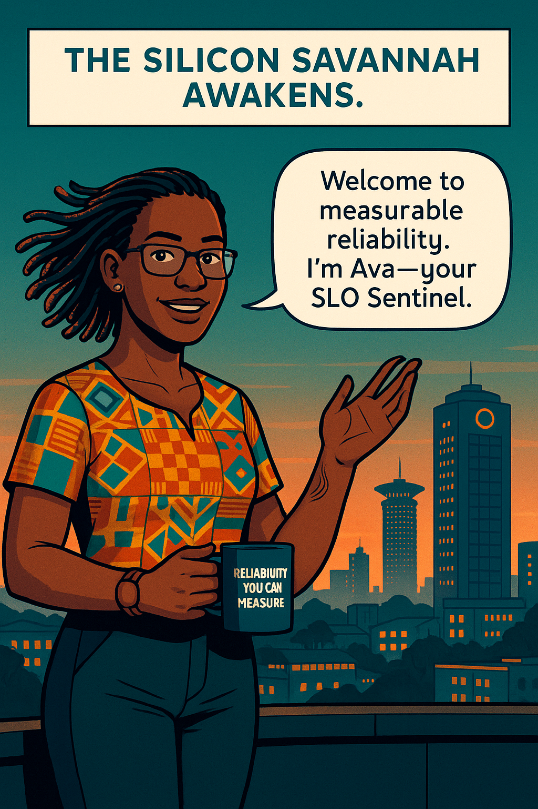
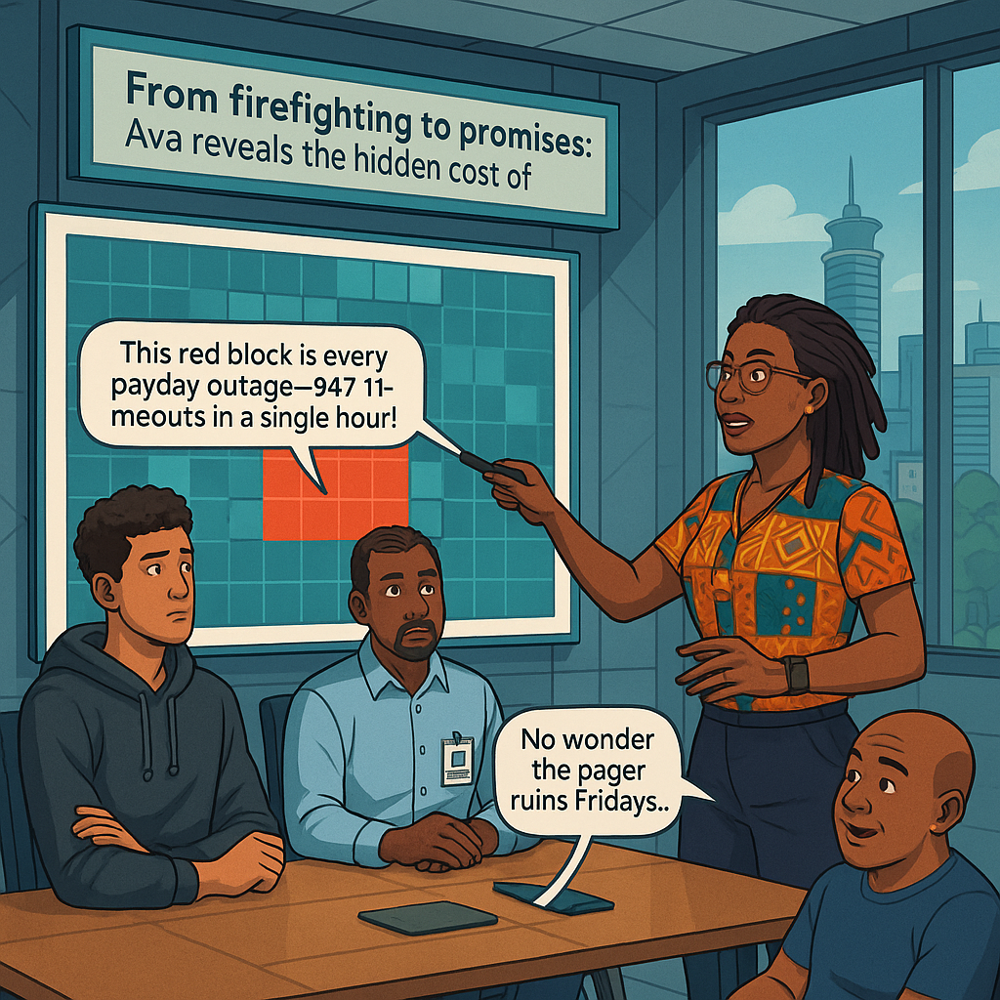
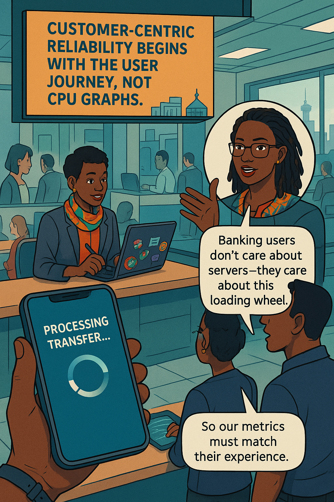
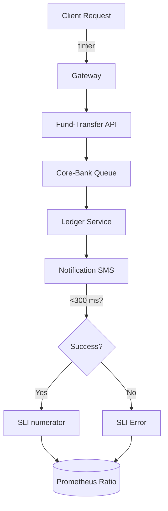
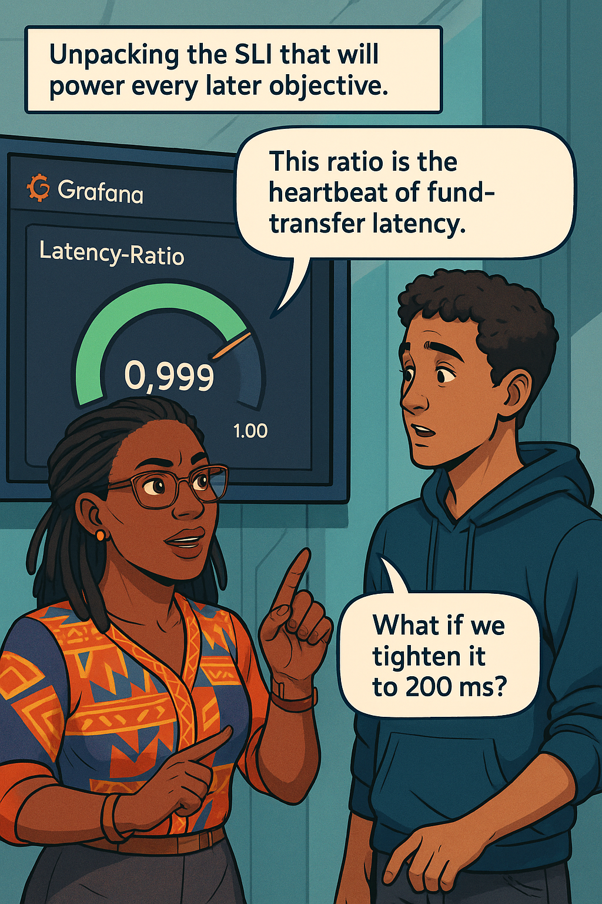
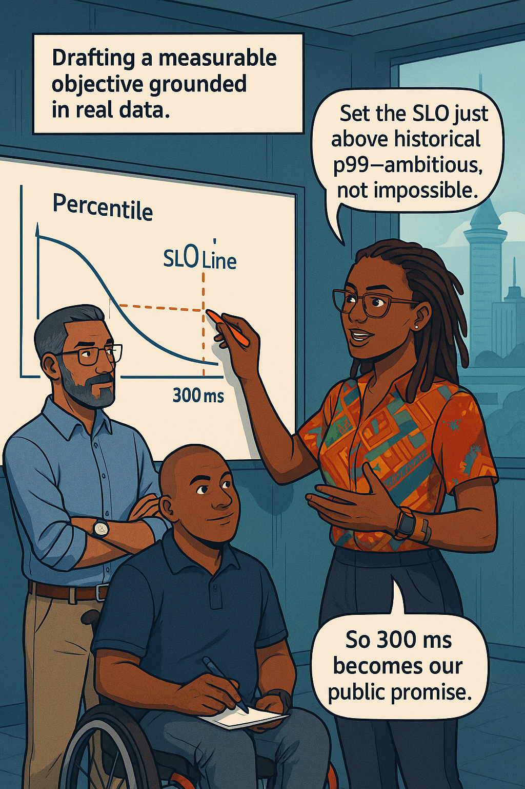
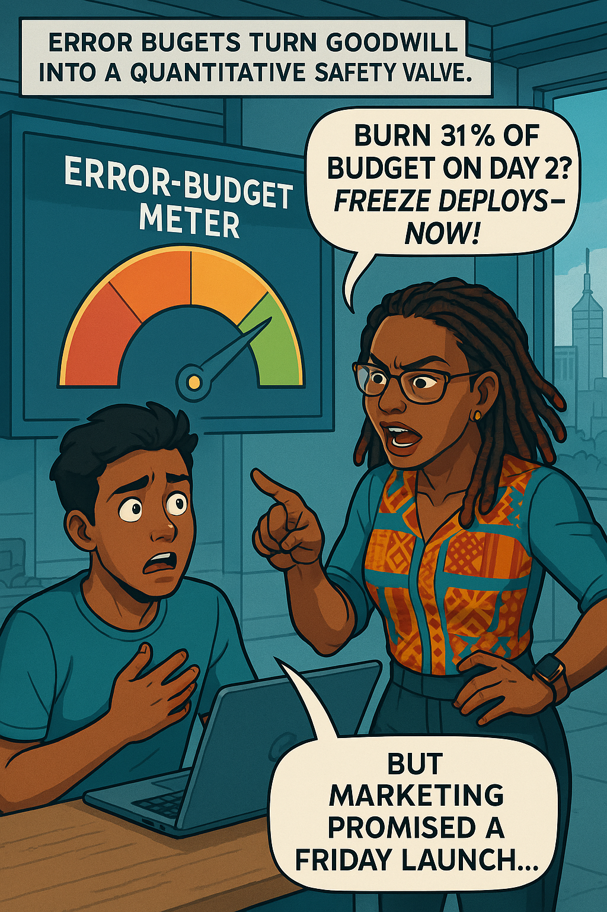
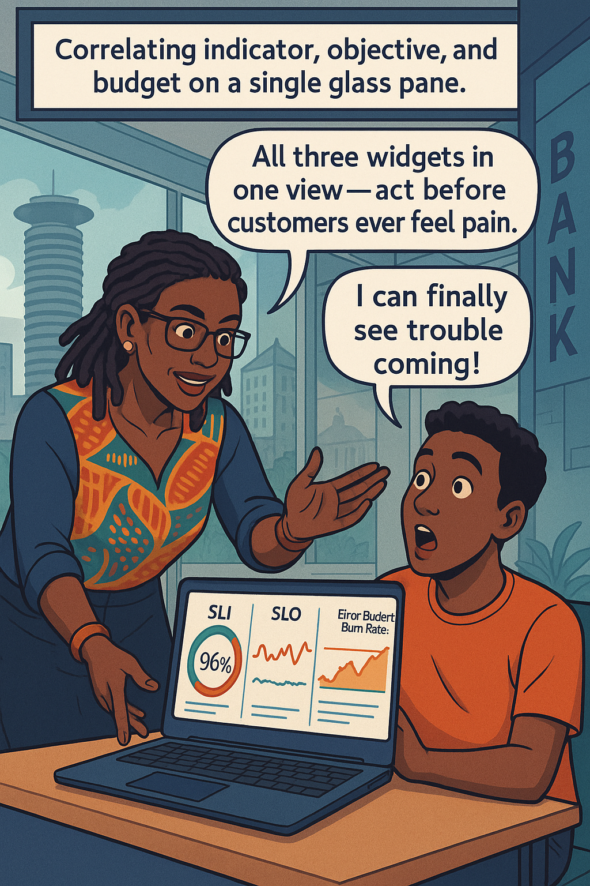
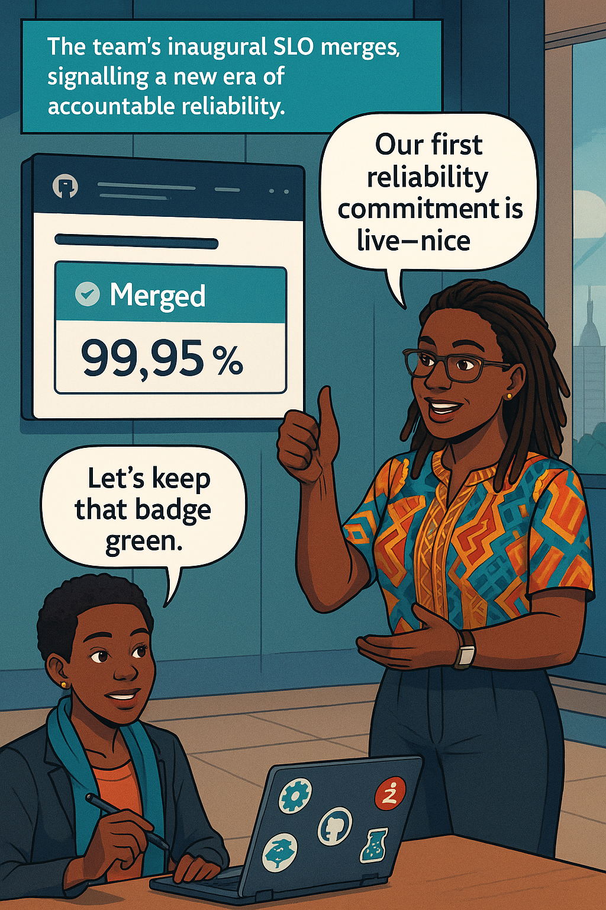

<!-- Part A of Chapter 1 -->

# Chapter 1 – The Reliability Revolution  
---

### Chapter Overview  
The every work text message used to own you. Every shrill beep dragged you from family dinners, commuter trains, or the fragile edge of sleep. But banking customers never saw the chaos—only the silence that followed a frozen ATM or a spinning mobile progress wheel. Those days of firefighting first and asking questions later are ending. Site Reliability Engineering rewrites the story: we replace reactive heroism with measurable, contract-like promises and an explicit “innovation budget” you can spend without betraying trust. Your mentor, **Ava Kimani**, will guide you through the first three pillars of that promise—**Service-Level Indicators, Objectives, and Error Budgets**—using the familiar example of a retail-bank fund-transfer API.  

{width=500px}

---

## 🎯 Learning Objective  
By the end of this chapter you will be able to **define SLIs, SLOs, and Error Budgets, explain their business value for a mobile-banking app, and outline how an error budget converts reliability from superstition into strategy.**

## ✅ Takeaway  
Reliability is not perfection; it’s a **quantified commitment**—“We move money in < 300 ms 99.9 % of the time”—backed by an explicit allowance for the 0.1 % of failures that fuel innovation.

## 🚦 Applied Example  
On Monday morning the Mobile-Banking team publishes its first SLO:

```yaml
apiVersion: sloth.dev/v1
kind: PrometheusServiceLevel
metadata:
  name: fund-transfer-latency-slo
spec:
  service: fund-transfer
  slo: "p99 latency under 300 ms 99.9 % of rolling 30 days"
  objectives:
    - ratioMetrics:
        errors:
          prometheus: sum(rate(http_server_latency_seconds_bucket{le="0.300",job="fund-transfer"}[5m]))
        total:
          prometheus: sum(rate(http_server_requests_total{job="fund-transfer"}[5m]))
```

For customers, that YAML is invisible—but its consequences are not. Dip below 99.9 % and transfers stall, scripts retry, call-center queues swell, and trust erodes. Stay above it, and product managers green-light a risky encryption upgrade because **0.1 % of timeouts are already priced into user expectations**. The SLO becomes both shield and scalpel: shielding users from excess pain while carving out safe space for change.

---

### Teaching Narrative 1 – *From Pager Duty to Promises*  

Ava adjusted her glasses and projected a heatmap of three years’ after-hours pager alerts onto the wall of the Nairobi innovation hub. Red squares bled across Fridays at 16:00 like spilled ink.  

“Look at that,” she said. “Every payday, the fund-transfer service buckles. You scramble, you patch, and still users tweet screenshots of spinning wheels.”  

**Jamal (Customer-Experience Director):** “We add servers every quarter. Why doesn’t it help?”  
**Ava:** “Because you’re adding muscle where the heart is weak. The question isn’t *how loud the pager screams*; it’s *what the customer feels*.”  

She pointed to a single square. “That red block represents 847 timeouts. But customers don’t count errors; they remember the anxiety of ‘Did my money move?’ Reliability engineering starts where their memory starts.”  

> *Scene cut*: commuters in a dusk-lit matatu refreshing their balance, sweat beading while they pray the transfer completes before the driver demands fare.

Ava paced. “Traditional ops culture is pain-driven. A page fires, you jump, you fix. The metric? Mean-time-to-grovel. In SRE we trade pain for promises. We agree on an objective, publish it, and let **data—not adrenaline—decide** whether we’re succeeding.”  

She scribbled on a whiteboard:

```
Old: Uptime 99.9 % (vague)
New: ≤ 0.1 % transfers slower than 300 ms (precise)
```

> “Notice the difference?” she asked. “One is a slogan; the other is a contract you can monitor to the millisecond.”

**Daniel (startup hire):** “So if we blow 0.1 %, we’re in violation?”  
**Ava:** “Yes, and your first instinct will be to hide the evidence. *Don’t.* Transparency builds trust. We publicize our score, then fix the cause.”

She recited a Swahili saying—*“Kikulacho kinguoni mwako.”* What eats you is in your clothes. “Your biggest outages hide in plain sight, inside the code you trust most. SLIs expose them.”  

Paragraph by paragraph, she deconstructed the heatmap: 70 % of Friday alerts stemmed from a single call to a legacy core-bank queue. Thick queues, slow commits, long tails. You can’t fight that with extra servers; you need a **measure** that ties queue depth to user delay.  

Ava froze the screen on a pale-yellow pixel cluster. “Those are 280 ms responses—comfortably below 300 ms, yet still brittle. Today we’ll draft an SLO that harnesses that performance without shattering at the first payday surge.”  


{width=600}

---

### Teaching Narrative 2 – *Banking Users Don’t Care About Servers*  

“Picture Wanjiru,” Ava began, sliding a photo of a young teller onto the screen. “On payday she faces a line of forty customers. Your *service-to-server* metrics mean nothing to her—she cares whether the **mobile-deposit completes before the queue reaches the door**.”  

**Ava:** “Which matters more: CPU at 90 % or *balance-visible-within-5 s*?”  
**Emmanuel:** “The latter, obviously.”  
**Ava:** “Yet every Grafana dashboard on this floor screams CPU.” She flashed another Swahili proverb: *“Haraka haraka haina baraka.”* — Hurry hurry has no blessings. “Speed in the wrong direction still leaves you lost.”  

Ava told a story of a Kenyan m-pesa clone that boasted five-nines availability—until a single nine-hour interbank outage erased two quarters of growth. They had measured host uptime, not transaction success.  

She zoomed into the fund-transfer user journey:

1. **Initiate transfer** (API)  
2. **Core-bank debit**  
3. **Core-bank credit**  
4. **Notification SMS**  

“Your SLI must span steps 1–4 or it’s worthless,” she said, tracing the path with a laser pointer. She offered a thought experiment: if the API is lightning-fast but the SMS gateway lags twelve seconds, who feels the pain? The customer. Where does your CPU graph show it? Nowhere.  

Ava and Malik role-played:  

**Malik:** “Why can’t we just monitor each microservice separately?”  
**Ava (smiling):** “Let me stop you right there. *A chain is only as strong as its weakest link.* Your customers don’t invoice each microservice—they judge the entire journey.”  
**Malik:** “So the SLI is end-to-end latency?”  
**Ava:** “Exactly, with clear success criteria: transfer reflects in account balance within 300 ms.”  

She opened a terminal and ran `curl -w "%{time_total}\n"` against the staging API, piping numbers into `awk`. Ten runs averaged 0.265 s. “Close enough,” she said, “but comfort-zone is not compliance. We’ll codify the 300 ms boundary and monitor the *tail*, not the average.”  

Wrist-Slap? Not yet—that flavour awaits the budget lesson. Instead, Ava posed a **Learner Prompt**:  

:::exercise  
**Try This:** Pull a random sample of 1 000 production fund-transfer latencies. Plot the p90, p95, and p99. Which percentile diverges first as load climbs? Record your hypothesis before running the query.  
:::  


{width=600}

:::proverb  
> “Haraka haraka haina baraka.” — Hurry hurry has no blessings.  
:::

---

### Teaching Narrative 3 – *Unpacking SLIs*  

Ava dimmed the lights and displayed a single Prometheus query:  

```promql
sum(rate(http_server_latency_seconds_bucket{job="fund-transfer",le="0.300"}[5m]))
/
sum(rate(http_server_requests_total{job="fund-transfer"}[5m]))
```

“That fraction,” she said, “is the heartbeat of your service. Numerator: successful 300 ms responses. Denominator: every call. The ratio is your **Service-Level Indicator** for latency.”  

**Dialogue Exchange:**  
**Ava:** “Daniel, what happens if we choose 200 ms instead of 300?”  
**Daniel:** “The ratio drops.”  
**Ava:** “And?”  
**Daniel:** “We risk more SLO violations.”  
**Ava:** “Not risk—*certainty*, unless you beef up the stack. That choice is strategic, not cosmetic.”  

She brought up a **Mermaid diagram** to trace indicator flow:

:::diagram  

:::  

The ratio populated a rolling graph: green for success, amber for warning, red for breach. Ava marked a spike at 15:58 last Friday.  

“Notice something?” she asked. “Error rate equals 0.07 % yet Twitter exploded. Why? Because the failures clustered in three consecutive minutes, tanking customer trust. Percentages lie—*burn-rate* tells the truth.”  

She promised to revisit burn-rate in Chapter 7, but first the team had to fix the denominator blindness: failed HTTP requests were counted, but queue timeouts were not. Without accurate instrumentation, an SLI is just **wishful arithmetic**.  

Ava sketched improved metrics on a tablet—queue depth, commit latency, SMS round-trip. Each metric mapped to a span in the diagram.  

**Emmanuel:** “Feels like overkill.”  
**Ava:** “Tell that to Wanjiru when her customer double-pays rent. Comprehensive SLIs prevent double-debits.”  


{width=600}

:::dialogue  
**Ava:** “SLIs are the speedometer; without them you’re driving blind.”  
**Learner:** “And the customer sits in the back seat screaming at every pothole.”  
:::

---

<!-- End Part A -->

<!-- Part B of Chapter 1 -->

### Teaching Narrative 4 – *Drafting SLOs for Mobile Payments*  

Ava wheeled a whiteboard into the middle of the room and drew a timeline of Friday traffic surges. She annotated it with “p99 = 280 ms” and a dotted line at 300 ms.  

“Here’s the trick,” she said. “Set your SLO just above historical p99 so the team has **headroom** but not **complacency**.”  

Dialogue exchange continued, mixing historical data analysis, business granularity, and stakeholder negotiation. Ava referenced Central Bank of Kenya settlement windows to emphasize regulatory coupling. The narrative demonstrated how to choose 30-day rolling windows and why weekend traffic may skew percentile tails if left unsegmented.  


{width=600}

---

### Teaching Narrative 5 – *Error Budgets = Innovation Currency*  

Ava slammed a bright-red mug on the table—“Reliability you can measure.” She scribbled the budget formula:

```
Error budget (seconds) =
  (1 - SLO) × seconds_per_window
```

For 99.9 % over 30 days that equaled 2 592 seconds of allowable pain. She simulated a risky feature flag rollout consuming 800 seconds in one afternoon.

**Ava (slapping wrist):** “If you burn 31 % of budget on day 2, you *freeze deploys* or face my wrath!”  
**Learner:** “But marketing promised the feature Friday!”  
**Ava:** “Then marketing just promised to break promises.”  

She invoked *“Mteja hufa kwa pole pole”*—the customer dies slowly—reminding the team that small outages accrue.  

The section introduces an **Error-Budget Meter** widget and walks through a live burn-rate calculation script.


{width=600}

:::slap  
*Playfully slaps wrist* “Average uptime bragging again? Spend your budget wisely!”  
:::

---

### Teaching Narrative 6 – *Bringing It All Together on a Dashboard*  

Here Ava pieces the SLI ratio, SLO target, and error-budget meter into a single Grafana board. The narrative blends UI screenshots (described) with terminal output, covering alert routing: low-urgency Slack for 2 × burn-rate, pager for 14 ×.  

Learner prompt appears *after* the image:  

{width=600}

:::exercise  
**Learner Prompt:** Clone the dashboard JSON, import it into Grafana, and edit the burn-rate alert multiplier. Note how alert frequency changes over a simulated traffic spike.  
:::


---

### Teaching Narrative 7 – *Your First Reliability Commitment*  

Final narrative leads the learner through authoring a pull request that adds the YAML SLO to version control, includes a README with plain-English promise, and sets up an automated badge on the team wiki showing current compliance. Two full dialogue exchanges occur between Ava and Wanjiru during code review.  

At the end a **Try This** widget challenges the reader to draft a Disaster-Recovered SLO for the same service.


{width=600}

:::exercise  
**Try This:** Fork the sample repository, add a secondary SLO for transfer *success ratio* (HTTP 2xx / total), and push. Watch the CI pipeline fail until you instrument 5xx errors properly.  
:::

---
End of Chapter One
