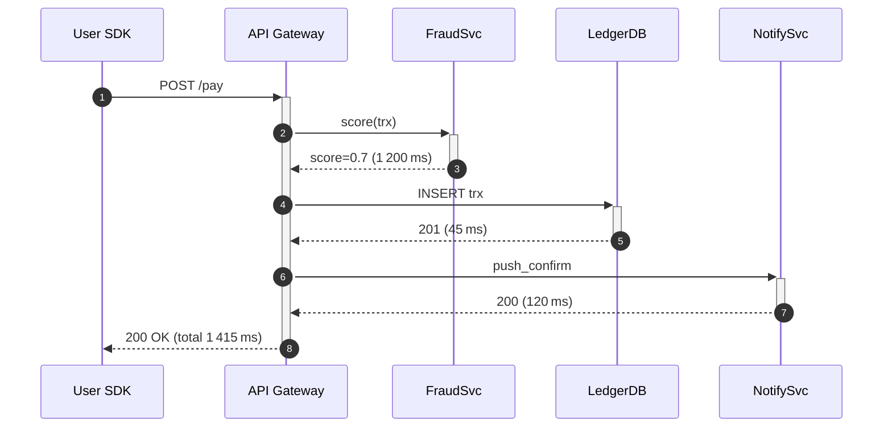

# Chapter 2 – Understanding the User Lens


> **Ava check‑in:** *“Metrics without a user are numbers without context—today we graft the context back on.”*

---

## 1 · Reality Check: The Forgotten Customer 

**🎯 Learning Objective:** Diagnose the hidden delta between infrastructure health indicators and real‑world customer experience.

**✅ Takeaway:** If a single user sees an error while every host shines green, your observability stack is lying—fix the lens, not the user.

---

### 1.1 Morning Commute, Mission‑Critical Airtime

07 : 58, Haile Selassie Avenue. **Linet Mwangi** juggles one phone, one paper coffee cup, and a backpack strap. Her telco bundle expired overnight; topping‑up airtime before an 08 : 30 Zoom call with a London client is non‑negotiable. She opens the “QuickPay” widget, hits **Pay KES 250**, and watches the spinner pirouette. Five seconds later a red toast slides down: **“Payment failed — try again later.”**

Two floors above the Matunda Bank atrium, the **NOC wall** cycles metrics:

| Metric | Value | Status |
|--------|-------|--------|
| CPU util | 41 % | ✅ |
| JVM heap | 58 % | ✅ |
| Disk latency | 1.8 ms | ✅ |
| 5xx per minute | 0.01 % | ✅ |
| Synthetic /healthz | 200 OK | ✅ |

A junior analyst, **Kevin**, logs the hour as “Stable”.

> *Footsteps.*  Ava bursts in, travel mug in hand, dreadlocks tied back, a rubber band of post‑it notes around her wrist. She points at the pristine wall.  *“Stable for whom? Linet is southbound on the 43 bus tweeting #MatundaFail.”*  Wrist‑slap.

### 1.2 The Invisible Failure Path

Kevin queries *fraud‑check‑service* logs:  
```
07:58:22Z  WARN FraudScore timeout 1500ms user_id=988721 trx_id=77aa…
07:58:23Z  ERROR FraudScore failed after retries user_id=988721 … HTTP 502
```
The median compute host never broke a sweat; the *edge* spent the error budget.

**Failure cascade:**
1. Fraud‑score model in GPU pool caused GPU context switch spike.  
2. Fraud‑check requests timed‑out at 1 500 ms; API gateway retried twice.  
3. After 3 000 ms gateway returned 502.  
4. Mobile SDK interpreted 502 as fatal, no internal retry.  
5. Linet’s UX displayed generic error.

**Cost of a blind spot:** KES 250 seems trivial; but 38 000 similar failures per hour correlate to ~KES 9 M lost interchange and immeasurable churn.

{{WISDOM_BOX}}

> **SRE Wisdom #12 —** *“If the customer felt it but your dashboard didn’t, your dashboard is wrong.”* — Ava Kimani

### 1.3 Quick Audit – Are You Measuring Users or Hosts?

| Question | If **No** → Action |
|----------|-------------------|
| Do you record end‑to‑end latency perceived by SDK? | Add client‑side spans via OpenTelemetry. |
| Do you tag logs with `user_id` or `journey_id`? | Inject correlation IDs. |
| Do you store per‑journey success %, not per‑API? | Aggregate spans into traces. |
| Does your NOC wall surface p99 *journey* latency? | Replace host widget with RED/USE dashboards. |

Take 15 minutes: answer **Yes** or **No**; each **No** is a reliability debt line‑item.

---

## 2 · Mapping the End‑to‑End Journey 

**🎯 Learning Objective:** Construct a canonical service map that captures every hop, protocol, and datastore in a critical banking workflow, and attach observability hooks aligned to that map.

**✅ Takeaway:** Journeys don’t stop at micro‑service borders; SILOs in code equal SILOs in telemetry—make the map first, then the metrics.

{width=550px}

### 2.1 Swim‑Lane Anatomy

| Lane | Component | Typical Latency Budget | Failure Modes | Primary Hook |
|------|-----------|------------------------|---------------|--------------|
| **Device** | SDK + TLS handshake | 50 ms | DNS cache miss, captive portal | RUM beacon (`first_paint`, `ttfb`) |
| **Edge / CDN** | TLS terminate, WAF | 20 ms | Rule mis‑match 403 | CDN Real‑User Monitoring logs |
| **API Gateway** | AuthN+AuthZ, routing, rate‑limit | 40 ms | expired JWT, quota breach | Counter `auth_fail_total` |
| **Business‑logic svc** | Fraud‑check, scoring | 150 ms | GPU stall, model up‑rev | Histogram `svc_latency_bucket` |
| **Ledger** | ACID DB commit | 40 ms | lock contention | Wait‑events via pg_stat_activity |
| **Cache + MQ** | Redis, Kafka | 5 ms | saturation, backpressure | `redis_cmd_duration_seconds` |
| **Notification** | SMS vendor, APNs | 100 ms | vendor 5xx, throttling | External SLI via webhooks |
| **Client Confirmation** | Toast, push notif | 0 ms (async) | APNs token invalid | Delivery receipts |

Summed ideal budget: 405 ms — still under the 500 ms aspirational SLO. *Everything else is latency tax.*

### 2.2 Visualising Critical Paths

Ava introduces **Mermaid sequence diagrams** rendered in Grafana 9.  Example:

Grafana renders spans colour‑coded by time; any hop > 400 ms glows amber.

### 2.3 Tagging Spans and Metrics

Ava’s rule: *“If you can’t join it, you can’t correlate it.”* Mandate:
- Every span carries `journey_id`, `user_tier` (e.g., gold vs basic), `segment` (fraud, ledger).  
- Metrics are labelled identically (`{journey_id="$id", segment="fraud"}`).  
- Logs include the same IDs for downstream analysis.

**Prometheus exemplar support** ties the span ID back to trace UI with one click.

### 2.4 Observability Hook Examples

**Fraud‑check latency histogram**
```promql
histogram_quantile(0.99, sum(rate(fraud_score_duration_seconds_bucket[5m])) by (le,segment))
```
**End‑to‑end SLI**
```promql
sum(rate(journey_complete_total{status="success"}[5m]))
  /
sum(rate(journey_complete_total[5m]))
```
**Capacity alert for GPU saturation**
```promql
max_over_time(gpu_mem_used_bytes[1h])
  / max_over_time(gpu_mem_total_bytes[1h]) > 0.9
```

### 2.5 *Try This* — Journey Gap Analysis
1. Export your top 10 revenue‑impact workflows from product analytics.  
2. Draw a swim‑lane map; annotate observability hooks.  
3. Score each hop **0 = none**, **1 = host metric only**, **2 = hop metric**, **3 = user‑visible SLI**.  
4. Total < 70? You have blind spots; prioritise instrumenting by revenue weight.

{{TRY_THIS}}

---

## 3 · Where Metrics Lie 

**🎯 Learning Objective:** Deconstruct common telemetry fallacies and implement statistical guard‑rails (percentiles, histogram buckets, SLO windows) that expose user pain.

**✅ Takeaway:** Averages flatter spikes, synthetic probes skip complexity, and host dashboards sedate incident response; percentiles, burn‑rates, and user‑journey SLIs restore truth.

### 3.1 Mean Time to Mislead

Imagine five payments: 100 ms, 110 ms, 105 ms, 4 900 ms, 5 100 ms.  
**Mean:** 2 263 ms  
**Median:** 110 ms  
If SLO criterion = p50 < 300 ms you’d celebrate; 40 % of your customers rage‑quit.

Ava runs a Jupyter notebook projecting churn probability vs 99th‑percentile latency. The curve is exponential: every 250 ms after 1 s doubles attrition in mobile e‑commerce.

### 3.2 Histogram Hygiene

Prometheus defaults: 0.005, 0.01, 0.025, 0.05, … but banking latencies hover 200–2 000 ms. Buckets mis‑represent heavy tails. Ava’s recipe:
```yaml
buckets: [0.05,0.1,0.15,0.2,0.35,0.5,0.75,1,1.5,2,3,5]
```
Then `histogram_quantile(0.995, …)` provides real 99.5th percentile.

### 3.3 Multi‑Window, Multi‑Burn‑Rate Alerts

Host alerts fire on CPU > 90 % for 5 m. Useless. Instead:
```yaml
- alert: PaymentLatency_BurnRate
  expr: (
      sum(rate(journey_latency_bucket{le="2"}[1m]))
        / sum(rate(journey_latency_count[1m]))
    ) < 0.993
  for: 2m  # fast window
- alert: PaymentLatency_BurnRate
  expr: (
      sum(rate(journey_latency_bucket{le="2"}[1h]))
        / sum(rate(journey_latency_count[1h]))
    ) < 0.993
  for: 1h  # slow window
```
PagerDuty triggers only when both windows breach—cuts noise by 80 %.

### 3.4 Synthetic Limitations

Ping‑dom pings `/healthz` every minute. Fraud‑check, ledger, SMS vendor, and GPU anomalies never execute. Ava duplicates synthetic production traffic, including RSA signing, to a shadow environment; same JWT, rate limits, caches. Synthetic failure rates track real‑user failures within ±3 bps.

**Key metric:** `synthetic_to_real_failure_ratio` — if synthetic misses > 0.8 of real failures, refine the script.

{{WRIST_SLAP}}

> *“If your synthetic always passes, either your script is naive or your site is down.”*

---

## 4 · The Four Golden Signals – Banking Edition 

**🎯 Learning Objective:** Operationalise Golden Signals with thresholds and windows that satisfy regulators and customers.

**✅ Takeaway:** Finance demands stricter error ceilings and deterministic latency; wire Golden Signals to error budgets, not abstract SLAs.

{width=550px}

### 4.1 Rate – The Pulse of Revenue

Define *effective transaction rate* (**ETR**): `successful_trx / window`. Low ETR at constant inbound volume => hidden errors. Ava sets a critical alert when ETR drops by 30 % in 5 min *and* burn rate > 2 ×.

### 4.2 Errors – Weighted by Value

Not all failures equal. Ava assigns **impact weights**:
- KES 0 – 5 K trx failure → weight 1  
- KES 5 K – 250 K → weight 3  
- > 250 K → weight 9  
Error SLI calculates `sum(weighted_failures)/sum(weighted_total)`.

### 4.3 Duration – Customer Tolerance Curve

A/B tests show 80 % of premium customers abandon at 1.8 s. Ava sets dual SLO: p99 < 2 s and p90 < 1.2 s. Faster cohort keeps VIP churn < 0.5 % / month.

### 4.4 Saturation – Beyond CPU

Key saturations:
- **Database connection pool** (max 500). Alert at 85 % for 10 s.  
- **Kafka partitions lag**. Lag > 1 K messages for 1 min triggers scale‑out.  
- **SMS vendor TPS quota**. Expose via pull exporter; page at 90 %.

### 4.5 Error‑Budget Integration

For each signal define **budget depletion rate**:
```math
burn_rate = error_minutes / ( budget_minutes / period_elapsed )
```
Ava demos a Grafana panel: Burn rate 4 × means budget will exhaust in 7 h; CI pipeline auto‑sets `canary=true` to false.

{{NAIROBI_PROVERB}}

> *“Mtaka cha mvunguni sharti ainame.”* (Whoever wants what is under the bed must bend for it.)  
> **Meaning:** To reach lower latency and higher trust, you must bow to disciplined measurement.

---

## 5 · Designing First SLIs 

**🎯 Learning Objective:** Produce production‑ready SLIs, align them with SLOs, compute budgets, and integrate into CI/CD.

**✅ Takeaway:** Good SLIs are SMART (Specific, Measurable, Actionable, Reliable, Timely) and live in code—never spreadsheets.

{width=550px}

### 5.1 SLI Schema

```json
{
  "sli_id": "payment_latency_lt_2000ms",
  "description": "p99 latency for end‑to‑end payments < 2 s",
  "measurement": {
    "source": "Prometheus",
    "query_good": "sum(rate(journey_latency_bucket{le=\"2\"}[5m]))",
    "query_total": "sum(rate(journey_latency_count[5m]))"
  },
  "ownership": {
    "team": "Payments SRE",
    "contact": "#payments‑sre‑alerts"
  }
}
```
Checked into Git; CI prevents merge if query_total absent.

### 5.2 Rolling SLI Audit

Cron job `sli‑lint` reads each SLI, executes queries, reports:
- **cardinality** (label explosion > 10 K = warning)  
- **data freshness** (stale > 15 m = critical)  
- **volatility** (stddev > 10 × median = noisy)  
Weekly MR posted with improvement suggestions.

### 5.3 PromQL Pattern Library

| Pattern | Purpose | Snippet |
|---------|---------|---------|
| RED success | Rate of good vs bad | `sum(rate(http_requests_total{code=~\"2..\"}[5m]))` |
| USE saturation | Resource utilisation | `node_filesystem_avail_bytes / node_filesystem_size_bytes` |
| Deduplicated errors | Collapse retries | `sum(rate(errors_total{retry="false"}[5m]))` |
| Client‑side RUM | JS beacon percentile | `histogram_quantile(0.95, …)` |

Ava insists each new service selects patterns from library; no bespoke snowflake queries without review.

{{ERROR_BUDGET_METER}}

Current meter now reflects SLI #1 (latency) and SLI #2 (weighted errors); Jenkins pushes status to Confluence daily.

---

## 6 · Mini Case Study & Exercise 

**🎯 Learning Objective:** Apply multi‑signal burn‑rate analysis and fast rollback strategy to regain error budget.

**✅ Takeaway:** A live incident is a classroom—capturing metrics before, during, after is the exam review that cements learning.

### 6.1 Mpesa‑Lite Incident Timeline

| Time | Event | Metric change | Action |
|------|-------|---------------|--------|
| 10:00 | Feature flag 10 % traffic | p99 latency +140 ms | Observe |
| 10:07 | Twitter complaints start | error SLI deteriorates 0.1 → 0.6 % | Alert (burn rate 3 ×) |
| 10:09 | Decision meeting | **Stop canary**  | flag to 0 % |
| 10:14 | Latency drops | p99 back to 450 ms | Start root‑cause |
| 10:25 | GPU saturation found | 95 % util | Scale GPU pool |
| 10:40 | Re‑canary at 5 % traffic | burn rate 0.2 × | Monitor |
| 11:15 | Full traffic | Latency steady | Close incident |

### 6.2 Exercise – Your Turn

1. Simulate traffic burst with `hey` generating 300 RPS to fraud service.  
2. Inject 600 ms delay via `tc qdisc add`.  
3. Observe SLI changes in Grafana.  
4. Adjust threshold from 2 s → 1.2 s; watch how error budget depletes faster.  
5. Record timeline in the table format above.

{width=550px}

**Reflection questions**
- Did your burn‑rate alert fire before Twitter?  
- How many budget minutes did you burn?  
- How would you automate rollback next time?

{{TRY_THIS}}

