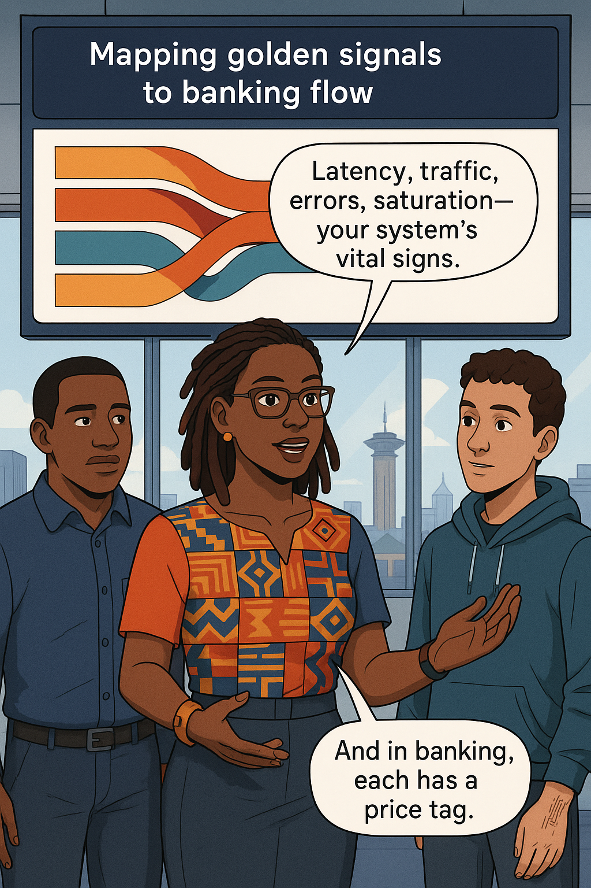
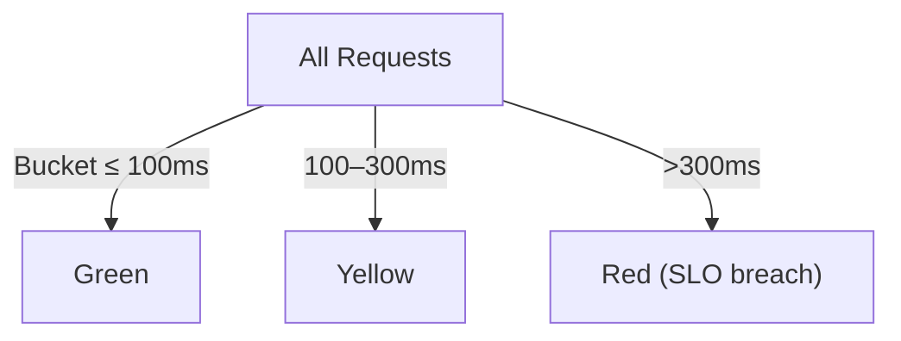
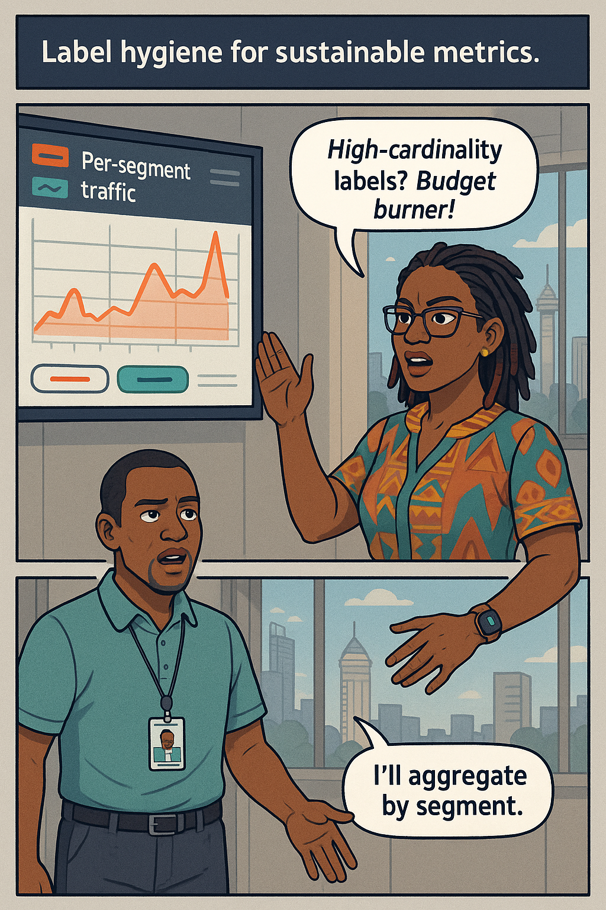
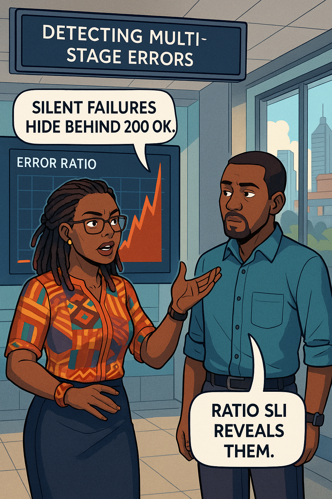
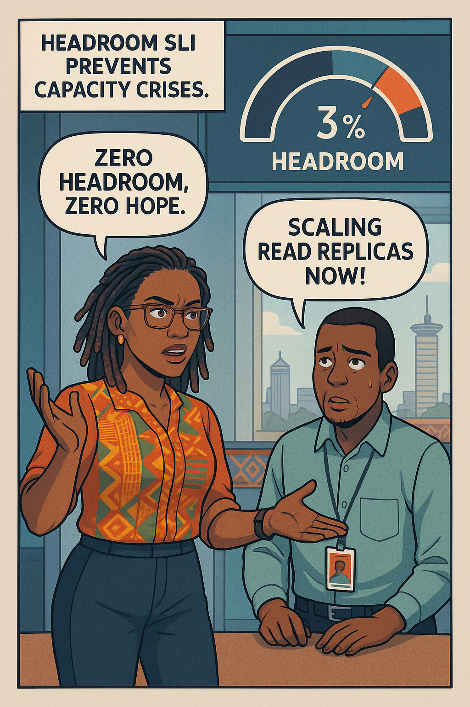
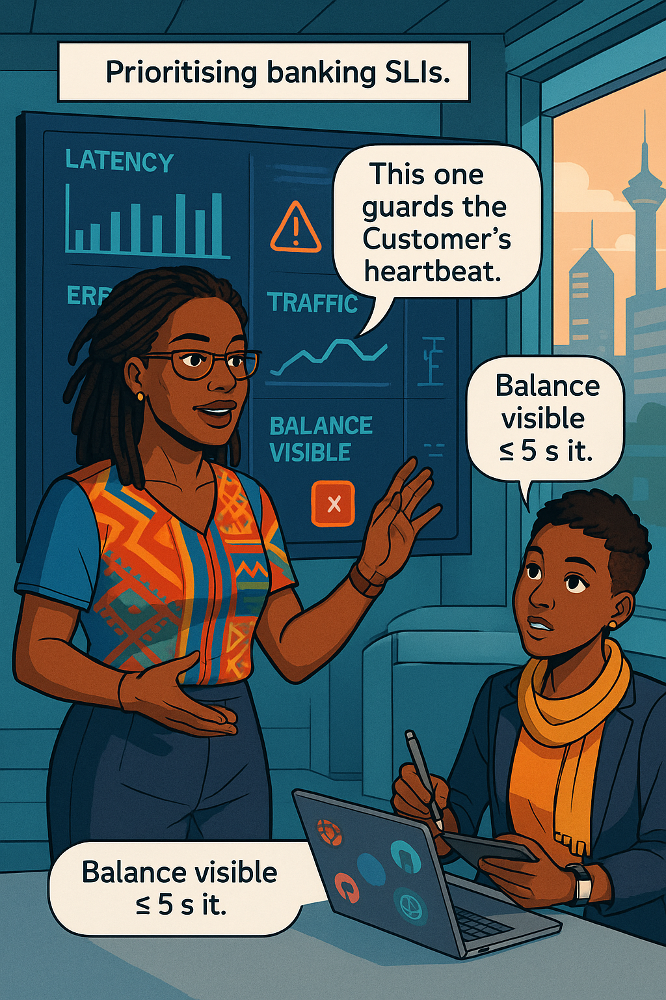
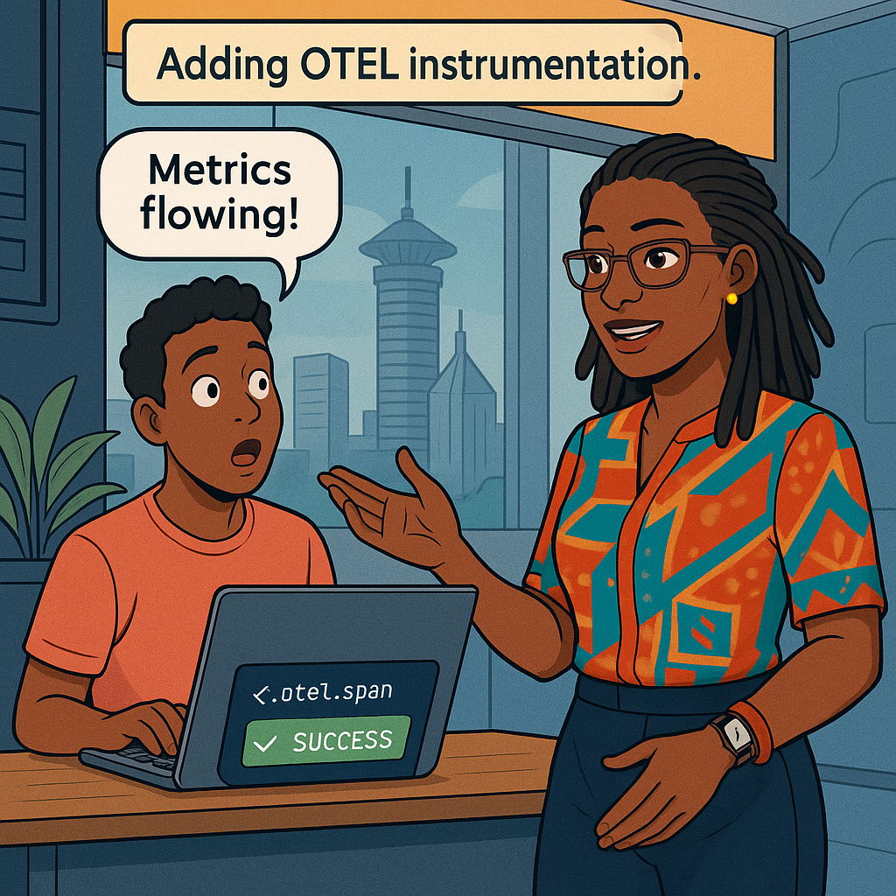
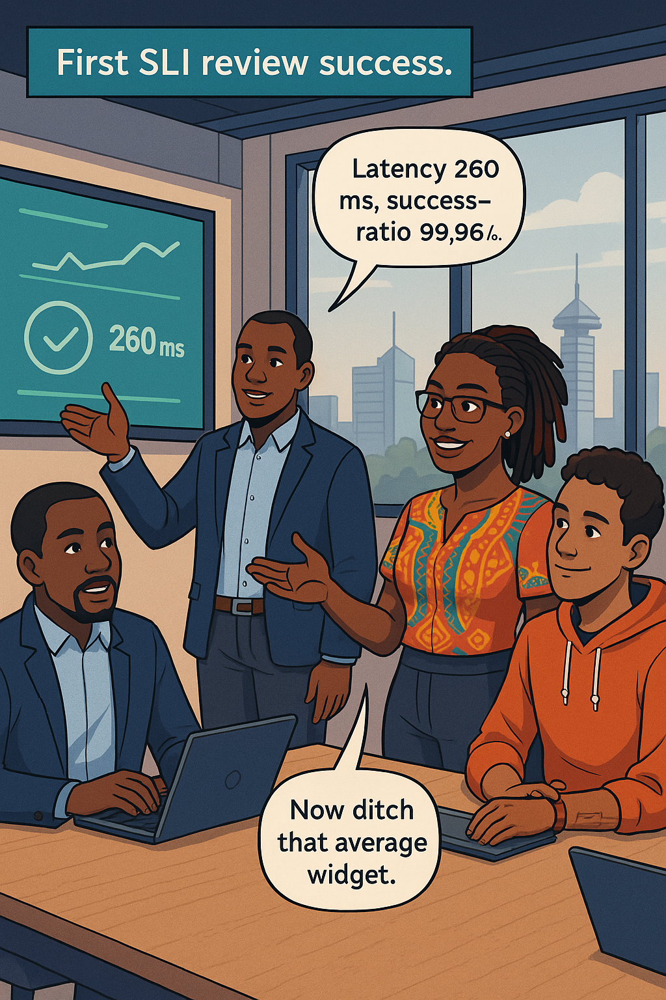

# Chapter 3 – Measuring What Matters: SLIs  


## Chapter Overview  

Emmanuel, a night-shift production-support veteran, has spent years parsing endless log scrolls after midnight batch failures. Ava Kimani promises to swap his flashlight for **Service-Level Indicators (SLIs)**—high-fidelity, quantitative beacons that reveal systemic truth long before an outage trends on X. In this chapter you will learn how the **four golden signals** (latency, traffic, errors, saturation) translate into banking-specific SLIs such as *balance-visible latency* and *queue-depth headroom*. By the end, Emmanuel’s pager will chirp not because servers scream, but because carefully chosen ratios whisper risk.

---

## 🎯 Learning Objective  

Design, instrument, and validate SLIs—rooted in latency, traffic, errors, and saturation—that expose user-impacting degradation in retail-banking systems before customers feel pain.

## ✅ Takeaway  

A single well-designed SLI is worth a thousand grep commands; it frames reality in a ratio the whole bank can understand.

## 🚦 Applied Example  

Friday evening traffic spikes 6 × normal. Grafana shows CPU at 42 %, yet users report stalled fund transfers. Ava overlays a rolling **p99 latency SLI**—300 ms objective, now 470 ms—and an **error-ratio SLI**—99.9 % objective, now 98.2 %. System metrics looked calm because thread pools queued requests; the SLI ratios exposed the truth. After readjusting pool limits the indicators return green within 12 minutes—five hours before the first pager would normally fire.

---

## Teaching Narrative 1 – *What Makes a Good Indicator?*  

Emmanuel’s eyes blur while tailing `corebank.log`. It’s 02:07 AM and a deluge of “timeout waiting for debit confirmation” lines scroll by. Ava slides in a chair, coffee mug steaming.  

**Ava:** “Logs after midnight? Pole sana, but there’s a smarter way.”  
**Emmanuel:** “Logs tell me everything.”  
**Ava:** “They tell you **what** happened, not **how often** or **how bad**.”  

She types a single PromQL expression:

```promql
1 - (sum(rate(corebank_errors_total[5m]))
     / sum(rate(corebank_requests_total[5m])))
```

A green line hovers at 99.98 %. Ava flips a toggle to view **p99 latency**: 295 ms—close to the 300 ms objective.

> **Scene:** Emmanuel realises that two numbers—latency p99 and success-ratio—capture more truth than ten thousand log lines.

**Dialogue exchange continues**:

**Emmanuel:** “So an SLI is just a query?”  
**Ava:** “A query with purpose: business relevance, clear thresholds, and historical context.”  
**Emmanuel:** “Logs feel like candles. This is daylight.”  
**Ava:** “Karibu—welcome to proactive ops.”  

She summarises SLI criteria—*valid*, *reliable*, *signal-to-noise*, *scalable*, *cheap to gather*. Together they label Emmanuel’s query: **valid & cheap**. Ava challenges him to refine cardinality for scale.

{width=600}

---

## Teaching Narrative 2 – *The Four Golden Signals in Banking*  

Ava projects a Sankey diagram of a payment journey: mobile app → gateway → microservice → core bank → regulator feed. Overlaid are coloured ribbons representing **Latency**, **Traffic**, **Errors**, **Saturation**.

She narrates:

* **Latency:** user perceives delay, regulator perceives SLA breach.  
* **Traffic:** request volume predicts capex; volume surges precede saturation.  
* **Errors:** HTTP 5xx, business-logic rejections, fraud blocks.  
* **Saturation:** thread pools, DB connections, MQ depth.

**Swahili proverb moment**:  

:::proverb  
> “Ukiona vyaelea, vimeundwa.” — *If it floats, someone built it carefully.* A healthy metric floats because you engineered for it, not by chance.  
:::

Ava demonstrates a Grafana dashboard where each golden-signal panel turns amber exactly one minute before Twitter complaints spike, aligning technical and sentiment signals. Emmanuel sees correlation 0.91 between saturation headroom < 10 % and complaint surge.

{width=600}

---

## Teaching Narrative 3 – *Latency: Beyond the Mean*  

**Ava:** “Averages are a liar’s comfort blanket.” She draws three distributions—slow tail, bimodal, Gaussian—each with the same mean but wildly different p99. Using `histogram_quantile()` she compares p95 and p99 curves:

```promql
histogram_quantile(0.99,
  sum(rate(api_latency_seconds_bucket{le!="+Inf"}[5m])) by (le))
```

Emmanuel overlays payroll-day data: p50 90 ms, p95 260 ms, p99 600 ms. The mean hides the pain. Ava introduces **SLO tight coupling**: objective at 300 ms demands SLI at p99 not mean.  

Mermaid diagram shows bucket selection funnel.

:::diagram  

:::

**Dialogue**:

**Emmanuel:** “Why not p100?”  
**Ava:** “p100 waits for the weirdest millisecond in a year; monitoring must allow innovation.”  

Ava closes with a math exercise converting percentile walls into error-budget consumption.

{width=600}

---

## Teaching Narrative 4 – *Traffic & Cardinality*  

Saturday night promotions triple request volume. Grafana’s traffic graph looks smooth—until Ava zooms by `customer_segment`. The *youth-promo* segment spikes 12 × average.

She warns about high-cardinality metrics: adding `user_id` labels multiplies time-series 10 000 ×. Prometheus scrapes bloat; long-term store costs soar.

**Ava (slaps wrist):** “Stop exporting `user_id` as a label—store it in logs if needed!”  

Emmanuel refactors:

```prometheus
# GOOD
http_requests_total{endpoint="/transfer",segment="youth_promo"}

# BAD
http_requests_total{endpoint="/transfer",user_id="4389211"}
```

They draft a **traffic SLI** measuring requests/sec per segment with label cardinality < 200.

{width=600}

:::slap  
Average throughput without segmentation? Vanity!  
:::

---

<!-- End Part A -->

---

<!-- Part B of Chapter 3 -->

## Teaching Narrative 5 – *Errors: Detecting Silent Failures*  

Logs show zero HTTP 5xx, yet balance mismatches climb. Ava introduces **multi-stage error SLIs**: core-bank queue rejects, fraud-rule denials, third-party SMS failures.

PromQL:

```promql
sum(rate(stage_fail_total{stage=~"corebank|fraud|sms"}[5m]))
/
sum(rate(stage_requests_total[5m]))
```

The ratio spikes from 0.1 % to 1.8 % during a hardware wallet rollout.

Dialogue:

**Ava:** “HTTP 200 can hide broken business logic.”  
**Emmanuel:** “Silent failure SLI—nice.”  

{width=600}

---

## Teaching Narrative 6 – *Saturation & Headroom*  

Ava defines **headroom** as `1 - current_util / max_util`. She graphs DB connection-pool utilisation: weekday headroom 40 %, month-end 3 %. They set a **headroom SLI** ≤ 20 % triggers orange, ≤ 10 % red.

Dialogue:

**Ava:** “Headroom is hope measured.”  
**Emmanuel:** “Zero headroom, zero hope.”  

They provision read-replicas, headroom jumps to 35 %.

{width=600}

:::dialogue  
**Ava:** “Plan capacity while customers still smile.”  
**Emmanuel:** “And before risk starts frowning.”  
:::

---

## Teaching Narrative 7 – *Banking-Specific SLIs*  

Ava showcases three specialist indicators:

1. **Balance-visible latency** (`balance_visible ≤ 5 s p99 ≥ 99 %`).  
2. **Funds-settled lag** (`settle_lag_seconds p95 ≤ 2 s`).  
3. **FX-quote freshness** (quote age ≤ 30 s).

She maps each to user trust with line-graphs overlaying complaint rates.

{width=600}

---

## Teaching Narrative 8 – *Instrumenting with Prometheus & OpenTelemetry*  

Code snippet adds OTEL span `fund_transfer` with attribute `country=KEN` and `success=true`. Exporter scrapes counters and histograms:

```go
lat := prometheus.NewHistogramVec(prometheus.HistogramOpts{
  Name: "fund_transfer_latency_seconds",
  Buckets: prometheus.ExponentialBuckets(0.05, 2, 10),
}, []string{"status"})
```

Grafana dashboard displays span waterfall and histogram. Learner prompt follows.

{width=600}

:::exercise  
**Learner Prompt:** Instrument queue-depth gauge `/metrics`, plot p95, and link to saturation headroom alert.  
:::

---

## Teaching Narrative 9 – *Emmanuel’s First SLI Review*  

One week later Emmanuel presents a dashboard: latency p99 260 ms, success-ratio 99.96 %, headroom 35 %. Ava smiles—then slaps his wrist for still using average latency in a corner widget.

**Ava:** “Average? Throw it away—or at least grey it out.”  
**Emmanuel:** “Old habits—but I’ve seen the light.”  

Try This widget invites the reader to create a review checklist.

{width=600}

:::exercise  
**Try This:** Draft an SLI review checklist for your service and present at stand-up.  
:::


