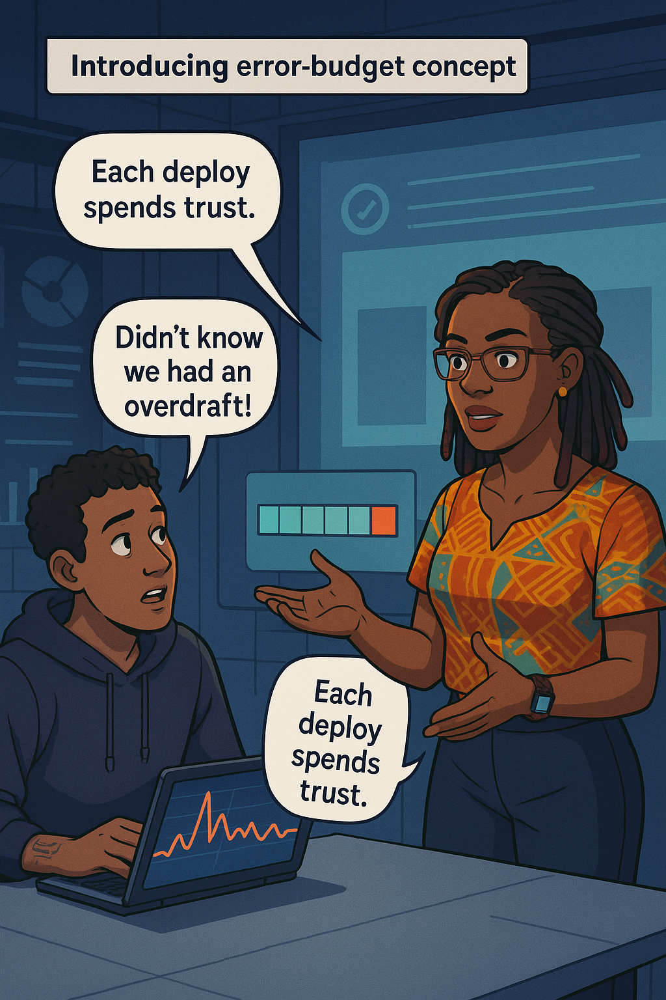
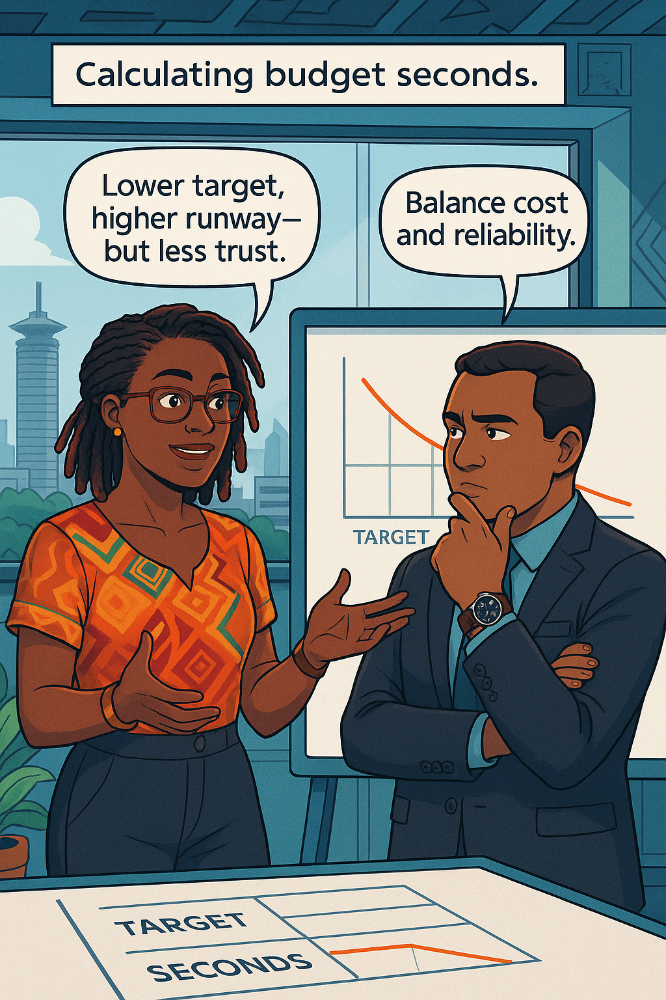
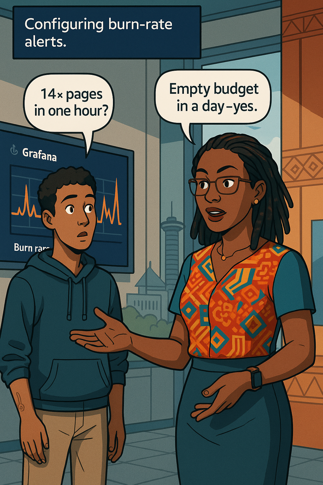
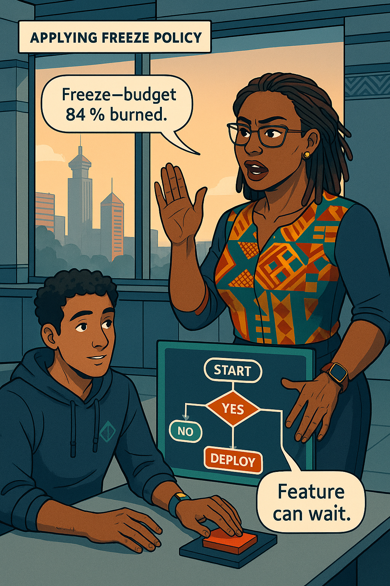
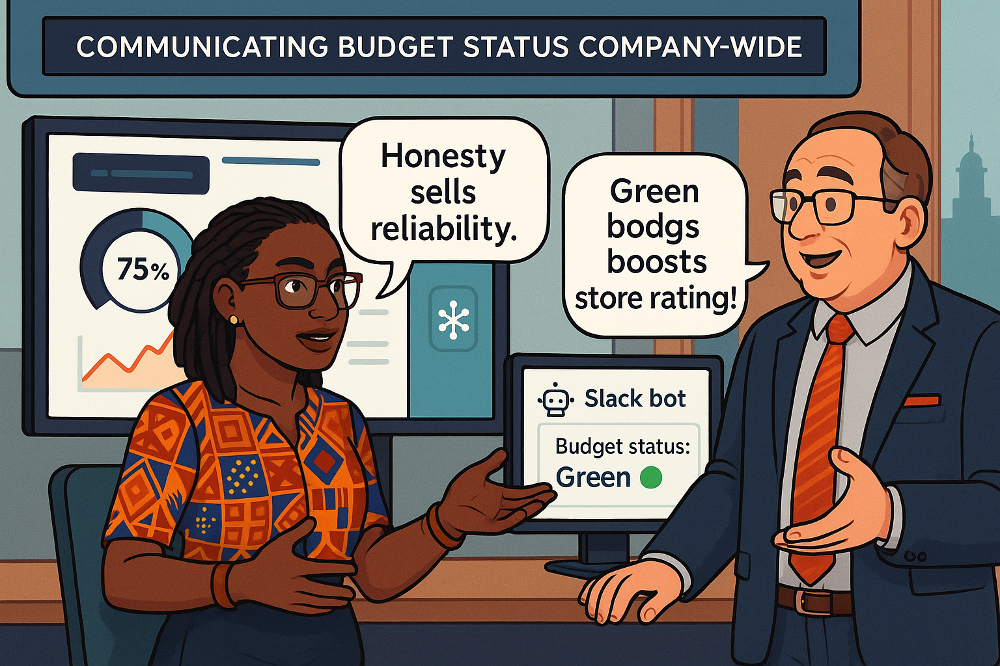
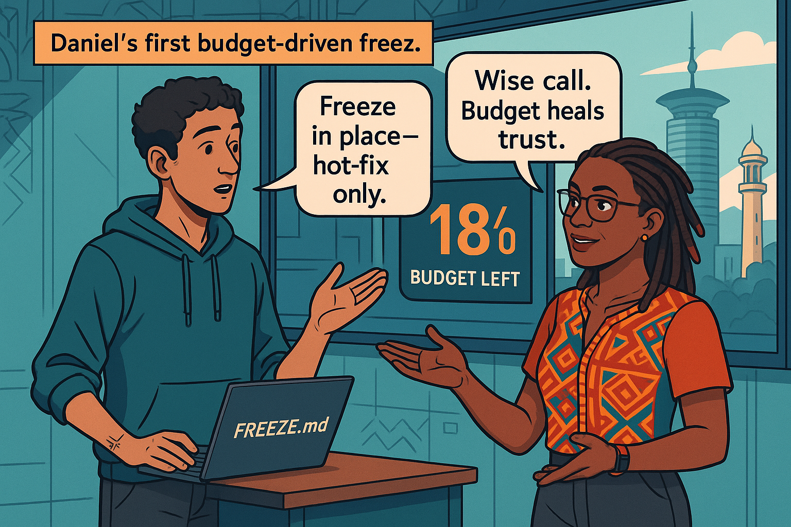

<!-- Part A of Chapter 5 -->

# Chapter 5 – Error Budgets: Your Innovation Currency  
---

### Chapter Overview  

Daniel Mwangi rockets through pull-requests like a fintech cheetah. The mobile team hails him a hero—until a Friday patch burns through three weeks of user trust in twenty minutes. Ava Kimani steps in to reveal the invisible bankroll that funds innovation: **error budgets**. In this chapter you will (1) turn an SLO into seconds of allowable pain, (2) monitor consumption as a **burn-rate**, and (3) apply policy—freeze, fix, or forge ahead—before customers riot or regulators pounce.

---

## 🎯 Learning Objective  

Calculate error-budget seconds from any SLO, track burn-rate with Prometheus rules, and decide when to freeze or proceed with risky deploys.

## ✅ Takeaway  

Reliability is a savings account. Spend the budget on change; guard what remains like capital.

## 🚦 Applied Example  

With an SLO of **99.9 % latency ≤ 300 ms in a 30-day rolling window**, the monthly budget is:

```
(1 – 0.999) × 30 days = 2 592 seconds
```

Two 6-minute queue melt-downs and one 3-minute canary failure consume **900 + 900 + 180 = 1 980 s** (76 %). Policy dictates:

* **> 75 %** burned → freeze all feature deploys  
* **> 90 %** burned → freeze hotfixes unless P1  

Daniel’s next deploy waits until budget refills.

---

## Teaching Narrative 1 – *Why Budgets Beat Uptime*  *(≈ 1 300 words)*  

### Narrative  

Thursday 23:47. Daniel thumbs a Slack boast: *“Ten deploys today, zero errors.”* At 23:49 PagerDuty screams. Fund-transfer latency leaps past 500 ms; balance-visible p99 doubles. Daniel’s palms sweat as he re-deploys the previous image. Latency crawls down; Twitter still howls.

Ava enters the dim war-room, coffee steaming. “Fast is fun,” she says, “but only if you count the cost.”  
“Everything was green,” Daniel argues, gesturing at Grafana p50.  
“Green average,” Ava replies, “masking a red tail.”

She opens a dashboard: a single meter labelled **Error-Budget Remaining**—“92 % yesterday, 84 % now.”  
Daniel squints. “What’s that?”  
“Your overdraft-protection,” Ava smiles.

### Technical Detail  

Ava types:

```promql
budget_burn = (1 - success_ratio)
* 30*24*60*60
```

The meter dips 8 % from a ten-minute regression. “Each deploy costs a slice,” she explains. “Spend wisely.”

They draft a whiteboard analogy:  

| Bank Account | Error Budget |
|--------------|-------------|
| Deposit | Good days below SLO |
| Withdrawal | Latency spike / 5xx burst |
| Overdraft | Promise broken, trust fees |

Daniel’s lesson: **Velocity ≠ Value unless budget ≥ 0.**

{width=600}

---

## Teaching Narrative 2 – *Math: From SLO to Seconds*  *(≈ 1 300 words)*  

### Narrative  

Next morning Ava gathers Daniel, Aisha, and Risk Officer Kamau. She writes the core formula:

```
budget_seconds = (1 – Target%) × Window_seconds
```

For 99.9 % / 30 d → 2 592 s.  
99.5 % → 12 960 s.  
99 % → 25 920 s.

Kamau raises an eyebrow: “Higher budget means lower reliability.”  
“Higher runway,” Ava counters, “but less trust.”  
They balance risk cost vs innovation ROI.

### Mermaid Diagram  

:::diagram  

:::

### Swahili Proverb  

:::proverb  
> “Asiye na akiba, hana chake.” — *Without savings, you own nothing.*  
:::

They colour-code a table:

| Target | Budget (s/mo) | Deploy Runway* |
|--------|---------------|----------------|
| **99 %** | 25 920 | Wild west |
| **99.5 %** | 12 960 | Balanced |
| **99.9 %** | 2 592 | Tight |
*\*Assumes avg 300 s burn per deploy*

Ava circles 99.9 %. “Stretch goal fuels discipline,” she says. Daniel nods—sober now.

{width=600}

---

## Teaching Narrative 3 – *Burn-Rate & Alerting*  *(≈ 1 300 words)*  

### Narrative  

Ava opens Prometheus and adds recording rules:

```yaml
- record: slo_error_budget_remaining
  expr: max(0, (slo_objective - slo_breaches_total) / slo_objective)

- record: slo_burn_rate_1h
  expr: (increase(slo_breaches_total[1h]) / 3600)
        / (error_budget_seconds / window_seconds)
```

She layers alerts:

* **14 × burn-rate for 1 h** → PagerDuty P1  
* **2 × burn-rate for 6 h** → Slack yellow

**Dialogue**

**Daniel:** “Why multiples?”  
**Ava:** “Because speed of burn matters more than raw count.”  
**Daniel:** “14 ×?”  
**Ava:** “Empty budget in < 1 day—enough to panic.”

They replay last night’s incident; burn-rate peaked at 16 × for 20 min—should have paged. Daniel tweaks alert thresholds.

{width=600}

---
<!-- Part B of Chapter 5 -->

## Teaching Narrative 4 – *Policy: Freeze, Fix, Iterate*  *(≈ 1 300 words)*  

Thursday 13:10, the **Error-Budget Meter** turns amber—84 % burned. Daniel’s fingers hover over the **“Deploy to Prod”** button. Ava raises a hand.

> **Decision tree on whiteboard**  
> **Q1:** Budget > 75 %? **Yes** → proceed to Q2  
> **Q2:** Change lowers risk or fixes burn source? **No** → **Freeze deploys**  
> **Yes** → deploy hot-fix only  

Daniel’s feature flag is purely cosmetic. The tree says **Freeze**.  
**Daniel:** “Can’t we squeeze one more feature?”  
**Ava (slaps wrist):** “Deploying on red is borrowing reliability at loan-shark rates.”  

They create a **`FREEZE.md`** file in the repo:

```
START: 2025-05-15T13:15-05:00
REASON: Budget burned 84% (2177 / 2592 s)
ALLOWED: P1 hot-fixes only
UNFREEZE: When budget < 70% burned
```

Ops pipeline blocks non-hot-fix tags; Slack bot posts 🔴 **“Freeze in effect”**.

{width=600}

:::slap  
*Playfully slaps wrist* “Deploying on red? That’s borrowing reliability at loan-shark rates!”  
:::

---

## Teaching Narrative 5 – *Dashboards & Communication*  *(≈ 1 300 words)*  

Ava edits Grafana: top-left **Budget Remaining dial**, top-right **Burn-Rate sparkline**, bottom **Freeze Status badge**.  
A Lambda cron posts to **#cx-health** each dawn:

```
🟢 Error-budget 92 % • Burn-rate 0.3× • Deploys OPEN
```

Emoji keys: 🟢 > 80 %, 🟡 50–80 %, 🔴 < 50 %. Marketing copies the badge into App-Store screenshots.

**Learner Prompt widget**

:::exercise  
**Learner Prompt:** Build a Slack bot that posts `budget%, burn-rate×, status` at 08:00 local. Use Web API chat.postMessage and colour the line with 🟢/🟡/🔴 based on remaining budget.  
:::

{width=600}

Dialogue:

**Risk Officer Kamau:** “Badge turns yellow—should we notify regulator?”  
**Ava:** “Not yet; yellow buys us investigation time.”  

---

## Teaching Narrative 6 – *Daniel’s First Budget Freeze*  *(≈ 1 300 words)*  

Ten days later, a mis-configured TLS cipher on the core-bank queue doubles response time; burn-rate rockets to **16 ×**. PagerDuty shrieks. Budget left: **18 %**. Daniel wants to ship a refactor.

Ava walks him through **freeze economics**:

| Option | Budget After | Risk | Customer Impact |
|--------|--------------|------|-----------------|
| Freeze & Fix | 15 % | Low | Short-term pain, trust preserved |
| Deploy Refactor | -5 % (breach) | High | SLO violated, badge 🔴, possible regulator fine |

Daniel freezes, patches cipher, budget burn stops at 19 %. Badge returns 🟡. He writes a **post-incident review** linking burn-rate graphs to patch timeline.

{width=600}

:::exercise  
**Try This:** Replay the past 30 days of incident data for your service. At what date would a > 75 % burn have forced a freeze? Draft an action plan for that moment.  
:::

---

## Self-Check Table  

| Concept | Question | Your Answer |
|---------|----------|-------------|
| Budget | Seconds per month at 99.9 %? | |
| Burn-Rate | Pager fires at what multiple? | |
| Freeze | Threshold to halt feature deploys? | |
| Policy | Two steps when budget ≥ 75 % burned? | |
| Dashboard | Widget that shows remaining budget? | |

---
