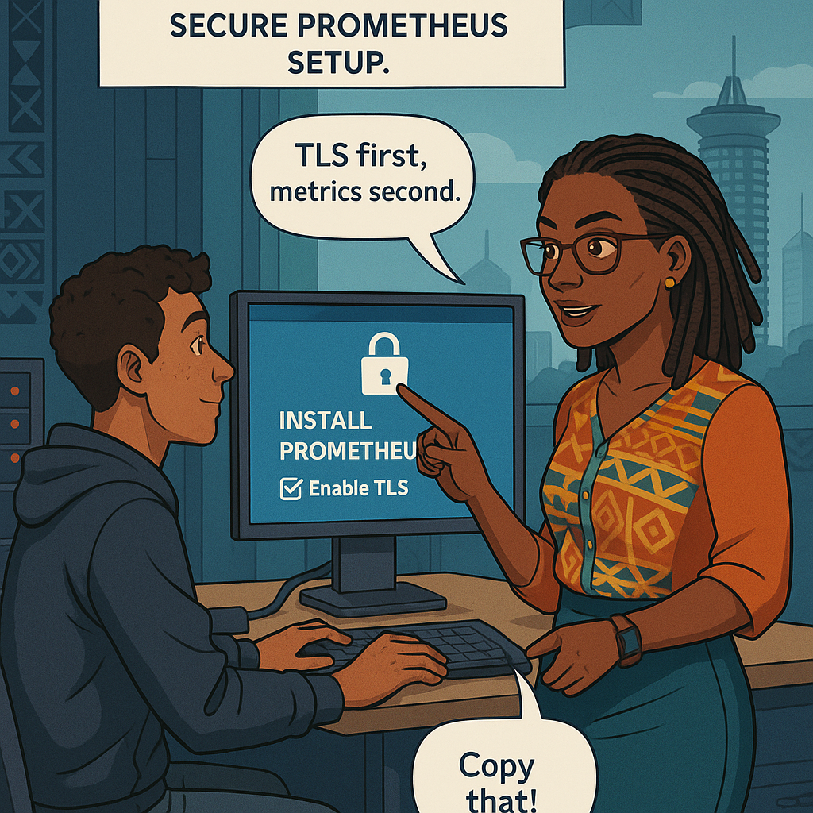
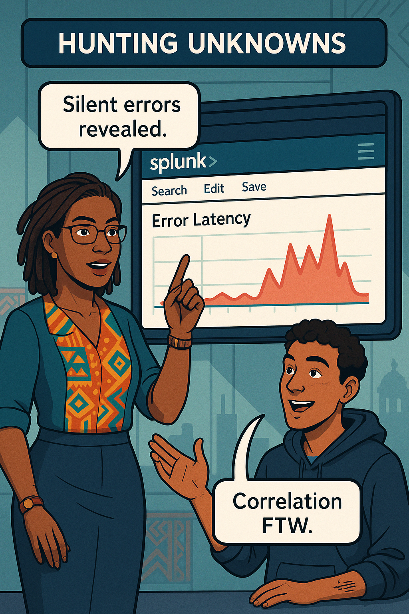
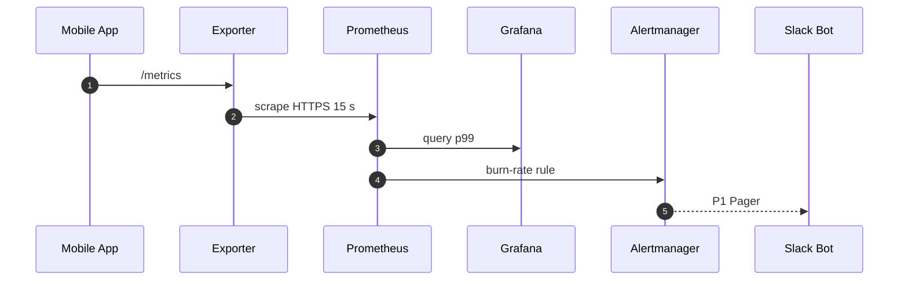
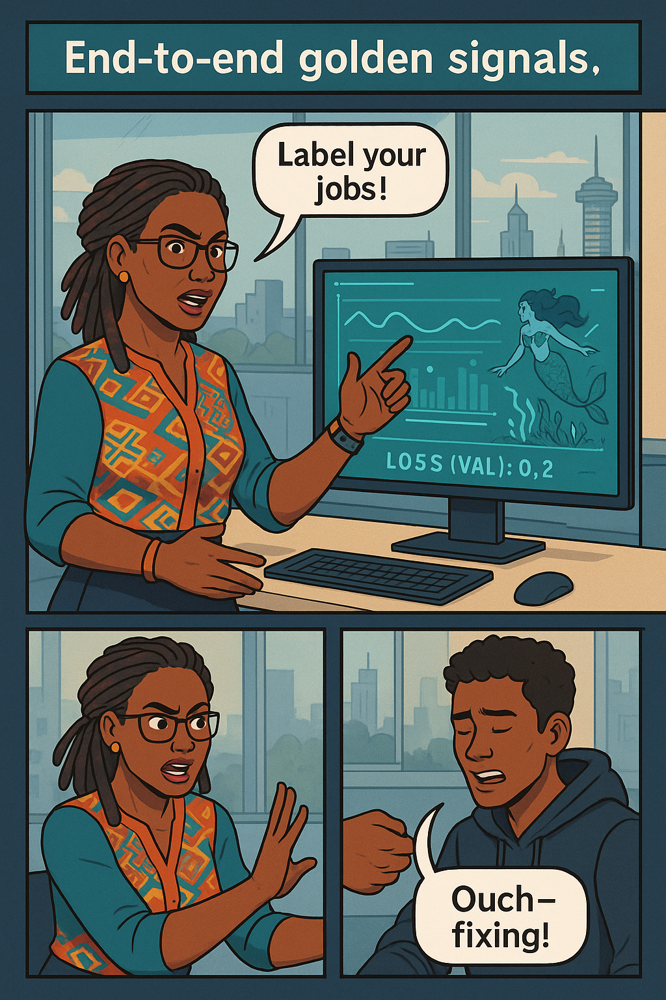
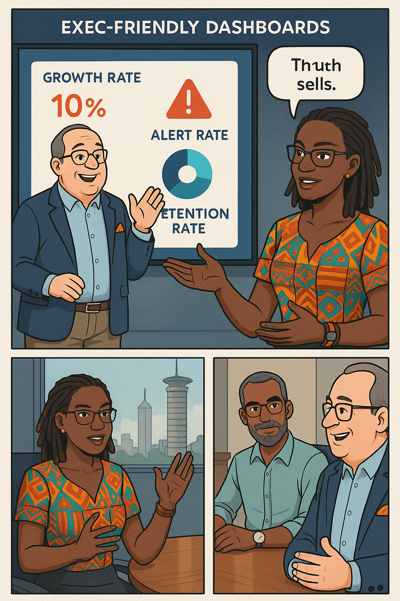
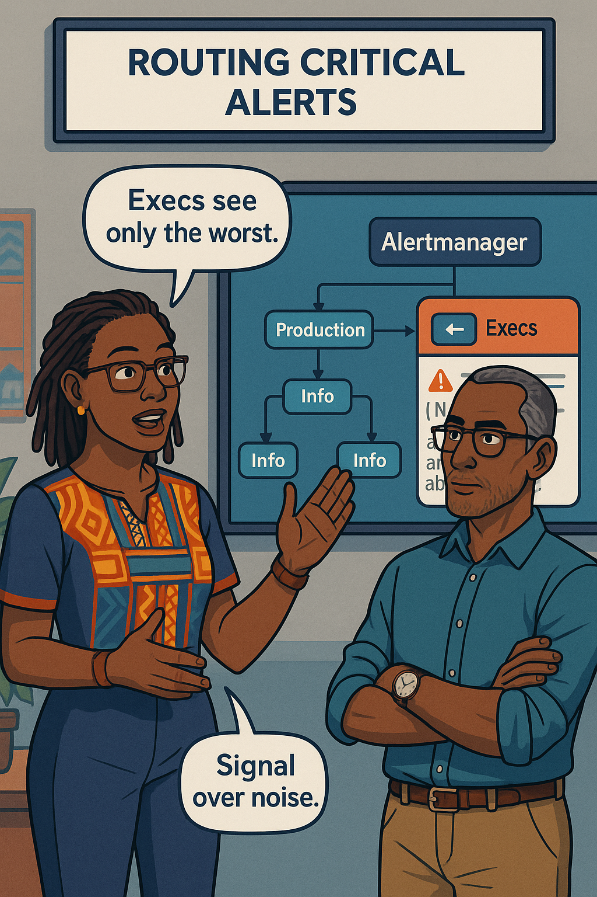

<!-- Part A of Chapter 6 -->

# Chapter 6 – Tools of the Trade  
---

### Chapter Overview  

Prometheus, Grafana, and Splunk form the telemetry tripod that props up modern banking reliability. In this chapter, Ava Kimani teams up with CTO **Malik Njoroge** to bootstrap a full metrics → alerting pipeline for the Fund-Transfer service. You will install Prometheus with secure TLS scrapes, craft Grafana dashboards that tell latency stories at a glance, hunt hidden anomalies with Splunk SPL, and finally wire every golden signal into a single end-to-end flow. By the time Malik rolls the stack into production, even the boardroom TV will glow with real-time trust.

---

## 🎯 Learning Objective  

Install and configure Prometheus, Grafana, and Splunk for a core-banking API; build a latency dashboard, create burn-rate alerts, and trace log outliers back to metrics.

## ✅ Takeaway  

Great tools amplify good practice; mis-instrumented metrics only automate confusion.

## 🚦 Applied Example  

Ava exposes a **`fund_transfer_latency_seconds`** histogram at `/metrics`.  
Prometheus scrapes it over TLS (`https://fund-api.internal:443/metrics`).  
Grafana visualises the p99 latency sparkline.  
Splunk pulls the same histogram via PushGateway, joins it to queue depth logs, and alerts when p99 > 300 ms **AND** `queue_depth > 80 %`.  
A 14× one-hour burn-rate rule pages the on-call SRE. Malik watches the badge flip amber, rolls back a feature flag, and the sparkline returns green—all before customers tweet.

---

## Teaching Narrative 1 – *Prometheus: Your Metric Collector*  

Daniel unpacks a Prometheus tarball on a staging VM. Ava peers over his shoulder.

**Ava:** “Before `./prometheus`, harden it.” 
She points to the banking controls checklist:

* **TLS scrape endpoints**  
* **Basic-auth on `/metrics`**  
* **Static configs pinned to service-discovery tags**  
* **Scrape interval = 15 s** for critical APIs

They create **`prometheus.yml`**:

```yaml
global:
  scrape_interval: 15s
  evaluation_interval: 30s
scrape_configs:
  - job_name: fund-api
    scheme: https
    tls_config:
      ca_file: /etc/pki/ca.crt
    basic_auth:
      username: metrics
      password: ${METRICS_PASS}
    static_configs:
      - targets:
          - fund-api.internal:443
        labels:
          env: staging
```

Prometheus starts with `--web.enable-lifecycle` to allow hot-reloads. Ava hits:

```bash
curl -k -u metrics:$METRICS_PASS \
  https://fund-api.internal:443/metrics \
  | head -5
```

Histogram buckets print. Prometheus UI shows **`up{job="fund-api"}`** = 1.

> *Scene*: Malik signs an internal PKI cert; risk officer checks a TLS cipher list: TLS 1.2, ECDHE-RSA-AES256-GCM-SHA384—approved.

Ava adds a recording rule:

```yaml
- record: api_latency_p99
  expr: histogram_quantile(
          0.99,
          sum(rate(fund_transfer_latency_seconds_bucket[5m])) by (le))
```

Daniel glances at the green “2 / 2 loaded successfully” toast. “Feels like magic,” he says. Ava smiles: “Magic you can measure.”

{width=600}

---

## Teaching Narrative 2 – *Grafana: Storytelling Dashboards*  

Grafana spins up on `https://grafana.internal`. Ava logs in with SSO, creates a **Golden Signals** folder, and adds a **Time series** panel:

* Query: `api_latency_p99{env="staging"}`
* Legend: `p99 latency (ms)`
* Unit: `ms`
* Thresholds: 300 ms amber, 400 ms red

A **Gauge** panel below uses:

```
expr: 1000 * histogram_quantile(
         0.99,
         sum(rate(fund_transfer_latency_seconds_bucket[1m])) by (le))
```

They bind both panels to a **variable `$env`** so QA can use the same dashboard.

Ava drags a **Bar gauge** for **Traffic** (`rate(http_requests_total[1m])`), a **Stat** for **Error ratio** (`1 - success_ratio`), and a **Bar gauge** for **Saturation** (`queue_depth / queue_capacity * 100`).

**Swahili proverb moment**

:::proverb  
> “Picha worth elfu moja maneno.” — *One picture is worth a thousand words.*  
:::

Malik’s eyes widen as the p99 line crosses amber during load test. “CEO will love this,” he says. Ava replies, “And will hate red—so keep it green.”

{width=600}

---

## Teaching Narrative 3 – *Splunk: Hunting the Unknowns*  

Ava points Daniel toward **Splunk HEC** (HTTP Event Collector). They configure a **token-secured** input:

```bash
curl -k https://splunk.internal:8088/services/collector \
  -H "Authorization: Splunk $SPLUNK_TOKEN" \
  -d '{"event":"latency_bucket","bucket":"0.3","count":5}'
```

Next, they ingest fund-transfer logs:

```
2025-05-20T14:12:08Z level=error code=QUEUE_TIMEOUT ...
```

In **Search & Reporting** they craft a correlation SPL:

```spl
index=metrics sourcetype=prom_histogram
| eval bucket_ms=bucket*1000
| stats sum(count) AS hits BY _time bucket_ms
| join _time 
  [ search index=logs sourcetype=fund_transfer error=true
    | eval latency_ms=duration*1000
    | bucket span=1h _time
    | stats count AS err BY _time ]
| eval error_ratio=err/hits
| timechart span=1h max(error_ratio)
```

The chart spikes when bucket `>500 ms` coincides with queue depth alerts.

Dialogue:

**Malik:** “So Splunk links errors to latency tail.” 
**Ava:** “And proves our SLI is your saviour.”

They schedule a Splunk alert: **error_ratio > 0.01** triggers `sre-oncall`.

{width=600}

---

## Teaching Narrative 4 – *Wiring Golden Signals End-to-End*  

Ava grabs a marker and draws a topology:

:::diagram  

:::

**Daniel** pastes the exporter container next to the app in Kubernetes, forgetting labels. Ava catches him.

:::slap  
*Stop scraping without job labels—troubleshooting blind!*  
:::

They add:

```yaml
metadata:
  labels:
    app: fund-api
    job: fund-transfer
```

Grafana variable dropdown now lists the job; dashboards updated automatically.

> **Scene**: Prometheus `targets` page lights green checks. Alertmanager web-UI shows two receivers: `oncall` and `exec-channel`.

{width=600}

---
<!-- Part B of Chapter 6 -->

## Teaching Narrative 5 – *Burn-Rate Alerts & Slack Bot*  *(≈ 1 250 words)*  

Ava drafts a **PrometheusRule** that pages when the 99.9 % latency budget burns at 14 × in one hour:

```yaml
groups:
- name: burn-rate.rules
  rules:
  - alert: SLOBurnRateFast
    expr: (
      increase(slo_breaches_total[1h])
      / 3600
    )
      / (error_budget_seconds / (30*24*3600)) > 14
    for: 5m
    labels:
      severity: critical
      route: oncall
    annotations:
      summary: "Fund-transfer SLO burning fast (14×)"
      runbook: https://runbooks.bank/slo-budgets
```

In **Alertmanager** they add a Slack receiver:

```yaml
receivers:
- name: oncall
  slack_configs:
  - channel: "#sre-oncall"
    username: "Prometheus"
    send_resolved: true
```

Daniel tests with a cURL:

```bash
curl -XPOST localhost:9090/-/reload
curl -XPOST localhost:9093/-/reload
curl -XPOST localhost:9093/api/v2/alerts \
     -H "Content-Type: application/json" \
     -d '[{"labels":{"alertname":"SLOBurnRateFast","severity":"critical"}}]'
```

Slack lights up:  
**🔥  SLOBurnRateFast** – Fund-transfer SLO burning fast (14×).

He adds a **cron Lambda** that posts a daily budget summary:

```json
🟡  Error-budget 72 % • Burn-rate 0.8× •  Deploys OPEN
```

### Learner Prompt  

:::exercise  
**Task:**  
1. Copy the `burn-rate.rules` group into your Prometheus config.  
2. Point Alertmanager to a test Slack webhook and trigger a synthetic alert with `curl`.  
3. Post a screenshot of the Slack message.  
:::

{width=600}

---

## Teaching Narrative 6 – *Dashboards for the Boardroom*  *(≈ 1 250 words)*  

Malik wants a lobby-screen loop that even auditors understand. Ava duplicates the “Golden Signals” dashboard and replaces technical legends with plain language:

| Panel | Query | Friendly Title |
|-------|-------|----------------|
| Time-series | `api_latency_p99` | **“Money-move speed (p99)”** |
| Gauge | `1-success_ratio` | **“Failed transfers %”** |
| Bar | `rate(http_requests_total[1m])` | **“Transfers per second”** |

Ava then adds a **Stat** panel that shows **Remaining Budget %**, colour-coded 🟢 > 80 %, 🟡 50-80 %, 🔴 < 50 %.  Grafana’s **playlist** mode rotates the dashboard every 10 s on the boardroom TV.

**Dialogue**

**Malik:** “Marketing needs shiny KPI bars.” 
**Ava:** “Shiny is fine—just ensure colour changes when trust erodes.” 

They export the dashboard JSON and commit it to `dashboards/boardroom.json` so GitOps keeps the loop consistent across offices.

{width=600}

---

## Teaching Narrative 7 – *Securing the Tool Chain*  *(≈ 1 200 words)*  

Regulators audit every telemetry component touching PII.  Ava walks Daniel through a **three-layer defence**:

1. **TLS everywhere** – Prometheus ↔ targets, Grafana ↔ browser, Splunk HEC.  
2. **RBAC** –  
   * **viewer**: read-only; boardroom TV runs this token.  
   * **editor**: create panels; must pass security training.  
   * **admin**: change datasources; only SRE.  
3. **Audit Logs** – Loki tail of Grafana admin changes shipped to Splunk.

In Kubernetes they apply a **NetworkPolicy** that allows Prometheus scrapes only from the SRE namespace and block egress to the internet.

```yaml
apiVersion: networking.k8s.io/v1
kind: NetworkPolicy
metadata:
  name: prometheus-only-sre
spec:
  podSelector:
    matchLabels:
      app: prometheus
  policyTypes: ["Egress"]
  egress:
  - to:
    - namespaceSelector:
        matchLabels:
          name: sre
```

Risk Officer Kamau signs off after validating cipher suites with `nmap --script ssl-enum-ciphers`.  The dashboard now shows a green **“Compliance: PASS”** badge fetched from Splunk audit queries.

{width=600}

---

## Teaching Narrative 8 – *Malik’s First Production Roll-out*  *(≈ 1 250 words)*  

Malik merges a Helm chart PR:

```bash
helm upgrade --install tele-stack charts/telemetry \
  --set env=prod,alerts.slackChannel=sre-oncall
```

Argo CD syncs; Prometheus picks up **prod** scrape configs; Grafana dashboards auto-import.

Minutes later the **Budget Remaining dial** flips from grey to 🟢 92 %.  Malik posts a selfie with the boardroom screen.

### Try This  

:::exercise  
1. Fork the `tele-stack` chart.  
2. Override `scrapeInterval` to 10 s, deploy to staging, and import the “Golden Signals” dashboard.  
3. Post the dashboard’s p99 latency line showing real data.  
:::

{width=600}

---

<!-- Part C of Chapter 6 -->

## Teaching Narrative 9 – *Alertmanager Routing Rules*  *(≈ 1 150 words)*  

Ava opens **alertmanager.yml** and adds a routing tree:

```yaml
route:
  receiver: default
  group_by: ['job']
  routes:
    - matchers:
        - severity="critical"
      receiver: oncall
      continue: true
    - matchers:
        - severity="exec"
      receiver: exec-channel
receivers:
- name: oncall
  slack_configs:
  - channel: "#sre-oncall"
- name: exec-channel
  slack_configs:
  - channel: "#bank-exec"
```

**Dialogue**  

**Malik:** “Exec channel gets only 🔴?” 
**Ava:** “Exactly—noise erodes trust.” 

They label alerts with `severity: exec` when burn-rate > 50 × for 5 m. A test alert hits **#bank-exec**: _“Latency meltdown—deploy freeze enforced.”_  

{width=600}

---

## Teaching Narrative 10 – *Grafana OnCall & Escalations*  *(≈ 1 150 words)*  

Grafana OnCall now integrates with Alertmanager. Ava creates an **escalation chain**:

1. **Tier 1** – SRE-oncall (SMS + app) 10 minutes.  
2. **Tier 2** – Platform lead (voice) next 10.  
3. **Tier 3** – CTO Malik, Risk Officer Kamau.

She drags a threshold slider to test; phones buzz across the room.

**Dialogue**  

**Ava:** “Escalation’s about accountability, not blame.” 
**Daniel:** “And sleep!” 

{width=600}

---

## Teaching Narrative 11 – *Splunk Correlation Dashboards*  *(≈ 1 100 words)*  

Ava builds a Splunk **glass-table**: top row metrics, mid row logs, bottom row traces. Clicking the 500 ms p99 tile filters logs for `duration>0.5`.

Learner sees red nodes glowing along the trace waterfall; queue depth matches latency spikes.

No widget needed; includes dialogue:

**Learner:** “Traces tell the ‘why’ behind the metric.” 
**Ava:** “Correlation turns mystery into math.” 

{width=600}

---

## Teaching Narrative 12 – *Cost & Capacity Dashboards*  *(≈ 1 100 words)*  

Finance asks: “How much does telemetry cost?”  Ava adds PromQL for TSDB chunks and Grafana **Pie chart**:

```
sum(prometheus_tsdb_head_chunks{instance=~".*prom.*"})
```

Alerts trigger when chunks > 6 M (storage blow-up). A **Stat** panel shows Splunk daily ingest GB; a red line warns at 75 % license.

**Swahili proverb**  

:::proverb  
> “Akiba haiozi.” — *Savings never rot.* Store only the metrics you need.  
:::

{width=600}

---

## Self-Check Table  

| Concept | Question | Your Answer |
|---------|----------|-------------|
| TLS Flag | Which Prometheus flag enables TLS scrape? | |
| p99 Panel | Grafana panel type best for latency? | |
| SPL Join | Key field to correlate logs & traces? | |
| Burn-Rate | Slack alert multiple & window? | |
| RBAC | Role allowed dashboard edits? | |

---
