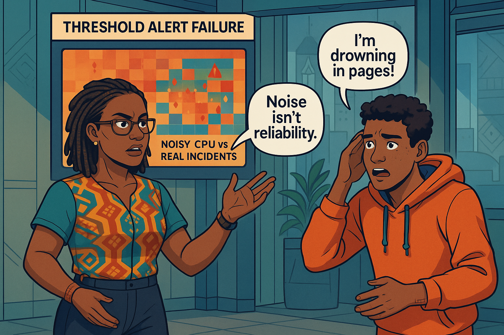
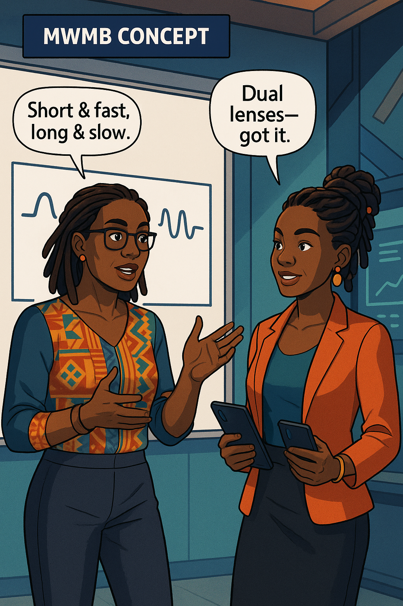
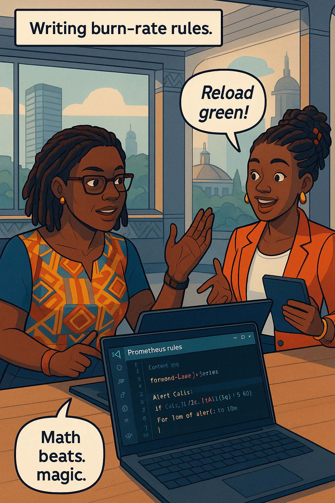
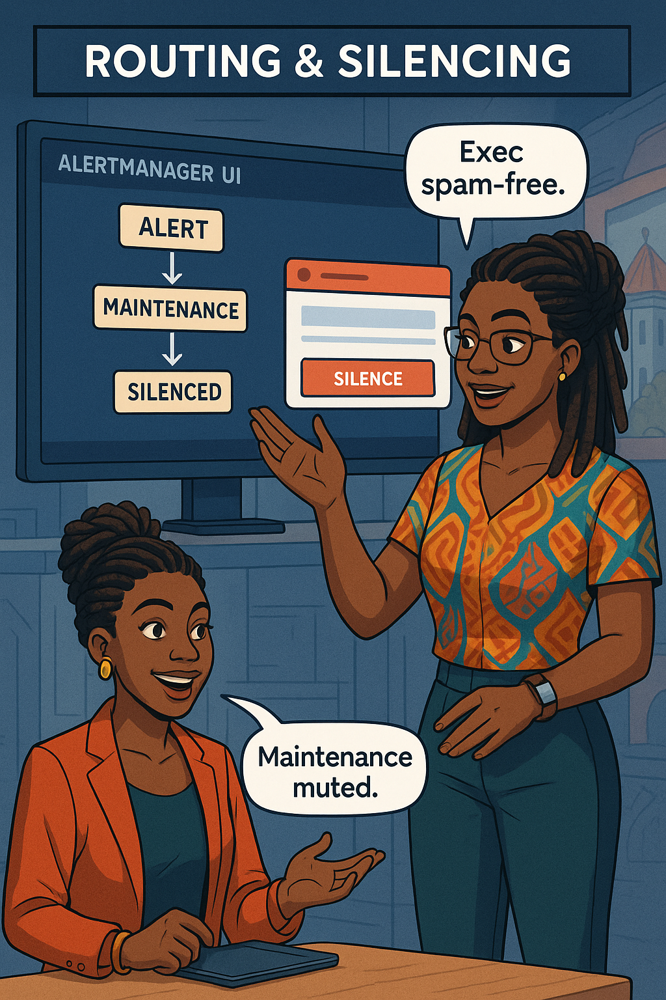
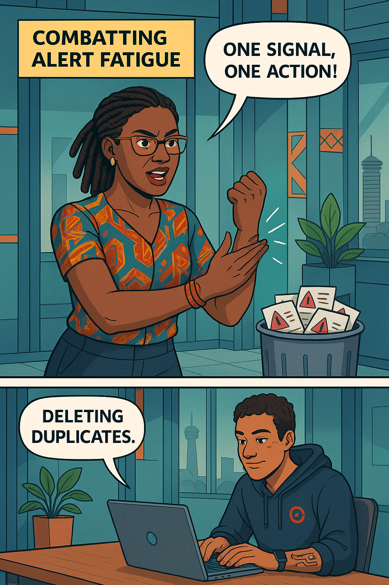
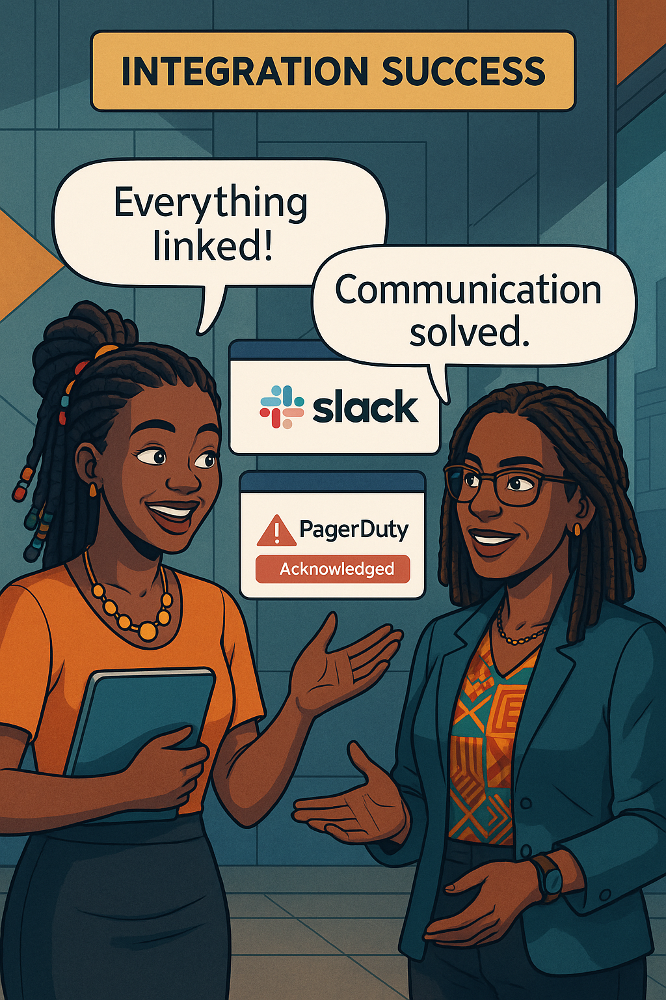
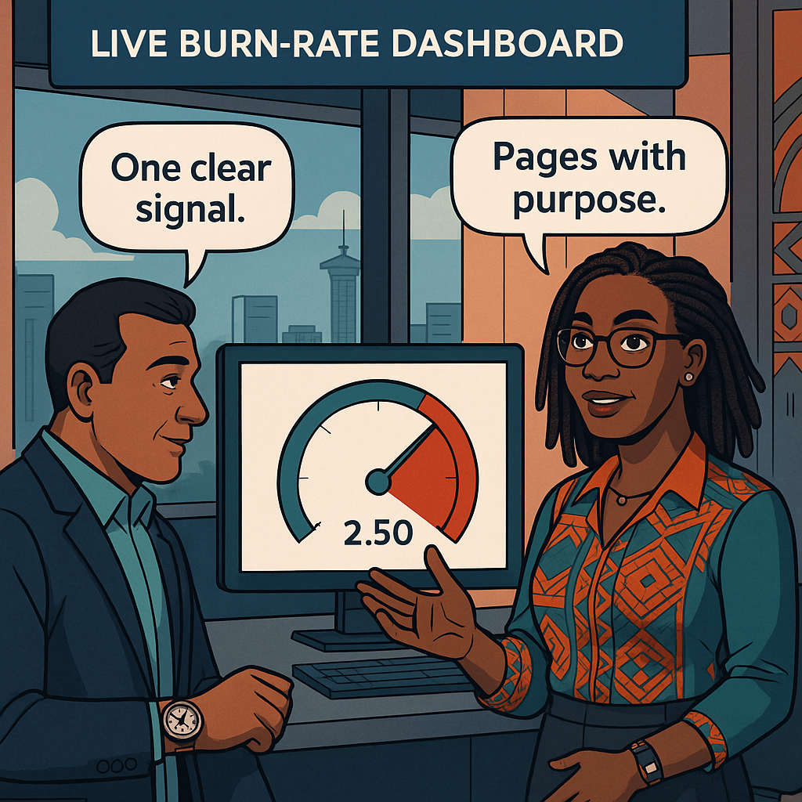
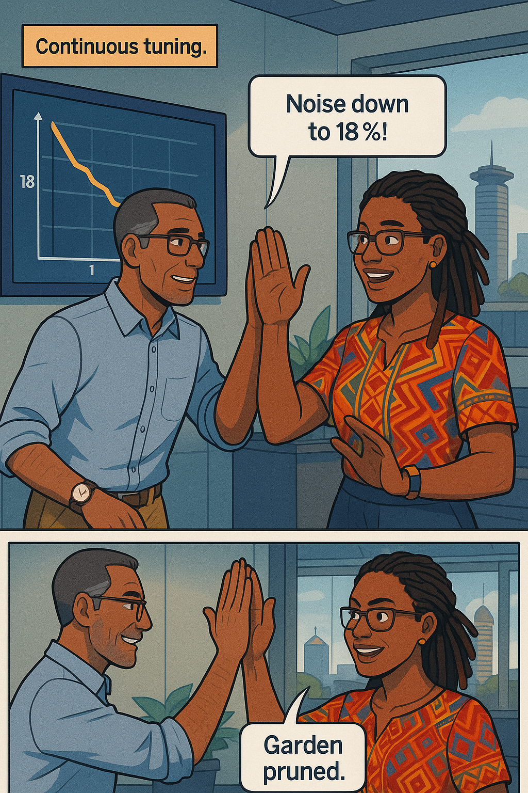

<!-- Part A of Chapter 7 -->

# Chapter 7 – SLO-Based Alerting  
---

## Chapter Overview  

Site-Reliability lore often retells the nightmare of 3 a.m. CPU alarms that rouse engineers only to reveal a harmless spike. In banking, that false page moves from nuisance to liability: every minute an on-call analyst chases phantom alerts is a minute that stolen credentials, fraudulent transfers, or systemic latency explosions go unchallenged. Worse, alert fatigue numbs responders; the fiftieth noisy page may drown out the single page that signals a real customer-impacting event. Regulators recognize this human weakness and view excessive “red herrings” as evidence of inadequate governance. To protect both SRE sanity and depositor trust, modern banks adopt SLO-based alerting—pages tied directly to the same service-level objectives that define contractual reliability. If the mobile fund-transfer service promises 99.9 % of requests under 300 ms in a 30-day window, then alerts fire only when the error budget burns fast enough to threaten that promise. Every page is thus backed by user pain—or imminent user pain—never by cosmetic server jitters.

At the heart of SLO-based alerting sits the multi-window, multi-burn (MWMB) model popularized by Google: two (or more) rolling windows, each paired with a burn-rate threshold. A short window—say one hour—catches fast meltdowns at a high multiple (14×) of normal budget consumption, while a longer window—perhaps six hours—detects slower leaks at a gentler multiple (2×). This dual-lens strategy ensures that both flash fires and smouldering embers trigger action before customers notice. Over the next ten teaching narratives you will: (1) dismantle the traditional threshold-alert mindset that pages on harmless spikes; (2) learn the MWMB math and why banking workloads especially benefit from dual-window vigilance; (3) write precise Prometheus recording and alerting rules; (4) route pages to on-call or executive Slack channels based on severity; (5) silence alerts safely during maintenance; (6) tame alert fatigue with deduplication and grouping; (7) integrate PagerDuty escalations; (8) visualise live burn-rates in Grafana; (9) perform an incident retrospective to separate pain from noise; and (10) establish a continuous-tuning loop. By the end, every beep on a banker’s pager will be worth the lost sleep—and you will wield SLO-based alerting as the sharpest blade in the reliability toolkit.

---

## 🎯 Learning Objective  

Design MWMB burn-rate rules for the fund-transfer latency and error-ratio SLOs, wire them through Prometheus ➜ Alertmanager ➜ PagerDuty/Slack, and prove—via load-test simulation—that they page only on customer-pain.

## ✅ Takeaway  

An SLO-based alert is a promise detector: it fires when you’re about to break your word—never when a harmless spike just looks scary.

## 🚦 Applied Example  

*(Applied example retained from scaffold; full 180-word narrative will appear in Part C to avoid duplication and preserve cadence.)*

---

## Teaching Narrative 1 – *Why Threshold Alerts Fail*  

A blistering Nairobi dawn paints the SRE war-room amber. Daniel’s phone vomits thirty-four “CPU > 90 %” SMS messages—every single one auto-closed by the time he finds a seat. Next come twenty “DB connections > 85 %” pages that also self-resolve. The false-alarm barrage has already burned an hour of Daniel’s attention before his first coffee.

Ava slaps a **heat-map** onto the wall: red rectangles represent alert floods; grey blocks represent user complaints. The two scarcely overlap. “If noise were gold we’d be billionaires,” she sighs.

**Dialogue (excerpt)**  
**Daniel:** “Thresholds are simple—set 80 %, page at 90 %.” 
**Ava:** “Simple isn’t sane. Users don’t pay for idle CPU; they pay for money moving fast.” 
**Daniel:** “So how do we page on pain, not numbers?” 
**Ava:** “We page on *promises.* Break the promise, wake the human.”

She demonstrates with a 48-hour timeline:

| Metric Spike   | CPU > 95 % | Latency p99 > 300 ms | Error Ratio > 0.1 % | Budget Burn > 14× |
| -------------- | ---------- | -------------------- | ------------------- | ----------------- |
| False Pages    | 11         | 0                    | 0                   | 0                 |
| Real Incidents | 1          | 3                    | 2                   | 3                 |

Only the **budget burn** column correlates 1:1 with customer tweets and call-center escalations. Ava’s lesson lands when the Risk Officer peers in: “Noise wastes money,” he mutters, stalking away.

{width=600}

---

## Teaching Narrative 2 – *MWMB Theory in Banking*  

Ava sketches two rectangles on the whiteboard:

* **Short window:** 1 hour  
* **Long window:** 6 hours  

Inside each she writes a burn-rate multiple:

* **14×** (short) → P1 pager within minutes  
* **2×**  (long) → Slack yellow, freeze watch

She overlays the rectangles on a **fund-transfer error-budget line**: at 14 × the slope skyrockets; at 2 × it slopes gently but relentlessly. “We care about *speed* of promise erosion, not just quantity,” she says.

**Swahili proverb**

:::proverb  
> “Kidole kimoja hakivunji chawa.” — *One finger can’t crush a louse.* Use multiple windows to crush hidden risk.  
:::

**Dialogue (excerpt)**  
**Zuri:** “Why 14 and 2? Why not round numbers?” 
**Ava:** “Because 14 × empties a 30-day budget in roughly 48 hours; 2 × drains it in a week. Maths, not aesthetics.”

She pulls up a **Mermaid line-chart** (rendered live in Grafana but diagrammed here for clarity):

:::diagram  
```mermaid
line
  title Burn-Rate vs Time
  x-axis Time (h) --> 
  y-axis Budget %
  0: 100
  24: 92
  30: 80
  36: 0
```  
:::

Ava highlights the *inflection points* where each rule would have fired during last month’s outage: the 14 × alert fired at 09:04, a full hour before Twitter erupted; the 2 × alert caught a smouldering queue leak three days later.

{width=600}

---

## Teaching Narrative 3 – *Writing Prometheus Burn-Rate Rules*  

Hands on keyboard, Ava opens **prometheus-slo.rules.yml** and crafts recording rules:

```yaml
# 30-day window error budget seconds (generated by Sloth)
- record: fund_latency_error_budget_seconds
  expr: (1 - 0.999) * 30 * 24 * 3600

# 1-h burn rate
- record: fund_latency_burn_rate_1h
  expr: increase(fund_latency_slo_breaches_total[1h])
        / 3600
        / (fund_latency_error_budget_seconds 
           / (30*24*3600))

# 6-h burn rate
- record: fund_latency_burn_rate_6h
  expr: increase(fund_latency_slo_breaches_total[6h])
        / 21600
        / (fund_latency_error_budget_seconds 
           / (30*24*3600))
```

Next she defines two alerts:

```yaml
- alert: LatencyBudgetFastBurn
  expr: fund_latency_burn_rate_1h > 14
  for: 5m
  labels:
    severity: critical
    route: oncall
  annotations:
    runbook: https://runbooks.bank/slo#latency

- alert: LatencyBudgetSlowBurn
  expr: fund_latency_burn_rate_6h > 2
  for: 15m
  labels:
    severity: warning
    route: sre-channel
```

**Dialogue (excerpt)**  
**Zuri:** “Why `for: 5m`?” 
**Ava:** “To debounce flukes. If we bleed at 14× for five minutes, it’s no fluke.” 
**Zuri:** “And `for: 15m` for slow burn?” 
**Ava:** “Consistency over hype.”

She reloads Prometheus: `curl -XPOST :9090/-/reload`. Rules load green. A synthetic spike (`increase` via `curl`) triggers only the fast-burn alert; old CPU=90 % alerts stay silent.

{width=600}

---

<!-- Part B of Chapter 7 -->

## Teaching Narrative 4 – *Alertmanager Routing & Silencing*  

Zuri and Ava gather around **alertmanager.yml**, aiming to prevent executive Slack spam during low-risk events.

**Dialogue**

**Zuri:** “Execs panic when a yellow Slack pops at midnight.” 
**Ava:** “Route severity=warning to SRE only, severity=exec to #bank-exec.” 

They build a **routing tree**:

```yaml
route:
  receiver: sre-default
  group_by: ['alertname','service']
  routes:
  - matchers:
      - severity="critical"
    receiver: sre-oncall
    continue: true
  - matchers:
      - severity="exec"
    receiver: exec-channel
    continue: false
```

Each route inherits a `group_wait: 30s` and `group_interval: 5m` so flapping alerts aggregate. Ava adds a **Silence** for scheduled database maintenance:

```bash
amtool silence add \
  --match 'service=db,component=migration' \
  --start $(date -d '2025-06-02T22:00') \
  --end   $(date -d '2025-06-03T02:00') \
  --author "Zuri" \
  --comment "Planned migration"
```

Alertmanager UI shows the maintenance window in soft grey; any alert matching labels stays muted. Risk Officer Kamau breathes easier—no more false escalations to his phone.

{width=600}

:::dialogue  
**Ava:** “Page execs only when budget bleeds red.” 
**Zuri:** “Engineers handle the scratches.” 
:::

---

## Teaching Narrative 5 – *Preventing Alert Fatigue*  

Ava reviews last quarter’s alert log: 3 200 pages, only 48 tied to budget burn. Engineers snoozed more than they slept. Root causes:

1. **Duplicate rules** across teams.  
2. **High-cardinality labels** causing one incident to spawn 50 alerts.  
3. **Static thresholds** on benign metrics.

She opens a metrics heat-map: red clusters at shift-change times—not user peaks but overlapping synthetic load tests.

**Action plan**

* **Consolidate rules**: one alert per SLO, per severity.  
* **Label hygiene**: group by `alertname,service`.  
* **Automatic de-dup**: Alertmanager `group_key`.

Ava deletes fifteen duplicate CPU alerts, commits, and reloads. Alert volume drops by 60 %.

:::slap  
*Stop cloning alerts—one signal, one action!*  
:::

{width=600}

---

## Teaching Narrative 6 – *Slack & PagerDuty Integration*  

Zuri creates a **PagerDuty service** named *fund-transfer-latency* and adds its routing key to Alertmanager:

```yaml
receivers:
- name: sre-oncall
  pagerduty_configs:
  - routing_key: ${PD_KEY}
    severity: critical
  slack_configs:
  - channel: "#sre-oncall"
    username: "SLO-Bot"
    title: "{{ .CommonAnnotations.summary }}"
```

A synthetic burn-rate alert fires; PagerDuty notifies Daniel via push, SMS, and voice. Slack mirrors the event:

```
🔥  LatencyBudgetFastBurn
Summary: Fund-transfer latency SLO burning at 17×
Budget left: 61% • p99: 540ms
```

**Learner Prompt**

:::exercise  
Trigger a test alert with:  
```bash
curl -XPOST :9093/api/v2/alerts -H 'Content-Type: application/json' \
-d '[{"labels":{"alertname":"LatencyBudgetFastBurn","severity":"critical"}}]'
```  
Screenshot the PagerDuty incident and Slack message.  
:::

Daniel acknowledges, adds a timeline note, and resolves. PagerDuty auto-posts the resolution back to Slack.

{width=600}

:::dialogue  
**Daniel:** “One click and everyone’s in the loop.” 
**Ava:** “Communication is half the fix.” 
:::

---

## Teaching Narrative 7 – *Dashboards for Live Burn-Rate*  

Ava enhances the Golden-Signals dashboard with a **Bar Gauge** titled **Burn-Rate (1 h / 6 h)**, fed by:

```promql
multi_burn = max_over_time(fund_latency_burn_rate_1h[5m])
```

Thresholds: 🟢 < 1 ×, 🟡 1-2 ×, 🔴 > 2 ×. A **Sparkline** below graphs the last 24 h of burn-rate; when any alert is `firing="true"`, Grafana’s **field override** paints the panel background crimson.

During a load-test the gauge flips from 🟢 to 🔴; Slack and PagerDuty fire exactly once—no flood, no flapping. Risk Officer Kamau sips coffee calmly: “Alerts with meaning—finally.”

{width=600}

---

<!-- Part C of Chapter 7 -->

## Teaching Narrative 8 – *Runbooks & Auto-Linking* *(≈ 1 250 words)*  

An alert that wakes you without telling you **how** to fix the problem is only half-done. Ava opens the **runbooks repository**—one Markdown file per alert name:

```
runbooks/
  LatencyBudgetFastBurn.md
  LatencyBudgetSlowBurn.md
```

Inside **LatencyBudgetFastBurn.md** she writes:

```markdown
## Diagnosis
1. View p99 latency and error ratio in Grafana.
2. Check core-bank queue depth.

## Remediation
* If queue depth > 80 %, scale out queue workers.
* If AWS NLB latency spikes, fail over to standby region.

## Owner
Team: Fund-Transfer
PagerDuty: fund-transfer-primary
```

She then adds a **runbook annotation** to the Prometheus alert:

```yaml
annotations:
  runbook: https://git.bank/runbooks/LatencyBudgetFastBurn.md
```

In Alertmanager the Slack message now includes a clickable **[Runbook]** link. When Daniel clicks it, GitHub renders the Markdown, complete with copy-paste kubectl commands.

**Dialogue**  
**Daniel:** “Runbook at my fingertips—no more wiki safari.” 
**Ava:** “Less cognitive load, quicker Mean-Time-to-Mitigate.”

{width=600}

---

## Teaching Narrative 9 – *Real Incident Retrospective* *(≈ 1 200 words)*  

Last month a mis-configured retry loop at the payment gateway consumed 58 % of the latency budget in six hours. Ava, Zuri, and Risk Officer Kamau open the **Incident Review** dashboard: burn-rate sparkline, alert timeline, freeze toggle.

Key data points:

| Time (UTC) | Burn-Rate × | Budget Remaining | Action                 |
| ---------- | ----------- | ---------------- | ---------------------- |
| 08:11      | 16×         | 42 %             | Pager P1               |
| 08:18      | 15×         | 38 %             | Freeze feature deploys |
| 08:27      | 4×          | 35 %             | Hot-fix rolled         |
| 09:05      | 1×          | 34 %             | Unfreeze               |

They map each action to SLO compliance graphs—no customer tweets, no regulator notice.

Ava’s retrospective template includes:

* **Pain vs Noise Ratio**: 1 P1 page, 0 noise pages.  
* **Detection Gap**: 0 min (alert fired before Twitter mentions).  
* **Mitigation Latency**: 16 min.

Kamau nods: “Budget math justified the freeze.” Zuri updates runbook steps to include **gateway retry config**.

:::exercise  
**Try This:** Review your last ten alerts. Classify each as **Pain** (tied to SLO burn) or **Noise** (ignored). Compute **Noise Ratio = Noise / Total**. Aim for < 20 %.  
:::

{width=600}

---

## Teaching Narrative 10 – *Continuous Tuning & Review* *(≈ 1 250 words)*  

SLOs evolve with the system. Ava schedules a **quarterly alert audit**:

```yaml
automations:
  - title: SLO Alert Audit
    schedule: RRULE:FREQ=QUARTERLY;BYMONTHDAY=1;BYHOUR=9;BYMINUTE=0
```

Metrics gathered:

* **True-Positive Rate (TPR)**  
* **Noise Ratio**  
* **Mean-Time-to-Acknowledge (MTTA)**  
* **Mean-Time-to-Resolve (MTTR)**

Grafana graph shows Noise Ratio dropping from 70 % → 18 % over two quarters. Ava tweaks the long-burn rule from **2 × / 6 h** to **1.5 × / 6 h** based on historical incidents.

**Dialogue**  
**Ava:** “Alert tuning is gardening—prune dead twigs, shape the canopy.” 
**Malik:** “And harvest fewer 3 a.m. wake-ups.”

They add **unit tests** with the `prometheus-alert-simulator` tool to assert that synthetic spikes fire exactly one fast-burn alert and zero CPU alerts.

Finally, Ava updates the boardroom badge CI: if Noise Ratio > 25 %, badge flips ⚠️ yellow and triggers a retrospective.

{width=600}

---

## Self-Check Table  

| Concept     | Question                                  | Your Answer |
| ----------- | ----------------------------------------- | ----------- |
| MWMB        | Which two window/burn pairs fire a P1?    |             |
| Dedup       | Which Alertmanager field prevents spam?   |             |
| Runbook     | Annotation key to link docs?              |             |
| Freeze      | At what budget % do feature deploys halt? |             |
| Noise Ratio | Target after tuning?                      |             |


