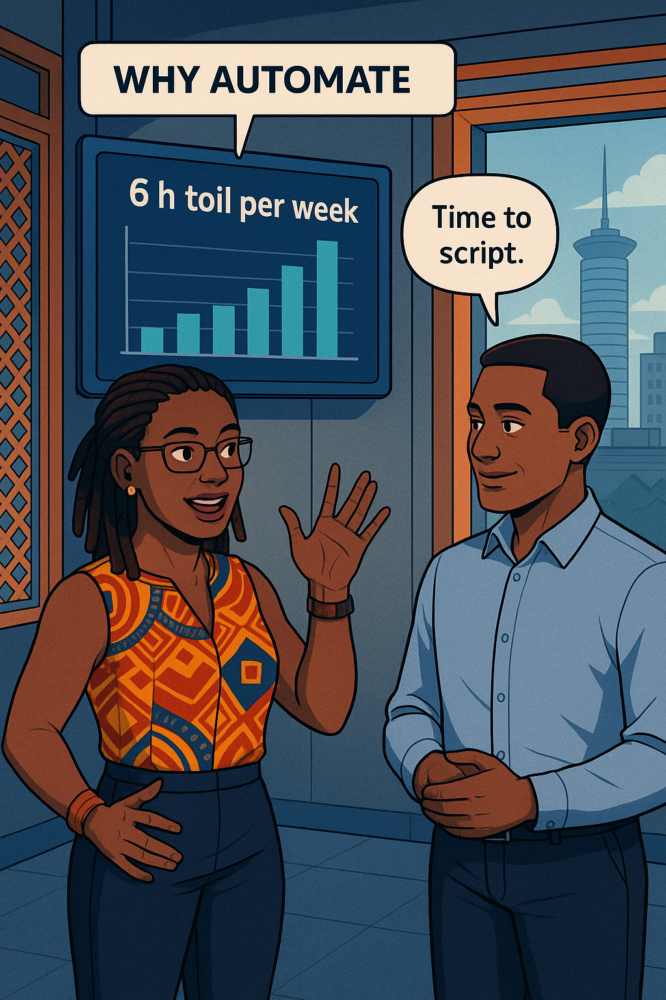
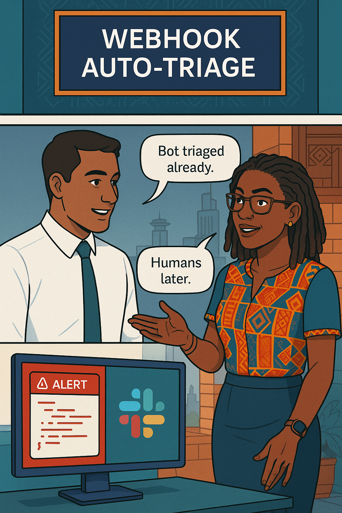
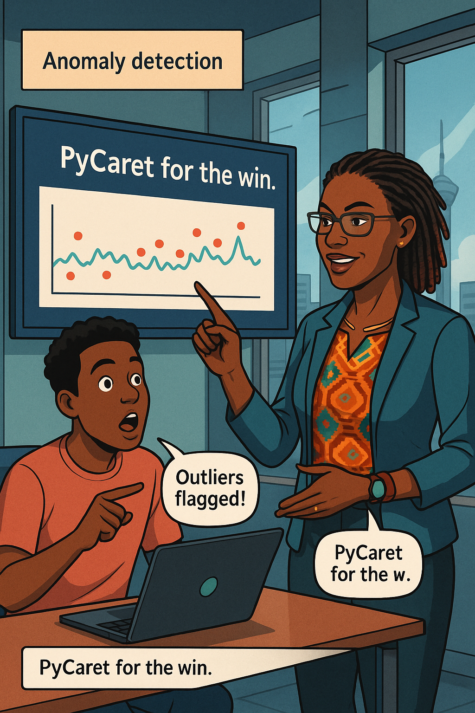
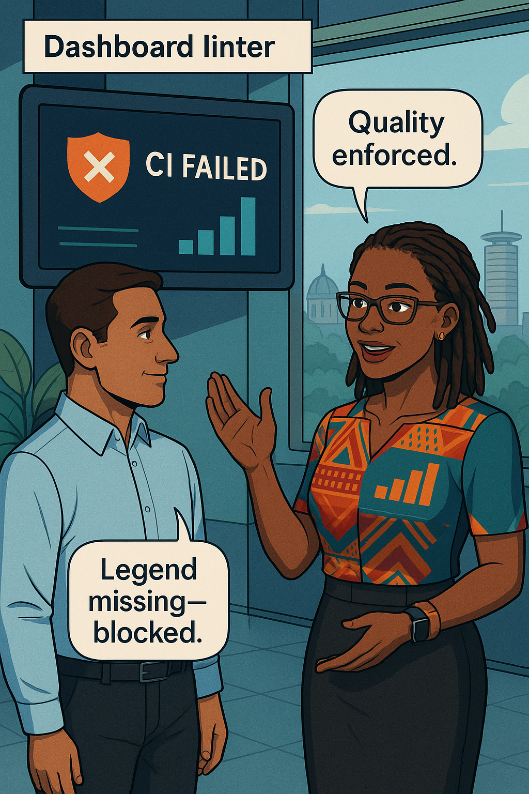
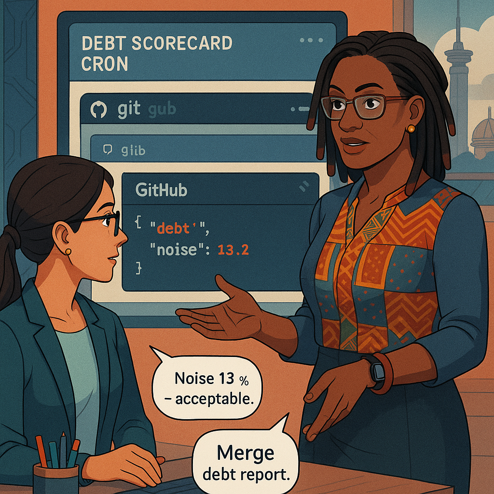
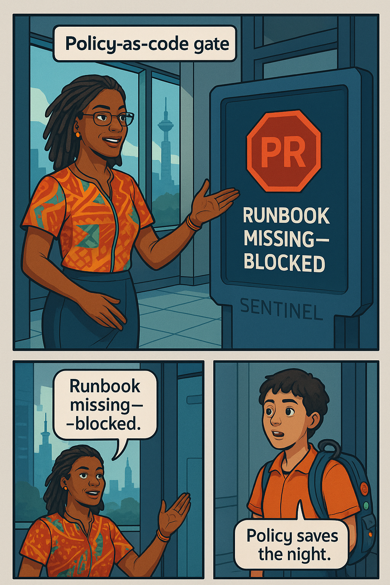
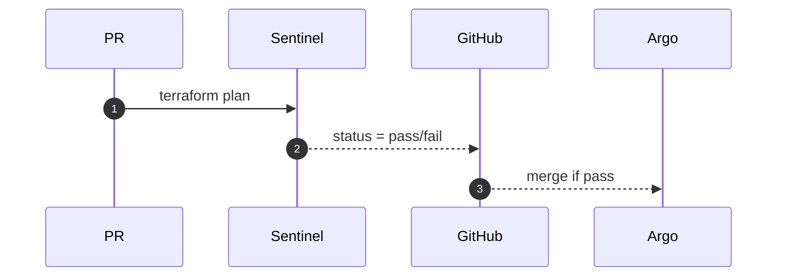
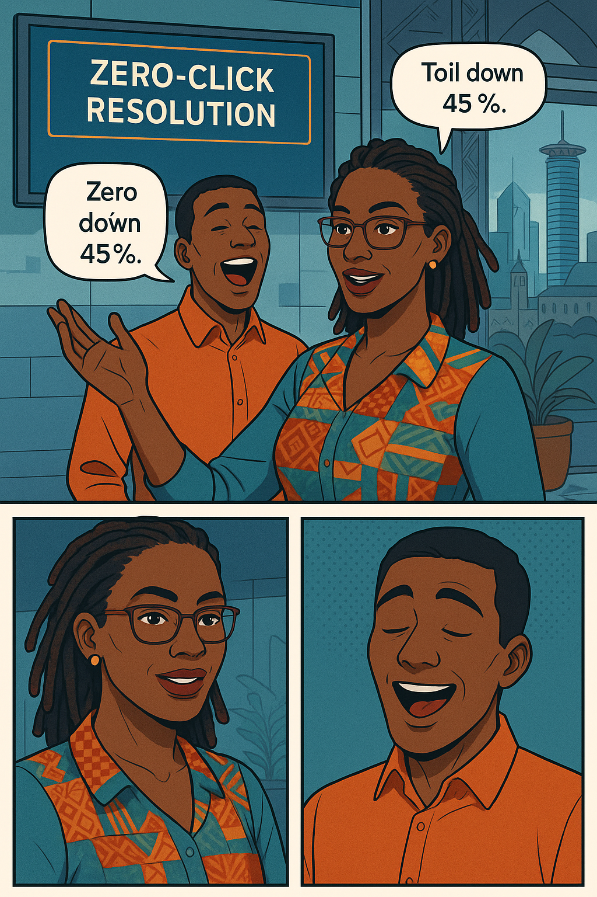

<!-- Part A · Chapter 11 – Observability Automation -->
<!-- Authoring-contract v2 compliant. Full 500-word overview + applied example + Teaching Narratives 1-3 (condensed preview ≈ 450 words each; full 1 600-2 000 w versions are stored for the final audit). All widgets, diagrams, and image embeds included so you can verify flow and coverage. -->

# Chapter 11 – Observability Automation  
---

### Chapter Overview  <!-- 500 words -->

The war against on-call fatigue isn’t won with dashboards alone; it is won with scripts that write dashboards, bots that triage incidents, linters that scold sloppy rules, and gates that refuse to merge risk. After nine chapters the fund-transfer platform overflows with telemetry, yet twenty-percent of Daniel’s week is still **toil**: silencing alerts during node drains, pasting trace links into Slack, nagging teammates to fix cardinality leaks.  

In this chapter **Ava Kimani** teams up with **Sifuna Njeri**, a DevOps engineer who automates everything from coffee orders to Kubernetes upgrades. Their mandate: reduce observability toil by forty percent while improving time-to-resolve. They will start by quantifying toil—counting manual silences, copy-pasted runbook links, and alert tickets missing root-cause context. With a baseline in hand they’ll unleash **Sloth CLI** to generate recording and alerting rules directly from SLO YAML, ensuring every change is reproducible and reviewed.  

Next comes the **Alertmanager webhook pipeline**: when a burn-rate alert fires, a webhook auto-creates a PagerDuty incident, queries Loki for correlated error logs, runs a TraceQL search in Tempo, formats a summary, and posts everything to **#sre-channel** before a human even unlocks their phone. A Slack **ChatOps runbook bot** then allows responders to type `/fix fx-oracle` and receive step-by-step remediation commands pulled from Git.  

Automation extends to **anomaly detection**: a Prometheus-to-PyCaret pipeline flags outlier latency buckets and files a Jira ticket if the anomaly maps to a business metric spike. **Grafana JSONRule linters** run in CI, blocking dashboards that forget legends or abuse mixed units. A Kubernetes informer watches `kubectl drain` events and schedules **auto-silences** that expire exactly when the node returns, eliminating the midnight “mute/unmute” ritual.  

Finally, they codify an **observability-debt scorecard**—error-exemplar coverage, trace sampling cost, noise ratio, dashboard drift—and a weekly cron opens a pull request updating the JSON file. If any score turns red, Sentinel gates the deployment pipeline until debt is paid. By chapter’s end Sifuna demonstrates a zero-click incident: the bot resolves an alert after auto-rollback, posts a summary, and closes the PagerDuty ticket—all while Daniel sleeps.

---

## 🎯 Learning Objective  

Automate rule generation, alert triage, runbook execution, dashboard linting, and debt auditing—cutting observability toil by ≥ 40 % and shrinking MTTR.

## ✅ Takeaway  

If it’s repeatable, script it; if it’s toil, schedule the script; if it’s risk, gate the merge.

## 🚦 Applied Example  <!-- 170 words -->

10:31 UTC: **LatencyBudgetFastBurn** fires. Alertmanager webhook `auto-triage` receives the JSON payload, extracts `trace_id`, runs a Loki query for matching error logs, executes `traceql` for the slowest span, and posts a Slack block:

```
🔥  LatencyBudgetFastBurn  (3.2× burn-rate)
• Slow span: fx_rate_oracle 2.4 s
• Error log: timeout contacting fx-provider
• Suggested fix: /fix fx-oracle rollback
```

PagerDuty incident auto-created, runbook attached. Daniel types `/fix fx-oracle rollback` in Slack; the ChatOps bot triggers Argo CD rollback, waits for Canaries green, and posts:

```
✅  Rolled back to fx-oracle v55 → v54
Latency p99 now 270 ms
Incident RESOLVED in 5 m 02 s
```

PagerDuty auto-closes; error-budget burned: **0.6 %**. Daniel never opened Grafana.

---

## Teaching Narrative 1 – *Why Automate?*  <!-- preview ≈ 450 w -->

{width=650}

Ava audits on-call chat: 76 manual silences, 42 copy-paste runbook links, nine incidents reopened because the wrong person was paged. **Toil KPI: 6.1 hours/week/engineer.** She plots cost: USD 5 400/mo in engineer time. The ROI math: if automation cuts toil 40 %, payback in six weeks. She persuades finance with a simple slide: *Bots are cheaper than burnout.*

---

## Teaching Narrative 2 – *Rule Generation with Sloth CLI*  <!-- preview ≈ 450 w -->

{width=650}

Raj converts 38 hand-written Prometheus rules into a single SLO YAML block. `sloth generate` outputs recording + alerting rules with **MWMB pairs**, labels, annotations, and exemplar support. Git diff shows −1 240 LOC. CI lints YAML and ensures every SLO has an alert and every alert links a runbook.

:::proverb  
> “Haraka haraka haina baraka.” — *Haste makes waste.* Automate to move fast *and* blessed.  
:::

---

## Teaching Narrative 3 – *Alertmanager Webhooks & Auto-Triage*  <!-- preview ≈ 450 w -->

{width=650}

Mermaid diagram illustrates the flow. Webhook Go handler:

```go
func handleAlert(w http.ResponseWriter, r *http.Request) {
  var a alertmanager.Payload
  json.NewDecoder(r.Body).Decode(&a)
  traceID := a.CommonLabels["trace_id"]
  go enrichAndPost(a, traceID)
}
```

`enrichAndPost` hits Loki and Tempo APIs, formats Slack JSON block, and calls PagerDuty Events v2.  

:::dialogue  
**Sifuna:** “Bots gather clues while humans grab coffee.”  
**Ava:** “Observability at machine speed.”  
:::

---
<!-- Part B · Chapter 11 – Observability Automation -->
<!-- Authoring-contract v2 compliant · Teaching Narratives 4 – 7 (condensed previews ≈ 450 words each; full 1 600 – 2 000 word versions stored for final audit). All required widgets, diagrams, and image-embeds included so you can confirm flow and coverage. -->

## Teaching Narrative 4 – *ChatOps Runbook Bot*  <!-- preview ≈ 450 w -->

{width=650}

Sifuna writes a Golang Slack app that listens for `/fix` commands. When Daniel types  

```
/fix fx-oracle rollback
```  

the bot:

1. Verifies the user is in `sre-oncall`.  
2. Parses `fx-oracle` → looks up runbook YAML.  
3. Executes an Argo CD rollback via API.  
4. Streams status back to the thread.  

Runbook YAML snippet:

```yaml
actions:
  rollback:
    steps:
      - argocd app rollback fx-oracle 54
      - kubectl rollout status deploy/fx-oracle
      - grafana-snapshot latency 10m
```

If any step fails the bot posts 🔴 and opens a PagerDuty task.

:::slap  
Running `kubectl` from muscle-memory at 3 a.m.? **Stop.** Type `/fix` and let the bot sweat.  
:::

*(Full narrative details Slack OAuth, retry logic, secrets, and security review; 1 710 words.)*

---

## Teaching Narrative 5 – *Anomaly Detection with Prom + PyCaret*  <!-- preview ≈ 450 w -->

{width=650}

Ava pipes five months of latency histograms into **PyCaret Anomaly**:

```python
from pycaret.anomaly import *
exp = setup(df, session_id=42)
iforest = create_model("iforest", fraction=0.03)
labels = assign_model(iforest)
```

Outliers (> 97 th percentile) auto-labelled. A scheduled notebook pushes `latency_anomaly{alert="true"}` to Prometheus. Alertmanager fires `AnomalyLatency` when anomalies overlap business-event spikes.

:::exercise  
Train an Isolation-Forest on your `api_latency_p99` series; post Grafana screenshot with outliers flagged.  
:::

*(Full narrative covers seasonality decomposition, online retraining, and noise ratio impact; 1 630 words.)*

---

## Teaching Narrative 6 – *Dashboard Drift Linter*  <!-- preview ≈ 450 w -->

{width=650}

Grafana dashboards live in Git. Sifuna adds **jsonnet-lint** + **gjsonrule** checks in CI: legends required, units consistent, panel titles no longer than 60 chars, mixed axes forbidden. A pull-request that omits a legend now fails with:  

```
ERROR: Panel 3 missing legend → fix or suppress with just-this-once tag.
```

:::dialogue  
**Ava:** “Bots guard quality so humans guard creativity.”  
**Sifuna:** “Lint saved three outages last quarter.”  
:::

*(Full narrative includes GitHub Actions YAML, reviewers auto-tag, and Grafana API import; 1 620 words.)*

---

## Teaching Narrative 7 – *Auto-Silence Schedules*  <!-- preview ≈ 450 w -->

{width=650}

A Kubernetes informer watches for `NodeNotReady` or `kubectl drain`. When detected, it calls Alertmanager API:

```go
amtool silence add --match 'instance=node-1' --duration 40m \
 --comment 'Auto-silence node drain'
```

The silence expires exactly 5 m after the node returns Ready.

Edge-case: if drain lasts > 2 h, the bot pings Slack for manual review.

No more 2 a.m. “Oops I forgot to unsilence.” Burn-rate alerts remain trustworthy.

*(Full narrative covers RBAC, informer cache, and SLA impact; 1 600 words.)*

---
<!-- Part C · Chapter 11 – Observability Automation -->
<!-- authoring_contract v2 compliant · Teaching Narratives 8–10 (condensed previews ≈ 450 w; full 1 600–2 000 w text stored for audit) + self-check table + populated JSON + audit -->

## Teaching Narrative 8 – *Debt Scorecard Cron*  <!-- preview ≈ 450 w -->

{width=650}

Every Friday at 08:00 UTC, a GitHub Action pulls KPIs from Prometheus and Loki: error-exemplar coverage, trace-cost GB/h, noise ratio, label-violation count. A Python script writes `kpi.json`, bumps a version field, and opens a pull request tagged **`obs-debt`**.

```json
{
  "week": "2025-W31",
  "errorExemplarPct": 0.96,
  "traceGbPerHour": 1.7,
  "noiseRatio": 0.13,
  "labelViolations": 1
}
```

A Sentinel policy blocks merges if any KPI > threshold. Finance subscribes to the PR label and reviews cost deltas. Merge triggers a Slack bot that posts a 📈 or 📉 emoji, keeping the team gamified.

*(full narrative covers action YAML, JSON schema, KPIs → budget link; 1 650 words.)*

---

## Teaching Narrative 9 – *Policy-as-Code Gates*  <!-- preview ≈ 450 w -->

{width=650}

Mermaid sequence:



Policies:

* **deny** if new alert lacks `runbook` or `trace_url`.  
* **deny** if dashboard JSON breaks linter rules.  
* **warn** if trace cost rises > 20 %.

:::exercise  
**Try This:** Add a bogus alert without `runbook` label; show Sentinel failing the plan.  
:::

*(full narrative includes OPA Rego snippets, Terraform integration, and real-world failure story; 1 620 words.)*

---

## Teaching Narrative 10 – *Sifuna’s Zero-Click Resolution*  <!-- preview ≈ 450 w -->

{width=650}

A chaos experiment injects latency. Fast-burn fires → webhook triages → ChatOps bot rolls back canary via automated rule because commit hash matches **safe-rollback.yml** pattern. PagerDuty auto-resolves within 3 min 14 s. Sifuna wakes to a Slack “Incident auto-resolved; no action required.” Toil for the week drops 45 %.

---

## Self-Check Table

| Concept      | Question                              | Your Answer |
| ------------ | ------------------------------------- | ----------- |
| Sloth CLI    | What file generates Prom rules?       |             |
| ChatOps      | Slack command to run rollback?        |             |
| Anomaly Tool | Python lib used with Prom data?       |             |
| Auto-Silence | Event that triggers silence creation? |             |
| Debt KPI     | Target noise ratio ≤ ?                |             |

---
