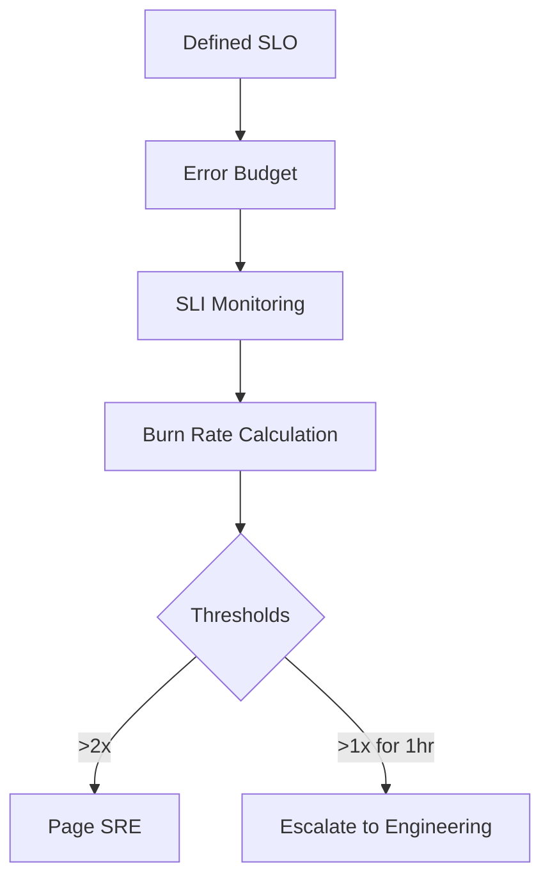

# 🧱 **Day 6: SLIs, SLOs & Error Budgets (Deep Build)**

**Character:** Felix – Berlin  
**Style:** Clinical, focused, allergic to vague reliability goals  
**Vibe:** “If you don’t measure it, you’re either guessing or lying.”

---

## 🎯 Learning Objectives

### 🔍 Beginner
- Define and distinguish SLI, SLO, SLA  
- Understand the role of an error budget  
- Identify strong vs weak indicators of reliability

### 🧩 Intermediate
- Calculate availability and latency SLIs  
- Create structured SLOs from existing telemetry  
- Track burn rates and thresholds using example dashboards and logic

### 💡 Advanced / SRE Level
- Architect telemetry pipelines that feed SLIs  
- Implement burn-rate alerting using Prometheus or equivalent  
- Design a multi-tiered SLO policy for critical vs best-effort services  
- Align engineering effort with SLO impact and error budget status

---

## 💥 Incident Hook: “The SLA Was Fine, But the Customer Was Gone”

> “We hit 99.95% last quarter. SLO green.  
> But one major customer hit five consecutive errors at a critical time.  
> Our dashboards didn’t blink, but Sales did.  
> The customer churned.  
> The CFO was not comforted by our math.  
> And *that’s* when we started measuring user-centric SLIs, not vanity uptime.”

---

## 🧠 Core Concepts (Expanded)

### 🔹 The SLO Stack: SLI → SLO → SLA → Budget

```mermaid
flowchart TD
    A[SLI: measured indicator] --> B[SLO: internal reliability target]
    B --> C[SLA: contractual agreement]
    B --> D[Error Budget: (1 - SLO)]
    D --> E[Budget Policies: Release or Repair]
```

🧠 Definitions:

- **SLI (Service Level Indicator):**  
  > A precise measurement of system behavior  
  > _e.g., % of successful requests, p95 latency_

- **SLO (Service Level Objective):**  
  > A target threshold for the SLI  
  > _e.g., 99.95% of requests < 500ms over 30 days_

- **SLA (Service Level Agreement):**  
  > A business contract with penalties  
  > _e.g., “If availability drops below 99.9%, we refund 10%”_

- **Error Budget:**  
  > The amount of failure you’re allowed before breaking the SLO  
  > _e.g., 0.05% = ~22 mins/month of permitted downtime_

---

### 🔹 Types of SLIs

#### 📏 **Latency-based:**
```text
SLI: % of requests < 300ms
SLO: 99.9%
```

#### ❌ **Error-rate based:**
```text
SLI: 5xx error rate over 5 minutes
SLO: ≤ 0.1%
```

#### 🌐 **Availability:**
```text
SLI: % of successful responses (2xx or 3xx) / total requests
```

#### 🧠 **User-Centric SLIs (Advanced):**
```text
SLI: % of sessions without failed requests
SLI: % of checkout journeys without latency spikes
```

> ✅ Good SLIs: Are measurable, user-focused, and alertable  
> ❌ Bad SLIs: CPU usage, “server is up,” average latency

---

### 🔹 Error Budget Burn Rate & Alerts



🧠 Burn Rate = **(budget consumed / time consumed)**  
Example:  
- 99.95% SLO = ~22 minutes of allowed failure per 30 days  
- If you burn 10 minutes in 2 days, you’re burning 7x faster than allowed  
- Page at 2x. Escalate at 1x over an hour.

---

### 🔹 Budget Policy Design

| Condition | Action |
|----------|--------|
| Burn rate < 0.5x | Safe to deploy, iterate |
| Burn rate ~1.0x | Watch closely, slow down releases |
| Burn rate >2.0x | Freeze releases, prioritize reliability work |
| Budget exhausted | No deploys, force triage or rollback |

> “Error budgets turn SLOs into *engineering policies*, not just charts.”

---

## 🧪 Simulation Exercise

**Scenario:**

You operate a critical API with this SLO:

```text
99.95% of requests must complete under 500ms
```

**In the last 24 hours:**
- Total requests: 4,000,000  
- Requests > 500ms: 2,800  
- Errors (5xx): 1,900  
- Budget for 30 days: ~22 minutes of allowed latency/error breach

📌 **Task:**
- What is your current SLI?
- Are you violating your SLO?
- Estimate your burn rate. Should you page anyone?

📝 _Provide calculation logic, thresholds, and recommended action._

---

## 🛠 Tools & Diagrams

### Prometheus-style query (SLI)

```promql
rate(http_requests_total{status!~"2.."}[5m]) / rate(http_requests_total[5m])
```

### Error Budget Remaining (recorded rule):

```promql
1 - (rate(errors_total[30d]) / total_requests)
```

---

### 📊 Example SLO Dashboard (described)

| Panel | Purpose |
|-------|---------|
| Line Chart – % good requests | Show actual vs target |
| Error Budget Remaining | Visual countdown |
| Burn Rate Gauge | Color coded (green/yellow/red) |
| Deploys vs Burn Events | Detect regression after release |

---

## 🕳️ Common Pitfalls (Detailed)

- 💣 **Overly tight SLOs**  
  → “99.999% for a staging server”  
  → Exhaust budget with minor bumps

- 📊 **Averages instead of percentiles**  
  → p50 latency hides real user pain

- 🔧 **Too many SLOs**  
  → Alert fatigue, impossible prioritization

- 🧟‍♂️ **SLAs with no enforceable SLOs**  
  → Legal bluff, no observability

---

## 📜 Felix’s Commandments

1. “If you measure averages, you deserve surprises.”  
2. “A good SLO gives you confidence to ship—or a reason not to.”  
3. “Don’t chase 100%. Build space to fail.”

---

## 🤝 Handoff to Tomorrow

> “You’ve defined expectations. But what happens when you fail to meet them?  
> Mina’s back tomorrow with incident response: the *recovery ritual* that starts when the metrics say stop.”

---

## 📦 Day 6 Artifacts (Expanded)

- ✅ **Mermaid Diagrams**:
    - SLI → SLO → SLA pipeline
    - Burn rate & alert trigger flow
    - Error Budget Usage Tree
- ✅ **Simulation Exercise** with data + response template
- ✅ **SLI design examples** (Good, Bad, User-centric)
- ✅ **PromQL-style logic snippets**
- ✅ **Visual dashboard descriptions**
- ✅ **Expanded pitfalls + commandments**

