# Chapter 1: From Monitoring to Incident Response

## Chapter Overview

Welcome to the brutal reality of modern SRE: your dashboards are lying, your “root cause” is a fairy tale, and your company’s next million-dollar incident will be detected by a customer tweet before it ever glows red on your NOC wall. This chapter rips apart the cozy delusions of traditional monitoring and drags you—kicking and screaming—into the high-stakes world of evidence-based incident response. We don’t care how green your tiles are; if your customers can’t move money or log in, your “all clear” is a hallucination. This isn’t a gentle mindset shift—it’s a hostile takeover. We’ll show you how to stop worshipping at the altar of component health, break your addiction to hero engineers, and start treating incidents as inevitable, learnable, and—most importantly—preventable. If you want a pat on the back for your uptime, look elsewhere. If you want an unvarnished guide to saving your business from the next silent disaster, keep reading.

---
## Learning Objectives

- **Recognize** and demolish the “Green Wall Fallacy” by validating service health beyond dashboards.
- **Distinguish** between symptoms and actual causes to avoid Groundhog Day incidents.
- **Shift** your operational focus from “how fast did we fix it?” to “how soon did we know it was broken?” (TTD over TTR).
- **Abandon** the myth of singular root cause and **adopt** systems thinking for postmortems and prevention.
- **Implement** structured, team-based incident response to banish single-point-of-failure heroics.
- **Embed** a relentless feedback loop that turns every outage into a reliability upgrade.
- **Measure** what actually matters: customer experience, not just component metrics.

---
## Key Takeaways

- “All green” dashboards are security blankets for the naive—trust, but verify with real transactions or get blindsided.
- Symptom-chasing is just incident whack-a-mole; if you don’t hunt for causes, enjoy your recurring monthly outages.
- Time-to-detection is the only operational metric that matters—nobody cares how quickly you fixed a problem they found for you.
- Root cause is a bedtime story for managers. Real failures are hydras: kill one head and two more appear unless you map the whole beast.
- Hero engineers make great headlines—until they’re on PTO or burn out. Structure and process are the only scalable heroes.
- If your team isn’t learning from incidents and improving, you’re paying interest on technical debt in blood (and dollars).
- Celebrating green infrastructure while customers rage on Twitter is peak SRE malpractice; align your metrics with business pain, or get ready for your next crisis call—from the CEO.

---

You wanted irreverence, wit, and zero sugarcoating. There it is—now go fix your monitoring before your next “green” outage.

---
## Panel 1: The Green Wall Fallacy
### Scene Description

A bleary-eyed SRE is jolted awake at 2:57 AM by his pager. He frantically checks his laptop, where a wall of green dashboard tiles contradicts the alert. It feels like staring at a car's dashboard, where all the lights are off, yet the engine is sputtering and smoke is billowing from under the hood. In the background, a phone rings insistently as customer reports pour in, each one underscoring that something is deeply wrong despite the reassuring green tiles. Katherine is caught in the critical moment of decision: does she trust the serene dashboard, or does she dig deeper, shifting from a monitoring mindset to an incident response mindset?
### Teaching Narrative
The transition from monitoring to incident response begins with overcoming the "Green Wall Fallacy" - the dangerous assumption that green dashboards mean everything is functioning properly. This fundamental shift requires developing evidence-based skepticism about monitoring systems themselves.

Traditional monitoring focuses on system health indicators (CPU, memory, disk space) that may appear normal while critical services fail. In contrast, incident response prioritizes user experience and service outcomes over dashboard colors. This mindset shift is especially crucial in banking environments where "green" systems may still be failing to process transactions, authorize withdrawals, or update account balances.

The key transition here involves:

1. Moving from trusting monitoring to verifying service functionality
2. Prioritizing customer impact over system metrics
3. Developing a healthy skepticism about dashboard representations
4. Accepting that incidents can exist despite monitoring systems suggesting otherwise
### Common Example of the Problem

A major retail bank's payment gateway begins rejecting credit card transactions during the early morning hours. The monitoring dashboard shows all systems functioning normally - server CPU, memory, and network metrics are all within acceptable thresholds and displayed as green. However, customers are increasingly calling the support line reporting failed payments, and the transaction success rate has silently dropped to 65%. The operations team initially dismisses the issue because their dashboards show no problems, losing precious minutes while the failure affects more customers. By the time they realize the severity, over 15,000 transactions have been declined despite "healthy" systems.

#### Sequence of Events


This sequence highlights how reliance on traditional dashboards delayed incident identification and response. The lack of user-experience-focused monitoring obscured the issue until significant customer impact had already occurred.
### SRE Best Practice: Evidence-Based Investigation

When faced with the Green Wall Fallacy, experienced SREs follow a systematic approach to validate service health beyond dashboard metrics. Use the following checklist during incident investigations to ensure a thorough and evidence-based approach:

#### Evidence-Based Investigation Checklist:

- **[ ] Verify with synthetic transactions**  
  Run synthetic test transactions that simulate real customer journeys. Confirm or disprove customer-reported issues independently of dashboard metrics.

- **[ ] Triangulate data sources**  
  Gather evidence from multiple sources such as direct API tests, customer reports, transaction logs, and independent third-party monitoring to form a well-rounded view of the issue.

- **[ ] Check for silent failures**  
  Investigate failure modes that might not trigger traditional monitoring. Look for scenarios like failed transactions returning valid HTTP responses with error payloads instead of outright connection failures.

- **[ ] Examine boundary components**  
  Prioritize analyzing interfaces between systems (e.g., API gateways, payment processors, authentication services) where monitoring blind spots are common.

- **[ ] Validate data freshness**  
  Confirm the recency of monitoring data to ensure it reflects the current system state. Stale data can give a misleading impression of system health during real-time incidents.

#### Why This Matters:
Evidence from multiple financial institutions reveals that service-focused verification detects customer-impacting incidents an average of 12 minutes earlier than relying solely on traditional monitoring alerts. Use this checklist to transition from monitoring assumptions to actionable incident response.
### Banking Impact

The Green Wall Fallacy in banking environments can have severe consequences that extend far beyond technical metrics. The table below summarizes key impacts, their descriptions, and real-world examples to highlight the critical importance of transitioning from monitoring to incident response:

| **Impact**              | **Description**                                                                                            | **Example/Metric**                                                                                                 |
| ----------------------- | ---------------------------------------------------------------------------------------------------------- | ------------------------------------------------------------------------------------------------------------------ |
| **Financial Losses**    | Undetected payment failures result in lost transaction volumes and penalty fees from payment networks.     | A 5-minute delay in detection for a major bank processing $2M/minute in transactions results in $10M lost revenue. |
| **Reputation Damage**   | Customers blame the bank for declined transactions, causing measurable drops in customer trust.            | A 10-point drop in Net Promoter Score (NPS) after a 1-hour outage affecting card payments.                         |
| **Regulatory Scrutiny** | Delayed incident reporting violates regulatory requirements, leading to penalties and compliance risks.    | A $3M fine issued by a financial regulator due to a 24-hour delay in incident reporting.                           |
| **Compensatory Costs**  | Longer detection increases the number of affected transactions, inflating compensation and recovery costs. | A transaction failure affecting 1M customers results in $15M in compensation and fee reversals.                    |
| **Market Confidence**   | Significant outages reduce investor confidence, potentially impacting stock prices and market valuation.   | A 2% stock price drop following a publicized 3-hour outage tied to monitoring failures.                            |

The average cost of detection delays in major banking institutions is estimated at **$138,000 per minute** for critical payment services. This underscores the urgent need for robust incident response practices that prioritize user experience and service outcomes over misleading dashboard metrics.
### Implementation Guidance

To overcome the Green Wall Fallacy in your organization, follow these five actionable steps:

1. **Implement service-level synthetic transactions**: Develop and deploy automated tests that execute complete business transactions (payments, transfers, trades) through production pathways every 1-5 minutes. Ensure these tests verify actual business outcomes, not just technical responses. Below is an example script for a synthetic transaction to validate a payment workflow:

   ```python
   import requests

   def test_payment_transaction():
       # Step 1: Simulate a user login
       login_response = requests.post(
           "https://api.examplebank.com/login",
           json={"username": "test_user", "password": "secure_password"}
       )
       assert login_response.status_code == 200, "Login failed"

       # Step 2: Initiate a payment
       payment_response = requests.post(
           "https://api.examplebank.com/payments",
           json={
               "from_account": "123456789",
               "to_account": "987654321",
               "amount": 100.00,
               "currency": "USD"
           },
           headers={"Authorization": f"Bearer {login_response.json()['token']}"}
       )
       assert payment_response.status_code == 200, "Payment initiation failed"

       # Step 3: Verify payment success
       payment_status = payment_response.json().get("status")
       assert payment_status == "success", f"Unexpected payment status: {payment_status}"

       print("Synthetic transaction test passed!")

   if __name__ == "__main__":
       test_payment_transaction()
   ```

2. **Deploy customer-centric alerting**: Create alert thresholds based on customer experience metrics (transaction success rates, completion times, error counts) rather than infrastructure metrics. Use the following workflow to design customer-focused alerts:

   ```mermaid
   graph TD
       A[Define Customer Experience Metrics] --> B[Set Acceptable Thresholds]
       B --> C[Monitor Customer Transactions]
       C --> D[Create Alerts for Threshold Breaches]
       D --> E[Send Alerts to Incident Response Team]
   ```

3. **Establish a verification runbook**: Develop a clear, step-by-step protocol for first responders to validate service health through direct testing, regardless of what dashboards display. Below is an example outline for a verification runbook:

   ```
   Verification Runbook:
   1. Check Synthetic Transaction Results:
      - Confirm results from the synthetic transaction system.
   2. Manual Test:
      - Attempt to replicate user transactions via the production interface.
   3. Cross-Verify Logs:
      - Validate transaction logs in the database or log aggregation system.
   4. Engage Support Teams:
      - Notify relevant teams if discrepancies persist.
   ```

4. **Create independent monitoring paths**: Ensure critical services have multiple independent monitoring methods that don't share failure modes. For example:
   - Use synthetic transactions for proactive checks.
   - Implement real user monitoring (RUM) for live customer activity.
   - Leverage external uptime monitoring services for an unbiased perspective.

   Example independent monitoring workflow:
   ```mermaid
   flowchart TD
       Internal_Metrics[Internal Metrics Monitoring] --> Incident_Detection[Incident Detection]
       Synthetic_Tests[Synthetic Testing] --> Incident_Detection
       RUM[Real User Monitoring] --> Incident_Detection
       Incident_Detection --> Alerting[Trigger Alerts]
   ```

5. **Conduct "green outage" drills**: Regularly simulate scenarios where dashboards show green while services fail. Train teams to detect these discrepancies through alternative verification methods and measure improved response times. Example drill scenario:
   - Simulate a payment service failure without altering system health metrics.
   - Require responders to identify the issue using synthetic transaction failures and manual verification steps.
   - Record response time and identify areas for improvement.
## Panel 2: Symptoms vs. Causes - The Diagnostic Leap
### Scene Description

A bustling banking operations center serves as the backdrop, where two SREs adopt contrasting approaches to investigate a payment processing issue. On one side, an SRE frantically scrolls through endless system logs, surrounded by multiple dashboards flashing red metrics, each indicating various system anomalies. Their focus is on resolving alerts as quickly as possible to bring the metrics back to green.

On the other side of the room, another SRE takes a structured approach, standing in front of a whiteboard. They methodically map out the payment flow, drawing boxes and arrows to represent system components and their dependencies. Key failure points are highlighted, with annotations distinguishing between primary symptoms (e.g., "high latency in service A") and potential underlying causes (e.g., "database connection pool saturation").

A customer service representative enters the scene with a tablet, displaying customer complaints about failed transactions. The SRE at the whiteboard incorporates this data into their analysis, adding a new layer of context to the diagram. The contrasting approaches visually emphasize the difference between reacting to symptoms and diagnosing root causes.

#### Text-based Representation of the Whiteboard Diagram:
```
[Customer Device] --> [API Gateway] --> [Authentication Service] --> [Payment Processor]
         |                                  |
         v                                  v
[Customer Complaints]              [Database Connection Pool]
```

The chaotic energy of the dashboard-focused SRE juxtaposed with the calm, systematic approach of the diagram-focused SRE highlights the tension between addressing immediate symptoms and identifying root causes.
### Teaching Narrative
Monitoring identifies symptoms - the visible manifestations of problems that trigger alerts. Incident response requires diagnosing causes - the underlying conditions creating those symptoms. This distinction represents a critical cognitive shift for engineers transitioning from production support to SRE roles.

The monitoring mindset seeks to restore green metrics by addressing symptoms: restarting services, clearing queues, or adding resources. While these actions may temporarily resolve alerts, they often mask deeper issues. The incident response mindset seeks to understand system behavior through the relationship between observable symptoms and their underlying causes.

In banking systems, this distinction is particularly important due to the complex, interdependent nature of financial transactions. A payment failure symptom might stem from multiple potential causes: authentication services, database connections, network latency, or third-party processor issues. The diagnostic leap requires:

1. Mapping system dependencies to identify potential failure points
2. Distinguishing between primary symptoms and secondary effects
3. Developing hypotheses about underlying causes
4. Testing assumptions through targeted investigation rather than shotgun troubleshooting
### Common Example of the Problem

A major investment bank's trading platform experiences intermittent transaction timeouts during peak trading hours. The monitoring system shows clear symptoms: elevated response times, occasional timeouts, and increased error rates. The traditional support team repeatedly restarts the application servers when alerts trigger, temporarily resolving the symptoms. However, the issues return within hours, creating a cycle of reactive restarts that disrupt trading activities. This pattern continues for three weeks, with the team treating only the visible symptoms rather than investigating the underlying cause.

The timeline below outlines the sequence of events leading to the eventual discovery of the root cause, illustrating the difference between addressing symptoms and diagnosing causes.

```mermaid
gantt
    dateFormat  HH:mm
    axisFormat  %H:%M
    title Timeline of Events: Trading Platform Issue

    section Symptoms
    Elevated response times    :symptoms1, 00:00, 4h
    Intermittent timeouts      :symptoms2, 01:00, 3h
    Increased error rates      :symptoms3, 02:00, 2h

    section Reactive Actions
    Restart app servers        :react1, 03:00, 1h
    Temporary symptom relief   :react2, 04:00, 1h

    section Recurrence
    Symptoms reappear          :recur1, after react2, 3h
    Additional restarts        :recur2, after recur1, 1h

    section Root Cause Discovery
    Severe performance degradation :root1, after recur2, 3h
    Deep investigation initiated   :root2, after root1, 2h
    Root cause identified (DB index corruption) :root3, after root2, 1h
```



This timeline highlights the repetitive cycle of reactive actions and symptom recurrence, emphasizing the need for a diagnostic approach. Eventually, during a particularly severe occurrence, a deeper investigation reveals the actual cause: a database index corruption causing gradually degrading query performance under load. Each application restart exacerbated the problem by flooding the database with new connections, underscoring the importance of understanding the system's behavior instead of just addressing surface-level symptoms.
### SRE Best Practice: Evidence-Based Investigation

Effective SREs apply structured diagnostic approaches to move beyond symptoms to causes. The following checklist summarizes five key diagnostic methods, making it easier to apply them systematically during investigations:

| **Diagnostic Method**               | **Description**                                                                                   | **Key Actions**                                                                                                            |
| ----------------------------------- | ------------------------------------------------------------------------------------------------- | -------------------------------------------------------------------------------------------------------------------------- |
| **System Modeling**                 | Create a visual representation of the transaction flow, highlighting components and dependencies. | - Map out all system components and their interactions.<br>- Identify potential failure points and blind spots.            |
| **Hypothesis-Driven Investigation** | Formulate testable hypotheses about potential causes and validate them systematically.            | - Develop specific assumptions about root causes.<br>- Use evidence to confirm or eliminate each hypothesis.               |
| **Correlation Analysis**            | Identify relationships between symptoms and timing patterns to trace propagation of effects.      | - Compare metrics to find patterns.<br>- Determine which symptoms appeared first and how they triggered downstream issues. |
| **Counterfactual Testing**          | Test causal relationships by manipulating variables and observing system behavior in isolation.   | - Run targeted tests in controlled environments.<br>- Validate how specific changes impact the issue.                      |
| **Temporal Analysis**               | Examine the timeline of events to uncover triggers or gradual degradations.                       | - Review logs and metrics over time.<br>- Pinpoint timing patterns or events leading up to the issue.                      |

By applying this checklist during incidents, SREs can transition from reactive symptom management to proactive root cause identification. Evidence shows that organizations using structured diagnostic approaches identify root causes 73% faster than those relying on symptom-based troubleshooting alone, significantly reducing mean time to resolution.
### Banking Impact

The failure to diagnose causes (rather than treating symptoms) creates specific consequences in banking environments:

1. **Recurring incidents**: Treating symptoms while leaving causes unaddressed leads to repeated incidents, creating a pattern of disruption that erodes customer confidence and strains support resources.

2. **Escalating severity**: Unaddressed root causes often worsen over time, with initial minor symptoms eventually leading to catastrophic failures that could have been prevented.

3. **Compliance violations**: Financial regulations often require identifying and addressing root causes. Symptom-based remediation may violate these requirements, triggering regulatory scrutiny.

4. **Operational inefficiency**: The cycle of repeatedly addressing the same symptoms consumes significant operational resources that could be better allocated to improvement initiatives.

5. **Risk accumulation**: Each symptom-based fix without root cause analysis introduces additional complexity and technical debt, increasing the system's overall fragility and risk profile.

#### Cost Impacts of Symptom-Based vs. Root Cause Resolution

| **Impact Type**          | **Symptom-Based Resolution**      | **Root Cause Resolution**        | **Cost Multiplier** |
| ------------------------ | --------------------------------- | -------------------------------- | ------------------- |
| Recurring Incidents      | High frequency of repeated issues | Long-term reduction in incidents | 4-7x higher         |
| Escalating Severity      | Increased likelihood of outages   | Prevention of severe failures    | Up to 10x higher    |
| Compliance Violations    | Regulatory fines and penalties    | Reduced regulatory risk          | Variable            |
| Operational Inefficiency | Wasted resources on firefighting  | Resources redirected to strategy | 2-4x higher         |
| Risk Accumulation        | Increased technical debt          | Improved system stability        | Variable            |

The above table highlights the stark difference in financial and operational impacts between addressing symptoms and diagnosing root causes. For example, recurring incidents due to unaddressed root causes cost financial institutions 4-7 times more than the initial issue when resolved effectively. Similarly, escalating severity can lead to exponentially higher costs as minor issues evolve into full-scale outages. Shifting focus from symptom-based responses to root cause analysis is essential for long-term stability and compliance in banking systems.
### Implementation Guidance

To make the diagnostic leap from symptoms to causes in your organization, implement these five actionable steps. The following flowchart provides a visual guide to the process, ensuring clarity and practical application:


#### Step-by-Step Breakdown:

1. **Develop system topology maps**:  
   Create comprehensive visual representations of your banking systems, including all dependencies, data flows, and integration points. Update these maps regularly and make them accessible to incident responders. This provides a clear starting point for identifying potential failure points.

2. **Implement a hypothesis template**:  
   Establish a structured format for documenting investigative hypotheses. Include the suspected cause, the expected evidence if the hypothesis is true, and specific tests to validate or reject it. This step ensures a methodical approach to diagnostics.

3. **Establish investigation guardrails**:  
   Define clear criteria for when symptom-based remediation (e.g., restarts, clearing queues) is acceptable versus when full causal investigation is required. Base this decision on factors like incident frequency, duration, and customer impact to balance urgency with thoroughness.

4. **Build a pattern library**:  
   Document common failure patterns in your systems, connecting visible symptoms to their historical causes. This accelerates diagnostics for future incidents by leveraging past learnings and observed system behaviors.

5. **Create dedicated diagnostic time**:  
   Allocate protected time for root cause investigation after incidents, even if symptoms have been temporarily mitigated. Make this investigation a mandatory step before closing major incidents to prevent recurrence and improve system resilience.

By following this structured approach, your team can transition from reactive symptom management to proactive root cause analysis, fostering long-term stability in complex systems.
## Panel 3: From Time-to-Resolution to Time-to-Detection
### Scene Description

The scene features a split view comparing two timelines for the same banking incident.

**Traditional Approach Timeline:**
- Incident start is marked at the far left.
- A long period passes before the incident is detected, represented by an extended dashed line.
- Detection is followed by a relatively short resolution period, shown as a shorter solid line.
- The total customer impact is visually significant, with cumulative dollar losses and customer trust metrics increasing rapidly as time progresses.

**SRE Approach Timeline:**
- Incident start is again marked at the far left.
- Detection happens almost immediately, illustrated by a short dashed line.
- A structured response process follows, represented by a steady, controlled solid line.
- Total customer impact is significantly reduced, with slower accumulation of dollar losses and minimized damage to customer trust.

Below is a text-based representation of the timelines for clarity:

```
Traditional Approach:
[ Incident Start ]------( Detection )---[ Resolution ]-----> Customer Impact ↑↑↑↑↑

SRE Approach:
[ Incident Start ]-( Detection )-------[ Resolution ]-----> Customer Impact ↑
```

A prominent clock in the scene highlights the critical minutes ticking by, emphasizing the urgency of reducing Time-to-Detection (TTD). Metrics for financial losses and customer impact further reinforce the contrast between the two approaches.
### Teaching Narrative
One of the most profound shifts in transitioning from monitoring to incident response is reframing success metrics. Traditional IT operations measure Time-to-Resolution (TTR) - how quickly a team resolves an incident after being alerted. SRE recognizes that detection often represents the largest opportunity for improvement.

Time-to-Detection (TTD) measures how quickly an organization identifies that an incident is occurring. In banking environments, where each minute of outage can represent millions in transaction volume and immeasurable customer trust, reducing TTD often yields greater benefit than optimizing resolution processes.

This shift fundamentally changes how teams approach system observability:

1. Monitoring focuses on known failure modes with established thresholds
2. Incident response develops early warning systems for emerging issues
3. Traditional approaches wait for definitive problems before alerting
4. SRE creates leading indicators that identify potential incidents before full impact

Reducing TTD requires both technical systems (better alerting, anomaly detection) and cultural changes (encouraging early escalation, removing barriers to declaring incidents).
### Common Example of the Problem

A global bank's mobile application experiences a subtle degradation in authentication services. The issue begins with occasional login failures affecting approximately 5% of customers. Most users simply retry and succeed, so the problem goes unnoticed. Traditional monitoring thresholds, set to trigger alerts only at 20% error rates, remain silent.

The timeline of events unfolds as follows:

```mermaid
gantt
    title Incident Timeline: Traditional Approach
    dateFormat HH:mm
    section Incident Progression
    Issue Onset          :done, 00:00, 4h
    Detection Delay      :active, 00:00, 4h
    Resolution Time      :done, 04:00, 0.4h
    section Impact Accumulation
    Failed Logins        :active, 00:00, 4h
    Customer Complaints  :active, 01:00, 3h
    Social Media Uproar  :active, 02:00, 2h
```



After four hours, a surge in customer support calls finally alerts the operations team to the issue. By this time:

- Over 200,000 login attempts have failed.
- Customer support wait times have tripled.
- Social media complaints are escalating.

Once identified, the actual fix—a simple configuration update to authentication services—takes only 23 minutes. However, the extended time-to-detection has already caused significant damage to customer experience, trust, and brand reputation. This highlights how relying solely on traditional monitoring and thresholds delays detection, exacerbating the incident's impact.
### SRE Best Practice: Evidence-Based Investigation

Forward-thinking SRE organizations shift focus from resolution speed to detection speed through several proven approaches. The following checklist summarizes key practices to help teams implement evidence-based investigation techniques effectively:

| Practice                              | Description                                                                                                    | Benefit                                                                            |
| ------------------------------------- | -------------------------------------------------------------------------------------------------------------- | ---------------------------------------------------------------------------------- |
| **Statistical Anomaly Detection**     | Use adaptive baseline monitoring to identify subtle deviations from normal patterns before they escalate.      | Detects issues early, even when they don't exceed fixed thresholds.                |
| **Leading Indicator Instrumentation** | Monitor metrics that show changes before customer impact (e.g., slight latency increases, minor error rates).  | Provides early warnings, allowing proactive mitigation.                            |
| **Canary User Segments**              | Monitor small, isolated user groups or transaction samples to detect localized issues.                         | Identifies problems that may remain hidden in aggregate metrics.                   |
| **Cross-System Correlation**          | Analyze patterns across multiple systems to detect issues occurring across system boundaries.                  | Uncovers emergent issues that are not visible in isolated system monitoring.       |
| **Synthetic Minority Transactions**   | Test edge cases and less common transaction types to identify failures before mainstream transactions degrade. | Ensures broader coverage, catching failures in less common but critical scenarios. |

#### Implementation Checklist:
- [ ] Deploy tools for adaptive baseline monitoring with statistical anomaly detection capabilities.
- [ ] Identify and instrument leading indicators relevant to critical services.
- [ ] Define and monitor canary user segments or transaction samples.
- [ ] Set up systems to correlate data and events across multiple platforms and services.
- [ ] Regularly test synthetic transactions, focusing on edge cases and minority scenarios.

By adopting these detection-focused practices, financial institutions have reduced mean time to detection by an average of 76%, significantly minimizing customer impact during incidents.
### Banking Impact

The business consequences of delayed detection in banking environments extend far beyond technical metrics. Below is a summary of key impacts highlighting the importance of reducing Time-to-Detection (TTD):

| **Impact Category**            | **Description**                                                                                                                                           |
| ------------------------------ | --------------------------------------------------------------------------------------------------------------------------------------------------------- |
| **Exponential Impact Growth**  | Each minute of detection delay amplifies customer and financial impact, following an exponential growth pattern.                                          |
| **Customer Experience**        | Subtle, undetected issues degrade customer trust through repeated failures, creating a "death by a thousand cuts" experience.                             |
| **Social Amplification**       | Delays in detection drive customers to social media, escalating public awareness and causing reputational damage beyond directly impacted users.          |
| **Recovery Complexity**        | Prolonged detection gaps lead to more complex recovery efforts, as systems diverge further from normal states and data inconsistencies accumulate.        |
| **Regulatory Reporting Risks** | Regulations often require incident reporting based on incident start times, not detection times, exposing the bank to compliance risks if detection lags. |

#### Key Insight
Analysis from major financial institutions shows that **approximately 80% of customer-minutes of impact during major incidents occur before official detection**. This underscores the critical importance of optimizing detection speed to minimize financial loss, customer dissatisfaction, and reputational damage.
### Implementation Guidance

To successfully shift your organization's focus from time-to-resolution to time-to-detection, follow this structured checklist:

#### **Checklist for Reducing Time-to-Detection (TTD)**
1. **Establish Multi-Level Alerting Thresholds**:
   - Configure graduated alerts for early warnings (e.g., 2% error rate increase).
   - Set higher-priority alerts for critical thresholds (e.g., 10%+ error rates).
   - Regularly review and fine-tune thresholds based on system behavior.

2. **Deploy and Track Detection-Focused Metrics**:
   - Monitor **Mean Time to Detection (MTTD)** as a primary KPI.
   - Track **Detection Accuracy** to identify false positives and negatives.
   - Measure and address your **False Negative Rate** (incidents missed by monitoring).

3. **Implement a Detection Feedback Loop**:
   - Conduct post-incident reviews focused on detection success or failure.
   - Update alerting and monitoring configurations based on these reviews.
   - Prioritize incidents detected by customers as areas for improvement.

4. **Develop Quick Verification Mechanisms**:
   - Create lightweight tools or scripts for on-call staff to verify anomalies.
   - Ensure tools are intuitive and require minimal time to confirm potential issues.
   - Regularly test and refine these tools for faster response times.

5. **Foster a Culture of Early Escalation**:
   - Update team performance metrics to reward early incident declaration.
   - Recognize and celebrate proactive detection efforts, even for false alarms.
   - Provide psychological safety to encourage escalation without fear of blame.

#### **Flow for TTD Improvement Process**


Use this checklist and flow diagram to guide your implementation process and continuously improve your organization's detection capabilities.
## Panel 4: The Myth of the Root Cause
### Scene Description

A post-incident review meeting unfolds in a bank's conference room, buzzing with activity. The room is arranged with a large screen at the front displaying a fishbone diagram labeled "Contributing Factors." The diagram branches into categories like architecture, deployment processes, monitoring gaps, and human factors, each with detailed nodes representing specific issues. Below is a textual representation of the fishbone diagram:

```
Incident: Recent Outage
  ├── Architecture
  │     ├── Legacy Integration
  │     └── Single Point of Failure
  ├── Deployment Processes
  │     ├── Insufficient Testing
  │     └── Rollback Delays
  ├── Monitoring Gaps
  │     ├── Alert Fatigue
  │     └── Missing Metrics
  └── Human Factors
        ├── On-call Escalation Misstep
        └── Ambiguous Runbook
```

Team members with diverse specialties are clustered in small groups, animatedly discussing different branches of the diagram. Some point to specific nodes, debating their interdependencies. A senior manager stands off to the side, visibly frustrated, holding a printed report with bold text demanding "THE root cause for regulators." The tension in the room reflects the challenge of reconciling traditional expectations with systems thinking in incident analysis.
### Teaching Narrative
The monitoring mindset often pursues a singular "root cause" - the one defect or failure that, if addressed, would have prevented an incident. This linear thinking stems from simpler technological environments where cause and effect had clear relationships. The incident response mindset embraces systems thinking and recognizes that modern banking systems are complex adaptive systems where incidents emerge from interactions between multiple components.

This shift requires abandoning the myth of the single root cause in favor of understanding contributing factors and system dynamics. In financial services, with their complex interplay of applications, infrastructure, third-party services, and human operators, incidents rarely have singular causes.

The systems thinking approach to incident analysis:

1. Identifies multiple contributing factors rather than a single culprit
2. Recognizes that perfect components can still create system failures
3. Focuses on improving resilience rather than achieving perfection
4. Acknowledges that human actions occur within system contexts

This represents perhaps the most challenging transition for engineers with traditional backgrounds, as it requires letting go of the satisfying clarity of single-cause explanations.
### Common Example of the Problem

A major bank experiences a two-hour outage in its online banking platform during a busy month-end period. Traditional root cause analysis initially identifies a failed database storage volume as "the root cause" and closes the investigation. However, when a similar outage occurs three months later despite the storage issue being resolved, a deeper investigation is conducted. This reveals a complex interaction of factors that contributed to both incidents.

Below is a timeline illustrating the sequence of events and interactions leading to the initial outage:


The deeper investigation uncovers the following contributing factors that, in combination, created the perfect conditions for system failure:

- Increasing query complexity from a recent feature deployment
- Gradual data growth exceeding original capacity projections
- Inadequate caching logic that amplified database load during peak periods
- Monitoring blind spots that failed to detect early warning signs
- Operational procedures that delayed failover decisions

None of these factors alone would have caused the outage, but their interaction proved catastrophic. By focusing only on the storage failure as the root cause in the first incident, the bank missed the opportunity to address the systemic issues that ultimately led to the repeat failure. This underscores the importance of analyzing incidents through a systems thinking lens, recognizing the interconnected nature of modern banking systems.
### SRE Best Practice: Evidence-Based Investigation

Effective SREs apply systems thinking to incident analysis through several key approaches. The following checklist summarizes these practices, making them actionable and easy to reference:

| Approach                        | Description                                                                                                          | Key Questions                                                                       |
| ------------------------------- | -------------------------------------------------------------------------------------------------------------------- | ----------------------------------------------------------------------------------- |
| **Contributory Factor Mapping** | Identify multiple technical, process, and organizational factors that combined to enable the incident.               | - What factors contributed across people, processes, and systems?                   |
|                                 |                                                                                                                      | - Are there any underlying systemic patterns or recurring themes?                   |
| **Counterfactual Analysis**     | Examine which changes to the system might have prevented or mitigated the incident.                                  | - What alternative actions or system configurations could have changed the outcome? |
|                                 |                                                                                                                      | - Were there missed opportunities to detect or respond earlier?                     |
| **Interaction Focus**           | Investigate how components interacted during the incident, identifying emergent properties and feedback loops.       | - How did components or teams interact to create unexpected outcomes?               |
|                                 |                                                                                                                      | - Were there cascading or compounding effects during the failure?                   |
| **Contextual Investigation**    | Explore the broader system context, including historical changes, operational decisions, and organizational factors. | - What historical events or decisions influenced the system's current state?        |
|                                 |                                                                                                                      | - How did the system's context shape the incident?                                  |
| **Narrative Construction**      | Develop a comprehensive incident narrative capturing the sequence and interaction of multiple factors.               | - How can the incident be described as a series of interrelated events?             |
|                                 |                                                                                                                      | - Does the narrative provide actionable insights for improvement?                   |

Organizations that adopt these systems thinking approaches often identify 5-7 more contributing factors per incident than traditional root cause analysis. This leads to more comprehensive and effective improvements.

#### **Quick Reference: Evidence-Based Investigation Workflow**

### Banking Impact

The root cause myth creates specific challenges in financial services contexts:

1. **Recurrent incidents**: Addressing only one factor while missing others leads to repeated incidents with similar patterns but different specific triggers, creating cycles of reactive remediation.

2. **Misallocated resources**: Focusing on singular causes often directs disproportionate resources to specific components while neglecting systemic issues that pose greater risks.

3. **Compliance challenges**: Regulatory requirements often expect simplistic "root cause" explanations, creating tension between regulatory reporting and accurate understanding of complex incidents.

4. **Blame culture perpetuation**: Single-cause thinking naturally leads to identifying individual "responsible parties," fostering a blame culture that discourages transparency and learning.

5. **Incomplete remediation**: Addressing only the most visible cause while ignoring contributing factors results in partial solutions that fail to improve overall system resilience.

#### Case Study Comparison

To illustrate the impact of analysis approaches, consider two financial institutions experiencing recurring payment processing outages:

- **Institution A** applies traditional root cause analysis. In one instance, they identified a database misconfiguration as the "root cause" and focused solely on addressing that issue. While the misconfiguration was resolved, subsequent outages occurred due to unrelated network latency issues and insufficient error handling in application code. Over a year, Institution A faced six similar outages, each requiring significant downtime and remediation efforts.

- **Institution B** adopts contributory factor analysis. For a similar outage, they mapped contributing factors, including database misconfiguration, network latency, and inadequate application error handling. Instead of fixing only the database issue, they implemented systemic improvements: enhanced monitoring across services, fault-tolerant application designs, and cross-team incident response training. Over the same year, Institution B reduced similar outages to one isolated incident with minimal impact.

This comparison highlights the measurable benefits of contributory factor analysis. Financial institutions practicing this approach experience, on average, a **47% lower rate of recurring incidents with similar patterns**, while also improving system resilience and fostering a collaborative, learning-oriented culture.
### Implementation Guidance

To move beyond the root cause myth in your organization, implement these five actionable steps:

1. **Revise incident templates**: Update postmortem and incident review templates to replace "Root Cause" sections with "Contributing Factors" that encourage documenting multiple elements across technical, process, and organizational dimensions.

   **Example Implementation:**
   - Open your current incident review template.
   - Remove or rename any section labeled "Root Cause."
   - Add a new section titled "Contributing Factors."
   - Define subfields within this section to guide detailed input, such as:
     - Technical (e.g., software bugs, hardware failures)
     - Process-related (e.g., testing deficiencies, deployment practices)
     - Human factors (e.g., cognitive overload, unclear procedures)
     - External influences (e.g., vendor issues, regulatory constraints)
   - Include a prompt asking reviewers to describe interactions between factors and their impact on the incident.

   **Sample Template Update:**
   ```
   ## Contributing Factors
   - **Technical Factors:** [Describe any software, hardware, or system-related issues.]
   - **Process Factors:** [Describe any gaps or inefficiencies in processes.]
   - **Human Factors:** [Describe any human errors or decision-making context.]
   - **External Factors:** [Describe any third-party or environmental influences.]
   - **Interactions:** [Describe how the above factors interacted to contribute to the incident.]
   ```

2. **Train in systems thinking**: Provide focused training for incident responders and investigators on systems thinking concepts, including complex systems behavior, emergence, and socio-technical system analysis.

   **Example Implementation:**
   - Organize a workshop introducing systems thinking with practical exercises:
     - Start with a brief explanation of complex systems and emergent behavior.
     - Use real-world incident examples to identify and map contributing factors.
     - Conduct group exercises to create simplified system models showing interactions.

3. **Create contributory factor taxonomies**: Develop standardized categories of contributory factors (e.g., design factors, operational decisions, external dependencies) to ensure comprehensive analysis across multiple dimensions.

   **Example Implementation:**
   - Convene a cross-functional team to brainstorm key categories relevant to your organization.
   - Start with broad categories, such as:
     - **Design:** Architecture, scalability, technical debt
     - **Operations:** Deployment, monitoring gaps, runbook quality
     - **Human Factors:** Miscommunication, fatigue, training gaps
     - **External Dependencies:** Vendor outages, regulatory constraints
   - Refine these categories into a taxonomy with examples for each.
   - Distribute this taxonomy as a reference during incident reviews.

4. **Implement multi-factor analysis tools**: Adopt tools that support mapping relationships between multiple contributing factors, such as fishbone diagrams, factor trees, or systems dynamics modeling.

   **Example Implementation:**
   - Select a tool that aligns with your team’s workflow (e.g., a collaborative whiteboard for fishbone diagrams).
   - During incident reviews, assign a facilitator to guide the team in building a visual representation of factors:
     ```
     Incident: Service Outage
     ├── Technical Factors
     │   ├── Database connection pool exhaustion
     │   └── API response timeouts
     ├── Process Factors
     │   ├── Insufficient stress testing
     │   └── Outdated deployment checklist
     ├── Human Factors
     │   ├── On-call engineer misinterpreted alert
     │   └── Lack of recent training on new systems
     ├── External Factors
         └── Cloud provider instability
     ```
   - Use the diagram to identify areas for immediate improvement and longer-term resilience measures.

5. **Adapt regulatory responses**: Develop approaches for translating systems-thinking analysis into regulatory reporting requirements, balancing compliance needs with accurate representation of complex incidents.

   **Example Implementation:**
   - Create a mapping document that aligns your "Contributing Factors" framework with regulatory reporting templates.
   - Provide training for compliance teams on interpreting multi-factor analyses.
   - Include a summary section in incident reports that distills the complexity into regulator-friendly language while maintaining accuracy:
     ```
     Summary for Regulators:
     The incident resulted from a combination of technical and process factors, including database connection pool exhaustion and insufficient stress testing. These issues were compounded by human factors and external dependencies, such as on-call engineer response and cloud provider instability. Mitigation steps have been implemented across all identified dimensions.
     ```
## Panel 5: From Individual Heroics to Structured Response
### Scene Description

Two contrasting scenarios illustrate the evolution of incident response:

#### Heroic Individual Response:
```
+-------------------------------+
| Lone Engineer                 |
| - Frantically typing          |
| - Energy drinks stacked       |
| - Exhausted demeanor          |
| - No structured support       |
| - Late-night urgency          |
+-------------------------------+
```

#### Structured Team Response:
```
+-------------------------------+
| Coordinated Team              |
| - Incident Commander          |
|   -> Uses checklist           |
| - Stakeholder Communicator    |
|   -> Handles updates          |
| - Technical Responders        |
|   -> Follow documented playbook|
| - Shared cognitive load       |
| - Late-night, but organized   |
+-------------------------------+
```

Both scenarios occur at the same late hour, as highlighted by digital clocks in the scene. The first showcases chaos and reliance on individual heroics, while the second demonstrates a calm, structured approach with well-defined roles and processes. This visual contrast underscores the benefits of transitioning from reactive heroism to proactive, team-based incident management.
### Teaching Narrative
Traditional monitoring cultures often celebrate "hero engineering" - individuals who save the day through marathon troubleshooting sessions, specialized knowledge, and personal sacrifice. While these efforts can be impressive, they represent a systemic failure in incident management and create organizational risk, especially in regulated environments like banking.

The incident response mindset replaces heroics with structure - defined roles, clear processes, and repeatable playbooks. This shift depersonalizes incidents and treats them as expected operational events rather than emergencies requiring exceptional efforts.

The structured approach provides several advantages:

1. Reduces dependency on specific individuals who may not always be available
2. Creates consistent, predictable response regardless of who is on-call
3. Distributes cognitive load across multiple responders
4. Ensures critical responsibilities (communication, coordination) aren't neglected during technical troubleshooting
5. Facilitates knowledge transfer and team learning

For banking institutions, this structure also supports regulatory requirements for documented, repeatable processes and proper separation of duties during incident response.
### Common Example of the Problem

A regional bank relies heavily on a senior database administrator (DBA) with 15 years of experience for handling critical incidents involving their core banking system. Below is a comparison of two incident responses: one driven by individual heroics and another marked by chaos when the key individual is unavailable.

#### Timeline of the Hero-Based Response

```mermaid
gantt
    dateFormat HH:mm
    axisFormat %H:%M
    title Hero-Based Response Timeline

    section Incident Begins
    Critical Database Issue Identified  :crit, start, 02:00, 15min
    Senior DBA Notified                 :active, 02:15, 15min

    section Recovery Efforts
    Manual Troubleshooting by DBA       :active, 02:30, 4h
    Complex Recovery Steps (From Memory):active, 06:30, 2h

    section Resolution
    Issue Resolved                      :done, 08:30, 15min
    DBA Praised as Hero                 :milestone, 08:45, 0s
```


- **Outcome**: The issue is resolved after six hours of exhausting work by the senior DBA, who relies solely on their expertise and memory. The organization celebrates the DBA's efforts, but no processes are documented, and no knowledge is shared.

#### Timeline of the Chaotic Response

```mermaid
gantt
    dateFormat HH:mm
    axisFormat %H:%M
    title Chaotic Response Timeline

    section Incident Begins
    Critical Database Issue Identified        :crit, start, 02:00, 15min
    Backup Team Notified                      :active, 02:15, 15min

    section Disorganized Efforts
    Confusion Over Escalation Paths           :active, 02:30, 1h
    Limited System Knowledge Hinders Progress:active, 03:30, 2h
    External Consultant Engaged               :active, 05:30, 2h

    section Resolution
    Issue Resolved                            :done, 07:30, 15min
    Post-Incident Review Highlights Failures  :milestone, 08:00, 0s
```


- **Outcome**: Without the senior DBA, the backup team struggles due to the absence of documented procedures and clear escalation paths. The incident takes over three times longer to resolve, causing significant customer impact and financial losses.

#### Key Takeaways
- Relying on individual heroics limits knowledge transfer and creates a single point of failure.
- When the key individual is unavailable, the response becomes chaotic, slow, and more expensive.
- Structured incident response practices, like documented playbooks and role clarity, mitigate these risks and ensure consistency regardless of who is on-call.
### SRE Best Practice: Evidence-Based Investigation

Effective SRE organizations implement structured incident response through several key approaches. The following table summarizes these practices along with their benefits:

| **Practice**                | **Description**                                                                                                                                    | **Key Benefits**                                                                                            |
| --------------------------- | -------------------------------------------------------------------------------------------------------------------------------------------------- | ----------------------------------------------------------------------------------------------------------- |
| **Incident command system** | Establish clear roles and responsibilities during incidents, including incident commander, technical lead, communications coordinator, and scribe. | Avoids confusion, ensures critical tasks are covered, and enables smooth handoff procedures.                |
| **Response playbooks**      | Develop detailed, tested playbooks for common incident types, including structured investigation steps, decision trees, and resolution procedures. | Provides clear guidance, reduces room for error, and ensures consistent responses regardless of responder.  |
| **Knowledge distribution**  | Implement paired on-call rotations, shadowing, and documentation practices to spread system understanding across the team.                         | Reduces reliance on specific individuals, increases team capacity, and facilitates skill development.       |
| **Coordination frameworks** | Use structured communication patterns like situation reports, escalation criteria, and standard information formats during incidents.              | Promotes effective teamwork, minimizes miscommunication, and ensures timely updates to stakeholders.        |
| **Tiered response models**  | Define graduated response levels based on incident severity to allocate resources appropriately without over- or under-responding.                 | Ensures scalable responses, conserves resources for critical incidents, and avoids unnecessary escalations. |

The implementation of these structured practices has been shown to deliver measurable improvements:

- **62% reduction** in mean time to resolution (MTTR).
- **48% less variation** in resolution times across different responders and incident types.

For quick reference, responders can follow this checklist during incident resolution:

1. Assign roles (Incident Commander, Technical Lead, Communications Coordinator, Scribe).
2. Identify applicable response playbook and begin structured investigation.
3. Conduct regular situation reports and escalate as needed.
4. Document findings and decisions throughout the process.
5. Follow tiered response protocols to allocate resources effectively.
6. Update the knowledge base with lessons learned post-incident.

By adopting evidence-based investigation practices, organizations create a repeatable and reliable incident response framework, reducing dependency on heroics and fostering team-wide resilience.
### Banking Impact

The hero model creates specific business risks in banking environments:

1. **Key person dependencies**: Reliance on heroes creates dangerous points of failure when these individuals are unavailable, leading to significantly extended outages for similar incidents.

2. **Inconsistent customer experience**: Hero-based response creates highly variable resolution times and approaches depending on who responds, resulting in unpredictable customer impact.

3. **Regulatory compliance risks**: Financial regulators increasingly expect documented, consistent incident handling procedures that hero models inherently fail to provide.

4. **Staff burnout and turnover**: The pressure and unsustainable expectations placed on hero responders leads to burnout and eventual departure, taking critical knowledge with them.

5. **Scalability limitations**: Hero models fundamentally fail to scale as systems and organization grow, creating an operational ceiling that constrains business growth.

#### Incident Impact Analysis: Hero Model vs. Structured Response


Analysis shows that banking institutions relying on hero models experience 3.5x more extended outages (>4 hours) for critical systems than those with structured response models. Additionally, the adoption of structured response models has been shown to reduce Mean Time to Resolution (MTTR) by 62%, significantly improving operational resilience and customer trust.
### Implementation Guidance

To transition from heroics to structured response in your organization, follow these five actionable steps. Use the checklist and process diagram below to guide implementation.

#### Checklist for Structured Incident Response
1. **Define Incident Response Roles**
   - [ ] Identify key roles (e.g., Incident Commander, Technical Lead, Communications Lead).
   - [ ] Document responsibilities, qualifications, and handoff procedures for each role.
   - [ ] Communicate role definitions to all team members.

2. **Develop Tiered Playbooks**
   - [ ] Prioritize creating playbooks for the most common or critical incidents.
   - [ ] Define severity levels, investigation steps, and resolution paths within each playbook.
   - [ ] Regularly review and update playbooks based on new incidents or system changes.

3. **Implement Knowledge Extraction**
   - [ ] Schedule sessions with experienced engineers to document tribal knowledge.
   - [ ] Convert knowledge into reusable resources (runbooks, diagrams, training materials).
   - [ ] Validate resources through peer review and incorporate them into team workflows.

4. **Establish Incident Coordination Tools**
   - [ ] Select and deploy an incident management platform with necessary features (templates, channels, role assignments).
   - [ ] Train the team on using the platform effectively during incidents.
   - [ ] Standardize processes for launching, tracking, and closing incidents using these tools.

5. **Institute Regular Role Rotation**
   - [ ] Define policies for rotating team members through incident response roles.
   - [ ] Schedule rotations at regular intervals to ensure broad team capability.
   - [ ] Monitor and adjust rotations to avoid role fatigue or skill gaps.

#### Step-by-Step Process Diagram


#### Continuous Improvement
- Review this checklist periodically to ensure adherence.
- Incorporate lessons learned from incidents into updated playbooks and tools.
- Seek team feedback to refine processes and improve efficiency.
## Panel 6: Reactive to Proactive - The Feedback Loop
### Scene Description

A circular diagram displayed on a large screen in a banking operations center illustrates the continuous feedback loop:


Team members are seen working at different stages of this cycle, collaborating to ensure the system evolves and improves. In the foreground, two engineers review metrics from a previous incident, using their findings to create new monitoring rules. A calendar on the wall highlights regular time blocked for "Resilience Improvement" activities, emphasizing the team's proactive commitment to reliability alongside their operational duties.
### Teaching Narrative
The ultimate transition from monitoring to incident response isn't just better handling of incidents - it's creating a system that learns from each incident to prevent future ones. This feedback loop transforms reactive operations into proactive reliability engineering.

Traditional monitoring approaches treat each incident as a discrete event to be resolved and forgotten. The incident response mindset creates an ongoing cycle where each incident generates insights that improve system resilience:

1. Monitoring detects aberrant system behavior
2. Incident response manages the immediate situation
3. Analysis identifies contributing factors and prevention opportunities
4. Prevention implements systemic improvements
5. Improved monitoring closes the loop by detecting new classes of problems

This cycle represents the learning organization that SRE aspires to create. For banking systems, where outages directly impact customer trust and financial stability, this proactive approach aligns technical operations with business imperatives.

The feedback loop requires dedicated time and resources for analysis and prevention - activities that don't have immediate operational payoff but create cumulative improvements in reliability. This investment distinguishes mature SRE practices from organizations stuck in reactive firefighting.
### Common Example of the Problem

A national bank's payment processing platform experiences three separate outages over six months. While each incident initially appeared distinct, they all shared an underlying pattern. Below is a timeline outlining the incidents and their eventual root cause:

| **Timeline**        | **Incident Description**                                                                  | **Initial Fix**                                   |
| ------------------- | ----------------------------------------------------------------------------------------- | ------------------------------------------------- |
| Month 0: Incident 1 | Timeout issue during peak load, causing delayed transactions.                             | A targeted fix to adjust timeout thresholds.      |
| Month 2: Incident 2 | A similar timeout issue during a slightly different peak traffic scenario.                | Another specific fix for this new edge case.      |
| Month 4: Incident 3 | A variant timeout occurs during a large promotional campaign, affecting concurrent loads. | A patch focused solely on this specific scenario. |

#### Shared Root Cause
After the third incident, a comprehensive architectural review was conducted at the insistence of a frustrated executive. This revealed that all three incidents stemmed from the same underlying issue: an architectural weakness in how the system handled concurrent processing during peak loads. The reactive approach led to superficial fixes that addressed symptoms rather than resolving the deeper architectural flaw.

#### Lessons Learned
The reactive strategy resulted in repeated outages, eroded stakeholder confidence, and increased operational costs. A proactive approach after the first incident—investing in root cause analysis and architectural improvements—would have prevented subsequent failures and saved time and resources.
### SRE Best Practice: Evidence-Based Investigation

Effective SRE organizations implement proactive feedback loops through several proven approaches. Use the following checklist to ensure alignment with these best practices:

| Best Practice                      | Description                                                                                 | Key Action Items                                                                                                                     |
| ---------------------------------- | ------------------------------------------------------------------------------------------- | ------------------------------------------------------------------------------------------------------------------------------------ |
| **Pattern Recognition Systems**    | Systematically analyze incidents to identify common patterns and recurring themes.          | - Review incident reports for similar contributing factors. <br> - Document recurring issues with detailed context.                  |
| **Proactive Testing Frameworks**   | Develop automated tests based on past incidents to simulate and verify remediation efforts. | - Create synthetic scenarios mimicking previous failure conditions. <br> - Regularly validate remediation effectiveness.             |
| **Monitoring Evolution Processes** | Convert incident learnings into enhanced monitoring to detect or prevent future incidents.  | - Update monitoring rules based on incident insights. <br> - Add new alerts for early detection of similar issues.                   |
| **Prevention Validation Metrics**  | Track metrics that demonstrate how past incident learnings prevent future problems.         | - Define KPIs for prevention success (e.g., reduced MTTR, early intervention rates). <br> - Share success metrics with stakeholders. |
| **Cross-Incident Analysis**        | Review incidents collectively to identify system-level patterns and trends.                 | - Schedule regular retrospectives for multi-incident reviews. <br> - Analyze aggregated data to detect systemic issues.              |

#### Benefits of Implementation
- **72% Reduction in Recurring Incident Patterns**: Organizations implementing these practices significantly reduce the recurrence of similar issues.
- **3.5x More Proactive Improvement Opportunities**: Regular feedback loops uncover more chances to enhance system reliability before incidents occur.

#### Feedback Loop Workflow

Use this workflow diagram as a guide to operationalize evidence-based investigations within your team.
### Banking Impact

The failure to close the feedback loop creates specific business consequences in financial institutions:

1. **Recurring cost multiplication**: Each repeated incident incurs similar or greater costs in response effort, customer impact, and remediation - creating multiplication of what should be one-time costs.

2. **Predictable unpredictability**: Regular, preventable incidents create a state of constant operational disruption that prevents teams from focusing on strategic improvements and innovation.

3. **Compliance and regulatory concerns**: Financial regulators increasingly evaluate not just how institutions respond to incidents but how effectively they learn from them and prevent recurrence.

4. **Operational morale degradation**: Teams fighting the same types of issues repeatedly experience diminishing engagement and increasing frustration, leading to turnover of key personnel.

5. **Competitive disadvantage**: In an industry where reliability directly impacts customer trust, organizations stuck in reactive cycles fall behind competitors who successfully implement proactive improvement.

#### Quantitative Comparison of Reactive vs. Proactive Approaches

| **Factor**              | **Reactive Approach**                      | **Proactive Approach**                       | **Impact of Proactive Approach**               |
| ----------------------- | ------------------------------------------ | -------------------------------------------- | ---------------------------------------------- |
| **Incident Frequency**  | 3-5 recurring incidents per issue annually | 1 incident per issue, with recurrence rare   | Reduction of ~70-80% in incident frequency     |
| **Incident Costs**      | High - repeated response and remediation   | Reduced - focus on prevention and resilience | 64% lower total incident-related costs         |
| **Operational Focus**   | Disrupted by constant firefighting         | Focused on strategic improvements            | Improved team productivity and innovation      |
| **Team Morale**         | Low - frustration and burnout common       | High - teams see tangible improvements       | Increased engagement and reduced turnover      |
| **Regulatory Standing** | Scrutiny for repeated preventable failures | Favorable - proactive prevention recognized  | Lower compliance risks and improved reputation |
| **Customer Trust**      | Erodes with frequent outages               | Strengthened through reliable services       | Improved customer retention and loyalty        |

Analysis from financial institutions demonstrates that organizations with mature incident feedback loops achieve significantly better outcomes across all these metrics, creating both technical and business advantages.
### Implementation Guidance

To establish an effective feedback loop in your organization, implement these five actionable steps. Use the checklist and flow representation below to guide your team through the process systematically.

---

#### **Step-by-Step Checklist**

1. **Create a Structured Learning Process**
   - Conduct post-incident reviews within 48 hours of resolution.
   - Document not just the root cause but contributing factors, patterns, and systemic weaknesses.
   - Define at least one actionable improvement item per incident.

2. **Allocate Prevention Capacity**
   - Reserve 20% of engineering capacity explicitly for reliability improvements.
   - Ensure this allocation is protected from being diverted to immediate operational tasks.
   - Track and report progress on preventive tasks regularly.

3. **Develop a Proactive Testing Program**
   - Schedule quarterly "game day" exercises simulating variations of past incidents.
   - Validate that implemented improvements address the root causes effectively.
   - Document findings to refine future testing scenarios.

4. **Implement Pattern Detection**
   - Define incident categories and tag all incidents consistently.
   - Analyze incident trends every month to identify recurring themes.
   - Prioritize addressing the top 2-3 patterns with systemic fixes.

5. **Close the Monitoring Gap**
   - During post-incident reviews, ask, "How could we have detected this earlier?"
   - Translate answers into specific monitoring rule updates or new alerts.
   - Validate monitoring changes by simulating similar incidents.

---

#### **Flow Representation**


---

Use this checklist and flow to ensure your team consistently transforms incidents into opportunities for system resilience. By following this structured approach, you'll embed the feedback loop into your operational culture and shift from reactive firefighting to proactive reliability engineering.
## Panel 7: From Component Health to Service Experience
### Scene Description

A banking executive dashboard presents two starkly contrasting views, vividly highlighting the shift from traditional monitoring to service experience.

On the first monitor, labeled **"Traditional Monitoring"**, a collection of technical metrics glows green: database connections are stable, server CPU usage is within limits, and network throughput is optimal. These metrics suggest everything is functioning perfectly from a systems perspective.

The second monitor, labeled **"Service Experience"**, tells a very different story. Critical customer-facing indicators reveal issues: the payment success rate is declining, mobile login failures are increasing, and customer sentiment is trending downward. These metrics expose gaps in the customer journey that the first monitor fails to capture.

The following high-level text diagram illustrates this contrast:

```
+-------------------------+       +-------------------------+
| Traditional Monitoring |       |   Service Experience    |
+-------------------------+       +-------------------------+
| Database Connections: ✅  |       | Payment Success Rate: ⬇️    |
| Server CPU: ✅           |       | Mobile Login Failures: ⬆️  |
| Network Throughput: ✅   |       | Customer Sentiment: ⬇️    |
+-------------------------+       +-------------------------+

                  ⇩ Focus Shift ⇩

+-----------------------------------------------+
| SREs and Business Stakeholders Collaborating  |
| Around Service Experience Metrics             |
+-----------------------------------------------+
```

A group of SREs and business stakeholders huddle around the second monitor, underscoring the importance of this data for aligning technical operations with customer outcomes. This visual contrast emphasizes the evolution toward an experience-focused measurement approach, where customer journeys take precedence over isolated system health metrics.
### Teaching Narrative
The final cornerstone in transitioning from monitoring to incident response is redefining what we measure. Traditional monitoring focuses on component health - are individual technical elements functioning within defined parameters? SRE focuses on service experience - are customers able to successfully accomplish their goals?

This shift aligns technical operations with business outcomes. In banking environments, perfect infrastructure metrics mean nothing if customers can't complete transactions, access accounts, or trust their financial data. The service experience mindset creates a shared language between technical and business stakeholders.

Key aspects of this transition include:

1. Defining service-level indicators (SLIs) that reflect customer experience
2. Creating service-level objectives (SLOs) that set clear reliability targets
3. Measuring what customers experience rather than what systems report
4. Building dashboards around journeys (applying for a loan, making a payment) rather than components

This customer-centric approach bridges the gap between technical reliability and business impact, making incident response directly relevant to organizational success. It changes the conversation from "our systems are up" to "our customers can bank with confidence."
### Common Example of the Problem

A large investment firm has comprehensive technical monitoring for their wealth management platform. Dashboards show detailed metrics on database performance, API response times, server health, and network throughput. During a quarterly review, these dashboards show excellent technical health with 99.99% availability and all components operating within expected parameters. However, the business teams report declining customer satisfaction, increased support calls, and worrying advisor feedback.

The following table illustrates the disconnect between technical metrics and customer experience:

| **Metric Type**      | **Example Technical Metric** | **Observed Customer Experience Issue**                       |
| -------------------- | ---------------------------- | ------------------------------------------------------------ |
| Database Performance | Query latency under 100ms    | Investment positions take over 25 seconds to load            |
| API Response Times   | 99.99% API availability      | Portfolio performance calculations occasionally show errors  |
| Server Health        | CPU utilization under 70%    | Tax document workflows fail to complete in certain scenarios |
| Network Throughput   | Consistently high throughput | Slow page loads frustrate advisors and clients               |

When an SRE team investigates by actually using the platform as customers do, they discover that while all technical components are functioning individually, the end-to-end experience suffers from significant issues. The gap between component health and service experience has created a situation where technical teams are celebrating success while customers are experiencing ongoing frustration. This disconnect highlights the importance of shifting focus from traditional metrics to customer-centric measurements.
### SRE Best Practice: Evidence-Based Investigation

Effective SRE organizations implement service-focused measurement through several key approaches. Use the checklist below to guide your adoption of evidence-based investigation practices:

#### Checklist for Evidence-Based Investigation

- **[ ] Customer Journey Mapping**  
  Identify and document complete end-to-end customer journeys (e.g., applying for a mortgage, transferring funds between accounts).
   - Define key stages and map dependencies across services.
   - Establish measurements for success at each stage.

- **[ ] Service-Level Indicators (SLIs)**  
  Define specific metrics that directly measure customer experience outcomes. Examples include:
   - Transaction success rates.
   - End-to-end response times.
   - Task completion percentages.

- **[ ] Synthetic Transaction Monitoring**  
  Implement automated tests that simulate complete customer journeys in production systems.
   - Regularly execute these tests to measure success rates and performance.
   - Use results to detect customer-facing issues proactively.

- **[ ] Business Metric Correlation**  
  Link technical metrics with business outcomes to quantify their impact. Examples include:
   - Conversion rates.
   - Customer retention.
   - Satisfaction scores.

- **[ ] Multi-Dimensional Health Modeling**  
  Develop service health models that combine multiple technical metrics into holistic views of customer experience.
   - Avoid treating metrics in isolation; focus on cross-metric relationships.
   - Use models to prioritize customer-impacting alerts.

#### Benefits of Adopting These Practices
Organizations that implement service-focused measurement:
- Identify customer-impacting issues **15 minutes faster** on average compared to component-focused monitoring.
- Demonstrate **37% higher correlation** between monitoring alerts and actual customer impact.

Adopting these practices ensures your incident response processes focus on what truly matters: delivering a seamless and reliable customer experience.
### Banking Impact

The disconnect between component health and service experience creates specific business consequences in banking:

1. **Invisible customer suffering**: Customers experience frustration and difficulty completing financial tasks while technical monitoring shows "all green," creating a false sense of security and delayed response.

2. **Misaligned investment**: Resources are allocated to optimizing technical metrics that may have little correlation with actual customer experience, resulting in suboptimal return on reliability investments.

3. **Business-technology gap**: Technical and business teams develop different perceptions of system health, creating friction, mistrust, and communication challenges between groups with seemingly contradictory data.

4. **Lagging indicators**: Reliance on component metrics means customer impact is often discovered through lagging indicators like support calls and complaints rather than proactive monitoring.

5. **Competitive vulnerability**: While internal metrics may look excellent, customers compare their actual experience against competitors, creating retention risk that's invisible in component monitoring.

#### Case Study: Transitioning to Service-Oriented Measurements in Banking

A regional bank, "FinanceCo," faced a recurring issue where customers reported failed payment transactions during peak hours, despite their infrastructure dashboards showing no anomalies. Invisible to their traditional monitoring tools, the root cause was a subtle degradation in API response times during high traffic, which exceeded the tolerance thresholds of their payment gateway partners.

To address this, FinanceCo adopted a service-oriented measurement approach. They defined SLIs such as "payment success rate" and "API response time for partner integrations" and set corresponding SLOs that aligned with customer expectations. Dashboards were restructured to focus on end-to-end payment journeys, enabling real-time visibility into customer-impacting issues.

The results were transformative:
- **Early detection**: FinanceCo identified and mitigated API bottlenecks before they caused transaction failures.
- **Customer satisfaction**: The payment success rate improved by 15%, and customer complaints about failed transactions dropped by 40%.
- **Cross-team alignment**: Business and technical teams collaborated more effectively, using shared service-level data to prioritize fixes and allocate resources.

This shift not only reduced downtime but also strengthened customer trust and loyalty, illustrating the tangible benefits of moving from component health monitoring to service experience measurement.

Analysis shows that banking organizations using service-oriented measurements are 3.2x more likely to detect customer-impacting issues before customers report them compared to those using primarily component-based monitoring.
### Implementation Guidance

To transition from component health to service experience monitoring in your organization, implement these five actionable steps. The following process diagram outlines the key steps and their relationships:


1. **Map critical customer journeys**:  
   Identify and document the 5-7 most important customer journeys in your banking platform (e.g., account opening, loan application, fund transfer). Create visual representations of each step and the technical components involved, ensuring alignment across teams.

2. **Define journey-based SLIs**:  
   For each critical journey, define 2-3 Service Level Indicators that directly measure customer experience. These could include metrics like journey completion rate, end-to-end response time, and error frequency at each step. Ensure the SLIs reflect customer impact rather than just technical performance.

3. **Implement synthetic monitors**:  
   Deploy automated tests that execute each critical journey every 1-5 minutes, simulating customer interactions. These monitors should measure success, performance, and identify potential degradations in real-time, providing actionable alerts tied to customer experience.

4. **Create unified dashboards**:  
   Build executive dashboards that integrate technical metrics with customer experience data. These dashboards should provide a single-pane-of-glass view, clearly demonstrating how component health impacts service outcomes and customer satisfaction.

5. **Establish experience baselines**:  
   Use historical data on service experience metrics to define normal baselines. Set thresholds that account for seasonal patterns, ensuring alerts are meaningful and aligned with customer expectations. Regularly review and adjust baselines as services evolve.

By following this process, organizations can align technical operations with customer outcomes, fostering a shared understanding of service health across both technical and business teams.